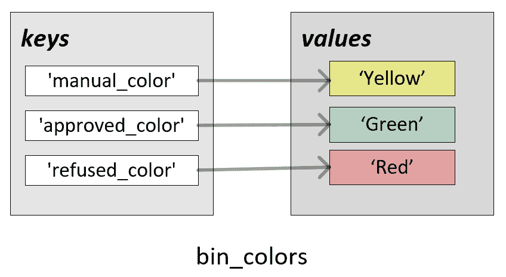
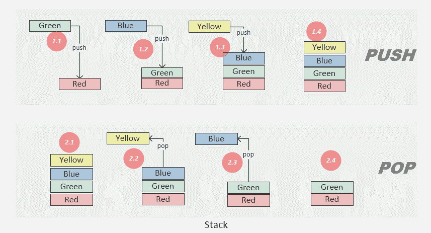

# 第二章：算法中使用的数据结构

算法需要必要的内存数据结构来在执行时保存临时数据。选择合适的数据结构对于它们的高效实现至关重要。某些类别的算法是递归或迭代的逻辑，并且需要专门为它们设计的数据结构。例如，如果使用嵌套数据结构，递归算法可能更容易实现，并表现出更好的性能。在本章中，数据结构是在算法的上下文中讨论的。由于本书中使用 Python，本章重点介绍 Python 数据结构，但本章中提出的概念也可以用于其他语言，如 Java 和 C++。

在本章结束时，您应该能够理解 Python 如何处理复杂的数据结构，以及应该为某种类型的数据使用哪种数据结构。

因此，以下是本章讨论的主要要点：

+   在 Python 中探索数据结构

+   探索抽象数据类型

+   栈和队列

+   树

# 在 Python 中探索数据结构

在任何语言中，数据结构都用于存储和操作复杂数据。在 Python 中，数据结构是存储容器，用于以高效的方式管理、组织和搜索数据。它们用于存储一组称为*集合*的数据元素，这些元素需要一起存储和处理。在 Python 中，有五种不同的数据结构可以用来存储集合：

+   **列表**：有序的可变元素序列

+   **元组**：有序的不可变元素序列

+   **集合**：无序的元素集合

+   **字典**：无序的键-值对集合

+   **数据框**：用于存储二维数据的二维结构

让我们在接下来的小节中更详细地了解它们。

# 列表

在 Python 中，列表是用于存储可变序列元素的主要数据结构。存储在列表中的数据元素的序列不一定是相同类型的。

要创建一个列表，数据元素需要用[ ]括起来，并用逗号分隔。例如，以下代码创建了四个不同类型的数据元素：

```py
>>> aList = ["John", 33,"Toronto", True]
>>> print(aList)
*['John', 33, 'Toronto', True]Ex*
```

在 Python 中，列表是创建一维可写数据结构的方便方式，特别是在算法的不同内部阶段需要时。

# 使用列表

数据结构中的实用函数使它们非常有用，因为它们可以用来管理列表中的数据。

让我们看看如何使用它们：

+   **列表索引**：由于列表中元素的位置是确定的，索引可以用于获取特定位置的元素。以下代码演示了这个概念：

```py
>>> bin_colors=['Red','Green','Blue','Yellow']
>>> bin_colors[1]
*'Green'*
```

此代码创建的四个元素列表如下截图所示：


请注意，索引从 0 开始，因此第二个元素**Green**通过索引**1**检索，即`bin_color[1]`。

+   **列表切片**：通过指定索引范围来检索列表的子集称为**切片**。以下代码可用于创建列表的切片：

```py
>>> bin_colors=['Red','Green','Blue','Yellow']
>>> bin_colors[0:2] *['Red', 'Green']*
```

请注意，列表是 Python 中最受欢迎的单维数据结构之一。

在切片列表时，范围表示为：第一个数字（包括）和第二个数字（不包括）。例如，`bin_colors[0:2]`将包括`bin_color[0]`和`bin_color[1]`，但不包括`bin_color[2]`。在使用列表时，应该记住这一点，因为 Python 语言的一些用户抱怨这不是很直观。

让我们来看下面的代码片段：

```py
>>> bin_colors=['Red','Green','Blue','Yellow'] >>> bin_colors[2:]
*['Blue', 'Yellow']*
>>> bin_colors[:2]
*['Red', 'Green']*
```

如果未指定起始索引，则表示列表的开头，如果未指定结束索引，则表示列表的结尾。前面的代码实际上演示了这个概念。

+   **负索引**：在 Python 中，我们还有负索引，它们从列表的末尾开始计数。这在以下代码中得到了证明：

```py
>>> bin_colors=['Red','Green','Blue','Yellow'] >>> bin_colors[:-1]
*['Red', 'Green', 'Blue']*
>>> bin_colors[:-2]
*['Red', 'Green']*
>>> bin_colors[-2:-1]
*['Blue']*
```

请注意，当我们想要使用最后一个元素作为参考点而不是第一个元素时，负索引特别有用。

+   **嵌套**：列表的一个元素可以是简单数据类型或复杂数据类型。这允许在列表中进行嵌套。对于迭代和递归算法，这提供了重要的功能。

让我们来看下面的代码，这是一个列表中嵌套列表的例子（嵌套）：

```py
>>> a = [1,2,[100,200,300],6]
>>> max(a[2])
*300*
>>> a[2][1]
*200*
```

+   **迭代**：Python 允许使用`for`循环来迭代列表中的每个元素。这在下面的例子中进行了演示：

```py
>>> bin_colors=['Red','Green','Blue','Yellow']
>>> for aColor in bin_colors:
        print(aColor + " Square") Red Square
*Green Square
Blue Square
Yellow Square*
```

请注意，前面的代码会遍历列表并打印每个元素。

# Lambda 函数

有一堆可以用在列表上的 lambda 函数。它们在算法的上下文中特别重要，并且提供了即时创建函数的能力。有时，在文献中，它们也被称为*匿名函数*。本节演示了它们的用法：

+   **数据过滤**：要过滤数据，首先我们定义一个谓词，它是一个输入单个参数并返回布尔值的函数。下面的代码演示了它的用法：

```py
>>> list(filter(lambda x: x > 100, [-5, 200, 300, -10, 10, 1000]))
*[200, 300, 1000]*
```

请注意，在这段代码中，我们使用`lambda`函数来过滤列表，它指定了过滤的条件。过滤函数被设计用来根据定义的条件从序列中过滤元素。Python 中的过滤函数通常与`lambda`一起使用。除了列表，它还可以用来从元组或集合中过滤元素。对于前面的代码，定义的条件是`x > 100`。代码将遍历列表的所有元素，并过滤掉不符合这个条件的元素。

+   **数据转换**：可以使用`map()`函数来使用 lambda 函数进行数据转换。一个例子如下：

```py
>>> list(map(lambda x: x ** 2, [11, 22, 33, 44,55]))
*[121, 484, 1089, 1936, 3025]*
```

使用`map`函数与`lambda`函数提供了非常强大的功能。当与`map`函数一起使用时，`lambda`函数可以用来指定一个转换器，它转换给定序列的每个元素。在前面的代码中，转换器是乘以二。因此，我们使用`map`函数来将列表中的每个元素乘以二。

+   **数据聚合**：对于数据聚合，可以使用`reduce()`函数，它会递归地对列表的每个元素运行一对值的函数：

```py
from functools import reduce
def doSum(x1,x2):
    return x1+x2
x = reduce(doSum, [100, 122, 33, 4, 5, 6])
```

请注意，`reduce`函数需要一个数据聚合函数来进行定义。在前面的代码中，数据聚合函数是`functools`。它定义了如何聚合给定列表的项目。聚合将从前两个元素开始，并且结果将替换前两个元素。这个缩减的过程会重复，直到达到末尾，得到一个聚合的数字。`doSum`函数中的`x1`和`x2`代表每次迭代中的两个数字，而`doSum`代表它们的聚合标准。

前面的代码块会得到一个单一的值（为`270`）。

# range 函数

`range`函数可以用来轻松生成一个大量的数字列表。它用于自动填充列表中的数字序列。

`range`函数使用简单。我们可以通过指定列表中要包含的元素数量来使用它。默认情况下，它从零开始，每次增加一个：

```py
>>> x = range(6)
>>> x
[0,1,2,3,4,5]
```

我们还可以指定结束数字和步长：

```py
>>> oddNum = range(3,29,2)
>>> oddNum
*[3, 5, 7, 9, 11, 13, 15, 17, 19, 21, 23, 25, 27]*
```

前面的 range 函数将给我们从`3`到`29`的奇数。

# 列表的时间复杂度

列表各种函数的时间复杂度可以使用大 O 符号总结如下：

| 不同的方法 | 时间复杂度 |
| --- | --- |
| 插入一个元素 | O(1) |
| 删除一个元素 | O(n)（在最坏的情况下可能需要遍历整个列表） |
| 切片列表 | O(n) |
| 元素检索 | O(n) |
| 复制 | O(n) |

请注意，添加单个元素所需的时间与列表的大小无关。表中提到的其他操作取决于列表的大小。随着列表的大小变大，对性能的影响变得更加显著。

# 元组

可以用于存储集合的第二种数据结构是元组。与列表相反，元组是不可变（只读）的数据结构。元组由( )括起来的几个元素组成。

与列表一样，元组中的元素可以是不同类型的。它们还允许为其元素使用复杂数据类型。因此，可以在元组中创建一个元组，从而提供了创建嵌套数据结构的方法。在迭代和递归算法中，创建嵌套数据结构的能力尤其有用。

以下代码演示了如何创建元组：

```py
>>> bin_colors=('Red','Green','Blue','Yellow')
>>> bin_colors[1]
*'Green'*
>>> bin_colors[2:]
*('Blue', 'Yellow')*
>>> bin_colors[:-1]
*('Red', 'Green', 'Blue')*
# Nested Tuple Data structure
>>> a = (1,2,(100,200,300),6)
>>> max(a[2])
*300*
>>> a[2][1]
*200*
```

在可能的情况下，应优先选择不可变数据结构（如元组）而不是可变数据结构（如列表），因为性能更好。特别是在处理大数据时，不可变数据结构比可变数据结构要快得多。例如，更改列表中的数据元素的能力是有代价的，我们应该仔细分析是否真的需要这样做，这样我们可以将代码实现为只读元组，这将更快。

请注意，在上述代码中，`a[2]`指的是第三个元素，即一个元组`(100,200,300)`。`a[2][1]`指的是这个元组中的第二个元素，即`200`。

# 元组的时间复杂度

使用大 O 表示法，可以总结元组各种函数的时间复杂度如下：

| **函数** | **时间** **复杂度** |
| --- | --- |
| `Append` | O(1) |

请注意，`Append`是一个向已有元组的末尾添加元素的函数。其复杂度为 O(1)。

# 字典

以键值对的形式保存数据在分布式算法中尤为重要。在 Python 中，这些键值对的集合被存储为一种称为*字典*的数据结构。要创建字典，应选择一个最适合在整个数据处理过程中标识数据的属性作为键。值可以是任何类型的元素，例如数字或字符串。Python 还总是使用列表等复杂数据类型作为值。可以通过使用字典作为值的数据类型来创建嵌套字典。

要创建一个简单的字典，将键值对放在{ }中。例如，以下代码创建了一个由三个键值对组成的简单字典：

```py
>>> bin_colors ={
 "manual_color": "Yellow",
 "approved_color": "Green",
 "refused_color": "Red"
 }
>>> print(bin_colors) *{'manual_color': 'Yellow', 'approved_color': 'Green', 'refused_color': 'Red'}*
```

前面代码创建的三个键值对也在以下截图中说明：



现在，让我们看看如何检索和更新与键相关联的值：

1.  要检索与键关联的值，可以使用`get`函数，也可以使用键作为索引：

```py
>>> bin_colors.get('approved_color')
*'Green'* >>> bin_colors['approved_color']
*'Green'*
```

1.  要更新与键关联的值，请使用以下代码：

```py
>>> bin_colors['approved_color']="Purple"
>>> print(bin_colors) *{'manual_color': 'Yellow', 'approved_color': 'Purple', 'refused_color': 'Red'}*
```

请注意，前面的代码显示了如何更新与字典中特定键相关联的值。

# 字典的时间复杂度

以下表格给出了使用大 O 表示法的字典的时间复杂度：

| **字典** | **时间** **复杂度** |
| --- | --- |
| 获取值或键 | O(1) |
| 设置值或键 | O(1) |
| 复制字典 | O(n) |

从字典的复杂度分析中重要的一点是，获取或设置键值的时间与字典的大小完全独立。这意味着在大小为三的字典中添加键值对所需的时间与在大小为一百万的字典中添加键值对所需的时间相同。

# 集合

集合被定义为可以是不同类型的元素的集合。元素被包含在{ }中。例如，看一下以下代码块：

```py
>>> green = {'grass', 'leaves'}
>>> print(green)
{'grass', 'leaves'}
```

集合的定义特征是它只存储每个元素的不同值。如果我们尝试添加另一个冗余元素，它将忽略该元素，如下所示：

```py
>>> green = {'grass', 'leaves','leaves'}
>>> print(green)
*{'grass', 'leaves'}*
```

为了演示可以在集合上执行的操作类型，让我们定义两个集合：

+   一个名为 yellow 的集合，其中包含黄色的东西

+   另一个名为 red 的集合，其中包含红色的东西

请注意，这两个集合之间有一些共同之处。这两个集合及其关系可以用以下维恩图表示：

**

如果我们想要在 Python 中实现这两个集合，代码将如下所示：

```py
>>> yellow = *{'dandelions', 'fire hydrant', 'leaves'}
>>> red =* *{'fire hydrant', 'blood', 'rose', 'leaves'}*
```

现在，让我们考虑以下代码，演示了使用 Python 进行集合操作：

```py
>>> yellow|red
*{'dandelions', 'fire hydrant', 'blood', 'rose', 'leaves'}*
>>> yellow&red
*{'fire hydrant'}*
```

如前面的代码片段所示，Python 中的集合可以进行联合和交集等操作。正如我们所知，联合操作将合并两个集合的所有元素，而交集操作将给出两个集合之间的共同元素集合。请注意以下内容：

+   `yellow|red`用于获取前面两个定义的集合的并集。

+   `yellow&red`用于获取黄色和红色之间的重叠部分。

# 集合的时间复杂度分析

以下是集合的时间复杂度分析：

| **集合** | **复杂度** |
| --- | --- |
| 添加一个元素 | O(1) |
| 删除一个元素 | O(1) |
| 复制 | O(n) |

从集合的复杂度分析中重要的一点是，添加一个元素所需的时间完全独立于特定集合的大小。

# 数据框

数据框是一种用于存储 Python 的`pandas`包中可用的表格数据的数据结构。它是算法中最重要的数据结构之一，用于处理传统的结构化数据。让我们考虑以下表格：

| **id** | **name** | **age** | **decision** |
| --- | --- | --- | --- |
| 1 | 费尔斯 | 32 | 真 |
| 2 | 艾琳娜 | 23 | 假 |
| 3 | 史蒂文 | 40 | 真 |

现在，让我们使用数据框来表示这一点。

可以使用以下代码创建一个简单的数据框：

```py
>>> import pandas as pd
>>> df = pd.DataFrame([
...             ['1', 'Fares', 32, True],
...             ['2', 'Elena', 23, False],
...             ['3', 'Steven', 40, True]])
>>> df.columns = ['id', 'name', 'age', 'decision']
>>> df
 *id    name  age  decision
0  1   Fares   32      True
1  2   Elena   23     False
2  3  Steven   40      True*
```

请注意，在上述代码中，`df.column`是一个指定列名称的列表。

数据框也用于其他流行的语言和框架中来实现表格数据结构。例如 R 和 Apache Spark 框架。

# 数据框的术语

让我们来看一些在数据框的上下文中使用的术语：

+   **轴**：在 pandas 文档中，数据框的单个列或行称为一个轴。

+   **轴**：如果有多个轴，则将它们作为一个组称为轴。

+   **标签**：数据框允许使用所谓的标签对列和行进行命名。

# 创建数据框的子集

从根本上讲，有两种主要方法可以创建数据框的子集（假设子集的名称为`myDF`）：

+   列选择

+   行选择

让我们依次看一下。

# 列选择

在机器学习算法中，选择正确的特征集是一项重要的任务。在我们可能拥有的所有特征中，不一定所有特征在算法的特定阶段都是必需的。在 Python 中，通过列选择来实现特征选择，这在本节中有所解释。

可以按*名称*检索列，如下所示：

```py
>>> df[['name','age']]
 *name  age
0   Fares   32
1   Elena   23
2  Steven   40*
```

数据框中列的位置是确定的。可以按其位置检索列，如下所示：

```py
>>> df.iloc[:,3] 
*0 True*
*1 False*
*2 True*
```

请注意，在此代码中，我们正在检索数据框的前三行。

# 行选择

数据框中的每一行对应于问题空间中的一个数据点。如果我们想要创建问题空间中的数据元素的子集，我们需要执行行选择。可以使用以下两种方法之一来创建这个子集：

+   通过指定它们的位置

+   通过指定过滤器

可以按照其位置检索数据框的子集行，如下所示：

```py
>>> df.iloc[1:3,:]
 *id name age decision*
*1 2 Elena 23 False*
*2 3 Steven 40 True*
```

请注意，上述代码将返回数据框的前两行和所有列。

通过指定过滤器创建子集，我们需要使用一个或多个列来定义选择条件。例如，可以通过以下方法选择数据元素的子集：

```py
>>> df[df.age>30]
 *id    name  age  decision
0  1   Fares   32      True
2  3  Steven   40      True

**>>> df[(df.age<35)&(df.decision==True)]***  id   name  age  decision
0  1  Fares   32      True

```

请注意，此代码创建了满足过滤器中规定条件的行的子集。

# 矩阵

矩阵是一个具有固定列数和行数的二维数据结构。矩阵的每个元素可以通过其列和行来引用。

在 Python 中，可以使用`numpy`数组创建矩阵，如下代码所示：

```py
>>> myMatrix = np.array([[11, 12, 13], [21, 22, 23], [31, 32, 33]]) 
>>> print(myMatrix) 
*[[11 12 13]* 
*[21 22 23]* 
*[31 32 33]]*
>>> print(type(myMatrix))
*<class 'numpy.ndarray'>*
```

请注意，上述代码将创建一个具有三行三列的矩阵。

# 矩阵操作

矩阵数据操作有许多可用的操作。例如，让我们尝试转置上述矩阵。我们将使用`transpose()`函数，它将列转换为行，行转换为列：

```py
>>> myMatrix.transpose()
*array([[11, 21, 31],* 
 *[12, 22, 32],* 
 *[13, 23, 33]])*
```

请注意，矩阵操作在多媒体数据处理中经常使用。

现在我们已经了解了 Python 中的数据结构，让我们在下一节中转向抽象数据类型。

# 探索抽象数据类型

抽象，一般来说，是一个用于以其共同核心功能来定义复杂系统的概念。使用这个概念来创建通用数据结构，产生了**抽象数据类型**（**ADT**）。通过隐藏实现级别的细节并为用户提供一个通用的、与实现无关的数据结构，ADT 的使用创建了产生更简单和更清晰代码的算法。ADT 可以在任何编程语言中实现，如 C++、Java 和 Scala。在本节中，我们将使用 Python 来实现 ADT。让我们首先从向量开始。

# 向量

向量是一种用于存储数据的单维结构。它们是 Python 中最受欢迎的数据结构之一。在 Python 中有两种创建向量的方式如下：

+   使用 Python 列表：创建向量的最简单方法是使用 Python 列表，如下所示：

```py
>>> myVector = [22,33,44,55]
>>> print(myVector) 
*[22 33 44 55]*
>>> print(type(myVector))
*<class 'list'>*
```

请注意，此代码将创建一个包含四个元素的列表。

+   使用`numpy`数组：创建向量的另一种流行方法是使用 NumPy 数组，如下所示：

```py
>>> myVector = np.array([22,33,44,55]) 
>>> print(myVector) 
*[22 33 44 55]*
>>> print(type(myVector))
*<class 'numpy.ndarray'>*
```

请注意，我们在此代码中使用`np.array`创建了`myVector`。

在 Python 中，我们可以使用下划线表示整数以分隔部分。这样可以使它们更易读，减少出错的可能性。在处理大数字时尤其有用。因此，十亿可以表示为 a=1

# 堆栈

堆栈是一种线性数据结构，用于存储一维列表。它可以以**后进先出**（**LIFO**）或**先进后出**（**FILO**）的方式存储项目。堆栈的定义特征是元素的添加和移除方式。新元素被添加到一端，只能从该端移除一个元素。

以下是与堆栈相关的操作：

+   **isEmpty:** 如果堆栈为空则返回 true

+   **push:** 添加一个新元素

+   **pop**: 返回最近添加的元素并将其删除

以下图表显示了如何使用 push 和 pop 操作向堆栈添加和删除数据：



上图的顶部显示了使用 push 操作向堆栈添加项目。在步骤**1.1**、**1.2**和**1.3**中，push 操作被用于三次向堆栈添加三个元素。上图的底部用于从堆栈中检索存储的值。在步骤**2.2**和**2.3**中，pop 操作被用于以 LIFO 格式从堆栈中检索两个元素。

让我们在 Python 中创建一个名为`Stack`的类，我们将在其中定义与堆栈类相关的所有操作。该类的代码如下：

```py
class Stack:
     def __init__(self):
         self.items = []
     def isEmpty(self):
         return self.items == []
     def push(self, item):
         self.items.append(item)
     def pop(self):
         return self.items.pop()
     def peek(self):
         return self.items[len(self.items)-1]
     def size(self):
         return len(self.items)
```

要向堆栈推送四个元素，可以使用以下代码：


注意，上述代码创建了一个包含四个数据元素的堆栈。

# 堆栈的时间复杂度

让我们来看看堆栈的时间复杂度（使用大 O 表示法）：

| **操作** | **时间复杂度** |
| --- | --- |
| `push` | O(1) |
| `pop` | O(1) |
| `size` | O(1) |
| `peek` | O(1) |

需要注意的一点是，前面表中提到的四种操作的性能都不取决于栈的大小。

# 实际例子

栈在许多用例中用作数据结构。例如，当用户想要在 Web 浏览器中浏览历史记录时，这是一种 LIFO 数据访问模式，可以使用栈来存储历史记录。另一个例子是当用户想要在文字处理软件中执行“撤销”操作时。

# 队列

和栈一样，队列将*n*个元素存储在单维结构中。元素以**FIFO**格式添加和移除。队列的一端称为 *后端*，另一端称为 *前端*。当元素从前端移除时，该操作称为 *出队*。当元素在后端添加时，该操作称为 *入队*。

在下图中，顶部部分显示了入队操作。步骤 1.1，1.2 和 1.3 将三个元素添加到队列中，结果队列显示在 1.4 中。请注意，**黄色** 是 *后端*，**红色** 是 *前端*。

下图的底部部分显示了一个出队操作。步骤 2.2，2.3 和 2.4 依次从队列的前端一个接一个地移除元素：


前面图中显示的队列可以通过以下代码实现：

```py
class Queue(object):
   def __init__(self):
      self.items = []
   def isEmpty(self):
      return self.items == []
   def enqueue(self, item):
       self.items.insert(0,item)
   def dequeue(self):
      return self.items.pop()
   def size(self):
      return len(self.items)
```

让我们根据以下截图，按照前面的图示进行入队和出队操作：


请注意，前面的代码首先创建一个队列，然后将四个项目入队。

# 使用栈和队列的基本思想

让我们用一个类比来了解使用栈和队列的基本思想。假设我们有一张桌子，我们把我们从邮政服务收到的信放在上面，例如，加拿大邮件。我们堆积起来，直到有时间逐一打开和查看信件。有两种可能的做法：

+   我们把信放在一个栈里，每当我们收到一封新信时，我们把它放在栈的顶部。当我们想读一封信时，我们从顶部开始。这就是我们所说的 *栈*。请注意，最新的信件将位于顶部，并且将首先被处理。从列表顶部取出一封信称为 *弹出* 操作。每当有新信到达时，把它放在顶部称为 *推入* 操作。如果我们最终有一个相当大的栈，并且有大量信件不断到达，有可能我们永远没有机会到达等待我们的非常重要的信件。

+   我们把信放在一堆里，但我们想先处理最老的信：每次我们想看一个或多个信时，我们要确保先处理最老的那个。这就是我们所说的 *队列*。把一封信放到一堆里叫做 *入队* 操作。从一堆里取出一封信叫做 *出队* 操作。

# 树

在算法的上下文中，树是最有用的数据结构之一，因为它具有分层数据存储能力。在设计算法时，我们使用树来表示我们需要存储或处理的数据元素之间的分层关系。

让我们更深入地了解这个有趣且非常重要的数据结构。

每棵树都有一个有限的节点集，因此它有一个称为 *根* 的起始数据元素和一组由链接连接在一起的称为 *分支* 的节点。

# 术语

让我们来看一些与树数据结构相关的术语：

| 根节点 | 没有父节点的节点称为 *根* 节点。例如，在下图中，根节点是 **A**。在算法中，通常根节点保存树结构中最重要的值。 |
| --- | --- |
| 节点的级别 | 从根节点到节点的距离就是节点的级别。例如，在下图中，节点**D**，**E**和**F**的级别为 2。 |
| 兄弟节点 | 树中的两个节点如果在同一级别，则称为*兄弟节点*。例如，如果查看下图，节点**B**和**C**是兄弟节点。 |
| 子节点和父节点 | 如果节点**C**和节点**F**直接连接，并且节点**C**的级别低于节点**F**，那么节点**F**是节点**C**的子节点。反之，节点**C**是节点**F**的父节点。下图中的节点**C**和**F**展示了这种父子关系。 |
| 节点的度 | 节点的度是它拥有的子节点数量。例如，在下图中，节点**B**的度为 2。 |
| 树的度 | 树的度等于树的组成节点中可以找到的最大度。例如，下图中呈现的树的度为 2。 |
| 子树 | 树的子树是树的一部分，选择的节点是子树的根节点，所有子节点是树的节点。例如，在下图中呈现的树的节点**E**的子树包括节点**E**作为根节点和节点**G**和**H**作为两个子节点。 |
| 叶节点 | 树中没有子节点的节点称为*叶节点*。例如，在下图中，**D**，**G**，**H**和**F**是四个叶节点。 |
| 内部节点 | 既不是根节点也不是叶节点的任何节点都是内部节点。内部节点至少有一个父节点和至少一个子节点。 |

请注意，树是我们将在第六章中学习的网络或图的一种，*无监督机器学习算法*。对于图和网络分析，我们使用术语链接或边而不是分支。大多数其他术语保持不变。

# 树的类型

树有不同的类型，如下所述：

+   **二叉树：** 如果一棵树的度为 2，则称该树为*二叉树*。例如，下图中呈现的树是一棵二叉树，因为它的度为 2：


请注意，前图显示了一个有四个级别和八个节点的树。

+   **满树：** 所有节点的度都相同的树称为满树，其度将等于树的度。下图展示了前面讨论过的树的类型：


请注意，左侧的二叉树不是一棵满树，因为节点**C**的度为 1，而所有其他节点的度为 2。中间的树和左侧的树都是满树。

+   **完美树：** 完美树是一种特殊类型的满树，其中所有叶节点都在同一级别。例如，右侧的二叉树如前图所示是一棵完美的满树，因为所有叶节点都在同一级别，即**级别 2**。

+   **有序树：** 如果节点的子节点根据特定标准有序排列，那么树被称为*有序树*。例如，树可以按照从左到右的升序顺序进行排序，同一级别的节点在从左到右遍历时值会增加。

# 实际例子

树是一种主要的数据结构之一，在开发决策树中被使用，将在第七章 *传统监督学习算法*中讨论。由于其分层结构，它在与网络分析相关的算法中也很受欢迎，将在第六章 *无监督机器学习算法*中详细讨论。树还被用于各种搜索和排序算法，其中需要实现分而治之的策略。

# 摘要

在本章中，我们讨论了可以用来实现各种类型算法的数据结构。通过阅读本章，我期望你能够选择合适的数据结构来存储和处理算法的数据。你还应该能够理解我们选择对算法性能的影响。

下一章是关于排序和搜索算法，我们将在算法的实现中使用本章介绍的一些数据结构。
