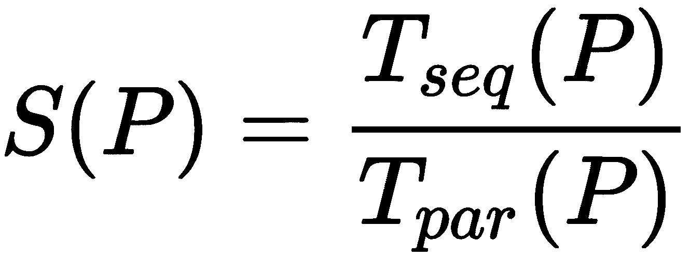
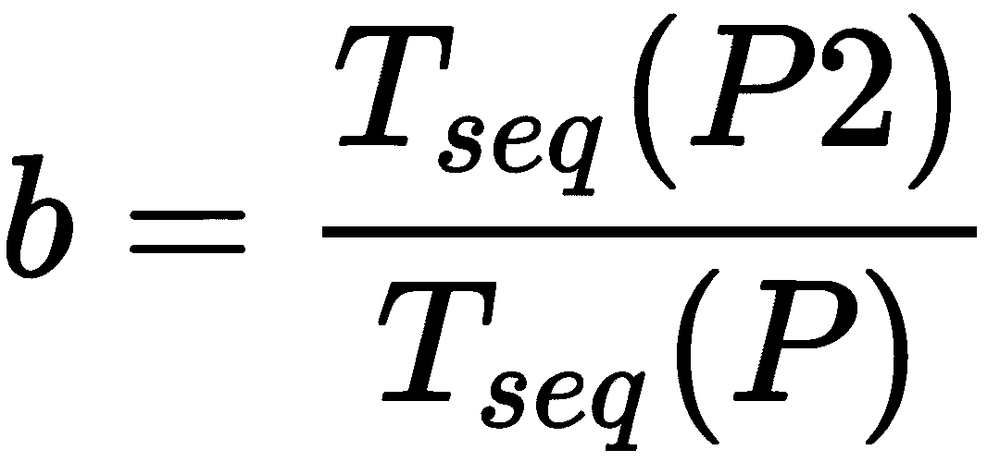
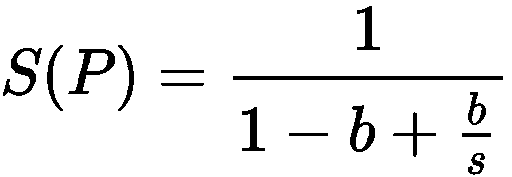
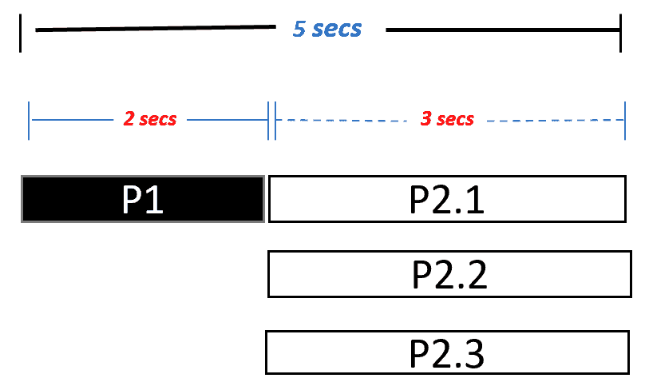
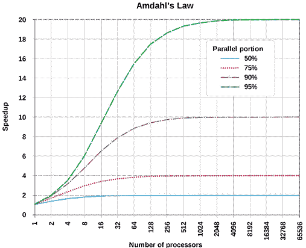
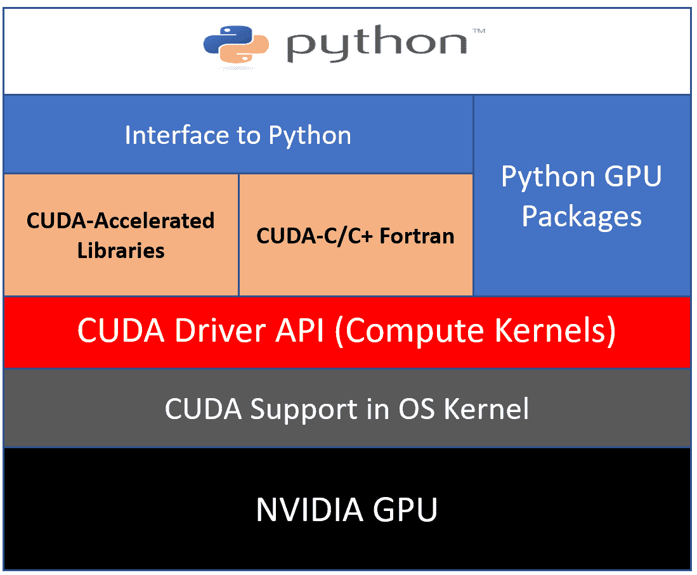
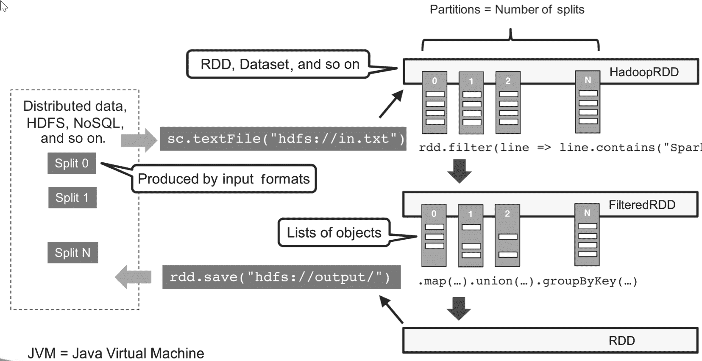
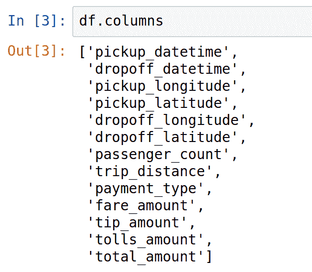
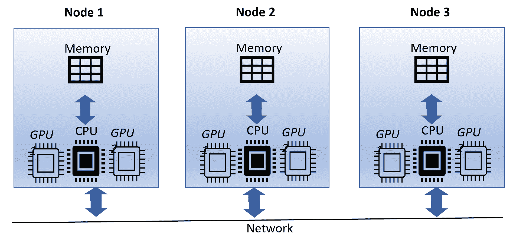

# 第十三章：大规模算法

大规模算法旨在解决庞大的复杂问题。大规模算法的特征是由于其数据规模和处理要求的缘故，需要多个执行引擎。本章首先讨论了什么类型的算法最适合并行运行。然后，讨论了与并行化算法相关的问题。接下来，介绍了**计算统一设备架构**（**CUDA**）架构，并讨论了如何使用单个**图形处理单元**（**GPU**）或一组 GPU 来加速算法。还讨论了需要对算法进行哪些更改才能有效利用 GPU 的性能。最后，本章讨论了集群计算，并讨论了 Apache Spark 如何创建**弹性分布式数据集**（**RDDs**）以创建标准算法的极快并行实现。

在本章结束时，您将能够理解与设计大规模算法相关的基本策略。

本章涵盖了以下主题：

+   大规模算法介绍

+   并行算法的设计

+   利用 GPU 的算法

+   利用集群计算理解算法

+   如何利用 GPU 运行大规模算法

+   如何利用集群的能力运行大规模算法

让我们从介绍开始。

# 大规模算法介绍

人类喜欢受到挑战。几个世纪以来，各种人类创新使我们能够以不同的方式解决真正复杂的问题。从预测蝗虫袭击的下一个目标区域到计算最大的质数，为我们周围的复杂问题提供答案的方法不断发展。随着计算机的出现，我们发现了一种强大的解决复杂算法的新方法。

# 定义良好的大规模算法

良好设计的大规模算法具有以下两个特征：

+   它旨在使用现有资源池最佳地处理大量数据和处理需求。

+   它是可扩展的。随着问题变得更加复杂，它可以通过提供更多资源来处理复杂性。

实现大规模算法的一种最实用的方法是使用分而治之的策略，即将较大的问题分解为可以独立解决的较小问题。

# 术语

让我们来看看一些用于量化大规模算法质量的术语。

# 延迟

延迟是执行单个计算所需的端到端时间。如果*Compute[1]*表示从*t[1]*开始到*t[2]*结束的单个计算，则我们可以说以下内容：

*延迟 = t[2]-t[1]*

# 吞吐量

在并行计算的背景下，吞吐量是可以同时执行的单个计算的数量。例如，如果在*t[1]*时，我们可以同时执行四个计算，*C[1]*，*C[2]*，*C[3]*和*C[4]*，那么吞吐量为四。

# 网络双分带宽

网络中两个相等部分之间的带宽称为**网络双分带宽**。对于分布式计算要有效工作，这是最重要的参数。如果我们没有足够的网络双分带宽，分布式计算中多个执行引擎的可用性带来的好处将被慢速通信链路所掩盖。

# 弹性

基础设施对突然增加的处理需求做出反应并通过提供更多资源来满足需求的能力称为弹性。

三大云计算巨头，谷歌、亚马逊和微软可以提供高度弹性的基础设施。由于它们共享资源池的巨大规模，很少有公司有潜力与这三家公司的基础设施弹性相匹敌。

如果基础设施是弹性的，它可以为问题创建可扩展的解决方案。

# 并行算法的设计

重要的是要注意，并行算法并不是万能的。即使设计最好的并行架构也可能无法达到我们期望的性能。广泛使用的一个定律来设计并行算法是安达尔定律。

# 安达尔定律

Gene Amdahl 是 20 世纪 60 年代研究并行处理的第一批人之一。他提出了安达尔定律，这个定律至今仍然适用，并可以成为理解设计并行计算解决方案时涉及的各种权衡的基础。安达尔定律可以解释如下：

它基于这样一个概念，即在任何计算过程中，并非所有过程都可以并行执行。将会有一个无法并行化的顺序部分。

让我们看一个具体的例子。假设我们想要读取存储在计算机上的大量文件，并使用这些文件中的数据训练机器学习模型。

整个过程称为 P。很明显，P 可以分为以下两个子过程：

+   *P1*：扫描目录中的文件，创建与输入文件匹配的文件名列表，并传递它。

+   *P2*：读取文件，创建数据处理管道，处理文件并训练模型。

# 进行顺序过程分析

运行*P*的时间由*T[seq]**(P)*表示。运行*P1*和*P2*的时间由*Tseq*和*Tseq*表示。很明显，当在单个节点上运行时，我们可以观察到两件事：

+   *P2*在*P1*完成之前无法开始运行。这由*P1* --> *P2*表示

+   *Tseq = Tseq + Tseq*

假设 P 在单个节点上运行需要 10 分钟。在这 10 分钟中，P1 需要 2 分钟运行，P2 需要 8 分钟在单个节点上运行。如下图所示：


现在要注意的重要事情是*P1*的性质是顺序的。我们不能通过并行化来加快它。另一方面，*P2*可以很容易地分成可以并行运行的并行子任务。因此，我们可以通过并行运行它来加快运行速度。

使用云计算的主要好处是拥有大量资源池，其中许多资源可以并行使用。使用这些资源解决问题的计划称为执行计划。安达尔定律被广泛用于识别给定问题和资源池的瓶颈。

# 进行并行执行分析

如果我们想要使用多个节点加速*P*，它只会影响*P2*，乘以一个大于 1 的因子*s>1*：


过程 P 的加速可以很容易地计算如下：



进程的可并行部分与其总体的比例由*b*表示，并计算如下：



例如，在前面的情景中，*b = 8/10 = 0.8*。

简化这些方程将给我们安达尔定律：



在这里，我们有以下内容：

+   *P*是整个过程。

+   *b*是*P*的可并行部分的比例。

+   *s*是在*P*的可并行部分实现的加速。

假设我们计划在三个并行节点上运行过程 P：

+   *P1*是顺序部分，不能通过使用并行节点来减少。它将保持在 2 秒。

+   *P2*现在需要 3 秒而不是 9 秒。

因此，*P*的总运行时间减少到 5 秒，如下图所示：



在前面的例子中，我们可以计算以下内容：

+   *n[p]* = 处理器的数量 = 3

+   *b* = 并行部分 = 9/11 = 81.81%

+   *s* = 速度提升 = 3

现在，让我们看一个典型的图表，解释阿姆达尔定律：



在前面的图表中，我们绘制了不同*b*值的*s*和*n*[*p*]之间的图表。

# 理解任务粒度

当我们并行化算法时，一个更大的任务被分成多个并行任务。确定任务应该被分成的最佳并行任务数量并不总是直截了当的。如果并行任务太少，我们将无法从并行计算中获得太多好处。如果任务太多，那么将会产生太多的开销。这也是一个被称为任务粒度的挑战。

# 负载平衡

在并行计算中，调度程序负责选择执行任务的资源。在没有实现最佳负载平衡的情况下，资源无法充分利用。

# 局部性问题

在并行处理中，应该避免数据的移动。在可能的情况下，应该在数据所在的节点上本地处理数据，否则会降低并行化的质量。

# 在 Python 中启用并发处理

在 Python 中启用并行处理的最简单方法是克隆一个当前进程，这将启动一个名为**子进程**的新并发进程。

Python 程序员，虽然不是生物学家，但已经创造了他们自己的克隆过程。就像克隆的羊一样，克隆副本是原始过程的精确副本。

# 制定多资源处理策略

最初，大规模算法是在称为**超级计算机**的巨大机器上运行的。这些超级计算机共享相同的内存空间。资源都是本地的——物理上放置在同一台机器上。这意味着各种处理器之间的通信非常快，它们能够通过共同的内存空间共享相同的变量。随着系统的发展和运行大规模算法的需求增长，超级计算机演变成了**分布式共享内存**（**DSM**），其中每个处理节点都拥有一部分物理内存。最终，发展出了松散耦合的集群，依赖处理节点之间的消息传递。对于大规模算法，我们需要找到多个并行运行的执行引擎来解决复杂的问题：


有三种策略可以拥有多个执行引擎：

+   **向内寻找**：利用计算机上已有的资源。使用 GPU 的数百个核心来运行大规模算法。

+   **向外寻找**：使用分布式计算来寻找更多的计算资源，这些资源可以共同用于解决手头的大规模问题。

+   **混合策略**：使用分布式计算，并在每个节点上使用 GPU 或 GPU 阵列来加速算法的运行。

# 介绍 CUDA

GPU 最初是为图形处理而设计的。它们被设计来满足处理典型计算机的多媒体数据的优化需求。为此，它们开发了一些特性，使它们与 CPU 有所不同。例如，它们有成千上万的核心，而 CPU 核心数量有限。它们的时钟速度比 CPU 慢得多。GPU 有自己的 DRAM。例如，Nvidia 的 RTX 2080 有 8GB 的 RAM。请注意，GPU 是专门的处理设备，没有通用处理单元的特性，包括中断或寻址设备的手段，例如键盘和鼠标。以下是 GPU 的架构：


GPU 成为主流后不久，数据科学家开始探索 GPU 在高效执行并行操作方面的潜力。由于典型的 GPU 具有数千个 ALU，它有潜力产生数千个并发进程。这使得 GPU 成为优化数据并行计算的架构。因此，能够执行并行计算的算法最适合于 GPU。例如，在视频中进行对象搜索，GPU 的速度至少比 CPU 快 20 倍。图算法在第五章 *图算法*中讨论过，已知在 GPU 上比在 CPU 上运行得快得多。

为了实现数据科学家充分利用 GPU 进行算法的梦想，Nvidia 在 2007 年创建了一个名为 CUDA 的开源框架，全称为 Compute Unified Device Architecture。CUDA 将 CPU 和 GPU 的工作抽象为主机和设备。主机，即 CPU，负责调用设备，即 GPU。CUDA 架构有各种抽象层，可以表示为以下形式：



请注意，CUDA 在 Nvidia 的 GPU 上运行。它需要在操作系统内核中得到支持。最近，Windows 现在也得到了全面支持。然后，我们有 CUDA Driver API，它充当编程语言 API 和 CUDA 驱动程序之间的桥梁。在顶层，我们支持 C、C+和 Python。

# 在 CUDA 上设计并行算法

让我们更深入地了解 GPU 如何加速某些处理操作。我们知道，CPU 设计用于顺序执行数据，这导致某些类别的应用程序运行时间显著增加。让我们以处理尺寸为 1,920 x 1,200 的图像为例。可以计算出有 2,204,000 个像素需要处理。顺序处理意味着在传统 CPU 上处理它们需要很长时间。像 Nvidia 的 Tesla 这样的现代 GPU 能够产生惊人数量的 2,204,000 个并行线程来处理像素。对于大多数多媒体应用程序，像素可以独立地进行处理，并且会实现显著加速。如果我们将每个像素映射为一个线程，它们都可以在 O(1)常数时间内进行处理。

但图像处理并不是唯一可以利用数据并行性加速处理的应用。数据并行性可以用于为机器学习库准备数据。事实上，GPU 可以大大减少可并行化算法的执行时间，包括以下内容：

+   为比特币挖矿

+   大规模模拟

+   DNA 分析

+   视频和照片分析

GPU 不适用于**单程序，多数据**（**SPMD**）。例如，如果我们想要计算一块数据的哈希值，这是一个无法并行运行的单个程序。在这种情况下，GPU 的性能会较慢。

我们想要在 GPU 上运行的代码使用特殊的 CUDA 关键字标记为**内核**。这些内核用于标记我们打算在 GPU 上并行处理的函数。基于这些内核，GPU 编译器分离出需要在 GPU 和 CPU 上运行的代码。

# 在 Python 中使用 GPU 进行数据处理

GPU 在多维数据结构的数据处理中非常出色。这些数据结构本质上是可并行化的。让我们看看如何在 Python 中使用 GPU 进行多维数据处理：

1.  首先，让我们导入所需的 Python 包：

```py
import numpy as np
import cupy as cp
import time
```

1.  我们将使用 NumPy 中的多维数组，这是一个传统的使用 CPU 的 Python 包。

1.  然后，我们使用 CuPy 数组创建一个多维数组，它使用 GPU。然后，我们将比较时间：

```py
### Running at CPU using Numpy
start_time = time.time()
myvar_cpu = np.ones((800,800,800))
end_time = time.time()
print(end_time - start_time)

### Running at GPU using CuPy
start_time = time.time()
myvar_gpu = cp.ones((800,800,800))
cp.cuda.Stream.null.synchronize()
end_time = time.time()
print(end_time - start_time)
```

如果我们运行这段代码，它将生成以下输出：


请注意，使用 NumPy 创建此数组大约需要 1.13 秒，而使用 CuPy 只需要大约 0.012 秒，这使得在 GPU 中初始化此数组的速度快了 92 倍。

# 集群计算

集群计算是实现大规模算法并行处理的一种方式。在集群计算中，我们有多个通过高速网络连接的节点。大规模算法被提交为作业。每个作业被分成各种任务，并且每个任务在单独的节点上运行。

Apache Spark 是实现集群计算的最流行方式之一。在 Apache Spark 中，数据被转换为分布式容错数据集，称为**Resilient Distributed Datasets**（**RDDs**）。RDDs 是 Apache Spark 的核心抽象。它们是不可变的元素集合，可以并行操作。它们被分割成分区，并分布在节点之间，如下所示：



通过这种并行数据结构，我们可以并行运行算法。

# 在 Apache Spark 中实现数据处理

让我们看看如何在 Apache Spark 中创建 RDD 并在整个集群上运行分布式处理：

1.  为此，首先，我们需要创建一个新的 Spark 会话，如下所示：

```py
from pyspark.sql import SparkSession
spark = SparkSession.builder.appName('cloudanum').getOrCreate()
```

1.  一旦我们创建了一个 Spark 会话，我们就可以使用 CSV 文件作为 RDD 的来源。然后，我们将运行以下函数-它将创建一个被抽象为名为`df`的 DataFrame 的 RDD。在 Spark 2.0 中添加了将 RDD 抽象为 DataFrame 的功能，这使得处理数据变得更加容易：

```py
df = spark.read.csv('taxi2.csv',inferSchema=True,header=True)
```

让我们来看看 DataFrame 的列：



1.  接下来，我们可以从 DataFrame 创建一个临时表，如下所示：

```py
df.createOrReplaceTempView("main")
```

1.  一旦临时表创建完成，我们就可以运行 SQL 语句来处理数据：


需要注意的重要一点是，尽管它看起来像一个常规的 DataFrame，但它只是一个高级数据结构。在幕后，它是将数据分布到整个集群的 RDD。同样，当我们运行 SQL 函数时，在幕后，它们被转换为并行转换器和减少器，并充分利用集群的能力来处理代码。

# 混合策略

越来越多的人开始使用云计算来运行大规模算法。这为我们提供了结合*向外看*和*向内看*策略的机会。这可以通过在多个虚拟机中配置一个或多个 GPU 来实现，如下面的屏幕截图所示：



充分利用混合架构是一项非常重要的任务。首先将数据分成多个分区。在每个节点上并行化需要较少数据的计算密集型任务在 GPU 上进行。

# 总结

在本章中，我们研究了并行算法的设计以及大规模算法的设计问题。我们研究了使用并行计算和 GPU 来实现大规模算法。我们还研究了如何使用 Spark 集群来实现大规模算法。

在本章中，我们了解了与大规模算法相关的问题。我们研究了与并行化算法相关的问题以及在此过程中可能产生的潜在瓶颈。

在下一章中，我们将探讨实现算法的一些实际方面。
