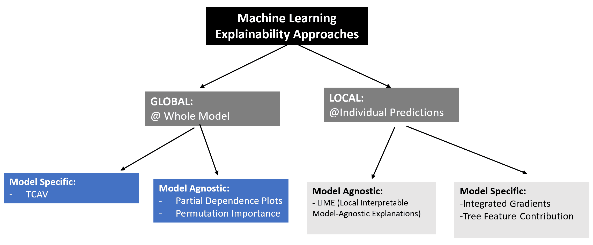
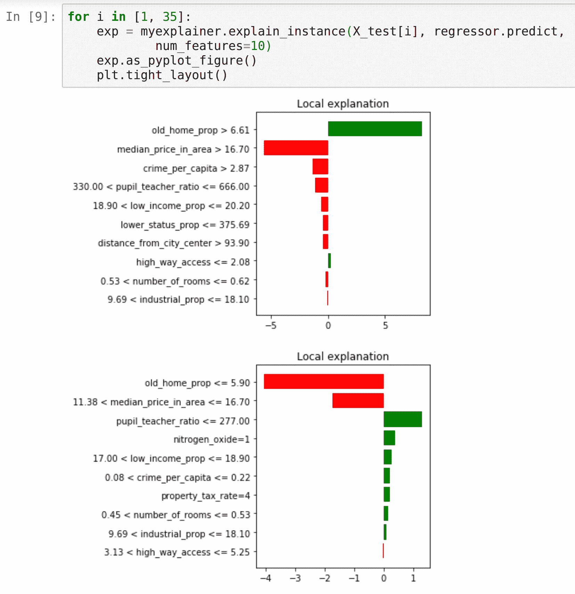

# 第十四章：实际考虑

本书中介绍的一堆算法可以用于解决现实世界问题。本章是关于本书中介绍的算法的一些实际考虑。

本章的组织如下。我们将从介绍开始。然后，我们将介绍算法可解释性的重要主题，即算法内部机制能否以可理解的方式解释的程度。接下来，我们将介绍使用算法的道德和在实施时可能产生偏见的可能性。然后讨论处理 NP 难问题的技术。最后，我们将探讨在选择算法之前应考虑的因素。

在本章结束时，您将了解在使用算法时需要牢记的实际考虑。

在本章中，我们将涵盖以下主题：

+   介绍实际考虑

+   算法的可解释性

+   理解伦理和算法

+   减少模型中的偏见

+   解决 NP 难问题

+   何时使用算法

让我们从介绍开始，

# 介绍实际考虑

除了设计、开发和测试算法外，在许多情况下，考虑开始依赖机器解决现实世界问题的某些实际方面也很重要，因为这会使解决方案更有用。对于某些算法，我们可能需要考虑可靠地整合预计会在部署算法后继续变化的新重要信息的方法。整合这些新信息会以任何方式改变我们经过良好测试的算法的质量吗？如果是，我们的设计如何处理？然后，对于一些使用全局模式的算法，我们可能需要关注捕捉全球地缘政治局势变化的实时参数。此外，在某些用例中，我们可能需要考虑在使用时强制执行的监管政策，以使解决方案有用。

当我们使用算法解决现实世界问题时，我们在某种程度上依赖机器进行问题解决。即使是最复杂的算法也是基于简化和假设的，并且无法处理意外情况。我们甚至还远远没有完全将关键决策交给我们设计的算法。

例如，谷歌设计的推荐引擎算法最近面临欧盟的监管限制，原因是隐私问题。这些算法可能是其领域中最先进的。但如果被禁止，这些算法实际上可能会变得无用，因为它们无法用于解决它们本应解决的问题。

事实上，不幸的是，算法的实际考虑仍然是在初始设计阶段通常不考虑的事后想法。对于许多用例来说，一旦算法部署并且提供解决方案的短期激动感过去后，使用算法的实际方面和影响将随着时间的推移被发现，并将定义项目的成功或失败。

让我们看一个实际例子，其中不注意实际考虑导致了一家世界顶尖 IT 公司设计的备受关注的项目失败。

# 一个 AI Twitter 机器人的悲伤故事

让我们来看看 Tay 的经典例子，它是微软于 2016 年创建的第一个 AI Twitter 机器人。由 AI 算法操作，Tay 应该从环境中学习并不断改进自己。不幸的是，在网络空间生活了几天后，Tay 开始从不断发出的种族主义和粗鲁的推文中学习。它很快开始发表冒犯性的推文。尽管它表现出了智能，并迅速学会根据实时事件创建定制推文，但同时，它严重冒犯了人们。微软将其下线并尝试重新调整，但没有成功。微软最终不得不终止该项目。这是一个雄心勃勃的项目的悲伤结局。

请注意，尽管微软内置的智能令人印象深刻，但该公司忽视了部署自学习 Twitter 机器人的实际影响。NLP 和机器学习算法可能是最好的，但由于明显的缺陷，这实际上是一个无用的项目。如今，Tay 已成为忽视允许算法在飞行中学习的实际影响而导致失败的典型案例。Tay 的失败所带来的教训肯定影响了后来几年的 AI 项目。数据科学家也开始更加关注算法的透明度。这将引出下一个主题，探讨使算法透明的需求和方法。

# 算法的可解释性

黑匣子算法是指其逻辑由于复杂性或逻辑以混乱的方式表示而无法被人类解释的算法。另一方面，白匣子算法是指其逻辑对人类可见和可理解的算法。换句话说，可解释性帮助人类大脑理解算法为何给出特定结果。可解释性的程度是特定算法对人类大脑可理解的程度。许多类别的算法，特别是与机器学习相关的算法，被归类为黑匣子。如果算法用于关键决策，了解算法产生结果的原因可能很重要。将黑匣子算法转换为白匣子算法还可以更好地了解模型的内部工作。可解释的算法将指导医生哪些特征实际上被用来将患者分类为患病或非患病。如果医生对结果有任何疑问，他们可以回头检查这些特定特征的准确性。

# 机器学习算法和可解释性

算法的可解释性对于机器学习算法非常重要。在许多机器学习应用中，用户被要求相信模型能帮助他们做出决策。在这种情况下，可解释性在需要时提供透明度。

让我们深入研究一个具体的例子。假设我们想使用机器学习来预测波士顿地区房屋价格，基于它们的特征。还假设当地的城市法规只允许我们使用机器学习算法，只要我们能在需要时提供任何预测的详细信息来进行辩解。这些信息是为了审计目的，以确保房地产市场的某些部分不会被人为操纵。使我们的训练模型可解释将提供这些额外信息。

让我们看看实现我们训练模型可解释性的不同选项。

# 提供可解释性策略

对于机器学习，基本上有两种策略可以为算法提供可解释性：

+   全球可解释性策略：这是为了提供模型整体的制定细节。

+   **局部可解释性策略：** 这是为我们训练模型所做的一个或多个个体预测提供理由。

对于全局可解释性，我们有诸如**概念激活向量测试**（**TCAV**）之类的技术，用于为图像分类模型提供可解释性。TCAV 依赖于计算方向导数来量化用户定义的概念与图片分类之间的关系程度。例如，它将量化将一个人分类为男性的预测对图片中面部毛发的敏感程度。还有其他全局可解释性策略，如**部分依赖图**和计算**排列重要性**，可以帮助解释我们训练模型中的公式。全局和局部可解释性策略都可以是特定于模型的或模型不可知的。特定于模型的策略适用于某些类型的模型，而模型不可知的策略可以应用于各种模型。

以下图表总结了机器学习可解释性的不同策略：



现在，让我们看看如何使用这些策略之一来实施可解释性。

# 实施可解释性

**局部可解释模型不可知解释**（**LIME**）是一种模型不可知的方法，可以解释训练模型所做的个体预测。作为模型不可知，它可以解释大多数类型的训练机器学习模型的预测。

LIME 通过对每个实例的输入进行微小更改来解释决策。它可以收集该实例的局部决策边界的影响。它迭代循环以提供每个变量的详细信息。通过查看输出，我们可以看到哪个变量对该实例的影响最大。

让我们看看如何使用 LIME 使我们的房价模型的个体预测变得可解释：

1.  如果您以前从未使用过 LIME，您需要使用`pip`安装该软件包：

```py
!pip install lime
```

1.  然后，让我们导入我们需要的 Python 软件包：

```py
import sklearn as sk
import numpy as np
from lime.lime_tabular import LimeTabularExplainer as ex
```

1.  我们将训练一个能够预测特定城市房价的模型。为此，我们将首先导入存储在`housing.pkl`文件中的数据集。然后，我们将探索它具有的功能：


基于这些功能，我们需要预测房屋的价格。

1.  现在，让我们训练模型。我们将使用随机森林回归器来训练模型。首先，我们将数据分为测试和训练分区，然后使用它来训练模型：

```py
from sklearn.ensemble import RandomForestRegressor
X_train, X_test, y_train, y_test = sklearn.model_selection.train_test_split(
    housing.data, housing.target)

regressor = RandomForestRegressor()
regressor.fit(X_train, y_train)
```

1.  接下来，让我们识别类别列：

```py
cat_col = [i for i, col in enumerate(housing.data.T)
                        if np.unique(col).size < 10]
```

1.  现在，让我们使用所需的配置参数实例化 LIME 解释器。请注意，我们正在指定我们的标签是`'price'`，表示波士顿房屋的价格：

```py
myexplainer = ex(X_train,
    feature_names=housing.feature_names,
    class_names=['price'],
    categorical_features=cat_col,
    mode='regression')
```

1.  让我们尝试查看预测的详细信息。首先让我们从 matplotlib 中导入绘图器。

```py
exp = myexplainer.explain_instance(X_test[25], regressor.predict,
        num_features=10)

exp.as_pyplot_figure()
from matplotlib import pyplot as plt
plt.tight_layout()
```

1.  由于 LIME 解释器适用于个体预测，我们需要选择要分析的预测。我们已要求解释器解释索引为`1`和`35`的预测的理由：



让我们尝试分析 LIME 的上述解释，它告诉我们以下内容：

+   个体预测中使用的功能列表：它们在前面的截图中显示在*y*轴上。

+   **决策中功能的相对重要性：** 条形的长度越长，重要性越大。数字的值在*x*轴上。

+   **每个输入功能对标签的正面或负面影响：** 红色条表示负面影响，绿色条表示特定功能的正面影响。

# 理解伦理和算法

通过算法制定模式可能会直接或间接导致不道德的决策。在设计算法时，很难预见潜在的道德影响的全部范围，特别是对于大规模算法，其中可能涉及多个用户。这使得分析人类主观性的影响变得更加困难。

越来越多的公司将算法的道德分析作为其设计的一部分。但事实是，问题可能直到我们发现一个有问题的用例才会变得明显。

# 学习算法存在的问题

能够根据不断变化的数据模式进行自我调整的算法被称为**学习算法**。它们处于实时学习模式，但这种实时学习能力可能具有道德影响。这可能导致它们的学习结果在道德上存在问题。由于它们被创建为处于持续进化阶段，几乎不可能对它们进行持续的道德分析。

随着算法复杂性的增加，要完全理解它们对社会中个人和群体的长期影响变得越来越困难。

# 理解道德考虑

算法解决方案是没有感情的数学公式。负责开发算法的人有责任确保它们符合我们试图解决的问题周围的道德敏感性。这些算法的道德考虑取决于算法的类型。

例如，让我们看看以下算法及其道德考虑。一些需要仔细考虑道德问题的强大算法的例子如下：

+   分类算法在社会上的使用决定了个人和群体的塑造和管理方式。

+   在推荐引擎中使用算法时，可以将简历与求职者（个人和群体）进行匹配。

+   数据挖掘算法用于从用户那里挖掘信息，并提供给决策者和政府。

+   政府开始使用机器学习算法来决定是否向申请人发放签证。

因此，算法的道德考虑将取决于使用情况以及它们直接或间接影响的实体。在开始使用算法进行关键决策之前，需要从道德角度进行仔细分析。在接下来的部分中，我们将看到在进行算法的仔细分析时应该牢记的因素。

# 不确定的证据

用于训练机器学习算法的数据可能没有确凿的证据。例如，在临床试验中，由于有限的可用证据，一种药物的有效性可能无法得到证实。同样，可能存在有限的不确定证据表明某个城市的某个邮政编码更有可能涉及欺诈。我们在基于通过这些有限数据找到的数学模式做出决策时应该谨慎。

基于不确定的证据做出的决定很可能导致不合理的行为。

# 可追溯性

机器学习算法在训练阶段和测试阶段之间的脱节意味着如果算法造成了一些伤害，很难追踪和调试。此外，当发现算法中存在问题时，很难确定受到影响的人。

# 误导的证据

算法是数据驱动的公式。**垃圾进，垃圾出**（**GIGO**）原则意味着算法的结果只能像其基础数据一样可靠。如果数据中存在偏见，它们也会反映在算法中。

# 不公平的结果

算法的使用可能会对已处于不利地位的脆弱社区和群体造成伤害。

此外，已经证明使用算法分配研究资金在多个场合上对男性人口存在偏见。用于授予移民的算法有时会无意中对脆弱人口群体存在偏见。

尽管使用高质量的数据和复杂的数学公式，如果结果是不公平的，那么整个努力可能会带来更多的伤害而不是好处。

# 减少模型中的偏见

在当前世界中，基于性别、种族和性取向已知的、有充分记录的一般偏见。这意味着我们收集的数据预计会展现出这些偏见，除非我们处理的是一个在收集数据之前已经努力消除这些偏见的环境。

算法中的所有偏见，直接或间接地都是由人类偏见造成的。人类偏见可以体现在算法使用的数据中，也可以体现在算法本身的制定中。对于遵循**CRISP-DM**（**跨行业标准流程**）生命周期的典型机器学习项目，该生命周期在第五章中有解释，*图算法*，偏见看起来像这样：


减少偏见最棘手的部分是首先识别和定位无意识的偏见。

# 解决 NP-hard 问题

NP-hard 问题在第四章中得到了广泛讨论，*设计算法*。一些 NP-hard 问题很重要，我们需要设计算法来解决它们。

如果由于其复杂性或可用资源的限制而发现解决 NP-hard 问题似乎是不可能的，我们可以采取以下其中一种方法：

+   简化问题

+   定制一个已知解决方案以解决类似问题

+   使用概率方法

让我们逐一看看它们。

# 简化问题

我们可以基于某些假设简化问题。解决的问题仍然给出的解决方案并不完美，但仍然具有洞察力和有用。为了使其起作用，所选择的假设应尽可能不受限制。

# 示例

在回归问题中，特征和标签之间的关系很少是完全线性的。但在我们通常的操作范围内可能是线性的。将关系近似为线性大大简化了算法，并且被广泛使用。但这也引入了一些影响算法准确性的近似。近似和准确性之间的权衡应该被仔细研究，并且应选择适合利益相关者的正确平衡。

# 定制一个已知解决方案以解决类似问题

如果已知类似问题的解决方案，那么可以将该解决方案用作起点。它可以定制以解决我们正在寻找的问题。机器学习中的**迁移学习**（**TL**）就是基于这一原则。其思想是使用已经预先训练的模型的推理作为训练算法的起点。

# 示例

假设我们想要训练一个二元分类器，它可以基于实时视频流使用计算机视觉在企业培训期间区分苹果和 Windows 笔记本电脑。从视频流中，模型开发的第一阶段将是检测不同的物体并确定哪些物体是笔记本电脑。一旦完成，我们可以进入第二阶段，制定可以区分苹果和 Windows 笔记本电脑的规则。

现在，已经有经过良好训练、经过充分测试的开源模型，可以处理这个模型训练的第一阶段。为什么不以它们作为起点，并将推理用于第二阶段，即区分 Windows 和苹果笔记本电脑？这将使我们有一个快速起步，解决方案在第一阶段已经经过充分测试，因此错误更少。

# 使用概率方法

我们使用概率方法来获得一个相当不错的解决方案，但并非最佳解决方案。当我们在第七章中使用决策树算法来解决给定问题时，解决方案是基于概率方法的。我们没有证明这是一个最佳解决方案，但它是一个相当不错的解决方案，可以为我们在需求定义中规定的约束条件下提供一个有用的答案。

# 例子

许多机器学习算法从一个随机解决方案开始，然后迭代地改进解决方案。最终的解决方案可能是有效的，但我们无法证明它是最好的。这种方法用于解决复杂问题，以在合理的时间范围内解决它们。这就是为什么对于许多机器学习算法来说，获得可重复的结果的唯一方法是使用相同的种子来使用相同的随机数序列。

# 何时使用算法

算法就像从业者工具箱中的工具。首先，我们需要了解在给定情况下哪种工具是最好的。有时，我们需要问自己，我们是否有解决问题的解决方案，以及部署解决方案的正确时间是什么。我们需要确定算法的使用是否能够提供一个实际有用的解决方案，而不是其他替代方案。我们需要分析使用算法的效果，从三个方面来看：

+   **成本**：能否证明与实施算法相关的成本？

+   **时间**：我们的解决方案是否比更简单的替代方案使整个过程更有效？

+   **准确性**：我们的解决方案是否比更简单的替代方案产生更准确的结果？

为了选择正确的算法，我们需要找到以下问题的答案：

+   我们是否可以通过做出假设来简化问题？

+   我们将如何评估我们的算法？关键指标是什么？

+   它将如何部署和使用？

+   它需要解释吗？

+   我们是否理解了三个重要的非功能性要求-安全性、性能和可用性？

+   是否有预期的截止日期？

# 一个实际的例子-黑天鹅事件

算法输入数据，处理并制定它，并解决问题。如果收集的数据是关于一个极具影响力且非常罕见的事件，我们如何使用由该事件生成的数据以及可能导致大爆炸的事件？让我们在本节中探讨这个方面。

纳西姆·塔勒布在他的 2001 年的书《被随机愚弄》中用黑天鹅事件的比喻来代表这些极其罕见的事件。

在黑天鹅首次在野外被发现之前，几个世纪以来，它们被用来代表不可能发生的事情。在它们被发现后，这个术语仍然很受欢迎，但它所代表的含义发生了变化。现在它代表着一些如此罕见以至于无法预测的事情。

塔勒布提供了将事件分类为黑天鹅事件的四个标准。

# 将事件分类为黑天鹅事件的四个标准

决定罕见事件是否应该被分类为黑天鹅事件有点棘手。一般来说，为了被归类为黑天鹅，它应该符合以下四个标准。

1.  首先，一旦事件发生，对观察者来说，它必须是一个令人震惊的惊喜，例如在广岛投下原子弹。

1.  事件应该是一场轰动一时的事件-一场颠覆性的重大事件，比如西班牙流感的爆发。

1.  一旦事件发生并尘埃落定，作为观察者群体的数据科学家应该意识到实际上这并不是那么令人惊讶。观察者们从未注意到一些重要的线索。如果他们有能力和主动性，黑天鹅事件本来是可以预测的。例如，西班牙流感爆发之前有一些被忽视的线索。此外，曼哈顿计划在原子弹实际投放广岛之前已经运行了多年。观察者群体只是无法将这些线索联系起来。

1.  当事件发生时，虽然黑天鹅事件的观察者们感到终身的惊讶，但也许有些人对他们来说根本不是什么惊讶。例如，多年来致力于开发原子弹的科学家们，使用原子能从未是一个惊讶，而是一个预期的事件。

# 将算法应用于黑天鹅事件

黑天鹅事件与算法相关的主要方面有：

+   有许多复杂的预测算法可用。但如果我们希望使用标准的预测技术来预测黑天鹅事件作为预防措施，那是行不通的。使用这种预测算法只会提供虚假的安全感。

+   一旦黑天鹅事件发生，通常不可能准确预测其对包括经济、公众和政府问题在内的更广泛社会领域的影响。首先，作为一种罕见事件，我们没有正确的数据来供给算法，也没有掌握我们可能从未探索和理解的更广泛社会领域之间的相关性和相互作用。

+   需要注意的一点是，黑天鹅事件并不是随机事件。我们只是没有能力关注最终导致这些事件发生的复杂事件。这是算法可以发挥重要作用的领域。我们应该确保在未来有一种策略来预测和检测这些小事件，这些事件随着时间的推移组合在一起产生了黑天鹅事件。

2020 年初的 COVID-19 爆发是我们这个时代最好的黑天鹅事件的例子。

前面的例子显示了首先考虑和理解我们试图解决的问题的细节，然后提出我们可以通过实施基于算法的解决方案来为解决方案做出贡献的重要性。没有全面的分析，如前所述，使用算法可能只能解决复杂问题的一部分，达不到预期。

# 总结

在本章中，我们了解了在设计算法时应考虑的实际方面。我们探讨了算法可解释性的概念以及我们可以在不同层面提供它的各种方式。我们还研究了算法中潜在的道德问题。最后，我们描述了在选择算法时要考虑的因素。

算法是我们今天所见证的新自动化世界中的引擎。了解、实验和理解使用算法的影响是很重要的。了解它们的优势和局限性以及使用算法的道德影响将在使这个世界成为一个更好的居住地方方面产生深远影响。这本书正是为了在这个不断变化和发展的世界中实现这一重要目标而做出的努力。
