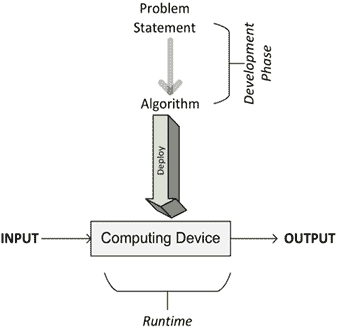
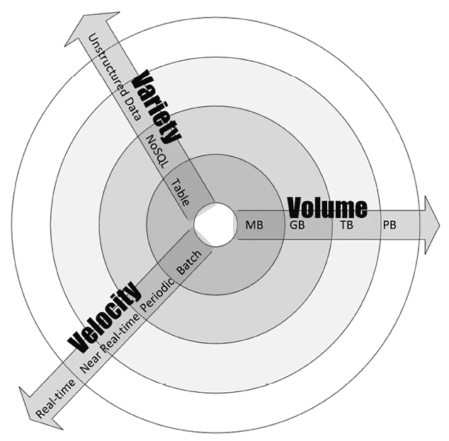
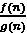
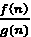
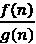
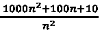
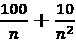
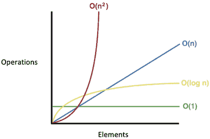
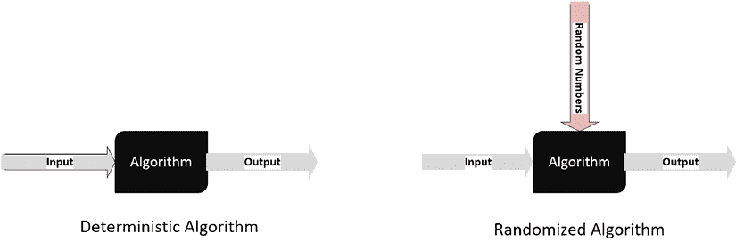

# 第一章：算法概述

> 必须亲眼看到算法，才能相信它。
> 
> – 唐纳德·克努斯

本书涵盖了理解、分类、选择和实现重要算法所需的信息。除了讲解算法的逻辑，本书还讨论了适用于不同类别算法的数据结构、开发环境和生产环境。这是本书的第二版，在这一版中，我们特别关注日益重要的现代机器学习算法。除了逻辑部分，本书还展示了使用算法解决实际日常问题的实际例子。

本章为算法的基础提供了深入的理解。首先介绍了理解不同算法工作原理所需的基本概念。为了提供历史视角，本节总结了人们如何开始使用算法来数学化某类问题。还提到了不同算法的局限性。接下来的部分解释了指定算法逻辑的各种方法。由于本书使用 Python 编写算法，因此解释了如何设置 Python 环境以运行示例。然后，讨论了如何量化和比较算法的性能与其他算法的不同方法。最后，本章讨论了验证算法特定实现的各种方式。

总结来说，本章涵盖了以下主要内容：

+   什么是算法？

+   算法的各个阶段

+   开发环境

+   算法设计技巧

+   性能分析

+   验证算法

# 什么是算法？

从最简单的角度看，算法是一组规则，用于执行某些计算以解决问题。它被设计为根据精确定义的指令，对任何有效的输入产生结果。如果你查阅字典（例如《美国传统词典》），它是这样定义算法的：

> 算法是一组有限的、不含歧义的指令，在给定一组初始条件下，按照规定的顺序执行，以实现特定目标，并且具有可识别的结束条件。

设计一个算法是努力以最有效的方式创建一个数学公式，能够有效地用于解决现实世界的问题。这个公式可以作为开发更具可重用性和通用性的数学解决方案的基础，应用于更广泛的类似问题。

## 算法的各个阶段

开发、部署并最终使用算法的不同阶段如*图 1.1*所示：



图 1.1：开发、部署和使用算法的不同阶段

正如我们所看到的，过程始于理解问题陈述中的需求，明确了需要做什么。一旦问题被清晰地陈述出来，就会引导我们进入开发阶段。

开发阶段包括两个阶段：

1.  **设计阶段**：在设计阶段，算法的架构、逻辑和实现细节被构思并记录下来。在设计算法时，我们始终考虑准确性和性能。在寻找给定问题的最佳解决方案时，通常会有多个候选算法可供选择。算法的设计阶段是一个迭代过程，涉及比较不同的候选算法。有些算法可能提供简单且快速的解决方案，但可能会牺牲准确性。其他算法可能非常准确，但由于其复杂性，运行时可能需要相当长的时间。一些复杂的算法可能比其他算法更高效。在做出选择之前，应该仔细研究所有候选算法的固有权衡。特别是对于复杂问题，设计一个高效的算法非常重要。正确设计的算法将提供一个高效的解决方案，能够同时提供令人满意的性能和合理的准确性。

1.  **编码阶段**：在编码阶段，设计好的算法被转换为计算机程序。计算机程序实现设计阶段提出的所有逻辑和架构是至关重要的。

商业问题的需求可以分为功能性需求和非功能性需求。直接指定解决方案预期特征的需求称为功能性需求。功能性需求详细说明了解决方案的预期行为。另一方面，非功能性需求关注算法的性能、可扩展性、可用性和准确性。非功能性需求还规定了数据安全性的期望。例如，假设我们需要为一家信用卡公司设计一个可以识别并标记欺诈交易的算法。这个例子中的功能性需求将通过提供给定一组输入数据的预期输出的详细信息，来指定有效解决方案的预期行为。在这种情况下，输入数据可能是交易的详细信息，而输出可能是一个二进制标志，用来标记交易是欺诈的还是非欺诈的。在这个例子中，非功能性需求可能会指定每个预测的响应时间。非功能性需求还会设置准确度的容许阈值。由于我们在这个例子中处理的是金融数据，因此与用户身份验证、授权和数据保密相关的安全需求也应该是非功能性需求的一部分。

请注意，功能性和非功能性需求的目标是精确定义*需要做什么*。设计解决方案是关于弄清楚*如何做*。实现设计是使用您选择的编程语言开发实际解决方案。设计一个完全满足功能性和非功能性需求的解决方案可能需要大量时间和精力。选择合适的编程语言和开发/生产环境可能取决于问题的需求。例如，由于 C/C++ 是比 Python 更低级的语言，因此对于需要编译代码和低级优化的算法，它可能是更好的选择。

一旦设计阶段完成且编码完成，算法就可以部署了。部署算法涉及设计实际的生产环境，其中代码将运行。生产环境的设计需要根据算法的数据和处理需求来进行。例如，对于可并行化的算法，需要一个适当数量计算节点的集群，以便高效执行算法。对于数据密集型算法，可能需要设计数据输入管道，以及缓存和存储数据的策略。生产环境的设计将在*第十五章*《大规模算法》和*第十六章*《实际考虑事项》中详细讨论。

一旦生产环境设计并实施完毕，算法就可以部署，算法将根据要求处理输入数据并生成输出。

## 开发环境

一旦设计完成，算法需要根据设计在编程语言中实现。对于本书，我们选择了 Python 作为编程语言。我们之所以选择它，是因为 Python 灵活且是开源编程语言。Python 也是您可以在各种云计算基础设施中使用的语言之一，如**Amazon Web Services**（**AWS**）、Microsoft Azure 和 **Google Cloud Platform**（**GCP**）。

官方 Python 首页可以通过[`www.python.org/`](https://www.python.org/)访问，页面上还有安装说明和有用的初学者指南。

为了更好地理解本书中呈现的概念，您需要具备基本的 Python 知识。

对于本书，我们建议使用最新版本的 Python 3。写作时，最新版本是 3.10，我们将使用这个版本来运行本书中的练习。

本书中我们将始终使用 Python。我们还将使用 Jupyter Notebook 来运行代码。本书的其余章节假设已安装 Python，并且 Jupyter Notebook 已正确配置并正在运行。

# Python 包

Python 是一种通用编程语言。它遵循“自带电池”（batteries included）的理念，这意味着有一个标准库可供使用，而无需用户下载单独的包。然而，标准库模块仅提供最低限度的功能。根据您正在处理的特定用例，可能需要安装额外的包。Python 包的官方第三方库称为 PyPI，代表 **Python 包索引**。它以源代码分发和预编译代码的形式托管 Python 包。目前，PyPI 上托管了超过 113,000 个 Python 包。安装额外包最简单的方式是通过 `pip` 包管理系统。`pip` 是一个典型的递归首字母缩略词，Python 文化中充斥着这样的词汇。`pip` 代表 **Pip Installs Python**。好消息是，从 Python 3.4 版本开始，`pip` 默认已安装。要检查 `pip` 的版本，可以在命令行输入：

```py
pip --version 
```

这个 `pip` 命令可用于安装额外的包：

```py
pip install PackageName 
```

已安装的包需要定期更新，以获得最新的功能。这可以通过使用 `upgrade` 标志来实现：

```py
pip install PackageName --upgrade 
```

并且可以安装特定版本的 Python 包：

```py
pip install PackageName==2.1 
```

添加正确的库和版本已成为设置 Python 编程环境的一部分。帮助维护这些库的一个功能是能够创建一个列出所有所需包的 requirements 文件。requirements 文件是一个简单的文本文件，包含库的名称及其相关版本。requirements 文件的示例如下所示：

`scikit-learn==0.24.1`

`tensorflow==2.5.0`

`tensorboard==2.5.0`

按惯例，`requirements.txt` 文件放置在项目的顶层目录中。

创建后，可以使用以下命令通过安装所有 Python 库及其相关版本来设置开发环境：

```py
pip install -r requirements.txt 
```

现在让我们来看看本书中将使用的主要包。

## SciPy 生态系统

**科学 Python**（**SciPy**）——发音为 sigh pie——是为科学社区创建的一组 Python 包。它包含许多功能，包括广泛的随机数生成器、线性代数例程和优化器。

SciPy 是一个全面的包，随着时间的推移，人们开发了许多扩展，以根据自己的需求定制和扩展该包。SciPy 性能良好，因为它作为围绕 C/C++ 或 Fortran 编写的优化代码的薄包装器。

以下是该生态系统中主要的包：

+   **NumPy**：对于算法来说，能够创建多维数据结构，如数组和矩阵，十分重要。NumPy 提供了一组数组和矩阵数据类型，对于统计学和数据分析非常重要。有关 NumPy 的详细信息，请访问 [`www.numpy.org/`](http://www.numpy.org/)。

+   **scikit-learn**：这个机器学习扩展是 SciPy 最受欢迎的扩展之一。Scikit-learn 提供了广泛的重要机器学习算法，包括分类、回归、聚类和模型验证。你可以在 [`scikit-learn.org/`](http://scikit-learn.org/) 上找到有关 scikit-learn 的更多详细信息。

+   **pandas**：pandas 包含了广泛用于输入、输出和处理表格数据的表格复杂数据结构，广泛应用于各种算法中。pandas 库包含了许多有用的函数，同时也提供了高度优化的性能。有关 pandas 的更多信息，请访问 [`pandas.pydata.org/`](http://pandas.pydata.org/)。

+   **Matplotlib**：Matplotlib 提供了创建强大可视化工具的功能。数据可以以折线图、散点图、条形图、直方图、饼图等形式呈现。有关更多信息，请访问 [`matplotlib.org/`](https://matplotlib.org/)。

### 使用 Jupyter Notebook

我们将使用 Jupyter Notebook 和 Google 的 Colaboratory 作为 IDE。有关 Jupyter Notebook 和 Colab 设置和使用的更多信息，请参见 *附录 A* 和 *B*。

# 算法设计技术

算法是解决实际问题的数学方法。在设计算法时，我们在设计和调优算法的过程中会考虑以下三个设计问题：

+   **问题 1**：这个算法是否生成了我们预期的结果？

+   **问题 2**：这是获取这些结果的最优方式吗？

+   **问题 3**：这个算法在更大数据集上的表现如何？

在设计解决方案之前，理解问题本身的复杂性非常重要。例如，如果我们根据问题的需求和复杂性来描述它，这将有助于我们设计合适的解决方案。

一般来说，算法可以根据问题的特征分为以下几种类型：

+   **数据密集型算法**：数据密集型算法旨在处理大量数据。它们预计具有相对简单的处理要求。应用于大型文件的压缩算法就是数据密集型算法的一个很好的例子。对于这类算法，数据的大小预计将远大于处理引擎的内存（单个节点或集群），并且可能需要开发一种迭代处理设计，以根据要求高效地处理数据。

+   **计算密集型算法**：计算密集型算法有相当大的处理需求，但不涉及大量数据。一个简单的例子是寻找一个非常大的素数。找到一种策略，将算法划分为不同的阶段，以便至少一些阶段可以并行处理，是最大化算法性能的关键。

+   **数据和计算密集型算法**：有些算法处理大量数据并且计算需求也很大。用于对实时视频流进行情感分析的算法就是一个很好的例子，其中数据和处理需求都非常庞大，完成任务所需的资源也很大。这类算法是最消耗资源的算法，需要仔细设计算法并智能地分配可用资源。

为了描述问题的复杂性和需求，深入研究它的数据和计算维度会有所帮助，我们将在接下来的章节中进行讨论。

## 数据维度

为了对问题的数据维度进行分类，我们查看其**数据量**、**速度**和**多样性**（即**3Vs**），定义如下：

+   **数据量**：数据量是算法处理的数据的预期大小。

+   **速度**：速度是算法使用时新数据生成的预期速率。它可以为零。

+   **多样性**：多样性量化了设计的算法预期要处理的数据类型的数量。

*图 1.2*更详细地展示了数据的 3Vs。该图的中心显示了最简单的数据，具有小数据量、低多样性和低速度。随着我们远离中心，数据的复杂性增加，可能在三维中的一个或多个维度上增加。

例如，在速度维度上，我们有批处理过程作为最简单的，其次是周期性过程，然后是近实时过程。最后，我们有实时过程，这是在数据速度的背景下最复杂的处理方式。例如，一组监控摄像头收集的实时视频流将具有高数据量、高速度和高多样性，可能需要适当的设计来有效地存储和处理数据：



图 1.2：数据的 3Vs：数据量、速度和多样性

让我们考虑三个具有三种不同数据类型的用例示例：

+   首先，考虑一个简单的数据处理用例，其中输入数据是一个`.csv`文件。在这种情况下，数据的量、速度和多样性将较低。

+   其次，考虑一个用例，其中输入数据是一个安全监控摄像头的实时视频流。在这种情况下，数据的量、速度和多样性将非常高，设计算法时应考虑这一点。

+   第三，考虑典型传感器网络的使用案例。假设传感器网络的数据源是安装在一座大楼中的温度传感器网格。尽管生成的数据的速度通常非常高（因为新数据生成非常快），但数据量预期相对较低（因为每个数据元素通常只有 16 位长，包含 8 位测量值和 8 位元数据，如时间戳和地理坐标）。

以上三个示例的处理要求、存储需求和合适的软件栈选择都不相同，通常取决于数据源的体量、速度和多样性。将数据进行表征是设计算法的第一步，因此非常重要。

## 计算维度

为了表征计算维度，我们需要分析当前问题的处理需求。一个算法的处理需求决定了最适合的设计类型。例如，复杂算法通常需要大量的处理能力。对于这类算法，可能需要具有多节点并行架构。现代深度算法通常涉及大量的数值处理，可能需要 GPU 或 TUP 的计算能力，如*第十六章*、*实际考虑因素*中所讨论的。

# 性能分析

分析算法的性能是其设计的一个重要部分。估算算法性能的方式之一是分析其复杂度。

复杂度理论是研究算法复杂度的学科。为了有用，任何算法都应该具备三个关键特性：

+   **应该正确**：一个好的算法应该产生正确的结果。为了确认算法是否正确工作，需要进行广泛的测试，特别是测试边界情况。

+   **应该可理解**：一个好的算法应该是可理解的。如果一个算法过于复杂，无法在计算机上实现，那么它再好也没有用。

+   **应该高效**：一个好的算法应该是高效的。即使一个算法产生了正确的结果，如果它需要一千年才能完成，或者需要十亿 TB 的内存，那么它也没有多大帮助。

有两种可能的分析方法来量化算法的复杂度：

+   **空间复杂度分析**：估算执行算法所需的运行时内存需求。

+   **时间复杂度分析**：估算算法运行所需的时间。

让我们逐一研究：

## 空间复杂度分析

空间复杂度分析估算了算法处理输入数据时所需的内存量。在处理输入数据时，算法需要将瞬时临时数据结构存储在内存中。算法的设计方式会影响这些数据结构的数量、类型和大小。在分布式计算时代，随着需要处理的数据量越来越大，空间复杂度分析变得越来越重要。这些数据结构的大小、类型和数量将决定底层硬件的内存需求。现代分布式计算中使用的内存数据结构需要具备高效的资源分配机制，能够在算法的不同执行阶段意识到内存需求。复杂的算法往往是迭代式的。此类算法并不会一次性将所有信息加载到内存中，而是通过迭代逐步填充数据结构。为了计算空间复杂度，首先需要对我们计划使用的迭代算法类型进行分类。迭代算法可以使用以下三种类型的迭代：

+   **收敛迭代**：随着算法通过迭代进行，每次迭代中处理的数据量都会减少。换句话说，随着算法迭代的进行，空间复杂度逐渐降低。主要的挑战是处理初始迭代的空间复杂度。现代可扩展的云基础设施，如 AWS 和 Google Cloud，非常适合运行这类算法。

+   **发散迭代**：随着算法通过迭代进行，每次迭代中处理的数据量逐渐增加。随着空间复杂度随着算法迭代的推进而增加，重要的是设置约束条件，以防止系统变得不稳定。可以通过限制迭代次数和/或限制初始数据大小来设置这些约束条件。

+   **平面迭代**：随着算法通过迭代进行，每次迭代中处理的数据量保持不变。由于空间复杂度不发生变化，因此不需要基础设施的弹性。

计算空间复杂度时，我们需要关注最复杂的迭代之一。在许多算法中，随着我们逐步接近解决方案，所需的资源会逐渐减少。在这种情况下，初始迭代是最复杂的，可以帮助我们更好地估算空间复杂度。选择后，我们估算算法使用的总内存量，包括其瞬时数据结构、执行和输入值所占用的内存。这将帮助我们很好地估算算法的空间复杂度。

以下是最小化空间复杂度的指导原则：

+   在可能的情况下，尽量将算法设计为迭代式。

+   在设计迭代算法时，每当有选择时，应该优先选择更多的迭代次数而不是更少的迭代次数。细粒度的更多迭代预计会有较低的空间复杂度。

+   算法应该只将当前处理所需的信息加载到内存中，任何不需要的信息应当被清除出内存。

空间复杂度分析是高效设计算法的必要条件。如果在设计特定算法时没有进行适当的空间复杂度分析，可能会因为临时数据结构的内存不足而触发不必要的磁盘溢出，这可能会显著影响算法的性能和效率。

本章将深入探讨时间复杂度。空间复杂度将在*第十五章*《大规模算法》中更详细地讨论，其中我们将处理具有复杂运行时内存需求的大规模分布式算法。

## 时间复杂度分析

时间复杂度分析通过评估算法的结构，估算算法完成指定任务所需的时间。与空间复杂度不同，时间复杂度不依赖于算法运行的硬件。时间复杂度分析仅取决于算法本身的结构。时间复杂度分析的总体目标是尝试回答这两个重要问题：

+   这个算法能扩展吗？一个设计良好的算法应该能够充分利用云计算环境中现代弹性基础设施的优势。算法应当设计成能够利用更多的 CPU、处理核心、GPU 和内存。例如，用于训练机器学习模型的算法应当能够在更多的 CPU 可用时使用分布式训练。

这样的算法在执行过程中应当能够充分利用 GPU 和额外的内存（如果有的话）。

+   这个算法如何处理更大的数据集？

为了回答这些问题，我们需要确定当数据量增大时，算法的性能受到的影响，并确保算法的设计不仅要保证准确性，还要具有良好的扩展性。在当今“大数据”时代，算法的性能对大数据集来说变得越来越重要。

在许多情况下，我们可能有不止一种方法可以用来设计算法。在这种情况下，进行时间复杂度分析的目标将如下：

*“给定一个特定的问题，且有多个算法可供选择，哪个算法在时间效率方面最为高效？”*

计算算法时间复杂度有两种基本方法：

+   **后期实现的性能分析方法**：在这种方法中，首先实现不同的候选算法，并比较它们的性能。

+   **预实现理论方法**：在这种方法中，每个算法的性能在运行算法之前通过数学方法进行近似。

理论方法的优势在于它仅依赖于算法本身的结构。它不依赖于运行算法时将使用的实际硬件、运行时选择的软件栈，或实现算法所使用的编程语言。

## 估算性能

一个典型算法的性能将取决于输入数据的类型。例如，如果数据已经按照我们试图解决的问题的上下文进行了排序，那么算法可能会运行得非常快速。如果排序后的输入数据被用来基准测试该算法，那么它将给出一个不切实际的优异性能结果，这并不能真实反映其在大多数场景中的实际表现。为了处理算法对输入数据的依赖性，在进行性能分析时我们需要考虑不同的情况。

### 最佳情况

在最佳情况下，作为输入的数据已按算法能够提供最佳性能的方式进行组织。最佳情况分析给出性能的上界。

### 最坏情况

估算算法性能的第二种方法是尝试找出在给定条件下完成任务所需的最大时间。算法的最坏情况分析非常有用，因为我们可以保证无论条件如何，算法的性能总是优于我们分析中得出的数字。最坏情况分析对于估算处理复杂问题和大型数据集时的性能特别有用。最坏情况分析给出了算法性能的下界。

### 平均情况

这一方法首先将各种可能的输入划分为不同的组别。然后，从每个组别的一个代表性输入进行性能分析。最后，它计算每个组别性能的平均值。

平均情况分析并不总是准确的，因为它需要考虑所有不同的输入组合和可能性，这并不总是容易做到的。

## 大 O 符号

大 O 符号最早由巴赫曼（Bachmann）于 1894 年在一篇研究论文中提出，用于近似算法的增长。他写道：

“… 使用符号 *O(n)*，我们表示一种其相对于 *n* 的阶数不超过 *n* 阶数的量。”（巴赫曼 1894，p. 401）

大 O 符号提供了一种描述算法性能长期增长率的方式。简单来说，它告诉我们，随着输入规模的增加，算法的运行时间是如何增长的。我们可以通过两个函数 *f(n)* 和 *g(n)* 来进一步解释。如果我们说 *f* = *O(g)*，意思是当 n 趋向于无穷大时，比例  保持有限或有界。换句话说，无论我们的输入有多大，*f(n)* 的增长速度都不会比 *g(n)* 快得不成比例。

让我们看看一些特定的函数：

*f(n)* = 1000*n*² + 100*n* + 10

并且

*g(n)* = *n*²

请注意，当 *n* 趋近无穷大时，两个函数都会趋近无穷大。让我们通过应用定义来验证 *f* = *O(g)*。

首先，让我们计算 。

这将等于  =  = (1000 + )。

很明显， 是有界的，并且当 *n* 趋向无穷大时，它不会趋向于无穷大。

因此，*f(n)* = *O(g)* = *O(n*²*)*。

*(n*²*)* 表示该函数的复杂度随着输入 *n* 的平方而增加。如果我们将输入元素数量翻倍，那么复杂度预计会增加 4 倍。

处理大 O 符号时，请注意以下 4 个规则。

**规则 1**：

让我们看看算法中的循环复杂度。如果一个算法执行某一系列步骤 *n* 次，那么它的性能就是 *O(n)*。

**规则 2**：

让我们来分析算法中的嵌套循环。如果一个算法执行的某个函数有 *n*¹ 步，并且对于每次循环它执行另一个 *n*² 步的操作，那么该算法的总性能是 *O(n*¹ *× n*²*)*。

例如，如果一个算法有外循环和内循环，且都需要 *n* 步，那么该算法的复杂度将表示为：

*O(n*n)* = *O(n*²*)*

**规则 3**：

如果一个算法执行一个需要 *n*¹ 步的函数 *f(n)*，然后执行另一个需要 *n*² 步的函数 *g(n)*，则该算法的总性能是 *O(f(n)+g(n))*。

**规则 4**：

如果一个算法的复杂度是 *O(g(n) + h(n))*，并且在大 n 的情况下，函数 *g(n)* 大于 *h(n)*，那么该算法的性能可以简化为 *O(g(n))*。

这意味着 *O(1+n)* = *O(n)*。

并且 *O(n*²*+ n*³*)* = *O(n*²*)*。

**规则 5**：

计算算法的复杂度时，要忽略常数倍数。如果 *k* 是常数，*O(kf(n))* 等同于 *O(f(n))*。

同样，*O(f(k × n))* 等同于 *O(f(n))*。

因此，*O(5n*²*)* = *O(n*²*)*。

并且 *O((3n*²*))* = *O(n*²*)*。

请注意：

+   大 O 符号表示的复杂度仅为估算值。

+   对于较小规模的数据，我们不关心时间复杂度。图中的 *n*⁰ 定义了我们开始关注时间复杂度的阈值。阴影区域描述了我们感兴趣的区域，在这个区域内我们将分析时间复杂度。

+   *T(n)* 时间复杂度大于原始函数。一个好的 *T(n)* 选择会尽量为 *F(n)* 创建一个紧密的上界。

下表总结了本节中讨论的不同类型的大 O 符号：

| **复杂度类别** | **名称** | **示例操作** |
| --- | --- | --- |
| `O(1)` | 常数 | 添加、获取项、设置项。 |
| `O(logn)` | 对数 | 在已排序数组中查找一个元素。 |
| `O(n)` | 线性 | 复制、插入、删除、迭代 |
| `O(n²)` | 二次 | 嵌套循环 |

## 常数时间 (O(1)) 复杂度

如果一个算法的运行时间与输入数据的大小无关，始终相同，则称其为常数时间运行。它用 *O(1)* 表示。以访问数组中的 *n*^(th) 元素为例。无论数组的大小如何，获取结果所需的时间是常数时间。例如，以下函数将返回数组的第一个元素，并具有 *O(1)* 复杂度：

```py
def get_first(my_list):
    return my_list[0]
get_first([1, 2, 3]) 
```

```py
1 
```

```py
get_first([1, 2, 3, 4, 5, 6, 7, 8, 9, 10]) 
```

```py
1 
```

注意：

+   向栈中添加新元素是通过 `push` 操作完成的，而从栈中删除元素是通过 `pop` 操作完成的。无论栈的大小如何，添加或删除一个元素所需的时间是相同的。

+   当访问哈希表中的元素时，请注意，它是一种以关联格式存储数据的数据结构，通常为键值对。

## 线性时间 (O(n)) 复杂度

如果一个算法的执行时间与输入规模成正比，则称其为线性时间复杂度，表示为 *O(n)*。一个简单的例子是将一维数据结构中的元素相加：

```py
def get_sum(my_list):
    sum = 0
    for item in my_list:
        sum = sum + item
    return sum 
```

请注意算法的主循环。主循环中的迭代次数随着 *n* 值的增加而线性增长，产生如图所示的 *O(n)* 复杂度：

```py
get_sum([1, 2, 3]) 
```

```py
6 
```

```py
get_sum([1, 2, 3, 4]) 
```

```py
10 
```

其他一些数组操作的示例如下：

+   查找一个元素

+   查找数组中所有元素的最小值

## 二次时间 (O(n²)) 复杂度

如果一个算法的执行时间与输入规模的平方成正比，则称该算法的运行时间为二次时间；例如，一个简单的函数用于求和一个二维数组，如下所示：

```py
def get_sum(my_list):
    sum = 0
    for row in my_list:
        for item in row:
            sum += item
    return sum 
```

请注意，内层循环嵌套在另一个主循环内。这个嵌套循环使得前面的代码具有 *O(n²)* 的复杂度：

```py
get_sum([[1, 2], [3, 4]]) 
```

```py
10 
```

```py
get_sum([[1, 2, 3], [4, 5, 6]]) 
```

```py
21 
```

另一个例子是 *冒泡排序算法*（将在 *第二章*，*算法中的数据结构* 中讨论）。

## 对数时间 (O(logn)) 复杂度

如果一个算法的执行时间与输入大小的对数成正比，那么这个算法被称为对数时间算法。在每次迭代中，输入大小会按固定倍数减少。一个对数算法的例子是二分查找。二分查找算法用于在一维数据结构中查找特定元素，例如 Python 列表。数据结构中的元素需要按降序排序。二分查找算法在一个名为 `search_binary` 的函数中实现，如下所示：

```py
def search_binary(my_list, item):
    first = 0
    last = len(my_list)-1
    found_flag = False
    while(first <= last and not found_flag):
        mid = (first + last)//2
        if my_list[mid] == item:
            found_flag = True           
        else:
            if item < my_list[mid]:
                last = mid - 1
            else:
                first = mid + 1
    return found_flag
searchBinary([8,9,10,100,1000,2000,3000], 10) 
```

```py
True 
```

```py
searchBinary([8,9,10,100,1000,2000,3000], 5) 
```

```py
False 
```

主循环利用了列表已排序的事实。它每次迭代都将列表分成一半，直到找到结果。

在定义了这个函数之后，它在第 `11` 和第 `12` 行进行了测试，用于搜索特定元素。二分查找算法将在 *第三章*，*排序与查找算法* 中进一步讨论。

请注意，在展示的四种大 O 符号中，*O(n²)* 的性能最差，而 *O(logn)* 的性能最好。另一方面，*O(n²)* 不如 *O(n³)* 那么糟糕，但仍然，属于这个类别的算法无法处理大数据，因为时间复杂度限制了它们实际能够处理的数据量。四种大 O 符号的性能如 *图 1.3* 所示：



图 1.3：大 O 复杂度图表

降低算法复杂度的一种方法是牺牲其精确度，从而产生一种被称为 **近似算法** 的算法。

# 选择算法

如何知道哪种解决方案更好？如何知道哪个算法运行得更快？分析一个算法的时间复杂度可以回答这些问题。

为了看到算法的用途，让我们以一个简单的例子为例，目标是对数字列表进行排序。有许多现成的算法可以完成这个任务。问题是如何选择正确的算法。

首先可以观察到，如果列表中的数字不多，那么选择哪种算法来排序这些数字并不重要。因此，如果列表中只有 10 个数字（*n=10*），那么选择哪种算法并无太大关系，因为即使使用非常简单的算法，也可能只需要几微秒的时间。但随着 *n* 的增加，选择正确算法开始变得重要。一个设计不良的算法可能需要几个小时来运行，而一个设计良好的算法可能只需要几秒钟就能完成排序。因此，对于较大的输入数据集，花时间和精力进行性能分析，并选择合适设计的算法来高效地完成任务是非常有意义的。

# 验证算法

验证算法确认它实际上提供了我们尝试解决的问题的数学解决方案。验证过程应检查尽可能多的可能值和类型的输入值的结果。

## 精确、近似和随机化算法

验证算法也取决于算法的类型，因为测试技术是不同的。首先让我们区分确定性和随机化算法。

对于确定性算法，特定输入始终生成完全相同的输出。但对于某些类别的算法，随机数序列也被视为输入，这使得每次运行算法时输出都不同。详见第六章《无监督机器学习算法》中详细介绍的 k 均值聚类算法。



图 1.4: 确定性与随机化算法

根据用于简化逻辑以使其运行更快的假设或近似，算法还可以分为以下两种类型：

+   **一个精确算法**：精确算法预期能够在不引入任何假设或近似的情况下产生精确的解决方案。

+   **一个近似算法**：当问题复杂度超出给定资源的处理能力时，我们通过做一些假设来简化问题。基于这些简化或假设的算法称为近似算法，它们不能给出精确的解决方案。

让我们通过一个例子来理解精确算法和近似算法之间的区别——著名的旅行推销员问题，这个问题在 1930 年被提出。旅行推销员问题挑战你找出一个特定推销员访问每个城市（从城市列表中）并返回原点的最短路线，这也是他被称为旅行推销员的原因。首次尝试提供解决方案将包括生成所有城市的排列组合，并选择最便宜的城市组合。显然，当城市超过 30 个时，时间复杂度开始变得难以管理。

如果城市数量超过 30，减少复杂性的一种方法是引入一些近似和假设。

对于近似算法，重要的是在收集需求时设定准确性期望。验证近似算法涉及验证结果的误差是否在可接受范围内。

## 可解释性

当算法用于关键情况时，有必要能够解释每个结果背后的原因。这对确保基于算法结果的决策不引入偏见至关重要。

准确识别直接或间接用于做出特定决策的特征的能力称为算法的**可解释性**。当算法用于关键应用场景时，需要评估其偏见和偏袒。算法的伦理分析已经成为验证过程的标准部分，特别是那些涉及影响到人们生活决策的算法。

对于处理深度学习的算法来说，实现可解释性是困难的。例如，如果一个算法被用来拒绝某人的抵押贷款申请，那么拥有透明度和能够解释原因是非常重要的。

算法的可解释性是一个活跃的研究领域。最近开发的有效技术之一是**局部可解释模型无关解释**（**LIME**），这是在 2016 年**计算机协会**（**ACM**）的**知识发现与数据挖掘特别兴趣小组**（**SIGKDD**）国际会议的论文集中提出的。LIME 基于这样一个概念：对于每个实例，引入小的变化，然后努力映射该实例的局部决策边界。然后，它可以量化每个变量对该实例的影响。

# 小结

本章内容是学习算法的基础。首先，我们了解了开发算法的不同阶段。我们讨论了设计算法所需的不同方法，以明确算法的逻辑。接着，我们看了如何设计一个算法。我们学习了两种不同的分析算法性能的方法。最后，我们研究了验证算法的不同方面。

阅读完本章后，我们应该能够理解算法的伪代码。我们应该理解开发和部署算法的不同阶段。我们还学习了如何使用大 O 符号来评估算法的性能。

下一章将讨论算法中使用的数据结构。我们将从 Python 中的数据结构开始，接着探讨如何利用这些数据结构创建更复杂的数据结构，例如栈、队列和树，这些都是开发复杂算法所需要的。

# 在 Discord 上了解更多

要加入本书的 Discord 社区——在这里你可以分享反馈、向作者提问并了解新版本——请扫描下面的二维码：

[`packt.link/WHLel`](https://packt.link/WHLel)


