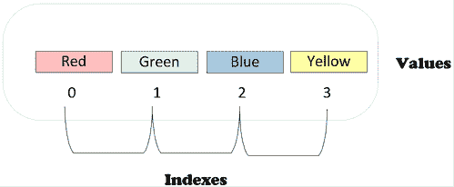
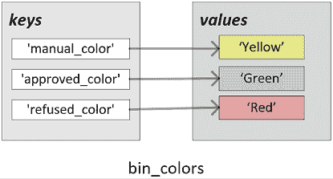
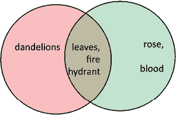
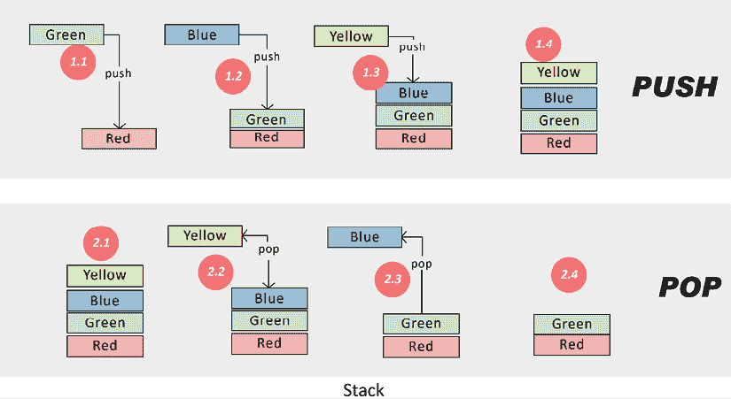
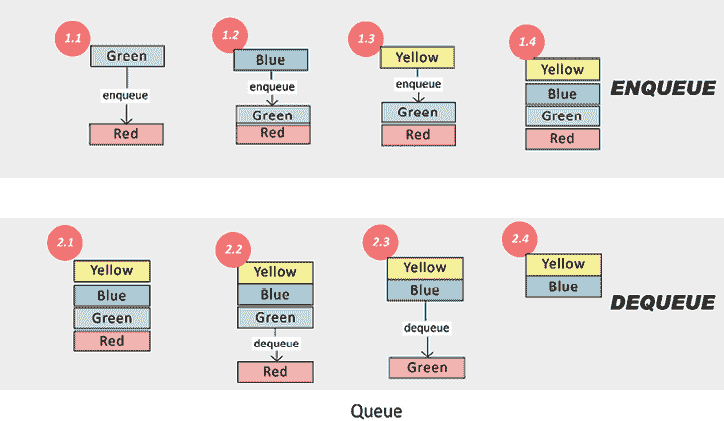
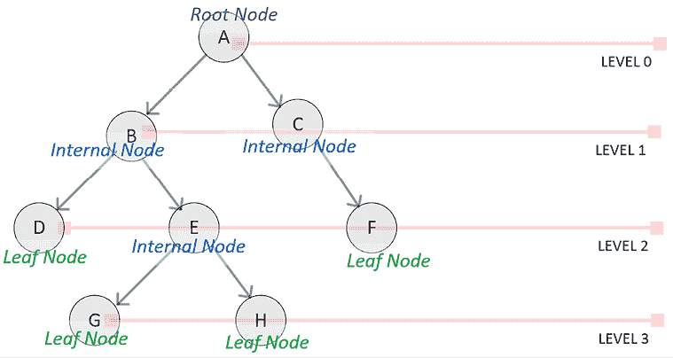
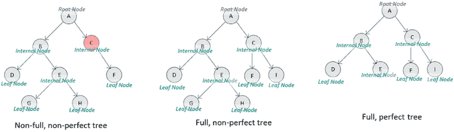

# 第二章：算法中使用的数据结构

算法在执行过程中需要内存数据结构来存储临时数据。选择合适的数据结构对于其高效实现至关重要。某些类别的算法逻辑是递归或迭代的，需要专门为它们设计的数据结构。例如，如果使用嵌套数据结构，递归算法可能会更容易实现，并展现更好的性能。本章讨论了数据结构在算法中的应用。由于本书使用 Python，因此本章重点介绍 Python 数据结构，但本章中介绍的概念也适用于 Java 和 C++ 等其他语言。

本章结束时，你应该能够理解 Python 如何处理复杂数据结构，以及应为某种类型的数据选择使用哪种数据结构。

本章讨论的主要内容如下：

+   探索 Python 内置数据类型

+   使用 Series 和 DataFrames

+   探索矩阵和矩阵运算

+   理解抽象数据类型

# 探索 Python 内置数据类型

在任何语言中，数据结构用于存储和操作复杂数据。在 Python 中，数据结构是用于高效管理、组织和查找数据的存储容器。它们用于存储一组称为集合的数据元素，这些数据元素需要一起存储和处理。在 Python 中，用于存储集合的主要数据结构总结如下*表 2.1*：

| **数据结构** | **简要说明** | **示例** |
| --- | --- | --- |
| 列表 | 有序的、可能嵌套的、可变的元素序列 | `["John", 33,"Toronto", True]` |
| 元组 | 有序的不可变元素序列 | `('Red','Green','Blue','Yellow')` |
| 字典 | 无序的键值对集合 | `{'brand': 'Apple', 'color': 'black'}` |
| 集合 | 无序的元素集合 | `{'a', 'b', 'c'}` |

表 2.1：Python 数据结构

让我们在接下来的子章节中更详细地了解它们。

## 列表

在 Python 中，列表是用于存储可变元素序列的主要数据类型。列表中存储的元素序列不必是相同类型的。

可以通过将元素放入 `[ ]` 中来定义列表，元素之间需要用逗号分隔。例如，以下代码将创建四个不同类型的元素：

```py
list_a = ["John", 33,"Toronto", True]
print(list_a) 
```

```py
['John', 33, 'Toronto', True] 
```

在 Python 中，列表是创建一维可写数据结构的便捷方式，这在算法的不同内部阶段尤其需要。

### 使用列表

数据结构中的实用函数使其非常有用，因为它们可以用来管理列表中的数据。

让我们来看一下如何使用它们：

+   **列表索引**：由于列表中元素的位置是确定的，因此可以使用索引来获取特定位置的元素。以下代码演示了这个概念：

    ```py
    bin_colors=['Red','Green','Blue','Yellow'] 
    ```

    由这段代码创建的四元素列表显示在*图 2.1*中：

    

    图 2.1：Python 中的四元素列表

    现在，我们将运行以下代码：

    ```py
    bin_colors[1] 
    ```

    ```py
    'Green' 
    ```

    请注意，Python 是一个零索引语言。这意味着任何数据结构（包括列表）的初始索引为 `0`。`Green`，即第二个元素，可以通过索引 `1` 获取——即 `bin_colors[1]`。

+   **列表切片**：通过指定索引范围来获取列表的子集，称为 **切片**。可以使用以下代码创建列表的切片：

    ```py
    bin_colors[0:2] 
    ```

    ```py
    ['Red', 'Green'] 
    ```

    请注意，列表是 Python 中最流行的单维数据结构之一。

    在切片列表时，范围表示如下：第一个数字（包含）和第二个数字（不包含）。例如，`bin_colors[0:2]` 会包括 `bin_color[0]` 和 `bin_color[1]`，但不包括 `bin_color[2]`。在使用列表时，应该记住这一点，因为一些 Python 用户抱怨这不太直观。

    让我们来看一下以下代码片段：

    ```py
    bin_colors=['Red','Green','Blue','Yellow']
    bin_colors[2:] 
    ```

    ```py
    ['Blue', 'Yellow'] 
    ```

    ```py
    bin_colors[:2] 
    ```

    ```py
    ['Red', 'Green'] 
    ```

    如果没有指定起始索引，则表示列表的开头；如果没有指定结束索引，则表示列表的结尾，正如前面的代码所示。

+   **负索引**：在 Python 中，我们也可以使用负索引，它是从列表的末尾开始计数的。以下代码演示了这一点：

    ```py
    bin_colors=['Red','Green','Blue','Yellow']
    bin_colors[:-1] 
    ```

    ```py
    ['Red', 'Green', 'Blue'] 
    ```

    ```py
    bin_colors[:-2] 
    ```

    ```py
    ['Red', 'Green'] 
    ```

    ```py
    bin_colors[-2:-1] 
    ```

    ```py
    ['Blue'] 
    ```

    请注意，负索引在我们想要使用最后一个元素作为参考点而不是第一个元素时尤其有用。

+   **嵌套**：列表中的元素可以是任何数据类型。这允许列表中嵌套其他列表。对于迭代和递归算法，这提供了重要的功能。

    让我们来看一下以下代码，这是一个包含列表中的列表（嵌套）示例：

    ```py
    a = [1,2,[100,200,300],6]
    max(a[2]) 
    ```

    ```py
    300 
    ```

    ```py
    a[2][1] 
    ```

    ```py
    200 
    ```

+   **迭代**：Python 允许通过 `for` 循环对列表中的每个元素进行迭代。以下示例演示了这一点：

    ```py
    for color_a in bin_colors:
        print(color_a + " Square") 
    ```

    ```py
    Red Square 
    Green Square 
    Blue Square 
    Yellow Square 
    ```

请注意，前面的代码通过列表迭代并打印每个元素。现在让我们使用 `pop()` 函数从栈中删除最后一个元素。

### 修改列表：append 和 pop 操作

让我们来看看修改一些列表，包括 append 和 pop 操作。

#### 使用 append() 添加元素

当你想要在列表末尾插入新项时，可以使用 `append()` 方法。它的工作原理是将新元素添加到最近的可用内存位置。如果列表已满，Python 会扩展内存分配，在新开辟的空间中复制之前的项，然后插入新元素：

```py
bin_colors = ['Red', 'Green', 'Blue', 'Yellow']
bin_colors.append('Purple')
print(bin_colors) 
```

```py
['Red', 'Green', 'Blue', 'Yellow', 'Purple'] 
```

#### 使用 pop() 删除元素

要从列表中提取元素，特别是最后一个元素，`pop()` 方法是一个方便的工具。调用该方法时，它会提取指定的项目（如果未给出索引，则提取最后一个项目）。被弹出项后面的元素会重新定位，以保持内存的连续性：

```py
bin_colors.pop()
print(bin_colors) 
```

```py
['Red', 'Green', 'Blue', 'Yellow'] 
```

### range() 函数

`range()` 函数可以用来轻松生成大量数字列表。它被用来自动填充数字序列到列表中。

`range()` 函数使用起来非常简单。我们只需指定列表中所需的元素个数。默认情况下，它从零开始，并以 1 递增：

```py
x = range(4)
for n in x:
  print(n) 
```

```py
0 1 2 3 
```

我们还可以指定结束数字和步长：

```py
odd_num = range(3,30,2)
for n in odd_num:
  print(n) 
```

```py
3 5 7 9 11 13 15 17 19 21 23 25 27 29 
```

上述 `range()` 函数将返回从 `3` 到 `29` 的奇数。

要遍历列表，我们可以使用 `for` 函数：

```py
for i in odd_num:
    print(i*100) 
```

```py
300 500 700 900 1100 1300 1500 1700 1900 2100 2300 2500 2700 2900 
```

我们可以使用 `range()` 函数生成一个随机数字列表。例如，模拟十次掷骰子的实验可以使用以下代码：

```py
import random
dice_output = [random.randint(1, 6) for x in range(10)]     
print(dice_output) 
```

```py
[6, 6, 6, 6, 2, 4, 6, 5, 1, 4] 
```

### 列表的时间复杂度

列表各个函数的时间复杂度可以用大 O 符号总结如下：

+   **插入元素**：在列表末尾插入一个元素通常具有常数时间复杂度，记作 *O(1)*。这意味着该操作所需的时间相对稳定，与列表的大小无关。

+   **删除元素**：从列表中删除元素在最坏情况下的时间复杂度为 *O(n)*。这是因为在最不利的情况下，程序可能需要遍历整个列表才能删除目标元素。

+   **切片**：当我们切割列表或提取其中一部分时，该操作可能需要的时间与切片的大小成正比；因此，它的时间复杂度是 *O(n)*。

+   **元素检索**：在没有索引的情况下查找列表中的元素，最坏情况下可能需要扫描所有元素。因此，它的时间复杂度也是 *O(n)*。

+   **复制**：创建列表的副本需要访问每个元素一次，导致时间复杂度为 *O(n)*。

## 元组

另一个可以用来存储集合的数据结构是元组。与列表不同，元组是不可变（只读）的数据结构。元组由多个元素组成，这些元素被 `( )` 括起来。

和列表一样，元组中的元素可以是不同类型的。它们还允许元素是复杂数据类型。因此，可以在元组中嵌套元组，从而创建嵌套的数据结构。创建嵌套数据结构的能力在迭代和递归算法中尤其有用。

以下代码演示了如何创建元组：

```py
bin_colors=('Red','Green','Blue','Yellow')
print(f"The second element of the tuple is {bin_colors[1]}") 
```

```py
The second element of the tuple is Green 
```

```py
print(f"The elements after third element onwards are {bin_colors[2:]}") 
```

```py
The elements after third element onwards are ('Blue', 'Yellow') 
```

```py
# Nested Tuple Data structure
nested_tuple = (1,2,(100,200,300),6)
print(f"The maximum value of the inner tuple {max(nested_tuple[2])}") 
```

```py
The maximum value of the inner tuple 300 
```

在可能的情况下，应该优先选择不可变数据结构（如元组）而非可变数据结构（如列表），因为不可变数据结构的性能更好。尤其是在处理大数据时，不可变数据结构比可变数据结构要快得多。当一个数据结构作为不可变的传递给函数时，无需创建其副本，因为函数不能修改它。因此，输出可以直接引用输入数据结构。这被称为引用透明性，可以提高性能。我们为了能够修改列表中的数据元素，付出了代价，因此我们应仔细分析是否真的需要修改，以便将代码实现为只读元组，这样会更快。

请注意，由于 Python 是基于零索引的语言，`a[2]` 指的是第三个元素，它是一个元组 `(100,200,300)`，而 `a[2][1]` 指的是该元组中的第二个元素，它是 `200`。

### 元组的时间复杂度

元组各种函数的时间复杂度可以总结如下（使用大 O 表示法）：

+   **访问元素**：元组通过索引允许直接访问其元素。这个操作是常数时间，*O(1)*，意味着无论元组的大小如何，所需的时间保持一致。

+   **切片**：当提取或切片元组的一部分时，操作的效率与切片的大小成正比，结果的时间复杂度是 *O(n)*。

+   **元素检索**：在没有任何索引帮助的情况下，查找元组中的一个元素，在最坏的情况下可能需要遍历所有元素。因此，它的时间复杂度是 *O(n)*。

+   **复制**：复制一个元组，或者创建其副本，需要遍历每个元素一次，因此它的时间复杂度是 *O(n)*。

## 字典与集合

在本节中，我们将讨论集合和字典，它们用于存储没有显式或隐式顺序的数据。字典和集合非常相似。区别在于字典包含键值对，而集合可以看作是一个唯一键的集合。

让我们逐一了解它们。

### 字典

将数据作为键值对存储非常重要，尤其是在分布式算法中。在 Python 中，这些键值对集合被存储为一种名为字典的数据结构。要创建字典，应该选择一个最适合在数据处理过程中标识数据的属性作为键。键值的限制是它们必须是可哈希类型。可哈希类型是可以运行哈希函数的对象类型，该函数生成的哈希码在对象生命周期内保持不变。这确保了键的唯一性，并且搜索键的速度很快。数值类型和扁平不可变类型都是可哈希的，是字典键的良好选择。值可以是任何类型的元素，例如数字或字符串。Python 还经常使用复杂数据类型，如列表，作为值。可以通过使用字典作为值的数据类型来创建嵌套字典。

要创建一个简单的字典，将颜色分配给各种变量，键值对需要用 `{ }` 括起来。例如，以下代码创建了一个由三个键值对组成的简单字典：

```py
bin_colors ={
  "manual_color": "Yellow",
  "approved_color": "Green",
  "refused_color": "Red"
}
print(bin_colors) 
```

```py
{'manual_color': 'Yellow', 'approved_color': 'Green', 'refused_color': 'Red'} 
```

由前面的代码创建的三个键值对在下面的截图中也有展示：



图 2.2：简单字典中的键值对

现在，让我们看看如何检索和更新与某个键相关联的值：

1.  要检索与某个键相关联的值，可以使用`get`函数，或者将键作为索引：

    ```py
    bin_colors.get('approved_color') 
    ```

    ```py
    'Green' 
    ```

    ```py
    bin_colors['approved_color'] 
    ```

    ```py
    'Green' 
    ```

1.  要更新与某个键相关联的值，使用以下代码：

    ```py
    bin_colors['approved_color']="Purple"
    print(bin_colors) 
    ```

    ```py
    {'manual_color': 'Yellow', 'approved_color': 'Purple', 'refused_color': 'Red'} 
    ```

请注意，前面的代码展示了如何更新字典中与特定键相关联的值。

当遍历字典时，通常我们需要同时获取键和值。我们可以通过使用`.items()`来遍历字典：

```py
for k,v in bin_colors.items():
    print(k,'->',v+' color') 
```

```py
manual_color -> Yellow color 
approved_color -> Purple color 
refused_color -> Red color 
```

要从字典中`del`一个元素，我们将使用`del`函数：

```py
del bin_colors['approved_color']
print(bin_colors) 
```

```py
{'manual_color': 'Yellow', 'refused_color': 'Red'} 
```

#### 字典的时间复杂度

对于 Python 字典，各种操作的时间复杂度如下：

+   **通过键访问值**：字典设计用于快速查找。当你有了键，访问对应的值通常是一个常数时间操作，*O(1)*。除非发生哈希冲突，这是一种罕见的情况，否则通常成立。

+   **插入键值对**：添加一个新的键值对通常是一个快速的操作，时间复杂度为*O(1)*。

+   **删除键值对**：当已知键时，从字典中移除条目，平均来说也是一个*O(1)*操作。

+   **查找键**：由于哈希机制，验证键的存在通常是一个常数时间*O(1)*操作。然而，最坏情况下可能会将其提高到*O(n)*，特别是在有大量哈希冲突时。

+   **复制**：创建字典的副本需要遍历每个键值对，因此时间复杂度为线性*O(n)*。

### 集合

与字典紧密相关的是集合，集合被定义为一个无序的、由不同类型的元素组成的独特元素集合。定义集合的一种方法是将值包裹在`{ }`中。例如，请看下面的代码块：

```py
green = {'grass', 'leaves'}
print(green) 
```

```py
{'leaves', 'grass'} 
```

集合的定义特征是它只存储每个元素的唯一值。如果我们试图添加另一个冗余元素，集合会忽略它，如下所示：

```py
green = {'grass', 'leaves','leaves'}
print(green) 
```

```py
{'leaves', 'grass'} 
```

为了演示可以对集合进行哪些操作，让我们定义两个集合：

+   一个名为`yellow`的集合，包含所有黄色的元素

+   一个名为`red`的集合，包含所有红色的元素

请注意，这两个集合之间有一些共同的元素。这两个集合及其关系可以通过以下 Venn 图来表示：



图 2.3：展示元素如何存储在集合中的 Venn 图

如果我们想在 Python 中实现这两个集合，代码将如下所示：

```py
yellow = {'dandelions', 'fire hydrant', 'leaves'}
red = {'fire hydrant', 'blood', 'rose', 'leaves'} 
```

现在，让我们考虑以下代码，展示了如何使用 Python 进行集合操作：

```py
print(f"The union of yellow and red sets is {yellow|red}") 
```

```py
The union of yellow and red sets is {leaves, blood, dandelions, fire hydrant, rose} 
```

```py
print(f"The intersection of yellow and red is {yellow&red}") 
```

```py
The intersection of yellow and red is {'fire hydrant', 'leaves'} 
```

如前面的代码片段所示，Python 中的集合可以执行如并集和交集等操作。我们知道，合并操作将两个集合中的所有元素合并，而交集操作将返回两个集合之间的共同元素。注意以下几点：

+   `yellow|red`用于获取前面定义的两个集合的并集。

+   `yellow&red`用于获取黄色和红色之间的重叠部分。

由于集合是无序的，集合的元素没有索引。这意味着我们不能通过索引来访问元素。

我们可以使用`for`循环遍历集合中的元素：

```py
for x in yellow:
    print(x) 
```

```py
fire hydrant 
leaves 
dandelions 
```

我们还可以通过使用`in`关键字检查指定的值是否存在于集合中。

```py
print("leaves" in yellow) 
```

```py
True 
```

### 集合的时间复杂度分析

以下是集合的时间复杂度分析：

| **集合** | **复杂度** |
| --- | --- |
| 添加一个元素 | `O(1)` |
| 移除一个元素 | `O(1)` |
| 复制 | `O(n)` |

表 2.2：集合的时间复杂度

### 什么时候使用字典，什么时候使用集合

假设我们正在寻找一个数据结构来存储我们的电话簿。我们希望存储公司员工的电话号码。为此，字典是正确的数据结构。每个员工的名字将是键，值将是电话号码：

```py
employees_dict = {
    "Ikrema Hamza": "555-555-5555",
    "Joyce Doston" : "212-555-5555",
} 
```

但如果我们只想存储员工的唯一值，那么应该使用集合来完成：

```py
employees_set = {
    "Ikrema Hamza",
    "Joyce Doston"
} 
```

## 使用 Series 和 DataFrame

处理数据是实现大多数算法时需要做的核心工作之一。在 Python 中，数据处理通常通过使用`pandas`库的各种函数和数据结构来完成。

在本节中，我们将深入了解 pandas 库中的以下两个重要数据结构，这些数据结构将在本书后续部分中用于实现各种算法：

+   **Series**：一维数组

+   **数据框（DataFrame）**：一种二维数据结构，用于存储表格数据

让我们首先了解序列数据结构。

### 序列（Series）

在`pandas`库中，序列（Series）是一个一维的同质数据数组。我们可以将序列视为电子表格中的一列。我们可以认为序列保存了某一变量的各种值。

序列（Series）可以按如下方式定义：

```py
import pandas as pd
person_1 = pd.Series(['John',"Male",33,True])
print(person_1) 
```

```py
0    John 
1    Male 
2    33 
3    True 
dtype:    object 
```

请注意，在`pandas`基于序列的数据结构中，有一个术语叫做“轴（axis）”，它表示某一维度中的值的序列。*Series* 只有“轴 0”，因为它只有一个维度。在下一节中，我们将看到这个轴的概念如何应用于数据框（DataFrame）。

### 数据框（DataFrame）

数据框（DataFrame）是基于序列数据结构构建的。它以二维表格数据形式存储，用于处理传统的结构化数据。我们来考虑一下以下表格：

| **id** | **name** | **age** | **decision** |
| --- | --- | --- | --- |
| 1 | Fares | 32 | True |
| 2 | Elena | 23 | False |
| 3 | Doug | 40 | True |

现在，让我们使用数据框来表示这个数据。

可以通过以下代码创建一个简单的数据框：

```py
employees_df = pd.DataFrame([
    ['1', 'Fares', 32, True],
    ['2', 'Elena', 23, False],
    ['3', 'Doug', 40, True]])
employees_df.columns = ['id', 'name', 'age', 'decision']
print(employees_df) 
```

```py
 id    name    age    decision
0    1    Fares    32    True
1    2    Elena    23    False
2    3    Doug    40    True 
```

请注意，在前面的代码中，`df.column`是一个列出列名的列表。在数据框中，单独的一列或一行称为轴（axis）。

数据框（DataFrame）也在其他流行的编程语言和框架中用于实现表格数据结构。例如，R 语言和 Apache Spark 框架。

### 创建数据框（DataFrame）的子集

从根本上讲，创建数据框子集的方式有两种主要方法：

+   列选择

+   行选择

让我们逐一了解它们。

#### 列选择

在机器学习算法中，选择合适的特征集是一个重要的任务。在我们可能拥有的所有特征中，并不是每一个在算法的某个特定阶段都是必要的。在 Python 中，特征选择是通过列选择来实现的，这一点将在本节中讲解。

可以通过`name`来获取某一列，如下所示：

```py
df[['name','age']] 
```

```py
 name    age
0    Fares    32
1    Elena    23
2    Doug     40 
```

数据框中列的位置是确定的。可以通过位置来获取列，如下所示：

```py
df.iloc[:,3] 
```

```py
0    True 
1    False 
2    True 
Name: decision, dtype: bool 
```

请注意，在这段代码中，我们正在获取数据框的所有行。

#### 行选择

数据框中的每一行对应我们问题空间中的一个数据点。如果我们想创建问题空间中的数据元素子集，就需要进行行选择。这个子集可以通过以下两种方法之一来创建：

+   通过指定它们的位置

+   通过指定过滤条件

可以通过行的位置来获取子集，方法如下：

```py
df.iloc[1:3,:] 
```

```py
 id    name    age    decision
1    2    Elena    23    False 
```

请注意，前面的代码将返回第二行和第三行以及所有列。它使用`iloc`方法，可以通过数值索引访问元素。

要通过指定过滤条件来创建子集，我们需要使用一个或多个列来定义选择标准。例如，可以通过以下方法选择数据元素的子集：

```py
df[df.age>30] 
```

```py
 id    name    age    decision
0    1    Fares    32    True
2    3    Doug     40    True 
```

```py
df[(df.age<35)&(df.decision==True)]    id    name    age    decision 
```

```py
 id    name    age    decision
0    1    Fares    32    True 
```

请注意，这段代码创建了一个符合筛选条件的行子集。

#### 集合的时间复杂度分析

让我们揭示一些基础 DataFrame 操作的时间复杂度。

+   选择操作

    +   **选择列**：访问 DataFrame 列，通常使用括号符号或点符号（对于没有空格的列名）进行，是一个 *O(1)* 操作。它提供了对数据的快速引用，而无需复制。

    +   **选择行**：使用 `.loc[]` 或 `.iloc[]` 等方法选择行，特别是在切片的情况下，时间复杂度是 *O(n)*，其中“*n*”代表你正在访问的行数。

+   插入操作

    +   **插入列**：向 DataFrame 添加新列通常是一个 *O(1)* 操作。然而，实际时间可能会根据数据类型和添加的数据大小而有所不同。

    +   **插入行**：使用 `.append()` 或 `.concat()` 等方法添加行可能会导致 *O(n)* 复杂度，因为它通常需要重新排列和重新分配内存。

+   删除操作

    +   **删除列**：通过 `.drop()` 方法从 DataFrame 中删除一列是一个 *O(1)* 操作。它标记该列为垃圾回收对象，而不是立即删除。

    +   **删除行**：与插入行类似，删除行也可能导致 *O(n)* 时间复杂度，因为 DataFrame 需要重新排列其结构。

## 矩阵

矩阵是一个具有固定列数和行数的二维数据结构。矩阵的每个元素可以通过其列和行来引用。

在 Python 中，可以通过使用 `numpy` 数组或列表来创建矩阵。但 `numpy` 数组比列表要快得多，因为它们是位于连续内存位置的同质数据元素集合。以下代码可以用来从 `numpy` 数组创建矩阵：

```py
import numpy as np
matrix_1 = np.array([[11, 12, 13], [21, 22, 23], [31, 32, 33]])
print(matrix_1) 
```

```py
[[11 12 13] 
 [21 22 23] 
 [31 32 33]] 
```

```py
print(type(matrix_1)) 
```

```py
<class 'numpy.ndarray'> 
```

请注意，前面的代码将创建一个具有三行三列的矩阵。

### 矩阵操作

有许多可用于矩阵数据操作的操作。例如，我们尝试转置前面的矩阵。我们将使用 `transpose()` 函数，该函数将列转换为行，行转换为列：

```py
print(matrix_1.transpose()) 
```

```py
array([[11, 21, 31], 
       [12, 22, 32], 
       [13, 23, 33]]) 
```

请注意，矩阵操作在多媒体数据处理过程中被广泛使用。

### 大 O 符号与矩阵

在讨论操作的效率时，大 O 符号提供了对数据规模扩展时影响的高层次理解：

+   **访问**：无论是在 Python 列表还是 `numpy` 数组中，访问元素都是一个常数时间操作，*O(1)*。这是因为，通过元素的索引，你可以直接访问它。

+   **追加**：将元素追加到 Python 列表的末尾是一个平均情况下的 *O(1)* 操作。然而，对于 `numpy` 数组，在最坏情况下，这个操作可能是 *O(n)*，因为如果没有足够的连续空间，整个数组可能需要被复制到新的内存位置。

+   **矩阵乘法**：这是 numpy 的强项。矩阵乘法可能会非常耗费计算资源。传统方法对于 *n x n* 矩阵的时间复杂度为 *O(n³)*。然而，`numpy` 使用了优化算法，如 Strassen 算法，这大大降低了计算复杂度。

现在我们已经学习了 Python 中的数据结构，接下来让我们在下一部分讨论抽象数据类型。

# 探索抽象数据类型

**抽象数据类型**（**ADT**）是通过一组变量和一组相关操作来定义行为的高级抽象。ADT 定义了“需要期待什么”的实现指导，但给程序员在“如何实现”的细节上提供自由。例如，向量、队列和栈就是 ADT。意味着两个不同的程序员可以采用不同的方式来实现一个 ADT，比如栈。通过隐藏实现细节，并给用户提供一个通用、与实现无关的数据结构，ADT 的使用可以创建出更简洁和更清晰的代码。ADT 可以在任何编程语言中实现，如 C++、Java 和 Scala。本节中，我们将使用 Python 实现 ADT。让我们首先从向量开始。

## 向量

向量是存储数据的单一维度结构。它们是 Python 中最常见的数据结构之一。创建向量有两种方法，如下所示：

+   **使用 Python 列表**：创建一个向量的最简单方法是使用 Python 列表，如下所示：

    ```py
    vector_1 = [22,33,44,55]
    print(vector_1) 
    ```

    ```py
    [22, 33, 44, 55] 
    ```

    ```py
    print(type(vector_1)) 
    ```

    ```py
    <class 'list'> 
    ```

请注意，这段代码将创建一个包含四个元素的列表。

+   **使用 numpy 数组**：另一种创建向量的流行方法是使用 `numpy` 数组。`numpy` 数组通常比 Python 列表更快，且内存效率更高，尤其是在处理大量数据的操作时。这是因为 `numpy` 设计上是为了处理同质数据，并且可以利用底层优化。`numpy` 数组可以通过如下方式实现：

    ```py
    vector_2 = np.array([22,33,44,55])
    print(vector_2) 
    ```

    ```py
    [22 33 44 55] 
    ```

    ```py
    print(type(vector_2)) 
    ```

    ```py
    <class 'numpy.ndarray'> 
    ```

请注意，我们在这段代码中使用 `np.array` 创建了 `myVector`。

在 Python 中，我们可以使用下划线来分隔整数的各个部分。这使得它们更易于阅读并且减少了出错的可能性，特别是在处理大数字时。这对于表示十亿非常有用，可以写作 `1000_000_000`。

```py
large_number=1000_000_000
print(large_number) 
```

```py
1000000000 
```

### 向量的时间复杂度

在讨论向量操作的效率时，理解时间复杂度是至关重要的：

+   **访问**：在 Python 列表和 `numpy` 数组（向量）中访问元素都需要常量时间 *O(1)*。这确保了数据的快速检索。

+   **追加**：向 Python 列表追加一个元素的平均时间复杂度为 *O(1)*。然而，对于 `numpy` 数组，追加操作在最坏情况下可能需要 *O(n)*，因为 `numpy` 数组要求内存位置是连续的。

+   **搜索**：在向量中查找一个元素的时间复杂度是 *O(n)*，因为在最坏情况下，你可能需要遍历所有元素。

## 栈

栈是一种线性数据结构，用于存储一维列表。它可以以 **后进先出**（**LIFO**）或 **先进后出**（**FILO**）的方式存储元素。栈的定义特征是元素的添加和移除方式。新元素添加到一端，并且元素只能从这一端移除。

以下是与栈相关的操作：

+   **isEmpty**：如果栈为空，返回`true`

+   **push**：添加一个新元素

+   **pop**：返回最近添加的元素并将其移除

*图 2.4* 显示了如何使用 `push` 和 `pop` 操作向栈中添加和移除数据：



图 2.4：Push 和 Pop 操作

*图 2.4* 的顶部显示了使用 `push` 操作向栈中添加元素的过程。在*步骤 1.1*、*1.2* 和 *1.3* 中，使用了三次 `push` 操作将三个元素添加到栈中。前面图形的底部用于从栈中检索存储的值。在*步骤 2.2* 和 *2.3* 中，使用了两次 `pop` 操作以 LIFO 格式从栈中取出两个元素。

我们在 Python 中创建一个名为`Stack`的类，在其中定义所有与`Stack`类相关的操作。该类的代码如下所示：

```py
class Stack:
     def __init__(self):
         self.items = []
     def isEmpty(self):
         return self.items == []
     def push(self, item):
         self.items.append(item)
     def pop(self):
         return self.items.pop()
     def peek(self):
         return self.items[len(self.items)-1]
     def size(self):
         return len(self.items) 
```

要将四个元素压入栈中，可以使用以下代码：

```py
Populate the stack
stack=Stack()
stack.push('Red')
stack.push('Green')
stack.push("Blue")
stack.push("Yellow") 
```

请注意，上述代码创建了一个包含四个数据元素的栈：

```py
Pop
stack.pop()
stack.isEmpty() 
```

### 栈操作的时间复杂度

让我们看看栈操作的时间复杂度：

+   **Push**：该操作将一个元素添加到栈的顶部。由于不涉及任何迭代或检查，push 操作的时间复杂度为 *O(1)*，即常数时间。无论栈的大小如何，元素都会被放置在顶部。

+   **Pop**：出栈指的是从栈中移除顶部元素。由于不需要与栈中的其余元素交互，pop 操作的时间复杂度为*O(1)*。这是一个直接作用于顶部元素的操作。

### 实际示例

栈是许多使用案例中的数据结构。例如，当用户想要浏览网页浏览器中的历史记录时，它采用的是 LIFO 数据访问模式，栈可以用来存储历史记录。另一个例子是当用户想在文字处理软件中执行撤销操作时。

## 队列

与栈类似，队列在一维结构中存储 *n* 个元素。元素按 FIFO 格式添加和移除。队列的一端称为 `rear`（后端），另一端称为 `front`（前端）。当从前端移除元素时，该操作称为 `dequeue`。当在后端添加元素时，该操作称为 `enqueue`。

在下图中，顶部显示了入队操作。*步骤 1.1*、*1.2* 和 *1.3* 将三个元素添加到队列中，结果队列如*1.4*所示。请注意，**黄色**是 `rear`，**红色**是 `front`。

以下图的底部部分展示了`dequeue`操作。*步骤 2.2*、*2.3* 和 *2.4* 将队列中的元素一个接一个地从队列前端移除：



图 2.5：入队和出队操作

前面图示的队列可以通过以下代码实现：

```py
class Queue(object):
   def __init__(self):
      self.items = []
   def isEmpty(self):
      return self.items == []
   def enqueue(self, item):
       self.items.insert(0,item)
   def dequeue(self):
      return self.items.pop()
   def size(self):
      return len(self.items) 
```

让我们通过以下代码，结合前面的图示，来进行入队和出队操作：

```py
# Using Queue
queue = Queue()
queue.enqueue("Red")
queue.enqueue('Green')
queue.enqueue('Blue')
queue.enqueue('Yellow')
print(f"Size of queue is {queue.size()}") 
```

```py
Size of queue is 4 
```

```py
print(queue.dequeue()) 
```

```py
Red 
```

请注意，上述代码首先创建了一个队列，然后将四个项依次入队。

### 队列的时间复杂度分析

让我们来看看队列的时间复杂度：

+   **入队（Enqueue）**：此操作将一个元素插入队列的末尾。由于其简单明了，无需迭代或遍历，`enqueue`操作的时间复杂度为*O(1)* —— 恒定时间。

+   **出队（Dequeue）**：出队是指从队列中移除最前面的元素。由于该操作只涉及队列中的第一个元素，且无需检查或遍历队列，因此其时间复杂度仍保持为*O(1)*。

### 使用栈和队列的基本思想

让我们通过一个类比来理解栈和队列的基本思想。假设我们有一张桌子，放着我们从邮政服务（例如加拿大邮政）收到的邮件。我们将它们堆放在一起，直到有时间一封封地打开并查看这些信件。有两种可能的做法：

+   我们将信件放入栈中，每当有新信件到达时，我们将其放在栈的顶部。当我们想读取一封信时，我们从顶部开始。这就是我们所说的**栈**。请注意，最新到达的信件会在栈顶，并会优先处理。将信件从栈顶取出称为`pop`操作。每当有新信件到达，将其放在栈顶称为`push`操作。如果我们最终堆积了大量信件，并且许多信件不断到达，就有可能永远无法处理到堆栈底部那封非常重要的信件。

+   我们将信件放入堆中，但我们想先处理最旧的信件；每次我们想查看一封或多封信时，我们会优先处理最旧的那一封。这就是我们所说的**队列**。将信件添加到堆中的操作称为`enqueue`操作。将信件从堆中移除的操作称为`dequeue`操作。

## 树

在算法的上下文中，树是最有用的数据结构之一，因为它具有分层数据存储的能力。在设计算法时，我们在需要表示数据元素之间的层级关系时会使用树。

让我们深入了解这个既有趣又非常重要的数据结构。

每棵树都有一个有限的节点集合，它有一个称为**根节点**的起始数据元素，节点之间通过链接连接在一起，称为**分支**。

### 术语

让我们来看看与树数据结构相关的一些术语：

| **根节点** | 没有父节点的节点称为根节点。例如，在下图中，根节点是 A。在算法中，通常根节点保存着树结构中最重要的值。 |
| --- | --- |
| **节点的层级** | 节点的层级是指从根节点到该节点的距离。例如，在下图中，节点 D、E 和 F 的层级为二。 |
| **兄弟节点** | 树中两个节点如果处于同一层级，则称它们为兄弟节点。例如，在下图中，节点 B 和 C 是兄弟节点。 |
| **子节点与父节点** | 如果节点 F 和节点 C 直接相连，并且节点 C 的层级低于节点 F，则节点 F 是节点 C 的子节点。反之，节点 C 是节点 F 的父节点。下图中，节点 C 和 F 展示了这种父子关系。 |
| **节点的度数** | 节点的度数是指它有多少个子节点。例如，在下图中，节点 B 的度数为二。 |
| **树的度数** | 树的度数等于树中各个节点度数的最大值。例如，下图所示的树的度数为二。 |
| **子树** | 树的子树是树的一个部分，选定节点作为子树的根节点，所有子节点作为树的节点。例如，在下图中，树的节点 E 上的子树由节点 E 作为根节点，节点 G 和 H 作为两个子节点组成。 |
| **叶子节点** | 树中没有子节点的节点称为叶子节点。例如，在下图中，节点 D、G、H 和 F 是四个叶子节点。 |
| **内部节点** | 任何既不是根节点也不是叶子节点的节点称为内部节点。内部节点至少有一个父节点和一个子节点。 |

请注意，树是一种我们将在*第六章*、*无监督机器学习算法*中研究的网络或图的类型。对于图和网络分析，我们使用**链接**或**边**来代替分支。其他大多数术语保持不变。

### 树的类型

有不同类型的树，下面解释了它们：

+   **二叉树**：如果树的度数为二，则该树称为*二叉树*。例如，下图所示的树就是一棵二叉树，因为它的度数为二：



图 2.6：一棵二叉树

请注意，上面的图显示了一棵有四层、八个节点的树。

+   **完全树**：完全树是指所有节点的度数相同，并且等于树的度数。下图显示了前面讨论的几种树：



图 2.7：完全树

注意，左侧的二叉树不是完全树，因为 C 节点的度为 1，而其他节点的度为 2。中间和右侧的树都是完全树。

+   **完美树**：完美树是一种特殊的完全树，其中所有的叶节点位于同一层级。例如，前面图示中的右侧二叉树是一个完美的完全树，因为所有的叶节点都在同一层级——也就是**第 2 层**。

+   **有序树**：如果一个节点的子节点按照特定标准排列顺序，则该树被称为**有序树**。例如，树可以按从左到右的升序排列，其中同一层级的节点值在从左到右遍历时会逐渐增大。

### 实际例子

ADT 树是用于开发决策树的主要数据结构之一，正如在*第七章*《传统监督学习算法》中将讨论的那样。由于其层级结构，它在与网络分析相关的算法中也非常流行，正如在*第六章*《无监督机器学习算法》中将详细讨论的那样。树还用于各种搜索和排序算法中，在这些算法中需要实现分治策略。

# 总结

在这一章中，我们讨论了可以用来实现各种类型算法的数据结构。读完本章后，你应该能够选择合适的数据结构来存储和处理数据，并与算法结合使用。你还应该能够理解我们选择的数据结构对算法性能的影响。

下一章将介绍排序和查找算法，在这一章中，我们将使用本章中介绍的一些数据结构来实现这些算法。

# 在 Discord 上了解更多

要加入本书的 Discord 社区——在这里你可以分享反馈、向作者提问、并了解新版本的发布——请扫描下面的二维码：

[`packt.link/WHLel`](https://packt.link/WHLel)


