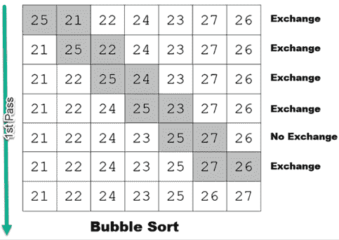
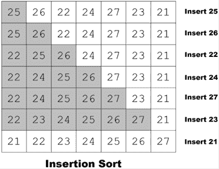
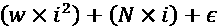
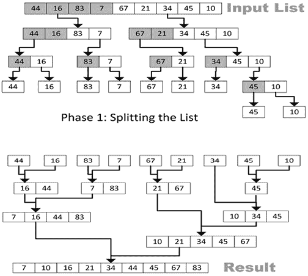
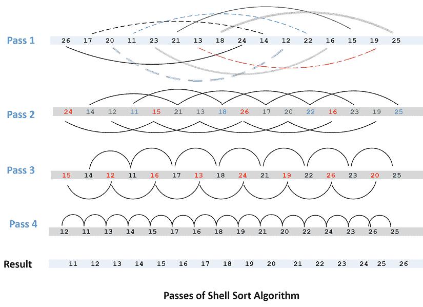
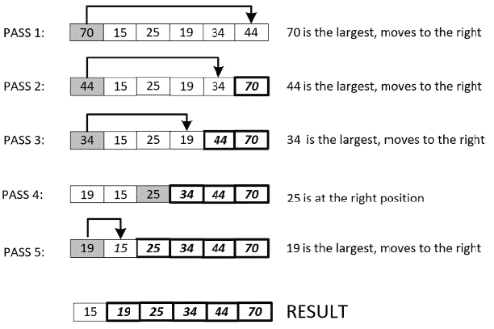

# 第三章：排序和搜索算法

在本章中，我们将探讨用于排序和搜索的算法。这是一类重要的算法，可以单独使用，也可以成为更复杂算法的基础。这些包括**自然语言处理**（**NLP**）和模式提取算法。本章首先介绍了不同类型的排序算法。它比较了设计排序算法的各种方法的性能。然后，详细介绍了一些搜索算法。最后，研究了本章中介绍的排序和搜索算法的一个实际例子。

到本章结束时，我们应该能够理解用于排序和搜索的各种算法，并能够理解它们的优缺点。由于搜索和排序算法是许多复杂算法的基础，详细了解它们将有助于我们更好地理解现代复杂算法，正如后面章节中所介绍的那样。

以下是本章讨论的主要概念：

+   介绍排序算法

+   介绍搜索算法

+   排序和搜索算法的性能分析

+   排序和搜索的实际应用

让我们首先看一些排序算法。

# 介绍排序算法

在复杂数据结构中高效地排序和搜索项目的能力非常重要，因为许多现代算法都需要这样的功能。正确的排序和搜索数据的策略将取决于数据的大小和类型，正如本章中所讨论的那样。虽然最终结果完全相同，但需要正确的排序和搜索算法才能为实际问题提供高效的解决方案。因此，仔细分析这些算法的性能非常重要。

排序算法广泛应用于分布式数据存储系统，如现代 NoSQL 数据库，这些数据库支持集群和云计算架构。在这种数据存储系统中，数据元素需要定期排序和存储，以便能够有效地检索。

本章介绍了以下排序算法：

+   冒泡排序

+   归并排序

+   插入排序

+   希尔排序

+   选择排序

但在我们深入研究这些算法之前，让我们先讨论 Python 中的变量交换技术，在本章中我们将在代码中使用它。

## 在 Python 中交换变量

在实现排序和搜索算法时，我们需要交换两个变量的值。在 Python 中，有一种标准的方法来交换两个变量的值，如下所示：

```py
var_1 = 1
var_2 = 2
var_1, var_2 = var_2, var_1
print(var_1,var_2) 
```

```py
2, 1 
```

这种简单的交换值的方法在本章的排序和搜索算法中被广泛使用。

让我们从下一节开始看冒泡排序算法。

## 冒泡排序

冒泡排序是最简单也是最慢的排序算法之一。它的设计方式使得数据列表中最大的值在每次迭代中逐渐*冒泡*到列表的顶部。冒泡排序需要的运行时内存很少，因为所有的排序操作都发生在原始数据结构中。它不需要新的数据结构作为临时缓冲区。但其最坏情况性能是*O(N²)*，即二次时间复杂度（其中*N*为待排序元素的数量）。如下一节所讨论的，它建议仅用于较小的数据集。冒泡排序的实际推荐数据大小限制将取决于可用的内存和处理资源，但通常建议将元素数量（*N*）控制在 1000 以下。

### 理解冒泡排序背后的逻辑

冒泡排序基于多次迭代，称为遍历。对于一个大小为*N*的列表，冒泡排序将有*N-1*次遍历。为了理解其工作原理，我们将专注于第一次迭代：第一次遍历。

第一次遍历的目标是将最大值推到列表的最高索引位置（顶部）。换句话说，随着第一次遍历的进行，我们将看到列表中的最大值逐渐*冒泡*到顶部。

冒泡排序的逻辑基于比较相邻的邻居值。如果较高索引位置的值大于较低索引位置的值，我们就交换它们。这一迭代会一直进行，直到遍历到列表的末尾。该过程如*图 3.1*所示：



图 3.1：冒泡排序算法

现在我们来看一下如何使用 Python 实现冒泡排序。如果我们在 Python 中实现冒泡排序的第一次遍历，它将如下所示：

```py
list = [25,21,22,24,23,27,26]
last_element_index = len(list)-1
print(0,list)
for idx in range(last_element_index):
                if list[idx]>list[idx+1]:
                    list[idx],list[idx+1]=list[idx+1],list[idx]
                print(idx+1,list) 
```

```py
0 [25, 21, 22, 24, 23, 27, 26]
1 [21, 25, 22, 24, 23, 27, 26]
2 [21, 22, 25, 24, 23, 27, 26]
3 [21, 22, 24, 25, 23, 27, 26]
4 [21, 22, 24, 23, 25, 27, 26]
5 [21, 22, 24, 23, 25, 27, 26]
6 [21, 22, 24, 23, 25, 26, 27] 
```

注意，在*第一次遍历*后：

+   最大值位于列表的顶部，存储在`idx+1`位置。

+   在执行第一次遍历时，算法必须单独比较列表中的每个元素，以*冒泡*出最大值并将其移至顶部。

完成第一次遍历后，算法进入到*第二次遍历*。第二次遍历的目标是将第二大值移动到列表中的第二大索引位置。为了实现这一点，算法将再次比较相邻的邻居值，如果它们的顺序不正确，则交换它们。第二次遍历将排除已经由第一次遍历放置到正确位置的顶部索引值。因此，它需要处理的数据元素将少一个。

完成第二次遍历后，算法将继续进行第三次遍历及其后续遍历，直到列表中的所有数据点都按升序排列。对于一个大小为*N*的列表，算法需要进行*N-1*次遍历才能完全排序。

```py
[21, 22, 24, 23, 25, 26, 27] 
```

我们提到过性能是冒泡排序算法的一个限制。接下来，我们将通过对冒泡排序算法的性能分析来量化其性能：

```py
def bubble_sort(list):
# Exchange the elements to arrange in order
    last_element_index = len(list)-1
    for pass_no in range(last_element_index,0,-1):
        for idx in range(pass_no):
            if list[idx]>list[idx+1]:
                list[idx],list[idx+1]=list[idx+1],list[idx]
    return list
list = [25,21,22,24,23,27,26]
bubble_sort(list) 
```

```py
[21, 22, 23, 24, 25, 26, 27] 
```

### 优化冒泡排序

上述使用`bubble_sort`函数实现的冒泡排序是一种直接的排序方法，其中相邻元素不断被比较，并在顺序错误时进行交换。该算法在最坏情况下始终需要进行*O(N2)*次比较和交换，其中*N*是列表中的元素数量。这是因为，对于*N*个元素的列表，算法无论初始顺序如何，总是需要进行*N-1*次遍历。

以下是优化版本的冒泡排序：

```py
def optimized_bubble_sort(list):
    last_element_index = len(list)-1
    for pass_no in range(last_element_index, 0, -1):
        swapped = False
        for idx in range(pass_no):
            if list[idx] > list[idx+1]:
                list[idx], list[idx+1] = list[idx+1], list[idx]
                swapped = True
        if not swapped:
            break
    return list
list = [25,21,22,24,23,27,26]
optimized_bubble_sort(list) 
```

```py
[21, 22, 23, 24, 25, 26, 27] 
```

`optimized_bubble_sort`函数对冒泡排序算法的性能进行了显著的优化。通过引入一个`swapped`标志，这种优化使得算法可以在完成所有*N-1*次遍历之前，提前检测到列表是否已经排序。当一次遍历没有任何交换时，它就表明列表已经排序，算法可以提前退出。因此，尽管对于完全无序或反向排序的列表，最坏情况下时间复杂度仍为*O(N2)*，但由于这种优化，最佳情况下已经排序的列表的时间复杂度提高到了*O(N)*。

本质上，虽然这两个函数在最坏情况下的时间复杂度都是*O(N2)*，但是`optimized_bubble_sort`在实际应用中可能表现得更快，特别是在数据部分已排序的情况下，使其成为传统冒泡排序算法的更高效版本。

### 冒泡排序算法的性能分析

很容易看出，冒泡排序包含两层循环：

+   **外层循环**：这些也被称为**遍历**。例如，第一次遍历是外层循环的第一次迭代。

+   **内层循环**：这是指在列表中剩余的未排序元素被排序，直到最大值被冒泡到右侧。第一次遍历将有*N-1*次比较，第二次遍历将有*N-2*次比较，每次遍历都会减少一次比较的数量。

冒泡排序算法的时间复杂度如下：

+   **最佳情况**：如果列表已经排序（或者几乎所有元素都已排序），那么运行时复杂度为*O(1)*。

+   **最坏情况**：如果没有元素或只有很少的元素被排序，那么最坏情况下的运行时复杂度为*O(n2)*，因为算法将不得不完全执行内层和外层循环。

现在让我们来看看插入排序算法。

## 插入排序

插入排序的基本思想是在每次迭代中，我们从已有的数据结构中移除一个数据点，然后将其插入到正确的位置。这就是我们称之为插入排序算法的原因。

在第一次迭代中，我们选择两个数据点并对它们进行排序。然后，我们扩展选择范围，选择第三个数据点并根据其值找到它的正确位置。算法会继续进行，直到所有数据点都被移动到正确的位置。

这个过程如下面的图示所示：



图 3.2：插入排序算法

插入排序算法可以通过以下方式在 Python 中实现：

```py
def insertion_sort(elements):
    for i in range(1, len(elements)):
        j = i - 1
        next_element = elements[i]
        # Iterate backward through the sorted portion, 
        # looking for the appropriate position for 'next_element'
        while j >= 0 and elements[j] > next_element:
            elements[j + 1] = elements[j]
            j -= 1
        elements[j + 1] = next_element
    return elements
list = [25,21,22,24,23,27,26]
insertion_sort(list) 
```

```py
[21, 22, 23, 24, 25, 26, 27] 
```

在算法的核心循环中，我们从第二个元素（索引为*1*）开始遍历列表中的每个元素。对于每个元素，算法检查前面的元素，找出它们在已排序子列表中的正确位置。这个检查是在条件`elements[j] > next_element`中进行的，确保我们将当前的‘`next_element`'放置在列表已排序部分的适当位置。

让我们来看看插入排序算法的性能。

### 插入排序算法的性能分析

理解算法的效率对于判断其适用于不同应用场景至关重要。让我们深入探讨插入排序的性能特点。

**最佳情况**

当输入数据已经排序时，插入排序表现最佳。在这种情况下，算法高效地在线性时间内运行，表示为*O(n)*，其中*n*表示数据结构中的元素数量。

**最坏情况**

当输入数据按逆序排列时，效率会受到影响，即最大元素位于开头。在这种情况下，对于每个元素*i*（其中*i*表示当前元素在循环中的索引），内层循环可能需要移动几乎所有前面的元素。插入排序在这种情况下的性能可以通过一个二次函数表示，形式如下：



其中：

+   *w*是一个权重因子，用于调整*i*²的影响。

+   *N*表示一个随着输入规模增长的系数。

+    是一个常量，通常表示其他项未涵盖的少量开销。

**平均情况**

通常，插入排序的平均性能趋向于二次，面对较大的数据集时，这可能会成为问题。

**使用场景和建议**

插入排序对于以下情况特别高效：

+   小型数据集。

+   几乎排序的数据集，只有少数元素未排序。

然而，对于较大且更加随机的数据集，具有更好平均和最坏情况性能的算法，如归并排序或快速排序，更为适用。插入排序的二次时间复杂度使其在处理大量数据时扩展性较差。

## 归并排序

与冒泡排序和插入排序等排序算法不同，归并排序因其独特的方法而显得格外突出。从历史上看，约翰·冯·诺依曼在 1940 年提出了这一技术。尽管许多排序算法在部分排序的数据上表现更好，但归并排序不受影响；其性能在数据初始排列方式无论如何都保持一致。这种韧性使其成为排序大数据集的首选方法。

**分治法：归并排序的核心**

归并排序采用分治策略，包含两个关键阶段——分割和合并：

1.  **分割阶段**：与直接遍历列表不同，这一阶段递归地将数据集分割为两半。此分割继续进行，直到每个部分达到最小大小（为了说明目的，我们假设是一个元素）。虽然将数据分割到如此细粒度的程度可能看起来反直觉，但这种细粒度有助于在下一阶段进行有序的合并。

1.  **合并阶段**：在此阶段，先前分割的部分被系统地合并。算法不断处理并合并这些部分，直到整个列表被排序。

请参见*图 3.3*，该图展示了归并排序算法的可视化表示。



图 3.3：归并排序算法

**伪代码概览**

在深入研究实际代码之前，让我们先通过一些伪代码来理解其逻辑：

```py
merge_sort (elements, start, end)
    if(start < end)
        midPoint = (end - start) / 2 + start
        merge_sort (elements, start, midPoint)
        merge_sort (elements, midPoint + 1, end)
        merge(elements, start, midPoint, end) 
```

伪代码展示了该算法的步骤：

1.  将列表围绕中央的`midPoint`分割。

1.  递归地将数组分割，直到每个部分只有一个元素。

1.  系统地将已排序的部分合并成一个完整的排序列表。

**Python 实现**

下面是归并排序的 Python 实现：

```py
def merge_sort(elements):
    # Base condition to break the recursion
    if len(elements) <= 1:
        return elements
    mid = len(elements) // 2  # Split the list in half
    left = elements[:mid]
    right = elements[mid:]
    merge_sort(left)   # Sort the left half
    merge_sort(right)  # Sort the right half
    a, b, c = 0, 0, 0
    # Merge the two halves
    while a < len(left) and b < len(right):
        if left[a] < right[b]:
            elements[c] = left[a]
            a += 1
        else:
            elements[c] = right[b]
            b += 1
        c += 1
    # If there are remaining elements in the left half
    while a < len(left):
        elements[c] = left[a]
        a += 1
        c += 1
    # If there are remaining elements in the right half
    while b < len(right):
        elements[c] = right[b]
        b += 1
        c += 1
    return elements
list = [21, 22, 23, 24, 25, 26, 27]
merge_sort(list) 
```

```py
[21, 22, 23, 24, 25, 26, 27] 
```

## Shell 排序

冒泡排序算法比较相邻的元素，并在顺序错误时交换它们。另一方面，插入排序通过一次转移一个元素来创建排序好的列表。如果我们有一个部分排序的列表，插入排序应该能提供合理的性能。

但对于完全未排序的列表，大小为*N*，你可以认为冒泡排序必须完全遍历*N-1*轮，才能将其完全排序。

唐纳德·谢尔（Donald Shell）提出了 Shell 排序（以他名字命名），该算法质疑了选择直接相邻元素进行比较和交换的重要性。

现在，让我们理解这个概念。

在第一轮中，我们不是选择直接相邻的元素，而是选择位于固定间隔的元素，最终排序由一对数据点组成的子列表。如下图所示。在第二轮中，它对包含四个数据点的子列表进行排序（见下图）。在随后的轮次中，每个子列表中的数据点数量不断增加，而子列表的数量不断减少，直到最终只剩下一个子列表，其中包含所有数据点。

在此时，我们可以假设列表已经排序：



图 3.4：Shell 排序算法的各轮次

在 Python 中，实现 Shell 排序算法的代码如下：

```py
def shell_sort(elements):
    distance = len(elements) // 2
    while distance > 0:
        for i in range(distance, len(elements)):
            temp = elements[i]
            j = i
# Sort the sub list for this distance
            while j >= distance and elements[j - distance] > temp:
                list[j] = elements[j - distance]
                j = j-distance
            list[j] = temp
# Reduce the distance for the next element
        distance = distance//2
    return elements
list = [21, 22, 23, 24, 25, 26, 27]
shell_sort(list) 
```

```py
[21, 22, 23, 24, 25, 26, 27] 
```

请注意，调用`ShellSort`函数已经导致输入数组的排序。

### Shell 排序算法的性能分析

可以观察到，在最坏的情况下，Shell 排序算法需要通过两个循环，因此它的时间复杂度为*O(n2)*。Shell 排序不适用于大数据集，它适用于中等大小的数据集。大致来说，对于最多包含 6,000 个元素的列表，它的性能相对较好。如果数据部分已经有序，那么性能会更好。在最佳情况下，如果列表已经排序完毕，它只需要遍历*N*个元素来验证顺序，产生最优的*O(N)*性能。

## 选择排序

如我们在本章前面看到的，冒泡排序是最简单的排序算法之一。选择排序是冒泡排序的改进版本，它试图减少算法所需的交换次数。它的设计是每一轮仅进行一次交换，而冒泡排序需要进行*N-1*次交换。与冒泡排序将最大值逐步“冒泡”到顶部不同（这样会导致*N-1*次交换），选择排序每次都会寻找最大值并将其移动到顶部。因此，在第一次遍历后，最大值将位于顶部；第二次遍历后，第二大的值将紧跟在最大值后面。随着算法的进行，后续的值将根据其大小移动到正确的位置。

最后一个值将在*(N-1)*^(次)遍后被移动。因此，选择排序需要*N-1*次遍历来排序*N*个项：



图 3.5：选择排序算法

这里展示了选择排序在 Python 中的实现：

```py
def selection_sort(list):
    for fill_slot in range(len(list) - 1, 0, -1):
        max_index = 0
        for location in range(1, fill_slot + 1):
            if list[location] > list[max_index]:
                max_index = location
        list[fill_slot],list[max_index] = list[max_index],list[fill_slot]
    return list
list = [21, 22, 23, 24, 25, 26, 27]
selection_sort(list) 
```

```py
[21, 22, 23, 24, 25, 26, 27] 
```

### 选择排序算法的性能分析

选择排序的最坏情况性能是*O(N2)*。注意，它的最差性能与冒泡排序类似，因此不适合用于排序较大的数据集。不过，选择排序比冒泡排序更为精心设计，且由于减少了交换次数，它的平均性能也优于冒泡排序。

## 选择排序算法的选择

当谈到排序算法时，并没有一种“放之四海而皆准”的解决方案。最优选择通常取决于你数据的具体情况，例如数据的大小和当前状态。在这里，我们将深入探讨如何做出明智的决策，并通过一些现实世界的例子来加以说明。

**小型且已排序的列表**

对于较小的数据集，尤其是那些已经排好序的数据，通常使用复杂的算法会显得过于“杀鸡用牛刀”。虽然像归并排序这样强大的算法无可否认，但对于小数据集来说，它的复杂性可能会掩盖它的优势。

*现实生活中的例子*：想象一下通过书架上书籍的作者姓氏来进行排序。直接扫描并手动调整顺序（类似于冒泡排序）比采用复杂的排序方法要简单快捷得多。

**部分排序的数据**

当处理已经有些组织的数据时，像插入排序这样的算法表现尤为出色。它们利用现有的顺序，从而提高效率。

*现实生活中的例子*：考虑一个教室场景。如果学生按身高排队，但有一些略微不在正确位置，老师可以轻松发现并调整这些小的偏差（类似插入排序），而无需重新排队。

**大数据集**

对于庞大的数据集，数据量可能令人生畏，归并排序则被证明是一个可靠的帮手。其分治策略能够高效处理大列表，成为行业中的最爱。

*现实生活中的例子*：想象一下一个庞大的图书馆，每天接收成千上万本书籍。按出版日期或作者对它们进行排序需要一种系统的方法。在这里，像归并排序这样的算法，能够将任务分解成可管理的小块，显得尤为重要。

# 搜索算法简介

在许多计算任务的核心中，存在一个基本需求：在复杂结构中定位特定数据。从表面上看，最简单的方法可能就是扫描每一个数据点，直到找到目标。但正如我们所想象的那样，随着数据量的增加，这种方法的效果会大打折扣。

为什么搜索如此重要？无论是用户查询数据库、系统访问文件，还是应用程序获取特定数据，高效的搜索决定了这些操作的速度和响应能力。如果没有高效的搜索技术，系统会变得迟缓，尤其是在数据集不断膨胀的情况下。

随着对快速数据检索需求的增加，复杂搜索算法的作用变得不可忽视。它们提供了所需的敏捷性和高效性，能够在海量数据中迅速找到目标，确保系统保持灵活，用户满意。因此，搜索算法成为数字世界的导航者，带领我们在信息的海洋中找到精确的数据。

本节介绍了以下搜索算法：

+   线性搜索

+   二分查找

+   插值搜索

让我们更详细地看看它们。

## 线性搜索

寻找数据的最简单策略之一是通过遍历每个元素来查找目标。每个数据点都会进行匹配搜索，当找到匹配时，返回结果并退出循环。否则，算法会继续搜索，直到数据的末尾。线性搜索的明显缺点是由于其固有的穷举搜索，它非常缓慢。其优点是数据无需像本章其他算法那样进行排序。

让我们看一下线性搜索的代码：

```py
def linear_search(elements, item):
    index = 0
    found = False
# Match the value with each data element       
    while index < len(elements) and found is False:
        if elements[index] == item:
            found = True
        else:
            index = index + 1
    return found 
```

现在让我们看看前面代码的输出：

```py
list = [12, 33, 11, 99, 22, 55, 90]
print(linear_search(list, 12))
print(linear_search(list, 91)) 
```

```py
True
False 
```

请注意，运行`LinearSearch`函数，如果能够成功找到数据，它将返回`True`值。

### 线性搜索算法的性能分析

如前所述，线性查找是一种简单的算法，执行的是穷举搜索。其最坏情况的时间复杂度为`O(N)`。更多信息请访问[`wiki.python.org/moin/TimeComplexity`](https://wiki.python.org/moin/TimeComplexity)。

## 二分查找

二分查找算法的前提是数据已经排序。该算法通过迭代地将列表分为两部分，并跟踪最低和最高索引，直到找到目标值：

```py
def binary_search(elements, item):
    first = 0
    last = len(elements) - 1
    while first<=last:
        midpoint = (first + last) // 2
        if elements[midpoint] == item:
            return True
        else:
            if item < elements[midpoint]:
                last = midpoint - 1
            else:
                first = midpoint + 1
    return False 
```

输出如下：

```py
list = [12, 33, 11, 99, 22, 55, 90]
sorted_list = bubble_sort(list)
print(binary_search(list, 12))
print(binary_search(list, 91)) 
```

```py
True
False 
```

请注意，调用`BinarySearch`函数会在输入列表中找到值时返回`True`。

### 二分查找算法的性能分析

二分查找之所以命名为“二分查找”，是因为在每次迭代中，算法都将数据分为两部分。如果数据有 N 个元素，最多需要`O(logN)`步进行迭代。这意味着该算法的运行时间复杂度为`O(logN)`。

## 插值查找

二分查找的基本逻辑是它专注于数据的中间部分，而插值查找则更为复杂。插值查找利用目标值来估算元素在排序数组中的位置。我们通过一个例子来理解它。假设我们想在英语词典中查找一个单词，如*river*。我们将利用这些信息进行插值，并开始查找以*r*开头的单词。一个更为通用的插值查找可以编程实现如下：

```py
def int_polsearch(list,x ):
    idx0 = 0
    idxn = (len(list) - 1)
    while idx0 <= idxn and x >= list[idx0] and x <= list[idxn]:
# Find the mid point
        mid = idx0 +int(((float(idxn - idx0)/(list[idxn] - list[idx0])) * (x - list[idx0])))
# Compare the value at mid point with search value 
        if list[mid] == x:
            return True
        if list[mid] < x:
            idx0 = mid + 1
    return False 
```

输出如下：

```py
list = [12, 33, 11, 99, 22, 55, 90]
sorted_list = bubble_sort(list)
print(int_polsearch(list, 12))
print(int_polsearch(list, 91)) 
```

```py
True
False 
```

请注意，在使用`IntPolsearch`之前，数组需要先使用排序算法进行排序。

### 插值查找算法的性能分析

如果数据分布不均匀，插值查找算法的性能将较差。该算法的最坏情况时间复杂度为*O(N)*，而如果数据分布相对均匀，最佳性能则为`O(log(log N))`。

# 实际应用

在给定数据存储库中高效且准确地查找数据，对于许多实际应用至关重要。根据你选择的查找算法，你可能还需要先对数据进行排序。选择合适的排序和查找算法将取决于数据的类型和大小，以及你要解决问题的性质。

让我们尝试使用本章介绍的算法来解决某个国家移民局为新申请人匹配历史记录的问题。当有人申请签证进入该国时，系统会尝试将申请人与现有的历史记录进行匹配。如果找到至少一个匹配项，系统会进一步计算该人过去被批准或拒绝的次数。另一方面，如果没有找到匹配项，系统将此申请人归类为新申请人，并为其分配一个新的标识符。

在历史数据中搜索、定位和识别一个人的能力对于系统至关重要。这个信息非常重要，因为如果某人过去申请过且申请被拒绝，这可能会对该人当前的申请产生负面影响。同样，如果某人的申请过去被批准，这个批准可能会增加该人当前申请获批的机会。通常，历史数据库将包含数百万行数据，我们需要一个设计良好的解决方案，以便在历史数据库中匹配新的申请人。

假设数据库中的历史表格如下所示：

| **个人 ID** | **申请 ID** | **名字** | **姓氏** | **出生日期** | **决定** | **决定日期** |
| --- | --- | --- | --- | --- | --- | --- |
| 45583 | 677862 | John | Doe | 2000-09-19 | 已批准 | 2018-08-07 |
| 54543 | 877653 | Xman | Xsir | 1970-03-10 | 被拒绝 | 2018-06-07 |
| 34332 | 344565 | Agro | Waka | 1973-02-15 | 被拒绝 | 2018-05-05 |
| 45583 | 677864 | John | Doe | 2000-09-19 | 已批准 | 2018-03-02 |
| 22331 | 344553 | Kal | Sorts | 1975-01-02 | 已批准 | 2018-04-15 |

在这个表格中，第一列`个人 ID`与历史数据库中的每个独特申请人相关联。如果历史数据库中有 3000 万独特申请人，那么就会有 3000 万个独特的个人 ID。每个个人 ID 都标识历史数据库系统中的一个申请人。

我们的第二列是`申请 ID`。每个申请 ID 都标识系统中的唯一申请。一个人可能在过去申请过多次。因此，在历史数据库中，我们将拥有比个人 ID 更多的独特申请 ID。John Doe 只有一个个人 ID，但有两个申请 ID，如上表所示。

上表仅显示了历史数据集的一部分。假设我们在历史数据集中有接近 100 万行数据，涵盖了过去 10 年申请人的记录。新申请人以大约每分钟 2 个申请人的平均速度不断到达。对于每个申请人，我们需要做如下操作：

+   为申请人发放新的申请 ID。

+   查看是否与历史数据库中的某个申请人匹配。

+   如果找到匹配项，则使用该申请人在历史数据库中找到的个人 ID。我们还需要确定该申请在历史数据库中已被批准或拒绝的次数。

+   如果没有找到匹配项，那么我们需要为该个人发放一个新的个人 ID。

假设有一个新的人带着以下凭证到达：

+   `名字：John`

+   `姓氏：Doe`

+   `出生日期：2000-09-19`

那么，我们如何设计一个能够高效且具成本效益地执行搜索的应用程序呢？

一种搜索新申请的策略可以如下设计：

1.  按照`出生日期`（DOB）对历史数据库进行排序。

1.  每当有新的人到来时，向申请人发放一个新的应用 ID。

1.  获取所有与出生日期匹配的记录。这将是主要的搜索条件。

1.  从所有匹配的记录中，使用姓名进行二次搜索。

1.  如果找到匹配项，则使用`个人 ID`来引用申请人。计算批准和拒绝的数量。

1.  如果未找到匹配项，则向申请人发放新的个人 ID。

让我们尝试选择合适的算法来对历史数据库进行排序。由于数据量庞大，我们可以安全地排除冒泡排序。希尔排序表现更好，但前提是我们有部分已排序的列表。因此，归并排序可能是对历史数据库进行排序的最佳选择。

当一个新的人到来时，我们需要在历史数据库中搜索并定位该人。由于数据已经排序，可以使用插值搜索或二分查找。因为申请人可能会均匀分布，根据`DOB`，我们可以安全地使用二分查找。

最初，我们根据`DOB`进行搜索，返回一组具有相同出生日期的申请人。现在，我们需要在这一小部分具有相同出生日期的人中找到所需的申请人。由于我们已经成功将数据减少到一个小子集，因此可以使用任何搜索算法，包括冒泡排序，来搜索申请人。请注意，我们在这里简化了二次搜索问题。如果找到多个匹配项，我们还需要通过聚合搜索结果来计算批准和拒绝的总数。

在现实场景中，每个个体在二次搜索中都需要使用某种模糊搜索算法进行识别，因为姓名可能会有轻微的拼写差异。搜索可能需要使用某种距离算法来实现模糊搜索，在该算法中，相似度超过定义阈值的数据点被认为是相同的。

# 摘要

在这一章中，我们介绍了一组排序和查找算法。我们还讨论了不同排序和查找算法的优缺点。我们量化了这些算法的性能，并学习了何时使用每种算法。

在下一章，我们将学习动态算法。我们还将通过一个设计算法的实际示例来了解页面排名算法的细节。最后，我们将学习线性规划算法。

# 在 Discord 上了解更多

要加入本书的 Discord 社区——在这里你可以分享反馈、向作者提问并了解新版本的发布——请扫描下面的二维码：

[`packt.link/WHLel`](https://packt.link/WHLel)


