# 第四章：4  

# 设计算法  

本章介绍了各种算法的核心设计概念。讨论了设计算法的各种技术的优缺点。通过理解这些概念，我们将学习如何设计高效的算法。  

本章首先讨论我们在设计算法时可以选择的不同方案。然后，讨论了准确描述我们试图解决的具体问题的重要性。接下来，以著名的**旅行商问题**（**TSP**）为用例，应用我们将要介绍的不同设计技术。然后，引入线性规划并讨论其应用。最后，介绍如何利用线性规划解决一个现实世界问题。  

到本章结束时，你应该能够理解设计高效算法的基本概念。  

本章讨论了以下概念：  

+   设计算法的不同方法  

+   理解选择正确算法设计所涉及的权衡

+   解决现实世界问题的最佳实践  

+   解决一个现实世界中的优化问题  

首先让我们来看设计算法的基本概念。  

# 介绍设计算法的基本概念  

根据《美国传统词典》，算法被定义为：  

> 一组有限的明确指令，在给定初始条件下，可以按照规定的顺序执行，以实现某个特定目标，并且具有可识别的结束条件。  

设计算法是以最高效的方式提出这组“*有限的明确指令*”，以“*实现特定目标*”。对于一个复杂的现实世界问题，设计算法是一项繁琐的任务。为了提出一个好的设计，我们首先需要完全理解我们试图解决的问题。我们从弄清楚需要做什么（即理解需求）开始，再去思考如何做（即设计算法）。理解问题包括解决问题的功能性和非功能性需求。让我们来看看这些是什么：  

+   功能性需求正式地指定了我们想要解决的问题的输入和输出接口及其相关功能。功能性需求帮助我们理解数据处理、数据操作和实现计算来生成结果所需的操作。  

+   非功能性需求设定了关于算法性能和安全方面的期望。  

请注意，设计算法是关于在给定的条件下，以最佳方式处理功能性和非功能性需求，并考虑到运行设计算法所需的资源。  

为了得出一个既能满足功能要求又能满足非功能要求的良好响应，我们的设计应当关注以下三个方面，正如*第一章* *算法概述*中所讨论的：

+   **正确性**：设计的算法是否能产生我们预期的结果？

+   **性能**：这是获取这些结果的最佳方式吗？

+   **可扩展性**：该算法在处理更大数据集时表现如何？

在这一节中，我们将逐一讨论这些关注点。

## 关注点 1：正确性：设计的算法是否能产生我们预期的结果？

算法是解决现实问题的数学方法。为了有用，它应该产生准确的结果。如何验证算法的正确性不应是事后考虑的问题，而应该融入算法的设计中。在制定验证算法的策略之前，我们需要考虑以下两个方面：

+   **定义真值**：为了验证算法，我们需要一组已知正确的结果作为输入的基准。这些已知正确的结果在我们试图解决的问题的上下文中被称为真值。真值非常重要，因为它是我们在迭代优化算法时用作参考的依据。

+   **选择度量指标**：我们还需要考虑如何量化与定义真值之间的偏差。选择正确的度量指标将帮助我们准确地量化算法的质量。

    例如，对于监督式机器学习算法，我们可以使用现有的标注数据作为真值。我们可以选择一个或多个度量指标，如准确率、召回率或精确度，来量化与真值之间的偏差。需要注意的是，在某些使用场景下，正确的输出不是单一值，而是给定输入集的一个范围。随着我们对算法进行设计和开发，目标将是通过迭代优化算法，直到其在需求中指定的范围内。

+   **边界情况考虑**：边界情况发生在我们设计的算法在操作参数的极限状态下运行时。边界情况通常是罕见的场景，但需要经过充分的测试，因为它可能导致我们的算法失败。非边界情况则被称为“正常路径”，涵盖了操作参数在正常范围内时通常会发生的所有场景。绝大多数情况下，算法会保持在“正常路径”上。不幸的是，无法列出所有可能的边界情况，但我们应尽可能多地考虑这些边界情况。如果没有考虑到边界情况，问题可能会发生。

## 关注点 2：性能：这是获取这些结果的最佳方式吗？

第二个关注点是关于回答以下问题：

这是否是最优解决方案，我们能否验证没有比我们的解决方案更好的其他解决方案存在？

乍一看，这个问题似乎很简单。然而，对于某些类别的算法，研究人员几十年来一直未能成功验证算法生成的特定解决方案是否为最佳解决方案，以及是否存在其他解决方案可以提供更好的性能。因此，首先理解问题、其需求以及运行算法所需的资源变得非常重要。

要提供某个复杂问题的最佳解决方案，我们需要回答一个基本问题：我们是否应该致力于找到这个问题的最优解？如果找到和验证最优解非常耗时且复杂，那么一个可行的解决方案可能是最好的选择。这些近似的可行解决方案被称为*启发式*。

因此，理解问题及其复杂性是重要的，并有助于我们估计运行算法所需的资源。

在深入探讨之前，让我们先定义几个术语：

+   **多项式算法**：如果一个算法的时间复杂度为*O(n*^k*)*，我们称之为多项式算法，其中*k*是一个常数。

+   **证书**：在迭代解决特定问题的过程中生成的建议候选解决方案称为证书。随着我们在解决问题时的逐步进展，通常会生成一系列证书。如果解决方案朝着收敛前进，每个生成的证书都将比前一个更好。在某个时刻，当我们的证书满足要求时，我们将选择该证书作为最终解决方案。

在*第一章*，*算法概述*中，我们介绍了大 O 符号，它可以用来分析算法的时间复杂度。在分析时间复杂度的背景下，我们考虑以下不同的时间间隔：

+   **候选解决方案生成时间**，*t*[r]：这是算法生成候选解决方案所需的时间。

+   **候选解决方案验证时间**，*t*[s]：这是验证候选解决方案（证书）所需的时间。

### 表征问题的复杂性

多年来，研究界根据其复杂性将问题分为不同的类别。

在我们尝试设计问题的解决方案之前，首先尝试对其进行特征化是有意义的。一般来说，问题可以分为三种类型：

+   对于我们可以保证存在多项式算法来解决的问题

+   对于我们可以证明无法通过多项式算法解决的问题

+   对于我们无法找到多项式算法来解决，但也无法证明对于这些问题不存在多项式解决方案

让我们根据其复杂性来看看各种类别的问题：

+   **非确定性多项式时间** (**NP**)：可以通过非确定性计算机在多项式时间内解决的问题。广义上讲，这意味着通过在每一步做出合理的猜测，而不致力于找到最优解，可以在多项式时间内找到并验证问题的一个合理解。形式上，对于一个问题要成为 **NP** 问题，它必须满足以下条件，称为条件 A：

    +   **条件 A**：保证存在一个多项式时间算法，可以用来验证候选解（证书）是否最优。

+   **多项式时间** (**P**)：可以通过确定性计算机在多项式时间内解决的问题。这些问题可以通过某些算法在运行时间为 *O(N*^k*)* 的情况下解决，无论 *k* 的值有多大。这些问题可以被看作是 **NP** 的子集。除了满足 NP 问题的条件 A 外，P 类问题还需要满足另一个条件，称为条件 B：

    +   **条件 A**：保证存在一个多项式时间算法，可以用来验证候选解（证书）是否最优。

    +   **条件 B**：保证至少存在一个多项式时间算法，可以用来解决该问题。

### 探索 P 类和 NP 类问题的关系

理解 P 类和 NP 类问题的关系仍在进行中。我们已知的是，P 类问题是 NP 类问题的子集，即！[](img/B18046_04_001.png)。这一点从上述讨论中显而易见，因为 NP 类问题只需满足 P 类问题需要满足的两个条件中的第一个条件。

P 类问题与 NP 类问题之间的关系如*图 4.1*所示：

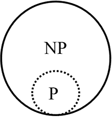

图 4.1：P 类问题与 NP 类问题的关系

我们目前不确定的问题是，如果一个问题是 NP 问题，它是否也是 P 问题？这是计算机科学中最伟大的未解问题之一。由克莱数学研究所选出的千年奖问题宣布，解决这个问题将获得一百万美元的奖金，因为它将在人工智能、密码学和理论计算机科学等领域产生重大影响。有些问题，比如排序，已知属于 P 类。其他问题，如背包问题和旅行商问题（TSP），已知属于 NP 类。

目前有大量的研究工作在努力解答这个问题。至今，没有研究人员发现能在多项式时间内确定性地解决背包问题或旅行商问题的算法。这个问题仍在进行中，且尚未有人能够证明不存在这样的算法。

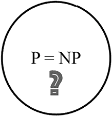

图 4.2：P 是否等于 NP？我们目前尚不知晓

### 引入 NP 完全问题和 NP 难问题

让我们继续列举各种问题类别：

+   **NP 完全问题**：NP 完全类别包含了所有 NP 问题中最难的问题。一个 NP 完全问题满足以下两个条件：

    +   尚未有已知的多项式算法可以生成证书。

    +   已知的多项式算法可以验证所提出的证书是否最优。

+   **NP-hard**：NP-hard 类别包含的问题至少与 NP 类中的任何问题一样难，但这些问题不一定要属于 NP 类。

现在，让我们尝试绘制一个图示，来说明这些不同类别的问题：

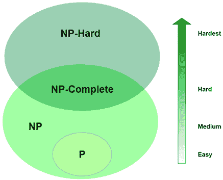

图 4.3：P、NP、NP-complete 和 NP-hard 之间的关系

请注意，是否 P = NP 仍需通过研究界来证明。尽管这一问题尚未被证明，但极有可能 P ≠ NP。在这种情况下，NP-complete 问题将不存在多项式解决方案。请注意，前面的图示是基于这一假设的。

#### P、NP、NP-complete 和 NP-hard 之间的区别

不幸的是，P、NP、NP-complete 和 NP-hard 之间的区别并不清晰。让我们总结并研究一些例子，以便更好地理解本节中讨论的概念：

+   **P**：这是可以在多项式时间内解决的问题类。例如：

    +   哈希表查找

    +   像 Djikstra 算法这样的最短路径算法

    +   线性和二分查找算法

+   **NP-problem**：这些问题不能在多项式时间内解决，但它们的解决方案可以在多项式时间内进行验证。例如：

    +   RSA 加密算法

+   **NP-hard**：这些是复杂的问题，目前尚未找到解决方案，但如果能够解决，将会有一个多项式时间的解决方案。例如：

    +   使用 *K* 均值算法进行最优聚类

+   **NP-complete**：NP-complete 问题是 NP 类中“最难”的问题。它们既是 NP-hard 也是 NP。例如：

    +   计算旅行商问题的最优解

如果解决了其中一种类别（NP-hard 或 NP-complete）的问题，将意味着所有 NP-hard/NP-complete 问题的解决方案都可以得到解决。

## 关注点 3 - 可扩展性：算法在处理更大数据集时的表现如何？

算法以定义的方式处理数据并生成结果。通常，随着数据量的增加，处理数据和计算所需结果所需的时间也会越来越长。**大数据**这一术语有时用来粗略标识由于数据集的体量、种类和流速而预计对基础设施和算法构成挑战的数据集。一个设计良好的算法应该具有可扩展性，这意味着它应该以一种方式设计，使其能够在可能的情况下高效运行，利用可用资源并在合理的时间框架内生成正确的结果。当处理大数据时，算法的设计变得尤为重要。为了量化算法的可扩展性，我们需要关注以下两个方面：

+   **随着输入数据增大，资源需求增加**：估算这种需求的过程被称为空间复杂度分析。

+   **随着输入数据增加，运行所需的时间也会增加**：估算这一点的过程叫做时间复杂度分析。

请注意，我们正生活在一个数据爆炸的时代。大数据一词已成为主流，它能够捕捉现代算法通常需要处理的数据的规模和复杂性。

在开发和测试阶段，许多算法仅使用少量数据样本。当设计算法时，考虑算法的可扩展性非常重要。特别是，必须仔细分析（即测试或预测）随着数据集增大，算法性能的变化。

### 云的弹性与算法可扩展性

云计算为应对算法的资源需求提供了新的选择。云计算基础设施能够在处理需求增加时提供更多的资源。云计算的这一能力被称为基础设施的弹性，现如今它为我们设计算法提供了更多的选择。当算法部署在云上时，可能会根据要处理的数据规模要求更多的 CPU 或虚拟机（VM）。

典型的深度学习算法就是一个很好的例子。要训练出一个优秀的深度学习模型，需要大量标注数据。对于一个设计良好的深度学习算法，训练深度学习模型所需的处理量与示例的数量是成正比的，或者说接近正比。当在云端训练深度学习模型时，随着数据量的增加，我们会尝试配置更多的资源，以保持训练时间在可管理的范围内。

# 理解算法策略

一个设计良好的算法会尽可能地通过将问题划分成更小的子问题来最有效地利用可用资源。设计算法时有不同的算法策略。一种算法策略涉及算法中的以下三个方面：

本节将介绍以下三种策略：

+   分治策略

+   动态规划策略

+   贪心算法策略

## 理解分治策略

一种策略是找到一种方法，将较大的问题划分成可以独立解决的小问题。这些小问题的子解将被合并以生成问题的整体解决方案。这就是分治策略。

从数学上讲，如果我们正在为一个有 *n* 个输入的（P）问题设计解决方案，需要处理数据集 *d*，我们将问题划分为 *k* 个子问题，*P1* 到 *Pk*。每个子问题将处理数据集的一个分区 *d*。通常，我们会让 *P1* 到 *Pk* 分别处理 *d1* 到 *dk*。

让我们来看一个实际的例子。

### 一个实际的例子——分治法应用于 Apache Spark

Apache Spark ([`spark.apache.org/`](https://spark.apache.org/)) 是一个开源框架，用于解决复杂的分布式问题。它实现了一种分治策略来解决问题。为了处理一个问题，它将问题划分为多个子问题，并独立地处理这些子问题。这些子问题可以在不同的机器上运行，从而实现水平扩展。我们将通过一个简单的示例——从列表中统计单词来演示这一点。

假设我们有以下单词列表：

`words_list = ["python", "java", "ottawa", "news", "java", "ottawa"]`

我们想要计算这个列表中每个单词的频率。为此，我们将应用分治策略以高效地解决这个问题。

分治法的实现如下面的示意图所示：

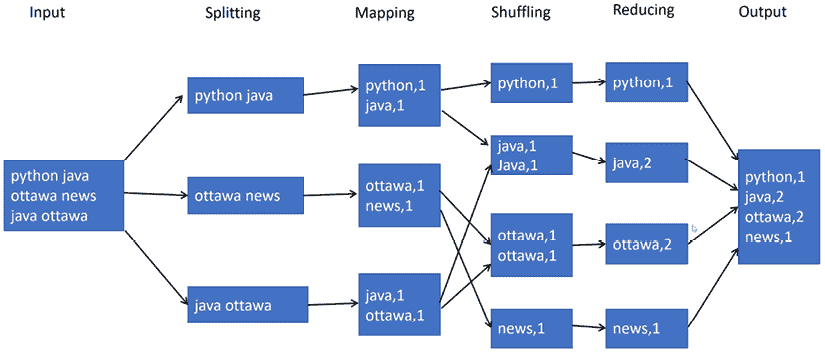图 4.4：分治法

前面的示意图展示了一个问题分解的以下阶段：

1.  **拆分**：输入数据被划分为可以独立处理的分区，这叫做拆分（splitting）。在前面的示意图中，我们有三个分割。

1.  **映射**：任何可以在分割上独立运行的操作都叫做映射（map）。在前面的示意图中，映射操作将每个分区中的单词转换为键值对。对应于三个分割，三个映射器将并行运行。

1.  **洗牌**：洗牌是将相似的键聚集在一起的过程。一旦相似的键被聚集在一起，就可以对它们的值运行聚合函数。注意，洗牌是一个性能密集型操作，因为相似的键需要被聚集，而这些键原本可能分布在整个网络中。

1.  **归约**：对相似键的值运行聚合函数叫做归约（reducing）。在前面的示意图中，我们需要统计单词的数量。

让我们看看如何编写代码来实现这一点。为了演示分治策略，我们需要一个分布式计算框架。我们将使用 Apache Spark 上运行的 Python 来演示：

1.  首先，为了使用 Apache Spark，我们将创建一个 Apache Spark 的运行时上下文：

    ```py
    import findspark
    findspark.init()
    from pyspark.sql import SparkSession
    spark = SparkSession.builder.master("local[*]").getOrCreate()
    sc = spark.sparkContext 
    ```

1.  现在，让我们创建一个包含一些单词的示例列表。我们将把这个列表转换为 Spark 的本地分布式数据结构，称为**弹性分布式数据集**（**RDD**）：

    ```py
    wordsList = ['python', 'java', 'ottawa', 'ottawa', 'java','news']
    wordsRDD = sc.parallelize(wordsList, 4)
    # Print out the type of wordsRDD
    print (wordsRDD.collect()) 
    ```

1.  它将打印：

    ```py
    ['python', 'java', 'ottawa', 'ottawa', 'java', 'news'] 
    ```

1.  现在，让我们使用`map`函数将单词转换为键值对：

    ```py
    wordPairs = wordsRDD.map(lambda w: (w, 1))
    print (wordPairs.collect()) 
    ```

1.  它将打印：

    ```py
    [('python', 1), ('java', 1), ('ottawa', 1), ('ottawa', 1), ('java', 1), ('news', 1)] 
    ```

1.  让我们使用`reduce`函数来进行聚合并得到结果：

    ```py
    wordCountsCollected = wordPairs.reduceByKey(lambda x,y: x+y)
    print(wordCountsCollected.collect()) 
    ```

1.  它打印：

    ```py
    [('python', 1), ('java', 2), ('ottawa', 2), ('news', 1)] 
    ```

这展示了我们如何使用分治策略来统计单词的数量。请注意，当一个问题可以被分解为子问题并且每个子问题至少可以在某种程度上独立地解决时，分治法是有用的。但对于需要大量迭代处理的算法，如优化算法，分治法并不是最佳选择。对于这类算法，适用的是动态规划，接下来将介绍这一内容。

现代云计算基础设施，如 Microsoft Azure、Amazon Web Services 和 Google Cloud，通过实现分治策略（无论是直接还是间接的方式）在分布式基础设施中实现了可扩展性，能够并行使用多个 CPU/GPU。

## 理解动态规划策略

在上一节中，我们学习了分治法，它是一种自上而下的方法。与此相对，动态规划是一种自下而上的策略。我们从最小的子问题开始，不断地将解决方案组合起来，直到达到最终的解决方案。像分治法一样，动态规划通过将子问题的解决方案组合来解决问题。

动态规划是一种由理查德·贝尔曼（Richard Bellman）在 1950 年代提出的优化特定类别算法的策略。需要注意的是，在动态规划中，"编程"一词指的是使用表格方法，与编写代码无关。与分治策略相对，动态规划适用于子问题之间不独立的情况。它通常应用于优化问题，其中每个子问题的解决方案都有一个值。

我们的目标是找到一个具有最优值的解决方案。动态规划算法只对每个子问题求解一次，并将其结果保存在表格中，从而避免了每次遇到子问题时都重新计算答案。

### 动态规划的组成部分

动态规划基于两个主要组成部分：

+   **递归**：它通过递归的方式解决子问题。

+   **记忆化**：记忆化或缓存。它基于一种智能缓存机制，尝试重用重计算的结果。这个智能缓存机制称为记忆化。子问题部分涉及到在多个子问题中重复的计算。这个思想是只进行一次计算（这是耗时的步骤），然后在其他子问题中重用它。这是通过记忆化来实现的，这在解决可能多次评估相同输入的递归问题时尤其有用。

### 使用动态规划的条件

我们尝试用动态规划解决的问题应具备两个特征。

+   **最优结构**：当我们尝试解决的问题可以被分解成子问题时，动态规划能够带来良好的性能收益。

+   **重叠子问题**：动态规划使用一个**递归**函数，通过调用自身并解决原问题的较小子问题来解决特定问题。子问题的计算结果会存储在一个表格中，避免重复计算。因此，在存在重叠子问题的情况下，需要使用这一技术。

动态规划非常适合组合优化问题，这类问题需要提供输入元素的最优组合作为解决方案。

示例包括：

+   为像 FedEx 或 UPS 这样的公司寻找最优的包裹配送方式

+   寻找最优的航空公司航线和机场

+   决定如何为像 Uber Eats 这样的在线外卖系统分配司机

## 理解贪心算法

正如名字所示，贪心算法相对较快地产生一个好的解，但它不一定是最优解。与动态规划类似，贪心算法主要用于解决无法使用分治策略的优化问题。在贪心算法中，解决方案通过一系列步骤逐步计算。在每一步中，做出局部最优选择。

### 使用贪心编程的条件

贪心算法是一种在具有以下两种特征的问题中表现良好的策略：

+   **从局部到全局**：通过选择局部最优解，可以达到全局最优解。

+   **最优子结构**：问题的最优解由其子问题的最优解组成。

为了理解贪心算法，我们首先定义两个术语：

+   **算法开销**：每当我们尝试找到某个问题的最优解时，都需要一些时间。随着我们要优化的问题变得越来越复杂，找到最优解所需的时间也会增加。我们用 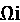 来表示算法开销。

+   **与最优解的差距**：对于一个给定的优化问题，存在一个最优解。通常我们通过迭代优化所选择的算法来逐步逼近最优解。对于某个问题，总是存在一个完美的解决方案，称为最优解。如前所述，基于我们尝试解决的问题的分类，最优解可能是未知的，或者计算和验证最优解可能需要不合理的时间。假设最优解是已知的，则当前解在第 i 次迭代中的与最优解的差距被称为最优差距，表示为 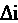。

对于复杂问题，我们有两种可能的策略：

+   花更多的时间寻找最接近最优解的解决方案，以便使得 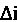 尽可能小。

+   最小化算法开销，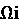。采用简单粗暴的方法，只求一个可行的解决方案。

贪心算法基于第二种策略，我们不努力寻找全局最优解，而是选择最小化算法开销。

使用贪心算法是一种快速简便的策略，用于解决多阶段问题的全局最优值。它基于选择局部最优值，而不努力验证局部最优值是否也为全局最优。通常，除非我们运气好，贪心算法不会得到可以视为全局最优的值。然而，找到一个全局最优值是一个耗时的任务。因此，与分治法和动态规划算法相比，贪心算法的速度较快。

通常，贪心算法定义如下：

1.  假设我们有一个数据集 *D*。在这个数据集中，选择一个元素 *k*。

1.  假设候选解或证书是 *S*。考虑将 *k* 包含在解 *S* 中。如果可以包含，那么解就是 *Union(S, e)*。

1.  重复该过程，直到 *S* 填满或 *D* 耗尽。

**示例**：

**分类与回归树** (**CART**) 算法是一个贪心算法，它在顶层寻找最优划分。它在每个后续层次重复此过程。请注意，CART 算法并不计算并检查该划分是否会导致几层下的最低可能杂质。CART 使用贪心算法，因为找到最优树被认为是一个 NP 完全问题。它的算法复杂度是 *O(exp(m))* 时间。

# 一个实际应用——解决 TSP 问题

首先让我们看一下 TSP 的问题陈述，这是一个众所周知的问题，最早在 1930 年代被提出作为挑战。TSP 是一个 NP-困难问题。首先，我们可以随机生成一个满足访问所有城市的条件的旅行路径，而不考虑最优解。然后，我们可以在每次迭代中努力改进解。每次迭代中生成的旅行路径称为候选解（也叫证书）。证明一个证书是最优的需要指数级的时间。相反，使用不同的启发式解决方案来生成接近最优但并非最优的路径。

一个旅行推销员需要访问给定的城市列表才能完成任务：

| **输入** | 一个包含 *n* 个城市的列表（记作 *V*），以及每对城市之间的距离，*d ij (1 ≤ i, j ≤ n)* |
| --- | --- |
| **输出** | 最短的旅行路径，访问每个城市一次并返回初始城市 |

请注意以下几点：

+   城市之间的距离是已知的

+   给定列表中的每个城市需要*精确*访问一次

我们能为旅行推销员生成旅行计划吗？什么是能够最小化旅行推销员总行程的最优解？

以下是我们可以用于 TSP 的五个加拿大城市之间的距离：

|  | **渥太华** | **蒙特利尔** | **金斯顿** | **多伦多** | **萨德伯里** |
| --- | --- | --- | --- | --- | --- |
| **渥太华** | - | 199 | 196 | 450 | 484 |
| **蒙特利尔** | 199 | - | 287 | 542 | 680 |
| **金斯顿** | 196 | 287 | - | 263 | 634 |
| **多伦多** | 450 | 542 | 263 | - | 400 |
| **萨德伯里** | 484 | 680 | 634 | 400 | - |

注意，目标是得到一条从起始城市出发并返回起始城市的路线。例如，一个典型的路线可能是渥太华–萨德伯里–蒙特利尔–金斯顿–多伦多–渥太华，总费用为 *484 + 680 + 287 + 263 + 450 = 2,164*。这是销售员需要行走的最短路线吗？能够最小化销售员总行程的最优解是什么？我留给你自己去思考并计算。

## 使用暴力破解策略

解决旅行商问题（TSP）时，首先想到的解决方案是通过暴力破解方法找到最短路径，使得销售员恰好访问每座城市一次，并返回到起始城市。因此，暴力破解策略如下：

+   评估所有可能的路线。

+   选择距离最短的那个。

问题是，对于 *n* 个城市，有 *(n-1)!* 种可能的路线。这意味着五座城市会产生 *4! = 24* 种路线，我们会选择最短距离对应的那一条。显然，这种方法只适用于城市数量较少的情况。随着城市数量的增加，暴力破解策略因产生的排列组合数量过多而变得无法解决。

让我们看看如何在 Python 中实现暴力破解策略。

首先需要注意，*{1,2,3}* 代表一条从城市 1 到城市 2 和城市 3 的路线。一个路线的总距离是该路线覆盖的总距离。我们假设城市之间的距离是它们之间的最短距离（即欧几里得距离）。

让我们首先定义三个实用函数：

+   `distance_points`：计算两点之间的绝对距离

+   `distance_tour`：计算销售员在给定路线中需要覆盖的总距离

+   `generate_cities`：随机生成一组位于宽度为 `500` 和高度为 `300` 的矩形区域内的 *n* 个城市

看一下下面的代码：

```py
import random
from itertools import permutations 
```

在前面的代码中，我们从 `itertools` 包的 `permutations` 函数实现了 `alltours`。我们还用复数表示了距离。这意味着以下内容：

计算两座城市，*a* 和 *b*，之间的距离就像 `distance (a,b)` 一样简单。

我们可以通过调用 `generate_cities(n)` 来创建 *n* 个城市：

```py
def distance_tour(aTour):
    return sum(distance_points(aTour[i - 1], aTour[i]) 
               for i in range(len(aTour))
    )
aCity = complex
def distance_points(first, second):
    return abs(first - second)
def generate_cities (number_of_cities):
    seed=111
    width=500
    height=300
    random.seed((number_of_cities, seed))
    return frozenset(aCity(random.randint(1, width),
                           random.randint(1, height))
                     for c in range(number_of_cities)) 
```

现在，让我们定义一个函数 `brute_force`，它会生成所有可能的城市路线。一旦生成了所有可能的路线，它将选择最短距离的那一条：

```py
def brute_force(cities):
    return shortest_tour(alltours(cities))
def shortest_tour(tours):
    return min(tours, key=distance_tour) 
```

现在让我们定义一些有助于绘制城市图的实用函数。我们将定义以下函数：

+   `visualize_tour`：绘制特定旅行路线中的所有城市和链接。它还会突出显示旅行开始的城市。

+   `visualize_segment`：由`visualize_tour`使用，用于绘制一个段中的城市和链接。

看一下以下代码：

```py
import matplotlib.pyplot as plt
def visualize_tour(tour, style='bo-'): 
if len(tour) > 1000:
        plt.figure(figsize=(15, 10))
    start = tour[0:1]
    visualize_segment(tour + start, style)
    visualize_segment(start, 'rD') 

def visualize_segment (segment, style='bo-'):
    plt.plot([X(c) for c in segment], [Y(c) for c in segment], style, clip_on=False)
    plt.axis('scaled')
    plt.axis('off')

def X(city):
    "X axis";
    return city.real
def Y(city):
    "Y axis";
    return city.imag 
```

让我们实现一个函数` tsp()`，它完成以下操作：

1.  根据算法和所请求的城市数生成旅行路线。

1.  计算算法运行所花费的时间。

1.  生成一个图表。

一旦定义了`tsp()`，我们就可以用它来创建旅行路线：

```py
from time import time
from collections import Counter
def tsp(algorithm, cities):
    t0 = time()
    tour = algorithm(cities)
    t1 = time()
    # Every city appears exactly once in tour
    assert Counter(tour) == Counter(cities) 
    visalize_tour(tour)
    print("{}:{} cities => tour length {;.0f} (in {:.3f} sec".format(
        name(algorithm), len(tour), distance_tour(tour), t1-t0))
def name(algorithm):
    return algorithm.__name__.replace('_tsp','')
tps(brute_force, generate_cities(10)) 
```

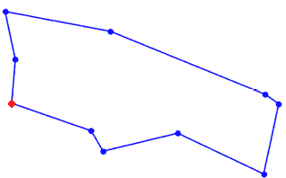

图 4.5：TSP 问题的解决方案

请注意，我们已经用它生成了 10 个城市的旅行路线。由于*n = 10*，它将生成*(10-1)! = 362,880*种可能的排列组合。如果 n 增加，排列组合的数量急剧增加，暴力破解法将无法使用。

## 使用贪心算法

如果我们使用贪心算法来解决旅行商问题（TSP），那么在每一步，我们可以选择一个看起来合理的城市，而不是寻找一个能够导致最佳整体路径的城市。因此，每当我们需要选择一个城市时，我们只是选择离得最近的城市，而不考虑这个选择是否能导致全局最优路径。

贪心算法的方法很简单：

1.  从任何城市开始。

1.  在每一步，通过移动到下一个城市来继续构建旅行路线，该城市是最近的未访问过的邻近城市。

1.  重复*步骤 2*。

让我们定义一个名为`greedy_algorithm`的函数，它能够实现这一逻辑：

```py
def greedy_algorithm(cities, start=None):
    city_ = start or first(cities)
    tour = [city_]
    unvisited = set(cities - {city_})
    while unvisited:
        city_ = nearest_neighbor(city_, unvisited)
        tour.append(city_)
        unvisited.remove(city_)
    return tour
def first(collection): return next(iter(collection))
def nearest_neighbor(city_a, cities):
    return min(cities, key=lambda city_: distance_points(city_, city_a)) 
```

现在，让我们使用`greedy_algorithm`为 2,000 个城市创建一条旅行路线：

```py
tsp(greedy_algorithm, generate_cities(2000)) 
```

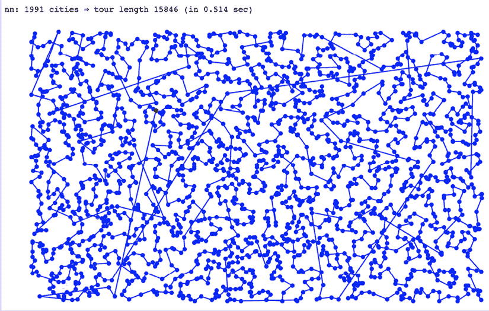

图 4.6：在 Jupyter Notebook 中显示的城市

请注意，生成 2,000 个城市的旅行路线仅用了`0.514`秒。如果我们使用暴力破解法，它将生成*(2000-1)!* = 1.65*e*⁵⁷³²个排列组合，这几乎是无限的。

请注意，贪心算法是基于启发式的，并且没有证明该解是最优的。

## 三种策略的比较

总结来说，贪心算法的结果在计算时间上更为高效，而暴力破解法则提供了全局最优解的组合。这意味着计算时间和结果的质量有所不同。所提出的贪心算法可能会得到与暴力破解几乎相同的结果，但计算时间显著较少，但由于它不搜索最优解，因此它基于一种基于努力的策略，并且没有保证。

现在，让我们来看一下**PageRank**算法的设计。

# 展示 PageRank 算法

作为一个实际示例，让我们来看一下 Google 用来对用户查询的搜索结果进行排名的 PageRank 算法。它生成一个数字，量化搜索结果在用户执行的查询背景下的重要性。这一算法由两位博士生，Larry Page 和 Sergey Brin，在 1990 年代末期的斯坦福大学设计，他们也随之创办了 Google。*PageRank 算法*是以 Larry Page 的名字命名的。

首先，我们正式定义 PageRank 最初设计的目标问题。

## 问题定义

每当用户在网页搜索引擎中输入查询时，通常会返回大量的搜索结果。为了使结果对最终用户有用，使用某些标准对网页进行排名是很重要的。显示的结果使用此排名来总结展示给用户的结果，并且依赖于底层算法定义的标准。

## 实现 PageRank 算法

首先，在使用 PageRank 算法时，采用以下表示方法：

+   网页在有向图中由节点表示。

+   图中的边代表超链接。

PageRank 算法中最重要的部分是找到计算查询结果中每个网页重要性的最佳方法。某一特定网页在网络中的排名是通过计算一个随机浏览边（即点击链接）的人到达该页面的概率来得出的。此外，该算法由阻尼因子 alpha 参数化，默认值为 0.85。这个阻尼因子表示用户继续点击的概率。请注意，PageRank 最高的页面是最具吸引力的：无论用户从哪里开始，该页面都有最高的概率成为最终目标页面。

该算法需要多次迭代或遍历网页集合，以确定每个网页的正确重要性（或 PageRank 值）。

为了计算一个从 `0` 到 `1` 的数字，用来量化某个特定网页的重要性，算法结合了以下两个组件的信息：

+   **与用户输入的查询相关的信息**：这个组件在用户输入的查询背景下，评估网页内容的相关性。网页的内容直接依赖于页面的作者。

+   **与用户输入的查询无关的信息**：这个组件试图量化每个网页在其链接、浏览量和邻域中的重要性。一个网页的邻域是与该页面直接相连的网页群体。由于网页具有异质性，且很难制定适用于整个网页的标准，这一组件的计算非常困难。

为了在 Python 中实现 PageRank 算法，首先让我们导入必要的库：

```py
import numpy as np
import networkx as nx
import matplotlib.pyplot as plt 
```

注意，该网络来自 [`networkx.org/`](https://networkx.org/)。为了演示的目的，假设我们只分析网络中的五个网页。让我们称这组页面为 `my_pages`，它们一起位于名为 `my_web` 的网络中：

```py
my_web = nx.DiGraph()
my_pages = range(1,6) 
```

现在，让我们随机连接它们以模拟一个实际网络：

```py
connections = [(1,3),(2,1),(2,3),(3,1),(3,2),(3,4),(4,5),(5,1),(5,4)]
my_web.add_nodes_from(my_pages)
my_web.add_edges_from(connections) 
```

现在，让我们绘制这个图：

```py
pos = nx.shell_layout(my_web)
nx.draw(my_web, pos, arrows=True, with_labels=True)
plt.show() 
```

它创建了我们网络的视觉表示，如下所示：

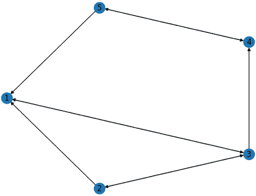

图 4.7：网络的视觉表示

在 PageRank 算法中，网页的模式包含在一个称为转移矩阵的矩阵中。有算法不断更新转移矩阵，以捕捉网络不断变化的状态。转移矩阵的大小为 n x n，其中 n 是节点的数量。矩阵中的数字是访问者由于出站链接而下次转到该链接的概率。

在我们的情况下，前面的图显示了我们拥有的静态网页。让我们定义一个可以用来创建转移矩阵的函数：

```py
def create_page_rank(a_graph):
    nodes_set = len(a_graph)
    M = nx.to numpy_matrix(a_graph)
    outwards = np.squeeze(np.asarray (np. sum (M, axis=1)))
    prob outwards = np.array([
        1.0 / count if count>0
        else 0.0
        for count in outwards
    ])
    G = np.asarray(np.multiply (M.T, prob_outwards))
    p = np.ones(nodes_set) / float (nodes_set)
    return G, p 
```

注意，该函数将返回 `G`，它代表我们图的转移矩阵。

让我们为我们的图生成转移矩阵：

```py
G,p = create_page_rank(my_web)
print (G) 
```

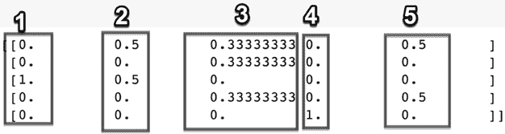

图 4.8：转移矩阵

注意，我们图的转移矩阵是 5 x 5。每列对应图中的每个节点。例如，第二列是关于第二个节点的信息。访问者从节点 2 导航到节点 1 或节点 3 的概率为 `0.5`。请注意，在我们的图中，转移矩阵的对角线为 `0`，因为没有节点自身到自身的出站链接。在实际网络中，这可能是可能的。

注意，转移矩阵是一个稀疏矩阵。随着节点数量的增加，其大部分值将为 `0`。因此，图的结构被提取为*转移矩阵*。在转移矩阵中，节点以列和行表示：

+   **列**：指示网络浏览者在线的节点

+   **行**：指示浏览者因出站链接而访问其他节点的概率

在真实的网络中，PageRank 算法所需的转移矩阵是由蜘蛛持续探索链接建立的。

# 理解线性规划

许多现实世界问题涉及最大化或最小化一个目标，并且有一些给定的约束条件。一种方法是将目标指定为某些变量的线性函数。我们还将资源约束条件表述为这些变量上的等式或不等式。这种方法被称为线性规划问题。线性规划背后的基本算法是由乔治·丹齐格（George Dantzig）在 20 世纪 40 年代初在加利福尼亚大学伯克利分校开发的。丹齐格在为美国空军工作时，利用这一概念进行部队物流供给与产能规划的实验。

第二次世界大战结束时，丹齐格开始为五角大楼工作，并将他的算法发展成了一种叫做线性规划的技术。这一技术被用于军事作战规划。

今天，它被用于解决与基于某些约束条件最小化或最大化一个变量相关的重要现实世界问题。以下是一些此类问题的例子：

+   基于资源最小化修车时间

+   在分布式计算环境中分配可用的分布式资源，以最小化响应时间

+   基于公司内部资源的最优分配来最大化公司的利润

## 构建线性规划问题

使用线性规划的条件如下：

+   我们应该能够通过一组方程来构建问题。

+   方程中使用的变量必须是线性的。

### 定义目标函数

请注意，上述三个例子的目标都是关于最小化或最大化一个变量。这个目标在数学上被表述为其他变量的线性函数，称为目标函数。线性规划问题的目标是最小化或最大化目标函数，同时保持在指定的约束条件内。

### 指定约束条件

在尝试最小化或最大化某个变量时，现实世界问题中往往会有一些需要遵守的约束条件。例如，在试图最小化修车时间时，我们还需要考虑到可用的机械师数量有限。通过线性方程来指定每个约束条件是构建线性规划问题的重要部分。

## 一个实际应用——使用线性规划进行产能规划

让我们看看一个实际的用例，看看如何使用线性规划来解决现实世界中的问题。

假设我们想要最大化一家先进工厂的利润，该工厂生产两种不同类型的机器人：

+   **高级模型**（**A**）：该模型提供完整的功能。制造每个高级模型单位的利润为$4,200。

+   **基本模型**（**B**）：该模型只提供基本功能。制造每个基本模型单位的利润为$2,800。

制造一台机器人需要三种不同类型的人。每种类型机器人制造所需的具体天数如下：

| **机器人类型** | **技术员** | **AI 专家** | **工程师** |
| --- | --- | --- | --- |
| **机器人 A：高级模型** | 3 天 | 4 天 | 4 天 |
| **机器人 B：基础模型** | 2 天 | 3 天 | 3 天 |

工厂采用 30 天的周期运行。每个 AI 专家在一个周期内有 30 天的可用时间。每个工程师在 30 天内会休息 8 天，因此，工程师每个周期只能工作 22 天。一个技术员在 30 天的周期中有 20 天可用。

下表显示了我们工厂中有多少人：

|  | **技术员** | **AI 专家** | **工程师** |
| --- | --- | --- | --- |
| **人数** | 1 | 1 | 2 |
| **周期总天数** | 1 x 20 = 20 天 | 1 x 30 = 30 天 | 2 x 22 = 44 天 |

这可以按如下方式建模：

+   最大利润 = 4200A + 2800B

+   受以下限制：

    +   `A ≥ 0`：生产的高级机器人数量可以是 0 或更多。

    +   `B ≥ 0`：生产的基础机器人数量可以是 0 或更多。

    +   `3A + 2B ≤ 20`：这些是技术员可用时间的约束。

    +   `4A+3B ≤ 30`：这些是 AI 专家可用时间的约束。

    +   `4A + 3B ≤ 44`：这些是工程师可用时间的约束。

首先，我们导入名为`pulp`的 Python 包，它用于实现线性规划：

```py
import pulp 
```

然后，我们调用此包中的`LpProblem`函数来实例化问题类，并将实例命名为`利润最大化问题`：

```py
# Instantiate our problem class
model = pulp.LpProblem("Profit_maximising_problem", pulp.LpMaximize) 
```

然后，我们定义了两个线性变量`A`和`B`。变量`A`表示生产的高级机器人数量，变量`B`表示生产的基础机器人数量：

```py
A = pulp.LpVariable('A', lowBound=0,  cat='Integer')
B = pulp.LpVariable('B', lowBound=0, cat='Integer') 
```

我们按如下方式定义目标函数和约束条件：

```py
# Objective function
model += 5000 * A + 2500 * B, "Profit"
# Constraints
model += 3 * A + 2 * B <= 20 
model += 4 * A + 3 * B <= 30
model += 4 * A + 3 * B <= 44 
```

我们使用`solve`函数生成解决方案：

```py
# Solve our problem
model.solve()
pulp.LpStatus[model.status] 
```

然后，我们打印出`A`和`B`的值以及目标函数的值：

```py
# Print our decision variable values
print (A.varValue)
print (B.varValue) 
```

输出结果是：

```py
6.0
1.0 
```

```py
# Print our objective function value
print (pulp.value(model.objective)) 
```

它打印出：

```py
32500.0 
```

线性规划广泛应用于制造业，用于寻找应使用的最优产品数量，以优化现有资源的使用。

本章到此结束！让我们总结一下所学的内容。

# 总结

在本章中，我们研究了设计算法的各种方法。我们考察了选择正确算法设计时的权衡。我们还讨论了制定现实世界问题的最佳实践，并学习了如何解决实际的优化问题。本章所学的内容可以用于实现设计良好的算法。

在下一章中，我们将重点介绍基于图的算法。我们将首先研究图的不同表示方式。接下来，我们将学习在各种数据点周围建立邻域的技术，以进行特定调查。最后，我们将研究在图中查找信息的最佳方法。

# 在 Discord 上了解更多

要加入本书的 Discord 社区——在这里你可以分享反馈、向作者提问，并了解新版本的发布——请扫描下面的二维码：

[`packt.link/WHLel`](https://packt.link/WHLel)


