# 第五章：图算法

图提供了一种独特的数据结构表示方式，尤其与结构化或表格数据相比。虽然结构化数据（如数据库）擅长存储和查询静态、统一的信息，但图在捕捉存在于实体之间的复杂关系和模式方面表现出色。以 Facebook 为例，每个用户都是一个节点，每个友谊或互动就是一个连接的边；这种连接的网络最好通过图结构来表示和分析。

在计算领域，某些问题，尤其是涉及关系和连接的问题，更自然地通过图算法来解决。这些算法的核心目标是理解图的结构。理解这一结构意味着要弄清楚数据点（或节点）是如何通过连接（或边）相互关联的，以及如何有效地导航这些连接以提取或分析所需的数据。

在本章中，我们将踏上以下领域的探索之旅：

+   **图表示**：捕捉图的各种方式。

+   **网络理论分析**：网络结构背后的基础理论。

+   **图遍历**：有效遍历图的技巧。

+   **案例研究**：通过图算法深入分析欺诈行为。

+   **邻域技术**：确定和分析大型图中局部区域的方法。

完成本章后，我们将对图作为数据结构有一个坚实的理解。我们应当能够构建复杂的关系—无论是直接的还是间接的—并将能够使用图算法解决复杂的现实问题。

# 理解图：简要介绍

在现代数据的广阔互联景观中，超越表格模型的局限，图结构作为强大的工具，能够 encapsulate（封装）复杂的关系。它们的崛起不仅仅是一个趋势，而是对数字世界错综复杂的结构所带来的挑战的回应。图论中的历史性进展，例如莱昂哈德·欧拉（Leonhard Euler）对柯尼斯堡七桥问题的开创性解决方案，为理解复杂关系奠定了基础。欧拉将现实世界问题转化为图形表示的方法，彻底改变了我们看待和操作图的方式。

## 图：现代数据网络的支柱

图不仅为社交媒体网络和推荐引擎等平台提供了支撑，还作为打开看似无关领域中模式的钥匙，例如道路网络、电路、分子、生态系统，甚至计算机程序中的逻辑流。图的关键在于它们内在的能力，能够表达有形和无形的互动。

那么，为什么这种由节点和边组成的结构在现代计算中如此重要呢？答案就在于图算法。专门为理解和解析关系而设计的这些数学算法，精确地处理连接。它们通过明确的步骤解码图结构，揭示出图的总体特征以及复杂的细节。

在深入探讨图的表示方式之前，首先要建立对其背后机制的基础理解。图结构，根植于数学和计算机科学的丰富土壤，为描绘实体之间关系提供了一种形象的方法。

### 现实世界的应用

现代数据中日益复杂的模式和连接，在图论中找到了清晰的解释。简单的节点和边背后，蕴藏着解决世界上一些最复杂问题的答案。当图算法的数学精确性遇到现实世界的挑战时，其结果往往会带来令人惊讶的变革性影响。

+   **欺诈检测**：在数字金融世界中，欺诈交易往往彼此紧密相连，构成一张微妙的网络，旨在欺骗传统的检测系统。图论被用来识别这些模式。例如，从单一来源到多个账户的相互连接的小额交易突然激增，可能是洗钱的迹象。

    通过将这些交易绘制成图，分析人员可以识别出异常模式，隔离可疑节点，并追溯潜在欺诈的来源，从而确保数字经济的安全。

+   **航空交通管制**：天空中充满了忙碌的航班。每架飞机必须在确保与其他航班保持安全距离的同时，穿越复杂的航线迷宫。图算法为天空绘制了路线，将每架飞机视为节点，其航线视为边。2010 年美国空中交通拥堵事件证明了图分析的威力。科学家们使用图论解读了系统性级联延误，提供了优化航班安排的见解，减少未来此类事件的发生。

+   **疾病传播建模**：疾病，尤其是传染性疾病的传播，并非随机发生；它们遵循人类互动和流动的隐形轨迹。图论构建了复杂的模型来模拟这些模式。通过将个体视为节点，将他们的互动视为边，流行病学家成功地预测了疾病的传播，识别潜在的热点，并实施及时的干预。例如，在 COVID-19 疫情初期，图算法在预测潜在的爆发聚集区方面发挥了重要作用，帮助指导封锁和其他预防措施。

+   **社交媒体推荐**：曾想过像 Facebook 或 Twitter 这样的平台如何推荐朋友或内容吗？这些推荐背后潜藏着巨大的图，代表用户的互动、兴趣和行为。例如，如果两个用户有多个共同的朋友或相似的参与模式，他们可能彼此认识或有相同的兴趣。图算法帮助解码这些连接，使平台能够通过相关推荐增强用户体验。

## 图的基础：顶点（或节点）

这些是图中的个体实体或数据点。想象一下你 Facebook 列表中的每个朋友都是一个独立的顶点：

+   **边（或链接**）：顶点之间的连接或关系。当你在 Facebook 上添加朋友时，你的顶点和他们的顶点之间形成一条边。

+   **网络**：由顶点和边的互联网形成的更大结构。例如，整个 Facebook，以及其所有用户及其友谊，可以被视为一个巨大的网络。

在 *图 5.1* 中，**A**、**B** 和 **C** 表示顶点，而连接它们的线条则是边。这是一个图的简单表示，为我们将要探索的更复杂的结构和操作奠定了基础。

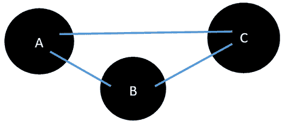

图 5.1：简单图的图形表示

# 图论和网络分析

图论和网络分析虽然交织在一起，但在理解复杂系统方面具有不同的功能。图论是离散数学的一个分支，提供节点（实体）和边（关系）的基本概念，而网络分析则是将这些原理应用于研究和解释现实世界网络的应用。例如，图论可以定义社交媒体平台的结构，其中个体是节点，而友谊是边；相反，网络分析则深入研究这种结构，揭示模式，如影响者中心或孤立社区，从而提供关于用户行为和平台动态的可操作见解。

我们将首先看看如何在数学上和视觉上表示这些图。然后，我们将利用一组被称为“图算法”的关键工具对这些表示进行网络分析。

# 图的表示方式

图是一种用顶点和边表示数据的结构。一个图被表示为 *a*[Graph] = (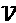, 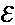)，其中 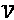 表示顶点集合，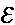 表示边集合。请注意 *a*[Graph] 有 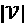 个顶点和  条边。需要注意的是，除非另有说明，边可以是双向的，表示连接的顶点之间存在双向关系。

一个顶点，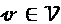，代表一个现实世界的对象，如一个人、一台计算机或一个活动。一个边，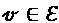，连接网络中的两个顶点：

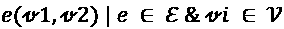

上述方程表示，在图中，所有的边属于一个集合，，所有的顶点属于另一个集合，。请注意，符号‘|’表示某个元素属于特定的集合，从而确保了边、顶点及其相应集合之间关系的清晰性。

一个顶点象征着像个人或计算机等有形实体，而一条边，连接两个顶点，表示它们之间的关系。这种关系可以是个体之间的友谊、在线连接、设备之间的物理连接，或者是像参加会议这样的参与性连接。

# 图的机制与类型

图有多种类型，每种图都有其独特的属性：

+   **简单图**：没有平行边或自环的图。

+   **有向图（DiGraph）**：每条边都有方向，表示单向关系的图。

+   **无向图**：一类边没有特定方向，表示相互关系的图。

+   **加权图**：一类每条边都有一个权重的图，通常代表距离、成本等。

在本章中，我们将使用 `networkx` Python 包来表示图。可以从[`networkx.org/`](https://networkx.org/)下载。让我们尝试使用 Python 中的 `networkx` 包来创建一个简单的图。所谓“简单图”，正如图论中所提到的，是指没有平行边或自环的图。首先，让我们尝试创建一个没有顶点或节点的空图，`aGraph`：

```py
import networkx as nx
graph = nx.Graph() 
```

让我们添加一个单独的顶点：

```py
graph.add_node("Mike") 
```

我们还可以通过列表添加一系列顶点：

```py
graph.add_nodes_from(["Amine", "Wassim", "Nick"]) 
```

我们还可以在现有顶点之间添加一条边，如下所示：

```py
graph.add_edge("Mike", "Amine") 
```

现在让我们打印边和顶点：

```py
print(graph.nodes())
print(graph.edges()) 
```

```py
['Mike', 'Amine', 'Wassim', 'Nick']
[('Mike', 'Amine')] 
```

请注意，如果我们添加一条边，这也会导致添加相关的顶点，如果这些顶点尚不存在，如下所示：

```py
G.add_edge("Amine", "Imran") 
```

如果我们打印节点列表，观察到的输出如下：

```py
print(graph.edges()) 
```

```py
[('Mike', 'Amine'), ('Amine', 'Imran')] 
```

请注意，添加已存在的顶点的请求会被默默忽略。请求会根据我们创建的图的类型被忽略或考虑。

## 自我中心化网络

许多网络分析的核心概念是自我中心化网络，或简而言之，称为自我网络。想象一下，你不仅想研究一个单独的节点，还想研究它的周围环境。这时，自我网络就派上用场了。

### 自我网络的基础

对于一个给定的顶点——我们称其为 *m*——与 *m* 直接连接的周围节点构成了 *m* 的直接邻域。这个邻域，加上 *m* 本身，就构成了 *m* 的自我网络。在这个语境下：

+   *m* 被称为 *自我*。

+   直接连接的节点被称为 *一跳邻居* 或简单称为 *替代节点*。

### 一跳、二跳及更远的节点

当我们说“单跳邻居”时，我们指的是与我们关注的节点直接相连的节点。可以把它看作是从一个节点到下一个节点的一步或“一跳”。如果我们考虑两个跳跃之远的节点，那么它们被称为“二跳邻居”，以此类推。这种命名法可以扩展到任意数量的跳跃，帮助我们理解*n*度邻域。

特定节点**3**的自我网络如下图所示：

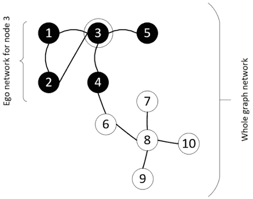

图 5.2：节点 3 的自我网络，展示了自我和它的单跳邻居

### 自我网络的应用

自我网络在社会网络分析中被广泛使用。它们对于理解大规模网络中的局部结构至关重要，并能基于个体的即时网络环境提供关于个体行为的见解。

例如，在在线社交平台中，自我网络可以帮助检测有影响力的节点，或理解信息在局部网络区域内的传播模式。

# 引入网络分析理论

网络分析使我们能够深入研究互联的数据，并将其呈现为网络形式。它涉及研究和应用方法论，以检查这种网络格式中排列的数据。在这里，我们将分解与网络分析相关的核心要素和概念。

网络的核心是“顶点”，它作为基本单元存在。可以把网络想象成一个网状结构；顶点是这个网的节点，而连接它们的边表示不同实体之间的关系。值得注意的是，两个顶点之间可能存在不同的关系，这意味着边可以被标记为表示不同类型的关系。比如，假设有两个人，他们可以通过“朋友”或“同事”关系相连；这两者都是不同的关系，但连接的是同样的个体。

为了充分利用网络分析的潜力，至关重要的是评估顶点在网络中的重要性，尤其是针对具体问题。存在多种技术可以帮助我们确认这一重要性。

让我们来看一下网络分析理论中一些重要的概念。

## 理解最短路径

在图论中，“路径”被定义为一系列节点，连接起始节点和结束节点，且不经过任何中间节点的重复。简而言之，路径描绘了两者之间的路线。这条路径的“长度”是通过计算其中包含的边数来确定的。在两个节点之间的各种路径中，包含边数最少的路径被称为“最短路径”。

确定最短路径是许多图算法中的一项基本任务。然而，这一任务并非总是简单明了的。随着时间的推移，已经开发了多种算法来解决这个问题，其中最著名的之一就是 20 世纪 50 年代末提出的迪杰斯特拉算法。该算法旨在找出图中的最短距离，并已广泛应用于 GPS 设备等领域，依赖它来推算两个点之间的最短距离。在网络路由领域，迪杰斯特拉方法再次证明了它的宝贵价值。

像谷歌和苹果这样的科技公司正在进行一场持续的竞争，特别是在增强它们的地图服务方面。目标不仅是识别最短路线，还要快速完成，通常在几秒钟内。

在本章的后面，我们将探讨**广度优先搜索**（**BFS**）算法，这是一种可以作为迪杰斯特拉算法基础的方法。标准 BFS 假设图中任何路径的遍历成本相等。然而，迪杰斯特拉算法考虑了不同的遍历成本。为了将 BFS 转化为迪杰斯特拉算法，我们需要整合这些不同的遍历成本。

最后，尽管迪杰斯特拉算法侧重于从单一源点到所有其他顶点的最短路径识别，但如果目标是确定图中每对顶点之间的最短路径，则弗洛伊德-沃尔沙尔算法更为适合。

### 创建邻域

在深入研究图算法时，“邻域”这一术语经常出现。那么，在这种情况下，我们所说的“邻域”是什么意思呢？可以把它想象成围绕某个特定节点的紧密社区。这个“社区”由那些直接连接或与焦点节点密切相关的节点组成。

作为类比，想象一个城市地图，其中地标代表节点。位于某一显著地点附近的地标形成其“邻域”。

划分这些邻域的广泛采用的方法是通过*k*-阶策略。在这里，我们通过确定距离节点*k*跳远的顶点来界定一个节点的邻域。为了更直观的理解，当*k*=*1*时，邻域包含所有与焦点节点直接相连的节点。对于*k*=*2*，它扩展到包括那些与这些直接邻居相连的节点，模式继续下去。

想象一个圆圈中的中心点作为我们的目标顶点。当*k*=*1*时，任何与这个中心点直接连接的点就是它的邻居。随着*k*的增加，圆圈的半径增大，包含了距离更远的点。

利用和解释邻域对于图算法来说是重要的，因为它帮助识别关键的分析区域。

让我们看一下创建邻域的各种标准：

1.  三角形

1.  密度

让我们更详细地探讨这些内容。

### 三角形

在广阔的图论世界中，识别那些具有强大互联关系的顶点可以揭示重要的洞察。经典的方法是寻找三角形——即三个节点彼此之间保持直接连接的子图。

我们通过一个实际的应用案例——欺诈检测来探索这个问题，接下来的案例研究中将对此进行更详细的分析。想象一个相互连接的网络——一个“自我网络”——围绕一个中心人物展开——我们称他为马克斯。在这个自我网络中，除了马克斯之外，还有两个人，爱丽丝和鲍勃。现在，这三人形成了一个“三角形”——马克斯是我们的核心人物（或“自我”），而爱丽丝和鲍勃是次要人物（或“他者”）。

这时事情变得有趣了：如果爱丽丝和鲍勃有过欺诈活动的记录，那么这就引起了对马克斯可信度的质疑。这就像发现你的两个亲密朋友曾参与可疑的行为——自然会让你处于审视之下。然而，如果其中只有一个人有可疑的过去，那么马克斯的情况就变得模糊了。我们不能直接给他贴上标签，而需要更深入的调查。

为了更直观地理解，想象马克斯处于一个三角形的中心，爱丽丝和鲍勃位于另外两个顶点。它们之间的相互关系，特别是如果带有负面含义时，可以影响人们对马克斯诚信的看法。

### 密度

在图论中，密度是衡量网络紧密程度的一个指标。具体来说，它是图中实际存在的边数与最大可能的边数之比。在数学上，对于一个简单的无向图，密度定义为：

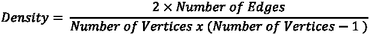

为了更好地理解这一点，让我们来看一个例子：

假设我们是一个有五个成员的书籍俱乐部成员：爱丽丝、鲍勃、查理、戴夫和伊芙。如果每个成员都认识并与其他每个成员都有互动，那么他们之间将总共有 10 条连接（或边）（爱丽丝-鲍勃、爱丽丝-查理、爱丽丝-戴夫、爱丽丝-伊芙、鲍勃-查理，等等）。在这种情况下，最大可能的连接数或边数是 10。如果这些连接都存在，那么密度就是：

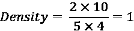

这表明一个完全密集或完全连接的网络。

然而，假设爱丽丝只认识鲍勃和查理，鲍勃认识爱丽丝和戴夫，查理只认识爱丽丝。戴夫和伊芙虽然是成员，但尚未与任何人互动。在这种情况下，实际上只有三条连接：爱丽丝-鲍勃、爱丽丝-查理和鲍勃-戴夫。让我们来计算密度：

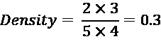

这个值小于 1，表明书籍俱乐部的互动网络并没有完全连接；许多潜在的互动（边）尚未发生。

从本质上讲，接近 1 的密度表示网络连接紧密，而接近 0 的值则表明互动稀疏。理解密度有助于多种场景，从分析社交网络到优化基础设施规划，通过评估系统元素的互联程度。

## 理解中心性度量

中心性度量提供了一个了解图中各个节点重要性的窗口。可以将中心性看作是识别网络中关键角色或枢纽的工具。例如，在社交环境中，它有助于确定具有影响力的人物或核心人物。在城市规划中，中心性可能表明在交通流动或可达性方面发挥关键作用的建筑物或交汇点。理解中心性至关重要，因为它揭示了网络中对功能、凝聚力或影响力至关重要的节点。

在图分析中最常用的中心性指标包括：

+   **度数**：反映一个节点的直接连接。

+   **介数**：表示一个节点在两其他节点之间的最短路径上充当桥梁的频率。

+   **紧密度**：表示一个节点距离网络中所有其他节点的远近。

+   **特征向量**：根据节点连接的质量而非数量来衡量节点的影响力。

注意，中心性度量适用于所有图。正如我们所知，图是对象（顶点或节点）及其关系（边）的通用表示形式，中心性度量有助于识别这些节点在图中的重要性或影响力。回想一下，网络是图的特定实现或应用，通常表示像社交网络、交通系统或通信网络这样的现实世界系统。因此，虽然讨论的中心性度量可以广泛应用于所有类型的图，但它们常常在网络的上下文中得到强调，因为它们在理解和优化现实世界系统中具有实际意义。

让我们更深入地探讨这些指标，以更好地理解它们的实用性和细微差别。

### 度数

连接到特定顶点的边的数量称为其**度数**。它可以表示一个特定顶点的连接程度以及其在网络中快速传播消息的能力。

让我们考虑 *a*[图] = (, 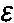)，其中 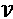 代表一组顶点， 代表一组边。回想一下，*a*[图] 有 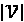 个顶点和  条边。如果我们将节点的度数除以 (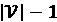)，这就是度数中心性：

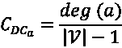

现在，让我们看一个具体的例子。考虑以下图：

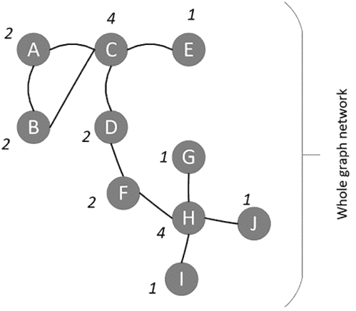

图 5.3：一个示例图，说明了度数和度数中心性的概念

现在，在前面的图中，顶点 *C* 的度为 4。它的度中心性可以通过以下方式计算：

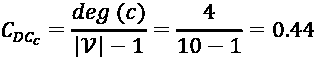

### 介数

介数中心性是衡量图中顶点重要性的关键指标。在社交媒体背景下，它评估一个人在特定子群体中进行通信的关键角色的可能性。在计算机网络中，当顶点代表计算机时，介数可以提供关于如果某个计算机（或顶点）发生故障时，它对节点间通信的潜在影响的见解。

计算顶点 *a* 的介数，给定 *a*[图] = (, )，按以下步骤进行：

1.  计算 *a*[图] 中每对顶点之间的最短路径。我们可以用 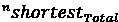 来表示。

1.  从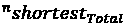中，计算通过顶点 *a* 的最短路径数量。我们可以用 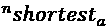 来表示。

1.  通过以下方式计算介数：

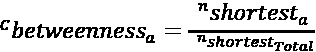

### 公平性与接近度

在图论中，我们通常希望确定一个特定顶点与其他顶点之间的中心性或距离。一种量化此概念的方法是计算一个称为“公平性”的指标。对于给定的顶点“a”和图“g”，公平性通过将顶点“a”到图中每个其他顶点的距离相加来确定。本质上，它让我们了解一个顶点与其邻居之间的“分布”或“远近”。这个概念与中心性密切相关，中心性衡量的是一个顶点与所有其他顶点之间的整体距离。

相反，接近度可以被视为公平性的对立面。虽然直觉上可能认为接近度是顶点与其他顶点距离之和的负值，但从技术上讲并不准确。接近度衡量的是一个顶点与图中所有其他顶点的接近程度，通常通过取其到其他顶点距离之和的倒数来计算。

公平性和接近度是网络分析中至关重要的指标。它们提供了有关信息如何在网络中流动或某个特定节点可能有多大影响力的洞察。通过理解这些指标，可以深入理解网络结构及其潜在的动态。

### 特征向量中心性

特征向量中心性是一种评估图中节点重要性的指标。它不仅考虑节点的直接连接数，还考虑这些连接的质量。简而言之，如果一个节点与其他在网络中具有重要地位的节点相连接，那么这个节点就被视为重要。

为了给这个问题增加一些数学背景，假设每个节点 *v* 都有一个中心性得分 *x*(*v*)。对于每个节点 *v*，它的特征向量中心性是基于它的邻居节点的中心性得分之和，并按一个因子进行缩放！[](img/B18046_05_030.png)（特征向量的相关特征值）：

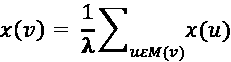

其中 *M*(*v*) 表示 *v* 的邻居节点。

根据节点的邻居加权节点重要性这一思想，为谷歌开发 PageRank 算法时奠定了基础。该算法为互联网上的每个网页分配一个排名，表示其重要性，且深受特征向量中心性概念的影响。

对于有兴趣了解我们即将展示的瞭望塔示例的读者，理解特征向量中心性的本质将为复杂网络分析技术的运作提供更深入的见解。

## 使用 Python 计算中心性指标

让我们创建一个网络，然后尝试计算它的中心性指标。

### 1\. 建立基础：库和数据

这包括导入必要的库和定义我们的数据：

```py
import networkx as nx
import matplotlib.pyplot as plt 
```

对于我们的示例，我们考虑了一组顶点和边：

```py
vertices = range(1, 10)
edges = [(7, 2), (2, 3), (7, 4), (4, 5), (7, 3), (7, 5), (1, 6), (1, 7), (2, 8), (2, 9)] 
```

在这个设置中，顶点代表网络中的单个点或节点。边则表示这些节点之间的关系或链接。

### 2\. 构建图形

基础设置完成后，我们继续构建我们的图形。这涉及将我们的数据（顶点和边）输入到图结构中：

```py
graph = nx.Graph()
graph.add_nodes_from(vertices)
graph.add_edges_from(edges) 
```

这里，`Graph()` 函数初始化一个空图。随后的方法 `add_nodes_from` 和 `add_edges_from` 将我们的定义的节点和边添加到这个图中。

### 3\. 描绘图像：可视化图形

图形表示通常比原始数据更具表达力。可视化不仅有助于理解，还能提供图形整体结构的快照：

```py
nx.draw(graph, with_labels=True, node_color='y', node_size=800)
plt.show() 
```

这段代码为我们绘制图形。`with_labels=True` 方法确保每个节点都有标签，`node_color` 提供不同的颜色，`node_size` 调整节点大小以提高可读性。

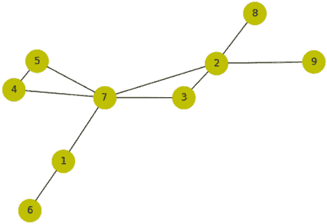

图 5.4：图形的示意表示，展示了节点及其相互关系

一旦我们的图形建立完成，下一步关键是计算并理解每个节点的中心性度量。正如前面所讨论的，中心性度量衡量了节点在网络中的重要性。

+   **度中心性**：这个度量值给出了一个特定节点连接的节点的比例。简单来说，如果一个节点具有高的度中心性，它就与图中的许多其他节点相连。`nx.degree_centrality(graph)` 函数返回一个字典，字典的键是节点，值是它们相应的度中心性：

    ```py
    print("Degree Centrality:", nx.degree_centrality(graph)) 
    ```

    ```py
    Degree Centrality: {1: 0.25, 2: 0.5, 3: 0.25, 4: 0.25, 5: 0.25, 6: 0.125, 7: 0.625, 8: 0.125, 9: 0.125} 
    ```

+   **介数中心性**：这一度量表示通过特定节点的最短路径数量。具有高介数中心性的节点可以视为图中不同部分之间的“桥梁”或“瓶颈”。函数`nx.betweenness_centrality(graph)`可以为每个节点计算这一度量：

    ```py
    print("Betweenness Centrality:", nx.betweenness_centrality(graph)) 
    ```

    ```py
    Betweenness Centrality: {1: 0.25, 2: 0.46428571428571425, 3: 0.0, 4: 0.0, 5: 0.0, 6: 0.0, 7: 0.7142857142857142, 8: 0.0, 9: 0.0} 
    ```

+   **接近中心性**：这表示一个节点与图中所有其他节点的接近程度。具有高接近中心性的节点能够迅速与所有其他节点进行互动，因此位于图的中心。这个衡量标准通过`nx.closeness_centrality(graph)`计算：

    ```py
    print("Closeness Centrality:", nx.closeness_centrality(graph)) 
    ```

    ```py
    Closeness Centrality: {1: 0.5, 2: 0.6153846153846154, 3: 0.5333333333333333, 4: 0.47058823529411764, 5: 0.47058823529411764, 6: 0.34782608695652173, 7: 0.7272727272727273, 8: 0.4, 9: 0.4} 
    ```

+   **特征向量中心性**：与度中心性通过计算直接连接的数量不同，特征向量中心性考虑了这些连接的质量或强度。与其他高得分节点连接的节点会得到加权，从而成为影响力节点的衡量标准。为了便于解释，我们进一步对这些中心性值进行排序：

    ```py
    eigenvector_centrality = nx.eigenvector_centrality(graph)
    sorted_centrality = sorted((vertex, '{:0.2f}'.format(centrality_val)) 
                               for vertex, centrality_val in eigenvector_centrality.items())
    print("Eigenvector Centrality:", sorted_centrality) 
    ```

    ```py
    Eigenvector Centrality: [(1, '0.24'), (2, '0.45'), (3, '0.36'), (4, '0.32'), (5, '0.32'), (6, '0.08'), (7, '0.59'), (8, '0.16'), (9, '0.16')] 
    ```

请注意，中心性度量值预计将给出图或子图中特定顶点的中心性度量。通过查看图形，标记为*7*的顶点似乎处于最中心的位置。顶点 7 在所有四个中心性度量中具有最高的值，因此反映了它在此上下文中的重要性。

现在让我们来看一下如何从图中获取信息。图是复杂的数据结构，包含了存储在顶点和边中的大量信息。我们将探讨一些有效的策略，帮助我们高效地在图中导航，以便收集信息来回答查询。

## 社会网络分析

**社会网络分析**（**SNA**）作为图论中的一个重要应用脱颖而出。其核心是，当分析符合以下标准时，就可以被认为是社会网络分析：

+   图中的顶点代表个体。

+   边表示这些个体之间的社会连接，包括友谊、共同兴趣、家庭纽带、意见差异等。

+   图分析的主要目标是理解显著的社会背景。

社会网络分析（SNA）一个有趣的方面是它能揭示与犯罪行为相关的模式。通过绘制关系和互动，可以识别出可能表明欺诈行为或异常活动的模式。例如，分析连接模式可能揭示出在特定地点存在不寻常的连接或频繁的互动，暗示潜在的犯罪热点或网络。

LinkedIn 在社会网络分析（SNA）相关新技术的研究和发展中做出了巨大贡献。实际上，LinkedIn 可以被看作是该领域许多算法的开创者。

因此，SNA（社会网络分析）——由于其固有的分布式和互联架构——是图论最强大的应用之一。抽象图形的另一种方式是将其视为一个网络，并应用针对网络设计的算法。这个领域被称为网络分析理论，我们接下来将讨论它。

# 理解图遍历

为了利用图形，必须从中挖掘信息。图遍历被定义为一种策略，用来确保每个顶点和边都按顺序访问。我们的目标是确保每个顶点和边都被访问一次且仅一次——既不多也不少。大致上，遍历图形搜索其中数据的方式可以有两种不同的方式。

在本章前面我们学到，通过宽度进行遍历叫做**广度优先搜索**（**BFS**）——通过深度进行遍历叫做**深度优先搜索**（**DFS**）。让我们逐一了解它们。

## BFS

当我们处理的*图形*（a）具有邻居层级或级别的概念时，BFS 效果最佳。例如，当一个人在 LinkedIn 上的连接以图的形式表示时，首先是一级连接，然后是二级连接，这直接转化为层次。

BFS 算法从根顶点开始，探索邻域中的顶点。然后它移动到下一个邻域层级并重复这个过程。

让我们看一下 BFS 算法。首先，考虑以下无向图：

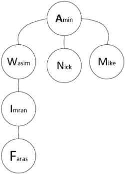

图 5.5：展示个人连接的无向图

### 构建邻接表

在 Python 中，字典数据结构非常适合表示图的邻接表。下面是我们如何定义一个无向图：

```py
graph={ 'Amin'   : {'Wasim', 'Nick', 'Mike'},
         'Wasim' : {'Imran', 'Amin'},
         'Imran' : {'Wasim','Faras'},
         'Faras' : {'Imran'},
         'Mike'  : {'Amin'},
         'Nick' :  {'Amin'}} 
```

为了在 Python 中实现它，我们将按如下步骤进行。

我们将首先解释初始化，然后是主循环。

### BFS 算法实现

算法实现将涉及两个主要阶段：初始化和主循环。

#### 初始化

我们遍历图形的过程依赖于两个关键的数据结构：

+   **visited**：一个集合，用于存储我们已探索的所有顶点。它开始时为空。

+   **queue**：一个列表，用来存储待探索的顶点。最初，它只包含我们的起始顶点。

#### 主循环

BFS 的主要逻辑围绕着逐层探索节点展开：

1.  从队列中移除第一个节点，并将其视为当前迭代的节点：

    ```py
    node = queue.pop(0) 
    ```

1.  如果节点没有被访问过，标记为已访问并获取其邻居：

    ```py
    if node not in visited:
        visited.add(node)
        neighbours = graph[node] 
    ```

1.  将未访问的邻居添加到队列中：

    ```py
    for neighbour in neighbours:
        if neighbour not in visited:
            queue.append(neighbour) 
    ```

1.  一旦主循环完成，返回`visited`数据结构，它包含了所有已遍历的节点。

#### 完整的 BFS 代码实现

完整的代码，包括初始化和主循环，将如下所示：

```py
def bfs(graph, start):
    visited = set()
    queue = [start]
    while queue:
        node = queue.pop(0)
        if node not in visited:
            visited.add(node)
            neighbours = graph[node]
            unvisited_neighbours = [neighbour for neighbour in neighbours                                     if neighbour not in visited]
            queue.extend(unvisited_neighbours)
   return visited 
```

BFS 遍历机制如下：

1.  过程从第一层开始，由节点“Amin”表示。

1.  它接着扩展到第二层，访问“Wasim”、“Nick”和“Mike”。

1.  随后，BFS 深入到第三层和第四层，分别访问“Imran”和“Faras”。

当 BFS 完成遍历时，所有节点都已记录在已访问集合中，队列为空。

### 使用 BFS 进行特定搜索

为了更好地理解 BFS 的实际操作，我们将使用已实现的函数来查找图中到特定人的路径：

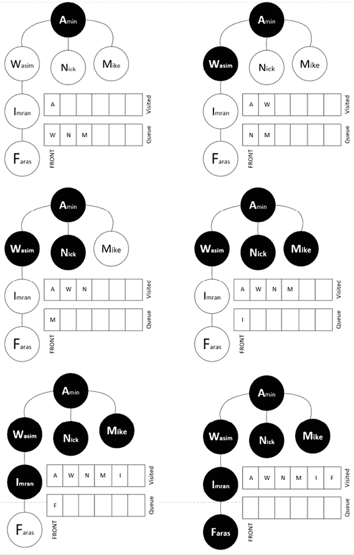

图 5.6：使用 BFS 对图进行层级遍历

现在，让我们尝试使用 BFS 从这个图中找到某个特定的人。我们来指定要搜索的数据，并观察结果：

```py
start_node = 'Amin'
print(bfs(graph, start_node)) 
```

```py
{'Faras', 'Nick', 'Wasim', 'Imran', 'Amin', 'Mike'} 
```

这表示 BFS 从`Amin`开始时访问的节点顺序。

现在让我们来看一下 DFS 算法。

## DFS

**DFS** 提供了与 **BFS** 不同的图遍历方式。BFS 按层级逐层探索图，首先关注邻近的节点，而 DFS 则尽可能深入某条路径，直到回溯再继续探索其他路径。

想象一棵树。从根部开始，DFS 会深入到某个分支的最远叶子节点，标记沿着该分支的所有节点为已访问，然后回溯以类似的方式探索其他分支。这个思想是先到达给定分支上的最远叶节点，再考虑其他分支。“叶子”是指树中没有任何子节点的节点，或者在图的上下文中，指没有被访问的相邻节点。

为了确保遍历不会陷入死循环，特别是在有环图中，DFS 使用了一个布尔标志。该标志表示某个节点是否已经被访问，从而防止算法重新访问已访问的节点，避免陷入无限循环。

为了实现 DFS，我们将使用栈数据结构，这在*第二章*中已经详细讨论过，*算法中的数据结构*。记住，栈遵循**后进先出**（**LIFO**）原则。这与队列不同，队列用于 BFS 时遵循**先进先出**（**FIFO**）原则：

以下代码用于 DFS：

```py
def dfs(graph, start, visited=None):
    if visited is None:
        visited = set()
    visited.add(start)
    print(start)
    for next in graph[start] - visited:
        dfs(graph, next, visited)
    return visited 
```

让我们再次使用以下代码来测试先前定义的`dfs`函数：

```py
graph={ 'Amin' : {'Wasim', 'Nick', 'Mike'},
         'Wasim' : {'Imran', 'Amin'},
         'Imran' : {'Wasim','Faras'},
         'Faras' : {'Imran'},
         'Mike'  :{'Amin'},
         'Nick'  :{'Amin'}} 
```

如果我们运行此算法，输出将如下所示：

```py
Amin
Wasim
Imran
Faras
Nick
Mike 
```

让我们来看一下使用 DFS 方法遍历这个图的完整模式：

1.  迭代从顶层节点 Amin 开始。

1.  然后，它移动到第二层节点 Wasim。从那里，它继续向下，直到到达末尾，即 Imran 和 Fares 节点。

1.  完成第一个完整的分支后，它回溯并转到第二层，访问 Nick 和 Mike。

遍历模式如*图 5.7*所示：

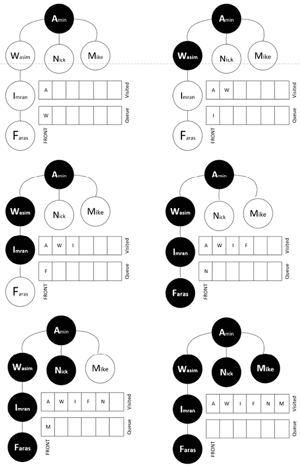

图 5.7：DFS 遍历的可视化表示

注意，DFS 也可以在树中使用。

现在，让我们看一个案例研究，解释我们到目前为止在本章中讨论的概念如何应用于解决现实世界的问题。

# 案例研究：使用社会网络分析（SNA）进行欺诈检测

## 介绍

人类天生具有社交性，他们的行为通常反映了他们的社交圈。在欺诈分析领域，一个叫做“同质性”的原则表示个体之间可能会基于共同的属性或行为而建立联系。例如，一个同质网络可能由来自同一故乡、同一大学或有共同爱好的人组成。其基本原则是，个体的行为，包括欺诈行为，可能会受到他们直接联系的影响。这也有时被称为“通过联系而定罪”。

## 在此背景下，什么是欺诈？

在本案例研究的背景下，欺诈是指可能包括冒充、信用卡盗窃、伪造支票提交或任何其他可以在关系网络中表示和分析的非法活动。为了理解这个过程，首先让我们看一个简单的案例。为此，我们将使用一个包含九个顶点和八条边的网络。在这个网络中，四个顶点是已知的欺诈案例，并被分类为**欺诈**（**F**）。其余五个人没有欺诈相关的历史，分类为**非欺诈**（**NF**）。

我们将通过以下步骤编写代码来生成这个图形：

1.  让我们导入所需的包：

    ```py
    import networkx as nx
    import matplotlib.pyplot as plt 
    ```

1.  定义`顶点`和`边`的数据结构：

    ```py
    vertices = range(1,10)
    edges= [(7,2), (2,3), (7,4), (4,5), (7,3), (7,5), (1,6),(1,7),(2,8),(2,9)] 
    ```

1.  实例化图形：

    ```py
    graph = nx.Graph() 
    ```

1.  现在，绘制图形：

    ```py
    graph.add_nodes_from(vertices)
    graph.add_edges_from(edges)
    positions = nx.spring_layout(graph) 
    ```

1.  让我们定义 NF 节点：

    ```py
    nx.draw_networkx_nodes(graph, positions, 
                           nodelist=[1, 4, 3, 8, 9], 
                           with_labels=True, 
                           node_color='g', 
                           node_size=1300) 
    ```

1.  现在，让我们创建已知涉及欺诈的节点：

    ```py
    nx.draw_networkx_nodes(graph, positions, 
                           nodelist=[1, 4, 3, 8, 9], 
                           with_labels=True, 
                           node_color='g', 
                           node_size=1300) 
    ```

1.  最后，为节点创建标签：

    ```py
    labels = {1: '1 NF', 2: '2 F', 3: '3 NF', 4: '4 NF', 5: '5 F', 6: '6 F', 7: '7 F', 8: '8 NF', 9: '9 NF'}
    nx.draw_networkx_labels(graph, positions, labels, font_size=16)
    nx.draw_networkx_edges(graph, positions, edges, width=3, alpha=0.5, edge_color='b')
    plt.show() 
    ```

一旦上述代码运行，它将显示如下图形：

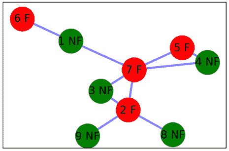

图 5.8：初始网络表示，展示了欺诈节点和非欺诈节点

请注意，我们已经进行过详细的分析，将每个节点分类为图形节点或非图形节点。假设我们将添加一个新的顶点，命名为*q*，如下面的图所示。我们没有关于这个人是否涉及欺诈的先前信息。我们希望根据这个人与社交网络中现有成员的联系，将此人分类为 NF 或 F：

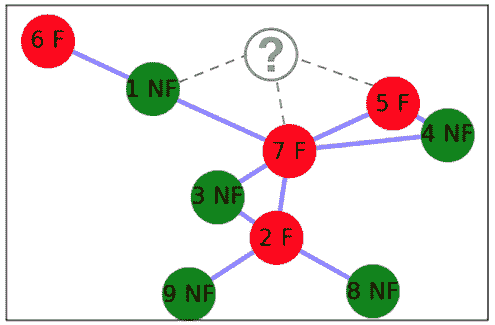

图 5.9：向现有网络引入新节点

我们设计了两种方法来将这个新加入的人（由节点*q*表示）分类为 F 或 NF：

+   使用一个简单的方法，不使用中心性度量和关于欺诈类型的附加信息

+   使用一种瞭望塔方法，这是一种高级技术，利用现有节点的中心性度量，以及关于欺诈类型的附加信息

我们将详细讨论每种方法。

## 进行简单的欺诈分析

简单的欺诈分析技术基于这样一个假设：在一个网络中，个人的行为受到他们所连接的人影响。在一个网络中，两个顶点如果相互连接，它们更可能表现出相似的行为。

基于这个假设，我们将设计一个简单的技术。如果我们想找出某个特定节点*a*属于*F*的概率，该概率表示为*P(F/q)*，其计算方法如下：

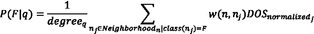

让我们将其应用到前面的图中，其中*Neighborhood*[n]表示顶点*n*的邻域，*w*(*n*, *n*[j])表示*n*与*n*[j]之间连接的权重。另外，*DOS*[normalized]是怀疑程度的标准化值，介于 0 和 1 之间。最后，*degree*[q]是节点*q*的度数。

概率的计算方法如下：

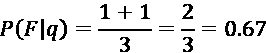

基于这一分析，这个人涉及欺诈的可能性为 67%。我们需要设置一个阈值。如果阈值是 30%，那么此人超过了阈值，我们可以放心地将其标记为*F*。

请注意，这一过程需要对网络中的每个新节点重复进行。

现在，让我们看看进行欺诈分析的高级方法。

## 展示瞭望塔欺诈分析方法

之前的简单欺诈分析技术有以下两个局限性：

+   它并未评估社交网络中每个顶点的重要性。与涉及欺诈的中心节点的连接可能比与一个远离的孤立个体的关系具有不同的含义。

+   在将某人标记为已知的欺诈案例时，我们不考虑犯罪的严重性。

瞭望塔欺诈分析方法解决了这两个局限性。首先，让我们看一下几个概念。

### 负面结果评分

如果已知某人涉及欺诈，我们称该人有一个负面结果。并非每个负面结果的严重性相同。已知冒充他人的人，其负面结果会比仅仅尝试用过期的$20 礼品卡以某种创意方式使其有效的人更为严重。

从 1 到 10 的评分中，我们将不同的负面结果评分如下：

| **负面结果** | **负面结果评分** |
| --- | --- |
| 冒充身份 | 10 |
| 参与信用卡盗窃 | 8 |
| 虚假支票提交 | 7 |
| 犯罪记录 | 6 |
| 无记录 | 0 |

请注意，这些分数将基于我们对欺诈案件及其对历史数据的影响的分析。

### 怀疑程度

**怀疑程度**（**DOS**）量化了我们对某人可能涉及欺诈的怀疑程度。DOS 值为 0 表示该人风险较低，DOS 值为 9 表示该人风险较高。

历史数据分析表明，职业诈骗犯在其社交网络中占有重要位置。为了考虑这一点，我们首先计算网络中每个节点的四个中心性指标。然后，我们取这些节点的平均值。这反映了该特定个体在网络中的重要性。

如果与某个节点关联的人涉及诈骗，我们通过使用前述表格中预设的值对该人进行评分，从而展示该负面结果。这是为了确保犯罪的严重性体现在每个个体的 DOS 值中。

最后，我们将中心性指标的平均值与负面结果分数相乘，以获得 DOS 值。然后，通过将其除以网络中最大 DOS 值来标准化 DOS。

让我们计算前述网络中九个节点的 DOS：

|  | **节点 1** | **节点 2** | **节点 3** | **节点 4** | **节点 5** | **节点 6** | **节点 7** | **节点 8** | **节点 9** |
| --- | --- | --- | --- | --- | --- | --- | --- | --- | --- |
| **中心度** | 0.25 | 0.5 | 0.25 | 0.25 | 0.25 | 0.13 | 0.63 | 0.13 | 0.13 |
| **介数中心性** | 0.25 | 0.47 | 0 | 0 | 0 | 0 | 0.71 | 0 | 0 |
| **接近度** | 0.5 | 0.61 | 0.53 | 0.47 | 0.47 | 0.34 | 0.72 | 0.4 | 0.4 |
| **特征向量** | 0.24 | 0.45 | 0.36 | 0.32 | 0.32 | 0.08 | 0.59 | 0.16 | 0.16 |
| **中心性指标的平均值** | 0.31 | 0.51 | 0.29 | 0.26 | 0.26 | 0.14 | 0.66 | 0.17 | 0.17 |
| **负面结果分数** | 0 | 6 | 0 | 0 | 7 | 8 | 10 | 0 | 0 |
| **DOS** | 0 | 3 | 0 | 0 | 1.82 | 1.1 | 6.625 | 0 | 0 |
| **标准化 DOS** | 0 | 0.47 | 0 | 0 | 0.27 | 0.17 | 1 | 0 | 0 |

每个节点及其标准化的 DOS 在下图中展示：

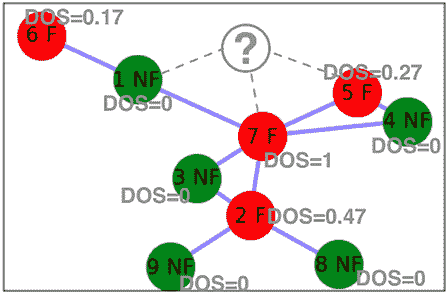

图 5.10：展示具有计算 DOS 值的节点

为了计算新增节点的 DOS，我们将使用以下公式：

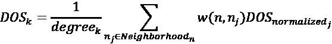

使用相关值，我们将按如下方式计算 DOS：

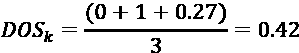

这将显示与该新节点相关的欺诈风险。这意味着，在 0 到 1 的范围内，这个人的 DOS 值为`0.42`。我们可以为 DOS 创建不同的风险区间，如下所示：

| **DOS 值** | **风险分类** |
| --- | --- |
| DOS = 0 | 无风险 |
| 0<DOS<=0.10 | 低风险 |
| 0.10<DOS<=0.3 | 中等风险 |
| DOS>0.3 | 高风险 |

根据这些标准，可以看出新的个体是一个高风险人员，应当标记为高风险。

通常，在进行此类分析时不涉及时间维度。但现在有一些先进的技术可以随着时间的推移观察图的增长。这使得研究人员可以查看随着网络演化而变化的顶点关系。尽管对图的时间序列分析会大大增加问题的复杂性，但它可能提供额外的欺诈证据，这在其他情况下是无法获得的。

# 摘要

在这一章中，我们学习了基于图的算法。本章使用了不同的技术来表示、搜索和处理表示为图的数据。我们还培养了计算两个顶点之间最短距离的技能，并在问题空间中构建了邻域。这些知识将帮助我们使用图论来解决诸如欺诈检测等问题。

在下一章中，我们将重点介绍不同的无监督机器学习算法。本章讨论的许多应用案例技术与无监督学习算法相辅相成，这些内容将在下一章中详细讨论。在数据集中找到欺诈证据就是这样的应用案例之一。

# 在 Discord 上了解更多

要加入本书的 Discord 社区——在这里你可以分享反馈、向作者提问并了解新版本——请扫描下面的二维码：

[`packt.link/WHLel`](https://packt.link/WHLel)


