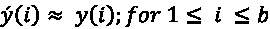
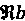

# 第七章：传统的监督式学习算法

> 人工智能是新的电力。
> 
> —Andrew Ng

在*第七章*，我们将关注监督式机器学习算法。这些算法的特点是依赖有标签的数据进行模型训练，其本质多样且灵活。让我们来看看一些实例，如决策树、**支持向量机**（**SVMs**）和线性回归等，它们都属于监督学习范畴。

随着我们对这个领域的深入探讨，需要指出的是，本章并未涉及神经网络，尽管它是监督式机器学习中的一个重要类别。鉴于神经网络的复杂性以及该领域的快速发展，神经网络值得深入探讨，我们将在接下来的三章中展开。神经网络的广泛内容需要不止一章来充分讨论它们的复杂性和潜力。

在本章中，我们将深入探讨监督式机器学习的核心要素，重点介绍分类器和回归器。我们将通过实际问题作为案例，探索它们的能力。将展示六种不同的分类算法，接着介绍三种回归技术。最后，我们将比较它们的结果，总结本次讨论的关键要点。

本章的总体目标是帮助你理解不同类型的监督式机器学习技术，并了解哪些监督式机器学习技术最适用于特定类别的问题。

本章将讨论以下概念：

+   理解监督式机器学习

+   理解分类算法

+   评估分类器性能的方法

+   理解回归算法

+   评估回归算法性能的方法

我们先来了解监督式机器学习的基本概念。

# 理解监督式机器学习

机器学习侧重于利用数据驱动的方法来创建自主系统，这些系统可以帮助我们在有无人工监督的情况下做出决策。为了创建这些自主系统，机器学习使用一组算法和方法来发现并构建数据中的可重复模式。机器学习中最流行和最强大的方法之一是监督式机器学习方法。在监督式机器学习中，算法会接收一组输入，称为**特征**，以及它们对应的输出，称为**标签**。这些特征通常包括结构化数据，如用户资料、历史销售数据或传感器测量值，而标签通常代表我们希望预测的具体结果，如客户购买习惯或产品质量评分。通过给定的数据集，监督式机器学习算法用于训练一个模型，捕捉特征和标签之间通过数学公式表示的复杂关系。这个训练好的模型是用于预测的基本工具。

监督学习中从现有数据中学习的能力类似于人类大脑从经验中学习的能力。这种学习能力利用了人类大脑的一个特性，是将决策能力和智能引入机器的基本方式。

让我们考虑一个示例，我们希望使用监督式机器学习技术训练一个模型，能够将一组电子邮件分类为合法邮件（称为**合法**）和垃圾邮件（称为**垃圾邮件**）。为了开始，我们需要从过去的例子中获取数据，以便机器可以学习什么类型的邮件内容应被分类为垃圾邮件。

使用文本数据进行的基于内容的学习任务是一个复杂的过程，并通过其中一种监督式机器学习算法实现。在本示例中，可以用于训练模型的一些监督式机器学习算法示例包括决策树和朴素贝叶斯分类器，我们将在本章稍后讨论。

目前，我们将重点讨论如何构建监督式机器学习问题。

# 构建监督式机器学习问题

在深入讨论监督式机器学习算法的细节之前，让我们先定义一些基本的监督式机器学习术语：

| **术语** | **解释** |
| --- | --- |
| 标签 | 标签是我们模型需要预测的变量。监督式机器学习模型中只能有一个标签。 |
| 特征 | 用于预测标签的输入变量集称为特征。 |
| 特征工程 | 转换特征以准备它们用于选择的监督式机器学习算法的过程称为特征工程。 |
| 特征向量 | 在将输入提供给监督学习算法之前，所有的特征都会组合成一个叫做特征向量的数据结构。 |
| 历史数据 | 用于构建标签与特征之间关系的数据，称为历史数据。历史数据包含实例。 |
| 训练/测试数据 | 历史数据通过实例分为两部分——较大的数据集称为训练数据，较小的数据集称为测试数据。 |
| 模型 | 一种数学形式，用于表达最能捕捉标签与特征之间关系的模式。 |
| 训练 | 使用训练数据创建模型。 |
| 测试 | 使用测试数据评估训练模型的质量。 |
| 预测 | 使用我们训练过的模型来估计标签的过程。在这个语境中，“预测”是模型的最终输出，指定了一个确切的结果。与“预测概率”不同，后者不是给出一个具体的结果，而是提供每个潜在结果的统计可能性。 |

一个训练过的监督学习模型能够通过根据特征来估计标签，从而进行预测。

让我们引入本章中将用于讨论机器学习技术的符号：

| **变量** | **含义** |
| --- | --- |
| `y` | 实际标签 |
| `ý` | 预测标签 |
| `d` | 实例总数 |
| `b` | 训练实例的数量 |
| `c` | 测试实例的数量 |
| `X_train` | 训练特征向量 |

请注意，在这个语境中，“实例”指的是我们数据集中的单个实例。每个实例包含一组特征（输入数据）和一个对应的标签（我们要预测的结果）。

让我们深入探讨我们已经引入的一些术语的实际应用。考虑一个特征向量，本质上是一个数据结构，包含了所有的特征。

比如，如果我们有“n”个特征和“b”个训练实例，我们表示这个训练特征向量为 `X_train`。因此，如果我们的训练数据集包含五个实例和五个变量或特征，`X_train` 将有五行——每个实例一行，总共有 25 个元素（5 个实例 x 5 个特征）。

在这个语境中，`X_train` 是一个特定术语，表示我们的训练数据集。这个数据集中的每个实例是特征和其对应标签的组合。我们用上标来表示特定实例的行号。因此，我们数据集中的单个实例表示为 (*X*^((1)), *y*^((1)))，其中 *X*^((1)) 表示第一个实例的特征，而 *y*^((1)) 是它的对应标签。

因此，我们的完整标注数据集 *D* 可以表示为 *D = {( X*^((1))*,y*^((1))*), (y* ^((2))*,y*^((2))*), ….. , (X*^((d))*,y*^((d))*)}*，其中 *D* 表示总的样本数量。

我们将*D*划分为两个子集——训练集*D*[train]和测试集*D*[test]。训练集*D*[train]可以表示为*D*[train] *= {(X*^((1))*, y*^((1))*)，(X*^((2))*, y*^((2))*)，…..，(X*^((b))*, y*^((b))*)}*，其中‘*b*’是训练示例的数量。

训练模型的主要目标是确保训练集中的任何第*i*个样本的预测目标值`('ý')`与实际标签`('y')`尽可能一致。这确保了模型的预测反映了样本中呈现的真实结果。

现在，让我们看看一些术语是如何在实际中被构建的。

正如我们讨论过的，特征向量被定义为一个数据结构，其中存储了所有特征。

如果特征的数量是*n*，训练样本的数量是*b*，则`X_train`表示训练特征向量。

对于训练数据集，特征向量由`X_train`表示。如果训练数据集中有*b*个样本，那么`X_train`将有*b*行。如果有*n*个变量，那么训练数据集的维度将是*n* x *b*。

我们将使用上标表示训练示例的行号。

我们的标签数据集中的这个特定示例由*(Features*^((1))*, label*^((1))*) = (X*^((1))*, y*^((1))*)表示。

因此，我们的标签数据集表示为*D = {(X*^((1))*, y*^((1))*)，(X*^((2))*, y*^((2))*)，…..，(X*^((d))*, y*^((d))*)}*。

我们将其分为两部分——*D*[train] 和 *D*[test]。

所以，我们的训练集可以表示为*D*[train] *= {(X*^((1))*, y*^((1))*)，(X*^((2))*, y*^((2))*)，…..，(X*^((b))*, y*^((b))*)}*。

训练模型的目标是，对于训练集中的任何第*i*个样本，预测的目标值应该尽可能接近样本中的实际值。换句话说：



因此，我们的测试集可以表示为*D*[test] *= {X*^((1))*, y*^((1))*), (X*^((2))*, y*^((2))*)，.....，(X*^((c))*, y*^((c))*)}*。

标签的值通过一个向量*Y*表示：

*Y ={y*^((1))*, y*^((2))*, ....., y*^((m))}*。

让我们通过一个例子来说明这些概念。

假设我们正在进行一个项目，目的是根据各种特征预测房价，比如卧室数量、房屋面积和房龄。我们将如何将机器学习术语应用到这个现实场景中呢？

在这种情况下，我们的“特征”将是卧室数量、房屋面积和房龄。假设我们有 50 个样本（即 50 个不同的房子，并且我们拥有这些房子的一些特征以及对应的价格）。我们可以将它们表示为一个训练特征向量，叫做`X_train`。

`X_train`变成一个包含 50 行（每个房子的行）和 3 列（每个特征：卧室数、面积和房龄）的表格。这是一个 50 x 3 的矩阵，保存了我们所有的特征数据。

单个房屋的特征集和价格可能表示为*((X*^((i))*,y*^((i))*))*，其中*X*^((i))包含第*i*个房屋的特征，*y*^((i))是其实际价格。

我们的整个数据集*D*可以表示为*D =* *{(X*^((1))*,y*^((1))*), (X*^((2))*,y*^((2))*), ... , ((X*^((50))*,y*^((50))*))}*。

假设我们使用 40 个房屋进行训练，剩余的 10 个用于测试。我们的训练集*D*[train]将是前 40 个样本：*{(X*^((1))*,y*^((1))*), (X*^((2))*,y*^((2))*), ... , ((X*^((40))*,y*^((40))*))}*。

训练模型后，我们的目标是预测房价 ，这些预测结果应与所有训练集中房屋的实际价格 紧密匹配。

我们的测试集*D*[test]由剩余的 10 个样本组成：*{(X*^((41))*,y*^((41))*), (X*^((42))*,y*^((42))*), ... , (X*^((50))*,y*^((50))*))}*。

最后，我们有*Y*向量，包含了我们所有实际的房价：*Y ={ y*^((1))*, y*^((2))*, ....., y*^((50))*}*。

通过这个具体的例子，我们可以看到在使用监督学习预测房价时，这些概念和方程是如何转化为实践的。

## 理解启用条件

一个监督学习算法需要满足某些条件才能执行。启用条件是确保监督学习算法有效性的某些前提条件。这些启用条件如下：

+   **足够的示例**：监督学习算法需要足够的示例来训练模型。当我们有确凿证据表明兴趣模式在数据集中得到了充分表示时，我们就认为有足够的示例。

+   **历史数据中的模式**：用于训练模型的示例需要具有某种模式。我们关注的事件发生的可能性应该依赖于模式、趋势和事件的组合。在我们的模型中，标签在数学上表示了我们关注的事件。如果没有这些，我们所处理的数据就是随机数据，无法用于训练模型。

+   **有效假设**：当我们使用示例训练监督学习模型时，我们期望适用于这些示例的假设在未来也能有效。让我们看一个实际的例子。如果我们想为政府训练一个可以预测学生签证是否会被批准的机器学习模型，那么理解是，当该模型用于预测时，法律和政策不会发生变化。如果在训练模型后执行了新政策或新法律，模型可能需要重新训练以纳入这些新信息。

让我们探讨如何区分分类器和回归器。

## 区分分类器和回归器

在机器学习模型中，标签可以是类别变量或连续变量。连续变量是数值变量，可以在两个值之间具有无限多个值，而类别变量是定性变量，可以分类为不同的类别。标签的类型决定了我们使用的有监督机器学习模型的类型。从根本上讲，我们有两种类型的有监督机器学习模型：

+   **分类器**：如果标签是类别变量，则机器学习模型被称为分类器。分类器可以用来回答以下类型的业务问题：

    +   这种异常的组织生长是恶性肿瘤吗？

    +   根据当前的天气条件，明天会下雨吗？

    +   根据某位特定申请人的资料，是否应批准他们的按揭申请？

+   **回归器**：如果标签是连续变量，则我们训练一个回归器。回归器可以用来回答以下类型的业务问题：

    +   根据当前的天气状况，明天会下多少雨？

    +   给定某一特定房屋的特征，价格会是多少？

让我们更详细地看看分类器和回归器。

# 理解分类算法

在有监督机器学习中，如果标签是类别变量，则模型被归类为分类器。回忆一下，模型本质上是从训练数据中学习到的数学表示：

+   历史数据被称为**已标记数据**。

+   需要预测标签的生产数据被称为**未标记数据**。

使用训练过的模型准确地标记未标记的数据是分类算法的真正力量。分类器预测未标记数据的标签，以回答特定的业务问题。

在我们展示分类算法的细节之前，让我们先展示一个业务问题，作为分类器的挑战。然后我们将使用六种不同的算法回答相同的挑战，这将帮助我们比较它们的方法论、思路和性能。

## 展示分类器挑战

我们将首先展示一个常见问题，作为挑战测试六种不同的分类算法。这个常见问题在本章中被称为分类器挑战。使用所有六个分类器来解决相同的问题将帮助我们从两个方面进行改进：

+   所有输入变量需要处理并组装成一个复杂的数据结构，称为特征向量。使用相同的特征向量帮助我们避免为所有六种算法重复数据准备。

+   由于使用相同的特征向量作为输入，我们可以准确比较各种算法的性能。

分类器挑战是预测一个人是否会进行购买的可能性。在零售行业，能够帮助最大化销售的一件事就是更好地理解顾客的行为。这可以通过分析历史数据中发现的模式来实现。我们先陈述问题。

### 问题陈述

给定历史数据，我们能否训练一个二元分类器，预测一个特定用户是否最终会根据其个人资料购买产品？

首先，让我们探索可用的标记数据集来解决这个问题：


请注意，*x* 是实数集合的一个成员。 表示它是一个具有 *b* 个实时特征的向量。 意味着它是一个二元变量，因为我们处理的是一个二分类问题。输出可以是 `0` 或 `1`，每个数字代表一个不同的类别。

对于这个具体的示例，当 `y = 1` 时，我们称其为正类，当 `y = 0` 时，我们称其为负类。为了使其更具体，当 `y` 等于 `1` 时，我们处理的是正类，意味着用户可能会进行购买。相反，当 `y` 等于 `0` 时，它表示负类，意味着用户不太可能购买任何东西。该模型将帮助我们根据用户的历史行为预测未来的用户行为。

尽管正类和负类的水平可以任意选择，但一个好的做法是将正类定义为感兴趣的事件。如果我们尝试为银行标记欺诈交易，那么正类（即 `y = 1`）应该是欺诈交易，而不是反过来。

现在，让我们来看以下内容：

+   实际标签，用 *y* 表示

+   预测标签，用 *ý* 表示

请注意，对于我们的分类器挑战，示例中标签的实际值用 *y* 来表示。如果在我们的示例中，有人购买了一个商品，我们就说 *y = 1*。预测值用 *ý* 来表示。输入特征向量 *x* 的维度将等于输入变量的数量。我们希望确定给定特定输入时，用户购买商品的概率。

所以，我们希望确定在给定特征向量 *x* 的特定值时，*y = 1* 的概率。从数学上讲，我们可以这样表示：


请注意，表达式 *P*(*y* = *1*|*x*) 表示在事件 *x* 发生的条件下，事件 *y* 等于 1 的条件概率。换句话说，它表示在特定条件 *x* 的知识或存在下，结果 *y* 为真的概率，即 *y* 为正类的概率。

现在，让我们看看如何处理和组装特征向量 *x* 中的不同输入变量。使用处理管道组装 *x* 不同部分的方法将在下一部分中更详细地讨论。

### 使用数据处理管道进行特征工程

为所选机器学习算法准备数据的过程称为**特征工程**，是机器学习生命周期中的关键部分。特征工程可以分为不同的阶段或阶段。用于处理数据的多阶段处理代码统称为**数据管道**。尽可能使用标准处理步骤构建数据管道，可以使其可重用，并减少训练模型所需的工作量。通过使用更多经过充分测试的软件模块，代码的质量也得到了提升。

除了特征工程，值得注意的是，数据清洗也是此过程中的一个关键部分。这涉及到解决异常值检测和缺失值处理等问题。例如，异常值检测可以帮助你识别并处理那些可能会负面影响模型性能的异常数据点。同样，缺失值处理是用来填充或处理数据集中的缺失数据点，确保模型能够获得完整的数据视图。这些步骤是数据管道中不可或缺的一部分，有助于提高机器学习模型的可靠性和准确性。

让我们为分类器挑战设计一个可重用的处理管道。如前所述，我们将一次性准备数据，然后用于所有分类器。

#### 导入数据

让我们首先导入必要的库：

```py
import numpy as np
import sklearn,sklearn.tree
import matplotlib.pyplot as plt
import pandas as pd
import sklearn.metrics as metrics
from sklearn.model_selection import train_test_split
from sklearn.preprocessing import OneHotEncoder, StandardScaler 
```

请注意，我们将使用 Python 中的`pandas`库，它是一个强大的开源数据操作与分析工具，提供高性能的数据结构和数据分析工具。我们还将使用`sklearn`，它提供了一套全面的工具和算法，用于各种机器学习任务。

#### 导入数据

该问题的标签数据包含了示例，存储在一个名为`Social_Network_Ads.csv`的`CSV`格式文件中。我们从读取这个文件开始：

```py
# Importing the dataset
dataset = pd.read_csv('https://storage.googleapis.com/neurals/data/Social_Network_Ads.csv') 
```

这个文件可以从[`storage.googleapis.com/neurals/data/Social_Network_Ads.csv`](https://storage.googleapis.com/neurals/data/Social_Network_Ads.csv)下载。

#### 特征选择

选择与我们想要解决的问题相关的特征的过程称为**特征选择**。这是特征工程中的一个重要部分。

一旦文件导入后，我们会删除`User ID`列，该列用于识别个人，在训练模型时应该排除。通常，`User ID`是一个唯一标识每个人的字段，但对我们试图建模的模式或趋势没有实际意义。

因此，在训练机器学习模型之前，通常的做法是删除这些列：

```py
dataset = dataset.drop(columns=['User ID']) 
```

现在，让我们使用`head`命令预览数据集，它将打印出该数据集的前五行：

```py
dataset.head(5) 
```

数据集如下所示：


图 7.1: 示例数据集

现在，让我们看看如何进一步处理输入数据集。

#### 独热编码

许多机器学习模型在所有特征都作为连续变量表示时表现最好。这一要求意味着我们需要一种方法将类别特征转换为连续特征。一种常见的技术是‘独热编码’。

在我们的背景下，`Gender`特征是类别型的，我们的目标是使用独热编码将其转换为连续变量。但是，究竟什么是独热编码呢？

独热编码是一种将类别变量转换为机器学习算法能更好理解的格式的过程。它通过为原始特征中的每个类别创建新的二进制特征来实现这一点。例如，如果我们对‘`Gender`’应用独热编码，它将生成两个新特征：`Male`和`Female`。如果性别是`Male`，则‘`Male`’特征为 1（表示真），‘`Female`’特征为 0（表示假），反之亦然。

现在，让我们将这个独热编码过程应用到我们的‘`Gender`’特征上，并继续我们的模型准备过程：

```py
enc = sklearn.preprocessing.OneHotEncoder() 
```

`drop='first'`参数表示应删除‘`Gender`’特征中的第一个类别。

首先，让我们对‘`Gender`’进行独热编码：

```py
enc.fit(dataset.iloc[:,[0]])
onehotlabels = enc.transform(dataset.iloc[:,[0]]).toarray() 
```

在这里，我们使用`fit_transform`方法对‘`Gender`’列应用独热编码。`reshape(-1, 1)`函数用于确保数据符合编码器所期望的正确二维格式。`toarray()`函数用于将输出的稀疏矩阵转换为密集的`numpy`数组，以便后续更方便地处理。

接下来，让我们将编码后的`Gender`重新添加到数据框中：

```py
genders = pd.DataFrame({'Female': onehotlabels[:, 0], 'Male': onehotlabels[:, 1]}) 
```

请注意，这行代码将编码后的‘`Gender`’数据重新添加到数据框中。由于我们设置了`drop='first'`，假设‘`Male`’类别被视为第一个类别，那么我们新添加的列‘`Female`’将具有`1`的值（表示女性），如果性别是男性，则为`0`。

然后，我们从数据框中删除原始的`Gender`列，因为它已经被我们的新`Female`列所替代：

```py
result = pd.concat([genders,dataset.iloc[:,1:]], axis=1, sort=False) 
```

一旦转换完成，让我们再次查看数据集：

```py
result.head(5) 
```


图 7.2: 在这里添加标题…

请注意，为了将变量从类别变量转换为连续变量，独热编码已将`Gender`转换为两个单独的列——`Male`和`Female`。

让我们来看看如何指定特征和标签。

#### 指定特征和标签

让我们指定特征和标签。在本书中，我们将使用`y`表示标签，使用`X`表示特征集：

```py
y=result['Purchased']
X=result.drop(columns=['Purchased']) 
```

`X`表示特征向量，包含我们需要用于训练模型的所有输入变量。

#### 将数据集划分为测试集和训练集

接下来，我们将把数据集分成两部分：70%用于训练，30%用于测试。这个划分的理由是，在机器学习实践中，有一个经验法则，我们希望数据集的大部分用于训练模型，使其能够从各种示例中有效学习。这里的 70%便是为了这个目的。然而，我们也需要确保我们的模型能够很好地推广到未见过的数据，而不仅仅是记住训练集。为了评估这一点，我们将把 30%的数据保留用于测试。这部分数据在训练过程中不会被使用，作为衡量训练模型性能和其对新、未见数据进行预测能力的基准：

```py
X_train, X_test, y_train, y_test = train_test_split(X, y,test_size = 0.25, random_state = 0) 
```

这已经创建了以下四个数据结构：

+   `X_train`：包含训练数据特征的数据结构

+   `X_test`：包含测试数据集特征的数据结构

+   `y_train`：包含训练数据集中标签值的向量

+   `y_test`：包含测试数据集标签值的向量

现在让我们对数据集应用特征归一化。

### 特征缩放

在准备我们的数据集以供机器学习模型使用时，一个重要步骤是**特征归一化**，也称为缩放。在许多机器学习算法中，特征变量被缩放到统一的范围，通常是从 0 到 1，这可以通过确保没有单一特征因其尺度过大而主导其他特征，从而提高模型的性能。

这个过程还可以帮助算法更快地收敛到解决方案。现在，让我们对数据集应用这一变换，以获得最佳结果。

首先，我们初始化一个`StandardScaler`类的实例，它将用于执行缩放操作：

```py
# Feature Scaling
sc = StandardScaler() 
```

然后，我们使用`fit_transform`方法。这个变换会对特征进行缩放，使它们的均值为`0`，标准差为`1`，这就是标准化缩放的本质。转换后的数据存储在`X_train_scaled`变量中：

```py
X_train = sc.fit_transform(X_train) 
```

接下来，我们将应用`transform`方法，它将相同的变换（如前面的代码所示）应用于测试数据集`X_test`：

```py
X_test = sc.transform(X_test) 
```

在我们缩放数据后，它已经准备好作为不同分类器的输入，这些分类器将在后续章节中展示。

### 评估分类器

一旦模型训练完成，我们需要评估其性能。为此，我们将使用以下过程：

1.  我们将把标记数据集分为两部分——训练分区和测试分区。我们将使用测试分区来评估训练好的模型。

1.  我们将使用测试分区的特征来生成每一行的标签。这是我们的预测标签集。

1.  我们将比较预测标签集与实际标签，以评估模型。

除非我们试图解决一些非常简单的问题，否则在评估模型时会出现一些误分类。我们如何解读这些误分类来确定模型质量，取决于我们选择使用哪些性能指标。

一旦我们得到了实际标签和预测标签，就可以使用一系列性能指标来评估模型。

量化模型的最佳指标将取决于我们要解决的业务问题的需求，以及训练数据集的特点。

现在让我们来看一下混淆矩阵。

## 混淆矩阵

混淆矩阵用于总结分类器评估的结果。二分类器的混淆矩阵如下所示：


图 7.3：混淆矩阵

如果我们训练的分类器标签有两个级别，那么它就是一个**二分类器**。监督式机器学习的第一个关键应用——特别是二分类器——是在第一次世界大战期间，用于区分飞机和飞鸟。

分类可以分为以下四类：

+   **真正阳性** (**TPs**)：正确分类为正类的正类

+   **真阴性** (**TNs**)：正确分类为负类的负类

+   **假阳性** (**FPs**)：实际上是负类的被分类为正类

+   **假阴性** (**FNs**)：实际上是正类的被分类为负类

让我们看看如何使用这四个类别来创建各种性能指标。

混淆矩阵通过详细列出正确和错误预测的数量，提供了模型性能的全面快照。它列举了 TPs、TNs、FPs 和 FNs。在这些中，正确分类指的是模型正确识别类别的实例，即 TPs 和 TNs。模型的准确率是指这些正确分类（TPs 和 TNs）在所有预测中所占的比例，可以直接从这个混淆矩阵中计算得到。混淆矩阵通过计算 TPs、TNs、FPs 和 FNs，告诉你正确分类和误分类的数量。模型准确率定义为所有预测中正确分类所占的比例，可以从混淆矩阵中轻松看到，如下所示。

当我们的数据中有近似相等数量的正例和负例示例时——这种情况称为平衡类——准确率指标可以提供一个有价值的模型性能度量。换句话说，准确率是模型正确预测数量与总预测数量的比率。例如，如果我们的模型在 100 个测试实例中正确识别了 90 个，无论它们是正例还是负例，其准确率将为 90%。这个度量可以让我们大致了解模型在两个类别中的整体表现。如果我们的数据具有平衡的类别（即正例总数大致等于负例总数），那么准确率将为我们提供对训练模型质量的良好洞察。准确率是在所有预测中分类正确的比例。

在数学上：


### 理解召回率和精确度

在计算准确率时，我们不区分 TP 和 TN。通过准确率评估模型是直接的，但是当数据存在不平衡类时，它将无法准确量化训练模型的质量。当数据存在不平衡类时，另外两个指标可以更好地量化训练模型的质量，即召回率和精确度。我们将利用一个流行的钻石采矿过程的例子来解释这两个额外指标的概念。

几个世纪以来，冲积钻石采矿一直是从全世界各地河床沙中提取钻石的最流行方式之一。数千年的侵蚀已知将钻石从其主要矿床冲刷到世界各地的河床中。为了采矿钻石，人们在一个大型露天矿坑中从河岸收集沙子。经过大量冲洗后，矿坑中留下大量岩石。

绝大多数这些冲刷过的岩石只是普通的石头。将其中一块岩石识别为钻石是罕见但非常重要的事件。在我们的场景中，一家矿山的所有者正在尝试使用计算机视觉来识别哪些冲刷过的岩石是普通的石头，哪些是钻石。他们正在利用形状、颜色和反射通过计算机视觉对冲刷过的岩石进行分类。

在这个例子的背景下：

| **TP** | 一块正确识别为钻石的冲刷过的岩石 |
| --- | --- |
| **TN** | 一块正确识别为石头的冲刷过的岩石 |
| **FP** | 一块错误地识别为钻石的石头 |
| **FN** | 一颗错误地识别为石头的钻石 |

让我们在心中记住这个从矿山中提取钻石的过程，来解释召回率和精确度：

+   **召回率**：这计算了*命中率*，即在大量事件库中识别出目标事件的比例。换句话说，这个指标衡量了我们找到或“命中”大部分目标事件的能力，并尽可能减少未被识别的事件。在识别一堆普通石头中的钻石的背景下，召回率是量化寻宝成功率的指标。对于某个装满了洗净石头的坑，召回率将是识别到的钻石数量与坑内钻石总数的比例：

    

    假设坑内有 10 颗钻石，每颗价值 $1,000。我们的机器学习算法能够识别出其中的九颗。那么，召回率就是 *9/10 = 0.90*。

    因此，我们能够找回 90% 的宝藏。按美元计算，我们识别出了 $9,000 的宝藏，而总值为 $10,000。

+   **精准率**：精准率只关注由训练好的模型标记为正类的数据点，并丢弃其他所有数据。如果我们只筛选出模型标记为正类的事件（即 TPs 和 FPs），然后计算其准确性，这就是精准率。

    现在，让我们在钻石开采的背景下探讨精准率。假设我们希望使用计算机视觉技术从一堆洗净的石头中识别出钻石，并将其发送给客户。

    这个过程应该是自动化的。最坏的情况是算法错误地将一块石头分类为钻石，最终客户收到这块石头并因此被收费。因此，显然，为了使这个过程可行，精准率应该很高。

    针对钻石开采的例子：

    

## 理解召回率和精准率之间的权衡

使用分类器做出决策涉及一个两步过程。首先，分类器生成一个介于 0 到 1 之间的决策分数。然后，它应用一个决策阈值来确定每个数据点的类别。分数高于阈值的数据点被分配为正类，而分数低于阈值的数据点则被分配为负类。这两个步骤可以如下解释：

1.  分类器生成一个决策分数，这是一个介于 0 到 1 之间的数字。

1.  分类器使用一个叫做决策阈值的参数值，将当前数据点分配到两个类别之一。任何决策（分数 > 决策阈值）的数据点被预测为正类，而任何决策（分数 < 决策阈值）的数据点被预测为负类。

想象一个情境，你在经营一个钻石矿。你的任务是从一堆普通的石头中识别出珍贵的钻石。为了简化这个过程，你开发了一个机器学习分类器。该分类器检查每一块石头，分配一个介于 0 到 1 之间的决策分数，最后根据这个分数和预设的决策阈值对石头进行分类。

决策分数本质上表示分类器对某块岩石确实是钻石的信心，分数接近 1 的岩石很可能是钻石。而决策阈值是一个预定义的截止点，决定岩石的最终分类。分数高于阈值的岩石被分类为钻石（正类），而低于阈值的岩石则被丢弃为普通岩石（负类）。

现在，假设所有岩石按其决策分数升序排列，如*图 7.4*所示。最左侧的岩石分数最低，最不可能是钻石，而最右侧的岩石分数最高，最可能是钻石。在理想情况下，决策阈值右侧的每块岩石都会是钻石，而左侧的每块岩石都是普通石头。

考虑如*图 7.4*所示的情况，其中决策阈值处于中央。在决策边界的右侧，我们发现三个实际的钻石（TPs）和一个被错误标记为钻石的普通岩石（FPs）。在左侧，我们有两个正确识别的普通岩石（TNs）和两个被错误分类为普通岩石的钻石（FNs）。

因此，在决策阈值的左侧，你会发现两个正确分类和两个误分类。它们分别是 2 个真正负类（TNs）和 2 个假负类（FNs）。

让我们计算*图 7.4*中的召回率和精确率：


图 7.4：精确率/召回率权衡：岩石按分类器分数排序

处于决策阈值之上的被认为是钻石。

请注意，阈值越高，精确率越高，但召回率越低。

调整决策阈值会影响精确率和召回率之间的权衡。如果我们将阈值向右移动（如*图 7.5*所示），我们增加了将岩石分类为钻石的标准，从而提高了精确率，但降低了召回率：


图 7.5：精确率/召回率权衡：岩石按分类器分数排序

处于决策阈值之上的被认为是钻石。请注意，阈值越高，精确率越高，但召回率越低。

在*图 7.6*中，我们降低了决策阈值。换句话说，我们降低了将岩石分类为钻石的标准。因此，假负类（即漏掉的宝石）会减少，但假正类（即错误信号）会增加。因此，如果我们降低阈值（如*图 7.6*所示），我们放宽了钻石分类的标准，增加了召回率，但降低了精确率：


图 7.6：精确度/召回率权衡：岩石根据其分类器得分排序

那些高于决策阈值的被视为钻石。请注意，阈值越高，精确度越高，但召回率越低。

所以，调整决策边界的值就是在召回率和精确度之间权衡。我们增加决策边界以获得更好的精确度，同时可以预期更多的召回率；我们降低决策边界以获得更好的召回率，但可能会牺牲精确度。

让我们绘制一张精确度与召回率的图表，以便更好地理解两者之间的权衡：


图 7.7：精确度与召回率的关系

召回率和精确度的最佳选择是什么？

增加召回率是通过降低我们用来识别数据点为正样本的标准来实现的。精确度预计会降低，但如上图所示，当精确度降到约 0.8 时，下降幅度非常明显。这是我们可以选择合适的召回率和精确度值的点。在上面的图表中，如果我们选择 0.8 作为召回率，精确度为 0.75。我们可以将其解释为能够标记 80% 的所有目标数据点。在这个精确度水平下，我们对这些数据点的标记准确率为 75%。如果没有特定的业务需求，且只是用于通用场景，这可能是一个合理的折中方案。

展示精确度与召回率之间固有权衡的另一种方法是使用 **接收操作特性曲线**（**ROC**）。为此，我们先定义两个术语：**真正例率**（**TPR**）和 **假正例率**（**FPR**）。

让我们看看 ROC 曲线。为了计算 TPR 和 FPR，我们需要观察坑中的钻石：


请注意：

+   TPR 等于召回率或命中率。

+   TNR 可以看作是负事件的召回率或命中率。它决定了我们正确识别负事件的成功率。它也叫做 **特异度**。

+   FPR = 1 – TNR = 1 - 特异度。

很明显，这些图中的 TPR 和 FPR 可以通过以下方式计算：

| **图号** | **TPR** | **FPR** |
| --- | --- | --- |
| 7.4 | 3/5=0.6 | 1/3=0.33 |
| 7.5 | 2/5=0.4 | 0/3 = 0 |
| 7.6 | 5/5 = 1 | 1/3 = 0.33 |

请注意，降低我们的决策阈值会增加 TPR 或召回率。为了从矿山中尽可能多地提取钻石，我们会降低将石头分类为钻石的标准。结果是更多的石头会被错误地分类为钻石，从而增加 FPR。

请注意，一个高质量的分类算法应该能够为每一块岩石提供决策分数，这个分数大致对应岩石成为钻石的概率。该算法的输出如*图 7.8*所示。钻石应该位于右侧，石块应该位于左侧。在图中，随着我们将决策阈值从`0.8`降到`0.2`，我们预计 TRP 和 FPR 会有显著的提升。实际上，TRP 的急剧增加与 FPR 的轻微增加是评估二分类器质量的最佳指标之一，因为该分类算法能够生成与岩石成为钻石的可能性直接相关的决策分数。如果钻石和石块在决策分数轴上随机分布，降低决策阈值会同样可能标记为石块或钻石。这将是最差的二分类器，也叫做随机化器：


图 7.8：ROC 曲线

### 理解过拟合

如果一个机器学习模型在开发环境中表现优秀，但在生产环境中明显退化，我们称这个模型为过拟合。这意味着训练出的模型过于贴合训练数据集，模型创建的规则中包含了过多的细节。这表明模型的方差与偏差之间的权衡最能体现这一概念。

在开发机器学习模型时，我们通常会对模型需要捕捉的真实世界现象做出一些简化假设。这些假设对于使建模过程更可控、更简洁至关重要。然而，这些假设的简化会在我们的模型中引入一定程度的“偏差”。

让我们进一步分析一下。偏差是一个量化我们预测值与真实值偏离程度的术语。简单来说，如果我们有较高的偏差，意味着我们的模型预测值与实际值相差较远，这会导致训练数据上较高的误差率。

例如，考虑线性回归模型。它假设输入特征与输出变量之间存在线性关系。然而，在现实世界中，关系可能是非线性的或更加复杂的，这并不总是成立。虽然这个线性假设简化了我们的模型，但它可能会导致较高的偏差，因为它可能无法完全捕捉变量之间的实际关系。

现在，让我们来谈谈“方差”。在机器学习中，方差是指如果我们使用不同的训练数据集，我们的模型预测会发生多大的变化。一个高方差的模型非常注重训练数据，容易从噪声和细节中学习。因此，它在训练数据上的表现非常好，但在未见过的数据或测试数据上的表现较差。这种表现差异通常被称为过拟合。

我们可以通过靶心图来可视化偏差和方差，如*图 7.9*所示。请注意，靶心的中心是一个完美预测正确值的模型。离靶心较远的射击表示高偏差，而分散较广的射击表示高方差。在理想的情况下，我们希望偏差低、方差低，所有射击都击中靶心。然而，在现实世界中，这是一种权衡。降低偏差会增加方差，而降低方差会增加偏差。

这就是偏差-方差权衡，它是机器学习模型设计中的一个基本概念：


图 7.9：偏差和方差的图示

在机器学习模型中，平衡适当的泛化程度是一个微妙的过程。这个平衡，有时也是不平衡的，正是通过偏差-方差权衡来描述的。机器学习中的泛化指的是模型在适应新数据（这些数据来源于与训练数据相同的分布）时的能力。换句话说，一个泛化良好的模型能够将从训练数据中学到的规则有效地应用于新的、未见过的数据。通过使用更简单的假设，可以实现更广泛的规则，从而使模型对训练数据的波动不那么敏感。这意味着模型的方差较低，因为它在不同训练集之间变化不大。

然而，这也有其负面影响。简单的假设意味着模型可能无法完全捕捉数据中的所有复杂关系。这会导致模型始终偏离真实输出，从而增加偏差。

因此，从这个角度看，更高的泛化意味着更低的方差，但更高的偏差。这就是偏差-方差权衡的本质：一个过度泛化的模型（高偏差）可能会过度简化问题，错过重要的模式，而一个泛化不足的模型（高方差）可能会对训练数据进行过拟合，同时捕捉噪声和信号。

在这两种极端之间找到平衡是机器学习中的一个核心挑战，管理这种权衡的能力往往能够决定一个模型是好还是优秀。偏差与方差之间的这种权衡由算法的选择、数据的特征以及各种超参数决定。根据你试图解决的具体问题的需求，达到偏差与方差之间的适当妥协是非常重要的。

现在让我们来看一下如何指定分类器的不同阶段。

### 指定分类器的阶段

一旦标记数据准备好，分类器的开发就包括训练、评估和部署。这三个实施分类器的阶段在下面的**跨行业数据挖掘标准流程（CRISP-DM）**生命周期图中有所展示（CRISP-DM 生命周期在*第五章*，*图算法*中有更详细的解释）：


图 7.10: CRISP DM 生命周期

在实施分类器模型时，需要考虑几个关键阶段，从彻底理解当前的业务问题开始。这包括识别解决此问题所需的数据，并理解数据的实际背景。收集相关的标记数据后，下一步是将数据集分成两部分：训练集和测试集。训练集通常较大，用于训练模型以理解数据中的模式和关系。另一方面，测试集用于评估模型在未见过的数据上的表现。

为确保这两个数据集能代表整体数据分布，我们将使用随机抽样技术。这样，我们可以合理地期望整个数据集中的模式在训练集和测试集两部分中都有体现。

注意，如*图 7.10*所示，首先是训练阶段，在该阶段使用训练数据来训练模型。训练阶段结束后，使用测试数据评估训练后的模型。通过不同的性能矩阵来量化训练模型的表现。一旦模型被评估，我们进入模型部署阶段，将训练好的模型部署并用于推断，通过标记未标记数据来解决实际问题。

现在，让我们来看一些分类算法。

在接下来的章节中，我们将介绍以下分类算法：

+   决策树算法

+   XGBoost 算法

+   随机森林算法

+   逻辑回归算法

+   **SVM**算法

+   朴素贝叶斯算法

让我们从决策树算法开始。

# 决策树分类算法

决策树基于递归划分方法（分治法），它生成一组规则用于预测标签。算法从根节点开始，并将其划分为多个分支。内部节点表示对某个属性的测试，测试结果通过分支表示到达下一层级。决策树在叶节点结束，叶节点包含决策。当划分不再改善结果时，过程停止。

现在，让我们深入了解决策树算法的细节。

## 理解决策树分类算法

决策树分类的独特之处在于生成一组可由人类理解的规则层次结构，这些规则用于在运行时预测标签。该模型的透明性是其一个主要优势，因为它使我们能够理解每个预测背后的推理过程。这个层次结构是通过递归算法形成的，遵循一系列步骤。

首先，让我们通过一个简化的例子来说明这一点。考虑一个预测一个人是否会喜欢某部特定电影的决策树模型。树顶端的决策或“规则”可能是，“这部电影是喜剧吗？”如果答案是“是”，树则分支到下一个规则，比如，“这部电影是否由这个人的最喜欢的演员主演？”如果答案是否，树则分支到另一个规则。每个决策点都会进一步细分，形成规则的树状结构，直到我们得到最终的预测。

通过这一过程，决策树引导我们通过一系列易于理解的逻辑步骤，最终得出预测结果。这种清晰性使得决策树分类器区别于其他机器学习模型。

该算法本质上是递归的。创建这一规则层次结构涉及以下步骤：

1.  **找到最重要的特征**：在所有特征中，算法识别出最能区分训练数据集中的数据点与标签之间的特征。计算依据诸如信息增益或基尼不纯度等度量。

1.  **二分**：使用最重要的特征，算法创建一个标准，用于将训练数据集分为两个分支：

    +   符合标准的数据点

    +   不符合标准的数据点

1.  **检查叶节点**：如果任何结果分支中大部分标签属于同一类别，该分支将成为最终分支，从而形成叶节点。

1.  **检查停止条件并重复**：如果提供的停止条件未满足，算法将回到*步骤 1*进行下一次迭代。否则，模型将标记为已训练，并且结果决策树中最低级别的每个节点将被标记为叶节点。停止条件可以简单地定义为迭代次数，或者使用默认的停止条件，当算法达到每个叶节点的同质性水平时便停止。

决策树算法可以通过以下图示进行解释：


图 7.11：决策树

在上面的图中，根节点包含了一些圆圈和叉号。它们仅代表某个特征的两类不同类别。该算法创建了一个标准，试图将圆圈与叉号分开。在每个层级，决策树对数据进行划分，并且这些划分期望在从第 1 层开始越来越均匀。一个完美的分类器的叶节点只包含圆圈或叉号。由于现实世界数据集的内在不可预测性和噪声，训练完美的分类器通常是困难的。

请注意，决策树具有一些关键优势，使其在许多场景中成为首选。决策树分类器的优点在于其可解释性。与许多其他模型不同，它们提供了一套清晰透明的“如果-那么”规则，使得决策过程易于理解和审计。这在医疗保健或金融等领域尤为有利，在这些领域，理解预测背后的逻辑与预测本身一样重要。

此外，决策树对数据的规模不太敏感，并且能够处理分类和数值变量的混合。这使得它们在面对多样化数据类型时成为一个多功能的工具。

因此，尽管训练一个“完美”的决策树分类器可能是困难的，但它们所提供的优势，包括简单性、透明性和灵活性，通常足以克服这一挑战。

我们将使用决策树分类算法来解决分类器挑战问题。

现在，让我们使用决策树分类算法解决我们之前定义的常见问题，预测客户是否最终购买产品：

1.  首先，让我们实例化决策树分类算法，并使用我们为分类器准备的数据的训练部分来训练一个模型：

    ```py
    classifier = sklearn.tree.DecisionTreeClassifier(criterion = 'entropy', random_state = 100, max_depth=2) 
    ```

    ```py
    DecisionTreeClassifier(criterion = 'entropy', random_state = 100, max_depth=2) 
    ```

1.  现在，让我们使用我们训练好的模型来预测标注数据的测试部分的标签。让我们生成一个混淆矩阵，以总结我们训练模型的性能：

    ```py
    y_pred = classifier.predict(X_test)
    cm = metrics.confusion_matrix(y_test, y_pred) 
    ```

1.  这将给出以下输出：

    ```py
    cm 
    ```

    ```py
    array([[64, 4],
           [2, 30]]) 
    ```

1.  现在，让我们使用决策树分类算法计算所创建分类器的`准确率`、`召回率`和`精确度`值：

    ```py
    accuracy= metrics.accuracy_score(y_test,y_pred)
    recall = metrics.recall_score(y_test,y_pred)
    precision = metrics.precision_score(y_test,y_pred)
    print(accuracy,recall,precision) 
    ```

1.  运行上述代码将产生以下输出：

    ```py
    0.94 0.9375 0.8823529411764706 
    ```

性能衡量标准帮助我们将不同的训练建模技术相互比较。

现在，让我们来探讨决策树分类器的优缺点。

## 决策树分类器的优缺点

在本节中，我们将讨论使用决策树分类算法的优缺点。

决策树分类器最显著的优势之一在于其固有的透明性。支配其模型构建的规则是可读且可解释的，这使得它们非常适合那些需要清晰理解决策过程的情境。这种类型的模型通常被称为白盒模型，是需要最小化偏差并最大化透明度的场景中不可或缺的组成部分。这在政府和保险等关键行业中尤其重要，因为这些行业对问责制和可追溯性有着至关重要的要求。

此外，决策树分类器能够很好地处理分类变量。它们的设计天生适合从离散问题空间中提取信息，这使得它们在大多数特征属于特定类别的数据集中特别合适。

另一方面，决策树分类器也确实存在一些局限性。它们最大的挑战是容易过拟合。当决策树深入挖掘时，可能会创建捕捉过多细节的规则，这会导致模型从训练数据中过度泛化，进而在未见过的数据上表现不佳。因此，使用决策树分类器时，实施剪枝等策略以防止过拟合是至关重要的。

决策树分类器的另一个局限性是它们在处理非线性关系时的困难。它们的规则主要是线性的，因此可能无法捕捉到非直线关系的细微差别。因此，虽然决策树为解决问题带来了一些显著的优势，但它们的弱点在选择适当的模型时需要特别谨慎。

## 用例

决策树分类器可以用于以下用例来分类数据：

+   **抵押贷款申请**：训练一个二分类器来判断申请人是否可能违约。

+   **客户细分**：将客户分类为高价值客户、中等价值客户和低价值客户，以便根据每个类别定制营销策略。

+   **医学诊断**：训练一个分类器来区分良性或恶性肿瘤。

+   **治疗效果分析**：训练一个分类器来标记对某种治疗反应积极的患者。

+   **使用决策树进行特征选择**：在考察决策树分类器时，另一个值得讨论的方面是它们的特征选择能力。在规则创建过程中，决策树倾向于从数据集中选择一部分特征。决策树这一固有特性在处理特征数目庞大的数据集时尤为有益。

你可能会问，为什么特征选择如此重要？在机器学习中，处理大量特征可能是一个挑战。特征过多可能导致模型复杂，难以解释，甚至由于"维度诅咒"导致性能下降。

通过自动选择最重要的特征子集，决策树可以简化模型，并专注于最相关的预测变量。

值得注意的是，决策树中的特征选择过程并不限于它们自身模型的开发。这个过程的结果也可以作为其他机器学习模型的初步特征选择。这可以提供哪些特征最重要的初步了解，并帮助简化其他机器学习模型的开发。

接下来，让我们深入探讨集成方法。

# 理解集成方法

在机器学习领域，集成是一种技术，其中多个模型，每个模型都有细微的差异，被创建并结合成一个复合或聚合模型。这些差异可以来自使用不同的模型参数、数据子集，甚至是不同的机器学习算法。

然而，"稍微不同"在这个上下文中是什么意思？在这里，集成中的每个单独模型都是为了独特性而创建的，但不会有根本性的差异。这可以通过调整超参数、在不同的训练数据子集上训练每个模型，或者使用不同的算法来实现。目标是让每个模型捕捉数据的不同方面或细微差别，当它们结合在一起时，可以帮助提升整体的预测能力。

那么，这些模型是如何结合的呢？集成技术涉及一种称为聚合的决策过程，其中个别模型的预测被合并。这可能是一个简单的平均值、一个多数投票，或者是根据所使用的具体集成技术采用更复杂的方法。

至于何时以及为何需要集成方法，当单个模型无法达到较高的准确率时，它们尤其有用。通过组合多个模型，集成可以捕捉更多的复杂性，并通常能获得更好的性能。这是因为集成可以平均化偏差，减少方差，并且不容易过拟合训练数据。

最后，评估一个集成模型的有效性类似于评估单个模型。可以根据问题的性质使用如准确率、精确度、召回率或 F1 分数等指标。关键的不同在于，这些指标是应用于集成的聚合预测，而不是单一模型的预测。

让我们先看一些集成算法，从 XGBoost 开始。

## 使用 XGBoost 算法实现梯度提升

XGBoost 于 2014 年推出，是一种集成分类算法，因其基于梯度提升原理而广受欢迎。那么，梯度提升到底是什么呢？本质上，它是一种机器学习技术，涉及顺序构建多个模型，每个新模型都试图纠正前一个模型的错误。这个过程会一直进行，直到误差率显著降低，或添加了预定义数量的模型为止。

在 XGBoost 的背景下，它采用一组相互关联的决策树，并通过梯度下降优化它们的预测结果，梯度下降是一种常用的优化算法，旨在找到一个函数的最小值——在这种情况下是残差误差。简单来说，梯度下降通过不断调整模型来最小化预测值与实际值之间的差异。

XGBoost 的设计使其非常适合分布式计算环境。这种兼容性扩展到 Apache Spark——一个大规模数据处理平台，以及像 Google Cloud 和**Amazon Web Services**（**AWS**）这样的云计算平台。这些平台提供了高效运行 XGBoost 所需的计算资源，特别是在处理更大数据集时。

现在，我们将走过使用 XGBoost 算法实现梯度提升的过程。我们的旅程包括数据准备、模型训练、生成预测和评估模型性能。首先，数据准备是正确使用 XGBoost 算法的关键。原始数据通常包含不一致性、缺失值或可能不适合算法的变量类型。因此，必须对数据进行预处理和清理，按需规范化数值字段并编码分类字段。一旦数据格式化正确，我们可以继续进行模型训练。已经创建了一个 XGBClassifier 实例，我们将用它来拟合我们的模型。让我们看看步骤：

1.  这个过程使用`X_train`和`y_train`数据子集进行训练，分别代表我们的特征和标签：

    ```py
    from xgboost import XGBClassifier
    classifier = XGBClassifier()
    classifier.fit(X_train, y_train) 
    ```

    ```py
    XGBClassifier(base_score=None, booster=None, callbacks=None,
                  colsample_bylevel=None, colsample_bynode=None,
                  colsample_bytree=None, early_stopping_rounds=None,
                  enable_categorical=False, eval_metric=None, feature_types=None,
                  gamma=None, gpu_id=None, grow_policy=None, importance_type=None,
                  interaction_constraints=None, learning_rate=None, max_bin=None,
                  max_cat_threshold=None, max_cat_to_onehot=None,
                  max_delta_step=None, max_depth=None, max_leaves=None,
                  min_child_weight=None, missing=nan, monotone_constraints=None,
                  n_estimators=100, n_jobs=None, num_parallel_tree=None,
                  predictor=None, random_state=None, ...) 
    ```

1.  然后，我们将基于新训练的模型生成预测结果：

    ```py
    y_pred = classifier.predict(X_test)
    cm = metrics.confusion_matrix(y_test, y_pred) 
    ```

1.  该过程产生如下输出：

    ```py
    cm 
    ```

    ```py
    array([[64, 4],
           [4, 28]]) 
    ```

1.  最后，我们将量化模型的性能：

    ```py
    accuracy = metrics.accuracy_score(y_test,y_pred)
    recall = metrics.recall_score(y_test,y_pred)
    precision = metrics.precision_score(y_test,y_pred)
    print(accuracy,recall,precision) 
    ```

1.  这将给我们以下输出：

    ```py
    0.92 0.875 0.875 
    ```

现在，让我们看看随机森林算法。

随机森林算法是一种集成学习方法，通过结合多个决策树的输出，减少偏差和方差，从而实现其效果。在这里，我们深入探讨它是如何训练的，以及它是如何生成预测的。在训练过程中，随机森林算法利用一种称为 bagging（或自助聚合）的技术。它从训练数据集中生成`N`个子集，每个子集通过从输入数据中随机选择一些行和列来创建。这个选择过程引入了随机性，因此被称为“随机森林”。每个数据子集用于训练一棵独立的决策树，最终得到一组树，表示为 C[1]到 C[m]。这些树可以是任何类型，但通常是二叉树，每个节点根据一个特征来划分数据。

在预测方面，随机森林模型采用民主投票系统。当一个新的数据实例被输入模型进行预测时，森林中的每棵决策树都会生成自己的标签。最终预测由多数投票决定，意味着得到最多票数的标签将成为整体预测。

如*图 7.12*所示：


图 7.12：随机森林

请注意，在*图 7.12*中，训练了*m*棵树，表示为*C*[1]到*C*[m]，即*树 = {C*[1]*,..,C*[m]*}。

每棵树都会生成一个预测，表示为一个集合：

*个体预测 = P= {P*[1]*,..., P*[m]*}*

最终预测由`Pf`表示。它由大多数个体预测决定。可以使用`mode`函数找到多数决策（`mode`是出现次数最多且占多数的数字）。个体预测与最终预测是相关的，如下所示：

```py
Pf = mode (P) 
```

这种集成技术提供了几个优势。首先，数据选择和决策树构建中引入的随机性降低了过拟合的风险，从而提高了模型的鲁棒性。其次，森林中的每棵树都独立运行，使得随机森林模型高度并行化，因此适用于大数据集。最后，随机森林模型具有多功能性，能够处理回归和分类任务，并有效应对缺失数据或异常数据。

然而，请记住，随机森林模型的有效性在很大程度上取决于它包含的树木数量。树木太少可能导致模型较弱，而树木太多则可能导致不必要的计算。根据应用的具体需求，调整这个参数非常重要。

## 区分随机森林算法与集成增强方法

随机森林和集成增强法代表了集成学习的两种不同方法，集成学习是机器学习中的一种强大方法，它通过结合多个模型来创建更稳健和准确的预测。

在随机森林算法中，每棵决策树独立运行，不受其他树的性能或结构的影响。每棵树都是从数据的不同子集构建的，并且在做出决策时使用不同的特征子集，这增加了集成的整体多样性。最终输出是通过对所有树的预测进行聚合来确定的，通常通过多数投票。

集成增强法（ensemble boosting）采用一种顺序过程，每个模型都意识到其前一个模型的错误。增强技术生成一系列模型，其中每个后续模型旨在纠正前一个模型的错误。通过为下一模型分配更高的权重给训练集中的错误分类实例来实现这一点。最终的预测是所有模型预测的加权总和，从而有效地赋予更准确的模型更多的影响力。

本质上，虽然随机森林利用独立性和多样性的优势，集成增强法则侧重于纠正错误并从过去的错误中改进。每种方法都有其自身的优势，根据数据的性质和结构的不同，它们可能更有效。

## 使用随机森林算法进行分类挑战

让我们实例化随机森林算法，并使用训练数据来训练我们的模型。

这里有两个关键的超参数，我们将重点关注：

+   `n_estimators`

+   `max_depth`

`n_estimators` 超参数决定了集成中构建的单个决策树的数量。本质上，它决定了“森林”的大小。更多的树通常会导致更稳健的预测，因为它增加了决策路径的多样性和模型的泛化能力。然而，重要的是要注意，增加更多的树也会增加计算复杂性，超过某个点后，准确性的提升可能变得微不足道。

另一方面，`max_depth` 超参数指定了每棵树可以达到的最大深度。在决策树的上下文中，“深度”是指从根节点（树顶的起始点）到叶节点（底部的最终决策输出）之间的最长路径。通过限制最大深度，我们实际上控制了学习结构的复杂性，在欠拟合和过拟合之间取得平衡。过于浅的树可能会错过重要的决策规则，而过于深的树可能会对训练数据进行过拟合，捕捉到噪声和异常值。

微调这两个超参数在优化基于决策树的模型性能方面起着至关重要的作用，能够在预测能力和计算效率之间取得正确的平衡。

为了使用随机森林算法训练分类器，我们将执行以下步骤：

```py
classifier = RandomForestClassifier(n_estimators = 10, max_depth = 4,
criterion = 'entropy', random_state = 0)
classifier.fit(X_train, y_train) 
```

```py
RandomForestClassifier(n_estimators = 10, max_depth = 4,criterion = 'entropy', random_state = 0) 
```

一旦随机森林模型训练完成，我们就可以用它来进行预测：

```py
y_pred = classifier.predict(X_test)
cm = metrics.confusion_matrix(y_test, y_pred)
cm 
```

这将给出如下输出：

```py
array ([[64, 4],
        [3, 29]]) 
```

现在，让我们量化模型的好坏：

```py
accuracy= metrics.accuracy_score(y_test,y_pred)
recall = metrics.recall_score(y_test,y_pred)
precision = metrics.precision_score(y_test,y_pred)
print(accuracy,recall,precision) 
```

我们将观察到以下输出：

```py
0.93 0.90625 0.8787878787878788 
```

请注意，随机森林是一种流行且多用途的机器学习方法，既可以用于分类任务，也可以用于回归任务。它因其简单性、鲁棒性和灵活性而著称，使其能够应用于各种不同的场景。

接下来，我们来看一下逻辑回归。

# 逻辑回归

逻辑回归是一种用于二分类的分类算法。它使用逻辑函数来表述输入特征与标签之间的关系。它是最简单的分类技术之一，用于建模二元因变量。

## 假设条件

逻辑回归假设如下：

+   训练数据集没有缺失值。

+   标签是二元分类变量。

+   标签是有序的——换句话说，是具有顺序值的分类变量。

+   所有特征或输入变量相互独立。

## 建立关系

对于逻辑回归，预测值的计算方法如下：

**

假设：

**

所以现在：


前述关系可以图形化表示如下：


图 7.13：绘制 sigmoid 函数

请注意，如果 *z* 很大， (*z*) 将等于 `1`。如果 *z* 很小或是一个很大的负数， (*z*) 将等于 `0`。另外，当 *z* 为 0 时， (*z*) = 0.5。sigmoid 是一个自然函数，适用于表示概率，因为它的值严格限定在 0 到 1 之间。所谓“自然”是指它由于固有的性质而特别适用或有效。在这种情况下，sigmoid 函数始终输出一个介于 0 和 1 之间的值，这与概率范围一致。这使得它成为逻辑回归中建模概率的一个优秀工具。训练逻辑回归模型的目标是找到 *w* 和 *j* 的正确值。

逻辑回归得名于用于表述它的函数，称为**逻辑函数**或**sigmoid 函数**。

## 损失函数和成本函数

`损失`函数定义了我们如何为训练数据中的某个特定示例量化误差。`成本`函数定义了我们如何在整个训练数据集上最小化误差。因此，`损失`函数用于训练数据集中的单个示例，而`成本`函数用于量化实际值和预测值之间的总体偏差。它依赖于*w*和*h*的选择。

在逻辑回归中，用于训练集中特定示例*i*的`损失`函数如下：

*损失（ý*^((i))*, y*^((i))*) = - (y*^((i)) *log ý*^((i)) *+ (1-y*^((i)) *) log (1-ý*^((i))*)*

请注意，当*y*^((i)) *= 1 时，损失（ý*^((i))*, y*^((i))*) = - logý*^((i))。最小化损失将导致ý^((i))的值变大。作为一个 sigmoid 函数，它的最大值为*1*。

如果*y*^((i)) *= 0，损失（ý*^((i))*, y*^((i))*) = - log (1-ý*^((i))*)*。

最小化损失将导致*ý*^((i))尽可能小，这时其值为*0*。

逻辑回归的成本函数如下：


现在，让我们深入了解逻辑回归的细节。

## 何时使用逻辑回归

逻辑回归在二分类器中表现很好。为了澄清，二分类是指预测两种可能结果之一的过程。例如，如果我们尝试预测一封邮件是否为垃圾邮件，这就是一个二分类问题，因为只有两种可能的结果——‘垃圾邮件’或‘非垃圾邮件’。

然而，逻辑回归存在一些局限性。特别是，当处理质量较差的大型数据集时，它可能会遇到困难。例如，假设有一个数据集，其中包含大量缺失值、异常值或无关特征。在这种情况下，逻辑回归模型可能会发现很难做出准确的预测。

此外，虽然逻辑回归能够有效地处理特征与目标变量之间的线性关系，但在处理复杂的非线性关系时可能会显得力不从心。想象一个数据集，其中预测变量与目标之间的关系不是一条直线，而是曲线；在这种情况下，逻辑回归模型可能会遇到困难。

尽管存在这些局限性，逻辑回归通常仍然是分类任务的一个可靠起点。它提供了一个基准性能，可以用来与更复杂的模型效果进行比较。即使它不能提供最高的准确度，但它提供了可解释性和简单性，在某些情境下是非常有价值的。

## 使用逻辑回归算法进行分类器挑战

在本节中，我们将看到如何使用逻辑回归算法来进行分类器挑战：

1.  首先，让我们实例化一个逻辑回归模型并使用训练数据进行训练：

    ```py
    from sklearn.linear_model import LogisticRegression
    classifier = LogisticRegression(random_state = 0)
    classifier.fit(X_train, y_train) 
    ```

1.  让我们预测`test`数据的值并创建混淆矩阵：

    ```py
    y_pred = classifier.predict(X_test)
    cm = metrics.confusion_matrix(y_test, y_pred)
    cm 
    ```

1.  我们在运行上述代码后得到以下输出：

    ```py
    array ([[65, 3],
            [6, 26]]) 
    ```

1.  现在，让我们来看一下性能指标：

    ```py
    accuracy= metrics.accuracy_score(y_test,y_pred)
    recall = metrics.recall_score(y_test,y_pred)
    precision = metrics.precision_score(y_test,y_pred)
    print(accuracy,recall,precision) 
    ```

1.  我们在运行上述代码后得到以下输出：

    ```py
    0.91 0.8125 0.8996551724137931 
    ```

接下来，让我们看看**SVM**。

# SVM 算法

**SVM**分类器是机器学习工具中的一个强大工具，通过识别一个最优决策边界或超平面，来显著区分两类。为了进一步解释，可以将这个“超平面”看作是一条线（二维中），一个面（三维中），或一个流形（高维中），它能最好地分隔特征空间中的不同类别。

区分 SVM 的关键特性是其优化目标——旨在最大化边距，即决策边界与来自任一类的最近数据点（称为“支持向量”）之间的距离。简单来说，SVM 算法不仅仅是找到一条分割类别的线；它还尝试找到一条尽可能远离每个类别最近点的线，从而最大化分隔间隙。

考虑一个基本的二维示例，我们尝试将圆圈与叉号分开。我们使用 SVM 的目标不仅仅是找到一条分开这两种形状的线，而是找到一条线，使它与最靠近它的圆圈和叉号之间的距离最大。

SVM（支持向量机）在处理高维数据、复杂领域，或当类之间无法通过简单的直线分割时，非常有用。它们在逻辑回归可能失败的地方表现尤为出色，例如，在非线性可分的数据场景中。

边距定义为分隔超平面（决策边界）与最接近该超平面的训练样本之间的距离，这些训练样本被称为**支持向量**。因此，我们从一个非常基本的二维示例开始，*X*[1]和*X*[2]。我们希望找到一条线来分开圆圈和叉号。如下图所示：


图 7.14：SVM 算法

我们画了两条线，两条线都能完美地将叉号和圆圈分开。然而，必须存在一条最优线或决策边界，它能为我们提供最大机会，以正确分类大多数额外的样本。一个合理的选择可能是将这两类之间均匀分隔的线，从而为每个类提供一点缓冲区，如下图所示：


图 7.15：与 SVM 相关的概念

此外，与逻辑回归不同，SVM 更适合处理较小、更干净的数据集，并且它能够在不需要大量数据的情况下捕捉复杂的关系。然而，这里有一个权衡——可解释性——尽管逻辑回归能够提供易于理解的模型决策过程，SVM 由于其固有的复杂性，解释起来不如逻辑回归直观。

现在，让我们看看如何使用 SVM 来训练一个分类器以应对我们的挑战。

## 使用 SVM 算法解决分类器挑战

首先，让我们实例化 SVM 分类器，然后使用标记数据的训练部分来训练它。`kernel` 超参数决定了对输入数据应用何种变换，以使其线性可分：

```py
from sklearn.svm import SVC
classifier = SVC(kernel = 'linear', random_state = 0)
classifier.fit(X_train, y_train) 
```

1.  一旦训练完成，让我们生成一些预测并查看混淆矩阵：

    ```py
    y_pred = classifier.predict(X_test)
    cm = metrics.confusion_matrix(y_test, y_pred)
    cm 
    ```

1.  观察以下输出：

    ```py
    array ([[66, 2],
            [9, 23]]) 
    ```

1.  现在，让我们来看一下各种性能指标：

    ```py
    accuracy= metrics.accuracy_score(y_test,y_pred)
    recall = metrics.recall_score(y_test,y_pred)
    precision = metrics.precision_score(y_test,y_pred)
    print(accuracy,recall,precision) 
    ```

运行上述代码后，我们得到以下值作为输出：

```py
0.89 0.71875 0.92 
```

## 理解朴素贝叶斯算法

基于概率论，朴素贝叶斯是最简单的分类算法之一。如果使用得当，它可以给出准确的预测。朴素贝叶斯算法得名有两个原因：

+   它基于一个朴素假设，即特征与输入变量之间是独立的。

+   它基于贝叶斯定理。请注意，贝叶斯定理用于计算在观察到某些特征的情况下，特定类别或结果的概率。

该算法尝试基于先前属性/实例的概率来分类实例，假设属性之间完全独立。

事件有三种类型：

+   **独立**事件不会影响另一个事件发生的概率（例如，收到一封提供免费入场技术活动的电子邮件 *和* 公司进行重组的事件）。

+   **相关**事件会影响另一个事件发生的概率；也就是说，它们在某种程度上是相关的（例如，你准时到达会议的概率可能会受到航空公司员工罢工或航班可能不准时的影响）。

+   **互斥**事件不能同时发生（例如，掷骰子时同时出现三和六的概率为 0——这两个结果是互斥的）。

# 贝叶斯定理

贝叶斯定理用于计算两个独立事件 *A* 和 *B* 之间的条件概率。事件 *A* 和 *B* 发生的概率分别由 *P*(*A*) 和 *P*(*B*) 表示。条件概率由 *P*(*B*|*A*) 表示，即在事件 *A* 发生的情况下，事件 *B* 发生的条件概率：


在应用朴素贝叶斯算法时，特别适用于输入数据维度（特征数量）较高的场景。这使得它非常适合用于文本分类任务，如垃圾邮件检测或情感分析。

它可以处理连续数据和离散数据，并且计算效率高，适用于实时预测。当你拥有有限的计算资源并且需要快速简单的实现时，朴素贝叶斯也是一个不错的选择。但需要注意的是，它的“朴素”假设（即特征独立性）在某些情况下可能成为限制。

## 计算概率

朴素贝叶斯基于概率基础。单个事件发生的概率（观察概率）是通过计算事件发生的次数，并将其除以可能导致该事件发生的总次数。例如，呼叫中心每天接到超过 100 个支持电话，在一个月内发生了 50 次。你想知道在过去的时间记录下，电话能否在三分钟内得到回应的概率。如果呼叫中心在 27 次情况下达到了这个时间记录，那么 100 个电话在三分钟内得到回应的观察概率如下：

*P（3 分钟内接到 100 个支持电话） = (27 / 50) = 0.54（54%）*

基于过去 50 次发生的记录，100 个电话可以在大约一半的时间内在三分钟内得到回应。

现在，让我们来看看`AND`事件的乘法规则。

## `AND`事件的乘法规则

要计算两个或多个事件同时发生的概率，首先要考虑事件是独立的还是依赖的。如果它们是独立的，则使用简单的乘法规则：

*P（结果 1 AND 结果 2）= P（结果 1）* P（结果 2）*

例如，要计算收到一封包含免费入场券的技术活动电子邮件*并且*工作场所发生重组的概率，可以使用这个简单的乘法规则。这两个事件是独立的，因为一个事件的发生不会影响另一个事件发生的概率。

如果收到技术活动电子邮件的概率是 31%，而员工重组的概率是 82%，则两者同时发生的概率如下计算：

*P（电子邮件 AND 重组） = P（电子邮件）* P（重组） = (0.31) * (0.82) = 0.2542（25%）*

## 一般乘法规则

如果两个或多个事件是依赖的，则使用一般乘法规则。这个公式实际上在独立事件和依赖事件的两种情况下都是有效的：

*P（结果 1 AND 结果 2）= P（结果 1）* P（结果 2 | 结果 1）*

请注意，*P(事件 2 | 事件 1)* 是指在事件 1 已经发生的情况下，事件 2 发生的条件概率。这个公式反映了事件之间的依赖性。如果事件是独立的，那么条件概率就不再重要，因为一个事件不会影响另一个事件发生的概率，此时 *P(事件 2 | 事件 1)* 就简化为 *P(事件 2)*。请注意，这种情况下的公式变成了简单的乘法规则。

让我们通过一个简单的例子来说明。假设你从一副牌中抽两张牌，并且你想知道先抽到一张 ace 再抽到一张 king 的概率。第一个事件（抽到 ace）会改变第二个事件（抽到 king）的条件，因为我们并没有将 ace 放回牌堆。根据一般的乘法规则，我们可以计算为 *P(ace) * P(king | ace)*，其中 *P(king | ace)* 是在已抽到 ace 的情况下抽到 king 的概率。

## OR 事件的加法规则

在计算事件 A 或事件 B 发生的概率（互斥事件）时，使用以下简单的加法规则：

*P(事件 1 或 事件 2) = P(事件 1) + P(事件 2)*

例如，掷出 6 或 3 的概率是多少？为了解答这个问题，首先需要注意这两个结果不能同时发生。掷出 6 的概率是 (1 / 6)，同样掷出 3 的概率也是 (1 / 6)：

*P(6 或 3) = (1 / 6) + (1 / 6) = 0.33 (33%)*

如果事件不是互斥的且可以同时发生，则使用以下通用加法公式，这在互斥和非互斥的情况下都适用：

*P(事件 1 或 事件 2) = P(事件 1) + P(事件 2) - P(事件 1 和 事件 2)*

## 使用朴素贝叶斯算法解决分类器挑战

现在，让我们使用朴素贝叶斯算法来解决分类器挑战：

1.  首先，我们将导入 `GaussianNB()` 函数并用它来训练模型：

    ```py
    # Fitting Decision Tree Classification to the Training set
    from sklearn.naive_bayes import GaussianNB
    classifier = GaussianNB()
    classifier.fit(X_train, y_train) 
    ```

    ```py
    GaussianNB() 
    ```

1.  现在，让我们使用训练好的模型来预测结果。我们将用它来预测测试数据集的标签，即 `X_test`：

    ```py
    # Predicting the Test set results
    y_pred = classifier.predict(X_test)
    cm = metrics.confusion_matrix(y_test, y_pred) 
    ```

1.  现在，让我们打印混淆矩阵：

    ```py
    cm 
    ```

    ```py
    array([[66, 2],
    [6, 26]]) 
    ```

1.  现在，让我们打印性能矩阵，量化我们训练模型的质量：

    ```py
    accuracy= metrics.accuracy_score(y_test,y_pred)
    recall = metrics.recall_score(y_test,y_pred)
    precision = metrics.precision_score(y_test,y_pred)
    print(accuracy,recall,precision) 
    ```

结果如下：

```py
0.92 0.8125 0.9285714285714286 
```

# 对于分类算法，最终的赢家是...

让我们稍作停顿，比较一下我们讨论过的各种算法的性能指标。不过，请记住，这些指标高度依赖于我们在这些例子中使用的数据，对于不同的数据集，它们可能会有显著差异。

一个模型的性能可能会受到数据特性、数据质量以及模型假设与数据匹配程度等因素的影响。

下面是我们观察结果的总结：

| **算法** | **准确率** | **召回率** | **精确度** |
| --- | --- | --- | --- |
| 决策树 | 0.94 | 0.93 | 0.88 |
| `XGBoost` | 0.93 | 0.90 | 0.87 |
| `随机森林` | 0.93 | 0.90 | 0.87 |
| `逻辑回归` | 0.91 | 0.81 | 0.89 |
| `SVM` | 0.89 | 0.71 | 0.92 |
| `朴素贝叶斯` | 0.92 | 0.81 | 0.92 |

从上表来看，决策树分类器在这个特定的背景下，无论是准确度还是召回率都展现了最高的性能。就精确度而言，我们看到 SVM 和朴素贝叶斯算法并列。

然而，记住这些结果是数据依赖的。例如，SVM 可能在数据线性可分或者通过核变换使其可分的场景中表现出色。另一方面，朴素贝叶斯在特征独立时表现良好。决策树和随机森林在处理复杂的非线性关系时可能更受青睐。逻辑回归是二分类任务的稳健选择，并且可以作为一个不错的基准模型。最后，XGBoost 作为一种集成技术，在处理各种数据类型时非常强大，且在许多任务中通常在模型性能上领先。

因此，在选择模型之前，理解你的数据和任务需求至关重要。这些结果仅仅是一个起点，应该针对每个具体的应用场景进行更深入的探索和验证。

## 理解回归算法

如果标签是连续变量，则监督式机器学习模型会使用回归算法。在这种情况下，机器学习模型称为回归器。

为了提供更具体的理解，假设我们想基于历史数据预测下周的温度，或者我们希望预测零售店在未来几个月的销售额。

温度和销售额都是连续变量，这意味着它们可以取指定范围内的任何值，与之相对，分类变量具有固定数量的离散类别。在这种情况下，我们会使用回归器而不是分类器。

在本节中，我们将介绍可以用于训练监督式机器学习回归模型的各种算法，简单来说就是回归器。在深入探讨这些算法的细节之前，我们先创建一个挑战，来测试这些算法的性能、能力和有效性。

## 回归器挑战展示

类似于我们在分类算法中使用的方法，我们将首先提出一个问题，作为所有回归算法的挑战。我们将这个共同的问题称为回归器挑战。然后，我们将使用三种不同的回归算法来解决这一挑战。使用共同挑战来比较不同回归算法的方法有两个好处：

+   我们可以先准备数据，然后在所有三种回归算法上使用准备好的数据。

+   我们可以以有意义的方式比较三种回归算法的性能，因为我们将使用它们来解决相同的问题。

让我们看看挑战的题目。

## 回归算法挑战的任务描述

预测不同车辆的油耗在今天非常重要。一辆高效的车辆对环境有益，也更具成本效益。油耗可以根据发动机的功率和车辆的特性来估算。让我们为回归算法设计一个挑战，训练一个模型，根据车辆的特性预测**每加仑的英里数**（**MPG**）。

让我们看看将用于训练回归算法的历史数据集。

## 探索历史数据集

以下是我们拥有的历史数据集中的特征：

| **名称** | **类型** | **描述** |
| --- | --- | --- |
| `名称` | 类别 | 标识特定的车辆 |
| `气缸数` | 连续型 | 气缸的数量（介于四个和八个之间） |
| `排量` | 连续型 | 引擎的排量（单位：立方英寸） |
| `马力` | 连续型 | 发动机的马力 |
| `加速度` | 连续型 | 从 0 加速到 60 英里每小时所需的时间（单位：秒） |

这个问题的标签是一个连续变量`MPG`，它指定每辆车的英里每加仑（MPG）值。

首先，我们为这个问题设计数据处理管道。

## 使用数据处理管道进行特征工程

让我们看看如何设计一个可重用的数据处理管道来应对回归算法的挑战。如前所述，我们将一次性准备好数据，然后在所有回归算法中使用它。让我们按以下步骤进行：

1.  我们将首先导入数据集，如下所示：

    ```py
    dataset = pd.read_csv('https://storage.googleapis.com/neurals/data/data/auto.csv') 
    ```

1.  现在让我们预览一下数据集：

    ```py
    dataset.head(5) 
    ```

1.  这就是数据集的样子：


图 7.16：请在此添加标题

1.  现在，让我们继续进行特征选择。我们将删除`NAME`列，因为它只是车辆所需的标识符。数据集中用于标识行的列与训练模型无关。让我们删除这一列。

1.  让我们转换所有输入变量，并填充所有`null`值：

    ```py
    dataset=dataset.drop(columns=['NAME'])
    dataset.head(5)
    dataset= dataset.apply(pd.to_numeric, errors='coerce')
    dataset.fillna(0, inplace=True) 
    ```

    填充缺失值可以提高数据质量，并为训练模型做好准备。现在，让我们看一下最后一步。

1.  让我们将数据分为测试集和训练集：

    ```py
    y=dataset['MPG']
    X=dataset.drop(columns=['MPG'])
    # Splitting the dataset into the Training set and Test set
    from sklearn.model_selection import train_test_split
    from sklearn.cross_validation import train_test_split
    X_train, X_test, y_train, y_test = train_test_split(X, y, test_size = 0.25, random_state = 0) 
    ```

这已创建以下四个数据结构：

+   `X_train`：包含训练数据特征的数据结构

+   `X_test`：包含训练测试特征的数据结构

+   `y_train`：包含训练数据集标签值的向量

+   `y_test`：包含测试数据集标签值的向量

现在，让我们使用准备好的数据在三种不同的回归算法上进行测试，以便比较它们的性能。

# 线性回归

在各种监督学习算法中，线性回归通常被认为是最简单的。最初，我们将探讨简单线性回归，然后逐渐扩展讨论，涵盖多元线性回归。

然而，重要的是要注意，尽管线性回归方法易于实现且易于使用，但并不总是在所有情况下都是‘最佳’选择。每种机器学习算法，包括我们到目前为止讨论过的，都有其独特的优势和局限性，并且它们的效果因数据的类型和结构而异。

例如，决策树和随机森林在处理分类数据和捕捉复杂的非线性关系方面表现出色。支持向量机（SVM）在高维数据中表现良好，并且对异常值具有鲁棒性，而逻辑回归对于二分类问题特别有效。

另一方面，线性回归模型非常适合预测连续结果，并且具有可解释性，这在理解单个特征的影响时非常有价值。

## 简单线性回归

在最基本的层面上，线性回归建立了两个变量之间的关系，通常表示为一个自变量和一个因变量。线性回归是一种技术，可以帮助我们研究因变量（绘制在 *y* 轴上）的变化是如何受到自变量（绘制在 *x* 轴上）变化的影响的。它可以表示如下：


这个公式可以这样解释：

+   *y* 是因变量。

+   *X* 是自变量。

+    是斜率，表示每当 *X* 增加时，直线上升的幅度。

+   *α* 是截距，表示当 *X* = 0 时 *y* 的值。

线性回归基于以下假设：

+   **线性关系**：自变量与因变量之间的关系是线性的。

+   **独立性**：观察值之间相互独立。

+   **无多重共线性**：自变量之间没有过高的相关性。

单一连续因变量与单一连续自变量之间关系的一些例子如下：

+   一个人的体重与其卡路里摄入量之间的关系

+   特定社区中房屋价格与其面积（以平方英尺计）之间的关系

+   空气中的湿度与降雨概率之间的关系

对于线性回归，输入（自变量）和目标（因变量）必须都是数值型的。通过最小化每个数据点到通过所有点绘制的直线的垂直距离的平方和，来找到最佳的关系。假设自变量与标签之间是线性关系。例如，投入更多资金进行研发，会导致销售额的提高。

让我们来看一个具体的例子。假设我们要建立营销支出与某一产品销售之间的关系。经过研究发现，它们是直接相关的。营销支出和销售额在二维图表上绘制出来，显示为蓝色的菱形点。我们可以通过绘制一条直线来近似表示这种关系，如下图所示：


图 7.17：线性回归

一旦画出线性直线，我们就能看到营销支出与销售额之间的数学关系。

## 回归模型评估

我们绘制的线性直线是依赖变量和自变量之间关系的近似。即便是最佳拟合线，也会与实际值有所偏差，如下所示：


图 7.18：回归模型评估

量化线性回归模型性能的常见方法是使用 **均方根误差** (**RMSE**)。该方法计算训练模型的误差标准差。例如，在训练数据集中，`loss` 函数的计算如下：

*Loss (ý*^((i))*, y*^((i))*) = 1/2(ý*^((i))*- y*^((i))*)²*

这得出了以下 `cost` 函数，用于最小化训练集所有样本的损失：


让我们试着解释 RMSE。如果我们预测产品价格的示例模型的 RMSE 为 50 美元，这意味着大约 68.2% 的预测结果会落在真实值的 50 美元范围内（即 ）。这也意味着 95% 的预测结果会落在真实值的 100 美元范围内（即 ）。最后，99.7% 的预测结果会落在真实值的 150 美元范围内。

让我们深入了解多元回归。

## 多元回归

事实上，大多数现实世界的分析都涉及多个自变量。多元回归是简单线性回归的扩展。其关键区别在于，除了原有的回归系数外，还有额外的预测变量系数。在训练模型时，目标是找到那些最小化线性方程误差的回归系数。让我们尝试用数学公式表达依赖变量与一组自变量（特征）之间的关系。

比如，在房地产市场中，房价（依赖变量）可能受多个因素的影响，如房屋的面积、位置、年龄等（自变量）。

类似于简单线性方程，依赖变量 *y* 可以量化为截距项与每个 *i* 特征的 *x* 值乘以回归系数的乘积之和：


误差由表示，表明预测并不完美。

系数使每个特征对*y*值的影响可以单独估算，因为当*x*[i]增加 1 个单位时，*y*变化了。此外，截距（）表示当所有自变量为 0 时，*y*的期望值。

请注意，前面方程中的所有变量都可以表示为一组向量。目标和预测变量现在是带有一行的向量，而回归系数和误差也都是向量。

接下来，让我们看看如何使用线性回归来解决回归者挑战。

## 使用线性回归算法解决回归者挑战

现在，让我们使用数据集的训练部分来训练模型。请注意，我们将使用之前讨论过的相同数据和数据工程逻辑：

1.  让我们先导入线性回归包：

    ```py
    from sklearn.linear_model import LinearRegression 
    ```

1.  然后，让我们实例化线性回归模型，并使用训练数据集对其进行训练：

    ```py
    regressor = LinearRegression()
    regressor.fit(X_train, y_train) 
    ```

    ```py
    LinearRegression() 
    ```

1.  现在，让我们使用数据集的测试部分来预测结果：

    ```py
    y_pred = regressor.predict(X_test)
    from sklearn.metrics import mean_squared_error
    sqrt(mean_squared_error(y_test, y_pred)) 
    ```

1.  运行前面的代码生成的输出将如下所示：

    ```py
    19.02827669300187 
    ```

如前节所述，RMSE 是误差的标准差。它表明 68.2%的预测结果将在标签值的`4.36`范围内。

让我们看看什么时候可以使用线性回归。

## 什么时候使用线性回归？

线性回归被用来解决许多现实世界中的问题，包括以下几个：

+   销售预测

+   预测最佳产品价格

+   量化事件与反应之间的因果关系，例如在临床药物试验、工程安全测试或市场研究中。

+   识别可以用来预测未来行为的模式，前提是已知某些标准——例如，预测保险理赔、自然灾害损失、选举结果和犯罪率。

接下来，让我们看看线性回归的弱点。

## 线性回归的弱点

线性回归的弱点如下：

+   它只适用于数值特征。

+   类别数据需要预处理。

+   它不适应缺失数据。

+   它对数据有假设。

## 回归树算法

类似于用于分类结果的分类树，回归树是决策树的另一个子集，但它们在目标或标签是连续变量而不是类别变量时使用。这一区别影响了树算法如何处理和学习数据。

对于分类树，算法试图识别数据点属于哪个类别。然而，在回归树中，目标是预测一个特定的连续值。这可能是房价、公司未来的股票价格，或者明天的温度。

分类树和回归树之间的这些差异也导致了所使用算法的不同。在分类树中，我们通常使用如基尼不纯度或熵等指标来找到最佳分割点。而回归树则利用**均方误差**（**MSE**）等度量来最小化实际值和预测值之间的距离。

## 使用回归树算法解决回归问题挑战

在这一部分，我们将看到如何使用回归树算法来处理回归问题挑战：

1.  首先，我们使用回归树算法来训练模型：

    ```py
    from sklearn.tree import DecisionTreeRegressor
    regressor = DecisionTreeRegressor(max_depth=3)
    regressor.fit(X_train, y_train) 
    ```

    ```py
    DecisionTreeRegressor(max_depth=3) 
    ```

1.  一旦回归树模型训练完成，我们就使用训练好的模型来预测值：

    ```py
    y_pred = regressor.predict(X_test) 
    ```

1.  然后，我们计算 RMSE 来量化模型的性能：

    ```py
    from sklearn.metrics import mean_squared_error
    from math import sqrt
    sqrt(mean_squared_error(y_test, y_pred)) 
    ```

我们得到了以下输出：

```py
4.464255966462035 
```

## 梯度提升回归算法

现在，让我们把焦点转向梯度提升回归算法，它通过集成多个决策树来提取数据集中的潜在模式。

从本质上讲，梯度提升回归通过创建一个“团队”决策树来运作，每个成员逐步从前一个成员的错误中学习。实际上，序列中的每棵决策树都试图纠正前一棵树所做的预测错误，从而形成一个“集成”模型，基于所有单个树的集体智慧做出最终预测。这个算法真正独特之处在于它能够处理广泛的数据，并且具有抗过拟合的能力。这种多功能性使得它能够在不同的数据集和问题场景中表现出色。

## 使用梯度提升回归算法解决回归问题挑战

在这一部分，我们将看到如何使用梯度提升回归算法解决回归问题挑战，预测汽车的 MPG（每加仑英里数）评分，这是一个连续变量，因此是一个典型的回归问题。记住，我们的自变量包括像‘`CYLINDERS`’、‘`DISPLACEMENT`’、‘`HORSEPOWER`’、‘`WEIGHT`’ 和 ‘`ACCELERATION`’ 等特征。

仔细观察，MPG 并不像看起来那样简单，因为影响因素之间存在多方面的关系。例如，虽然具有更大排量的汽车通常消耗更多燃料，导致较低的 MPG，但这一关系可能会被像重量和马力等因素所抵消。正是这些微妙的交互作用可能会让简单的模型如线性回归或单一决策树无法捕捉到。

这时，梯度提升回归算法可能会派上用场。通过构建一个决策树的集成体，每棵树都从前一个树的错误中学习，模型将旨在辨别数据中的这些复杂模式。每棵树都为数据提供其理解，精炼预测，使其更加准确和可靠。

例如，一个决策树可能会发现，拥有较大‘`DISPLACEMENT`'值的汽车往往具有较低的`MPG`。下一个决策树可能会捕捉到一个细微差别，即具有相同‘`DISPLACEMENT`'值的较轻汽车（‘`WEIGHT`'）有时可以获得更高的`MPG`。通过这种迭代学习过程，模型揭示了变量之间复杂的关系层次：

1.  我们的 Python 脚本的第一步是导入必要的库：

    ```py
    from sklearn import ensemble 
    ```

1.  在这里，我们从`sklearn`库导入`ensemble`模块：

    ```py
    params = {'n_estimators': 500, 'max_depth': 4,          'min_samples_split': 2, 'learning_rate': 0.01,          'loss': 'squared_error'}
    regressor = ensemble.GradientBoostingRegressor(**params)
    regressor.fit(X_train, y_train) 
    ```

    ```py
    GradientBoostingRegressor(learning_rate=0.01, max_depth=4, n_estimators=500) 
    ```

    ```py
    y_pred = regressor.predict(X_test) 
    ```

1.  最后，我们计算 RMSE 以量化模型的表现：

    ```py
    from sklearn.metrics import mean_squared_error
    from math import sqrt
    sqrt(mean_squared_error(y_test, y_pred)) 
    ```

1.  运行这个程序将给出如下输出值：

    ```py
    4.039759805419003 
    ```

# 对于回归算法，优胜者是……

让我们看看在相同数据和完全相同的用例上，我们使用的三种回归算法的表现：

| **算法** | **RMSE** |
| --- | --- |
| 线性回归 | 4.36214129677179 |
| 回归树 | 5.2771702288377 |
| 梯度提升回归 | 4.034836373089085 |

从所有回归算法的表现来看，很明显梯度提升回归的表现最佳，因为它的 RMSE 最低。紧随其后的是线性回归。回归树算法在这个问题中的表现最差。

# 实际例子——如何预测天气

现在，我们将从理论过渡到应用，运用本章讨论的概念，通过一整年的某城市天气数据来预测明天的降雨情况。这个实际场景旨在强化有监督学习的原理。

有许多算法能够完成这个任务，但选择最合适的算法取决于我们问题和数据的具体特点。每种算法都有独特的优势，在特定情境下表现出色。例如，当存在明显的数值相关性时，线性回归可能是理想选择，而当处理分类变量或非线性关系时，决策树可能更有效。

对于这个预测挑战，我们选择了逻辑回归。这个选择源于我们预测目标的二元性质（即，明天是否会下雨？），这种情况下逻辑回归往往表现优异。该算法提供一个介于 0 和 1 之间的概率分数，使我们能够做出明确的是/否预测，非常适合我们的降雨预测场景。

记住，这个实际例子与之前的例子有所不同。它旨在帮助你理解我们如何选择并应用特定的算法来解决实际问题，提供了算法选择背后的思维过程的更深入理解。

训练此模型的数据位于名为`weather.csv`的 CSV 文件中：

1.  让我们将数据导入为 pandas DataFrame：

    ```py
    import numpy as np
    import pandas as pd
    df = pd.read_csv("weather.csv") 
    ```

1.  让我们来看一下 DataFrame 的列：

    ```py
    df.columns 
    ```

    ```py
    Index(['Date', 'MinTemp', 'MaxTemp', 'Rainfall', 
           'Evaporation', 'Sunshine', 'WindGustDir', 
           'WindGustSpeed', 'WindDir9am', 'WindDir3pm', 
           'WindSpeed9am', 'WindSpeed3pm', 'Humidity9am', 
           'Humidity3pm', 'Pressure9am', 'Pressure3pm', 
           'Cloud9am', 'Cloud3pm', 'Temp9am', 'Temp3pm', 
           'RainToday', 'RISK_MM', 'RainTomorrow'],
          dtype='object') 
    ```

1.  现在，让我们来看一下`weather.csv`数据中显示城市典型天气的前 13 列的表头：

    ```py
    df.iloc[:,0:12].head() 
    ```


图 7.19：显示城市典型天气的数据

1.  现在，让我们看看`weather.csv`数据的最后 10 列：

    ```py
    df.iloc[:,12:25].head() 
    ```


图 7.20：`weather.csv`数据的最后 10 列

1.  让我们用`x`来表示输入特征。我们将删除`Date`字段，因为它在预测中没有用处。我们还将删除`RainTomorrow`标签：

    ```py
    x = df.drop(['Date','RainTomorrow'],axis=1) 
    ```

1.  让我们用`y`来表示标签：

    ```py
    y = df['RainTomorrow'] 
    ```

1.  现在，让我们将数据划分为`train_test_split`：

    ```py
    from sklearn.model_selection import train_test_split
    train_x , train_y ,test_x , test_y = train_test_split(x,y,
    test_size = 0.2,random_state = 2) 
    ```

1.  由于标签是一个二元变量，我们将训练一个分类器。因此，逻辑回归在这里是一个不错的选择。首先，让我们实例化逻辑回归模型：

    ```py
    model = LogisticRegression() 
    ```

1.  现在，我们可以使用`train_x`和`test_x`来训练模型：

    ```py
    model.fit(train_x , test_x) 
    ```

1.  一旦模型训练完成，我们就可以使用它进行预测：

    ```py
    predict = model.predict(train_y) 
    ```

1.  现在，让我们来看看我们训练模型的准确度：

    ```py
    predict = model.predict(train_y)
    from sklearn.metrics import accuracy_score
    accuracy_score(predict , test_y) 
    ```

    ```py
    0.9696969696969697 
    ```

现在，这个二元分类器可以用来预测明天是否会下雨。

# 总结

总结来说，本章是一次深入监督机器学习多面性领域的全面探索。我们重点介绍了分类和回归算法的主要组成部分，剖析了它们的机制和应用。

本章通过实际例子展示了广泛的算法，提供了在现实场景中理解这些工具功能的机会。这一旅程强调了监督学习技术的适应性及其解决各种问题的能力。

通过并列不同算法的表现，我们强调了在选择最佳机器学习策略时，上下文的重要性。数据大小、特征复杂度和预测要求等因素在这个选择过程中起着重要作用。

随着我们进入接下来的章节，从本次探索中获得的知识将作为坚实的基础。这种如何在实际场景中应用监督学习技术的理解，是机器学习广阔领域中的一项关键技能。在我们进一步探索人工智能的迷人世界时，保持这些见解在手，为深入研究神经网络的复杂世界做好准备。

# 在 Discord 上了解更多

要加入本书的 Discord 社区——你可以在这里分享反馈、向作者提问并了解新版本——请扫描下面的二维码：

[`packt.link/WHLel`](https://packt.link/WHLel)


