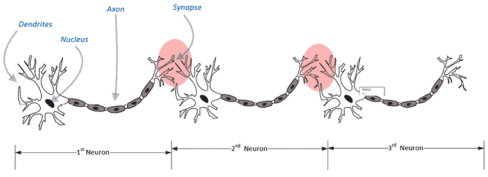
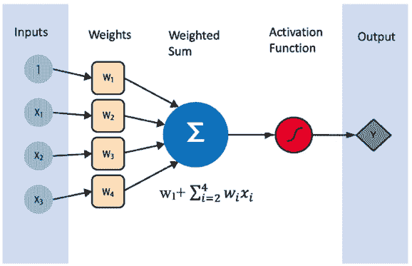
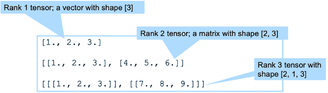

# 第八章：神经网络算法

> 幽默没有算法。
> 
> —罗伯特·曼科夫

神经网络已经成为研究的课题超过七十年，但由于计算能力的限制和数字化数据的匮乏，它们的应用受到了制约。如今，由于我们日益增长的解决复杂挑战的需求、数据生产的爆炸性增长以及如云计算等技术的进步，环境发生了显著变化，赋予了我们强大的计算能力。这些改进为我们提供了开发和应用这些复杂算法的潜力，以解决曾经被认为不切实际的复杂问题。事实上，这是一个迅速发展的研究领域，是机器人技术、边缘计算、自然语言处理和自动驾驶汽车等前沿技术领域大多数重大进展的源泉。

本章首先介绍典型神经网络的主要概念和组成部分。接下来，介绍神经网络的不同类型，并解释这些神经网络中使用的各种激活函数。然后，详细讨论反向传播算法，这是训练神经网络中最广泛使用的算法。接下来，解释转移学习技术，它可以极大简化并部分自动化模型的训练。最后，通过一个现实世界的应用示例，说明如何使用深度学习来标记欺诈性文档。

本章讨论的主要概念如下：

+   理解神经网络

+   神经网络的演变

+   训练神经网络

+   工具和框架

+   转移学习

+   案例研究：使用深度学习进行欺诈检测

让我们从神经网络的基础开始。

# 神经网络的演变

神经网络在其最基本的层面上，由被称为神经元的独立单元组成。这些神经元是神经网络的基石，每个神经元执行各自特定的任务。当这些独立的神经元组织成结构化的层时，神经网络的真正力量得以展现，从而促进复杂的处理过程。每个神经网络都由这些层的错综复杂的网络组成，层与层之间通过连接形成互联网络。

信息或信号在通过这些层时被一步一步地处理。每一层都会修改信号，最终影响整体输出。具体来说，初始层接收输入信号，对其进行处理后将其传递到下一层。随后的层进一步处理接收到的信号并继续传递。这一传递过程一直持续，直到信号到达最终层，生成所需的输出。

正是这些隐藏层或中间层赋予了神经网络进行深度学习的能力。这些层通过逐步将原始输入数据转换为更有用的形式，创建了抽象表示的层次结构。这有助于从原始数据中提取更高层次的特征。

这种深度学习能力具有广泛的实际应用，从使亚马逊的 Alexa 能够理解语音命令，到支持谷歌的图像和整理谷歌照片。

## 历史背景

受到人类大脑中神经元工作的启发，Frank Rosenblatt 在 1957 年提出了神经网络的概念。要完全理解其结构，简要查看人类大脑神经元的分层结构是很有帮助的。（参考*图 8.1*，了解人类大脑中神经元如何相互连接。）

在人脑中，**树突**充当传感器，检测信号。树突是神经元的组成部分，作为主要感觉器官。它们负责检测传入的信号。然后信号传递给**轴突**，这是神经细胞的一种长而细的突出部分。轴突的功能是将这个信号传输到肌肉、腺体和其他神经元。如下图所示，信号通过称为**突触**的相互连接组织传递，然后传递给其他神经元。请注意，通过这种有机管道，信号一直传播，直到达到目标肌肉或腺体，引起所需的动作。信号通常需要七到八毫秒才能通过神经元链传播并到达目标。



图 8.1：人脑中连接在一起的神经元

受到这种自然信号处理建筑杰作的启发，Frank Rosenblatt 设计了一种技术，使得可以按层处理数字信息以解决复杂的数学问题。他最初设计的神经网络尝试非常简单，看起来像一个线性回归模型。这种简单的神经网络没有任何隐藏层，被命名为*感知器*。这种没有任何层的简单神经网络，感知器，成为了神经网络的基本单元。实质上，感知器是生物神经元的数学模拟，因此是更复杂神经网络的基本构建块。

现在，让我们深入了解**人工智能**（**AI**）演化历史的简明史账。

## AI 寒冬与 AI 春天的曙光

对感知器这一突破性概念的最初热情在其重大局限性被发现后迅速消退。1969 年，马文·明斯基和西摩·帕珀特进行了深入研究，揭示了感知器在学习能力上的局限性。他们发现，感知器无法学习和处理复杂的逻辑函数，甚至在处理像异或（XOR）这样的简单逻辑函数时也存在困难。

这一发现引发了对**机器学习**（**ML**）和神经网络兴趣的显著下降，开启了一个通常被称为“人工智能寒冬”的时代。这一时期，全球研究界普遍对人工智能的潜力表示怀疑，认为其不足以解决复杂问题。

回顾起来，“人工智能寒冬”在某种程度上是当时硬件能力受限的结果。那时的硬件要么缺乏必要的计算能力，要么过于昂贵，这极大地阻碍了人工智能的进展。这一限制阻碍了人工智能的应用和发展，导致人们普遍对其潜力感到失望。

到了 1990 年代末，关于人工智能及其潜力的看法发生了巨大变化。推动这一变化的催化剂是分布式计算的发展，它提供了易于获取和负担得起的基础设施。看到人工智能的潜力，当时新崛起的 IT 巨头（如谷歌）将人工智能作为其研发的重点。这种对人工智能的重新兴趣导致了所谓“人工智能寒冬”的解冻。这一解冻重新激发了对人工智能的研究，最终使得当前时代成为一个可以称之为**人工智能春天**的时代，大家对人工智能和神经网络充满兴趣。此外，数字化数据当时尚未普及。

# 理解神经网络

首先，让我们从神经网络的核心——感知器开始。你可以把一个单独的感知器看作是最简单的神经网络，它是现代复杂多层架构的基本构建模块。让我们从理解感知器的工作原理开始。

## 理解感知器

一个单一的感知器有多个输入和一个输出，该输出由激活函数控制或激活。如下图*图 8.2*所示：



图 8.2：一个简单的感知器

*图 8.2*中显示的感知机有三个输入特征；*x*[1]，*x*[2]，和*x*[3]。我们还加入了一个常数信号，称为偏置。偏置在我们的神经网络模型中起着关键作用，因为它允许在拟合数据时具有灵活性。它的作用类似于线性方程中添加的截距——作为激活函数的一种“偏移”——从而使我们在输入为零时能够更好地拟合数据。输入特征和偏置与权重相乘并求和，得到加权和 。这个加权和会传递给激活函数，产生输出 y。能够使用多种激活函数来制定特征与标签之间的复杂关系是神经网络的一个优势。通过超参数可以选择多种激活函数。一些常见的例子包括 sigmoid 函数，它将值压缩到 0 到 1 之间，是二分类问题的好选择；tanh 函数，它将值缩放到 -1 到 1 之间，提供零中心的输出；以及**修正线性单元**（**ReLU**）函数，它将向量中的所有负值设为零，有效地去除任何负面影响，并且在卷积神经网络中常常被使用。接下来，本章将详细讨论这些激活函数。

现在让我们来探讨一下神经网络背后的直觉。

## 理解神经网络背后的直觉

在上一章中，我们讨论了一些传统的机器学习算法。这些传统算法在许多重要的应用场景中表现优异，但它们也有一定的局限性。当训练数据集中的潜在模式开始变得非线性和多维时，传统机器学习算法的能力已经无法准确捕捉特征与标签之间复杂的关系。这些不完备的、相对简化的数学公式化表示复杂模式，导致在这些用例中的训练模型表现不佳。

在现实世界的场景中，我们经常遇到特征与标签之间的关系不是线性或简单的，而是呈现出复杂的模式。这正是神经网络的优势所在，它为我们提供了一个强大的工具，用于建模这些复杂性。

神经网络在处理高维数据或特征与结果之间的关系是非线性的情况下特别有效。例如，它们在图像和语音识别等应用中表现出色，其中输入数据（像素或声波）具有复杂的层级结构。传统的机器学习算法可能在这些情况下表现不佳，因为特征之间关系的高度复杂性和非线性。

虽然神经网络是非常强大的工具，但我们必须承认它们并非没有局限性。这些限制将在本章后面详细探讨，对于神经网络在解决现实问题中的有效应用，了解这些限制至关重要。

现在，让我们举例说明使用更简单的机器学习算法，如线性回归时常见的模式及其相关挑战。假设我们正在尝试根据“受教育年限”预测数据科学家的工资。我们从两个不同的组织收集了两个数据集。

首先，让我们介绍数据集 1，如*图 8.3(a)*所示。它描述了特征（受教育年限）与标签（工资）之间的相对简单的关系，看起来是线性的。然而，即使是这个简单的模式，在我们尝试用线性算法进行数学建模时，也会遇到一些挑战：

+   我们知道，工资不能为负数，这意味着无论受教育年限如何，工资（`y`）都不应小于零。

+   至少有一位刚毕业的初级数据科学家，可能只用了“`x`[1]”年的教育时间，但目前工资为零，可能是实习生。因此，在“`x`”的取值范围从零到“`x`[1]”时，工资“`y`”保持为零，如*图 8.3(a)*所示。

有趣的是，我们可以利用神经网络中可用的修正线性激活函数来捕捉特征与标签之间这种复杂的关系，这是我们后面将探讨的一个概念。

接下来，我们来看数据集 2，如*图 8.3(b)*所示。这个数据集表示特征与标签之间的非线性关系。其工作原理如下：

1.  当“`x`” （受教育年限）从零变化到“`x`[1]”时，工资“`y`”保持为零。

1.  当“`x`”接近“`x`[2]”时，工资急剧增加。

1.  但一旦“`y`”超过“`x`[2]”，工资将达到平稳状态并趋于平坦。

正如我们将在本书后面看到的，我们可以在神经网络框架内使用 Sigmoid 激活函数来建模此类关系。理解这些模式并知道何时应用合适的工具，是有效利用神经网络强大功能的关键：


图 8.3：工资与受教育年限

(a) 数据集 1：线性模式 (b) 数据集 2：非线性模式

## 理解分层深度学习架构

对于更复杂的问题，研究人员开发了一种多层神经网络，称为**多层感知器**。一个多层神经网络有几个不同的层，如下图所示。这些层如下：

+   **输入层**：第一层是输入层。在输入层，特征值作为输入被馈送到网络中。

+   **隐藏层**：输入层后面跟随一个或多个隐藏层。每个隐藏层都是类似激活函数的数组。

+   **输出层**：最后一层称为输出层。

一个简单的神经网络会有一个隐藏层。一个深度神经网络是一个有两个或更多隐藏层的神经网络。见*图 8.4*。


图 8.4：简单神经网络与深度神经网络

接下来，让我们尝试理解隐藏层的功能。

### 培养对隐藏层的直觉

在神经网络中，隐藏层在解释输入数据中起着关键作用。隐藏层在神经网络中以层级结构有序组织，每一层对其输入数据执行独特的非线性转换。这种设计允许从输入中提取逐渐更抽象、更细致的特征。

以卷积神经网络为例，卷积神经网络是专为图像处理任务设计的神经网络子类型。在这个背景下，较低的隐藏层专注于辨别图像中的简单局部特征，如边缘和角落。这些特征虽然是基础的，但单独来看并没有太大意义。

随着我们深入到隐藏层，这些层开始连接起各个点。可以说，它们将较低层检测到的基本模式整合成更复杂、更有意义的结构。结果，本来杂乱无章的边缘和角落，转变为可识别的形状和模式，从而赋予网络一定的“视觉”。

这个逐步转换的过程将未经处理的像素值转化为精细的特征和模式映射，从而实现诸如指纹识别等高级应用。在这里，网络能够识别指纹中脊线和谷线的独特排列，将这些原始的视觉数据转换为独特的身份标识。因此，隐藏层将原始数据转换并提炼成有价值的洞察。

### 应该使用多少个隐藏层？

请注意，隐藏层的最佳数量会根据问题的不同而有所变化。对于某些问题，应该使用单层神经网络。这些问题通常表现出简单的模式，可以通过简洁的网络设计轻松捕捉和表达。对于其他问题，我们应增加多个层以获得最佳性能。例如，如果你正在处理一个复杂的问题，如图像识别或自然语言处理，可能需要一个具有多个隐藏层和每层更多节点的神经网络。

数据的潜在模式的复杂性将很大程度上影响你的网络设计。例如，对于简单问题使用过于复杂的神经网络可能导致过拟合，使得你的模型过度拟合训练数据，并且在新的、未见过的数据上表现不佳。另一方面，过于简单的模型可能会导致欠拟合，即模型未能捕捉数据中的关键模式。

此外，激活函数的选择也起着关键作用。例如，如果你的输出需要是二元的（如是/否问题），则可以使用 sigmoid 函数。对于多分类问题，softmax 函数可能更为合适。

最终，选择神经网络架构的过程需要仔细分析你的问题，并进行实验和微调。在这个过程中，开发一个基准实验模型可能会很有帮助，这样你可以通过迭代调整和优化网络设计，以达到最佳性能。

接下来，我们来看看神经网络的数学基础。

### 神经网络的数学基础

理解神经网络的数学基础是发挥其能力的关键。虽然它们看起来复杂，但其原理基于熟悉的数学概念，如线性代数、微积分和概率论。神经网络的魅力在于其从数据中学习并随着时间推移不断改进的能力，这些特性源于它们的数学结构：


图 8.5：多层感知机

*图 8.5* 显示了一个四层神经网络。在这个神经网络中，一个重要的要点是，神经元是该网络的基本单元，并且每一层的神经元都与下一层的所有神经元相连接。对于复杂的网络，这些连接的数量会急剧增加，我们将探索在不牺牲太多质量的情况下减少这些连接的不同方法。

首先，让我们尝试表述我们要解决的问题。

输入是一个特征向量 *x*，其维度为 *n*。

我们希望神经网络能够预测值。预测值用 *ý* 表示。

从数学角度看，我们想要确定，在给定特定输入的情况下，交易是欺诈的概率。换句话说，给定 *x* 的特定值，*y* = 1 的概率是多少？从数学角度看，我们可以表示为：


请注意，*x* 是一个 *n*[x] 维的向量，其中 *n*[x] 是输入变量的数量。

如*图 8.6*所示，神经网络有四层。输入层和输出层之间的层称为隐藏层。第一层隐藏层中的神经元数量用表示。各个节点之间的连接由被称为*权重*的参数乘以。训练神经网络的过程本质上是围绕着确定与网络中各个神经元连接相关的权重的最优值。通过调整这些权重，网络可以调整其计算并随着时间的推移提高性能。

让我们看看如何训练一个神经网络。

# 训练神经网络

使用给定数据集构建神经网络的过程称为训练神经网络。让我们深入了解典型神经网络的结构。当我们谈论训练神经网络时，我们是在谈论为权重计算最佳值。训练是通过使用一组以训练数据形式呈现的示例进行的。训练数据中的示例为不同输入值组合的输出提供了预期值。神经网络的训练过程与传统模型的训练方式不同（这在*第七章*，*传统监督学习算法*中有讨论）。

# 理解神经网络的结构

让我们看看神经网络由哪些部分组成：

+   **层**：层是神经网络的核心构建块。每一层是一个数据处理模块，充当过滤器。它接收一个或多个输入，以某种方式处理这些输入，然后生成一个或多个输出。每次数据通过一层时，它都会经历一个处理阶段，并展示与我们试图回答的业务问题相关的模式。

+   **损失函数**：损失函数提供了在学习过程的各个迭代中使用的反馈信号。损失函数为单个示例提供偏差。

+   **成本函数**：成本函数是完整示例集上的损失函数。

+   **优化器**：优化器决定如何解释损失函数提供的反馈信号。

+   **输入数据**：输入数据是用于训练神经网络的数据。它指定了目标变量。

+   **权重**：权重通过训练网络来计算。权重大致对应于每个输入的重要性。例如，如果某个输入比其他输入更重要，那么在训练后，它将被赋予更大的权重值，作为乘数。即使这个重要输入的信号较弱，它也会因为较大的权重值（作为乘数的作用）而增强。因此，权重最终根据输入的重要性调整每个输入的影响。

+   **激活函数**：这些值会被不同的权重乘以，然后汇总。它们如何被汇总以及如何解读其值，将由所选择的激活函数的类型决定。

现在，让我们来看看神经网络训练中一个非常重要的方面。

在训练神经网络时，我们会逐一处理每一个样本。对于每一个样本，我们使用正在训练的模型生成输出。术语“正在训练”指的是模型的学习状态，此时模型仍在调整并从数据中学习，尚未达到最佳性能。在这个阶段，模型参数，如权重，持续更新和调整，以提高其预测性能。我们计算期望输出与预测输出之间的差异。对于每个单独的样本，这个差异被称为**损失**。所有样本的损失加起来，就是**代价**。随着训练的进行，我们的目标是找到合适的权重值，以使得损失值最小化。在整个训练过程中，我们会不断调整权重值，直到找到一组能使总体代价最小的权重值。一旦我们达到最小代价，就标志着模型已经训练完成。

# 定义梯度下降

训练神经网络的核心目标是确定权重的正确值，这些权重像“旋钮”或“调节器”一样，通过调整它们来最小化模型预测与实际值之间的差异。

当训练开始时，我们使用随机或默认值初始化这些权重。然后，我们使用优化算法逐步调整它们，常用的优化算法是“梯度下降”，以逐步改进模型的预测结果。

让我们深入了解梯度下降算法。梯度下降的旅程从我们设置的初始随机权重值开始。

从这个起点开始，我们迭代并在每一步调整这些权重，使得我们更接近最小代价。

为了更清楚地说明这一点，假设我们的数据特征是输入向量**X**。目标变量的真实值是**Y**，而我们模型预测的值是**Y**。我们衡量实际值与预测值之间的差异或偏差，这个差异就是我们的损失。

然后，我们更新权重，考虑到两个关键因素：移动的方向和步伐的大小，也就是学习率。

“方向”告诉我们该朝哪个方向移动，以找到损失函数的最小值。可以把它想象成下坡——我们希望沿着坡度最陡的地方“下坡”，这样可以最快到达底部（即最小损失）。

“学习率”决定了我们在选择的方向上的步长大小。就像决定是走下山坡还是跑下去——较大的学习率意味着更大的步伐（像奔跑），而较小的学习率意味着较小的步伐（像走路）。

这个迭代过程的目标是达到一个我们无法继续“下坡”的点，意味着我们已经找到了最小的成本，表示我们的权重已经最优，模型也已经很好地训练完成。

这个简单的迭代过程在下图中展示：


图 8.6：梯度下降算法，寻找最小值

图示展示了通过调整权重，梯度下降如何尝试找到最小的成本。学习率和选择的方向将决定图表中下一个要探索的点。

选择正确的学习率非常重要。如果学习率太小，问题可能需要很长时间才能收敛。如果学习率过高，问题将无法收敛。在前面的图示中，表示当前解的点会在图表的两条对立线之间不断摆动。

现在，让我们来看看如何最小化梯度。仅考虑两个变量，*x* 和 *y*。*x* 和 *y* 的梯度计算如下：


为了最小化梯度，可以使用以下方法：

```py
def adjust_position(gradient):
    while gradient != 0:
        if gradient < 0:
            print("Move right")
            # here would be your logic to move right
        elif gradient > 0:
            print("Move left")
            # here would be your logic to move left 
```

该算法还可以用于寻找神经网络权重的最优或近似最优值。

请注意，梯度下降的计算是从网络的后端开始进行的。我们首先计算最终层的梯度，然后是倒数第二层的梯度，再然后是之前的层，一直到达第一层。这就是所谓的反向传播，它是由 Hinton、Williams 和 Rumelhart 于 1985 年提出的。

接下来，让我们深入探讨激活函数。

# 激活函数

激活函数制定了如何处理特定神经元的输入以生成输出的方式。

如*图 8.7*所示，神经网络中的每个神经元都有一个激活函数，决定了如何处理输入数据：


图 8.7：激活函数

在前面的图示中，我们可以看到由激活函数生成的结果被传递到输出端。激活函数设定了如何解释输入值以生成输出的标准。

对于完全相同的输入值，不同的激活函数将产生不同的输出。理解如何选择正确的激活函数在使用神经网络解决问题时非常重要。

现在，让我们逐一看看这些激活函数。

## 步骤函数

最简单的激活函数是阈值函数。阈值函数的输出是二值的：0 或 1。如果任何输入大于 1，它将生成 1 作为输出。这可以通过 *图 8.8* 来解释：


图 8.8：阶跃函数

尽管其简单性，阈值激活函数在我们需要输出之间清晰划分时起着重要作用。使用此函数，只要输入的加权和中有任何非零值，输出 (*y*) 就会变为 1。然而，它的简单性也带来了缺点——该函数极其敏感，可能会因为输入中的微弱信号或噪声而被错误触发。

例如，考虑一种情况，其中神经网络使用此函数将电子邮件分类为“垃圾邮件”或“非垃圾邮件”。在这里，输出 1 可能表示“垃圾邮件”，而 0 可能表示“非垃圾邮件”。某个特征（如某些关键垃圾邮件词汇）的最轻微出现可能会触发该函数将电子邮件分类为“垃圾邮件”。因此，尽管它在某些应用中是一个有价值的工具，但在输入数据中噪声或轻微变化常见的情况下，应该考虑其过度敏感性的潜力。接下来，让我们深入了解 Sigmoid 函数。

## Sigmoid 函数

Sigmoid 函数可以视为阈值函数的一种改进。在这里，我们可以控制激活函数的敏感性：


图 8.9：Sigmoid 激活函数

Sigmoid 函数 *y* 定义如下，并在 *图 8.9* 中显示：


可以通过以下方式在 Python 中实现：

```py
def sigmoidFunction(z):
      return 1/ (1+np.exp(-z)) 
```

上面的代码使用 Python 演示了 Sigmoid 函数。这里，`np.exp(-z)` 是对 `-z` 应用的指数运算，结果加上 1 构成方程的分母，从而得到一个介于 0 和 1 之间的值。

通过 Sigmoid 函数降低激活函数的敏感性，使其不易受到输入中的突变或“故障”影响。然而，值得注意的是，输出仍然是二值的，意味着它只能是 0 或 1。

Sigmoid 函数广泛应用于二分类问题，其中输出预期为 0 或 1。例如，如果你正在开发一个模型来预测电子邮件是否是垃圾邮件（1）或非垃圾邮件（0），则 Sigmoid 激活函数将是一个合适的选择。

现在，让我们深入了解 **ReLU** 激活函数。

## ReLU

本章介绍的前两个激活函数的输出是二进制的。这意味着它们会将一组输入变量转换为二进制输出。ReLU 是一种激活函数，它将一组输入变量作为输入，并将其转换为单一的连续输出。在神经网络中，ReLU 是最流行的激活函数，通常用于隐藏层，我们不希望将连续变量转换为类别变量。

以下图表总结了 ReLU 激活函数：


图 8.10：ReLU

请注意，当*x* ≤ 0 时，这意味着*y* = 0。这意味着输入中任何为零或小于零的信号都会被转换为零输出：


一旦*x*变为大于零，它就是*x*。

ReLU 函数是神经网络中最常用的激活函数之一。它可以在 Python 中按如下方式实现：

```py
def relu(x):
    if x < 0:
        return 0
    else:
        return x 
```

现在让我们看看基于 ReLU 的 Leaky ReLU。

### Leaky ReLU

在 ReLU 中，*x*的负值会导致*y*的值为零。这意味着在过程中丢失了一些信息，这使得训练周期特别在训练初期变得更长。Leaky ReLU 激活函数解决了这个问题。以下内容适用于 Leaky ReLU：


如下图所示：


图 8.11：Leaky ReLU

这里，是一个值小于 1 的参数。

它可以在 Python 中按如下方式实现：

```py
def leaky_relu(x, beta=0.01):
    if x < 0:
        return beta * x    
    else:        
        return x 
```

为赋值有多种策略：

+   **默认值**：我们可以为指定一个默认值，通常为`0.01`。这是最直接的方法，在我们希望快速实现而不进行复杂调优的情况下非常有用。

+   **参数化 ReLU**：另一种方法是允许在我们的神经网络模型中成为一个可调参数。在这种情况下，的最佳值是在训练过程中学习到的。这在我们希望将激活函数调整为数据中存在的特定模式时非常有用。

+   **随机 ReLU**：我们还可以选择随机赋值给。这种技术被称为随机 ReLU，可以作为一种正则化方法，通过引入一些随机性来防止过拟合。这在我们有一个包含复杂模式的大型数据集，并且希望确保模型不会过拟合训练数据时非常有用。

## 双曲正切（tanh）

双曲正切函数，或称为 tanh，与 sigmoid 函数密切相关，其主要区别在于：它可以输出负值，从而提供一个更广泛的输出范围，介于 `-1` 和 `1` 之间。这在我们想要建模包含正负影响的现象时非常有用。*图 8.12* 展示了这一点：


图 8.12：双曲正切

*y* 函数如下：


它可以通过以下 Python 代码实现：

```py
import numpy as np
def tanh(x): 
    numerator = 1 - np.exp(-2 * x) 
    denominator = 1 + np.exp(-2 * x) 
    return numerator / denominator 
```

在这段 Python 代码中，我们使用了 `numpy` 库，简称 `np`，来处理数学运算。`tanh` 函数，像 `sigmoid` 一样，是神经网络中的一种激活函数，用于为模型引入非线性。它通常在神经网络的隐藏层中优于 sigmoid，因为它通过将输出的均值设置为 `0` 来使数据居中，从而使得下一个层的学习更加容易。然而，选择 `tanh`、`sigmoid` 或其他激活函数，主要取决于你正在处理的模型的具体需求和复杂性。

接下来，让我们深入探讨一下 softmax 函数。

## Softmax

有时，我们需要激活函数的输出有多个层级。Softmax 就是一种激活函数，它为我们提供了超过两个层级的输出。它最适合用于多分类问题。假设我们有 *n* 个类别。我们有输入值，这些输入值将类别映射如下：

*x = {x*^((1))*,x*^((2))*,....x*^((n))*}*

Softmax 操作基于概率理论。对于二分类器，最后一层的激活函数将是 sigmoid，而对于多分类器，则使用 softmax。举个例子，假设我们要对一张水果图片进行分类，类别为 `apple`（苹果）、`banana`（香蕉）、`cherry`（樱桃）和 `date`（枣）。Softmax 函数会计算这张图片属于每个类别的概率。概率最高的类别会被认为是预测结果。

为了在 Python 代码和公式中解释这一点，让我们来看以下内容：

```py
import numpy as np
def softmax(x): 
    return np.exp(x) / np.sum(np.exp(x), axis=0) 
numpy library (np) to perform the mathematical operations. The softmax function takes an array of x as input, applies the exponential function to each element, and normalizes the results so that they sum up to 1, which is the total probability across all classes.
```

现在，让我们看一下与神经网络相关的各种工具和框架。

# 工具和框架

本节将深入探讨一些专门为便于实现神经网络而开发的工具和框架。每个框架都有其独特的优点和可能的局限性。

在众多可用的选项中，我们选择重点介绍 Keras，它是一个高级神经网络 API，可以在 TensorFlow 之上运行。你可能会问，为什么是 Keras 和 TensorFlow？这两个结合起来提供了多个显著的优势，成为了业内实践者的热门选择。

首先，Keras 因其用户友好且模块化的特点，简化了构建和设计神经网络模型的过程，既适合初学者也适合有经验的用户。其次，它与 TensorFlow 的兼容性——TensorFlow 是一个强大的端到端开源机器学习平台——确保了其健壮性和多功能性。TensorFlow 提供的高计算性能是其另一个宝贵资产。两者结合，形成了一个动态组合，在可用性和功能性之间取得了平衡，使其成为神经网络模型开发和部署的绝佳选择。

在接下来的章节中，我们将探讨如何使用具有 TensorFlow 后端的 Keras 来构建神经网络。

## Keras

Keras ([`www.tensorflow.org/guide/keras`](https://www.tensorflow.org/guide/keras)) 是一个非常流行且易于使用的神经网络库，使用 Python 编写。它的编写目标是易用性，并提供了实现深度学习的最快方式。Keras 仅提供高级模块，被视为模型级别的工具。

现在，让我们看看 Keras 的各种后端引擎。

### Keras 的后端引擎

Keras 需要一个较低级别的深度学习库来执行张量级别的操作。这个基础层被称为“后端引擎”。

简单来说，张量级别的操作涉及对多维数据数组（即张量）进行计算和转换，张量是神经网络中使用的主要数据结构。这个较低级别的深度学习库被称为*后端引擎*。Keras 的后端引擎可能包括以下几种：

+   **TensorFlow** ([www.tensorflow.org](http://www.tensorflow.org)): 这是同类中最受欢迎的框架，由 Google 开源。

+   **Theano**：这是在蒙特利尔大学 MILA 实验室开发的。

+   **Microsoft Cognitive Toolkit** (**CNTK**) ([`learn.microsoft.com/en-us/cognitive-toolkit/`](https://learn.microsoft.com/en-us/cognitive-toolkit/)): 这是由微软开发的。

这种模块化深度学习技术栈的格式如下面的图所示：


图 8.13：Keras 架构

这种模块化的深度学习架构的优势在于，Keras 的后端可以在不重写任何代码的情况下进行更改。例如，如果我们发现 TensorFlow 在某个特定任务上比 Theano 更好，我们可以简单地将后端更改为 TensorFlow，而无需重写代码。

接下来，让我们深入了解深度学习栈的低级层次。

### 深度学习栈的低级层次

我们刚才提到的三种后端引擎都可以在 CPU 和 GPU 上运行，使用堆栈的低级层。对于 CPU，使用一个低级的张量操作库**Eigen**。对于 GPU，TensorFlow 使用 NVIDIA 的**CUDA 深度神经网络**（**cuDNN**）库。值得解释的是，为什么在机器学习中通常更偏爱 GPU。

虽然 CPU 具有多功能性和强大性能，但 GPU 是专门设计用来同时处理多个操作的，这在处理大量数据时尤其有利，而这在机器学习任务中非常常见。GPU 的这一特性，加上更高的内存带宽，可以显著加快机器学习计算，因此它们成为这些任务的流行选择。

接下来，让我们解释一下超参数。

### 定义超参数

如*第六章*《*无监督机器学习算法*》中讨论的那样，超参数是一个在学习过程开始之前选择的参数值。我们通常从常识性的值开始，然后尝试优化它们。对于神经网络，重要的超参数包括：

+   激活函数

+   学习率

+   隐藏层的数量

+   每个隐藏层中的神经元数量

让我们看看如何使用 Keras 定义一个模型。

### 定义一个 Keras 模型

定义完整 Keras 模型涉及三个步骤：

1.  定义层

1.  定义学习过程

1.  测试模型

我们可以使用`Keras`有两种方式来构建模型：

+   **函数式 API**：这允许我们为无环图的层架构模型。可以使用函数式 API 创建更复杂的模型。

+   **顺序 API**：这允许我们为线性堆叠的层架构模型。它适用于相对简单的模型，是构建模型时的常用选择。

首先，我们来看一下使用顺序方式定义 Keras 模型：

1.  让我们从导入`tensorflow`库开始：

    ```py
    import tensorflow as tf 
    ```

1.  然后，从 Keras 的 datasets 加载 MNIST 数据集：

    ```py
    mnist = tf.keras.datasets.mnist 
    ```

1.  接下来，将数据集拆分为训练集和测试集：

    ```py
    (train_images, train_labels), (test_images, test_labels) = mnist.load_data() 
    ```

1.  我们将像素值从`255`的比例归一化到`1`的比例：

    ```py
    train_images, test_images = train_images / 255.0,                             test_images / 255.0 
    ```

1.  接下来，我们定义模型的结构：

    ```py
    model = tf.keras.models.Sequential([
        tf.keras.layers.Flatten(input_shape=(28, 28)),
        tf.keras.layers.Dense(128, activation='relu'),
        tf.keras.layers.Dropout(0.15),
        tf.keras.layers.Dense(128, activation='relu'),
        tf.keras.layers.Dropout(0.15),
        tf.keras.layers.Dense(10, activation='softmax'),
    ]) 
    ```

该脚本正在训练一个模型来分类`MNIST`数据集中的图像，该数据集包含 70,000 张由高中生和美国人口普查局员工手写的数字小图像。

模型使用 Keras 中的`Sequential`方法定义，表示我们的模型是一个线性堆叠的层：

1.  第一层是一个`Flatten`层，它将图像的格式从二维数组转换为一维数组。

1.  下一层是一个`Dense`层，它是一个全连接神经层，包含 128 个节点（或神经元）。此处使用`relu`（ReLU）激活函数。

1.  `Dropout`层在每次训练时随机将输入单元设置为`0`，其频率由每步的率控制，帮助防止过拟合。

1.  另一个`Dense`层被包含在内，类似于前一个层，它也使用`relu`激活函数。

1.  我们再次应用一个`Dropout`层，使用与之前相同的比率。

1.  最后一层是一个 10 节点的 softmax 层——它返回一个包含 10 个概率分数的数组，总和为`1`。每个节点包含一个分数，表示当前图像属于 10 个数字类别中的某一类别的概率。

请注意，在这里，我们创建了三层——前两层使用`relu`激活函数，第三层使用`softmax`作为激活函数。

现在，让我们来看一下使用 Functional API 定义 Keras 模型的方式：

1.  首先，我们导入`tensorflow`库：

    ```py
    # Ensure TensorFlow 2.x is being used
    %tensorflow_version 2.x
    import tensorflow as tf
    from tensorflow.keras.datasets import mnist 
    ```

1.  为了使用`MNIST`数据集，我们首先将其加载到内存中。该数据集已经方便地分为训练集和测试集，包含了图像和相应的标签：

    ```py
    # Load MNIST dataset
    (train_images, train_labels), (test_images, test_labels) = mnist.load_data()
    # Normalize the pixel values to be between 0 and 1
    train_images, test_images = train_images / 255.0, test_images / 255.0 
    ```

1.  `MNIST`数据集中的图像大小为`28x28`像素。在使用 TensorFlow 设置神经网络模型时，需要指定输入数据的形状。在这里，我们为模型建立了输入张量：

    ```py
    inputs = tf.keras.Input(shape=(28,28)) 
    ```

1.  接下来，`Flatten`层是一个简单的数据预处理步骤。它通过“拉平”输入，将二维的`128x128`像素图像转换为一维数组。这样可以为后续的`Dense`层做准备：

    ```py
    x = tf.keras.layers.Flatten()(inputs) 
    ```

1.  接下来是第一个`Dense`层，也称为全连接层，其中每个输入节点（或神经元）都与每个输出节点相连接。该层有 512 个输出节点，并使用`relu`激活函数。ReLU 是一个流行的激活函数，它在输入为正时直接输出输入值；否则输出零：

    ```py
    x = tf.keras.layers.Dense(512, activation='relu', name='d1')(x) 
    ```

1.  `Dropout`层会在每次训练更新时随机将输入节点的一部分（在本例中为 0.2 或 20%）设置为 0，这有助于防止过拟合：

    ```py
    x = tf.keras.layers.Dropout(0.2)(x) 
    ```

1.  最后是输出层。它是另一个`Dense`层，包含 10 个输出节点（假设是 10 个类别）。应用`softmax`激活函数，该函数输出一个概率分布，覆盖 10 个类别，这意味着它将输出 10 个值，总和为 1。每个值表示模型对输入图像对应某一特定类别的置信度：

    ```py
    predictions = tf.keras.layers.Dense(10, activation=tf.nn.softmax, name='d2')(x)
    model = tf.keras.Model(inputs=inputs, outputs=predictions) 
    ```

请注意，我们可以使用 Sequential 和 Functional 两种 API 定义相同的神经网络。从性能角度来看，选择哪种方式定义模型并没有区别。

让我们将数值型的`train_labels`和`test_labels`转换为 one-hot 编码向量。在下面的代码中，每个标签都会变成一个大小为 10 的二进制数组，其中相应数字的索引位置为 1，其余位置为 0：

```py
# One-hot encode the labels
train_labels_one_hot = tf.keras.utils.to_categorical(train_labels, 10)
test_labels_one_hot = tf.keras.utils.to_categorical(test_labels, 10) 
```

我们现在应该定义学习过程。

在这一步，我们定义三项内容：

+   优化器

+   `loss`函数

+   将量化模型质量的度量标准：

```py
optimizer = tf.keras.optimizers.RMSprop()
loss = 'categorical_crossentropy'
metrics = ['accuracy']
model.compile(optimizer=optimizer, loss=loss, metrics=metrics) 
```

请注意，我们使用`model.compile`函数来定义优化器、损失函数和度量标准。

现在我们将训练模型。

一旦架构定义完成，就可以开始训练模型：

```py
history = model.fit(train_images, train_labels_one_hot, epochs=10, validation_data=(test_images, test_labels_one_hot)) 
```

请注意，像`batch_size`和`epochs`这样的参数是可配置的参数，因此它们是超参数。

接下来，让我们深入探讨如何选择顺序模型或功能模型。

# 选择顺序模型或功能模型

在决定使用顺序模型还是功能模型来构建神经网络时，网络架构的性质将指导你的选择。顺序模型适用于简单的线性层堆叠。它实现起来简单直接，是初学者或处理简单任务的理想选择。然而，这种模型有一个关键的限制：每一层只能连接到一个输入张量和一个输出张量。

如果你的网络架构更加复杂，例如在任何阶段（输入层、输出层或隐藏层）有多个输入或输出，那么顺序模型就不再适用。对于这种复杂的架构，功能模型更为合适。该模型提供了更高的灵活性，允许在任何层具有多个输入和输出，从而支持更复杂的网络结构。现在让我们更深入地理解 TensorFlow。

## 了解 TensorFlow

TensorFlow 是最流行的神经网络工作库之一。在前面的部分中，我们看到它如何作为 Keras 的后台引擎使用。它是一个开源的高性能库，实际上可以用于任何数值计算。

如果我们看看堆栈，我们可以看到，我们可以使用像 Python 或 C++这样的高级语言编写 TensorFlow 代码，这些代码会被 TensorFlow 分布式执行引擎解释执行。这使得它对开发者来说非常有用并且广受欢迎。

TensorFlow 通过使用**有向图**（**DG**）来体现你的计算。在这个图中，节点是数学运算，连接这些节点的边代表这些运算的输入和输出。此外，这些边还表示数据数组。

除了作为 Keras 的后台引擎，TensorFlow 还广泛应用于各种场景中。它可以帮助开发复杂的机器学习模型、处理大规模数据集，甚至在不同平台上部署 AI 应用。无论你是在创建推荐系统、图像分类模型，还是自然语言处理工具，TensorFlow 都能有效地满足这些任务以及更多需求。

## 介绍 TensorFlow 的基本概念

让我们简要了解一下 TensorFlow 中的概念，比如标量、向量和矩阵。我们知道，像三或五这样的简单数字，在传统数学中被称为**标量**。此外，在物理学中，**向量**是具有大小和方向的量。在 TensorFlow 中，我们用向量表示一维数组。扩展这一概念，二维数组即为**矩阵**。对于三维数组，我们使用**3D 张量**这一术语。我们使用**秩**来表示数据结构的维度。因此，**标量**是**秩 0**的数据结构，**向量**是**秩 1**的数据结构，**矩阵**是**秩 2**的数据结构。这些多维结构被称为**张量**，并在以下图表中展示：


图 8.14：多维结构或张量

如我们在前面的图表中看到的，秩定义了张量的维度。

现在，让我们来看另一个参数，`shape`。`shape`是一个整数元组，指定每个维度中数组的长度。

以下图表解释了`shape`的概念：



图 8.15：形状的概念

使用`shape`和秩，我们可以指定张量的详细信息。

## 理解张量数学

现在让我们看一下使用张量进行的不同数学运算：

+   让我们定义两个标量，并尝试使用 TensorFlow 进行加法和乘法运算：

    ```py
    print("Define constant tensors")
    a = tf.constant(2)
    print("a = %i" % a)
    b = tf.constant(3)
    print("b = %i" % b) 
    ```

    ```py
    Define constant tensors
    a = 2
    b = 3 
    ```

+   我们可以对其进行加法和乘法运算并展示结果：

    ```py
    print("Running operations, without tf.Session")
    c = a + b
    print("a + b = %i" % c)
    d = a * b
    print("a * b = %i" % d) 
    ```

    ```py
    Running operations, without tf.Session
    a + b = 5
    a * b = 6 
    ```

+   我们还可以通过将两个张量相加来创建一个新的标量张量：

    ```py
    c = a + b
    print("a + b = %s" % c) 
    ```

    ```py
    a + b = tf.Tensor(5, shape=(), dtype=int32) 
    ```

+   我们还可以执行复杂的张量运算：

    ```py
    d = a*b
    print("a * b = %s" % d) 
    ```

    ```py
    a * b = tf.Tensor(6, shape=(), dtype=int32) 
    ```

# 理解神经网络的类型

神经网络可以根据神经元的互联方式进行不同的设计。在密集型或全连接的神经网络中，给定层中的每个神经元都与下一层的每个神经元相连接。这意味着来自前一层的每个输入都会传递到下一层的每个神经元，从而最大化信息流动。

然而，神经网络并不总是完全连接的。有些网络可能基于其解决问题的需求，具有特定的连接模式。例如，在用于图像处理的卷积神经网络中，某一层的每个神经元可能只与上一层中一小块区域的神经元相连接。这与人类视觉皮层中神经元的组织方式相似，并帮助网络高效处理视觉信息。

记住，神经网络的具体架构——神经元如何互联——对其功能和性能有着极大的影响。

## 卷积神经网络

**卷积神经网络**（**CNNs**）通常用于分析多媒体数据。为了深入了解 CNN 如何分析基于图像的数据，我们需要掌握以下过程：

+   卷积

+   池化

让我们逐一探索它们。

### 卷积

卷积过程通过使用一个称为**滤波器**（也叫**卷积核**）的小图像处理特定图像，强调图像中的某些模式。例如，如果我们想找到图像中物体的边缘，我们可以将图像与特定的滤波器卷积，从而得到边缘。边缘检测有助于物体检测、物体分类等应用。因此，卷积过程就是在图像中寻找特征和特性。

查找模式的方法是基于找到可以在不同数据上重用的模式。这些可重用的模式被称为滤波器或卷积核。

### 池化

为了进行机器学习，处理多媒体数据的重要部分是下采样。下采样是减少数据分辨率的过程，即降低数据的复杂性或维度。池化提供了两个主要优点：

+   通过降低数据的复杂性，我们可以显著减少模型的训练时间，提高计算效率。

+   池化抽象并聚合了多媒体数据中的不必要细节，使其更加通用。反过来，这增强了模型表示相似问题的能力。

下采样过程如下：


图 8.16：下采样

在下采样过程中，我们本质上是将一组像素压缩成一个代表性像素。例如，我们可以将一个 2x2 像素块压缩成一个像素，从而将原始数据的分辨率减少四倍。

新像素的代表值可以通过多种方式选择。其中一种方法是“最大池化”，在这种方法中，我们从原始像素块中选择最大值来表示新的单一像素。

另一方面，如果我们选择取像素块值的平均值，这个过程将被称为“平均池化”。

最大池化与平均池化的选择通常取决于具体任务。最大池化在我们希望保留图像中最显著特征时特别有用，因为它保留了一个块中的最大像素值，从而捕捉到该部分中最突出或最显眼的特征。

相比之下，平均池化在我们希望保留整体背景并减少噪声时通常更有用，因为它考虑了块内的所有值并计算它们的平均值，从而创建一个更平衡的表示，可能对像素值中的细微变化或噪声不太敏感。

## 生成对抗网络

生成对抗网络，通常称为 GAN，是一种能够生成合成数据的神经网络类别。它由 Ian Goodfellow 及其团队于 2014 年首次提出，因其创新的方法而受到赞誉，能够创建与原始训练样本相似的新数据。

生成对抗网络（GAN）一个显著的应用是能够生成现实中不存在的人的逼真图像，展示了它们在细节生成上的非凡能力。然而，更为关键的应用在于它们能够生成合成数据，从而扩充现有的训练数据集，在数据可用性有限的情况下，这种应用非常有价值。

尽管生成对抗网络（GAN）具有潜力，但它们并非没有局限性。GAN 的训练过程可能相当具有挑战性，常常导致一些问题，如模式崩溃，生成器开始产生有限种类的样本。此外，生成数据的质量在很大程度上取决于输入数据的质量和多样性。数据不具代表性或有偏差时，可能导致合成数据的效果不佳，甚至可能偏向某些特定方向。

在接下来的章节中，我们将探讨什么是迁移学习。

# 使用迁移学习

多年来，无数组织、研究机构和开源社区的贡献者们精心构建了适用于一般用途的复杂模型。这些模型通常通过大量数据进行训练，经过多年的努力优化，适用于各种应用场景，如：

+   检测视频或图像中的物体

+   转录音频

+   分析文本情感

在启动新的机器学习模型训练时，不妨考虑一个问题：与其从零开始，是否可以修改已有的预训练模型来满足我们的需求。简而言之，我们能否利用现有模型的学习成果，定制一个适应我们特定需求的模型？这种方法被称为迁移学习，具有以下几项优势：

+   它为我们的模型训练提供了一个良好的起点。

+   它通过利用一个经过预验证和可靠的模型，可能提升我们模型的质量。

+   在我们的问题缺乏足够数据的情况下，使用预训练模型进行迁移学习可以提供极大的帮助。

考虑以下实际例子，在这些场景下，迁移学习将大有裨益：

+   在训练机器人时，可以先通过一个模拟游戏来训练神经网络模型。在这个受控环境中，我们可以创建一些在现实世界中难以复制的稀有事件。训练完成后，可以应用迁移学习来使模型适应现实世界的场景。

+   假设我们旨在构建一个模型，用于区分视频流中的苹果和 Windows 笔记本电脑。现有的开源物体检测模型以其在视频流中对不同物体分类的高准确率而著称，这些模型可以作为理想的起点。通过迁移学习，我们可以首先利用这些模型识别物体为笔记本电脑。接着，我们可以进一步优化我们的模型，区分苹果和 Windows 笔记本电脑。

在下一节中，我们将实现本章讨论的原则，创建一个用于分类欺诈文档的神经网络。

作为一个视觉示例，考虑一个预训练的模型作为一棵成熟的大树，树上有许多枝条（层）。一些枝条上已经挂满了果实（训练好以识别特征）。在应用迁移学习时，我们“冻结”这些结实的枝条，保留它们已建立的学习成果。然后，我们允许新的枝条生长并结出果实，这类似于训练额外的层来理解我们的特定特征。冻结某些层并训练其他层的过程概括了迁移学习的本质。

# 案例研究 – 使用深度学习进行欺诈检测

使用机器学习技术识别欺诈文档是一个活跃且具有挑战性的研究领域。研究人员正在探索神经网络的模式识别能力在多大程度上可以用于此目的。与手动属性提取器不同，可以使用原始像素来构建多种深度学习架构结构。

## 方法论

本节介绍的技术使用了一种称为**Siamese 神经网络**的神经网络架构，该架构具有两个共享相同架构和参数的分支。

使用 Siamese 神经网络标记欺诈文档的示意图如下所示：


图 8.17：Siamese 神经网络

当需要验证某一文档的真实性时，我们首先根据其布局和类型对文档进行分类，然后将其与预期的模板和模式进行比较。如果偏离超过某个阈值，则标记为伪造文档；否则，认为它是一个真实文档。对于关键的使用场景，我们可以为边界情况添加人工处理过程，在这些情况下，算法明确将文档分类为真实或伪造。

为了将文档与预期模板进行比较，我们在我们的 Siamese 架构中使用两个相同的 CNN。CNN 具有学习最佳平移不变局部特征检测器的优势，并且能够构建对输入图像几何畸变具有鲁棒性的表示。这非常适合我们的问题，因为我们的目标是通过单个网络传递真实文档和测试文档，然后比较它们的输出以确定相似性。为了实现这一目标，我们执行以下步骤。

假设我们要测试一个文档。对于每种文档类别，我们执行以下步骤：

1.  获取存储的真实文档图像。我们称其为**真实文档**。测试文档应该与真实文档相似。

1.  真实文档通过神经网络层传递，创建一个特征向量，这是该文档模式的数学表示。我们称其为**特征向量 1**，如前图所示。

1.  需要测试的文档称为 **测试文档**。我们将该文档传递通过一个与用于创建真实文档特征向量的神经网络类似的神经网络。测试文档的特征向量称为 **特征向量 2**。

1.  我们使用 **特征向量 1** 和 **特征向量 2** 之间的欧氏距离来计算真实文档与测试文档之间的相似度得分。这个相似度得分被称为 **相似度度量**（**MOS**）。MOS 是一个介于 0 和 1 之间的数字。数字越大，表示文档之间的距离越小，文档相似的可能性越大。

1.  如果神经网络计算出的相似度得分低于预定义的阈值，我们将标记该文档为欺诈文档。

让我们看看如何使用 Python 实现双胞胎神经网络。

为了说明如何使用 Python 实现双胞胎神经网络，我们将把这个过程拆解成更简单、易管理的块。这种方法将帮助我们遵循 PEP8 风格指南，保持代码的可读性和可维护性：

1.  首先，让我们导入所需的 Python 包：

    ```py
    import random
    import numpy as np
    import tensorflow as tf 
    ```

1.  接下来，我们定义将处理双胞胎网络每个分支的网络模型。注意，我们已将丢弃率设置为 `0.15`，以减少过拟合：

    ```py
    def createTemplate():
        return tf.keras.models.Sequential([
            tf.keras.layers.Flatten(),
            tf.keras.layers.Dense(128, activation='relu'),
            tf.keras.layers.Dropout(0.15),
            tf.keras.layers.Dense(128, activation='relu'),
            tf.keras.layers.Dropout(0.15),
            tf.keras.layers.Dense(64, activation='relu'), 
        ]) 
    ```

1.  对于我们的双胞胎网络，我们将使用 MNIST 图像。这些图像非常适合测试我们的双胞胎网络的有效性。我们准备数据，使得每个样本将包含两张图像和一个二元相似度标志，指示它们是否属于同一类别：

    ```py
    def prepareData(inputs: np.ndarray, labels: np.ndarray):
        classesNumbers = 10
        digitalIdx = [np.where(labels == i)[0] for i in range(classesNumbers)] 
    ```

1.  在 `prepareData` 函数中，我们确保所有数字的样本数量相等。我们首先使用 `np.where` 函数创建一个索引，表示每个数字在数据集中出现的位置。

    然后，我们准备图像对并分配标签：

    ```py
     pairs = list()
        labels = list()
        n = min([len(digitalIdx[d]) for d in range(classesNumbers)]) - 1
        for d in range(classesNumbers):
            for i in range(n):
                z1, z2 = digitalIdx[d][i], digitalIdx[d][i + 1]
                pairs += [[inputs[z1], inputs[z2]]]
                inc = random.randrange(1, classesNumbers)
                dn = (d + inc) % classesNumbers
                z1, z2 = digitalIdx[d][i], digitalIdx[dn][i]
                pairs += [[inputs[z1], inputs[z2]]]
                labels += [1, 0] 
        return np.array(pairs), np.array(labels, dtype=np.float32) 
    ```

1.  随后，我们将准备训练和测试数据集：

    ```py
    input_a = tf.keras.layers.Input(shape=input_shape)
    encoder1 = base_network(input_a)
    input_b = tf.keras.layers.Input(shape=input_shape)
    encoder2 = base_network(input_b) 
    ```

1.  最后，我们将实现 MOS，它量化了我们想要比较的两个文档之间的距离：

    ```py
    distance = tf.keras.layers.Lambda( 
        lambda embeddings: tf.keras.backend.abs(
            embeddings[0] - embeddings[1]
        )
    ) ([encoder1, encoder2])
    measureOfSimilarity = tf.keras.layers.Dense(1, activation='sigmoid') (distance) 
    ```

现在，让我们训练模型。我们将使用 10 个 epoch 来训练该模型：

```py
# Build the model
model = tf.keras.models.Model([input_a, input_b], measureOfSimilarity)
# Train
model.compile(loss='binary_crossentropy',optimizer=tf.keras.optimizers.Adam(),metrics=['accuracy'])
model.fit([train_pairs[:, 0], train_pairs[:, 1]], tr_labels, 
          batch_size=128,epochs=10,validation_data=([test_pairs[:, 0], test_pairs[:, 1]], test_labels)) 
```

```py
Epoch 1/10
847/847 [==============================] - 6s 7ms/step - loss: 0.3459 - accuracy: 0.8500 - val_loss: 0.2652 - val_accuracy: 0.9105
Epoch 2/10
847/847 [==============================] - 6s 7ms/step - loss: 0.1773 - accuracy: 0.9337 - val_loss: 0.1685 - val_accuracy: 0.9508
Epoch 3/10
847/847 [==============================] - 6s 7ms/step - loss: 0.1215 - accuracy: 0.9563 - val_loss: 0.1301 - val_accuracy: 0.9610
Epoch 4/10
847/847 [==============================] - 6s 7ms/step - loss: 0.0956 - accuracy: 0.9665 - val_loss: 0.1087 - val_accuracy: 0.9685
Epoch 5/10
847/847 [==============================] - 6s 7ms/step - loss: 0.0790 - accuracy: 0.9724 - val_loss: 0.1104 - val_accuracy: 0.9669
Epoch 6/10
847/847 [==============================] - 6s 7ms/step - loss: 0.0649 - accuracy: 0.9770 - val_loss: 0.0949 - val_accuracy: 0.9715
Epoch 7/10
847/847 [==============================] - 6s 7ms/step - loss: 0.0568 - accuracy: 0.9803 - val_loss: 0.0895 - val_accuracy: 0.9722
Epoch 8/10
847/847 [==============================] - 6s 7ms/step - loss: 0.0513 - accuracy: 0.9823 - val_loss: 0.0807 - val_accuracy: 0.9770
Epoch 9/10
847/847 [==============================] - 6s 7ms/step - loss: 0.0439 - accuracy: 0.9847 - val_loss: 0.0916 - val_accuracy: 0.9737
Epoch 10/10
847/847 [==============================] - 6s 7ms/step - loss: 0.0417 - accuracy: 0.9853 - val_loss: 0.0835 - val_accuracy: 0.9749
<tensorflow.python.keras.callbacks.History at 0x7ff1218297b8> 
```

注意，使用 `10` 个 epoch 我们达到了 `97.49%` 的准确率。增加 epoch 数量将进一步提高准确度。

# 摘要

在本章中，我们探讨了神经网络的演变，研究了不同类型、关键组件如激活函数，以及重要的梯度下降算法。我们还提到了迁移学习的概念及其在识别欺诈文档中的实际应用。

随着我们进入下一章，我们将深入探讨自然语言处理，探索诸如词嵌入和递归网络等领域。我们还将学习如何实现情感分析。神经网络的迷人世界仍在展开。

# 在 Discord 上了解更多

要加入本书的 Discord 社区——在这里你可以分享反馈，向作者提问，并了解新版本的发布——请扫描下方二维码：

[`packt.link/WHLel`](https://packt.link/WHLel)


