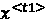
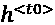
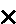
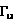
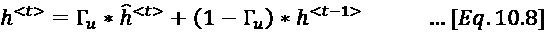

# 第十章：理解顺序模型

> 一个序列的工作方式是一个集合无法做到的。
> 
> —George Murray

本章介绍了机器学习模型中的一个重要类别——顺序模型。此类模型的一个定义特征是，处理层以这样的方式排列：一层的输出是另一层的输入。这种架构使它们非常适合处理顺序数据。顺序数据是由有序元素组成的数据类型，例如文档中的一句话或股市价格的时间序列。

在本章中，我们将从理解顺序数据的特征开始。然后，我们将介绍 RNN 的工作原理以及如何使用它们处理顺序数据。接下来，我们将学习如何通过 GRU 解决 RNN 的局限性而不牺牲准确性。然后，我们将讨论 LSTM 的架构。最后，我们将比较不同的顺序建模架构，并推荐在何时使用哪种架构。

在本章中，我们将讨论以下概念：

+   理解顺序数据

+   RNN 如何处理顺序数据

+   通过 GRU 解决 RNN 的局限性

+   理解 LSTM

让我们首先了解顺序数据的特征。

# 理解顺序数据

顺序数据是一种特殊的数据结构，其中元素的顺序至关重要，每个元素与其前面的元素之间存在关联依赖性。这种“顺序行为”非常独特，因为它不仅在单独的元素中传递信息，还在它们发生的模式或顺序中传递信息。在顺序数据中，当前的观察不仅受到外部因素的影响，还受到序列中之前观察值的影响。这种依赖性构成了顺序数据的核心特征。

理解不同类型的顺序数据对于理解其广泛应用至关重要。以下是主要的分类：

+   **时间序列数据**：这是按时间顺序索引或列出的数据点序列。任何时间点的值都依赖于过去的值。时间序列数据广泛应用于经济学、金融和医疗等各个领域。

+   **文本数据**：文本数据本质上也是顺序的，其中单词、句子或段落的顺序可以传递意义。**自然语言处理**（**NLP**）利用这一顺序特性来分析和解释人类语言。

+   **时空数据**：这类数据捕捉了空间和时间之间的关系，例如特定地理区域内的天气模式或交通流量随时间变化的情况。

下面是这些类型的顺序数据在现实世界场景中的表现方式：

+   **时间序列数据**：这种数据类型通过金融市场趋势得到清晰体现，股票价格随着持续的市场动态不断变化。类似地，社会学研究可以分析出生率，反映出受经济条件和社会政策等因素影响的年度变化。

+   **文本数据**：文本的顺序性在文学和新闻作品中至关重要。在小说、新闻文章或论文中，单词、句子和段落的特定排列构建了叙事和论证，赋予文本超越单词本身的意义。

+   **时空数据**：这种数据类型在城市发展和环境研究中至关重要。例如，可以跟踪不同地区的房价随时间的变化，以识别经济趋势，而气象研究可以监测特定地理位置的天气变化，预测模式和自然事件。

这些现实世界的例子展示了不同类型数据中固有的顺序行为如何被利用以提供见解并推动各个领域的决策。

在深度学习中，处理序列数据需要像序列模型这样的专门神经网络架构。这些模型旨在捕获和利用序列数据元素之间固有的时间依赖关系。通过识别这些依赖关系，序列模型为创建更为细致和有效的机器学习模型提供了坚实的框架。

总之，序列数据是一种在各个领域中应用广泛的丰富而复杂的数据类型。认识其顺序性、理解其类型，并利用专业模型，使数据科学家能够深入洞察并构建更强大的预测工具。在我们研究技术细节之前，让我们先来看一看序列建模技术的历史。

让我们来研究不同类型的序列模型。

## 序列模型的类型

通过检查它们处理的数据类型（如文本信息、数值数据或基于时间的模式），以及这些数据从过程开始到结束如何演变或转换，将序列模型分类为各种类别。通过深入了解这些特征，我们可以确定三种主要类型的序列模型。

### 一对多

在一对多序列模型中，单一事件或输入可以启动整个序列的生成。这个独特的特性为广泛的应用领域打开了大门，但也带来了训练和实施的复杂性。一对多序列模型提供了令人兴奋的机会，但也伴随着训练和执行中的固有复杂性。随着生成性 AI 的不断进步，这些模型很可能在塑造各个领域的创造性和定制化解决方案中发挥关键作用。

发挥其潜力的关键在于理解其能力，并识别训练和实施中的复杂性。一对多序列模型如*图 10.1*所示：


图 10.1：一对多序列模型

让我们深入探讨一对多模型的特性、能力和挑战：

+   **广泛的应用范围**：将单一输入转化为有意义的序列的能力使得一对多模型既多才多艺又强大。它们可以用于写诗、创作艺术作品如绘画和图画，甚至为求职申请编写个性化的求职信。

+   **生成性 AI 的一部分**：这些模型属于生成性 AI 的范畴，这是一个新兴领域，旨在创建既连贯又符合上下文的新内容。这使得它们能够执行上述提到的各种任务。

+   **强化训练过程**：与其他序列模型相比，训练一对多模型通常更加耗时且计算开销更大。原因在于将单一输入转化为多种潜在输出的复杂性。模型不仅需要学习输入与输出之间的关系，还需要掌握生成序列中固有的复杂模式和结构。

请注意，与一对一模型（一个输入对应一个输出）或多对多模型（一个输入序列对应一个输出序列）不同，一对多范式必须从单一的起点中推导出丰富且结构化的序列。这需要对底层模式有更深入的理解，并且通常需要更复杂的训练算法。

一对多方法并非没有挑战。确保生成的序列保持一致性、相关性和创造性需要精心设计和细致调优。它通常需要更大规模的数据集，并依赖于特定领域的专家知识来指导模型的训练。

### 多对一

多对一序列模型是数据分析中的专业工具，它们将一系列输入转化为一个单一输出。将多个输入合成为一个简明输出的过程构成了多对一模型的核心，使其能够提炼数据的本质特征。

这些模型有广泛的应用，例如情感分析，在这种应用中，像评论或帖子这样的词语序列被分析，以确定整体情感，例如正面、负面或中立。多对一的序列模型如*图 10.2*所示：


图 10.2：多对一序列模型

多对一模型的训练过程是其功能中复杂但至关重要的一部分。它使得这些模型与一对多模型有所不同，后者的重点是从单一输入创建一个序列。相比之下，多对一模型必须高效地压缩信息，因此需要仔细选择算法并精确调节参数。

训练多对一模型的过程包括教会它识别输入序列的关键特征，并准确地在输出中表示这些特征。这需要舍弃不相关的信息，这项任务需要精细的平衡。训练过程通常还需要针对输入数据的特定性质进行专业的预处理和特征工程。

正如前一小节所讨论的，训练多对一模型可能比其他类型的模型更具挑战性，因为它需要更深入地理解数据中的潜在关系。在训练过程中持续监控模型的表现，以及系统地选择数据和超参数，对于模型的成功至关重要。

多对一模型因其能够将复杂数据简化为易于理解的洞察力而值得注意，广泛应用于各行各业的任务，如摘要、分类和预测。尽管它们的设计和训练可能非常复杂，但它们解读序列数据的独特能力为解决复杂数据分析挑战提供了创新的解决方案。

因此，多对一序列模型是当代数据分析中至关重要的工具，理解其特定的训练过程对于充分利用其能力至关重要。训练过程的特点是精确的算法选择、参数调优和领域专业知识，这使得这些模型与众不同。随着该领域的发展，多对一模型将继续为数据解读和应用做出宝贵贡献。

### 多对多

这是一种序列模型，它将序列数据作为输入，经过某种方式处理后，生成序列数据作为输出。多对多模型的一个例子是机器翻译，其中一种语言的词序列被翻译成另一种语言中的对应序列。例如，英语文本翻译成法语就是一个典型的例子。虽然有许多机器翻译模型属于这一类别，但一种突出的做法是使用**序列到序列（Seq2Seq）**模型，特别是与 LSTM 网络配合使用。使用 LSTM 的 Seq2Seq 模型已经成为处理英语到法语翻译等任务的标准方法，并已在多个 NLP 框架和工具中实现。多对多序列模型如*图 10.3*所示：


图 10.3：多对多序列模型

多年来，已经开发出许多算法，用于处理和训练使用序列数据的机器学习模型。我们先从学习如何使用三维数据结构表示序列数据开始。

# 序列模型的数据表示

时间步（Timesteps）为数据增添了深度，使其成为一个三维结构。在序列数据的上下文中，这一维度的每个“单元”或实例被称为“时间步”。需要记住的是：虽然这一维度被称为“时间步”，但这一维度中的每个数据点都是一个“时间步”。*图 10.4* 展示了用于训练 RNN 的三维数据结构，强调了时间步的添加：


图 10.4：RNN 训练中使用的三维数据结构

鉴于时间步的概念是我们探索中的新内容，特引入了一种特殊的符号表示法来有效地表示它。该符号是在尖括号中括住时间步，并与相关变量配对。例如，使用此符号表示法，和分别表示变量`stock_price`在时间步*t1*和*t2*的值。

将数据划分为批次的选择，本质上是决定“长度”，既可以是有意的设计决策，也可能受到外部工具和库的影响。通常，机器学习框架提供了自动批处理数据的工具，但选择最佳的批次大小可能需要结合实验和领域知识。

让我们从 RNN 开始讨论序列建模技术。

# 介绍 RNN

RNN（循环神经网络）是一种专门为处理序列数据而设计的神经网络。以下是其关键特性的解析。

“递归”一词源于 RNN 所具备的独特反馈回路。与传统的神经网络不同，传统神经网络本质上是无状态的，并且仅根据当前输入生成输出，而 RNN 则将一个“状态”从序列中的一步传递到下一步。

当我们谈论 RNN 中的“运行”时，我们指的是序列中某个元素的单次传递或处理。因此，随着 RNN 处理每个元素或每次“运行”，它会保留一些来自前一步的信息。

RNN 的魔力在于它们能够保持对先前运行或步骤的记忆。它们通过结合一个额外的输入——即来自前一步的状态或记忆——来实现这一点。这种机制使 RNN 能够识别和学习序列中元素之间的依赖关系，例如句子中连续单词之间的关系。

让我们详细研究 RNN 的架构。

## 理解 RNN 的架构

首先，让我们定义一些变量：

+   ：时间步* t *的输入

+   ：时间步* t *的实际输出（真实值）

+   ：时间步* t *的预测输出

### 理解记忆单元和隐藏状态

**RNNs**之所以突出，是因为它们天生具有记住并维持上下文的能力，随着时间步的推进保持这种能力。某个时间步* t *的状态通过 表示，其中*h*表示隐藏状态。这是截至某一特定时间步所学到的信息的总结。如*图 10.5*所示，RNN 通过在每个时间步更新其隐藏状态不断学习。RNN 在每个时间步使用这个隐藏状态来保持上下文。从本质上讲，“上下文”是指 RNN 从之前的时间步中保留的集体信息或知识。它使 RNN 能够在每个时间步记住状态，并将这些信息传递到下一个时间步，随着序列的推进。这个隐藏状态使得 RNN 是有状态的：


图 10.5：RNN 中的隐藏状态

例如，如果我们使用 RNN 将一句话从英语翻译成法语，那么每个输入就是需要定义为序列数据的句子。为了准确翻译，RNN 不能单独翻译每个单词。它需要捕捉到已经翻译的单词的上下文，从而使 RNN 能够正确翻译整个句子。这是通过在每个时间步计算并存储隐藏状态来实现的，并将其传递给后续时间步。

RNN 通过记住状态并打算将其用于未来时间步的策略带来了新的研究问题，需要解决。例如，*记住*什么以及*忘记*什么。而且，也许最棘手的问题是，*何时*忘记。RNN 的变种，如 GRU 和 LSTM，尝试以不同的方式回答这些问题。

### 理解输入变量的特性

让我们更深入地理解输入变量及其在处理 RNN 时的编码方法。RNN 的一个关键应用领域是在 NLP 中。在这里，我们处理的序列数据是句子。可以把每个句子看作是一个单词的序列，因此一个句子可以被描述为：


在这个表示中，表示句子中的一个单独单词。为了避免混淆：每个并不是整个句子，而是其中的一个单独单词。

每个单词都使用一个独热编码向量进行编码。该向量的长度由|V|定义，其中：

+   V 表示我们的词汇集合，它是一个包含不同单词的集合。

+   |V|量化了 V 中条目的总数。

在广泛应用的背景下，可以将 V 视为包含标准英语词典中所有单词的集合，通常包含大约 150,000 个单词。然而，对于特定的 NLP 任务，只需要这个庞大词汇表的一部分。

**注意**：区分 V 和|V|非常重要。V 代表词汇表本身，而|V|表示该词汇表的大小。

当提到“词典”时，我们指的是标准英语词典的一般概念。然而，也有更为详尽的语料库可用，如 Common Crawl，其中包含的词集可以达到数千万个单词。

对于许多应用程序来说，这个词汇表的子集就足够了。形式化地说，


为了理解 RNN 的工作原理，让我们先看看第一个时间步*t1*。

## 在第一个时间步训练 RNN

RNN 通过一次分析一个时间步的序列来操作。让我们深入了解这一过程的初始阶段。在时间步*t1*，网络接收表示为的输入。基于这个输入，RNN 做出初步预测，我们将其表示为。在每个时间步*tt*，RNN 利用来自前一个时间步的隐藏状态，以提供上下文信息。

然而，在*t1*时刻，由于我们刚刚开始，因此没有前一个隐藏状态可以引用。因此，隐藏状态初始化为零。

### 激活函数的作用

参考*图 10.6*，你会注意到一个标记为**A**的元素。它代表激活函数，这是神经网络中的关键组件。本质上，激活函数决定了多少信号传递到下一层。在这个时间步，激活函数接收输入和前一个隐藏状态。

如*第八章*所述，神经网络中的激活函数是一个数学方程式，根据输入决定神经元的输出。它的主要作用是将非线性引入网络，从而使其能够通过误差进行学习和调整，这对于学习复杂的模式至关重要。

许多神经网络中常用的激活函数是“`tanh`”。那么，这种偏好的背后有什么原因呢？

神经网络的世界并非没有挑战，其中一个难题就是梯度消失问题。简单来说，当我们持续训练模型时，梯度值——指导我们调整权重的数值——有时会变得非常小。这种下降意味着我们对网络权重的调整几乎可以忽略不计。这些微小的调整导致学习过程变得极其缓慢，有时甚至会停滞不前。这时，“`tanh`”函数就发挥了作用。之所以选择它，是因为它在对抗梯度消失问题时充当了缓冲作用，推动训练过程朝着一致性和效率的方向发展：


图 10.6：RNN 在时间步 t1 的训练

当我们聚焦于激活函数的结果时，我们得到了隐藏状态的值，。在数学上，这种关系可以表示为：


这个隐藏状态不仅仅是一个过渡阶段。当我们进入下一个时间步，*t2*时，它依然保持重要的价值。可以把它想象成接力赛选手传递接力棒，或者在这个例子中，是从一个时间步到下一个时间步的上下文传递，确保序列的连续性。

第二个激活函数（在*图 10.7*中由**B**表示）用于生成时间步*t1*的预测输出 。选择这个激活函数将取决于输出变量的类型。例如，如果 RNN 用于预测股市价格，可以采用 ReLU 函数，因为输出变量是连续的。另一方面，如果我们对一堆帖子进行情感分析，可能会使用 sigmoid 激活函数。在*图 10.7*中，假设它是一个多类输出变量，我们使用的是 softmax 激活函数。请记住，多类输出变量指的是输出或预测可以落入多个不同类别中的情况。在机器学习中，这种情况通常出现在分类问题中，目标是将输入归类为几个预定义类别之一。例如，如果我们将物体分类为汽车、自行车或公交车，则输出变量有多个类别，因此称为“多类”。在数学上，我们可以将其表示为：


从*方程 10.1*和*方程 10.2*可以明显看出，训练 RNN 的目标是找到三组权重矩阵（*W*[hx]、*W*[hh]和*W*[yh]）和两组偏置（*b*[h]和*b*[y]）的最优值。随着训练的进展，显而易见，这些权重和偏置在所有时间步中保持一致。

### 训练整个序列的 RNN

之前，我们为第一个时间步*t1*推导了隐藏状态的数学公式。现在，我们通过多个时间步来研究 RNN 的工作原理，以训练完整的序列，如*图 10.7*所示：


图 10.7：RNN 中的顺序处理

**信息**：在*图 10.7*中，可以观察到隐藏状态从左到右传播，并通过箭头**A**将上下文信息向前传递。RNN 及其变体能够创建这种“信息高速公路”并在时间上传播，是 RNN 的定义特征。

我们为时间步*t1*计算了*方程 10.1*。对于任何时间步 t，我们可以将*方程 10.1*推广为：


对于 NLP 应用，被编码为一个独热向量。在这种情况下，的维度将等于|V|，其中 V 是表示词汇表的向量。隐藏变量将是原始输入的低维表示。通过将输入变量的维度降低多个倍数，我们希望隐藏层仅捕捉输入变量的重要信息。的维度由*D*[h]表示。

对于的维度比低 500 倍，这并不罕见。

所以，通常情况下：


由于的维度较低，权重矩阵*W*[hh]相对较小，类似于。另一方面，*W*[hx]的宽度将与一样宽。

#### 合并权重矩阵

在*方程 10.3*中，*W*[hh]和*W*[hx]都用于计算。为了简化分析，有助于将*W*[hh]和*W*[hx]合并为一个权重参数矩阵，。这种简化表示对于后续章节中讨论的更复杂的 RNN 变体非常有用。

为了创建一个合并的权重矩阵*W*[h]，我们只需将*W*[hh]和*W*[hx]水平拼接，形成一个合并的权重矩阵*W*[h]：


由于我们只是进行水平拼接，*W*[h]的维度将有相同数量的行和总列数，即：


在*方程 10.3*中使用*W*[h]：


其中  表示将两个向量垂直堆叠在一起。


其中  和  是相应的转置向量。

让我们看一个具体的例子。

假设我们正在为自然语言处理（NLP）应用使用 RNN。词汇表的大小是 50,000 个单词。这意味着每个输入  将被编码为一个维度为 50,000 的热编码向量。假设  的维度为 50。它将是  的低维表示。

现在，应该显而易见，*W*[hh] 的维度将是 (5050)。*W*[hx] 的维度将是 (5050,000)。

回到上面的例子，*W*[h] 的维度将是 (50x50,000+50) = 5050,050，即：


### 计算每个时间步的输出

在我们的模型中，给定时间步（如 *t1*）生成的输出由  表示。由于我们在模型中使用了 softmax 函数进行归一化，因此任何时间步 *tt* 的输出可以通过以下方程式进行概括：


理解在每个时间步如何计算输出，为随后的训练阶段奠定基础，在这一阶段，我们需要评估模型的表现。

现在我们已经掌握了如何在每个时间步生成输出，接下来需要确定这些预测输出与实际目标值之间的差异。这种差异被称为“损失”，它为我们提供了模型误差的衡量标准。在接下来的部分，我们将深入探讨计算 RNN 损失的方法，帮助我们评估模型的准确性，并对权重和偏差进行必要的调整。这个过程对于训练模型使其做出更准确的预测至关重要，从而提高整体性能。

#### 计算 RNN 损失

如前所述，训练 RNN 的目标是找到三组权重（*W*[hx]、*W*[hh] 和 *W*[yh]）以及两组偏差（*b*[h] 和 *b*[y]）的正确值。最初，在时间步 *t1*，这些值会随机初始化。

随着训练过程的推进，这些值会随着梯度下降算法的应用而发生变化。我们需要在 RNN 的前向传播过程中计算每个时间步的损失。让我们分解计算损失的过程：

1.  **计算单个时间步的损失**：

    在时间步 *t1*，预测输出为 。期望输出为 。实际使用的损失函数将取决于我们训练的模型类型。例如，如果我们正在训练分类器，那么在时间步 *t1* 的损失将是：

    

1.  **完整序列的聚合损失**：

    对于由多个时间步组成的完整序列，我们将计算每个时间步的单独损失， {*t*[1],*t*[2],…*t*[T]}。一个包含 *T* 个时间步的序列的损失，将是每个时间步损失的汇总，按照以下公式计算：

    

1.  **计算一批次中多个序列的损失**：

    如果一个批次中有多个序列，首先会为每个单独的序列计算损失。然后，我们计算一个批次中所有序列的总体损失，并将其用于反向传播。

    通过以这种结构化的方式计算损失，我们引导模型调整其权重和偏差，以更好地与期望的输出对齐。这个迭代过程，在多个批次和时期中反复进行，使得模型能够从数据中学习并做出更准确的预测。

## 时间反向传播

如*第八章*所述，反向传播用于神经网络中，从训练数据集的示例中逐步学习。RNN 在训练数据中增加了另一个维度，即时间步。**时间反向传播**（**BPTT**）旨在处理序列数据，因为训练过程是通过时间步进行的。

当前馈过程计算完一个批次的最后一个时间步的损失时，触发反向传播。然后我们应用这个导数来调整 RNN 模型的权重和偏差。RNN 有三组权重，*W*[hh]，*W*[hx] 和 *W*[hy]，以及两组偏差（*b*[h] 和 *b*[y]）。一旦调整了权重和偏差，我们将继续进行梯度下降来训练模型。

本节的名称 *时间反向传播* 并不暗示任何让我们回到中世纪时代的时间机器。它的来源在于一旦通过前馈计算了成本，必须通过每个时间步倒推并更新权重和偏差。

反向传播过程对于调优模型的参数至关重要，但一旦模型训练完成，接下来该做什么呢？在我们使用反向传播来最小化损失之后，模型已经准备好进行预测。在接下来的部分，我们将探讨如何使用训练好的 RNN 模型对新数据进行预测。我们会发现，使用 RNN 进行预测与使用全连接神经网络的过程类似，输入数据经过训练好的 RNN 处理后，生成预测结果。这种从训练到预测的转变，形成了理解 RNN 如何应用于现实问题的自然进展。

### 使用 RNN 进行预测

一旦模型训练完成，使用 RNN 进行预测与使用全连接神经网络进行预测类似。将输入数据作为输入传递给训练好的 RNN 模型，得到预测结果。其工作原理如下：

1.  **输入准备**：与标准神经网络一样，首先要准备输入数据。对于 RNN 而言，这些输入数据通常是序列化的，代表过程或系列中的时间步。

1.  **模型利用**：接着将输入数据输入到已训练的 RNN 模型中。模型在训练阶段优化的学习权重和偏置将用于通过网络的每一层处理输入数据。在 RNN 中，这包括通过处理数据的循环连接来处理数据的序列特性。

1.  **激活函数**：与其他神经网络一样，RNN 中的激活函数会在数据通过各层时对其进行转换。根据 RNN 的具体设计，可能在不同阶段使用不同的激活函数。

1.  **生成预测**：倒数第二步是生成预测。RNN 的输出会通过最后一层进行处理，通常在分类任务中使用 softmax 激活函数，生成每个输入序列的最终预测结果。

1.  **解释**：预测结果将根据具体任务进行解释。这可能是分类一段文本序列、预测时间序列中的下一个值，或者任何依赖于序列数据的其他任务。

因此，RNN 的预测过程与全连接神经网络相似，主要区别在于对序列数据的处理。RNN 捕捉数据中时间关系的能力使其能够提供其他神经网络架构难以处理的独特洞察和预测。

## 基本 RNN 的局限性

在本章的前面，我们介绍了基本 RNN。有时我们将基本 RNN 称为“纯粹的香草”RNN。这个术语指的是它们的基本、朴素结构。虽然它们作为递归神经网络的一个良好入门，但这些基本 RNN 确实有显著的局限性：

1.  **梯度消失问题**：这个问题使得 RNN 很难学习和保持数据中的长期依赖关系。

1.  **无法预见序列中的未来**：传统的 RNN 从头到尾处理序列，这限制了它们理解序列中未来上下文的能力。

让我们逐一探讨这些问题。

### 梯度消失问题

RNN 逐步处理输入数据，一次一个时间步。这意味着随着输入序列变长，RNN 很难捕捉长期依赖关系。长期依赖关系指的是序列中相距较远的元素之间的关系。想象一下分析一段长篇文本，比如一部小说。如果一个角色在第一章的行为影响了最后一章的事件，那就是一个长期依赖关系。文本开头的信息必须“记住”直到结尾，才能充分理解。

RNN 通常在处理这样的长程依赖时会遇到困难。RNN 的隐藏状态机制旨在保留来自前一个时间步的信息，但它过于简单，无法捕捉这些复杂的关系。随着相关元素之间距离的增加，RNN 可能会丧失对连接的跟踪。它没有智能来判断何时保存记忆、何时忘记信息。

对于许多顺序数据的应用场景，只有最新的信息是重要的。例如，考虑一个预测文本应用，它试图通过建议下一个要输入的单词来协助一个人写邮件。

如我们所知，这种功能现在在现代文字处理软件中是标准配置。如果用户正在输入：


图 10.8：预测文本示例

预测文本应用可以轻松地建议下一个单词“hard”。它不需要带入前一句话的上下文来预测下一个单词。对于这种不需要长时记忆的应用，RNN 是最佳选择。RNN 在不牺牲准确性的情况下，不会使架构过于复杂。

但对于其他应用，保留长时依赖关系是重要的。RNN 在管理长时依赖关系时遇到困难。让我们来看一个例子：


图 10.9：带有长时依赖的预测文本示例

当我们从左到右阅读这句话时，可以观察到“was”（稍后在句子中使用）指的是“man”。原始形式的 RNN 在多时间步长中会很难保持隐藏状态的传递。原因在于，在 RNN 中，隐藏状态是针对每个时间步计算的，并且被传递到下一个时间步。

由于此操作的递归特性，我们总是担心在不同时间步从一个元素到另一个元素的过程中，信号会提前衰减。RNN 的这种行为被称为梯度消失问题。为了应对梯度消失问题，我们通常选择 tanh 作为激活函数。由于 tanh 的二阶导数衰减到零的速度非常慢，选择 tanh 有助于在一定程度上管理梯度消失问题。但是我们需要更复杂的架构，如 GRU 和 LSTM，以更好地管理梯度消失问题，下一节将详细讨论这一点。

### 无法在序列中向前看

RNN 可以根据信息流动的方向分类。主要有两种类型：单向 RNN 和双向 RNN。

+   **单向 RNN**：这些网络以单一方向处理输入数据，通常是从序列的开始到结束。它们将上下文信息逐步传递，随着序列元素的迭代（如句子中的单词），逐步建立理解。其局限性在于：单向 RNN 无法在序列中“向前看”。

    它们只能访问到迄今为止所看到的信息，这意味着它们无法结合未来的元素来构建更准确或更细致的上下文。想象一下，逐字阅读一篇复杂的句子，而无法提前预览即将出现的内容。你可能会错过一些细微之处或误解整体意义。

+   **双向 RNN**：相反，双向 RNN 同时处理序列的两个方向。它们结合了过去和未来元素的信息，使得对上下文有更丰富的理解。

让我们考虑以下两句话：


图 10.10：RNN 必须在句子中提前查看的示例

这两句话都使用了“cricket”这个词。如果上下文仅从左到右构建，就像单向 RNN 那样，我们就无法正确地理解“cricket”，因为其相关信息将在未来的时间步中出现。为了解决这个问题，我们将研究双向 RNN，它们在*第十一章*中有详细讨论。

现在让我们研究 GRU 及其详细的工作原理和架构。

# GRU

GRU 代表了基本 RNN 结构的一种演变，特别设计用来解决传统 RNN 遇到的一些挑战，例如梯度消失问题。GRU 的架构如*图 10.8*所示：


图 10.11：GRU

让我们从讨论第一种激活函数开始，该函数标注为**A**。在每个时间步 t，GRU 首先使用 tanh 激活函数计算隐藏状态，并利用  和  作为输入。这个计算与上一节中介绍的原始 RNN 中隐藏状态的确定方法没有什么不同。但是有一个重要的区别。输出是一个*候选*隐藏状态，它是通过*公式 10.6*计算得出的：


其中  是隐藏层的候选值。

现在，GRU 不会立即使用候选隐藏状态，而是花时间决定是否使用它。可以想象成某人做决定之前停下来思考。这一停顿思考的过程就是我们所说的**门控机制**。它检查信息，然后选择接下来要记住的细节和要遗忘的部分。它有点像过滤掉噪音，集中注意力在重要的东西上。通过将旧信息（来自之前的隐藏状态）和新草案（候选状态）结合起来，GRU 能够更好地跟随长篇故事或序列，而不会迷失方向。通过引入候选隐藏状态，GRU 增加了额外的灵活性。它们可以谨慎地决定将候选状态的哪一部分纳入。这个区别使得 GRU 能够巧妙地应对诸如梯度消失之类的挑战，而传统 RNN 通常缺乏这种能力。简单来说，经典的 RNN 可能难以记住长篇故事，而 GRU 凭借其独特的特点，更像是优秀的听众和记忆者。

LSTM 是在 1997 年提出的，而 GRU 则是在 2014 年提出的。大多数关于这一主题的书籍倾向于按时间顺序呈现，首先介绍 LSTM。我选择按复杂度顺序呈现这些算法。由于 GRU 的提出动机是简化 LSTM，因此从学习较简单的算法开始可能会更有帮助。

## 引入更新门

在标准的 RNN 中，每个时间步的隐藏值都会被计算并自动成为记忆单元的新状态。相比之下，GRU 引入了一个更细致的方法。GRU 模型通过允许控制何时更新记忆单元的状态，为这个过程带来了更多的灵活性。这个增加的灵活性是通过一个叫做“更新门”的机制实现的，有时也被称为“重置门”。

更新门的作用是评估候选隐藏状态中的信息，，是否足够重要以更新记忆单元的隐藏状态，或者记忆单元是否应该保留之前时间步的旧隐藏值。

从数学角度来看，这个决策过程帮助模型更加有选择性地管理信息，决定是整合新的见解，还是继续依赖之前获得的知识。如果模型认为候选隐藏状态的信息不足以改变记忆单元当前的状态，那么就会保留之前的隐藏值。相反，如果新的信息被认为相关，它就会覆盖记忆单元的状态，从而在处理序列时调整模型的内部表示。

这种独特的门控机制使得 GRU 区别于传统的 RNN，并且使得它能在处理具有复杂时间关系的序列数据时，进行更有效的学习。

## 实现更新门

我们在记忆单元中如何更新状态所加入的智能是 GRU 的定义特征。很快我们将决定是否应该用候选隐藏状态更新当前的隐藏状态。为了做出这个决定，我们使用*图 10.11*中显示的第二个激活函数，标注为**B**。这个激活函数实现了更新门。

它作为一个 sigmoid 层实现，该层以当前输入和先前的隐藏状态为输入。sigmoid 层的输出是一个介于 0 和 1 之间的值，由变量表示。更新门的输出是变量，它由以下 sigmoid 函数控制：


由于是 sigmoid 函数的输出，它接近于 1 或 0，这决定了更新门是否开启。如果更新门开启，将被选为新的隐藏状态。在训练过程中，GRU 将学习何时开启门，何时关闭门。

## 更新隐藏单元

对于某个时间步，下一隐藏状态是通过以下方程的计算得出的：



*方程 10.8* 包含两个项，标注为**1**和**2**。作为 sigmoid 函数的输出，可以是 0 或 1。这意味着：


换句话说，如果门是开启的，更新的值。否则，只需保留旧状态。

现在让我们来看看如何在多个时间步上运行 GRU。

### 在多个时间步上运行 GRU

当在多个时间步上部署 GRU 时，我们可以像*图 10.12*所示那样可视化这个过程。就像我们在前一部分讨论的基础 RNN 一样，GRU 创建了可以看作“信息高速公路”的东西。这条路径有效地将上下文从序列的开始传递到结束，在*图 10.12*中可视化为，并标注为**A**。

GRU 与传统 RNN 的区别在于它关于信息如何在这条高速公路上传输的决策过程。与每个时间步盲目地传递信息不同，GRU 会暂停并评估其相关性。

让我们通过一个基本的例子来说明。假设你正在阅读一本书，每个句子都是一条信息。然而，与你记住每个句子的每个细节不同，你的大脑（像一个 GRU）会选择性地回忆起那些最有影响力或最有情感的句子。这种选择性记忆类似于 GRU 中更新门的工作方式。

更新门在这里发挥着至关重要的作用。它是一个机制，决定哪些先前的信息，或先前的“隐藏状态”，应该保留或丢弃。本质上，更新门帮助网络聚焦并保留最相关的细节，确保传递的上下文保持尽可能相关。


图 10.12：RNN 中的顺序处理

# 引入 LSTM

RNN 广泛应用于序列建模任务，但它们在捕捉数据中的长期依赖性方面存在局限性。为了克服这些局限性，开发了 RNN 的高级版本——LSTM。与简单的 RNN 不同，LSTM 具有更复杂的机制来管理上下文，使其能够更好地捕捉序列中的模式。

在上一节中，我们讨论了 GRU，其中隐藏状态  用于将上下文从一个时间步传递到下一个时间步。LSTM 拥有更为复杂的机制来管理上下文。它有两个变量来携带上下文信息：细胞状态和隐藏状态。它们的解释如下：

1.  **细胞状态**（表示为 ）：它负责维护输入数据的长期依赖性。它从一个时间步传递到下一个时间步，用于在更长时间内保持信息。正如我们在本节稍后将学到的，细胞状态的内容是由遗忘门和更新门精确决定的。它可以被视为 LSTM 的“持久层”或“记忆”，因为它在较长时间内保持信息。

1.  **隐藏状态**（表示为 ）：该上下文关注于当前时间步，它可能对长期依赖性重要，也可能不重要。它是 LSTM 单元在特定时间步的输出，并作为输入传递到下一个时间步。如*图 10.23*所示，隐藏状态  用于生成时间步 *t* 的输出 。

现在让我们更详细地研究这些机制，从当前细胞状态如何更新开始。

## 引入遗忘门

LSTM 网络中的遗忘门负责确定从先前状态中丢弃哪些信息，保留哪些信息。它在*图 10.3*中标注为**A**。它实现为一个 sigmoid 层，输入为当前输入和先前的隐藏状态。sigmoid 层的输出是一个在 0 到 1 之间的值向量，每个值对应于 LSTM 记忆中一个单元的状态。


由于它是一个 sigmoid 函数，这意味着  可以接近 0 或接近 1。

如果  为 1，则意味着应使用来自前一状态  的值来计算 。如果  为 0，则意味着应忘记来自前一状态  的值。

**信息**：通常，二进制变量在其逻辑为 1 时被认为是激活的。当  = 0 时，"遗忘门" 忘记前一状态的行为可能显得不直观，但这是原始论文中提出的逻辑，研究人员为了保持一致性遵循了这一点。


图 10.13：LSTM 架构

## 候选单元状态

在 LSTM 中，在每个时间步，计算出一个候选单元状态，，它在*图 10.13*中标注为 **Y**，并作为提议的新状态用于记忆单元。它通过当前输入  和前一隐藏状态  来计算，公式如下：


## 更新门

更新门也叫做输入门。LSTM 网络中的更新门是一种机制，它允许网络有选择地将新信息融入当前状态，使得记忆能够集中关注最相关的信息。它在*图 10.13*中标注为 **B**。

它负责判断候选单元状态  是否应添加到  中。它作为一个 sigmoid 层实现，输入为当前输入  和前一时刻的隐藏状态：


sigmoid 层的输出，，是一个值介于 0 和 1 之间的向量，每个值对应 LSTM 记忆中的一个单元。值为 0 表示计算出的  应该被忽略，而值为 1 表示  足够重要，应该被纳入  中。作为一个 sigmoid 函数，它的值可以介于 0 和 1 之间，表示来自  的部分信息应该被融入 ，但不是全部。

更新门允许 LSTM 有选择地将新信息融入当前状态，防止记忆被无关数据淹没。通过控制新信息加入记忆状态的量，更新门帮助 LSTM 保持在保留前一状态和融入新信息之间的平衡。

## 计算记忆状态

与 GRU 相比，LSTM 的主要区别在于，LSTM 不仅有一个更新门（如 GRU 中的那样），还为隐藏状态管理提供了独立的更新和遗忘门。每个门决定了各种状态的正确混合，以最优地计算长时记忆 、当前单元状态和当前隐藏状态 。记忆状态通过以下方式计算：


*方程 10.12* 由标注为 **1** 和 **2** 的两个项组成。作为 sigmoid 函数的输出， 和  的值可以是 0 或 1。意味着：


换句话说，如果门是开启的，则更新  的值。否则，保留旧状态。

因此，GRU 中的更新门是一种机制，允许网络有选择地丢弃之前隐藏状态中的信息，以便隐藏状态可以专注于最相关的信息。如*图 10.13*所示，展示了状态如何从左向右传递。

## 输出门

LSTM 网络中的输出门在*图 10.13*中标注为 **C**。它负责确定当前记忆状态中的哪些信息应作为 LSTM 的输出传递。它作为一个 sigmoid 层实现，输入为当前输入和前一个隐藏状态。sigmoid 层的输出是一个值在 0 和 1 之间的向量，其中每个值对应于 LSTM 内存中的一个单独的单元。

由于它是一个 sigmoid 函数，这意味着  可以接近 0 或 1。

如果  为 1，则表示应该使用之前状态的值  来进行计算。若  为 0，则表示应该忘记之前状态的值 。


值为 0 表示对应的单元不应对输出作出贡献，而值为 1 则表示该单元应完全贡献于输出。介于 0 和 1 之间的值表示该单元应部分贡献其值给输出。

在 LSTM 中，经过输出门处理后，当前状态会通过一个 `tanh` 函数。该函数调整值，使其落在 -1 到 1 的范围内。为什么需要这种缩放？`tanh` 函数确保 LSTM 的输出保持归一化，并防止值变得过大，这在训练过程中可能会导致梯度爆炸等问题。

经缩放后，输出门的结果与此归一化状态相乘。这个组合值表示 LSTM 在特定时间步的最终输出。

为了提供一个简单的类比：想象调整音乐的音量，使其既不太大也不太小，而是刚好适合你的环境。`tanh`函数的作用类似，确保输出是优化的，适合进一步处理。

输出门非常重要，因为它允许 LSTM 从当前的记忆状态中选择性地传递相关信息作为输出。它还帮助防止无关信息被作为输出传递。

该输出门生成变量 ，决定细胞状态对隐藏状态的贡献是否输出：


在 LSTM 中， 被用作输入到门中，而  是隐藏状态。

总结来说，LSTM 网络中的输出门是一种机制，它允许网络从当前记忆状态中选择性地传递相关信息作为输出，这样 LSTM 就可以根据其存储的相关信息生成适当的输出。

## 将所有内容汇总

让我们深入了解 LSTM 在多个时间步中的工作原理，如*图 10.14*中的**A**所示。

就像 GRU 一样，LSTM 创建了一条通道——通常称为“信息高速公路”——帮助将上下文传递到后续的时间步。这个过程在*图 10.14*中有所展示。LSTM 的魅力在于它能够利用长期记忆来传递这些上下文。

当我们从一个时间步推进到下一个时间步时，LSTM 会学习哪些信息应该保留在其长期记忆中，表示为 。在每个时间步的开始， 与“忘记门”进行交互，允许一些信息被丢弃。接着，它遇到“更新门”，新的数据被注入其中。这使得  能够在时间步之间转换，按照两个门的指示，不断地获得和舍弃信息。

现在，事情变得复杂了。在每个时间步结束时，长期记忆的副本  通过 tanh 函数进行转换。处理后的数据经过输出门筛选，最终得到我们称之为短期记忆的结果 。这个短期记忆有双重作用：它决定了特定时间步的输出，并为随后的时间步奠定基础，如*图 10.14*所示：


图 10.14：带有多个时间步的 LSTM

现在让我们看看如何编写 RNN 的代码。

## 编写顺序模型

在我们的 LSTM 探索中，我们将深入研究使用著名的 IMDb 电影评论数据集进行情感分析。在这里，每条评论都被标记为一个情感，正面或负面，使用二进制值进行编码（`True`表示正面，`False`表示负面）。我们的目标是创建一个二分类器，能够仅根据评论的文本内容预测这些情感。

总体而言，该数据集包含 50,000 条电影评论。为了我们的目的，我们将其平分：25,000 条用于训练模型，剩下的 25,000 条用于评估模型的性能。

对于那些希望深入了解数据集的人，更多信息可以在斯坦福的 IMDB 数据集中找到。

### 加载数据集

首先，我们需要加载数据集。我们将通过`keras.datasets`导入该数据集。通过`keras.datasets`导入的优势在于，它已经被处理成可以用于机器学习的格式。例如，评论已被单独编码为单词索引的列表。特定单词的总体频率被选为索引。因此，如果一个单词的索引是“7”，这意味着它是第 7 个最常见的单词。使用预处理好的数据让我们能够专注于 RNN 算法，而不是数据准备：

```py
import tensorflow as tf
from tensorflow.keras.datasets import imdb
vocab_size = 50000
(X_train,Y_train),(X_test,Y_test) = tf.keras.datasets.imdb.load_data(num_words= vocab_size) 
```

请注意，参数`num_words=50000`用于仅选择前 50000 个词汇。由于单词的频率被用作索引，这意味着所有索引小于 50000 的单词都会被过滤掉：

```py
"I watched the movie in a cinema and I really like it" 
[13, 296, 4, 20, 11, 6, 4435, 5, 13, 66, 447,12] 
```

在处理长度不等的序列时，通常需要确保它们都具有相同的长度。这一点在将序列输入神经网络时尤为重要，因为神经网络通常期望输入的大小一致。为此，我们使用填充——在序列的开头或末尾添加零，直到它们达到指定的长度。

下面是如何使用 TensorFlow 实现这一点：

```py
# Pad the sequences
max_review_length = 500
x_train = tf.keras.preprocessing.sequence.pad_sequences(x_train, maxlen=max_review_length)
x_test = tf.keras.preprocessing.sequence.pad_sequences(x_test, maxlen=max_review_length) 
```

索引非常适合算法处理。为了便于人类阅读，我们可以将这些索引转换回单词：

```py
word_index = tf.keras.datasets.imdb.get_word_index()
reverse_word_index = dict([(value, key) for (key, value) in word_index.items()])
def decode_review(padded_sequence):
    return " ".join([reverse_word_index.get(i - 3, "?") for i in padded_sequence]) 
```

请注意，单词索引从 3 开始，而不是从 0 或 1\. 这是因为前三个索引是保留的。

接下来，让我们看看如何准备数据。

### 准备数据

在我们的例子中，我们考虑的词汇量为 50,000 个单词。这意味着输入序列中的每个单词都将使用一个 one-hot 向量表示，其中每个向量的维度为 50,000\. One-hot 向量是一个二进制向量，除了与单词对应的索引位置为 1 外，其他位置都是 0。下面是我们如何在 TensorFlow 中加载 IMDb 数据集，并指定词汇大小：

```py
vocab_size = 50000
(x_train, y_train), (x_test, y_test) = tf.keras.datasets.imdb.load_data(num_words=vocab_size) 
```

请注意，由于`vocab_size`被设置为`50,000`，因此数据将加载前`50,000`个最常出现的单词，其余单词将被丢弃或替换为一个特殊的符号（通常用`<UNK>`表示“未知”）。这确保了我们的输入数据是可管理的，并且只包含对模型最相关的信息。变量`x_train`和`x_test`分别包含训练和测试输入数据，而`y_train`和`y_test`则包含相应的标签。

### 创建模型

我们首先定义一个空的堆栈。我们将使用这个堆栈逐层构建我们的网络：

```py
model = tf.keras.models.Sequential() 
```

接下来，我们将向模型中添加一个`Embedding`层。如果你还记得我们在*第九章*中讨论的词嵌入，我们使用它们来表示词汇在连续向量空间中的位置。`Embedding`层也起到类似的作用，但它是在神经网络中进行的。它提供了一种将词汇表中的每个单词映射到连续向量的方式。彼此接近的词在这个向量空间中可能会共享上下文或意义。

让我们定义`Embedding`层，考虑到我们之前选择的词汇表大小，并将每个词映射到一个 50 维的向量，对应于！[](img/B18046_10_026.png)的维度：

```py
model.add(
    tf.keras.layers.Embedding(
        input_dim = vocab_size, 
        output_dim = 50, 
        input_length = review_length 
    )
) 
```

`Dropout`层可以防止过拟合，并通过在学习阶段随机禁用神经元，迫使模型学习同一数据的多种表示。让我们随机禁用 25%的神经元以应对过拟合：

```py
model.add(
    tf.keras.layers.Dropout(
        rate=0.25
    )
) 
```

接下来，我们将添加一个 LSTM 层，它是 RNN 的一种专门形式。虽然基础 RNN 在学习长期依赖关系时存在问题，LSTM 旨在记住这些依赖关系，使其适用于我们的任务。这个 LSTM 层将分析评论中词语的顺序及其嵌入，利用这些信息来确定给定评论的情感。我们将在这一层中使用 32 个单元：

```py
model.add(
    tf.keras.layers.LSTM(
        units=32 
    )
) 
```

添加第二个`Dropout`层，随机丢弃 25%的神经元，以减少过拟合：

```py
model.add(
    tf.keras.layers.Dropout(
        rate=0.25
    )
) 
```

所有 LSTM 单元都连接到`Dense`层中的一个节点。一个 sigmoid 激活函数决定了这个节点的输出——一个介于 0 和 1 之间的值。接近 0 表示负面评论，接近 1 表示正面评论：

```py
model.add(
    tf.keras.layers.Dense(
        units=1, 
        activation='sigmoid' 
    )
) 
```

现在，让我们编译模型。我们将使用`binary_crossentropy`作为损失函数，`Adam`作为优化器：

```py
model.compile(
    loss=tf.keras.losses.binary_crossentropy, 
    optimizer=tf.keras.optimizers.Adam(), 
    metrics=['accuracy']) 
```

显示模型结构的摘要：

```py
model.summary() 
```

```py
__________________________________________________________________________
Layer (type)               Output Shape               Param #
=========================================================================
embedding (Embedding)      (None, 500, 32)            320000
dropout (Dropout)          (None, 500, 32)            0
lstm (LSTM)                (None, 32)                 8320
dropout_1 (Dropout)        (None, 32)                 0
dense (Dense)              (None, 1)                  33
=========================================================================
Total params: 328,353
Trainable params: 328,353
Non—trainable params: 0 
```

### 训练模型

我们现在将基于训练数据训练 LSTM 模型。训练模型涉及几个关键组件，每个组件如下所述：

+   **训练数据**：这些是模型将从中学习的特征（评论）和标签（正面或负面情感）。

+   **批次大小**：这决定了每次更新模型参数时将使用的样本数量。较大的批次大小可能需要更多的内存。

+   **Epochs**：一个 epoch 是对整个训练数据集的一次完整迭代。epoch 越多，学习算法就会越多次地遍历整个训练数据集。

+   **Validation Split**：这部分训练数据将被用于验证，不用于训练。它帮助我们评估模型的表现。

+   **Verbose**：这个参数控制模型在训练过程中会输出多少内容。值为 1 时，进度条会显示出来：

    ```py
    history = model.fit(
        x_train, y_train,    # Training data
        batch_size=256,      
        epochs=3,            
        validation_split=0.2,
        verbose=1            
    ) 
    ```

    ```py
    Epoch 1/3
    79/79 [==============================] - 75s 924ms/step - loss: 0.5757 - accuracy: 0.7060 - val_loss: 0.4365 - val_accuracy: 0.8222
    Epoch 2/3
    79/79 [==============================] - 79s 1s/step - loss: 0.2958 - accuracy: 0.8900 - val_loss: 0.3040 - val_accuracy: 0.8812
    Epoch 3/3
    79/79 [==============================] - 73s 928ms/step - loss: 0.1739 - accuracy: 0.9437 - val_loss: 0.2768 - val_accuracy: 0.8884 
    ```

### 查看一些错误的预测

让我们看一下其中一些错误分类的评论：

```py
predicted_probs = model.predict(x_test)
predicted_classes_reshaped = (predicted_probs > 0.5).astype("int32").reshape(-1)
incorrect = np.nonzero(predicted_classes_reshaped != y_test)[0] 
```

我们选择了前 20 条被错误分类的评论：

```py
class_names = ["Negative", "Positive"]
for j, incorrect_index in enumerate(incorrect[0:20]):
    predicted = class_names[predicted_classes_reshaped[incorrect_index]]
    actual = class_names[y_test[incorrect_index]]
    human_readable_review = decode_review(x_test[incorrect_index])
    print(f"Incorrectly classified Test Review [{j+1}]")
    print(f"Test Review #{incorrect_index}: Predicted [{predicted}] Actual [{actual}]")
    print(f"Test Review Text: {human_readable_review.replace('<PAD> ', '')}\n") 
```

# 总结

本章解释了顺序模型的基础概念，旨在让你对这些技术及其方法有一个基本的了解。在这一章中，我们介绍了适合处理顺序数据的 RNN。GRU 是一种 RNN 类型，由 Cho 等人于 2014 年提出，作为 LSTM 网络的简化替代方案。

和 LSTM 一样，GRU 被设计用来学习顺序数据中的长期依赖关系，但它们采用了不同的方法。GRU 使用单一的门控机制来控制信息在隐藏状态中流入和流出的过程，而 LSTM 使用三个门控机制。这使得 GRU 更容易训练，参数更少，使用起来更高效。

下一章介绍了一些与顺序模型相关的高级技术。

# 了解更多内容，请访问 Discord

要加入这本书的 Discord 社区，在这里你可以分享反馈、向作者提问并了解新版本，请扫描下面的二维码：

[`packt.link/WHLel`](https://packt.link/WHLel)


