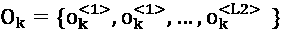

# 第十一章：高级顺序建模算法

> 算法是一个指令序列，按照该序列执行可以解决一个问题。
> 
> —未知

在上一章中，我们探讨了顺序模型的核心原理。它提供了这些技术和方法的入门概述。上一章讨论的顺序建模算法有两个基本限制。首先，输出序列必须与输入序列有相同数量的元素。其次，这些算法一次只能处理输入序列中的一个元素。如果输入序列是一句句子，那么到目前为止讨论的顺序算法只能一次“*关注*”或处理一个单词。为了更好地模拟人脑的处理能力，我们需要的不仅仅是这些。我们需要复杂的顺序模型，能够处理长度与输入不同的输出，并且能够同时关注句子中的多个单词，从而打破这一信息瓶颈。

本章将更深入地探讨顺序模型的高级内容，了解如何创建复杂的配置。我们将从分解关键元素开始，例如自编码器和**序列到序列**（**Seq2Seq**）模型。接下来，我们将介绍注意力机制和变换器，它们在**大语言模型**（**LLMs**）的发展中起着至关重要的作用，随后我们将对其进行学习。

到本章结束时，您将全面了解这些高级结构及其在机器学习领域的重要性。我们还将提供这些模型的实际应用的深入见解。

本章涵盖以下主题：

+   自编码器介绍

+   Seq2Seq 模型

+   注意力机制

+   变换器

+   大语言模型

+   深度和广度架构

首先，让我们概述一下高级顺序模型。

# 高级顺序建模技术的演变

在*第十章*，《*理解顺序模型*》中，我们讨论了顺序模型的基础知识。尽管它们有许多应用场景，但在理解和生成复杂的人类语言细节方面仍然面临挑战。

我们将从讨论**自编码器**开始。自编码器是在 2010 年代初期提出的，为数据表示提供了一种新颖的方式。它们在**自然语言处理**（**NLP**）中标志着一个重要的演变，彻底改变了我们对数据编码和解码的思考方式。但 NLP 的进展并未止步于此。到 2010 年代中期，**Seq2Seq**模型开始出现，带来了用于任务（如语言翻译）的一些创新方法。这些模型能够巧妙地将一种序列形式转化为另一种，开启了先进序列处理的新时代。

然而，随着数据复杂度的增加，NLP 社区感受到了对更精密工具的需求。这促成了 2015 年**注意力机制**的发布。这个优雅的解决方案赋予了模型选择性地关注输入数据特定部分的能力，使其能更高效地处理更长的序列。实质上，它允许模型对不同数据段的重要性进行加权，从而放大相关信息，减小不相关信息。

在此基础上，2017 年迎来了**变换器**架构的出现。充分利用注意力机制的能力，变换器在 NLP 中树立了新的标杆。

这些进展最终促成了**大语言模型**（**LLMs**）的发展。经过海量且多样化文本数据的训练，LLMs 能够理解并生成细腻的人类语言表达。它们无与伦比的能力在广泛应用中得到了体现，从医疗诊断到金融中的算法交易。

在接下来的部分中，我们将深入探讨自动编码器的复杂性——从它们的早期起源到今天在先进序列模型中的核心作用。准备好深入了解这些变革性工具的机制、应用和演变吧。

# 探索自动编码器

自动编码器在神经网络架构的领域中占据了独特的地位，在高级序列模型的叙事中扮演着关键角色。基本上，自动编码器旨在创建一个输出与输入相似的网络，意味着将输入数据压缩成更简洁、低维的潜在表示。

自动编码器结构可以被概念化为一个双阶段过程：**编码**阶段和**解码**阶段。

考虑以下图示：


图 11.1：自动编码器架构

在这个图示中，我们做出以下假设：

+   *x* 对应于输入数据

+   *h* 是我们数据的压缩形式

+   *r* 表示输出，即 *x* 的重建或近似值

我们可以看到，这两个阶段分别由 *f* 和 *g* 表示。让我们更详细地看一下它们：

+   **编码**（*f*）：用数学形式表示为 *h* = *f*(*x*)。在此阶段，输入数据* x *被转化为一个简化的、隐藏的表示，称为 *h*。

+   **解码**（*g*）：在此阶段，用 *r* = *g*(*h*) 表示，紧凑的 *h* 被展开，旨在重建最初的输入。

在训练自动编码器时，目标是完善 *h*，确保它能 encapsulate 输入数据的本质。在实现高质量的 *h* 时，我们确保重建的输出 *r* 能尽量少的损失地再现原始的 *x*。目标不仅是重建，还要训练出一个精简且高效的 *h*，以完成这个重建任务。

## 编写自动编码器

**美国国家标准与技术研究所**（**MNIST**）数据集是一个著名的手写数字数据库，包含 28x28 像素的灰度图像，表示从 0 到 9 的数字。它已广泛用作机器学习算法的基准。更多信息以及数据集的访问可以通过官方 MNIST 网站获得。对于有兴趣访问数据集的人，它可以在 Yann LeCun 主办的官方 MNIST 存储库中找到：[yann.lecun.com/exdb/mnist/](http://yann.lecun.com/exdb/mnist/)。请注意，下载数据集可能需要创建账户。

在本节中，我们将使用自编码器重建这些手写数字。自编码器的独特之处在于其训练机制：*输入*和*目标输出*是相同的图像。我们来详细解析一下。

首先是**训练**阶段，期间将进行以下步骤：

1.  MNIST 图像被提供给自编码器。

1.  编码器部分将这些图像压缩成浓缩的潜在表示。

1.  解码器部分随后会尝试从这个表示中恢复原始图像。通过反复迭代这个过程，自编码器掌握了压缩和重构的细节，捕捉到手写数字的核心模式。

第二步是**重构阶段**：

1.  训练好的模型在接收到新的手写数字图像时，自编码器会首先将其编码成内部表示。

1.  然后，解码这个表示将得到一个重构的图像，如果训练成功，它应该与原始图像非常相似。

在 MNIST 数据集上有效训练后的自编码器，成为一个强大的工具，用来处理和重构手写数字图像。

## 环境设置

在深入代码之前，必须导入必要的库。TensorFlow 将是我们的主要工具，但在数据处理方面，像 NumPy 这样的库可能至关重要：

```py
import tensorflow as tf 
```

### 数据准备

接下来，我们将把数据集划分为训练集和测试集，然后对它们进行归一化处理：

```py
# Load dataset
(x_train, _), (x_test, _) = tf.keras.datasets.mnist.load_data()
# Normalize data to range [0, 1]
x_train, x_test = x_train / 255.0, x_test / 255.0 
```

请注意，`255.0`的除法操作是为了对灰度图像数据进行归一化，这是优化学习过程的一个步骤。

### 模型架构

设计自编码器涉及到关于层次、尺寸和激活函数的决策。在这里，模型是通过 TensorFlow 的`Sequential`和`Dense`类定义的：

```py
model = tf.keras.Sequential([
    tf.keras.layers.Flatten(input_shape=(28, 28)),
    tf.keras.layers.Dense(32, activation='relu'),
    tf.keras.layers.Dense(784, activation='sigmoid'),
    tf.keras.layers.Reshape((28, 28))
]) 
```

将 28x28 的图像展平后，我们得到一个包含 784 个元素的一维数组，因此输入的形状为该数组的形状。

### 编译

模型定义完成后，将使用指定的损失函数和优化器进行编译。由于我们的灰度图像是二值性质，因此选择了二元交叉熵作为损失函数：

```py
model.compile(loss='binary_crossentropy', optimizer='adam') 
```

### 训练

训练阶段通过`fit`方法启动。在这里，模型学习 MNIST 手写数字的细节：

```py
model.fit(x_train, x_train, epochs=10, batch_size=128,
          validation_data=(x_test, x_test)) 
```

### 预测

使用训练好的模型，可以执行以下预测操作（包括编码和解码）：

```py
encoded_data = model.predict(x_test)
decoded_data = model.predict(encoded_data) 
```

### 可视化

现在让我们直观地比较原始图像与其重建后的对比图像。以下脚本展示了一个可视化过程，显示了两排图像：

```py
n = 10  # number of images to display
plt.figure(figsize=(20, 4))
for i in range(n):
    # Original images
    ax = plt.subplot(2, n, i + 1)
    plt.imshow(x_test[i].reshape(28, 28) , cmap='gray')
    ax.get_xaxis().set_visible(False)
    ax.get_yaxis().set_visible(False)
    # Reconstructed images
    ax = plt.subplot(2, n, i + 1 + n)
    plt.imshow(decoded_data[i].reshape(28, 28) , cmap='gray')
    ax.get_xaxis().set_visible(False)
    ax.get_yaxis().set_visible(False)
plt.show() 
```

以下截图显示了输出的重建图像：


图 11.2：原始测试图像（上排）和自编码器重建后的图像（下排）

最上排展示了原始测试图像，而下排展示了通过自编码器重建后的图像。通过这种并排比较，我们可以辨别出模型在保持输入的内在特征方面的有效性。

现在让我们讨论 Seq2Seq 模型。

# 理解 Seq2Seq 模型

在我们探索自编码器之后，另一个在高级序列模型领域中的突破性架构是**Seq2Seq**模型。Seq2Seq 模型在许多最先进的自然语言处理任务中占据重要地位，展现了一种独特的能力：将输入序列转换为可能在长度上不同的输出序列。这种灵活性使其在诸如机器翻译等挑战中表现出色，因为源语言和目标语言的句子长度可以自然地不同。

请参阅*图 11.3*，它展示了 Seq2Seq 模型的核心组成部分：


图 11.3：Seq2Seq 模型架构示意图

总的来说，有三个主要元素：

+   **编码器**：处理输入序列

+   **思维向量**：编码器和解码器之间的桥梁

+   **解码器**：生成输出序列

让我们一个一个地探索它们。

## 编码器

编码器在*图 11.3*中显示为。正如我们所观察到的，它是一个输入**循环神经网络**（**RNN**），用于处理输入序列。此处的输入句子是一个三词句子：*Is Ottawa cold?* 它可以表示为：

X = {x^(<1>), x^(<2>),… …., x^(<L1>)}

编码器遍历该序列，直到遇到**句子结束**（<**EOS**>）标记，表示输入的结束。它将位于时间步*L1*。

## 思维向量

在编码阶段，RNN 更新其隐藏状态，表示为 h^(<t>)。序列结束时捕获的最终隐藏状态 h^(<L1>)会传递给解码器。这个最终状态被称为**思维向量**，由 Geoffrey Hinton 于 2015 年提出。这个紧凑的表示捕捉了输入序列的精髓。思维向量在*图 11.3*中显示为。

## 解码器或写入器

在编码过程完成后，`<GO>`符号表示解码器开始工作。使用编码器的最后一个隐藏状态 h^(<L1>)作为其初始输入，解码器作为输出 RNN，开始构建输出序列 Y = {y^(<1>), y^(<2>),… …., y^(<L2>)}。在*图 11.3*的背景下，这个输出序列转化为句子：*是的*，*它是*。

## Seq2Seq 中的特殊符号

虽然`<EOS>`和`<GO>`是 Seq2Seq 范式中的重要符号，但还有一些其他值得注意的符号：

+   `<UNK>`：代表*未知*，这个符号用来替换不常见的单词，确保词汇表保持可管理。

+   `<PAD>`：用于填充较短的序列，这个符号在训练过程中标准化序列长度，从而提升模型的效率。

Seq2Seq 模型的一个显著特点是能够处理可变序列长度，这意味着输入和输出序列在大小上本质上可以有所不同。这种灵活性，再加上其顺序特性，使得 Seq2Seq 成为高级建模领域中的一个重要架构，架起了从自编码器到更复杂、更精细的序列处理系统的桥梁。

在经历了自编码器的基础领域并深入研究了 Seq2Seq 模型之后，我们现在需要理解编码器-解码器框架的局限性。

## 信息瓶颈难题

正如我们所学到的，传统 Seq2Seq 模型的核心是思维向量 h^(<L1>)。这是来自编码器的最后一个隐藏状态，作为连接编码器和解码器的桥梁。这个向量负责封装整个输入序列，*X*。该机制的简单性既是其优势也是其弱点。当序列变得更长时，这种弱点尤为突出；将大量信息压缩成固定大小的表示变得越来越困难。这被称为**信息瓶颈**。无论输入的丰富性或复杂性如何，固定长度的记忆限制意味着从编码器传递到解码器的信息量是有限的。

要了解这个问题是如何被解决的，我们需要将焦点从 Seq2Seq 模型转移到注意力机制上。

# 理解注意力机制

在传统 Seq2Seq 模型中的固定长度记忆带来的挑战之后，2014 年标志着一次革命性的进步。Dzmitry Bahdanau、KyungHyun Cho 和 Yoshua Bengio 提出了一种变革性解决方案：**注意力机制**。与早期模型试图（常常徒劳地）将整个序列压缩到有限的内存空间不同，注意力机制使得模型能够专注于输入序列中具体且相关的部分。可以把它想象成在每个解码步骤中仅对最关键数据进行放大。

## 神经网络中的注意力是什么？

正如俗话所说，注意力集中之处，就是焦点所在。在自然语言处理（NLP）领域，尤其是在大语言模型（LLM）的训练中，注意力受到了极大的关注。传统上，神经网络按固定顺序处理输入数据，可能会错过上下文的重要性。而注意力机制的引入，则是为了解决这个问题——它能够衡量不同输入数据的重要性，更加关注相关内容。

### 基本概念

就像人类会将更多注意力放在图像或文本的显著部分一样，注意力机制使神经模型能够专注于输入数据中更相关的部分。它有效地指引模型下一步“看”哪里。

### 示例

受到我最近一次前往埃及的旅行启发，这次旅行仿佛是一次穿越时空的旅行，让我们思考古埃及的表现力和象征性语言：象形文字。

象形文字不仅仅是符号；它们是艺术与语言的复杂融合，代表着多重含义。这个系统，通过其丰富的符号阵列，展示了神经网络注意力机制的基础原则。


图 11.4：吉萨的著名金字塔——胡夫金字塔和哈夫拉金字塔，旁边是古老埃及象形文字的铭文，“象形文字”（照片由作者拍摄）

举例来说，一位埃及抄写员希望传达关于尼罗河边即将举行的盛大节日的消息。在成千上万的象形文字中：

+    *安卡*象形文字，象征生命，捕捉了节日的生动气氛和庆祝精神。

+    *瓦斯*符号，形似权杖，暗示着权威或法老在庆典中的关键角色。

+    *尼罗河*的插图，象征着埃及文化的中心，标示出节庆的举办地点。

然而，为了传达节日的宏伟和重要性，并非所有符号的权重都相同。抄写员必须强调或重复特定的象形文字，以引起人们对信息最关键部分的注意。

这种选择性强调与神经网络的注意力机制相似。

## 注意力机制的三个关键方面

在神经网络，尤其是 NLP 任务中，注意力机制在过滤和聚焦相关信息方面起着至关重要的作用。在这里，我们将注意力的主要方面提炼为三个关键组成部分：上下文相关性、符号效率和优先关注：

+   **上下文相关性**：

    +   **概述**：本质上，注意力旨在将更多的重视分配给那些被认为与当前任务更相关的输入数据部分。

    +   **深入探讨**：以一个简单的输入例如*“宏伟的尼罗河节”*为例。在这种情况下，注意力机制可能会给“尼罗河”和“宏伟”这两个词赋予更高的权重。这并非因为它们的普遍意义，而是由于它们在任务中的特定重要性。注意力机制并非将每个词或输入都视为同等重要，而是根据上下文区分并调整模型的聚焦点。

    +   **实际应用**：可以把这看作是一束聚光灯。就像聚光灯在舞台上照亮特定演员在关键时刻的表现，而其他演员则被暗淡处理，注意力也会把光照在更具上下文价值的输入数据上。

+   **符号效率**：

    +   **概述**：注意力机制能够将大量信息浓缩成易于理解的关键片段。

    +   **深入探讨**：象形文字可以通过单一符号承载复杂的叙事或思想。类比地，注意力机制通过分配不同的权重，能够判断数据的哪些部分包含最多的信息，并应优先处理这些部分。

    +   **实际应用**：考虑将一篇大文档压缩成简洁的摘要。摘要仅保留最关键的信息，这类似于注意力机制从更大的输入中提取并优先处理最相关的数据。

+   **优先聚焦**：

    +   **概述**：注意力机制不会均匀分配它们的聚焦点。它们的设计是根据输入数据与任务的相关性来优先考虑某些片段。

    +   **深入探讨**：从象形文字的例子中汲取灵感，就像古埃及的抄写员在表达生命或庆祝的概念时会强调“*安卡*”符号一样，注意力机制也会根据任务的相关性调整对输入特定部分的聚焦（或权重）。

    +   **实际应用**：这就像阅读一篇研究论文。虽然整个文档都有价值，但人们可能更关注摘要、结论或与自己当前研究需求相关的特定数据点。

因此，神经网络中的注意力机制模仿了人类在处理信息时自然使用的选择性聚焦方式。通过理解注意力如何优先处理数据的细微差别，我们可以更好地设计和解读神经模型。

## 更深入探讨注意力机制

注意力机制可以被看作是一种进化的沟通方式，就像古代的象形文字一样。传统上，编码器试图将整个输入序列浓缩成一个概括性的隐藏状态。这就像古埃及的抄写员试图通过一个单一的象形文字来表达整个事件。虽然这在理论上是可能的，但它很具挑战性，并且可能无法完整捕捉事件的全部精髓。

现在，采用增强的编码器-解码器方法，我们可以为每个步骤生成一个隐藏状态，从而为解码器提供更丰富的数据。但是，如果同时引用每一个象形符号（或状态），那将会是混乱的，类似于一位抄写员用所有可用的符号来描述尼罗河旁的一个事件。这就是注意力机制的作用所在。

注意力机制使解码器能够进行优先级排序。就像一位抄写员可能专注于“Ankh”符号来象征生命和活力，或者“Was”权杖代表权力，甚至描绘尼罗河本身来指示位置一样，解码器会为每个编码器状态分配不同的权重。它决定序列中的哪些部分（或哪些象形符号）值得更多的关注。以我们的翻译示例为例，当将“*Transformers are great!*”翻译为“*Transformatoren sind grossartig!*”时，机制会强调“*great*”与“*grossartig*”的对齐，确保核心情感不变。

这种选择性聚焦，无论是在神经网络的注意力机制中，还是在象形文字叙事中，都能确保传达信息的准确性和清晰度。


图 11.5：采用增强注意力机制的编码器-解码器结构的 RNN

## 注意力机制的挑战

尽管将注意力机制与 RNN 结合可以带来显著的改进，但这并不是万能的解决方案。其中一个重大障碍是计算成本。将多个隐藏状态从编码器传输到解码器的过程需要大量的计算能力。

然而，正如所有技术进步一样，解决方案不断涌现。其中一个进展是**自注意力**的引入，这是变压器架构的基石。这种创新的变体优化了注意力过程，使其更加高效和可扩展。

# 深入探讨自注意力机制

再次考虑古老的象形文字艺术，其中符号的选择是有意为之，用来传达复杂的消息。自注意力的运作方式类似，确定序列中哪些部分是关键并应当被强调。

*图 11.6*展示了在顺序模型中整合自注意力的美妙之处。想象底层通过双向 RNN 运作，像是金字塔的基石。它们生成我们所称的**上下文向量**（**c2**），类似于象形文字对事件的总结。

序列中的每一步或每个单词都有其**权重**，用*α*表示。这些权重与上下文向量相互作用，强调某些元素的重要性，而不是其他元素。

假设一个场景，其中输入*X*[k]表示一个独立的句子，记作*k*，该句子的长度为*L1*。这可以用数学方式表示为：


在这里，每个元素，，代表句子*k*中的一个单词或符号：上标<t>表示它在句子中的特定位置或时间步。

## 注意力权重

在自注意力机制中，注意力权重起着至关重要的作用，像一个指向重要单词的指南针。它们在生成上下文向量时，给每个单词分配一个“重要性分数”。

为了让这更有意义，考虑我们之前的翻译示例：“*Transformers are great!*” 翻译为 “*Transformatoren sind grossartig!*”。当聚焦于“*Transformers*”时，注意力权重可能是这样分布的：

+   α[2,1]：衡量“*Transformers*”与句子开头之间的关系。此处的高值表示“*Transformers*”在其上下文中显著依赖句子开头。

+   α[2,2]：反映了“*Transformers*”对其内在意义的强调程度。

+   α[2,3] 和 α[2,4]：衡量“*Transformers*”在上下文中对“*are*”和“*great!*”这两个词的依赖程度。高分值表示“*Transformers*”深受这些周围词汇的影响。

在训练过程中，这些注意力权重会不断地被调整和精细化。这种持续的优化确保我们的模型理解句子中单词之间错综复杂的关系，捕捉到显性和隐性之间的联系。


图 11.6：在序列模型中整合自注意力机制

在深入探讨自注意力机制之前，理解组成*图 11.6*中的关键部分是至关重要的。

## 编码器：双向 RNN

在上一章中，我们研究了单向 RNN 及其变种的主要架构组件。**双向 RNN**的发明旨在解决这一需求（Schuster 和 Paliwal，1997）。我们还发现了单向 RNN 的一个缺陷，即它们只能向一个方向传递上下文。

对于一个输入序列，假设是 *X*，双向 RNN 首先从头到尾读取它，然后再从尾到头读取。这种双重方法帮助捕捉基于前后元素的信息。对于每个时间步，我们得到两个隐藏状态：一个是 （正向）方向的，另一个是 （反向）方向的。这些状态被合并成该时间步的单一状态，表示为：


举个例子，如果  和  是 64 维向量，那么结果的 h^(<t2>) 将是 128 维的。这个合并后的状态是来自两个方向的序列上下文的详细表示。

## 思维向量

思维向量，这里用 C[k] 表示，是输入 X[k] 的一种表征。如我们所学，它的创建旨在捕捉 X[k] 中每个元素的顺序模式、上下文和状态。

在我们前面的图示中，它被定义为：


其中  是在训练过程中针对时间步 *t* 精炼后的注意力权重。

使用求和符号，它可以表示为：


## 解码器：常规的 RNN

*图 11.5* 显示了通过思维向量连接的解码器与编码器。

某个句子 k 的解码器输出表示为：



请注意，输出的长度是 *L2*，与输入序列的长度 *L1* 不同。

## 训练与推理

在某个输入序列 *k* 的训练数据中，我们有一个表示地面真实的期望输出向量，这个向量用 Y[k]表示。它是：


在每个时间步，解码器的 RNN 接收三个输入：

+   ：前一个隐藏状态

+   C[k]：序列 *k* 的思维向量

+   ：地面真实向量 Y[k]中的前一个词

然而，在推理过程中，由于没有先前的真实值可用，解码器的 RNN 会使用先前的输出词，，代替。

现在我们已经了解了自注意力如何解决注意力机制面临的挑战以及它涉及的基本操作，我们可以将注意力转向序列建模中的下一个重大进展：变换器（transformers）。

# 变换器：自注意力之后神经网络的演进

我们对自注意力的探索揭示了它强大的能力，可以重新解释序列数据，基于与其他词的关系为每个词提供上下文理解。这个原则为神经网络设计的进化跃进奠定了基础：**变换器**架构。

变换器架构由谷歌大脑团队在他们 2017 年的论文《*Attention is All You Need*》([`arxiv.org/abs/1706.03762`](https://arxiv.org/abs/1706.03762))中提出，基于自注意力的本质。变换器问世之前，RNN 是首选。可以将 RNN 看作是勤奋的图书管理员，逐字地读取英语句子并将其翻译成德语，确保上下文从一个词传递到下一个词。它们在处理短文本时非常可靠，但当句子变得过长时，可能会发生错位，丢失早期词汇的本意。


图 11.7：原始变换器的编码器-解码器架构

变换器是处理序列数据的一种全新方法。与线性逐字的进程不同，变换器借助先进的注意力机制，可以一眼理解整个序列。这就像瞬间抓住整段文字的情感，而不是逐字拼凑。这种全局视角确保了更丰富、全面的理解，庆祝了词与词之间微妙的相互作用。

自注意力是变换器高效性的核心。虽然我们在前面已经提到过这一点，但值得注意的是它在这里的重要性。网络的每一层通过自注意力机制可以与输入数据的其他部分产生共鸣。如*图 11.7*所示，变换器架构在其编码器和解码器部分都使用自注意力机制，然后这些部分再传递给神经网络（也称为**前馈神经网络（FFNNs）**）。除了更易于训练外，这一架构也促进了 NLP 领域的许多最新突破。

为了说明这一点，考虑*《古埃及：埃及历史的迷人概述》*，作者比利·韦尔曼。在书中，像拉美西斯和克娄巴特拉这样的早期法老与金字塔建设之间的关系既庞大又复杂。传统模型可能在面对如此庞大的内容时会遇到困难。

## 为什么变换器如此出色

变换器架构凭借其自注意力机制，成为一个有前景的解决方案。当遇到像“*金字塔*”这样的术语时，模型可以通过自注意力机制评估它与“*拉美西斯*”或“*克娄巴特拉*”等术语的相关性，而不管它们的位置如何。这种对不同输入部分进行关注的能力，展示了变换器在现代 NLP 中的重要性。

## 一个 Python 代码解析

下面是自注意力机制实现的简化版本：

```py
import numpy as np
def self_attention(Q, K, V):
    """
    Q: Query matrix
    K: Key matrix
    V: Value matrix
    """

    # Calculate the attention weights
    attention_weights = np.matmul(Q, K.T)

    # Apply the softmax to get probabilities
    attention_probs = np.exp(attention_weights) / np.sum(np.exp(attention_weights), axis=1, keepdims=True)

    # Multiply the probabilities with the value matrix to get the output
    output = np.matmul(attention_probs, V)

    return output
# Example
Q = np.array([[1, 0, 1], [0, 2, 0], [1, 1, 0]])  # Example Query
K = np.array([[1, 0, 1], [0, 2, 0], [1, 1, 0]])  # Key matrix
V = np.array([[0, 2, 0], [1, 0, 1], [0, 1, 2]])  # Value matrix
output = self_attention(Q, K, V)
print(output) 
```

输出：

```py
[[0.09003057 1.57521038 0.57948752]
 [0.86681333 0.14906291 1.10143419]
 [0.4223188  0.73304361 1.26695639]] 
```

这段代码是一个基本表示，真实的变换器模型采用了更优化且更详细的方法，尤其是在扩展到更大序列时。但本质上是动态加权序列中的不同单词，允许模型引入上下文理解。

## 理解输出

+   第一行，`[0.09003057 1.57521038 0.57948752]`，对应查询中第一个单词的 V 矩阵加权组合（在这种情况下，表示为 Q 矩阵的第一行）。这意味着当我们的模型遇到由这个查询表示的单词时，它会将 9%的关注放在第一个单词，57.5%的关注放在第二个单词，57.9%的关注放在第三个单词，从 V 矩阵中提取上下文理解。

+   第二行，`[0.86681333 0.14906291 1.10143419]`，是查询中第二个单词的注意力结果。它对 V 矩阵中第一个单词、第二个单词和第三个单词的关注度分别为 86.6%、14.9%和 110.1%。

+   第三行，`[0.4223188 0.73304361 1.26695639]`，对应查询中的第三个单词。它对 V 矩阵中各个单词的注意力权重分别为 42.2%、73.3%和 126.7%。

在回顾了变换器、它们在序列建模中的地位、它们的代码及其输出之后，我们可以考虑 NLP 领域的下一个重大进展。接下来，我们来看一下 LLMs。

# LLMs

**LLMs**是 NLP 领域中继变换器（transformers）之后的下一个进化步骤。它们不仅仅是增强版的旧模型；它们代表了一个飞跃。这些模型可以处理大量文本数据，并执行曾经被认为只有人类大脑才能完成的任务。

简而言之，LLMs 可以生成文本、回答问题，甚至编写代码。想象一下和软件聊天，它像人类一样回复，捕捉微妙的暗示并记得之前对话的内容。这正是 LLMs 所能提供的。

**语言模型**（**LMs**）一直是自然语言处理（NLP）的支柱，帮助完成从机器翻译到更现代的文本分类等任务。早期的 LMs 依赖于 RNNs 和**长短期记忆**（**LSTM**）结构，而今天 NLP 的成就主要得益于深度学习技术，特别是 transformer 模型。

LLMs 的标志性特征？它们能够阅读并从大量文本中学习。从零开始训练一个 LLM 是一项艰巨的任务，需要强大的计算机和大量的时间。根据模型的大小和训练数据的量——例如来自像维基百科或 Common Crawl 数据集这样的庞大来源——训练一个 LLM 可能需要几周甚至几个月的时间。

处理长序列是 LLMs 面临的已知挑战。早期基于 RNNs 和 LSTMs 的模型在处理长序列时常常会丢失重要细节，这影响了它们的性能。这时我们开始看到**注意力**的作用。注意力机制就像一盏手电筒，照亮长输入中的重要部分。例如，在一篇关于汽车进展的文章中，注意力确保模型能够识别并聚焦于主要突破，无论这些突破出现在文本的哪里。

## 理解 LLMs 中的注意力机制

注意力机制已经成为神经网络领域的基础，尤其在 LLMs 中表现得尤为突出。训练这些庞大的模型，包含数百万甚至数十亿个参数，并非易事。从本质上讲，注意力机制就像高光笔，强调关键细节。例如，在处理一篇关于 NLP 发展的长篇文章时，LLMs 能够理解整体主题，但注意力确保它们不会错过重要的里程碑。transformer 模型利用这一注意力特性，帮助 LLMs 处理庞大的文本片段，并确保**上下文**的一致性。

对于 LLMs 来说，**上下文**至关重要。例如，如果一个 LLM 编写了一个以猫为开头的故事，注意力机制确保随着故事的发展，上下文保持一致。因此，故事不会引入像“*狗吠声*”这样的无关声音，而是自然地倾向于“*猫叫声*”或“*喵喵声*”。

训练一个 LLM 就像是连续运行超级计算机数月，仅仅为了处理大量的文本数据。而且，当初始训练完成时，这只是个开始。可以把它想象成拥有一辆高端汽车——你需要定期进行维护。同样，LLMs 也需要基于新数据进行频繁的更新和调整。

即使训练完一个 LLM，工作也远未结束。为了保持这些模型的有效性，它们需要不断学习。想象一下，教某人英语语法规则，然后再加入俚语或习语——他们需要适应这些不规则用法，才能全面理解。

强调一个历史性转折点，2017 年至 2018 年间，LLM（大规模语言模型）领域发生了显著变化。包括 OpenAI 在内的公司开始利用无监督预训练，为情感分析等任务的更简化模型铺平了道路。

## 探索 NLP 的强大引擎：GPT 和 BERT

**通用语言模型微调**（**ULMFiT**）为自然语言处理（NLP）开启了新时代。这种方法开创了预训练 LSTM 模型的再利用，并将其适应于多种 NLP 任务，从而节省了计算资源和时间。让我们来分解一下它的过程：

1.  **预训练**：这类似于教一个孩子语言的基础。通过使用像 Wikipedia 这样的广泛数据集，模型学习语言的基本结构和语法。可以把它看作是为学生提供通识教材。

1.  **领域适应**：模型然后深入到特定领域或类型。如果第一步是学习语法，那么这一步就像是将模型引入不同的文学类型——从惊悚小说到科学期刊。它仍然在预测词汇，但现在是在特定的上下文中进行。

1.  **微调**：最后，模型被精细调整，以应对特定任务，例如检测给定文本中的情绪或情感。这相当于训练学生写作论文或深入分析文本。

### 2018 年 LLM 先驱：GPT 和 BERT

2018 年见证了两款突出模型的崛起：GPT 和 BERT。让我们更详细地了解它们。

#### 生成预训练变换器（GPT）

受 ULMFiT 启发，GPT 是一个依赖于变换器架构解码器部分的模型。想象人类文学的浩瀚。如果传统模型是通过固定的一组书籍来训练，那么 GPT 就像是给学者提供了整个图书馆的访问权限，包括 BookCorpus——一个包含多样化未出版书籍的丰富数据集。这使得 GPT 可以从小说到历史等多种类型中汲取见解。

这里有一个类比：传统模型可能知道莎士比亚剧本的情节。GPT 通过广泛的学习，不仅理解情节，还能掌握文化背景、人物细微之处以及莎士比亚写作风格随时间的演变。

它对解码器的专注使 GPT 成为生成既相关又连贯文本的大师，就像一位经验丰富的作者在起草小说。

#### BERT（双向编码器表示从变换器）

BERT 通过其“掩蔽语言模型”技术彻底改变了传统的语言建模。与仅预测句子中下一个单词的模型不同，BERT 会填补故意空缺或“掩蔽”的词，从而增强了其对上下文的理解。

让我们来看看这个变化的背景。在像“*她去巴黎参观 ___*”这样的句子中，传统模型可能会预测符合“*the*”之后的词，比如“*博物馆*”。而 BERT 在遇到“*她去巴黎参观 masked*”时，会试图推断出“*masked*”应该被“*埃菲尔铁塔*”替代，理解到巴黎之行的更广泛背景。

BERT 的方法提供了更全面的语言理解，基于前后文捕捉单词的本质，提升了其语言理解能力。

训练大语言模型（LLM）成功的关键在于结合“深度”和“广度”学习架构。可以把“深度”部分看作是专注于某一领域的专家，而“广度”方法则像是通才，了解各个领域的基础知识。

## 使用深度和广度模型来创建强大的大语言模型（LLMs）

大语言模型的设计非常精细，旨在在一个相对具体的任务上表现出色：预测序列中的下一个词汇。起初看似简单，但为了高精度地完成这一任务，模型往往借鉴了人类学习中的某些方面。

人脑，作为自然界的奇迹，通过识别和抽象周围环境中的常见模式来处理信息。在此基础理解的基础上，人类还通过记忆那些不符合常规模式的特定实例或例外来增强他们的知识。可以将其理解为：首先了解一条规则，然后学习该规则的例外情况。

为了让机器具备这种双层次学习方法，我们需要深思熟虑的机器学习架构。一个初步的方法可能仅仅是基于普遍的模式来训练模型，而忽略了例外情况。然而，要真正做到卓越，尤其是在诸如预测下一个词汇这样的任务中，模型必须能够掌握既能捕捉常见模式，又能识别语言中偶尔出现的独特例外。

虽然大语言模型并非旨在完全模拟人类智能（人类智能是多面的，不仅仅是关于预测序列），但它们确实借鉴了人类的学习策略，以便在其特定任务上变得更加熟练。

大语言模型的设计旨在通过检测大量文本数据中的模式来理解和生成语言。可以考虑以下基本的语言学准则：

1.  古埃及象形文字提供了一个有趣的例子。在这个早期的书写系统中，一个符号可能代表一个单词、一个声音，甚至是一个概念。例如，虽然一个单一的象形文字可以表示“*河流*”一词，但多个象形文字的组合可以传达更深的含义，如“*生命之源——尼罗河*”。

1.  现在，考虑一下问题是如何形成的。通常，问题的构建始于助动词。然而，间接的询问，例如“*我想知道尼罗河今年是否会泛滥*”，则偏离了这种常规模式。

为了有效地预测一个序列中的下一个词汇或短语，大语言模型（LLMs）必须掌握既有的语言规范及其偶尔的例外。

# 表单底部

因此，结合深度和广度模型（*图 11.8*）已被证明能提升模型在广泛任务上的表现。深度模型的特点是拥有许多隐藏层，能够学习输入与输出之间复杂的关系。

相反，宽度模型旨在学习数据中的简单模式。通过将两者结合，可以同时捕捉复杂关系和简单模式，从而得到更强大、更灵活的模型。


图 11.8：深度与宽度模型的架构

在训练过程中融入例外对于模型在面对新数据时更好地泛化至关重要。例如，只有在包含某个词义的数据上训练的语言模型，可能在遇到新数据时无法识别该词的其他含义。通过融入例外，模型可以学习识别一个词的多种含义，从而提升其在各种自然语言处理任务中的表现。

深度架构通常用于需要学习数据的复杂层次抽象表示的任务。表现出可泛化模式的特征称为密集特征。当我们使用深度架构来制定规则时，我们称之为通过泛化进行学习。为了构建一个宽深网络，我们将稀疏特征直接连接到输出节点。

在机器学习领域，结合深度和宽度模型已被确定为构建更灵活、更强大的模型的重要方法，这些模型可以同时捕捉数据中的复杂关系和简单模式。深度模型擅长学习数据的复杂层次抽象表示，通过多个隐藏层，每一层处理数据并在不同层次上学习不同的特征。相对而言，宽度模型具有最少的隐藏层，通常用于需要学习数据中简单非线性关系的任务，而不会创建任何抽象层。

这些模式通过稀疏特征来表示。当模型的宽部分具有一个或零个隐藏层时，它可以用来记住示例并制定例外。因此，当宽架构用于制定规则时，我们称之为通过**记忆**进行学习。

深度和宽度模型可以利用深度神经网络来泛化模式。通常，这部分模型需要大量的时间进行训练。宽度部分以及在实时捕捉这些泛化的所有例外的努力，都是持续算法学习过程的一部分。

# 总结

在本章中，我们讨论了先进的序列模型，这些技术专门用于处理输入序列，尤其是在输出序列的长度可能与输入序列不同的情况下。自编码器是一种神经网络架构，特别擅长压缩数据。它们通过将输入数据编码成更小的表示，然后再解码回来，以便与原始输入相似。这个过程可以用于图像去噪等任务，在这些任务中，图像中的噪声被过滤掉，以生成更清晰的版本。

另一个有影响力的模型是 Seq2Seq 模型。它被设计用来处理输入和输出序列长度不一致的任务，使其在诸如机器翻译等应用中非常理想。然而，传统的 Seq2Seq 模型面临着**信息瓶颈**问题，即需要将输入序列的整个上下文捕捉到一个固定大小的表示中。为了解决这个问题，引入了注意力机制，使模型能够动态地聚焦于输入序列的不同部分。论文《Attention is All You Need》中提出的 Transformer 架构正是利用了这一机制，彻底改变了序列数据的处理方式。与其前身不同，Transformer 可以同时关注序列中的所有位置，从而捕捉数据中的复杂关系。这一创新为大型语言模型（LLM）的发展铺平了道路，这些模型因其类人文本生成能力而广受关注。

在下一章，我们将探讨如何使用推荐引擎。

# 了解更多内容请访问 Discord

要加入本书的 Discord 社区——在这里你可以分享反馈、向作者提问，并了解新版本的发布——请扫描以下二维码：

[`packt.link/WHLel`](https://packt.link/WHLel)


