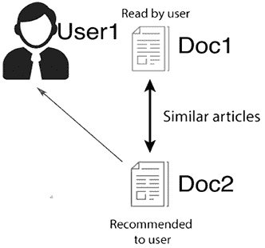
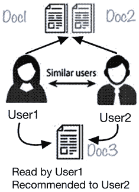
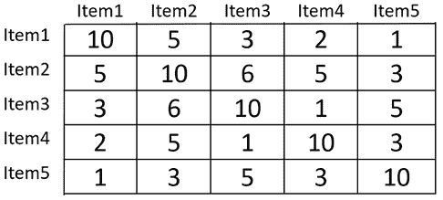
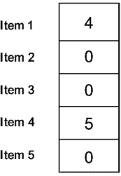
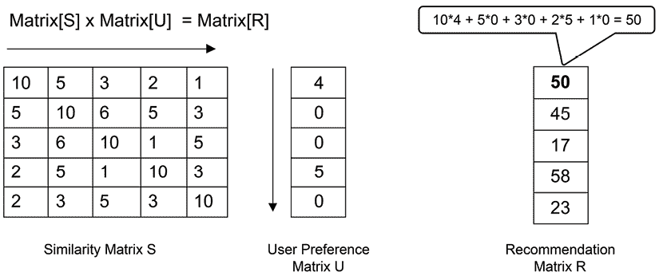
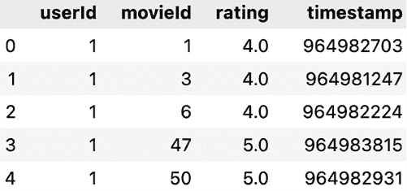
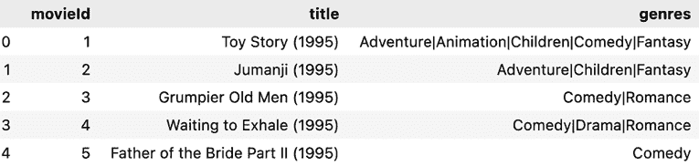
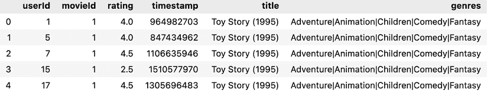
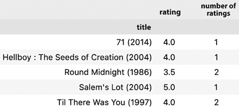

# 第十二章：推荐引擎

> 我能得到的最好推荐是我自己的才华，和我自己的努力成果，而别人无法为我做的事，我会尽力为自己去做。
> 
> —18 至 19 世纪科学家约翰·詹姆斯·奥杜邦

推荐引擎利用可用的用户偏好和物品详细数据，提供量身定制的建议。推荐引擎的核心目标是识别不同物品之间的共性，并理解用户与物品互动的动态。推荐系统不仅仅专注于产品，还考虑任何类型的物品——无论是歌曲、新闻文章还是产品——并根据这些来定制推荐。

本章首先介绍推荐引擎的基础知识。接着，讨论推荐引擎的各种类型。在本章的后续部分，我们将探讨推荐系统的内部工作原理。这些系统能够为用户推荐量身定制的物品或产品，但也面临着挑战。我们将讨论它们的优势和局限性。最后，我们将学习如何使用推荐引擎解决现实世界中的问题。

本章将涵盖以下内容：

+   推荐引擎概述

+   不同类型的推荐系统

+   认识到推荐方法的限制

+   实际应用领域

+   一个实际的例子

到本章结束时，你应该能够理解如何利用推荐引擎根据某些偏好标准推荐不同的物品。

让我们从推荐引擎的背景概念开始了解。

# 介绍推荐系统

推荐系统是强大的工具，最初由研究人员设计，但现在在商业环境中得到广泛应用，能够预测用户可能感兴趣的物品。它们通过提供个性化的物品推荐，使得推荐系统成为一个不可或缺的资产，尤其在数字购物领域中。

当推荐引擎应用于电子商务时，使用复杂的算法来改善购物体验，允许服务提供商根据用户的偏好定制产品。

这些系统的重要性的经典例子是 2009 年的 Netflix 奖挑战。Netflix 为了优化其推荐算法，提供了 100 万美元的奖金，奖励任何能够将现有推荐系统 Cinematch 提升 10%的团队。这个挑战吸引了全球研究人员的参与，BellKor 的 Pragmatic Chaos 团队最终获胜。他们的成就突显了推荐系统在商业领域中至关重要的作用和潜力。关于这个有趣挑战的更多内容，可以在本章中了解。

# 推荐引擎的类型

我们可以将推荐引擎大致分为三大类：

+   **基于内容的推荐引擎**：它们关注物品属性，将一个产品的特征与另一个产品进行匹配。

+   **协同过滤引擎**：它们根据用户行为预测偏好。

+   **混合推荐引擎**：这是一种融合了基于内容和协同过滤方法优点的推荐引擎，用于优化建议。

在建立了类别之后，让我们逐一深入了解这三种推荐引擎的细节：

## 基于内容的推荐引擎

**基于内容的推荐引擎**基于一个简单的原理：它们推荐用户以前互动过的类似物品。这些系统的关键在于准确地衡量物品之间的相似性。

举个例子，想象一下*图 12.1*中描述的场景：



图 12.1：基于内容的推荐系统

假设*用户 1*阅读了*文档 1*。由于文档之间的相似性，我们可以向*用户 1*推荐*文档 2*。

这种方法只有在我们能够识别并量化这些相似性时才有效。因此，识别物品之间的相似性对于推荐至关重要。接下来我们将探讨如何量化这些相似性。

### 确定非结构化文档中的相似性

确定不同文档之间相似性的一种方法是使用共现矩阵，它的前提是经常一起购买的物品可能共享相似性或属于互补类别。

例如，购买剃须刀的人可能还需要购买剃须膏。我们可以通过四个用户的购买习惯数据来解码这一点：

|  | **剃须刀** | **苹果** | **剃须膏** | **自行车** | **鹰嘴豆泥** |
| --- | --- | --- | --- | --- | --- |
| **Mike** | 1 | 1 | 1 | 0 | 1 |
| **Taylor** | 1 | 0 | 1 | 1 | 1 |
| **Elena** | 0 | 0 | 0 | 1 | 0 |
| **Amine** | 1 | 0 | 1 | 0 | 0 |

要构建共现矩阵，请按照以下步骤操作：

1.  初始化一个*NxN*矩阵，其中*N*是物品的数量。该矩阵将存储共现计数。

1.  对于用户-物品矩阵中的每个用户，通过增加用户与物品对交互的单元格值来更新共现矩阵。

1.  最终矩阵展示了基于用户交互的物品关联性。

上表的共现矩阵如下所示：

|  | **剃须刀** | **苹果** | **剃须膏** | **自行车** | **鹰嘴豆泥** |
| --- | --- | --- | --- | --- | --- |
| **剃须刀** | - | 1 | 3 | 1 | 2 |
| **Apple** | 1 | - | 1 | 0 | 1 |
| **剃须膏** | 3 | 1 | - | 1 | 2 |
| **自行车** | 1 | 0 | 1 | - | 1 |
| **鹰嘴豆泥** | 2 | 1 | 2 | 1 | - |

本矩阵本质上展示了两种物品一起购买的可能性。它是推荐系统中的一种有价值的工具。

## 协同过滤推荐引擎

**协同过滤**的推荐基于用户历史购买模式的分析。基本假设是，如果两位用户对大部分相同的项目表现出兴趣，我们可以将这两位用户归为相似用户。换句话说，我们可以假设以下情况：

+   如果两位用户的购买历史重叠度超过某个阈值，我们可以将他们归类为相似用户。

+   通过查看相似用户的历史，购买历史中没有重叠的项目将成为协同过滤推荐的基础。

例如，让我们看一个具体的例子。我们有两个用户，*User1*和*User2*，如下面的图所示：



图 12.2：协同过滤推荐引擎

请注意以下几点：

+   *User1*和*User2*都对完全相同的文档，*Doc1*和*Doc2*，表现出了兴趣。

+   根据他们相似的历史模式，我们可以将两者归类为相似用户。

+   如果*User1*现在阅读*Doc3*，我们也可以将*Doc3*推荐给*User2*。

基于用户历史记录向其推荐项目的策略并不总是有效。让我们更详细地了解与协同过滤相关的问题。

### 与协同过滤相关的问题

协同过滤涉及的三个潜在问题是：

1.  由于样本量有限而导致的不准确性

1.  容易受到**孤立分析**的影响

1.  对历史的过度依赖

让我们更详细地了解这些局限性。

#### 由于样本量有限而导致的不准确性

协同过滤系统的准确性和有效性还取决于样本量。例如，如果仅分析三份文档，那么做出准确推荐的可能性就会受到限制。

然而，如果系统拥有数百或数千个文档和交互数据，它的预测能力将变得更加可靠。这就像是基于少量数据点做出预测与拥有全面数据集以进行洞察分析之间的区别。

即使拥有大量数据，协同过滤也并非万无一失。原因在于它完全依赖于用户和项目之间的历史交互，而忽视了任何外部因素。

#### 容易受到孤立分析的影响

协同过滤关注的是用户行为及其与项目互动形成的模式。这意味着它通常会忽视那些可能影响用户选择的外部因素。例如，用户选择某本书可能并非出于个人兴趣，而是因为学术需要或朋友推荐。协同过滤模型无法识别这些细微差别。

#### 对历史的过度依赖

因为系统依赖历史数据，它有时会加强刻板印象，或者跟不上用户不断变化的口味。想象一下，如果一个用户曾经有一段时间喜欢科幻电影，但现在转而喜欢浪漫影片。如果他们过去看了大量的科幻电影，系统可能仍然主要推荐这些电影，而忽视了他们当前的偏好。

从本质上讲，尽管协同过滤在数据量大时非常强大，但理解其固有的局限性非常重要，因为它是通过孤立的操作方式来工作的。

接下来，我们来看看混合推荐引擎。

## 混合推荐引擎

到目前为止，我们讨论了基于内容和基于协同过滤的推荐引擎。这两种推荐引擎可以结合起来创建一个**混合推荐引擎**。为此，我们遵循以下步骤：

1.  生成物品的相似度矩阵。

1.  生成用户的偏好矩阵。

1.  生成推荐。

让我们逐步分析这些步骤。

### 生成物品的相似度矩阵

在混合推荐中，我们首先通过内容推荐创建物品的相似度矩阵。这可以通过使用共现矩阵或任何距离度量来量化物品之间的相似度。

假设我们目前有五个物品。通过基于内容的推荐，我们生成一个矩阵，捕捉物品之间的相似度，如*图 12.3*所示：



图 12.3：相似度矩阵

让我们看看如何将相似度矩阵与偏好矩阵结合，以生成推荐。

### 生成用户的参考向量

根据系统中每个用户的历史记录，我们将生成一个捕捉这些用户兴趣的偏好向量。

假设我们要为一家名为*KentStreetOnline*的在线商店生成推荐，该商店销售 100 种独特的商品。*KentStreetOnline*非常受欢迎，拥有 100 万活跃订阅者。需要注意的是，我们只需要生成一个尺寸为 100×100 的相似度矩阵。同时，我们还需要为每个用户生成一个偏好向量；这意味着我们需要为 100 万用户生成 100 万个偏好向量。

性能向量的每一项代表了对某个物品的偏好。第一行的值表示*Item 1*的偏好权重为*4*。偏好分数并不是购买次数的直接反映，而是一个加权指标，可能考虑浏览历史、过去的购买、物品评分等因素。

一个*4*的分数可能代表了对*Item 1*的兴趣和过去的互动，表明用户很可能会喜欢这个物品。

这在*图 12.4*中有图示：



图 12.4：用户偏好矩阵

现在，让我们来看看如何基于相似度矩阵*S*和用户偏好矩阵*U*生成推荐。

### 生成推荐

为了进行推荐，我们可以对矩阵进行相乘。用户更可能对与他们给出高评分的物品频繁共现的物品感兴趣：

*矩阵*[*S*] × *矩阵*[*U*] = *矩阵*[*R*]

这个计算在*图 12.5*中以图形方式展示：



图 12.5：推荐矩阵的生成

为每个用户生成一个单独的结果矩阵。推荐矩阵*Matrix[R]*中的数字量化了用户对每个项目的预测兴趣。例如，在结果矩阵中，第四个项目的数字最大，达到 58。所以这个项目被强烈推荐给这个特定的用户。

### 发展推荐系统

推荐系统不是静态的；它们依赖于不断的优化。这个演变是如何发生的呢？通过将推荐的项目（预测）与用户的实际选择进行对比。通过分析差异，系统可以识别出需要改进的地方。随着时间的推移，通过基于用户反馈和观察到的行为进行重新校准，系统提高了推荐的准确性，确保用户始终能收到最相关的建议。

现在，让我们来看看不同推荐系统的局限性。

# 理解推荐系统的局限性

推荐引擎使用预测算法向一群用户推荐内容。这是一项强大的技术，但我们也应当了解其局限性。让我们来探讨推荐系统的各种限制。

## 冷启动问题

协同过滤的核心是一个至关重要的依赖性：历史用户数据。没有用户偏好的记录，生成准确的推荐将变得困难。对于一个新加入系统的用户，由于缺乏数据，我们的算法主要基于假设，这可能导致不精确的推荐。同样，在基于内容的推荐系统中，新项目可能缺乏全面的细节，这使得推荐过程不太可靠。这种数据依赖性——需要有一定的用户和项目数据才能产生可靠的推荐——就是所谓的**冷启动问题**。

有几种策略可以应对冷启动问题：

1.  **混合系统**：将协同过滤与基于内容的过滤相结合，可以通过利用另一种系统的优势来弥补某个系统的局限性。

1.  **基于知识的推荐**：如果历史数据稀缺，依靠关于用户和项目的显式知识可以帮助弥补这一空白。

1.  **新手问卷**：对于新用户，可以通过简短的偏好问卷为系统提供初步数据，从而引导早期推荐。

理解并应对这些挑战，确保推荐系统在用户参与策略中始终是一种有效且可靠的工具。

## 元数据需求

虽然基于内容的推荐系统可以在没有元数据的情况下运行，但纳入这些细节可以提升其精度。值得注意的是，元数据不仅限于文本描述。在我们多元化的数字生态系统中，商品涵盖了各种媒体类型，如图像、音频或电影。对于这些媒体，“内容”可以从其固有属性中提取。例如，图像相关的元数据可能来自视觉模式；音频的元数据可以来自波形或频谱特征；对于电影，可以考虑如类型、演员阵容或场景结构等方面。

将这些多样的内容维度进行整合，可以使推荐系统更加适应，提供跨广泛商品范围的精确建议。

## 数据稀疏问题

在大量商品中，用户可能只会评价少数商品，从而导致一个非常稀疏的用户/商品评分矩阵。

亚马逊拥有大约十亿用户和十亿个商品。亚马逊的推荐引擎被认为是全球数据最稀疏的推荐引擎之一。

为了应对这种稀疏性，采用了多种技术。例如，**矩阵分解方法**可以预测这些稀疏区域中的潜在评分，从而提供更完整的用户-项目交互景观。此外，**混合推荐系统**结合了基于内容的过滤和协同过滤的元素，即使在用户-项目交互有限的情况下，也能生成有意义的推荐。通过整合这些及其他方法，推荐系统能够有效应对和缓解稀疏数据集带来的挑战。

## 推荐系统中的社交影响力的双刃剑

推荐系统可以受到社交动态的显著影响。事实上，我们的社交圈常常对我们的偏好和选择产生重要影响。例如，朋友们往往做出相似的购买决策，并以相似的方式对产品或服务进行评价。

从积极的方面来看，利用社交连接可以提升推荐的相关性。如果系统发现某个特定社交群体中的个体喜欢某部电影或某个产品，那么推荐同样的商品给群体中的其他成员可能是有意义的。这可能会带来更高的用户满意度，并且有可能提高转化率。

然而，也存在一个缺点。过度依赖社交影响可能会在推荐中引入偏见。它可能会无意间创建回音室效应，让用户只接触到他们社交圈内认可的项目，从而限制了多样性，并可能错过那些更符合个人需求的产品或服务。此外，这还可能导致自我强化的反馈循环，同样的项目不断被推荐，压倒其他潜在的有价值项目。

因此，尽管社交影响力是塑造用户偏好的强大工具，推荐系统仍需要将其与用户个体行为和更广泛的趋势平衡，以确保多样化和个性化的用户体验。

# 实际应用领域

推荐系统在我们日常的数字互动中扮演着关键角色。为了真正理解它们的重要性，我们将探讨它们在各个行业中的应用。

根据提供的关于 Netflix 使用数据科学及其推荐系统的全面信息，让我们来看一下调整后的陈述，涵盖了这些要点。

## Netflix 在数据驱动推荐方面的精通

作为流媒体行业的领导者，Netflix 通过数据分析优化内容推荐，硅谷的 800 名工程师在推动这一努力。它们对数据驱动策略的重视在 Netflix Prize 挑战中得到了体现。获胜团队 BellKor’s Pragmatic Chaos 使用了 107 种不同的算法，从矩阵分解到限制玻尔兹曼机，投入了 2,000 小时的开发时间。

结果是他们的“Cinematch”系统显著提高了 10.06%。这转化为更多的流媒体观看时长、更少的订阅取消，以及 Netflix 的巨大节省。有趣的是，现在大约 75%的用户观看内容是由推荐决定的。Töscher 等人（2009 年）提出了一种有趣的“1 天效应”，暗示共享账户或用户情绪波动可能影响推荐。

尽管这个挑战展示了 Netflix 对数据的承诺，但它也暗示了集成技术在平衡推荐多样性和准确性方面的潜力。

今天，获胜模型的元素仍然是 Netflix 推荐引擎的核心，但随着技术的不断发展，仍有进一步改进的潜力，例如集成强化算法和改进的 A/B 测试。

以下是 Netflix 统计数据的来源：[`towardsdatascience.com/netflix-recommender-system-a-big-data-case-study-19cfa6d56ff5`](https://towardsdatascience.com/netflix-recommender-system-a-big-data-case-study-19cfa6d56ff5)。

## 亚马逊推荐系统的演变

在 2000 年代初期，亚马逊通过将推荐引擎从基于用户的协同过滤转变为物品与物品之间的协同过滤，彻底改变了其推荐系统。正如林登、史密斯和约克在 2003 年的开创性论文中所详细介绍的，这一策略从基于相似用户推荐产品转变为根据个别产品购买情况推荐相关产品。

这种“相关性”的本质来自于观察到的客户购买模式。如果《哈利·波特》书籍的买家经常购买哈利·波特书签，那么这些物品就被认为是相关的。然而，初始系统存在缺陷。对于高频购买者，推荐不够精细，这促使史密斯和他的团队对算法进行了必要的调整。

快进到几年后——在 2019 年的 re:MARS 大会上，亚马逊强调了其在为 Prime Video 客户提供电影推荐方面的重大进展，实现了两倍的提升。

该技术灵感来源于矩阵补全问题。这种方法涉及将 Prime Video 用户和电影表示在一个网格中，并预测用户观看特定电影的概率。亚马逊随后应用深度神经网络来解决这个矩阵问题，从而实现了更准确和个性化的电影推荐。

未来充满潜力。随着持续的研究和进步，亚马逊团队计划进一步优化和革新推荐算法，不断提升客户体验。

你可以在这里找到亚马逊的统计数据：[`www.amazon.science/the-history-of-amazons-recommendation-algorithm`](https://www.amazon.science/the-history-of-amazons-recommendation-algorithm)。

现在，让我们尝试使用推荐引擎来解决一个实际问题。

# 实际案例 – 创建一个推荐引擎

让我们构建一个推荐引擎，能够为一群用户推荐电影。我们将使用由明尼苏达大学 GroupLens 研究小组整理的数据。

## 1\. 搭建框架

我们的第一项任务是确保拥有正确的工具。对于 Python 来说，这意味着导入必要的库：

```py
import pandas as pd
import numpy as np 
```

## 2\. 数据加载：导入评论和标题

现在，让我们导入 `df_reviews` 和 `df_movie_titles` 数据集：

```py
df_reviews = pd.read_csv('https://storage.googleapis.com/neurals/data/data/reviews.csv')
df_reviews.head() 
```

`reviews.csv` 数据集包含了丰富的用户评论集合。每个条目包含用户的 ID、他们评论过的电影 ID、评分以及评论时间戳。



图 12.6：reviews.csv 数据集的内容

`movies.csv` 数据集是电影标题及其详细信息的汇编。每条记录通常包含一个独特的电影 ID、电影标题以及其相关的类别或类别。



图 12.7：movies.csv 数据集的内容

## 3\. 合并数据：打造全面视图

从全局角度看，我们需要合并这些数据集。`'movieId'` 是我们连接它们的桥梁：

```py
df = pd.merge(df_reviews, df_movie_titles, on='movieId')
df.head() 
```

合并后的数据集应包含以下信息：



图 12.8：合并的电影数据

以下是每一列的简要说明：

+   `userId`：每个用户的唯一标识符。

+   `movieId`：每部电影的唯一标识符。

+   `rating`：表示用户对电影的评分，范围从 1 到 5。

+   `timestamp`：表示特定电影被评分的时间。

+   `title`：电影的标题

+   `genres`：与电影相关的类型。

## 4. 描述性分析：从评分中获取洞察

让我们深入了解数据的核心：评分。一个好的起点是计算每部电影的平均评分。同时，了解评分人数也能提供有关电影受欢迎程度的线索：

```py
df_ratings = pd.DataFrame(df.groupby('title')['rating'].mean())
df_ratings['number_of_ratings'] = df.groupby('title')['rating'].count()
df_ratings.head() 
```

每部电影的 `mean` 评分应如下所示：



图 12.9：计算平均评分

通过这些聚合指标，我们可以识别出评分较高的热门电影，具有大量评分的潜在大片，或者可能有较少评论但平均评分较高的隐藏佳作。

这个基础将为后续步骤铺平道路，我们将深入构建实际的推荐引擎。随着进展，我们对用户偏好的理解将不断深化，从而使我们能够推荐更符合个人口味的电影。

## 5. 为推荐构建结构：构建矩阵

下一步是将我们的数据集转换为适合推荐的结构。可以将这个结构想象成一个矩阵：

+   行表示我们的用户（按 `userId` 索引）

+   列表示电影标题

+   矩阵中的单元格填充了评分，显示了用户对特定电影的评价

Pandas 中的 `pivot_table` 函数是一个多功能工具，帮助重塑或透视 DataFrame 中的数据，以提供总结视图。该函数本质上是从原始表创建一个新的派生表：

```py
movie_matrix = df.pivot_table(index='userId', columns='title', values='rating') 
```

请注意，前面的代码将生成一个非常稀疏的矩阵。

## 6. 测试引擎：推荐电影

让我们看看引擎如何工作。假设一个用户刚刚看过 *阿凡达*（2009）。我们如何找到他们可能喜欢的其他电影呢？

我们的第一个任务是隔离所有评分过 *阿凡达*（2009）的用户：

```py
avatar_ratings = movie_matrix['Avatar (2009)']
avatar_ratings = avatar_ratings.dropna()
print("\nRatings for 'Avatar (2009)':")
print(avatar_ratings.head()) 
```

```py
userId
10    2.5
15    3.0
18    4.0
21    4.0
22    3.5
Name: Avatar (2009), dtype: float64 
```

从前面的代码中，注意以下几点：

+   **userId**：表示我们数据集中每个用户的唯一标识符。`userId` 列表包含 `10`、`15`、`18`、`21` 和 `22`——我们数据快照中前五个评分 *阿凡达*（2009）的用户。

+   **评分**：与每个`userId`（`2.5`、`3.0`、`4.0`、`4.0`、`3.5`）相邻的数字代表这些用户给*阿凡达*（2009）电影的评分。评分范围为`1`到`5`，其中更高的评分表示用户对电影的评价更高。例如，*用户 10*给*阿凡达*（2009）的评分是`2.5`，意味着他们觉得电影一般，甚至略低于预期，而*用户 22*给出了`3.5`的评分，表明他们对电影有略高于平均水平的评价。

让我们构建一个推荐引擎，能够为一群用户推荐电影。

### 寻找与《阿凡达》（2009）相关的电影

通过确定其他电影与*阿凡达*（2009）的评分模式的相关性，我们可以建议可能吸引*阿凡达*粉丝的电影。

为了简洁地呈现我们的发现：

```py
similar_to_Avatar=movie_matrix.corrwith(Avatar_user_rating)
corr_Avatar = pd.DataFrame(similar_to_Avatar, columns=['correlation'])
corr_Avatar.dropna(inplace=True)
corr_Avatar = corr_Avatar.join(df_ratings['number_of_ratings'])
corr_Avatar.head() 
```

```py
 correlation      number_of_ratings
title                                                                
'burbs, The (1989)                    0.353553                     17
(500) Days of Summer (2009)           0.131120                     42
*batteries not included (1987)        0.785714                      7
10 Things I Hate About You (1999)     0.265637                     54 
```

### 《公元 10000 年》（2008） -0.075431 理解相关性

较高的相关性（接近 1）表示一部电影的评分模式与*阿凡达*（2009）相似。负值则表示相反的情况。

然而，必须谨慎处理推荐。例如，电影**《电池未 included》（1987）**成了*阿凡达*（2009）粉丝的热门推荐，这看起来并不准确。可能是因为仅依赖用户评分而忽视其他因素（如类型或电影主题）会导致问题。为了更精确的推荐系统，必须进行调整和优化。

最终的表格展示了与*阿凡达*的用户评分行为相关的电影。我们分析结束时生成的表格按与*阿凡达*的相关性列出了电影。但是，这到底意味着什么呢？

在这里，相关性指的是一种统计度量，用来解释一组数据相对于另一组数据的变化关系。具体来说，我们使用了皮尔逊相关系数，它的取值范围是从-1 到 1：

+   **1**：完美正相关。这意味着如果*阿凡达*收到某用户的高评分，那么同一用户给的其他电影也会获得高评分。

+   **-1**：完美负相关。如果用户给*阿凡达*打了高分，那么同一用户给的其他电影评分会很低。

+   **0**：无相关性。*阿凡达*与其他电影的评分彼此独立。

在我们的电影推荐情境中，与*阿凡达*相关性较高（接近 1）的电影被认为更适合推荐给喜欢*阿凡达*的用户。这是因为这些电影展示了与*阿凡达*相似的评分模式。

通过检查表格，你可以识别出哪些电影的评分行为与*阿凡达*类似，因此它们可能成为*阿凡达*粉丝的潜在推荐。

这意味着我们可以将这些电影作为推荐项提供给用户。

### 评估模型

测试和评估至关重要。评估我们模型的一种方法是使用诸如训练-测试分割等方法，将部分数据留作测试。然后将模型在测试集上的推荐与实际用户评分进行比较。像**平均绝对误差**（**MAE**）或**均方根误差**（**RMSE**）等指标可以量化这些差异。

### 随着时间的推移重新训练：融入用户反馈

用户偏好会不断变化。定期用新数据重新训练推荐模型，确保其推荐结果始终相关。引入反馈循环，让用户对推荐进行评分或评论，进一步提升模型的准确性。

# 总结

本章我们学习了推荐引擎。我们研究了如何根据我们要解决的问题选择合适的推荐引擎。我们还探讨了如何为推荐引擎准备数据，以创建相似度矩阵。我们还学习了推荐引擎如何用于解决实际问题，例如根据用户过去的行为模式推荐电影。

在下一章中，我们将重点介绍用于理解和处理数据的算法。

# 在 Discord 上了解更多

要加入本书的 Discord 社区——在这里你可以分享反馈、向作者提问以及了解新版本——请扫描下面的二维码：

[`packt.link/WHLel`](https://packt.link/WHLel)


