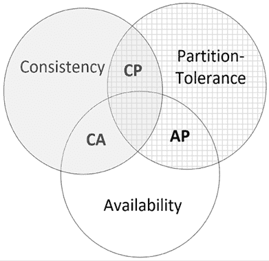
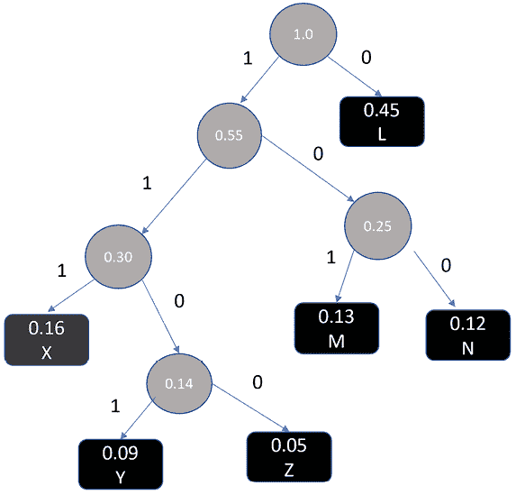

# 第十三章：数据处理的算法策略

> 数据是数字经济的新石油。
> 
> —《连线杂志》

在这个数据驱动的时代，从大量数据集中提取有意义的信息的能力正在从根本上塑造我们的决策过程。我们在本书中探讨的算法在很大程度上依赖于数据。因此，开发旨在创建强大且高效的数据存储基础设施的工具、方法和战略计划变得尤为重要。

本章的重点是以数据为中心的算法，用于高效地管理数据。这些算法的核心操作包括高效存储和数据压缩。通过运用这些方法，以数据为中心的架构能够实现数据管理和高效的资源利用。通过本章的学习，你应该能够很好地理解设计和实施各种数据中心算法时涉及的概念和权衡。

本章讨论以下概念：

+   数据算法简介

+   数据分类

+   数据存储算法

+   数据压缩算法

让我们首先介绍基本概念。

# 数据算法简介

数据算法专门用于管理和优化数据存储。除了存储，它们还处理数据压缩等任务，确保高效的存储空间利用率，并简化快速的数据检索，这在许多应用中至关重要。

理解数据算法，特别是在分布式系统中，关键的一点是 CAP 定理。它的重要性在于：该定理阐明了在一致性、可用性和分区容忍性之间的平衡。在任何分布式系统中，同时实现这三者中的两项保障是我们所能期望的。理解 CAP 的微妙之处有助于识别现代数据算法中的挑战和设计决策。

在数据治理的范围内，这些算法是非常宝贵的。它们确保分布式系统中所有节点的数据一致性，从而保证数据的完整性。它们还确保数据的高效可用性，并管理数据分区容忍度，从而增强系统的弹性和安全性。

## CAP 定理在数据算法中的重要性

CAP 定理不仅设定了理论上的极限，它在现实场景中也具有实际的意义，尤其是在数据被操作、存储和检索的过程中。例如，假设一个算法必须从分布式系统中检索数据。关于一致性、可用性和分区容忍性的选择会直接影响该算法的效率和可靠性。如果一个系统优先考虑可用性，数据可能很容易被检索，但可能不是最新的版本。相反，优先考虑一致性的系统可能会延迟数据检索，以确保访问的始终是最新的数据。

我们在这里讨论的数据中心算法在许多方面都受到这些 CAP 约束的影响。通过将我们对 CAP 定理的理解与数据算法相结合，我们可以在处理数据挑战时做出更明智的决策。

## 分布式环境中的存储

单节点架构适用于较小的数据集。然而，随着数据集规模的激增，分布式环境存储已成为大规模问题的标准解决方案。在此类环境中，确定合适的数据存储策略取决于多个因素，包括数据的性质和预期的使用模式。

CAP 定理为开发这些存储策略提供了一个基础性原理，帮助我们应对与管理庞大数据集相关的挑战。

## 连接 CAP 定理与数据压缩

起初，CAP 定理与数据压缩似乎没有什么重叠。但考虑到实际的影响，如果我们在系统中优先考虑一致性（按照 CAP 的考虑），那么我们的数据压缩方法需要确保数据在所有节点间始终保持一致的压缩状态。在一个以可用性为优先的系统中，即便这可能导致轻微的不一致，压缩方法可能会为了速度进行优化。这种相互作用表明，我们在 CAP 方面的选择甚至会影响到数据的压缩和检索方式，展示了定理在数据中心算法中的广泛影响。

# 展示 CAP 定理

1998 年，Eric Brewer 提出了一个定理，后来被称为 CAP 定理。它突出了设计分布式服务系统中涉及的各种权衡。为了理解 CAP 定理，首先，我们需要定义分布式服务系统的以下三个特性：一致性、可用性和分区容忍性。CAP 实际上是由这三种特性组成的首字母缩写：

+   **一致性**（或简称**C**）：分布式服务由多个节点组成。任何一个节点都可以用来读取、写入或更新数据仓库中的记录。一致性保证了在某个特定时间 t1，无论我们使用哪个节点来读取数据，都能得到相同的结果。每次读取操作要么返回最新的数据（在分布式数据仓库中保持一致），要么返回错误信息。

+   **可用性**（或简称**A**）：在分布式系统中，可用性意味着系统整体始终对请求作出响应。这确保了用户每次查询系统时都会得到回复，即使这可能不是最新的数据。因此，重点不在于每个节点是否都保持最新，而在于整个系统的响应能力。它保证了即使系统的某些部分包含过时的信息，用户的请求也永远不会没有回复。

+   **分区容忍性**（简称**P**）：在分布式系统中，多个节点通过通信网络连接。分区容忍性保证在发生部分节点（一个或多个）之间的通信故障时，系统仍然能够正常运行。需要注意的是，为了保证分区容忍性，数据需要在足够数量的节点之间进行复制。

利用这三个特性，CAP 定理仔细总结了分布式服务系统架构和设计中涉及的权衡。具体来说，CAP 定理指出，在分布式存储系统中，我们只能拥有以下三个特性中的两个：一致性或**C**，可用性或**A**，分区容忍性或**P**。

这一点在下面的图表中得以展示：



图 13.1：在分布式系统中可视化选择：CAP 定理

分布式数据存储正日益成为现代 IT 基础设施的重要组成部分。设计分布式数据存储时应根据数据的特性和我们要解决的问题的需求来仔细考虑。当应用于分布式数据库时，CAP 定理有助于指导设计和决策过程，确保开发人员和架构师理解在创建分布式数据库系统时涉及的基本权衡和限制。平衡这三个特性对于实现分布式数据库系统的期望性能、可靠性和可扩展性至关重要。当应用于分布式数据库时，CAP 定理有助于指导设计和决策过程，确保开发人员和架构师理解基本的权衡。平衡这三个特性在实现分布式数据库系统的期望性能、可靠性和可扩展性方面至关重要。在 CAP 定理的背景下，我们可以假设有三种类型的分布式存储系统：

+   **CA**系统（实现一致性-可用性）

+   **AP**系统（实现可用性-分区容忍性）

+   **CP**系统（实现一致性-分区容忍性）

将数据存储分类为**CA**、**AP**和**CP**系统有助于我们理解在设计数据存储系统时涉及的各种权衡。

让我们逐一了解它们。

## CA 系统

传统的单节点系统是 CA 系统。在非分布式系统中，分区容忍性不是一个问题，因为无需管理多个节点之间的通信。因此，这些系统可以专注于同时维护一致性和可用性。换句话说，它们是 CA 系统。

一个系统可以通过在单个节点或服务器上存储和处理数据来实现没有分区容错的功能。虽然这种方法可能不适用于处理大规模数据集或高速数据流，但对于较小的数据规模或对性能要求不高的应用来说，它是有效的。

传统的单节点数据库，如 Oracle 或 MySQL，是 CA 系统的典型例子。这些系统非常适合数据量和数据流速相对较低且分区容错不是关键因素的使用场景。例子包括中小型企业、学术项目或具有有限用户和数据源的应用。

## AP 系统

AP 系统是设计用来优先考虑可用性和分区容错的分布式存储系统，即使需要牺牲一致性。这些高响应系统可以在必要时牺牲一致性，以适应高速数据流。在这样做的过程中，这些分布式存储系统能够立即处理用户请求，即使这会导致不同节点间暂时提供稍微过时或不一致的数据。

当 AP 系统牺牲一致性时，用户可能会偶尔获取稍微过时的信息。在某些情况下，这种临时的不一致性是可以接受的，因为能够快速处理用户请求并保持高可用性被认为比严格的数据一致性更为关键。

典型的 AP 系统用于实时监控系统，如传感器网络。高速度的分布式数据库，如 Cassandra，是 AP 系统的典型例子。

在需要高可用性、响应性和分区容错的场景中，推荐使用 AP 系统来实现分布式数据存储。

例如，如果加拿大交通运输部希望通过在渥太华高速公路上不同位置安装的传感器网络来监控交通状况，那么 AP 系统将是首选。在这种情况下，优先考虑实时数据处理和可用性对于确保交通监控能够有效运行至关重要，即使存在网络分区或临时的不一致性。因此，尽管可能会牺牲一致性，AP 系统仍然是这种应用的推荐选择。

## CP 系统

CP 系统优先考虑一致性和分区容错，确保分布式存储系统在读取过程中获取值之前保证一致性。这些系统专门设计用于维护数据一致性，并在存在网络分区的情况下继续有效运行。

CP 系统的理想数据类型是那些需要严格一致性和准确性的数据，即使这意味着牺牲系统的即时可用性。例子包括财务交易、库存管理和关键业务操作数据。在这些情况下，确保数据在分布式环境中的一致性和准确性至关重要。

CP 系统的典型使用案例是我们想要以 JSON 格式存储文档文件。像 MongoDB 这样的文档数据存储是为分布式环境中的一致性而调整的 CP 系统。

通过了解不同类型的分布式存储系统，我们现在可以继续探索数据压缩算法。

# 解码数据压缩算法

数据压缩是用于数据存储的重要方法。它不仅提高了存储效率，减少了数据传输时间，而且在成本节省和性能提升方面具有重要意义，特别是在大数据和云计算领域。本节介绍了详细的数据压缩技术，特别关注无损算法哈夫曼和 LZ77，以及它们对现代压缩方案（如 Gzip、LZO 和 Snappy）的影响。

## 无损压缩技术

无损压缩围绕着消除数据中的冗余，以减少存储需求，同时确保完美的可逆性。哈夫曼和 LZ77 是两个基础算法，它们在这一领域产生了深远影响。

哈夫曼编码侧重于可变长度编码，使用较少的位表示频繁出现的字符，而 LZ77 是一种基于字典的算法，利用重复的数据序列并用较短的引用表示它们。让我们一一来看。

### 哈夫曼编码：实现可变长度编码

哈夫曼编码，一种熵编码形式，广泛应用于无损数据压缩。哈夫曼编码的基本原理是为频繁出现的字符分配较短的编码，从而减少整体数据大小。

该算法使用一种特定类型的二叉树，称为哈夫曼树，其中每个叶子节点对应一个数据元素。元素出现的频率决定了在树中的位置：频繁出现的元素更靠近树根。这种策略确保最常见的元素具有最短的编码。

#### 一个简单的示例

假设我们有包含字母**A**、**B**和**C**的数据，其频率分别为`5`、`9`和`12`。在哈夫曼编码中：

+   **C**，最常见的，可能会得到像`0`这样的短编码。

+   **B**，下一个最常见的，可能会得到`10`。

+   **A**，最不常见的，可能会得到`11`。

为了全面理解，我们来通过一个 Python 示例。

#### 在 Python 中实现哈夫曼编码

我们通过为每个字符创建一个节点开始，其中节点包含字符及其频率。然后，将这些节点添加到优先队列中，频率最低的元素具有最高优先级。为此，我们创建一个`Node`类来表示霍夫曼树中的每个字符。每个`Node`对象包含字符、其频率，以及指向其左子节点和右子节点的指针。`__lt__`方法用于根据频率比较两个`Node`对象。

```py
import functools
@functools.total_ordering
class Node:
    def __init__(self, char, freq):
        self.char = char
        self.freq = freq
        self.left = None
        self.right = None
    def __lt__(self, other):
        return self.freq < other.freq
    def __eq__(self, other):
        return self.freq == other.freq 
```

接下来，我们构建霍夫曼树。构建霍夫曼树涉及在优先队列中进行一系列的插入和删除操作，通常实现为二叉堆。为了构建霍夫曼树，我们创建一个`Node`对象的最小堆。最小堆是一种特殊的树状结构，满足一个简单而重要的条件：父节点的值小于或等于其子节点的值。这个属性确保最小的元素始终位于根节点，使得优先操作更加高效。我们反复弹出两个频率最低的节点，将它们合并，并将合并后的节点推回堆中。这个过程持续进行，直到只剩下一个节点，它成为霍夫曼树的根节点。树的构建通过以下定义的`build_tree`函数来实现：

```py
import heapq
def build_tree(frequencies):
    heap = [Node(char, freq) for char, freq in frequencies.items()]
    heapq.heapify(heap)
    while len(heap) > 1:
        node1 = heapq.heappop(heap)
        node2 = heapq.heappop(heap)
        merged = Node(None, node1.freq + node2.freq)
        merged.left = node1
        merged.right = node2
        heapq.heappush(heap, merged)
    return heap[0]  # the root node 
```

一旦霍夫曼树构建完成，我们可以通过遍历树来生成霍夫曼编码。从根节点开始，每走一条左分支就附加一个`0`，每走一条右分支就附加一个`1`。当我们到达一个叶子节点时，沿着从根到该叶子节点路径上累积的`0`和`1`序列就是该叶子节点对应字符的霍夫曼编码。这个功能通过如下定义的`generate_codes`函数来实现。

```py
def generate_codes(node, code='', codes=None):
    if codes is None:
        codes = {}
    if node is None:
        return {}
    if node.char is not None:
        codes[node.char] = code
        return codes
    generate_codes(node.left, code + '0', codes)
    generate_codes(node.right, code + '1', codes)
    return codes 
```

现在让我们使用霍夫曼树。我们首先定义用于霍夫曼编码的数据。

```py
data = {
    'L': 0.45,
    'M': 0.13,
    'N': 0.12,
    'X': 0.16,
    'Y': 0.09,
    'Z': 0.05
} 
```

然后，我们打印出每个字符的霍夫曼编码。

```py
# Build the Huffman tree and generate the Huffman codes
root = build_tree(data)
codes = generate_codes(root)
# Print the root of the Huffman tree
print(f'Root of the Huffman tree: {root}')
# Print out the Huffman codes
for char, code in codes.items():
    print(f'{char}: {code}') 
```

```py
Root of the Huffman tree: <__main__.Node object at 0x7a537d66d240>
L: 0
M: 101
N: 100
X: 111
Y: 1101
Z: 1100 
```

现在，我们可以推断出以下内容：

+   **固定长度编码**：此表的固定长度编码为`3`。这是因为，对于六个字符，固定长度的二进制表示需要最多三个位（2³ = 8 种可能的组合，可以涵盖我们的 6 个字符）。

+   **可变长度编码**：此表的可变长度编码为

    `45(1) + .13(3) + .12(3) + .16(3) + .09(4) + .05(4) = 2.24.`

以下图示显示了从前述示例创建的霍夫曼树：



图 13.2：霍夫曼树：可视化压缩过程

请注意，霍夫曼编码是将数据转换为霍夫曼树，从而实现压缩。解码或解压缩则将数据恢复为原始格式。

在了解了霍夫曼编码后，我们接下来将探索另一种基于字典的无损压缩技术。

接下来，我们讨论基于字典的压缩。

### 理解基于字典的压缩 LZ77

LZ77 属于一种称为字典编码器的压缩算法家族。与霍夫曼编码通过维持静态的代码词典不同，LZ77 会动态构建一个输入数据中已出现的子字符串字典。这个字典不会单独存储，而是通过一个滑动窗口隐式引用已经编码的输入数据，从而提供一种优雅且高效的表示重复序列的方法。

LZ77 算法的原理是将重复的数据替换为指向单一副本的引用。它保持一个“滑动窗口”，用于处理最近的数据。当它遇到已经出现过的子字符串时，它不会存储实际的子字符串；而是存储一对值——指向重复子字符串开始位置的距离，以及重复子字符串的长度。

#### 通过一个示例来理解

想象一下，你正在阅读以下字符串：

`data_string = "ABABCABABD"`

当你从左到右处理这个字符串时，当遇到子字符串 "`CABAB`" 时，你会注意到 "`ABAB`" 之前已经出现过，紧接着最初的 "`AB`" 后面。LZ77 利用了这种重复现象。

LZ77 不会再写 "`ABAB`"，它会建议：“嘿，回溯两个字符并复制接下来的两个字符！”从技术角度讲，这是指回溯两个字符并复制两个字符。

所以，使用 LZ77 压缩我们的 `data_string`，它可能看起来像这样：

`ABABC<2,2>D`

这里，`<2,2>` 是 LZ77 的符号表示，意味着“回溯两个字符并复制接下来的两个字符”。

#### 与霍夫曼的比较

为了更好地理解 LZ77 和霍夫曼之间的强大功能和差异，使用相同的数据是有帮助的。让我们继续使用 `data_string = "ABABCABABD"`。

虽然 LZ77 识别数据中的重复序列并加以引用，但霍夫曼编码更多的是将频繁出现的字符表示为更短的编码。

例如，如果你使用霍夫曼算法压缩我们的 `data_string`，你可能会看到一些字符，比如 '`A`' 和 '`B`'，它们出现频率较高，会用比较少出现的 '`C`' 和 '`D`' 更短的二进制代码表示。

这个比较展示了，尽管霍夫曼编码基于频率来表示字符，但 LZ77 则是通过识别和引用模式来进行压缩。根据数据的类型和结构，某一种可能比另一种更高效。

### 高级无损压缩格式

由霍夫曼和 LZ77 提出的原则催生了高级压缩格式。本章将探讨三种高级格式。

1.  LZO

1.  Snappy

1.  gzip

让我们一一来看它们。

#### LZO 压缩：优先考虑速度

LZO 是一种无损数据压缩算法，强调快速的压缩和解压缩。它将重复的数据替换为指向单一副本的引用。在经过这一次 LZ77 压缩后，数据会被传递到霍夫曼编码阶段。

尽管其压缩比可能不是最高的，但其处理速度明显快于许多其他算法。这使得 LZO 成为在实时数据处理和流媒体应用等需要快速数据访问的场景中非常理想的选择。

#### Snappy 压缩：寻求平衡

Snappy 是另一个由 Google 最初开发的快速压缩和解压缩库。Snappy 的主要关注点是实现高速和合理的压缩，但不一定是最大压缩比。

Snappy 的压缩方法基于 LZ77，但侧重于速度，并且没有像霍夫曼编码那样的额外熵编码步骤。相反，Snappy 使用了一种更简单的编码算法，确保压缩和解压缩过程的快速执行。该算法采用基于复制的策略，寻找数据中重复的序列，并将其编码为长度和对先前位置的引用。

应该注意，由于这种速度上的权衡，Snappy 的数据压缩效率不如使用霍夫曼编码或其他形式的熵编码的算法。然而，在速度比压缩比更为关键的使用场景中，Snappy 可以是一个非常有效的选择。

#### GZIP 压缩：最大化存储效率

`GZIP` 是一种文件格式和软件应用程序，用于文件压缩和解压缩。`GZIP` 数据格式结合了 LZ77 算法和霍夫曼编码。

# 实际示例：AWS 中的数据管理：聚焦于 CAP 定理和压缩算法

让我们考虑一个全球电子商务平台的例子，该平台运行在全球多个云服务器上。这个平台每秒处理成千上万的交易，来自这些交易的数据需要高效地存储和处理。我们将看到 CAP 定理和压缩算法如何引导平台数据管理系统的设计。

## 1\. 应用 CAP 定理

CAP 定理指出，分布式数据存储不能同时提供以下三种保证中的两种：一致性、可用性和分区容错性。

在我们的电子商务平台场景中，可用性和分区容错性可能会被优先考虑。高可用性确保即使一些服务器发生故障，系统仍能继续处理交易。分区容错性意味着即使网络故障导致某些服务器被隔离，系统仍然可以继续运行。

虽然这意味着系统可能无法始终提供强一致性（每次读取都获得最新的写入），但它可以使用最终一致性（更新通过系统传播，最终所有副本显示相同的值）来确保良好的用户体验。在实践中，轻微的不一致是可以接受的，例如，当用户的购物车在所有设备上更新需要几秒钟时。

在 AWS 生态系统中，我们有多种数据存储服务可供选择，可以根据 CAP 定理定义的需求进行选择。对于我们的电商平台，我们更倾向于选择可用性和分区容忍度，而非一致性。亚马逊 DynamoDB 作为一款键值型 NoSQL 数据库，十分契合这一需求。它内建支持多区域复制和自动分片，确保高可用性和分区容忍度。

为了保持一致性，DynamoDB 提供了“最终一致性”和“强一致性”选项。在我们的案例中，我们会选择最终一致性，以优先考虑可用性和性能。

## 2\. 使用压缩算法

平台会生成大量的数据，包括交易详情、用户行为日志和产品信息。存储和传输这些数据可能会既昂贵又耗时。

在这里，像 gzip、Snappy 或 LZO 这样的压缩算法可以提供帮助。例如，平台可能会使用 gzip 来压缩那些被归档存储的交易日志。考虑到 gzip 通常能将文本文件压缩到原始大小的约 30%，这可以显著降低存储成本。

另一方面，对于用户行为数据的实时分析，平台可能会使用 Snappy 或 LZO。虽然这些算法的压缩比可能不如 gzip，但它们更快速，能够让分析系统更快地处理数据。

AWS 提供了多种实现压缩的方法，具体取决于数据的类型和使用场景。对于长时间存储的交易日志，我们可以使用亚马逊 S3（简单存储服务）结合 gzip 压缩。S3 支持在上传文件时自动进行 gzip 压缩，这可以显著降低存储成本。对于用户行为数据的实时分析，我们可以使用亚马逊 Kinesis 数据流结合 Snappy 或 LZO 压缩。Kinesis 可以捕获、处理并存储数据流以进行实时分析，并支持压缩以处理大容量数据。

## 3\. 量化效益

其效益的量化方式与前述类似。

让我们通过一个实际的例子来演示潜在的成本节省。假设我们的平台每天生成 1 TB 的交易日志。通过利用 gzip 压缩与 S3，我们可能将存储需求缩小到大约 300 GB。截至 2023 年 8 月，S3 对前 50 TB 每月收费约为每 GB $0.023。算一下，这每月可以节省约 $485，年节省约 $5,820，仅从日志存储方面来看。值得注意的是，引用的 AWS 定价仅供参考，具体数据可能因 2023 年 8 月而异，使用时请务必查看最新的定价。

使用 Snappy 或 LZO 与 Kinesis 进行实时分析可以提高数据处理速度。这可能会导致更及时和个性化的用户推荐，进而有可能增加销售额。财务收益可以根据通过提高推荐速度所带来的转化率提升来计算。

最后，通过使用 DynamoDB 并遵循 CAP 定理，我们可以确保即使在发生网络分区或单个服务器故障的情况下，用户仍能享受到流畅的购物体验。这一选择的价值可以体现在平台的用户留存率和整体客户满意度上。

# 总结

在本章中，我们探讨了以数据为中心的算法设计，重点关注三个关键组成部分：数据存储、数据治理和数据压缩。我们研究了与数据治理相关的各种问题。我们分析了数据的不同属性如何影响数据存储的架构决策。我们探讨了不同的数据压缩算法，每种算法在效率和性能方面提供了特定的优势。在下一章中，我们将研究密码学算法。我们将了解如何利用这些算法的力量来确保交换和存储的信息安全。

# 在 Discord 上了解更多

要加入本书的 Discord 社区——在这里你可以分享反馈、向作者提问，并了解新版本的发布——请扫描下面的二维码：

[`packt.link/WHLel`](https://packt.link/WHLel)


