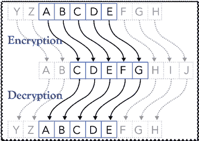
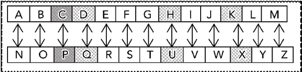
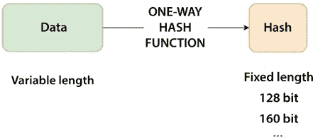
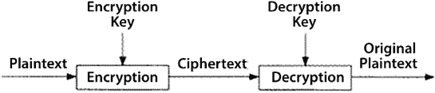
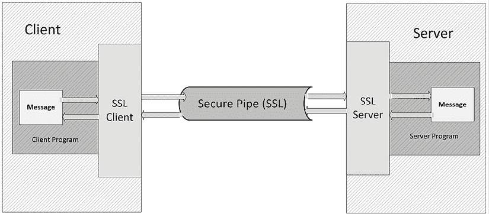
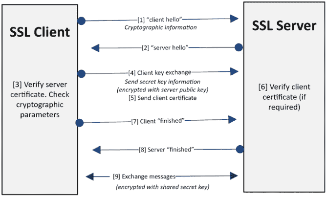
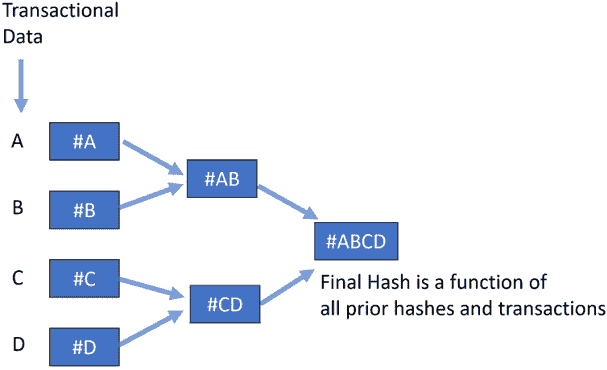
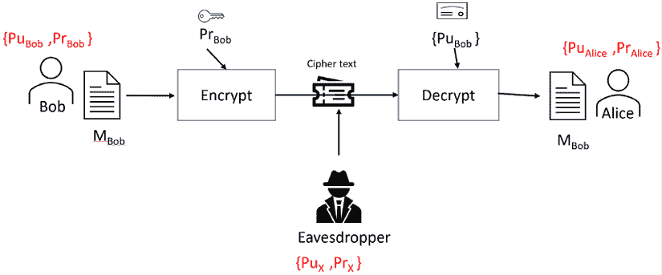

# 第十四章：密码学

> 我把我未写的诗隐藏在面部的密码中！
> 
> —乔治·艾略特

本章将向你介绍与密码学相关的算法。我们将首先介绍背景知识，然后讨论对称加密算法。接着，我们将解释**消息摘要 5**（**MD5**）算法和**安全哈希算法**（**SHA**），并展示对称算法的局限性和弱点。然后，我们将讨论非对称加密算法，以及它们如何用于创建数字证书。最后，我们将呈现一个实际示例，总结所有这些技术。

到本章结束时，你将对与密码学相关的各种问题有一个基本的理解。

本章讨论了以下主题：

+   密码学简介

+   理解密码学技术的种类

+   示例 – 部署机器学习模型时的安全问题

让我们从基础概念开始。

# 密码学简介

保护秘密的技术已经存在了几个世纪。最早尝试保护和隐藏数据以防敌人窃取可以追溯到古埃及在纪念碑上发现的古老铭文，其中使用了一种只有少数可信人员才知道的特殊字母。这种早期的安全形式叫做“模糊性”，至今仍以不同形式使用。为了使这种方法有效，保护秘密是至关重要的，在上述例子中就是保护字母的秘密含义。后来，在第一次世界大战和第二次世界大战中，找到可靠的保护重要信息的方法变得尤为重要。进入 20 世纪后期，随着电子技术和计算机的出现，发展出了一些复杂的算法来保护数据，这促成了密码学这一新领域的出现。本章讨论了密码学的算法方面。密码学算法的一种用途是允许两个过程或用户之间进行安全的数据交换。密码算法通过使用数学函数来确保既定的安全目标。

首先，我们将看一下基础设施中“最弱链条”的重要性。

## 理解最弱链条的重要性

有时候，在设计数字基础设施的安全性时，我们过于强调单个实体的安全，而没有足够关注端到端的安全性。这可能导致我们忽视系统中的某些漏洞和脆弱点，后来这些漏洞可能被黑客利用，从而访问敏感数据。需要记住的重要一点是，一个数字基础设施整体的强度取决于它最薄弱的环节。对于黑客来说，这个最弱的环节可能为他们提供进入数字基础设施的后门，访问敏感数据。超过某个点之后，如果没有关闭所有后门，再加固前门就没有太大的意义。

随着用于保护数字基础设施的算法和技术变得越来越复杂，攻击者也不断升级他们的技术。我们始终需要记住，攻击者攻破数字基础设施的最简单方法之一，就是通过利用这些漏洞来访问敏感信息。

2014 年，对加拿大一个联邦研究机构——**国家研究委员会**（**NRC**）的网络攻击估计造成了数亿美元的损失。攻击者能够窃取数十年的研究数据和知识产权材料。他们利用了 Web 服务器上使用的 Apache 软件中的一个漏洞，成功获得了敏感数据。

本章将重点讲解各种加密算法的漏洞。

让我们首先来看一下使用的基本术语。

## 基本术语

让我们来看一下与密码学相关的基本术语：

+   **密码**：执行特定密码学功能的算法。

+   **明文**：原始数据，可以是文本文件、视频、位图或数字化的语音。在本章中，我们将明文表示为 *P*。

+   **密文**：在对明文应用密码学后得到的加密文本。在本章中，我们将其表示为 *C*。

+   **密码套件**：一组或一套密码学软件组件。当两个独立的节点希望使用密码学交换信息时，他们首先需要就密码套件达成一致。这一点对于确保他们使用完全相同的密码学功能实现非常重要。

+   **加密**：将明文 *P* 转换为密文 *C* 的过程称为加密。从数学上讲，它表示为 *encrypt(P) = C*。

+   **解密**：将密文转换回明文的过程。数学上，它表示为 *decrypt(C) = P*。

+   **密码分析**：分析密码算法强度的方法。分析者试图在没有密钥的情况下恢复明文。

+   **个人身份信息**（**PII**）：PII 是指那些可以单独或与其他相关数据一起用于追溯个人身份的信息。举例来说，保护性信息如社会安全号码、出生日期或母亲的娘家姓。

让我们首先了解系统的安全需求。

## 理解安全需求

了解一个系统的确切安全需求非常重要。理解这一点将帮助我们使用正确的密码学技术，并发现系统中的潜在漏洞。

更好地理解系统安全需求的一种方法是通过回答以下四个问题：

+   哪些个人或流程需要受到保护？

+   我们保护这些个人和流程免受哪些威胁？

+   我们应该在哪些地方进行保护？

+   我们为什么要保护这些信息？

让我们以 AWS 云中的**虚拟私有云**（**VPC**）为例。VPC 允许我们创建一个逻辑隔离的网络，在其中添加虚拟机等资源。为了理解 VPC 的安全要求，首先需要通过回答以下四个问题来识别身份：

+   有多少人计划使用这个系统？

+   需要保护的是什么样的信息？

+   我们是只保护 VPC，还是需要将消息加密并传递给系统，再与 VPC 进行通信？

+   数据的安全分类是什么？潜在的风险有哪些？为什么有人会有动机尝试攻击系统？

这些问题的大多数答案将通过执行以下三个步骤来获得：

1.  识别实体。

1.  建立安全目标。

1.  理解数据的敏感性。

让我们逐一看看这些步骤。

### 第 1 步：识别实体

实体可以定义为个人、过程或信息系统中的资源。我们首先需要识别在运行时用户、资源和过程如何存在。然后，我们将量化这些识别出的实体的安全需求，既可以单独考虑，也可以作为一个整体来考虑。

一旦我们更好地理解了这些要求，就可以建立我们数字系统的安全目标。

### 第 2 步：建立安全目标

设计安全系统的目标是保护信息免受盗窃、破坏或攻击。通常使用加密算法来实现一个或多个安全目标：

+   **认证**：认证是我们确认用户、设备或系统身份的机制，确保他们确实是他们所声称的身份。

+   **授权**：授权是指给予用户访问特定资源或功能的权限的过程。

+   **机密性**：需要保护的数据被称为**敏感数据**。机密性是指将敏感数据限制给授权用户的概念。为了在数据传输或存储过程中保护敏感数据的机密性，需要将数据加密，使其只有授权用户才能读取。这个过程是通过使用加密算法来实现的，我们将在本章稍后讨论这些算法。

+   **完整性**：完整性是指在数据传输或存储过程中，确保数据未被篡改的过程。例如，**TCP**/**IP**（**传输控制协议**/**互联网协议**）使用校验和或**循环冗余检查**（**CRC**）算法来验证数据完整性。

+   **不可否认性**：不可否认性是指能够提供不可伪造且无可辩驳的证据，证明一条消息已被发送或接收。这些证据可以在之后用来证明数据的接收。

### 第 3 步：理解数据的敏感性

理解数据的机密性质非常重要。数据由监管机构如政府、机构或组织根据其泄露后的后果的严重程度进行分类。数据的分类有助于我们选择正确的加密算法。根据数据所包含信息的敏感性，数据的分类方法不止一种。让我们来看看数据分类的典型方式：

+   **公开数据或未分类数据**：任何可供公众消费的数据，例如公司网站或政府信息门户网站上的信息。

+   **内部数据或机密数据**：虽然不供公众消费，但将这些数据公开可能不会产生严重后果。例如，如果一个员工抱怨经理的电子邮件被公开，可能会让公司感到尴尬，但这可能不会带来严重后果。

+   **敏感数据或机密数据**：不应公开的数据显示，公开这些数据可能会对个人或组织造成严重后果。例如，泄露未来 iPhone 的细节可能会损害苹果的商业目标，并且可能给竞争对手，如三星，带来优势。

+   **高度敏感数据**：也称为**绝密数据**。如果这些信息被泄露，可能会对组织造成极大损害。高度敏感数据的例子包括专有研究、战略商业计划或内部财务数据。

绝密数据通过多层安全保护，需要特别的权限才能访问。

通常，更复杂的安全设计比简单的算法更慢。重要的是在安全性和系统性能之间找到正确的平衡。

## 理解密码的基本设计

设计密码是制定一个算法，将敏感数据进行混淆，以便恶意进程或未经授权的用户无法访问。尽管随着时间的推移，密码变得越来越复杂，但密码所基于的基本原理依然保持不变。

让我们从一些相对简单的密码开始，帮助我们理解设计加密算法时使用的基本原理。

### 介绍替代密码

替代密码已经使用了几百年，并且以不同形式出现。顾名思义，替代密码基于一个简单的概念——将明文中的字符按照预定的、组织好的方式替换为其他字符。

让我们看看这个过程的具体步骤：

1.  首先，我们将每个字符映射到一个替代字符。

1.  然后，我们通过使用替代映射将明文中的每个字符替换为密码文本中的另一个字符，从而对明文进行编码和转换成密码文本。

1.  为了解码，我们通过使用替代映射将明文还原回来。

以下是基于替换的密码示例：

+   凯撒密码

+   旋转 13

让我们更详细地研究一下它们。

#### 凯撒密码

凯撒密码基于替换映射。替换映射通过应用一个保密的简单公式，以确定性方式改变实际字符串。

替换映射是通过将每个字符替换为它右边第三个字符来创建的。这个映射在下图中进行了说明：



图 13.1：凯撒密码的替换映射

让我们看看如何用 Python 实现凯撒密码：

```py
rotation = 3
P = 'CALM'; C=''
for letter in P:
    C = C+ (chr(ord(letter) + rotation)) 
```

我们可以看到我们对明文 `CALM` 应用了凯撒密码。

让我们在加密明文后打印出密文：

```py
print(C) 
```

```py
FDOP 
```

据说凯撒密码曾被尤利乌斯·凯撒用来与他的顾问通信。

凯撒密码是一种简单的密码，且易于实现。缺点是它并不难破解，因为黑客可以简单地通过遍历字母表的所有可能位移（共 2626 种）来查看是否出现任何连贯的消息。鉴于现代计算机的处理能力，这个组合数是相对较小的。因此，它不应被用来保护高度敏感的数据。

#### 旋转 13 (ROT13)

ROT13 是凯撒密码的一种特殊情况，其中替换映射是通过将每个字符替换为它右边第 13 个字符来创建的。下图演示了这一点：



图 14.2：ROT13 的工作原理

这意味着如果 `ROT13()` 是实现 ROT13 的函数，那么以下内容适用：

```py
rotation = 13
P = 'CALM'; C=''
for letter in P:
    C = C+ (chr(ord(letter) + rotation)) 
```

现在，让我们打印 `C` 的编码值：

```py
print(c) 
```

```py
PNYZ 
```

ROT13 实际上并不是用来实现数据保密的。它更多是用来掩盖文本，例如隐藏可能令人反感的文本。它也可以用来避免泄露谜题的答案，以及其他类似的使用场景。

### 替换密码的密码分析

替换密码易于实现和理解。不幸的是，它们也容易破解。对替换密码的简单密码分析表明，如果我们使用英语字母表，那么破解密码所需做的就是确定我们旋转了多少。我们可以一一尝试英语字母表中的每个字母，直到我们能够解密文本为止。这意味着需要大约 25 次尝试来恢复明文。

现在，让我们看一下另一种简单的密码——换位密码。

### 理解换位密码

在换位密码中，明文的字符通过换位加密。换位是一种加密方法，我们通过使用确定性逻辑将字符的位置打乱。换位密码将字符写入矩阵中的行，然后按列读取作为输出。让我们来看一个例子。

让我们来看一下 `Ottawa Rocks` 的明文（*P*）。

首先，让我们对 *P* 进行编码。为此，我们将使用一个 3 x 4 的矩阵，并水平书写明文：

| O | t | t | a |
| --- | --- | --- | --- |
| w | a | R | o |
| c | k | s |  |

`read` 过程将会垂直读取字符串，这将生成密文——`OwctaktRsao`。密钥将是 {1,2,3,4}，表示列的读取顺序。使用不同的密钥加密，比如 {2,4,3,1}，将会得到不同的密文，此时为 `takaotRsOwc`。

德国人在第一次世界大战中使用了一种名为 ADFGVX 的密码，这种密码结合了换位和替代密码。几年后，这个密码被乔治·潘文破解。

所以，这些是一些常见的密码。通常，密码使用密钥来加密明文。现在，让我们看看一些目前使用的密码学技术。密码学通过加密和解密过程来保护信息，这在下一节中会进一步讨论。

# 理解密码学技术的类型

不同类型的密码学技术使用不同的算法，并在不同的情况下应用。由于不同的情况和使用场景对安全性有不同的需求，且这些需求依据业务要求和数据分类的不同而有所差异，因此选择合适的技术对于一个设计良好的架构至关重要。

广义上，密码学技术可以分为以下三种类型：

+   哈希

+   对称

+   非对称

让我们逐一来看。

## 使用密码学哈希函数

密码学哈希函数是一种数学算法，可以用来创建消息的唯一指纹。它从明文生成一个输出，称为哈希。输出的大小通常是固定的，但某些特定算法的输出大小可能会有所不同。

从数学角度来看，这样表示：

*C*[1] *= hashFunction(P*[1]*)*

这可以解释为：

+   *P*[1] 是表示输入数据的明文

+   *C*[1] 是由密码学哈希函数生成的固定长度哈希

这在以下图表中有所显示。通过单向哈希函数，变长的数据被转换为固定长度的哈希：



图 14.3：单向哈希函数

哈希函数是一种数学算法，它将任意数量的数据转换为固定大小的字节串。它在确保数据的完整性和真实性方面起着至关重要的作用。以下是定义密码学哈希函数的关键特征：

+   **确定性**：哈希函数是确定性的，这意味着相同的输入（或“明文”）总是会产生相同的输出（或“哈希”）。无论你对某一数据进行多少次哈希，结果将始终保持一致。

+   **唯一性**：理想情况下，不同的输入应始终产生唯一的哈希输出。如果两个不同的输入产生相同的哈希，这被称为碰撞。优质的哈希函数旨在尽量减少碰撞的可能性。

+   **固定长度**：哈希函数的输出具有固定的长度，无论输入数据的大小如何。无论你是在哈希一个字符还是整个小说，结果哈希的大小都将相同，且特定于所使用的哈希算法（例如，MD5 为 128 位，SHA-256 为 256 位）。

+   **对输入变化敏感**：即使在明文中进行微小的修改，也会导致结果哈希值发生显著且不可预测的变化。这一特性确保了无法推导出原始输入，也无法找到一个不同的输入产生相同的哈希，从而增强了哈希函数的安全性。其效果是，即使在大文档中改变一个字母，也会导致哈希值看起来完全不同。

+   **单向函数**：哈希函数是单向的，意味着计算上不可行地逆转这个过程，从哈希（C[1]）生成原始明文（P[1]）。这确保了即使未经授权的方获得了哈希值，他们也无法用它来确定原始数据。

如果我们遇到每个唯一的消息没有唯一的哈希值的情况，我们称之为碰撞。换句话说，碰撞是指哈希算法对两个不同的输入值产生相同的哈希值。对于安全应用程序，碰撞是一种潜在的漏洞，其概率应该非常低。也就是说，如果我们有两个文本，P1 和 P2，在碰撞的情况下，意味着*hashFunction(P*[1]*) = hashFunction(P*[2]*)*。

无论使用何种哈希算法，碰撞是罕见的。否则，哈希就不会有用。然而，对于某些应用程序来说，碰撞是不能容忍的。在这些情况下，我们需要使用一种更复杂的哈希算法，但它生成碰撞的可能性要小得多。

### 实现加密哈希函数

加密哈希函数可以通过使用各种算法来实现。让我们深入了解其中的两种：

1.  MD5

1.  **安全哈希算法** (**SHA**)

#### 理解 MD5 容忍性

MD5 由 Poul-Henning Kamp 于 1994 年开发，用于替代 MD4。它生成一个 128 位的哈希值。生成一个 128 位的哈希值意味着结果哈希值由 128 个二进制数字（位）组成。

这意味着固定长度为 16 字节或 32 个十六进制字符。固定长度确保了无论原始数据的大小如何，哈希值始终为 128 位长。这个固定长度输出的目的是为了创建原始数据的“指纹”或“摘要”。MD5 是一个相对简单的算法，但它容易受到碰撞攻击。在无法容忍碰撞的应用场景中，不应使用 MD5。例如，它可以用于检查从互联网下载文件的完整性。

让我们来看一个示例。为了在 Python 中生成 MD5 哈希值，我们将从使用`hashlib`模块开始，`hashlib`是 Python 标准库的一部分，提供多种不同的加密哈希算法：

```py
import hashlib 
```

接下来，我们定义一个名为`generate_md5_hash()`的工具函数，该函数以`input_string`作为参数。该字符串将被该函数哈希处理：

```py
def generate_md5_hash(input_string):
    # Create a new md5 hash object
    md5_hash = hashlib.md5()
    # Encode the input string to bytes and hash it
    md5_hash.update(input_string.encode())
    # Return the hexadecimal representation of the hash
    return md5_hash.hexdigest() 
```

请注意，`hashlib.md5()`会创建一个新的哈希对象。这个对象使用 MD5 算法，`md5_hash.update(input_string.encode())`会用输入字符串的字节更新哈希对象。该字符串会使用默认的 UTF-8 编码转换为字节。所有数据更新到哈希对象后，我们可以调用`hexdigest()`方法返回摘要的十六进制表示。这就是输入字符串的 MD5 哈希值。

在这里，我们使用`generate_md5_hash()`函数来获取字符串`"Hello, World!"`的 MD5 哈希值，并将结果打印到控制台：

```py
def verify_md5_hash(input_string, correct_hash):
    # Generate md5 hash for the input_string
    computed_hash = generate_md5_hash(input_string)
    # Compare the computed hash with the provided hash
    return computed_hash == correct_hash
# Test
input_string = "Hello, World!"
hash_value = generate_md5_hash(input_string)
print(f"Generated hash: {hash_value}")
correct_hash = hash_value
print(verify_md5_hash(input_string, correct_hash))# This should return True 
```

```py
Generated hash: 65a8e27d8879283831b664bd8b7f0ad4
True 
```

在`verify_md5_hash`函数中，我们接受一个输入字符串和一个已知的正确 MD5 哈希值。我们使用`generate_md5_hash`函数生成输入字符串的 MD5 哈希值，并将其与已知的正确哈希值进行比较。

#### 何时使用 MD5

回顾历史，MD5 的弱点是在 1990 年代末被发现的。尽管存在一些问题，MD5 的使用仍然很普遍。它非常适合用于数据的完整性检查。请注意，MD5 消息摘要并未唯一地将哈希值与其所有者关联，因为 MD5 摘要不是一个签名哈希。MD5 用于证明自哈希计算以来，文件没有被更改。它并不用于证明文件的真实性。现在，我们来看看另一种哈希算法——SHA。

#### 理解安全哈希算法（SHA）

SHA 是由**美国国家标准与技术研究院**（**NIST**）开发的。它被广泛用于验证数据的完整性。在其变种中，SHA-512 是一种流行的哈希函数，Python 的`hashlib`库中包括了它。让我们看看如何使用 Python 创建一个使用 SHA 算法的哈希值。为此，我们首先需要导入`hashlib`库：

```py
import hashlib 
```

然后我们将定义盐值和消息。加盐是将随机字符添加到密码中以进行哈希的做法。它通过使哈希碰撞变得更加困难来增强安全性：

```py
salt = "qIo0foX5"
password = "myPassword" 
```

接下来，我们将把盐值与密码结合，应用加盐过程：

```py
salted_password = salt + password 
```

接下来，我们将使用`sha512`函数来生成盐值密码的哈希值：

```py
sha512_hash = hashlib.sha512()
sha512_hash.update(salted_password.encode())
myHash = sha512_hash.hexdigest() 
```

让我们打印`myHash`：

```py
myHash 
```

```py
2e367911b87b12f73b135b1a4af9fac193a8064d3c0a52e34b3a52a5422beed2b6276eabf9
5abe728f91ba61ef93175e5bac9a643b54967363ffab0b35133563 
```

请注意，当我们使用 SHA 算法时，生成的哈希值为 512 字节。这个特定的大小并非随意，而是算法安全性特征的关键组成部分。更大的哈希大小对应着更多的潜在组合，从而减少了“碰撞”的概率——即两个不同的输入产生相同的哈希输出。碰撞会损害哈希算法的可靠性，而 SHA-512 的 512 字节输出大大降低了这一风险。

### 密码哈希函数的应用

哈希函数用于在复制文件后检查文件的完整性。为此，当文件从源复制到目标（例如从 Web 服务器下载时），相应的哈希也会一并复制。这个原始哈希值*horiginal*作为原文件的指纹。在复制文件后，我们从复制版本的文件生成哈希——即*hcopied*。如果*horiginal = hcopied*——即生成的哈希与原始哈希匹配——这就验证了文件没有发生变化，下载过程中没有丢失任何数据。我们可以使用任何密码哈希函数，如 MD5 或 SHA，来生成哈希值。

### 在 MD5 和 SHA 之间选择

MD5 和 SHA 都是哈希算法。MD5 简单且快速，但它的安全性较差。相比 MD5，SHA 更复杂，提供了更高的安全性。

现在，让我们看看对称加密。

## 使用对称加密

在密码学中，密钥是用来通过选择的算法对明文进行编码的一组数字。在对称加密中，我们使用相同的密钥进行加密和解密。如果用于对称加密的密钥是*K*，那么对于对称加密，以下公式成立：

*EK(P) = C*

在这里，*P*是明文，*C*是密文。

对于解密，我们使用相同的密钥*K*，将其转换回*P*：

*DK(C) = P*

这个过程如图所示：



图 14.4：对称加密

现在，让我们看看如何使用 Python 进行对称加密。

### 编码对称加密

在本节中，我们将探讨如何使用 Python 内置的`hashlib`库处理哈希函数。`hashlib`是 Python 的预装库，提供了多种哈希算法。首先，我们导入`hashlib`库：

```py
import hashlib 
```

我们将使用 SHA-256 算法来创建我们的哈希值。其他算法如 MD5、SHA-1 等也可以使用：

```py
sha256_hash = hashlib.sha256() 
```

让我们为消息`"Ottawa is really cold"`创建一个哈希值：

```py
message = "Ottawa is really cold".encode()
sha256_hash.update(message) 
```

哈希的十六进制表示可以通过以下方式打印出来：

```py
print(sha256_hash.hexdigest()) 
```

```py
b6ee63a201c4505f1f50ff92b7fe9d9e881b57292c00a3244008b76d0e026161 
```

让我们看看对称加密的一些优点。

### 对称加密的优点

以下是对称加密的优点：

+   **简单**：使用对称加密进行加密和解密实现起来更简单。

+   **快速**：对称加密比非对称加密更快。

+   **安全**：美国政府指定的最广泛使用的对称密钥加密系统是**高级加密标准**（**AES**）。当使用像 AES 这样的安全算法时，对称加密至少和非对称加密一样安全。

### 对称加密的问题

当两个用户或进程计划使用对称加密进行通信时，他们需要通过安全通道交换密钥。这就产生了以下两个问题：

+   **密钥保护**：如何保护对称加密密钥

+   **密钥分发**：如何通过安全通道从源头到目的地共享对称加密密钥

现在，让我们来看看非对称加密。

## 非对称加密

在 1970 年代，非对称加密被发明出来，以解决我们在上一节讨论的对称加密的一些弱点。

非对称加密的第一步是生成两个看起来完全不同但在算法上有关联的密钥。一个被选为私钥，*Kpr*，另一个被选为公钥，*Kpu*。选择哪一个密钥作为公钥或私钥是任意的。数学上，我们可以表示为：

*EKpr(P) = C*

这里，*P*是明文，*C*是密文。

我们可以如下解密：

*DKpu(C) = P*

公钥应该是可以自由分发的，而私钥则由密钥对的拥有者保密。例如，在 AWS 中，密钥对用于确保与虚拟实例的连接安全，并管理加密资源。公钥由他人用来加密数据或验证签名，而私钥则由拥有者安全存储，用于解密数据或签署数字内容。通过遵循将私钥保密、公钥可访问的原则，AWS 用户可以确保云环境中的通信安全和数据完整性。公钥和私钥的分离是 AWS 及其他云服务中安全性和信任机制的基石。

基本原理是，如果你用其中一个密钥加密，唯一的解密方法就是使用另一个密钥。例如，如果我们用公钥加密数据，那么我们需要用另一个密钥——即私钥——来解密。

现在，让我们来看一下非对称加密的一个基本协议——**安全套接字层**（**SSL**）/**传输层安全**（**TLS**）握手协议——它负责通过非对称加密在两个节点之间建立连接。

### SSL/TLS 握手算法

SSL 最初是为了为 HTTP 添加安全性而开发的。随着时间的推移，SSL 被一个更高效、更安全的协议所替代，称为 TLS。TLS 握手是 HTTP 如何创建安全通信会话的基础。TLS 握手发生在两个参与实体之间——客户端和服务器。此过程如下图所示：



图 14.5：客户端和服务器之间的安全会话

TLS 握手在参与节点之间建立安全连接。以下是此过程中涉及的步骤：

1.  客户端向服务器发送一个`client hello`消息。该消息还包含以下内容：

    +   使用的 TLS 版本

    +   客户端支持的密码套件列表

    +   压缩算法

    +   一个随机字节串，标识为`byte_client`

1.  服务器向客户端发送一个`server hello`消息。该消息还包含以下内容：

    +   由服务器从客户端提供的列表中选择的密码套件。

    +   会话 ID。

    +   一个随机字节串，标识为`byte_server`。

    +   服务器数字证书，标识为`cert_server`，包含服务器的公钥。

    +   如果服务器需要数字证书来进行客户端身份验证或请求客户端证书，客户端-服务器请求还包括以下内容：

        +   可接受 CA 的区分名称

        +   支持的证书类型

    +   客户端验证`cert_server`。

    +   客户端生成一个随机字节串，标识为`byte_client2`，并使用通过`cert_server`提供的服务器公钥加密。

    +   客户端生成一个随机字节串，并使用其私钥对其进行标识和加密。

    +   服务器验证客户端证书。

    +   客户端向服务器发送一个`finished`消息，该消息使用秘密密钥进行加密。

    +   为了从服务器端确认这一点，服务器向客户端发送一个`finished`消息，该消息使用秘密密钥进行加密。

    +   服务器和客户端现在已经建立了一个安全通道。它们现在可以交换使用共享秘密密钥对称加密的消息。整个方法论如下所示：



图 14.6：客户端和服务器之间的安全会话

现在，让我们讨论如何使用非对称加密来创建**公钥基础设施**（**PKI**），该基础设施旨在满足组织的一个或多个安全目标。

### 公钥基础设施

非对称加密用于实现公钥基础设施（PKI）。PKI 是管理组织加密密钥的最流行且可靠的方法之一。所有参与者信任一个称为**证书授权机构**（**CA**）的中央信任机构。CA 验证个人和组织的身份，然后向他们颁发数字证书（数字证书包含个人或组织的公钥及其身份），验证与该个人或组织关联的公钥确实属于该个人或组织。

它的工作原理是，证书授权机构（CA）要求用户证明其身份。基本验证称为域验证，这可能仅仅是验证域名的所有权。扩展验证（如有需要）涉及更严格的流程，需要根据用户尝试获得的数字证书类型提供身份的物理证明。如果 CA 确认用户确实是他们所声称的人，用户将通过安全通道向 CA 提供他们的公钥。

CA 利用这些信息创建包含用户身份和公钥的数字证书。该证书由 CA 进行数字签名。证书是公开的实体，因为用户可以将其证书展示给任何需要验证其身份的人，而无需通过安全通道传送，因为证书本身不包含任何敏感信息。接收证书的人不需要直接验证用户的身份。那个人只需通过验证 CA 的数字签名来验证证书是否有效，从而确认证书中包含的公钥确实属于证书上所列的个人或组织。

组织的 CA 私钥是 PKI 信任链中的最弱环节。如果冒充者掌握了微软的私钥，例如，他们可以通过冒充 Windows 更新在全球数百万台计算机上安装恶意软件。

### 区块链与加密学

毫无疑问，近年来区块链和加密货币引起了大量关注。区块链被认为是有史以来最安全的技术之一。关于区块链的热潮始于比特币和数字货币。数字货币最早在 1980 年被开发，但随着比特币的出现，它们开始走向主流。比特币的崛起归功于分布式系统的广泛应用。它有两个重要特点，使其成为游戏规则的改变者：

1.  它在设计上是去中心化的。它利用了一种矿工网络和一种被称为区块链的分布式算法。

1.  比特币基于矿工为了将区块添加到区块链而竞争的固有激励机制，通过尝试解答非常复杂的计算难题。获胜的矿工有资格要求不同比特币作为他们努力的奖励。

尽管区块链最初是为比特币开发的，但它已经找到了更广泛的用途和应用。区块链基于分布式共识算法，使用**分布式账本技术**（**DLT**）。它具有以下特点：

+   **去中心化**：它基于分布式而非集中式架构。没有中央机构。区块链系统中的每个节点都参与维护 DLT 的完整性。所有参与节点之间存在共识。在这种分布式架构中，交易存储在组成节点的节点上，形成 P2P 网络。

    注意，“P2P”术语代表“点对点”，这意味着网络中的每个节点或“对等方”直接与其他节点通信，而无需经过中央服务器或机构。

+   **链状形成**：所有区块链的交易都累积在一个区块列表中。当添加多个区块时，它形成链状结构，这也是其名称“区块链”的原因。

+   **不可变性**：数据是安全的，复制的，并以不可变的区块存储。

+   **可靠性**：每笔交易都维护了一个血统或历史。使用密码学技术验证和记录每笔交易。

在底层，区块链交易使用链中每个先前区块的加密哈希。哈希函数用于创建任意数据块的单向指纹。默克尔树或哈希树用于验证存储、处理和在不同参与节点之间传输的数据。它使用 SHA-2 进行哈希。下面显示了一个特定交易的图示：



图 14.7：区块链的默克尔树

*图 13.7*总结了区块链的工作原理。它显示了如何将交易转换为区块，然后再转换为链。左侧显示了四笔交易，A、B、C 和 D。接下来，通过应用哈希函数创建了默克尔根。默克尔根可以视为区块头的一部分数据结构。由于交易是不可改变的，先前记录的交易不能被更改。

注意，前一个区块头的哈希值也成为区块的一部分，从而整合交易记录。这创建了链状处理结构，并是“区块链”名称的原因。

每个区块链用户通过加密技术进行身份验证和授权，从而消除了对第三方身份验证和授权的需求。数字签名也用于确保交易的安全性。交易的接收者拥有一个公钥。区块链技术消除了第三方参与交易验证，依赖加密证明来实现这一点。交易通过数字签名来确保安全。每个用户都有一个唯一的私钥，在系统中建立其数字身份。

# 示例：部署机器学习模型时的安全性问题

在*第六章*《无监督机器学习算法》中，我们讨论了**跨行业数据挖掘标准过程**（**CRISP-DM**）生命周期，该生命周期定义了训练和部署机器学习模型的不同阶段。一旦模型训练并评估完成，最终阶段就是部署。如果是关键性的机器学习模型，我们希望确保其所有安全目标都得到满足。

让我们分析在部署这样的模型时面临的常见挑战，并讨论如何利用本章中讨论的概念来解决这些挑战。我们将讨论保护训练模型免受以下三大挑战的策略：

+   **中间人攻击**（**MITM**）

+   冒充

+   数据篡改

让我们逐一分析它们。

## 中间人攻击

我们希望保护模型免受的一种可能攻击是中间人攻击（MITM）。中间人攻击发生在入侵者试图窃听本应私密的通信时。

让我们通过一个示例场景来逐步理解中间人攻击。

假设 Bob 和 Alice 想通过公钥基础设施（PKI）交换信息：

1.  Bob 使用{*Pr*[Bob], *Pu*[Bob]}，而 Alice 使用{*Pr*[Alice], *Pu*[Alice]}。Bob 创建了消息*M*[Bob]，Alice 创建了消息*M*[Alice]。他们希望以安全的方式相互交换这些消息。

1.  最初，他们需要交换公钥，以建立彼此之间的安全连接。这意味着 Bob 使用*Pu*[Alice]来加密*M*[Bob]，然后将消息发送给 Alice。

1.  假设我们有一个窃听者，通常称为 Eve X，Eve X 使用{*Pr*[X], *Pu*[X]}。攻击者能够拦截 Bob 和 Alice 之间的公钥交换，并将其替换为自己的公钥证书。

1.  Bob 将*M*[Bob]发送给 Alice，用*Pu*[X]加密，而不是用*Pu*[Alice]，错误地认为这是 Alice 的公钥证书。窃听者*X*拦截了这次通信。它拦截了*M*[Bob]消息，并使用*Pr*[Bob]解密它。

这个中间人攻击在以下图表中展示：



图 14.8：中间人攻击

现在，让我们看一下如何防止中间人攻击。

### 如何防止中间人攻击（MITM）

让我们探讨如何通过引入 CA（证书授权中心）来防止 MITM 攻击。假设这个 CA 的名称是 myTrustCA。数字证书中嵌入了它的公钥，名为`PumyTrustCA`。myTrustCA 负责为组织中的所有人签发证书，包括 Alice 和 Bob。这意味着 Bob 和 Alice 的证书都由 myTrustCA 签署。在签发证书时，myTrustCA 验证他们确实是他们所声称的身份。

现在，随着这一新安排的到位，让我们重新审视 Bob 和 Alice 之间的顺序交互：

1.  Bob 使用 {*Pr*[Bob], *Pu*[Bob]}，Alice 使用 {*Pr*[Alice], *Pu*[Alice]}。他们的公钥都嵌入在由 myTrustCA 签署的数字证书中。Bob 创建了一个消息* M*[Bob]，Alice 创建了一个消息* M*[Alice]。他们希望以安全的方式交换这些消息。

1.  他们交换包含公钥的数字证书。只有当公钥嵌入在由他们信任的 CA 签署的证书中时，他们才会接受这些公钥。他们需要交换公钥以建立安全连接。这意味着 Bob 将使用*Pu*[Alice]来加密*M*[Bob]，然后将消息发送给 Alice。

1.  假设我们有一个窃听者 X，他使用 {*Pr*[X], *Pu*[X]}。攻击者能够拦截 Bob 和 Alice 之间的公钥交换，并用自己公钥证书*Pu*[X]替换它们。

1.  Bob 拒绝了*X*的尝试，因为坏人的数字证书没有被 Bob 信任的 CA 签署。安全握手被中止，攻击尝试的时间戳和所有细节被记录，并触发了安全异常。

在部署训练好的机器学习模型时，替代 Alice 的是一个部署服务器。Bob 在建立安全通道后才部署模型，使用之前提到的步骤。

## 避免伪装

攻击者 X 伪装成授权用户 Bob，获得对敏感数据的访问权限，在这个案例中是已训练的模型。我们需要保护模型不受未经授权的更改。

保护训练模型免受伪装的一种方式是使用授权用户的私钥加密模型。加密后，任何人都可以通过授权用户的公钥解密模型并使用它，而该公钥可以在他们的数字证书中找到。没有人能够对模型进行未经授权的更改。

## 数据和模型加密

一旦模型部署完成，作为输入提供给模型的实时无标签数据也可能被篡改。训练好的模型用于推理，并为这些数据提供标签。为了防止数据被篡改，我们需要保护静态数据和传输中的数据。为了保护静态数据，可以使用对称加密对其进行编码。

为了传输数据，可以建立基于 SSL/TLS 的安全通道来提供一个安全隧道。这个安全隧道可以用来传输对称密钥，数据可以在服务器上解密，然后再提供给训练好的模型。

这是保护数据不被篡改的更高效且万无一失的方法之一。

对称加密也可以用来加密训练好的模型，在将其部署到服务器之前。这将防止在模型部署之前任何未经授权的访问。

让我们看看如何使用对称加密加密源端的训练模型，按照以下步骤操作，然后在目标端解密它并使用：

1.  让我们首先使用 Iris 数据集训练一个简单的模型：

    ```py
    import pickle
    from joblib import dump, load
    from sklearn.linear_model import LogisticRegression
    from sklearn.model_selection import train_test_split
    from sklearn.datasets import load_iris
    from cryptography.fernet import Fernet
    iris = load_iris()
    X = iris.data
    y = iris.target
    X_train, X_test, y_train, y_test = train_test_split(X, y)
    model = LogisticRegression(max_iter=1000)  # Increase max_iter for convergence
    model.fit(X_train, y_train) 
    ```

1.  现在，我们定义将存储模型的文件名：

    ```py
    filename_source = "unencrypted_model.pkl"
    filename_destination = "decrypted_model.pkl"
    filename_sec = "encrypted_model.pkl" 
    ```

1.  请注意，`filename_source`是存储源端训练未加密模型的文件，`filename_destination`是存储目标端训练未加密模型的文件，而`filename_sec`是加密的训练模型。

1.  我们将使用`pickle`将训练好的模型存储在文件中：

    ```py
    from joblib import dump
    dump(model, filename_source) 
    ```

1.  我们定义一个名为`write_key()`的函数，它将生成一个对称密钥并将其存储在名为`key.key`的文件中：

    ```py
    def write_key():
         key = Fernet.generate_key()
         with open("key.key", "wb") as key_file:
             key_file.write(key) 
    ```

1.  现在，让我们定义一个名为`load_key()`的函数，它可以从`key.key`文件中读取存储的密钥：

    ```py
    def load_key():
        return open("key.key", "rb").read() 
    ```

1.  接下来，我们定义一个`encrypt()`函数，它可以加密并训练模型，并将其存储在名为`filename_sec`的文件中：

    ```py
    def encrypt(filename, key):
         f = Fernet(key)
         with open(filename,"rb") as file:         
             file_data = file.read() 
         encrypted_data = f.encrypt(file_data)
         with open(filename_sec,"wb") as file:
             file.write(encrypted_data) 
    ```

1.  我们将使用这些函数来生成一个对称密钥并将其存储在一个文件中。然后，我们将读取这个密钥并使用它将训练好的模型存储在名为`filename_sec`的文件中：

    ```py
    write_key()
    key = load_key()
    encrypt(filename_source, key) 
    ```

现在模型已经加密。它将被传输到目标端，在那里它将用于预测：

1.  首先，我们定义一个名为`decrypt()`的函数，可以用来使用存储在`key.key`文件中的密钥将模型从`filename_sec`解密到`filename_destination`：

    ```py
    def decrypt(filename, key):
        f = Fernet(key)
        with open(filename, "rb") as file:
            encrypted_data = file.read()        
        decrypted_data = f.decrypt(encrypted_data)
        with open(filename_destination, "wb") as file:
            file.write(decrypted_data) 
    ```

1.  现在让我们使用这个函数来解密模型并将其存储在名为`filename_destination`的文件中：

    ```py
    decrypt(filename_sec, key) 
    ```

1.  现在让我们使用这个未加密的文件来加载模型并用它进行预测：

    ```py
    loaded model = load(filename_destination)
    result = loaded_model.score(X_test, y_test)
    print(result) 
    ```

    ```py
    0.9473684210526315 
    ```

请注意，我们使用了对称加密来编码模型。如果需要，相同的技术也可以用来加密数据。

# 总结

在本章中，我们学习了加密算法。我们首先确定了一个问题的安全目标。然后我们讨论了各种加密技术，还深入了解了公钥基础设施（PKI）的细节。最后，我们看了如何保护训练好的机器学习模型免受常见攻击。现在，你应该能够理解用于保护现代 IT 基础设施的安全算法的基础。

在下一章中，我们将研究设计大规模算法。我们将学习设计和选择大算法时面临的挑战和权衡。我们还将探讨使用 GPU 和集群来解决复杂问题。

# 在 Discord 上了解更多

要加入本书的 Discord 社区——在这里你可以分享反馈、向作者提问并了解新版本——请扫描下面的二维码：

[`packt.link/WHLel`](https://packt.link/WHLel)


