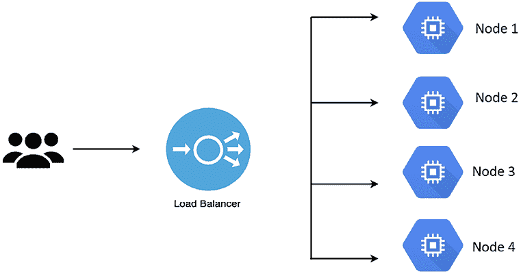
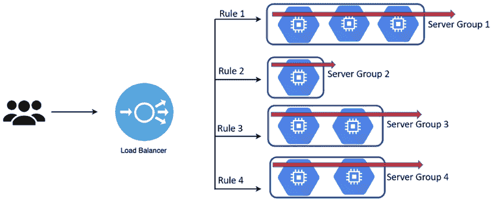
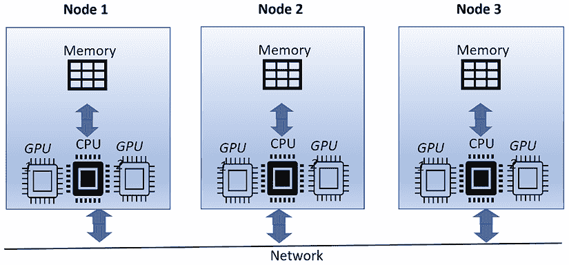
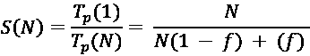
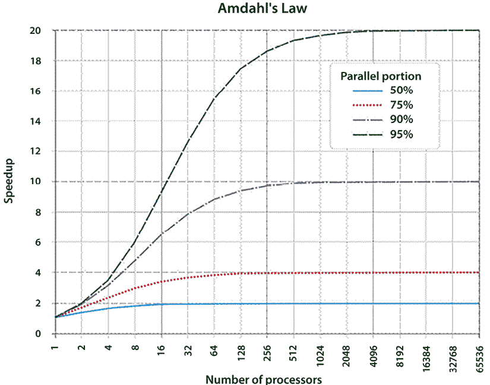
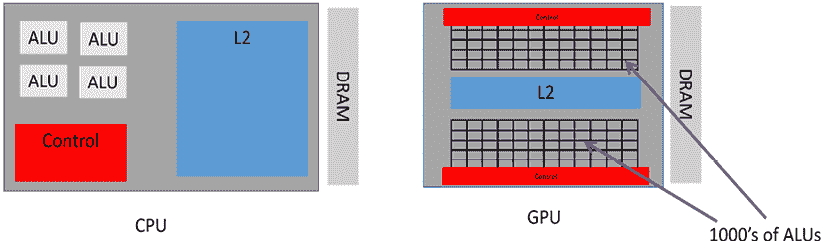
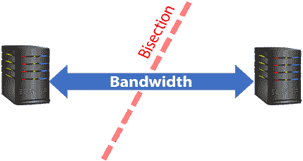
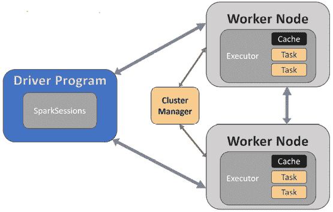

# 第十五章：大规模算法

大规模算法专门设计用于解决庞大且复杂的问题。它们的特点在于需要多个执行引擎来应对大量的数据和处理需求。此类算法的例子包括**大语言模型**（**LLMs**），如 ChatGPT，它们需要分布式模型训练来应对深度学习固有的巨大计算需求。此类复杂算法的资源密集型特性突显了强大并行处理技术的必要性，这对于训练模型至关重要。

本章将从介绍大规模算法的概念开始，然后讨论支撑它们所需的高效基础设施。此外，我们还将探索管理多资源处理的各种策略。在本章中，我们将研究由 Amdahl 定律提出的并行处理局限性，并探讨**图形处理单元**（**GPUs**）的使用。完成本章后，您将掌握设计大规模算法所需的基本策略，并打下坚实的基础。

本章涉及的主题包括：

+   大规模算法简介

+   大规模算法的高效基础设施

+   多资源处理策略

+   利用集群/云的力量运行大规模算法

让我们从简介开始。

# 大规模算法简介

在历史上，人类一直在解决复杂问题，从预测蝗虫群体的位置到发现最大的质数。我们的好奇心和决心推动了问题解决方法的不断创新。计算机的发明是这一历程中的一个关键时刻，使我们能够处理复杂的算法和计算。如今，计算机使我们能够以惊人的速度和精确度处理海量数据集、执行复杂计算并模拟各种场景。

然而，随着我们遇到越来越复杂的挑战，单台计算机的资源往往不足以应对。这时，大规模算法便派上了用场，它们利用多台计算机共同工作的强大计算力。大规模算法设计是计算机科学中的一个动态且广泛的领域，致力于创建和分析能够高效利用多台机器计算资源的算法。这些大规模算法支持两种类型的计算——分布式计算和并行计算。在分布式计算中，我们将一个任务拆分到多台计算机上，每台计算机处理任务的一部分，最后将结果汇总。可以把它想象成组装一辆汽车：不同的工人处理不同的部件，但共同完成整辆车的组装。相比之下，并行计算则是多台处理器同时执行多个任务，类似于流水线，每个工人同时进行不同的工作。

LLM，如 OpenAI 的 GPT-4，在这个广阔的领域中占据着至关重要的地位，因为它们代表了一种大规模算法的形式。LLM 旨在通过处理大量数据并识别语言中的模式来理解和生成类似人类的文本。然而，训练这些模型是一项重负荷的任务。它涉及处理数十亿，甚至数万亿的数据单元，称为“标记”（tokens）。这个训练过程包含需要逐步完成的步骤，比如准备数据，也有一些步骤可以同时进行，比如确定模型不同层次所需的变化。

这项工作并非夸大其词。由于其规模庞大，通常的做法是同时使用多台计算机来训练 LLM。我们称这些为“分布式系统”。这些系统使用多个 GPU——这些是计算机中负责重负载工作的部件，用于创建图像或处理数据。更准确地说，LLM 几乎总是在多台计算机协同工作来训练单一模型的情况下进行训练。

在这种背景下，我们首先要描述一个设计良好的大规模算法，它能够充分利用现代计算基础设施的潜力，如云计算、集群和 GPU/TPU。

# 描述大规模算法的高效基础设施

为了高效运行大规模算法，我们需要高性能的系统，因为这些系统被设计成通过增加计算资源来处理更大的工作负载，从而分配处理任务。水平扩展是实现分布式系统可扩展性的关键技术，它使系统能够通过将任务分配给多个资源来扩展其处理能力。这些资源通常是硬件（如 **中央处理单元**（**CPU**）或 GPU）或软件元素（如内存、磁盘空间或网络带宽），系统可以利用这些资源执行任务。为了让可扩展的系统高效地满足计算需求，它应具备弹性和负载均衡，以下部分将详细讨论这一点。

## 弹性

弹性是指基础设施根据变化的需求动态扩展资源的能力。实现这一特性的常见方法是自动扩展，这是云计算平台（如 **Amazon Web Services**（**AWS**））中常见的策略。在云计算的背景下，服务器组是由一组虚拟服务器或实例组成，这些服务器或实例经过编排协同工作以处理特定的工作负载。这些服务器组可以组织成集群，以提供高可用性、容错能力和负载均衡。组内的每台服务器可以配置特定的资源，如 CPU、内存和存储，以优化执行预定任务的性能。自动扩展允许服务器组通过修改运行中的节点（虚拟服务器）数量来适应波动的需求。在弹性系统中，可以通过增加资源（横向扩展）来应对需求增加，同样，当需求减少时，也可以释放资源（横向缩减）。这种动态调整能有效利用资源，帮助在性能需求与成本效益之间保持平衡。

AWS 提供了一项自动扩展服务，它与其他 AWS 服务（如 **EC2**（**弹性计算云**）和 **ELB**（**弹性负载均衡**））集成，能够自动调整组内服务器实例的数量。这确保了在流量高峰或系统故障期间，资源能够得到优化分配，性能保持稳定。

## 描述一个设计良好的大规模算法

一个设计良好的大规模算法能够处理海量信息，并且被设计为具备适应性、弹性和高效性。它具有弹性，能够适应大规模环境中不断变化的动态。

一个设计良好的大规模算法具有以下两个特点：

+   **并行性**：并行性是让算法一次性处理多个任务的特性。对于大型计算任务，算法应能够将任务分配到多台计算机上。因为这些计算是同时进行的，计算速度得以加快。在大规模计算的背景下，算法应能将任务拆分到多台机器上，从而通过并行处理加速计算过程。

+   **容错性**：由于大规模环境中组件数量庞大，系统故障的风险增大，因此构建能够承受这些故障的算法至关重要。算法应具备在不丧失大量数据或输出精度的情况下从故障中恢复的能力。

三大云计算巨头，谷歌、亚马逊和微软，提供高度弹性的基础设施。由于它们共享资源池的庞大规模，几乎没有公司能够与这三家公司基础设施的弹性匹敌。

大规模算法的性能与底层基础设施的质量密切相关。这个基础设施应提供充足的计算资源、广泛的存储能力、高速的网络连接和可靠的性能，以确保算法的最佳运行。让我们描述一个适合大规模算法的基础设施。

### 负载均衡

负载均衡是大规模分布式计算算法中的一项核心实践。通过均衡地管理和分配工作负载，负载均衡避免了资源过载，并保持了系统的高性能。它在确保高效运作、优化资源利用和实现高吞吐量方面发挥着重要作用，尤其是在分布式深度学习领域。

*图 15.1* 直观地展示了这一概念。它展示了一个用户与负载均衡器交互，负载均衡器则管理多个节点的负载。在此例中，有四个节点，**节点 1**、**节点 2**、**节点 3** 和 **节点 4**。负载均衡器不断监控所有节点的状态，将传入的用户请求在它们之间分配。将任务分配给某个特定节点的决定，取决于该节点的当前负载以及负载均衡器的算法。通过防止任何单一节点被压垮，而其他节点仍处于低负载状态，负载均衡器确保系统性能的最佳化：

图 15.1：负载均衡

在云计算的更广泛背景下，AWS 提供了一个名为**弹性负载均衡（ELB）**的功能。ELB 会自动将传入的应用流量分配到 AWS 生态系统内的多个目标，如 Amazon EC2 实例、IP 地址或 Lambda 函数。通过这种方式，ELB 可以防止资源过载，并保持应用的高可用性和性能。

### ELB：结合弹性和负载均衡

ELB 代表一种先进的技术，它将弹性和负载均衡的元素结合到一个单一的解决方案中。它利用服务器集群来增强计算基础设施的响应性、效率和可扩展性。其目标是在所有可用资源之间保持均匀的工作负载分配，同时使基础设施能够根据需求波动动态调整其规模。

*图 15.2* 显示了一个负载均衡器管理四个服务器组。请注意，服务器组是一个节点集合，负责执行特定的计算功能。在此，服务器组指的是由节点组成的一个集合，每个节点被赋予一个独特的计算任务。

服务器组的关键特性之一是其弹性——根据情况灵活地添加或移除节点的能力：

图 15.2：智能负载均衡服务器自动扩展

负载均衡器通过实时监控工作负载指标来运行。当计算任务变得越来越复杂时，处理能力的需求也相应增加。为应对这种需求激增，系统会触发“扩容”操作，将额外的节点集成到现有的服务器组中。在此背景下，“扩容”是指增加计算能力以适应扩展的工作负载。相反，当需求下降时，基础设施可以启动“缩容”操作，移除一些节点。通过这种跨服务器组的动态节点重新分配，确保了资源的最优利用比率。通过将资源分配调整以匹配当前的工作负载，系统可以避免资源过度配置或不足配置。这种动态资源管理策略提高了运营效率和成本效益，同时保持了高水平的性能。

# 策略化多资源处理

在多资源处理策略的早期，大规模算法是在被称为超级计算机的强大机器上执行的。这些单体机器具有共享内存空间，能够让不同的处理器之间进行快速通信，并通过相同的内存访问共享变量。随着运行大规模算法的需求增长，超级计算机转变为**分布式共享内存**（**DSM**）系统，在这种系统中，每个处理节点拥有一段物理内存。随后，集群应运而生，构成了松散连接的系统，这些系统依赖于处理节点之间的消息传递。

有效运行大规模算法需要多个执行引擎并行工作以解决复杂的挑战。可以利用三种主要策略来实现这一点：

+   **向内看**：通过利用计算机上的现有资源，使用 GPU 上成百上千的核心来执行大规模算法。例如，一位数据科学家希望训练一个复杂的深度学习模型时，可以利用 GPU 的计算能力来增强计算能力。

+   **向外看**：实施分布式计算以访问补充的计算资源，这些资源可以协同解决大规模问题。例子包括集群计算和云计算，它们通过利用分布式资源，使得运行复杂且资源需求高的算法成为可能。

+   **混合策略**：将分布式计算与每个节点上的 GPU 加速结合，以加快算法执行。一些处理大量数据并进行复杂模拟的科研组织可能会采用这种方法。如*图 15.3*所示，计算负载被分配到多个节点（**节点 1**、**节点 2** 和 **节点 3**）上，每个节点都配备有自己的 GPU。该图有效展示了混合策略，展示了如何利用分布式计算和 GPU 加速的优势，推动每个节点中的模拟和计算的加速：

图 15.3：多资源处理的混合策略

在我们探索并行计算在运行大规模算法中的潜力时，理解支配其效率的理论限制同样重要。

在接下来的部分，我们将深入探讨并行计算的基本约束，揭示影响其性能的因素，以及它可以被优化的程度。

# 理解并行计算的理论限制

需要注意的是，并行算法并不是万能的。即使是设计最好的并行架构，也可能无法达到我们预期的性能。并行计算的复杂性，如通信开销和同步问题，使得实现最佳效率变得具有挑战性。为了帮助我们应对这些复杂性，并更好地理解并行算法的潜在收益和局限性，提出了阿姆达尔定律。

## 阿姆达尔定律

基因·阿姆达尔（Gene Amdahl）是最早研究并行处理的人之一，他在 20 世纪 60 年代提出了阿姆达尔定律，该定律至今仍然适用，并成为理解设计并行计算解决方案时涉及的各种权衡的基础。阿姆达尔定律提供了一个理论极限，即在给定可并行化部分的算法下，使用并行化版本的算法能够实现的最大执行时间改进。

它基于这样一个概念：在任何计算过程中，并非所有过程都可以并行执行。总会有一部分过程是顺序执行的，无法并行化。

## 推导阿姆达尔定律

考虑一个可以分为并行部分（*f*）和串行部分（*1 - f*）的算法或任务。并行部分指的是可以在多个资源或处理器上同时执行的任务部分。这些任务相互独立，可以并行执行，因此称为“并行可分”。另一方面，串行部分是任务中无法拆分的部分，必须按顺序依次执行，因此称为“串行”。

令 *Tp(1)* 表示在单个处理器上处理该任务所需的时间。可以表达为：

*T*[p]*(1) = N(1 - f)**τ*[p] *+ N(f)**τ*[p] *= N**τ*[p]

在这些方程中，*N* 和 *τ*[p] 表示：

+   *N*：算法或任务必须执行的任务总数或迭代次数，在单个处理器和并行处理器上是一致的。

+   *τ*[p]：处理器完成单个工作单元、任务或迭代所需的时间，不论使用多少个处理器，这个时间保持不变。

前面的方程计算了在单个处理器上处理所有任务所需的总时间。现在，让我们看看任务在*N*个并行处理器上执行的情况。

执行所需的时间可以表示为 *T*[p]*(N)*。在下面的图示中，X 轴表示**处理器数量**，即执行我们程序所使用的计算单元或核心的数量。当我们沿着 X 轴向右移动时，使用的处理器数量增加。Y 轴表示**加速比**，这是衡量使用多个处理器时程序运行速度相比仅使用一个处理器时的提升程度。当我们沿着 Y 轴向上移动时，程序的速度成比例地增加，导致任务执行效率更高。

*图 15.4* 中的图表和阿姆达尔定律向我们展示了，更多的处理器可以提高性能，但由于代码中的串行部分，性能提升是有限的。这个原理是并行计算中收益递减的经典例子。

*N = N(1 - f)**τ*[p] *+ (f)**τ*[p]

在这里，**RHS**（**右侧**）的第一项表示处理任务的串行部分所需的时间，而第二项表示处理并行部分所需的时间。

在这种情况下，加速比是由于任务的并行部分分布到*N*个处理器上。阿姆达尔定律定义了使用*N*个处理器时实现的加速比*S(N)*，公式为：

对于显著的加速，必须满足以下条件：

*1 - f << f / N (4.4)*

这个不等式表示并行部分（*f*）必须非常接近于 1，尤其是在*N*很大的时候。

现在，让我们来看一个典型的图表，解释阿姆达尔定律：

图 15.4：并行处理中的收益递减：可视化阿姆达尔定律

在 *图 15.4* 中，X 轴表示处理器的数量 (*N*)，对应用于执行程序的计算单元或核心。沿着 X 轴向右移动，*N* 增加。Y 轴表示加速比 (*S*)，这是一个衡量程序在多个处理器上执行时相较于只使用一个处理器执行的时间 *T*[p] 改进的指标。沿 Y 轴向上移动表示程序执行速度的提升。

该图展示了四条线，每条线代表不同并行化比例 (*f*) 下获得的加速比 *S*，分别为 50%、75%、90% 和 95%：

+   50% 并行 (*f = 0.5*): 这一行展示了最小的加速比 *S*。尽管添加了更多的处理器 (*N*)，程序的一半仍然按顺序执行，限制了加速比的最大值为 2。

+   75% 并行 (*f = 0.75*): 与 50% 的情况相比，加速比 *S* 更高。然而，程序的 25% 仍然是顺序执行，这限制了整体加速比。

+   90% 并行 (*f = 0.9*): 在这种情况下，观察到显著的加速比 *S*。然而，程序的 10% 顺序部分对加速比施加了限制。

+   95% 并行 (*f = 0.95*): 这一行展示了最高的加速比 *S*。然而，顺序执行的 5% 仍然对加速比施加了上限。

该图与阿姆达尔定律结合，强调了虽然增加处理器数量 (*N*) 可以提高性能，但由于代码中的顺序部分 (*1 - f*)，仍然存在一个固有的限制。这个原则是并行计算中收益递减的经典示例。

阿姆达尔定律提供了有关多处理器系统中可以实现的性能增益的宝贵见解，并强调并行化部分 (*f*) 在决定系统整体加速比中的重要性。在讨论了并行计算的理论限制之后，重要的是要介绍并探讨另一种强大且广泛使用的并行处理技术：GPU 及其相关的编程框架 CUDA。

## CUDA: 释放 GPU 架构在并行计算中的潜力

GPU 最初是为图形处理设计的，但后来发展演变，展现出与 CPU 不同的独特特点，形成了完全不同的计算范式。

与处理器核心数量有限的 CPU 不同，GPU 由数千个核心组成。然而，需要注意的是，这些核心单独来看并不像 CPU 核心那样强大，但 GPU 在并行执行大量相对简单的计算任务时非常高效。

由于 GPU 最初是为图形处理设计的，GPU 架构非常适合图形处理，其中多个操作可以独立执行。例如，渲染图像涉及对每个像素的颜色和亮度进行计算。这些计算彼此基本独立，因此可以同时进行，充分利用 GPU 的多核架构。

### 表格底部

这种设计选择使得 GPU 在它们所设计的任务上变得极其高效，比如渲染图形和处理大规模数据集。下面是*图 15.5*所示的 GPU 架构：

图 15.5：GPU 架构

这种独特的架构不仅有利于图形处理，还对其他类型的计算问题具有显著的优势。任何可以分解成较小、独立任务的问题，都可以利用这种架构进行更快速的处理。这包括像科学计算、机器学习，甚至是加密货币挖矿等领域，这些领域的数据集庞大且计算复杂。

在 GPU 成为主流之后，数据科学家开始探索它们在高效执行并行操作方面的潜力。由于典型的 GPU 拥有成千上万的**算术逻辑单元**（**ALUs**），它有潜力产生成千上万的并发进程。需要注意的是，ALU 是核心的主力部件，负责执行大部分实际的计算。大量的 ALU 使得 GPU 非常适合执行需要对许多数据点同时进行相同操作的任务，例如数据科学和机器学习中常见的向量和矩阵运算。因此，能够执行并行计算的算法最适合在 GPU 上运行。例如，在 GPU 上进行视频中的对象搜索，速度至少比 CPU 快 20 倍。*第五章*中讨论的图算法，已知在 GPU 上的运行速度远快于 CPU。

2007 年，NVIDIA 开发了一个名为**计算统一设备架构**（**CUDA**）的开源框架，以便数据科学家能够利用 GPU 的强大计算能力来处理他们的算法。CUDA 将 CPU 和 GPU 分别抽象为主机和设备。

**主机**指的是 CPU 和主内存，负责执行主程序并将数据并行计算任务卸载到 GPU 上。

**设备**指的是 GPU 及其内存（VRAM），负责执行执行数据并行计算的内核。

在典型的 CUDA 程序中，主机在设备上分配内存，传输输入数据并调用内核。设备执行计算，结果存储回其内存。主机随后检索结果。通过这种劳动分工，充分发挥了每个组件的优势，CPU 处理复杂逻辑，GPU 负责大规模数据并行计算。

CUDA 在 NVIDIA GPU 上运行，并需要操作系统内核的支持，最初从 Linux 开始，后来扩展到 Windows。CUDA 驱动 API 连接了编程语言 API 和 CUDA 驱动，支持 C、C++和 Python。

### LLM 中的并行处理：一个关于阿姆达尔定律和收益递减的案例研究

像 ChatGPT 这样的 LLM 是复杂的系统，能够根据给定的初始提示生成与人类写作非常相似的文本。这项任务涉及一系列复杂的操作，可以大致分为顺序任务和可并行化任务。

顺序任务是指那些必须按照特定顺序依次进行的任务。这些任务可能包括像分词这样的预处理步骤，其中输入文本被拆分成更小的部分，通常是单词或短语，模型能够理解。它还可能包括像解码这样的后处理任务，在这些任务中，模型的输出（通常是以词元概率的形式呈现）被转化回人类可读的文本。这些顺序任务对模型的功能至关重要，但由于其本质，它们无法拆分并同时执行。

另一方面，能够并行化的任务是那些可以拆分并同时运行的任务。一个典型的例子是模型神经网络中的前向传播阶段。在这里，网络中每一层的计算可以并行执行。这个操作构成了模型大部分的计算时间，正是在这里可以发挥并行处理的强大优势。

现在，假设我们使用的是一款拥有 1000 个核心的 GPU。在语言模型的背景下，任务中可以并行化的部分可能涉及前向传播阶段，在这个阶段中，神经网络每一层的计算可以并行执行。我们假设这占总计算时间的 95%。其余 5%的任务可能涉及诸如分词和解码之类的操作，这些是顺序进行的，无法并行化。

将阿姆达尔定律应用于此场景给出了以下结果：

*加速 = 1 / ((1 - 0.95) + 0.95/1000) = 1 / (0.05 + 0.00095) = 19.61*

在理想情况下，这表明我们的语言处理任务在 1000 核心的 GPU 上比在单核 CPU 上要快约 19.61 倍。

为了进一步说明并行计算的收益递减，我们来调整核心数量，分别为 2、50 和 100：

+   对于 2 个核心：*加速 = 1 / ((1 - 0.95) + 0.95/2) = 1.67*

+   对于 50 个核心：*加速 = 1 / ((1 - 0.95) + 0.95/50) = 14.71*

+   对于 100 个核心：*加速 = 1 / ((1 - 0.95) + 0.95/100) = 16.81*

从我们的计算结果来看，向并行计算环境中添加更多核心并不会导致速度的等效提升。这是并行计算中收益递减概念的一个典型例子。即使将核心数量从 2 增加到 4，或者从 2 增加到 100 时增加 50 倍，速度提升也不会翻倍或增加 50 倍。相反，速度提升会根据阿姆达尔定律达到一个理论限制。

这种收益递减的主要原因是任务中存在无法并行化的部分。在我们的例子中，像标记化和解码这样的操作构成了这一顺序部分，占总计算时间的 5%。无论我们向系统添加多少核心，或者我们能多高效地执行并行化部分，这一顺序部分都会对可实现的加速造成上限。它将始终存在，要求占用其计算时间份额。

阿姆达尔定律优雅地捕捉了并行计算的这一特性。它指出，使用并行处理的最大潜在加速由任务中无法并行化的部分决定。该定律提醒算法设计师和系统架构师，尽管并行性可以显著加速计算，但它并不是一个可以无限利用来提高速度的资源。它强调了识别和优化算法中顺序部分的重要性，以便最大化并行处理的优势。

在大规模语言模型（LLM）的背景下，这一理解尤为重要，因为计算的庞大规模使得高效的资源利用成为一个关键问题。它强调了需要一种平衡的方法，将并行计算策略与优化任务中顺序部分的性能的努力结合起来。

### 重新思考数据局部性

在传统的并行和分布式处理中，数据局部性原理在决定最优资源分配方面至关重要。它从根本上表明，在分布式基础设施中应尽量避免数据移动。只要可能，数据应在其所在节点上本地处理，而不是移动数据；否则，它将减少并行化和水平扩展的好处，其中水平扩展是通过增加更多机器或节点来分配工作负载，从而提高系统容量，使其能够处理更高的流量或数据量。

随着网络带宽多年来的提升，数据局部性带来的限制变得不再那么显著。更高的数据传输速度使得分布式计算环境中节点之间的通信更加高效，从而减少了对数据局部性进行性能优化的依赖。网络带宽可以通过网络分段带宽来量化，分段带宽是指网络中两部分之间的带宽。这在资源物理分布的分布式计算中尤为重要。如果我们在分布式网络中的两组资源之间画一条线，分段带宽就是指一侧的服务器与另一侧的服务器之间的通信速度，如 *图 15.6* 所示。为了使分布式计算高效运行，这是需要考虑的最重要参数。如果没有足够的网络分段带宽，分布式计算中多个执行引擎所带来的好处将被缓慢的通信链路所掩盖。

图 15.6：分段带宽

高分段带宽使我们能够在数据所在的地方进行处理，而无需复制数据。如今，主要的云计算提供商提供卓越的分段带宽。例如，在 Google 数据中心，分段带宽高达每秒 1 petabyte。其他主要云供应商也提供类似的带宽。相比之下，典型的企业网络可能只提供每秒 1 到 10 gigabytes 的分段带宽。

这种速度上的巨大差异展示了现代云基础设施的卓越能力，使其非常适合大规模数据处理任务。

增加的宠物比特分段带宽为高效存储和处理大数据开辟了新的选项和设计模式。这些新选项包括由于网络容量的增加而变得可行的替代方法和设计模式，使得数据处理变得更快速、更高效。

## 利用 Apache Spark 进行集群计算的优势

Apache Spark 是一个广泛使用的平台，用于管理和利用集群计算。在这个背景下，“集群计算”是指将多台机器组合在一起，使它们作为一个单一的系统共同工作以解决问题。Spark 不仅仅实现了这一点，它还创建并控制这些集群以实现高速数据处理。

在 Apache Spark 中，数据会转换成被称为 **弹性分布式数据集** (**RDDs**) 的形式。这些实际上是 Apache Spark 数据抽象的核心。

RDD 是不可变的，意味着一旦创建后，它们无法被更改，是可以并行处理的元素集合。换句话说，这些数据集的不同部分可以同时进行处理，从而加速数据处理过程。

当我们说“容错”时，指的是 RDD 具有从执行过程中的潜在失败或错误中恢复的能力。这使得它们在大数据处理任务中具有强大的可靠性和稳健性。RDD 被划分为多个较小的块，称为“分区”，然后分布在集群中的多个节点或独立计算机上。这些分区的大小可以变化，主要由任务的性质和 Spark 应用的配置决定。

Spark 的分布式计算框架使得任务可以分布在多个节点上，从而显著提高处理速度和效率。

Spark 架构由多个主要组件组成，包括驱动程序、执行器、工作节点和集群管理器。

+   **驱动程序**：驱动程序是 Spark 应用中的关键组件，功能类似于操作的控制中心。它存在于一个独立的进程中，通常位于称为驱动机器的机器上。驱动程序的角色类似于管弦乐队的指挥；它运行主 Spark 程序，并监督其中的众多任务。

    驱动程序的主要任务之一是处理和运行 SparkSession。SparkSession 对于 Spark 应用至关重要，因为它封装了 SparkContext。SparkContext 就像 Spark 应用的中枢神经系统——它是应用与 Spark 计算生态系统交互的门户。

    为了简化理解，可以将 Spark 应用比作一栋办公大楼。驱动程序就像大楼管理员，负责整体运作和维护。在这栋大楼中，SparkSession 代表一个独立的办公室，而 SparkContext 是通往该办公室的主要入口。关键是，这些组件——驱动程序、SparkSession 和 SparkContext——协同工作，以协调任务并管理 Spark 应用中的资源。SparkContext 包含应用启动时预加载的基本功能和上下文信息。此外，它还携带关于集群的重要细节，如配置和状态，这对于应用的运行和任务的有效执行至关重要。

+   **集群管理器**：驱动程序与集群管理器无缝互动。集群管理器是一个外部服务，负责提供和管理集群中的资源，如计算能力和内存。驱动程序和集群管理器密切合作，以识别集群中可用的资源，进行有效分配，并在 Spark 应用的生命周期内管理其使用。

+   **执行器**：执行器是指专门为在集群中某个节点上运行的单个 Spark 应用程序而启动的计算进程。每个执行器进程都运行在工作节点上，实际上充当着 Spark 应用程序背后的计算“肌肉”。

+   以这种方式共享内存和全局参数可以显著提高任务执行的速度和效率，使得 Spark 成为一个高性能的大数据处理框架。

+   **工作节点**：工作节点，顾名思义，负责在分布式 Spark 系统中执行任务的实际操作。

    每个工作节点能够托管多个执行器，这些执行器又可以为多个 Spark 应用程序提供服务：

    

    图 15.7：Spark 的分布式架构

# Apache Spark 如何支持大规模算法处理

Apache Spark 已成为处理和分析大数据的领先平台，这得益于其强大的分布式计算能力、容错特性和易用性。在本节中，我们将探讨 Apache Spark 如何支持大规模算法处理，使其成为复杂、资源密集型任务的理想选择。

## 分布式计算

Apache Spark 架构的核心概念是数据分区，这使得数据可以在集群中的多个节点之间分配。这个特性使得并行处理和高效的资源利用成为可能，而这两者对于运行大规模算法至关重要。Spark 的架构由一个驱动程序和分布在工作节点上的多个执行器进程组成。驱动程序负责管理并分配任务到各个执行器，而每个执行器则在多个线程中并行运行任务，从而实现高吞吐量。

## 内存处理

Spark 的一大亮点是其内存处理能力。与传统的基于磁盘的系统不同，Spark 可以将中间数据缓存到内存中，显著加速需要多次遍历数据的迭代算法。

+   这种内存处理能力对于大规模算法尤为有利，因为它最小化了磁盘 I/O 的时间，从而加快了计算速度，并更高效地利用资源。

# 在云计算中使用大规模算法

数据的快速增长以及机器学习模型日益复杂，使得分布式模型训练成为现代深度学习管道中不可或缺的一部分。大规模算法需要大量的计算资源，并且需要高效的并行处理来优化其训练时间。云计算提供了一系列服务和工具，支持分布式模型训练，使你能够充分发挥资源密集型大规模算法的潜力。

使用云计算进行分布式模型训练的一些关键优势包括：

+   **可扩展性**：云计算提供几乎无限的资源，使你能够根据大规模算法的需求扩展模型训练工作负载。

+   **灵活性**：云计算支持多种机器学习框架和库，使你能够选择最适合你特定需求的工具。

+   **性价比**：使用云计算，你可以通过选择合适的实例类型和利用抢占实例来优化培训成本，从而降低开支。

## 示例

随着我们深入研究机器学习模型，尤其是处理**自然语言处理**（**NLP**）任务的模型时，我们发现对计算资源的需求越来越大。例如，像 GPT-3 这样的变压器模型，用于大规模语言建模任务，可能拥有数十亿个参数，需求巨大的处理能力和内存。在庞大的数据集上训练这样的模型，如包含数十亿网页的 Common Crawl，进一步加剧了这些需求。

云计算在这里成为了一种强有力的解决方案。它提供了分布式模型训练的服务和工具，使我们能够访问几乎无限的资源池，扩展工作负载，并选择最适合的机器学习框架。更重要的是，云计算通过提供灵活的实例类型和抢占实例来促进成本优化——本质上是在竞标空闲的计算能力。通过将这些资源密集型任务委托给云计算，我们可以更加专注于创新工作，加快训练过程，并开发更强大的模型。

# 总结

本章我们探讨了大规模并行算法设计的概念和原理。我们分析了并行计算的重要作用，特别是它在将计算任务有效地分配到多个处理单元方面的能力。详细研究了 GPU 的非凡能力，展示了它们在并发执行大量线程时的实用性。此外，我们还讨论了分布式计算平台，特别是 Apache Spark 和云计算环境。它们在促进大规模算法的开发和部署方面的重要性被强调，为高性能计算提供了强大、可扩展且具成本效益的基础设施。

# 在 Discord 上了解更多

要加入本书的 Discord 社区——在这里你可以分享反馈、向作者提问，并了解新版本——请扫描下面的二维码：

[`packt.link/WHLel`](https://packt.link/WHLel)

