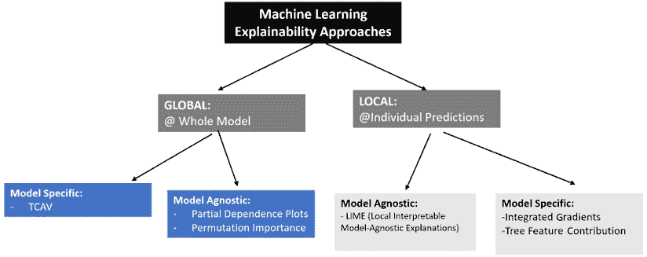

# 第十六章：实际考虑因素

本书中介绍了许多可用于解决现实世界问题的算法。在这一章中，我们将探讨本书中算法的实用性。我们的重点将放在它们的现实世界适用性、潜在挑战和整体主题上，包括效用和伦理影响。

本章的组织结构如下：我们将从引言开始。接着，我们将介绍算法可解释性的问题，即算法的内部机制能够以可理解的术语进行解释的程度。然后，我们将讨论使用算法的伦理问题以及实施算法时可能产生的偏见。接下来，我们将讨论处理 NP-hard 问题的技术。最后，我们将研究在选择算法之前应考虑的因素。

到本章结束时，你将了解在使用算法解决现实世界问题时，必须牢记的实际考虑因素。

本章将涵盖以下主题：

+   引入实际考虑因素

+   算法的可解释性

+   理解伦理与算法

+   减少模型中的偏差

+   何时使用算法

让我们从一些算法解决方案面临的挑战开始。

# 算法解决方案面临的挑战

除了设计、开发和测试算法外，在许多情况下，考虑开始依赖机器来解决现实世界问题时的某些实际因素也是非常重要的。对于某些算法，我们可能需要考虑如何可靠地加入新信息，而这些信息预计在我们部署算法之后仍会持续变化。例如，全球供应链的突发中断可能会使我们用于训练模型以预测产品利润率的某些假设失效。我们需要仔细考虑是否加入这些新信息会以某种方式改变我们经过充分测试的算法的质量。如果会，那么我们的设计如何处理这种变化？

## 预见意外情况

许多使用算法开发的现实世界问题解决方案都是基于某些假设的。这些假设在模型部署后可能会意外地发生变化。一些算法使用的假设可能会受到全球地缘政治情况变化的影响。例如，考虑一个训练好的模型，它预测一家在全球各地都有办事处的国际公司的财务利润。像战争或突如其来的致命病毒蔓延这样的意外破坏事件，可能会根本性地改变这个模型的假设和预测的质量。对于这种应用场景，建议是“预见意外”并为意外情况做好应对策略。对于某些数据驱动的模型，意外可能来自于解决方案部署后法规政策的变化。

当我们使用算法来解决现实世界的问题时，某种程度上，我们是在依赖机器来进行问题解决。即使是最复杂的算法也都建立在简化和假设的基础上，无法应对突发情况。我们仍然离将关键决策完全交给我们自己设计的算法的目标相距甚远。

例如，谷歌的推荐引擎算法由于隐私问题，最近面临欧盟的监管限制。这些算法可能是该领域最先进的技术之一，但如果被禁止，这些算法可能会变得毫无用处，因为它们将无法解决它们原本应解决的问题。

然而，事实是，遗憾的是，算法的实际考虑往往是事后的思考，通常在初期设计阶段并未得到充分的考虑。

对于许多用例来说，一旦算法被部署，短期内的解决方案带来的兴奋感过去后，使用算法的实际问题和影响将在时间的推移中被发现，并最终决定项目的成败。

让我们来看看一个实际的例子，分析一下没有关注实际考虑导致一个全球顶尖 IT 公司设计的高调项目失败的原因。

# Tay 的失败，推特 AI 机器人

让我们来看一个经典的例子——Tay，这是微软在 2016 年创建的首个 AI 推特机器人。通过使用 AI 算法，Tay 被训练成一个能够根据特定话题回复推文的自动化推特机器人。为了实现这一目标，它具备根据对话上下文构建简单消息的能力，利用现有的词汇。一旦部署，它本应从实时的在线对话中不断学习，并通过增强其词汇库，吸收在重要对话中频繁使用的单词。然而，Tay 在网络空间中生活了几天后，开始学习新词汇。除了学习了一些新词，遗憾的是，Tay 还从正在进行的推文中学到了一些种族主义和粗俗的词语。它很快开始使用新学到的词语发布自己的推文。尽管其中绝大多数推文并无恶意，但其中少数推文足够冒犯人们，迅速引发了警报。尽管它展现出了智能，并且迅速学会了如何根据实时事件创作定制的推文，但与此同时，它也严重冒犯了人们。微软将其下线并尝试进行重新调整，但未能成功。最终，微软不得不终止了这个项目。这是一个雄心勃勃的项目的悲惨结局。

请注意，尽管微软在其内置的人工智能方面取得了令人印象深刻的成绩，但公司忽视了部署自学习 Twitter 机器人的实际影响。尽管自然语言处理和机器学习算法可能是业内最先进的，但由于显而易见的缺陷，该项目几乎是毫无用处的。如今，Tay 已经成为一个由于忽视让算法实时学习的实际后果而导致失败的教科书式例子。Tay 的失败所带来的教训无疑影响了后来的 AI 项目。数据科学家们也开始更加关注算法的透明性。

为了更深入了解，以下是关于 Tay 的全面研究：[`spectrum.ieee.org/in-2016-microsofts-racist-chatbot-revealed-the-dangers-of -online-conversation`](https://spectrum.ieee.org/in-2016-microsofts-racist-chatbot-revealed-the-dangers-of-online-conversation)。

这引出了下一个话题，探讨了为何需要让算法透明以及如何实现这一点。

# 算法的可解释性

首先，让我们区分黑盒算法和白盒算法：

+   黑盒算法是指其逻辑无法被人类解释的算法，原因可能是其复杂性或其逻辑以复杂的方式呈现。

+   白盒算法是指其逻辑对人类可见且可以理解的算法。

在机器学习的背景下，可解释性指的是我们理解和表达算法特定输出背后原因的能力。从本质上讲，它衡量的是一个算法的内部工作原理和决策路径对于人类认知的可理解程度。

许多算法，特别是在机器学习领域，由于其不透明性，通常被称为“黑盒”。例如，考虑我们在*第八章*中讨论的神经网络算法，*神经网络算法*。这些算法是许多深度学习应用的基础，是典型的黑盒模型。它们的复杂性和多层结构使得它们本质上不直观，导致其内部决策过程对人类理解来说是谜一样的。

然而，必须注意，“黑盒”和“白盒”这两个术语是明确的分类，分别表示完全不透明和完全透明。它们不是一个渐变或光谱，一个算法不可能是“有点黑”或“有点白”。当前的研究正致力于让这些黑盒算法（如神经网络）变得更加透明和可解释。然而，由于其复杂的架构，它们仍然主要属于黑盒类别。

如果算法用于关键决策中，理解算法生成结果的原因可能是非常重要的。避免使用黑箱算法，转而使用白箱算法，也能更好地洞察模型的内部运作。*第七章*中讨论的决策树算法，*传统监督学习算法*，就是这种白箱算法的一个例子。例如，一个可解释的算法将指导医生了解哪些特征实际被用来将病人分类为生病或未生病。如果医生对结果有任何疑问，他们可以回去重新检查这些特征的准确性。

## 机器学习算法和可解释性

在机器学习领域，可解释性的概念至关重要。那么，到底我们指的是什么是可解释性呢？从本质上讲，可解释性指的是我们能够理解和解释机器学习模型决策的清晰度。

这意味着揭开模型预测背后的面纱，理解其背后的“原因”。

在利用机器学习，特别是在决策场景中，个人往往需要信任模型的输出。如果模型的过程和决策是透明的并且可以解释的，那么这种信任可以得到显著增强。为了说明可解释性的重要性，让我们考虑一个现实场景。

假设我们想利用机器学习根据房屋的特征预测波士顿地区的房价。假设当地的城市规定允许我们使用机器学习算法，但前提是每当需要时，我们必须提供详细的信息来证明任何预测的合理性。这些信息是审计的需要，以确保住房市场的某些细分不会被人为操控。让我们的训练模型具有可解释性将提供这些额外的信息。

让我们深入了解实现已训练模型可解释性的不同选项。

### 解释性策略展示

对于机器学习，提供算法可解释性的基本策略有两种：

+   **全球可解释性策略**：这是指提供整个模型制定过程的细节。例如，我们可以考虑一个用于批准或拒绝个人贷款的机器学习模型的案例。可以使用全球可解释性策略来量化该模型决策的透明度。全球可解释性策略并不是针对单个决策的透明度，而是关于整体趋势的透明度。假设媒体对该模型中的性别偏见进行猜测，全球可解释性策略将提供必要的信息来验证或否定这一猜测。

+   **局部可解释策略**：这是为了提供由我们的训练模型做出的单一预测的依据。其目的是为每个单独的决策提供透明度。例如，考虑我们之前的例子，预测波士顿地区的房价。如果一位房主质疑为什么他们的房子被模型评估为特定价格，那么局部可解释策略将提供有关该具体估价的详细推理，明确指出各种因素及其权重，帮助理解模型如何做出该预测。

对于全局可解释性，我们有一些技术，如**使用概念激活向量进行测试**（**TCAV**），它用于为图像分类模型提供可解释性。TCAV 通过计算方向导数来量化用户定义的概念与图像分类之间的关系程度。例如，它会量化分类一个人是男性的预测对面部毛发存在的敏感度。还有其他全局可解释性策略，例如部分依赖图和计算排列重要性，它们有助于解释我们训练模型中的公式。全局和局部可解释性策略可以是模型特定的，也可以是模型无关的。模型特定策略适用于某些类型的模型，而模型无关策略可以应用于各种不同的模型。

以下图示总结了可用于机器学习可解释性的不同策略：



图 16.1：机器学习可解释性方法

现在，让我们来看看如何使用这些策略之一实现可解释性。

#### 实现可解释性

**局部可解释模型无关解释**（**LIME**）是一种模型无关的方法，可以解释经过训练的模型所做出的单个预测。由于其模型无关的特性，它可以解释大多数类型训练过的机器学习模型的预测。

LIME 通过对每个实例的输入进行小幅度变化来解释决策。它可以收集这些变化对该实例的局部决策边界的影响。它会遍历循环，提供每个变量的详细信息。通过查看输出，我们可以看到哪个变量对该实例的影响最大。

让我们看看如何使用 LIME 使我们的房价预测模型的个别预测变得可解释：

1.  如果你之前从未使用过`LIME`，你需要使用`pip`安装该软件包：

    ```py
    !pip install lime 
    ```

1.  然后，让我们导入我们需要的 Python 包：

    ```py
    import sklearn
    import requests
    import pickle
    import numpy as np
    from lime.lime_tabular import LimeTabularExplainer as ex 
    ```

1.  我们将训练一个模型，该模型可以预测某个特定城市的房价。为此，我们首先将导入存储在`housing.pkl`文件中的数据集。然后，我们将探索它所包含的特征：

    ```py
    # Define the URL
    url = "https://storage.googleapis.com/neurals/data/data/housing.pkl"
    # Fetch the data from the URL
    response = requests.get(url)
    data = response.content
    # Load the data using pickle
    housing = pickle.loads(data)
    housing['feature_names'] 
    ```

    ```py
    array(['crime_per_capita', 'zoning_prop', 'industrial_prop', 
           'nitrogen oxide', 'number_of_rooms', 'old_home_prop', 
           'distance_from_city_center', 'high_way_access', 
           'property_tax_rate', 'pupil_teacher_ratio', 
           'low_income_prop', 'lower_status_prop', 
           'median_price_in_area'], dtype='<U25') 
    ```

    基于这些特征，我们需要预测一套房屋的价格。

1.  现在，让我们训练模型。我们将使用随机森林回归器来训练模型。首先，我们将数据分为测试集和训练集，然后使用它来训练模型：

    ```py
    from sklearn.ensemble import RandomForestRegressor
    X_train, X_test, y_train, y_test = sklearn.model_selection.train_test_split(housing.data, housing.target)
    regressor = RandomForestRegressor()
    regressor.fit(X_train, y_train) 
    ```

    ```py
    RandomForestRegressor() 
    ```

1.  接下来，让我们识别类别列：

    ```py
    cat_col = [i for i, col in enumerate(housing.data.T)
                            if np.unique(col).size < 10] 
    ```

1.  现在，让我们使用所需的配置参数来实例化 LIME 解释器。请注意，我们指定我们的标签是`'price'`，表示波士顿的房价：

    ```py
    myexplainer = ex(X_train,
        feature_names=housing.feature_names,
        class_names=['price'],
        categorical_features=cat_col,
        mode='regression') 
    ```

1.  让我们尝试深入了解预测的细节。为此，首先让我们从`matplotlib`导入`pyplot`作为绘图工具：

    ```py
    exp = myexplainer.explain_instance(X_test[25], regressor.predict,
            num_features=10)
    exp.as_pyplot_figure()
    from matplotlib import pyplot as plt
    plt.tight_layout() 
    ```


图 16.2：房价预测的特征逐项解释

1.  由于 LIME 解释器是针对个别预测工作的，我们需要选择要分析的预测。我们已要求解释器对索引为`1`和`35`的预测提供理由：

    ```py
    for i in [1, 35]:
        exp = myexplainer.explain_instance(X_test[i], regressor.predict,
                num_features=10)
    exp.as_pyplot_figure()
    plt.tight_layout() 
    ```


图 16.3：突出显示关键特征：解读测试实例 1 和 35 的预测

让我们尝试分析 LIME 之前的解释，它告诉我们以下内容：

+   **在个别预测中使用的特征列表**：它们在前面的截图中标示在*y*轴上。

+   **特征在决定中的相对重要性**：条形线越大，重要性越大。数字的值显示在*x*轴上。

+   **每个输入特征对标签的正负影响**：红色条表示负面影响，绿色条表示特定特征的正面影响。

# 理解伦理学与算法

算法伦理学，也称为计算伦理学，探讨算法的道德维度。这个关键领域的目标是确保基于这些算法运行的机器遵守伦理标准。算法的开发和部署可能无意中导致不道德的结果或偏见。设计算法时，预测其所有道德后果是一项挑战。当我们在这个背景下讨论大规模算法时，指的是那些处理大量数据的算法。然而，当多个用户或设计者共同参与算法的设计时，复杂性进一步增加，因为这会引入不同的人为偏见。算法伦理学的总体目标是突出并解决这些领域中出现的问题：

+   **偏见与歧视**：有许多因素会影响算法所创建的解决方案的质量。一个主要的关注点是无意中的算法偏见。其原因可能在于算法的设计导致某些数据比其他数据更重要。或者，原因可能出在数据的收集和选择上。这可能会导致应由算法计算的数据被遗漏，或者本不应包含的数据被纳入。例如，一家保险公司使用算法计算风险时，可能会使用包含驾驶者性别的车祸数据。根据现有的数据，算法可能会认为女性驾驶员涉及更多的事故，因此女性驾驶员自动获得更高费用的保险报价。

+   **隐私**：算法使用的数据可能包含个人信息，并且可能以侵犯个人隐私的方式被使用。例如，启用面部识别的算法就是隐私问题的一个例子。目前，全球许多城市和机场都在使用面部识别系统。挑战在于如何以保护个人隐私不受侵犯的方式使用这些算法。

越来越多的公司将算法的伦理分析纳入其设计过程中。但事实是，问题可能直到我们发现某个有问题的应用场景时才会显现出来。

## 学习算法的问题

能够根据变化的数据模式进行自我调整的算法被称为学习算法。它们在实时的学习模式中工作，但这种实时学习能力可能带来伦理上的问题。这就有可能导致它们的学习过程做出从伦理角度来看有问题的决策。由于它们被设计为处于持续进化的阶段，几乎不可能对它们进行持续的伦理分析。

例如，让我们研究一下亚马逊在其招聘算法中发现的问题。亚马逊从 2015 年开始使用 AI 算法来招聘员工。在部署之前，它经过了严格的测试，以确保其满足功能和非功能要求，并且没有任何偏见或其他伦理问题。由于它是一个学习算法，因此随着新数据的不断出现，它会不断地自我调优。部署几周后，亚马逊发现 AI 算法意外地发展出了性别偏见。亚马逊将算法下线并进行了调查。结果发现，性别偏见是由于新数据中的一些特定模式引入的。具体而言，最近的数据中男性数量远多于女性，而这些男性恰好有更相关的背景适合该职位。实时的自我调优学习带来了一些无意的后果，导致算法开始偏向男性而非女性，从而引入了偏见。该算法开始将性别作为招聘的决定因素之一。之后，模型重新训练，并添加了必要的安全防护措施，确保不会再次引入性别偏见。

随着算法复杂性的增加，全面理解它们对社会中个人和群体的长期影响变得越来越困难。

## 了解伦理考量

算法解决方案是数学公式。开发算法的人员有责任确保其符合我们试图解决问题的伦理敏感性。一旦解决方案部署，它们可能需要定期监控，以确保随着新数据的到来和基础假设的变化，算法不会开始产生伦理问题。

这些算法的伦理考量取决于算法的类型。例如，让我们来看一下以下算法及其伦理考量。需要仔细考虑伦理问题的一些强大算法示例如下：

+   分类算法和回归算法在机器学习中各自有不同的用途。分类算法将数据分为预定义的类别，并且可以直接用于决策过程。例如，它们可能决定签证审批或识别城市中的特定人群。另一方面，回归算法基于输入数据预测数值，这些预测确实可以用于决策。例如，回归模型可能预测在市场上列出房子的最佳价格。本质上，分类提供了类别结果，而回归提供了定量预测；两者在不同场景下都对知情决策有价值。

+   算法在推荐引擎中的应用可以将简历与求职者匹配，无论是针对个人还是群体。对于这种使用场景，算法应该在局部和全局层面都实现可解释性。局部层面的可解释性会提供特定个人简历与可用职位匹配时的可追溯性。全局层面的可解释性则提供了匹配简历和职位所使用的整体逻辑的透明度。

+   数据挖掘算法可以用来从各种数据源中挖掘关于个人的信息，这些信息可能被政府用来进行决策。例如，芝加哥警察局使用数据挖掘算法来识别城市中的犯罪热点和高风险个体。确保这些数据挖掘算法的设计和使用符合所有伦理要求，需要通过精心设计和持续监控来实现。

因此，算法的伦理考量将取决于其使用的具体场景以及它们直接或间接影响的实体。在开始使用算法进行关键决策之前，需要从伦理角度进行仔细分析。这些伦理考量应当是设计过程的一部分。

## 影响算法解决方案的因素

以下是我们在分析算法解决方案优劣时应当牢记的因素。

### 考虑不确定证据

在机器学习中，数据集的质量和广度在模型结果的准确性和可靠性中起着至关重要的作用。通常，数据可能显得有限，或者缺乏提供决定性结果所需的全面深度。

例如，考虑临床试验：如果一款新药在一小部分人群中进行测试，结果可能无法全面反映其疗效。同样，如果我们在某个城市的特定邮政编码区域检查欺诈模式，有限的数据可能会暗示一个趋势，但这个趋势在更广泛的范围内并不一定准确。

关键在于区分“有限数据”和“不确定证据”。虽然大多数数据集本质上都是有限的（没有数据集能捕捉到所有可能性），但“不确定证据”是指数据未能提供明确或决定性的趋势或结果。这一区分至关重要，因为基于不确定模式做出的决策可能会导致判断错误。特别是在使用基于此类数据训练的算法时，决策时必须保持批判性的眼光。

基于不确定证据做出的决策容易导致不合理的行动。

### 可追溯性

机器学习算法通常有单独的开发和生产环境。这可能导致训练阶段与推理阶段之间的脱节。这意味着，如果算法造成了某种伤害，追踪和调试非常困难。而且，当算法发现问题时，实际上很难确定受到影响的人群。

### 误导性证据

算法是数据驱动的公式。**垃圾进，垃圾出**（**GIGO**）原则意味着算法的结果只会与其所基于的数据一样可靠。如果数据中存在偏见，那么这些偏见也会反映在算法中。

### 不公平的结果

算法的使用可能会对已经处于不利地位的弱势群体造成伤害。

此外，使用算法来分配研究资金已经被证明多次对男性群体存在偏见。用于移民审批的算法有时无意间对弱势群体存在偏见。

尽管使用高质量的数据和复杂的数学公式，如果结果是不公平的，整个努力可能带来的伤害大于收益。

让我们看看如何减少模型中的偏差。

# 减少模型中的偏差

正如我们所讨论的，模型中的偏见是指特定算法的某些属性导致它产生不公平的结果。在当今世界，基于性别、种族和性取向的偏见是已知的，并且有文献记载。这意味着我们收集的数据可能会表现出这些偏见，除非我们在收集数据之前做出了努力，去消除这些偏见。

大多数时候，算法中的偏见是由人类直接或间接引入的。人类通过疏忽无意中引入偏见，或者通过主观性故意引入偏见。人类偏见的一个原因是人类大脑容易受到认知偏见的影响，这种偏见反映了一个人在数据处理和算法逻辑创建过程中的主观性、信仰和意识形态。人类偏见可以反映在算法使用的数据中，也可以反映在算法本身的制定中。对于一个典型的机器学习项目，遵循**CRISP-DM**（即**跨行业标准过程**）生命周期，正如在*第五章*中所解释的，*图算法*，偏见通常呈现如下：


图 16.4：偏见可以在 CRISP-DM 生命周期的不同阶段被引入

减少偏差最棘手的部分是首先识别和定位潜在的无意识偏见。

让我们看看何时使用算法。

# 何时使用算法

算法就像是从业者工具箱中的工具。首先，我们需要了解在给定的情况下，哪种工具是最合适的。有时，我们需要问自己，是否已经有解决我们正在尝试解决的问题的方案，何时是部署解决方案的最佳时机。我们需要确定，使用算法是否能提供一个实际有用的解决方案，而不是替代方案。我们需要从三个方面分析使用算法的效果：

+   **成本**：使用算法的成本是否值得？

+   **时间**：我们的解决方案是否使整体过程比更简单的替代方案更高效？

+   **准确性**：我们的解决方案是否比更简单的替代方案产生更准确的结果？

选择合适的算法时，我们需要找到以下问题的答案：

+   我们能否通过做出假设来简化问题？

+   我们将如何评估我们的算法？

+   关键的度量标准是什么？

+   它将如何被部署和使用？

+   它需要被解释吗？

+   我们是否理解三项重要的非功能性需求——安全性、性能和可用性？

+   是否有预期的截止日期？

在根据上述标准选择算法后，值得考虑的是，尽管大多数事件或挑战都可以预见并加以解决，但仍然有一些例外事件，它们违背了我们传统的理解和预测能力。让我们更详细地探讨这一点。

## 理解黑天鹅事件及其对算法的影响

在数据科学和算法解决方案领域，一些不可预测且罕见的事件可能会带来独特的挑战。“黑天鹅事件”这一术语由纳西姆·塔勒布在《随机的愚弄》（2001）中提出，形象地代表了那些罕见且不可预测的事件。

要被认为是黑天鹅事件，它必须满足以下标准：

+   **意外性**：该事件令大多数观察者感到惊讶，就像广岛原子弹轰炸那样。

+   **事件的重大性**：该事件具有颠覆性和重大意义，就像西班牙流感的爆发。

+   **事件后可预测性**：在事件发生后，很明显，如果之前注意到某些线索，事件是可以预见的，就像在西班牙流感成为大流行之前被忽视的迹象。

+   **并非所有人都感到惊讶**：一些人可能早已预见到事件，就像参与曼哈顿计划的科学家们预见到原子弹的爆炸一样。

    在黑天鹅事件首次在野外被发现之前，几个世纪以来，它们一直用来代表一些不可能发生的事情。发现之后，这个词依然流行，但其代表的意义发生了变化。它现在代表的是一些极其罕见，无法预测的事件。

**黑天鹅事件对算法的挑战和机会**：

+   **预测困境**：虽然有许多预测算法，从 ARIMA 到深度学习方法，但预测黑天鹅事件仍然是一个难题。使用标准技术可能会给人一种虚假的安全感。例如，预测像 COVID-19 这样的事件的确切发生时间，由于历史数据不足，面临着许多挑战。

+   **预测影响**：一旦黑天鹅事件发生，预测其广泛的社会影响就变得复杂。我们可能缺乏相关的数据和对事件影响下的社会关系的理解。

+   **预测潜力**：虽然黑天鹅事件看似随机，但它们通常是由于被忽视的复杂前兆所引起的。算法在此提供了机会：制定预测和检测这些前兆的策略，可能有助于预见潜在的黑天鹅事件。

**实际应用的相关性**：

让我们考虑最近的 COVID-19 大流行，这是一个典型的黑天鹅事件。一种潜在的实际应用可能涉及利用先前大流行的相关数据、全球旅行模式和当地健康指标。然后，一个算法可以监控疾病的异常激增或其他潜在的早期迹象，提示可能的全球健康威胁。然而，黑天鹅事件的独特性使得这一过程变得更加困难。

# 总结

在本章中，我们学习了设计算法时应考虑的实际方面。我们探讨了算法可解释性的概念，以及如何在不同层次上提供可解释性。我们还探讨了算法中可能出现的伦理问题。最后，我们描述了在选择算法时需要考虑的因素。

算法是我们今天所见证的这个新自动化世界中的引擎。了解、实验和理解使用算法的影响至关重要。理解它们的优点和局限性，以及使用算法的伦理影响，将对改善我们生活的世界产生深远的影响，本书的目标就是在这个不断变化和发展的世界中实现这一重要目标。

# 在 Discord 上了解更多

要加入本书的 Discord 社区——在这里你可以分享反馈、向作者提问并了解新版本——请扫描下面的二维码：

[`packt.link/WHLel`](https://packt.link/WHLel)


