1

# 第一章：Jupyter 基础

## 学习目标

到本章结束时，你将能够：

+   描述 Jupyter Notebooks 及其如何用于数据分析

+   描述 Jupyter Notebooks 的特点

+   使用 Python 数据科学库

+   执行简单的探索性数据分析

在本章中，您将通过完成几个动手实践练习，学习并实现 Jupyter Notebook 的基本功能。

## 介绍

Jupyter Notebooks 是 Python 数据科学家最重要的工具之一。这是因为它们是开发可复现的数据分析管道的理想环境。数据可以在同一个 Notebook 中加载、转换和建模，在这个过程中，测试代码和探索想法变得又快又简单。此外，所有这些都可以使用格式化文本进行“内联”文档记录，这样你可以为自己做笔记，甚至生成结构化报告。

其他类似的平台——例如 RStudio 或 Spyder——向用户提供多个窗口，这样会增加诸如复制粘贴代码和重新执行已运行代码等繁琐任务的难度。这些工具通常还涉及 **读取评估提示循环**（**REPLs**），其中代码在一个保存了内存的终端会话中运行。这种开发环境不利于可复现性，也不适合开发。Jupyter Notebooks 通过提供一个单一窗口来解决所有这些问题，在该窗口中，代码片段被执行，输出结果会内联显示。这使得用户可以高效地开发代码，并能够回顾之前的工作，作为参考或进行修改。

我们将从解释 Jupyter Notebooks 的真正含义开始，并继续讨论它们为何在数据科学家中如此受欢迎。接下来，我们将一起打开一个 Notebook，进行一些练习，学习如何使用该平台。最后，我们将深入到我们的第一个分析，并进行探索性分析。

## 基本功能和特点

在本节中，我们首先通过示例和讨论演示 Jupyter Notebooks 的实用性。然后，为了覆盖 Jupyter Notebooks 的基础知识，我们将展示如何启动和使用该平台，帮助初学者理解其基本用法。对于那些曾经使用过 Jupyter Notebooks 的人来说，这将主要是一次复习；不过，你也一定会在本主题中看到一些新的内容。

### 什么是 Jupyter Notebook，为什么它有用？

Jupyter Notebooks 是本地运行的 Web 应用程序，包含实时代码、方程式、图形、交互式应用程序以及 **Markdown** 文本。标准编程语言是 Python，这也是本书中使用的语言；然而，请注意，它也支持多种其他语言，包括数据科学领域的另一大主流语言 R：

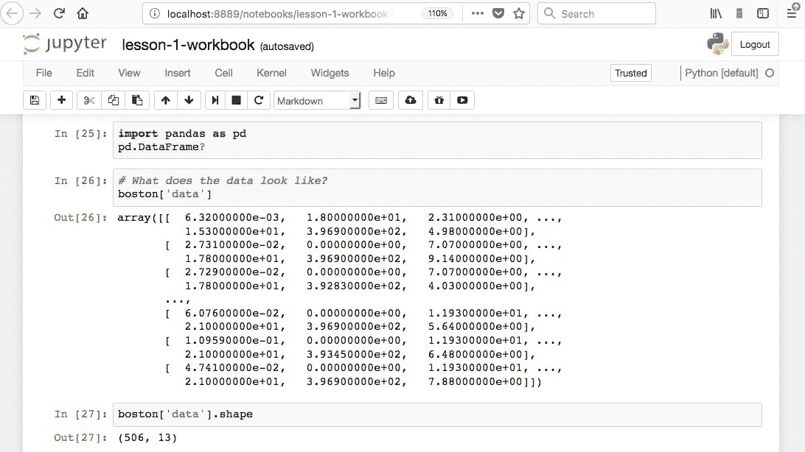

###### 图 1.1：Jupyter Notebook 示例工作簿

熟悉 R 的人应该知道 R Markdown。`README.md` **Markdown** 文件。这种格式适用于基本的文本格式化。它类似于 HTML，但允许的自定义选项较少。

**Markdown** 中常用的符号包括井号（#）用来创建标题，方括号和圆括号用来插入超链接，星号用来创建斜体或粗体文本：

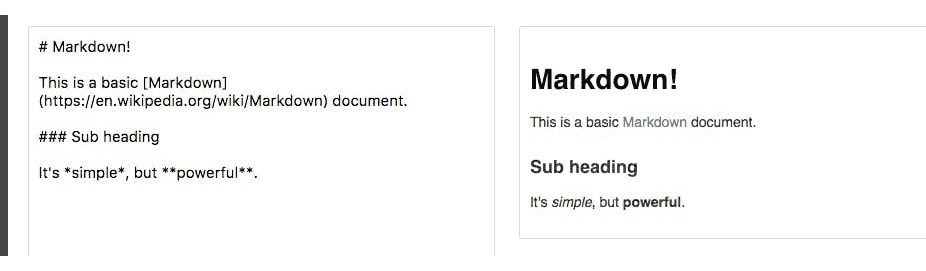

###### 图 1.2：示例 Markdown 文档

在了解了 Markdown 的基础知识后，让我们回到 R Markdown，其中 **Markdown** 文本可以与可执行代码一起编写。Jupyter Notebooks 为 Python 提供了等效的功能，尽管正如我们将看到的，它们的工作方式与 R **Markdown** 文档有很大不同。例如，R **Markdown** 假设你是在写 **Markdown**，除非另有说明，而 Jupyter Notebooks 假设你输入的是代码。这使得 Jupyter Notebooks 更适合用于快速开发和测试。

从数据科学的角度来看，Jupyter Notebook 主要有两种类型，取决于其使用方式：实验室风格和交付式。

实验室风格 Notebooks 是用来作为编程版的研究期刊。这些 Notebooks 应包含你加载、处理、分析和建模数据的所有工作。其理念是记录下你做过的每一步，以便将来参考，因此通常不建议删除或修改之前的实验室风格 Notebooks。同时，随着分析的推进，积累多个带有时间戳的 Notebook 版本也是一个好主意，这样你就可以在需要时回顾之前的状态。

交付式 Notebooks 旨在呈现内容，应该仅包含实验室风格 Notebooks 的一部分内容。例如，这可以是一个有趣的发现，供你与同事分享；也可以是为经理准备的深入分析报告，或是为利益相关者总结的关键发现。

无论是哪种情况，一个重要的概念是可重现性。如果你在记录软件版本时很细心，那么任何收到报告的人都可以重新运行 Notebook 并计算出与你相同的结果。在科学界，可重现性变得越来越困难，这无疑是一个令人耳目一新的做法。

### 导航平台

现在，我们将打开一个 Jupyter Notebook，开始学习其界面。在这里，我们假设你对该平台没有任何先前的了解，并将讲解基本的使用方法。

### 练习 1：介绍 Jupyter Notebooks

1.  在终端中导航到配套材料目录

    #### 注意

    在 Unix 系统如 Mac 或 Linux 上，可以使用 `ls` 显示目录内容，使用 `cd` 切换目录。在 Windows 系统上，使用 `dir` 显示目录内容，使用 `cd` 切换目录。如果你想将驱动器从 C: 切换到 D:，可以执行 d: 来切换驱动器。

1.  在终端中输入以下命令以启动新的本地 Notebook 服务器：

    ```py
    jupyter notebook
    ```

    默认浏览器将会打开一个新的窗口或标签页，显示工作目录中的 Notebook 仪表板。在这里，你将看到其中包含的文件夹和文件列表。

1.  点击一个文件夹以导航到那个特定的路径，然后点击一个文件打开它。虽然它的主要用途是编辑 IPYNB Notebook 文件，Jupyter 也可以作为一个标准的文本编辑器使用。

1.  重新打开用来启动应用程序的终端窗口。我们可以看到`NotebookApp`正在本地服务器上运行。特别是，你应该能看到类似这样的行：

    ```py
    [I 20:03:01.045 NotebookApp] The Jupyter Notebook is running at: http://localhost:8888/?token=e915bb06866f19ce462d959a9193a94c7c088e81765f9d8a
    ```

    访问该 HTTP 地址将会在浏览器窗口中加载应用程序，就像在启动应用时自动执行的那样。关闭窗口并不会停止应用程序；应该通过在终端中输入*Ctrl* + *C*来停止。

1.  在终端中按*Ctrl* + *C*关闭应用程序。你也可能需要通过输入`y`来确认。也请关闭网页浏览器窗口。

1.  运行以下代码加载可用选项列表：

    ```py
    jupyter notebook --help
    ```

1.  通过运行以下命令，在本地端口`9000`打开`NotebookApp`：

    ```py
    jupyter notebook --port 9000
    ```

1.  在 Jupyter 仪表板的右上角点击**新建**，然后从下拉菜单中选择一个内核（即，在**Notebooks**部分选择一个）：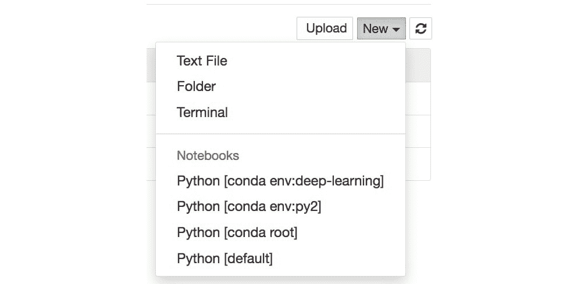

    ###### 图 1.3：从下拉菜单中选择一个内核

    这是创建新 Jupyter Notebook 的主要方法。

    内核为 Notebook 提供编程语言支持。如果你通过 Anaconda 安装了 Python，那么该版本应为默认内核。Conda 虚拟环境也将在这里可用。

    #### 注意

    虚拟环境是管理同一台机器上多个项目的一个很好的工具。每个虚拟环境可能包含不同版本的 Python 和外部库。Python 内置有虚拟环境；然而，Conda 虚拟环境与 Jupyter Notebooks 的集成更好，并且有其他一些优点。文档可以在此查看：[`conda.io/docs/user-guide/tasks/manage-environments.html`](https://conda.io/docs/user-guide/tasks/manage-environments.html)。

1.  在新创建的空白 Notebook 中，点击顶部的单元格并输入`print('hello world')`，或者任何其他会输出到屏幕的代码片段。

1.  点击单元格并按*Shift* + *Enter*，或者选择`stdout`或`stderr`输出，代码运行后会在下面显示结果。此外，最后一行写入的对象的字符串表示也会显示出来。这非常方便，特别是用于显示表格，但有时我们不希望显示最后的对象。在这种情况下，可以在行尾添加分号（;）来抑制显示。新单元格默认期望并运行代码输入；不过，它们也可以改为渲染**Markdown**。

1.  点击一个空白单元格并将其更改为接受 Markdown 格式的文本。这可以通过工具栏中的下拉菜单图标或通过在**单元格**菜单中选择**Markdown**来完成。在这里写一些文本（任何文本都可以），确保使用 Markdown 格式符号，如 #。

1.  滚动到工具栏中的**播放**图标：

    ###### 图 1.4：Jupyter Notebook 工具栏

    这可以用来运行单元格。然而，正如我们稍后所看到的，使用键盘快捷键*Shift* + *Enter*来运行单元格更为方便。

    紧挨着这个按钮的是**停止**图标，可以用来停止单元格的运行。例如，如果某个单元格运行得太慢时，这个功能会非常有用：

    

    ](img/C13018_01_05_2.jpg)

    ###### 图 1.5：Jupyter Notebook 中的停止图标

    可以通过**插入**菜单手动添加新单元格：

    

    ###### 图 1.6：在 Jupyter Notebook 中通过插入菜单添加新单元格

    单元格可以使用图标或通过在**编辑**菜单中选择选项来复制、粘贴和删除：

    

    ###### 图 1.7：Jupyter Notebook 中的编辑菜单

    

    ###### 图 1.8：在 Jupyter Notebook 中剪切和复制单元格

    单元格也可以通过这种方式上下移动：

    

    ###### 图 1.9：在 Jupyter Notebook 中上下移动单元格

    在**单元格**菜单下有一些有用的选项，可以运行一组单元格或整个 Notebook：

    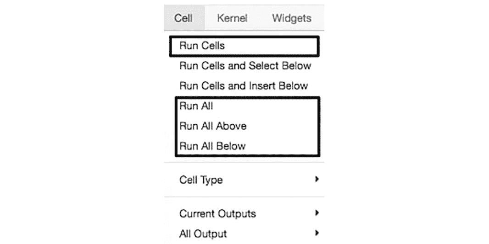

    ###### 图 1.10：在 Jupyter Notebook 中运行单元格

    尝试使用工具栏选项来移动单元格、插入新单元格和删除单元格。关于这些 Notebook 需要理解的一个重要事项是单元格之间共享内存。其实很简单：每个存在于表单上的单元格都可以访问全局变量集。例如，在一个单元格中定义的函数可以从任何其他单元格中调用，变量也是如此。正如预期的那样，函数范围内的任何内容都不会是全局变量，只能在该特定函数内访问。

1.  打开**内核**菜单以查看选项。**内核**菜单对于停止脚本执行以及在内核崩溃时重启 Notebook 很有用。内核也可以随时在这里切换，但由于可重复性问题，不建议为一个 Notebook 使用多个内核。

1.  打开**文件**菜单以查看选项。**文件**菜单包含将 Notebook 下载为各种格式的选项。特别是，建议保存 Notebook 的 HTML 版本，在该版本中内容静态呈现，并且可以像在网页浏览器中一样打开和查看。

    Notebook 的名称将在左上角显示。新的 Notebook 会自动命名为 **未命名**。

1.  点击左上角当前名称，修改你的 IPYNB Notebook 文件名，并输入新名称。然后保存文件。

1.  关闭当前浏览器标签页（退出 Notebook），然后转到应该仍然打开的 **Jupyter 仪表盘** 标签页。（如果没有打开，可以通过复制并粘贴终端中的 HTTP 链接来重新加载它。）

    由于我们没有关闭 Notebook，而且只是保存并退出，它将在 Jupyter 仪表盘的 **文件** 部分的文件名旁边显示绿色书本符号，并且在右侧的最后修改日期旁边标注为 **运行中**。Notebook 可以从这里关闭。

1.  通过选择你正在工作的 Notebook（勾选名称左侧的复选框），然后点击橙色的 **关闭** 按钮来退出 Notebook：

    #### 注

    阅读基础的键盘快捷键并进行测试。

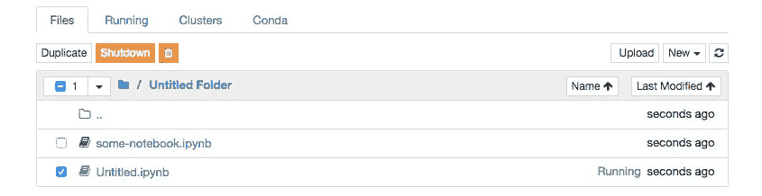

](img/C13018_01_11.jpg)

###### 图 1.11：关闭 Jupyter Notebook

#### 注

如果你打算花很多时间使用 Jupyter Notebook，学习键盘快捷键是很值得的。这将显著加快你的工作流程。特别有用的命令是手动添加新单元的快捷键，以及将单元从代码转换为 Markdown 格式的快捷键。点击 **帮助** 菜单中的 **键盘快捷键** 查看如何操作。

### Jupyter 功能

Jupyter 拥有许多吸引人的功能，使 Python 编程更加高效。这些功能包括从查看文档字符串到执行 Bash 命令的各种方法。我们将在本节中探索其中的一些功能。

#### 注

官方的 IPython 文档可以在这里找到：[`ipython.readthedocs.io/en/stable/`](http://ipython.readthedocs.io/en/stable/)。其中包含我们将在这里讨论的功能及其他内容的详细信息。

### 练习 2：实现 Jupyter 最有用的功能

1.  从 Jupyter 仪表盘中导航到 `lesson-1` 目录，并通过选择打开 `lesson-1-workbook.ipynb`。

    Jupyter Notebook 的标准文件扩展名是 `.ipynb`，它是在 Jupyter 还被称为 IPython Notebook 时引入的。

1.  滚动到 Jupyter Notebook 中的 `Subtopic C: Jupyter Features` 部分。

    我们首先回顾基本的键盘快捷键。它们特别有助于避免频繁使用鼠标，从而大大加快工作流程。

    你可以通过在任何对象后面加上问号并运行单元来获取帮助。Jupyter 会找到该对象的文档字符串，并在应用程序底部弹出窗口中显示它。

1.  运行 **获取帮助** 单元，查看 Jupyter 如何在 Notebook 底部显示文档字符串。在此部分添加一个单元，并获取你选择的对象的帮助：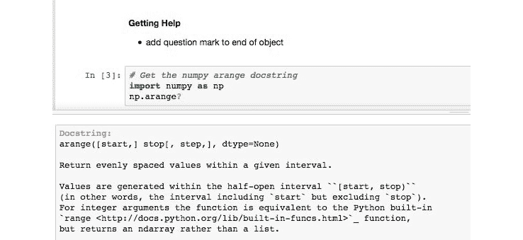

    ###### 图 1.12：在 Jupyter Notebook 中获取帮助

1.  点击 **Tab 完成** 部分的一个空白代码单元格。输入 import（包括后面的空格），然后按下 **Tab** 键：

    ###### 图 1.13：Jupyter Notebook 中的 Tab 完成

    上述操作列出了所有可供导入的模块。

    Tab 完成功能可以用于以下场景：**列出导入外部库时可用的模块**；**列出导入的外部库中的可用模块**；**函数和变量的自动补全**。当你需要了解模块的可用输入参数，探索新库，发现新模块，或者简单地加速工作流程时，这尤其有用。它们可以节省编写变量名或函数的时间，减少因拼写错误导致的 bug。Tab 完成功能如此强大，以至于今天之后，你可能在其他编辑器中编写 Python 代码时会遇到困难！

1.  滚动到 Jupyter 魔法函数部分，并运行包含 `%lsmagic` 和 `%matplotlib inline` 的单元格：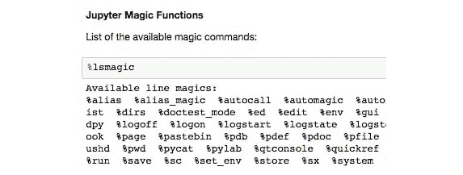

    ###### 图 1.14：Jupyter 魔法函数

    百分号 `%` 和 `%%` 是 Jupyter Notebook 的基本功能之一，称为魔法命令。以 `%%` 开头的魔法命令会应用于整个单元格，而以 `%` 开头的魔法命令只会应用于该行。

    `%lsmagic` 列出了可用的选项。我们将讨论并展示一些最有用的示例。你可能最常见的魔法命令是 `%matplotlib inline`，它允许在 Jupyter Notebook 中显示 matplotlib 图形，而无需显式使用 `plt.show()`。

    定时功能非常实用，有两种类型：标准计时器（`%time` 或 `%%time`）和测量多个迭代平均运行时间的计时器（`%timeit` 和 `%%timeit`）。

    #### 注意

    请注意，列表推导在 Python 中比循环更快。这可以通过比较第一个和第二个单元格的墙时间来看，其中相同的计算在列表推导中显著更快。

1.  运行 `pwd` 的单元格，查看目录中的内容（`ls`），创建新文件夹（`mkdir`），以及写入文件内容（`cat`/`head`/`tail`）。

1.  在笔记本的 **使用 bash** 部分运行第一个单元格。

    该单元格会将一些文本写入工作目录中的文件，打印目录内容，打印空行，然后写回新创建的文件内容并删除该文件：

    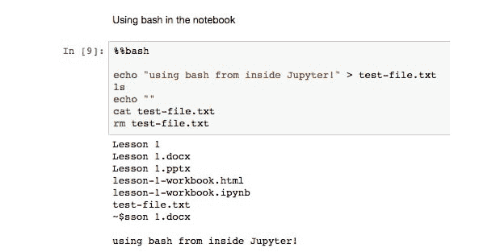

    ###### 图 1.15：在 Jupyter Notebook 中使用 Bash

1.  运行仅包含 `ls` 和 `pwd` 的单元格。

    请注意，我们无需显式使用 Bash 魔法命令，这些命令仍然可以正常工作。还有很多可以安装的外部魔法命令。一个流行的魔法命令是 `ipython-sql`，它允许在单元格中执行 SQL 代码。

1.  打开一个新的终端窗口，并执行以下代码来安装 ipython-sql：

    ```py
    pip install ipython-sql
    ```

    

    ](img/C13018_01_16.jpg)

    ###### 图 1.16：通过 pip 安装 ipython-sql

1.  运行`%load_ext sql`单元格将外部命令加载到 Notebook 中：

    ###### 图 1.17：在 Jupyter Notebook 中加载 sql

    这允许连接到远程数据库，以便可以在 Notebook 中直接执行（并因此记录）查询。

1.  运行包含 SQL 示例查询的单元格：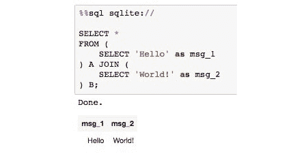

    ###### 图 1.18：运行示例 SQL 查询

    在这里，我们首先连接到本地 sqlite 源；然而，这行代码也可以指向本地或远程服务器上的特定数据库。然后，我们执行一个简单的`SELECT`查询，展示如何将单元格转换为运行 SQL 代码而非 Python 代码。

1.  现在从终端使用`pip`安装版本文档工具。打开一个新窗口并运行以下代码：

    ```py
    pip install version_information
    ```

    安装完成后，可以通过`%load_ext version_information`将其导入到任何 Notebook 中。最后，一旦加载，它可以用来显示 Notebook 中每个软件的版本信息。

    `%version_information`命令有助于文档编写，但它并不是 Jupyter 的标准功能。就像我们刚才看到的 SQL 示例一样，可以通过`pip`从命令行安装。

1.  运行加载并调用`version_information`命令的单元格：

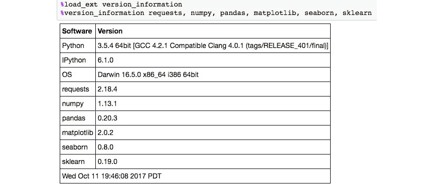

###### 图 1.19：Jupyter 中的版本信息

### 将 Jupyter Notebook 转换为 Python 脚本

你可以将 Jupyter Notebook 转换为 Python 脚本。这相当于将每个代码单元格的内容复制并粘贴到一个`.py`文件中。Markdown 部分也将作为注释包含其中。

转换可以通过`NotebookApp`或命令行完成，如下所示：

```py
jupyter nbconvert --to=python lesson-1-notebook.ipynb
```

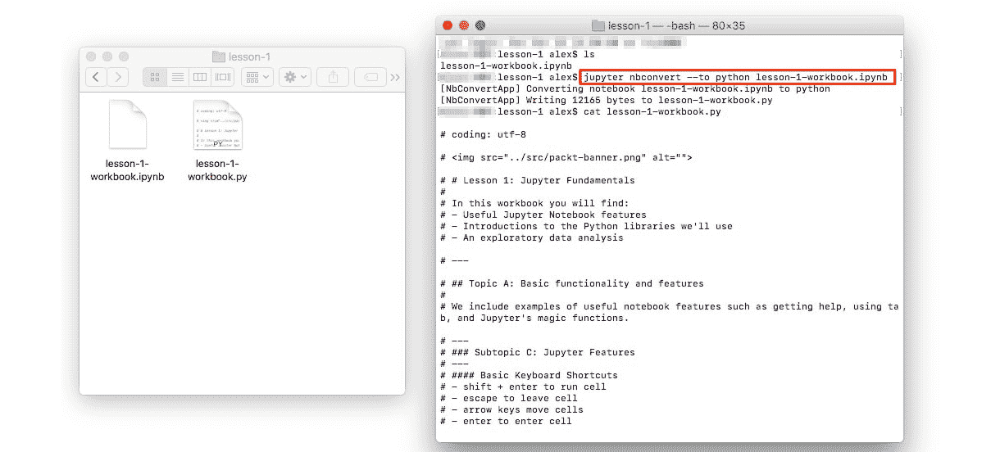

###### 图 1.20：将 Jupyter Notebook 转换为 Python 脚本

这在例如当你想使用`pipreqs`等工具来确定 Notebook 的库需求时非常有用。该工具确定项目中使用的库并将其导出到`requirements.txt`文件中（可以通过运行`pip install pipreqs`来安装）。

命令从包含`.py`文件的文件夹外部调用。例如，如果`.py`文件位于名为`lesson-1`的文件夹中，可以执行以下操作：

```py
pipreqs lesson-1/
```

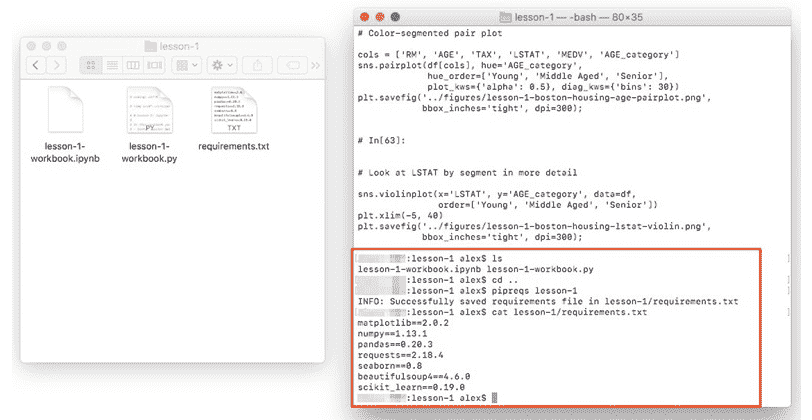

###### 图 1.21：使用 pipreqs 确定库需求

对`lesson-1-workbook.ipynb`的结果`requirements.txt`文件如下所示：

```py
cat lesson-1/requirements.txt 
matplotlib==2.0.2 numpy==1.13.1
pandas==0.20.3 
requests==2.18.4 
seaborn==0.8 
beautifulsoup4==4.6.0 
scikit_learn==0.19.0
```

### Python 库

在了解了 Jupyter Notebooks 的所有基础知识，甚至一些更高级的功能后，我们将把注意力转向本书中将使用的 Python 库。库通常扩展了默认的 Python 函数集。常用的标准库示例有 `datetime`、`time` 和 `os`。这些被称为标准库，因为它们在每次安装 Python 时都会默认包含。

对于 Python 数据科学来说，最重要的库是外部库，也就是说，它们并不包含在 Python 的标准库中。

本书中我们将使用的外部数据科学库有：NumPy、Pandas、Seaborn、matplotlib、scikit-learn、Requests 和 Bokeh。

#### 注意

提醒一句：最好按照行业标准导入库，例如，`import numpy as np`；这样代码更具可读性。尽量避免使用 `from numpy import *`，因为你可能会不小心覆盖函数。此外，通常将模块与库通过点（.）连接在一起，这样代码的可读性更好。

让我们简要介绍一下每个库。

+   **NumPy** 提供了多维数据结构（数组），其操作速度比标准的 Python 数据结构（例如列表）要快得多。这部分是通过使用 C 在后台执行操作来实现的。NumPy 还提供了各种数学和数据处理功能。

+   `NaN` 条目和计算数据的统计描述。本书将重点介绍 Pandas DataFrame 的使用。

+   **Matplotlib** 是一个受 MATLAB 平台启发的绘图工具。熟悉 R 的人可以将其视为 Python 版本的 ggplot。它是最流行的 Python 绘图库，允许高度的自定义。

+   **Seaborn** 是 matplotlib 的扩展，其中包括了许多对于数据科学非常有用的绘图工具。一般来说，这使得分析工作比使用像 matplotlib 和 scikit-learn 这样的库手动创建相同的图形要更快。

+   **scikit-learn** 是最常用的机器学习库。它提供了顶级的算法和非常优雅的 API，其中模型被实例化后，使用数据进行 *拟合*。它还提供数据处理模块和其他对于预测分析有用的工具。

+   **Requests** 是进行 HTTP 请求的首选库。它使得从网页获取 HTML 内容以及与 API 进行交互变得非常简单。对于 HTML 的解析，许多人选择使用 BeautifulSoup4，这本书中也会涉及到它。

+   **Bokeh** 是一个交互式可视化库。它的功能类似于 matplotlib，但允许我们向图表中添加悬停、缩放、点击等交互工具。它还允许我们在 Jupyter Notebook 中渲染和操作图表。

介绍完这些库之后，让我们回到 Notebook，并通过运行 `import` 语句来加载它们。这将引导我们进入第一次分析，开始使用数据集。

### 练习 3：导入外部库并设置绘图环境

1.  打开 `lesson 1` Jupyter Notebook，并滚动到 `Subtopic D: Python Libraries` 部分。

    就像常规的 Python 脚本一样，库可以随时导入到 Notebook 中。最好的做法是将大多数使用的包放在文件的顶部。有时，在 Notebook 中间加载库也是有意义的，完全没问题。

1.  运行单元格以导入外部库并设置绘图选项：

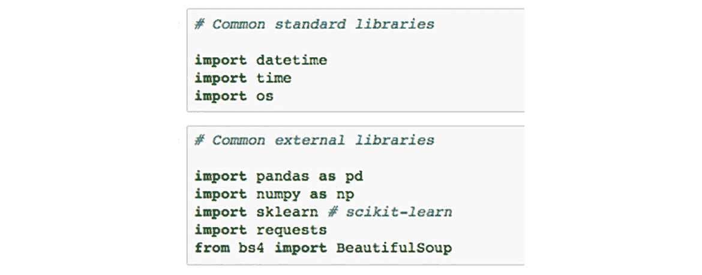

###### 图 1.22：导入 Python 库

对于一个良好的 Notebook 设置，通常将各种选项和导入放在顶部非常有用。例如，下面的代码可以运行，改变图形的外观，使其看起来比 matplotlib 和 Seaborn 的默认设置更具美感：

```py
import matplotlib.pyplot as plt
%matplotlib inline import 
seaborn as sns
# See here for more options: https://matplotlib.org/users/ customizing.html
%config InlineBackend.figure_format='retina' 
sns.set() # Revert to matplotlib defaults 
plt.rcParams['figure.figsize'] = (9, 6)
plt.rcParams['axes.labelpad'] = 10 sns.set_style("darkgrid")
```

到目前为止，在本书中，我们已经介绍了使用 Jupyter Notebook 进行数据科学的基础知识。我们从探索平台并熟悉界面开始。接着，我们讨论了最有用的特性，包括选项卡补全和魔法函数。最后，我们介绍了本书中将要使用的 Python 库。

接下来的部分将非常互动，我们将一起使用 Jupyter Notebook 进行第一次分析。

## 我们的第一次分析 - 波士顿房价数据集

到目前为止，本章已集中介绍了 Jupyter 的特性和基本使用方法。现在，我们将付诸实践，进行一些数据探索和分析。

本节我们将查看的 数据集 是所谓的波士顿房价数据集。它包含了有关波士顿市区各个地区的美国人口普查数据。每个样本对应一个独特的地区，并且有大约十几个测量值。我们应该把样本看作行，把测量值看作列。该数据集首次发布于 1978 年，非常小，只有大约 500 个样本。

既然我们已经了解了数据集的背景，接下来让我们决定一个大致的探索和分析计划。如果适用，这个计划将包括相关的研究问题。在这种情况下，目标不是回答一个问题，而是展示 Jupyter 的实际应用，并说明一些基本的数据分析方法。

我们对这个分析的总体方法将是：

+   使用 Pandas DataFrame 将数据加载到 Jupyter 中

+   定量理解特征

+   寻找模式并生成问题

+   回答问题以解决问题

### 使用 Pandas DataFrame 将数据加载到 Jupyter 中

数据通常以表格形式存储，这意味着它可以保存为**逗号分隔值**（**CSV**）文件。此格式和其他许多格式可以通过 Pandas 库读取为 DataFrame 对象。其他常见的格式包括**制表符分隔变量**（**TSV**）、SQL 表格和 JSON 数据结构。事实上，Pandas 支持所有这些格式。不过，在本示例中，我们不打算通过这种方式加载数据，因为数据集可以直接通过 scikit-learn 获得。

#### 注意

加载数据进行分析后的一个重要部分是确保数据的清洁。例如，我们通常需要处理缺失数据，并确保所有列的数据类型正确。本节中使用的数据集已经清理过，因此我们不需要担心这一点。然而，在第二章中我们将看到更混乱的数据，并探索处理这些数据的技术。

### 练习 4：加载波士顿房价数据集

1.  滚动到 Jupyter Notebook 第一章中 `Topic B: 我们的第一次分析：波士顿房价数据集` 的 `Subtopic A` 部分。

    可以通过 `sklearn.datasets` 模块使用 `load_boston` 方法访问波士顿房价数据集。

1.  运行本节中的前两个单元格以加载波士顿数据集，并查看`datastructures`类型：

    ](img/C13018_01_23.jpg)

    ###### 图 1.23：加载波士顿数据集

    第二个单元格的输出告诉我们它是一个 scikit-learn 的`Bunch`对象。让我们进一步了解它，以便理解我们正在处理的内容。

1.  运行下一个单元格以从 scikit-learn `utils` 导入基础对象，并在我们的笔记本中打印文档字符串：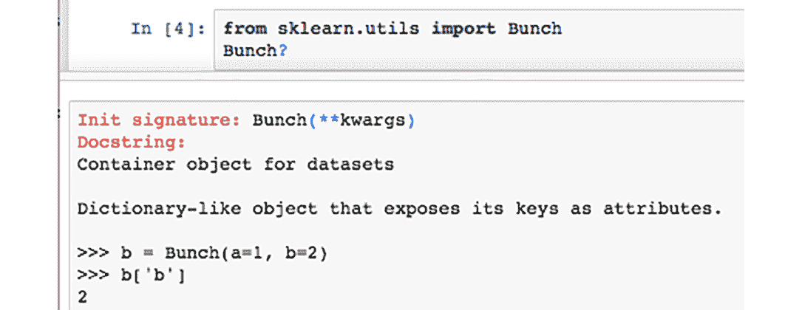

    ](img/C13018_01_24.jpg)

    ###### 图 1.24：导入基础对象并打印文档字符串

1.  通过运行下一个单元格打印字段名称（即字典的键）。我们发现这些字段是自解释的：`['DESCR', 'target', 'data', 'feature_names']`。

1.  运行下一个单元格以打印 `boston['DESCR']` 中包含的数据集描述。

    请注意，在此调用中，我们明确希望打印字段值，以便笔记本以比字符串表示更易读的格式呈现内容（即，如果我们只是输入 `boston['DESCR']` 而不将其包裹在 `print` 语句中）。然后我们可以看到如前所述的数据集信息：

    ```py
    Boston House Prices dataset
    ===========================
    Notes
    ------
    Data Set Characteristics:
    :Number of Instances: 506
    :Number of Attributes: 13 numeric/categorical predictive
    :Median Value (attribute 14) is usually the target	
    :Attribute Information (in order):
    - CRIM	per capita crime rate by town
    …
    …
    - MEDV     Median value of owner-occupied homes in $1000's
    :Missing Attribute Values: None
    ```

    #### 注意

    简要阅读特征描述和/或自行描述它们。对于本教程来说，最重要的字段是`Attribute` `Information`。我们将在分析过程中以此为参考。

    #### 注意

    完整代码请参考以下链接：[`bit.ly/2EL11cW`](https://bit.ly/2EL11cW)

    现在，我们将创建一个包含数据的 Pandas DataFrame。这样做有几个好处：所有数据都将存储在一个对象中，我们可以使用有用且计算效率高的 DataFrame 方法，此外，像 Seaborn 这样的其他库也能很好地与 DataFrame 集成。

    在这种情况下，我们将使用标准构造方法创建 DataFrame。

1.  运行导入 Pandas 并检索 `pd.DataFrame` 文档字符串的单元格：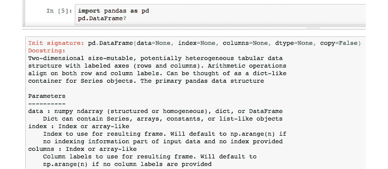

    ###### 图 1.25：检索 pd.DataFrame 的文档字符串

    文档字符串揭示了 DataFrame 输入参数。我们希望将 `boston['data']` 作为数据输入，并使用 `boston['feature_names']` 作为列名。

1.  运行接下来的几个单元格，打印数据、其形状和特征名：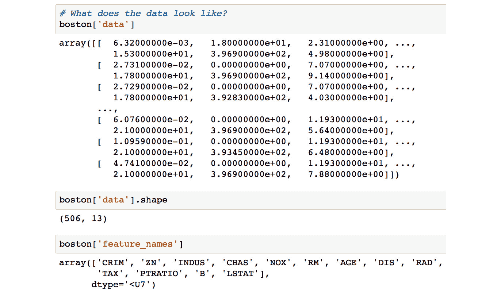

    ###### 图 1.26：打印数据、形状和特征名

    从输出中，我们看到数据是一个二维的 NumPy 数组。运行命令 `boston['data'].shape` 会返回长度（样本数）和特征数量，分别作为第一个和第二个输出。

1.  通过运行以下代码将数据加载到 Pandas DataFrame `df` 中：

    ```py
    df = pd.DataFrame(data=boston['data'], 
    columns=boston['feature_names'])
    ```

    在机器学习中，被建模的变量称为目标变量；它是你试图根据特征预测的内容。对于这个数据集，建议的目标是 **MEDV**，即以千美元为单位的房屋中位数价格。

1.  运行下一个单元格查看目标的形状：

    ###### 图 1.27：查看目标形状的代码

    我们看到它的长度与特征相同，这是我们预期的。因此，可以将其作为新列添加到 DataFrame 中。

1.  通过运行以下代码将目标变量添加到 df 中：

    ```py
    df['MEDV'] = boston['target']
    ```

1.  通过运行以下代码，将目标变量移到 `df` 的前面：

    ```py
    y = df['MEDV'].copy() 
    del df['MEDV']
    df = pd.concat((y, df), axis=1)
    ```

    这样做是为了通过将目标存储在 DataFrame 的前面，区分目标和特征。

    在这里，我们引入一个虚拟变量 `y` 来保存目标列的副本，然后将其从 DataFrame 中移除。接着，我们使用 Pandas 的连接函数将其与剩余的 DataFrame 沿着第 1 轴（而不是第 0 轴，即行方向）连接。

    #### 注意

    你将经常看到使用点表示法来引用 DataFrame 的列。例如，之前我们可以使用 `y = df.MEDV.copy()`。然而，这种方法无法删除列；`del df.MEDV` 会引发错误。

1.  实现 `df.head()` 或 `df.tail()` 来查看数据，使用 `len(df)` 来验证样本数量是否符合预期。运行接下来的几个单元格查看 `df` 的头部、尾部和长度：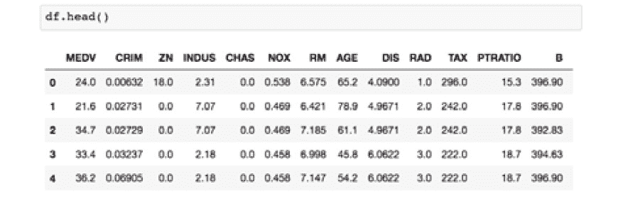

    ###### 图 1.28：打印数据框 df 的前几行

    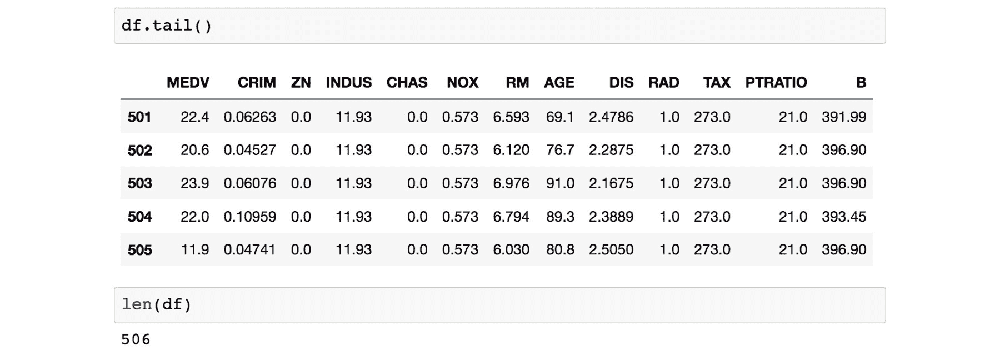

    ###### 图 1.29：打印数据框 df 的尾部

    每一行都有一个索引值，如表格左侧加粗显示的数字。默认情况下，这些索引是从 0 开始的整数，并且每行递增 1。

1.  打印 `df.dtypes` 会显示每一列所包含的数据类型。运行下一个单元格查看每列的数据类型。对于这个数据集，我们看到每个字段都是浮动类型，因此很可能是连续变量，包括目标变量。这意味着预测目标变量是一个回归问题。

1.  运行 `df.isnull()` 来清理数据集，因为 Pandas 会自动将缺失数据设置为 `NaN` 值。要获取每列的 `NaN` 值数量，可以执行 `df.isnull().sum()`：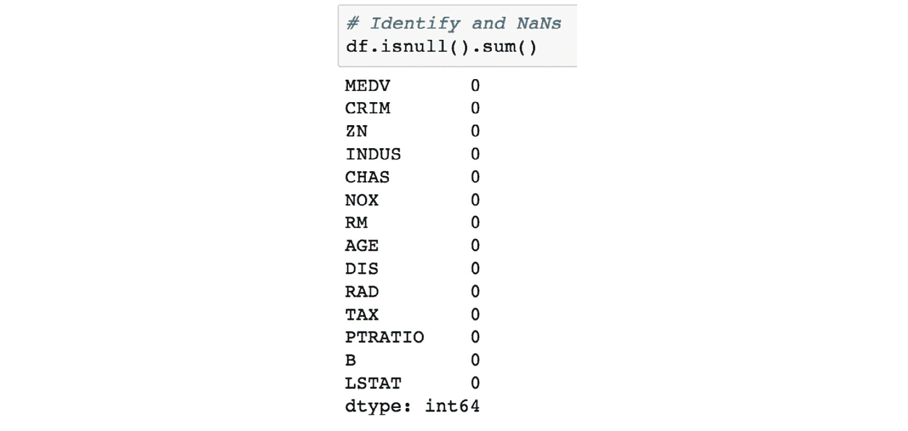

    ###### 图 1.30：通过识别 NaN 值清理数据集

    `df.isnull()` 返回一个与 `df` 长度相同的布尔值框架。

    对于这个数据集，我们看到没有 `NaN` 值，这意味着我们不需要立即清理数据，可以继续进行后续操作。

1.  通过运行包含以下代码的单元格来移除一些列：

    ```py
    for col in ['ZN', 'NOX', 'RAD', 'PTRATIO', 'B']:
    del df[col]
    ```

    这样做是为了简化分析。接下来，我们将更详细地关注剩余的列。

### 数据探索

由于这是一个我们之前从未见过的新数据集，首要任务是理解数据。我们已经看到过数据的文本描述，这是理解数据的定性信息。接下来，我们将进行定量描述。

### 练习 5：分析波士顿住房数据集

1.  在 Jupyter Notebook 中导航到 `子主题 B：数据探索`，并运行包含 `df.describe()` 的单元格：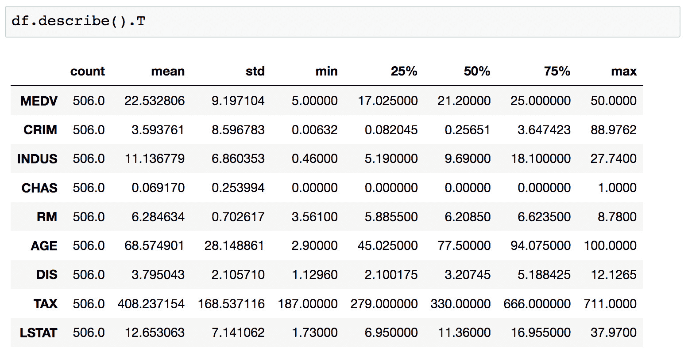

    ###### 图 1.31：统计属性的计算及输出

    这会计算每列的各种统计属性，包括均值、标准差、最小值和最大值。这个表格提供了一个关于所有数据分布的总体概念。请注意，我们通过在输出结果后添加 `.T` 来转换结果，这会交换行和列。

    在继续分析之前，我们将指定一组重点关注的列。

1.  运行包含定义“重点列”内容的单元格：

    ```py
    cols = ['RM', 'AGE', 'TAX', 'LSTAT', 'MEDV']
    ```

1.  通过运行 `df[cols].head()` 来显示上述数据框的子集：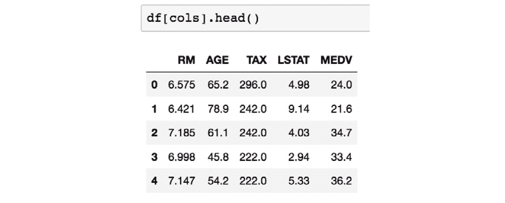

    ###### 图 1.32：显示重点列

    为了提醒自己，我们回顾一下每一列的含义。根据数据集文档，我们有以下信息：

    ```py
    - RM       average number of rooms per dwelling
            - AGE      proportion of owner-occupied units built prior to 1940
            - TAX      full-value property-tax rate per $10,000
            - LSTAT    % lower status of the population
            - MEDV     Median value of owner-occupied homes in $1000's
    ```

    为了在数据中寻找模式，我们可以从计算成对相关性开始，使用 `pd.DataFrame.corr`。

1.  通过运行包含以下代码的单元格来计算选定列的成对相关性：

    ```py
    df[cols].corr()
    ```

    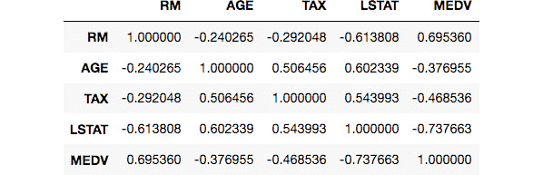

    ###### 图 1.33：成对计算相关性

    这个结果表格显示了每一组值之间的相关性得分。较大的正得分表示强正相关（即方向相同）。如预期所示，我们在对角线看到最大值为 1。

    默认情况下，Pandas 会计算每对值的标准相关系数，这也叫做 Pearson 系数。其定义为两个变量的协方差除以它们标准差的乘积：

    

    协方差的定义如下：

    

    这里，n 是样本数量，xi 和 yi 是被求和的单个样本，X 和 Y 分别是每组数据的均值。

    与其使劲眯眼去看前面的表格，使用热图来可视化数据会更为直观。这可以通过 Seaborn 很容易实现。

1.  运行下一个单元格来初始化绘图环境，正如本章前面所讨论的。然后，为了创建热图，运行包含以下代码的单元格：

    ```py
    import matplotlib.pyplot as plt import seaborn as sns
    %matplotlib inline
    ax = sns.heatmap(df[cols].corr(),
    cmap=sns.cubehelix_palette(20, light=0.95,
    dark=0.15))
    ax.xaxis.tick_top() # move labels to the top
    plt.savefig('../figures/lesson-1-boston-housing-corr.png', bbox_inches='tight', dpi=300)
    ```

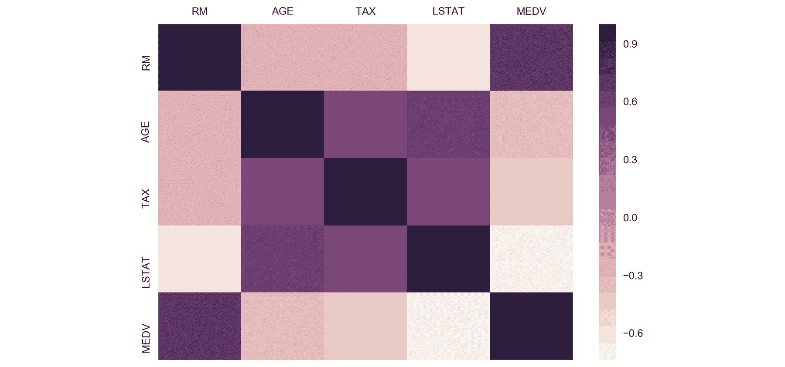

###### 图 1.34：所有变量的热图绘制

我们调用 `sns.heatmap` 并将配对相关矩阵作为输入。我们使用自定义的色彩调色板来覆盖 Seaborn 的默认设置。该函数返回一个 `matplotlib.axes` 对象，并由变量 `ax` 引用。

最终的图表会以高分辨率 PNG 格式保存到 `figures` 文件夹中。

在我们数据集探索的最后一步，我们将使用 Seaborn 的 `pairplot` 函数来可视化数据。

使用 Seaborn 的 `pairplot` 函数可视化数据框。运行以下代码所在的单元格：

```py
sns.pairplot(df[cols],
plot_kws={'alpha': 0.6},
diag_kws={'bins': 30})
```

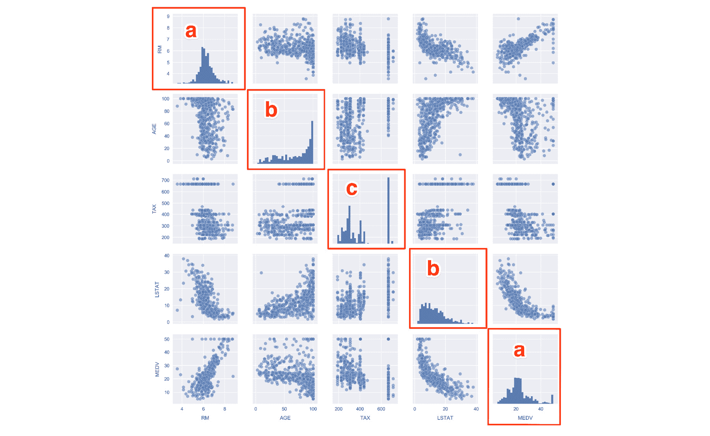

###### 图 1.35：使用 Seaborn 进行数据可视化

#### 注意

请注意，无监督学习技术超出了本书的讨论范围。

查看对角线上的直方图，我们可以看到以下内容：

**a**：**RM** 和 **MEDV** 的分布形态最接近正态分布。

**b**：**AGE** 向左偏斜，**LSTAT** 向右偏斜（这可能看起来违反直觉，但偏斜是指均值相对于最大值的位置）。

**c**：对于 **TAX**，我们发现分布的大部分集中在 700 左右。这一点从散点图中也能看出来。

详细查看 `df.describe()` 后，**MDEV** 的最小值和最大值分别为 5k 和 50k。这表明数据集中中位数房价的上限为 50k。

### 使用 Jupyter Notebooks 进行预测分析简介

继续分析波士顿住房数据集，我们可以看到它为我们提供了一个回归问题，要求根据一组特征预测连续的目标变量。特别地，我们将预测中位数房价（**MEDV**）。

我们将训练只使用一个特征作为输入的模型来进行预测。通过这种方式，模型在概念上会比较简单，便于理解，我们可以更加专注于 scikit-learn API 的技术细节。然后，在下一章，你将能更轻松地处理相对复杂的模型。

### 练习 6：使用 Seaborn 和 Scikit-learn 应用线性模型

1.  滚动到 Jupyter Notebook 中的`子话题 C: 预测分析简介`，并查看上方我们在前一部分中创建的 pairplot。特别是，查看左下角的散点图：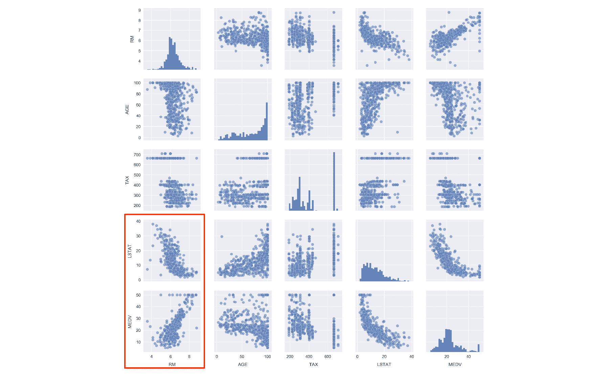

    ###### 图 1.36：MEDV 和 LSTAT 的散点图

    请注意，每个房屋的房间数 (**RM**) 和人口中属于低收入阶层的百分比 (**LSTAT**) 与中位房价 (**MDEV**) 高度相关。让我们提出以下问题：基于这些变量，我们能多好地预测 **MDEV**？

    为了帮助回答这个问题，让我们首先使用 Seaborn 可视化这些关系。我们将绘制散点图并加上最佳拟合线性模型。

1.  通过运行包含以下内容的单元格，绘制带有线性模型的散点图：

    ```py
    fig, ax = plt.subplots(1, 2) sns.regplot('RM', 'MEDV', df, ax=ax[0],
    scatter_kws={'alpha': 0.4})) sns.regplot('LSTAT', 'MEDV', df, ax=ax[1],
    scatter_kws={'alpha': 0.4}))
    ```

    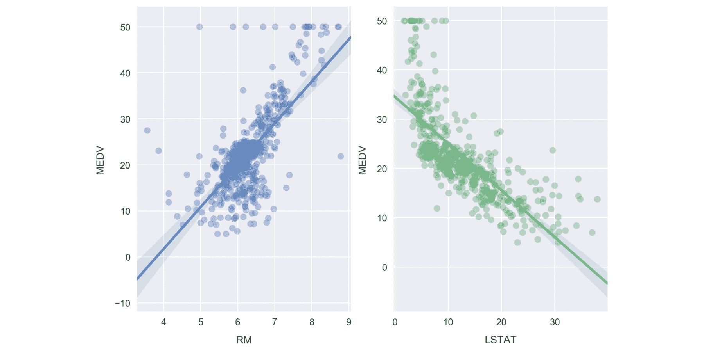

    ###### 图 1.37：使用线性模型绘制散点图

    最佳拟合线是通过最小化普通最小二乘误差函数计算得出的，这是 Seaborn 在我们调用 `regplot` 函数时自动完成的。还要注意线条周围的阴影区域，它们表示 95% 的置信区间。

    #### 注意

    这些 95% 置信区间是通过计算与最佳拟合线垂直的每个数据区间的标准差来确定的，实际上是确定每个点的置信区间。在实践中，这涉及到 Seaborn 对数据进行自助抽样处理，这是通过随机抽样并且允许重复的方式生成新数据。自助抽样的样本数量是根据数据集的大小自动确定的，但也可以通过传递 `n_boot` 参数手动设置。

1.  通过运行以下单元格，使用 Seaborn 绘制残差图：

    ```py
    fig, ax = plt.subplots(1, 2)
    ax[0] = sns.residplot('RM', 'MEDV', df, ax=ax[0],
    scatter_kws={'alpha': 0.4}) ax[0].set_ylabel('MDEV residuals $(y-\hat{y})$') ax[1] = sns.residplot('LSTAT', 'MEDV', df, ax=ax[1],
    scatter_kws={'alpha': 0.4})
    ax[1].set_ylabel('')
    ```

    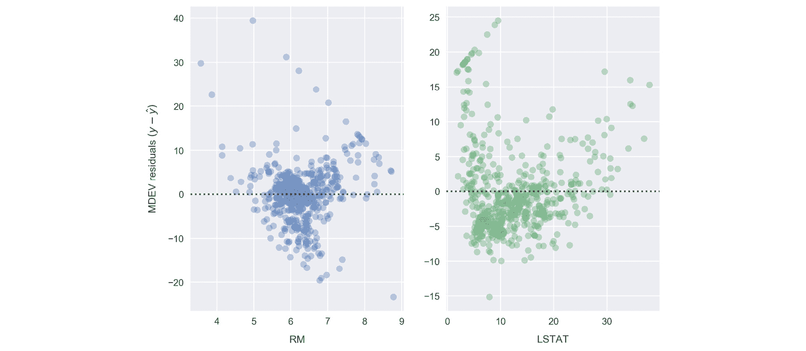

    ###### 图 1.38：使用 Seaborn 绘制残差图

    这些残差图上的每个点代表该样本 (`y`) 和线性模型预测值 (`ŷ`) 之间的差异。大于零的残差表示模型会低估这些数据点。反之，低于零的残差则表示模型会高估这些数据点。

    这些图中的模式可能表明建模效果不佳。在每个前述案例中，我们看到正区间内呈对角线排列的散点。这些是由于 **MEDV** 被限制在 $50,000 上限所造成的。**RM** 数据较好地聚集在 0 附近，表示拟合良好。另一方面，**LSTAT** 数据似乎聚集在低于 0 的位置。

1.  定义一个使用 scikit-learn 的函数来计算最佳拟合线和均方误差，方法是运行包含以下内容的单元格：

    ```py
    def get_mse(df, feature, target='MEDV'): # Get x, y to model
    y = df[target].values
    x = df[feature].values.reshape(-1,1)
    ...
    ...
    error = mean_squared_error(y, y_pred) print('mse = {:.2f}'.format(error)) print()
    ```

    #### 注意

    完整代码请参见以下链接：[`bit.ly/2JgPZdU`](https://bit.ly/2JgPZdU)

    在`get_mse`函数中，我们首先将变量`y`和`x`分别分配给目标 MDEV 和自变量特征。这些变量通过调用`values`属性被转换为 NumPy 数组。自变量特征数组被重塑为 scikit-learn 期望的格式；当建模一维特征空间时，只有在这种情况下才需要重塑。然后，模型被实例化并在数据上进行拟合。对于线性回归，拟合过程包括使用普通最小二乘法计算模型参数（最小化每个样本的误差平方和）。最后，在确定参数后，我们预测目标变量并使用结果计算**MSE**。

1.  通过运行包含以下内容的单元格，调用`get_mse`函数来处理**RM**和**LSTAT**：

    ```py
    get_mse(df, 'RM') get_mse(df, 'LSTAT')
    ```


###### 图 1.39：调用`get_mse`函数计算 RM 和 LSTAT

比较**MSE**，结果显示**LSTAT**的误差略低。然而，回顾散点图，我们可能会发现使用多项式模型对**LSTAT**进行建模会更成功。在接下来的活动中，我们将通过使用 scikit-learn 计算一个三次多项式模型来验证这一点。

让我们暂时忘记波士顿住房数据集，考虑另一个可能会用到多项式回归的实际情况。以下是一个建模天气数据的示例。在接下来的图表中，我们可以看到温哥华（加拿大 BC 省）的温度（线条）和降水量（条形）：


###### 图 1.40：可视化温哥华（加拿大）的天气数据

这些字段中的任何一个都可能非常适合由四次多项式进行拟合。如果你对预测某个连续日期范围内的温度或降水量感兴趣，那么这个模型会非常有价值。

#### 注意

你可以在此找到数据源：[`climate.weather.gc.ca/climate_normals/results_e.`](http://climate.weather.gc.ca/climate_normals/results_e.html?stnID=888)html?stnID=888。

### 活动 1：构建三次多项式模型

将注意力重新转回波士顿住房数据集，我们希望构建一个三次多项式模型来与线性模型进行比较。回想一下我们要解决的实际问题：给定低收入人口的百分比，预测中位数房价。这个模型对潜在的波士顿购房者会有帮助，尤其是那些关心自己社区低收入人口比例的人。

我们的目标是使用 scikit-learn 拟合一个多项式回归模型，以预测中位数房屋价值（**MEDV**），给定**LSTAT**值。我们希望构建一个具有较低均方误差（**MSE**）的模型。为了实现这一目标，需要执行以下步骤：

1.  滚动到`Subtopic C`下方 Jupyter Notebook 中的空单元格。这些单元格位于线性模型`Activity`标题下方。

    #### 注意

    在我们完成活动时，您应该使用代码填充这些空单元格。随着单元格填充，您可能需要插入新的单元格；请根据需要进行操作。

1.  从`df`中提取我们的依赖特征和目标变量。

1.  通过打印前三个样本，验证`x`的样子。

1.  通过从 scikit-learn 导入适当的转换工具，将`x`转换为“多项式特征”。

1.  通过运行`fit_transform`方法并构建多项式特征集，转换`x`。

1.  通过打印前几个样本，验证`x_poly`的样子。

1.  导入`LinearRegression`类，并像计算 MSE 时一样构建我们的线性分类模型。

1.  提取系数并打印多项式模型。

1.  确定每个样本的预测值并计算残差。

1.  打印一些残差值。

1.  打印三阶多项式模型的 MSE。

1.  绘制多项式模型及其样本。

1.  绘制残差。

    #### 注意

    详细步骤和解决方案见*附录 A*（第 144 页）。

成功使用多项式模型建模数据后，让我们通过查看分类特征来结束这一章。特别是，我们将构建一组分类特征，并使用它们更详细地探索数据集。

### 使用分类特征进行分段分析

通常，我们会遇到包含连续字段和分类字段的数据集。在这种情况下，我们可以通过将连续变量与分类字段结合来学习数据并发现模式。

作为一个具体示例，假设你正在评估广告活动的投资回报率。你能访问的数据包含一些计算得到的**投资回报率**（**ROI**）指标。这些值是每日计算并记录的，你正在分析去年的数据。你的任务是从数据中获取可操作的见解，找出改进广告活动的方法。在查看 ROI 的每日时间序列时，你会看到数据中的每周波动。通过按星期几分段，你发现了以下 ROI 分布（其中 0 代表一周的第一天，6 代表最后一天）。


###### 图 1.41：投资回报率的示例小提琴图

由于我们正在使用的波士顿住房数据集中没有任何类别字段，我们将通过有效地离散化一个连续字段来创建一个。在我们的例子中，这将涉及将数据分为“低”、“中”和“高”三个类别。需要注意的是，我们并非单纯地创建一个类别数据字段来说明本节中的数据分析概念。正如我们将看到的那样，做这件事可以揭示一些数据中的洞察，这些洞察否则可能会难以察觉或完全无法获取。

### 练习 7：从连续变量创建类别字段并制作分段可视化

1.  向上滚动到 Jupyter Notebook 中的 pairplot，我们比较了**MEDV**、**LSTAT**、**TAX**、**AGE**和**RM**：!

    ](img/C13018_01_49.jpg)

    ###### 图 1.42：MEDV、LSTAT、TAX、AGE 和 RM 的图表比较

    看一下包含**AGE**（年龄）的面板。提醒一下，这个特征被定义为*1940 年之前建成的业主自住单元的比例*。我们将把这个特征转换为一个类别变量。转换后，我们将能够重新绘制这个图，每个面板根据年龄类别通过颜色进行分段。

1.  向下滚动到`Subtopic D: Building and exploring categorical features`并点击第一个单元格。输入并执行以下命令以绘制`kde_kws={'lw': 0}`，以跳过前图中的核密度估计图。

    看这个图，低**AGE**（年龄）样本非常少，而**AGE**较大的样本则多得多。这可以从分布在最右侧的陡峭度看出来。

    红线表示分布中的 1/3 和 2/3 点。观察分布与这些水平线的交点，我们可以看到，只有大约 33%的样本**AGE**小于 55，33%的样本**AGE**大于 90！换句话说，三分之一的住宅区有不到 55%的房屋是在 1940 年之前建成的。这些可以视为相对较新的社区。另一方面，另三分之一的住宅区有超过 90%的房屋是在 1940 年之前建成的。这些被认为是非常老的社区。我们将使用红色水平线与分布交点的位置作为指南，将该特征分为：**相对较新**、**相对较旧**和**非常旧**三个类别。

1.  创建一个新的类别特征，并通过运行以下代码设置分割点：

    ```py
    def get_age_category(x): if x < 50:
    return 'Relatively New' elif 50 <= x < 85:
    return 'Relatively Old' else:
    return 'Very Old'
    df['AGE_category'] = df.AGE.apply(get_age_category)
    ```

    在这里，我们使用了非常方便的 Pandas 方法 apply，它将一个函数应用于给定的列或一组列。在这种情况下，应用的函数是`get_age_category`，它应该接受表示数据行的一个参数，并为新列返回一个值。在这种情况下，传递的数据行只是一个单独的值，`pd.Series.str`可以更快地完成同样的事情。因此，建议避免使用它，特别是在处理大型数据集时。在即将来临的章节中，我们将看到一些矢量化方法的示例。

1.  通过在新的单元格中键入`df.groupby('AGE_category').size()`并运行来验证我们已经分组到每个年龄类别中的样本数：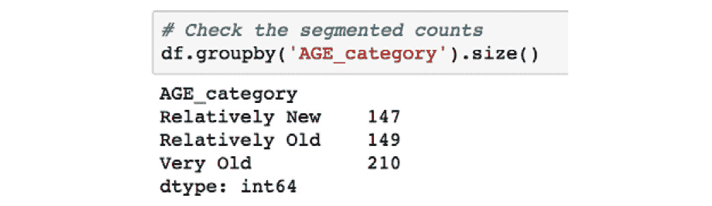

    ###### 图 1.44：验证变量的分组

    从结果来看，可以看到两个类大小相当，而`AGE_category`。

1.  运行以下代码构建小提琴图：

    ```py
    sns.violinplot(x='MEDV', y='AGE_category', data=df, order=['Relatively New', 'Relatively Old',
    'Very Old']);
    ```

    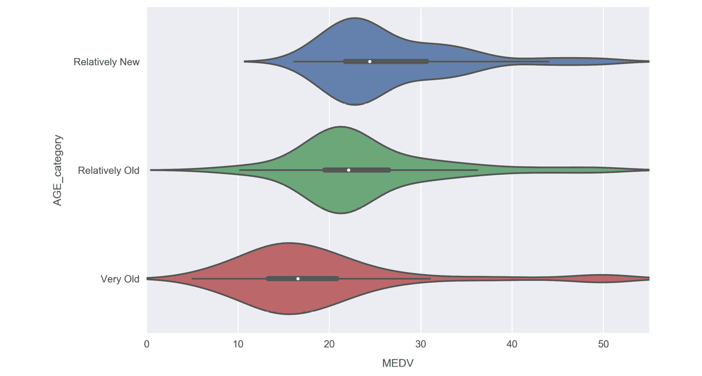

    ###### 图 1.45：AGE_category 和 MEDV 的小提琴图

    小提琴图显示了每个年龄类别中位房屋价值分布的核密度估计。我们看到它们都类似于正态分布。非常老的组包含最低的中位房屋价值样本，并具有相对较大的宽度，而其他组则更紧密地围绕它们的平均值。年轻组偏向于高端，这可以从分布体内的厚黑线中的白色点的右侧扩展和位置看出。

    这个白色点表示均值，而厚黑线大致跨越了人口的 50%（填充到白色点两侧的第一个四分位数）。细黑线表示箱线图的须，跨越了人口的 95%。可以通过向`sns.violinplot()`传递`inner='point'`来修改这个内部可视化，我们现在来做一下。

1.  重新构建小提琴图，在`sns.violinplot`调用中添加`inner='point'`参数：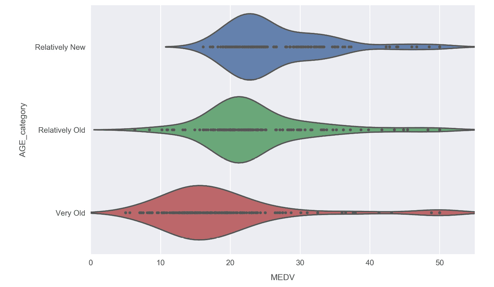

    ###### 图 1.46：AGE_category 和 MEDV 的小提琴图，内部设置为 'point' 参数

    为了测试目的，制作这样的图表是很好的，以便看到底层数据如何连接到视觉。例如，我们可以看到对于**相对新**部分，没有中位数低于大约 $16,000 的房屋价值数据，因此分布尾部实际上不包含数据。由于我们数据集很小（只有约 500 行），我们可以看到每个段落都是这样的情况。

1.  重新构建先前的 pairplot，但现在包括每个`hue`参数的颜色标签，如下所示：

    ```py
    cols = ['RM', 'AGE', 'TAX', 'LSTAT', 'MEDV', 'AGE_
    category']
    sns.pairplot(df[cols], hue='AGE_category',
    hue_order=['Relatively New', 'Relatively Old',
    'Very Old'],
    plot_kws={'alpha': 0.5}, diag_kws={'bins':
    30});
    ```

    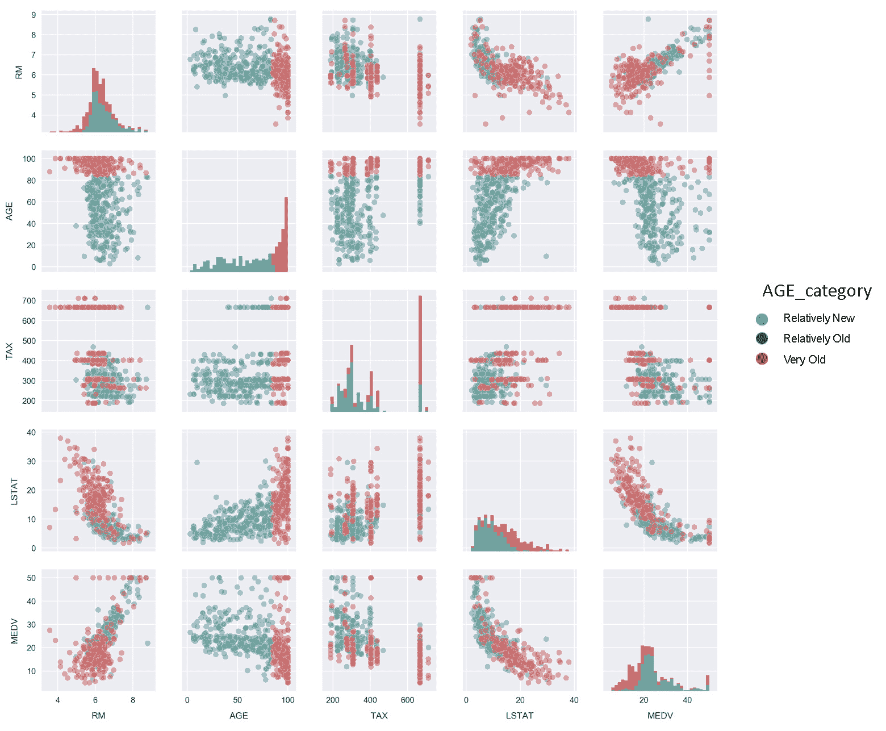

    ###### 图 1.47：使用 AGE 的颜色标签重新构建所有变量的 pairplot

    从直方图来看，**RM**和**TAX**每个区段的基础分布相似。另一方面，**LSTAT**的分布看起来更加不同。我们可以通过再次使用小提琴图，进一步关注这些差异。

1.  重新构建一个小提琴图，比较每个`AGE_category`区段的 LSTAT 分布：

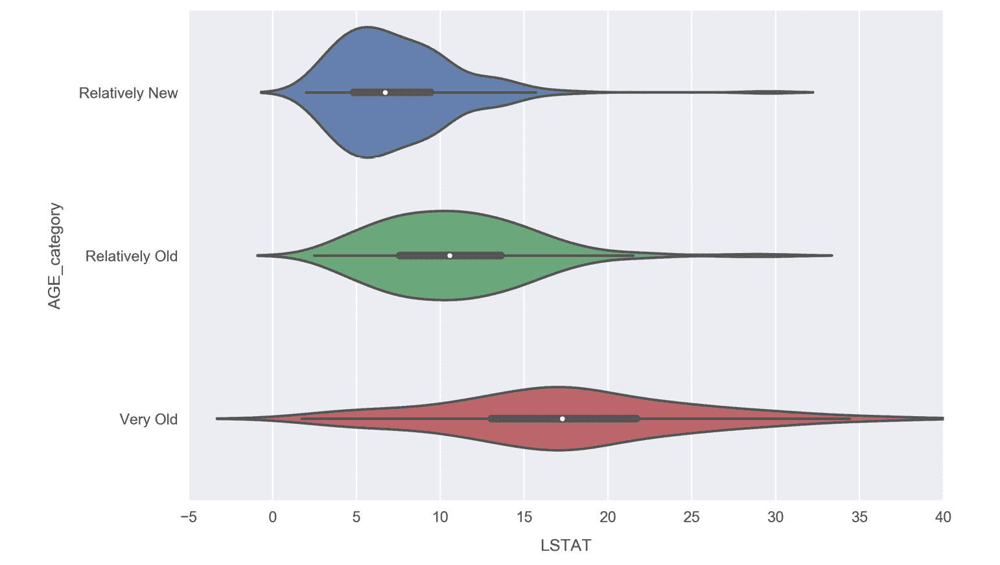

###### 图 1.48：重新构建的小提琴图，用于比较 AGE_category 区段的 LSTAT 分布

与**MEDV**小提琴图不同，后者每个分布大致相同宽度，在这里我们看到宽度随着**AGE**的增大而增加。以老旧房屋为主的社区（**Very Old**区段）包含的低阶层居民从很少到很多不等，而**Relatively New**社区则更有可能以高阶层为主，超过 95%的样本低阶层比例低于**Very Old**社区。这是合理的，因为**Relatively New**社区的房价较贵。

## 总结

在本章中，你已经了解了 Jupyter 中数据分析的基本概念。我们从 Jupyter 的使用说明和功能开始，比如魔法函数和自动补全。然后，转到数据科学相关的内容，我们介绍了 Python 数据科学中最重要的库。

在本章的后半部分，我们在实时 Jupyter Notebook 中进行了探索性分析。在这里，我们使用了散点图、直方图和小提琴图等可视化工具，加深了对数据的理解。我们还进行了简单的预测建模，这也是本书下一章的重点内容。

在下一章中，我们将讨论如何进行预测分析，准备数据建模时需要考虑的事项，以及如何在 Jupyter Notebooks 中实现和比较各种模型。
