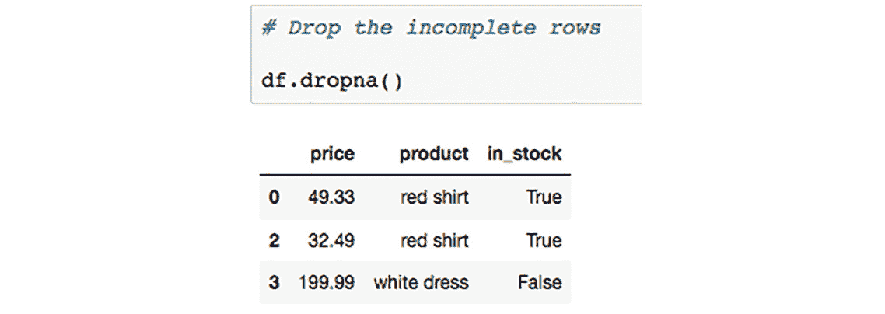
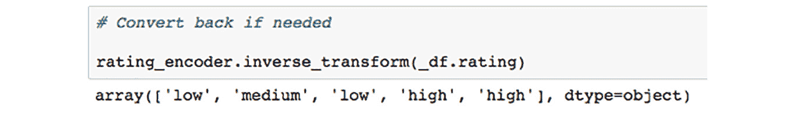
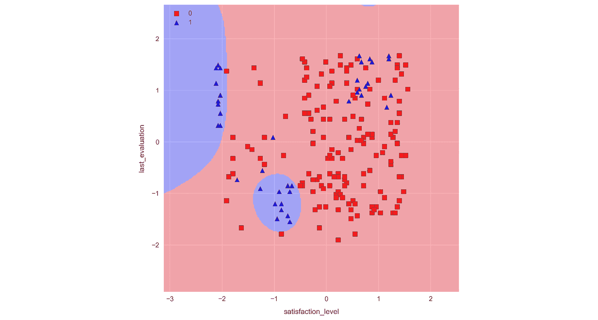

2

# 第二章：数据清洗与高级机器学习

## 学习目标

在本章结束时，你将能够：

+   规划机器学习分类策略

+   预处理数据以为机器学习做好准备

+   训练分类模型

+   使用验证曲线来调整模型参数

+   使用降维技术来提升模型性能

在本章中，你将通过完成几个实际练习来学习数据预处理和机器学习。

## 介绍

假设有一家小型外卖企业，正在寻求优化他们的产品。分析师可能会查看相关数据，并确定人们最喜欢的食物类型。也许他们发现有大量人正在订购最辣的食物选项，表明企业可能失去了那些想要更辣食物的顾客。这是相当基础的，或者有些人可能会说，这是“普通”的分析。

在一个单独的任务中，分析师可以通过对订单量随时间变化进行建模，使用预测分析。通过足够的数据，他们可以预测未来的订单量，从而指导餐厅每天所需的员工数量。这个模型可以考虑天气等因素，以做出最佳预测。例如，一场暴雨可能是增加外卖人员的指示，以弥补交通延误的时间。通过历史天气数据，这类信号可以被编码到模型中。这个预测模型可以节省企业手动考虑这些问题的时间，并通过让顾客满意来节省资金，从而提高客户留存率。

数据分析的总体目标是揭示可操作的洞察，以实现积极的商业结果。在预测分析的情况下，目标是通过确定目标的最可能未来结果，基于先前的趋势和模式，来实现这一点。

预测分析的好处并不仅限于大型科技公司。任何企业只要有合适的数据，都可以找到受益于机器学习的方法。

世界各地的公司正在收集大量数据，并使用预测分析来降低成本并提高利润。最常见的例子来自科技巨头谷歌、Facebook 和亚马逊，他们在大规模使用大数据。例如，谷歌和 Facebook 根据预测算法向你展示个性化广告，这些算法猜测你最有可能点击的内容。同样，亚马逊根据你之前的购买推荐你最有可能购买的个性化产品。

现代预测分析是通过机器学习完成的，其中计算机模型被训练以从数据中学习模式。正如我们在上一章简要看到的那样，像 scikit-learn 这样的软件可以与 Jupyter Notebooks 一起使用，以高效地构建和测试机器学习模型。正如我们将继续看到的，Jupyter Notebooks 是进行这类工作的理想环境，因为我们可以进行临时测试和分析，并且可以轻松保存结果以供以后参考。

在本章中，我们将再次采取动手实践的方式，通过在 Jupyter Notebook 中运行各种示例和活动来进行学习。在上一章中我们看到了几个机器学习的例子，在这里我们将采取更慢、更深思熟虑的方式。以员工留存问题作为本章的总体示例，我们将讨论如何进行预测分析，在为建模准备数据时需要考虑哪些因素，以及如何使用 Jupyter Notebooks 实现和比较多种模型。

## 准备训练预测模型

在这里，我们将讨论训练预测模型所需的准备工作。虽然这一步骤不像训练模型本身那样在技术上引人注目，但它不应被轻视。在开始构建和训练一个可靠的模型之前，确保你有一个良好的计划是非常重要的。此外，一旦你决定了正确的计划，在为建模准备数据时，还有一些技术步骤不能被忽视。

#### 注意

我们必须小心，不要过于深入技术任务的细节，以至于忽视了最终目标。技术任务包括需要编程技能的内容，例如构建可视化图表、查询数据库和验证预测模型。很容易花费数小时尝试实现特定功能，或者让图表看起来恰到好处。做这种事情确实有助于提高我们的编程技能，但我们不应该忘记问自己，考虑到当前的项目，是否值得花费这么多时间。

此外，请记住，Jupyter Notebooks 特别适合这个步骤，因为我们可以用它们来记录我们的计划，例如，写下关于数据的粗略笔记或我们有兴趣训练的模型列表。在开始训练模型之前，最好进一步走一步，写出一个结构良好的计划来遵循。这样不仅有助于你在构建和测试模型时保持正轨，还能让别人看到你的工作时了解你在做什么。

在讨论完准备工作后，我们还将介绍准备训练预测模型的另一步骤——清理数据集。这是 Jupyter Notebooks 非常适合的一项工作，因为它们提供了一个理想的测试环境，可以执行数据集转换并追踪精确的变化。清理原始数据所需的数据转换可能会迅速变得复杂而难以理解，因此，跟踪你的工作非常重要。如第一章所讨论的，其他工具则不提供非常好的高效操作选项。

在进入下一部分之前，我们先暂停一下，思考一下这些想法，并将其放到现实生活中的示例中来考虑。

考虑以下情况：

你被一家在线视频游戏平台聘用，目的是提高访问他们网站的用户的转化率。他们要求你利用预测分析来判断用户喜欢哪种类型的游戏，以便展示能够促使用户购买的专门化内容。并且他们希望做到这一点，而无需询问客户的游戏偏好。

这是一个可以解决的问题吗？需要什么类型的数据？这对业务会有什么影响？

为了解决这个挑战，我们可以考虑基于用户的浏览器 Cookie 来进行预测。例如，如果他们曾经访问过一个《魔兽世界》网站，那么这个 Cookie 可以作为他们喜欢角色扮演游戏的一个指示器。

另一项有价值的数据是用户在平台上购买过的游戏历史。例如，这可以作为机器学习算法中的目标变量，例如一个能够预测用户可能感兴趣的游戏的模型，这个预测模型可以基于他们浏览会话中的 Cookie 类型。另一种可替代的目标变量可以通过在平台上设置一个调查来收集用户的偏好数据。

在业务影响方面，能够准确预测游戏类型对营销活动的成功至关重要。实际上，预测错误的问题是双重的：不仅错失了瞄准用户的机会，而且还可能向用户展示负面印象的内容。这可能导致更多人离开网站并减少销售。

### 确定预测分析的计划

在制定预测建模计划时，应该首先考虑利益相关者的需求。如果模型无法解决相关问题，那么它将是无用的。围绕业务需求制定策略可以确保成功的模型带来可行的洞察力。

尽管原则上可以解决许多业务问题，但解决方案的实现总是取决于是否能获得必要的数据。因此，在考虑业务需求时，必须结合可用的数据源。如果数据丰富，这几乎不会有影响，但随着可用数据量的减少，能够解决的问题范围也会缩小。

这些想法可以形成一个标准的过程，用于确定预测分析计划，步骤如下：

1.  **查看可用数据**，了解现实中可解决的业务问题的范围。在这个阶段，可能还太早去考虑能够解决的具体问题。确保你理解可用的数据字段及其适用的时间范围。

1.  **通过与关键利益相关者交谈，确定业务需求**。寻找一个解决方案能够带来可操作的商业决策的问题。

1.  **评估数据的适用性**，通过考虑特征空间的多样性和规模是否足够大。同时，考虑数据的状态：某些变量或时间范围是否存在大量缺失值？

第 2 步和第 3 步应重复进行，直到形成一个现实的计划。此时，你应该已经对模型输入和期望的输出有了清晰的了解。

一旦你确定了可以用机器学习解决的问题，并且找到了合适的数据源，我们应该回答以下问题，以为项目奠定框架。这样做有助于我们确定可以用来解决问题的机器学习模型类型。以下图像提供了根据数据类型可用选择的概述：


###### 图 2.1：根据数据类型的机器学习策略流程图

上图描述了根据数据类型（有标签或无标签）你可以选择的路径。

如上所示，可以选择有监督学习或无监督学习。有监督学习包括分类或回归问题。在回归中，变量是连续的；例如，降水量。在回归中，变量是离散的，我们预测类别标签。最简单的分类问题是二分类问题；例如，今天会下雨吗？（是/否）

对于无监督学习，聚类分析是常用的方法。此处，标签会分配给每个样本的最近聚类。

然而，决定机器学习策略时，除了数据类型外，数据源的大小和来源也是一个重要因素。具体而言，以下几点应注意：

+   在应用机器学习算法之前，应考虑数据的规模，特别是数据的宽度（列数）和高度（行数）。

+   某些算法在处理某些特征时优于其他算法。

+   一般来说，数据集越大，准确性越高。然而，这也可能会非常耗时。

+   使用降维技术可以节省时间。

+   对于多个数据源，可以考虑将它们合并到一个表格中。

+   如果无法做到这一点，我们可以为每个模型分别训练，并考虑最终预测时使用这些模型的平均结果。

一个我们可能想要这样做的例子是，对于不同尺度的多组时间序列数据。假设我们有以下数据源：一张包含 AAPL 股票每日收盘价的表格，以及一张包含 iPhone 每月销量的表格。我们可以通过将每月的销量数据添加到每日时间尺度表格的每个样本中来合并数据，或者按月对每日数据进行分组，但更好的做法可能是为每个数据集构建两个模型，并将它们的结果结合起来用于最终的预测模型。

数据预处理对机器学习有巨大影响。就像俗话说的“你就是你吃的”，模型的表现直接反映了它所训练的数据。许多模型依赖于数据的转换，以便连续特征值具有可比的范围。同样，类别特征应当被编码为数值类型。尽管这些步骤重要，但它们相对简单且不会花费太长时间。

通常，预处理过程中花费最多时间的环节是清理杂乱的数据。有些估计表明，数据科学家大约将三分之二的工作时间花在清理和整理数据集上：


###### 图 2.2：不同数据任务花费时间的饼图分布。

要了解更多关于预处理阶段的信息，请参考：[`www.forbes.com/sites/gilpress/2016/03/23/data-`](http://www.forbes.com/sites/gilpress/2016/03/23/data-) preparation-most-time-consuming-least-enjoyable-data- science-task-survey-says/2/#17c66c7e1492.

另一个需要考虑的因素是许多数据科学家使用的数据集的大小。随着数据集大小的增加，数据杂乱无章的情况也会增加，清理这些数据的难度也随之增加。

单纯丢弃缺失数据通常不是最佳选择，因为很难合理化丢弃那些大部分字段都有值的样本。在这样做时，我们可能会失去一些宝贵的信息，这可能会影响最终模型的表现。

#### 注意

在这个练习中，我们通过创建两个 DataFrame，执行内连接和外连接，并去除空值（`NaN`）来实践数据预处理。

数据预处理的步骤可以分为以下几类：

+   **合并数据**集，依据公共字段将所有数据整合到一个表格中。

+   **特征工程**用于提高数据质量，例如，使用降维技术构建新特征。

+   **清理数据**，通过处理重复行、错误或缺失的值以及其他可能出现的问题

+   **构建训练数据集**，通过标准化或归一化所需的数据，并将其划分为训练集和测试集

让我们探索一些进行数据预处理的工具和方法。

### 练习 8：探索数据预处理工具和方法

1.  在项目目录下通过执行`jupyter notebook`启动`NotebookApp`。进入`Lesson-2`目录并打开`lesson-2-workbook.ipynb`文件。找到加载包的单元并运行它。

    我们将从展示 Pandas 和 Sci-kit Learn 的一些基本工具开始。接着，我们将深入探讨重建缺失数据的方法。

1.  向下滚动到`子主题 B：为机器学习准备数据`，并运行包含`pd.merge?`的单元，以在笔记本中显示合并函数的文档字符串：

    ###### 图 2.3：合并函数的文档字符串

    如我们所见，函数接受左右两个 DataFrame 进行合并。你可以指定一个或多个用于分组的列，并且指定它们的分组方式，即使用左、右、外部或内部的值集合。我们来看一个具体的例子。

1.  退出帮助弹窗并运行包含以下示例 DataFrame 的单元：

    ```py
    df_1 = pd.DataFrame({'product': ['red shirt', 'red shirt', 'red shirt', 'white dress'],\n",
    'price': [49.33, 49.33, 32.49,
    199.99]})\n",
    df_2 = pd.DataFrame({'product': ['red shirt', 'blue pants', 'white tuxedo', 'white dress'],\n",
    'in_stock': [True, True, False,
    False]})
    ```

    在这里，我们将从头开始构建两个简单的 DataFrame。如图所示，它们包含一个带有共享条目的`product`列。

1.  运行下一个单元来执行内连接合并：

    ###### 图 2.4：列的内连接合并

    注意，只有共享的项目，**红色衬衫**和**白色连衣裙**，被包括在内。为了包括两个表中的所有条目，我们可以改为进行外连接合并。现在就来做这个。

1.  运行下一个单元来执行外连接合并：

    ###### 图 2.5：列的外连接合并

    这将返回每个表中的所有数据，缺失值会被标记为`NaN`。

    

    ###### 图 2.6：使用 NumPy 测试质量的代码

    你可能已经注意到我们最近合并的表格在前几行有重复的数据。这个问题将在下一步解决。

1.  运行包含`df.drop_duplicates()`的单元，返回一个没有重复行的 DataFrame 版本：

    ###### 图 2.7：删除重复行后的表格

    这是删除重复行的最简单和“标准”方法。为了将这些更改应用到`df`，我们可以设置`inplace=True`，或者像`df = df.drop_duplicated()`这样操作。接下来，我们来看另一种方法，它使用掩码来选择或删除重复行。

1.  运行包含 `df.duplicated()` 的单元格以打印 True/False 序列，标记重复行：

    ###### 图 2.8：打印重复行的 True/False 值

1.  将结果相加，以确定通过运行以下代码检查重复行的数量：

    ###### 图 2.9：汇总结果以检查重复行的数量

1.  运行以下代码并确认输出与 `df.drop_duplicates()` 的输出相同：

    ```py
    df[~df.duplicated()]
    ```

    ![图 2.10：来自 df.[~df.duplicated()] 函数的输出](img/C13018_02_10.jpg)

    ###### 图 2.10：来自 df.[~df.duplicated()] 函数的输出

1.  运行包含以下代码的单元格，从完整的 DataFrame 中删除重复项：

    ```py
    df[~df['product'].duplicated()]
    ```

    

    ###### 图 2.11：删除重复项后的输出

    在这里，我们做了以下操作：

    为产品行创建掩码（一个 True/False 序列），其中重复项标记为 `True`；

    使用波浪线（~）来取反该掩码，以便将重复项标记为 False，其他所有内容标记为`True`；

    使用该掩码来筛选出 `False` 行，即对应于重复产品的 `df` 行。

    正如预期的那样，我们现在看到只有第一个 `df`，它是去重后的版本。这可以通过运行 `drop_duplicates` 并传递参数 `inplace=True` 来实现。

1.  对 DataFrame 进行去重并保存结果，方法是运行包含以下代码的单元格：

    ```py
    df.drop_duplicates(inplace=True)
    ```

    继续其他预处理方法，我们先忽略重复行，处理缺失数据。这是必要的，因为模型不能在不完整的样本上进行训练。以蓝色裤子和白色晚礼服的缺失价格数据为例，展示几种处理 `NaN` 值的不同方法。

1.  删除行，尤其是在 `NaN` 样本缺失数据的情况下，通过运行包含 `df.dropna()` 的单元格：

    ###### 图 2.12：删除不完整行后的输出

1.  删除具有大部分缺失值的整个列。通过运行包含与之前相同的方法的单元格，但这次传递 `axes` 参数以指示列而不是行来实现：

    ###### 图 2.13：删除缺失值特征列后的输出

    简单地删除 `NaN` 值通常不是最佳选择，因为丢失数据从来不是好事，特别是当只有少部分样本值丢失时。Pandas 提供了一种方法，可以通过多种不同方式填充 `NaN` 条目，下面将展示其中的一些方法。

1.  运行包含 `df.fillna?` 的单元格，打印 Pandas `NaN-fill` 方法的文档字符串：

    ###### 图 2.14：NaN 填充方法的文档字符串

    注意值参数的选项；这可以是例如单个值或基于索引的字典/系列类型映射。或者，我们可以将值保留为 `None`，并传递一个 `fill` 方法代替。在本章中我们将看到每种方法的示例。

1.  通过运行包含以下代码的单元格，用平均产品价格填充缺失数据：

    ```py
    df.fillna(value=df.price.mean())
    ```

    

    ###### 图 2.15：使用平均产品价格填充缺失数据后的输出

1.  通过运行包含以下代码的单元格，使用填充方法填充缺失数据：

    ```py
    df.fillna(method='pad')
    ```

    

    ###### 图 2.16：使用填充方法填充数据后的输出

    注意**白色裙子**的价格被用来填充下面缺失的值。

    为了完成本练习，我们将准备一个简单的表格，用于训练机器学习算法。别担心，我们不会在这么小的数据集上训练模型！我们从为类别数据编码类标签开始这一过程。

1.  运行 `Building training data sets` 部分中的第一个单元格，添加另一列数据，表示编码标签之前的平均产品评分：

    ###### 图 2.17：添加评分列后的输出

    考虑到我们想用这个表格来训练预测模型，我们首先应该考虑将所有变量转换为数值类型。

1.  将 `in_stock`（一个布尔值列表）转换为数字值；例如，`0` 和 `1`。在用它训练预测模型之前，应该进行此转换。这可以通过许多方法实现，例如，运行包含以下代码的单元格：

    ```py
    df.in_stock = df.in_stock.map({False: 0, True: 1})
    ```

    

    ###### 图 2.18：将 in_stock 转换为二进制后的输出

1.  运行包含以下代码的单元格，在更高层次上将类标签映射为整数。我们使用 sci-kit learn 的 `LabelEncoder` 来实现这一目的：

    ```py
    from sklearn.preprocessing import LabelEncoder rating_encoder = LabelEncoder()
    _df = df.copy()
    _df.rating = rating_encoder.fit_transform(df.rating)
    _df
    ```

    

    ###### 图 2.19：将类标签映射到整数后的输出

    这可能会让你想起我们在上一章中做的预处理，当时我们构建了多项式模型。在这里，我们实例化了一个标签编码器，然后使用 `fit_transform` 方法对其进行“训练”和“转换”数据。我们将结果应用到我们的 DataFrame 副本 `_df` 上。

1.  通过运行 `rating_encoder.inverse_transform(df.rating)`，使用我们通过变量 `rating_encoder` 引用的类重新转换特征：

    ###### 图 2.20：执行逆变换后的输出

    你可能会注意到一个问题。我们正在处理一个所谓的“顺序”特征，其中标签有固有的顺序。在这种情况下，我们应该期望“low”评级会被编码为 0，而“high”评级会被编码为 2。然而，这不是我们看到的结果。为了实现正确的顺序标签编码，我们应该再次使用`map`，并自己构建字典。

1.  通过运行包含以下代码的单元格，正确地对顺序标签进行编码：

    ```py
    ordinal_map = {rating: index for index, rating in enumerate(['low', 'medium', 'high'])}
    print(ordinal_map)
    df.rating = df.rating.map(ordinal_map)
    ```

    

    ###### 图 2.21：编码顺序标签后的输出

    我们首先创建映射字典。这是通过字典推导和枚举来完成的，但从结果来看，我们也可以直接手动定义。然后，像之前对`in_stock`列进行的操作一样，我们将字典映射应用到特征上。查看结果后，我们发现评分现在比之前更合理，其中`low`被标记为`0`，`medium`为`1`，`high`为`2`。

    现在，你已经讨论了顺序特征，接下来我们将简要提及另一种特征，称为名义特征。这些字段没有固有的顺序，在我们的案例中，`product`就是一个完美的例子。

    大多数 scikit-learn 模型可以在这种数据上进行训练，其中我们使用字符串而非整数编码的标签。在这种情况下，必要的转换会在后台自动完成。然而，这并不适用于所有 scikit-learn 模型，或其他机器学习和深度学习库。因此，在预处理阶段我们自己进行编码是一个好的做法。

1.  通过运行包含以下代码的单元格，将类别标签从字符串转换为数值：

    ```py
    df = pd.get_dummies(df)
    ```

    最终的 DataFrame 如下所示：

    

    ###### 图 2.22：最终的 DataFrame

    这里，我们看到的是独热编码的结果：`product`列被拆分为 4 列，每个列代表一个唯一的值。在每一列中，我们看到`1`或`0`，表示该行是否包含特定值或产品。

    接下来，忽略任何数据缩放（通常应该进行缩放），最后一步是将数据拆分为训练集和测试集，以便用于机器学习。这可以通过 scikit-learn 的`train_test_split`来完成。假设我们要尝试预测某个商品是否有库存，前提是其他特征值已知。

    #### 注意

    当我们调用前面代码中的`values`属性时，我们将 Pandas 系列（即 DataFrame 列）转换为 NumPy 数组。这是一个好的做法，因为它去除了系列对象中不必要的信息，例如索引和名称。

1.  通过运行包含以下代码的单元格，将数据拆分为训练集和测试集：

    ```py
    features = ['price', 'rating', 'product_blue pants', 'product_red shirt', 'product_white dress', 'product_white tuxedo']
    X = df[features].values target = 'in_stock'
    y = df[target].values
    from sklearn.model_selection import train_test_split X_train, X_test, y_train, y_test = \
    train_test_split(X, y, test_size=0.3)
    ```


###### 图 2.23：将数据划分为训练集和测试集

在这里，我们选择数据的子集，并将它们传入`train_test_split`函数。该函数有四个输出，这些输出被拆分成特征（`X`）和目标（`y`）的训练集和测试集。

观察输出数据的形状，其中测试集大约占样本的 30%，训练集大约占 70%。

稍后我们会看到类似的代码块，用于准备真实数据以进行预测模型的训练。

本次训练练习已结束，主题是清理数据以供机器学习应用使用。我们稍作停留，来注意一下我们的 Jupyter Notebook 在测试各种数据转换方法时的有效性，并最终记录我们决定使用的数据处理流程。通过仅修改特定的代码单元格，就可以轻松应用到更新版的数据，在处理之前进行调整。此外，如果我们希望对数据处理做出任何更改，也可以轻松地在 Notebook 中测试这些更改，并可以修改特定单元格以适应调整。实现这一点的最好方法可能是将 Notebook 复制到新文件中，以便我们始终保留原始分析的副本作为参考。

接下来，我们将应用本节中的概念，将它们应用于一个大型数据集，为训练预测模型做准备。

### 活动 2：准备为员工留任问题训练预测模型

假设你受雇为一家公司做自由职业工作，帮助他们分析员工离职的原因。他们已经收集了一些数据，认为这些数据对分析离职原因有帮助。这些数据包括员工的满意度、评估、工作时间、部门和薪资等信息。

该公司通过发送名为 hr_data.csv 的文件与你共享他们的数据，并请你提出解决方案，以帮助阻止员工离职。

我们的目标是

将你到目前为止学到的概念应用到实际问题中。特别是，我们希望：

1.  制定一个计划，利用预测分析为业务提供有影响力的洞察，基于现有的数据。

1.  准备数据以供机器学习模型使用。

    #### 注意

    从本活动开始，直到本章结束，我们将使用人力资源分析数据集，这是一个 Kaggle 数据集。数据集的链接可以在这里找到：[`bit.ly/2OXWFUs`](https://bit.ly/2OXWFUs)。这些数据是模拟数据，意味着样本是人工生成的，并不代表真实的人。我们在分析和建模数据时将忽略这一点。我们使用的数据集与在线版本存在一些小差异。我们的 HR 分析数据集包含一些 NaN 值。这些值已经在在线版本中手动删除，以说明数据清理技术。我们还为同样的目的，添加了一列名为 is_smoker 的数据。

为了实现这一目标，需要执行以下步骤：

1.  滚动到`lesson-2-workbook.ipynb`笔记本文件中的`Activity A`部分。

1.  检查表格的头部，确认它是标准的 CSV 格式。

1.  使用 Pandas 加载数据。

1.  通过打印`df.columns`检查列，并通过打印 DataFrame 的`head`和`tail`（使用`df.head()`和`df.tail()`）来确保数据已按预期加载：

1.  检查 CSV 文件中的行数（包括标题）。

1.  将此结果与`len(df)`进行比较，确保我们已经加载了所有数据：

1.  评估目标变量并检查缺失值的分布和数量。

1.  打印每个特征的数据类型。

1.  显示特征分布。

1.  通过运行以下代码检查每一列中的`NaN`值数量：

1.  删除`is_smoker`列，因为该指标几乎没有任何信息。

1.  填充`time_spend_company`列中的`NaN`值。

1.  绘制`average_montly_hours`按`number_project`分段的箱型图。

1.  通过运行以下代码计算每组的均值：

1.  填充`average_montly_hours`中的`NaN`值。

1.  通过运行断言测试，确认`df`中不再有`NaN`值。

1.  将字符串和布尔字段转换为整数表示。

1.  打印`df.columns`以显示字段

1.  保存我们预处理后的数据。

    #### 注意

    详细步骤和解决方案在*附录 A*（第 150 页）中列出。

再次，我们在这里暂停，注意到在执行初步数据分析和清理时，Jupyter Notebook 非常适合我们的需求。例如，假设我们将这个项目暂时搁置几个月。返回时，我们可能不记得当时到底发生了什么。但如果查看这个笔记本，我们可以重新追溯我们的步骤，并快速回忆起我们之前对数据的理解。此外，我们可以用任何新数据更新数据源，并重新运行笔记本，为机器学习算法准备新的数据集。请记住，在这种情况下，最好先复制一份笔记本，以免丢失初始分析。

总结一下，你已经学习并应用了为训练机器学习模型做准备的方法。我们从讨论识别可以通过预测分析解决的问题的步骤开始。这个过程包括：

+   查看可用数据

+   确定业务需求

+   评估数据的适用性

我们还讨论了如何区分监督学习与无监督学习，以及回归问题与分类问题。

在确定问题后，我们学习了使用 Jupyter Notebooks 构建和测试数据转换管道的技术。这些技术包括填充缺失数据、转换分类特征以及构建训练/测试数据集的方法和最佳实践。

在本章的剩余部分，我们将使用这些预处理后的数据来训练各种分类模型。为了避免盲目应用我们不了解的算法，我们首先介绍它们并概述它们的工作原理。然后，我们使用 Jupyter 训练并比较它们的预测能力。在这里，我们有机会讨论机器学习中的更高级话题，比如过拟合、k 折交叉验证和验证曲线。

## 训练分类模型

正如你在上一章中已经看到的，通过使用像 scikit-learn 这样的库和像 Jupyter 这样的平台，可以用几行代码训练预测模型。这之所以可能，是因为它将优化模型参数所涉及的复杂计算进行了抽象。换句话说，我们处理的是一个“黑箱”，其内部操作是隐藏的。然而，这种简化也带来了滥用算法的风险，例如，在训练过程中出现过拟合，或者未能在未见数据上进行适当的测试。我们将展示如何在训练分类模型时避免这些陷阱，并通过使用 k 折交叉验证和验证曲线来生成可靠的结果。

### 分类算法简介

回顾一下监督学习的两种类型：回归和分类。在回归中，我们预测一个连续的目标变量。例如，回想一下第一章中的线性和多项式模型。在本章中，我们关注的是另一种监督学习类型：分类。这里的目标是使用可用的度量来预测样本的类别。

在最简单的情况下，只有两个可能的类别，这意味着我们正在进行二分类。我们在本章的示例问题中就是这种情况，我们尝试预测一个员工是否已经离职。如果我们有两个以上的类别标签，那么我们就是在进行多分类。

尽管在使用 scikit-learn 训练模型时，二分类和多分类之间几乎没有区别，但在“黑箱”内部所做的工作却有显著不同。特别是，多分类模型通常使用一对多的方法。这对于具有三个类别标签的情况是这样工作的。当模型用数据进行“拟合”时，会训练三个模型，每个模型预测样本是否属于某个特定类别或属于其他类别。这可能让你想起我们之前为特征做的一次性编码。当为某个样本做出预测时，将返回具有最高置信度的类别标签。

在本章中，我们将训练三种分类模型：支持向量机、随机森林和 k 最近邻分类器。这些算法各自有很大的不同。然而，正如我们将看到的，由于 scikit-learn，它们在训练和用于预测时非常相似。在切换到 Jupyter Notebook 并实现这些模型之前，我们将简要了解它们是如何工作的。

支持向量机（SVM）尝试找到最佳的超平面来划分类别。这是通过最大化超平面与每个类别中最接近样本之间的距离来实现的，这些最接近的样本被称为支持向量。

这种线性方法也可以通过核技巧用于建模非线性类别。该方法将特征映射到更高维的空间中，在其中确定超平面。这个超平面也被称为决策面，我们将在训练模型时将其可视化。

K 最近邻分类算法记住训练数据，并根据特征空间中 K 个最近的样本进行预测。对于三个特征，这可以被可视化为围绕预测样本的一个球体。然而，通常我们处理的是超过三个特征的数据，因此会绘制超球体来找到最近的 K 个样本。

随机森林是一组决策树，每棵树都在不同的训练数据子集上进行训练。

决策树算法根据一系列决策对样本进行分类。例如，第一个决策可能是“如果特征 x_1 小于或大于 0”。然后，数据会根据这个条件进行划分，并被输入到树的下级分支中。决策树中的每一步都是基于特征划分来决定的，这一划分最大化信息增益。实际上，这个术语描述了试图选择目标变量最佳划分的数学方法。

训练随机森林的过程包括为一组决策树创建自助采样（即带有替换的随机采样）数据集。然后，根据多数投票做出预测。这些模型的优势在于减少了过拟合，并且具有更好的泛化能力。

#### 注意

决策树可以用于建模连续数据和类别数据的混合，这使得它们非常有用。此外，正如我们将在本章稍后看到的，可以限制树的深度以减少过拟合。要详细（但简洁）了解决策树算法，请查看这个流行的 StackOverflow 回答：[`stackoverflow.com/a/1859910/3511819`](https://stackoverflow.com/a/1859910/3511819)。在那里，作者展示了一个简单的示例，并讨论了节点纯度、信息增益和熵等概念。

### 练习 9：使用 Scikit-learn 训练两特征分类模型

我们将继续处理在第一个主题中介绍的员工留存问题。我们之前准备了一个数据集，用于训练分类模型，预测员工是否已经离职。现在，我们将利用这些数据来训练分类模型：

1.  启动 `NotebookApp` 并打开 `lesson-2-workbook.ipynb` 文件。向下滚动到 `Topic B: Training classification models` 部分。运行前几个单元格以设置默认图形大小并加载之前保存到 CSV 文件的处理过的数据。在这个示例中，我们将在两个连续特征上训练分类模型：`satisfaction_level 和 last_evaluation`。

1.  通过运行包含以下代码的单元，绘制连续目标变量的双变量和单变量图：

    ```py
    sns.jointplot('satisfaction_level', 'last_evaluation', data=df, kind='hex')
    ```

    

    ###### 图 2.24：满意度和最后评估的双变量与单变量图

    正如你在前面的图像中看到的，数据中有一些非常明显的模式。

1.  通过运行包含以下代码的单元，重新绘制按目标变量分段的双变量分布：

    ```py
    plot_args = dict(shade=True, shade_lowest=False) for i, c in zip((0, 1), ('Reds', 'Blues')):
    sns.kdeplot(df.loc[df.left==i, 'satisfaction_level'], df.loc[df.left==i, 'last_evaluation'], cmap=c, **plot_args)
    ```

    

    ###### 图 2.25：满意度和最后评估的双变量分布

    现在，我们可以看到这些模式如何与目标变量相关。在本次练习的剩余部分，我们将尝试利用这些模式来训练有效的分类模型。

1.  通过运行包含以下代码的单元，将数据分割为训练集和测试集：

    ```py
    from sklearn.model_selection import train_test_split
    features = ['satisfaction_level', 'last_evaluation'] X_train, X_test, y_train, y_test = train_test_split(
    df[features].values, df['left'].values, test_size=0.3, random_state=1)
    ```

    我们的前两个模型——支持向量机和 k 最近邻算法，在输入数据经过缩放，使所有特征处于相同量级时效果最好。我们将使用 scikit-learn 的 `StandardScaler` 来实现这一点。

1.  加载 `StandardScaler` 并创建一个新的实例，如缩放器变量所示。对训练集进行拟合并转换，然后转换测试集。运行包含以下代码的单元：

    ```py
    from sklearn.preprocessing import StandardScaler scaler = StandardScaler()
    X_train_std = scaler.fit_transform(X_train) X_test_std = scaler.transform(X_test)
    ```

    #### 注意

    在进行机器学习时，一个常见的错误是将缩放器（scaler）“拟合”到整个数据集，而实际上它应该只对训练数据进行“拟合”。例如，在将数据分割为训练集和测试集之前进行缩放就是一个错误。我们不希望这样做，因为模型训练不应该受到测试数据的任何影响。

1.  导入 scikit-learn 的支持向量机类，并通过运行包含以下代码的单元，在训练数据上拟合模型：

    ```py
    from sklearn.svm import SVC
    svm = SVC(kernel='linear', C=1, random_state=1) svm.fit(X_train_std, y_train)
    ```

1.  通过运行包含以下代码的单元，计算该模型在未见数据上的准确度：

    ```py
    from sklearn.metrics import accuracy_score y_pred = svm.predict(X_test_std)
    acc = accuracy_score(y_test, y_pred) print('accuracy = {:.1f}%'.format(acc*100))
    >> accuracy = 75.9%
    ```

1.  我们预测测试样本的目标值，然后使用 scikit-learn 的 `accuracy_score` 函数来确定准确率。结果看起来很有希望，大约是 75%！对于我们的第一个模型来说，还不错。但请记住，目标是失衡的。让我们看看每个类别的预测准确度如何。

1.  计算混淆矩阵，然后通过运行包含以下代码的单元来确定每个类别中的准确度：

    ```py
    from sklearn.metrics import confusion_matrix cmat = confusion_matrix(y_test, y_pred)
    scores = cmat.diagonal() / cmat.sum(axis=1) * 100 print('left = 0 : {:.2f}%'.format(scores[0]))
    print('left = 1 : {:.2f}%'.format(scores[1]))
    >> left = 0 : 100.00%
    >> left = 1 : 0.00%
    ```

    看起来模型仅仅将每个样本分类为 0，这显然是完全没有帮助的。让我们使用等高线图来显示特征空间中每个点的预测类别。这通常被称为决策区域图。

1.  使用 `mlxtend` 库中的有用函数绘制决策区域。运行包含以下代码的单元：

    ```py
    from mlxtend.plotting import plot_decision_regions N_samples = 200
    X, y = X_train_std[:N_samples], y_train[:N_samples] plot_decision_regions(X, y, clf=svm)
    ```

    

    ###### 图 2.26: 决策区域的绘图

    该函数绘制决策区域，并与作为参数传递的一组样本一起显示。为了正确显示决策区域，避免太多样本阻挡视线，我们只将测试数据的 200 个样本子集传递给 `plot_decision_regions` 函数。当然，在这种情况下，样本数量并不重要。我们看到结果完全是红色，表示特征空间中的每个点都会被分类为 0。

    线性模型无法很好地描述这些非线性模式，这并不令人惊讶。回想一下，我们之前提到过通过 SVM 使用核技巧来分类非线性问题。让我们看看这样做是否能改善结果。

1.  运行包含 SVC 的单元以打印 scikit-learn 的文档字符串。向下滚动并查看参数描述。注意内核选项，默认情况下实际上是启用 `rbf`。使用这个 `kernel` 选项训练一个新的 SVM，运行包含以下代码的单元：

    ```py
    check_model_fit(svm, X_test_std, y_test)
    ```


###### 图 2.27: 训练一个新的 SVM


###### 图 2.28: 使用非线性模式增强的结果

结果明显更好。现在，我们能够捕捉到数据中的一些非线性模式，并正确分类大多数已经离职的员工。

### plot_decision_regions 函数

`plot_decision_regions` 函数由 `mlxtend` 提供，这是由 Sebastian Raschka 开发的一个 Python 库。值得看看源代码（当然是用 Python 编写的），以理解这些图是如何绘制的。其实并不复杂。

在 Jupyter Notebook 中，使用 `from mlxtend.plotting import plot_decision_regions` 导入函数，然后通过 `plot_decision_regions?` 调出帮助并滚动到底部查看本地文件路径：


###### 图 2.29: 本地文件路径

然后，打开文件并阅读它。例如，您可以在笔记本中运行 `cat` 命令：


###### 图 2.30：在笔记本中运行 cat 命令

这虽然可以，但不理想，因为代码没有颜色标记。最好复制它（这样就不会意外修改原始代码），然后用你喜欢的文本编辑器打开它。

当我们将注意力集中在负责映射决策区域的代码时，我们可以看到一个关于预测 Z 的等高线图，这些预测覆盖了特征空间的数组`X_predict`。


](img/C13018_02_31.jpg)

###### 图 2.31：映射决策区域的代码截图

让我们开始训练我们的 k-近邻模型。

### 练习 10：为我们的模型训练 K-近邻分类器

1.  加载 scikit-learn KNN 分类模型，并通过运行包含以下代码的单元格打印文档字符串：

    ```py
    from sklearn.neighbors import KNeighborsClassifier KNeighborsClassifier?
    ```

    `n_neighbors` 参数决定了分类时使用多少个样本。如果权重参数设置为 uniform，则类标签由多数投票决定。权重的另一个有用选择是距离，在这种情况下，离得较近的样本在投票中的权重较高。像大多数模型参数一样，最佳选择取决于特定的数据集。

1.  使用`n_neighbors=3`训练 KNN 分类器，然后计算准确率和决策区域。运行包含以下代码的单元格：

    ```py
    knn = KNeighborsClassifier(n_neighbors=3) 
    knn.fit(X_train_std, y_train)
    check_model_fit(knn, X_test_std, y_test)
    ```

    

    ###### 图 2.32：使用 n_neighbors=3 训练 kNN 分类器

    

    ###### 图 2.33：训练后增强的结果

    我们看到整体准确率有所提高，尤其是类 1 的准确性显著提升。然而，决策区域图表显示我们可能存在过拟合数据的情况。这一点通过硬性、"锯齿状"的决策边界以及到处可见的小蓝色区域得以体现。通过增加最近邻的数量，我们可以软化决策边界并减少过拟合。

1.  通过运行包含以下代码的单元格，使用`n_neighbors=25`训练一个 KNN 模型：

    ```py
    knn = KNeighborsClassifier(n_neighbors=25) knn.fit(X_train_std, y_train)
    check_model_fit(knn, X_test_std, y_test)
    ```


###### 图 2.34：使用 n_neighbors=25 训练 kNN 分类器


###### 图 2.35：使用 n_neighbors=25 训练后的输出

正如我们所看到的，决策边界明显平滑了很多，蓝色区域也少了很多。类 1 的准确率略低，但我们需要使用更全面的方法，比如 k 折交叉验证，来决定这两个模型之间是否存在显著差异。

请注意，增加 `n_neighbors` 对训练时间没有影响，因为模型只是记忆数据。然而，预测时间将受到极大影响。

#### 注意

在使用真实世界数据进行机器学习时，算法的运行速度足够快以满足需求非常重要。例如，一个预测明天天气的脚本如果运行超过一天才完成，那完全没有意义！在处理大量数据时，内存也是需要考虑的一个因素。

我们现在将训练一个随机森林。

### 练习 11：训练随机森林

#### 注意

观察尽管每个模型内部差异巨大，但它们在训练和预测时是如此相似。

1.  训练一个由 50 棵决策树组成的随机森林分类模型，每棵树的最大深度为 5。运行包含以下代码的单元：

    ```py
    from sklearn.ensemble import RandomForestClassifier
    forest = RandomForestClassifier(n_estimators=50, max_depth=5,
    random_state=1)
    forest.fit(X_train, y_train) check_model_fit(forest, X_test, y_test)
    ```

    

    ###### 图 2.36：训练最大深度为 5 的随机森林

    

    ###### 图 2.37：训练最大深度为 5 后的输出

    注意决策树机器学习算法所产生的独特的与轴平行的决策边界。

    我们可以访问用于构建随机森林的任意单棵决策树。这些树存储在模型的 `estimators_attribute` 中。让我们画出其中一棵决策树，以便了解发生了什么。这样做需要**graphviz**依赖项，而它有时安装起来比较麻烦。

1.  通过运行包含以下代码的单元，绘制 Jupyter Notebook 中的一棵决策树：

    ```py
    from sklearn.tree import export_graphviz import graphviz
    dot_data = export_graphviz(
    forest.estimators_[0], out_file=None, feature_names=features, class_names=['no', 'yes'], filled=True, rounded=True, special_characters=True)
    graph = graphviz.Source(dot_data) graph
    ```


###### 图 2.38：使用 graphviz 获得的决策树

我们可以看到，由于设置了 max_depth=5，每条路径被限制为五个节点。橙色框代表“否”（员工未离开公司）的预测，蓝色框代表“是”（员工已离开公司）的预测。每个框的阴影（浅色、深色等）表示置信度水平，这与基尼值相关。

总结来说，我们已经完成了本节中的两个学习目标：

+   我们获得了支持向量机（SVM）、k 最近邻分类器（kNN）和随机森林的定性理解。

+   我们现在能够使用 scikit-learn 和 Jupyter Notebooks 训练各种模型，从而可以自信地构建和比较预测模型。

特别是，我们使用了来自员工流失问题的预处理数据，训练了分类模型来预测员工是否已离开公司。为了简化问题并专注于算法，我们构建了只利用两个特征：满意度水平和最后评估值，来预测这一问题的模型。这个二维特征空间还使我们能够可视化决策边界并识别过拟合的情况。

在接下来的章节中，我们将介绍机器学习中的两个重要主题：k 折交叉验证和验证曲线。

### 使用 K 折交叉验证和验证曲线评估模型

到目前为止，我们已经在数据的子集上训练了模型，然后评估了未见部分的表现，称为测试集。这是良好的做法，因为模型在训练数据上的表现并不能很好地指示它作为预测器的有效性。通过对模型过拟合，很容易在训练数据集上提高准确性，但这可能导致在未见数据上的表现更差。

也就是说，仅仅按照这种方式划分数据并训练模型是不够的。数据本身有天然的变异性，这导致准确性会有所不同（即使是轻微的），取决于训练和测试的分割。此外，仅使用一个训练/测试分割来比较模型可能会引入偏向某些模型的偏差，并导致过拟合。

**K 折交叉验证**提供了这个问题的解决方案，并允许通过每次准确性计算的误差估计来考虑方差。反过来，这自然导致了使用验证曲线来调整模型参数。这些曲线将准确性作为超参数的函数进行绘制，例如在随机森林中使用的决策树数量或最大深度。

#### 注意

这是我们第一次使用“超参数”这个术语。它指的是在初始化模型时定义的参数，例如 SVM 的 C 参数。这与训练后模型的参数不同，例如训练后的 SVM 的决策边界超平面的方程。

该方法在以下图示中进行了说明，展示了如何从数据集中选择 k 折：


###### 图 2.39：从数据集中选择 k 折

K 折交叉验证算法如下：

1.  将数据分成 k 个近似相等的“折叠”。

1.  在不同的折叠组合上测试和训练 k 个模型。每个模型将包括 k - 1 个折叠的训练数据，剩下的折叠用于测试。在这种方法中，每个折叠最终会被用作验证数据，且仅使用一次。

1.  通过取 k 个值的均值来计算模型的准确性。还会计算标准偏差，以提供准确性值的误差条。

通常设置*k = 10*，但如果使用大数据集，则应考虑使用较小的 k 值。

这种验证方法可以用来可靠地比较不同超参数下的模型表现（例如 SVM 的 C 参数或 KNN 分类器中的最近邻数）。它也适用于比较完全不同的模型。

一旦确定了*最佳模型*，应在整个数据集上重新训练它，然后再用于预测实际分类。

在使用 scikit-learn 实现时，通常会使用一种稍微改进的标准 k-fold 算法变体。这种变体叫做**分层 k-fold**。其改进之处在于，分层 k-fold 交叉验证在每个折叠中保持大致均匀的类别标签分布。正如你能想象的，这减少了模型的总体方差，并降低了高度不平衡的模型可能引起偏差的概率。

**验证曲线**是训练和验证指标作为某些模型参数的函数的图表。它们可以帮助我们做出好的模型参数选择。在本书中，我们将使用准确率得分作为这些图表的指标。

#### 注意

关于绘制验证曲线的文档可在此查阅：[`scikit-learn.org/stable/auto_examples/`](http://scikit-learn.org/stable/auto_examples/) model_selection/plot_validation_curve.html。

请参考此验证曲线，其中准确率分数作为 gamma SVM 参数的函数进行绘制：


###### 图 2.40：使用支持向量机（SVM）的验证曲线

从图表的左侧开始，我们可以看到两组数据的得分一致，这是好的。然而，与其他 gamma 值相比，得分也相对较低，因此我们可以说模型存在欠拟合现象。当增加 gamma 值时，我们可以看到一个点，在这个点上，这两条线的误差条不再重叠。从这个点开始，我们看到分类器在训练集上的表现逐渐优于验证集，说明模型过拟合数据。可以通过寻找具有重叠误差条的高验证得分来找到 gamma 参数的最优值。

请记住，某些参数的学习曲线仅在其他参数保持不变时有效。例如，在此图中训练 SVM 时，我们可以选择 `gamma` 的某个值。然而，我们可能还需要优化 `C` 参数。对于不同的 `C` 值，前述的图形会有所不同，我们对 `gamma` 的选择也可能不再最优。

### 练习 12：在 Python 中使用 K-fold 交叉验证和验证曲线，借助 Scikit-learn

1.  启动 `NotebookApp` 并打开 `lesson-2-workbook.ipynb` 文件。向下滚动至 `子主题 B：K-fold 交叉验证和验证曲线` 部分。

    训练数据应该已经存在于笔记本的内存中，但我们还是重新加载一次，以便提醒自己到底在使用什么数据。

1.  加载数据并选择 `satisfaction_level` 和 `last_evaluation` 特征作为训练/验证集。由于我们将使用 k-fold 验证，而不是训练-测试拆分，因此这次我们不使用拆分。运行包含以下代码的单元格：

    ```py
    df = pd.read_csv('../data/hr-analytics/hr_data_processed. csv')
    features = ['satisfaction_level', 'last_evaluation']
    X = df[features].values y = df.left.values
    ```

1.  通过运行包含以下代码的单元格，实例化一个随机森林模型：

    ```py
    clf = RandomForestClassifier(n_estimators=100, max_depth=5)
    ```

1.  为了使用分层 k-fold 交叉验证训练模型，我们将使用 `model_selection.cross_val_score` 函数。

    使用分层 k 折验证训练我们模型`clf`的 10 个变体。请注意，scikit-learn 的`cross_val_score`默认会进行这种类型的验证。运行包含以下代码的单元格：

    ```py
    from sklearn.model_selection import cross_val_score np.random.seed(1)
    scores = cross_val_score(
    estimator=clf, X=X,
    y=y, cv=10)
    print('accuracy = {:.3f} +/- {:.3f}'.format(scores.mean(), scores.std()))
    >> accuracy = 0.923 +/- 0.005
    ```

    请注意，我们如何使用`np.random.seed`来设置随机数生成器的种子，从而确保每个折和随机森林中的决策树所选样本的随机性是可重现的。

1.  将准确率计算为每个折的平均值。我们还可以通过打印分数来查看每个折的单独准确率。要查看这些分数，请运行`print(scores)`：

    ```py
    >> array([ 0.93404397,	0.91533333,	0.92266667,
    0.91866667,	0.92133333,
    0.92866667,	0.91933333,	0.92	,
    0.92795197,	0.92128085])
    ```

    使用`cross_val_score`非常方便，但它并不能告诉我们每个类别中的准确率。我们可以通过`model_selection.StratifiedKFold`类手动实现这一点。该类将折数作为初始化参数，然后使用 split 方法为数据构建随机采样的“掩码”。掩码实际上是一个数组，包含另一个数组中项的索引，之后可以通过如下方式返回这些项：`data[mask]`。

1.  定义一个自定义类，用于计算 k 折交叉验证的类别准确率。运行包含以下代码的单元格：

    ```py
    from sklearn.model_selection import StratifiedKFold
    …
    …
    print('fold: {:d} accuracy: {:s}'.format(k+1, str(class_acc)))
    return class_accuracy
    ```

    #### 注意

    有关完整代码，请参阅以下链接：[`bit.ly/2O5uP3h`](https://bit.ly/2O5uP3h)。

1.  然后，我们可以使用与第 4 步非常相似的代码计算类别准确率。通过运行包含以下代码的单元格来实现：

    ```py
    from sklearn.model_selection import cross_val_score np.random.seed(1)
    …
    …
    >> fold: 10 accuracy: [ 0.98861646	0.70588235]
    >> accuracy = [ 0.98722476	0.71715647] +/- [ 0.00330026
    0.02326823]
    ```

    #### 注意

    有关完整代码，请参阅以下链接：[`bit.ly/2EKK7Lp`](https://bit.ly/2EKK7Lp)。

1.  现在我们可以看到每个折中的类别准确率了！很棒，对吧？

1.  使用`model_selection.validation_curve`计算验证曲线。此函数使用分层 k 折交叉验证来训练模型，并针对给定参数的不同值进行训练。

    通过在一系列`max_depth`值上训练随机森林来执行绘制验证曲线所需的计算。运行包含以下代码的单元格：

    ```py
    from sklearn.model_selection import validation_curve
    clf = RandomForestClassifier(n_estimators=10) max_depths = np.arange(3, 16, 3)
    train_scores, test_scores = validation_curve( estimator=clf,
    X=X,
    y=y, param_name='max_depth', param_range=max_depths,
    cv=10);
    ```

    这将返回每个模型的交叉验证分数数组，其中模型具有不同的最大深度。为了可视化结果，我们将利用 scikit-learn 文档中提供的一个函数。

1.  运行定义`plot_validation_curve`的单元格。然后，运行包含以下代码的单元格来绘制图表：

    ```py
    plot_validation_curve(train_scores, test_scores,
    max_depths, xlabel='max_depth')
    ```


###### 图 2.41：绘制验证曲线

回想一下，设置决策树的最大深度是如何限制过拟合的。这在验证曲线中有所体现，在右侧我们可以看到过拟合的现象，尤其是对于较大的最大深度值。一个好的`max_depth`值似乎是 6，这时训练准确率和验证准确率一致。当`max_depth`为 3 时，模型对数据出现欠拟合，因为训练准确率和验证准确率较低。

总结来说，我们已经学习并实施了两种用于构建可靠预测模型的重要技术。第一种技术是 k 折交叉验证，它用于将数据划分为不同的训练/测试批次并生成一组准确度。从这一组中，我们计算了平均准确度和标准差作为误差度量。这很重要，因为它让我们可以衡量模型的变异性，并生成可信的准确度。

我们还学习了另一种确保结果可信的方法：验证曲线。这些曲线使我们能够通过比较训练和验证准确度来可视化模型何时出现过拟合。通过绘制在我们选定的超参数范围内的曲线，我们能够识别其最佳值。

在本章的最后部分，我们将把到目前为止学到的所有内容整合在一起，以便构建我们的最终员工留存问题预测模型。通过将数据集中的所有特征包含在模型中，我们旨在提高与目前为止训练的模型相比的准确性。我们将看到现在已经熟悉的主题，如 k 折交叉验证和验证曲线，但我们还会引入一些新的内容：降维技术。

### 降维技术

降维可以简单地通过去除训练数据中不重要的特征来实现，但也存在更为复杂的方法，如**主成分分析**（**PCA**）和线性判别分析（LDA）。这些技术允许进行数据压缩，其中来自一组大量特征的最重要信息可以仅通过几个特征来编码。

在这个子主题中，我们将重点讨论 PCA。这项技术通过将数据投影到一个新的正交“主成分”子空间中来转换数据，其中具有最高特征值的成分编码了训练模型所需的最重要信息。然后，我们可以简单地选择这些主成分中的一部分，代替原始的高维数据集。例如，PCA 可以用于编码图像中每个像素的信息。在这种情况下，原始特征空间的维度等于图像中的像素数。然后，通过 PCA 可以减少这个高维空间，其中用于训练预测模型的大部分有用信息可能会被缩减到只有几个维度。这不仅节省了训练和使用模型的时间，还通过去除数据集中的噪声来提高模型的性能。

就像你看到的模型一样，利用 PCA 的好处并不需要深入了解 PCA。然而，我们将稍微探讨一下 PCA 的技术细节，以便更好地理解它。PCA 的关键思想是基于特征间的相关性识别模式，因此，PCA 算法计算协方差矩阵，然后将其分解为特征向量和特征值。接着，这些向量被用来将数据转换到一个新的子空间，从中可以选择固定数量的主成分。

在接下来的练习中，我们将看到一个例子，展示如何使用 PCA 来改善我们在员工流失问题上使用的随机森林模型。这将在使用完整特征空间训练分类模型之后进行，以便观察降维对我们准确率的影响。

### 练习 13：为员工流失问题训练预测模型

我们已经花费了相当多的精力来规划机器学习策略、预处理数据，并为员工流失问题构建预测模型。回顾一下我们的商业目标是帮助客户防止员工离职。我们决定的策略是构建一个分类模型，预测员工离职的概率。这样，公司就可以评估当前员工离职的可能性，并采取措施加以防止。

根据我们的策略，我们可以总结出我们正在进行的预测建模类型如下：

+   有监督学习（使用带标签的训练数据）

+   二分类问题

特别地，我们正在训练模型，以便根据一组连续和分类特征来判断员工是否已离开公司。在*活动 1：为员工流失问题训练预测模型*中准备数据后，我们实现了 SVM、k 最近邻和随机森林算法，只使用了两个特征。这些模型的整体预测准确率超过了 90%。然而，在查看具体类别的准确率时，我们发现，离职员工（`class-label 1`）的预测准确率只有 70%-80%。

让我们看看通过利用完整的特征空间，能提高多少效果。

1.  滚动到`lesson-2-workbook.ipynb`笔记本中的代码部分。我们应该已经加载了之前练习中的预处理数据，但如果需要，可以通过执行`df = pd.read_csv`(`'../data/hr-analytics/hr_data_processed.csv'`)再次加载。然后，通过`print(df.columns)`打印 DataFrame 的列。

1.  通过复制并粘贴`df.columns`的输出到一个新列表中（确保移除目标变量`left`），定义所有特征的列表。然后，像之前一样定义`X`和`Y`。具体步骤如下：

    ```py
    features = ['satisfaction_level', 'last_evaluation', 'number_project',
    'average_montly_hours', 'time_spend_company', 'work_ accident',
    …
    …
    X = df[features].values y = df.left.values
    ```

    #### 注意

    完整代码请参考：[`bit.ly/2D3WOQ2`](https://bit.ly/2D3WOQ2)。

    查看特征名称，回想每个特征的值长什么样。向上滚动查看我们在第一个活动中制作的直方图，以帮助唤起记忆。前两个特征是连续型的；这些是我们在之前的两个练习中用于训练模型的特征。之后，我们有一些离散型特征，例如`number_project`和`time_spend_company`，接着是一些二元特征，如`work_accident`和`promotion_last_5years`。我们还有一些二元特征，例如`department_IT`和`department_accounting`，这些是通过独热编码创建的。

    考虑到这样的特征混合，随机森林是一种非常有吸引力的模型类型。首先，它们可以兼容由连续数据和分类数据组成的特征集，但这并不特别独特；例如，支持向量机（SVM）也可以在混合类型的特征上进行训练（只要有适当的预处理）。

    #### 注意

    如果你有兴趣在混合类型的输入特征上训练支持向量机（SVM）或 k 近邻分类器，可以使用此 StackExchange 回答中的数据缩放建议：[`stats.stackexchange.com/questions/82923/mixing-continuous-and-binary-data-with-linear-svm/83086#83086`](https://stats.stackexchange.com/questions/82923/mixing-continuous-and-binary-data-with-linear-svm/83086#83086)。

    一种简单的方法是按如下方式预处理数据：

    对连续变量进行标准化；对分类特征进行独热编码；将二元值从 0 和 1 转换为-1 和 1。最后，可以使用混合特征数据来训练各种分类模型。

1.  使用验证曲线调整`max_depth`超参数，找出我们随机森林模型的最佳参数。通过运行以下代码计算训练和验证准确率：

    ```py
    %%time np.random.seed(1)
    clf = RandomForestClassifier(n_estimators=20) max_depths = [3, 4, 5, 6, 7,
    9, 12, 15, 18, 21]
    train_scores, test_scores = validation_curve( estimator=clf,
    X=X,
    y=y, param_name='max_depth', param_range=max_depths,
    cv=5);
    ```

    我们正在使用 k 折交叉验证测试 10 个模型。通过设置 k = 5，我们为每个模型生成五个准确率估计值，并从中提取均值和标准差来绘制验证曲线。总共，我们训练了 50 个模型，并且由于`n_estimators`设置为 20，所以我们一共训练了 1,000 棵决策树！这一切大约在 10 秒钟内完成！

1.  使用我们在上一个练习中创建的自定义`plot_validation_curve`函数绘制验证曲线。运行以下代码：

    ```py
    plot_validation_curve(train_scores, test_scores,
    max_depths, xlabel='max_depth');
    ```

    

    ###### 图 2.42：为不同的 max_depth 值绘制验证曲线

    对于较小的最大深度，我们看到模型对数据的拟合不足。通过允许决策树更深，从而能够编码数据中的更复杂模式，整体准确率显著提高。随着最大深度的进一步增加且准确率接近 100%，我们发现模型开始对数据进行过拟合，导致训练和验证准确率出现分歧。根据这个图，我们选择将模型的`max_depth`设为 6。

    我们本应对 `n_estimators` 做同样的操作，但为了节省时间，我们跳过了这一步。你可以自行绘制，应该会发现训练集和验证集在较大范围的值上是一致的。通常，在随机森林中使用更多的决策树估计器效果更好，但代价是训练时间增加。我们将使用 200 个估计器来训练模型。

1.  使用我们之前创建的按类的 k 折交叉验证函数 `cross_val_class_score` 来测试所选模型，一个随机森林模型，`max_depth = 6` 和 `n_estimators = 200`：

    ```py
    np.random.seed(1)
    clf = RandomForestClassifier(n_estimators=200, max_depth=6) scores = cross_val_class_score(clf, X, y)
    print('accuracy = {} +/- {}'\
    .format(scores.mean(axis=0), scores.std(axis=0)))
    >> accuracy = [ 0.99553722	0.85577359] +/- [ 0.00172575
    0.02614334]
    ```

    现在我们使用完整的特征集，准确度大大提高，相比之前只有两个连续特征时的结果！

1.  通过运行以下代码使用箱形图可视化准确度：

    ```py
    fig = plt.figure(figsize=(5, 7)) sns.boxplot(data=pd.DataFrame(scores, columns=[0, 1]),
    palette=sns.color_palette('Set1')) plt.xlabel('Left')
    plt.ylabel('Accuracy')
    ```

    

    ###### 图 2.43：使用箱形图可视化准确度

    随机森林可以提供特征表现的估算。

    #### 注意

    在 scikit-learn 中，特征重要性是根据节点不纯度如何随每个特征的变化而计算的。欲了解更详细的解释，请查看以下关于如何在随机森林分类器中确定特征重要性的 StackOverflow 讨论：[`stackoverflow.com`](https://stackoverflow.com)

1.  通过运行以下代码绘制存储在`feature_importances_`属性中的特征重要性：

    ```py
    pd.Series(clf.feature_importances_, name='Feature importance',
    index=df[features].columns)\
    .sort_values()\
    .plot.barh() plt.xlabel('Feature importance')
    ```

    

    ###### 图 2.44：特征重要性的图表

1.  看起来来自 one-hot 编码变量（部门和薪水）的贡献不大。此外，`promotion_last_5years` 和 `work_accident` 特征似乎也不是很有用。

    让我们使用 PCA 将这些弱特征压缩为几个主成分。

1.  从 scikit-learn 导入 `PCA` 类并转换特征。运行以下代码：

    ```py
    from sklearn.decomposition import PCA pca_features = \
    …
    …
    pca = PCA(n_components=3)
    X_pca = pca.fit_transform(X_reduce)
    ```

    #### 注意

    ```py
    >> array([[-0.67733089,	0.75837169, -0.10493685],
    >>	[ 0.73616575,	0.77155888, -0.11046422],
    >>	[ 0.73616575,	0.77155888, -0.11046422],
    >>	...,
    >>	[-0.67157059, -0.3337546 ,	0.70975452],
    >>	[-0.67157059, -0.3337546 ,	0.70975452],
    >>	[-0.67157059, -0.3337546 ,	0.70975452]])
    ```

    由于我们请求了前三个主成分，因此返回了三个向量。

1.  使用以下代码将新特征添加到我们的数据框中：

    ```py
    df['first_principle_component'] = X_pca.T[0] df['second_principle_component'] = X_pca.T[1]
    df['third_principle_component'] = X_pca.T[2]
    ```

    选择我们的降维特征集，使用它来训练一个新的随机森林。运行以下代码：

    ```py
    features = ['satisfaction_level', 'number_project', 'time_spend_company',
    'average_montly_hours', 'last_evaluation', 'first_principle_component', 'second_principle_component', 'third_principle_component']
    X = df[features].values y = df.left.values
    ```

1.  通过 k 折交叉验证评估新模型的准确度。可以通过运行与之前相同的代码来实现，其中 X 指向不同的特征。代码如下：

    ```py
    np.random.seed(1)
    clf = RandomForestClassifier(n_estimators=200, max_depth=6) scores = cross_val_class_score(clf, X, y)
    print('accuracy = {} +/- {}'\
    .format(scores.mean(axis=0), scores.std(axis=0)))
    >> accuracy = [ 0.99562463	0.90618594] +/- [ 0.00166047
    0.01363927]
    ```

1.  用与之前相同的方式，通过箱形图可视化结果。代码如下：

    ```py
    fig = plt.figure(figsize=(5, 7)) sns.boxplot(data=pd.DataFrame(scores, columns=[0, 1]), palette=sns.color_palette('Set1')) plt.xlabel('Left') plt.ylabel('Accuracy')
    ```

    

    ###### 图 2.45：用于可视化准确度的箱形图

    将此结果与之前的结果进行比较，我们发现类 1 的准确度有所提高！现在，大部分验证集的准确度超过了 90%。平均准确度为 90.6%，相比于降维前的 85.6% 要高很多！

    让我们选择这个作为最终模型。我们需要在完整样本空间上重新训练它，然后再投入生产使用。

1.  通过运行以下代码训练最终的预测模型：

    ```py
    np.random.seed(1)
    clf = RandomForestClassifier(n_estimators=200, max_depth=6) clf.fit(X, y)
    ```

1.  使用`externals.joblib.dump`将训练好的模型保存到二进制文件。运行以下代码：

    ```py
    from sklearn.externals import joblib joblib.dump(clf, 'random-forest-trained.pkl')
    ```

1.  检查它是否已保存到工作目录中，例如，通过运行：

    `!ls *.pkl`。然后，运行以下代码测试我们是否可以从文件加载模型：

    ```py
    clf = joblib.load('random-forest-trained.pkl')
    ```

    恭喜！你已经训练好了最终的预测模型！现在，让我们来看一个示例，展示如何利用该模型为客户提供商业洞察。假设我们有一个特定的员工，我们称她为 Sandra。管理层注意到她工作非常努力，并且在最近的调查中报告了低的工作满意度。因此，他们希望了解她离职的可能性有多大。为了简化起见，我们将她的特征值作为训练集的一个样本（但假装这是未见过的数据）。

1.  通过运行以下代码列出 Sandra 的特征值：

    ```py
    sandra = df.iloc[573]X = sandra[features]X
    >> satisfaction_level              0.360000
    >> number_project                  2.000000
    >> time_spend_company              3.000000
    >> average_montly_hours          148.000000
    >> last_evaluation                 0.470000
    >> first_principle_component       0.742801
    >> second_principle_component     -0.514568
    >> third_principle_component      -0.677421
    ```

    下一步是询问模型它认为 Sandra 应该属于哪个组。

1.  通过运行以下代码预测 Sandra 的类别标签：

    ```py
    clf.predict([X])
    >> array([1])
    ```

    模型将她分类为已经离开公司；这可不是个好兆头！我们可以进一步计算每个类别标签的概率。

1.  使用`clf.predict_proba`来预测我们的模型预测 Sandra 已经离职的概率。运行以下代码：

    ```py
    clf.predict_proba([X])
    >> array([[ 0.06576239,	0.93423761]])
    ```

    我们看到模型预测她已经离职的准确率为 93%。由于这显然是管理层的一个红旗信号，他们决定采取一个计划，将她的每月工作时间减少到 100 小时，将在公司的时间减少到 1 年。

1.  使用 Sandra 新的计划指标计算新的概率。运行以下代码：

    ```py
    X.average_montly_hours = 100
    X.time_spend_company = 1 clf.predict_proba([X])
    >> array([[ 0.61070329,	0.38929671]])
    ```

    太棒了！我们现在可以看到，模型预测她已经离职的概率仅为 38%！相反，模型现在预测她不会离开公司。

我们的模型帮助管理层做出了数据驱动的决策。通过将她在公司工作的时间减少到这个特定的数值，模型告诉我们她最有可能继续在公司工作！

## 总结

在本章中，我们已经看到如何在 Jupyter Notebooks 中训练预测模型。

首先，我们讨论了如何规划机器学习策略。我们考虑了如何设计一个能够提供可操作商业洞察的计划，并强调了使用数据来帮助设定现实商业目标的重要性。我们还解释了机器学习术语，如监督学习、无监督学习、分类和回归。

接下来，我们讨论了使用 scikit-learn 和 pandas 进行数据预处理的方法。这包括对机器学习中一个出人意料且耗时的部分——处理缺失数据——的详细讨论和示例。

在本章的后半部分，我们为二分类问题训练了预测分类模型，并比较了如何为不同模型（如支持向量机、k-最近邻和随机森林）绘制决策边界。然后，我们展示了如何利用验证曲线做出合理的参数选择，并且展示了降维如何提高模型性能。最后，在活动结束时，我们探讨了如何将最终模型应用于实际，做出基于数据的决策。

在下一章，我们将重点讨论数据获取。具体来说，我们将分析 HTTP 请求，从网页抓取表格数据，构建和转换 Pandas DataFrame，最后创建可视化图表。
