3

# 第三章：网页抓取和交互式可视化

## 学习目标

到本章结束时，你将能够：

+   描述 HTTP 请求的工作原理

+   从网页抓取表格数据

+   构建和转换 Pandas DataFrame

+   创建交互式可视化

在本章中，你将学习 HTTP 请求的基本原理，抓取网页数据，然后使用 Jupyter Notebook 创建交互式可视化。

## 介绍

到目前为止，在本书中，我们主要集中在使用 Jupyter 构建可重复的数据分析管道和预测模型。本章我们将继续探讨这些话题，但这里的主要重点是数据获取。特别是，我们将展示如何使用 HTTP 请求从互联网上获取数据。这将涉及通过请求和解析 HTML 来抓取网页。接着，我们将通过使用交互式可视化技术来探索我们收集的数据，作为本章的总结。

网上可用的数据量巨大，且相对容易获取。而且，这些数据还在不断增长，变得越来越重要。持续增长的一部分是全球从报纸、杂志和电视转向在线内容的结果。随着定制化的新闻源随时可通过手机获取，还有 Facebook、Reddit、Twitter 和 YouTube 等实时新闻来源，很难想象历史上的替代方案还能再持续多久。令人惊讶的是，这仅仅是互联网上越来越庞大数据量的一部分。

随着全球向使用 HTTP 服务（博客、新闻网站、Netflix 等）消费内容的转变，使用数据驱动分析的机会越来越多。例如，Netflix 会根据用户观看的电影预测他们喜欢什么。这些预测会用来决定推荐的电影。在本章中，我们不会讨论“面向商业”的数据，而是将看到客户端如何将互联网作为数据库来利用。以前从未有过如此多样和丰富的数据能如此轻松地获取。我们将使用网页抓取技术收集数据，并在 Jupyter 中通过交互式可视化进行探索。

交互式可视化是一种数据表现形式，帮助用户通过图表或图形理解数据。交互式可视化帮助开发者或分析师将数据以简单的形式呈现，使非技术人员也能理解。

## 网页数据抓取

本着将互联网作为数据库的精神，我们可以通过抓取网页内容或与 Web API 接口来获取数据。通常，抓取内容意味着让计算机读取原本是为了人类可读格式显示的数据。这与 Web API 相对，后者是以机器可读的格式传递数据——最常见的是 JSON。

在本主题中，我们将重点讨论网页抓取。具体过程会根据页面和所需内容有所不同。然而，正如我们将看到的，只要我们理解底层的概念和工具，从 HTML 页面抓取任何所需内容其实是相当简单的。在本主题中，我们将使用 Wikipedia 作为示例，从文章中抓取表格内容。然后，我们会将相同的技术应用于抓取其他内容。

从一个完全不同域名页面获取数据。但在此之前，我们将花时间介绍 HTTP 请求。

### HTTP 请求简介

超文本传输协议（HTTP）简称为 HTTP，是互联网数据通信的基础。它定义了页面如何被请求以及响应应如何呈现。例如，客户端可以请求一个亚马逊的笔记本电脑销售页面、一个谷歌本地餐厅搜索，或者他们的 Facebook 动态。除了 URL 外，请求还会包含用户代理和可用的浏览器 cookies，位于请求头部内容中。用户代理告诉服务器客户端使用的是哪种浏览器和设备，通常用于提供最符合用户需求的网页响应版本。也许他们最近登录了网页，这类信息会保存在 cookie 中，用于自动登录用户。

这些 HTTP 请求和响应的细节是由 Web 浏览器在后台处理的。幸运的是，今天在使用 Python 等高级语言发起请求时，情况也是如此。对于许多用途，请求头的内容可以被大致忽略。除非另有指定，否则在 Python 中请求 URL 时这些内容会自动生成。不过，为了故障排除和理解我们请求的响应结果，了解 HTTP 的基本概念是很有用的。

HTTP 方法有很多种类型，如 GET、HEAD、POST 和 PUT。前两个用于请求从服务器向客户端发送数据，而后两个则用于向服务器发送数据。

#### 注意

看一下这个 GET 请求示例，其中 `User-Agent` 为 Mozilla/5.0，代表标准的桌面浏览器。在请求头的其他字段中，我们注意到 `Accept` 和 `Accept-Language` 字段，这些字段指定了响应的可接受内容类型和语言。

以下是 HTTP 方法的总结：

+   **GET**：从指定 URL 获取信息

+   **HEAD**：从指定 URL 的 HTTP 头部检索元信息

+   **POST**：发送附加的信息以追加到指定 URL 上的资源

+   **PUT**：发送附加的信息以替换指定 URL 上的资源

每次我们在浏览器中输入网页地址并按回车时，都会发送一个**GET**请求。对于网页抓取来说，这通常是我们唯一关心的 HTTP 方法，也是我们在本章中将使用的唯一方法。

一旦请求被发送，服务器可能会返回多种响应类型。这些响应会用 100 到 500 级的代码进行标记，其中代码的第一个数字表示响应类别。可以按以下方式描述这些类别：

+   **1xx**: 信息性响应，例如，服务器正在处理请求。通常很少看到这种情况。

+   **2xx**: 成功，例如，页面已正确加载。

+   **3xx**: 重定向，例如，请求的资源已被移动，我们被重定向到了一个新的 URL。

+   **4xx**: 客户端错误，例如，请求的资源不存在。

+   **5xx**: 服务器错误，例如，网站服务器接收到了过多的流量，无法处理请求。

出于网页抓取的目的，我们通常只关心响应类别，即响应代码的第一个数字。然而，每个类别内还存在响应的子类别，这些子类别提供了更精细的分类，帮助我们了解发生了什么。例如，401 代码表示未授权响应，而 404 代码表示页面未找到响应。这一点很重要，因为 404 表示我们请求的页面不存在，而 401 则告诉我们需要登录才能查看该资源。

让我们看看如何在 Python 中发起 HTTP 请求，并在 Jupyter Notebook 中探索其中的一些主题。

### 在 Jupyter Notebook 中发起 HTTP 请求

现在我们已经讨论了 HTTP 请求的工作原理以及我们应该预期的响应类型，接下来让我们看看如何在 Python 中实现这一点。我们将使用一个名为 `urllib` 的库来发起 HTTP 请求，但在官方的 Python 文档中，`urllib` 是一个不同的库。

**Requests** 是一个非常好的库，可以用于发起简单和复杂的网页请求。它允许对请求的头部、cookie 和授权进行各种定制。它还会跟踪重定向，并提供返回特定页面内容（如 JSON）的方式。此外，它还具有大量的高级功能。然而，它不支持渲染 JavaScript。

通常情况下，服务器返回包含 JavaScript 代码片段的 HTML，这些代码会在浏览器加载时自动运行。当使用 Python 的 Requests 库请求内容时，这些 JavaScript 代码是可见的，但并不会执行。因此，任何通过执行 JavaScript 代码可以改变或创建的元素都会缺失。通常，这不会影响我们获取所需信息的能力，但在某些情况下，我们可能需要渲染 JavaScript 才能正确抓取页面。为此，我们可以使用像 Selenium 这样的库。

这个库的 API 与 Requests 库相似，但它提供了通过 web 驱动程序渲染 JavaScript 的支持。它甚至可以在实时页面上执行 JavaScript 命令，例如，改变文本颜色或滚动到页面底部。

#### 注意

更多信息，请参考：[`docs.python-requests.org/en/master/user/advanced/`](http://docs.python-requests.org/en/master/user/advanced/) 和 [`selenium-python.readthedocs.io/.`](http://selenium-python.readthedocs.io/)

让我们在 Jupyter Notebook 中使用 Requests 库进行一个练习。

### 练习 14：在 Jupyter Notebook 中使用 Python 处理 HTTP 请求

1.  从项目目录启动`NotebookApp`，通过执行 jupyter notebook 命令。导航到`lesson-3`目录并打开`lesson-3-workbook.ipynb`文件。找到位于顶部的加载包的单元并运行它。

    我们将请求一个网页，然后检查响应对象。有许多不同的库可以用于发起请求，每个库有许多选择来实现具体的请求方法。我们只使用 Requests 库，因为它提供了优秀的文档、先进的功能和简单的 API。

1.  滚动到`子主题 A：HTTP 请求简介`，并运行该部分中的第一个单元以导入 Requests 库。然后，通过运行包含以下代码的单元来准备请求：

    ```py
    url = 'https://jupyter.org/'
    req = requests.Request('GET', url) req.headers['User-Agent'] = 'Mozilla/5.0'
    req = req.prepare()
    ```

    我们使用 Request 类准备一个 GET 请求，访问 jupyter.org 的首页。通过将用户代理指定为 Mozilla/5.0，我们请求返回适合标准桌面浏览器的响应。最后，我们准备请求。

1.  通过运行包含`req?`的单元，打印“已准备的请求”req 的文档字符串：![图 3.1：打印 req 的文档字符串]

    ](img/C13018_03_01.jpg)

    ###### 图 3.1：打印 req 的文档字符串

    通过查看它的使用方式，我们可以看到如何使用会话发送请求。这类似于打开一个网页浏览器（启动会话），然后请求一个 URL。

1.  通过运行以下代码发起请求，并将响应存储在名为 page 的变量中：

    ```py
    with requests.Session() as sess: page = sess.send(req)
    ```

    这段代码返回 HTTP 响应，如页面变量所引用的那样。通过使用`with`语句，我们初始化一个会话，其作用域仅限于缩进的代码块。这意味着我们无需显式关闭会话，因为它会自动完成。

1.  运行 notebook 中的接下来的两个单元，调查响应。页面的字符串表示应该显示 200 状态码响应。这应该与`status_code`属性一致。

1.  将响应文本保存到`page_html`变量，并使用`page_html[:1000]`查看字符串的头部：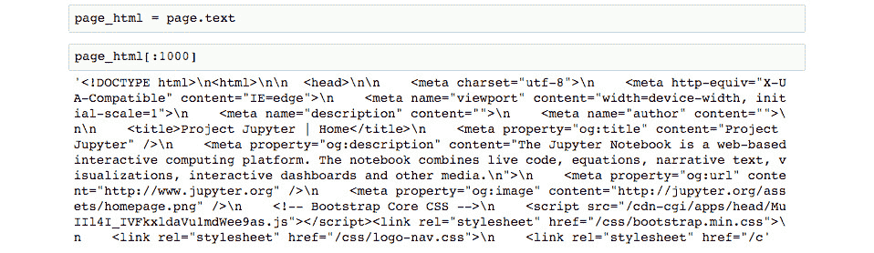

    ###### 图 3.2：HTML 响应文本

    正如预期的那样，响应是 HTML 格式。我们可以借助`BeautifulSoup`，一个将在本节后续部分广泛用于 HTML 解析的库，来更好地格式化此输出。

1.  通过运行以下命令打印格式化后的 HTML 头部：

    ```py
    from bs4 import BeautifulSoup
    print(BeautifulSoup(page_html, 'html.parser').prettify() [:1000])
    ```

    我们导入`BeautifulSoup`，然后打印输出，其中新行根据它们在 HTML 结构中的层级进行缩进。

1.  我们可以进一步通过使用 IPython 显示模块，实际上在 Jupyter 中显示 HTML。通过运行以下代码来实现：

    ```py
    from IPython.display import HTML HTML(page_html)Here, we see the HTML rendered as well as possible, given that no JavaScript code has been run and no external resources have loaded. For example, the images that are hosted on the jupyter.org server are not rendered and we instead see the alt text: circle of programming icons, Jupyter logo, and so on. 
    ```

    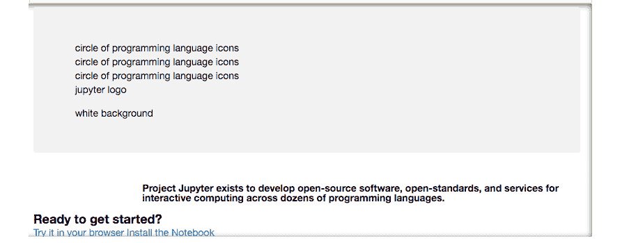

    ###### 图 3.3：未加载图像时获得的输出

1.  让我们将其与可以在 Jupyter 中通过 IFrame 打开的实时网站进行比较。通过运行以下代码来实现：

    ```py
    from IPython.display import IFrame IFrame(src=url, height=800, width=800)
    ```

    

    ###### 图 3.4：整个 Jupyter 网站的渲染

    在这里，我们可以看到完整的站点渲染，包括 JavaScript 和外部资源。事实上，我们甚至可以点击超链接，并像常规浏览会话一样在 IFrame 中加载这些页面。

1.  使用完 IFrame 后，最好将其关闭。这可以防止它占用内存和处理能力。可以通过选择单元格并从 Jupyter Notebook 中的单元格菜单点击 **当前输出** | **清除** 来关闭它。

    回想一下我们是如何使用预设请求和会话将此内容作为字符串请求到 Python 中的。通常也可以使用简写方法来完成此操作。缺点是我们不能对请求头进行太多自定义，但通常这没问题。

1.  通过运行以下代码向[`www.python.org/`](http://www.python.org/)发送请求：

    ```py
    url = 'http://www.python.org/' page = requests.get(url)
    page
    <Response [200]>
    ```

    页面（如单元格下方显示的字符串表示）应该指示一个 200 状态码，表示成功响应。

1.  运行接下来的两个单元格。在这里，我们打印页面的 `url` 和历史记录属性。

    返回的 URL 不是我们输入的 URL；注意其中的差异吗？我们从输入的 URL，[`www.python.org/，`](http://www.python.org/) 被重定向到该页面的安全版本，[`www.python.org/`](http://www.python.org/)。差异体现在协议中的 URL 开头多了一个 s。任何重定向都会保存在历史记录属性中；在这种情况下，我们可以在历史记录中找到一个状态码为 301（永久重定向）的页面，对应于原始请求的 URL。

现在我们已经熟悉了请求的过程，接下来我们将关注 HTML 解析。这可能有些艺术性，因为通常有多种方法可以处理它，而最好的方法通常取决于具体 HTML 的细节。

### 在 Jupyter Notebook 中解析 HTML

当从网页抓取数据时，在发出请求后，我们必须从响应内容中提取数据。如果内容是 HTML，那么最简单的方法是使用高级解析库，如 Beautiful Soup。并不是说这是唯一的方法；原则上，可以使用正则表达式或 Python 字符串方法（如 split）来提取数据，但采用这些方法会低效且容易出错。因此，通常不推荐这样做，建议使用可靠的解析工具。

为了理解如何从 HTML 中提取内容，了解 HTML 的基本原理是很重要的。首先，HTML 代表超文本标记语言（Hyper Text Markup Language）。像 Markdown 或 XML（可扩展标记语言）一样，它仅仅是用于标记文本的语言。在 HTML 中，显示的文本位于 HTML 元素的内容部分，而元素的属性指定该元素在页面上的显示方式。

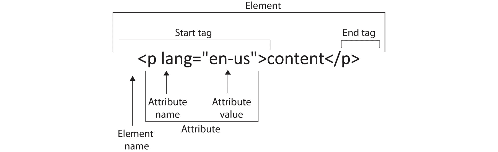

###### 图 3.5：HTML 的基本块

看看 HTML 元素的结构，如上图所示，我们可以看到内容被包含在开始标签和结束标签之间。在这个例子中，标签是 `<p>`（段落）；其他常见的标签类型有 `<div>`（文本块）、`<table>`（数据表格）。

`<h1>`（标题）、``（图片）和 `<a>`（超链接）。标签有属性，这些属性可以存储重要的元数据。最常见的用途是指定元素文本在页面上的显示方式。这就是 CSS 文件发挥作用的地方。属性还可以存储其他有用的信息，例如 `<a>` 标签中的超链接 `href`，它指定了一个 URL 链接，或者 `` 标签中的备用 alt 标签，它指定了当图像无法加载时显示的文本。

现在，让我们回到 Jupyter Notebook，并开始解析一些 HTML！虽然在本练习中跟随操作时不必使用，但在实际应用中，使用 Chrome 或 Firefox 的开发者工具来帮助识别感兴趣的 HTML 元素是非常有用的。在接下来的练习中，我们将为您提供如何使用 Chrome 的相关说明。

### 练习 15：在 Jupyter Notebook 中使用 Python 解析 HTML

1.  在 `lesson-3-workbook.ipynb` 文件中，滚动至 `子主题 B: 使用 Python 解析 HTML` 的顶部。

    在这个练习中，我们将从维基百科抓取各国的中央银行利率。在开始编码之前，我们先打开包含这些数据的网页。

1.  在网页浏览器中访问 [`en.wikipedia.org/wiki/List_of_countries_by_central_bank_interest_rates`](https://en.wikipedia.org/wiki/List_of_countries_by_central_bank_interest_rates)。如果可能的话，请使用 Chrome，因为在接下来的练习中，我们将展示如何使用 Chrome 的开发者工具查看和搜索 HTML。

    从页面上看，我们几乎只能看到一个列出各国及其利率的大表格。这就是我们将要抓取的数据。

1.  返回 Jupyter Notebook，将 HTML 加载为 Beautiful Soup 对象，以便解析。通过运行以下代码来完成此操作：

    ```py
    from bs4 import BeautifulSoup
    soup = BeautifulSoup(page.content, 'html.parser')
    ```

    我们使用 Python 默认的 html.parser 作为解析器，但如果需要，也可以使用 `lxml` 等第三方解析器。通常，在处理像 Beautiful Soup 这样的新对象时，最好通过 `soup?` 来查看文档字符串。然而，在这种情况下，文档字符串并没有提供太多有用的信息。另一个探索 Python 对象的工具是 `pdir`，它列出了一个对象的所有属性和方法（可以通过 pip install `pdir2` 安装）。它基本上是 Python 内置 `dir` 函数的格式化版本。

1.  通过运行以下代码显示 BeautifulSoup 对象的属性和方法。无论是否安装了 `pdir` 外部库，都会运行：

    ```py
    try:
    import pdir dir = pdir
    except:
    print('You can install pdir with:\npip install pdir2') dir(soup)
    ```

    在这里，我们看到了一个可以在 soup 上调用的方法和属性的列表。最常用的函数可能是 `find_all`，它返回符合给定条件的元素列表。

1.  通过以下代码获取页面的 h1 标题：

    ```py
    h1 = soup.find_all('h1') h1
    >> [<h1 class="firstHeading" id="firstHeading" lang="en">List of countries by central bank interest rates</h1>]
    ```

    通常，页面上只有一个 H1（顶级标题）元素，所以我们只找到一个也就不奇怪了。

1.  运行接下来的几个单元格。我们将 H1 重新定义为第一个（也是唯一的）列表元素，`h1 = h1[0]`，然后通过 `h1.attrs` 打印出 HTML 元素的属性：

    我们看到这个元素的类和 ID，可以通过 CSS 代码引用它们来定义该元素的样式。

1.  通过打印 `h1.text` 获取 HTML 元素内容（即可见文本）。

1.  通过运行以下代码获取页面上的所有图片：

    ```py
    imgs = soup.find_all('img') len(imgs)
    >> 91
    ```

    页面上有很多图片，其中大多数是国旗的图片。

1.  运行以下代码打印每张图片的源代码：

    ```py
    [element.attrs['src'] for element in imgs if 'src' in element.attrs.keys()]
    ```

    我们使用列表推导来遍历元素，选择每个元素的 `src` 属性（只要该属性实际存在）。

    现在，让我们来抓取表格。我们将使用 Chrome 的开发者工具来找出包含该元素的部分。

    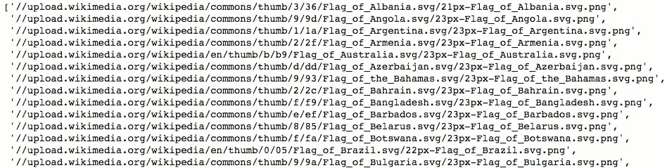

    ###### 图 3.6：抓取目标网页上的表格

1.  如果还没有完成，请在 Chrome 中打开我们正在查看的 Wikipedia 页面。然后，在浏览器中从 **查看** 菜单中选择 **开发者工具**。侧边栏将会打开。HTML 可以从开发者工具的 **元素** 标签中查看。

1.  选择工具侧边栏左上角的小箭头图标。这样，我们可以在页面上悬停，并看到 HTML 元素在侧边栏 **元素** 部分中的位置：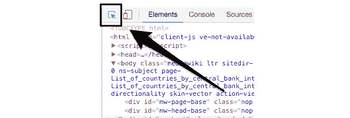

    ###### 图 3.7：定位 HTML 元素的箭头图标

1.  悬停在正文部分，查看表格如何被包含在 `id="bodyContent"` 的 div 中：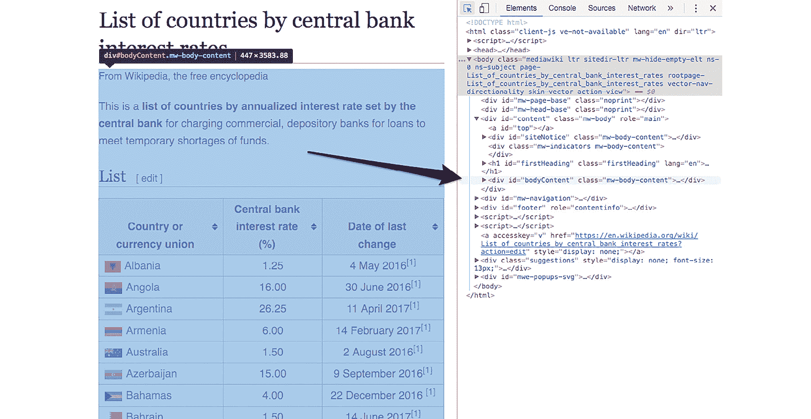

    ###### 图 3.8：目标网页中表格的 HTML 代码

1.  通过运行以下代码选择该 `div`：

    ```py
    body_content = soup.find('div', {'id': 'bodyContent'})
    ```

    我们现在可以在 HTML 的这一子集内查找表格。通常，表格按头部 `<th>`、行 `<tr>` 和数据条目 `<td>` 组织。

1.  通过运行以下代码获取表格头部：

    ```py
    table_headers = body_content.find_all('th')[:3] table_headers
    >>> [<th>Country or<br/>
    currency union</th>, <th>Central bank<br/> interest rate (%)</th>, <th>Date of last<br/> change</th>]
    ```

    在这里，我们看到三个头部。每个头部的内容中都有一个换行元素 `<br/>`，这将使得文本清理起来有点困难。

1.  通过运行以下代码获取文本：

    ```py
    table_headers = [element.get_text().replace('\n', ' ')
    for element in table_headers]
    table_headers
    >> ['Country or currency union', 'Central bank interest rate (%)', 'Date of last change']
    ```

    在这里，我们使用 `get_text` 方法获取内容，然后运行替换字符串方法去除由于 `<br/>` 元素导致的换行符。

    为了获取数据，我们首先执行一些测试，然后将所有数据抓取到一个单元格中。

1.  通过运行以下代码获取第二个 `<tr>`（行）元素中每个单元格的数据：

    ```py
    row_number = 2
    d1, d2, d3 = body_content.find_all('tr')[row_number]\
    .find_all('td')
    ```

    我们找到所有的行元素，挑选出第三行，然后在其中找到三个数据元素。

    让我们看看结果数据，并了解如何从每一行中解析文本。

1.  运行接下来的几个单元格，打印 `d1` 及其文本属性：图 3.9：打印 d1 及其文本属性

    

    ###### 图 3.9：打印 d1 及其文本属性

    我们在前面得到了一些不需要的字符。可以通过仅搜索 `<a>` 标签的文本来解决这个问题。

1.  运行`d1.find('a').text`来返回该单元格的正确*清洗*数据。

1.  运行接下来的几个单元格，打印 `d2` 及其文本。这个数据似乎已经足够干净，可以直接转换为浮动值。

1.  运行接下来的几个单元格，打印 `d3` 及其文本：图 3.10：打印 d3 及其文本属性

    

    ###### 图 3.10：打印 `d3` 及其文本属性

    与`d1`类似，我们发现最好只获取 `span` 元素的文本。

1.  通过运行以下代码正确解析该表格条目的日期：

    ```py
    d3.find_all('span')[1].text
    >> '30 June 2016'
    ```

1.  现在，我们准备通过迭代行元素 `<th>` 来执行完整的抓取操作。运行以下代码：

    ```py
    data = []
    for i, row in enumerate(body_content.find_all('tr')):
    ...
    ...
    >> Ignoring row 101 because len(data) != 3
    >> Ignoring row 102 because len(data) != 3
    ```

    #### 注意

    完整代码请参阅以下链接：[`bit.ly/2EKMNbV`](https://bit.ly/2EKMNbV)。

    我们迭代这些行，忽略任何包含超过三个数据元素的行。这些行将不对应我们感兴趣的表格数据。那些包含三个数据元素的行则被认为是表格中的数据，我们按照测试时确定的方法解析这些文本。

    文本解析是在 `try/except` 语句内部完成的，这样可以捕捉到任何错误并跳过该行而不停止迭代。任何由于该语句而引发错误的行应当被查看。这些数据可以手动记录，或通过修改抓取循环并重新运行来解决。在这种情况下，为了节省时间，我们会忽略任何错误。

1.  通过运行`print(data[:10])`来打印抓取数据列表的前十项：

    ```py
    >> [['Albania', 1.25, '4 May 2016'],
    ['Angola', 16.0, '30 June 2016'],
    ['Argentina', 26.25, '11 April 2017'],
    ['Armenia', 6.0, '14 February 2017'],
    ['Australia', 1.5, '2 August 2016'],
    ['Azerbaijan', 15.0, '9 September 2016'],
    ['Bahamas', 4.0, '22 December 2016'],
    ['Bahrain', 1.5, '14 June 2017'],
    ['Bangladesh', 6.75, '14 January 2016'],
    ['Belarus', 12.0, '28 June 2017']]
    ```

1.  我们稍后会在本章中可视化这些数据。现在，通过运行以下代码将数据保存到 CSV 文件中：

    ```py
    f_path = '../data/countries/interest-rates.csv' with open(f_path, 'w') as f:
    f.write('{};{};{}\n'.format(*table_headers)) for d in data:
    f.write('{};{};{}\n'.format(*d))
    ```

    请注意，我们使用分号来分隔字段。

### 活动 3：使用 Jupyter Notebooks 进行网页抓取

你应该已经完成了本章的前一个练习。

在本活动中，我们将获取每个国家的人口数据。接下来，在下一个话题中，这些数据将与前一个练习中抓取的利率数据一起进行可视化。

我们在本活动中查看的页面可以通过以下链接访问：[`www.worldometers.info/world-population/population-by-country/`](http://www.worldometers.info/world-population/population-by-country/)。

我们的目标是将网页抓取的基础应用到一个新网页，并抓取更多的数据。

#### 注意

由于本文档创建时该页面内容可能已经发生变化。如果该 URL 不再指向国家人口表格，请改用此 Wikipedia 页面：[`en.wikipedia.org/wiki/List_of_countries_by_population(United_Nations)`](https://en.wikipedia.org/wiki/List_of_countries_by_population(United_Nations))。

为了实现这一目标，需要执行以下步骤：

1.  从网页抓取数据。

1.  在`lesson-3-workbook.ipynb` Jupyter Notebook 中，滚动至`Activity A: 使用 Python 进行网页抓取`。

1.  设置`url`变量并在笔记本中加载我们的页面的 IFrame。

1.  通过选择单元格并点击 Jupyter Notebook 中 **当前输出** | 清除，从**单元格**菜单中清除 IFrame。

1.  请求页面并将其加载为`BeautifulSoup`对象。

1.  打印页面的 H1 标签。

1.  获取并打印表格的标题。

1.  选择前三列并解析文本。

1.  获取样本行的数据。

1.  我们有多少列数据？打印`row_data`的长度。

1.  打印行的前几个元素。

1.  选择数据元素 d1、d2 和 d3。

1.  查看`row_data`输出，我们可以发现如何正确地解析数据。选择第一个数据元素中`<a>`元素的内容，然后直接从其他元素中获取文本。

1.  抓取并解析表格数据。

1.  打印抓取数据的头部。

1.  最后，将数据保存为 CSV 文件以便后续使用。

    #### 注意

    详细的步骤及解决方案已在*附录 A*（第 160 页）中给出。

总结一下，我们已经看到了如何使用 Jupyter Notebooks 进行网页抓取。我们从本章开始学习了 HTTP 方法和状态码。接着，我们使用 Requests 库实际执行了 Python 中的 HTTP 请求，并看到了 Beautiful Soup 库如何用于解析 HTML 响应。

我们的 Jupyter Notebook 证明是进行这类工作的一个很好的工具。我们能够探索网页请求的结果，并实验各种 HTML 解析技术。我们还能够渲染 HTML，甚至在笔记本内加载网页的实时版本！

在本章的下一个主题中，我们将转向一个全新的话题：互动可视化。我们将学习如何在笔记本中创建并展示互动图表，并将这些图表用作探索我们刚刚收集的数据的方式。

## 互动可视化

可视化是从数据集提取信息的有力工具。例如，通过柱状图，与查看表格中的值相比，很容易区分出值的分布。当然，正如我们在本书中之前看到的，它们还可以用来研究数据集中的模式，这些模式在其他情况下可能非常难以识别。此外，它们还可以帮助向不熟悉的人解释数据集。例如，如果包含在博客文章中，它们可以提高读者的兴趣并用来打破文本块。

在考虑交互式可视化时，其优点类似于静态可视化，但因为它们允许观众进行主动探索，所以更加增强了体验。它们不仅让观众能够回答自己对数据的疑问，同时在探索过程中还会激发出新的问题。这不仅能为独立方如博客读者或同事带来好处，也能帮助创作者，因为它允许在不需要修改任何代码的情况下轻松进行数据的临时详细探索。

在本主题中，我们将讨论并展示如何在 Jupyter 中使用 Bokeh 构建交互式可视化。然而，在此之前，我们将简要回顾 pandas DataFrame，它在使用 Python 进行数据可视化时起着重要作用。

### 构建 DataFrame 来存储和组织数据

正如我们在本书中反复看到的，pandas 是使用 Python 和 Jupyter Notebook 进行数据科学不可或缺的一部分。DataFrame 提供了一种组织和存储标记数据的方法，但更重要的是，pandas 提供了节省时间的处理方法，用于在 DataFrame 中转换数据。本书中我们已经看到的例子包括删除重复项、将字典映射到列、在列上应用函数和填充缺失值。

关于可视化，DataFrame 提供了创建各种 matplotlib 图形的方法，包括 `df.plot.barh()`、`df.plot.hist()` 等。之前，交互式可视化库 Bokeh 依赖 pandas DataFrame 来生成其 *高级图表*。这些图表的工作方式类似于我们在上一章中看到的 Seaborn，即将 DataFrame 传递给绘图函数，并指定要绘制的列。然而，Bokeh 的最新版本已不再支持这种行为。现在，图表的创建方式与 matplotlib 类似，数据可以存储在简单的列表或 NumPy 数组中。讨论的重点是，DataFrame 并不是绝对必要的，但它仍然对在可视化前整理和处理数据非常有帮助。

### 练习 16：构建和合并 Pandas DataFrame

让我们直接进入一个练习，继续处理我们之前抓取的国家数据。回想一下，我们提取了各国的中央银行利率和人口数据，并将结果保存到 CSV 文件中。我们将从这些文件中加载数据，并将它们合并成一个 DataFrame，随后用于交互式可视化。

1.  在 Jupyter Notebook 的 `lesson-3-workbook.ipynb` 中，滚动到 `Topic B` 部分的 `Subtopic A: 构建 DataFrame 来存储和组织数据` 子主题。

    我们首先将从 CSV 文件加载数据，使其恢复到抓取后的状态。这将允许我们练习从 Python 对象构建 DataFrame，而不是使用 `pd.read_csv` 函数。

    #### 注意

    使用 `pd.read_csv` 时，数据类型会根据字符串输入进行推断。另一方面，使用 `pd.DataFrame`（如我们这里所做的）时，数据类型会根据输入变量的类型来确定。在我们的例子中，正如后续所看到的，我们读取文件后，并没有急于将变量转换为数值或日期时间类型，而是在实例化 DataFrame 后再进行转换。

1.  通过运行以下代码将 CSV 文件加载到列表中：

    ```py
    with open('../data/countries/interest-rates.csv', 'r') as f:
    int_rates_col_names = next(f).split(',')
    int_rates = [line.split(',') for line in f.read(). splitlines()]
    with open('../data/countries/populations.csv', 'r') as f: populations_col_names = next(f).split(',')
    populations = [line.split(',') for line in f.read(). splitlines()]
    ```

1.  通过运行接下来的两个单元格来检查结果列表的内容。我们应该能看到类似以下的输出：

    ```py
    print(int_rates_col_names) int_rates[:5]
    >> ['Country or currency union', 'Central bank interest ...
    ...
    ['Indonesia', '263', '991', '379', '1.10 %'],
    ['Brazil', '209', '288', '278', '0.79 %']]
    ```

    现在，数据已经变成了标准的 Python 列表结构，就像我们在之前的章节中从网页抓取数据后看到的那样。接下来，我们将创建两个 DataFrame 并合并它们，使所有数据都组织在一个对象中。

1.  使用标准的 DataFrame 构造函数，通过运行以下代码来创建两个 DataFrame：

    ```py
    df_int_rates = pd.DataFrame(int_rates, columns=int_rates_ col_names)
    df_populations = pd.DataFrame(populations, columns=populations_col_names)
    ```

    这并不是我们在本书中第一次使用这个函数。在这里，我们传递了之前看到的数据列表和相应的列名。输入数据也可以是字典类型，这在每一列的数据存储在单独的列表中时非常有用。

    接下来，我们将清理每个 DataFrame。首先是利率 DataFrame，让我们打印头部和尾部，并列出数据类型。

1.  当显示整个 DataFrame 时，默认的最大行数为 60（对于版本 0.18.1）。让我们通过运行以下代码将其减少到 10 行：

    ```py
    pd.options.display.max_rows = 10
    ```

1.  通过运行以下代码显示利率 DataFrame 的头部和尾部：

    ```py
    df_int_rates
    ```

    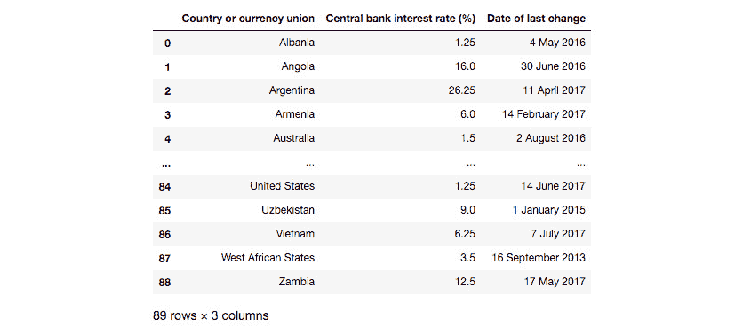

    ###### 图 3.11：各国利率表

1.  通过运行以下代码打印数据类型：

    ```py
    df_int_rates.dtypes 				
    >> Country or currency union		object
    >> Central bank interest rate (%)		object	
    >> Date of last change			object
    >> dtype: object
    ```

    Pandas 已将每一列指定为字符串数据类型，这是合理的，因为输入变量都是字符串。我们需要将这些列分别转换为字符串、浮动数值和日期时间类型。

1.  通过运行以下代码将数据转换为正确的数据类型：

    ```py
    df_int_rates['Central bank interest rate (%)'] = \ df_int_rates['Central bank interest rate (%)']\
    .astype(float, copy=False)
    df_int_rates['Date of last change'] = \ pd.to_datetime(df_int_rates['Date of last change'])
    ```

    我们使用 `astype` 将利率值转换为浮动数值类型，设置 `copy=False` 以节省内存。由于日期值已经是易于阅读的格式，因此可以通过使用 `pd.to_datetime` 轻松转换。

1.  通过运行以下代码检查每一列的新数据类型：

    ```py
    df_int_rates.dtypes
    >> Country or currency union					object
    >> Central bank interest rate (%)				float64
    >> Date of last change					datetime64[ns]	
    >> dtype: object
    ```

    如图所示，一切现在都处于正确的格式中。

1.  让我们对另一个数据框应用相同的过程。运行接下来的几个单元，重复之前针对`df_populations`的步骤：

    ```py
    df_population
    ```

    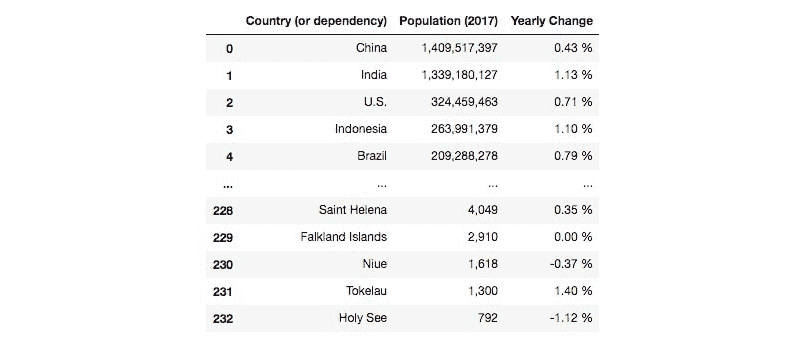

    ###### 图 3.12：按国家划分的人口表格

    然后，运行此代码：

    ```py
    df_populations['Population (2017)'] = df_populations['Population (2017)']\
    .str.replace(',', '')\
    .astype(float, copy=False)
    df_populations['Yearly Change'] = df_populations['Yearly Change']\
    .str.rstrip('%')\
    .astype(float, copy=False)
    ```

    为了将数字列转换为浮动类型，我们必须首先对这些字符串进行一些修改。在这种情况下，我们去除了人口中的逗号，并去掉了年变化列中的百分号，使用了字符串方法。

    现在，我们将根据每行的国家名称合并数据框。请记住，这些仍然是从网络抓取的原始国家名称，所以可能需要进行一些字符串匹配的工作。

1.  通过运行以下代码合并数据框：

    ```py
    df_merge = pd.merge(df_populations,
    df_int_rates,
    left_on='Country (or dependency)', right_on='Country or currency union', how='outer'
    df_merge
    ```

    我们将左侧数据框中的人口数据与右侧数据框中的利率数据进行合并，在国家列上执行外部匹配。如果两个数据框没有交集，将会出现`NaN`值。

1.  为了节省时间，让我们先看看人口最多的国家，看看我们是否错过了匹配。理想情况下，我们应该检查所有内容。通过运行以下代码查看人口最多的国家：

    ```py
    df_merge.sort_values('Population (2017)', ascending=False)\
    .head(10)
    ```

    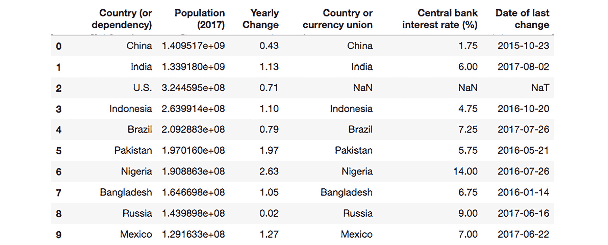

    ###### 图 3.13：人口最多国家的表格

    看起来美国没有匹配上。这是因为在利率数据中，它被列为*United States*。让我们来解决这个问题。

1.  通过运行以下代码修正人口表中美国的标签：

    ```py
    col = 'Country (or dependency)'
    df_populations.loc[df_populations[col] == 'U.S.'] = 'United States'
    ```

    我们使用`loc`方法重命名人口数据框中的国家列，通过定位该行来进行操作。

    现在，让我们正确地合并数据框。

1.  重新根据国家名称合并数据框，但这次使用内连接合并，以去除`NaN`值：

    ```py
    df_merge = pd.merge(df_populations,
    df_int_rates,
    left_on='Country (or dependency)', right_on='Country or currency union',
    how='inner')
    ```

1.  我们在合并后的数据框中得到了两列相同的列。通过运行以下代码删除其中一列：

    ```py
    del df_merge['Country or currency union']
    ```

1.  通过运行以下代码重命名列：

    ```py
    name_map = {'Country (or dependency)': 'Country', 'Population (2017)': 'Population',
    'Central bank interest rate (%)': 'Interest
    rate'}
    df_merge = df_merge.rename(columns=name_map)
    ```

    我们得到以下合并并清理后的数据框：

    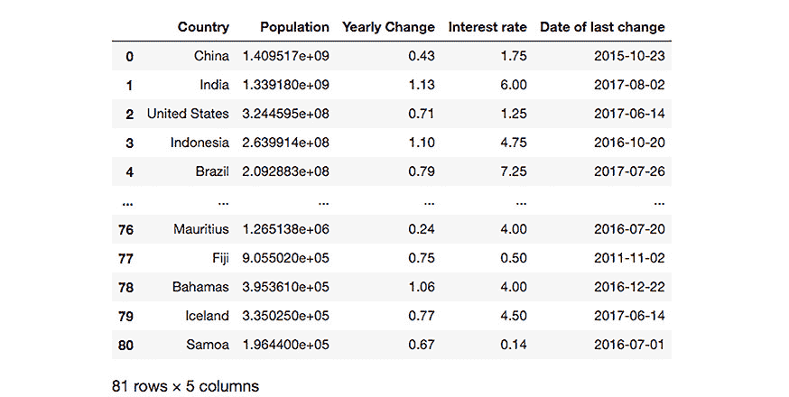

    ###### 图 3.14：清理和合并表格后的输出

1.  现在我们已经将所有数据整理成一个漂亮的表格，可以进入有趣的部分了：可视化它。让我们将这个表格保存到 CSV 文件中以供以后使用，然后继续讨论如何使用 Bokeh 创建可视化。

    使用以下代码将合并后的数据写入 CSV 文件以供以后使用：

    ```py
    df_merge.to_csv('../data/countries/merged.csv', index=False)
    ```

### Bokeh 简介

Bokeh 是一个 Python 的交互式可视化库。它的目标是提供类似于 D3 的功能，D3 是 JavaScript 中流行的交互式可视化库。Bokeh 的工作方式与 D3 有很大的不同，这并不奇怪，因为 Python 和 JavaScript 之间存在差异。总体来说，Bokeh 要简单得多，而且不像 D3 那样允许进行大量定制。然而，这也正是它的优势所在，因为它更容易使用，并且仍然拥有一套出色的功能，我们将在本节中进行探索。

让我们通过一个简单的练习来快速了解 Jupyter Notebook，并通过示例介绍 Bokeh。

#### 注意

网上有关于 Bokeh 的良好文档，但许多文档已经过时。例如，使用 Google 搜索"Bokeh 条形图"时，通常会找到关于不再存在的遗留模块的文档，例如，曾通过`bokeh.charts`提供的高级绘图工具（在 0.12.0 版本之前）。这些工具与 Seaborn 的绘图函数类似，接受 pandas DataFrame 作为输入。去除高级绘图工具模块使 Bokeh 变得更加简洁，并将为今后的集中开发提供更多空间。现在，绘图工具主要集中在`bokeh.plotting`模块中，下一次练习和随后的活动中将会看到这一点。

### 练习 17：Bokeh 交互式可视化简介

我们将加载所需的 Bokeh 模块，并展示一些可以用 Bokeh 创建的简单交互式图形。请注意，本书中的示例是基于 Bokeh 版本 0.12.10 设计的。

1.  在`lesson-3-workbook.ipynb` Jupyter notebook 中，滚动至`子主题 B：Bokeh 简介`。

1.  和 scikit-learn 一样，Bokeh 模块通常是按需加载的（与 pandas 不同，后者会一次性加载整个库）。通过运行以下代码导入一些基本的绘图模块：

    ```py
    from bokeh.plotting import figure, show, output_notebook output_notebook()
    ```

    我们需要运行`output_notebook()`才能在 Jupyter notebook 中渲染交互式可视化。

1.  通过运行以下代码生成随机数据以进行绘图：

    ```py
    np.random.seed(30)
    data = pd.Series(np.random.randn(200),
    index=list(range(200)))\
    .cumsum() x = data.index
    y = data.values
    ```

    随机数据是通过对一组随机数字进行累积求和生成的，这些数字分布在零附近。其效果类似于股价时间序列的趋势。

1.  通过运行以下代码，在 Bokeh 中使用折线图绘制数据：

    ```py
    p = figure(title='Example plot', x_axis_label='x', y_axis_ label='y')p.line(x, y, legend='Random trend') show(p)
    ```

    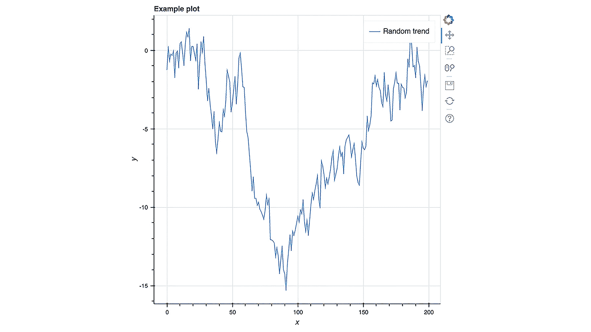

    ###### 图 3.15：示例数据图

    我们实例化图形，使用变量`p`引用它，然后绘制一条线。在 Jupyter 中运行后，会显示一个交互式图形，并在右侧提供各种选项。

    前三个选项（截至版本 0.12.10）是**平移**、**框选缩放**和**滚轮缩放**。尝试这些功能，并实验它们的工作方式。使用重置选项重新加载默认的绘图范围。

1.  可以使用`figure`的其他方法创建其他图表。通过运行以下代码绘制散点图，将前面代码中的`line`替换为`circle`：

    ```py
    size = np.random.rand(200) * 5
    p = figure(title='Example plot', x_axis_label='x', y_axis_ label='y')
    p.circle(x, y, radius=size, alpha=0.5, legend='Random dots')
    show(p)
    ```

    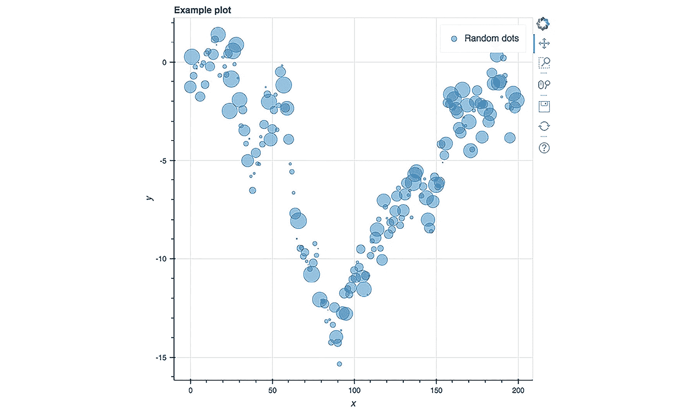

    ](img/C13018_03_16.jpg)

    ###### 图 3.16：一个示例散点图

    在这里，我们使用一组随机数字来指定每个圆圈的大小。交互式可视化的一个非常吸引人的特点是工具提示。它是一种悬停工具，允许用户通过悬停在某个点上查看该点的信息。

1.  为了添加这个工具，我们将使用一种稍微不同的方法来创建图表。这将需要我们导入几个新的库。运行以下代码：

    ```py
    from bokeh.plotting import ColumnDataSource from bokeh.models import HoverTool
    ```

    这次，我们将创建一个数据源并传递给绘图方法。这个数据源可以包含元数据，通过悬停工具在可视化中显示。

1.  通过运行以下代码，创建随机标签并绘制带有悬停工具的交互式可视化：

    ```py
    source = ColumnDataSource(data=dict( x=x,
    y=y,
    ...
    ...
    source=source,
    legend='Random dots')
    show(p)
    ```

    #### 注意

    完整代码请参考：[`bit.ly/2RhpU1r`](https://bit.ly/2RhpU1r)。

    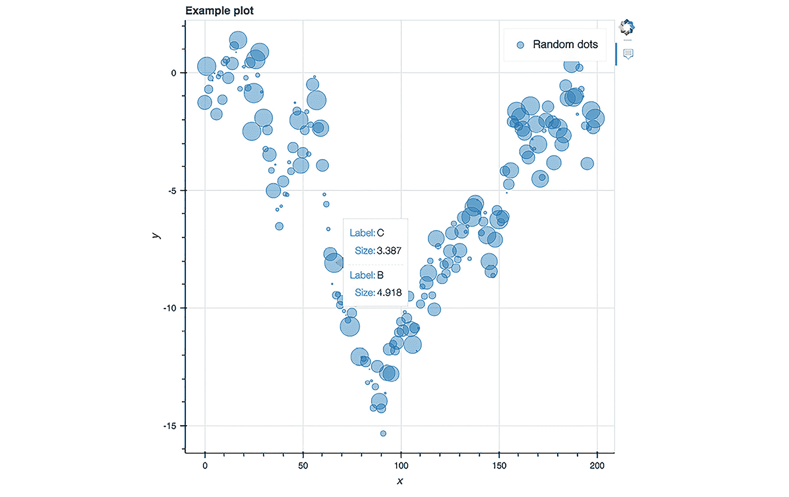

    ](img/C13018_03_17.jpg)

    ###### 图 3.17：带标签的随机散点图

    我们通过将键值对字典传递给`ColumnDataSource`构造函数来定义图表的数据源。这个数据源包括每个点的*X*位置、*Y*位置以及大小，同时还包括随机字母`A`、`B`或`C`，这些字母作为悬停工具的标签，悬停时会显示每个点的大小。`bokeh.plotting.figure`。

1.  通过运行以下代码，将平移、缩放和重置工具添加到图表中：

    ```py
    from bokeh.models import PanTool, BoxZoomTool, WheelZoomTool, ResetTool
    ...
    ...
    legend='Random dots')
    show(p)
    ```

    这段代码与之前显示的完全相同，唯一不同的是`tools`变量，它现在引用了我们从 Bokeh 库导入的几个新工具。

我们将在此处停止介绍性练习，但将在接下来的活动中继续创建和探索图表。

### 活动 4：使用交互式可视化探索数据

你应该已经完成了之前的练习，才能继续完成此活动。

我们将继续使用 Bokeh，从上一个练习结束的地方开始，只不过这次我们不再使用之前看到的随机生成数据，而是使用我们在本章第一部分从网页抓取的数据。我们的目标是使用 Bokeh 来创建抓取数据的交互式可视化。

为了做到这一点，我们需要执行以下步骤：

1.  在`lesson-3-workbook.ipynb`文件中，滚动到`Activity B: 使用 Bokeh 进行交互式可视化`部分。

1.  加载之前抓取、合并并清洗过的网页数据

1.  通过显示 DataFrame 来回顾数据的样子。

1.  绘制一个人口与利率之间关系的散点图。

1.  在数据中，我们看到一些明显的异常值，具有较高的值。将鼠标悬停在这些点上查看它们是什么。选择框选缩放工具，并调整视图窗口，以便更好地看到大部分数据。

1.  一些人口较少的国家似乎有负利率。选择**滚轮缩放**工具，使用它放大该区域。若需要，使用**平移**工具重新定位图表，确保负利率样本在视野内。悬停在这些样本上，查看它们对应的国家。

1.  向 DataFrame 中添加一个**最后变更年份**列，并根据最后利率变化的日期为其添加颜色。

1.  创建一个地图，将最后变更日期分成不同的颜色类别。

1.  创建彩色可视化。

1.  寻找模式时，放大查看低人口国家。

1.  运行以下代码，将利率绘制为与年同比人口变化的函数。

1.  确定先前绘制关系的最佳拟合线。

1.  重新绘制前一步得到的输出，并添加最佳拟合线。

1.  使用缩放工具探索图表，并悬停在有趣的样本上。

    #### 注意

    详细步骤及解决方案展示在*附录 A*（第 163 页）。

## 总结

在本章中，我们抓取了网页表格，然后使用互动式可视化来研究数据。

我们首先了解了 HTTP 请求的工作原理，重点讨论了 GET 请求及其响应状态码。然后，我们进入 Jupyter Notebook，使用 Python 的 Requests 库发出了 HTTP 请求。我们看到了 Jupyter 如何在笔记本中渲染 HTML，以及实际可以交互的网页。发出请求后，我们看到 Beautiful Soup 如何解析 HTML 中的文本，并使用该库抓取表格数据。

在抓取了两张数据表后，我们将其存储在 pandas DataFrame 中。第一张表包含每个国家的中央银行利率，第二张表包含人口数据。我们将这两张表合并成一个表，然后用它来创建互动式可视化图表。

最后，我们使用 Bokeh 在 Jupyter 中渲染了互动式可视化。我们学习了如何使用 Bokeh API 创建各种自定义图表，并制作了具有特定交互功能（如缩放、平移和悬停）的散点图。在自定义方面，我们明确展示了如何为每个数据样本设置点的半径和颜色。

此外，在使用 Bokeh 探索抓取的人口数据时，我们利用了工具提示（tooltip）来显示国家名称和相关数据，当鼠标悬停在数据点上时。

恭喜你完成了使用 Jupyter Notebooks 进行数据科学入门课程！无论你之前有多少 Jupyter 和 Python 的经验，你已经掌握了一些实用且可以应用于实际数据科学的技能！

在结束之前，让我们快速回顾一下本书中涵盖的主题。

第一章介绍了 Jupyter Notebook 平台，我们涵盖了所有基础知识。我们了解了界面以及如何使用和安装魔法函数。接着，我们介绍了将要使用的 Python 库，并通过*波士顿住房*数据集进行了一次探索性分析。

在第二章中，我们专注于使用 Jupyter 进行机器学习。我们首先讨论了制定预测分析计划的步骤，然后介绍了几种不同类型的模型，包括 SVM、KNN 分类器和随机森林。

在处理*员工离职*数据集时，我们应用了数据清洗方法，并训练了模型来预测员工是否离职。我们还探讨了更高级的话题，如过拟合、k 折交叉验证和验证曲线。

最后，在第三章中，我们暂时从数据分析转向了数据收集，使用了网页抓取技术，并学习了如何在 Jupyter 中进行 HTTP 请求以及解析 HTML 响应。随后，我们通过使用交互式可视化工具来探索我们收集的数据，完成了本书内容。
