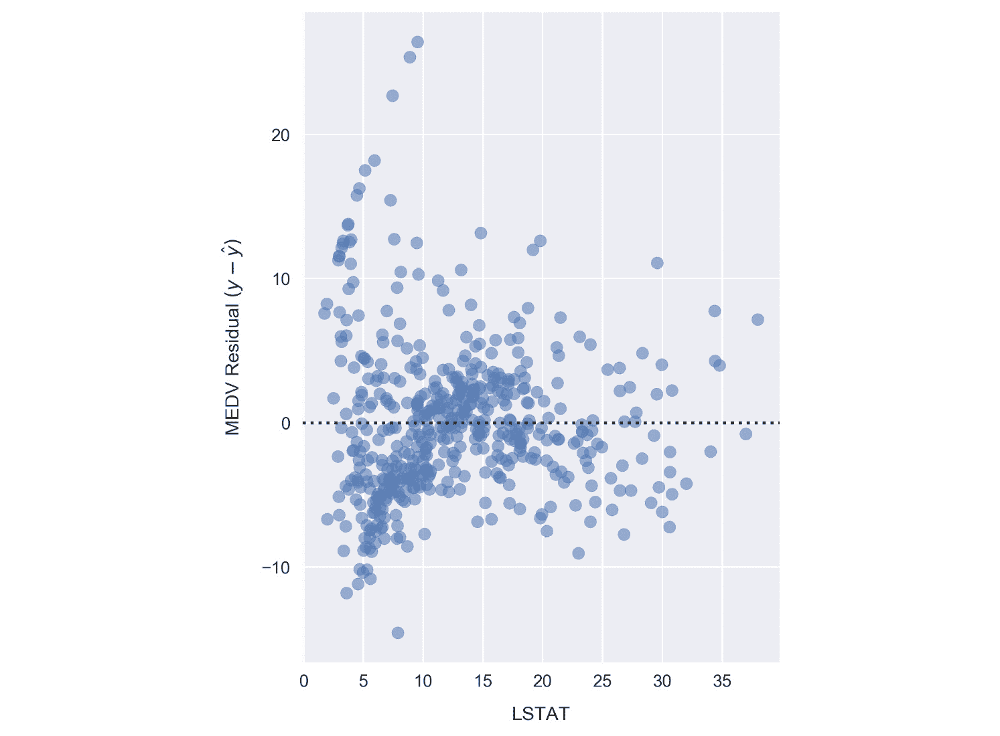
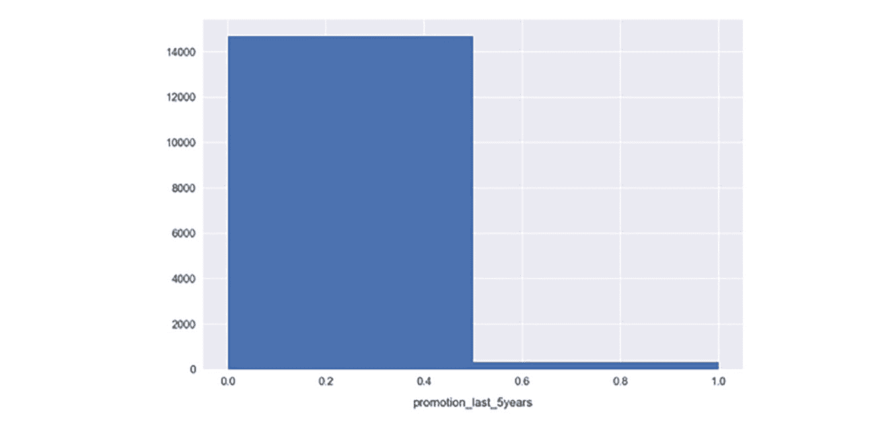

# 附录 A

## 关于

本节内容是为了帮助学生执行书中提供的活动，包含详细步骤，学生需要按照这些步骤完成活动并实现其目标。

## 第一章：Jupyter 基础

### 活动 1：构建三次多项式模型

1.  滚动到 Jupyter Notebook 中`Subtopic C`底部的空单元格。

1.  这些将位于线性模型`Activity`标题下方。

    #### 注意

    随着活动的进行，您应该在这些空单元格中填充代码。由于这些单元格会逐渐填满，您可能需要插入新单元格；请根据需要操作。

1.  我们将首先从`df.`中提取我们的依赖特征和目标变量，使用以下方法：

    ```py
    y = df['MEDV'].values
    x = df['LSTAT'].values.reshape(-1,1)
    ```

    这与我们之前为线性模型所做的完全相同。

1.  通过打印前几个样本`print(x[:3])`来验证`x`的样子：

    ###### 图 1.49：使用 print()打印 x 的前三个值

    注意，数组中的每个元素本身是一个长度为 1 的数组。这就是`reshape(-1,1)`的作用，它是 scikit-learn 所期望的格式。

1.  通过从 scikit-learn 导入适当的转换工具并实例化三次多项式特征转换器，将`x`转化为“多项式特征”：

    ```py
    from sklearn.preprocessing import PolynomialFeatures poly = PolynomialFeatures(degree=3)
    ```

    这一步骤的理由可能一时不太明显，但稍后将会解释。

1.  通过运行`fit_transform`方法转换`x`，并通过运行以下代码构建多项式特征集：

    ```py
    x_poly = poly.fit_transform(x)
    ```

    在这里，我们使用了该转换器的实例来转换 LSTAT 变量。

1.  通过打印前几个样本`print(x_poly[:3])`来验证`x_poly`的样子。

    ###### 图 1.50：使用 print()打印 x_poly 的前三个值

    与*x*不同，现在每一行中的数组长度为 4，其中的值被计算为*xº*、*x¹*、*x²*和*x³*。

    我们现在将使用这些数据来拟合线性模型。将特征标记为*a*、*b*、*c*和*d*，我们将计算线性模型的系数αₒ、α1、α2 和α3：

    

    我们可以代入 a、b、c 和 d 的定义，得到以下多项式模型，其中系数与之前的相同：

    

1.  导入`LinearRegression`类，并像计算 MSE 时一样构建我们的线性分类模型。运行以下代码：

    ```py
    from sklearn.linear_model import LinearRegression clf = 
    LinearRegression()
    clf.fit(x_poly, y)
    ```

1.  使用以下代码提取系数并打印多项式模型：

    ```py
    a_0 = clf.intercept_ + clf.coef_[0] # intercept a_1, a_2, a_3 = clf.coef_[1:]       # other coefficients
    msg = 'model: y = {:.3f} + {:.3f}x + {:.3f}x² + {:.3f}x³'\        .format(a_0, a_1, a_2, a_3)print(msg)
    ```

    

    ###### 图 1.51：提取系数并打印多项式模型

    要获得实际的模型截距，我们必须添加`intercept_`和`coef_`。

    `[0]`属性。更高阶的系数由`coef_`的其余值给出。

1.  通过运行以下代码来确定每个样本的预测值并计算残差：

    ```py
    y_pred = clf.predict(x_poly) resid_MEDV = y - y_pred
    ```

1.  通过运行`print(resid_MEDV[:10])`打印部分残差值：

    ###### 图 1.52：打印残差值

    我们将很快绘制这些图形以与线性模型的残差进行比较，但首先我们将计算 MSE。

1.  运行以下代码以打印第三阶多项式模型的 MSE：

    ```py
    from sklearn.metrics import mean_squared_error error = mean_squared_error(y, y_pred) print('mse = {:.2f}'.format(error))
    ```

    

    ###### 图 1.53：计算均方误差

    如图所示，**MSE**在多项式模型下显著低于线性模型（线性模型的 MSE 为 38.5）。这个误差指标可以通过取平方根转换为以美元为单位的平均误差。对于多项式模型，经过计算后，发现中位数房价的平均误差仅为$5,300。

    现在，我们将通过绘制最佳拟合的多项式线与数据一起，来可视化模型。

1.  通过运行以下代码绘制多项式模型并与样本一起显示：

    ```py
    fig, ax = plt.subplots() # Plot the samples
    ax.scatter(x.flatten(), y, alpha=0.6)
    # Plot the polynomial model
    x_ = np.linspace(2, 38, 50).reshape(-1, 1) x_poly = poly.fit_transform(x_)
    y_ = clf.predict(x_poly)
    ax.plot(x_, y_, color='red', alpha=0.8) ax.set_xlabel('LSTAT'); ax.set_ylabel('MEDV');
    ```

    

    ###### 图 1.54：绘制 MEDV 与 LSTAT 的多项式模型

    在这里，我们通过计算多项式模型在一组`x`值上的预测来绘制红色曲线。这组`x`值是使用`np.linspace`创建的，生成了 50 个均匀分布在 2 到 38 之间的值。

    现在，我们将绘制相应的残差。尽管我们之前使用了 Seaborn 来完成这项任务，但为了展示 scikit-learn 模型的结果，我们需要手动绘制。由于我们之前已经计算了残差，参考`resid_MEDV`变量，我们只需要将这些值绘制在散点图上。

1.  通过运行以下代码绘制残差：

    ```py
    fig, ax = plt.subplots(figsize=(5, 7)) ax.scatter(x, resid_MEDV, alpha=0.6) ax.set_xlabel('LSTAT')
    ax.set_ylabel('MEDV Residual $(y-\hat{y})$') plt.axhline(0, color='black', ls='dotted');
    ```



###### 图 1.55：绘制 LSTAT 与 MEDV 的残差

与线性模型**LSTAT**残差图相比，多项式模型的残差似乎更紧密地聚集在*y - ŷ = 0*附近。请注意，y 是样本**MEDV**，而ŷ是预测值。仍然可以看到明显的模式，例如在*x = 7*和*y = -7*附近的聚类，这表明建模存在不优化之处。

成功地使用多项式模型建模数据后，让我们通过查看类别特征来完成这一章。特别是，我们将构建一组类别特征，并使用它们更详细地探索数据集。

## 第二章：数据清理与高级机器学习

### 活动 2：准备为员工留存问题训练预测模型

1.  滚动到`lesson-2-workbook.ipynb`笔记本文件中的`Activity A`部分。

1.  通过运行以下代码来查看表格的前几行：

    ```py
    %%bash
    head ../data/hr-analytics/hr_data.csv
    ```

    从输出结果来看，确认它看起来是标准的 CSV 格式。对于 CSV 文件，我们应该能够通过`pd.read_csv`轻松加载数据。

1.  使用 Pandas 加载数据，运行`df = pd.read_csv('../data/hr-analytics/hr_data.csv')`。自己输入，并使用 Tab 键完成文件路径的输入。

1.  通过打印`df.columns`来检查列，确保数据已按预期加载，通过打印数据框的`head`和`tail`来检查：`df.head()`和`df.tail()`：

    ###### 图 2.46：检查列头和尾部的输出

    我们可以看到它似乎已经正确加载。根据尾部索引值，数据共有近 15,000 行；让我们确保没有遗漏任何行。

1.  使用以下代码检查 CSV 文件中的行数（包括标题）：

    ```py
    with open('../data/hr-analytics/hr_data.csv') as f: print(len(f.read().splitlines()))
    ```

    

    ###### 图 2.47：检查行数后的输出

1.  将此结果与`len(df)`进行比较，确保你已经加载了所有数据：

    ###### 图 2.48：检查上传样本数量后的输出

    现在我们的客户数据已经正确加载，让我们思考如何使用预测分析来找出员工离职的原因。

    让我们走过创建预测分析计划的第一步：

    查看可用数据：你已经通过查看列、数据类型和样本数量完成了此操作。

    确定业务需求：客户明确表达了他们的需求：减少离职员工的数量。

    评估数据的适用性：让我们尝试制定一个能够满足客户需求的计划，基于所提供的数据。

    如前所述，有效的分析技术能够带来有影响力的商业决策。考虑到这一点，如果我们能够预测员工离职的可能性，企业可以选择性地对这些员工进行特别待遇。例如，可以提高他们的薪水或减少他们的项目数量。此外，使用模型可以估算这些变化的影响！

    为了评估这个计划的有效性，让我们思考一下数据。每一行代表一个员工，该员工要么仍在公司工作，要么已经离开，这由名为“left”的列标记。因此，我们可以根据一组特征训练一个模型来预测这一目标变量。

1.  评估目标变量。通过运行以下代码检查分布和缺失项数量：

    ```py
    df.left.value_counts().plot('barh') print(df.left.isnull().sum()
    ```

    

    ###### 图 2.49：目标变量的分布

    这是第二行代码的输出：

    

    ###### 图 2.50：检查缺失数据点的输出

    大约四分之三的样本是没有离职的员工。离职的员工占了剩下的四分之一。这告诉我们我们正在处理一个不平衡的分类问题，这意味着在计算准确度时需要特别注意每个类别的权重。我们还看到目标变量没有缺失（没有 `NaN` 值）。

    现在，我们将评估这些特征：

1.  通过执行 `df.dtypes` 打印每个数据的类型。观察一下，我们有连续型和离散型特征的混合：

    ###### 图 2.51：打印数据类型进行验证

1.  通过运行以下代码来显示特征的分布：

    ```py
    for f in df.columns: try:
    fig = plt.figure()
    …
    …
    print('-'*30)
    ```

    #### 注意

###### 图 2.52：所有特征的分布：satisfaction_level 和 last_evaluation


###### 图 2.53：所有剩余特征的分布



###### 图 2.54：promotion_last_5years 变量的分布

对于许多特征，我们看到它们在可能值范围内有较宽的分布，这表明特征空间有很好的多样性。这是令人鼓舞的；如果特征大部分集中在一个狭小的值区间内，可能对模型没有很大帮助。`promotion_last_5years` 就是这种情况，大多数样本的值都是 `0`。

接下来我们需要做的是从数据集中删除所有的 `NaN` 值。

+   运行以下代码，检查每一列中有多少 `NaN` 值：

    ```py
    df.isnull().sum() / len(df) * 100
    ```

    

    ###### 图 2.55：验证 NaN 值的数量

    我们可以看到，`average_montly_hours` 有大约 2.5% 的缺失值，`time_spend_company` 有 1% 的缺失值，而 `is_smoker` 则有 98% 的缺失值！我们可以使用你学到的几种策略来处理这些。

    +   删除 `is_smoker` 列，因为这个指标几乎没有任何信息。执行以下代码：`del df['is_smoker']`。*   填充 `time_spend_company` 列中的 `NaN` 值。可以使用以下代码来完成：

    ```py
    fill_value = df.time_spend_company.median()
    df.time_spend_company = df.time_spend_company.fillna(fill_ value)
    ```

    最后一列需要处理的是 `average_montly_hours`。我们可以做类似的处理，使用中位数或四舍五入后的均值作为整数填充值。不过，还是让我们尝试利用它与其他变量的关系。这样可以更准确地填充缺失的数据。

    +   通过运行以下代码，绘制 `average_montly_hours` 按 `number_project` 分组的箱型图：

    ```py
    sns.boxplot(x='number_project', y='average_montly_hours', data=df)
    ```

    

    ###### 图 2.56：average_monthly_hours 和 number_project 的箱型图

    我们可以看到项目数量与`average_ monthly_hours`之间的相关性，这是一个毫不奇怪的结果。我们将利用这一关系，根据每个样本的项目数量来填充`average_montly_hours`中的`NaN`值。

    具体而言，我们将使用每个组的均值。

    +   通过运行以下代码计算每个组的均值：

    ```py
    mean_per_project = df.groupby('number_project')\
    .average_montly_hours.mean() mean_per_project = dict(mean_per_project) print(mean_per_project)
    ```

    

    ###### 图 2.57：平均每月工时的均值计算

    然后，我们可以将其映射到`number_project`列，并将生成的序列对象作为参数传递给`fillna`。

    +   通过执行以下代码填充`average_montly_hours`中的`NaN`值：

    ```py
    fill_values = df.number_project.map(mean_per_project)
    df.average_montly_hours = df.average_montly_hours. fillna(fill_values)
    ```

    +   通过运行以下断言测试，确认`df`没有更多的`NaN`值。如果没有抛出错误，则说明你已成功地从表格中去除了`NaNs`：

    ```py
    assert df.isnull().sum().sum() == 0
    ```

    #### 注意

    我们传递`index=False`，这样索引就不会写入文件。在这种情况下，索引是一组从 0 到 DataFrame 长度的整数，因此它并没有提供任何重要信息。

    +   将字符串和布尔字段转换为整数表示。特别地，我们将手动把目标变量`left`从`yes`和`no`转换为`1`和`0`，并构建独热编码特征。运行以下代码来实现：

    ```py
    df.left = df.left.map({'no': 0, 'yes': 1}) df = pd.get_dummies(df)
    ```

    +   打印`df.columns`以显示字段：

    ###### 图 2.58：数据框中不同字段的截图

    我们可以看到部门和薪资已经被拆分成各种二进制特征。

    准备数据以进行机器学习的最后一步是对特征进行缩放，但出于各种原因（例如，一些模型不需要缩放），我们将在下一个活动中的模型训练工作流中进行缩放。

    +   我们已经完成了数据预处理，准备开始训练模型了！让我们通过运行以下代码来保存我们的预处理数据：

    ```py
    df.to_csv('../data/hr-analytics/hr_data_processed.csv', index=False)
    ```

## 第三章：网页抓取与交互式可视化

### 活动 3：使用 Jupyter 笔记本进行网页抓取

1.  对于此页面，数据可以通过以下代码片段进行抓取：

    ```py
    data = []
    for i, row in enumerate(soup.find_all('tr')): row_data = row.find_all('td')
    try:
    d1, d2, d3 = row_data[1], row_data[5], row_data[6] d1 = d1.find('a').text
    d2 = float(d2.text)
    d3 = d3.find_all('span')[1].text.replace('+', '') data.append([d1, d2, d3])
    except:
    print('Ignoring row {}'.format(i)
    ```

1.  在`lesson-3-workbook.ipynb` Jupyter Notebook 中，滚动到`Activity A: 使用 Python 进行网页抓取`。

1.  设置`url`变量，并通过运行以下代码在笔记本中加载我们的页面 IFrame：

    ```py
    url = 'http://www.worldometers.info/world-population/ population-by-country/'
    IFrame(url, height=300, width=800)
    ```

    页面应该在笔记本中加载。向下滚动，我们可以看到**世界各国按人口排序**的标题以及其下方的值表格。我们将从这个表格中抓取前三列数据，获取国家、人口和每年人口变化。

1.  通过选择单元格并点击 Jupyter Notebook 中的**当前输出** | **清除**，关闭 IFrame。

1.  请求页面并通过运行以下代码将其加载为`BeautifulSoup`对象：

    ```py
    page = requests.get(url)
    soup = BeautifulSoup(page.content, 'html.parser')
    ```

    我们将页面内容传递给`BeautifulSoup`构造函数。回想一下之前，我们在这里使用的是`page.text`。区别在于，`page.content`返回的是原始的二进制响应内容，而`page.text`返回的是 UTF-8 解码后的内容。通常，最佳实践是传递字节对象并让`BeautifulSoup`解码，而不是使用`page.text`通过 Requests 进行解码。

1.  运行以下代码打印页面的 H1：

    ```py
    soup.find_all('h1')
    >> [<h1>Countries in the world by population (2017)</h1>]
    ```

    我们将通过搜索`<th>`、`<tr>`和`<td>`元素来抓取表格，正如在之前的练习中所做的那样。

1.  通过运行以下代码获取并打印表格标题：

    ```py
    table_headers = soup.find_all('th') table_headers
    >> [<th>#</th>,
    <th>Country (or dependency)</th>,
    <th>Population<br/> (2017)</th>,
    <th>Yearly<br/> Change</th>,
    <th>Net<br/> Change</th>,
    <th>Density<br/> (P/Km²)</th>,
    <th>Land Area<br/> (Km²)</th>,
    <th>Migrants<br/> (net)</th>,
    <th>Fert.<br/> Rate</th>,
    <th>Med.<br/> Age</th>,
    <th>Urban<br/> Pop %</th>,
    <th>World<br/> Share</th>]
    ```

1.  我们只对前 3 列数据感兴趣。选择这些并使用以下代码解析文本：

    ```py
    table_headers = table_headers[1:4] table_headers = [t.text.replace('\n', '') for t in table_ headers]
    ```

    在选择我们需要的表格头部子集后，我们解析每个表头的文本内容，并移除其中的换行符。

    现在，我们将获取数据。按照之前练习中的方法，我们将测试如何解析一个样本行的数据。

1.  通过运行以下代码获取样本行的数据：

    ```py
    row_number = 2
    row_data = soup.find_all('tr')[row_number]\
    .find_all('td') 
    ```

1.  我们有多少列数据？通过运行`print(len(row_data))`来打印`row_data`的长度。

1.  通过运行`print(row_data[:4])`打印前几个元素：

    ```py
    >> [<td>2</td>,
    <td style="font-weight: bold; font-size:15px; text-align:left"><a href="/world-population/india- population/">India</a></td>,
    <td style="font-weight: bold;">1,339,180,127</td>,
    <td>1.13 %</td>]
    ```

    很明显，我们需要选择列表索引 1、2 和 3。第一个数据值可以忽略，因为它只是索引。

1.  通过运行以下代码选择我们感兴趣的解析数据元素：

    ```py
    d1, d2, d3 = row_data[1:4]
    ```

1.  查看`row_data`的输出，我们可以找出如何正确解析数据。我们将选择第一个数据元素中`<a>`元素的内容，然后简单地获取其他元素的文本。通过运行以下代码测试这些假设：

    ```py
    print(d1.find('a').text) print(d2.text) print(d3.text)
    >> India
    >> 1,339,180,127
    >> 1.13 %
    ```

    很棒！看起来运行得很顺利。现在，我们准备好抓取整个表格。

1.  通过运行以下代码抓取并解析表格数据：

    ```py
    data = []
    for i, row in enumerate(soup.find_all('tr')): try:
    d1, d2, d3 = row.find_all('td')[1:4] d1 = d1.find('a').text
    d2 = d2.text d3 = d3.text
    data.append([d1, d2, d3]) except:
    print('Error parsing row {}'.format(i))
    >> Error parsing row 0
    ```

    这与之前非常相似，我们尝试解析文本并在出现错误时跳过该行。

1.  通过运行`print(data[:10])`打印抓取数据的头部：

    ```py
    >> [['China', '1,409,517,397', '0.43 %'],
    ['India', '1,339,180,127', '1.13 %'],
    ['U.S.', '324,459,463', '0.71 %'],
    ['Indonesia', '263,991,379', '1.10 %'],
    ['Brazil', '209,288,278', '0.79 %'],
    ['Pakistan', '197,015,955', '1.97 %'],
    ['Nigeria', '190,886,311', '2.63 %'],
    ['Bangladesh', '164,669,751', '1.05 %'],
    ['Russia', '143,989,754', '0.02 %'],
    ['Mexico', '129,163,276', '1.27 %']]
    ```

    看起来我们已经成功抓取了数据！请注意，尽管这个网页与维基百科页面完全不同，但抓取过程非常相似。当然，并不是所有数据都包含在表格中，但无论如何，我们通常可以使用`find_all`作为解析的主要方法。

1.  最后，将数据保存为 CSV 文件以供后续使用。通过运行以下代码完成此操作：

    ```py
    f_path = '../data/countries/populations.csv' with open(f_path, 'w') as f:
    f.write('{};{};{}\n'.format(*table_headers)) for d in data:
    f.write('{};{};{}\n'.format(*d))
    ```

### 活动 4：使用交互式可视化探索数据

1.  在`lesson-3-workbook.ipynb`文件中，滚动到`Activity B: 使用 Bokeh 进行交互式可视化`部分。

1.  通过运行以下代码加载之前抓取、合并和清理过的网页数据：

    ```py
    df = pd.read_csv('../data/countries/merged.csv')
    df['Date of last change'] = pd.to_datetime(df['Date of last change'])
    ```

1.  通过显示数据框来回顾数据的外观：

    ###### 图 3.18：数据框中数据的输出

    而在前一个练习中，我们关注的是学习 Bokeh 的工作原理，现在我们更关心的是这些数据的具体表现。为了探索这个数据集，我们将使用交互式可视化。

1.  通过运行以下代码，绘制人口与利率之间的散点图：

    ```py
    source = ColumnDataSource(data=dict( x=df['Interest rate'], y=df['Population'], desc=df['Country'],
    ))
    hover = HoverTool(tooltips=[ ('Country', '@desc'),
    ('Interest Rate (%)', '@x'), ('Population', '@y')
    ])
    tools = [hover, PanTool(), BoxZoomTool(), WheelZoomTool(), ResetTool()]
    p = figure(tools=tools,
    x_axis_label='Interest Rate (%)', y_axis_label='Population')
    p.circle('x', 'y', size=10, alpha=0.5, source=source) show(p)
    ```

    

    ###### 图 3.19：人口与利率的散点图

    这与我们在前一个练习中介绍 Bokeh 时看到的最终示例非常相似。我们设置了一个自定义数据源，其中包括每个点的 *x* 和 *y* 坐标，以及国家名称。这个国家名称被传递给悬停工具，因此在悬停鼠标于点上时可以看到它。我们将这个工具与一组其他有用的工具一起传递给图形。

1.  在数据中，我们看到一些明显的异常值，具有高人口。将鼠标悬停在这些点上以查看它们：

    ###### 图 3.20：通过悬停在数据点上获得的标签

    我们看到它们属于印度和中国。这些国家的利率相对平均。让我们通过使用框缩放工具来调整视图窗口的大小，专注于其余的数据点。

1.  选择框缩放工具并调整查看窗口，以更好地查看大多数数据：

    ###### 图 3.21：框缩放工具

    

    ###### 图 3.22：散点图，框内包含大多数数据点

    探索这些点，看看不同国家的利率如何比较。哪些国家的利率最高？：

    

    ###### 图 3.23：悬停在数据点上查看详细数据

1.  一些低人口的国家似乎有负利率。选择**轮缩放**工具，并用它缩小这个区域。如果需要，使用**平移**工具重新集中图形，以确保负利率的样本在视图中。将鼠标悬停在这些点上，看看它们对应的是哪些国家：

    ###### 图 3.24：轮缩放工具的屏幕截图

    

    ###### 图 3.25：负利率国家的数据点

    让我们重新绘制图形，添加一个基于最后利率更改日期的颜色。这将有助于我们寻找最后更改日期与利率或人口规模之间的关系。

1.  通过运行以下代码，在数据框中添加**最后更改年份**列：

    ```py
    def get_year(x):
    year = x.strftime('%Y')
    if year in ['2018', '2017', '2016']:
    return year else: return 'Other'
    df['Year of last change'] = df['Date of last change']. apply(get_year)
    ```

1.  通过运行以下代码，创建一个地图，将最后更改日期分组为颜色类别：

    ```py
    year_to_color = { '2018': 'black',
    '2017': 'blue',
    '2016': 'orange',
    'Other':'red'
    }
    ```

    一旦映射到 **最后变动年份** 列，这将根据可用的类别（2018、2017、2016 和其他）为颜色分配值。这里的颜色是标准字符串，也可以用十六进制代码表示。

1.  通过运行以下代码来创建彩色可视化：

    ```py
    source = ColumnDataSource(data=dict( x=df['Interest rate'],
    ...
    ...
    fill_color='colors', line_color='black', legend='label')
    show(p)
    ```

    #### 注释

    完整代码请参阅以下链接：[`bit.ly/2Si3K04`](https://bit.ly/2Si3K04)

    

    ###### 图 3.26：赋值给颜色后的可视化结果

    这里有一些重要的技术细节。首先，我们将每个点的颜色和标签添加到 `ColumnDataSource` 中。然后，在绘制圆圈时，通过设置 `fill_color` 和图例参数来引用这些信息。

1.  寻找模式时，放大查看低人口国家：

    ###### 图 3.27：低人口国家的放大视图

    我们可以看到，深色的点在图表右侧更为集中。这表明，利率较高的国家更有可能最近进行了更新。

    我们尚未查看的一个数据列是年度人口变化。让我们将其与利率进行可视化，并看看是否存在任何趋势。我们还将通过根据国家人口设置圆圈大小来增强图表。

1.  通过运行以下代码，将利率绘制为年度人口变化的函数：

    ```py
    source = ColumnDataSource(data=dict( x=df['Yearly Change'],
    ...
    ...
    p.circle('x', 'y', size=10, alpha=0.5, source=source, radius='radii')
    show(p)
    ```

    

    ###### 图 3.28：将利率与年度人口变化绘制成函数

    在这里，我们使用人口的平方根作为半径，并确保将结果缩放到适合可视化的大小。

    我们看到年度人口变化和利率之间有着强烈的相关性。当我们考虑到人口规模时，这种相关性尤其强烈，主要通过观察较大的圆圈来实现。让我们在图表上添加一条最佳拟合线来说明这一相关性。

    我们将使用 scikit-learn 来创建最佳拟合线，使用国家人口（如前面的图表所示）作为权重。

1.  通过运行以下代码来确定之前绘制的关系的最佳拟合线：

    ```py
    from sklearn.linear_model import LinearRegression X = df['Yearly Change'].values.reshape(-1, 1)
    y = df['Interest rate'].values
    weights = np.sqrt(df['Population'])/1e5
    lm = LinearRegression()
    lm.fit(X, y, sample_weight=weights)
    lm_x = np.linspace(X.flatten().min(), X.flatten().max(), 50)
    lm_y = lm.predict(lm_x.reshape(-1, 1))
    ```

    scikit-learn 代码在本书前面部分应该很熟悉。如同承诺的那样，我们使用的是转换后的人口数据（如前面的图表所示）作为权重。然后，通过预测一系列 x 值的线性模型值来计算最佳拟合线。

    为了绘制这条线，我们可以重用前面的代码，向 Bokeh 中添加额外的 `line` 模块调用。我们还需要为这条线设置一个新的数据源。

1.  通过运行以下代码重新绘制前面的图表，并添加最佳拟合线：

    ```py
    source = ColumnDataSource(data=dict( x=df['Yearly Change'], y=df['Interest rate'],
    ...
    ...
    p.line('x', 'y', line_width=2, line_color='red', source=lm_source)
    show(p)
    ```

    

    ###### 图 3.29：为同比人口变化与利率的图表添加最佳拟合线

    对于线性源 `lm_source`，我们将 `N/A` 作为国家名称和人口值，因为这些值不适用于最佳拟合线。如通过悬停在线条上所见，它们确实出现在工具提示中。

    该可视化的交互性质使我们有独特的机会来探索数据集中的异常值，例如右下角的那个微小点。

1.  使用缩放工具浏览图表并悬停在有趣的样本上。请注意以下几点：

    由于乌克兰年人口变化较低，因此其利率异常高：


###### 图 3.30：使用缩放工具探索乌克兰的数据

巴林这个小国，尽管年人口变化较大，但其利率异常低：


###### 图 3.31：使用缩放工具探索巴林的数据

## 目录

1.  前言

    1.  关于本书

        1.  关于作者

        1.  目标

        1.  受众

        1.  方法

        1.  最低硬件要求

        1.  软件要求

        1.  安装与设置

        1.  安装 Anaconda

        1.  更新 Jupyter 并安装依赖

        1.  附加资源

        1.  约定

1.  Jupyter 基础

    1.  简介

    1.  基本功能与特点

        1.  什么是 Jupyter Notebook，它为什么有用？

        1.  平台导航

        1.  练习 1：介绍 Jupyter Notebooks

        1.  Jupyter 功能

        1.  练习 2：实现 Jupyter 最有用的功能

        1.  将 Jupyter Notebook 转换为 Python 脚本

        1.  Python 库

        1.  练习 3：导入外部库并设置绘图环境

    1.  我们的首次分析 - 波士顿住房数据集

        1.  使用 Pandas DataFrame 将数据加载到 Jupyter 中

        1.  练习 4：加载波士顿住房数据集

        1.  数据探索

        1.  练习 5：分析波士顿住房数据集

        1.  Jupyter Notebooks 中的预测分析简介

        1.  练习 6：使用 Seaborn 和 Scikit-learn 应用线性模型

        1.  活动 1：构建三次多项式模型

        1.  使用分类特征进行分段分析

        1.  练习 7：从连续变量创建分类字段并制作分段可视化

    1.  总结

1.  数据清洗与高级机器学习

    1.  介绍

    1.  准备训练预测模型

        1.  确定预测分析计划

        1.  练习 8：探索数据预处理工具和方法

        1.  活动 2：为员工留任问题准备训练预测模型

    1.  训练分类模型

        1.  分类算法介绍

        1.  练习 9：使用 Scikit-learn 训练两特征分类模型

        1.  plot_decision_regions 函数

        1.  练习 10：为我们的模型训练 K 最近邻算法

        1.  练习 11：训练随机森林

        1.  使用 K 折交叉验证与验证曲线评估模型

        1.  练习 12：使用 Scikit-learn 中的 K 折交叉验证与验证曲线

        1.  降维技术

        1.  练习 13：为员工留任问题训练预测模型

    1.  总结

1.  网页抓取与交互式可视化

    1.  介绍

    1.  抓取网页数据

        1.  HTTP 请求简介

        1.  在 Jupyter Notebook 中进行 HTTP 请求

        1.  练习 14：在 Jupyter Notebook 中使用 Python 处理 HTTP 请求

        1.  在 Jupyter Notebook 中解析 HTML

        1.  练习 15：在 Jupyter Notebook 中使用 Python 解析 HTML

        1.  活动 3：使用 Jupyter Notebook 进行网页抓取

    1.  交互式可视化

        1.  构建数据框以存储和组织数据

        1.  练习 16：构建和合并 Pandas 数据框

        1.  Bokeh 简介

        1.  练习 17：Bokeh 交互式可视化简介

        1.  活动 4：使用交互式可视化探索数据

    1.  总结

1.  附录 A

    1.  第一章：Jupyter 基础

        1.  活动 1：构建三阶多项式模型

    1.  第二章：数据清洗与高级机器学习

        1.  活动 2：为员工留任问题准备训练预测模型

    1.  第三章：网页抓取与交互式可视化

        1.  活动 3：使用 Jupyter Notebook 进行网页抓取

        1.  活动 4：使用交互式可视化探索数据

## 地标

1.  封面

1.  目录
