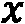
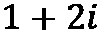
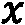
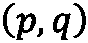
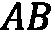
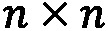
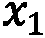
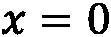
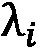
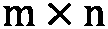

# 第一章：基本包、函数和概念简介

在开始任何实际的例程之前，我们将利用本章的开头部分介绍几个核心的数学概念和结构及其在 Python 中的表示。我们将讨论基本数值类型、基本数学函数（如三角函数、指数函数和对数函数）以及矩阵。矩阵在大多数计算应用中至关重要，因为矩阵与线性方程组的解之间有着密切的联系。我们将在本章中探索一些应用，但矩阵将在全书中扮演重要角色。

我们将按以下顺序讨论以下主要主题：

+   探索 Python 数值类型

+   理解基本数学函数

+   深入 NumPy 的世界

+   矩阵和线性代数的应用

本章中我们将看到的 NumPy 数组和基本数学函数将在本书的其余部分中反复使用——它们几乎出现在每个例程中。矩阵理论及本章讨论的其他主题为本书中讨论的包背后许多计算方法提供了基础。尽管我们不会在书中的例程中使用某些主题（例如，替代的数值类型），但它们仍然是需要了解的重要内容。

# 技术要求

在本章及全书中，我们将使用 Python 版本 `3.10`，这是写作时的最新版本。本书中的大部分代码将在 Python `3.6` 及更高版本上运行。我们将在不同的部分使用 Python 3.6 中引入的特性，包括 f-string。因此，你可能需要将终端命令中出现的 `python3.10` 改为你所使用的 Python 版本。这可能是 Python 的另一个版本，如 `python3.6` 或 `python3.7`，或者一个更通用的命令，如 `python3` 或 `python`。对于后者的命令，你需要通过以下命令检查 Python 的版本是否至少为 3.6：

```py
python --version
```

Python 具有内建的数值类型和基本数学函数，足以应对仅涉及小型计算的小型应用程序。NumPy 包提供了一个高性能的数组类型和相关的例程（包括在数组上高效运作的基本数学函数）。这个包将在本章以及本书剩余部分的许多例程中使用。我们还将在本章后面的例程中使用 SciPy 包。可以通过你喜欢的包管理工具（如 `pip`）来安装它们：

```py
python3.10 -m pip install numpy scipy
```

按照惯例，我们以更简短的别名导入这些包。我们将 `numpy` 导入为 `np`，将 `scipy` 导入为 `sp`，并使用以下 `import` 语句：

```py
import numpy as np
import scipy as sp
```

这些约定在官方文档中有所使用 ([`numpy.org/doc/stable/`](https://numpy.org/doc/stable/) 和 [`docs.scipy.org/doc/scipy/`](https://docs.scipy.org/doc/scipy/))，以及使用这些包的许多教程和其他材料中。

本章的代码可以在 GitHub 仓库的 `Chapter 01` 文件夹中找到，地址为 [`github.com/PacktPublishing/Applying-Math-with-Python-2nd-Edition/tree/main/Chapter%2001`](https://github.com/PacktPublishing/Applying-Math-with-Python-2nd-Edition/tree/main/Chapter%2001)。

# 探索 Python 数值类型

Python 提供了基本的数值类型，如任意大小的整数和浮点数（双精度），作为标准类型，但它还提供了几个额外的类型，这些类型在精度尤其重要的特定应用中非常有用。Python 还提供了对复数的（内置）支持，这对于一些更高级的数学应用非常有用。让我们从 `Decimal` 类型开始，了解一下这些不同的数值类型。

## Decimal 类型

对于需要精确算术运算的十进制数字的应用，可以使用 Python 标准库中 `decimal` 模块的 `Decimal` 类型：

```py
from decimal import Decimal
num1 = Decimal('1.1')
num2 = Decimal('1.563')
num1 + num2  # Decimal('2.663')
```

使用浮动对象执行此计算时，结果为 2.6630000000000003，这个结果包含了一个小误差，这是由于某些数字无法用有限的 2 的幂的和来精确表示。例如，0.1 的二进制展开式为 0.000110011...，该展开式不会终止。因此，任何该数字的浮点表示都会带有一个小误差。请注意，传递给 `Decimal` 的参数是以字符串形式而不是浮点数形式给出的。

`Decimal` 类型基于 IBM 的 *通用十进制算术规范* ([`speleotrove.com/decimal/decarith.html`](http://speleotrove.com/decimal/decarith.html))，它是浮点算术的另一种规范，通过使用 10 的幂而不是 2 的幂，精确表示十进制数。这意味着它可以安全地用于金融计算，在这些计算中，四舍五入误差的积累可能带来严重后果。然而，`Decimal` 格式的内存效率较低，因为它必须存储十进制数字，而不是二进制数字（位），这些数字比传统的浮点数在计算上更为昂贵。

`decimal` 包还提供了一个 `Context` 对象，它允许对 `Decimal` 对象的精度、显示和属性进行细粒度的控制。可以通过 `decimal` 模块的 `getcontext` 函数访问当前（默认）上下文。`getcontext` 返回的 `Context` 对象具有可以修改的多个属性。例如，我们可以为算术运算设置精度：

```py
from decimal import getcontext
ctx = getcontext()
num = Decimal('1.1')
num**4  # Decimal('1.4641')
ctx.prec = 4 # set new precision
num**4  # Decimal('1.464')
```

当我们将精度设置为 `4` 而不是默认的 `28` 时，可以看到 1.1 的四次方被四舍五入为四位有效数字。

通过使用`localcontext`函数，甚至可以在本地设置上下文，该函数返回一个上下文管理器，在`with`代码块结束时恢复原始环境：

```py
from decimal import localcontext
num = Decimal("1.1")
with localcontext() as ctx:
    ctx.prec = 2
    num**4  # Decimal('1.5')
num**4  # Decimal('1.4641')
```

这意味着上下文可以在`with`代码块内自由修改，并将在结束时返回默认状态。

## 分数类型

或者，在处理需要精确表示整数分数的应用时，例如在处理比例或概率时，可以使用 Python 标准库中的`fractions`模块中的`Fraction`类型。其用法类似，不同之处在于我们通常将分数的分子和分母作为参数传递：

```py
from fractions import Fraction
num1 = Fraction(1, 3)
num2 = Fraction(1, 7)
num1 * num2  # Fraction(1, 21)
```

`Fraction`类型仅存储两个整数——分子和分母——并通过基本的分数加法和乘法规则执行算术运算。

## 复数类型

平方根函数对于正数是有效的，但对于负数并未定义。然而，我们可以通过正式添加一个符号 i——**虚数单位**——来扩展实数集，其平方为（即！[](img/Formula_01_002.png)）。**复数**是形如的数，其中和是*实数*（即我们通常所用的数字）。在这种形式下，数称为**实部**，而则称为**虚部**。复数具有自己的算术运算（加法、减法、乘法、除法），当虚部为零时，这些运算与实数的算术运算一致。例如，我们可以将复数和相加得到，或者将它们相乘得到如下结果：


复数的出现频率可能比你想象的要高，它们通常出现在存在某种周期性或振荡性行为的场景中。这是因为和三角函数分别是复指数的实部和虚部：


这里，是任意实数。关于复数的更多细节以及更多有趣的事实和理论可以在许多关于复数的资源中找到。以下的*Wikipedia*页面是一个很好的起点：https://en.wikipedia.org/wiki/Complex_number。

Python 支持复数，包括在代码中表示复数单位的字面量字符`1j`。这可能与你从其他关于复数的来源中所熟悉的复数单位表示法有所不同。大多数数学文献通常使用符号来表示复数单位：

```py
z = 1 + 1j
z + 2  # 3 + 1j
z.conjugate()  # 1 - 1j
```

复数的**共轭复数**是将虚部取负的结果。这会产生方程的两个可能解之间的互换效果。

Python 标准库的`cmath`模块提供了特殊的*复数*数学函数。

现在我们已经了解了 Python 提供的一些基本数学类型，接下来可以开始探索它提供的一些数学函数。

# 理解基本的数学函数

基本的数学函数在许多应用中都有出现。例如，使用对数可以将指数增长的数据进行缩放，得到线性数据。指数函数和三角函数是处理几何信息时常见的工具，*伽马函数*在组合数学中出现，*高斯误差函数*在统计学中非常重要。

Python 标准库中的`math`模块提供了所有标准数学函数，以及常见的常数和一些工具函数，可以通过以下命令导入：

```py
import math
```

一旦导入，我们就可以使用该模块中的任何数学函数。例如，要找出一个非负数的平方根，可以使用`math`中的`sqrt`函数：

```py
import math
math.sqrt(4)  #  2.0
```

尝试使用`sqrt`函数并传入负数作为参数将引发值错误。负数的平方根对于这个`sqrt`函数是未定义的，因为它仅处理*实数*。负数的平方根——这将是一个复数——可以使用 Python 标准库中的`cmath`模块提供的替代`sqrt`函数来计算。

正弦、余弦和正切三角函数在`math`模块中分别以常见的缩写`sin`、`cos`和`tan`提供。常数`pi`表示π的值，约等于 3.1416：

```py
theta = math.pi/4
math.cos(theta)  # 0.7071067811865476
math.sin(theta)  # 0.7071067811865475
math.tan(theta)  # 0.9999999999999999
```

反三角函数在`math`模块中命名为`acos`、`asin`和`atan`：

```py
math.asin(-1)  # -1.5707963267948966
math.acos(-1)  # 3.141592653589793
math.atan(1)  # 0.7853981633974483
```

Python 标准库中的`math`模块提供了对数函数`log`。它有一个可选参数来指定对数的底（注意，第二个参数是位置参数）。默认情况下，如果没有指定可选参数，它将计算*自然对数*，底数为。可以使用`math.e`访问常数：

```py
math.log(10) # 2.302585092994046
math.log(10, 10) # 1.0
```

`math`模块还包含`gamma`函数（伽马函数）和`erf`函数（高斯误差函数），这两个函数在统计学中非常重要，且都是通过积分定义的。伽马函数由以下积分定义：


高斯误差函数由这个积分定义：


误差函数定义中的积分无法使用微积分计算，而必须通过数值方法来计算：

```py
math.gamma(5) # 24.0
math.erf(2) # 0.9953222650189527
```

除了标准函数，如三角函数、对数函数和指数函数外，`math`模块还包含各种理论和组合函数。这些包括`comb`和`factorial`函数，它们在多种应用中非常有用。调用`comb`函数，传入参数和，返回从个项目中选择个项目的方式数，而顺序不重要。如果顺序不重要，选 1 再选 2 与选 2 再选 1 是一样的。这个数字有时会写作。调用`factorial`函数，传入参数，返回该整数的阶乘：

```py
math.comb(5, 2)  # 10
math.factorial(5)  # 120
```

对负数应用阶乘运算会引发`ValueError`。一个整数的阶乘等于伽马函数在处的值；即：


`math`模块还包含一个函数，返回其参数的*最大公约数*，该函数名为`gcd`。与的最大公约数是最大的整数，使得可以整除和：

```py
math.gcd(2, 4)  # 2
math.gcd(2, 3)  # 1
```

还有一些用于处理浮点数的函数。`fsum`函数对一个可迭代的数字进行加法运算，并在每一步中跟踪和，从而减少结果中的误差。以下示例很好地展示了这一点：

```py
nums = [0.1]*10  # list containing 0.1 ten times
sum(nums)  # 0.9999999999999999
math.fsum(nums)  # 1.0
```

`isclose`函数返回`True`，如果两个参数的差小于容差。这在单元测试中特别有用，因为在不同的机器架构或数据波动下，结果可能会有微小的变化。

最后，`math`模块中的`floor`和`ceil`函数提供了其参数的下取整和上取整。一个数字的**下取整**是最大的整数，满足；而的**上取整**是最小的整数，满足。这些函数在将通过除法得到的浮点数转换为整数时非常有用。

`math` 模块包含用 C 实现的函数（假设你正在运行 CPython），因此比 Python 实现的函数要快得多。如果你需要对一个相对较小的数字集合应用某个函数，这个模块是一个不错的选择。如果你希望对大量数据同时应用这些函数，最好使用 NumPy 包中的等效函数，因为它在处理数组时更高效。一般来说，如果你已经导入了 NumPy 包，那么最好始终使用 NumPy 等效的函数，以减少出错的机会。考虑到这一点，现在让我们介绍 NumPy 包及其基本对象：多维数组。

# 深入了解 NumPy 的世界

NumPy 提供了高性能的数组类型和用于在 Python 中操作这些数组的函数。这些数组对于处理大型数据集（性能至关重要的场景）非常有用。NumPy 是 Python 数值计算和科学计算栈的基础。在底层，NumPy 利用诸如 **基础线性代数子程序**（**BLAS**）包等低级库来加速计算。

通常，NumPy 包会以更短的别名 `np` 被导入，可以通过以下 `import` 语句实现：

```py
import numpy as np
```

这个约定在 NumPy 文档中以及更广泛的科学 Python 生态系统（如 SciPy、pandas 等）中得到了应用。

NumPy 库提供的基本类型是 `ndarray` 类型（以下简称 NumPy 数组）。通常，你不会自己创建该类型的实例，而是会使用如 `array` 之类的辅助函数来正确地设置类型。`array` 函数从类似数组的对象创建 NumPy 数组，这个对象通常是一个数字列表或数字的列表列表。例如，我们可以通过提供包含所需元素的列表来创建一个简单的数组：

```py
arr = np.array([1, 2, 3, 4])  # array([1, 2, 3, 4])
```

NumPy 数组类型（`ndarray`）是一个 Python 包装器，围绕着一个底层的 C 数组结构。数组操作是用 C 实现的，并进行了性能优化。NumPy 数组必须包含同质数据（所有元素具有相同的类型），尽管该类型可以是指向任意 Python 对象的指针。如果在创建时没有显式提供类型，NumPy 会通过 `dtype` 关键字参数推断出一个合适的数据类型：

```py
np.array([1, 2, 3, 4], dtype=np.float32)
# array([1., 2., 3., 4.], dtype=float32)
```

NumPy 提供了许多 C 类型的类型说明符，可以传递到 `dtype` 参数中，例如之前使用的 `np.float32`。通常，这些类型说明符的格式为 `namexx`，其中 `name` 是类型的名称——例如 int、float 或 complex，而 `xx` 是位数——例如 8、16、32、64、128。通常情况下，NumPy 会很好地为给定的输入选择一个合适的类型，但有时你可能希望覆盖它。前述情况就是一个很好的例子——如果没有 `dtype=np.float32` 参数，NumPy 会假设类型为 `int64`。

在底层，任何形状的 NumPy 数组都是一个缓冲区，包含作为扁平（单维）数组的原始数据和一组附加的元数据，后者指定了诸如元素类型等详细信息。

创建后，可以使用数组的 `dtype` 属性访问数据类型。修改 `dtype` 属性会导致不良后果，因为构成数组中数据的原始字节将被重新解释为新的数据类型。例如，如果我们使用 Python 整数创建一个数组，NumPy 会将这些整数转换为数组中的 64 位整数。更改 `dtype` 值会导致 NumPy 重新解释这些 64 位整数为新的数据类型：

```py
arr = np.array([1, 2, 3, 4])
print(arr.dtype) # int64
arr.dtype = np.float32
print(arr)
# [1.e-45 0.e+00 3.e-45 0.e+00 4.e-45 0.e+00 6.e-45 0.e+00]
```

每个 64 位整数都被重新解释为两个 32 位的浮点数，这显然会导致无意义的值。相反，如果你希望在创建后更改数据类型，请使用 `astype` 方法来指定新类型。更改数据类型的正确方法如下所示：

```py
arr = arr.astype(np.float32)
print(arr)
# [1\. 2\. 3\. 4.]
```

NumPy 还提供了一些用于创建各种标准数组的例程。`zeros` 例程创建一个指定形状的数组，数组中的每个元素都是 `0`，而 `ones` 例程创建一个数组，数组中的每个元素都是 `1`。

## 元素访问

NumPy 数组支持 `getitem` 协议，因此可以像访问列表一样访问数组中的元素，并支持所有算术运算，这些运算是逐元素执行的。这意味着我们可以使用索引符号和索引来从指定索引中检索元素，如下所示：

```py
arr = np.array([1, 2, 3, 4])
arr[0]  # 1
arr[2]  # 3
```

这也包括用于从现有数组中提取数据的常规切片语法。数组的切片本身也是一个数组，包含切片指定的元素。例如，我们可以获取包含 `ary` 中前两个元素的数组，或包含偶数索引元素的数组，如下所示：

```py
first_two = arr[:2]  # array([1, 2])
even_idx = arr[::2]  # array([1, 3])
```

切片的语法是 `start:stop:step`。我们可以省略 `start` 或 `stop` 中的任意一个或两个，以分别从开头或结尾获取所有元素。我们还可以省略 `step` 参数，在这种情况下也不需要末尾的 `:`。`step` 参数描述了应选择的选定范围内的元素。值为 `1` 时选择每个元素，或者像示例中，值为 `2` 时选择每隔一个的元素（从 `0` 开始则为偶数索引的元素）。该语法与切片 Python 列表时相同。

## 数组算术和函数

NumPy 提供了许多**通用函数**（**ufuncs**），这些是能够高效操作 NumPy 数组类型的例程。特别是，*理解基本数学函数*部分中讨论的所有基本数学函数，在 NumPy 中都有对应的函数，可以作用于 NumPy 数组。通用函数还可以执行*广播*，使其能够在形状不同但兼容的数组上进行操作。

对 NumPy 数组进行的算术运算是按组件进行的。以下示例很好地说明了这一点：

```py
arr_a = np.array([1, 2, 3, 4])
arr_b = np.array([1, 0, -3, 1])
arr_a + arr_b  # array([2, 2, 0, 5])
arr_a - arr_b  # array([0, 2, 6, 3])
arr_a * arr_b  # array([ 1, 0, -9, 4])
arr_b / arr_a  # array([ 1\. , 0\. , -1\. , 0.25])
arr_b**arr_a  # array([1, 0, -27, 1])
```

请注意，数组必须具有相同的形状，这意味着它们具有相同的长度。对形状不同的数组进行算术运算将导致 `ValueError` 错误。与一个数字相加、相减、相乘或相除，将得到一个新的数组，其中运算将应用于每个组件。例如，我们可以使用以下命令将数组中的所有元素乘以 `2`：

```py
arr = np.array([1, 2, 3, 4])
new = 2*arr
print(new)
# [2, 4, 6, 8]
```

如我们所见，打印出来的数组包含数字 2、4、6 和 8，这些是原始数组的元素乘以 2 得到的结果。

在下一节中，我们将介绍除了这里使用的 `np.array` 函数外，您还可以用来创建 NumPy 数组的其他方法。

## 有用的数组创建函数

要生成两个给定端点之间以固定间隔排列的数字数组，可以使用 `arange` 或 `linspace` 这两个函数。它们的区别在于，`linspace` 生成两个端点之间等距的多个值（默认是 50 个值），包括两个端点，而 `arange` 按给定步长生成数字，直到但不包括上限。`linspace` 函数生成的是闭区间  的值，而 `arange` 函数生成的是半开区间  的值：

```py
np.linspace(0, 1, 5)  # array([0., 0.25, 0.5, 0.75, 1.0])
np.arange(0, 1, 0.3)  # array([0.0, 0.3, 0.6, 0.9])
```

请注意，使用 `linspace` 生成的数组恰好有五个点，这是通过第三个参数指定的，包括两个端点 `0` 和 `1`。而使用 `arange` 生成的数组有四个点，不包括右端点 `1`；如果增加一个步长为 `0.3`，会得到 `1.2`，这大于 `1`。

## 高维数组

NumPy 可以创建具有任意维度的数组，这些数组与创建简单的一维数组时使用的 `array` 函数相同。数组的维度数量由传递给 `array` 函数的嵌套列表的数量来指定。例如，我们可以通过提供一个列表的列表来创建二维数组，其中每个内部列表的成员都是一个数字，类似如下：

```py
mat = np.array([[1, 2], [3, 4]])
```

NumPy 数组有一个 `shape` 属性，用来描述数组在每个维度上的排列方式。对于二维数组，`shape` 可以解释为数组的行数和列数。

具有三维或更多维度的数组有时被称为 **张量**。（事实上，任何维度的数组都可以称为张量：向量（一维数组）是一个 1-张量；二维数组是一个 2-张量或矩阵——请参见下一节。）常见的 **机器学习** (**ML**) 框架，如 TensorFlow 和 PyTorch，都会实现自己的张量类，其行为通常与 NumPy 数组类似。

NumPy 将数组的形状存储为 `array` 对象上的 `shape` 属性，该属性是一个元组。该元组中的元素数量即为数组的维度数：

```py
vec = np.array([1, 2])
mat.shape  # (2, 2)
vec.shape  # (2,)
```

由于 NumPy 数组中的数据是存储在一个平坦的（一维的）数组中，因此通过简单地更改相关的元数据，可以以较低的成本重新塑造数组。这是通过在 NumPy 数组上使用 `reshape` 方法来完成的：

```py
mat.reshape(4,)  # array([1, 2, 3, 4])
```

请注意，元素的总数必须保持不变。`mat` 矩阵最初的形状是 `(2, 2)`，共有四个元素，后者是一个形状为 `(4,)` 的一维数组，也有四个元素。如果尝试在元素总数不匹配的情况下进行重塑，将导致 `ValueError`。

要创建更高维度的数组，只需添加更多层嵌套的列表。为了更清楚地说明这一点，在下面的示例中，我们在构建数组之前，先将第三维度中的每个元素的列表分开：

```py
mat1 = [[1, 2], [3, 4]]
mat2 = [[5, 6], [7, 8]]
mat3 = [[9, 10], [11, 12]]
arr_3d = np.array([mat1, mat2, mat3])
arr_3d.shape  # (3, 2, 2)
```

注意

形状的第一个元素是最外层元素，最后一个元素是最内层元素。

这意味着向数组添加一个维度只需提供相关的元数据。使用 `array` 函数时，`shape` 元数据是通过每个列表的长度来描述的。最外层列表的长度定义了该维度的 `shape` 参数，依此类推。

NumPy 数组在内存中的大小并不显著依赖于维度的数量，而仅仅取决于元素的总数，即 `shape` 参数的乘积。然而，请注意，在更高维数组中，元素的总数往往更大。

要访问多维数组中的一个元素，您可以使用常规的索引表示法，但不仅仅是提供一个数字，而是需要提供每个维度的索引。对于一个 2 × 2 的矩阵，这意味着要指定所需元素的行和列：

```py
mat[0, 0]  # 1 - top left element
mat[1, 1]  # 4 - bottom right element
```

索引表示法也支持每个维度的切片，因此我们可以通过使用 `mat[:, 0]` 切片来提取单个列的所有元素，如下所示：

```py
mat[:, 0]
# array([1, 3])
```

请注意，切片的结果是一个一维数组。

数组创建函数 `zeros` 和 `ones` 可以通过简单地指定多个维度参数来创建多维数组。

在接下来的部分中，我们将研究二维 NumPy 数组的特殊情况，它们在 Python 中作为矩阵使用。

# 处理矩阵和线性代数

NumPy 数组也作为*矩阵*，在数学和计算编程中具有基础性作用。**矩阵**仅仅是一个二维数组。矩阵在许多应用中都起着核心作用，例如几何变换和线性方程组，同时在统计学等其他领域也作为有用的工具出现。矩阵本身只有在我们赋予它们*矩阵运算*之后，才会与其他数组有所区别。矩阵具有逐元素加法和减法运算，和 NumPy 数组一样，还有一种称为*标量乘法*的第三种运算，即将矩阵中的每个元素与常数相乘，以及一种不同的*矩阵乘法*概念。矩阵乘法与其他乘法概念本质上是不同的，正如我们稍后将看到的。

矩阵的一个重要属性是它的形状，定义方式与 NumPy 数组相同。一个具有  行和  列的矩阵通常描述为  矩阵。如果矩阵的行数与列数相等，则称其为*方阵*，这些矩阵在向量和矩阵理论中扮演着特殊的角色。

**单位矩阵**（大小为 ）是一个  矩阵，其中第  个元素为 1，而对于所有的 ，其他元素为零。存在一种数组创建方法，可以为指定的  值生成一个  单位矩阵：

```py
np.eye(3)
# array([[1., 0., 0.], [0., 1., 0.], [0., 0., 1.]])
```

正如名称所示，单位矩阵是一个特殊的矩阵，具有以下性质：

## 基本方法和属性

矩阵与许多术语和量有关。我们在此只提到其中两个属性，因为它们在稍后的内容中会有用。这些属性是矩阵的*转置*，即行列互换，以及方阵的*迹*，它是沿着*主对角线*的元素之和。主对角线由矩阵从左上角到右下角的元素组成 。

可以通过调用 `transpose` 方法对 `array` 对象轻松地进行转置。事实上，由于这是一个非常常见的操作，数组还具有一个便捷属性 `T`，该属性返回矩阵的转置。转置操作会逆转矩阵（数组）形状的顺序，使得行变成列，列变成行。例如，如果我们从一个 3 × 2 的矩阵（3 行 2 列）开始，则它的转置将是一个 2 × 3 的矩阵，如以下示例所示：

```py
A = np.array([[1, 2], [3, 4]])
A.transpose()
# array([[1, 3],
#         [2, 4]])
A.T
# array([[1, 3],
#         [2, 4]])
```

注意

`transpose` 函数并不会实际修改底层数组中的数据，而是会改变形状并设置一个内部标志，指示存储值的顺序从按行连续（C 风格）转变为按列连续（F 风格）。这使得操作变得非常高效。

另一个偶尔有用的与矩阵相关的量是 *迹*。方阵  的迹，如前面的代码所示，是沿主对角线的元素之和，主对角线由从左上角到右下角的元素组成。迹的公式如下：


NumPy 数组有一个 `trace` 方法，它返回矩阵的迹：

```py
A = np.array([[1, 2], [3, 4]])
A.trace()  # 5
```

也可以使用 `np.trace` 函数来访问迹，该函数不绑定到数组。

## 矩阵乘法

矩阵乘法是对两个矩阵进行的操作，它保持了两个矩阵的一些结构和特征。形式上，假设给定两个矩阵 ，一个  矩阵和 ，一个  矩阵，如下所示：


矩阵积  的  和  是一个  矩阵，其  -th 元素由以下方程给出：


请注意，第一个矩阵的列数 **必须** 与第二个矩阵的行数相匹配，以便定义矩阵乘法。我们通常写  表示  和  的矩阵积，前提是它已定义。矩阵乘法是一个特殊的操作。它不像其他大多数算术运算那样是 *交换律* 的：即使  和  都可以计算，它们也不一定相等。实际上，这意味着矩阵的乘法顺序很重要。这源于矩阵代数作为线性映射表示的起源，其中乘法对应于函数的组合。

Python 为矩阵乘法保留了一个运算符 `@`，该运算符是在 Python 3.5 中新增的。NumPy 数组实现了该运算符来执行矩阵乘法。请注意，这与数组的按元素乘法 `*` 从根本上是不同的：

```py
A = np.array([[1, 2], [3, 4]])
B = np.array([[-1, 1], [0, 1]])
A @ B
# array([[-1, 3],
#           [-3, 7]])
A * B # different from A @ B
# array([[-1, 2],
#           [ 0, 4]])
```

单位矩阵是矩阵乘法下的 *单位元素*。也就是说，如果  是任何  矩阵，并且  是  单位矩阵，那么 ，同样地，如果  是一个  矩阵，则 。这可以通过使用 NumPy 数组检查具体的例子来验证：

```py
A = np.array([[1, 2], [3, 4]])
I = np.eye(2)
A @ I
# array([[1., 2.],
#           [3., 4.]])
```

你可以看到，打印出的结果矩阵等于原始矩阵。如果我们反转！[](img/Formula_01_083.png)和！[](img/Formula_01_084.png)的顺序并执行乘法！[](img/Formula_01_085.png)，结果也是一样的。在接下来的部分，我们将研究矩阵的逆；一个矩阵！[](img/Formula_01_086.png)，当它与！[](img/Formula_01_087.png)相乘时，得到单位矩阵。

## 行列式和逆

一个矩阵的*行列式*在大多数应用中非常重要，因为它与求矩阵的逆有密切的关系。当矩阵的行数和列数相等时，该矩阵被称为*方阵*。特别地，一个行列式非零的矩阵具有（唯一的）逆矩阵，这意味着某些方程组有唯一解。矩阵的行列式是递归定义的。假设我们有一个通用的！[](img/Formula_01_088.png)矩阵，如下所示：


这个通用矩阵！[](img/Formula_01_090.png)的*行列式*由以下公式定义：


对于一个一般的！[](img/Formula_01_092.png)矩阵，其中！[](img/Formula_01_093.png)，我们递归定义行列式。对于！[](img/Formula_01_094.png)，第！[](img/Formula_01_095.png)子矩阵！[](img/Formula_01_097.png)是通过删除！[](img/Formula_01_098.png)行和！[](img/Formula_01_099.png)列从！[](img/Formula_01_100.png)得到的。子矩阵！[](img/Formula_01_101.png)是一个！[](img/Formula_01_102.png)矩阵，因此我们可以计算它的行列式。然后，我们定义！[](img/Formula_01_103.png)的行列式为以下量：


事实上，前面方程中出现的索引 1 可以被任何！[](img/Formula_01_105.png)替换，结果将是相同的。

计算矩阵行列式的 NumPy 例程包含在一个名为`linalg`的单独模块中。这个模块包含许多常见的*线性代数*例程，线性代数是涵盖向量和矩阵代数的数学分支。计算方阵行列式的例程是`det`例程：

```py
from numpy import linalg
linalg.det(A)  # -2.0000000000000004
```

注意，在计算行列式时发生了浮点舍入误差。

如果安装了 SciPy 包，它还提供了一个`linalg`模块，扩展了 NumPy 的`linalg`。SciPy 版本不仅包括额外的例程，而且始终编译了 BLAS 和**线性代数包**（**LAPACK**）支持，而 NumPy 版本则是可选的。因此，根据 NumPy 的编译方式，如果对速度要求较高，SciPy 变体可能更为优选。

**逆矩阵**是一个  矩阵 ，它是（必定唯一的）  矩阵 ，使得 ，其中  表示  单位矩阵，并且这里执行的乘法是矩阵乘法。并非每个方阵都有逆矩阵；那些没有逆矩阵的矩阵有时被称为 **奇异** 矩阵。事实上，矩阵是非奇异的（即有逆矩阵的），当且仅当该矩阵的行列式不为 0。当  有逆矩阵时，通常表示为 。

`linalg` 模块中的 `inv` 函数计算一个矩阵的逆矩阵（如果存在的话）：

```py
linalg.inv(A)
# array([[-2\. , 1\. ],
#           [ 1.5, -0.5]])
```

我们可以通过矩阵乘法（在任一侧）与逆矩阵相乘，检查由 `inv` 函数给出的矩阵是否确实是 `A` 的逆矩阵，并确认得到的是 2 × 2 单位矩阵：

```py
Ainv = linalg.inv(A)
Ainv @ A
# Approximately
# array([[1., 0.],
#           [0., 1.]])
A @ Ainv
# Approximately
# array([[1., 0.],
#           [0., 1.]])
```

由于计算矩阵逆的方式，计算中会出现浮点误差，这些误差被隐藏在 `Approximately` 注释后面。

`linalg` 包还包含许多其他方法，如 `norm`，它计算矩阵的各种范数。它还包含用于以各种方式分解矩阵和求解方程组的函数。

还有一些矩阵的类似指数函数 `expm`、对数 `logm`、正弦 `sinm`、余弦 `cosm` 和正切 `tanm`。请注意，这些函数与基础 NumPy 包中的标准 `exp`、`log`、`sin`、`cos` 和 `tan` 函数不同，后者是按元素逐个应用对应的函数。相比之下，矩阵指数函数是通过矩阵的 *幂级数* 定义的：


这是为任何  矩阵  定义的，且  表示  第 *n* 次矩阵幂；即，矩阵  自乘  次。注意，这个“幂级数”总是以某种适当的方式收敛。根据惯例，我们取 ，其中  是  单位矩阵。这与通常用于实数或复数的指数函数幂级数定义完全相似，只不过用矩阵和矩阵乘法代替了数字和（常规）乘法。其他函数的定义也类似，但我们会跳过细节。

在下一节中，我们将看到一个可以利用矩阵及其理论来求解方程组的领域。

## 方程组

求解（线性）方程组是学习数学中矩阵的主要动机之一。此类问题在各种应用中频繁出现。我们从以下形式的线性方程组开始：


这里， 至少为 2， 和  是已知值， 值是我们希望找到的未知值。

在我们能解这样的方程组之前，我们需要将问题转化为一个矩阵方程。这是通过将系数  收集成一个  矩阵，并利用矩阵乘法的性质将此矩阵与方程组关联起来来实现的。因此，我们构建了以下矩阵，其中包含从方程中提取的系数：


然后，如果我们将  视为包含  值的未知（列）向量，且将  视为包含已知值  的（列）向量，那么我们可以将方程组重写为以下单一矩阵方程：


我们现在可以使用矩阵技术来解这个矩阵方程。在这种情况下，我们将列向量视为一个  矩阵，因此前面方程中的乘法是矩阵乘法。为了解这个矩阵方程，我们使用 `linalg` 模块中的 `solve` 函数。为了说明这个技术，我们将通过解决以下方程组作为示例：


这些方程有三个未知值：、 和 。首先，我们创建一个系数矩阵和向量 。由于我们使用 NumPy 来处理矩阵和向量，我们为矩阵  创建一个二维 NumPy 数组，并为  创建一个一维数组：

```py
import numpy as np
from numpy import linalg
A = np.array([[3, -2, 1], [1, 1, -2], [-3, -2, 1]])
b = np.array([7, -4, 1])
```

现在，方程组的解可以使用 `solve` 函数找到：

```py
linalg.solve(A, b)  # array([ 1., -1., 2.])
```

这确实是方程组的解，可以通过计算 `A @ x` 并将结果与 `b` 数组进行比较来轻松验证。计算中可能会有浮动点舍入误差。

函数`solve`期望两个输入，分别是系数矩阵  和右侧向量 。它通过分解矩阵  到更简单的矩阵，快速减少到可以通过简单替换解决的问题，来解决方程组。这种解决矩阵方程的技术非常强大和高效，并且不太容易受到困扰一些其他方法的浮点舍入误差。例如，通过乘以（左侧的）矩阵  的逆来计算方程组的解，如果逆矩阵已知的话。然而，这通常不如使用`solve`例程好，因为它可能会更慢或者导致更大的数值误差。

在我们使用的例子中，系数矩阵  是方阵。也就是说，方程的未知数与方程数量相同。在这种情况下，如果（且仅当）矩阵  的行列式不是  时，方程组有唯一解。在行列式  是  的情况下，可以出现两种情况：系统可能没有解，此时我们称系统为*不一致*；或者可能有无限多个解。通常一致和不一致系统的区别由向量  决定。例如，考虑以下方程组：


左侧方程组是一致的，并且有无限多个解；例如，取  和  或者  和  都是解。右侧方程组不一致，并且没有解。在这两个方程组中，由于系数矩阵是奇异的，`solve`例程将失败。

系数矩阵不需要是方阵才能解决系统——例如，如果方程数量多于未知数（系数矩阵的行数多于列数）。这样的系统被称为*过度规范*，只要是一致的，它就会有解。如果方程数量少于未知数，则系统称为*欠规范*。如果是一致的话，欠规范方程组通常有无限多个解，因为没有足够的信息来唯一确定所有未知数值。不幸的是，即使系统有解，`solve`例程也无法找到系数矩阵不是方阵的系统的解。

在下一节中，我们将讨论特征值和特征向量，它们通过观察一种非常特定的矩阵方程得出，类似于之前看到的方程。

## 特征值和特征向量

考虑矩阵方程 ，其中  是一个方阵（），  是一个向量，  是一个数值。对于能解此方程的数字 ，它们称为*特征值*，而对应的向量  称为*特征向量*。特征值和对应特征向量的对编码了关于矩阵  的信息，因此在许多涉及矩阵的应用中非常重要。

我们将通过以下矩阵演示如何计算特征值和特征向量：


我们必须首先将其定义为一个 NumPy 数组：

```py
import numpy as np
from numpy import linalg
A = np.array([[3, -1, 4], [-1, 0, -1], [4, -1, 2]])
```

`linalg` 模块中的 `eig` 函数用于找到方阵的特征值和特征向量。此函数返回一个元组 `(v, B)`，其中 `v` 是一个包含特征值的单维数组，`B` 是一个二维数组，其列是相应的特征向量：

```py
v, B = linalg.eig(A)
```

仅包含实数项的矩阵完全有可能具有复特征值和复特征向量。因此，`eig` 函数的返回类型有时会是 `complex32` 或 `complex64` 等复数类型。在某些应用中，复特征值具有特殊含义，而在其他情况下，我们只考虑实特征值。

我们可以使用以下顺序从 `eig` 的输出中提取特征值/特征向量对：

```py
i = 0 # first eigenvalue/eigenvector pair
lambda0 = v[i]
print(lambda0)
# 6.823156164525971
x0 = B[:, i] # ith column of B
print(x0)
# [ 0.73271846, -0.20260301, 0.649672352]
```

`eig` 函数返回的特征向量是*标准化*的，使得它们的范数（长度）为 1。（*欧几里得范数*定义为数组成员的平方和的平方根。）我们可以通过使用 `linalg` 中的 `norm` 函数计算向量的范数来验证这一点：

```py
linalg.norm(x0)  # 1.0  - eigenvectors are normalized.
```

最后，我们可以通过计算积 `A @ x0` 并检查它是否等于 `lambda0*x0`（精度到浮动点），来验证这些值确实满足特征值/特征向量对的定义：

```py
lhs = A @ x0
rhs = lambda0*x0
linalg.norm(lhs - rhs)  # 2.8435583831733384e-15 - very small.
```

这里计算的范数表示方程  的左边（`lhs`）和右边（`rhs`）之间的*距离*。由于这个距离非常小（精确到 14 位小数），我们可以相当确信它们实际上是相同的。这个距离不为零，可能是由于浮动点精度误差。

寻找特征值和特征向量的理论过程是首先通过求解以下方程来找到特征值 ：


这里， 是合适的单位矩阵。左边方程所确定的是一个关于  的多项式，称为  的**特征多项式**。对应于特征值  的特征向量可以通过求解以下矩阵方程来找到：


在实践中，这个过程有些低效，存在其他更高效的计算特征值和特征向量的策略。

我们只能对方阵计算特征值和特征向量；对于非方阵，定义是没有意义的。特征值和特征向量的一个推广应用是用于非方阵的称为**奇异值**。为了做到这一点，我们必须计算两个向量  和 ，以及一个奇异值 ，它满足以下方程：


如果  是一个  矩阵，那么  将有  个元素，且  将有  个元素。感兴趣的  向量实际上是对称矩阵  的（正交规范化）特征向量，对应的特征值是 。根据这些值，我们可以使用之前的定义方程找到  向量。这将生成所有有趣的组合，但还存在其他向量  和 ，其中  和 。

奇异值（和奇异向量）的实用性来自于**奇异值分解**（**SVD**），它将矩阵  写作一个乘积：


这里， 具有正交列， 具有正交行，且  是一个对角矩阵，通常写成沿主对角线的值递减。我们可以以稍微不同的方式写出这个公式，如下所示：


这意味着任何矩阵都可以分解为*外积*的加权和——假设  和  是具有  行和  列的矩阵，并且矩阵乘法  与  的转置相乘——这些是向量。

一旦完成了这种分解，我们可以寻找那些特别小的值，这些值对矩阵的值贡献很小。如果我们丢弃那些具有小值的项，那么就可以通过更简单的表示有效地逼近原始矩阵。这种技术被应用于**主成分分析**（**PCA**）——例如，将复杂的高维数据集简化为几个对数据整体特征贡献最大的成分。

在 Python 中，我们可以使用`linalg.svd`函数来计算矩阵的 SVD。它的工作方式类似于之前描述的`eig`例程，不同之处在于它返回分解的三个组件：

```py
mat = np.array([[0., 1., 2., 3.], [4., 5., 6., 7.]])
U, s, VT = np.linalg.svd(mat)
```

该函数返回的数组形状分别为`(2, 2)`、`(2,)`和`(4, 4)`。顾名思义，`U`矩阵和`VT`矩阵是出现在分解中的矩阵，`s`是一个包含非零奇异值的一维向量。我们可以通过重构矩阵并计算三个矩阵的乘积来检查分解是否正确：

```py
Sigma = np.zeros(mat.shape)
Sigma[:len(s), :len(s)] = np.diag(s)
# array([[11.73352876, 0., 0., 0.],
#        [0., 1.52456641, 0.,  0.]])
reconstructed = U @ Sigma @ VT
# array([[-1.87949788e-15, 1., 2., 3.],
#           [4., 5., 6., 7.]])
```

注意到矩阵几乎完全被重构，唯一的不同是第一个元素。左上角的值非常接近零——在浮动点误差范围内——因此可以视为零。

我们构造矩阵的方法相当不方便。SciPy 版本的`linalg`模块包含一个特殊例程，可以通过奇异值的一维数组重构这个矩阵，叫做`linalg.diagsvd`。这个例程接受奇异值数组`s`和原始矩阵的形状，并构建具有适当形状的矩阵：

```py
Sigma = sp.linalg.diagsvd(s, *mat.shape)
```

（回顾一下，SciPy 包是通过别名`sp`导入的。）现在，让我们换个节奏，看看如何更高效地描述大多数条目为零的矩阵。这些就是所谓的稀疏矩阵。

## 稀疏矩阵

之前讨论的线性方程组在数学中极为常见，尤其是在数学计算中。在许多应用中，系数矩阵通常非常大，包含成千上万的行列，并且很可能不是手动输入的，而是从其他来源获得的。在许多情况下，它还将是一个*稀疏*矩阵，其中大多数条目为 0。

如果一个矩阵的大多数元素为零，则该矩阵是**稀疏的**。确切的零元素数量，用于判断一个矩阵是否稀疏，并没有明确的定义。稀疏矩阵可以更有效地表示——例如，简单地存储非零元素的索引和值。对于稀疏矩阵，有一整套算法可以显著提升性能，前提是矩阵确实足够稀疏。

稀疏矩阵出现在许多应用中，通常遵循某种模式。特别是，有几种技术用于求解`sparse.csgraph`模块。我们将在*第五章*中进一步讨论这些内容，*与树* *和网络*的工作。

`sparse`模块包含几种不同的类，表示存储稀疏矩阵的不同方式。存储稀疏矩阵的最基本方式是存储三个数组，其中两个包含表示非零元素索引的整数，第三个数组包含相应元素的数据。这是`coo_matrix`类的格式。然后，还有`csc_matrix`和`csr_matrix`格式，分别提供高效的列或行切片操作。`sparse`模块中还有三个额外的稀疏矩阵类，其中包括`dia_matrix`，它高效地存储矩阵，其中非零元素出现在对角带上。

SciPy 中的`sparse`模块包含创建和处理稀疏矩阵的例程。我们使用以下`import`语句从 SciPy 导入`sparse`模块：

```py
import numpy as np
from scipy import sparse
```

稀疏矩阵可以从一个完整的（密集的）矩阵或其他类型的数据结构中创建。这是通过使用特定格式的构造函数来完成的，该格式指定了你希望存储稀疏矩阵的方式。

例如，我们可以通过使用以下命令，将一个密集矩阵存储为 CSR 格式：

```py
A = np.array([[1., 0., 0.], [0., 1., 0.], [0., 0., 1.]])
sp_A = sparse.csr_matrix(A)
print(sp_A)
#  (0, 0)  1.0
#  (1, 1)  1.0
#  (2, 2)  1.0
```

如果你手动生成稀疏矩阵，矩阵可能遵循某种模式，例如下面的*三对角*矩阵：


在这里，非零元素出现在对角线上以及对角线的两侧，并且每行中的非零元素遵循相同的模式。为了创建这样的矩阵，我们可以使用`sparse`中的一个数组创建例程，如`diags`，它是一个方便的例程，用于创建具有对角线模式的矩阵：

```py
T = sparse.diags([-1, 2, -1], (-1, 0, 1),   
    shape=(5, 5), format="csr")
```

这将创建一个矩阵 ，如前所述，并将其存储为 CSR 格式的稀疏矩阵。第一个参数指定应出现在输出矩阵中的值，第二个参数是相对于对角线位置的值应放置的位置。因此，元组中的 0 索引表示对角线条目，-1 表示位于行中对角线的左侧，+1 表示位于行中对角线的右侧。`shape` 关键字参数指定生成矩阵的维度，而 `format` 指定矩阵的存储格式。如果未使用可选参数提供格式，则将使用合理的默认格式。数组 `T` 可以使用 `toarray` 方法扩展为完整的（*密集*）矩阵：

```py
T.toarray()
# array([[ 2, -1,  0,  0,  0],
#           [-1,  2, -1,  0,  0],
#           [ 0, -1,  2, -1,  0],
#           [ 0,  0, -1,  2, -1],
#           [ 0,  0,  0, -1,  2]])
```

当矩阵较小时（如这里所示），稀疏求解算法与常规求解算法在性能上几乎没有差异。

一旦矩阵存储为稀疏格式，我们可以使用 `sparse` 模块中 `linalg` 子模块中的稀疏求解函数。例如，我们可以使用该模块中的 `spsolve` 函数来求解矩阵方程。`spsolve` 函数会将矩阵转换为 CSR 或 CSC 格式，如果它没有以这两种格式之一提供，可能会增加计算的时间：

```py
from scipy.sparse import linalg
linalg.spsolve(T.tocsr(), np.array([1, 2, 3, 4, 5]))
# array([ 5.83333333, 10.66666667, 13.5 , 13.33333333, 9.16666667])
```

`sparse.linalg` 模块还包含许多 NumPy（或 SciPy）中 `linalg` 模块的常见函数，这些函数接受稀疏矩阵而非完整的 NumPy 数组，如 `eig` 和 `inv`。

这就是我们对 Python 及其生态系统中可用的数学基本工具的简要介绍。让我们总结一下我们所看到的内容。

# 总结

Python 提供了内置的数学支持，包括一些基本的数值类型、算术运算、扩展精度数字、有理数、复数以及各种基本数学函数。然而，对于涉及大规模数值数组的更复杂计算，应该使用 NumPy 和 SciPy 包。NumPy 提供高性能的数组类型和基本操作，而 SciPy 提供了更专业的工具，用于求解方程和处理稀疏矩阵（还有许多其他功能）。

NumPy 数组可以是多维的。二维数组具有矩阵特性，可以通过 NumPy 或 SciPy 的 `linalg` 模块访问（前者是后者的一个子集）。此外，Python 中有一个特殊的矩阵乘法运算符 `@`，它已在 NumPy 数组中实现。SciPy 还通过 `sparse` 模块提供对稀疏矩阵的支持。我们还简要介绍了矩阵理论和线性代数，这些是本书中大多数数值方法的基础——通常是幕后工作。

在下一章中，我们将开始查看一些示例。

# 进一步阅读

有许多数学教材描述了矩阵和线性代数的基本性质，线性代数是研究向量和矩阵的学科。以下是适合线性代数入门的好书：

+   *Strang, G.* (2016). *线性代数导论*。*马萨诸塞州韦尔斯利：韦尔斯利-剑桥出版社，* *第五版*。

+   *Blyth, T.* 和 *Robertson, E.* (2013). *基础线性代数*。*伦敦：斯普林格* *伦敦有限公司*。

NumPy 和 SciPy 是 Python 数学和科学计算生态系统的一部分，并且有着丰富的文档，可以从官方网站 [`scipy.org`](https://scipy.org) 访问。在本书中，我们将看到该生态系统中的其他几个包。

关于 NumPy 和 SciPy 在后台使用的 BLAS 和 LAPACK 库的更多信息，可以通过以下链接找到：

+   BLAS: [`www.netlib.org/blas/`](https://www.netlib.org/blas/)

+   LAPACK: [`www.netlib.org/lapack/`](https://www.netlib.org/lapack/)
