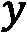
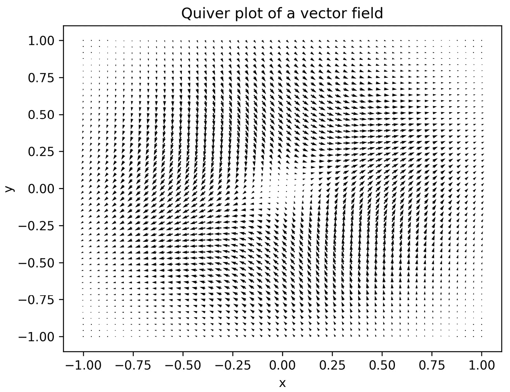

# 第二章：使用 Matplotlib 进行数学绘图

绘图是数学中一项基础工具。一张好的图表能够揭示隐藏的细节，提示未来的方向，验证结果，或增强论点。因此，科学 Python 堆栈中自然有一个功能强大且灵活的绘图库——Matplotlib。

在本章中，我们将使用多种样式绘制函数和数据，并创建完全标注和注释的图形。我们将创建三维图形，自定义图形的外观，使用子图创建包含多个绘图的图形，并将图形直接保存到文件中，适用于没有交互式环境的应用程序。

绘图是本书中最重要的内容之一。绘制数据、函数或解通常可以帮助你更好地理解问题，这对于推理方法非常有帮助。在本书的每一章中，我们都会看到绘图的应用。

在本章中，我们将涵盖以下内容：

+   使用 Matplotlib 进行基本绘图

+   添加子图

+   绘制带误差条的图形

+   保存 Matplotlib 图形

+   曲面图和等高线图

+   自定义三维图形

+   绘制带箭头的向量场

# 技术要求

Python 的主要绘图库是 Matplotlib，可以通过你喜欢的包管理工具（如 `pip`）进行安装：

```py
python3.10 -m pip install matplotlib
```

这将安装 Matplotlib 的最新版本，在编写本书时，版本为 3.5.2。

Matplotlib 包含了许多子包，但主要的 `matplotlib.pyplot` 包通常会被导入为 `plt` 别名。可以通过以下 `import` 语句实现：

```py
import matplotlib.pyplot as plt
```

本章中的许多教程也需要使用 NumPy，通常通过 `np` 别名进行导入。

本章的代码可以在 GitHub 仓库的 `Chapter 02` 文件夹中找到，地址为 [`github.com/PacktPublishing/Applying-Math-with-Python-2nd-Edition/tree/main/Chapter%2002`](https://github.com/PacktPublishing/Applying-Math-with-Python-2nd-Edition/tree/main/Chapter%2002)。

# 使用 Matplotlib 进行基本绘图

绘图是理解行为的一个重要部分。仅通过绘制一个函数或数据，可以学习到许多原本隐藏的信息。在本教程中，我们将演示如何使用 Matplotlib 绘制简单的函数或数据，设置绘图风格，并为绘图添加标签。

Matplotlib 是一个非常强大的绘图库，这意味着它在执行简单任务时可能会让人感到有些复杂。对于习惯使用 MATLAB 和其他数学软件的用户，Matplotlib 提供了一个基于状态的接口，称为 `pyplot`。`pyplot` 接口是创建基本对象的便捷方式。

## 准备工作

最常见的情况是，您希望绘制的数据将存储在两个独立的 NumPy 数组中，我们为了清晰起见将其标记为 `x` 和 `y`（尽管在实际操作中这个命名并不重要）。我们将演示如何绘制一个函数的图形，因此我们将生成一组 `x` 值，并使用该函数生成相应的 `y` 值。我们将绘制三个不同的函数，并在相同的坐标系上覆盖它们，范围为 ：

```py
def f(x):
  return x*(x - 2)*np.exp(3 – x)
def g(x):
  return x**2
def h(x):
  return 1 - x
```

让我们使用 Matplotlib 在 Python 中绘制这三种函数。

## 如何实现...

在绘制函数之前，我们必须先生成要绘制的 `x` 和 `y` 数据。如果你正在绘制现有数据，可以跳过这些命令。我们需要创建一组覆盖所需范围的 `x` 值，然后使用函数生成相应的 `y` 值：

1.  NumPy 中的 `linspace` 函数非常适合用于创建用于绘图的数值数组。默认情况下，它会在指定的参数之间创建 50 个等间距的点。可以通过提供额外的参数来自定义点的数量，但 50 个点对于大多数情况来说已经足够：

    ```py
    x = np.linspace(-0.5, 3.0)  # 50 values between -0.5 and 3.0
    ```

1.  一旦我们创建了 `x` 值，我们就可以生成 `y` 值：

    ```py
    y1 = f(x)  # evaluate f on the x points
    ```

    ```py
    y2 = g(x)  # evaluate g on the x points
    ```

    ```py
    y3 = h(x)  # evaluate h on the x points
    ```

1.  为了绘制数据，我们首先需要创建一个新图形并附加坐标轴对象，这可以通过调用没有任何参数的 `plt.subplots` 函数来实现：

    ```py
    fig, ax = plt.subplots()
    ```

现在，我们在 `ax` 对象上使用 `plot` 方法绘制第一个函数。前两个参数是  和  要绘制的坐标，第三个（可选）参数指定线条颜色为黑色：

```py
ax.plot(x, y1, "k")  # black solid line style
```

为了帮助区分其他函数的绘图，我们使用虚线和点划线绘制它们：

```py
ax.plot(x, y2, "k--")  # black dashed line style
ax.plot(x, y3, "k.-")  # black dot-dashed line style
```

每个绘图应该有一个标题和坐标轴标签。在这种情况下，没有什么特别的内容可以用来标注坐标轴，所以我们只是将它们标记为 `"x"` 和 `"y"`：

```py
ax.set_title("Plot of the functions f, g, and h")
ax.set_xlabel("x")
ax.set_ylabel("y")
```

让我们再加上一个图例，帮助你区分不同函数的图形，而不必到处寻找哪条线代表哪个函数：

```py
ax.legend(["f", "g", "h"])
```

最后，让我们在图形上加上注释，标出函数  和  的交点，并添加文字说明：

```py
ax.text(0.4, 2.0, "Intersection")
```

这将把 `y` 值与 `x` 值绘制在一个新的图形中。如果你在 IPython 或 Jupyter notebook 中工作，那么绘图应该会在这一点自动出现；否则，你可能需要调用 `plt.show` 函数才能让图形显示出来：

```py
plt.show()
```

如果使用 `plt.show`，图形应该会出现在一个新窗口中。我们在本章中将不会在进一步的示例中加入此命令，但你应该知道，如果你不在自动渲染图形的环境中工作（如 IPython 控制台或 Jupyter Notebook），你将需要使用此命令。生成的图形应该类似于 *图 2.1*：


图 2.1 – 在一组坐标轴上绘制三个不同风格的函数，并添加标签、图例和注释

注意

如果你正在使用 Jupyter Notebook 和 `subplots` 命令，必须将 `subplots` 的调用放在同一个单元格中，否则图形将无法生成。

## 它是如何工作的…

在这里，我们使用 OOI（对象导向接口），因为它允许我们准确跟踪当前正在绘制的图形和坐标轴对象。在这里我们只有一个 `figure` 和一个 `axes`，这一点并不那么重要，但你可以很容易地设想出在同时有两个或多个图形和坐标轴的情况下，使用 OOI 的好处。遵循这个模式的另一个原因是当你添加多个子图时保持一致性——参见*添加子图*配方。

你可以通过以下一系列命令，在基于状态的接口中生成与配方中相同的图：

```py
plt.plot(x, y1, "k", x, y2, "k--", x, y3, "k.-")
plt.title("Plot of the functions f, g, and h")
plt.xlabel("x")
plt.ylabel("y")
plt.legend(["f", "g", "h"])
plt.text(0.4, 2.0, "Intersection")
```

如果当前没有 `Figure` 或 `Axes` 对象，`plt.plot` 例程将创建一个新的 `Figure` 对象，向该图形添加一个新的 `Axes` 对象，并用绘制的数据填充这个 `Axes` 对象。此函数将返回一个包含已绘制线条的句柄列表。这些句柄是 `Lines2D` 对象。在这种情况下，列表将包含一个 `Lines2D` 对象。我们可以使用这个 `Lines2D` 对象来进一步自定义线条的外观。

请注意，在上面的代码中，我们将所有 `plot` 例程的调用都结合在一起。如果你使用 OOI，这也是可能的；基于状态的接口将参数传递给它检索或创建的坐标轴方法。

Matplotlib 的对象层与一个较低级别的*后端*交互，后端负责执行绘制图形的繁重任务。`plt.show`函数向后端发出指令，要求其渲染当前的图形。Matplotlib 可以使用多种后端，可以通过设置 `MPLBACKEND` 环境变量、修改 `matplotlibrc` 文件，或者通过在 Python 中调用 `matplotlib.use` 并指定替代后端的名称来进行自定义。默认情况下，Matplotlib 会根据可用的后端和平台（Windows、macOS、Linux）以及用途（交互式或非交互式）选择一个合适的后端。例如，在作者的系统中，默认后端是 `QtAgg`，这是一个基于 `QtCairo` 后端的交互式后端，后者使用 Cairo 库进行渲染。

注意

`plt.show` 函数不仅仅是调用图形上的 `show` 方法。它还连接到事件循环，以正确显示图形。应该使用 `plt.show` 例程来显示图形，而不是直接调用 `Figure` 对象上的 `show` 方法。

用于快速指定线条样式的**格式字符串**有三个可选部分，每个部分由一个或多个字符组成。第一部分控制标记样式，即在每个数据点上打印的符号；第二部分控制连接数据点的线条样式；第三部分控制图形的颜色。在本示例中，我们只指定了线条样式。然而，也可以同时指定线条样式和标记样式，或者只指定标记样式。如果只提供标记样式，则不会在点之间绘制连接线。这对于绘制离散数据非常有用，因为不需要在点之间进行插值。

提供了四种线条样式参数：实线（`-`）、虚线（`--`）、点划线（`-.`）和点线（`:`）。格式字符串中只能指定有限的颜色；它们分别是红色、绿色、蓝色、青色、黄色、品红色、黑色和白色。格式字符串中使用的字符是每种颜色的首字母（黑色除外），因此相应的字符是`r`、`g`、`b`、`c`、`y`、`m`、`k`和`w`。

在这个示例中，我们看到了三个格式字符串的例子：单一的`k`格式字符串只改变了线条的颜色，其他设置保持默认（小点标记和未断开的蓝线）；`k--`和`k.-`格式字符串都改变了颜色和线条样式。关于更改点样式的示例，请参见*更多内容...*部分和*图 2.2*：


图 2.2 - 绘制三组数据，每组数据使用不同的标记样式

`set_title`、`set_xlabel`和`set_ylabel`方法仅仅是将文本参数添加到`Axes`对象的相应位置。`legend`方法，如前述代码所示，将标签按添加顺序添加到数据集——在这个例子中是`y1`、`y2`，然后是`y3`。

可以向`set_title`、`set_xlabel`和`set_ylabel`函数提供多个关键字参数，以控制文本的样式。例如，`fontsize`关键字可以用来指定标签字体的大小，通常以`pt`为单位。

`annotate`方法在`Axes`对象上将任意文本添加到图形中的指定位置。该函数接受两个参数——要显示的文本字符串和注释应放置的点的坐标。此函数还接受可以自定义注释样式的关键字参数。

## 更多内容...

`plt.plot`例程接受可变数量的位置输入。在前面的代码中，我们提供了两个位置参数，分别被解释为`x`值和`y`值（顺序如此）。如果我们只提供了一个数组，`plot`例程会将值绘制在数组中的位置；也就是说，`x`值被视为`0`、`1`、`2`等。

`plot`方法还接受许多关键字参数，这些参数也可以用于控制绘图的样式。如果同时存在关键字参数和格式字符串参数，则关键字参数优先。这些关键字参数适用于调用时绘制的所有数据集。控制标记样式的关键字是`marker`，控制线条样式的关键字是`linestyle`，颜色的关键字是`color`。`color`关键字参数接受许多不同的格式来指定颜色，包括 RGB 值作为`(r, g, b)`元组，其中每个字符是介于`0`和`1`之间的浮点数，或者是十六进制字符串。可以使用`linewidth`关键字来控制绘制的线条宽度，该关键字应提供一个`float`值。许多其他关键字参数可以传递给`plot`；在 Matplotlib 文档中列出了一个列表。许多这些关键字参数都有一个更短的版本，例如`c`代表`color`，`lw`代表`linewidth`。

在这个示例中，我们绘制了通过在一些值上评估函数生成的大量坐标。在其他应用中，可能会有来自真实世界的数据（而不是生成的）。在这些情况下，最好不要连接线条，而只是在点上绘制标记。以下是如何实现的示例：

```py
y1 = np.array([1.0, 2.0, 3.0, 4.0, 5.0])
y2 = np.array([1.2, 1.6, 3.1, 4.2, 4.8])
y3 = np.array([3.2, 1.1, 2.0, 4.9, 2.5])
fig, ax = plt.subplots()
ax.plot(y1, 'o', y2, 'x', y3, '*', color="k")
```

这些命令的结果显示在*图 2**.2*中。Matplotlib 有一个专门用于生成散点图的方法，称为`scatter`。

可以通过在`Axes`对象上使用方法来自定义绘图的其他方面。可以使用`Axes`对象上的`set_xticks`和`set_yticks`方法修改轴刻度，使用`grid`方法配置网格外观。在`pyplot`接口中还有方便的方法，将这些修改应用于当前轴（如果存在）。

例如，我们修改轴限制，在`0.5`的倍数处设置刻度，同时在和方向上添加网格到图中，使用以下命令：

```py
ax.axis([-0.5, 5.5, 0, 5.5]) # set axes
ax.set_xticks([0.5*i for i in range(9)])  # set xticks
ax.set_yticks([0.5*i for i in range(11)]) # set yticks
ax.grid()  # add a grid
```

注意我们将限制设置得比图的范围稍大。这是为了避免标记放在图窗口的边界上。

除了这里描述的`plot`函数，Matplotlib 还有许多其他绘图函数。例如，有一些绘图方法使用不同的坐标轴尺度，包括对数坐标轴或，分别是`semilogx`或`semilogy`，或者将它们一起使用（`loglog`）。这些内容在 Matplotlib 文档中有详细说明。如果你希望绘制离散数据，而不通过连线连接这些点，`scatter`绘图函数可能会很有用。它允许你对标记样式进行更多控制，例如，你可以根据某些附加信息来调整标记的大小。

我们可以通过使用`fontfamily`关键字来使用不同的字体，其值可以是字体名称，或者是`serif`、`sans-serif`或`monospace`，这些将选择适当的内置字体。完整的修改器列表可以在 Matplotlib 的`matplotlib.text.Text`类文档中找到。

通过向函数提供`usetex=True`，文本参数还可以使用 TeX 进行额外的格式化。我们将在下面的示例中演示如何在*图 2.3*中使用 TeX 格式化标签。如果标题或坐标轴标签包含数学公式，这尤其有用。不幸的是，如果系统上没有安装 TeX，`usetex`关键字参数无法使用——这会导致错误。然而，仍然可以使用 TeX 语法在标签中格式化数学文本，但这将由 Matplotlib 进行排版，而不是由 TeX 排版。

# 添加子图

有时候，将多个相关的图表放置在同一图形中并排显示，但不在同一坐标轴上是很有用的。子图可以让我们在一个图形中生成一个由多个独立图表组成的网格。在这个实例中，我们将看到如何使用子图在单个图形中并排显示两个图表。

## 准备工作

你需要为每个子图准备要绘制的数据。作为示例，我们将在第一个子图中绘制应用于函数的牛顿法的前五次迭代，初始值为，而在第二个子图中，我们将绘制迭代的误差。我们首先定义一个生成器函数来获取这些迭代：

```py
def generate_newton_iters(x0, number):
  iterates = [x0]
  errors = [abs(x0 - 1.)]
  for _ in range(number):
       x0 = x0 - (x0*x0 - 1.)/(2*x0)
       iterates.append(x0)
       errors.append(abs(x0 - 1.))
    return iterates, errors
```

这个函数生成两个列表。第一个列表包含应用于该函数的牛顿法的迭代，第二个列表包含近似值的误差：

```py
iterates, errors = generate_newton_iters(2.0, 5)
```

## 如何操作...

以下步骤展示了如何创建包含多个子图的图形：

1.  我们使用`subplots`函数来创建一个新的图形，并获取每个子图中`Axes`对象的引用，这些对象按一行两列的网格排列。我们还将`tight_layout`关键字参数设置为`True`，以修正结果图表的布局。这在严格意义上并不是必须的，但在这种情况下，它能比默认设置产生更好的效果：

    ```py
    fig, (ax1, ax2) = plt.subplots(1, 2, 
    ```

    ```py
    tight_layout=True) 
    ```

    ```py
    #1 row, 2 columns
    ```

1.  一旦创建了 `Figure` 和 `Axes` 对象，我们就可以通过在每个 `Axes` 对象上调用相关的绘图方法来填充图形。对于第一个图（显示在左侧），我们在 `ax1` 对象上使用 `plot` 方法，其签名与标准的 `plt.plot` 函数相同。然后，我们可以在 `ax1` 上调用 `set_title`、`set_xlabel` 和 `set_ylabel` 方法来设置标题以及 `x` 和 `y` 标签。我们还通过提供 `usetex` 关键字参数使用 TeX 格式化轴标签；如果系统没有安装 TeX，可以忽略此部分。

    ```py
    ax1.plot(iterates, "kx")
    ```

    ```py
    ax1.set_title("Iterates")
    ```

    ```py
    ax1.set_xlabel("$i$", usetex=True)
    ```

    ```py
    ax1.set_ylabel("$x_i$", usetex=True)
    ```

1.  现在，我们可以使用 `ax2` 对象在第二个图（显示在右侧）上绘制误差值。我们使用一种替代的绘图方法，该方法在  轴上使用对数刻度，称为 `semilogy`。该方法的签名与标准的 `plot` 方法相同。再次，我们设置轴标签和标题。如果你的系统没有安装 TeX，也可以省略使用 `usetex`：

    ```py
    ax2.semilogy(errors, "kx") # plot y on logarithmic scale
    ```

    ```py
    ax2.set_title("Error")
    ```

    ```py
    ax2.set_xlabel("$i$", usetex=True)
    ```

    ```py
    ax2.set_ylabel("Error")
    ```

这组命令的结果如图所示：


图 2.3 - 在同一个 Matplotlib 图形上显示多个子图

左侧绘制了牛顿法的前五次迭代，右侧是以对数刻度绘制的近似误差。

## 工作原理...

在 Matplotlib 中，`Figure` 对象只是一个容器，用于存放诸如 `Axes` 等绘图元素，并具有一定的大小。`Figure` 对象通常只会包含一个 `Axes` 对象，该对象占据整个图形区域，但它也可以在同一区域内包含任意数量的 `Axes` 对象。`subplots` 函数做了几件事。它首先创建一个新的图形，然后在图形区域内创建一个指定形状的网格。接着，一个新的 `Axes` 对象会被添加到网格的每个位置。最后，新的 `Figure` 对象和一个或多个 `Axes` 对象会返回给用户。如果只请求一个子图（没有参数，即一行一列），则返回一个普通的 `Axes` 对象。如果请求一个单行或单列（分别有多个列或行），则返回一个 `Axes` 对象的列表。如果请求多个行和列，则返回一个列表的列表，其中行由内部列表表示，内部列表填充有 `Axes` 对象。然后，我们可以在每个 `Axes` 对象上使用绘图方法，以在图形中填充所需的图表。

在这个示例中，我们在左侧图中使用了标准的`plot`方法，就像我们在之前的示例中看到的那样。然而，在右侧图中，我们使用了一个将轴更改为对数刻度的绘图。这意味着轴上的每个单位代表一个数量级的变化，而不是一个单位的变化，因此`0`代表，`1`代表 10，`2`代表 100，依此类推。轴标签会自动更改以反映这种比例变化。当值按数量级变化时，例如在逼近中的误差随着迭代次数的增加而变化时，这种缩放方式非常有用。我们还可以通过使用`semilogx`方法仅对使用对数刻度绘图，或者通过使用`loglog`方法使两个轴都使用对数刻度绘图。

## 还有更多...

在 Matplotlib 中创建子图有几种方法。如果您已经创建了一个`Figure`对象，则可以使用`Figure`对象的`add_subplot`方法添加子图。或者，您可以使用`matplotlib.pyplot`中的`subplot`例程将子图添加到当前图中。如果尚不存在，则在调用此例程时将创建一个。`subplot`例程是`Figure`对象上`add_subplot`方法的便利包装器。

在前面的示例中，我们创建了两个具有不同比例的轴的图。这展示了子图的许多可能用途之一。另一个常见用途是在矩阵中绘制数据，其中列具有共同的`x`标签，行具有共同的`y`标签，这在多元统计中特别常见，用于研究各组数据之间的相关性。用于创建子图的`plt.subplots`例程接受`sharex`和`sharey`关键参数，允许轴在所有子图之间或在行或列之间共享。此设置会影响轴的比例和刻度。

## 另请参阅

Matplotlib 通过为`subplots`例程提供`gridspec_kw`关键字参数来支持更高级的布局。有关更多信息，请参阅`matplotlib.gridspec`的文档。

# 使用误差条绘图

从现实世界中收集的数据通常会带有一些不确定性；没有任何现实世界的量度是完全准确的。例如，如果我们使用卷尺测量距离，那么我们可以假设我们的结果在一定范围内是准确的，但超过这个范围后，我们就无法确保测量结果的有效性。在这种情况下，我们可能对精度有信心的范围大约是 1 毫米或稍小于 1/16 英寸。（当然，这是假设我们在完美的条件下进行测量。）这些值通常是典型卷尺上最小的分度线。假设我们收集了这样一组 10 个测量值（单位为厘米），并且我们希望将这些值与我们有信心的精度一起绘制出来。（误差范围是指实际测量值上下偏离的范围，通常称为 *误差*。）我们将在本节中处理这一问题。

## 准备工作

像往常一样，我们导入了 Matplotlib 的 `pyplot` 接口，别名为 `plt`。首先，我们需要在 NumPy 数组中生成我们的假设数据和假定的精度：

```py
measurement_id = np.arange(1, 11)
measurements = np.array([2.3, 1.9, 4.4, 1.5, 3.0, 3.3, 2.9,    2.6, 4.1, 3.6]) # cm
err = np.array([0.1]*10)  # 1mm
```

让我们看看如何使用 Matplotlib 中的绘图函数，将这些带有误差条的测量值绘制出来，以表示每个测量值的不确定性。

## 如何操作…

以下步骤展示了如何在图形上绘制带有精度信息的测量值。

首先，我们需要像往常一样生成一个新的 `figure` 和 `axis` 对象：

```py
fig, ax = plt.subplots()
```

接下来，我们使用 `errorbar` 方法在轴对象上绘制数据，并附上误差条。精度信息（即误差）通过 `yerr` 参数传递：

```py
ax.errorbar(measurement_id,
    measurements, yerr=err, fmt="kx", 
     capsize=2.0)
```

像往常一样，我们应该始终为坐标轴添加有意义的标签，并为图形添加标题：

```py
ax.set_title("Plot of measurements and their estimated error")
ax.set_xlabel("Measurement ID")
ax.set_ylabel("Measurement(cm)")
```

由于 Matplotlib 默认不会在每个值处绘制 `xlabel` 刻度，因此我们将 x 刻度值设置为测量 ID，以确保它们都能显示在图形上：

```py
ax.set_xticks(measurement_id)
```

结果图形显示在 *图 2.4* 中。记录值显示在 `x` 标记处，误差条则在该值的上下延伸，精度为 0.1 厘米（即 1 毫米）：


图 2.4 - 显示 10 个样本测量值（单位为厘米）及其测量误差的图形

我们可以看到，每个标记都有一个垂直条，表示我们期望真实测量值(-值)所在的范围。

## 它是如何工作的…

`errorbar`方法的工作方式与其他绘图方法相似。前两个参数是要绘制的点的和坐标。（请注意，两个坐标都必须提供，而其他绘图方法则不要求这样。）`yerr`参数表示要添加到图中的误差条的大小，并且所有的值应该是正值。传递给此参数的值的形式决定了误差条的性质。在该示例中，我们提供了一个包含 10 个条目的平坦 NumPy 数组——每个条目对应一个测量值——这导致每个点上方和下方都有大小相同的误差条（即来自该参数的相应值）。另外，我们还可以指定一个 2×10 的数组，其中第一行包含下误差，第二行包含上误差。（由于我们的误差值相同，我们也可以提供一个包含所有测量共同误差的浮动值。）

除了数据参数，还有通常的格式化参数，包括`fmt`格式化字符串。（我们在这里使用了它作为关键字参数，因为我们命名了之前的`yerr`参数。）除了其他绘图方法中的线条和点的格式化外，还有一些特殊参数可以用来定制误差条的外观。在该示例中，我们使用了`capsize`参数为误差条的两端添加“帽子”，以便我们可以轻松地识别这些条的端点；默认的样式是简单的线条。

## 还有更多...

在该示例中，我们只在轴上绘制了误差，因为值仅仅是 ID 值。如果两个值集都有不确定性，你也可以使用`xerr`参数来指定误差值。该参数的功能与之前使用的`yerr`参数相同。

如果你正在绘制大量符合某种趋势的数据点，可能希望更有选择性地绘制误差条。为此，你可以使用`errorevery`关键字参数，指示 Matplotlib 每隔第`n`个数据点添加误差条，而不是对所有数据点都添加误差条。这可以是一个正整数——表示选择有误差的数据点的“步长”——或者一个包含从第一个值起的偏移量和步长的元组。例如，`errorevery=(2, 5)`会在每五个数据点处添加误差条，且从第二个数据点开始。

你也可以用相同的方式在条形图中添加误差条（除了这里，`xerr`和`yerr`参数只是关键字）。我们可以用以下命令将示例中的数据绘制成条形图：

```py
ax.bar(measurement_id, measurements, 
yerr=err, capsize=2.0, alpha=0.4)
```

如果在示例中使用这行代码代替调用`errorbar`，则我们将得到一个条形图，如*图 2**.5*所示：


图 2.5 - 带有误差条的测量值条形图

如之前所述，测量条的顶部有一个指示器，表示我们期望真实测量值所在的范围 。

# 保存 Matplotlib 图形

当你在交互式环境中工作时，例如 IPython 控制台或 Jupyter 笔记本，运行时显示图形是完全正常的。然而，有很多情况下直接将图形保存到文件中比在屏幕上渲染它更为合适。在这个教程中，我们将学习如何直接将图形保存到文件，而不是在屏幕上显示它。

## 准备工作

你需要有待绘制的数据和希望存储输出的路径或文件对象。我们将结果保存在当前目录下的 `savingfigs.png` 文件中。在这个示例中，我们将绘制以下数据：

```py
x = np.arange(1, 5, 0.1)
y = x*x
```

让我们看看如何使用 Matplotlib 绘制这条曲线，并将生成的图形保存到文件中（无需与图形界面交互）。

## 如何操作...

以下步骤展示了如何将 Matplotlib 图形直接保存到文件：

1.  第一步是像往常一样创建一个图形，并添加任何必要的标签、标题和注释。图形将以当前状态写入文件，因此任何更改应在保存之前进行：

    ```py
    fig, ax = plt.subplots()
    ```

    ```py
    ax.plot(x, y)
    ```

    ```py
    ax.set_title("Graph of $y = x²$", usetex=True)
    ```

    ```py
    ax.set_xlabel("$x$", usetex=True)
    ```

    ```py
    ax.set_ylabel("$y$", usetex=True)
    ```

1.  然后，我们使用 `savefig` 方法将 `fig` 保存到文件中。唯一需要的参数是输出路径或一个文件类对象，图形可以写入该对象。我们可以通过提供适当的关键字参数来调整输出格式的各种设置，例如分辨率。我们将设置 `300`，这是大多数应用程序的合理分辨率：

    ```py
    fig.savefig("savingfigs.png", dpi=300)
    ```

Matplotlib 将推断我们希望以 `format` 关键字指定的格式保存图像，或者如果未指定，它将回退到配置文件中的默认格式。

## 它是如何工作的...

`savefig` 方法选择适当的后端输出格式，然后以该格式渲染当前图形。生成的图像数据会写入指定的路径或类文件对象。如果你手动创建了一个 `Figure` 实例，也可以通过在该实例上调用 `savefig` 方法来实现相同的效果。

## 还有更多...

`savefig` 例程接受许多额外的可选关键字参数，以自定义输出图像。例如，可以使用 `dpi` 关键字指定图像的分辨率。本章中的图形是通过将 Matplotlib 图形保存到文件中生成的。

可用的输出格式包括 PNG、`quality` 和 `optimize`。可以通过 `metadata` 关键字传递一个图像元数据字典，该字典将在保存时作为图像元数据写入。

## 另见

Matplotlib 网站上的示例画廊包括了如何使用几种常见的 Python GUI 框架将 Matplotlib 图形嵌入到 GUI 应用程序中的示例。

# 表面图和轮廓图

Matplotlib 还可以以多种方式绘制三维数据。显示这类数据的两种常见选择是使用 **表面图** 或 **等高线图**（可以类比为地图上的等高线）。在本食谱中，我们将看到一种从三维数据绘制表面图的方法，以及如何绘制三维数据的等高线。

## 准备工作

为了绘制三维数据，它需要被整理成二维数组，分别对应 、 和  组件，其中  和  组件必须与  组件形状相同。为了演示，我们将绘制以下函数对应的表面：


对于三维数据，我们不能仅仅使用 `pyplot` 接口中的例程。我们需要从 Matplotlib 的其他部分导入一些额外的功能。接下来我们将展示如何操作。

## 如何操作...

我们希望在  和  范围内绘制函数 。第一步是创建一个适合的  对网格，用于评估该函数：

1.  我们首先使用 `np.linspace` 在这些范围内生成一个合理数量的点：

    ```py
    X = np.linspace(-5, 5)
    ```

    ```py
    Y = np.linspace(-5, 5)
    ```

1.  现在，我们需要创建一个网格，用于生成我们的  值。为此，我们使用 `np.meshgrid` 例程：

    ```py
    grid_x, grid_y = np.meshgrid(X, Y)
    ```

1.  现在，我们可以创建  值来绘制，这些值表示函数在每个网格点的值：

    ```py
    z = np.exp(-((grid_x-2.)**2 + (
    ```

    ```py
        grid_y-3.)**2)/4) -  np.exp(-(
    ```

    ```py
        (grid_x+3.)**2 + (grid_y+2.)**2)/3)
    ```

1.  要绘制三维表面图，我们需要加载一个 Matplotlib 工具箱，`mplot3d`，它随 Matplotlib 包一起提供。虽然在代码中不会显式使用它，但在幕后，它使得三维绘图工具能够在 Matplotlib 中使用：

    ```py
    from mpl_toolkits import mplot3d
    ```

1.  接下来，我们为图形创建一个新的图形和一组三维坐标轴：

    ```py
    fig = plt.figure()
    ```

    ```py
    # declare 3d plot
    ```

    ```py
    ax = fig.add_subplot(projection="3d")
    ```

1.  现在，我们可以在这些坐标轴上调用 `plot_surface` 方法来绘制数据（我们将颜色图设置为灰色，以便在打印时更清晰；有关更详细的讨论，请参见下一个食谱）：

    ```py
    ax.plot_surface(grid_x, grid_y, z, cmap="gray")
    ```

1.  为三维图添加坐标轴标签非常重要，因为在显示的图表中可能不清楚每个坐标轴代表的是哪个。此时我们还设置了标题：

    ```py
    ax.set_xlabel("x")
    ```

    ```py
    ax.set_ylabel("y")
    ```

    ```py
    ax.set_zlabel("z")
    ```

    ```py
    ax.set_title("Graph of the function f(x, y)")
    ```

你可以使用 `plt.show` 例程在新窗口中显示图形（如果你在 Python 中交互式使用，而不是在 Jupyter notebook 或 IPython 控制台中），或者使用 `plt.savefig` 将图形保存到文件。前面的代码序列结果如下所示：


图 2.6 - 使用 Matplotlib 绘制的三维表面图

1.  等高线图不需要 `mplot3d` 工具包，`pyplot` 接口中有一个 `contour` 函数可以生成等高线图。然而，与通常的（二维）绘图函数不同，`contour` 函数需要与 `plot_surface` 方法相同的参数。我们使用以下步骤来生成图表：

    ```py
    fig = plt.figure()  # Force a new figure
    ```

    ```py
    plt.contour(grid_x, grid_y, z, cmap="gray")
    ```

    ```py
    plt.title("Contours of f(x, y)")
    ```

    ```py
    plt.xlabel("x")
    ```

    ```py
    plt.ylabel("y")
    ```

结果显示在下面的图表中：


图 2.7 - 使用 Matplotlib 和默认设置生成的等高线图

函数的峰值和盆地通过同心圆的环形清晰展示。在右上方，阴影较浅，表示函数在增加，而在左下方，阴影较深，表示函数在减少。区分函数增加和减少区域的曲线显示在它们之间。

## 它是如何工作的...

`mplot3d` 工具包提供了一个 `Axes3D` 对象，它是核心 Matplotlib 包中 `Axes` 对象的三维版本。当给定 `projection="3d"` 关键字参数时，可以通过 `Figure` 对象的 `axes` 方法访问它。通过在三维投影中绘制相邻点之间的四边形，可以获得表面图，就像通过连接相邻点的直线来近似二维曲线一样。

`plot_surface` 方法需要提供  数值作为二维数组，这些数值在  网格的  对应点上编码。我们创建了感兴趣的  和  数值范围，但如果我们仅在这些数组的对应点上计算我们的函数，我们将得到沿着一条线的  数值，而不是在网格上。相反，我们使用 `meshgrid` 函数，它接受两个 `X` 和 `Y` 数组，并从中创建一个包含 `X` 和 `Y` 中所有可能组合的网格。输出是两个二维数组，我们可以在上面计算我们的函数。然后，我们将这三个二维数组提供给 `plot_surface` 方法。

## 还有更多...

前面章节中描述的例程`contour`和`plot_surface`仅适用于高度结构化的数据，其中！[](img/Formula_02_045.png)、！[](img/Formula_02_046.png)和！[](img/Formula_02_047.png)组件被排列成网格。不幸的是，现实生活中的数据很少是这样结构化的。在这种情况下，你需要在已知点之间进行某种插值，以近似在均匀网格上的值，然后绘制出来。执行这种插值的常见方法是通过三角剖分！[](img/Formula_02_048.png)对，然后利用每个三角形顶点上的函数值来估计网格点上的值。幸运的是，Matplotlib 提供了一种方法，能够完成这些步骤并绘制结果，这就是`plot_trisurf`例程。我们在这里简要解释如何使用它：

1.  为了说明如何使用`plot_trisurf`，我们将根据以下数据绘制一个曲面和轮廓：

    ```py
    x = np.array([ 0.19, -0.82, 0.8 , 0.95, 0.46, 0.71,
    ```

    ```py
          -0.86, -0.55,   0.75,-0.98, 0.55, -0.17, -0.89,
    ```

    ```py
                -0.4 , 0.48, -0.09, 1., -0.03, -0.87, -0.43])
    ```

    ```py
    y = np.array([-0.25, -0.71, -0.88, 0.55, -0.88, 0.23,
    ```

    ```py
            0.18,-0.06, 0.95, 0.04, -0.59, -0.21, 0.14, 0.94,
    ```

    ```py
                  0.51, 0.47, 0.79, 0.33, -0.85, 0.19])
    ```

    ```py
    z = np.array([-0.04, 0.44, -0.53, 0.4, -0.31,
    ```

    ```py
        0.13,-0.12, 0.03, 0.53, -0.03, -0.25, 0.03, 
    ```

    ```py
        -0.1 ,-0.29, 0.19, -0.03, 0.58, -0.01, 0.55, 
    ```

    ```py
        -0.06])
    ```

1.  这一次，我们将在同一图形上将曲面和轮廓（近似）作为两个单独的子图绘制。为此，我们向将包含曲面的子图提供`projection="3d"`关键字参数。我们在三维坐标轴上使用`plot_trisurf`方法绘制近似曲面，在二维坐标轴上使用`tricontour`方法绘制近似轮廓：

    ```py
    fig = plt.figure(tight_layout=True)  # force new figure
    ```

    ```py
    ax1 = fig.add_subplot(1, 2, 1, projection="3d")  # 3d axes
    ```

    ```py
    ax1.plot_trisurf(x, y, z)
    ```

    ```py
    ax1.set_xlabel("x")
    ```

    ```py
    ax1.set_ylabel("y")
    ```

    ```py
    ax1.set_zlabel("z")
    ```

    ```py
    ax1.set_title("Approximate surface")
    ```

1.  我们现在可以使用以下命令绘制三角化曲面的轮廓：

    ```py
    ax2 = fig.add_subplot(1, 2, 2)  # 2d axes
    ```

    ```py
    ax2.tricontour(x, y, z)
    ```

    ```py
    ax2.set_xlabel("x")
    ```

    ```py
    ax2.set_ylabel("y")
    ```

    ```py
    ax2.set_title("Approximate contours")
    ```

我们在图形中加入了`tight_layout=True`关键字参数，以避免之后再调用`plt.tight_layout`函数。结果如下所示：


图 2.8 - 使用三角剖分从非结构化数据生成的近似曲面和轮廓图

除了曲面绘制例程，`Axes3D`对象还有一个`plot`（或`plot3D`）例程用于简单的三维绘图，工作原理与通常的`plot`例程相同，但是在三维坐标轴上。此方法也可用于在一个坐标轴上绘制二维数据。

## 另见

Matplotlib 是 Python 中首选的绘图库，但也存在其他选项。我们将在*第六章*中看到 Bokeh 库。还有其他库，如 Plotly（https://plotly.com/python/），它简化了创建某些类型的图形并添加更多功能（如交互式图表）的过程。

# 自定义三维图形

等高线图可能会隐藏它所表示的表面的一些细节，因为它们仅显示“高度”相似的地方，而不显示具体的值，即使是相对于周围的值也是如此。在地图上，通常会通过将高度打印到特定的等高线来解决这个问题。表面图则更加直观，但将三维物体投影到二维以便在屏幕上显示的过程中，某些细节可能会被掩盖。为了解决这些问题，我们可以自定义三维图（或等高线图）的外观，以增强图表并确保我们希望突出的细节清晰可见。最简单的方法是通过更改图表的颜色映射，如前一个方法中所示。（默认情况下，Matplotlib 会生成单色的表面图，这使得细节在印刷媒体中难以观察。）在这个方法中，我们将探讨一些可以自定义 3D 表面图的其他方法，包括更改显示的初始角度和更改应用于颜色映射的归一化处理。

## 准备工作

在这个方法中，我们将进一步自定义我们在前一个方法中绘制的函数：


我们生成应绘制的点，就像前一个方法中一样：

```py
t = np.linspace(-5, 5)
x, y = np.meshgrid(t, t)
z = np.exp(-((x-2.)**2 + (y-3.)**2)/4) - np.exp(
    -((x+3.)**2 + (y+2.)**2)/3)
```

让我们看看如何自定义这些值的三维图表。

## 如何做...

以下步骤展示了如何自定义 3D 图表的外观：

和往常一样，我们的第一步是创建一个新的图形和坐标轴，在上面进行绘制。由于我们要自定义`Axes3D`对象的属性，因此我们将首先创建一个新的图形：

```py
fig = plt.figure()
```

现在，我们需要向这个图形中添加一个新的`Axes3D`对象，并通过设置`azim`和`elev`关键字参数，以及之前看到的`projection="3d"`关键字参数来改变初始视角：

```py
ax = fig.add_subplot(projection="3d", azim=-80, elev=22)
```

完成这些后，我们现在可以绘制表面图了。我们将通过改变归一化的范围，使最大值和最小值不再位于颜色映射的极端位置。我们通过更改`vmin`和`vmax`参数来实现：

```py
ax.plot_surface(x, y, z, cmap="gray", vmin=-1.2, vmax=1.2)
```

最后，我们可以像往常一样设置坐标轴标签和标题：

```py
ax.set_title("Customized 3D surface plot")
ax.set_xlabel("x")
ax.set_ylabel("y")
ax.set_zlabel("z")
```

结果图如*图 2.9*所示：


图 2.9 - 自定义的 3D 表面图，修改了归一化处理和初始视角

比较*图 2.6*与*图 2.9*，我们可以看到后者相比前者通常包含了更深的阴影，并且视角提供了一个更好的视图，能够更好地看到该函数最小化的盆地。较暗的阴影是由于我们使用`vmin`和`vmax`关键字参数修改了颜色映射的归一化处理所导致的。

## 它是如何工作的...

色彩映射通过根据一个尺度分配 RGB 值来实现——`0` 和 `1`，这通常是通过线性变换完成的，最低值映射到`0`，最高值映射到`1`。然后将适当的颜色应用到表面图的每个面（或者在另一种类型的图中应用于线条）。

在本示例中，我们使用了`vmin`和`vmax`关键字参数，人工改变了分别映射到`0`和`1`的值，以便拟合色彩图。实际上，我们改变了应用到图表上的颜色范围的端点。

Matplotlib 附带了多个内置的色彩图，可以通过简单地将名称传递给`cmap`关键字参数来应用。色彩图的列表可以在文档中找到（[`matplotlib.org/tutorials/colors/colormaps.html`](https://matplotlib.org/tutorials/colors/colormaps.html)），并且每个色彩图都有一个反向变体，可以通过在所选色彩图名称后添加`_r`后缀来获取。

3D 图的视角由两个角度描述：`Axes3D`的方位角是-60，仰角是 30。在本示例中，我们使用了`plot_surface`的`azim`关键字参数将初始方位角改为-80 度（几乎是从负方向的轴来看），并使用`elev`参数将初始仰角改为 22 度。

## 还有更多...

在应用色彩图时，归一化步骤是由一个从`Normalize`类派生的对象执行的。Matplotlib 提供了多个标准的归一化方法，包括`LogNorm`和`PowerNorm`。当然，你也可以创建自己的`Normalize`子类来执行归一化。通过`plot_surface`或其他绘图函数的`norm`关键字参数，可以添加一个替代的`Normalize`子类。

对于更高级的使用，Matplotlib 提供了一个接口，通过光源创建自定义的阴影效果。这是通过从`matplotlib.colors`包中导入`LightSource`类来实现的，然后使用该类的实例根据值对表面元素进行阴影处理。这是通过`LightSource`对象的`shade`方法实现的：

```py
from matplotlib.colors import LightSource
light_source = LightSource(0, 45)  # angles of lightsource
cmap = plt.get_cmap("binary_r")
vals = light_source.shade(z, cmap)
surf = ax.plot_surface(x, y, z, facecolors=vals)
```

如果你想了解更多，Matplotlib 画廊中有完整的示例。

除了视角，我们还可以改变用于表示 3D 数据为 2D 图像的投影类型。默认情况下是透视投影，但我们也可以通过将`proj_type`关键字参数设置为`"ortho"`来使用正交投影。

# 使用箭头图绘制矢量场

向量场是一个函数，它为区域中的每个点分配一个向量——它是一个在空间上定义的向量值函数。这在研究（系统）微分方程时特别常见，其中向量场通常作为方程的右侧出现。（有关更多详细信息，请参见*第三章*中的*解微分方程组*食谱。）因此，通常需要可视化一个向量场，并理解该函数在空间中的演变方式。目前，我们只打算通过箭头图来绘制向量场，箭头图接受一组和坐标以及一组和向量，并生成一个图形，其中每个点都有一个指向方向的箭头，箭头的长度等于该向量的长度。（希望当我们实际创建该图形时，这将变得更加清晰。）

## 准备工作

像往常一样，我们导入 Matplotlib 的`pyplot`接口，别名为`plt`。在开始之前，我们需要定义一个函数，该函数接受一个点并生成一个向量；我们稍后将使用这个函数来生成和数据，这些数据将传递给绘图函数。

对于这个例子，我们将绘制以下向量场：


对于这个例子，我们将在区域内绘制向量场，其中包含和。

## 如何操作…

以下步骤展示了如何在指定区域内可视化上述向量场。

首先，我们需要定义一个 Python 函数，该函数在各点评估我们的向量场：

```py
def f(x, y):
  v = x**2 +y**2
    return np.exp(-2*v)*(x+y), np.exp(
        -2*v)*(x-y)
```

接下来，我们需要创建一个覆盖区域的点网格。为此，我们首先创建一个临时的`linspace`函数，其值介于`-1`和`1`之间。然后，使用`meshgrid`生成一个点网格：

```py
t = np.linspace(-1., 1.)
x, y = np.meshgrid(t, t)
```

接下来，我们使用我们的函数生成`dx`和`dy`值，描述每个网格点的向量：

```py
dx, dy = f(x, y)
```

现在，我们可以创建一个新的图形和坐标轴，并使用`quiver`方法生成图形：

```py
fig, ax = plt.subplots()
ax.quiver(x, y, dx, dy)
```

结果图如*图 2.10*所示：



图 2.10 - 使用箭头图可视化向量场

在*图 2.10*中，我们可以看到值以箭头的形式表示，基于每个坐标。箭头的大小由向量场的大小决定。在原点，向量场的值为，因此附近的箭头非常小。

## 工作原理…

我们从食谱中的例子是一个数学构造，而不是来自真实数据的内容。在这个特定的例子中，箭头描述了某个量如何在按照我们指定的向量场流动时可能演变。

网格中的每个点都是一个箭头的起点。箭头的方向由对应的  值确定，箭头的长度根据长度进行归一化（因此，具有较小分量的向量  会产生较短的箭头）。可以通过更改 `scale` 关键字参数来进行自定义。图表的许多其他方面也可以自定义。

## 还有更多…

如果你想绘制一组遵循向量场的轨迹，可以使用 `streamplot` 方法。这个方法会绘制从不同点出发的轨迹，以指示在领域的不同部分的总体流动情况。每条流线都有一个箭头来表示流动的方向。例如，*图 2.11* 显示了使用食谱中的向量场和 `streamplot` 方法得到的结果：


图 2.11 – 由食谱中的向量场描述的轨迹图

在不同的场景中，你可能拥有一些关于风速（或类似量）在多个坐标上的数据——比如在地图上——你希望以标准的气象图表风格来绘制这些数据。然后，我们可以使用 `barbs` 绘图方法。参数与 `quiver` 方法类似。

# 进一步阅读

Matplotlib 包非常庞大，我们几乎无法在这么短的篇幅中充分讲解它。文档包含了比这里提供的更多的细节。此外，还有一个包含大量示例的图库 ([`matplotlib.org/gallery/index.html#`](https://matplotlib.org/gallery/index.html#))，展示了该包比本书中更多的功能。

其他包是在 Matplotlib 的基础上构建的，提供了特定应用的高级绘图方法。例如，Seaborn 库提供了用于可视化数据的例程 ([`seaborn.pydata.org/`](https://seaborn.pydata.org/))。
