# 第三章：微积分与微分方程

本章将讨论与微积分相关的各种主题。微积分是数学的一个分支，涉及到微分和积分的过程。在几何上，函数的导数表示函数曲线的梯度，而函数的积分表示曲线下方的面积。当然，这些描述仅在某些情况下成立，但它们为本章提供了合理的基础。

我们将从研究一种简单类型的函数——多项式的微积分开始。在第一个实例中，我们将创建一个表示多项式的类，并定义求导和积分的方法。多项式之所以方便，是因为多项式的导数或积分仍然是一个多项式。接下来，我们将使用 `SymPy` 包对更一般的函数进行符号微分和积分。然后，我们将使用 SciPy 包中的方法求解方程。接着，我们将把注意力转向数值积分（求积）和求解微分方程。我们将使用 SciPy 包求解**常微分方程**（**ODEs**）及常微分方程系统，并利用有限差分法求解简单的偏微分方程。最后，我们将使用**快速傅里叶变换**（**FFT**）处理噪声信号并滤除噪声。

本章内容将帮助你解决涉及微积分的问题，例如求解微分方程的解，而微分方程在描述物理世界时经常出现。稍后在 *第九章*中，我们将进一步讨论优化问题。多个优化算法需要一定的导数知识，包括广泛应用于**机器学习**（**ML**）中的反向传播。

本章将介绍以下内容：

+   多项式与微积分运算

+   使用 SymPy 进行符号微分和积分

+   求解方程

+   使用 SciPy 数值积分

+   数值求解简单微分方程

+   求解微分方程系统

+   数值求解偏微分方程

+   使用离散傅里叶变换进行信号处理

+   使用 JAX 进行自动微分和微积分

+   使用 JAX 求解微分方程

# 技术要求

除了科学计算 Python 包 NumPy 和 SciPy，我们还需要 SymPy、JAX 和 `diffrax` 包。你可以通过你喜欢的包管理器（如 `pip`）进行安装：

```py
python3.10 -m pip install sympy jaxlib jax sympy diffrax
```

安装 JAX 有多种方式，请参阅官方文档了解更多详细信息：[`github.com/google/jax#installation`](https://github.com/google/jax#installation)。

本章的代码可以在 GitHub 仓库的`Chapter 03`文件夹中找到，链接为[`github.com/PacktPublishing/Applying-Math-with-Python-2nd-Edition/tree/main/Chapter%2003`](https://github.com/PacktPublishing/Applying-Math-with-Python-2nd-Edition/tree/main/Chapter%2003)。

# 微积分入门

微积分是研究函数及其变化方式的学科。微积分中有两个主要过程：**求导**和**积分**。求导将一个函数转化为一个新函数，称为**导数**，它是每个点处的*最佳线性逼近*。（你可能会看到这被描述为函数的**梯度**。积分通常被描述为*反求导*，确实，对函数的积分求导会得到原始函数，但也是对函数图形与轴之间区域的抽象描述，考虑曲线在轴上方或下方的位置。

抽象地说，函数在点处的导数被定义为一个极限（我们这里不描述），其数量为：


这是因为这个小数变得越来越小。这是的*差异除以*的*差异，这就是为什么导数有时被写成如下形式：


有许多常见函数形式的求导规则：例如，在第一个公式中，我们将看到的导数是。指数函数的导数是，再次，；的导数是；的导数是。这些基本构件可以使用*乘积法则*和*链式法则*以及导数的和是导数的和的事实来组合，以求导更复杂的函数。

在其无限形式中，积分是求导的相反过程。在其确定形式中，函数的积分是曲线与轴之间的（带符号的）面积—注意这是一个简单的数值，不是一个函数。的不定积分通常写成这样：


在这里，这个函数的导数是。和之间的的定积分由以下方程给出：


这里， 是  的不定积分。我们当然可以通过使用近似曲线下方区域的和的极限来抽象地定义不定积分，然后用这个抽象量来定义不定积分。（我们在这里不详细探讨。）需要记住的最重要的事情是**积分常数**。

有几个容易推导的定积分（*反导数*），我们可以快速推导出：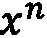 的积分是 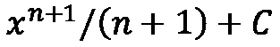（这是我们求导得到  的结果）； 的积分是 ； 的积分是 ； 的积分是 。在所有这些例子中， 是积分常数。我们可以结合这些简单的规则，通过分部积分法或代换积分法（以及一些更复杂的技术，我们这里不作详细讨论）来对更有趣的函数进行积分。

# 操作多项式和微积分

多项式是数学中最简单的函数之一，它们被定义为一个和式：


这里， 代表一个要被替换的占位符（不确定量），而  是一个数字。由于多项式非常简单，它们为微积分的简要介绍提供了极好的手段。

在这个实例中，我们将定义一个表示多项式的简单类，并为该类编写微分和积分的方法。

## 准备开始

这个实例不需要额外的包。

## 如何实现...

以下步骤描述了如何创建一个表示多项式的类，并为该类实现微分和积分方法：

1.  让我们从定义一个简单的类来表示多项式开始：

    ```py
    class Polynomial:
    ```

    ```py
        """Basic polynomial class"""
    ```

    ```py
        def __init__(self, coeffs):
    ```

    ```py
           self.coeffs = coeffs
    ```

    ```py
        def __repr__(self):
    ```

    ```py
           return f"Polynomial({repr(self.coeffs)})"
    ```

    ```py
        def __call__(self, x):
    ```

    ```py
          return sum(coeff*x**i for i, coeff in enumerate(    	        self.coeffs))
    ```

1.  现在我们已经定义了一个表示多项式的基本类，我们可以继续实现该 `Polynomial` 类的微分和积分操作，以说明这些操作如何改变多项式。我们从微分开始。通过将当前系数列表中的每个元素与第一个元素之外的其他元素相乘，我们生成新的系数。然后，我们使用这个新的系数列表创建一个新的 `Polynomial` 实例，并返回该实例：

    ```py
        def differentiate(self):
    ```

    ```py
          """Differentiate the polynomial and return the derivative"""
    ```

    ```py
            coeffs = [i*c for i, c in enumerate(
    ```

    ```py
                self.coeffs[1:], start=1)]
    ```

    ```py
            return Polynomial(coeffs)
    ```

1.  要实现积分方法，我们需要创建一个新的系数列表，其中包含由参数给出的新常数（为了保持一致性，转换为浮点数）。然后我们将旧系数除以它们在列表中的新位置，添加到这个系数列表中：

    ```py
        def integrate(self, constant=0):
    ```

    ```py
          """Integrate the polynomial and return the integral"""
    ```

    ```py
            coeffs = [float(constant)]
    ```

    ```py
            coeffs += [c/i for i, c in enumerate(
    ```

    ```py
                self.coeffs, start=1)]
    ```

    ```py
            return Polynomial(coeffs)
    ```

1.  最后，为了确保这些方法按预期工作，我们应该通过一个简单的例子来测试这两种方法。我们可以使用一个非常简单的多项式来进行检查，例如 ：

    ```py
    p = Polynomial([1, -2, 1])
    ```

    ```py
    p.differentiate()
    ```

    ```py
    # Polynomial([-2, 2])
    ```

    ```py
    p.integrate(constant=1)
    ```

    ```py
    # Polynomial([1.0, 1.0, -1.0, 0.3333333333])
    ```

这里的导数给出了系数  和 ，它对应的多项式是 ，这实际上是  的导数。类似地，积分的系数对应的多项式是 ，这也是正确的（包含积分常数 ）。

## 它是如何工作的...

多项式为微积分的基本运算提供了一个简单的介绍，但要为其他一般函数类构建 Python 类并不是那么容易。也就是说，多项式非常有用，因为它们已经被很好地理解，并且更重要的是，多项式的微积分运算非常简单。对于一个变量的幂 ，微分规则是将幂与该幂相乘并将幂减 1，结果是 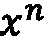 变为 ，所以我们对多项式的微分规则是将每个系数乘以它的位置，并去掉第一个系数。

积分更加复杂，因为一个函数的积分不是唯一的。我们可以在积分中加上任何常数，从而得到第二个积分。对于一个变量的幂 ，积分规则是将幂加 1 并除以新的幂，结果是  变为 。因此，要对多项式进行积分，我们将每个幂的  加 1，并将相应的系数除以新的幂。因此，我们的规则是先插入新的积分常数作为第一个元素，然后将每个现有系数除以它在列表中的新位置。

我们在示例中定义的 `Polynomial` 类相当简化，但它代表了核心思想。一个多项式是由它的系数唯一决定的，我们可以将系数存储为数值列表。微分和积分是我们可以对这个系数列表执行的操作。我们包括了一个简单的 `__repr__` 方法来帮助显示 `Polynomial` 对象，并且提供了一个 `__call__` 方法来便于在特定数值下进行计算。这个方法主要是为了展示多项式如何被计算。

多项式对于解决某些涉及评估计算开销大的函数的问题非常有用。对于这类问题，我们有时可以使用某种多项式插值，将一个多项式拟合到另一个函数上，然后利用多项式的性质来帮助解决原始问题。评估多项式比原始函数要*便宜*得多，因此这可以显著提高速度。这通常会以牺牲一些精度为代价。例如，辛普森法则通过在由三个连续网格点定义的区间上，用二次多项式来逼近曲线下的面积。每个二次多项式下的面积可以通过积分轻松计算。

## 还有更多...

多项式在计算编程中比单纯展示微分和积分的效果要扮演更多重要角色。因此，`numpy.polynomial` NumPy 包中提供了一个更为丰富的`Polynomial`类。NumPy 的`Polynomial`类及其衍生的各种子类在各种数值问题中都非常有用，支持算术运算以及其他方法。特别地，这些方法可以用于将多项式拟合到数据集合上。

NumPy 还提供了从`Polynomial`类派生出的各种类，用于表示不同类型的特殊多项式。例如，`Legendre`类表示一种叫做*勒让德多项式*的特定多项式系统。勒让德多项式的定义为满足的，并形成一个正交系统，这在数值积分和用于求解偏微分方程的**有限元法**等应用中非常重要。勒让德多项式通过递归关系来定义。我们将其定义如下：


此外，对于每个，我们定义第个勒让德多项式，使其满足递推关系：


还有几种所谓的*正交（多项式）系统*，包括*拉盖尔多项式*、*切比雪夫多项式*和*厄尔米特多项式*。

## 另见

微积分在数学文献中有详细的记录，许多教科书覆盖了从基本方法到深层理论的内容。正交多项式系统也在数值分析的文献中得到了详细的记录。

# 使用 SymPy 进行符号微分和积分

到某个时候，你可能需要对一个非简单多项式的函数进行微分，并且你可能需要以某种自动化的方式来完成这项工作——例如，如果你正在编写教育类软件。Python 的科学计算堆栈包含一个名为 SymPy 的包，它允许我们在 Python 中创建和操作符号数学表达式。特别是，SymPy 能够像数学家一样进行符号函数的微分和积分。

在这个食谱中，我们将创建一个符号函数，然后使用 SymPy 库对该函数进行微分和积分。

## 准备工作

与一些其他科学 Python 包不同，文献中似乎没有标准别名用于导入 SymPy。相反，文档在多个地方使用了星号导入，这与*PEP8* 风格指南不符。这可能是为了让数学表达式看起来更自然。我们将简单地使用其名称 `sympy` 导入该模块，以避免与 `scipy` 包的标准缩写 `sp`（这也是 `sympy` 的自然选择）混淆：

```py
import sympy
```

在这个食谱中，我们将定义一个符号表达式，表示以下函数：


然后，我们将看到如何对这个函数进行符号微分和积分。

## 如何做…

使用 SymPy 包进行符号微分和积分（就像你手动操作一样）非常简单。按照以下步骤操作，看看如何实现：

1.  一旦导入 SymPy，我们就定义将在表达式中出现的符号。这是一个 Python 对象，没有特定值，就像数学变量一样，但可以在公式和表达式中同时表示多个不同的值。在这个食谱中，我们只需要定义一个符号用于 ，因为除了这个符号外，我们只需要常量（字面量）符号和函数。我们使用 `sympy` 中的 `symbols` 函数来定义一个新符号。为了简化符号表示，我们将这个新符号命名为 `x`：

    ```py
    x = sympy.symbols('x')
    ```

1.  使用 `symbols` 函数定义的符号支持所有算术运算，因此我们可以直接使用刚刚定义的符号 `x` 构建表达式：

    ```py
    f = (x**2 - 2*x)*sympy.exp(3 - x)
    ```

1.  现在，我们可以利用 SymPy 的符号计算能力来计算 `f` 的导数——也就是对 `f` 进行微分。我们使用 `sympy` 中的 `diff` 函数来对符号表达式进行微分，并返回导数的表达式。由于结果通常不是最简形式，我们使用 `sympy.simplify` 函数来简化结果：

    ```py
    fp = sympy.simplify(sympy.diff(f))
    ```

    ```py
    print(fp)  # (-x**2 + 4*x - 2)*exp(3 - x)
    ```

1.  我们可以检查使用 SymPy 进行符号微分的结果是否正确，并与手工使用乘积法则计算的导数进行比较，该导数作为 SymPy 表达式定义，如下所示：

    ```py
    fp2 = (2*x - 2)*sympy.exp(3 - x) - (
    ```

    ```py
        x**2 - 2*x)*sympy.exp(3 - x)
    ```

1.  SymPy 的等式测试检查两个表达式是否相等，但不检查它们是否在符号上等价。因此，我们必须首先简化我们希望测试的两个语句的差异，并测试是否等于 `0`：

    ```py
    print(sympy.simplify(fp2 - fp) == 0)  # True
    ```

1.  我们可以使用 SymPy 的 `integrate` 函数对导数 `fp` 进行积分，并检查结果是否仍然等于 `f`。最好还通过提供第二个可选参数来指定进行积分的符号：

    ```py
    F = sympy.integrate(fp, x)
    ```

    ```py
    print(F)  # (x**2 - 2*x)*exp(3 - x)
    ```

如我们所见，积分导数 `fp` 的结果将返回原始函数 `f`（尽管我们在技术上缺少了积分常数 ）。

## 它是如何工作的...

SymPy 定义了各种类来表示某些类型的表达式。例如，由 `Symbol` 类表示的符号是 *原子表达式* 的例子。表达式的构建方式与 Python 从源代码构建抽象语法树类似。这些表达式对象可以使用方法和标准算术操作进行操作。

SymPy 还定义了标准数学函数，这些函数可以作用于 `Symbol` 对象，以创建符号表达式。最重要的功能是能够执行符号微积分——与我们在本章剩余部分探索的数值微积分不同——并给出微积分问题的精确（有时称为 *解析*）解。

SymPy 包中的 `diff` 例程对这些符号表达式进行微分。该例程的结果通常不是其最简形式，这就是为什么我们在食谱中使用 `simplify` 例程来简化导数的原因。`integrate` 例程对给定符号进行符号积分（与 `scipy` 表达式相关）。(`diff` 例程也接受一个符号参数，用来指定微分所依赖的符号。) 该例程返回一个其导数为原始表达式的表达式。该例程不会添加积分常数，这在手动积分时是一种良好的实践。

## 还有更多...

SymPy 能做的远不止简单的代数和微积分。它有许多子模块，涵盖数学的各个领域，例如数论、几何学和其他离散数学（如组合数学）。

SymPy 表达式（和函数）可以构建成 Python 函数，这些函数可以应用于 NumPy 数组。这是通过 `sympy.utilities` 模块中的 `lambdify` 例程完成的。该例程将 SymPy 表达式转换为数值表达式，使用 SymPy 标准函数的 NumPy 等效函数来数值求解表达式。结果类似于定义一个 Python Lambda，因此得名。例如，我们可以使用该例程将这个食谱中的函数和导数转换为 Python 函数：

```py
from sympy.utilities import lambdify
lam_f = lambdify(x, f)
lam_fp = lambdify(x, fp)
```

`lambdify` 例程接受两个参数。第一个是需要提供的变量，在前面的代码块中为 `x`，第二个是当调用此函数时要评估的表达式。例如，我们可以像普通 Python 函数一样评估之前定义的 lambdified SymPy 表达式：

```py
lam_f(4)  # 2.9430355293715387
lam_fp(7)  # -0.4212596944408861
```

我们甚至可以在 NumPy 数组上评估这些 lambdified 表达式（和往常一样，先导入 NumPy，通常命名为 `np`）：

```py
lam_f(np.array([0, 1, 2]))  # array([ 0\. , -7.3890561, 0\. ])
```

注意

`lambdify` 例程使用 Python 的 `exec` 例程来执行代码，因此不应与未经清理的输入一起使用。

# 解方程

许多数学问题最终归结为求解形式为  的方程，其中  是单变量的函数。在这里，我们试图找到一个  的值，使得方程成立。使方程成立的  的值有时称为方程的 *根*。对于这种形式的方程，有许多算法可以找到其解。在这个食谱中，我们将使用牛顿-拉弗森方法和割线法来求解形式为  的方程。

牛顿-拉弗森方法（牛顿法）和割线法是非常好的标准求根算法，可以在几乎任何情况下应用。这些是 *迭代方法*，从根的近似值开始，逐步改进这个近似值，直到它位于给定的容差范围内。

为了演示这些技术，我们将使用来自 *使用 SymPy 进行符号微分和积分* 这一食谱中的函数，定义如下公式：


该函数在所有实数值的  上都有定义，并且恰好有两个根，一个在  处，另一个在  处。

## 准备工作

SciPy 包含用于求解方程的例程（以及许多其他功能）。求根的例程可以在 `scipy` 包中的 `optimize` 模块找到。像往常一样，我们将 NumPy 导入为 `np`。

## 如何做……

`optimize` 包提供了用于数值求解根的例程。以下说明描述了如何使用该模块中的 `newton` 例程：

1.  `optimize` 模块没有列在 `scipy` 命名空间中，因此必须单独导入：

    ```py
    from scipy import optimize
    ```

1.  然后，我们必须在 Python 中定义这个函数及其导数：

    ```py
    from math import exp
    ```

    ```py
    def f(x):
    ```

    ```py
      return x*(x - 2)*exp(3 - x)
    ```

1.  该函数的导数已在之前的食谱中计算过：

    ```py
    def fp(x):
    ```

    ```py
      return -(x**2 - 4*x + 2)*exp(3 - x)
    ```

1.  对于牛顿-拉弗森方法和割线法，我们都使用 `optimize` 中的 `newton` 例程。无论是割线法还是牛顿-拉弗森方法，都需要将函数作为第一个参数，将第一个近似值 `x0` 作为第二个参数。使用牛顿-拉弗森方法时，我们必须提供  的导数，并使用 `fprime` 关键字参数：

    ```py
    optimize.newton(f, 1, fprime=fp) # Using the Newton-Raphson method
    ```

    ```py
    # 2.0
    ```

1.  要使用割线法，只需要函数，但必须提供根的前两个近似值；第二个近似值通过 `x1` 关键字参数提供：

    ```py
    optimize.newton(f, 1., x1=1.5) # Using x1 = 1.5 and the secant method
    ```

    ```py
    # 1.9999999999999862
    ```

注意

牛顿-拉弗森方法和割线法都不能保证一定会收敛到一个根。方法的迭代过程有可能会在若干点之间循环（周期性）或剧烈波动（混沌）。

## 它是如何工作的……

对于一个函数 ，其导数为 ，初始近似值为 ，牛顿-拉弗森方法通过以下公式进行迭代定义：


对于每个整数，。从几何角度来看，这个公式通过考虑梯度为负（因此，函数在减小）时的方向（如果），或者梯度为正（因此，函数在增加）时的方向（如果）来得到。

割线法基于牛顿-拉夫森方法，但将第一导数替换为以下近似值：


当足够小（这会在方法收敛时发生），那么这是一个很好的近似值。不需要函数的导数所付出的代价是我们需要额外的初始猜测来启动该方法。该方法的公式如下：


一般来说，如果给定任一方法一个足够接近根的初始猜测（割线法的猜测），则该方法将收敛到该根。牛顿-拉夫森方法也可能失败，如果在某次迭代中导数为零，此时公式将无法定义。

## 还有更多...

本食谱中提到的方法是通用方法，但在某些情况下，可能有其他方法更快或更准确。广义上讲，根求解算法可以分为两类：使用每次迭代时函数梯度信息的算法（如牛顿-拉夫森、割线法、哈雷法），以及需要知道根的区间范围的算法（如二分法、正则法、布伦特法）。到目前为止讨论的算法属于第一类，虽然通常非常快速，但它们可能会失败并无法收敛。

第二类算法是那些已知根存在于指定区间内的算法。我们可以通过检查和的符号是否不同来判断根是否位于该区间内——也就是说，或中的一个条件成立（当然，前提是函数是*连续的*，这在实际中通常是成立的）。这类算法中最基础的就是二分法，它通过反复二分区间直到找到足够精确的根的近似值。基本原理是将区间和的中点分割，并选择函数符号变化的区间。该算法重复进行，直到区间非常小。以下是该算法的一个简单 Python 实现：

```py
from math import copysign
def bisect(f, a, b, tol=1e-5):
    """Bisection method for root finding"""
    fa, fb = f(a), f(b)
    assert not copysign(fa, fb) == fa, "Function must change signs"
    while (b - a) > tol:
        m = (a + b)/2 # mid point of the interval
        fm = f(m)
        if fm == 0:
            return m
        if copysign(fm, fa) == fm: # fa and fm have the same sign
            a = m
            fa = fm
        else: # fb and fm have the same sign
            b = m
    return a
```

该方法保证收敛，因为在每一步，距离 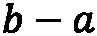 都会减半。然而，该方法可能需要比牛顿-拉弗森方法或割线法更多的迭代次数。`optimize` 模块中也有一个版本的二分法，该版本用 C 实现，比这里介绍的版本效率要高得多，但在大多数情况下，二分法并不是最快的方法。

布伦特法是对二分法的改进，并且在 `optimize` 模块中作为 `brentq` 提供。它结合了二分法和插值法，能够快速找到方程的根：

```py
optimize.brentq(f, 1.0, 3.0)  # 1.9999999999998792
```

需要注意的是，涉及括值法（如二分法、正割法、布伦特法）的技术不能用于求解复数变量的根函数，而不使用括值法的技术（如牛顿法、割线法、哈雷法）可以。

最后，有些方程的形式可能并非 ，但仍然可以使用这些技术进行求解。通过重新排列方程，使其符合所需的形式（如果必要，重新命名函数）来实现。这通常不太困难，只需要将右侧的任何项移到左侧。例如，如果你希望找到一个函数的固定点——也就是说，当  时——我们就可以应用该方法到相关函数  上。

# 使用 SciPy 进行数值积分

积分可以被解释为曲线与  轴之间的面积，面积的符号取决于该面积是在轴的上方还是下方。有些积分无法直接通过符号方式计算，而必须通过数值方法近似计算。一个经典的例子是高斯误差函数，它在《理解基本数学函数》一节中提到过，详见 *第一章*，*基本包、函数和概念简介*。该函数通过以下公式定义：


此外，这里出现的积分无法通过符号方式计算。

在这个例子中，我们将演示如何使用 SciPy 包中的数值积分例程来计算一个函数的积分。

## 准备工作

我们使用 `scipy.integrate` 模块，其中包含了几个用于计算数值积分的例程。我们还将 NumPy 库作为 `np` 导入。我们可以通过以下方式导入该模块：

```py
from scipy import integrate
```

## 如何实现...

以下步骤描述了如何使用 SciPy 进行数值积分：

1.  我们计算在误差函数定义中出现的积分，计算的值为 。为此，我们需要在 Python 中定义被积函数（出现在积分符号内部的函数）：

    ```py
    def erf_integrand(t):
    ```

    ```py
        return np.exp(-t**2)
    ```

`scipy.integrate`中有两种主要的例程可以用于执行数值积分（求积），分别是`quad`函数和`quadrature`。第一个是使用 QUADPACK 执行积分的`quad`函数，第二个是`quadrature`。

1.  `quad`例程是一个通用的积分工具。它需要三个参数：要积分的函数（`erf_integrand`），下限（`-1.0`）和上限（`1.0`）：

    ```py
    val_quad, err_quad = integrate.quad(erf_integrand, -1.0, 1.0)
    ```

    ```py
    # (1.493648265624854, 1.6582826951881447e-14)
    ```

第一个返回值是积分的值，第二个返回值是误差的估计。

1.  使用`quadrature`例程重复计算，我们得到如下结果。其参数与`quad`例程相同：

    ```py
    val_quadr, err_quadr =
    ```

    ```py
        integrate.quadrature(
    ```

    ```py
            erf_integrand, -1.0, 1.0)
    ```

    ```py
    # (1.4936482656450039, 7.459897144457273e-10)
    ```

输出格式与代码相同，首先是积分值，然后是误差估计。请注意，`quadrature`例程的误差较大。这是由于该方法在估算误差小于给定容忍度时终止，而该容忍度可以在调用例程时进行修改。

## 它是如何工作的……

大多数数值积分技术遵循相同的基本过程。首先，我们选择积分区域内的点 和，然后使用这些值和来近似积分。例如，使用梯形法则时，我们使用以下公式来近似积分：


这里， 和 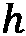 是相邻的值之间的（常见）差异，包括端点和。这可以在 Python 中实现如下：

```py
def trapezium(func, a, b, n_steps):
    """Estimate an integral using the trapezium rule"""
    h = (b - a) / n_steps
    x_vals = np.arange(a + h, b, h) 
    y_vals = func(x_vals)
    return 0.5*h*(func(a) + func(b) + 2.*np.sum(y_vals))
```

`quad`和`quadrature`使用的算法比这要复杂得多。使用此函数通过`trapezium`法则和 500 步来近似积分`erf_integrand`，得到的结果为 1.4936463036001209，与`quad`和`quadrature`例程的五位小数近似值一致。

`quadrature`例程使用固定容忍度的高斯求积，而`quad`例程则使用在 Fortran 库 QUADPACK 中实现的自适应算法。对两个例程进行计时，我们发现`quad`例程比`quadrature`例程快大约五倍，尤其是在本食谱中描述的问题上。`quad`例程的执行时间约为 27 微秒，经过 100 万次执行的平均值，而`quadrature`例程的执行时间约为 134 微秒。（您的结果可能会因系统而异。）一般来说，除非您需要`quadrature`实现的高斯求积，否则应使用`quad`方法，因为它既更快又更准确。

## 还有更多……

本节提到的例程要求已知被积函数，这并不总是成立。相反，我们可能已知一些数对  和 ，但我们并不知道函数 ，也无法在额外的点上进行评估。在这种情况下，我们可以使用 `scipy.integrate` 中的某种采样求积技术。如果已知点的数量非常大且所有点间距相等，我们可以使用 Romberg 积分法进行良好的积分近似。为此，我们使用 `romb` 例程。否则，我们可以使用梯形规则的变体（如前所示），利用 `trapz` 例程，或者使用辛普森法则，通过 `simps` 例程进行计算。

# 数值求解简单微分方程

微分方程出现在某些量随着时间或其他因素变化的情形中，通常根据给定的关系式进行演化。它们在工程学和物理学中极为常见，且自然地出现。微分方程的一个经典（非常简单）的例子是牛顿提出的冷却定律。一个物体的温度以与当前温度成正比的速率降低。从数学角度看，这意味着我们可以使用以下微分方程来表示在时间  时刻物体的温度  的导数：

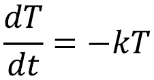

这里， 是一个正的常数，用于确定冷却速率。这个微分方程可以通过先*分离变量*，然后进行积分和重排来*解析*求解。经过这一过程，我们可以得到一般解：


这里， 是初始温度。

在本示例中，我们将使用 SciPy 的 `solve_ivp` 例程数值求解一个简单的常微分方程（ODE）。

## 准备工作

我们将演示如何在 Python 中使用先前描述的冷却方程来数值求解一个微分方程，因为在这种情况下我们可以计算真实解。我们将初始温度设为  和 。同时，我们还要找到  在  和  之间的解。

在这个示例中，我们需要导入 NumPy 库，命名为 `np`，导入 Matplotlib 的 `pyplot` 接口，命名为 `plt`，以及从 SciPy 导入 `integrate` 模块：

```py
from scipy import integrate
```

一般的（一级）微分方程具有以下形式：


这里， 是 （自变量）和 （因变量）的一些函数。在此公式中， 是因变量，。SciPy 包中求解微分方程的例程需要函数  以及初始值  和我们需要计算解的 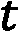 值的范围。为了开始，我们需要在 Python 中定义我们的函数  并创建变量  和  的范围，以便提供给 SciPy 例程：

```py
def f(t, y):
    return -0.2*y
t_range = (0, 5)
```

接下来，我们需要定义求解该初值问题所需的初始条件。由于技术原因，初始  值必须指定为一维 NumPy 数组：

```py
T0 = np.array([50.])
```

由于在这种情况下，我们已经知道真实解，因此我们也可以在 Python 中定义该解，以便与我们将计算的数值解进行比较：

```py
def true_solution(t):
    return 50.*np.exp(-0.2*t)
```

让我们看看如何使用 SciPy 求解这个初值问题。

## 如何做到...

按照以下步骤，数值求解微分方程并绘制解和误差：

1.  我们使用 SciPy 中 `integrate` 模块的 `solve_ivp` 例程来数值求解微分方程。我们添加一个最大步长参数，值为 `0.1`，以确保解在合理数量的点处计算：

    ```py
    sol = integrate.solve_ivp(f, t_range, T0, max_step=0.1)
    ```

1.  接下来，我们从 `solve_ivp` 方法返回的 `sol` 对象中提取解的值：

    ```py
    t_vals = sol.t
    ```

    ```py
    T_vals = sol.y[0, :]
    ```

1.  接下来，我们在一组坐标轴上绘制解，如下所示。由于我们还将绘制同一图形中的近似误差，因此我们使用 `subplots` 例程创建两个子图：

    ```py
    fig, (ax1, ax2) = plt.subplots(1, 2, tight_layout=True)
    ```

    ```py
    ax1.plot(t_vals, T_valsm "k")
    ```

    ```py
    ax1.set_xlabel("$t$")
    ```

    ```py
    ax1.set_ylabel("$T$")
    ```

    ```py
    ax1.set_title("Solution of the cooling equation")
    ```

这将把解绘制在 *图 3**.1* 左侧的一组坐标轴上。

1.  为了做到这一点，我们需要计算从 `solve_ivp` 例程中获得的点处的真实解，然后计算真实解与近似解之间差异的绝对值：

    ```py
    err = np.abs(T_vals - true_solution(t_vals))
    ```

1.  最后，在 *图 3**.1* 右侧，我们使用对数坐标轴绘制近似误差，轴上显示的是  的对数比例。然后，我们可以使用 `semilogy` 绘图命令，按照在 *第二章* 中展示的 *Matplotlib* 数学绘图方法，将其绘制在右侧的对数坐标轴上 ：

    ```py
    ax2.semilogy(t_vals, err, "k")
    ```

    ```py
    ax2.set_xlabel("$t$")
    ```

    ```py
    ax2.set_ylabel("Error")
    ```

    ```py
    ax2.set_title("Error in approximation")
    ```

*图 3**.1* 左侧的图展示了温度随时间下降的情况，而右侧的图显示了误差随着我们远离初始条件给定的已知值而增加：


图 3.1 – 冷却方程数值解的绘图

请注意，右侧的图是对数坐标系，尽管增长速率看起来相当显著，但涉及的数值非常小（大约是 ）。

## 它是如何工作的...

大多数解微分方程的方法都是*时间步进*方法。通过小的  步长生成的数对 ，并近似求得函数  的值。欧拉法作为最基本的时间步进方法，也许能最清晰地说明这一点。固定一个小的步长 ，我们使用以下公式在  步生成近似值：


我们从已知的初始值开始 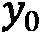。我们可以很容易地编写一个执行欧拉法的 Python 程序，代码如下（当然，欧拉法有很多不同的实现方式；这是一个非常简单的例子）。

首先，我们通过创建将存储  和  值的列表来设置该方法：

```py
def euler(func, t_range, y0, step_size):
    """Solve a differential equation using Euler's method"""
    t = [t_range[0]]
    y = [y0]
    i = 0
```

欧拉法会持续进行，直到我们到达  范围的终点。在这里，我们使用 `while` 循环来完成这一过程。循环体非常简单；我们首先递增一个计数器 `i`，然后将新的  和  值添加到各自的列表中：

```py
    while t[i] < t_range[1]:
        i += 1
        t.append(t[i-1] + step_size)  # step t
        y.append(y[i-1] + step_size*func(
           t[i-1], y[i-1]))   # step y
    return t, y
```

`solve_ivp` 例程默认使用 **Runge-Kutta-Fehlberg** (**RKF45**) 方法，该方法能够自适应调整步长，确保近似值的误差保持在给定的容忍度范围内。此例程需要三个位置参数：函数 ，求解所需的  范围，以及初始的  值（在我们的示例中是 ）。可以提供可选的参数来更改求解器、计算点的数量以及其他设置。

传递给 `solve_ivp` 函数的函数必须有两个参数，如*准备工作*部分所描述的常规微分方程。该函数还可以有额外的参数，可以通过 `solve_ivp` 例程的 `args` 关键字传递，但这些参数必须位于两个必要参数之后。将我们之前定义的 `euler` 函数与 `solve_ivp` 函数进行比较，两个函数的最大步长为 0.1，我们发现 `solve_ivp` 解的最大真实误差约为 10-11，而 `euler` 解的误差为 0.19。`euler` 方法有效，但步长太大，导致误差不断积累。为了比较，*图 3**.2* 是欧拉法生成的解与误差的图表。将 *图 3**.2* 与 *图 3**.1* 进行比较，注意误差图的比例尺有很大的不同：


图 3.2 – 使用欧拉方法（步长为 0.1）绘制的解与误差图

`solve_ivp` 例程返回一个解对象，该对象存储有关已计算解的信息。这里最重要的是 `t` 和 `y` 属性，它们包含计算解  的  值以及解本身 。我们使用这些值来绘制我们计算出的解。  值存储在一个形状为 `(n, N)` 的 NumPy 数组中，其中 `n` 是方程的组成部分数量（这里为 1），`N` 是计算得到的点的数量。存储在 `sol` 中的  值保存在一个二维数组中，在这个例子中有一行和多列。我们使用切片 `y[0, :]` 来提取这一行作为一个一维数组，可以用于在第 4 步中绘制解。

我们使用对数缩放的  坐标轴来绘制误差，因为这里有趣的是量级。将其绘制在未缩放的  坐标轴上会得到一条非常接近  坐标轴的直线，这样无法显示随着我们通过  值变化误差的增加。对数缩放的  坐标轴清晰地显示了这一增加。

## 还有更多…

`solve_ivp` 例程是一个方便的接口，提供多种微分方程求解器，默认使用 RKF45 方法。这些求解器各有不同的优点，但 RKF45 方法是一个良好的通用求解器。

## 另见

有关如何在 Matplotlib 中向图形添加子图的详细说明，请参见 *第二章* 中的 *添加子图* 方案，书名为 *Matplotlib 数学绘图*。

# 求解微分方程组

微分方程有时出现在由两个或多个互相关联的微分方程组成的系统中。一个经典的例子是竞争物种种群的简单模型。这个竞争物种的简单模型标记为 （猎物）和 （捕食者），由以下方程给出：


第一个方程决定了猎物物种  的增长，如果没有捕食者，它将呈指数增长。第二个方程决定了捕食者物种  的增长，如果没有猎物，它将呈指数衰减。当然，这两个方程是 *耦合的*；每个人口变化都依赖于两个物种的数量。捕食者以与两者数量积成正比的速度捕食猎物，而捕食者的增长速度与猎物的相对丰度成正比（同样是两者数量的积）。

在这个食谱中，我们将分析一个简单的微分方程系统，并使用 SciPy `integrate` 模块来获得近似解。

## 准备工作

使用 Python 求解微分方程组的工具与求解单一方程的工具是相同的。我们再次使用 SciPy `integrate` 模块中的 `solve_ivp` 函数。然而，这只会给我们在给定起始种群下，预测的时间演化。因此，我们还将使用 Matplotlib 中的一些绘图工具，以便更好地理解种群演化。像往常一样，我们导入了 NumPy 库并将其命名为 `np`，同时导入了 Matplotlib 的 `pyplot` 接口并将其命名为 `plt`。

## 如何做...

接下来的步骤将引导我们如何分析一个简单的微分方程系统：

1.  我们的第一个任务是定义一个包含方程组的函数。这个函数需要接受两个参数，就像单一方程那样，唯一不同的是依赖变量 （来自 *数值求解简单微分方程* 食谱中的符号）将变成一个数组，数组的元素个数等于方程的个数。在这里，会有两个元素。我们为这个示例系统所需的函数定义如下：

    ```py
    def predator_prey_system(t, y):
    ```

    ```py
        return np.array([5*y[0] - 0.1*y[0]*y[1],
    ```

    ```py
            0.1*y[1]*y[0] - 6*y[1]])
    ```

1.  现在我们在 Python 中定义了系统，我们可以使用 Matplotlib 的 `quiver` 函数生成一个图表，描述在多个起始种群下，按照方程所给出的种群将如何演化。我们首先设置一个点的网格，在这个网格上我们将绘制这个演化。建议选择一个相对较少的点数来进行 `quiver` 绘图；否则，图表的细节将变得难以看清。对于这个示例，我们绘制种群值在 0 到 100 之间的情况：

    ```py
    p = np.linspace(0, 100, 25)
    ```

    ```py
    w = np.linspace(0, 100, 25)
    ```

    ```py
    P, W = np.meshgrid(p, w)
    ```

1.  现在，我们在每对这些点上计算系统的值。注意，系统中的任何方程都不是时间相关的（它们是自治的）；时间变量  在计算中不重要。我们为  参数提供值 `0`：

    ```py
    dp, dw = predator_prey_system(0, np.array([P, W]))
    ```

1.  `dp` 和 `dw` 变量现在分别表示如果我们从网格中的每个点开始，物种  和  将演化的 *方向*。我们可以使用 `matplotlib.pyplot` 中的 `quiver` 函数将这些方向绘制在一起：

    ```py
    fig, ax = plt.subplots()
    ```

    ```py
    ax.quiver(P, W, dp, dw)
    ```

    ```py
    ax.set_title("Population dynamics for two competing species")
    ```

    ```py
    ax.set_xlabel("P")
    ```

    ```py
    ax.set_ylabel("W")
    ```

绘制这些命令的结果现在给出了*图 3.3*，它提供了一个*全局*的视角，展示了解如何演变：


图 3.3 – 显示两种竞争物种种群动态的箭头图

为了更具体地理解解，我们需要一些初始条件，以便能够使用前面食谱中描述的`solve_ivp`例程。

1.  由于我们有两个方程，初始条件将有两个值。（回想在*数值求解简单微分方程*的食谱中，我们看到提供给`solve_ivp`的初始条件需要是一个 NumPy 数组。）让我们考虑初始值  和 。我们将它们定义在一个 NumPy 数组中，并小心地按正确的顺序放置它们：

    ```py
    initial_conditions = np.array([85, 40])
    ```

1.  现在，我们可以使用来自`scipy.integrate`模块的`solve_ivp`。我们需要提供`max_step`关键字参数，以确保我们在解中有足够的点，从而得到平滑的解曲线：

    ```py
    from scipy import integrate
    ```

    ```py
    t_range = (0.0, 5.0)
    ```

    ```py
    sol = integrate.solve_ivp(predator_prey_system,
    ```

    ```py
                              t_range,
    ```

    ```py
                              initial_conditions,
    ```

    ```py
                              max_step=0.01)
    ```

1.  让我们将这个解绘制在现有图形上，以展示这个特定解如何与我们已经生成的方向图相关联。我们同时也绘制初始条件：

    ```py
    ax.plot(initial_conditions[0],
    ```

    ```py
        initial_conditions[1], "ko")
    ```

    ```py
    ax.plot(sol.y[0, :], sol.y[1, :], "k", linewidth=0.5)
    ```

结果如*图 3.4*所示：


图 3.4 – 在箭头图上绘制的解轨迹，展示了总体行为

我们可以看到绘制出的轨迹是一个闭合的环路。这意味着种群之间有一个稳定且周期性的关系。这是解这些方程时常见的模式。

## 它是如何工作的……

用于系统 ODE 的方法与单一 ODE 完全相同。我们从将方程组写成单一的向量微分方程开始：


然后，可以使用时间步进方法来求解，就像  是一个简单的标量值一样。

使用`quiver`例程在平面上绘制方向箭头的技术是一种快速且简单的方式来了解一个系统如何从给定状态演变。一个函数的导数表示曲线的梯度 ，因此微分方程描述了解函数在位置  和时间  处的梯度。一个方程组描述了在给定位置  和时间  处的各个解函数的梯度。当然，位置现在是一个二维点，因此当我们绘制该点的梯度时，我们将其表示为一支箭头，箭头从该点开始，指向梯度的方向。箭头的长度表示梯度的大小；箭头越长，解曲线在该方向上移动得就越*快*。

当我们将解轨迹绘制在这个方向场上时，可以看到曲线（从某个点开始）沿着箭头指示的方向移动。解轨迹所表现的行为是一个*极限环*，其中每个变量的解是周期性的，随着两个物种种群的增长或下降。这种行为的描述在我们将每个种群与时间进行绘制时，或许会更加清晰，如*图 3.5*所示。从*图 3.4*中不容易立刻看出来的是解轨迹会绕几个圈，但这在*图 3.5*中清楚地展示了出来：


图 3.5 – 种群 P 和 W 随时间变化的图像

前面描述的周期关系在*图 3.5*中非常明显。此外，我们还可以看到两个物种的种群峰值之间的滞后关系。物种  的峰值种群大约在物种  后 0.3 个时间单位达到。

## 还有更多...

通过将变量彼此对比，针对不同的初始条件绘制出来，从而分析一个常微分方程系统的技术，称为*相空间（平面）分析*。在这个过程中，我们使用了 `quiver` 绘图方法来快速生成微分方程系统的相平面的近似图。通过分析微分方程系统的相平面，我们可以识别解的不同局部和全局特征，如极限环。

# 数值求解偏微分方程

偏微分方程是涉及多个变量的函数的*偏导数*的微分方程，而不是只有单一变量的*普通导数*。偏微分方程是一个广泛的主题，足以填满一系列的书籍。一个典型的偏微分方程的例子是（一维）*热方程*：


这里， 是一个正的常数， 是一个函数。这个偏微分方程的解是一个函数 ，它表示在给定时间  时，处于范围  的杆的温度。为了简化问题，我们假设 ，这相当于说没有施加任何加热/冷却，，并且 。在实践中，我们可以重新调整问题的尺度，使常数  固定，所以这并不是一个限制性问题。在这个例子中，我们将使用边界条件：


这些等同于说杆的两端被保持在常温 0°。我们还将使用初始温度分布：


这个初始温度分布描述了一条平滑的曲线，介于 0 和 2 之间，峰值为 3，这可能是因为将杆的中心加热至温度 3 所导致的。

我们将使用一种叫做*有限差分法*的方法，先将杆分成若干等长的段，再将时间范围划分为若干离散的步长。然后，我们计算每个段和每个时间步的解的近似值。

在这个配方中，我们将使用有限差分法来求解一个简单的偏微分方程。

## 准备工作

对于这个配方，我们将需要 NumPy 和 Matplotlib 包，分别以`np`和`plt`导入，和往常一样。我们还需要从`mpl_toolkits`中导入`mplot3d`模块，因为我们将绘制一个 3D 图：

```py
from mpl_toolkits import mplot3d
```

我们还需要一些来自 SciPy 包的模块。

## 如何实现...

在接下来的步骤中，我们将通过有限差分法解决热方程：

1.  首先，我们创建表示系统物理约束的变量——杆的长度和的值：

    ```py
    alpha = 1
    ```

    ```py
    x0 = 0 # Left hand x limit
    ```

    ```py
    xL = 2 # Right hand x limit
    ```

1.  我们首先将范围划分为等间隔——我们在这个例子中取——使用个点。我们可以使用 NumPy 的`linspace`函数生成这些点。我们还需要每个区间的公共长度：

    ```py
    N = 10
    ```

    ```py
    x = np.linspace(x0, xL, N+1)
    ```

    ```py
    h = (xL - x0) / N
    ```

1.  接下来，我们需要设置时间方向上的步长。我们在这里采取稍微不同的方法；我们设置时间步长和步数（隐含假设从时间 0 开始）：

    ```py
    k = 0.01
    ```

    ```py
    steps = 100
    ```

    ```py
    t = np.array([i*k for i in range(steps+1)])
    ```

1.  为了使方法正确运行，我们必须满足以下公式：

否则，系统可能会变得不稳定。我们将这个不等式的左边存储在一个变量中，以便在第 5 步使用，并用断言检查这个不等式是否成立：

```py
r = alpha*k / h**2
assert r < 0.5, f"Must have r < 0.5, currently r={r}"
```

1.  现在，我们可以构造一个矩阵来保存有限差分方案中的系数。为此，我们使用`scipy.sparse`模块中的`diags`函数来创建一个稀疏的三对角矩阵：

    ```py
    from scipy import sparse
    ```

    ```py
    diag = [1, *(1-2*r for _ in range(N-1)), 1]
    ```

    ```py
    abv_diag = [0, *(r for _ in range(N-1))]
    ```

    ```py
    blw_diag = [*(r for _ in range(N-1)), 0]
    ```

    ```py
    A = sparse.diags([blw_diag, diag, abv_diag], (-1, 0, 1),
    ```

    ```py
                     shape=(N+1, N+1), dtype=np.float64,
    ```

    ```py
                     format="csr")
    ```

1.  接下来，我们创建一个空矩阵来保存解：

    ```py
    u = np.zeros((steps+1, N+1), dtype=np.float64)
    ```

1.  我们需要将初始分布添加到第一行。最佳方法是创建一个函数来表示初始分布，并将该函数在`x`数组上求值的结果存储在我们刚刚创建的矩阵`u`中：

    ```py
    def initial_profile(x):
    ```

    ```py
        return 3*np.sin(np.pi*x/2)
    ```

    ```py
    u[0, :] = initial_profile(x)
    ```

1.  现在，我们可以简单地遍历每一步，通过将`A`与前一行相乘来计算矩阵`u`的下一行：

    ```py
    for i in range(steps):
    ```

    ```py
        u[i+1, :] = A @ u[i, :]
    ```

最后，为了可视化我们刚刚计算的解，我们可以使用 Matplotlib 将解绘制为表面图：

```py
X, T = np.meshgrid(x, t)
fig = plt.figure()
ax = fig.add_subplot(projection="3d")
ax.plot_surface(T, X, u, cmap="gray")
ax.set_title("Solution of the heat equation")
ax.set_xlabel("t")
ax.set_ylabel("x")
ax.set_zlabel("u")
```

结果是如*图 3.6*所示的表面图：


图 3.6 - 热方程在该范围内的数值解 

沿着  轴，我们可以看到整体形状与初始轮廓相似，但随着时间的推移变得更加平坦。沿着  轴，表面展现出典型的冷却系统特征——指数衰减。

## 它是如何工作的...

有限差分法通过用只涉及函数值的简单分数来替代每个导数，这些函数值我们可以估计。为了实现此方法，我们首先将空间范围和时间范围分解为多个离散区间，由网格点分隔。这个过程称为*离散化*。然后，我们使用微分方程以及初始条件和边界条件形成连续的近似，方式与`solve_ivp`例程在*数值求解简单微分方程*中的时间步进方法非常相似。

为了解决像热方程这样的偏微分方程，我们至少需要三项信息。通常，对于热方程，这些信息将以*边界条件*的形式出现在空间维度上，告诉我们杆子两端的行为，以及*初始条件*的形式出现在时间维度上，表示杆子上的初始温度分布。

前面描述的有限差分法通常称为**前向时间中心差分**（**FTCS**）法，因为我们使用*前向有限差分*来估计时间导数，使用*中心有限差分*来估计（二阶）空间导数。第一阶有限差分近似的公式如下：


类似地，二阶近似由以下公式给出：


将这些近似代入热方程，并使用近似公式  来表示在  时间步长后的  在  空间点的值，我们得到如下结果：


这可以重新排列得到以下公式：


粗略地说，这个方程表明给定点的下一个温度依赖于前一个时间步长周围的温度。这也说明了为什么`r`值的条件是必要的；如果这个条件不成立，右侧的中间项将变为负数。

我们可以将这个方程系统写成矩阵形式：


在这里，是一个向量，包含近似值和矩阵，该矩阵在步骤 4 中已定义。该矩阵是三对角矩阵，意味着非零项出现在主对角线或其邻近位置。我们使用来自 SciPy `sparse`模块的`diag`函数，这是定义这类矩阵的工具。这与本章*求解方程*的过程非常相似。该矩阵的首行和末行都为零，除了左上角和右下角分别表示（不变的）边界条件。其他行则包含通过有限差分法对微分方程两侧的导数进行近似得到的系数。我们首先创建对角线上的条目以及对角线上下的条目，然后使用`diags`函数创建一个稀疏矩阵。该矩阵应具有行和列，以匹配网格点的数量，并且我们将数据类型设置为双精度浮点数，并采用**压缩稀疏行**（**CSR**）格式。

初始配置给出了向量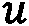，从这个初始点开始，我们可以通过简单地执行矩阵乘法来计算每个后续时间步，就像我们在步骤 7 中看到的那样。

## 还有更多内容...

我们在这里描述的方法相当粗糙，因为如我们所提到的，如果时间步长和空间步长的相对大小没有得到精确控制，近似可能会变得不稳定。这种方法是*显式*的，因为每个时间步都是显式计算的，仅使用前一个时间步的信息。也有*隐式*方法，它给出一个方程组，可以求解得到下一个时间步。不同的方案在解的稳定性上有不同的特点。

当函数不为 0 时，我们可以通过以下赋值来轻松处理这种变化：


在这里，函数已被适当向量化，使得该公式有效。就解决问题所用的代码而言，我们只需要包含函数的定义，然后更改解法中的循环，代码如下：

```py
for i in range(steps):
       u[i+1, :] = A @ u[i, :] + f(t[i], x)
```

从物理角度来看，这个函数表示杆上每个点的外部热源（或热汇）。这个热源可能会随时间变化，这就是为什么通常情况下，该函数应该同时具有和作为参数（尽管不一定都需要使用）。

我们在这个示例中给出的边界条件表示杆的两端保持在 0 的恒定温度下。这类边界条件有时称为*狄利克雷*边界条件。也有*诺依曼*边界条件，在这种情况下，函数的导数在边界处给出。例如，我们可能会给定以下边界条件：


从物理角度看，这可以解释为杆的两端被绝缘，从而热量无法通过端点逸出。对于这种边界条件，我们需要稍微修改矩阵 ，但方法本身保持不变。实际上，在边界左侧插入一个虚拟的  值，并在左侧边界使用向后有限差分法（），我们得到如下结果：


在二阶有限差分近似中，我们得到如下结果：


这意味着我们的矩阵的第一行应包含 ，然后是 ，接着是 。对右侧边界进行类似的计算将得到矩阵的类似最后一行：

```py
diag = [1-r, *(1-2*r for _ in range(N-1)), 1-r]
abv_diag = [*(r for _ in range(N))]
blw_diag = [*(r for _ in range(N))]
A = sparse.diags([blw_diag, diag, abv_diag], (-1, 0, 1),
                 shape=(N+1, N+1), dtype=np.float64,
                 format="csr")
```

对于涉及偏微分方程的更复杂问题，使用*有限元*求解器可能更为合适。有限元方法在计算解决方案时采用比偏微分方程更复杂的方法，这种方法通常比我们在此处看到的有限差分法更灵活。然而，这也意味着需要更多的设置，并且依赖于更高级的数学理论。另一方面，确实有一个 Python 包可以使用有限元方法来求解偏微分方程，比如**FEniCS**（[fenicsproject.org](https://fenicsproject.org)）。使用像 FEniCS 这样的包的优势在于，它们通常经过性能调优，这在求解高精度复杂问题时非常重要。

## 另见

FEniCS 文档提供了有限元方法的良好介绍，并给出了使用该包解决各种经典偏微分方程的多个示例。关于该方法和理论的更全面介绍可以参见以下书籍：*Johnson, C.*（*2009*）。*有限元法求解偏微分方程的数值解法*。*Mineola, N.Y.:* *Dover Publications*。

有关如何使用 Matplotlib 生成三维表面图的更多详细信息，请参阅*第二章*中的*表面和等高线图*配方，*Matplotlib 数学绘图*。

# 使用离散傅里叶变换进行信号处理

微积分中最有用的工具之一是 **傅里叶变换**（**FT**）。粗略来说，傅里叶变换以可逆的方式改变某些函数的表示。这种表示的变化在处理以时间为函数的信号时尤为有用。在这种情况下，傅里叶变换将信号表示为频率的函数；我们可以将其描述为从信号空间到频率空间的转换。这样可以用于识别信号中存在的频率，进行识别和其他处理。实际上，我们通常会拥有一个离散的信号样本，因此我们必须使用 **离散傅里叶变换**（**DFT**）来进行这种分析。幸运的是，有一个计算效率高的算法——称为 FFT——可以将 DFT 应用于样本。

我们将遵循一个常见的过程，使用 FFT 对噪声信号进行滤波。第一步是应用 FFT，并使用数据计算信号的 **功率谱密度**（**PSD**）。然后，我们识别峰值，并滤除那些对信号贡献不足的频率。接下来，我们应用逆 FFT 来获取滤波后的信号。

在这个食谱中，我们使用 FFT 来分析信号的样本，识别其中的频率，并从信号中清除噪声。

## 准备工作

对于本食谱，我们只需要导入 NumPy 和 Matplotlib 包，分别作为 `np` 和 `plt`。我们还需要创建一个默认的随机数生成器实例，如下所示：

```py
rng = np.random.default_rng(12345)
```

现在，让我们看看如何使用 DFT。

## 如何做到...

按照以下说明使用 FFT 来处理噪声信号：

1.  我们定义了一个函数来生成我们的基础信号：

    ```py
    def signal(t, freq_1=4.0, freq_2=7.0):
    ```

    ```py
        return np.sin(freq_1 * 2 * np.pi * t) + np.sin(
    ```

    ```py
            freq_2 * 2 * np.pi * t)
    ```

1.  接下来，我们通过向基础信号中添加一些高斯噪声来创建我们的样本信号。为了方便后续处理，我们还创建了一个数组来存储在样本值处的真实信号 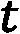：

    ```py
    sample_size = 2**7 # 128
    ```

    ```py
    sample_t = np.linspace(0, 4, sample_size)
    ```

    ```py
    sample_y = signal(sample_t) + rng.standard_normal(
    ```

    ```py
        sample_size)
    ```

    ```py
    sample_d = 4./(sample_size - 1) # Spacing for linspace array
    ```

    ```py
    true_signal = signal(sample_t)
    ```

1.  我们使用 NumPy 的 `fft` 模块来计算 DFT。在开始分析之前，我们从 NumPy 导入它：

    ```py
    from numpy import fft
    ```

1.  为了查看噪声信号的样子，我们可以将样本信号的点与真实信号叠加起来进行绘制：

    ```py
    fig1, ax1 = plt.subplots()
    ```

    ```py
    fig1, ax1 = plt.subplots()
    ```

    ```py
    ax1.plot(sample_t, sample_y, "k.",
    ```

    ```py
             label="Noisy signal")
    ```

    ```py
    ax1.plot(sample_t, true_signal, "k--",
    ```

    ```py
             label="True signal")
    ```

    ```py
    ax1.set_title("Sample signal with noise")
    ```

    ```py
    ax1.set_xlabel("Time")
    ```

    ```py
    ax1.set_ylabel("Amplitude")
    ```

    ```py
    ax1.legend()
    ```

此处创建的图示显示在 *图 3.7* 中。如我们所见，噪声信号与真实信号（以虚线显示）几乎没有相似之处：


图 3.7 – 带有叠加真实信号的噪声信号样本

1.  现在，我们将使用 DFT 提取样本信号中存在的频率。`fft` 模块中的 `fft` 例程执行 DFT：

    ```py
    spectrum = fft.fft(sample_y)
    ```

1.  `fft` 模块提供了一个名为 `fftfreq` 的例程，用于构建适当的频率值。为了方便起见，我们还生成了一个包含正频率出现位置的整数数组：

    ```py
    freq = fft.fftfreq(sample_size, sample_d)
    ```

    ```py
    pos_freq_i = np.arange(1, sample_size//2, dtype=int)
    ```

1.  接下来，计算信号的 PSD，如下所示：

    ```py
    psd = np.abs(spectrum[pos_freq_i])**2 + np.abs(
    ```

    ```py
        spectrum[-pos_freq_i])**2
    ```

1.  现在，我们可以绘制信号的正频率部分的 PSD，并利用该图来识别频率：

    ```py
    fig2, ax2 = plt.subplots()
    ```

    ```py
    ax2.plot(freq[pos_freq_i], psd, "k")
    ```

    ```py
    ax2.set_title("PSD of the noisy signal")
    ```

    ```py
    ax2.set_xlabel("Frequency")
    ```

    ```py
    ax2.set_ylabel("Density")
    ```

结果如*图 3**.8*所示。我们可以在这个图中看到，信号的频率大约在**4**和**7**附近，这就是我们之前定义的信号的频率：


图 3.8 – 使用 FFT 生成的信号的 PSD

1.  我们可以识别这两个频率，尝试从噪声样本中重建真实信号。所有出现的微小峰值都没有超过 2,000，因此我们可以使用这个值作为过滤器的截止值。现在，让我们从所有正频率索引的列表中提取（希望是 2 个）与 PSD 中 2,000 以上的峰值对应的索引：

    ```py
    filtered = pos_freq_i[psd > 2e3]
    ```

1.  接下来，我们创建一个新的干净频谱，只包含我们从噪声信号中提取的频率。我们通过创建一个仅包含 0 的数组来实现，然后复制那些与过滤频率及其负频率相对应的索引的 `spectrum` 值：

    ```py
    new_spec = np.zeros_like(spectrum)
    ```

    ```py
    new_spec[filtered] = spectrum[filtered]
    ```

    ```py
    new_spec[-filtered] = spectrum[-filtered]
    ```

1.  现在，我们使用逆 FFT（使用 `ifft` 函数）将这个干净的频谱转换回原始样本的时域。我们使用 NumPy 的 `real` 函数提取实部，以消除错误的虚部：

    ```py
    new_sample = np.real(fft.ifft(new_spec))
    ```

1.  最后，我们将这个过滤后的信号与真实信号叠加绘制，并比较结果：

    ```py
    fig3, ax3 = plt.subplots()
    ```

    ```py
    ax3.plot(sample_t, true_signal, color="#8c8c8c",
    ```

    ```py
             linewidth=1.5, label="True signal")
    ```

    ```py
    ax3.plot(sample_t, new_sample, "k--",
    ```

    ```py
             label="Filtered signal")
    ```

    ```py
    ax3.legend()
    ```

    ```py
    ax3.set_title("Plot comparing filtered signal and true signal")
    ```

    ```py
    ax3.set_xlabel("Time")
    ```

    ```py
    ax3.set_ylabel("Amplitude")
    ```

步骤 11 的结果如*图 3**.9*所示。我们可以看到，过滤后的信号与真实信号非常接近，除了有一些小的差异：


图 3.9 – 使用 FFT 过滤后的信号与真实信号叠加

我们可以在*图 3**.9*中看到，过滤后的信号（虚线）与真实信号（较浅的实线）非常接近。它捕捉到了真实信号的大部分（但不是全部）振荡。

## 它是如何工作的...

一个函数的 FT  由以下积分给出：


DFT 由以下积分给出：


这里， 值是作为复数的样本值。可以使用上述公式计算 DFT，但在实际应用中，这样做效率不高。使用该公式进行计算是 。FFT 算法将复杂度提高到 ，这显著改善了计算效率。书籍《*Numerical Recipes*》（完整书目信息见 *进一步阅读* 部分）对 FFT 算法和 DFT 做了非常好的描述。

我们将对从已知信号（具有已知频率模式）生成的样本应用离散傅里叶变换（DFT），以便查看我们获得的结果与原始信号之间的关系。为了简化信号，我们创建了一个仅包含两个频率成分，值为 4 和 7 的信号。从这个信号中，我们生成了一个样本并进行了分析。由于快速傅里叶变换（FFT）的工作原理，最好是样本大小为 2 的幂；如果不是这种情况，我们可以通过在样本中填充零元素来使其符合要求。我们在样本信号中加入了一些高斯噪声，形式为正态分布的随机数。

`fft` 例程返回的数组包含  个元素，其中  是样本大小。索引为 0 的元素对应的是 0 频率或直流偏移（DC shift）。接下来的  个元素对应正频率的值，最后  个元素对应负频率的值。频率的实际值由采样点数 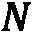 和样本间距决定，在这个例子中，样本间距存储在 `sample_d` 中。

在频率  处的 PSD 由以下公式给出：


这里，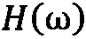 代表了信号在频率  处的傅里叶变换（FT）。功率谱密度（PSD）衡量了各个频率对整体信号的贡献，这也是我们在大约 4 和 7 频率处看到峰值的原因。由于 Python 的索引允许我们使用负数索引来访问从序列末尾开始的元素，我们可以使用正索引数组来获取 `spectrum` 中的正频率和负频率元素。

在步骤 9 中，我们识别出了在图中峰值高于 2000 的两个频率的索引。这些索引对应的频率是 3.984375 和 6.97265625，虽然它们与 4 和 7 不完全相同，但非常接近。造成这种差异的原因是我们使用有限数量的采样点来对连续信号进行采样。（使用更多的点当然会得到更好的近似值。）

在步骤 11 中，我们取了逆 FFT 返回数据的实部。这是因为，从技术上讲，FFT 处理的是复数数据。由于我们的数据仅包含实数数据，我们预计这个新信号也应该只包含实数数据。然而，由于某些小误差，结果并非完全是实数。我们可以通过取逆 FFT 的实部来解决这个问题。这是合适的，因为我们可以看到虚部非常小。

我们可以在 *图 3.9* 中看到，经过滤波的信号与真实信号非常接近，但并不完全相同。这是因为，如前所述，我们正在用相对较小的样本来近似一个连续信号。

## 还有更多…

在生产环境中，信号处理可能会使用专门的包，比如 `scipy` 中的 `signal` 模块，或者一些低级代码或硬件来执行信号的过滤或清理。这个示例更多是展示如何使用 FFT 作为处理从某种周期性结构（即信号）中采样的数据的工具。FFT 在求解偏微分方程时非常有用，例如在 *数值解偏微分方程* 配方中看到的热方程。

## 另见

关于随机数和正态分布（高斯分布）的更多信息可以参考 *第四章*，*随机性* 和 *概率*。

# 使用 JAX 进行自动求导和微积分

JAX 是一个由 Google 开发的线性代数和自动求导框架，专为机器学习（ML）设计。它结合了 **Autograd** 和其 **加速线性代数**（**XLA**）优化编译器的功能，处理线性代数和机器学习。特别地，它允许我们轻松构建复杂的函数，自动计算梯度，并能在 **图形处理单元**（**GPU**）或 **张量处理单元**（**TPU**）上运行。最重要的是，它相对易于使用。在本示例中，我们将看到如何利用 JAX 的 **即时编译**（**JIT**）编译器，计算一个函数的梯度，并使用不同的计算设备。

## 准备工作

对于本示例，我们需要安装 JAX 包。我们将使用 Matplotlib 包，并像往常一样通过 `pyplot` 接口导入为 `plt`。由于我们要绘制一个二元函数，我们还需要从 `mpl_toolkits` 包中导入 `mplot3d` 模块。

## 如何实现……

以下步骤展示了如何使用 JAX 定义一个 JIT 编译的函数，计算该函数的梯度，并使用 GPU 或 TPU 执行计算：

首先，我们需要导入我们将要使用的 JAX 库的部分模块：

```py
import jax.numpy as jnp
from jax import grad, jit, vmap
```

现在，我们可以定义我们的函数，并应用 `@jit` 装饰器，告诉 JAX 在必要时对这个函数进行 JIT 编译：

```py
@jit
def f(x, y):
    return jnp.exp(-(x**2 +y**2))
```

接下来，我们定义一个网格并绘制我们的函数：

```py
t = jnp.linspace(-1.0, 1.0)
x, y = jnp.meshgrid(t, t)
fig = plt.figure()
ax = fig.add_subplot(projection="3d")
ax.plot_surface(x, y, f(x, y), cmap="gray")
ax.set_title("Plot of the function f(x, y)")
ax.set_xlabel("x")
ax.set_ylabel("y")
ax.set_zlabel("z")
```

结果图如 *图 3.10* 所示：

![图 3.10 – 使用 JAX 计算的二元函数图]

](img/3.10.jpg)

图 3.10 – 使用 JAX 计算的二元函数图

现在，我们使用 `grad` 函数（以及 `jit` 装饰器）来定义两个新函数，分别是相对于第一个和第二个参数的偏导数：

```py
fx = jit(grad(f, 0))  # x partial derivative
fy = jit(grad(f, 1))  # y partial derivative
```

为了快速检查这些函数是否正常工作，我们在  处打印这些函数的值：

```py
print(fx(1., -1.), fy(1., -1.))
# -0.27067056 0.27067056
```

最后，让我们绘制相对于  的偏导数：

```py
zx = vmap(fx)(x.ravel(), y.ravel()).reshape(x.shape)
figpd = plt.figure()
axpd = figpd.add_subplot(projection="3d")
axpd.plot_surface(x, y, zx, cmap="gray")
axpd.set_title("Partial derivative with respect to x")
axpd.set_xlabel("x")
axpd.set_ylabel("y")
axpd.set_zlabel("z")
```

偏导数图如 *图 3.11* 所示：

![图 3.11 – 使用 JAX 自动求导计算的偏导数图]

](img/3.11.jpg)

图 3.11 – 使用 JAX 中的自动微分计算的函数的偏导数图

快速检查确认，这确实是函数相对于  的偏导数的图。

## 它是如何工作的…

JAX 是一个有趣的组合，结合了 JIT 编译器，专注于快速的线性代数操作，以及 Autograd 的强大功能，支持加速设备（以及我们这里没有使用的其他功能）。JIT 编译通过跟踪 JAX 版本的 NumPy 库上执行的线性代数操作，并构建一个可以被 XLA 编译器理解的函数的中间表示来工作。为了让这一切工作，你需要确保只使用 JAX 提供的 NumPy 模块（`jax.numpy`），而不是*真正的* NumPy。JAX 还提供了 SciPy 包的版本。

这种方法的一个警告是，函数必须是*纯粹的*：它们不应该有超出返回值的副作用，并且不应依赖于任何未通过参数传递的数据。如果情况不是这样，它可能仍然有效，但你可能会得到意想不到的结果——记住，Python 版本的函数可能只会执行一次。另一个需要考虑的因素是，与 NumPy 数组不同，JAX NumPy 数组不能使用索引表示法和赋值进行就地更新。这个问题，以及其他几个当前重要的警告，都列在了 JAX 文档中（请参考以下部分，*另见...*）。

`jit` 装饰器指示 JAX 在适当的地方构建函数的编译版本。实际上，它可能会根据提供的参数类型生成多个编译版本（例如，针对标量值与数组值的不同编译函数）。

`grad` 函数接受一个函数并生成一个新函数，该函数计算相对于输入变量的导数。如果函数有多个输入变量，则这是相对于第一个参数的偏导数。第二个可选参数 `argnums` 用于指定计算哪些导数。在本例中，我们有一个两变量函数，并使用了 `grad(f, 0)` 和 `grad(f, 1)` 命令来获取表示 `f` 函数两个偏导数的函数。

`jax.numpy` 中的大多数函数与 `numpy` 中的接口相同——我们在本例中看到了一些这样的函数。不同之处在于，JAX 版本会根据使用的加速器设备正确地存储数组。如果使用 NumPy 数组的上下文，例如绘图函数，我们可以毫无问题地使用这些数组。

在示例的第 5 步中，我们打印了两个偏导数的值。请注意，我们使用了`1.`和`-1.`的值。重要的是要注意，使用整数等价物`1`和`-1`会失败，因为 JAX 处理浮点数的方式。（由于大多数 GPU 设备不善于处理双精度浮点数，JAX 中的默认浮点类型是`float32`。）

在第 6 步中，我们在与函数相同的区域上计算了导数。为此，我们必须将和数组展平，然后使用`vmap`函数对`fx`导数进行向量化，最后对结果进行重塑。`grad`的工作方式存在一个复杂性，这意味着`fx`不会以我们预期的方式进行向量化。

## 还有更多…

JAX 的设计考虑到需求变化时能够良好扩展，因此许多组件在设计时考虑了并发性。例如，随机数模块提供了一个能够有效分裂的随机数生成器，这样计算可以并发执行，而不会改变结果。例如，使用 Mersenne Twister 随机数生成器就无法实现这一点，因为它在统计上不可靠地*分裂*，并且可能会因为线程数量的不同而产生不同的结果。

## 另见

更多信息可以在 JAX 文档中找到：

[`jax.readthedocs.io/en/latest/`](https://jax.readthedocs.io/en/latest/)

# 使用 JAX 求解微分方程

JAX 提供了一套用于解决广泛问题的工具。求解微分方程——如在*数值求解简单微分方程*一节中描述的初值问题——应该完全在该库的能力范围之内。`diffrax`包提供了多种微分方程求解器，利用了 JAX 的强大功能和便利性。

在前面的示例中，我们解决了一个相对简单的一阶常微分方程。在本例中，我们将解决一个二阶常微分方程，以展示该技巧。**二阶常微分方程**是涉及一个函数的一级和二级导数的微分方程。为了简单起见，我们将求解以下形式的*线性*二阶常微分方程：


这里，是待求解的的函数。特别地，我们将求解以下方程：


初始条件是和。（请注意，这是一个二阶微分方程，因此我们需要两个初始条件。）

## 准备就绪

在开始求解方程之前，我们需要做一些纸上工作，将二阶方程化简为可以数值求解的一阶微分方程组。为此，我们做了替代，得到了  和 。通过这个替代，我们得到了如下的系统：


我们还得到初始条件  和 。

对于这个示例，我们需要安装 `diffrax` 包和 JAX。如往常一样，我们将 Matplotlib 的 `pyplot` 接口导入并指定别名为 `plt`。我们将 `jax.numpy` 导入并指定别名为 `jnp`，并导入 `diffrax` 包。

## 如何实现…

以下步骤展示了如何使用 JAX 和 `diffrax` 库来求解二阶线性微分方程：

首先，我们需要设置代表我们在 *准备工作* 部分中构建的常微分方程组的函数：

```py
def f(x, y, args):
    u = y[...,0]
    v = y[...,1]
    return jnp.array([v, 3*x**2*v+(1.-x)*u])
```

接下来，我们设置了将用于求解方程的 `diffrax` 环境。我们将使用 `diffrax` *快速入门指南* 中推荐的求解器 —— 详细内容请参见下面的 *另见* 部分。设置如下：

```py
term = diffrax.ODETerm(f)
solver = diffrax.Dopri5()
save_at = diffrax.SaveAt(ts=jnp.linspace(0., 1.))
y0 = jnp.array([0., 1.]) # initial condition
```

现在，我们使用 `diffrax` 中的 `diffeqsolve` 例程来求解区间  上的微分方程：

```py
solution = diffrax.diffeqsolve(term, solver, t0=0., t1=2.,
                               dt0=0.1, y0=y0, saveat=save_at)
```

现在我们已经求解了方程，接下来需要从 `solution` 对象中提取  的值：

```py
x = solution.ts
y = solution.ys[:, 0]  # first column is y = u
```

最后，我们将在新图中绘制结果：

```py
fig, ax = plt.subplots()
ax.plot(x, y, "k")
ax.set_title("Plot of the solution to the second order ODE")
ax.set_xlabel("x")
ax.set_ylabel("y")
```

结果图示如 *图 3**.12* 所示：


图 3.12 – 二阶线性常微分方程的数值解

我们可以看到，当  接近  时，解大致是线性的，但之后解变得非线性。（ 范围可能太小，无法看到该系统的有趣行为。）

## 它是如何工作的…

`diffrax` 是建立在 JAX 之上的，并提供了多种微分方程求解器。在这个示例中，我们使用了 Dormand-Prince 5(4) `Dopri5` 求解器类，这是另一种求解常微分方程的 Runge-Kutta 方法，类似于我们在早期示例中看到的 Runge-Kutta-Fehlberg 方法。

在幕后，`diffrax` 将常微分方程的初值问题转换为一个 `diffrax`，能够求解除这些简单常微分方程之外的其他类型的微分方程；该库的目标之一是为数值求解 **随机微分方程**（**SDEs**）提供工具。由于它是基于 JAX 的，应该很容易将其集成到其他 JAX 工作流中。它还支持通过各种伴随方法进行反向传播。

## 另见

更多关于 `diffrax` 库及其所包含方法的信息可以在文档中找到：

[`docs.kidger.site/diffrax`](https://docs.kidger.site/diffrax)

)

# 进一步阅读

微积分是每个本科数学课程中非常重要的一部分。有许多优秀的微积分教材，包括 Spivak 的经典教材和 Adams 与 Essex 的更全面的课程：

+   *Spivak, M.* (*2006*)。*微积分*。*第 3 版*。*剑桥：剑桥大学出版社*。

+   *Adams, R.* 和 *Essex, C.* (*2018*)。*微积分：完整课程*。*第 9 版*。*加拿大安大略省唐米尔斯：皮尔逊出版社*。

一个很好的数值微分和积分的来源是经典的*数值计算法*一书，它全面描述了如何在 C++中解决许多计算问题，并总结了相关理论：

+   *Press, W.*, *Teukolsky, S.*, *Vetterling, W* 和 *Flannery, B.* (*2007*)。*数值计算法：科学计算的艺术*。*第 3 版*。*剑桥：剑桥大学出版社*。
