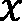
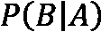
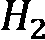

# 第四章：与随机性和概率打交道

在本章中，我们将讨论随机性和概率。我们将从简要探索概率的基本概念开始，通过从数据集中选择元素来学习概率。然后，我们将学习如何使用 Python 和 NumPy 生成（伪）随机数，并如何根据特定的概率分布生成样本。最后，我们将通过讨论一些高级主题，涵盖随机过程和贝叶斯技术，并使用**马尔科夫链蒙特卡洛**（**MCMC**）方法来估计简单模型的参数，来结束本章。

概率是对特定事件发生的可能性进行量化。我们经常直观地使用概率，尽管有时正式的理论可能相当违反直觉。概率论旨在描述*随机变量*的行为，随机变量的值未知，但该随机变量的值的概率会在已知的某些（范围的）值中取值。这些概率通常呈现为几种概率分布之一。可以说，最著名的概率分布之一是正态分布，它例如可以描述某一特征在一个大群体中的分布情况。

在*第六章*《数据与统计学应用》中，我们将再次讨论概率，并且将介绍统计学。在这里，我们将应用概率论来量化误差，并构建分析数据的系统化理论。

本章将涵盖以下实例：

+   随机选择项目

+   生成随机数据

+   更改随机数生成器

+   生成正态分布的随机数

+   与随机过程打交道

+   使用贝叶斯技术分析转化率

+   使用蒙特卡洛模拟估计参数

# 技术要求

本章需要使用标准的科学 Python 包：NumPy、Matplotlib 和 SciPy。我们还需要 PyMC 包来完成最终的实例。你可以通过你喜欢的包管理工具安装，比如`pip`：

```py
python3.10 -m pip install pymc
```

此命令将安装最新版本的 PyMC，目前版本为 4.0.1\。此包提供了概率编程功能，涉及通过随机生成的数据进行多次计算，以了解解决方案的可能分布。

注意

在上一版中，当前版本的 PyMC 是 3.9.2，但自那时以来，PyMC 4.0 版本已经发布，并且在此更新中名称恢复为 PyMC，而不是 PyMC3\。

本章的代码可以在 GitHub 仓库的`Chapter 04`文件夹中找到，链接：[`github.com/PacktPublishing/Applying-Math-with-Python-2nd-Edition/tree/main/Chapter%2004`](https://github.com/PacktPublishing/Applying-Math-with-Python-2nd-Edition/tree/main/Chapter%2004)。

# 随机选择项目

概率和随机性的核心思想是从某种集合中选择一个项目。正如我们所知道的，从集合中选择一个项目的概率量化了该项目被选择的可能性。随机性描述了根据概率从集合中选择项目，而没有任何额外的偏差。随机选择的对立面可以被描述为*确定性*选择。一般来说，使用计算机复制一个纯随机过程是非常困难的，因为计算机及其处理本质上是确定性的。然而，我们可以生成伪随机数序列，当这些序列正确构造时，能够展示出一个合理的随机性近似。

在本配方中，我们将从一个集合中选择项目，并学习一些与概率和随机性相关的关键术语，这些术语将在本章中贯穿始终。

## 准备工作

Python 标准库包含一个用于生成（伪）随机数的模块，叫做 `random`，但在本配方和整个章节中，我们将使用 NumPy 的 `random` 模块。NumPy `random` 模块中的例程可以用于生成随机数数组，并且比标准库中的相应模块更具灵活性。像往常一样，我们会使用 `np` 别名导入 NumPy。

在继续之前，我们需要固定一些术语。**样本空间**是一个集合（一个没有重复元素的集合），**事件**是样本空间的一个子集。**事件**发生的**概率**用  表示，记作 ，它是一个介于 0 和 1 之间的数字。概率为 0 表示事件永远不会发生，而概率为 1 表示事件肯定会发生。整个样本空间的概率必须为 1。

当样本空间是离散的时，概率只是介于 0 和 1 之间的数字，关联到每个元素，其中所有这些数字的总和为 1。这样就给出了从一个集合中选择单个项目（一个包含单一元素的事件）的概率的意义。我们将在这里考虑从离散集合中选择项目的方法，并将在*生成正态分布的随机* *数*的配方中处理*连续*的情况。

## 如何做...

执行以下步骤从容器中随机选择项目：

1.  第一步是设置随机数生成器。此时，我们将使用 NumPy 的默认随机数生成器，这在大多数情况下都是推荐的。我们可以通过调用 NumPy `random` 模块中的 `default_rng` 例程来实现，这将返回一个随机数生成器实例。我们通常在不指定种子的情况下调用这个函数，但在本配方中，我们将添加一个 `12345` 种子，以便使我们的结果具有可重复性：

    ```py
    rng = np.random.default_rng(12345) 
    ```

    ```py
    # changing seed for repeatability
    ```

1.  接下来，我们需要创建要选择的数据和概率。如果你已经存储了数据，或者希望选择具有相等概率的元素，可以跳过此步骤：

    ```py
    data = np.arange(15)
    ```

    ```py
    probabilities = np.array(
    ```

    ```py
         [0.3, 0.2, 0.1, 0.05, 0.05, 0.05, 0.05, 0.025,
    ```

    ```py
         0.025, 0.025, 0.025, 0.025, 0.025, 0.025, 0.025]
    ```

    ```py
    )
    ```

作为快速的基本检查，我们可以使用断言来检查这些概率的和确实为 1：

```py
assert round(sum(probabilities), 10) == 1.0,
    "Probabilities must sum to 1"
```

现在，我们可以在随机数生成器 `rng` 上使用 `choice` 方法，根据刚才创建的概率从 `data` 中选择样本。对于这个选择，我们希望开启替换，因此多次调用该方法可以从整个 `data` 中进行选择：

```py
selected = rng.choice(data,p=probabilities,replace=True)

```

要从 `data` 中选择多个项目，我们还可以提供 `size` 参数，指定要选择的数组形状。这个参数和其他 NumPy 数组创建函数中的 `shape` 关键字参数起到相同的作用。提供给 `size` 的参数可以是一个整数，也可以是一个整数元组：

```py
selected_array = rng.choice(data, p=probabilities,  replace=True, size=(5, 5))
#array([[ 1, 6, 4, 1, 1],
#         [ 2, 0, 4, 12, 0],
#         [12, 4, 0, 1, 10],
#         [ 4, 1, 5, 0, 0],
#         [ 0, 1, 1, 0, 7]])
```

我们可以看到，在采样数据中，0 和 1 的出现次数似乎更多，我们分别为其分配了 0.3 和 0.2 的概率。有趣的是，尽管 12 出现的概率是 2 的一半，结果我们只看到了一个 2，而出现了两个 12。这并不是问题；较大的概率并不保证某个特定数字在样本中出现的次数，只有在大量样本中，我们才会预期大约看到两倍于 12 的 2。

## 它是如何工作的…

`default_rng` 函数创建了一个新的 `random` 模块。然而，通常建议显式地使用 `default_rng` 创建生成器，或者自己创建一个 `Generator` 实例。以这种方式更加明确，这也更符合 Python 的风格，并且应该能产生更可重复的结果（在某种程度上）。

**种子**是传递给随机数生成器的一个值，用于生成随机值。生成器基于种子以完全确定的方式生成数字序列。这意味着，如果提供相同的种子，两个相同的 PRNG 实例将生成相同的随机数序列。如果没有提供种子，生成器通常会生成一个依赖于用户系统的种子。

`Generator` 类是 NumPy 中一个对低级伪随机比特生成器的封装，实际的随机数就是在这里生成的。在 NumPy 的最新版本中，默认的 PRNG 算法是 128 位的*置换同余生成器*。相比之下，Python 内置的 `random` 模块使用的是梅森旋转算法 PRNG。有关不同 PRNG 算法选项的更多信息，请参阅*更改随机数* *生成器*的食谱。

`Generator`实例上的`choice`方法根据底层`BitGenerator`生成的随机数进行选择。可选的`p`关键字参数指定了与提供的数据中每个项目相关的概率。如果没有提供此参数，则假定*均匀概率*，即每个项目被选中的概率相等。`replace`关键字参数指定选择是否应有放回或无放回。我们启用了放回选项，以便同一个元素可以被选中多次。`choice`方法使用生成器提供的随机数来进行选择，这意味着两个使用相同种子并且类型相同的伪随机数生成器（PRNG）在使用`choice`方法时会选中相同的项目。

从*袋子*中选择可能的点是理解**离散概率**的一个好方法。在这里，我们为每个有限数量的点分配一个特定的权重——例如，点数的倒数——这些权重的总和为 1。采样是根据概率分配的权重随机选择点的过程（我们也可以为无限集合分配离散概率，但这会更复杂，因为权重必须总和为 1，并且这在计算上也不实用）。

## 还有更多...

`choice`方法还可以通过传递`replace=False`参数来创建指定大小的随机样本。这可以确保从数据中选择不同的项目，这对于生成随机样本非常有用。例如，可能会用它来从整个用户组中选择用户来测试新版本的界面；大多数样本统计技术依赖于随机选择的样本。

# 生成随机数据

许多任务涉及生成大量的随机数，这些随机数在最基本的形式下，可能是整数或浮动精度（双精度）的浮点数，范围在  之间。理想情况下，这些数字应该均匀选择，这样如果我们绘制大量这些数字，它们将在范围  内大致均匀分布。

在这个食谱中，我们将展示如何使用 NumPy 生成大量随机整数和浮点数，并通过直方图展示这些数字的分布。

## 准备工作

在开始之前，我们需要从 NumPy 的`random`模块导入`default_rng`方法，并创建一个默认的随机数生成器实例来在食谱中使用：

```py
from numpy.random import default_rng
rng = default_rng(12345) # changing seed for reproducibility
```

我们在*随机选择项目*食谱中已经讨论过这个过程。

我们还通过`plt`别名导入了 Matplotlib 的`pyplot`模块。

## 如何操作...

执行以下步骤以生成均匀的随机数据并绘制直方图以理解其分布：

1.  要生成介于 0 和 1 之间的随机浮点数（包括 0 但不包括 1），我们使用`rng`对象上的`random`方法：

    ```py
    random_floats = rng.random(size=(5, 5))
    ```

    ```py
    # array([[0.22733602, 0.31675834, 0.79736546, 0.67625467, 0.39110955],
    ```

    ```py
    #           [0.33281393, 0.59830875, 0.18673419, 0.67275604, 0.94180287],
    ```

    ```py
    #           [0.24824571, 0.94888115, 0.66723745, 0.09589794, 0.44183967],
    ```

    ```py
    #           [0.88647992, 0.6974535 , 0.32647286, 0.73392816, 0.22013496],
    ```

    ```py
    #           [0.08159457, 0.1598956 , 0.34010018, 0.46519315, 0.26642103]])
    ```

1.  要生成随机整数，我们使用 `rng` 对象上的 `integers` 方法。这样会返回指定范围内的整数：

    ```py
    random_ints = rng.integers(1, 20, endpoint=True, size=10)
    ```

    ```py
    # array([12, 17, 10, 4, 1, 3, 2, 2, 3, 12])
    ```

1.  为了检查随机浮点数的分布，我们首先需要生成一个大数组的随机数，正如我们在*步骤 1*中所做的那样。虽然这并不是严格必要的，但较大的样本能更清楚地显示分布。我们按以下方式生成这些数字：

    ```py
    dist = rng.random(size=1000)
    ```

1.  为了显示我们生成的数字的分布，我们绘制了数据的*直方图*：

    ```py
    fig, ax = plt.subplots()
    ```

    ```py
    ax.hist(dist, color="k", alpha=0.6)
    ```

    ```py
    ax.set_title("Histogram of random numbers")
    ```

    ```py
    ax.set_xlabel("Value")
    ```

    ```py
    ax.set_ylabel("Density")
    ```

结果的图形如*图 4.1*所示。正如我们所看到的，数据在整个范围内大致均匀分布：


](img/4.2.jpg)

图 4.1 – 随机生成的介于 0 和 1 之间的随机数的直方图

随着采样点数量的增加，我们预计这些条形图会“平整”并越来越像我们期望的均匀分布的平线。可以将其与*图 4.2*中的 10,000 个随机点的直方图进行比较：


](img/4.1.jpg)

图 4.2 – 10,000 个均匀分布的随机数的直方图

我们可以看到，尽管分布并不是完全平坦的，但在整个范围内分布更加均匀。

## 它是如何工作的...

`Generator` 接口提供了三个简单的方法来生成基本的随机数，但不包括我们在*随机选择项目*一节中讨论的 `choice` 方法。除了用于生成随机浮点数的 `random` 方法和用于生成随机整数的 `integers` 方法外，还有一个用于生成原始随机字节的 `bytes` 方法。这些方法都会调用底层 `BitGenerator` 实例的相关方法。每个方法还可以改变生成的数字的数据类型，例如，从双精度浮点数变为单精度浮点数。

## 还有更多...

`Generator` 类上的 `integers` 方法通过添加 `endpoint` 可选参数，结合了旧版 `RandomState` 接口中的 `randint` 和 `random_integers` 方法的功能（在旧版接口中，`randint` 方法排除了上限，而 `random_integers` 方法包括了上限）。`Generator` 上的所有随机数据生成方法都允许定制生成数据的数据类型，这在旧接口中是无法做到的（该接口在 NumPy 1.17 中引入）。

在*图 4.1*中，我们可以看到我们生成的数据的直方图在范围内大致均匀分布 。也就是说，所有的条形图大致平齐（由于数据的随机性质，它们不会完全平齐）。这是我们期望的均匀分布随机数的特征，比如通过`random`方法生成的随机数。我们将在*生成正态分布随机数*的食谱中更详细地解释随机数的分布。

# 更换随机数生成器

NumPy 中的`random`模块提供了多个备用的伪随机数生成器，它们的默认 PRNG 使用 128 位置换同余生成器。虽然这是一个很好的通用随机数生成器，但它可能不足以满足你的特定需求。例如，这种算法与 Python 内部随机数生成器使用的算法差异很大。我们将遵循 NumPy 文档中设定的最佳实践指南，进行可重复但适当随机的仿真运行。

在这个食谱中，我们将向你展示如何切换到备用的伪随机数生成器（PRNG），以及如何在程序中有效地使用种子。

## 准备工作

像往常一样，我们通过`np`别名导入 NumPy。由于我们将使用`random`包中的多个项目，我们也通过以下代码从 NumPy 导入该模块：

```py
from numpy import random
```

你需要选择 NumPy 提供的一个备用随机数生成器（或者定义你自己的；请参阅本食谱中的*还有更多...*部分）。在这个食谱中，我们将使用`MT19937`随机数生成器，它使用基于梅森旋转算法的生成器，类似于 Python 内部的随机数生成器所使用的算法。

## 如何操作...

以下步骤展示了如何以可重复的方式生成种子和不同的随机数生成器：

1.  我们将生成一个`SeedSequence`对象，该对象可以从给定的熵源可重复地生成新的种子。我们可以像提供`default_rng`的种子一样，提供我们自己的整数作为熵，或者我们也可以让 Python 从操作系统收集熵。这里我们选择后一种方法来演示它的使用。为此，我们在创建`SeedSequence`对象时不提供任何额外的参数：

    ```py
    seed_seq = random.SeedSequence()
    ```

1.  现在我们有了为整个会话生成随机数生成器种子的手段，接下来记录熵，以便以后在必要时能够重现这个会话。以下是熵的示例；你的结果可能会有所不同：

    ```py
    print(seed_seq.entropy)
    ```

    ```py
    # 9219863422733683567749127389169034574
    ```

1.  现在，我们可以创建底层的`BitGenerator`实例，它将为包装的`Generator`对象提供随机数：

    ```py
    bit_gen = random.MT19937(seed_seq)
    ```

1.  接下来，我们围绕这个`BitGenerator`实例创建一个包装的`Generator`对象，从而生成一个可用的随机数生成器：

    ```py
    rng = random.Generator(bit_gen)
    ```

一旦创建，你就可以像我们在之前的食谱中看到的那样使用这个随机数生成器。

## 它是如何工作的...

如在 *随机选择项* 食谱中提到的，`Generator` 类是一个封装底层 `BitGenerator` 的类，后者实现了给定的伪随机数算法。NumPy 通过 `BitGenerator` 类的各种子类提供了几种伪随机数算法的实现：`PCG64`（默认）；`MT19937`（如本食谱所示）；`Philox`；和 `SFC64`。这些位生成器是在 Cython 中实现的。

`PCG64` 生成器应提供高性能的随机数生成，并且具有良好的统计质量（在 32 位系统上可能不是这样）。`MT19937` 生成器比更现代的伪随机数生成器要慢，并且生成的随机数不具有良好的统计属性。然而，这是 Python 标准库 `random` 模块使用的随机数生成算法。`Philox` 生成器相对较慢，但生成的随机数质量非常高，而 `SFC64` 生成器速度较快，质量也相对较好，但其统计属性不如其他生成器。

本食谱中创建的 `SeedSequence` 对象是一种以独立且可重复的方式为随机数生成器创建种子的方法。特别是，如果你需要为多个并行进程创建独立的随机数生成器，但仍需要能够在稍后重建每个会话以调试或检查结果时，这非常有用。该对象上存储的熵是一个 128 位整数，来自操作系统，并作为随机种子的来源。

`SeedSequence` 对象允许我们为每个独立的进程或线程创建一个独立的随机数生成器，从而消除可能导致结果不可预测的数据竞争问题。它还生成彼此非常不同的种子值，这有助于避免一些伪随机数生成器（例如 `MT19937`，它可能会使用两个相似的 32 位整数种子值生成非常相似的流）的问题。显然，当我们依赖这些值的独立性时，拥有两个生成相同或非常相似值的独立随机数生成器会导致问题。

## 还有更多...

`BitGenerator` 类作为生成原始随机整数的生成器的通用接口。前面提到的类是在 NumPy 中实现的，并采用 `BitGenerator` 接口。你也可以创建自己的 `BitGenerator` 子类，尽管这需要在 Cython 中实现。

注意

有关更多信息，请参考 NumPy 文档 [`numpy.org/devdocs/reference/random/extending.html#new-bit-generators`](https://numpy.org/devdocs/reference/random/extending.html#new-bit-generators)。

# 生成正态分布的随机数

在*生成随机数据*的示例中，我们生成了遵循均匀分布（在 0 和 1 之间，但不包括 1）的随机浮点数。然而，在大多数需要随机数据的情况下，我们需要遵循几种不同的**分布**之一。粗略来说，**分布函数**是一个函数，，它描述了一个随机变量的值小于的概率。从实际应用上讲，分布描述了随机数据在一个范围内的分布情况。特别地，如果我们绘制一个遵循特定分布的数据的直方图，那么它应该大致与该分布函数的图形相似。通过实例来看，这一点最为明显。

最常见的分布之一是**正态分布**，它在统计学中经常出现，并且是我们在*第六章*《与数据和统计一起工作》中的许多统计方法的基础。在这个示例中，我们将展示如何生成遵循正态分布的数据，并绘制该数据的直方图，以查看分布的形态。

## 准备工作

与*生成随机数据*示例一样，我们从 NumPy 的`random`模块中导入`default_rng`函数，并创建一个带有种子生成器的`Generator`实例用于演示：

```py
from numpy.random import default_rng
rng = default_rng(12345)
```

像往常一样，我们导入 Matplotlib 的`pyplot`模块为`plt`，并导入 NumPy 为`np`。

## 如何实现...

在接下来的步骤中，我们生成遵循正态分布的随机数据：

1.  我们使用`Generator`实例上的`normal`方法生成符合`normal`分布的随机数据。正态分布有两个*参数*：*位置*和*尺度*。还有一个可选的`size`参数，用于指定生成数据的形状（有关`size`参数的更多信息，请参阅*生成随机数据*示例）。我们生成一个包含 10,000 个值的数组，以获得一个合理大小的样本：

    ```py
    mu = 5.0 # mean value
    ```

    ```py
    sigma = 3.0 # standard deviation
    ```

    ```py
    rands = rng.normal(loc=mu, scale=sigma, size=10000)
    ```

1.  接下来，我们绘制这个数据的直方图。我们增加了直方图中的`bins`数量。这并非严格必要，因为默认数量（10）已经足够，但它确实能稍微更好地展示数据分布：

    ```py
    fig, ax = plt.subplots()
    ```

    ```py
    ax.hist(rands, bins=20, color="k", alpha=0.6)
    ```

    ```py
    ax.set_title("Histogram of normally distributed data")
    ```

    ```py
    ax.set_xlabel("Value")
    ```

    ```py
    ax.set_ylabel("Density")
    ```

1.  接下来，我们创建一个函数，生成一系列值的预期密度。这是通过将正态分布的概率密度函数与样本数量（10,000）相乘来实现的：

    ```py
    def normal_dist_curve(x):
    ```

    ```py
        return 10000*np.exp(
    ```

    ```py
            -0.5*((x-mu)/sigma)**2)/(sigma*np.sqrt(2*np.pi))
    ```

1.  最后，我们将预期分布与数据的直方图一起绘制：

    ```py
    x_range = np.linspace(-5, 15)
    ```

    ```py
    y = normal_dist_curve(x_range)
    ```

    ```py
    ax.plot(x_range, y, "k--")
    ```

结果如*图 4.3*所示。我们可以看到，样本数据的分布与正态分布曲线预期的分布非常接近：


图 4.3 – 从正态分布中抽取的数据的直方图，叠加了预期密度

再次强调，如果我们取更大更大的样本，我们会预期样本的粗糙度会开始平滑并接近预期的密度（如*图 4.3*中的虚线所示）。

## 它是如何工作的...

正态分布的概率密度函数由以下公式定义：


这与正态分布函数相关，，根据以下公式：


这个概率密度函数在均值处达到峰值，该均值与位置参数一致，而*钟形曲线*的宽度由尺度参数决定。我们可以在*图 4.3*中看到，`Generator`对象上使用`normal`方法生成的数据的直方图与预期分布非常吻合。

`Generator`类使用 256 步锯齿法生成正态分布的随机数据，这比 NumPy 中其他可用的 Box-Muller 或逆 CDF 实现要快。

## 还有更多...

正态分布是*连续*概率分布的一个例子，因为它是为实数定义的，且分布函数由积分（而非求和）定义。正态分布（以及其他连续概率分布）的一个有趣特性是，选择任何给定实数的概率为 0。这是合理的，因为只有在测量一个值是否位于给定范围内时，才有意义去计算这个分布中选中该值的概率。

正态分布在统计学中非常重要，主要得益于*中心极限定理*。简而言之，这个定理指出，具有共同均值和方差的**独立同分布**（**IID**）随机变量的和，最终将趋近于一个具有共同均值和方差的正态分布。无论这些随机变量的实际分布如何，这一结论始终成立。这使得我们在许多情况下，即使变量的实际分布不一定是正态分布，仍然可以使用基于正态分布的统计检验（但我们在引用中心极限定理时需要非常谨慎）。

除了正态分布之外，还有许多其他连续概率分布。我们已经遇到过 0 到 1 范围内的*均匀*分布。更一般地，均匀分布在范围内，其概率密度函数由以下方程给出：


其他常见的连续概率密度函数包括*指数*分布、*贝塔*分布和*伽马*分布。每种分布在`Generator`类中都有对应的方法，用来从该分布生成随机数据。这些方法通常根据分布的名称命名，全部使用小写字母，因此对于上述分布，对应的方法是`exponential`、`beta`和`gamma`。这些分布每个都有一个或多个*参数*，例如正态分布的地点和尺度参数，它们决定了分布的最终形状。你可能需要查阅 NumPy 文档（[`numpy.org/doc/1.18/reference/random/generator.html#numpy.random.Generator`](https://numpy.org/doc/1.18/reference/random/generator.html#numpy.random.Generator)）或其他资料，以了解每种分布所需的参数。NumPy 文档还列出了可以生成随机数据的概率分布。

# 处理随机过程

在这个教程中，我们将探讨一个简单的随机过程示例，它模拟了公交车到达一个站点的数量随时间的变化。这个过程被称为**泊松过程**。泊松过程，，有一个单一的参数，，通常被称为*强度*或*速率*，且在给定时间，取值的概率由以下公式给出：


这个方程描述了到时间为止，辆公交车已经到达的概率。从数学上讲，这个方程意味着服从参数为的泊松分布。然而，有一种简单的方法可以通过对服从指数分布的到达间隔时间求和来构建泊松过程。例如，设为第()-次到达和第-次到达之间的时间，这些时间服从参数为的指数分布。现在，我们得到以下方程：


这里，数字是最大值，使得。这是我们将在这个教程中逐步构建的内容。我们还将通过取到达间隔时间的均值来估计这个过程的强度。

## 准备工作

在开始之前，我们从 NumPy 的`random`模块中导入`default_rng`函数，并创建一个新的随机数生成器，并为演示目的设置种子：

```py
from numpy.random import default_rng
rng = default_rng(12345)
```

除了随机数生成器外，我们还导入了 NumPy 库作为`np`，并将 Matplotlib 的`pyplot`模块导入为`plt`。我们还需要确保安装了 SciPy 库。

## 如何操作…

以下步骤展示了如何使用泊松过程模拟公交车的到达：

1.  我们的第一项任务是通过从指数分布中采样数据来创建样本到达时间间隔。NumPy `Generator`类中的`exponential`方法需要一个`scale`参数，公式为 ，其中  是速率。我们选择速率为 4，并创建 50 个样本到达时间间隔：

    ```py
    rate = 4.0
    ```

    ```py
    inter_arrival_times = rng.exponential(
    ```

    ```py
        scale=1./rate, size=50)
    ```

1.  接下来，我们使用 NumPy `add`通用函数的`accumulate`方法计算实际到达时间。我们还创建了一个包含整数 0 到 49 的数组，表示每个时刻的到达次数：

    ```py
    arrivals = np.add.accumulate(inter_arrival_times)
    ```

    ```py
    count = np.arange(50)
    ```

1.  接下来，我们使用`step`绘图方法绘制到达次数随时间变化的图：

    ```py
    fig1, ax1 = plt.subplots()
    ```

    ```py
    ax1.step(arrivals, count, where="post")
    ```

    ```py
    ax1.set_xlabel("Time")
    ```

    ```py
    ax1.set_ylabel("Number of arrivals")
    ```

    ```py
    ax1.set_title("Arrivals over time")
    ```

结果如*图 4.4*所示，在图中每条水平线的长度表示到达时间间隔：


图 4.4 – 随时间变化的到达次数，且时间间隔服从指数分布

1.  接下来，我们定义一个函数，用于评估单位时间内的计数概率分布，这里我们取`1`作为单位时间。这个函数使用了我们在本配方介绍中给出的泊松分布公式：

    ```py
    def probability(events, time=1, param=rate):
    ```

    ```py
        return ((param*time)**events/factorial(
    ```

    ```py
            events))*np.exp(- param*time)
    ```

1.  现在，我们绘制单位时间内的计数概率分布，因为在之前的步骤中我们选择了`time=1`。我们将在后续的步骤中继续完善这个图：

    ```py
    fig2, ax2 = plt.subplots()
    ```

    ```py
    ax2.plot(N, probability(N), "k", label="True distribution")
    ```

    ```py
    ax2.set_xlabel("Number of arrivals in 1 time unit")
    ```

    ```py
    ax2.set_ylabel("Probability")
    ```

    ```py
    ax2.set_title("Probability distribution")
    ```

1.  现在，我们继续通过样本数据估计速率。我们通过计算到达时间间隔的均值来实现这一点，对于指数分布来说，均值是尺度参数  的估计值：

    ```py
    estimated_scale = np.mean(inter_arrival_times)
    ```

    ```py
    estimated_rate = 1.0/estimated_scale
    ```

1.  最后，我们绘制基于这个估计速率的单位时间内计数的概率分布。我们将其绘制在我们在*步骤 5*中得到的真实概率分布之上：

    ```py
    ax2.plot(N, probability(
    ```

    ```py
        N, param=estimated_rate),
    ```

    ```py
        "k--",label="Estimated distribution")
    ```

    ```py
    ax2.legend()
    ```

结果图如*图 4.5*所示，在图中我们可以看到，除了一个小的偏差，估计的分布与真实分布非常接近：


图 4.5 – 每单位时间到达次数的分布，估计值与真实值

*图 4.5*中展示的分布遵循了本配方介绍中描述的泊松分布。你可以看到，单位时间内的适中到达次数比大量到达次数更为常见。最可能的到达次数由速率参数  确定，在这个例子中速率为 4.0。

## 工作原理...

随机过程无处不在。大致来说，随机过程是相关随机变量的系统，通常根据时间对连续随机过程进行索引 ，或根据自然数对离散随机过程进行索引 。许多（离散）随机过程满足**马尔可夫性质**，这使它们成为**马尔可夫链**。马尔可夫性质的表述是，过程是*无记忆的*，即只有当前值对于下一个值的概率是重要的。

泊松过程是一种计数过程，用于计算在一段时间内发生的事件（例如公交车到达）的数量，前提是事件在时间上是随机分布的，并且具有固定参数的指数分布。我们通过从指数分布中抽样到达间隔时间来构建泊松过程，遵循我们在介绍中描述的构建方法。然而，事实证明，这一特性（即到达间隔时间是指数分布的）是所有泊松过程的属性，当它们按照概率的正式定义给出时。

在这个方法中，我们从具有给定`rate`参数的指数分布中抽取了 50 个点。我们必须做一个小的转换，因为 NumPy 的`Generator`方法用于从指数分布中抽样时，使用的是相关的`scale`参数，它是`1`除以`rate`参数。拿到这些点后，我们创建一个包含这些指数分布数值的累积和的数组。这就生成了我们的到达时间。实际的泊松过程是*图 4**.4*中显示的过程，它是到达时间与在该时间点发生的事件数量的组合。

指数分布的均值（期望值）与尺度参数相同，因此从指数分布中抽取样本的均值是一种估计尺度（`rate`）参数的方法。这个估计不会是完美的，因为我们的样本相对较小。这就是为什么在*图 4**.5*中的两幅图之间存在小的偏差。

## 还有更多内容...

随机过程有很多种类型，用于描述各种各样的现实场景。在这个方法中，我们使用泊松过程对到达时间进行了建模。泊松过程是一个连续随机过程，这意味着它是由一个连续变量  参数化的，而不是由一个离散变量  参数化的。泊松过程实际上是马尔可夫链，按照对马尔可夫链的适当推广定义，也是一种*更新过程*的例子。更新过程是描述在一段时间内发生的事件数量的过程。这里描述的泊松过程就是更新过程的一个例子。

许多马尔可夫链除了满足其定义的马尔可夫性质外，还满足一些其他性质。例如，如果下列等式对所有、和值成立，则该马尔可夫链是*齐次的*：


简单来说，这意味着随着我们增加步骤数，从一个状态到另一个状态的单步转移概率不会改变。这对于检查马尔可夫链的长期行为非常有用。

构建简单的均匀马尔可夫链非常容易。假设我们有两个状态，和。在任何给定的步骤中，我们可以处于状态或状态之一。我们根据一定的概率在这些状态之间移动。例如，假设从状态到状态的转移概率为 0.4，从状态到状态的转移概率为 0.6。同样，假设从状态到状态的转移概率为 0.2，从状态到状态的转移概率为 0.8。请注意，在这两种情况下，转移的概率和保持相同状态的概率之和都为 1。我们可以用矩阵形式表示从每个状态转移的概率，在这种情况下，使用以下方程：


这个矩阵叫做*转移矩阵*。这里的思路是，经过一步后处于特定状态的概率是通过将包含状态和（分别是位置 0 和 1）的概率的向量相乘得到的。例如，如果我们从状态开始，则概率向量在索引 0 处为 1，在索引 1 处为 0。那么，经过一步后处于状态的概率为 0.4，处于状态的概率为 0.6。这是我们之前概述的概率所预期的结果。然而，我们也可以使用矩阵公式来写出这个计算：


要获取经过两步后处于任一状态的概率，我们再次将右侧向量与转移矩阵相乘，得到如下结果：


我们可以将这个过程继续进行*无限次*，以获得一系列状态向量，这些向量构成了我们的马尔可夫链。如果需要，可以通过增加更多的状态来应用这一构建方法，用以建模许多简单的现实世界问题。

# 使用贝叶斯技术分析转化率

贝叶斯概率允许我们通过考虑数据系统地更新我们对情况的理解（从概率的角度）。用更技术化的语言来说，我们使用数据更新*先验*分布（我们的当前理解），以获得*后验*分布。例如，在研究用户浏览网站后购买产品的比例时，这非常有用。我们从先验信念分布开始。为此，我们将使用*beta*分布，它根据观察到的成功次数（完成购买）与失败次数（未购买）来模拟成功的概率。在这个示例中，我们假设我们的先验信念是我们期望在 100 次浏览中有 25 次成功（75 次失败）。这意味着我们的先验信念遵循 beta(25, 75)分布。假设我们想计算真实成功率至少为 33%的概率。

我们的方法大致分为三个步骤。首先，我们需要理解我们对转化率的先验信念，我们已经决定它遵循 beta(25, 75)分布。通过对先验分布的概率密度函数从 0.33 到 1 进行数值积分，我们计算出转化率至少为 33%的概率。接下来的步骤是应用贝叶斯推理，通过新的信息更新我们的先验信念。然后，我们可以对后验（更新后的）信念进行相同的积分，查看在此新信息下转化率至少为 33%的概率。

在本示例中，我们将展示如何使用贝叶斯技术基于新信息更新我们假设网站的先验信念。

## 准备工作

和往常一样，我们需要导入 NumPy 和 Matplotlib 包，分别命名为`np`和`plt`。我们还需要导入 SciPy 包，命名为`sp`。

## 如何操作...

以下步骤展示了如何使用贝叶斯推理估算和更新转化率估算：

1.  第一步是设置先验分布。为此，我们使用来自 SciPy `stats` 模块的`beta`分布对象，该对象提供了多种处理贝塔分布的方法。我们从`stats`模块导入`beta`分布对象，并将其命名为`beta_dist`，然后创建一个便捷函数，用于计算概率密度函数：

    ```py
    from scipy.stats import beta as beta_dist
    ```

    ```py
    beta_pdf = beta_dist.pdf
    ```

1.  接下来，我们需要计算在先验信念分布下，成功率至少为 33%的概率。为此，我们使用 SciPy `integrate`模块中的`quad`例程，该例程执行函数的数值积分。我们使用它来对先前步骤中导入的贝塔分布的概率密度函数进行积分，结合我们的先验参数。我们根据先验分布将概率打印到控制台：

    ```py
    prior_alpha = 25
    ```

    ```py
    prior_beta = 75
    ```

    ```py
    args = (prior_alpha, prior_beta)
    ```

    ```py
    prior_over_33, err = sp.integrate.quad(
    ```

    ```py
        beta_pdf, 0.33, 1, args=args)
    ```

    ```py
    print("Prior probability", prior_over_33)
    ```

    ```py
    # 0.037830787030165056
    ```

1.  现在，假设我们收到了关于新时间段内成功和失败的信息。例如，在这段时间内，我们观察到 122 次成功和 257 次失败。我们创建新的变量来反映这些值：

    ```py
    observed_successes = 122
    ```

    ```py
    observed_failures = 257
    ```

1.  要获得使用贝塔分布的后验分布的参数值，我们只需将观察到的成功次数和失败次数分别加到`prior_alpha`和`prior_beta`参数中：

    ```py
    posterior_alpha = prior_alpha + observed_successes
    ```

    ```py
    posterior_beta = prior_beta + observed_failures
    ```

1.  现在，我们重复数值积分，以计算使用后验分布（使用我们先前计算的参数）成功率现在是否超过 33%的概率。我们再次将此概率输出到终端：

    ```py
    args = (posterior_alpha, posterior_beta)
    ```

    ```py
    posterior_over_33, err2 = sp.integrate.quad(
    ```

    ```py
        beta_pdf, 0.33, 1, args=args)
    ```

    ```py
    print("Posterior probability", posterior_over_33)
    ```

    ```py
    # 0.13686193416281017
    ```

1.  我们可以看到，更新后的后验分布给出的新概率是 14%，而先验分布给出的概率是 4%。这是一个显著的差异，尽管根据这些值，我们仍然无法确信转化率超过 33%。现在，我们将先验和后验分布绘制出来，以可视化这种概率的增加。首先，我们创建一个值的数组，并基于这些值评估我们的概率密度函数：

    ```py
    p = np.linspace(0, 1, 500)
    ```

    ```py
    prior_dist = beta_pdf(p, prior_alpha, prior_beta)
    ```

    ```py
    posterior_dist = beta_pdf(
    ```

    ```py
        p, posterior_alpha, posterior_beta)
    ```

1.  最后，我们将*第 6 步*中计算的两个概率密度函数绘制到新的图表上：

    ```py
    fig, ax = plt.subplots()
    ```

    ```py
    ax.plot(p, prior_dist, "k--", label="Prior")
    ```

    ```py
    ax.plot(p, posterior_dist, "k", label="Posterior")
    ```

    ```py
    ax.legend()
    ```

    ```py
    ax.set_xlabel("Success rate")
    ```

    ```py
    ax.set_ylabel("Density")
    ```

    ```py
    ax.set_title("Prior and posterior distributions for success rate")
    ```

结果图如*图 4**.6*所示，我们可以看到后验分布比先验分布更加狭窄，并且集中在先验分布的右侧：


图 4.6 – 成功率的先验和后验分布，遵循贝塔分布

我们可以看到，后验分布在约 0.3 处达到峰值，但分布的大部分质量都集中在这个峰值附近。

## 它是如何工作的……

贝叶斯技术通过采取一个先验信念（概率分布），然后利用*贝叶斯定理*将先验信念与在该先验信念下我们的数据的可能性结合起来，从而形成一个后验（更新后的）信念。这类似于我们在现实生活中的理解方式。例如，当你在某天早上醒来时，可能会有一个信念（来自天气预报或其他途径），认为外面有 40%的机会下雨。打开窗帘后，你看到外面非常多云，这可能表明雨水的可能性更大，因此我们根据这个新数据更新我们的信念，认为下雨的机会是 70%。

要理解这个过程，我们需要了解*条件概率*。条件概率处理的是给定另一个事件已经发生的情况下，一个事件发生的概率。用符号表示，事件  在事件  已经发生的条件下发生的概率可以写作：


贝叶斯定理是一个强大的工具，可以用以下方式（符号化）表示：


概率  代表我们的先验信念。事件  代表我们已收集的数据，因此  是在我们的先验信念下，数据产生的可能性。概率  代表我们的数据产生的概率， 代表在给定数据后，我们的后验信念。实际上，概率  可能很难计算或估计，因此通常会将上面的强等式替换为贝叶斯定理的比例版本：


在这个例子中，我们假设我们的先验信念服从贝塔分布。贝塔分布的概率密度函数由以下公式给出：


这里， 是伽马函数。该似然性呈二项分布，其概率密度函数由以下公式给出：


这里， 是观察次数， 是成功的次数之一。在这个例子中，我们观察到  次成功和  次失败，这给出了  和 。为了计算后验分布，我们可以利用贝塔分布是二项分布的共轭先验这一事实，来观察贝叶斯定理的比例形式右侧是一个贝塔分布，参数为  和 。这就是我们在例子中使用的内容。贝塔分布作为二项随机变量的共轭先验，使其在贝叶斯统计中非常有用。

我们在这个例子中展示的方法是使用贝叶斯方法的一个相对基础的示例，但它仍然对我们在系统地获取新数据时更新先验信念非常有用。

## 还有更多…

贝叶斯方法可以用于各种任务，成为一个强大的工具。在这个例子中，我们使用贝叶斯方法根据我们对网站表现的先验信念和用户收集的额外数据来建模网站的成功率。这个例子比较复杂，因为我们将先验信念建模为贝塔分布。这里是另一个使用贝叶斯定理的例子，用简单的概率（介于 0 和 1 之间的数字）来检验两个竞争的假设。

假设你每天回家时都会把钥匙放在同一个地方，但有一天早晨你醒来发现钥匙不在这个地方。经过短暂的寻找后，你找不到它们，于是得出它们一定已经从这个世界消失的结论。我们称这个假设为。现在，无疑解释了数据，，即你找不到钥匙——因此，的可能性（如果你的钥匙消失了，那么你根本不可能找到它们）。另一个假设是你回家时把钥匙放到了别的地方。我们称这个假设为。现在，这个假设同样能解释数据，所以，但实际上，比更为可信。假设你的钥匙完全消失的概率是百万分之一——这显然是个过高的估计，但我们需要保持数字的合理性——而你估计你把它们放到别处的概率是千分之一。计算后验概率，我们得到如下结果：


这突显了这样一个现实：你丢失钥匙的可能性比它们消失的可能性要大 10,000 倍。果不其然，你很快就发现钥匙已经在你的口袋里，因为你早晨曾把它放进过那里。

# 使用蒙特卡洛模拟估计参数

蒙特卡洛方法广泛描述了利用随机抽样来解决问题的技术。当问题涉及某种不确定性时，这些技术尤其强大。一般方法包括执行大量模拟，每次根据给定的概率分布抽取不同的输入，然后汇总结果，从而比任何单一的样本解提供更好的真实解近似。

MCMC（马尔可夫链蒙特卡洛）是一种特定类型的蒙特卡洛模拟，在这种方法中，我们构造一个马尔可夫链，逐步得到我们所寻求的真实分布的更好的近似。这个过程通过基于精心选择的*接受概率*，在每个阶段接受或拒绝一个随机采样的拟议状态，目的是构造一个其唯一平稳分布恰好是我们想要找到的未知分布的马尔可夫链。

在这个例子中，我们将使用 PyMC 包和 MCMC 方法来估计一个简单模型的参数。该包将处理运行模拟的大部分技术细节，因此我们无需进一步深入了解不同 MCMC 算法的实际工作原理。

## 准备工作

如常，我们导入 NumPy 包和 Matplotlib 的 `pyplot` 模块，分别命名为 `np` 和 `plt`。我们还导入并创建一个默认的随机数生成器，使用种子来进行演示，代码如下：

```py
from numpy.random import default_rng
rng = default_rng(12345)
```

我们还需要 SciPy 包中的一个模块，以及 PyMC 包，它是一个用于概率编程的包。我们将 PyMC 包导入，并命名为 `pm`：

```py
import pymc as pm
```

让我们来看一下如何使用 PyMC 包来估计给定观测到的噪声样本的模型参数。

## 如何做到...

执行以下步骤，使用 MCMC 模拟来估计简单模型的参数，基于样本数据：

1.  我们的第一个任务是创建一个表示我们希望识别的基础结构的函数。在本例中，我们将估计一个二次方程（一个二次多项式）的系数。该函数接受两个参数，一个是固定的范围内的点，另一个是我们希望估计的变量参数：

    ```py
    def underlying(x, params):
    ```

    ```py
         return params[0]*x**2 + params[1]*x + params[2]
    ```

1.  接下来，我们设置 `true` 参数和 `size` 参数，这将决定我们生成的样本中有多少个点：

    ```py
    size = 100
    ```

    ```py
    true_params = [2, -7, 6]
    ```

1.  我们生成将用于估计参数的样本数据。这个样本由基础数据组成，基础数据是由我们在*步骤 1*中定义的 `underlying` 函数生成的，再加上一些符合正态分布的随机噪声。我们首先生成一个范围的  值，这些值在整个过程里保持不变，然后使用 `underlying` 函数和随机数生成器的 `normal` 方法来生成样本数据：

    ```py
    x_vals = np.linspace(-5, 5, size)
    ```

    ```py
    raw_model = underlying(x_vals, true_params)
    ```

    ```py
    noise = rng.normal(loc=0.0, scale=10.0, size=size)
    ```

    ```py
    sample = raw_model + noise
    ```

1.  在开始分析之前，最好先绘制采样数据，并将基础数据叠加在其上。我们使用 `scatter` 绘图方法仅绘制数据点（不连接线条），然后用虚线绘制基础的二次结构：

    ```py
    fig1, ax1 = plt.subplots()
    ```

    ```py
    ax1.scatter(x_vals, sample,
    ```

    ```py
        label="Sampled data", color="k", 
    ```

    ```py
        alpha=0.6)
    ```

    ```py
    ax1.plot(x_vals, raw_model,
    ```

    ```py
        "k--", label="Underlying model")
    ```

    ```py
    ax1.set_title("Sampled data")
    ```

    ```py
    ax1.set_xlabel("x")
    ```

    ```py
    ax1.set_ylabel("y")
    ```

结果是 *图 4.7*，在图中可以看到，即使存在噪声，基础模型的形状仍然可见，尽管该模型的确切参数已不再明显：


图 4.7 – 采样数据与基础模型叠加

1.  PyMC 编程的基本对象是 `Model` 类，通常使用上下文管理器接口来创建。我们还为参数创建了先验分布。在本例中，我们假设我们的先验参数服从均值为 1、标准差为 1 的正态分布。我们需要三个参数，因此提供了 `shape` 参数。`Normal` 类创建将用于蒙特卡洛模拟的随机变量：

    ```py
    with pm.Model() as model:
    ```

    ```py
        params = pm.Normal(
    ```

    ```py
            "params", mu=1, sigma=1, shape=3)
    ```

1.  我们为基础数据创建一个模型，可以通过将我们在*步骤 6*中创建的随机变量`param`传递给*步骤 1*中定义的`underlying`函数来完成。我们还创建了一个处理我们观测值的变量。为此，我们使用`Normal`类，因为我们知道我们的噪声在基础数据`y`周围呈正态分布。我们设置标准差为`2`，并将我们的观测`sample`数据传递给`observed`关键字参数（这也在`Model`上下文中）：

    ```py
    y = underlying(x_vals, params)
    ```

    ```py
    y_obs = pm.Normal("y_obs",
    ```

    ```py
        mu=y, sigma=2, observed=sample)
    ```

1.  为了运行模拟，我们只需要在`Model`上下文中调用`sample`例程。我们传递`cores`参数来加速计算，但保留所有其他参数为默认值：

    ```py
        trace = pm.sample(cores=4)
    ```

这些模拟应该执行起来很快。

1.  接下来，我们使用来自 PyMC 的`plot_posterior`例程绘制后验分布。该例程使用从采样步骤中获得的`trace`结果，我们已提前使用`plt.subplots`例程创建了自己的图形和坐标轴，但这不是严格必要的。我们在一个图形上使用了三个子图，并将`axs2`元组的`Axes`传递给绘图例程的`ax`关键字参数：

    ```py
    fig2, axs2 = plt.subplots(1, 3, tight_layout=True)
    ```

    ```py
    pm.plot_posterior(trace, ax=axs2, color="k")
    ```

结果的图示显示在*图 4**.8*中，您可以看到这些分布大致是正态分布，均值与真实参数值相似：


图 4.8 – 估计参数的后验分布

1.  现在，从`trace`结果中提取每个估计参数的均值。我们通过访问`trace`上的后验属性来获取估计的参数，然后对`params`项目使用`mean`方法（使用`axes=(0,1)`在所有链和所有样本上进行平均），并将其转换为 NumPy 数组。我们在终端中打印这些估计的参数：

    ```py
    estimated_params = trace.posterior["params"].mean(
    ```

    ```py
        axis=(0, 1)). to_numpy()
    ```

    ```py
    print("Estimated parameters", estimated_params)
    ```

    ```py
    # Estimated parameters [ 2.03220667 -7.09727509  5.27548983]
    ```

1.  最后，我们使用估计的参数生成我们的估计基础数据，通过将的值和估计的参数传递给*步骤 1*中定义的`underlying`函数。然后，我们将这个估计的基础数据与真实的基础数据一起绘制在同一坐标轴上：

    ```py
    estimated = underlying(x_vals, estimated_params)
    ```

    ```py
    fig3, ax3 = plt.subplots()
    ```

    ```py
    ax3.plot(x_vals, raw_model, "k", label="True model")
    ```

    ```py
    ax3.plot(x_vals, estimated, "k--", label="Estimated model")
    ```

    ```py
    ax3.set_title("Plot of true and estimated models")
    ```

    ```py
    ax3.set_xlabel("x")
    ```

    ```py
    ax3.set_ylabel("y")
    ```

    ```py
    ax3.legend()
    ```

结果的图示显示在*图 4**.9*中，在这个范围内，这两个模型之间只有一个小的差异：


图 4.9 – 真实模型和估计模型绘制在同一坐标轴上

在*图 4**.9*中，我们可以看到真实模型和估计模型之间存在一个小的差异。

## 它是如何工作的……

这个配方中有趣的部分可以在`Model`上下文管理器中找到。这个对象跟踪随机变量，协调模拟并保持状态。上下文管理器为我们提供了一种方便的方式来将概率变量与周围的代码分离。

我们从为表示参数的随机变量（共有三个）的分布提出先验分布开始。我们提出了正态分布，因为我们知道这些参数不能偏离值 1 太远（例如，通过查看我们在*步骤 4*中生成的图形，我们可以看出这一点）。使用正态分布将给那些接近当前值的数值更高的概率。接下来，我们加入与观察数据相关的细节，这些数据用于计算接受概率，决定是接受还是拒绝某个状态。最后，我们使用`sample`例程启动采样器。这将构建马尔可夫链并生成所有的步长数据。

`sample`例程根据将要模拟的变量类型设置采样器。由于正态分布是一个连续变量，`sample`例程选择了**无转弯采样器**（**NUTS**）。这是一种适用于连续变量的通用采样器。NUTS 的常见替代方法是 Metropolis 采样器，后者虽然在某些情况下比 NUTS 速度更快，但可靠性较差。PyMC 文档建议尽可能使用 NUTS。

一旦采样完成，我们绘制了马尔可夫链给出的状态（即后验分布）的图形，以查看我们生成的近似值的最终形态。我们可以看到，所有三个随机变量（参数）都呈现出大致正确值附近的正态分布。

在背后，PyMC 使用 Aesara——PyMC3 中 Theano 的继任者——来加速计算。这使得 PyMC 可以在**图形处理单元**（**GPU**）上进行计算，而不是在**中央处理单元**（**CPU**）上，从而大大提升计算速度。

## 还有更多内容...

蒙特卡罗方法非常灵活，我们这里给出的例子是它可以应用的一种特定情况。蒙特卡罗方法的一个更典型的基本应用例子是估算积分的值——通常被称为蒙特卡罗积分。一个非常有趣的蒙特卡罗积分应用是估算！[](img/Formula_04_097.png)的值。让我们简要看一下这是如何实现的。

首先，我们取一个单位圆，其半径为 1，因此面积为 。我们可以将这个圆形放置在一个边长为 2 的正方形内部，其顶点分别位于 、、 和 。该正方形的面积为 4，因为边长为 2。现在，我们可以在这个正方形上均匀生成随机点。当我们这样做时，任何一个随机点位于给定区域内的概率与该区域的面积成正比。因此，可以通过将位于该区域内的随机生成点的比例乘以正方形的总面积来估算区域的面积。特别地，我们可以通过将位于圆内的随机生成点的数量乘以 4，并除以我们生成的点的总数，来估算该圆的面积（当半径为 1 时，这个面积是 ）。

我们可以轻松地用 Python 编写一个执行此计算的函数，可能如下所示：

```py
import numpy as np
from numpy.random import default_rng
def estimate_pi(n_points=10000):
    rng = default_rng()
    points = rng.uniform(-1, 1, size=(2, n_points))
    inside = np.less(points[0, :]**2 + points[1, :]**2, 1)
    return 4.0*inside.sum() / n_points
```

仅运行一次此函数即可给出π的合理近似值：

```py
estimate_pi()  # 3.14224
```

我们可以通过使用更多的点来提高估计的准确性，但我们也可以多次运行这个过程并对结果进行平均。我们来运行这个模拟 100 次，并计算结果的平均值（我们将使用并发未来（concurrent futures）来并行化这个过程，这样如果需要，我们可以运行更大数量的样本）：

```py
from statistics import mean
results = list(estimate_pi() for _ in  range(100))
print(mean(results))
```

运行一次此代码会打印出估计值 ，其值为 3.1415752，这是对真实值的一个更精确估计。

## 另见

PyMC 包含许多功能，这些功能通过大量示例进行了文档说明（[`docs.pymc.io/`](https://docs.pymc.io/)）。还有另一个基于 TensorFlow 的概率编程库（[`www.tensorflow.org/probability`](https://www.tensorflow.org/probability)）。

# 进一步阅读

一本关于概率和随机过程的好书是：

+   *Grimmett, G. 和 Stirzaker, D. (2009). Probability and random processes. 第 3 版. 牛津：牛津* *大学出版社。*

贝叶斯定理和贝叶斯统计的简单介绍如下：

+   *Kurt, W. (2019). Bayesian statistics the fun way. San Francisco, CA: No Starch* *Press, Inc.*
