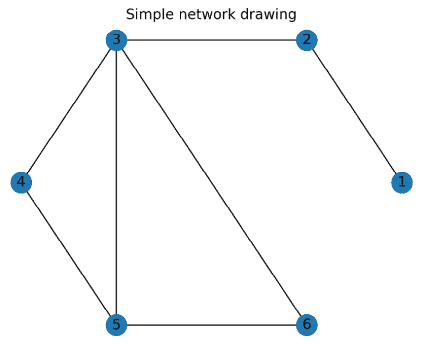

# 第五章：处理树与网络

网络是包含 *节点* 和节点对之间 *边* 的对象。它们可以用来表示各种现实世界的情况，如分配和调度。数学上，网络对于可视化组合问题非常有用，并且它有着丰富且迷人的理论。

当然，网络有多种类型。我们将主要处理简单网络，其中边连接两个不同的节点（因此没有自环），每两个节点之间最多只有一条边，并且所有边都是双向的。*树* 是一种特殊的网络，其中没有环；也就是说，没有节点列表，每个节点都通过边连接到下一个节点，最后一个节点又连接到第一个节点。树在理论上特别简单，因为它用最少的边连接多个节点。*完全网络* 是一种每个节点都通过边与其他每个节点相连的网络。

网络可以是有向的，其中每条边都有一个源节点和一个目标节点，或者可以承载额外的属性，例如权重。加权网络在某些应用中尤其有用。还有一些网络允许在两个给定节点之间有多条边。

在本章中，我们将学习如何创建、操作和分析网络，并应用网络算法解决各种问题。

注意

在文献中，特别是在数学文本中，网络更常被称为 *图*。节点有时被称为 *顶点*。我们更倾向于使用“网络”这一术语，以避免与更常见的将图表示为函数图像的用法混淆。

本章将涵盖以下内容：

+   在 Python 中创建网络

+   可视化网络

+   获取网络的基本特征

+   生成网络的邻接矩阵

+   创建有向和加权网络

+   查找网络中的最短路径

+   定量化网络中的聚类

+   给网络上色

+   查找最小生成树和支配集

让我们开始吧！

# 技术要求

在本章中，我们将主要使用 NetworkX 包来处理树和网络。您可以通过您喜欢的包管理器（例如 `pip`）来安装此包：

```py
python3.10 -m pip install networkx
```

我们通常使用 `nx` 别名导入此模块，遵循官方 NetworkX 文档中建立的惯例（[`networkx.org/documentation/stable/`](https://networkx.org/documentation/stable/)），使用以下 `import` 语句：

```py
import networkx as nx
```

本章的代码可以在本书的 GitHub 仓库中的 `Chapter 05` 文件夹找到，链接为 [`github.com/PacktPublishing/Applying-Math-with-Python-2nd-Edition/tree/main/Chapter%2005`](https://github.com/PacktPublishing/Applying-Math-with-Python-2nd-Edition/tree/main/Chapter%2005)。

# 在 Python 中创建网络

为了解决可以表示为网络问题的各种问题，我们需要一种在 Python 中创建网络的方式。为此，我们将利用 NetworkX 包及其提供的例程和类来创建、操作和分析网络。

在本配方中，我们将创建一个表示网络的 Python 对象，并向该对象添加节点和边。

## 准备工作

正如我们在*技术要求*部分提到的，我们需要将 NetworkX 包以`nx`别名导入。我们可以使用以下`import`语句来完成：

```py
import networkx as nx
```

## 如何实现...

按照以下步骤创建一个简单图的 Python 表示：

1.  我们需要创建一个新的`Graph`对象，用于存储构成图的节点和边：

    ```py
    G = nx.Graph()
    ```

1.  接下来，我们需要使用`add_node`方法为网络添加节点：

    ```py
    G.add_node(1)
    ```

    ```py
    G.add_node(2)
    ```

1.  为了避免重复调用该方法，我们可以使用`add_nodes_from`方法从可迭代对象（如列表）中添加节点：

    ```py
    G.add_nodes_from([3, 4, 5, 6])
    ```

1.  接下来，我们需要使用`add_edge`或`add_edges_from`方法为我们已添加的节点之间添加边，这些方法分别是添加单条边或一组边（作为元组）：

    ```py
    G.add_edge(1, 2)  # edge from 1 to 2
    ```

    ```py
    G.add_edges_from([(2, 3),(3, 4)(3, 5),(3, 6),
    ```

    ```py
        (4,5),(5,6)])
    ```

1.  最后，我们必须通过访问`nodes`和`edges`属性，分别获取图中当前节点和边的视图：

    ```py
    print(G.nodes)
    ```

    ```py
    print(G.edges)
    ```

    ```py
    # [1, 2, 3, 4, 5, 6]
    ```

    ```py
    # [(1, 2), (2, 3), (3, 4), (3, 5), (3, 6), (4, 5), (5, 6)]
    ```

## 它是如何工作的...

NetworkX 包添加了多个类和例程，用于使用 Python 创建、操作和分析网络。`Graph`类是表示不包含多个边的网络的最基本类，其中边是无向的（双向的）。

一旦创建了一个空白的`Graph`对象，我们就可以使用本配方中描述的方法添加新的节点和边。在本配方中，我们创建了包含整数值的节点。然而，节点可以包含任何可哈希的 Python 对象，除了`None`。此外，还可以通过传递关键字参数给`add_node`方法来为节点添加关联数据。在使用`add_nodes_from`方法时，可以通过提供包含节点对象和属性字典的元组列表来添加属性。`add_nodes_from`方法对于批量添加节点非常有用，而`add_node`方法则适用于将单个节点附加到现有网络中。

网络中的一条边是一个包含两个（不同）节点的元组。在一个简单的网络中，例如由基本的`Graph`类表示的网络，任何两个给定节点之间最多只能有一条边。这些边是通过`add_edge`或`add_edges_from`方法添加的，分别是添加单个边或添加一组边。与节点类似，边也可以通过属性字典来保存任意的关联数据。特别是，当添加边时，可以通过提供`weight`属性来添加权重。我们将在*创建有向和加权* *网络*的配方中提供有关加权图的更多细节。

`nodes` 和 `edges` 属性分别包含构成网络的节点和边。`nodes` 属性返回一个 `NodesView` 对象，这是一个类似字典的接口，提供节点及其关联数据的访问。同样，`edges` 属性返回一个 `EdgeView` 对象。我们可以使用这个对象检查个别边及其相关数据。

## 还有更多...

`Graph` 类表示 *简单网络*，它是节点最多由一条边连接且边不具有方向的网络。我们将在 *创建有向和加权网络* 食谱中讨论有向网络。还有一个单独的类用于表示可以在一对节点之间有多条边的网络，称为 `MultiGraph`。所有网络类型都允许自环，这在文献中的 *简单网络* 中有时是不允许的，简单网络通常指的是没有自环的无向网络。

所有网络类型都提供了多种方法来添加节点和边，并检查当前的节点和边。还有方法可以将网络复制到其他类型的网络中，或提取子网络。此外，NetworkX 包还提供了多个实用例程，用于生成标准网络并将子网络添加到现有网络中。

NetworkX 还提供了多种例程，用于将网络读写到不同的文件格式中，例如 GraphML、JSON 和 YAML。例如，我们可以使用 `nx.write_graphml` 例程将网络写入 GraphML 文件，并使用 `nx.read_graphml` 例程读取它。

# 可视化网络

分析网络的常见第一步是绘制网络，这有助于我们识别网络的一些显著特征。（当然，图示可能会产生误导，因此我们不应过于依赖它们进行分析。）

在这个食谱中，我们将描述如何使用 NetworkX 包中的网络绘制功能来可视化网络。

## 准备工作

对于这个食谱，我们需要按 *技术要求* 部分的描述，导入 NetworkX 包并使用 `nx` 别名。我们还需要 Matplotlib 包。为此，我们通常需要使用以下 `import` 语句导入 `pyplot` 模块，并将其命名为 `plt`：

```py
import matplotlib.pyplot as plt
```

## 如何操作...

以下步骤概述了如何使用 NetworkX 的绘图例程绘制一个简单的网络对象：

1.  首先，我们将创建一个简单的示例网络进行绘制：

    ```py
    G = nx.Graph()
    ```

    ```py
    G.add_nodes_from(range(1, 7))
    ```

    ```py
    G.add_edges_from([
    ```

    ```py
        (1, 2), (2, 3), (3, 4), (3, 5),
    ```

    ```py
        (3, 6), (4, 5), (5, 6)
    ```

    ```py
    ])
    ```

1.  接下来，我们将为它创建新的 Matplotlib `Figure` 和 `Axes` 对象，准备好使用 `plt` 中的 `subplots` 例程来绘制网络：

    ```py
    fig, ax = plt.subplots()
    ```

1.  现在，我们可以创建一个布局，用于在图形中定位节点。对于这个图形，我们将使用 `shell_layout` 例程来创建一个壳布局：

    ```py
    layout = nx.shell_layout(G)
    ```

1.  我们可以使用`draw`函数将网络绘制到图形上。由于我们已经创建了一个 Matplotlib `Figure`和`Axes`，我们可以提供`ax`关键字参数。我们还将使用`with_labels`关键字参数为节点添加标签，并通过`pos`参数指定我们刚刚创建的布局：

    ```py
    nx.draw(G, ax=ax, pos=layout, with_labels=True)
    ```

    ```py
    ax.set_title("Simple network drawing")
    ```

结果图像可以在以下图中看到：



图 5.1 – 使用 shell 布局排列的简单网络图

由于本示例中的节点数量相对较少，它们被安排在一个圆圈内。边缘通过线条表示。

## 工作原理...

`draw`函数是一个专门的绘图函数，专门用于绘制网络。我们创建的布局指定了每个节点将被放置的坐标。我们使用了*shell 布局*，它将节点按同心圆的方式排列（此示例中仅使用了一个圆），该布局由网络的节点和边缘决定。默认情况下，`draw`函数会创建一个随机布局。

`draw`函数有多个关键字参数，用于定制绘制网络的外观。在本示例中，我们添加了`with_labels`关键字参数，根据节点持有的对象为节点添加标签。节点持有整数值，这就是为什么前面图中的节点按整数标注的原因。

我们还使用`plt.subplots`函数单独创建了一组坐标轴。严格来说，这不是必须的，因为`draw`函数会在没有提供坐标轴的情况下自动创建一个新的图形和坐标轴。

## 还有更多...

NetworkX 包提供了几个布局生成函数，类似于我们在本示例中使用的`shell_layout`函数。此布局实际上是一个字典，以节点为索引，其元素是节点应该绘制的位置的 x 和 y 坐标。NetworkX 的布局生成函数表示了适用于大多数情况的常见排列，但如果需要，您也可以创建自定义布局。NetworkX 文档中提供了不同布局创建函数的完整列表。此外，还有快捷的绘图函数，它们会使用特定的布局，而无需单独创建布局；例如，`draw_shell`函数会绘制使用 shell 布局的网络，这等同于本示例中`draw`函数的调用。

`draw`函数接受多个关键字参数来定制图形的外观。例如，您可以使用关键字参数控制节点的大小、颜色、形状和透明度。我们还可以添加箭头（用于有向边）和/或仅绘制网络中的特定节点和边。

# 获取网络的基本特征

网络除了节点和边的数量之外，还有许多有助于分析图的基本特性。例如，节点的*度数*是指从该节点出发（或到达）的边的数量。度数越高，表示该节点与网络的其他部分连接越紧密。

在本教程中，我们将学习如何访问网络的基本属性，并计算与网络相关的各种基本度量。

## 准备工作

和往常一样，我们需要导入 `nx` 别名下的 NetworkX 包。我们还需要导入 Matplotlib 的 `pyplot` 模块，别名为 `plt`。

## 如何操作...

按照以下步骤访问网络的各种基本特征：

1.  创建我们将在本教程中分析的示例网络，代码如下：

    ```py
    G = nx.Graph()
    ```

    ```py
    G.add_nodes_from(range(10))
    ```

    ```py
    G.add_edges_from([
    ```

    ```py
        (0, 1), (1, 2), (2, 3), (2, 4),
    ```

    ```py
        (2, 5), (3, 4), (4, 5), (6, 7),
    ```

    ```py
        (6, 8), (6, 9), (7, 8), (8, 9)
    ```

    ```py
    ])
    ```

1.  接下来，最好绘制网络并将节点排列成圆形布局：

    ```py
    fig, ax = plt.subplots()
    ```

    ```py
    nx.draw_circular(G, ax=ax, with_labels=True)
    ```

    ```py
    ax.set_title("Simple network")
    ```

结果图可以在下图中看到。正如我们所见，网络被分成了两个不同的部分：


图 5.2 – 一个简单的网络，采用圆形排列，包含两个不同的组件

1.  接下来，我们必须打印`Graph`对象以显示网络的基本信息：

    ```py
    print(G)
    ```

    ```py
    # Name:
    ```

    ```py
    # Type: Graph
    ```

    ```py
    # Number of nodes: 10
    ```

    ```py
    # Number of edges: 12
    ```

    ```py
    # Average degree: 2.4000
    ```

1.  现在，我们可以使用`Graph`对象的`degree`属性来获取特定节点的度数：

    ```py
    for i in [0, 2, 7]:
    ```

    ```py
        degree = G.degree[i]
    ```

    ```py
        print(f"Degree of {i}: {degree}")
    ```

    ```py
    # Degree of 0: 1
    ```

    ```py
    # Degree of 2: 4
    ```

    ```py
    # Degree of 7: 2
    ```

1.  我们可以使用 `connected_components` 例程获取网络的连通组件，该例程返回一个生成器，我们将其转换为列表：

    ```py
    components = list(nx.connected_components(G))
    ```

    ```py
    print(components)
    ```

    ```py
    # [{0, 1, 2, 3, 4, 5}, {8, 9, 6, 7}]
    ```

1.  我们可以使用密度例程计算网络的**密度**，该例程返回一个介于 0 和 1 之间的浮动值。它表示连接到该节点的边与该节点所有可能的边之间的比例：

    ```py
    density = nx.density(G)
    ```

    ```py
    print("Density", density)
    ```

    ```py
    # Density 0.26666666666666666
    ```

1.  最后，我们可以使用 `check_planarity` 例程来确定网络是否是*平面*的——即没有两条边需要交叉——：

    ```py
    is_planar, _ = nx.check_planarity(G)
    ```

    ```py
    print("Is planar", is_planar)
    ```

    ```py
    # Is planar True
    ```

回头看看*图 5.2*，我们可以看到，确实可以在不交叉任何两条边的情况下绘制这个图。

## 它是如何工作的...

`info` 例程生成网络的小结，包括网络的类型（在本教程中是简单的 `Graph` 类型）、节点和边的数量以及网络中节点的平均度数。可以使用 `degree` 属性访问网络中节点的实际度数，它提供了一种类似字典的接口来查找每个节点的度数。

一组节点如果该组中的每个节点都通过一条边或一系列边与其他节点相连，则称这组节点为连通的。网络的*连通分量*是最大的一组相互连通的节点。任何两个不同的连通分量是相互不相交的。每个网络都可以分解为一个或多个连通分量。我们在这个示例中定义的网络有两个连通分量，分别是`{0, 1, 2, 3, 4, 5}`和`{8, 9, 6, 7}`。这些连通分量在前面的图中可见，其中第一个连通分量位于第二个连通分量的上方。在这张图中，我们可以沿着网络的边从组件中的任何节点到达任何其他节点；例如，从 0 到 5。

网络的*密度*衡量的是网络中边的数量与网络中节点数量所能形成的边的总数之间的比例。完全网络的密度为 1，但通常情况下，密度会小于 1。

如果一个网络可以在平面上绘制而没有交叉边，则称该网络为*平面网络*。五节点的完全网络是最简单的非平面网络。最多包含四个节点的完全网络是平面网络。通过一些尝试绘制这些网络，你将发现一个没有交叉边的绘图。此外，任何包含至少五个节点的完全图的网络都不是平面网络。平面网络在理论中很重要，因为它们相对简单，但在实际应用中不太常见。

## 还有更多内容...

除了网络类中的方法外，NetworkX 包中还有其他多个常用函数，可以用来访问网络中节点和边的属性。例如，`nx.get_node_attributes`可以获取网络中每个节点的指定属性。

# 为网络生成邻接矩阵

分析图的一个强大工具是邻接矩阵，如果存在从节点  到节点  的边，则矩阵中的值为 ，否则为 0。对于大多数网络，邻接矩阵通常是稀疏的（大多数值为 0）。对于无向网络，邻接矩阵还会是对称的（）。可以与网络关联的其他矩阵也有很多。我们将在这个示例的*还有更多内容...*部分简要讨论这些矩阵。

在这个示例中，我们将生成一个网络的邻接矩阵，并学习如何从这个矩阵中获取网络的一些基本属性。

## 准备工作

对于这个示例，我们将需要导入 NetworkX 包，并使用`nx`别名，同时导入 NumPy 模块，使用`np`别名。

## 如何实现...

以下步骤概述了如何为网络生成邻接矩阵，并从该矩阵推导出网络的一些简单属性：

1.  首先，我们将生成一个网络，在整个示例中使用。我们将生成一个具有五个节点和五条边的随机网络，并使用种子确保可重复性：

    ```py
    G = nx.dense_gnm_random_graph(5, 5, seed=12345)
    ```

1.  为了生成邻接矩阵，我们可以使用 NetworkX 中的 `adjacency_matrix` 函数。默认情况下，这将返回一个稀疏矩阵，因此我们还将通过 `todense` 方法将其转换为一个完整的 NumPy 数组进行演示：

    ```py
    matrix = nx.adjacency_matrix(G).todense()
    ```

    ```py
    print(matrix)
    ```

    ```py
    # [[0 0 1 0 0]
    ```

    ```py
    #  [0 0 1 1 0]
    ```

    ```py
    #  [1 1 0 0 1]
    ```

    ```py
    #  [0 1 0 0 1]
    ```

    ```py
    #  [0 0 1 1 0]]
    ```

1.  对邻接矩阵进行  次幂运算，可以得到从一个节点到另一个节点的路径数量，路径长度为 ：

    ```py
    paths_len_4 = np.linalg.matrix_power(matrix, 4)
    ```

    ```py
    print(paths_len_4)
    ```

    ```py
    # [[ 3 5  0  0 5]
    ```

    ```py
    #  [ 5 9  0  0 9]
    ```

    ```py
    #  [ 0 0 13 10 0]
    ```

    ```py
    #  [ 0 0 10  8 0]
    ```

    ```py
    #  [ 5 9  0  0 9]]
    ```

步骤 2 中的邻接矩阵和步骤 3 中的四次幂都是对称矩阵。此外，注意到 `paths_len_4` 中非零条目的位置与邻接矩阵中的零位置相对应。这是因为存在两个不同的节点组，而奇数长度的路径在这两个组之间交换，偶数长度的路径则返回到起始组。

## 它是如何工作的……

`dense_gnm_random_graph` 函数生成一个（密集）随机网络，网络从所有具有  个节点和  条边的网络族中均匀选择。在这个示例中， 和 。`dense` 前缀表示该函数使用的算法应比替代的 `gnm_random_graph` 在边与节点比值较大的密集网络中速度更快。

网络的邻接矩阵很容易生成，特别是在图较小时，使用稀疏形式尤为方便。对于较大的网络，这可能是一个昂贵的操作，因此可能不太实际，特别是当你像本示例中那样将其转换为完整矩阵时。通常你不需要这样做，因为我们可以简单地使用 `adjacency_matrix` 函数生成的稀疏矩阵，并使用 SciPy `sparse` 模块中的稀疏线性代数工具。

矩阵的幂次提供了关于给定长度路径数量的信息。通过矩阵乘法的定义，可以很容易地看出这一点。记住，当两个节点之间存在边（路径长度为 1）时，邻接矩阵中的条目为 1。

## 还有更多……

网络的邻接矩阵的特征值提供了关于网络结构的额外信息，比如网络的着色数界限。（有关着色网络的更多信息，请参见 *着色网络* 这一部分。）有一个单独的函数用于计算邻接矩阵的特征值。例如，`adjacency_spectrum` 函数可以生成网络邻接矩阵的特征值。涉及到与网络相关的矩阵特征值的方法通常被称为 *谱方法*。

网络中还有其他矩阵，如*关联矩阵*和*拉普拉斯矩阵*。网络的关联矩阵是一个矩阵，其中是节点数，是边的数量。如果节点出现在边中，则该矩阵的项为 1，否则为 0。网络的拉普拉斯矩阵定义为矩阵，其中是包含网络中节点度数的对角矩阵，是网络的邻接矩阵。这两种矩阵对于网络分析非常有用。

# 创建有向加权网络

像之前食谱中描述的简单网络，对于描述边的方向不重要且边权相等的网络非常有用。实际上，大多数网络携带额外的信息，如权重或方向。

在本食谱中，我们将创建一个有向加权网络，并探索此类网络的一些基本属性。

## 准备工作

对于本食谱，我们需要使用 NetworkX 包，通过别名`nx`导入（如同往常一样），Matplotlib 的`pyplot`模块以`plt`导入，以及 NumPy 包以`np`导入。

## 如何操作…

以下步骤概述了如何创建一个带权重的有向网络，以及如何探索我们在之前的食谱中讨论的一些属性和技术：

1.  要创建一个有向网络，我们可以使用 NetworkX 中的`DiGraph`类，而不是简单的`Graph`类：

    ```py
    G = nx.DiGraph()
    ```

1.  如同往常一样，我们必须使用`add_node`或`add_nodes_from`方法向网络中添加节点：

    ```py
    G.add_nodes_from(range(5))
    ```

1.  要添加带权重的边，我们可以使用`add_edge`方法并提供`weight`关键字参数，或者使用`add_weighted_edges_from`方法：

    ```py
    G.add_edge(0, 1, weight=1.0)
    ```

    ```py
    G.add_weighted_edges_from([
    ```

    ```py
        (1, 2, 0.5), (1, 3, 2.0), (2, 3, 0.3), (3, 2, 0.3),
    ```

    ```py
        (2, 4, 1.2), (3, 4, 0.8)
    ```

    ```py
    ])
    ```

1.  接下来，我们必须绘制网络，并用箭头表示每条边的方向。我们还必须为此图提供位置：

    ```py
    fig, ax = plt.subplots()
    ```

    ```py
    pos = {0: (-1, 0), 1: (0, 0), 2: (1, 1), 3: (1, -1),
    ```

    ```py
        4:(2, 0)}
    ```

    ```py
    nx.draw(G, ax=ax, pos=pos, with_labels=True)
    ```

    ```py
    ax.set_title("Weighted, directed network")
    ```

结果图如下所示：


图 5.3 – 一个带权有向网络

1.  有向矩阵的邻接矩阵与简单网络创建方式相同，但结果矩阵将不再是对称的：

    ```py
    adj_mat = nx.adjacency_matrix(G).todense()
    ```

    ```py
    print(adj_mat)
    ```

    ```py
    # [[0\. 1\. 0\. 0\. 0\. ]
    ```

    ```py
    # [0\. 0\. 0.5 2\. 0\. ]
    ```

    ```py
    # [0\. 0\. 0\. 0.3 1.2]
    ```

    ```py
    # [0\. 0\. 0.3 0\. 0.8]
    ```

    ```py
    # [0\. 0\. 0\. 0\. 0\. ]]
    ```

与其说是两个给定节点之间的边数，邻接矩阵包含的是这些节点之间边的权重之和。

## 它是如何工作的…

`DiGraph`类表示一个有向网络，其中添加边时节点的顺序很重要。在本食谱中，我们添加了两条边来连接节点 2 和节点 3，每个方向一条。在简单网络（`Graph`类）中，添加第二条边不会增加另一条边。然而，在有向网络（`DiGraph`类）中，添加边时节点的顺序决定了边的方向。

加权边没有特别之处，除了附加在边上的`weight`属性。（可以通过关键字参数将任意数据附加到网络中的边或节点。）`add_weighted_edges_from`方法只是将对应的权重值（元组中的第三个值）添加到相关的边上。权重可以添加到任何网络中的任何边，不仅仅是本食谱中展示的有向网络。

`draw`例程在绘制有向网络时会自动为边添加箭头。可以通过传递`arrows=False`关键字参数来关闭此行为。有向或加权网络的邻接矩阵也不同于简单网络的邻接矩阵。在有向网络中，矩阵通常不是对称的，因为边可能存在于一个方向上但不在另一个方向上。对于加权网络，矩阵的条目可能不是 1 或 0，而是对应边的权重。

## 还有更多内容...

加权网络出现在许多应用中，例如描述交通网络中的距离或速度。你还可以使用网络来检查流量通过网络的情况，方法是为网络中的边提供*容量*（作为权重或其他属性）。NetworkX 提供了多个分析网络流量的工具，例如通过`nx.maximum_flow`例程找到网络中的最大流量。

有向网络向网络中添加了方向信息。许多实际应用产生了具有单向边的网络，例如工业过程或供应链网络中的那些边。这种额外的方向信息对许多处理网络的算法有影响，正如我们在本章中将看到的那样。

# 在网络中寻找最短路径

网络出现的一个常见问题是找到两个节点之间的最短路径——或者更准确地说，找到最高奖励的路径。例如，这可能是两个城市之间的最短距离，其中节点代表城市，边代表连接城市对的道路。在这种情况下，边的权重就是它们的长度。

在本食谱中，我们将找到一个加权网络中两个节点之间的最短路径。

## 准备工作

对于本食谱，我们将按常规导入 NetworkX 包，并使用`nx`别名，导入 Matplotlib 的`pyplot`模块作为`plt`，以及从 NumPy 导入随机数生成器对象：

```py
from numpy.random import default_rng
rng = default_rng(12345) # seed for reproducibility
```

## 如何操作...

按照以下步骤在网络中找到两个节点之间的最短路径：

1.  首先，我们将使用`gnm_random_graph`和一个`seed`来创建一个随机网络，作为本演示的基础：

    ```py
    G = nx.gnm_random_graph(10, 17, seed=12345)
    ```

1.  接下来，我们将使用圆形布局绘制网络，以便查看节点之间的连接方式：

    ```py
    fig, ax = plt.subplots()
    ```

    ```py
    nx.draw_circular(G, ax=ax, with_labels=True)
    ```

    ```py
    ax.set_title("Random network for shortest path finding")
    ```

结果图形可以在下图中看到。这里，我们可以看到节点 7 和节点 9 之间没有直接的边：


图 5.4 – 一个随机生成的网络，包含 10 个节点和 17 条边。

1.  现在，我们需要给每条边添加一个权重，以便在最短路径方面有些路线比其他路线更具优势：

    ```py
    for u, v in G.edges:
    ```

    ```py
        G.edges[u, v]["weight"] = rng.integers(5, 15)
    ```

1.  接下来，我们将使用`nx.shortest_path`例程计算从节点 7 到节点 9 的最短路径：

    ```py
    path = nx.shortest_path(G, 7, 9, weight="weight")
    ```

    ```py
    print(path)
    ```

    ```py
    # [7, 5, 2, 9]
    ```

1.  我们可以使用`nx.shortest_path_`来找到这条最短路径的长度。

1.  `length`例程：

    ```py
    length = nx.shortest_path_length(G, 7, 9,
    ```

    ```py
        weight="weight")
    ```

    ```py
    print("Length", length)
    ```

    ```py
    # Length 32
    ```

这里路径的*长度*是沿最短路径遍历的边的权重总和。如果网络没有权重，那么它将等于沿路径遍历的边的数量。

## 它是如何工作的……

`shortest_path`例程计算每一对节点之间的最短路径。或者，当提供源节点和目标节点时（这就是我们在本示例中所做的），它计算两个指定节点之间的最短路径。我们提供了可选的`weight`关键字参数，这使得算法根据边的*权重*属性来寻找最短路径。这个参数改变了*最短*的定义，默认情况下是*最少边数*。

查找两个节点之间最短路径的默认算法是 Dijkstra 算法，它是计算机科学和数学课程中的基础算法。它是一个通用的算法，但效率并不是特别高。其他的路线寻找算法包括 A*算法。通过使用 A*算法并加入额外的启发式信息来指导节点选择，可以提高效率。

## 还有更多……

有许多算法可以用来寻找网络中两个节点之间的最短路径。也有一些变体可以寻找最大权重路径。

关于网络中路径查找，有几个相关的问题，比如*旅行推销员问题*和*路径检查问题*。在旅行推销员问题中，我们需要找到一个环路（一个从同一节点出发并返回的路径），它遍历网络中的每个节点，且总权重最小（或最大）。在路径检查问题中，我们寻找遍历网络中每条边并返回起点的最短环路（按权重计算）。旅行推销员问题是已知的 NP 难题，但路径检查问题可以在多项式时间内解决。

图论中的一个著名问题是哥尼斯堡的桥梁问题，它要求在网络中找到一条路径，使得每条边恰好经过一次。正如欧拉所证明的那样，哥尼斯堡桥问题中找到这样一条路径是不可能的。这样一条恰好经过每条边一次的路径被称为 *欧拉回路*。一个网络如果包含欧拉回路，则称为 *欧拉网络*。只有当每个节点的度数都是偶数时，网络才是欧拉网络。哥尼斯堡桥问题的网络表示可以在下图中看到。图中的边代表河流上的不同桥梁，而节点代表不同的陆地块。我们可以看到，所有四个节点的度数都是奇数，这意味着不存在一条路径能恰好经过每一条边一次：


图 5.5 – 代表哥尼斯堡桥问题的网络

这些边代表连接不同陆地块的桥梁，这些陆地块由节点表示。

# 网络中的聚类度量

网络中有各种量度用于衡量网络的特征。例如，节点的聚类系数衡量了附近节点之间的互联性（此处，附近指的是通过边连接的节点）。实际上，它衡量了相邻节点形成一个完整网络或 *团体* 的接近程度。

节点的聚类系数衡量了邻近节点通过边连接的比例；也就是说，两个相邻节点与给定节点形成一个三角形。我们计算三角形的数量，并将其除以根据节点的度数可以形成的三角形的总数。从数值上讲，在一个简单的无权网络中，节点的聚类系数  由以下公式给出：


这里， 是在  处的三角形数量，分母是  处可能形成的三角形总数。如果  的度数（即从  出发的边数）为 0 或 1，则我们将  设为 0。

在这个示例中，我们将学习如何计算网络中节点的聚类系数。

## 准备工作

对于这个示例，我们将需要导入 `nx` 别名下的 NetworkX 包和作为 `plt` 导入的 Matplotlib `pyplot` 模块。

## 如何进行...

以下步骤展示了如何计算网络中节点的聚类系数：

1.  首先，我们需要创建一个样本网络来进行操作：

    ```py
    G = nx.Graph()
    ```

    ```py
    complete_part = nx.complete_graph(4)
    ```

    ```py
    cycle_part = nx.cycle_graph(range(4, 9))
    ```

    ```py
    G.update(complete_part)
    ```

    ```py
    G.update(cycle_part)
    ```

    ```py
    G.add_edges_from([(0, 8), (3, 4)])
    ```

1.  接下来，我们必须绘制网络，以便我们能够比较我们将要计算的聚类系数。这样，我们可以看到这些节点在网络中的表现：

    ```py
    fig, ax = plt.subplots()
    ```

    ```py
    nx.draw_circular(G, ax=ax, with_labels=True)
    ```

    ```py
    ax.set_title("Network with different clustering behavior")
    ```

结果图表可以在下图中看到：


图 5.6 – 测试聚类的示例网络

1.  现在，我们可以使用 `nx.clustering` 例程计算网络中节点的聚类系数：

    ```py
    cluster_coeffs = nx.clustering(G)
    ```

1.  `nx.clustering` 例程的输出是网络中各个节点的字典。因此，我们可以按如下方式打印一些选定的节点：

    ```py
    for i in [0, 2, 6]:
    ```

    ```py
        print(f"Node {i}, clustering {cluster_coeffs[i]}")
    ```

    ```py
    # Node 0, clustering 0.5
    ```

    ```py
    # Node 2, clustering 1.0
    ```

    ```py
    # Node 6, clustering 0
    ```

1.  所有网络节点的平均聚类系数可以通过 `nx.average_clustering` 例程计算：

    ```py
    av_clustering = nx.average_clustering(G)
    ```

    ```py
    print(av_clustering)
    ```

    ```py
    # 0.3333333333333333
    ```

这个平均聚类系数表明，平均而言，节点大约拥有 1/3 的所有可能连接。

## 它是如何工作的...

节点的聚类系数衡量的是该节点的邻域有多接近于一个完整的网络（所有节点都相互连接）。在这个例子中，我们计算了三个不同的值：节点 0 的聚类系数为 0.5，节点 2 的聚类系数为 1.0，节点 6 的聚类系数为 0。这意味着与节点 2 相连的节点构成了一个完整的网络，这是因为我们设计网络时就是这样设计的。（节点 0 到 4 按设计形成了一个完整的网络。）节点 6 的邻域离完整网络非常远，因为它的两个邻居之间没有任何相互连接的边。

平均聚类值是对网络中所有节点的聚类系数的简单平均。它与全局聚类系数（通过 NetworkX 中的 `nx.transitivity` 例程计算）略有不同，但它确实能给我们一个网络整体接近完整网络的程度的概念。全局聚类系数衡量的是三角形的数量与三元组的数量之间的比率——三元组是由至少两条边连接的三个节点组成的集合——覆盖整个网络。

全局聚类和平均聚类之间的差异相当微妙。全局聚类系数衡量的是整个网络的聚类程度，而平均聚类系数衡量的是网络在局部的聚类程度。这个差异在风车型网络中最为明显，该网络由一个中心节点和一个偶数个节点围成的圆圈组成。所有节点都连接到中心，但圆圈上的节点只按交替的模式连接。外部节点的局部聚类系数为 1，而中心节点的局部聚类系数为 ，其中  表示连接中心节点的三角形数量。然而，全局聚类系数是 。

## 还有更多...

聚类系数与网络中的 *团体*（cliques）有关。团体是一个子网络，其中所有节点都通过边连接。网络理论中的一个重要问题是寻找网络中的最大团体，这通常是一个非常困难的问题（这里，最大意味着 *不能更大*）。

# 给网络着色

网络在调度问题中也非常有用，在这些问题中，你需要将活动安排到不同的时间段，以避免冲突。例如，我们可以使用网络来安排课程，以确保选择不同课程的学生不会同时上两门课。在这种情况下，节点将表示不同的课程，边将表示学生同时选修两门课程。我们用来解决这类问题的过程叫做*网络着色*。这个过程涉及为网络中的节点分配最少的颜色，以确保没有两个相邻节点有相同的颜色。

在这个配方中，我们将学习如何着色一个网络以解决简单的调度问题。

## 准备工作

对于这个配方，我们需要导入 NetworkX 包并使用`nx`别名，同时导入 Matplotlib 的`pyplot`模块并命名为`plt`。

## 如何操作...

按照以下步骤来解决网络着色问题：

1.  首先，我们将创建一个示例网络，以便在这个配方中使用：

    ```py
    G = nx.complete_graph(3)
    ```

    ```py
    G.add_nodes_from(range(3, 7))
    ```

    ```py
    G.add_edges_from([
    ```

    ```py
        (2, 3), (2, 4), (2, 6), (0, 3), (0, 6), (1, 6),
    ```

    ```py
        (1, 5), (2, 5), (4, 5) ])
    ```

1.  接下来，我们将绘制网络，以便在生成着色时理解它。为此，我们将使用`draw_circular`例程：

    ```py
    fig, ax = plt.subplots()
    ```

    ```py
    nx.draw_circular(G, ax=ax, with_labels=True)
    ```

    ```py
    ax.set_title("Scheduling network")
    ```

结果图可以在下图中看到：


](img/5.7.jpg)

图 5.7 – 简单调度问题的示例网络

1.  我们将使用`nx.greedy_color`例程生成着色：

    ```py
    coloring = nx.greedy_color(G)
    ```

    ```py
    print("Coloring", coloring)
    ```

    ```py
    # Coloring {2: 0, 0: 1, 1: 2, 5: 1, 6: 3, 3: 2, 4: 2}
    ```

1.  为了查看实际使用的颜色，我们将从`coloring`字典中生成一组值：

    ```py
    different_colors = set(coloring.values())
    ```

    ```py
    print("Different colors", different_colors)
    ```

    ```py
    # Different colors {0, 1, 2, 3}
    ```

请注意，着色中的颜色数量不能更少，因为节点 0、1、2 和 6 构成了一个完全网络——这些节点彼此相连，因此每个节点都需要一个单独的颜色。

## 它是如何工作的...

`nx.greedy_color`例程使用几种可能的策略之一来着色网络。默认情况下，它按度数从大到小的顺序工作。在我们的例子中，它首先将颜色 0 分配给度数为 6 的节点 2，然后将颜色 1 分配给度数为 4 的节点 0，以此类推。在这个序列中，为每个节点选择第一个可用的颜色。这不一定是最有效的着色算法。

任何网络都可以通过为每个节点分配不同的颜色来着色，但在大多数情况下，只需要更少的颜色。在这个配方中，网络有七个节点，但只需要四种颜色。所需的最小颜色数量称为网络的**色度数**。

我们在这里描述的问题是*节点着色*问题。还有一个相关的问题叫做*边着色*。我们可以通过考虑一个网络，其中的节点是原始网络的边，并且当两个节点之间存在共同的原始网络节点时，在这两个节点之间添加一条边，从而将边着色问题转化为节点着色问题。

## 还有更多...

网络着色问题有多种变体。一个这样的变体是**列表着色问题**，其中我们为网络中的每个节点从预定义的颜色列表中选择一种颜色进行着色。这个问题比一般的着色问题更为复杂。

一般的着色问题有一些令人惊讶的结果。例如，每个平面网络最多可以用四种不同的颜色进行着色。这是图论中的一个著名定理，称为**四色定理**，由 Appel 和 Haken 在 1977 年证明。这个定理表明，每个平面图的色数不超过 4。

# 查找最小生成树和支配集

网络在许多问题中都有应用。通信和分配是两个显而易见的应用领域。例如，我们可能希望找到一种将商品分配到多个城市（节点）的方法，前提是它能覆盖从某个特定点出发的最小距离。对于此类问题，我们需要研究最小生成树和支配集。

在本食谱中，我们将找到网络中的最小生成树和支配集。

## 准备工作

对于本食谱，我们需要导入`nx`别名下的 NetworkX 包和 Matplotlib 的`pyplot`模块，别名为`plt`。

## 如何操作...

按照以下步骤为网络查找最小生成树和支配集：

1.  首先，我们将创建一个示例网络来进行分析：

    ```py
    G = nx.gnm_random_graph(15, 22, seed=12345)
    ```

1.  接下来，和往常一样，我们将在进行任何分析之前先绘制网络：

    ```py
    fig, ax = plt.subplots()
    ```

    ```py
    pos = nx.circular_layout(G)
    ```

    ```py
    nx.draw(G, pos=pos, ax=ax, with_labels=True, style="--")
    ```

    ```py
    ax.set_title("Network with minimum spanning tree overlaid")
    ```

1.  最小生成树可以使用`nx.minimum_``spanning_tree`例程来计算：

    ```py
    min_span_tree = nx.minimum_spanning_tree(G)
    ```

    ```py
    print(list(min_span_tree.edges))
    ```

    ```py
    # [(0, 13), (0, 7), (0, 5), (1, 13), (1, 11),
    ```

    ```py
    #    (2, 5), (2, 9), (2, 8), (2, 3), (2, 12),
    ```

    ```py
    #    (3, 4), (4, 6), (5, 14), (8, 10)]
    ```

1.  接下来，我们将把最小生成树的边叠加到图上：

    ```py
    nx.draw_networkx_edges(min_span_tree, pos=pos,
    ```

    ```py
                           ax=ax,width=2.)
    ```

1.  最后，我们将使用`nx.dominating_set`例程为网络找到一个支配集——一个网络中每个节点都与集合中的至少一个节点相邻的集合：

    ```py
    dominating_set = nx.dominating_set(G)
    ```

    ```py
    print("Dominating set", dominating_set)
    ```

    ```py
    # Dominating set {0, 1, 2, 4, 10, 14}
    ```

可以在以下图中看到叠加了最小生成树的网络图：


图 5.8 – 显示叠加最小生成树的网络

最小生成树中使用的边是粗体的未断开的线，而原始网络中的边是虚线。尽管最小生成树实际上是一个树，但由于布局的原因这一点稍显模糊，但我们可以轻松地追踪并看到没有任何两个节点连接到同一个父节点的情况。

## 它是如何工作的...

网络的*生成树*是包含网络中所有节点的树。*最小*生成树是包含最少边的生成树——或具有最低总权重的生成树。最小生成树在网络分发问题中非常有用。找到最小生成树的一个简单算法是选择边（如果网络是加权的，则优先选择最小权重的边），以避免形成环路，直到无法再避免为止。

网络的*支配集*是一个顶点集合，其中网络中的每个节点都与支配集中的至少一个节点相邻。支配集在通信网络中有应用。我们通常希望找到最小的支配集，但这在计算上是困难的。测试是否存在一个比给定大小更小的支配集是 NP 完全问题。然而，对于某些类型的图，存在一些高效的算法来找到最小的支配集。非正式地说，问题在于，一旦你找到了一个最小大小支配集的候选集，你还必须验证是否没有比它更小的支配集。如果你事先不知道所有可能的支配集，这会变得非常困难。

# 进一步阅读

关于图论，有几本经典的著作，包括 Bollobás 和 Diestel 的书：

+   Diestel, R., 2010. *图论*。第 3 版。柏林：Springer。

+   Bollobás, B., 2010. *现代图论*。纽约，NY：Springer。
