# 第六章：数据和统计学的应用

对于需要分析数据的人来说，Python 最吸引人的特点之一是其庞大的数据处理和分析包生态系统，以及活跃的 Python 数据科学社区。Python 易于使用，同时提供了非常强大、快速的库，使得即使是相对初学的程序员也能够快速、轻松地处理大量数据。许多数据科学包和工具的核心是 pandas 库。pandas 提供了两种基于 NumPy 数组的数据容器类型，并且对标签（不仅仅是简单的整数）有很好的支持。这些数据容器使得处理大型数据集变得非常简单。

数据和统计学是现代世界中无处不在的一部分。Python 在试图理解每天产生的大量数据中处于领先地位，通常，这一切都从 pandas 开始——Python 用于处理数据的基础库。首先，我们将了解一些使用 pandas 处理数据的基本技巧。然后，我们将讨论统计学的基础知识，这将为我们提供通过观察一个小样本来理解整个群体的系统方法。

本章中，我们将学习如何利用 Python 和 pandas 处理大规模数据集并进行统计检验。

本章包括以下内容：

+   创建 Series 和 DataFrame 对象

+   从 DataFrame 加载和存储数据

+   在 DataFrame 中操作数据

+   从 DataFrame 中绘制数据

+   从 DataFrame 中获取描述性统计数据

+   使用抽样理解总体

+   在 DataFrame 中对分组数据进行操作

+   使用 t 检验测试假设

+   使用 ANOVA 检验假设

+   对非参数数据进行假设检验

+   使用 Bokeh 创建交互式图表

# 什么是统计学？

统计学是通过数学——特别是概率——理论来系统地研究数据。统计学有两个主要方面。第一个方面是**数据总结**。在这里，我们找到描述一组数据的数值，包括数据的中心（均值或中位数）和分布（标准差或方差）等特征。这些值被称为**描述性统计**。我们在做的事情是拟合一个概率分布，用来描述某一特征在总体中出现的可能性。在这里，*总体*指的是某一特征的所有测量值的完整集合——例如，地球上所有活着的人的身高。

统计学的第二个——也是可以说是更重要的——方面是**推断**。在这里，我们通过计算该总体相对较小样本的数值来估计描述总体数据的分布。我们不仅尝试估计总体的分布，还试图量化我们的近似值有多准确。通常这以置信区间的形式呈现。置信区间是一个值的范围，我们可以有信心地认为真值位于该范围内，基于我们观察到的数据。我们通常会为估计值提供 95%或 99%的置信区间。

推断还包括测试两个或多个样本数据集是否来自同一总体。这就是**假设检验**的领域。在这里，我们比较两个数据集的可能分布，以确定它们是否可能是相同的。许多假设检验要求数据符合正态分布，或者更可能的是我们可以应用*中心极限定理*。这些检验有时被描述为参数检验，包括 t 检验和方差分析（ANOVA）。然而，如果你的数据不符合足够的正态性，以至于无法应用中心极限定理，那么一些检验不需要假设正态性。这些检验被称为非参数检验。

# 技术要求

对于本章，我们将主要使用 pandas 库进行数据处理，它提供了类似 R 的数据结构，例如用于存储、组织和操作数据的`Series`和`DataFrame`对象。在本章的最后一节食谱中，我们还将使用 Bokeh 数据可视化库。这些库可以通过你喜欢的包管理器安装，例如`pip`：

```py
python3.10 -m pip install pandas bokeh
```

我们还将使用 NumPy 和 SciPy 包。

本章的代码可以在本书的 GitHub 仓库中的`Chapter 06`文件夹找到：[`github.com/PacktPublishing/Applying-Math-with-Python-2nd-Edition/tree/main/Chapter%2006`](https://github.com/PacktPublishing/Applying-Math-with-Python-2nd-Edition/tree/main/Chapter%2006)。

# 创建 Series 和 DataFrame 对象

在 Python 中，大多数数据处理是通过 pandas 库完成的，pandas 基于 NumPy 提供类似 R 的结构来存储数据。这些结构允许使用字符串或其他 Python 对象（除了整数）进行轻松的行列索引。一旦数据被加载到 pandas `DataFrame`或`Series`中，它就可以像在电子表格中一样轻松操作。这使得 Python 与 pandas 结合时，成为处理和分析数据的强大工具。

在本食谱中，我们将看到如何创建新的 pandas `Series`和`DataFrame`对象，并访问其中的项目。

## 准备工作

对于本食谱，我们将使用以下命令将 pandas 库导入为`pd`：

```py
import pandas as pd
```

NumPy 包是`np`。我们还必须从 NumPy 中创建一个（带种子的）随机数生成器，如下所示：

```py
from numpy.random import default_rng
rng = default_rng(12345)
```

## 如何操作...

以下步骤概述了如何创建保存数据的`Series`和`DataFrame`对象：

1.  首先，创建我们将存储在`Series`和`DataFrame`对象中的随机数据：

    ```py
    diff_data = rng.normal(0, 1, size=100)
    ```

    ```py
    cumulative = diff_data.cumsum()
    ```

1.  接下来，创建一个包含`diff_data`的`Series`对象。我们将打印`Series`以查看数据：

    ```py
    data_series = pd.Series(diff_data)
    ```

    ```py
    print(data_series)
    ```

1.  现在，创建一个包含两列的`DataFrame`对象：

    ```py
    data_frame = pd.DataFrame({
    ```

    ```py
        "diffs": data_series,
    ```

    ```py
        "cumulative": cumulative
    ```

    ```py
    })
    ```

1.  打印`DataFrame`对象以查看它所包含的数据：

    ```py
    print(data_frame)
    ```

打印出的对象如下；左边是`Series`对象，右边是`DataFrame`对象：

```py
                                     diffs  cumulative
0    -1.423825                0  -1.423825   -1.423825
1     1.263728                1   1.263728   -0.160097
2    -0.870662                2  -0.870662   -1.030758
3    -0.259173                3  -0.259173   -1.289932
4    -0.075343                4  -0.075343   -1.365275
        ...                  ..       ...         ...
95   -0.061905               95 -0.061905   -1.107210
96   -0.359480               96 -0.359480   -1.466690
97   -0.748644               97 -0.748644   -2.215334
98   -0.965479               98 -0.965479   -3.180813
99    0.360035               99  0.360035   -2.820778
Length: 100, dtype: float64  [100 rows x 2 columns]
```

如预期的那样，`Series`和`DataFrame`都包含 100 行。由于系列中的数据是单一类型的——这通过它只是一个 NumPy 数组来保证——数据类型显示为`float64`。`DataFrame`有两列，通常这两列可能有不同的数据类型（尽管在这里，它们都有`float64`）。

## 它是如何工作的……

pandas 包提供了`Series`和`DataFrame`类，它们的功能和特性与 R 语言中的类似对象相对应。`Series`用于存储一维数据，如时间序列数据，而`DataFrame`用于存储多维数据；你可以将`DataFrame`对象视为一个“电子表格”。

`Series`与简单的 NumPy `ndarray`的区别在于`Series`对其项的索引方式。NumPy 数组是通过整数索引的，这也是`Series`对象的默认索引方式。然而，`Series`可以通过任何可哈希的 Python 对象进行索引，包括字符串和`datetime`对象。这使得`Series`在存储时间序列数据时非常有用。`Series`可以通过多种方式创建。在这个示例中，我们使用了 NumPy 数组，但也可以使用任何 Python 可迭代对象，如列表。

`DataFrame`对象中的每一列都是包含行的系列，就像传统的数据库或电子表格一样。在这个示例中，`DataFrame`对象通过字典的键来构建时，列会被赋予标签。

`DataFrame`和`Series`对象在打印时会创建一个数据摘要。这包括列名、行数和列数，以及框架（序列）的前五行和后五行。这有助于快速获取对象及其数据分布的概况。

## 还有更多内容……

`Series`对象的单独行（记录）可以通过常规的索引符号访问，只需提供相应的索引。我们也可以通过特殊的`iloc`属性对象按其数字位置访问行。这允许我们像在 Python 列表或 NumPy 数组中一样，通过数字（整数）索引访问行。

`DataFrame`对象中的列可以通过常规的索引符号访问，提供列名即可。这样得到的结果是一个包含所选列数据的`Series`对象。`DataFrame`还提供了两个可以用于访问数据的属性。`loc`属性通过索引访问单独的行，无论该对象是什么。而`iloc`属性通过数字索引访问行，就像在`Series`对象中一样。

您可以向 `loc` 提供选择标准（或仅使用对象的索引表示法）来选择数据。这包括单个标签、标签列表、标签切片或布尔数组（大小适当）。`iloc` 选择方法接受类似的标准。

从 `Series` 或 `DataFrame` 对象中选择数据的方式有很多，超出了我们在此所描述的简单方法。例如，我们可以使用 `at` 属性访问对象中指定行（和列）的单个值。

有时候，pandas 的 `Series` 或 `DataFrame` 不能充分描述数据，因为它们本身是低维的。`xarray` 包基于 pandas 接口并提供对带标签的多维数组（即 NumPy 数组）的支持。在 *第十章* 的 *从 NetCDF 文件加载和存储数据* 示例中，我们将学习关于 `xarray` 的内容。更多关于 `xarray` 的信息可以在文档中找到：[`docs.xarray.dev/en/stable/index.html`](https://docs.xarray.dev/en/stable/index.html)。

## 另见

pandas 文档包含了创建和索引 `DataFrame` 或 `Series` 对象的不同方式的详细描述：[`pandas.pydata.org/docs/user_guide/indexing.html`](https://pandas.pydata.org/docs/user_guide/indexing.html)。

# 从 DataFrame 加载和存储数据

在 Python 会话中从原始数据创建 `DataFrame` 对象是相当不寻常的。实际上，数据通常来自外部来源，例如现有的电子表格或 CSV 文件、数据库或 API 接口。因此，pandas 提供了许多用于加载和存储数据到文件的工具。pandas 默认支持从 CSV、Excel（`xls` 或 `xlsx`）、JSON、SQL、Parquet 和 Google BigQuery 加载和存储数据。这使得将数据导入 pandas 并使用 Python 操作和分析这些数据变得非常简单。

在本示例中，我们将学习如何加载和存储 CSV 文件中的数据。加载和存储其他文件格式的数据的操作方法将类似。

## 准备工作

对于这个示例，我们需要导入 pandas 包并使用 `pd` 别名，同时导入 NumPy 库并命名为 `np`。我们还必须使用以下命令从 NumPy 创建一个默认的随机数生成器：

```py
from numpy.random import default_rng
rng = default_rng(12345) # seed for example
```

让我们学习如何存储数据并从 `DataFrame` 中加载数据。

## 如何操作...

按照以下步骤将数据存储到文件中，然后将数据加载回 Python：

1.  首先，我们将使用随机数据创建一个示例的 `DataFrame` 对象。然后，我们将打印这个 `DataFrame` 对象，以便我们可以将其与稍后读取的数据进行比较：

    ```py
    diffs = rng.normal(0, 1, size=100)
    ```

    ```py
    cumulative = diffs.cumsum()
    ```

    ```py
    data_frame = pd.DataFrame({
    ```

    ```py
        "diffs": diffs, 
    ```

    ```py
        "cumulative": cumulative
    ```

    ```py
    })
    ```

    ```py
    print(data_frame)
    ```

1.  我们将通过在 `DataFrame` 对象上使用 `to_csv` 方法，将数据存储到 `sample.csv` 文件中。我们将使用 `index=False` 关键字参数，以确保索引不被存储在 CSV 文件中：

    ```py
    data_frame.to_csv("sample.csv", index=False)
    ```

1.  现在，我们可以使用 pandas 中的`read_csv`方法将`sample.csv`文件读入一个新的`DataFrame`对象。我们将打印这个对象，以展示结果：

    ```py
    df = pd.read_csv("sample.csv", index_col=False)
    ```

    ```py
    print(df)
    ```

两个打印出来的 DataFrame 并排显示。*第一步*中的`DataFrame`对象在左侧，*第三步*中的`DataFrame`对象在右侧：

```py
    diffs      cumulative          diffs       cumulative
0  -1.423825   -1.423825        0  -1.423825   -1.423825
1   1.263728   -0.160097        1   1.263728   -0.160097
2  -0.870662   -1.030758        2  -0.870662   -1.030758
3  -0.259173   -1.289932        3  -0.259173   -1.289932
4  -0.075343   -1.365275        4  -0.075343   -1.365275
..         ...            ...        ..         ...            ...
95 -0.061905   -1.107210        95 -0.061905   -1.107210
96 -0.359480   -1.466690        96 -0.359480   -1.466690
97 -0.748644   -2.215334        97 -0.748644   -2.215334
98 -0.965479   -3.180813        98 -0.965479   -3.180813
99  0.360035   -2.820778        99  0.360035   -2.820778
[100 rows x 2 columns]           [100 rows x 2 columns]
```

如我们从行中所看到的，这两个 DataFrame 是完全相同的。

## 它是如何工作的...

本教程的核心是 pandas 中的`read_csv`方法。该方法接受路径或类似文件的对象作为参数，并将文件内容读取为 CSV 数据。我们可以通过`sep`关键字参数定制分隔符，默认是逗号（`,`）。还可以定制列头以及每列的类型。

`DataFrame`或`Series`中的`to_csv`方法将内容存储到 CSV 文件中。我们在这里使用了`index`关键字参数，以确保索引不会被打印到文件中。这意味着 pandas 会根据 CSV 文件中的行号推断索引。如果数据是按整数索引的，这种行为是可取的，但如果数据是按时间或日期索引的，情况可能不同。我们还可以使用这个关键字参数指定 CSV 文件中作为索引的列。

## 另请参阅

请参阅 pandas 文档，了解支持的文件格式：[`pandas.pydata.org/docs/reference/io.html`](https://pandas.pydata.org/docs/reference/io.html)。

# 操作 DataFrame 中的数据

一旦我们有了`DataFrame`中的数据，我们通常需要对数据进行一些简单的转换或筛选，然后才能进行分析。这可能包括，例如，筛选出缺失数据的行，或者对单独的列应用函数。

在这个教程中，我们将学习如何对`DataFrame`对象进行一些基本操作，以准备数据进行分析。

## 准备工作

对于这个教程，我们需要导入 pandas 库，别名为`pd`，导入 NumPy 库，别名为`np`，并通过以下命令创建一个默认的 NumPy 随机数生成器对象：

```py
from numpy.random import default_rng
rng = default_rng(12345)
```

让我们学习如何对`DataFrame`中的数据进行一些简单的操作。

## 如何做到...

以下步骤展示了如何对 pandas `DataFrame`进行一些基本的筛选和操作：

1.  首先，我们将使用随机数据创建一个示例`DataFrame`：

    ```py
    three = rng.uniform(-0.2, 1.0, size=100)
    ```

    ```py
    three[three < 0] = np.nan
    ```

    ```py
    data_frame = pd.DataFrame({
    ```

    ```py
        "one": rng.random(size=100),
    ```

    ```py
        "two": rng.normal(0, 1, size=100).cumsum(),
    ```

    ```py
        "three": three
    ```

    ```py
    })
    ```

1.  接下来，我们将从现有的列生成一个新列。这个新列将存储`True`，如果对应的`"one"`列的值大于`0.5`，否则存储`False`：

    ```py
    data_frame["four"] = data_frame["one"] > 0.5
    ```

1.  现在，让我们创建一个新函数，我们将应用到我们的`DataFrame`上。这个函数将把行 `"two"` 的值乘以行 `"one"` 和`0.5`中的最大值（还有更简洁的方式来写这个函数）：

    ```py
    def transform_function(row):
    ```

    ```py
        if row["four"]:
    ```

    ```py
            return 0.5*row["two"]
    ```

    ```py
            return row["one"]*row["two"]
    ```

1.  现在，我们将把之前定义的函数应用到 DataFrame 的每一行，生成一个新列。我们还将打印更新后的 DataFrame，方便后续对比：

    ```py
    data_frame["five"] = data_frame.apply(
    ```

    ```py
        transform_function, axis=1)
    ```

    ```py
    print(data_frame)
    ```

1.  最后，我们需要过滤掉包含**非数字**（**NaN**）值的 DataFrame 行。我们将打印出处理后的 DataFrame：

    ```py
    df = data_frame.dropna()
    ```

    ```py
    print(df)
    ```

*步骤 4* 中 `print` 命令的输出如下：

```py
         one       two     three   four      five
0   0.168629  1.215005  0.072803  False  0.204885
1   0.240144  1.431064  0.180110  False  0.343662
2   0.780008  0.466240  0.756839   True  0.233120
3   0.203768 -0.090367  0.611506  False -0.018414
4   0.552051 -2.388755  0.269331   True -1.194377
..         ...         ...         ...     ...         ...
95  0.437305  2.262327  0.254499  False  0.989326
96  0.143115  1.624691  0.131136  False  0.232517
97  0.422742  2.769187  0.959325  False  1.170652
98  0.764412  1.128285         NaN   True  0.564142
99  0.413983 -0.185719  0.290481  False -0.076885
[100 rows x 5 columns]
```

在第 98 行可见一个 NaN 值。正如预期的那样，我们总共有 100 行数据和 5 列数据。现在，我们可以将其与 *步骤 6* 中 `print` 命令的输出进行对比：

```py
         one       two     three   four      five
0   0.168629  1.215005  0.072803  False  0.204885
1   0.240144  1.431064  0.180110  False  0.343662
2   0.780008  0.466240  0.756839   True  0.233120
3   0.203768 -0.090367  0.611506  False -0.018414
4   0.552051 -2.388755  0.269331   True -1.194377
..         ...         ...         ...     ...         ...
94  0.475131  3.065343  0.330151  False  1.456440
95  0.437305  2.262327  0.254499  False  0.989326
96  0.143115  1.624691  0.131136  False  0.232517
97  0.422742  2.769187  0.959325  False  1.170652
99  0.413983 -0.185719  0.290481  False -0.076885
[88 rows x 5 columns]
```

正如预期的那样，行数减少了 12 行，因为我们已删除了所有包含 NaN 值的行。（请注意，第 98 行在第 3 列中不再包含 NaN。）

## 工作原理...

可以通过简单地将新列分配给新的列索引来向现有的 `DataFrame` 中添加新列。然而，这里需要特别注意。在某些情况下，pandas 会创建 `DataFrame` 对象的“视图”而不是复制对象，在这种情况下，将新列分配给 `DataFrame` 可能不会产生预期的效果。有关这一点，可以参阅 pandas 文档（[`pandas.pydata.org/pandas-docs/stable/user_guide/indexing.html#returning-a-view-versus-a-copy`](https://pandas.pydata.org/pandas-docs/stable/user_guide/indexing.html#returning-a-view-versus-a-copy)）。

pandas 的 `Series` 对象（即 `DataFrame` 中的列）支持丰富的比较运算符，比如等于、小于和大于（在本示例中，我们使用了大于运算符）。这些比较运算符返回一个 `Series`，其中包含与比较结果为真或假的位置相对应的布尔值。接着，可以利用这个布尔值 `Series` 来索引原始的 `Series`，从而获取比较结果为真的行。在这个示例中，我们只是将这个布尔值 `Series` 添加到原始的 `DataFrame` 中。

`apply` 方法接受一个函数（或其他可调用的函数），并将其应用于 `DataFrame` 对象中的每一列。在这个示例中，我们希望将函数应用于每一行，因此使用了 `axis=1` 关键字参数，将函数应用于 `DataFrame` 对象中的每一行。无论哪种方式，函数都会获得一个按行（列）索引的 `Series` 对象。我们还对每一行应用了一个函数，该函数返回一个基于每一行数据计算出的值。实际上，如果 `DataFrame` 对象包含大量行，这样的操作会非常慢。如果可能的话，你应该操作整个列，使用专为 NumPy 数组设计的函数，这样效率更高。尤其是在对 `DataFrame` 中列的值进行简单算术运算时，这一点尤为重要。就像 NumPy 数组一样，`Series` 对象也实现了标准的算术运算，这可以大大提高处理大规模 DataFrame 的速度。

在本教程的最后一步，我们使用了`dropna`方法来快速选择仅包含非 NaN 值的 DataFrame 行。pandas 使用 NaN 来表示`DataFrame`中的缺失数据，因此此方法选择那些不包含缺失值的行。该方法返回原始`DataFrame`对象的视图，但也可以通过传递`inplace=True`关键字参数来修改原始`DataFrame`。正如本教程所示，这大致相当于使用索引数组选择行，数组中包含布尔值。

注意

在直接修改原始数据时，您应始终小心，因为可能无法返回该数据以便以后重复分析。如果确实需要直接修改数据，您应确保数据已备份，或者确保修改不会删除以后可能需要的数据。

## 还有更多...

大多数 pandas 例程都能合理处理缺失数据（NaN）。然而，如果确实需要在`DataFrame`中删除或替换缺失数据，则有几种方法可以做到。在本教程中，我们使用`dropna`方法简单地删除了缺失数据的行。作为替代方案，我们可以使用`fillna`方法将所有缺失值填充为特定值，或者使用`interpolate`方法根据周围的值插值缺失值。

更一般来说，我们可以使用`replace`方法将特定的（非 NaN）值替换为其他值。此方法可以同时处理数值和字符串类型的值，包括使用正则表达式进行模式匹配。

`DataFrame`类有许多有用的方法。我们这里只介绍了最基本的方法，但还有另外两个方法也值得提及。这些方法是`agg`方法和`merge`方法。

`agg`方法对给定轴上的一个或多个操作的结果进行聚合。这允许我们通过应用聚合函数快速生成每列（或每行）的汇总信息。输出是一个`DataFrame`，其中包含应用函数的名称作为行，所选轴（例如列标签）的标签作为列。

`merge`方法在两个 DataFrame 之间执行类似 SQL 的连接操作。这将生成一个新的`DataFrame`，包含连接操作的结果。可以通过`how`关键字参数指定要执行的连接类型，默认是`inner`。连接操作的列名或索引应通过`on`关键字参数传递——如果两个`DataFrame`对象包含相同的键——或者通过`left_on`和`right_on`传递。以下是一个简单的 DataFrame 连接示例：

```py
rng = default_rng(12345)
df1 = pd.DataFrame({
    "label": rng.choice(["A", "B", "C"], size=5),
    "data1": rng.standard_normal(size=5)
})
df2 = pd.DataFrame({
    "label": rng.choice(["A", "B", "C", "D"], size=4),
    "data2": rng.standard_normal(size=4)
})
df3 = df1.merge(df2, how="inner", on="label")
```

这将生成一个包含`label`、`data1`和`data2`的`DataFrame`，这些数据对应于`df1`和`df2`中具有相同标签的行。我们打印这三个 DataFrame 来查看结果：

```py
>>> print(df1)                          >>> print(df2)
  label      data1                        label      data2
0      C -0.259173                     0      D  2.347410
1      A -0.075343                     1      A  0.968497
2      C -0.740885                     2      C -0.759387
3      A -1.367793                     3      C  0.902198
4      A  0.648893
>>> df3
  label      data1      data2
0      C -0.259173 -0.759387
1      C -0.259173  0.902198
2      C -0.740885 -0.759387
3      C -0.740885  0.902198
4      A -0.075343  0.968497
5      A -1.367793  0.968497
6      A  0.648893  0.968497
```

在这里，你可以看到每一组来自`df1`和`df2`的`data1`和`data2`值组合，配有相应的标签，都会有一行出现在`df3`中。此外，`df2`中标签为`D`的行未被使用，因为`df1`中没有标签为`D`的行。

# 绘制来自 DataFrame 的数据

正如许多数学问题一样，找到一种可视化问题和所有信息的方法的第一步通常是制定策略。对于数据相关问题，这通常意味着生成数据的图表，并通过目视检查来寻找趋势、模式和潜在结构。由于这是一个常见的操作，pandas 提供了一个快速简单的接口，用于直接从`Series`或`DataFrame`绘制数据，默认情况下使用 Matplotlib 作为后台。

在本教程中，我们将学习如何直接从`DataFrame`或`Series`绘制数据，以理解其背后的趋势和结构。

## 准备工作

对于本教程，我们将需要导入`pandas`库（作为`pd`），`NumPy`库（作为`np`），`Matplotlib`的`pyplot`模块（作为`plt`），并使用以下命令创建默认的随机数生成器实例：

```py
from numpy.random import default_rng
rng = default_rng(12345)
```

## 如何操作...

按照以下步骤，使用随机数据创建一个简单的`DataFrame`并绘制其包含的数据图表：

1.  使用随机数据创建一个示例`DataFrame`：

    ```py
    diffs = rng.standard_normal(size=100)
    ```

    ```py
    walk = diffs.cumsum()
    ```

    ```py
    df = pd.DataFrame({
    ```

    ```py
        "diffs": diffs,
    ```

    ```py
        "walk": walk
    ```

    ```py
    })
    ```

1.  接下来，我们需要创建一个空白图形，包含两个子图以备绘制：

    ```py
    fig, (ax1, ax2) = plt.subplots(1, 2, tight_layout=True)
    ```

1.  我们需要将`walk`列绘制为标准的折线图。这可以通过在`Series`（列）对象上使用`plot`方法，且不需要额外的参数来完成。我们将通过传递`ax=ax1`关键字参数强制在`ax1`上绘制：

    ```py
    df["walk"].plot(ax=ax1, title="Random walk", color="k")
    ```

    ```py
    ax1.set_xlabel("Index")
    ```

    ```py
    ax1.set_ylabel("Value")
    ```

1.  现在，我们需要通过将`kind="hist"`关键字参数传递给`plot`方法，绘制`diffs`列的直方图：

    ```py
    df["diffs"].plot(kind="hist", ax=ax2, 
    ```

    ```py
        title="Histogram of diffs", color="k", alpha=0.6)
    ```

    ```py
    ax2.set_xlabel("Difference")
    ```

结果图形如下所示：

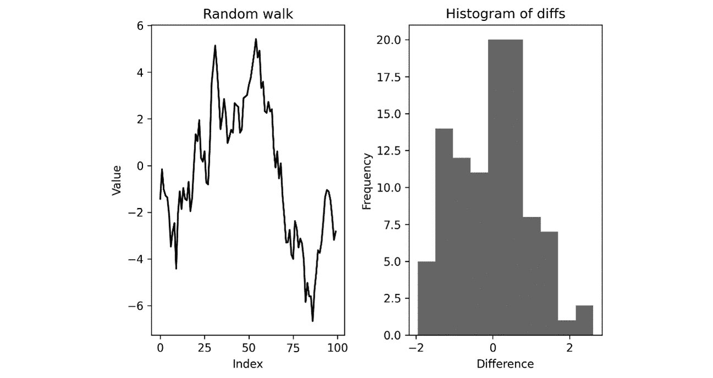

图 6.1 – 来自 DataFrame 的行走值和差异的直方图

在这里，我们可以看到，差异的直方图接近标准正态分布（均值 0，方差 1）。随机游走图展示了差异的累计和，并且围绕 0 上下摆动（相当对称）。

## 它是如何工作的...

`Series`（或`DataFrame`）上的`plot`方法是一种快速的方式，用于将其包含的数据与行索引进行绘制。`kind`关键字参数用于控制绘制的图表类型，默认情况下是折线图。还有许多绘图类型的选项，包括`bar`用于垂直条形图，`barh`用于水平条形图，`hist`用于直方图（在本教程中也有提到），`box`用于箱线图，`scatter`用于散点图。还有其他几个关键字参数可用于自定义生成的图表。在本教程中，我们还提供了`title`关键字参数，为每个子图添加标题。

由于我们希望将两个图表并排放置在同一图形上，使用之前已创建的子图，因此我们使用 `ax` 关键字参数将相应的坐标轴句柄传递给绘图例程。即使你让 `plot` 方法构建图形，你可能仍然需要使用 `plt.show` 例程来显示图形并应用某些设置。

## 还有更多...

我们可以通过 pandas 接口生成几种常见的图表类型。除了本食谱中提到的图表外，还包括散点图、条形图（水平条形图和垂直条形图）、区域图、饼图和箱型图。`plot` 方法还接受各种关键字参数，用于自定义图表的外观。

# 从 DataFrame 获取描述性统计数据

描述性统计数据，或称汇总统计数据，是与一组数据相关的简单值，例如均值、中位数、标准差、最小值、最大值和四分位数。这些值从不同角度描述了数据集的位置和分布。均值和中位数是数据中心（位置）的度量，而其他值衡量数据从均值和中位数的分散程度。这些统计数据对于理解数据集至关重要，并且构成了许多分析技术的基础。

在本食谱中，我们将学习如何为 `DataFrame` 中的每一列生成描述性统计数据。

## 准备工作

对于本食谱，我们需要导入 pandas 包并命名为 `pd`，导入 NumPy 包并命名为 `np`，导入 Matplotlib 的 `pyplot` 模块并命名为 `plt`，并通过以下命令创建默认的随机数生成器：

```py
from numpy.random import default_rng
rng = default_rng(12345)
```

## 如何实现...

以下步骤展示了如何为 `DataFrame` 中的每一列生成描述性统计数据：

1.  首先，我们将创建一些示例数据供我们分析：

    ```py
    uniform = rng.uniform(1, 5, size=100)
    ```

    ```py
    normal = rng.normal(1, 2.5, size=100)
    ```

    ```py
    bimodal = np.concatenate([rng.normal(0, 1, size=50), 
    ```

    ```py
        rng.normal(6, 1, size=50)])
    ```

    ```py
    df = pd.DataFrame({
    ```

    ```py
        "uniform": uniform, 
    ```

    ```py
        "normal": normal, 
    ```

    ```py
        "bimodal": bimodal
    ```

    ```py
    })
    ```

1.  接下来，我们将绘制数据的直方图，以便了解 `DataFrame` 对象中数据的分布：

    ```py
    fig, (ax1, ax2, ax3) = plt.subplots(1, 3,
    ```

    ```py
                                        tight_layout=True)
    ```

    ```py
    df["uniform"].plot(kind="hist",
    ```

    ```py
        title="Uniform", ax=ax1, color="k", alpha=0.6)
    ```

    ```py
    df["normal"].plot(kind="hist",
    ```

    ```py
        title="Normal", ax=ax2, color="k", alpha=0.6)
    ```

1.  为了更好地观察 `bimodal` 数据的分布，我们将直方图的箱数更改为 `20`：

    ```py
    df["bimodal"].plot(kind="hist", title="Bimodal",
    ```

    ```py
        ax=ax3, bins=20, color="k", alpha=0.6)
    ```

1.  pandas `DataFrame` 对象有一个方法，可以获取每一列的几种常见描述性统计数据。`describe` 方法会创建一个新的 `DataFrame`，该 `DataFrame` 的列标题与原始对象相同，每一行包含不同的描述性统计数据：

    ```py
    descriptive = df.describe()
    ```

1.  我们还必须计算 *峰度* 并将其添加到我们刚刚获得的新 `DataFrame` 对象中。我们还必须将描述性统计数据打印到控制台，以查看这些值是什么：

    ```py
    descriptive.loc["kurtosis"] = df.kurtosis()
    ```

    ```py
    print(descriptive)
    ```

    ```py
    #             uniform      normal     bimodal
    ```

    ```py
    # count     100.000000 100.000000 100.000000
    ```

    ```py
    # mean         2.813878   1.087146   2.977682
    ```

    ```py
    # std           1.093795   2.435806   3.102760
    ```

    ```py
    # min           1.020089  -5.806040  -2.298388
    ```

    ```py
    # 25%           1.966120  -0.498995   0.069838
    ```

    ```py
    # 50%           2.599687   1.162897   3.100215
    ```

    ```py
    # 75%           3.674468   2.904759   5.877905
    ```

    ```py
    # max           4.891319   6.375775   8.471313
    ```

    ```py
    # kurtosis  -1.055983   0.061679  -1.604305
    ```

1.  最后，我们必须在直方图中添加垂直线，以显示每种情况下均值的值：

    ```py
    uniform_mean = descriptive.loc["mean", "uniform"]
    ```

    ```py
    normal_mean = descriptive.loc["mean", "normal"]
    ```

    ```py
    bimodal_mean = descriptive.loc["mean", "bimodal"]
    ```

    ```py
    ax1.vlines(uniform_mean, 0, 20, "k")
    ```

    ```py
    ax2.vlines(normal_mean, 0, 25, "k")
    ```

    ```py
    ax3.vlines(bimodal_mean, 0, 20, "k")
    ```

结果的直方图如下所示：

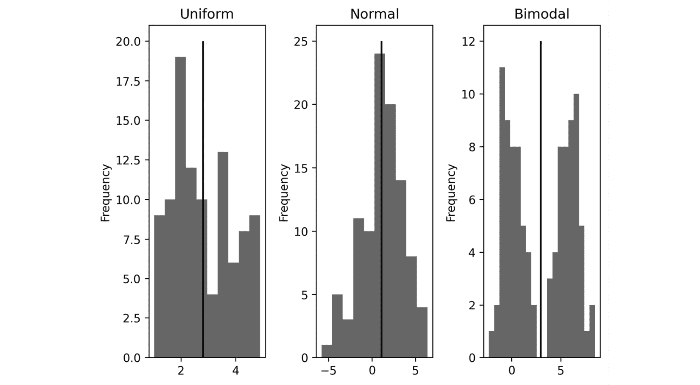

图 6.2 – 三组数据的直方图及其均值标示

在这里，我们可以看到平均值对于正态分布的数据（中间）是中心的，但对于均匀分布的数据（左侧），分布的“质量”稍微偏向于左侧的较低值。对于双峰日（右侧），平均线恰好位于质量的两个组成部分之间。

## 工作原理...

`describe` 方法返回一个包含以下数据描述统计的 `DataFrame`：计数、平均值、标准差、最小值、25% 四分位数、中位数（50% 四分位数）、75% 四分位数和最大值。计数、最小值和最大值都很容易理解。平均值和中位数是数据的两种不同的*平均值*，大致代表数据的中心值。平均值的定义应该很熟悉，即所有值的总和除以值的数量。我们可以用以下公式表示这个数量：

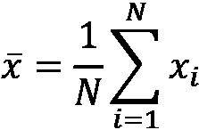

这里，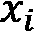 值代表数据值， 是数值（计数）的数量。在这里，我们还采用了用横线表示平均值的常见符号。中位数是当所有数据排序时的“中间值”（如果值的数量为奇数，则取两个中间值的平均值）。25% 和 75% 处的四分位数同样定义，但是取有序值的 25%或 75%处的值。你也可以将最小值视为 0%四分位数，最大值视为 100%四分位数。

**标准差**是数据与平均值之间的分布范围的度量，与统计学中经常提到的另一个量**方差**有关。方差是标准差的平方，定义如下：

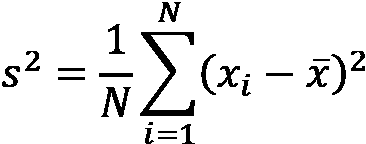

在这里你可能也会看到分数中出现的，这是在从样本估计总体参数时对**偏差**的校正。我们将在下一个示例中讨论总体参数及其估计。标准差、方差、四分位数、最大值和最小值描述了数据的分布。例如，如果最大值为 5，最小值为 0，25%四分位数为 2，75%四分位数为 4，则表示大部分（实际上至少 50%的值）的数据集中在 2 和 4 之间。

*峰度*是衡量数据在分布的“尾部”（远离均值的地方）集中程度的指标。这种指标不像我们在本教程中讨论的其他量那样常见，但它确实在某些分析中会出现。我们在这里主要是为了演示如何计算在`describe`方法返回的`DataFrame`对象中未出现的汇总统计量——这里是`kurtosis`方法。对于计算均值（`mean`）、标准差（`std`）以及`describe`方法中的其他量，当然也有单独的方法。

注意

当 pandas 计算本教程中描述的各项量时，它会自动忽略任何由 NaN 表示的“缺失值”。这也会反映在描述性统计中报告的计数中。

## 还有更多...

我们在统计中包含的第三个数据集说明了观察数据的重要性，以确保我们计算的数值合理。事实上，我们计算出的均值约为`2.9`，但从直方图来看，显然大多数数据远离这个值。我们应该始终检查我们计算的汇总统计量是否能准确地反映样本数据的特征。仅仅引用均值可能会对样本产生不准确的描述。

# 使用抽样理解总体

统计学中的一个核心问题是进行估计——并量化这些估计的准确性——即在只有一个小（随机）样本的情况下，估计整个总体的分布。一个经典的例子是估计一个国家所有人群的平均身高，方法是测量一个随机选取的人的身高。这类问题在真实的总体分布无法实测时特别有趣，通常我们指的总体均值就是指整体人口的均值。在这种情况下，我们必须依赖统计学知识和一个（通常要小得多的）随机选取的样本来估计总体的真实均值和标准差，同时也量化我们估计的准确性。正是后者导致了公众对统计学的困惑、误解和错误解读。

在本教程中，我们将学习如何估算总体均值，并为这些估算提供**置信区间**。

## 准备工作

对于本教程，我们需要导入`pandas`包并使用别名`pd`，导入 Python 标准库中的`math`模块，并导入 SciPy 的`stats`模块，使用以下命令：

```py
from scipy import stats
```

让我们学习如何使用 SciPy 的统计函数构建置信区间。

## 如何操作...

在接下来的步骤中，我们将基于随机选取的 20 人的样本，估算英国男性的平均身高：

1.  首先，我们必须将样本数据加载到 pandas `Series`中：

    ```py
    sample_data = pd.Series(
    ```

    ```py
        [172.3, 171.3, 164.7, 162.9, 172.5, 176.3, 174.8,
    ```

    ```py
        171.9,176.8, 167.8, 164.5, 179.7, 157.8, 170.6,
    ```

    ```py
        189.9, 185., 172.7, 165.5, 174.5, 171.5]
    ```

    ```py
    )
    ```

1.  接下来，我们必须计算样本的均值和标准差：

    ```py
    sample_mean = sample_data.mean()
    ```

    ```py
    sample_std = sample_data.std()
    ```

    ```py
    print(f"Mean {sample_mean}, st. dev {sample_std}")
    ```

    ```py
    # Mean 172.15, st. dev 7.473778724383846
    ```

1.  然后，我们必须计算**标准误差**，如下所示：

    ```py
    N = sample_data.count()
    ```

    ```py
    std_err = sample_std/math.sqrt(N)
    ```

1.  我们必须从学生 t 分布中计算出我们希望的置信度所需的**临界值**：

    ```py
    cv_95, cv_99 = stats.t.ppf([0.975, 0.995], df=N-1)
    ```

1.  现在，我们可以使用以下代码计算真实总体均值的 95%和 99%置信区间：

    ```py
    pm_95 = cv_95*std_err
    ```

    ```py
    conf_interval_95 = [sample_mean - pm_95,
    ```

    ```py
        sample_mean + pm_95]
    ```

    ```py
    pm_99 = cv_99*std_err
    ```

    ```py
    conf_interval_99 = [sample_mean - pm_99,
    ```

    ```py
        sample_mean + pm_99]
    ```

    ```py
    print("95% confidence", conf_interval_95)
    ```

    ```py
    # 95% confidence [168.65216388659374, 175.64783611340627]
    ```

    ```py
    print("99% confidence", conf_interval_99)
    ```

    ```py
    # 99% confidence [167.36884119608774, 176.93115880391227]
    ```

## 它是如何工作的...

参数估计的关键是正态分布，我们在*第四章*《与随机性和概率打交道》中讨论过它。如果我们找到标准正态分布的临界值！[](img/Formula_06_006.png)，使得一个标准正态分布随机数小于该值的概率为 97.5%，那么该随机数位于！[](img/Formula_06_008.png)和！[](img/Formula_06_009.png)之间的概率为 95%（每尾 2.5%）。这个临界值！[](img/Formula_06_010.png)的结果是 1.96，保留到小数点后两位。也就是说，我们可以 95%确定一个标准正态分布随机数的值介于！[](img/Formula_06_011.png)和！[](img/Formula_06_012.png)之间。类似地，99%置信度的临界值是 2.58（保留到小数点后两位）。

如果我们的样本是“大的”，我们可以调用 SciPy `stats`模块中的`stats.t.ppf`例程。

学生 t 分布与正态分布相关，但它有一个参数——自由度——改变分布的形态。随着自由度的增加，学生 t 分布将越来越像正态分布。你认为分布足够相似的临界点取决于你的应用和数据。一个常见的经验法则是样本量为 30 时，可以调用中心极限定理，直接使用正态分布，但这并不一定是一个好规则。你在基于样本做出推论时要非常小心，尤其是当样本相对于总体来说非常小的时候。

一旦我们得到了临界值，就可以通过将临界值乘以样本的标准误差，然后将结果加减到样本均值上来计算真实总体均值的置信区间。标准误差是给定样本量的样本均值分布的扩展的近似值，相对于真实总体均值。这就是为什么我们使用标准误差来提供我们对总体均值估计的置信区间。当我们将标准误差乘以从学生 t 分布（在此情况下）获得的临界值时，我们得到了观察到的样本均值与真实总体均值之间的最大差异估计值，该差异值对应于给定的置信水平。

在本节中，这意味着我们有 95% 的信心认为英国男性的平均身高位于 168.7 cm 和 175.6 cm 之间，且我们有 99% 的信心认为英国男性的平均身高位于 167.4 cm 和 176.9 cm 之间。我们的样本来自一个均值为 175.3 cm，标准差为 7.2 cm 的总体。这个真实的均值（175.3 cm）确实位于我们的两个置信区间内，但只是勉强。

## 另请参见

有一个非常有用的包叫做 `uncertainties`，用于处理涉及带有不确定性的值的计算。更多信息请参见 *第十章* 中的 *计算中的不确定性处理* 配方，位于 *提高生产力* 一章。

# 在 `DataFrame` 中对分组数据执行操作

pandas `DataFrame` 的一个重要特性是可以通过特定列中的值对数据进行分组。例如，我们可以按生产线 ID 和班次 ID 对装配线数据进行分组。能够以符合人体工程学的方式对这些分组数据进行操作非常重要，因为数据通常是为了分析而聚合的，但在预处理时需要进行分组。

在本节中，我们将学习如何对 `DataFrame` 中的分组数据执行操作。我们还将借此机会展示如何对（分组的）数据的滚动窗口进行操作。

## 准备工作

对于本节，我们需要导入 NumPy 库并命名为 `np`，导入 Matplotlib 的 `pyplot` 接口并命名为 `plt`，还需要导入 pandas 库并命名为 `pd`。我们还需要如下创建一个默认随机数生成器的实例：

```py
rng = np.random.default_rng(12345)
```

在开始之前，我们还需要设置 Matplotlib 绘图设置，以便在本节中更改绘图样式。我们将改变在同一坐标轴上生成多个图形时，循环使用的绘图样式机制，这通常会导致不同的颜色。为了实现这一点，我们将其更改为生成黑色线条并使用不同的线条样式：

```py
from matplotlib.rcsetup import cycler
plt.rc("axes", prop_cycle=cycler(
    c=["k"]*3, ls=["-", "--", "-."]))
```

现在，让我们学习如何使用 pandas `DataFrame` 的分组功能。

## 如何操作...

按照以下步骤，学习如何在 pandas `DataFrame` 中对分组数据执行操作：

1.  首先，我们需要在 `DataFrame` 中生成一些示例数据。对于这个示例，我们将生成两个标签列和一个数值数据列：

    ```py
    labels1 = rng.choice(["A", "B", "C"], size=50)
    ```

    ```py
    labels2 = rng.choice([1, 2], size=50)
    ```

    ```py
    data = rng.normal(0.0, 2.0, size=50)
    ```

    ```py
    df = pd.DataFrame({"label1": labels1, "label2": labels2, "data": data})
    ```

1.  接下来，让我们添加一个新列，该列由按第一个标签 `"label1"` 分组的 `"data"` 列的累积和组成：

    ```py
    df[“first_group”] = df.groupby(“label1”)[“data”].cumsum()
    ```

    ```py
    print(df.head())
    ```

现在，`df` 的前五行如下：

```py
  label1  label2      data  first_group
0      C       2  0.867309     0.867309
1      A       2  0.554967     0.554967
2      C       1  1.060505     1.927814
3      A       1  1.073442     1.628409
4      A       1  1.236700     2.865109
```

在这里，我们可以看到 `"first_group"` 列包含了 `"label1"` 列中每个标签的累积和。例如，第 0 行和第 1 行的和只是 `"data"` 列中的值。第 2 行的新条目是第 0 行和第 2 行数据的总和，因为这两行是第一个带有标签 "`C`" 的行。

1.  现在，让我们对 `"label1"` 和 `"label2"` 列同时进行分组：

    ```py
    grouped = df.groupby(["label1", "label2"])
    ```

1.  现在，我们可以使用 `transform` 和 `rolling` 方法在分组数据上计算每组内连续条目的滚动均值：

    ```py
    df["second_group"] = grouped["data"].transform(lambda d:
    ```

    ```py
        d.rolling(2, min_periods=1).mean())
    ```

    ```py
    print(df.head())
    ```

    ```py
    print(df[df["label1"]=="C"].head())
    ```

前五行打印结果如下：

```py
  label1  label2      data  first_group  second_group
0      C       2  0.867309     0.867309      0.867309
1      A       2  0.554967     0.554967      0.554967
2      C       1  1.060505     1.927814      1.060505
3      A       1  1.073442     1.628409      1.073442
4      A       1  1.236700     2.865109      1.155071
```

与之前一样，前几行都表示不同的组，因此 `"second_group"` 列中的值与 `"data"` 列中的相应值相同。第 4 行的值是第 3 行和第 4 行数据值的平均值。接下来的五行是标签为 `C` 的行：

```py
  label1  label2      data  first_group  second_group
0      C       2  0.867309     0.867309      0.867309
2      C       1  1.060505     1.927814      1.060505
5      C       1 -1.590035     0.337779     -0.264765
7      C       1 -3.205403    -2.867624     -2.397719
8      C       1  0.533598    -2.334027     -1.335903
```

在这里，我们可以更清楚地看到滚动平均值和累计和。除了第一行外，其他行的标签都相同。

1.  最后，让我们绘制由 `"label1"` 列分组的 `"first_group"` 列的值：

    ```py
    fig, ax = plt.subplots()
    ```

    ```py
    df.groupby("label1")["first_group"].plot(ax=ax)
    ```

    ```py
    ax.set(title="Grouped data cumulative sums",     xlabel="Index", ylabel="value")
    ```

    ```py
    ax.legend()
    ```

结果图如 *图 6.3* 所示：


图 6.3 – 按 `label1` 组绘制的累计和图

在这里，我们可以看到每个组在图上都产生了一条不同的线。这是一种快速简便的方法，可以从 `DataFrame` 中绘制分组数据的图。（请记住，在 *准备工作* 部分中我们更改了默认的样式周期，使得图表风格在页面上更加鲜明。）

## 它是如何工作的...

`groupby` 方法为 DataFrame 创建了一个代理，其索引是从请求的列中生成的。我们可以在这个代理对象上执行操作。在这种情况下，我们使用 `cumsum` 方法来生成每个组内 `"data"` 列的累计和。我们可以使用这种方法以相同的方式生成分组数据的汇总统计信息。这对于数据探索非常有用。

在这个食谱的第二部分，我们根据两个不同的标签列进行了分组，并对每个组计算了滚动平均值（窗口长度为 2）。请注意，我们使用 `transform` 方法“包装”了这个计算，而不是直接在分组的 `DataFrame` 上调用 `rolling`。这样做是为了确保结果具有正确的索引，可以放回到 `df` 中。否则，`mean` 的输出将继承分组索引，我们将无法将结果放回到 `df` 中。我们在 `rolling` 上使用了 `min_periods` 可选参数，以确保所有行都有值。否则，窗口大小之前的行将被分配为 NaN。

这个食谱的最后一部分使用了 `plot` 函数，绘制了按 `"label1"` 分组的数据。这是一种快速简便的方法，可以从同一个 `DataFrame` 对象中绘制多个数据流。不幸的是，在这种情况下，定制绘图稍显困难，尽管可以通过使用 Matplotlib 中的 `rcparams` 设置来完成。

# 使用 t 检验进行假设检验

统计学中最常见的任务之一是测试一个关于正态分布人口均值的假设有效性，前提是你已经从该人口中收集了样本数据。例如，在质量控制中，我们可能希望检验一个生产厂的板材厚度是否为 2 毫米。为了进行此测试，我们可以随机选择样本板材并测量其厚度，从而获得样本数据。然后，我们可以使用 `stats` 模块计算 t 统计量和 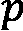 值。如果  值低于 0.05，则我们以 5% 的显著性水平（95% 的置信度）接受零假设。如果 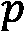 值大于 0.05，则我们必须拒绝零假设，支持替代假设。

在这个食谱中，我们将学习如何使用 t 检验来检验给定样本的假设人口均值是否有效。

## 准备工作

对于这个食谱，我们需要导入 pandas 包并命名为 `pd`，同时导入 SciPy `stats` 模块，使用以下命令：

```py
from scipy import stats
```

让我们学习如何使用 SciPy `stats` 模块进行 t 检验。

## 如何操作...

按照以下步骤使用 t 检验来检验给定一些样本数据的假设人口均值的有效性：

1.  首先，我们必须将数据加载到 pandas `Series` 中：

    ```py
    sample = pd.Series([
    ```

    ```py
        2.4, 2.4, 2.9, 2.6, 1.8, 2.7, 2.6, 2.4, 2.8, 
    ```

    ```py
        2.4, 2.4, 2.4, 2.7, 2.7, 2.3, 2.4, 2.4, 3.2, 
    ```

    ```py
        2.9, 2.5, 2.5, 3.2, 2\. , 2.3, 3\. , 1.5, 3.1,
    ```

    ```py
        2.5, 2.2, 2.5, 2.1,1.8, 3.1, 2.4, 3\. , 2.5,
    ```

    ```py
        2.7, 2.1, 2.3, 2.2, 2.5, 2.6, 2.5, 2.8, 2.5,
    ```

    ```py
        2.9, 2.1, 2.8, 2.1, 2.3
    ```

    ```py
    ])
    ```

1.  现在，让我们设置假设的人口均值和我们将进行检验的显著性水平：

    ```py
    mu0 = 2.0
    ```

    ```py
    significance = 0.05
    ```

1.  接下来，我们将使用 SciPy `stats` 模块中的 `ttest_1samp` 例程来生成 t 统计量和 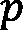 值：

    ```py
    t_statistic, p_value = stats.ttest_1samp(sample, mu0)
    ```

    ```py
    print(f"t stat: {t_statistic}, p value: {p_value}")
    ```

    ```py
    # t stat: 9.752368720068665, p value: 4.596949515944238e-13
    ```

1.  最后，让我们测试  值是否小于我们选择的显著性水平：

    ```py
    if p_value <= significance:
    ```

    ```py
        print("Reject H0 in favour of H1: mu != 2.0")
    ```

    ```py
    else:
    ```

    ```py
        print("Accept H0: mu = 2.0")
    ```

    ```py
    # Reject H0 in favour of H1: mu != 2.0
    ```

我们可以有 95% 的信心得出结论：样本数据来源的人口均值不等于 2（由于样本中大多数数值大于 2，这并不令人惊讶）。鉴于这里的  值如此之小，我们可以非常有信心地认为这一点是正确的。

## 它是如何工作的...

t 统计量通过以下公式计算：

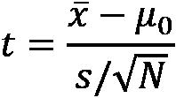

这里，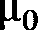 是假设的均值（来自零假设），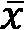 是样本均值， 是样本标准差，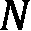 是样本的大小。t 统计量是观察到的样本均值与假设人口均值  之间差异的估算值，经过标准误差标准化。如果假设人口呈正态分布，t 统计量将遵循 t 分布，具有  自由度。通过查看 t 统计量在相应的学生 t 分布中的位置，我们可以大致了解观察到的样本均值来自假设均值人口的可能性。这个值用 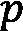 来表示。

值是观察到的样本均值比假设总体均值更极端的概率，前提是假设总体均值等于。如果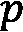值小于我们选择的显著性值，则不能期望真实的总体均值是我们假设的值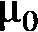。在这种情况下，我们接受备择假设，认为真实的总体均值不等于。

## 还有更多……

本配方中演示的检验是 t 检验的最基本应用。在这里，我们将样本均值与假设的总体均值进行比较，以决定整个总体均值是否合理地是这个假设值。更一般来说，我们可以使用 t 检验来比较两个独立的总体，前提是从每个总体中抽取了样本，使用**双样本 t 检验**，或者比较数据以某种方式配对的总体，使用**配对 t 检验**。这使得 t 检验成为统计学家重要的工具。

显著性和置信度是统计学中经常出现的两个概念。统计学上显著的结果有很高的正确概率。在许多情况下，我们认为任何错误概率低于某个阈值（通常是 5%或 1%）的结果都是统计显著的。置信度是我们对结果有多确定的量化表示。结果的置信度是 1 减去显著性。

不幸的是，结果的显著性往往被误用或误解。说一个结果在 5%的显著性水平上是显著的，意味着我们有 5%的概率错误地接受了零假设。换句话说，如果我们对来自总体的 20 个其他样本重复相同的测试，我们期望至少其中一个样本会给出相反的结果。然而，这并不意味着其中一个样本必然会如此。

高显著性表明我们更确定我们得出的结论是正确的，但这并不能保证情况确实如此。这个配方中的结果就是证据；我们使用的样本来自一个均值为`2.5`，标准差为`0.35`的总体。（样本在创建后进行了某些四舍五入处理，这稍微改变了分布。）这并不是说我们的分析是错误的，或者我们从样本中得出的结论不是正确的。

重要的是要记住，t 检验仅在基础总体遵循正态分布，或至少大致符合时才有效。如果不是这种情况，您可能需要使用非参数检验。我们将在*非参数* *数据*假设检验的章节中讨论这一点。

# 使用 ANOVA 进行假设检验

假设我们设计了一个实验，测试两个新流程与当前流程的差异，并且我们想要测试这些新流程的结果是否与当前流程不同。在这种情况下，我们可以使用**方差分析**（**ANOVA**）来帮助我们判断三组结果的均值是否存在差异（为此，我们需要假设每个样本来自具有共同方差的正态分布）。

在本食谱中，我们将学习如何使用 ANOVA 来比较多个样本之间的差异。

## 准备就绪

对于这个食谱，我们需要使用 SciPy 的 `stats` 模块。我们还需要通过以下命令创建一个默认的随机数生成器实例：

```py
from numpy.random import default_rng
rng = default_rng(12345)
```

## 如何操作…

按照以下步骤执行（单因素）ANOVA 检验，以测试三个不同流程之间的差异：

1.  首先，我们将创建一些样本数据，然后进行分析：

    ```py
    current = rng.normal(4.0, 2.0, size=40)
    ```

    ```py
    process_a = rng.normal(6.2, 2.0, size=25)
    ```

    ```py
    process_b = rng.normal(4.5, 2.0, size=64)
    ```

1.  接下来，我们将设置我们检验的显著性水平：

    ```py
    significance = 0.05
    ```

1.  然后，我们将使用 SciPy `stats` 模块中的 `f_oneway` 例程生成 F 统计量和  值：

    ```py
    F_stat, p_value = stats.f_oneway(
    ```

    ```py
        current, process_a, process_b)
    ```

    ```py
    print(f"F stat: {F_stat}, p value: {p_value}")
    ```

    ```py
    # F stat: 9.949052026027028, p value: 9.732322721019206e-05
    ```

1.  现在，我们必须测试  值是否足够小，以判断我们是否应接受或拒绝原假设，即所有均值相等：

    ```py
    if p_value <= significance:
    ```

    ```py
        print("Reject H0: there is a difference between means")
    ```

    ```py
    else:
    ```

    ```py
        print("Accept H0: all means equal")
    ```

    ```py
    # Reject H0: there is a difference between means
    ```

这里，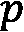 值非常小（在 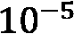 级别），因此差异在 95% 置信度下显著（即，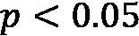），并且在 99% 置信度下也显著（）。

## 工作原理…

ANOVA 是一种强大的技术，可以同时比较多个样本之间的差异。它通过比较样本之间的变异性与总体变异性来工作。ANOVA 在比较三个或更多样本时尤其强大，因为它不会因进行多次检验而产生累积误差。不幸的是，如果 ANOVA 检测到并非所有均值相等，则无法通过检验信息确定哪些样本之间存在显著差异。为此，您需要使用额外的检验来找出差异。

`f_oneway` SciPy `stats` 模块中的例程执行单因素方差分析（ANOVA）检验——ANOVA 中生成的检验统计量遵循 F 分布。再次强调， 值是检验中最关键的信息。如果  值小于我们预先设定的显著性水平（在本食谱中为 5%），我们接受原假设；否则拒绝原假设。

## 还有更多…

ANOVA 方法非常灵活。我们在这里介绍的一元 ANOVA 检验是最简单的情况，因为这里只有一个因子需要检验。二元 ANOVA 检验可以用来检验两个不同因子之间的差异。例如，在药物临床试验中，我们可以进行对照组的测试，同时还衡量性别（例如）对结果的影响。不幸的是，SciPy 在 `stats` 模块中没有执行二元 ANOVA 的例程。你需要使用其他包，如 `statsmodels` 包。

如前所述，ANOVA 只能检测是否存在差异。如果存在显著差异，它无法检测这些差异发生在哪里。例如，我们可以使用 Durnett 检验来测试其他样本的均值是否与对照样本的均值不同，或者使用 Tukey 范围检验来测试每个组的均值与其他所有组的均值。

# 非参数数据的假设检验

t 检验和 ANOVA 的一个主要缺点是：所采样的总体必须遵循正态分布。在许多应用中，这并不太具限制性，因为许多实际的总体值遵循正态分布，或者某些定理（例如中心极限定理）允许我们分析相关数据。然而，实际上并非所有的总体值都以合理的方式遵循正态分布。对于这些（幸运的是，较为少见的）情况，我们需要使用一些替代的检验统计量，作为 t 检验和 ANOVA 的替代方法。

在本方案中，我们将使用 Wilcoxon 秩和检验和 Kruskal-Wallis 检验来检验两个（或更多，在后一种情况下）总体之间的差异。

## 准备工作

对于此方案，我们将需要导入 pandas 包作为 `pd`，SciPy 的 `stats` 模块，以及使用以下命令创建一个默认的随机数生成器实例：

```py
from numpy.random import default_rng
rng = default_rng(12345)
```

让我们学习如何使用 SciPy `stats` 中的非参数假设检验工具。

## 如何操作…

按照以下步骤比较两个或更多非正态分布的样本：

1.  首先，我们将生成一些样本数据来进行分析：

    ```py
    sample_A = rng.uniform(2.5, 3.5, size=25)
    ```

    ```py
    sample_B = rng.uniform(3.0, 4.4, size=25)
    ```

    ```py
    sample_C = rng.uniform(3.1, 4.5, size=25)
    ```

1.  接下来，我们将设定分析中使用的显著性水平：

    ```py
    significance = 0.05
    ```

1.  现在，我们将使用 `stats.kruskal` 例程生成检验统计量和  值，用于检验原假设，即总体具有相同的中位数值：

    ```py
    statistic, p_value = stats.kruskal(sample_A, sample_B,
    ```

    ```py
        sample_C)
    ```

    ```py
    print(f"Statistic: {statistic}, p value: {p_value}")
    ```

    ```py
    # Statistic: 40.22214736842102, p value: 1.8444703308682906e-09
    ```

1.  我们将使用条件语句打印测试结果的陈述：

    ```py
    if p_value <= significance:
    ```

    ```py
        print("There are differences between population  medians")
    ```

    ```py
    else:
    ```

    ```py
        print("Accept H0: all medians equal")
    ```

    ```py
    # There are differences between population medians
    ```

1.  现在，我们将使用 Wilcoxon 秩和检验获取每对样本比较的  值。这些检验的原假设是它们来自同一分布：

    ```py
    _, p_A_B = stats.ranksums(sample_A, sample_B)
    ```

    ```py
    _, p_A_C = stats.ranksums(sample_A, sample_C)
    ```

    ```py
    _, p_B_C = stats.ranksums(sample_B, sample_C)
    ```

1.  接下来，我们将使用条件语句打印出那些表示显著差异的比较结果：

    ```py
    if p_A_B <= significance:
    ```

    ```py
        print("Significant differences between A and B,
    ```

    ```py
            p value", p_A_B)
    ```

    ```py
    # Significant differences between A and B, p value
    ```

    ```py
    1.0035366080480683e-07
    ```

    ```py
    if p_A_C <= significance:
    ```

    ```py
        print("Significant differences between A and C,
    ```

    ```py
            p value", p_A_C)
    ```

    ```py
    # Significant differences between A and C, p value
    ```

    ```py
    2.428534673701913e-08
    ```

    ```py
    if p_B_C <= significance:
    ```

    ```py
        print("Significant differences between B and C,
    ```

    ```py
            p value", p_B_C)
    ```

    ```py
    else:
    ```

    ```py
        print("No significant differences between B and C,
    ```

    ```py
            p value", p_B_C)
    ```

    ```py
    # No significant differences between B and C, p value
    ```

    ```py
    0.3271631660572756
    ```

这些打印出来的线条显示我们的测试发现，A 组和 B 组、A 组和 C 组之间存在显著差异，但 B 组和 C 组之间没有差异。

## 它是如何工作的...

我们说数据是非参数的，如果数据来源的总体不符合可以通过少量参数描述的分布。这通常意味着总体不是正态分布的，但范围比这更广。在本示例中，我们从均匀分布中抽样，但这仍然是一个比我们通常需要使用非参数检验时更为结构化的例子。非参数检验可以且应该用于任何我们不确定基础分布的情况。这样做的代价是，检验的效力稍微较弱。

任何（真实的）分析的第一步应该是绘制数据的直方图并直观地检查分布。如果你从一个正态分布的总体中抽取随机样本，你也可以预期样本呈正态分布（在本书中我们已经多次看到这一点）。如果你的样本显示出正态分布的特征性钟形曲线，那么该总体很可能是正态分布的。你还可以使用`kind="kde"`。如果你仍然不确定总体是否符合正态分布，可以使用统计检验，例如 D'Agostino 的 K-squared 检验或皮尔逊卡方检验来检验正态性。这两种检验被结合成一个名为`normaltest`的常规方法，用于在 SciPy 的`stats`模块中进行正态性检验，此外还包括其他几种正态性检验。

Wilcoxon 秩和检验是两样本 t 检验的非参数替代方法。与 t 检验不同，秩和检验不是通过比较样本均值来量化总体是否具有不同的分布。相反，它将样本数据合并并按大小排序。检验统计量由样本中元素最少的那一组的秩和生成。从这里开始，像往常一样，我们生成值，用于检验两个总体是否具有相同分布的原假设。

Kruskal-Wallis 检验是单因素方差分析（ANOVA）检验的非参数替代方法。与秩和检验类似，它利用样本数据的排序生成检验统计量和值，用以检验所有总体的中位数是否相同的原假设。与单因素方差分析一样，我们只能检测所有总体的中位数是否相同，而不能指出差异所在。要做这个，我们还需要使用额外的检验方法。

在本食谱中，我们使用了 Kruskal-Wallis 测试来判断我们的三个样本对应的群体之间是否存在显著差异。我们发现了一个差异，具有非常小的  值。接着我们使用秩和检验来确定群体之间差异的具体位置。在这里，我们发现样本 A 与样本 B 和 C 有显著差异，但 B 与 C 之间没有显著差异。考虑到这些样本的生成方式，这并不令人惊讶。

注意

不幸的是，由于我们在本食谱中使用了多个测试，我们对结论的整体信心并不像我们预期的那样高。我们进行了四次 95%置信度的测试，这意味着我们对结论的总体信心只有大约 81%。这是因为多次测试的误差会累积，从而降低总体信心。为了解决这个问题，我们需要调整每个测试的显著性阈值，使用 Bonferroni 校正（或类似方法）。

# 使用 Bokeh 创建交互式图表

测试统计和数值推理对于系统地分析数据集非常有用。然而，它们并不能像图表那样给我们一个整体数据的清晰图像。数值值是确定性的，但在统计学中往往难以理解，而图表则能立即直观地展示数据集之间的差异和趋势。因此，存在大量的库，可以用更富创意的方式绘制数据。一个特别有趣的数据绘图库是 Bokeh，它通过利用 JavaScript 库，允许我们在浏览器中创建交互式图表。

在本食谱中，我们将学习如何使用 Bokeh 创建一个可以在浏览器中显示的交互式图表。

## 准备工作

对于本食谱，我们需要导入 pandas 包作为 `pd`，导入 NumPy 包作为 `np`，并使用以下代码构造默认的随机数生成器实例，还需要导入 Bokeh 的 `plotting` 模块，并用 `bk` 别名导入：

```py
from bokeh import plotting as bk
from numpy.random import default_rng
rng = default_rng(12345)
```

## 如何操作...

这些步骤展示了如何使用 Bokeh 在浏览器中创建交互式图表：

1.  首先，我们需要创建一些样本数据来绘制图表：

    ```py
    date_range = pd.date_range("2020-01-01", periods=50)
    ```

    ```py
    data = rng.normal(0, 3, size=50).cumsum()
    ```

    ```py
    series = pd.Series(data, index=date_range)
    ```

1.  接下来，我们必须使用 `output_file` 函数指定一个输出文件，用于存储图表的 HTML 代码：

    ```py
    bk.output_file("sample.html")
    ```

1.  现在，我们将创建一个新的图形，并设置标题和坐标轴标签，同时将 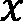 轴类型设置为 `datetime`，以便我们的日期索引能够正确显示：

    ```py
    fig = bk.figure(title="Time series data", 
    ```

    ```py
                           x_axis_label="date",
    ```

    ```py
                           x_axis_type="datetime",
    ```

    ```py
                           y_axis_label="value")
    ```

1.  我们将数据作为一条线添加到图形中：

    ```py
    fig.line(date_range, series)
    ```

1.  最后，我们可以使用 `show` 函数或 `save` 函数来保存或更新指定输出文件中的 HTML。在这里我们使用 `show` 来使图表在浏览器中打开：

    ```py
    bk.show(fig)
    ```

Bokeh 图表不是静态对象，应该通过浏览器进行交互。为了进行比较，这里使用`matplotlib`重新创建了 Bokeh 图表中将显示的数据：

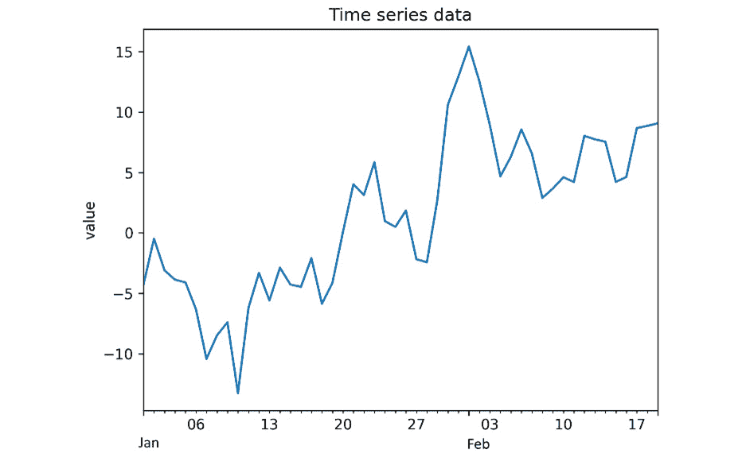

图 6.4 – 使用 Matplotlib 创建的时间序列数据图

图 6.4 – 使用 Matplotlib 创建的时间序列数据图

Bokeh 的真正优势在于其能够将动态、交互式的图表插入到网页和文档中（例如，Jupyter 笔记本），这样读者就可以深入查看绘制数据的细节。

## 它是如何工作的…

Bokeh 使用 JavaScript 库在浏览器中渲染图表，数据由 Python 后端提供。这样做的优点是，用户可以自行检查图表。例如，我们可以放大以查看可能隐藏的图表细节，或自然地平移数据。此食谱中给出的示例只是使用 Bokeh 可以实现的功能的一个尝试。

`figure`例程创建一个表示图表的对象，我们向其中添加元素——例如，通过数据点的线——就像我们在 Matplotlib `Axes`对象中添加图表一样。在这个食谱中，我们创建了一个简单的 HTML 文件，其中包含 JavaScript 代码来渲染数据。每次保存或调用`show`例程时，这段 HTML 代码会被导出到指定文件。实际上，值越小，我们就越能确信假设的总体均值是正确的。

## 还有更多…

Bokeh 的功能远远超出了这里的描述。Bokeh 图表可以嵌入到诸如 Jupyter 笔记本之类的文件中，而这些文件也会在浏览器中渲染，或者嵌入到现有的网站中。如果你使用的是 Jupyter 笔记本，应该使用`output_notebook`例程，而不是`output_file`例程，将图表直接打印到笔记本中。它具有多种不同的绘图样式，支持在图表之间共享数据（例如，数据可以在一个图表中选择并在其他图表中突出显示），并支持流数据。

# 进一步阅读

统计学和统计理论方面有大量的教材。以下书籍是本章所涉及的统计学内容的良好参考：

+   Mendenhall, W., Beaver, R., 和 Beaver, B.（2006 年），*概率与统计导论*。第 12 版，（加利福尼亚州贝尔蒙特：Thomson Brooks/Cole）。

+   Freedman, D., Pisani, R., 和 Purves, R.（2007 年），*统计学*。纽约：W.W. Norton。

pandas 文档（[`pandas.pydata.org/docs/index.html`](https://pandas.pydata.org/docs/index.html)）和以下的 pandas 书籍是学习 pandas 的好参考：

+   McKinney, W.（2017 年），*Python 数据分析*。第二版，（Sebastopol：O'Reilly Media, Inc，美国）。

SciPy 文档 ([`docs.scipy.org/doc/scipy/tutorial/stats.html`](https://docs.scipy.org/doc/scipy/tutorial/stats.html)) 还包含了关于本章多次使用的统计模块的详细信息。
