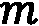
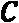
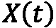
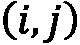
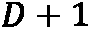
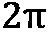

# 第七章：使用回归和预测

统计学家或数据科学家的一个最重要的任务是生成关于两组数据之间关系的系统理解。这可能意味着两组数据之间的*连续*关系，其中一个值直接依赖于另一个变量的值。或者，这也可能意味着类别关系，其中一个值根据另一个值进行分类。处理这些问题的工具是*回归*。回归在最基本的形式下，涉及将一条直线拟合到两组数据的散点图中，并进行一些分析，以查看这条直线如何*拟合*数据。当然，我们通常需要更复杂的模型来模拟现实世界中存在的复杂关系。

预测通常是指通过学习时间序列数据中的趋势，以预测未来的值。时间序列数据是指在一段时间内不断变化的数据，通常具有较高的噪声和振荡行为。与更简单的数据不同，时间序列数据通常在连续值之间具有复杂的依赖关系；例如，一个值可能依赖于前两个值，甚至可能依赖于前面的*噪声*。时间序列建模在科学和经济学中非常重要，且有多种工具可用于建模时间序列数据。处理时间序列数据的基本技术称为**自回归积分滑动平均**（**ARIMA**）。该模型包含两个基本组成部分：**自回归**（**AR**）成分和**滑动平均**（**MA**）成分，用以构建观察数据的模型。

本章将学习如何建模两组数据之间的关系，量化这种关系的强度，并生成关于其他值（未来）的预测。接着，我们将学习如何在分类问题中使用逻辑回归，这是一种简单线性模型的变体。最后，我们将使用 ARIMA 构建时间序列数据的模型，并在这些模型的基础上，针对不同种类的数据进行扩展。本章的最后，我们将使用一个名为 Prophet 的库，自动生成时间序列数据的模型。

在前三个食谱中，我们将学习如何对简单数据执行各种回归方法。在接下来的四个食谱中，我们将学习处理时间序列数据的各种技术。最后一个食谱介绍了使用签名方法总结时间序列数据的替代手段，用于不同目的。

本章将涵盖以下内容：

+   使用基础线性回归

+   使用多元线性回归

+   使用对数回归进行分类

+   使用 ARMA 建模时间序列数据

+   使用 ARIMA 从时间序列数据进行预测

+   使用 ARIMA 预测季节性数据

+   使用 Prophet 建模时间序列数据

+   使用签名法总结时间序列数据

开始吧！

# 技术要求

在本章中，和往常一样，我们需要导入 NumPy 包并命名为`np`，导入 Matplotlib 的`pyplot`模块并命名为`plt`，以及导入 Pandas 包并命名为`pd`。我们可以通过以下命令来实现：

```py
import numpy as np
import matplotlib.pyplot as plt
import pandas as pd
```

本章中我们还需要一些新包。`statsmodels`包用于回归分析和时间序列分析，`scikit-learn`包（`sklearn`）提供了一般的数据科学和机器学习工具，而 Prophet 包（`prophet`）用于自动建模时间序列数据。这些包可以通过你喜欢的包管理器安装，如`pip`：

```py
python3.10 -m pip install statsmodels sklearn prophet
```

由于依赖关系的原因，Prophet 包在某些操作系统上安装可能会遇到困难。如果安装`prophet`时出现问题，你可以尝试使用 Python 的 Anaconda 发行版及其包管理器`conda`，它更严格地处理依赖关系：

```py
conda install prophet
```

注意

Prophet 库的早期版本（1.0 版本之前）被称为`fbprophet`，而较新的 Prophet 版本仅称为`prophet`。

最后，我们还需要一个名为`tsdata`的小模块，它包含在本章的仓库中。该模块包含一系列用于生成示例时间序列数据的工具。

本章的代码可以在 GitHub 仓库的`Chapter 07`文件夹中找到，链接为[`github.com/PacktPublishing/Applying-Math-with-Python-2nd-Edition/tree/main/Chapter%2007`](https://github.com/PacktPublishing/Applying-Math-with-Python-2nd-Edition/tree/main/Chapter%2007)。

使用基础的线性回归

线性回归是一种用于建模两个数据集之间依赖关系的工具，从而最终能够利用这个模型进行预测。这个名称来源于我们基于第二组数据对第一组数据形成一个线性模型（直线）。在文献中，我们希望建模的变量通常被称为*响应*变量，而我们在这个模型中使用的变量则被称为*预测*变量。

在本章中，我们将学习如何使用`statsmodels`包来执行简单线性回归，以建模两个数据集之间的关系。

## 准备工作

对于本章的这个配方，我们需要导入`statsmodels.api`模块，并命名为`sm`，导入 NumPy 包并命名为`np`，导入 Matplotlib 的`pyplot`模块并命名为`plt`，以及一个 NumPy 默认的随机数生成器实例。所有这些可以通过以下命令实现：

```py
import statsmodels.api as sm
import numpy as np
import matplotlib.pyplot as plt
from numpy.random import default_rng
rng = default_rng(12345)
```

让我们看看如何使用`statsmodels`包进行基础的线性回归。

## 如何操作...

以下步骤概述了如何使用`statsmodels`包对两个数据集执行简单线性回归：

1.  首先，我们生成一些可以分析的示例数据。我们将生成两组数据，展示一个良好的拟合和一个不太好的拟合：

    ```py
    x = np.linspace(0, 5, 25)
    ```

    ```py
    rng.shuffle(x)
    ```

    ```py
    trend = 2.0
    ```

    ```py
    shift = 5.0
    ```

    ```py
    y1 = trend*x + shift + rng.normal(0, 0.5, size=25)
    ```

    ```py
    y2 = trend*x + shift + rng.normal(0, 5, size=25)
    ```

1.  执行回归分析的一个好起点是绘制数据集的散点图。我们将在同一坐标轴上进行此操作：

    ```py
    fig, ax = plt.subplots()
    ```

    ```py
    ax.scatter(x, y1, c="k", marker="x",
    ```

    ```py
        label="Good correlation")
    ```

    ```py
    ax.scatter(x, y2, c="k", marker="o",
    ```

    ```py
        label="Bad correlation")
    ```

    ```py
    ax.legend()
    ```

    ```py
    ax.set_xlabel("X"),
    ```

    ```py
    ax.set_ylabel("Y")
    ```

    ```py
    ax.set_title("Scatter plot of data with best fit lines")
    ```

1.  我们需要使用`sm.add_constant`实用程序例程，以便建模步骤包含常数值：

    ```py
    pred_x = sm.add_constant(x)
    ```

1.  现在，我们可以为我们的第一组数据创建一个`OLS`模型，并使用`fit`方法来拟合模型。然后，我们使用`summary`方法打印数据的摘要：

    ```py
    model1 = sm.OLS(y1, pred_x).fit()
    ```

    ```py
    print(model1.summary())
    ```

1.  我们对第二组数据重复进行模型拟合，并打印摘要：

    ```py
    model2 = sm.OLS(y2, pred_x).fit()
    ```

    ```py
    print(model2.summary())
    ```

1.  现在，我们使用`linspace`创建一个新的值范围，这些值可以用来在散点图上绘制趋势线。我们需要添加`constant`列，以便与我们已经创建的模型交互：

    ```py
    model_x = sm.add_constant(np.linspace(0, 5))
    ```

1.  接下来，我们对模型对象使用`predict`方法，这样我们就可以使用模型预测在之前步骤中生成的每个值对应的响应值：

    ```py
    model_y1 = model1.predict(model_x)
    ```

    ```py
    model_y2 = model2.predict(model_x)
    ```

1.  最后，我们将之前两步中计算的模型数据绘制在散点图上：

    ```py
    ax.plot(model_x[:, 1], model_y1, 'k')
    ```

    ```py
    ax.plot(model_x[:, 1], model_y2, 'k--')
    ```

散点图以及我们添加的最佳拟合线（模型）可以在下图中看到：


图 7.1 - 使用最小二乘回归计算的最佳拟合线的散点图。

实线表示拟合到相关性较好的数据（由**x**符号标记）的线，而虚线表示拟合到相关性较差的数据（由点标记）的线。从图中可以看出，两个最佳拟合线非常相似，但拟合到噪音较多的数据的线（虚线）已经偏离了在*步骤 1*中定义的真实模型。

## 它是如何工作的...

初等数学告诉我们，直线方程由以下公式给出：


这里，是直线与-轴的交点，通常称为-截距，是直线的斜率。在线性回归的背景下，我们试图找到响应变量和预测变量之间的关系，其形式为一条直线，从而实现以下情况：


这里，和是现在需要求解的参数。我们可以用另一种方式写出这个公式，如下所示：


在这里，是一个误差项，一般来说，它依赖于。为了找到“最佳”模型，我们需要找到和参数的值，使得误差项最小化（在适当的意义上）。找到使得误差最小化的参数值的基本方法是最小二乘法，这也为这里使用的回归类型命名为：*普通最小二乘法*。一旦我们使用此方法建立了响应变量与预测变量之间的关系，接下来的任务是评估这个模型到底多么准确地表示了这种关系。为此，我们根据以下方程形成*残差*：


我们对每个数据点都做了相同的处理， 和 。为了对我们建模数据之间关系的准确性进行严格的统计分析，我们需要残差满足某些假设。首先，我们需要它们在概率上是独立的。其次，我们需要它们围绕 0 呈正态分布，并且具有相同的方差（在实践中，我们可以稍微放宽这些假设，仍然可以对模型的准确性做出合理的评估）。

在这个实例中，我们通过线性关系从预测数据生成了响应数据。我们创建的两个响应数据集之间的差异是每个值的误差“大小”。对于第一个数据集`y1`，残差呈正态分布，标准差为 0.5；而对于第二个数据集`y2`，残差的标准差为 5.0。我们可以在*图 7.1*的散点图中看到这种变化，其中`y1`的数据通常非常接近最佳拟合线——这与生成数据时使用的实际关系非常相符——而`y2`的数据则远离最佳拟合线。

来自`statsmodels`包的`OLS`对象是普通最小二乘回归的主要接口。我们将响应数据和预测数据作为数组提供。为了在模型中有一个常数项，我们需要在预测数据中添加一列 1。`sm.add_constant`函数是一个用于添加常数列的简单工具。`OLS`类的`fit`方法计算模型的参数，并返回一个结果对象（`model1`和`model2`），该对象包含最佳拟合模型的参数。`summary`方法创建一个包含有关模型的信息和拟合优度统计的字符串。`predict`方法将模型应用于新数据。顾名思义，它可以用来基于模型进行预测。

在摘要中报告了两个基本统计量，它们为我们提供了拟合情况的信息。第一个是  值，或其调整版本，用来衡量模型解释的变异性与总变异性的比值。该数字定义如下。首先，定义以下量：


在这里， 是之前定义的残差， 是数据的均值。然后我们定义了  及其调整后的对应值：


在后面的方程中， 是样本的大小， 是模型中的变量数（包括 -截距 ）。更高的值表示更好的拟合，最佳值为 1。请注意，普通的  值往往过于乐观，特别是当模型包含更多变量时，因此通常更好地查看调整后的版本。

第二个是 F 统计量的 p 值。这是一个假设检验，检验模型中至少有一个系数不为零。与 ANOVA 检验类似（见 *使用 ANOVA 检验假设*，*第六章*），一个小的 p 值表明模型显著，意味着该模型更有可能准确地描述数据。

在这个模型中，第一个模型 `model1` 的调整后  值为 0.986，表明该模型与数据拟合得非常紧密，且 p 值为 6.43e-19，表明具有很高的显著性。第二个模型的调整后  值为 0.361，表示该模型与数据的拟合度较低，且 p 值为 0.000893，也表明具有较高的显著性。尽管第二个模型与数据的拟合度较低，但在统计学上，这并不意味着它没有用。该模型依然是显著的，虽然其显著性不如第一个模型，但它并没有解释数据中所有的变异性（或者至少没有解释其中的显著部分）。这可能表明数据中存在额外的（非线性）结构，或者数据之间的相关性较弱，这意味着响应数据与预测数据之间的关系较弱（由于我们构造数据的方式，我们知道后者是正确的）。

## 还有更多...

简单线性回归是统计学家工具箱中一个很好的通用工具。它非常适合用于发现两个已知（或怀疑）以某种方式相关的数据集之间的关系。统计学上衡量一个数据集依赖于另一个数据集的程度被称为*相关性*。我们可以使用相关系数来衡量相关性，如*斯皮尔曼等级相关系数*。一个高的正相关系数表示数据之间存在强的正相关关系，例如在这个示例中的情况，而高的负相关系数则表示强的负相关关系，在这种情况下，拟合数据的最佳直线的斜率为负值。相关系数为 0 表示数据不相关：数据之间没有关系。

如果数据集之间有明显的关系，但不是线性（直线）关系，那么它可能遵循多项式关系，例如，一个值与另一个值的平方相关。有时，你可以对其中一个数据集进行变换，比如使用对数变换，然后使用线性回归来拟合变换后的数据。当两个数据集之间存在幂律关系时，对数尤其有用。

`scikit-learn`包也提供了执行普通最小二乘回归的功能。然而，它们的实现没有提供一种生成拟合优度统计量的简便方法，而这些统计量在单独进行线性回归时通常非常有用。`OLS`对象的`summary`方法非常方便，可以生成所有所需的拟合信息，并提供估计的系数。

# 使用多元线性回归

如前面的示例中所见，简单线性回归非常适合用来建立一个响应变量与一个预测变量之间的简单模型。不幸的是，通常我们会有一个单一的响应变量，它依赖于多个预测变量。此外，我们可能并不知道哪些变量能够作为好的预测变量。为此，我们需要多元线性回归。

在这个示例中，我们将学习如何使用多元线性回归来探索响应变量与多个预测变量之间的关系。

## 准备工作

对于本示例，我们将需要导入 NumPy 包并命名为`np`，导入 Matplotlib 的`pyplot`模块并命名为`plt`，导入 Pandas 包并命名为`pd`，以及使用以下命令创建一个 NumPy 默认的随机数生成器实例：

```py
from numpy.random import default_rng
rng = default_rng(12345)
```

我们还需要导入`statsmodels`.`api`模块并将其命名为`sm`，可以使用以下命令导入：

```py
import statsmodels.api as sm
```

让我们看看如何将多元线性回归模型拟合到一些数据上。

## 如何操作...

以下步骤展示了如何使用多元线性回归来探索多个预测变量与响应变量之间的关系：

1.  首先，我们需要创建要分析的预测数据。这将采用一个具有四个项的 Pandas DataFrame 的形式。在这个阶段，我们将通过添加一个包含 1 的列来添加常数项:

    ```py
    p_vars = pd.DataFrame({
    ```

    ```py
        "const": np.ones((100,)),
    ```

    ```py
        "X1": rng.uniform(0, 15, size=100),
    ```

    ```py
        "X2": rng.uniform(0, 25, size=100),
    ```

    ```py
        "X3": rng.uniform(5, 25, size=100)
    ```

    ```py
    })
    ```

1.  接下来，我们将仅使用前两个变量生成响应数据:

    ```py
    residuals = rng.normal(0.0, 12.0, size=100)
    ```

    ```py
    Y = -10.0 + 5.0*p_vars["X1"] - 2.0*p_vars["X2"] +    residuals
    ```

1.  现在，我们将生成响应数据与每个预测变量的散点图:

    ```py
    fig, (ax1, ax2, ax3) = plt.subplots(1, 3, sharey=True,
    ```

    ```py
        tight_layout=True)
    ```

    ```py
    ax1.scatter(p_vars["X1"], Y, c="k")
    ```

    ```py
    ax2.scatter(p_vars["X2"], Y, c="k")
    ```

    ```py
    ax3.scatter(p_vars["X3"], Y, c="k")
    ```

1.  然后，我们将为每个散点图添加坐标轴标签和标题，因为这是一个好的做法:

    ```py
    ax1.set_title("Y against X1")
    ```

    ```py
    ax1.set_xlabel("X1")
    ```

    ```py
    ax1.set_ylabel("Y")
    ```

    ```py
    ax2.set_title("Y against X2")
    ```

    ```py
    ax2.set_xlabel("X2")
    ```

    ```py
    ax3.set_title("Y against X3")
    ```

    ```py
    ax3.set_xlabel("X3") 
    ```

结果图可以在以下图中看到:


图 7.2 - 响应数据与每个预测变量的散点图

正如我们所看到的，响应数据与前两个预测列`X1`和`X2`之间似乎存在一些相关性。这是我们预期的，考虑到我们生成数据的方式。

1.  我们使用相同的`OLS`类执行多元线性回归; 即，提供响应数组和预测器 DataFrame:

    ```py
    model = sm.OLS(Y, p_vars).fit()
    ```

    ```py
    print(model.summary())
    ```

`print`语句的输出的前半部分如下:

```py
                   OLS Regression Results           
===========================================
Dep. Variable:        y            R-squared:0.769
Model:              OLS             Adj. R-squared:0.764
Method: Least Squares  F-statistic:161.5
Date: Fri, 25 Nov 2022 Prob (F-statistic):1.35e-31
Time: 12:38:40      Log-Likelihood:-389.48
No. Observations: 100 AIC:        785.0           
Df Residuals: 97              BIC:     792.8
Df Model: 2
Covariance Type:  nonrobust 
```

这给我们提供了模型摘要、各种参数以及各种拟合度特征，如`R-squared`值（0.77 和 0.762），这表明拟合是合理的但不是非常好的。输出的后半部分包含有关估计系数的信息:

```py
=========================================
         coef           std err      t     P>|t|  [0.025    0.975]
-----------------------------------------------------------------------
const -11.1058  2.878  -3.859 0.000  -16.818  -5.393
X1      4.7245  0.301  15.672   0.00    4.126      5.323
X2     -1.9050  0.164 -11.644  0.000   -2.230   -1.580
=========================================
Omnibus:           0.259        Durbin-Watson:     1.875
Prob(Omnibus): 0.878       Jarque-Bera (JB):  0.260
Skew: 0.115             Prob(JB):         0.878
Kurtosis: 2.904         Cond. No          38.4
=========================================
Notes:
[1] Standard Errors assume that the covariance matrix of the errors is correctly specified.
```

在摘要数据中，我们可以看到`X3`变量不显著，因为其 p 值为 0.66。

1.  由于第三个预测变量不显著，我们消除了这一列并再次进行回归:

    ```py
    second_model = sm.OLS(
    ```

    ```py
        Y, p_vars.loc[:, "const":"X2"]).fit()
    ```

    ```py
    print(second_model.summary())
    ```

这导致拟合度统计数据略微增加。

## 工作原理...

多元线性回归的工作方式与简单线性回归基本相同。我们在这里遵循与上一个示例相同的步骤，使用`statsmodels`包将多元模型拟合到我们的数据中。当然，在幕后有一些差异。我们使用多元线性回归生成的模型在形式上与上一个示例中的简单线性模型非常相似。它具有以下形式:


这里， 是响应变量， 代表预测变量， 是误差项， 是要计算的参数。对于这个背景，同样需要满足以下要求：残差必须是独立的，并且服从均值为 0 和公共标准差的正态分布。

在这个示例中，我们将预测数据提供为 Pandas DataFrame，而不是普通的 NumPy 数组。请注意，在我们打印的摘要数据中采用了列名。与第一个示例不同，*使用基本线性回归*，我们在这个 DataFrame 中包含了常数列，而不是使用`statsmodels`中的`add_constant`实用程序。

在第一次回归的输出中，我们可以看到模型拟合得相当好，调整后的值为 0.762，并且显著性很高（我们可以通过查看回归 F 统计量的 p 值来判断）。然而，仔细查看各个参数，我们可以发现前两个预测值是显著的，但常数项和第三个预测变量则不太显著。特别是，第三个预测变量`X3`与 0 没有显著差异，p 值为 0.66。由于我们的响应数据在构建时没有使用该变量，这一点并不意外。在分析的最后一步，我们重复回归分析，去除预测变量`X3`，这对拟合结果略有改进。

# 使用对数回归进行分类

对数回归解决的问题与普通线性回归不同。它通常用于分类问题，通常我们希望根据多个预测变量将数据分类为两个不同的组。该技术背后进行的是一个通过对数运算实现的转换。原始的分类问题被转化为构建**对数几率**模型的问题。这个模型可以通过简单的线性回归完成。我们对线性模型应用逆转换，最终得到一个模型，表示给定预测数据的情况下，期望结果发生的概率。我们在这里应用的转换被称为**逻辑函数**，它为该方法命名。然后，我们获得的概率可以用于解决我们最初想要解决的分类问题。

在本教程中，我们将学习如何执行逻辑回归，并在分类问题中使用这种技术。

## 准备工作

对于本教程，我们需要导入 NumPy 包作为`np`，导入 Matplotlib 的`pyplot`模块作为`plt`，导入 Pandas 包作为`pd`，并使用以下命令创建 NumPy 默认的随机数生成器实例：

```py
from numpy.random import default_rng
rng = default_rng(12345)
```

我们还需要从`scikit-learn`包中导入几个组件，以执行逻辑回归。可以按如下方式导入：

```py
from sklearn.linear_model import LogisticRegression
from sklearn.metrics import classification_report
```

## 如何操作...

按照以下步骤使用逻辑回归解决简单的分类问题：

1.  首先，我们需要创建一些样本数据，用来演示如何使用逻辑回归。我们从创建预测变量开始：

    ```py
    df = pd.DataFrame({
    ```

    ```py
        "var1": np.concatenate([
    ```

    ```py
            rng.normal(3.0, 1.5, size=50),
    ```

    ```py
            rng.normal(-4.0, 2.0, size=50)]),
    ```

    ```py
        "var2": rng.uniform(size=100),
    ```

    ```py
        "var3": np.concatenate([
    ```

    ```py
            rng.normal(-2.0, 2.0, size=50),
    ```

    ```py
            rng.normal(1.5, 0.8, size=50)])
    ```

    ```py
    })
    ```

1.  现在，我们使用三个预测变量中的两个，创建一个响应变量，作为一系列布尔值：

    ```py
    score = 4.0 + df["var1"] - df["var3"]
    ```

    ```py
    Y = score >= 0
    ```

1.  接下来，我们将根据响应变量的样式，在散点图中绘制`var3`数据与`var1`数据的关系，这些变量用于构造响应变量：

    ```py
    fig1, ax1 = plt.subplots()
    ```

    ```py
    ax1.plot(df.loc[Y, "var1"], df.loc[Y, "var3"],
    ```

    ```py
        "ko", label="True data")
    ```

    ```py
    ax1.plot(df.loc[~Y, "var1"], df.loc[~Y, "var3"],
    ```

    ```py
        "kx", label="False data")
    ```

    ```py
    ax1.legend()
    ```

    ```py
    ax1.set_xlabel("var1")
    ```

    ```py
    ax1.set_ylabel("var3")
    ```

    ```py
    ax1.set_title("Scatter plot of var3 against var1")
    ```

生成的图表可以在下图中看到：


图 7.3 – var3 数据与 var1 数据的散点图，分类结果已标注

1.  接下来，我们从`scikit-learn`包中创建一个`LogisticRegression`对象，并将模型拟合到我们的数据上：

    ```py
    model = LogisticRegression()
    ```

    ```py
    model.fit(df, Y)
    ```

1.  接下来，我们准备一些与用于拟合模型的数据不同的额外数据，以测试我们模型的准确性：

    ```py
    test_df = pd.DataFrame({
    ```

    ```py
        "var1": np.concatenate([
    ```

    ```py
            rng.normal(3.0, 1.5, size=50),
    ```

    ```py
            rng.normal(-4.0, 2.0, size=50)]),
    ```

    ```py
        "var2": rng.uniform(size=100),
    ```

    ```py
        "var3": np.concatenate([
    ```

    ```py
            rng.normal(-2.0, 2.0, size=50),
    ```

    ```py
            rng.normal(1.5, 0.8, size=50)])
    ```

    ```py
    })
    ```

    ```py
    test_scores = 4.0 + test_df["var1"] - test_df["var3"]
    ```

    ```py
    test_Y = test_scores >= 0
    ```

1.  然后，我们基于逻辑回归模型生成预测结果：

    ```py
    test_predicts = model.predict(test_df)
    ```

1.  最后，我们使用`scikit-learn`中的`classification_report`工具，打印预测分类与已知响应值的摘要，以测试模型的准确性。我们将这个摘要打印到终端：

    ```py
    print(classification_report(test_Y, test_predicts))
    ```

该程序生成的报告如下所示：

```py
              precision    recall      f1-score   support
       False       0.82      1.00        0.90        18
        True        1.00      0.88        0.93        32
accuracy                     0.92                   50
   macro avg     0.91      0.94       0.92         50
weighted avg    0.93      0.92       0.92         50
```

这里的报告包含了分类模型在测试数据上的表现信息。我们可以看到报告的精确度和召回率都很好，表明假阳性和假阴性识别相对较少。

## 工作原理...

逻辑回归通过形成*对数几率*比率（或*logit*）的线性模型来工作，对于单一预测变量，，其形式如下：


在这里，表示给定预测变量！[](img/Formula_07_045.png)下，真实结果的概率。重新排列后，这给出了概率的逻辑函数变体：


对数几率的参数是通过最大似然法估计的。

`scikit-learn`中`linear_model`模块的`LogisticRegression`类是一个非常易于使用的逻辑回归实现。首先，我们创建这个类的新模型实例，并根据需要设置任何自定义参数，然后使用`fit`方法将此对象拟合（或训练）到样本数据上。一旦拟合完成，我们可以使用`get_params`方法访问已估计的参数。

在拟合模型上使用`predict`方法允许我们传入新的（未见过的）数据，并对每个样本的分类进行预测。我们还可以使用`predict_proba`方法获取逻辑函数实际给出的概率估计。

一旦我们建立了一个预测数据分类的模型，就需要对模型进行验证。这意味着我们需要用一些之前未见过的数据来测试模型，并检查它是否能正确分类新数据。为此，我们可以使用`classification_report`，它接受一组新数据和模型生成的预测值，并计算几个关于模型性能的总结值。第一个报告的值是**精确度**，它是正确预测的正例数与预测为正的总数之比。它衡量模型在避免错误标记为正例时的表现。第二个报告的值是**召回率**，它是正确预测的正例数与所有正例（正确预测的正例加上错误预测的负例）的总和之比。它衡量模型在数据集内找到正样本的能力。一个相关的评分（报告中未包含）是**准确度**，它是正确分类的样本数与总分类数之比。它衡量模型正确标记样本的能力。

我们使用`scikit-learn`工具生成的分类报告执行了预测结果与已知响应值之间的比较。这是一种常见的验证模型的方法，在实际预测之前进行使用。在这个教程中，我们看到每个类别（`True`和`False`）的报告精确度为`1.00`，表明模型在用这些数据预测分类时表现得非常完美。实际上，模型的精确度达到 100%是非常不可能的。

## 还有更多...

有很多工具包提供用于分类问题的逻辑回归工具。`statsmodels`包提供了`Logit`类用于创建逻辑回归模型。在这个教程中，我们使用了`scikit-learn`包，它有一个类似的接口。`scikit-learn`是一个通用的机器学习库，并且为分类问题提供了多种其他工具。

# 使用 ARMA 建模时间序列数据

时间序列，顾名思义，是在一系列不同时间间隔内跟踪一个值。它们在金融行业中特别重要，因为股票价值随着时间的推移被追踪，并用来做出对未来某个时点值的预测——这被称为预测。来自这种数据的良好预测可以用于做出更好的投资决策。时间序列也出现在许多其他常见的情况中，如天气监测、医学以及任何从传感器中随时间获取数据的地方。

与其他类型的数据不同，时间序列的数据点通常不是独立的。这意味着我们用于建模独立数据的方法可能效果不佳。因此，我们需要使用替代技术来建模具有这种属性的数据。时间序列中的一个值可以依赖于前一个或多个值，依赖的方式有两种。第一种是值与一个或多个前值之间存在直接关系。这是*自相关*属性，并通过*AR*模型进行建模。第二种是加到值上的噪声依赖于一个或多个前噪声项。这通过*MA*模型进行建模。涉及到的项数称为模型的*阶数*。

在本节中，我们将学习如何为平稳时间序列数据创建一个包含 ARMA 项的模型。

## 准备工作

对于这个食谱，我们需要导入 Matplotlib 的`pyplot`模块（命名为`plt`），以及`statsmodels`包中的`api`模块（命名为`sm`）。我们还需要从本书的仓库中的`tsdata`包导入`generate_sample_data`函数，该函数使用 NumPy 和 Pandas 生成用于分析的样本数据：

```py
from tsdata import generate_sample_data
```

为了避免在绘图函数中反复设置颜色，我们在这里做一些一次性的设置来设置绘图颜色：

```py
from matplotlib.rcsetup import cycler
plt.rc("axes", prop_cycle=cycler(c="k"))
```

通过这一设置，我们现在可以看到如何为一些时间序列数据生成 ARMA 模型。

## 如何做……

按照以下步骤为平稳时间序列数据创建一个 ARMA 模型：

1.  首先，我们需要生成我们将分析的样本数据：

    ```py
    sample_ts, _ = generate_sample_data()
    ```

1.  和往常一样，分析的第一步是绘制数据图，以便我们可以直观地识别任何结构：

    ```py
    ts_fig, ts_ax = plt.subplots()
    ```

    ```py
    sample_ts.plot(ax=ts_ax, label="Observed",
    ```

    ```py
        ls="--", alpha=0.4)
    ```

    ```py
    ts_ax.set_title("Time series data")
    ```

    ```py
    ts_ax.set_xlabel("Date")
    ```

    ```py
    ts_ax.set_ylabel("Value")
    ```

结果图可以在下图中看到：


图 7.4 - 我们将分析的时间序列数据图（这些数据似乎没有趋势）

在这里，我们可以看到似乎没有明显的趋势，这意味着数据可能是平稳的（如果一个时间序列的统计特性不随时间变化，则称该序列为**平稳**的。这通常表现为上升或下降的趋势）。

1.  接下来，我们计算扩展的 Dickey-Fuller 检验。这是一个检验时间序列是否平稳的假设检验。原假设是时间序列不是平稳的：

    ```py
    adf_results = sm.tsa.adfuller(sample_ts)
    ```

    ```py
    adf_pvalue = adf_results[1]
    ```

    ```py
    print("Augmented Dickey-Fuller test:\nP-value:",
    ```

    ```py
        adf_pvalue)
    ```

在这种情况下，报告的`adf_pvalue`为 0.000376，因此我们拒绝原假设，得出结论：该序列是平稳的。

1.  接下来，我们需要确定应该拟合的模型阶数。为此，我们将绘制时间序列的**自相关函数**（**ACF**）和**偏自相关函数**（**PACF**）：

    ```py
    ap_fig, (acf_ax, pacf_ax) = plt.subplots(
    ```

    ```py
        2, 1, tight_layout=True)
    ```

    ```py
    sm.graphics.tsa.plot_acf(sample_ts, ax=acf_ax, 
    ```

    ```py
        title="Observed autocorrelation")
    ```

    ```py
    sm.graphics.tsa.plot_pacf(sample_ts, ax=pacf_ax, 
    ```

    ```py
        title="Observed partial autocorrelation")
    ```

    ```py
    acf_ax.set_xlabel("Lags")
    ```

    ```py
    pacf_ax.set_xlabel("Lags")
    ```

    ```py
    pacf_ax.set_ylabel("Value")
    ```

    ```py
    acf_ax.set_ylabel("Value")
    ```

我们的时间序列的 ACF 和 PACF 图可以在下图中看到。这些图表明存在 AR 和 MA 过程：


图 7.5 - 样本时间序列数据的 ACF 和 PACF

1.  接下来，我们为数据创建一个 ARMA 模型，使用`tsa`模块中的`ARIMA`类。这个模型将包含 1 阶 AR 组件和 1 阶 MA 组件：

    ```py
    arma_model = sm.tsa.ARIMA(sample_ts, order=(1, 0, 1))
    ```

1.  现在，我们将模型拟合到数据上并得到结果模型。我们将这些结果的汇总打印到终端：

    ```py
    arma_results = arma_model.fit()
    ```

    ```py
    print(arma_results.summary())
    ```

1.  对拟合模型给出的汇总数据如下：

    ```py
                         ARMA Model Results
    ```

    ```py
    =========================================
    ```

    ```py
    Dep. Variable: y No.             Observations:         366
    ```

    ```py
    Model: ARMA(1, 1)               Log Likelihood -513.038
    ```

    ```py
    Method: css-mle S.D. of innovations        
    ```

    ```py
                                                     0.982
    ```

    ```py
    Date: Fri, 01 May 2020 AIC  1034.077
    ```

    ```py
    Time: 12:40:00              BIC  1049.687
    ```

    ```py
    Sample: 01-01-2020     HQIC  1040.280
    ```

    ```py
                - 12-31-2020
    ```

    ```py
    ==================================================
    ```

    ```py
    coef         std       err            z  P>|z|  [0.025   0.975]
    ```

    ```py
    ---------------------------------------------------------------------
    ```

    ```py
    const  -0.0242  0.143  -0.169  0.866  -0.305  0.256
    ```

    ```py
    ar.L1.y 0.8292  0.057  14.562  0.000   0.718  0.941
    ```

    ```py
    ma.L1.y -0.5189 0.090  -5.792 0.000  -0.695  -0.343
    ```

    ```py
                                                 Roots
    ```

    ```py
    =========================================
    ```

    ```py
                        Real  Imaginary  Modulus 
    ```

    ```py
    Frequency 
    ```

    ```py
    ---------------------------------------------------------
    ```

    ```py
    AR.1        1.2059  +0.0000j  1.2059
    ```

    ```py
    0.0000
    ```

    ```py
    MA.1        1.9271  +0.0000j  1.9271
    ```

    ```py
    0.0000
    ```

    ```py
    ---------------------------------------------------
    ```

在这里，我们可以看到 AR 和 MA 组件的估计参数都显著不同于 0。这是因为`P >|z|`列中的值精确到小数点后 3 位。

1.  接下来，我们需要验证模型预测的残差（误差）中没有额外的结构。为此，我们绘制残差的 ACF 和 PACF：

    ```py
    residuals = arma_results.resid
    ```

    ```py
    rap_fig, (racf_ax, rpacf_ax) = plt.subplots(
    ```

    ```py
        2, 1, tight_layout=True)
    ```

    ```py
    sm.graphics.tsa.plot_acf(residuals, ax=racf_ax, 
    ```

    ```py
        title="Residual autocorrelation")
    ```

    ```py
    sm.graphics.tsa.plot_pacf(residuals, ax=rpacf_ax, 
    ```

    ```py
        title="Residual partial autocorrelation")
    ```

    ```py
    racf_ax.set_xlabel("Lags")
    ```

    ```py
    rpacf_ax.set_xlabel("Lags")
    ```

    ```py
    rpacf_ax.set_ylabel("Value")
    ```

    ```py
    racf_ax.set_ylabel("Value")
    ```

残差的 ACF 和 PACF 可以在下图中看到。在这里，我们可以看到除了滞后 0 之外，没有显著的峰值，因此我们可以得出结论，残差中没有剩余的结构：


图 7.6 - 我们模型残差的 ACF 和 PACF

1.  现在我们已经验证了我们的模型没有缺失任何结构，我们将拟合的每个数据点的值绘制到实际的时间序列数据上，以查看该模型是否适合数据。我们在*步骤 2*中创建的图表中绘制了这个模型：

    ```py
    fitted = arma_results.fittedvalues
    ```

    ```py
    fitted.plot(ax=ts_ax, label="Fitted")
    ```

    ```py
    ts_ax.legend()
    ```

更新后的图可以在下图中看到：


图 7.7 - 拟合的时间序列数据与观察到的时间序列数据的对比图

拟合值合理地近似了时间序列的行为，但减少了潜在结构中的噪声。

## 它是如何工作的……

我们在这个示例中使用的 ARMA 模型是建模平稳时间序列行为的一种基本方法。ARMA 模型的两部分分别是 AR 部分和 MA 部分，分别建模项和噪声对前一项和前一噪声的依赖关系。在实践中，时间序列通常不是平稳的，我们必须进行某种转化使其平稳，才能拟合 ARMA 模型。

1 阶 AR 模型具有以下形式：


这里，代表参数，是给定步骤的噪声。噪声通常假设服从均值为 0、标准差在所有时间步骤中保持不变的正态分布。值表示在时间步骤时的时间序列值。在这个模型中，每个值依赖于前一个值，尽管它也可以依赖于一些常数和噪声。当参数严格介于-1 和 1 之间时，模型将产生平稳的时间序列。

阶数为 1 的 MA 模型与 AR 模型非常相似，形式如下：


这里， 的变体是参数。将这两个模型结合起来，我们得到了一个 ARMA(1,1) 模型，其形式如下：


通常，我们可以拥有一个 ARMA(p, q) 模型，其中有一个阶数为 p 的 AR 组件和一个阶数为 q 的 MA 组件。我们通常将量  和  称为模型的阶数。

确定 AR 和 MA 组件的阶数是构建 ARMA 模型时最棘手的部分。自相关函数（ACF）和偏自相关函数（PACF）提供了一些信息，但即便如此，仍然可能相当困难。例如，AR 过程会在自相关图上表现出某种衰减或振荡模式，随着滞后增加，PACF 会显示出少数几个峰值，并且在此之后的值与零没有显著差异。PACF 图上的峰值数量可以视为过程的阶数。对于 MA 过程，情况正好相反。自相关图上通常会有少数几个显著的峰值，而偏自相关图则表现出衰减或振荡模式。当然，有时这并不显而易见。

在这个示例中，我们绘制了样本时间序列数据的 ACF 和 PACF。在自相关图的*图 7.5*（上方）中，我们可以看到，峰值迅速衰减，直到它们落入零的置信区间内（意味着它们不显著）。这表明存在 AR 组件。在偏自相关图的*图 7.5*（下方）中，我们可以看到，只有两个峰值被认为不是零，这表明存在一个阶数为 1 或 2 的 AR 过程。你应该尽量保持模型的阶数尽可能小。因此，我们选择了阶数为 1 的 AR 组件。在这个假设下，偏自相关图中的第二个峰值表明衰减（而不是孤立的峰值），这表明存在 MA 过程。为了简化模型，我们尝试了阶数为 1 的 MA 过程。这就是我们在这个示例中使用的模型的决定过程。请注意，这不是一个精确的过程，你可能做出不同的决定。

我们使用扩展的 Dickey-Fuller 检验来测试我们观察到的时间序列是否平稳。这是一个统计检验，类似于*第六章*中看到的，*数据和统计处理*，它通过数据生成一个检验统计量。这个检验统计量进一步生成一个 p 值，用于决定是否接受或拒绝原假设。对于这个检验，原假设是所采样的时间序列中存在单位根。备择假设——我们真正关心的是——是观察到的时间序列是（趋势）平稳的。如果 p 值足够小，那么我们可以在指定的置信度下得出结论，认为观察到的时间序列是平稳的。在这个步骤中，p 值为 0.000（精确到小数点后三位），这表明序列平稳的可能性很高。平稳性是使用 ARMA 模型处理数据时的一个基本假设。

一旦我们确定序列是平稳的，并决定了模型的阶数，我们就需要将模型拟合到我们所拥有的样本数据中。模型的参数通过最大似然估计量来估算。在这个步骤中，参数的学习通过`fit`方法完成，在*第 6 步*中。

`statsmodels`包提供了用于处理时间序列的各种工具，包括计算和绘制时间序列数据的自相关函数（ACF）和偏自相关函数（PACF）、各种统计检验量，以及为时间序列创建 ARMA 模型的工具。还有一些工具用于自动估算模型的阶数。

我们可以使用**赤池信息量准则**（**AIC**）、**贝叶斯信息量准则**（**BIC**）和**汉南-奎因信息量准则**（**HQIC**）来将这个模型与其他模型进行比较，看看哪个模型最好地描述了数据。在每种情况下，较小的值表示更好。

注意

在使用 ARMA 模型对时间序列数据建模时，就像在所有类型的数学建模任务中一样，最好选择最简单的模型来描述数据，达到所需的精度。对于 ARMA 模型，这通常意味着选择最小阶数的模型来描述观察到的数据结构。

## 还有更多...

找到 ARMA 模型的最佳阶数组合可能相当困难。通常，拟合模型的最佳方法是测试多种不同的配置，选择能够产生最佳拟合的阶数。例如，我们可以在这个步骤中尝试 ARMA(0,1)或 ARMA(1, 0)，并与我们使用的 ARMA(1,1)模型进行比较，看看哪个模型产生了最好的拟合，通过考虑摘要中报告的 AIC 统计量。事实上，如果我们构建这些模型，就会看到 ARMA(1,1)的 AIC 值——我们在这个步骤中使用的模型——是这三种模型中“最好的”。

# 使用 ARIMA 进行时间序列预测

在上一教程中，我们使用 ARMA 模型为平稳时间序列生成了一个模型，该模型由 AR 成分和 MA 成分组成。不幸的是，这个模型无法处理具有某些潜在趋势的时间序列；也就是说，它们不是平稳时间序列。我们通常可以通过对观测到的时间序列进行一次或多次差分，直到得到一个可以通过 ARMA 建模的平稳时间序列。将差分纳入 ARMA 模型中称为 ARIMA 模型。

差分是计算数据序列中连续项之间差异的过程——因此，应用一阶差分相当于从下一个步骤的值中减去当前步骤的值（）。这可以去除数据中的上升或下降的线性趋势。这样有助于将任意时间序列转换为一个平稳的时间序列，这个平稳序列可以通过 ARMA 模型进行建模。更高阶的差分可以去除更高阶的趋势，从而达到类似的效果。

ARIMA 模型有三个参数，通常标记为 ，，和。 和  这两个顺序参数分别是 AR 成分和 MA 成分的阶数，就像 ARMA 模型一样。第三个参数，，是要应用的差分阶数。具有这些阶数的 ARIMA 模型通常写作 ARIMA (，，)。当然，在我们开始拟合模型之前，需要确定差分应该采用什么阶数。

在本教程中，我们将学习如何将 ARIMA 模型拟合到非平稳时间序列，并利用该模型生成未来值的预测。

## 准备工作

对于本教程，我们需要导入 NumPy 包，命名为`np`，导入 Pandas 包，命名为`pd`，导入 Matplotlib 的`pyplot`模块，命名为`plt`，以及导入`statsmodels.api`模块，命名为`sm`。我们还需要使用`tsdata`模块中的实用工具来生成样本时间序列数据，该模块包含在本书的代码库中：

```py
from tsdata import generate_sample_data
```

和前面的教程一样，我们使用 Matplotlib 的`rcparams`来设置本教程中所有图表的颜色：

```py
from matplotlib.rcsetup import cycler
plt.rc("axes", prop_cycle=cycler(c="k"))
```

## 如何实现…

以下步骤展示了如何为时间序列数据构建 ARIMA 模型，并利用该模型进行预测：

1.  首先，我们使用`generate_sample_data`例程加载样本数据：

    ```py
    sample_ts, test_ts = generate_sample_data(
    ```

    ```py
        trend=0.2, undiff=True)
    ```

1.  和往常一样，下一步是绘制时间序列图，以便我们可以直观地识别数据的趋势：

    ```py
    ts_fig, ts_ax = plt.subplots(tight_layout=True)
    ```

    ```py
    sample_ts.plot(ax=ts_ax, label="Observed")
    ```

    ```py
    ts_ax.set_title("Training time series data")
    ```

    ```py
    ts_ax.set_xlabel("Date")
    ```

    ```py
    ts_ax.set_ylabel("Value")
    ```

结果图可以在下图中看到。如我们所见，数据中存在明显的上升趋势，因此时间序列肯定不是平稳的：


图 7.8 – 样本时间序列图

数据中存在明显的正趋势。

1.  接下来，我们对序列进行差分，以查看一次差分是否足以去除趋势：

    ```py
    diffs = sample_ts.diff().dropna()
    ```

1.  现在，我们绘制差分时间序列的 ACF 和 PACF：

    ```py
    ap_fig, (acf_ax, pacf_ax) = plt.subplots(2, 1, 
    ```

    ```py
        tight_layout=True)
    ```

    ```py
    sm.graphics.tsa.plot_acf(diffs, ax=acf_ax)
    ```

    ```py
    sm.graphics.tsa.plot_pacf(diffs, ax=pacf_ax)
    ```

    ```py
    acf_ax.set_ylabel("Value")
    ```

    ```py
    acf_ax.set_xlabel("Lag")
    ```

    ```py
    pacf_ax.set_xlabel("Lag")
    ```

    ```py
    pacf_ax.set_ylabel("Value")
    ```

自相关函数（ACF）和偏自相关函数（PACF）可以在下图中看到。我们可以看到数据中似乎没有剩余趋势，并且似乎同时存在 AR 组件和 MA 组件：


图 7.9 - 差分时间序列的 ACF 和 PACF

1.  现在，我们构建一个 ARIMA 模型，使用 1 阶差分、AR 组件和 MA 组件，并将其拟合到观察到的时间序列中，然后打印模型摘要：

    ```py
    model = sm.tsa.ARIMA(sample_ts, order=(1,1,1))
    ```

    ```py
    fitted = model.fit()
    ```

    ```py
    print(fitted.summary())
    ```

打印出的摘要信息如下所示：

```py
             SARIMAX Results                   
===========================================
Dep. Variable:      y   No.  Observations:  366
Model:  ARIMA(1, 0, 1)         Log Likelihood  -513.038
Date:  Fri, 25 Nov 2022         AIC            1034.077
Time:              13:17:24         BIC            1049.687
Sample:      01-01-2020        HQIC           1040.280
                 - 12-31-2020                         
Covariance Type:                  opg           
=========================================
              coef    std err     z       P>|z|   [0.025   0.975]
-----------------------------------------------------------------------
const  -0.0242  0.144  -0.168  0.866   -0.307   0.258
ar.L1   0.8292  0.057  14.512  0.000   0.717    0.941
ma.L1  -0.5189  0.087  -5.954  0.000  -0.690  -0.348
sigma2  0.9653  0.075  12.902  0.000  0.819   1.112
=========================================
Ljung-Box (L1) (Q):      0.04   Jarque-Bera (JB):  0.59
Prob(Q):                        0.84  Prob(JB):                0.74
Heteroskedasticity (H): 1.15   Skew:                    -0.06
Prob(H) (two-sided):     0.44   Kurtosis:                 2.84
=========================================
Warnings:
[1] Covariance matrix calculated using the outer product of gradients (complex-step).
```

在这里，我们可以看到，我们估计的所有 3 个系数都显著不同于 0，因为它们在`P>|z|`列中都有 0 到 3 位小数。

1.  现在，我们可以使用`get_forecast`方法生成未来值的预测，并从这些预测中生成摘要数据框。此方法还会返回预测的标准误差和置信区间：

    ```py
    forecast =fitted.get_forecast(steps=50).summary_frame()
    ```

1.  接下来，我们在包含时间序列数据的图中绘制预测值及其置信区间：

    ```py
    forecast["mean"].plot(
    ```

    ```py
        ax=ts_ax, label="Forecast", ls="--")
    ```

    ```py
    ts_ax.fill_between(forecast.index,
    ```

    ```py
                       forecast["mean_ci_lower"],
    ```

    ```py
                       forecast["mean_ci_upper"],
    ```

    ```py
                       alpha=0.4)
    ```

1.  最后，我们将实际的未来值与*步骤 1*中的样本一起添加到图中进行生成（如果你从*步骤 1*重新执行绘图命令来重新生成整个图表，可能会更容易）：

    ```py
    test_ts.plot(ax=ts_ax, label="Actual", ls="-.")
    ```

    ```py
    ts_ax.legend()
    ```

最终包含时间序列、预测值和实际未来值的图表如下所示：


图 7.10 - 包含预测值和实际未来值进行比较的示例时间序列

在这里，我们可以看到，实际的未来值位于预测值的置信区间内。

## 它是如何工作的……

ARIMA 模型——其阶数为，，和——实际上是一个应用于时间序列的 ARMA 模型（，）。这是通过对原始时间序列数据应用阶数为的差分得到的。这是一种相对简单的生成时间序列数据模型的方法。`statsmodels`中的`ARIMA`类用于创建模型，而`fit`方法则将此模型拟合到数据中。

该模型通过最大似然法拟合数据，最终估计参数——在此情况下，AR 组件的一个参数、MA 组件的一个参数、常数趋势参数和噪声的方差。这些参数在汇总中报告。从输出中可以看到，AR 系数（`0.9567`）和 MA 常数（`-0.6407`）的估计值与用于生成数据的真实估计值非常接近，真实值分别为 AR 系数的`0.8`和 MA 系数的`-0.5`。这些参数在代码库中的`tsdata.py`文件的`generate_sample_data`例程中设置。这在*步骤 1*中生成了样本数据。你可能注意到，常数参数（`1.0101`）并非在*步骤 1*中`generate_sample_data`调用中指定的`0.2`。实际上，它与时间序列的实际漂移值并不远。

拟合模型上的`get_forecast`方法（即`fit`方法的输出）使用该模型对给定步数后的值进行预测。在本食谱中，我们对样本时间序列范围之外的最多 50 个时间步进行预测。在*步骤 6*中的命令输出是一个 DataFrame，包含预测值、预测的标准误差以及预测的置信区间的上下界（默认情况下为 95%的置信度）。

当为时间序列数据构建 ARIMA 模型时，您需要确保使用最小的差分阶数来去除基础趋势。应用过多的差分被称为*过度差分*，可能会导致模型出现问题。

# 使用 ARIMA 预测季节性数据

时间序列通常表现出周期性行为，使得数值的峰值或谷值出现在规律的时间间隔。这种行为在时间序列分析中称为*季节性*。到目前为止，我们在本章中使用的建模方法显然没有考虑季节性。幸运的是，将标准 ARIMA 模型调整为考虑季节性相对简单，结果就是有时被称为 SARIMA 模型。

在本食谱中，我们将学习如何对包含季节性行为的时间序列数据进行建模，并使用该模型进行预测。

## 准备工作

对于本食谱，我们需要导入 NumPy 包作为`np`，导入 Pandas 包作为`pd`，导入 Matplotlib 的`pyplot`模块作为`plt`，导入`statsmodels`的`api`模块作为`sm`。我们还需要从本书的代码库中包含的`tsdata`模块中获取创建样本时间序列数据的工具：

```py
from tsdata import generate_sample_data
```

让我们看看如何生成一个考虑季节性变动的 ARIMA 模型。

## 如何操作...

按照以下步骤，生成适用于样本时间序列数据的季节性 ARIMA 模型，并使用该模型进行预测：

1.  首先，我们使用`generate_sample_data`例程生成一个样本时间序列进行分析：

    ```py
    sample_ts, test_ts = generate_sample_data(undiff=True,
    ```

    ```py
        seasonal=True)
    ```

1.  如往常一样，我们的第一步是通过生成样本时间序列的绘图来直观检查数据：

    ```py
    ts_fig, ts_ax = plt.subplots(tight_layout=True)
    ```

    ```py
    sample_ts.plot(ax=ts_ax, title="Time series",
    ```

    ```py
        label="Observed")
    ```

    ```py
    ts_ax.set_xlabel("Date")
    ```

    ```py
    ts_ax.set_ylabel("Value")
    ```

样本时间序列数据的绘图可以在下图中看到。在这里，我们可以看到数据中似乎存在周期性的峰值：


图 7.11 - 样本时间序列数据的绘图

1.  接下来，我们绘制样本时间序列的 ACF 和 PACF：

    ```py
    ap_fig, (acf_ax, pacf_ax) = plt.subplots(2, 1,
    ```

    ```py
        tight_layout=True)
    ```

    ```py
    sm.graphics.tsa.plot_acf(sample_ts, ax=acf_ax)
    ```

    ```py
    sm.graphics.tsa.plot_pacf(sample_ts, ax=pacf_ax)
    ```

    ```py
    acf_ax.set_xlabel("Lag")
    ```

    ```py
    pacf_ax.set_xlabel("Lag")
    ```

    ```py
    acf_ax.set_ylabel("Value")
    ```

    ```py
    pacf_ax.set_ylabel("Value")
    ```

样本时间序列的 ACF 和 PACF 可以在下图中看到：


图 7.12 - 样本时间序列的 ACF 和 PACF

这些图可能表明存在 AR 成分，但也存在 PACF 在滞后**7**时的显著峰值。

1.  接下来，我们对时间序列进行差分，并生成差分序列的 ACF 和 PACF 图。这应该能让模型的阶数更加清晰：

    ```py
    diffs = sample_ts.diff().dropna()
    ```

    ```py
    dap_fig, (dacf_ax, dpacf_ax) = plt.subplots(
    ```

    ```py
        2, 1, tight_layout=True)
    ```

    ```py
    sm.graphics.tsa.plot_acf(diffs, ax=dacf_ax, 
    ```

    ```py
        title="Differenced ACF")
    ```

    ```py
    sm.graphics.tsa.plot_pacf(diffs, ax=dpacf_ax, 
    ```

    ```py
        title="Differenced PACF")
    ```

    ```py
    dacf_ax.set_xlabel("Lag")
    ```

    ```py
    dpacf_ax.set_xlabel("Lag")
    ```

    ```py
    dacf_ax.set_ylabel("Value")
    ```

    ```py
    dpacf_ax.set_ylabel("Value")
    ```

差分时间序列的 ACF 和 PACF 可以在下图中看到。我们可以看到，确实存在一个季节性成分，滞后为 7：


图 7.13 - 差分时间序列的 ACF 和 PACF 绘图

1.  现在，我们需要创建一个包含模型的`SARIMAX`对象，ARIMA 阶数为`(1, 1, 1)`，SARIMA 阶数为`(1, 0, 0, 7)`。我们将此模型拟合到样本时间序列并打印摘要统计信息。然后，我们将预测值绘制在时间序列数据的顶部：

    ```py
    model = sm.tsa.SARIMAX(sample_ts, order=(1, 1, 1), 
    ```

    ```py
        seasonal_order=(1, 0, 0, 7))
    ```

    ```py
    fitted_seasonal = model.fit()
    ```

    ```py
    print(fitted_seasonal.summary())
    ```

打印到终端的摘要统计的前半部分如下：

```py
             SARIMAX Results                   
===========================================
Dep. Variable:      y   No.  Observations:     366
Model:ARIMA(1, 0, 1)       Log Likelihood  -513.038
Date:   Fri, 25 Nov 2022      AIC    1027.881
Time:  14:08:54                   BIC    1043.481
Sample:01-01-2020            HQIC  1034.081
            - 12-31-2020    
Covariance Type:         opg
```

和之前一样，摘要的前半部分包含有关模型、参数和拟合的一些信息。摘要的后半部分（此处）包含关于估计模型系数的信息：

```py
=========================================
              coef   std err       z      P>|z|   [0.025  0.975]
-----------------------------------------------------
ar.L1  0.7939   0.065  12.136  0.000   0.666  0.922
ma.L1  -0.4544  0.095  -4.793  0.000  -0.640  -0.269
ar.S.L7 0.7764  0.034  22.951  0.000   0.710  0.843
sigma2  0.9388  0.073  2.783   0.000   0.795  1.083
=========================================
Ljung-Box (L1) (Q):     0.03        Jarque-Bera (JB): 0.47
Prob(Q):                0.86               Prob(JB): 0.79
Heteroskedasticity (H): 1.15        Skew: -0.03
Prob(H) (two-sided):    0.43         Kurtosis: 2.84
=========================================
Warnings:
[1] Covariance matrix calculated using the outer product of gradients (complex-step).
```

1.  这个模型似乎是合理的拟合，所以我们继续预测`50`个时间步的未来值：

    ```py
    forecast_result = fitted_seasonal.get_forecast(steps=50)
    ```

    ```py
    forecast_index = pd.date_range("2021-01-01", periods=50)
    ```

    ```py
    forecast = forecast_result.predicted_mean
    ```

1.  最后，我们将预测值添加到样本时间序列的绘图中，并加上这些预测的置信区间：

    ```py
    forecast.plot(ax=ts_ax, label="Forecasts", ls="--")
    ```

    ```py
    conf = forecast_result.conf_int()
    ```

    ```py
    ts_ax.fill_between(forecast_index, conf["lower y"],
    ```

    ```py
        conf["upper y"], alpha=0.4)
    ```

    ```py
    test_ts.plot(ax=ts_ax, label="Actual future", ls="-.")
    ```

    ```py
    ts_ax.legend()
    ```

最终的时间序列绘图，包含预测值和预测的置信区间，可以在下图中看到：


图 7.14 - 样本时间序列的绘图，包含预测值和置信区间

如我们所见，预测演变大致遵循观察数据最后部分的上升轨迹，且预测的置信区间迅速扩展。我们可以看到，实际的未来值在观察数据结束后再次下降，但仍保持在置信区间内。

## 它是如何工作的……

调整 ARIMA 模型以纳入季节性成分是一个相对简单的任务。季节性成分类似于自回归（AR）成分，其中滞后开始时是一个大于 1 的数值。在这个例子中，时间序列展示了周期为 7（每周）的季节性，这意味着该模型大致由以下方程给出：


在这里， 和  是参数， 是时间步长  时的噪声。标准的 ARIMA 模型可以轻松调整，以包括这个额外的滞后项。

SARIMA 模型将额外的季节性因素纳入 ARIMA 模型中。它在原有的 ARIMA 模型的三个阶数基础上，增加了四个额外的阶数。这四个额外的参数包括季节性自回归（AR）、差分和移动平均（MA）成分，以及季节周期。在这个例子中，我们将季节性自回归设为阶数 1，没有季节性差分或 MA 成分（阶数为 0），季节周期为 7。这样，我们得到了额外的参数（1, 0, 0, 7），并在本食谱的*步骤 5*中使用了这些参数。

季节性在建模跨越天数、月份或年份的时间序列数据时显然非常重要。它通常包含基于所占时间框架的某种季节性成分。例如，测量几天内按小时记录的国家电力消耗的时间序列，可能会有一个 24 小时的季节性成分，因为电力消耗在夜间时间段内可能会下降。

如果你分析的时间序列数据没有覆盖足够长的时间段，以便让长期季节性模式显现出来，那么长期季节性模式可能会被隐藏。同样，数据中的趋势也存在这种情况。当你试图从相对较短的观察数据所代表的时间段中生成长期预测时，这可能会导致一些有趣的问题。

`SARIMAX` 类来自 `statsmodels` 包，提供了使用季节性 ARIMA 模型建模时间序列数据的方法。事实上，它还可以建模对模型有额外影响的外部因素，这些因素有时被称为*外生回归量*（我们在这里不进行介绍）。这个类的工作方式与我们在之前的例子中使用的 `ARMA` 和 `ARIMA` 类非常相似。首先，我们通过提供数据以及 ARIMA 过程和季节性过程的阶数来创建模型对象，然后使用 `fit` 方法对该对象进行拟合，从而创建一个拟合的模型对象。我们使用 `get_forecasts` 方法生成一个包含预测值和置信区间数据的对象，然后可以对其进行绘图，从而生成*图 7.14*。

## 还有更多...

在本食谱中使用的`SARIMAX`类与之前食谱中使用的`ARIMA`类的接口略有不同。在写这篇文章时，`statsmodels`包（v0.11）包含了一个基于`SARIMAX`类的第二个`ARIMA`类，因此提供了相同的接口。然而，在写作时，这个新的`ARIMA`类并不提供与本食谱中使用的相同功能。

# 使用 Prophet 对时间序列数据进行建模

到目前为止，我们所看到的用于建模时间序列数据的工具是非常通用和灵活的方法，但它们需要一定的时间序列分析知识才能设置。构建一个能够用来做出合理未来预测的好模型所需的分析可能非常繁琐且耗时，可能不适用于您的应用。Prophet 库的设计是为了快速自动建模时间序列数据，无需用户输入，并能够做出未来的预测。

在这个食谱中，我们将学习如何使用 Prophet 从一个示例时间序列中生成预测。

## 准备工作

对于这个食谱，我们需要导入 Pandas 包作为`pd`，Matplotlib 的`pyplot`包作为`plt`，以及从 Prophet 库中导入`Prophet`对象，可以使用以下命令导入：

```py
from prophet import Prophet
```

在 1.0 版本之前，`prophet`库被称为`fbprophet`。

我们还需要从`tsdata`模块中导入`generate_sample_data`例程，该模块包含在本书的代码库中：

```py
from tsdata import generate_sample_data
```

让我们看看如何使用 Prophet 包来快速生成时间序列数据模型。

## 如何操作...

以下步骤将向您展示如何使用 Prophet 包为示例时间序列生成预测：

1.  首先，我们使用`generate_sample_data`生成示例时间序列数据：

    ```py
    sample_ts, test_ts = generate_sample_data(
    ```

    ```py
        undiffTrue,trend=0.2)
    ```

1.  我们需要将示例数据转换为 Prophet 期望的 DataFrame 格式：

    ```py
    df_for_prophet = pd.DataFrame({
    ```

    ```py
        "ds": sample_ts.index,    # dates
    ```

    ```py
        "y": sample_ts.values    # values
    ```

    ```py
    })
    ```

1.  接下来，我们使用`Prophet`类创建一个模型，并将其拟合到示例时间序列上：

    ```py
    model = Prophet()
    ```

    ```py
    model.fit(df_for_prophet)
    ```

1.  现在，我们创建一个新的 DataFrame，其中包含原始时间序列的时间间隔，以及预测的额外时间段：

    ```py
    forecast_df = model.make_future_dataframe(periods=50)
    ```

1.  然后，我们使用`predict`方法来生成沿着我们刚创建的时间段的预测：

    ```py
    forecast = model.predict(forecast_df)
    ```

1.  最后，我们将预测结果绘制在示例时间序列数据上，并包含置信区间和真实的未来值：

    ```py
    fig, ax = plt.subplots(tight_layout=True)
    ```

    ```py
    sample_ts.plot(ax=ax, label="Observed", title="Forecasts", c="k")
    ```

    ```py
    forecast.plot(x="ds", y="yhat", ax=ax, c="k", 
    ```

    ```py
        label="Predicted", ls="--")
    ```

    ```py
    ax.fill_between(forecast["ds"].values, forecast["yhat_lower"].values, 
    ```

    ```py
        forecast["yhat_upper"].values, color="k", alpha=0.4)
    ```

    ```py
    test_ts.plot(ax=ax, c="k", label="Future", ls="-.")
    ```

    ```py
    ax.legend()
    ```

    ```py
    ax.set_xlabel("Date")
    ```

    ```py
    ax.set_ylabel("Value")
    ```

时间序列的图，以及预测，可以在下图中看到：


图 7.15 - 示例时间序列数据的图，包含预测和置信区间

我们可以看到，数据到（大约）2020 年 10 月的拟合效果很好，但接着观测数据出现突然而剧烈的下降，导致预测值发生了剧烈变化，并一直持续到未来。这个问题可能通过调整 Prophet 预测的设置来修正。

## 它是如何工作的...

Prophet 是一个用于基于样本数据自动生成时间序列数据模型的包，几乎不需要额外的用户输入。实际上，它非常易于使用；我们只需要创建 `Prophet` 类的实例，调用 `fit` 方法，然后就可以准备好使用模型进行预测并理解我们的数据。

`Prophet` 类期望数据以特定格式呈现：一个包含名为 `ds` 的日期/时间索引列和名为 `y` 的响应数据列（即时间序列值）的 DataFrame。该 DataFrame 应该具有整数索引。一旦模型拟合完成，我们可以使用 `make_future_dataframe` 方法创建一个正确格式的 DataFrame，其中包含适当的日期间隔，并为未来的时间间隔添加额外的行。接着，`predict` 方法会接受这个 DataFrame，并利用模型填充这些时间间隔的预测值。我们还可以从这个预测的 DataFrame 中获得其他信息，如置信区间。

## 还有更多...

Prophet 在不需要用户输入的情况下，能相当好地建模时间序列数据。然而，模型可以通过 `Prophet` 类中的各种方法进行自定义。例如，我们可以在拟合模型之前，使用 `Prophet` 类的 `add_seasonality` 方法提供关于数据季节性的相关信息。

有一些替代的包可以自动生成时间序列数据的模型。例如，流行的机器学习库如 TensorFlow 可以用来建模时间序列数据。

# 使用签名方法总结时间序列数据

签名是源于粗糙路径理论的数学构造——这是由 Terry Lyons 在 1990 年代建立的数学分支。路径的签名是该路径变动性的抽象描述，并且根据“树状等价”的定义，路径的签名是唯一的（例如，两条通过平移相关的路径将具有相同的签名）。签名与参数化无关，因此签名能够有效处理不规则采样的数据。

最近，签名方法已逐渐进入数据科学领域，作为总结时间序列数据并传递给机器学习管道（以及其他应用）的手段。之所以有效，是因为路径的签名（截断到特定层级）始终是固定大小的，无论用于计算签名的样本数量有多少。签名的一个最简单的应用是分类（以及异常值检测）。为此，我们通常会计算**期望签名**——一个具有相同基本信号的采样路径族的分量均值，然后将新样本的签名与这个期望签名进行比较，以判断它们是否“接近”。

从实际使用的角度来看，有几个 Python 包可以计算从采样路径获得的签名。我们将在这个配方中使用`esig`包，它是由 Lyons 及其团队开发的参考包——作者在写作时是该包的维护者。还有其他包，如`iisignature`和`signatory`（基于 PyTorch，但未积极开发）。在这个配方中，我们将计算一个包含噪声的路径集合的签名，将噪声添加到两个已知信号中，并将每个集合的预期签名与真实信号的签名以及彼此的签名进行比较。

## 准备工作

对于这个配方，我们将使用 NumPy 包（照常导入为`np`）和 Matplotlib 的`pyplot`接口，导入为`plt`。我们还需要`esig`包。最后，我们将创建 NumPy `random`库的默认随机数生成器实例，如下所示：

```py
rng = np.random.default_rng(12345)
```

种子将确保生成的数据是可复现的。

## 如何操作…

按照以下步骤计算两个信号的签名，并使用这些签名区分每个信号的观察数据：

1.  首先，让我们定义一些我们将在配方中使用的参数：

    ```py
    upper_limit = 2*np.pi
    ```

    ```py
    depth = 2
    ```

    ```py
    noise_variance = 0.1
    ```

1.  接下来，我们定义一个工具函数，用于向每个信号添加噪声。我们添加的噪声只是均值为 0、方差如前所定义的高斯噪声：

    ```py
    def make_noisy(signal):
    ```

    ```py
        return signal + rng.normal(0.0, noise_variance, size=signal.shape)
    ```

1.  现在，我们定义描述真实信号的函数，这些信号在区间内，并且具有通过从指数分布中提取增量来定义的不规则参数值：

    ```py
    def signal_a(count):
    ```

    ```py
        t = rng.exponential(
    ```

    ```py
            upper_limit/count, size=count).cumsum()
    ```

    ```py
        return t, np.column_stack(
    ```

    ```py
            [t/(1.+t)**2, 1./(1.+t)**2])
    ```

    ```py
    def signal_b(count):
    ```

    ```py
        t = rng.exponential(
    ```

    ```py
            upper_limit/count, size=count).cumsum()
    ```

    ```py
        return t, np.column_stack(
    ```

    ```py
            [np.cos(t), np.sin(t)])
    ```

1.  让我们生成一个示例信号并绘制这些图形，以查看我们的真实信号在平面上的样子：

    ```py
    params_a, true_signal_a = signal_a(100)
    ```

    ```py
    params_b, true_signal_b = signal_b(100)
    ```

    ```py
    fig, ((ax11, ax12), (ax21, ax22)) = plt.subplots(
    ```

    ```py
        2, 2,tight_layout=True)
    ```

    ```py
    ax11.plot(params_a, true_signal_a[:, 0], "k")
    ```

    ```py
    ax11.plot(params_a, true_signal_a[:, 1], "k--")
    ```

    ```py
    ax11.legend(["x", "y"])
    ```

    ```py
    ax12.plot(params_b, true_signal_b[:, 0], "k")
    ```

    ```py
    ax12.plot(params_b, true_signal_b[:, 1], "k--")
    ```

    ```py
    ax12.legend(["x", "y"])
    ```

    ```py
    ax21.plot(true_signal_a[:, 0], true_signal_a[:, 1], "k")
    ```

    ```py
    ax22.plot(true_signal_b[:, 0], true_signal_b[:, 1], "k")
    ```

    ```py
    ax11.set_title("Components of signal a")
    ```

    ```py
    ax11.set_xlabel("parameter")
    ```

    ```py
    ax11.set_ylabel("value")
    ```

    ```py
    ax12.set_title("Components of signal b")
    ```

    ```py
    ax12.set_xlabel("parameter")
    ```

    ```py
    ax12.set_ylabel("value")
    ```

    ```py
    ax21.set_title("Signal a")
    ```

    ```py
    ax21.set_xlabel("x")
    ```

    ```py
    ax21.set_ylabel("y")
    ```

    ```py
    ax22.set_title("Signal b")
    ```

    ```py
    ax22.set_xlabel("x")
    ```

    ```py
    ax22.set_ylabel("y")
    ```

结果图如*图 7.16*所示。在第一排，我们可以看到每个信号成分在参数区间内的图形。在第二排，我们可以看到将成分与成分绘制出来的图形：


图 7.16 - 信号 a 和 b 的组成部分（上排）以及平面上的信号（下排）

1.  现在，我们使用`esig`包中的`stream2sig`例程来计算两个信号的签名。这个例程将流数据作为第一个参数，深度（决定签名截断的级别）作为第二个参数。我们使用*步骤 1*中设置的深度作为这个参数：

    ```py
    signature_a = esig.stream2sig(true_signal_a, depth)
    ```

    ```py
    signature_b = esig.stream2sig(true_signal_b, depth)
    ```

    ```py
    print(signature_a, signature_b, sep="\n")
    ```

这将输出两个签名（作为 NumPy 数组），如下所示：

```py
[ 1\. 0.11204198 -0.95648657 0.0062767 -0.15236199 0.04519534 0.45743328]
[ 1.00000000e+00 7.19079669e-04 -3.23775977e-02 2.58537785e-07 3.12414826e+00 -3.12417155e+00 5.24154417e-04]
```

1.  现在，我们使用`步骤 2`中的`make_noisy`例程生成几个带噪声的信号。我们不仅随机化了区间的参数化，还随机化了样本数量：

    ```py
    sigs_a = np.vstack([esig.stream2sig(
    ```

    ```py
        make_noisy(signal_a(
    ```

    ```py
            rng.integers(50, 100))[1]), depth)
    ```

    ```py
        for _ in range(50)])
    ```

    ```py
    sigs_b = np.vstack([esig.stream2sig(
    ```

    ```py
        make_noisy(signal_b(
    ```

    ```py
            rng.integers(50, 100))[1]), depth)
    ```

    ```py
        for _ in range(50)])
    ```

1.  现在，我们计算每一组签名分量的均值，逐个分量生成一个“期望签名”。我们可以将这些与真实的信号签名以及彼此进行比较，以说明签名在区分这两种信号方面的能力：

    ```py
    expected_sig_a = np.mean(sigs_a, axis=0)
    ```

    ```py
    expected_sig_b = np.mean(sigs_b, axis=0)
    ```

    ```py
    print(expected_sig_a, expected_sig_b, sep="\n")
    ```

这将输出两个期望签名，如下所示：

```py
[ 1\. 0.05584373 -0.82468682 0.01351423 -0.1040297 0.0527106 0.36009198]
[ 1\. -0.22457304 -0.05130969 0.07368485 3.0923422 -3.09672887 0.17059484]
```

1.  最后，我们打印每个期望签名与相应的真实信号签名之间的最大差异（绝对值），以及两个期望签名之间的最大差异：

    ```py
    print("Signal a", np.max(
    ```

    ```py
        np.abs(expected_sig_a - signature_a)))
    ```

    ```py
    print("Signal b", np.max(
    ```

    ```py
        np.abs(expected_sig_b -signature_b)))
    ```

    ```py
    print("Signal a vs signal b", np.max(
    ```

    ```py
        np.abs(expected_sig_a - expected_sig_b)))
    ```

结果如下所示：

```py
Signal a 0.13179975589137582
Signal b 0.22529211936796972
Signal a vs signal b 3.1963719013938148
```

我们可以看到，每种情况下期望签名与真实签名之间的差异相对较小，而两个期望签名之间的差异则相对较大。

## 它是如何工作的…

路径的签名 （取值于  维实数空间）在区间  上是**自由张量代数**中的一个元素，作用在  上（在这个符号中， 表示路径在时间  时的值。你也可以理解为 ）。我们将这个签名表示为 。不拘泥于形式，我们可以将签名理解为以下的一系列元素：


上标表示自由张量中的索引。例如，两个项的索引 （二阶）就像是矩阵的行和列。签名的第一个项总是 1。接下来的  项由每个分量方向的增量给出：如果我们将路径  写作一个向量 ，那么这些项由以下公式给出：


高阶项由这些分量函数的迭代积分给出：


一个路径的完整签名是一个无限序列——因此在实际应用中，我们通常会在特定的*深度*上截断，这个深度决定了索引的最大大小，例如这里的 。

这个迭代积分定义在实际中并不特别有用。幸运的是，当我们对路径进行采样并作出一个适度的假设，即假设路径在连续采样点之间是线性的时，我们可以通过计算增量的张量指数的乘积来计算签名。具体地说，如果  是从我们的路径  在  处采样得到的值，它们分别位于  和  之间，那么（假设  在  和  之间是线性的）签名由以下公式给出：


这里，符号表示自由张量代数中的乘法（这种乘法是由指标的连接定义的 - 因此，例如，左边的第个值和右边的第个值将贡献给结果中的第个值）。请记住，这些是自由张量对象的指数 - 不是通常的指数函数 - 它们是使用熟悉的幂级数定义的：


当一个张量的常数项为零，并且我们将张量代数截断到深度时，那么的值恰好等于这个和的前项之和，这是一个有限和，可以高效计算。

在数据科学领域，路径的签名的重要性在于签名代表了从函数的角度看路径。在路径上定义的任何连续函数都近似（在非常精确的意义上）是在签名上定义的线性函数。因此，任何关于路径的信息也可以从签名中学习到。

`esig`软件包是建立在用于涉及自由张量代数（和其他类型的代数对象）计算的`libalgebra` C++库之上的。`esig`中的`stream2sig`例程接受一个形式为`N`（样本数量）x`d`（维度数量）的 NumPy 数组的路径样本序列，并返回一个包含签名组件的平坦 NumPy 数组，按照这里描述的顺序排列。`stream2sig`的第二个参数是深度参数，在这个公式中我们选择为 2。签名数组的大小仅由空间的维度和深度确定，并由以下公式给出：


在这个公式中，我们的路径都是二维的，签名计算到深度为 2，因此签名有个元素（请注意，每种情况下样本数量不同，是随机和不规则生成的，但签名在每种情况下都是相同大小）。

现在理论已经讲完，让我们看看这个公式。我们定义了两条真实路径（信号），我们称之为*信号 a*和*信号 b*。我们从每个信号中抽取样本，通过从指数分布中取参数值，使得（平均）。然后，我们将这些参数值输入到路径的公式中（参见*步骤 3*）。在后续步骤中，我们还向生成的路径添加均值为 0、方差为 0.1 的高斯噪声。这确保我们的 2 个信号是不规则采样和嘈杂的 - 以展示签名计算的稳健性。

信号 a 由以下公式定义：


因为这是一个在区间  上平滑（光滑）的路径，我们可以使用迭代积分精确计算签名，以(近似)得到序列：


这个结果与这里给出的信号计算签名非常接近：

```py
[1\. 0.11204198 -0.95648657 0.0062767 -0.15236199 0.04519534 0.45743328]
```

我们预期会有合理的误差，因为我们的采样相对粗糙（只有 100 个点），并且由于随机化的方式，我们的参数值可能在  之前就结束了。

信号 b 由以下公式定义：


该信号的组件函数也是平滑的，因此我们可以通过计算迭代积分来计算签名。按照这个过程，我们发现真实信号的签名如下：


将此与计算值进行比较，我们可以看到我们非常接近：

```py
[ 1.00000000e+00  7.19079669e-04 -3.23775977e-02  2.58537785e-07  3.12414826e+00 -3.12417155e+00  5.24154417e-04]
```

再次强调，由于采样粗糙且没有精确覆盖参数区间，我们预计会有一些误差（在*图 7.16*中，您可以看到某些地方的图表上有明显的“直线段”，这表示信号 b 的参数值在某些地方间隔较大）。

在*步骤 6*中，我们为从两个信号中提取的噪声样本生成多个签名，这些样本具有不同且不规则的时间步长（其数量也是在 50 到 100 之间随机抽取的），并加入高斯噪声。这些签名被堆叠成一个数组，具有`N = 50`行和 7 列（即签名的大小）。我们使用`np.mean`函数按`axis=0`计算每个签名数组的行均值。这样为每个信号生成了一个*期望签名*。接着，我们将这些期望签名与*步骤 5*中计算的“真实签名”以及彼此之间进行比较。我们可以看到，这两个期望签名之间的差异显著大于每个信号的期望签名和真实签名之间的差异（这里的差异不是统计意义上的）。这说明签名在分类时间序列数据时具有辨别能力。

## 还有更多……

我们在本食谱中解决的示例问题非常简单。签名已被广泛应用于多个领域，包括败血症检测、手写识别、自然语言处理、人类动作识别和无人机识别。通常，签名与一系列“预处理步骤”结合使用，这些步骤解决了采样数据中的各种缺陷。例如，在本食谱中，我们故意选择了在相关区间内是有界的（并且相对较小的）信号。在实际应用中，数据很可能会更加分散，在这种情况下，签名中的高阶项会迅速增长，这可能对数值稳定性产生重要影响。这些预处理步骤包括领先滞后转换、笔上笔下转换、缺失数据转换和时间积分。每个步骤在使数据更适合基于签名的方法中都扮演了特定角色。

签名包含大量冗余信息。许多高阶项可以通过几何关系从其他项中计算出来。这意味着我们可以在不丢失路径信息的情况下减少所需的项数。这种减少涉及将签名（在自由张量代数中）投影到对数签名（在自由李代数中）。对数签名是一种替代路径表示方式，比签名包含的项数更少。许多性质在对数签名中仍然成立，除了我们在函数逼近的线性性上有所损失（这对于特定应用可能重要，也可能不重要）。

## 另见

粗糙路径和签名方法的理论显然过于广泛——且迅速扩展——无法在如此短的篇幅中涵盖。以下是一些可以找到有关签名的更多信息的资源：

+   Lyons, T. 和 McLeod, A., 2022\. *机器学习中的签名方法* [`arxiv.org/abs/2206.14674`](https://arxiv.org/abs/2206.14674)

+   Lyons, T., Caruana, M., 和 Lévy, T., 2004\. *由粗糙路径驱动的微分方程*, Springer，圣弗卢尔概率暑期学校 XXXIV

+   在 Datasig 网站上，有几个 Jupyter 笔记本展示了使用签名分析时间序列数据的过程：[`datasig.ac.uk/examples`](https://datasig.ac.uk/examples)。

# 深入阅读

一本关于回归统计学的好教材是 Mendenhall, Beaver 和 Beaver 所著的《*概率与统计*》，如在*第六章*《与数据和统计打交道》中所提到的。以下几本书为现代数据科学中的分类与回归提供了良好的入门：

+   James, G. 和 Witten, D., 2013\. *统计学习导论：R 语言应用*. 纽约：Springer。

+   Müller, A. 和 Guido, S., 2016\. *Python 机器学习导论*. Sebastopol: O’Reilly Media。

一本很好的时间序列分析入门书籍可以在以下书籍中找到：

+   Cryer, J. 和 Chan, K., 2008 年。*时间序列分析*。纽约：Springer。
