# 第八章：几何问题

本章描述了关于二维几何的若干问题的解决方案。几何学是研究点、线和其他图形（形状）特征的数学分支，关注这些图形之间的相互作用及其变换。在本章中，我们将重点讨论二维图形的特征以及这些对象之间的相互作用。

在使用 Python 处理几何对象时，我们必须克服几个问题。最大的问题是表示问题。大多数几何对象占据二维平面上的一个区域，因此不可能存储区域内的每个点。相反，我们必须找到一种更紧凑的方式来表示这个区域，这种方式可以存储较少的点数或其他属性。例如，我们可以存储一组沿对象边界的点，通过这些点重建边界和对象本身。我们还必须将问题重新表述为可以通过代表性数据回答的问题。

第二大问题是将纯粹的几何问题转化为能够被软件理解和解决的形式。这可能相对简单——例如，找出两条直线交点的位置只是解一个矩阵方程——或者它可能非常复杂，这取决于所提问题的类型。解决这些问题的常见技巧是使用更简单的对象来表示问题中的图形，然后通过每个简单对象来解决（希望）更容易的问题。这样，我们就能对原始问题的解决方案有一个大致的了解。

我们将从展示如何使用补丁可视化二维图形开始，然后学习如何判断一个点是否包含在另一个图形内。接下来，我们将继续探讨边缘检测、三角剖分和计算凸包。最后，我们将通过构建贝塞尔曲线来结束本章内容。

本章将介绍以下几个解决方案：

+   可视化二维几何图形

+   寻找内部点

+   在图像中寻找边缘

+   对平面图形进行三角剖分

+   计算凸包

+   构建贝塞尔曲线

让我们开始吧！

# 技术要求

本章需要使用 NumPy 包和 Matplotlib 包，和往常一样。我们还需要 Shapely 包和 `scikit-image` 包，它们可以通过你喜欢的包管理工具（如 `pip`）进行安装：

```py
python3.10 -m pip install numpy matplotlib shapely scikit-image
```

本章的代码可以在 GitHub 仓库的 `Chapter 08` 文件夹中找到，地址为 [`github.com/PacktPublishing/Applying-Math-with-Python-2nd-Edition/tree/main/Chapter%2008`](https://github.com/PacktPublishing/Applying-Math-with-Python-2nd-Edition/tree/main/Chapter%2008)。

# 可视化二维几何图形

本章的重点是二维几何学，因此我们的第一项任务是学习如何可视化二维几何图形。这里提到的一些技术和工具可能适用于三维几何图形，但通常这需要更专业的包和工具。在平面上绘制区域的第一种方法可能是选择边界周围的一些点，并使用常规工具绘制它们。然而，这通常效率较低。相反，我们将实现使用 Matplotlib 补丁，这些补丁采用高效的表示方法（例如圆形（圆盘）的圆心和半径），Matplotlib 可以高效地将它们填充到图形中。

**几何图形**，至少在本书的上下文中，是指任何点、线、曲线或封闭区域（包括边界），其边界是由一组线和曲线组成的。简单的例子包括点和线（显然），矩形、多边形和圆形。

在本食谱中，我们将学习如何使用 Matplotlib 补丁可视化几何图形。

## 准备工作

对于本食谱，我们需要将 NumPy 包导入为`np`，将 Matplotlib 的`pyplot`模块导入为`plt`。我们还需要从 Matplotlib 的`patches`模块中导入`Circle`类，以及从 Matplotlib 的`collections`模块中导入`PatchCollection`类。

这可以通过以下命令完成：

```py
import numpy as np
import matplotlib.pyplot as plt
from matplotlib.patches import Circle
from matplotlib.collections import PatchCollection
```

我们还需要本章代码库中的`swisscheese-grid-10411.csv`数据文件。

## 如何实现...

以下步骤展示了如何可视化一个二维几何图形：

1.  首先，我们从本书的代码库中加载`swisscheese-grid-10411.csv`文件的数据：

    ```py
    data = np.loadtxt("swisscheese-grid-10411.csv")
    ```

1.  我们创建了一个新的补丁对象，用于表示图形中的一个区域。这个区域将是一个圆形（圆盘），圆心位于原点，半径为`1`。我们创建了一组新的坐标轴，并将这个补丁添加到坐标轴上：

    ```py
    fig, ax = plt.subplots()
    ```

    ```py
    outer = Circle((0.0, 0.0), 1.0, zorder=0, fc="k")
    ```

    ```py
    ax.add_patch(outer)
    ```

1.  接下来，我们从*步骤 1*加载的数据中创建一个`PatchCollection`对象，其中包含多个其他圆形的圆心和半径。然后，我们将这个`PatchCollection`添加到我们在*步骤 2*中创建的坐标轴上：

    ```py
    col = PatchCollection(
    ```

    ```py
        (Circle((x, y), r) for x, y, r in data),
    ```

    ```py
        facecolor="white", zorder=1, linewidth=0.2,
    ```

    ```py
        ls="-", ec="k"
    ```

    ```py
    )
    ```

    ```py
    ax.add_collection(col)
    ```

1.  最后，我们设置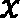-和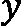-轴范围，以便显示整个图像，然后关闭坐标轴：

    ```py
    ax.set_xlim((-1.1, 1.1))
    ```

    ```py
    ax.set_ylim((-1.1, 1.1))
    ```

    ```py
    ax.set_axis_off()
    ```

生成的图像是一个*瑞士奶酪*，如图所示：

![图 8.1 – 瑞士奶酪的图形]

](img/B19085_08_01.jpg)

图 8.1 – 瑞士奶酪的图形

在*图 8.1*中，你可以看到大部分原始的圆盘（黑色阴影部分）已经被后续的圆盘（白色阴影部分）覆盖。

## 如何运作...

本食谱的关键是`Circle`和`PatchCollection`对象，它们表示 Matplotlib 坐标轴上图形区域。在本例中，我们创建了一个以原点为中心、半径为`1`的大圆形补丁，颜色为黑色面，并使用`zorder=0`将其放置在其他补丁的后面。这个补丁通过`add_patch`方法添加到`Axes`对象中。

下一步是创建一个对象，该对象将呈现由我们从 CSV 文件中加载的数据所表示的圆形，这些数据来自*步骤 1*。这些数据包括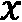、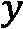 和 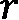 这些关于圆心 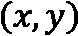 和半径 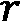 的值（总共有 10,411 个圆）。`PatchCollection`对象将一系列的补丁合并成一个可以添加到`Axes`对象中的单一对象。在这里，我们为数据中的每一行添加一个`Circle`，然后通过`add_collection`方法将其添加到`Axes`对象中。请注意，我们将面颜色应用于整个集合，而不是每个单独的`Circle`元素。我们将面颜色设置为白色（使用`facecolor="w"`参数），边缘颜色设置为黑色（使用`ec="k"`），边缘线宽设置为 0.2（使用`linewidth=0.2`），并且边缘样式设置为连续线条。将这些设置结合在一起，最终就得到了我们的图像。

我们在这里创建的图像被称为*瑞士奶酪*。它最早在 1938 年由 Alice Roth 在有理逼近理论中使用，随后被重新发现，类似的构造方法自此被多次使用。我们使用这个例子是因为它由一个大的单独部分和一大堆小的单独部分组成。Roth 的瑞士奶酪是一个平面集合的例子，具有正的面积但没有拓扑内部。这意味着我们无法找到任何正半径的圆盘，完全包含在该集合内（真令人惊讶，竟然有这样的集合存在！）。更重要的是，定义在这个瑞士奶酪上的连续函数，无法通过有理函数进行一致逼近。这个特性使得类似的构造在*一致代数*理论中变得非常有用。

`Circle`类是更通用的`Patch`类的子类。还有许多其他`Patch`类，表示不同的平面图形，比如`Polygon`和`PathPatch`，它们表示由路径（曲线或曲线集合）所围成的区域。这些可以用来生成复杂的补丁，并可以在 Matplotlib 图形中呈现。集合可以用来同时应用设置到多个补丁对象，尤其是在这个例子中，当你有大量对象需要以相同风格渲染时，这非常有用。

## 还有更多……

在 Matplotlib 中有许多不同类型的补丁可用。在这个例子中，我们使用了`Circle`补丁类，它表示坐标轴上的圆形区域。还有`Polygon`补丁类，它表示一个多边形（可以是规则多边形，也可以是其他形状）。此外，还有`PatchPath`对象，它表示由曲线围成的区域，曲线不一定是由直线段组成的。这与许多矢量图形软件中构造阴影区域的方式类似。

除了 Matplotlib 中的单一补丁类型外，还有一些集合类型，它们将多个补丁聚集在一起，作为一个单一对象使用。在本食谱中，我们使用了 `PatchCollection` 类来聚集大量的 `Circle` 补丁。还有一些更专业的补丁集合，可以自动生成这些内部补丁，而不是我们自己手动生成它们。

## 另请参阅

关于瑞士奶酪在数学中的更详细历史，可以参考以下传记文章：Daepp, U., Gauthier, P., Gorkin, P., 和 Schmieder, G., 2005\. *爱丽丝在瑞士：爱丽丝·罗斯的生活与数学*。 *数学智能者*，27(1)，第 41-54 页。

# 寻找内点

在编程环境中处理二维图形的一个问题是，无法存储图形内部的所有点。相反，我们通常只存储少量点，这些点以某种方式表示该图形。在大多数情况下，这些点是由线条连接的，描述了图形的边界。这种方法在内存上更为高效，并且使得我们能够方便地通过 Matplotlib 补丁等工具将图形可视化。然而，这种方法使得确定一个点或另一个图形是否位于给定图形内部变得更加困难。这在许多几何问题中是一个至关重要的问题。

在本食谱中，我们将学习如何表示几何图形，并确定一个点是否位于图形内部。

## 准备工作

在本食谱中，我们将需要导入整个 `matplotlib` 包，并将其命名为 `mpl`，以及将 `pyplot` 模块导入为 `plt`：

```py
import matplotlib as mpl
import matplotlib.pyplot as plt
```

我们还需要从 Shapely 包的 `geometry` 模块导入 `Point` 和 `Polygon` 对象。Shapely 包包含许多用于表示、操作和分析二维几何图形的例程和对象：

```py
from shapely.geometry import Polygon, Point
```

这两个类将用于表示我们的二维几何图形。让我们看看如何使用这些类来判断一个多边形是否包含一个点。

## 如何实现...

以下步骤展示了如何创建一个 Shapely 表示的多边形，并测试一个点是否位于该多边形内：

1.  创建一个示例多边形进行测试：

    ```py
    polygon = Polygon(
    ```

    ```py
        [(0, 2), (-1, 1), (-0.5, -1), (0.5, -1), (1, 1)],
    ```

    ```py
    )
    ```

1.  接下来，我们将多边形绘制到一个新图形中。首先，我们需要将多边形转换为一个 Matplotlib `Polygon` 补丁，以便将其添加到图形中：

    ```py
    fig, ax = plt.subplots()
    ```

    ```py
    poly_patch = mpl.patches.Polygon(
    ```

    ```py
        polygon.exterior.coords,
    ```

    ```py
        ec=(0,0,0,1), fc=(0.5,0.5,0.5,0.4))
    ```

    ```py
    ax.add_patch(poly_patch)
    ```

    ```py
    ax.set(xlim=(-1.05, 1.05), ylim=(-1.05, 2.05))
    ```

    ```py
    ax.set_axis_off()
    ```

1.  现在，我们需要创建两个测试点，其中一个点将在多边形内，另一个点将在多边形外：

    ```py
    p1 = Point(0.0, 0.0)
    ```

    ```py
    p2 = Point(-1.0, -0.75)
    ```

1.  我们在多边形上绘制并标注这两个点，以显示它们的位置：

    ```py
    ax.plot(0.0, 0.0, "k*")
    ```

    ```py
    ax.annotate("p1", (0.0, 0.0), (0.05, 0.0))
    ```

    ```py
    ax.plot(-0.8, -0.75, "k*")
    ```

    ```py
    ax.annotate("p2", (-0.8, -0.75), (-0.8 + 0.05, -0.75))
    ```

1.  最后，我们使用 `contains` 方法测试每个点是否位于多边形内，然后将结果打印到终端：

    ```py
    print("p1 inside polygon?", polygon.contains(p1))  # True
    ```

    ```py
    print("p2 inside polygon?", polygon.contains(p2)) 
    ```

    ```py
    # False
    ```

结果显示，第一个点 `p1` 位于多边形内，而第二个点 `p2` 不在其中。通过下图也可以看到这一点，图中清楚地显示一个点位于阴影多边形内，而另一个点则不在其中：

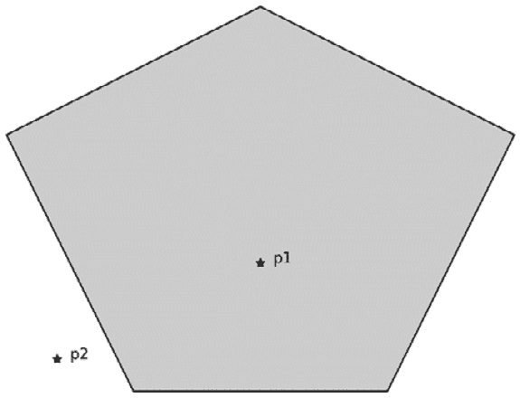

图 8.2 – 多边形区域内外的点

一旦我们绘制出点和多边形，就很容易（对我们来说）看到`polygon`对象上的`contains`方法也能正确分类这些点。

## 它是如何工作的...

Shapely 的`Polygon`类是多边形的表示，它将顶点存储为点。由外边界围成的区域——存储顶点之间的五条直线——对我们来说是显而易见的，眼睛很容易识别出来，但“在边界内”的概念很难以一种计算机容易理解的方式定义。甚至给出“位于给定曲线内”这一概念的正式数学定义也不是一件简单的事情。

有两种主要方法可以确定一个点是否位于一个简单的封闭曲线内——即一个从同一点开始并结束的曲线，且不包含自交点。第一种方法使用一个数学概念，即多边形的`contains`方法（Shapely 内部使用 GEOS 库来执行此计算）。

Shapely 的`Polygon`类可以用来计算与这些平面图形相关的许多量，包括周长和面积。`contains`方法用于确定一个点或一组点是否位于由对象表示的多边形内（该类表示的多边形类型有一些限制）。实际上，你可以使用相同的方法来判断一个多边形是否包含在另一个多边形内，因为，正如我们在本例中看到的，一个多边形由一组简单的点组成。

# 在图像中寻找边缘

在图像中寻找边缘是一种将包含大量噪声和干扰的复杂图像简化为仅包含最显著轮廓的简单图像的好方法。这在分析过程中的第一步非常有用，比如在图像分类中，或者在将线条轮廓导入计算机图形软件包时。

在本食谱中，我们将学习如何使用`scikit-image`包和 Canny 算法在复杂图像中找到边缘。

## 准备工作

对于本食谱，我们需要导入 Matplotlib 的`pyplot`模块（命名为`plt`），从`skimage.io`模块导入`imread`例程，以及从`skimage.feature`模块导入`canny`例程：

```py
import matplotlib.pyplot as plt
from skimage.io import imread
from skimage.feature import canny
```

`canny`例程实现了边缘检测算法。让我们看看如何使用它。

## 如何操作…

按照以下步骤，学习如何使用`scikit-image`包在图像中找到边缘：

1.  从源文件加载图像数据。这可以在本章的 GitHub 仓库中找到。关键的是，我们传入`as_gray=True`以将图像加载为灰度图：

    ```py
    image = imread("mandelbrot."ng", as_gray=True)
    ```

以下是原始图像，供参考。集合本身由白色区域表示，正如你所看到的，边界由较暗的阴影表示，非常复杂：

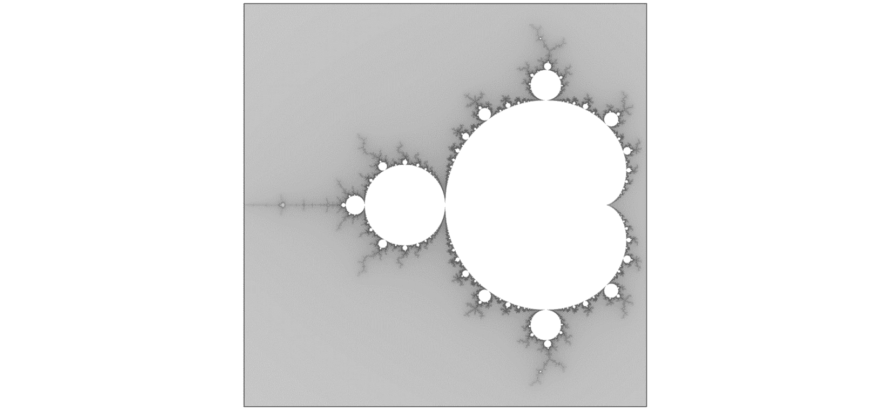

图 8.3 – 使用 Python 生成的曼德尔布罗集合图

1.  接下来，我们使用`canny`例程，它需要从`scikit-image`包的`features`模块中导入。对于此图像，`sigma`值设置为`0.5`：

    ```py
    edges = canny(image, sigma=0.5)
    ```

1.  最后，我们将`edges`图像添加到一个新图形中，并使用灰度（反向）颜色映射：

    ```py
    fig, ax = plt.subplots()
    ```

    ```py
    ax.imshow(edges, cmap="gray_r")
    ```

    ```py
    ax.set_axis_off()
    ```

检测到的边缘可以在下图中看到。边缘查找算法已经识别出了曼德尔布罗集合边界的大部分可见细节，尽管它并不完美（毕竟这只是一个估计）。

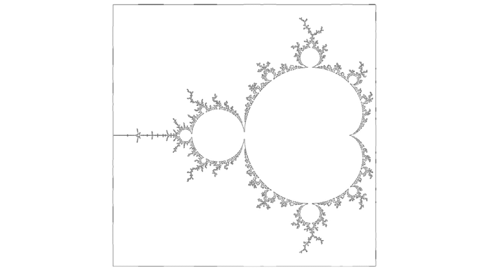

图 8.4 – 使用 scikit-image 包的 Canny 边缘检测算法找到的曼德尔布罗集合的边缘

我们可以看到，边缘检测成功识别出了曼德尔布罗集合边缘的复杂性。当然，*真实*曼德尔布罗集合的边界是一个分形，具有无限的复杂性。

## 它是如何工作的...

`scikit-image`包提供了各种工具和类型，用于操作和分析源自图像的数据。顾名思义，`canny`例程使用 Canny 边缘检测算法来检测图像中的边缘。该算法通过图像中的强度梯度来检测边缘，梯度较大的地方即为边缘。它还执行一些滤波操作，以减少在检测到的边缘中出现的噪声。

我们提供的`sigma`关键字值是应用于图像的高斯平滑的标准差，该平滑操作在计算边缘检测的梯度之前进行。这有助于我们去除图像中的一些噪声。我们设置的值（`0.5`）比默认值（`1`）小，但在这种情况下能给我们更好的分辨率。如果值过大，则会掩盖曼德尔布罗集合边界中一些细节。

# 三角剖分平面图形

正如我们在*第三章*《微积分与微分方程》中看到的那样，我们通常需要将一个连续区域拆分成更小、更简单的区域。在早期的配方中，我们将一个实数区间拆分成一组较小的区间，每个区间都有一个较小的长度。这个过程通常称为**离散化**。在本章中，我们处理的是二维图形，因此我们需要这个过程的二维版本。为此，我们将一个二维图形（在本例中是多边形）拆分成一组更小、更简单的多边形。所有多边形中最简单的是三角形，所以这是进行二维离散化的一个很好的起点。寻找一个可以“平铺”几何图形的三角形集合的过程称为**三角剖分**。

在本例中，我们将学习如何使用 Shapely 包对带孔的多边形进行三角剖分。

## 准备就绪

对于这个例子，我们需要导入 NumPy 包并命名为 `np`，导入 Matplotlib 包并命名为 `mpl`，以及导入 `pyplot` 模块并命名为 `plt`：

```py
import matplotlib as mpl
import matplotlib.pyplot as plt
import numpy as np
```

我们还需要从 Shapely 包中使用以下内容：

```py
from shapely.geometry import Polygon
from shapely.ops import triangulate
```

让我们看看如何使用 `triangulate` 例程对一个多边形进行三角剖分。

## 如何操作...

以下步骤展示了如何使用 Shapely 包对带孔的多边形进行三角剖分：

1.  首先，我们需要创建一个表示我们希望进行三角剖分的图形的 `Polygon` 对象：

    ```py
    polygon = Polygon(
    ```

    ```py
        [(2.0, 1.0), (2.0, 1.5), (-4.0, 1.5), (-4.0, 0.5),
    ```

    ```py
        (-3.0, -1.5), (0.0, -1.5), (1.0, -2.0), (1.0,-0.5),
    ```

    ```py
        (0.0, -1.0), (-0.5, -1.0), (-0.5, 1.0)],
    ```

    ```py
        holes=[np.array([[-1.5, -0.5], [-1.5, 0.5],
    ```

    ```py
        [-2.5, 0.5], [-2.5, -0.5]])]
    ```

    ```py
    )
    ```

1.  现在，我们应该绘制图形，以便了解我们将要处理的区域：

    ```py
    fig, ax = plt.subplots()
    ```

    ```py
    plt_poly = mpl.patches.Polygon(polygon.exterior.coords,
    ```

    ```py
        ec=(0,0,0,1), fc=(0.5,0.5,0.5,0.4), zorder=0)
    ```

    ```py
    ax.add_patch(plt_poly)
    ```

    ```py
    plt_hole = mpl.patches.Polygon(
    ```

    ```py
        polygon.interiors[0].coords, ec="k", fc="w")
    ```

    ```py
    ax.add_patch(plt_hole)
    ```

    ```py
    ax.set(xlim=(-4.05, 2.05), ylim=(-2.05, 1.55))
    ```

    ```py
    ax.set_axis_off()
    ```

这个多边形可以在下图中看到。正如我们所见，图形中有一个 *孔*，需要特别注意：

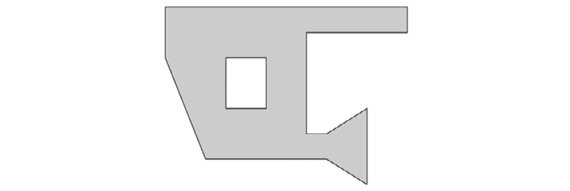

图 8.5 – 带孔的样本多边形

1.  我们使用 `triangulate` 例程生成多边形的三角剖分。这个三角剖分包括外部边，而这是我们在这个例子中不希望出现的：

    ```py
    triangles = triangulate(polygon)
    ```

1.  为了去除位于原始多边形外部的三角形，我们需要使用内置的 `filter` 例程，并结合使用 `contains` 方法（在本章前面已经提到过）：

    ```py
    filtered = filter(lambda p: polygon.contains(p),
    ```

    ```py
        triangles)
    ```

1.  为了将三角形绘制到原始多边形上，我们需要将 Shapely 三角形转换为 Matplotlib `Patch` 对象，并将其存储在一个 `PatchCollection` 中：

    ```py
    patches = map(lambda p: mpl.patches.Polygon(
    ```

    ```py
        p.exterior.coords), filtered)
    ```

    ```py
    col = mpl.collections.PatchCollection(
    ```

    ```py
        patches, fc="none", ec="k")
    ```

1.  最后，我们将三角形补丁集合添加到之前创建的图形中：

    ```py
    ax.add_collection(col)
    ```

在下面的图中可以看到已绘制在原始多边形上的三角剖分。这里，我们可以看到每个顶点都与其他两个顶点连接，形成了一个覆盖整个原始多边形的三角形系统：

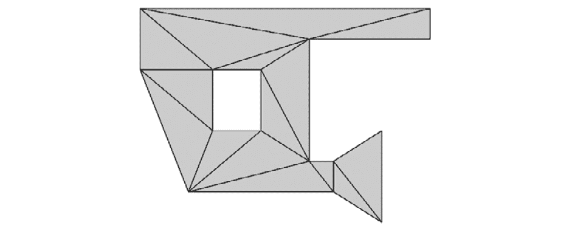

图 8.6 – 带孔样本多边形的三角剖分

在 *图 8.6* 中，原始多边形的顶点之间的内部线条将多边形分割成 15 个三角形。

## 它是如何工作的...

`triangulate` 例程使用一种叫做 **德劳内三角剖分** 的技术，将一组点连接成一个三角形系统。在这个例子中，点集是多边形的顶点。德劳内方法以一种方式找到这些三角形，使得没有任何一个点位于任何一个三角形的外接圆内。这是该方法的一个技术性条件，但它意味着三角形的选择是高效的，因为它避免了非常长且细的三角形。最终的三角剖分利用了原始多边形中的边，并且还连接了一些外部边。

为了去除位于原多边形外部的三角形，我们使用内置的`filter`例程，它通过移除符合标准函数的项目来创建一个新的可迭代对象。这个方法与 Shapely `Polygon`对象上的`contains`方法结合使用，以确定每个三角形是否位于原始图形内部。正如我们之前提到的，在将这些 Shapely 对象添加到图表中之前，我们需要将它们转换为 Matplotlib 补丁。

## 还有更多…

三角剖分通常用于将复杂的几何图形简化为一组三角形，这对于计算任务来说要简单得多。然而，它们也有其他用途。三角剖分的一个特别有趣的应用是解决*艺术画廊问题*。这个问题涉及找到必要的最大守卫数，以*守卫*一个特定形状的艺术画廊。三角剖分是 Fisk 简单证明艺术画廊定理的关键部分，该定理最初由 Chvátal 证明。

假设这个教程中的多边形是一个艺术画廊的平面图，并且需要在顶点放置一些守卫。通过少量工作可以发现，你需要在多边形的顶点放置三个守卫，以便完全覆盖整个博物馆。在以下图像中，我们绘制了一种可能的布局：

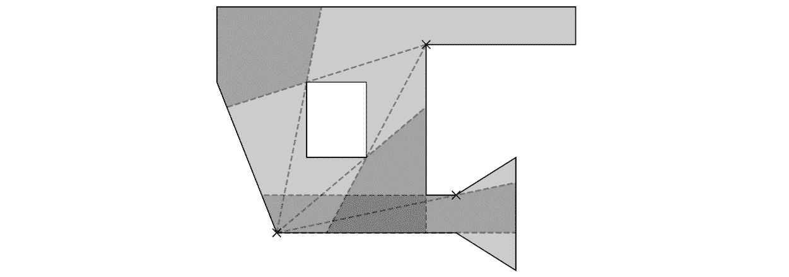

图 8.7 – 一种可能的艺术画廊问题解决方案，其中守卫被安置在顶点

在*图 8.7*中，守卫通过**X**符号表示，并且它们对应的视野区域被阴影填充。这里，你可以看到整个多边形被至少一种颜色覆盖。这个变种的艺术画廊问题的解决方案告诉我们，我们最多需要四个守卫。

## 另请参见

有关艺术画廊问题的更多信息，可以参阅 O'Rourke 的经典著作：O’Rourke, J. (1987). *艺术画廊定理与算法*。纽约：牛津大学出版社。

# 计算凸包

如果几何图形中的任意一对点可以通过一条直线连接，且该直线也完全位于图形内部，则该几何图形被称为*凸*的。凸体的简单例子包括点、直线、正方形、圆（圆盘）、正多边形等。*图 8.5*中所示的几何图形不是凸的，因为孔的对侧点无法通过一条直线连接，且该直线保持在图形内部。

从某种角度来看，凸图形比较简单，这意味着它们在多种应用中都非常有用。一个问题是找到包含一组点的最小凸集。这个最小的凸集被称为该点集的*凸包*。

在这个教程中，我们将学习如何使用 Shapely 包找到一组点的凸包。

## 准备工作

对于本示例，我们将需要导入为`np`的 NumPy 包，导入为`mpl`的 Matplotlib 包，以及导入为`plt`的`pyplot`模块：

```py
import numpy as np
import matplotlib as mpl
import matplotlib.pyplot as plt
```

我们还需要 NumPy 的默认随机数生成器，可以按如下方式导入：

```py
from numpy.random import default_rng
rng = default_rng(12345)
```

最后，我们还需要从 Shapely 导入`MultiPoint`类：

```py
from shapely.geometry import MultiPoint
```

## 如何操作……

按照以下步骤查找随机生成的点的凸包：

1.  首先，我们生成一个二维的随机数数组：

    ```py
    raw_points = rng.uniform(-1.0, 1.0, size=(50, 2))
    ```

1.  接下来，我们创建一个新图形，并将这些原始样本点绘制在这个图形中：

    ```py
    fig, ax = plt.subplots()
    ```

    ```py
    ax.plot(raw_points[:, 0], raw_points[:, 1], "kx")
    ```

    ```py
    ax.set_axis_off()
    ```

这些随机生成的点可以在下图中看到。点大致分布在一个方形区域内：

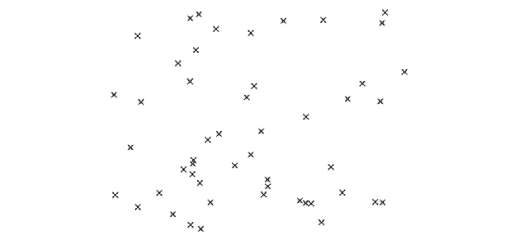

图 8.8 – 平面上一组点

1.  接下来，我们构建一个`MultiPoint`对象，将所有这些点收集到一个单独的对象中：

    ```py
    points = MultiPoint(raw_points)
    ```

1.  现在，我们通过`convex_hull`属性获取这个`MultiPoint`对象的凸包：

    ```py
    convex_hull = points.convex_hull
    ```

1.  然后，我们创建一个 Matplotlib `Polygon`补丁，可以将其绘制到图形上，以展示找到凸包的结果：

    ```py
    patch = mpl.patches.Polygon(
    ```

    ```py
        convex_hull.exterior.coords,
    ```

    ```py
        ec=(0,0,0,1), fc=(0.5,0.5,0.5,0.4), lw=1.2)
    ```

1.  最后，我们将`Polygon`补丁添加到图形中，以展示凸包：

    ```py
    ax.add_patch(patch)
    ```

随机生成点的凸包可以在下图中看到：

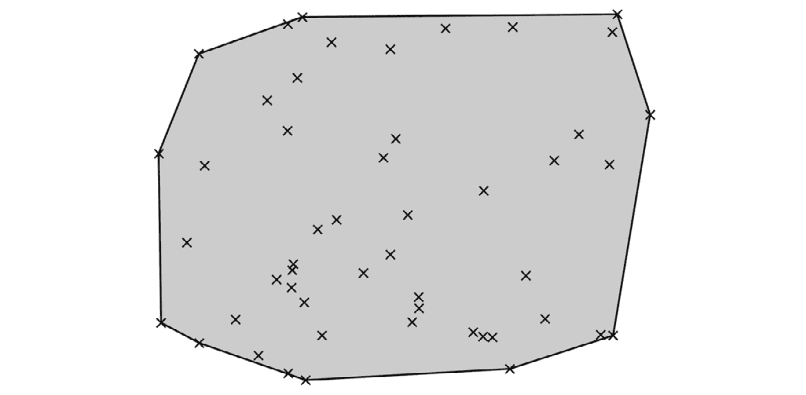

图 8.9 – 平面上一组点的凸包

*图 8.9* 中的多边形具有从原始点中选择的顶点，所有其他点都位于阴影区域内。

## 它是如何工作的……

Shapely 包是一个用于几何分析的 Python 封装库，基于 GEOS 库。Shapely 几何对象的`convex_hull`属性调用 GEOS 库中的凸包计算函数，结果是一个新的 Shapely 对象。从本示例可以看出，这些点的凸包是一个多边形，顶点位于距离*中心*最远的点上。

# 构建贝塞尔曲线

*贝塞尔曲线*，或*B 样条*，是一类在矢量图形中非常有用的曲线——例如，它们常用于高质量的字体包。这是因为它们由少数几个点定义，然后可以使用这些点来廉价地计算曲线上的大量点。这使得可以根据用户的需求来调整细节的规模。

在这个示例中，我们将学习如何创建一个简单的类，表示贝塞尔曲线，并计算曲线上的多个点。

## 准备工作

在这个示例中，我们将使用导入为`np`的 NumPy 包，导入为`plt`的 Matplotlib `pyplot`模块，以及从 Python 标准库`math`模块导入的`comb`函数，别名为`binom`：

```py
from math import comb as binom
import matplotlib.pyplot as plt
import numpy as np
```

## 如何操作……

按照以下步骤定义一个类，表示一个贝塞尔曲线，该曲线可用于计算曲线上的点：

1.  第一步是设置基本类。我们需要提供控制点（节点）和一些相关数字作为实例属性：

    ```py
    class Bezier:
    ```

    ```py
        def __init__(self, *points):
    ```

    ```py
            self.points = points
    ```

    ```py
            self.nodes = n = len(points) - 1
    ```

    ```py
            self.degree = l = points[0].size
    ```

1.  仍然在`__init__`方法中，我们生成贝塞尔曲线的系数，并将它们存储在实例属性中的列表里：

    ```py
    self.coeffs = [binom(n, i)*p.reshape(
    ```

    ```py
        (l, 1)) for i, p in enumerate(points)]
    ```

1.  接下来，我们定义一个`__call__`方法，使得这个类可以被调用。我们将实例中的节点数量加载到本地变量中以便清晰：

    ```py
        def __call__(self, t):
    ```

    ```py
            n = self.nodes
    ```

1.  接下来，我们将输入数组重新调整形状，使其包含一行：

    ```py
            t = t.reshape((1, t.size))
    ```

1.  现在，我们使用实例中的`coeffs`属性中的每个系数生成一个值数组列表：

    ```py
            vals = [c @ (t**i)*(1-t)**(n-i) for i,
    ```

    ```py
               c in enumerate(self.coeffs)]
    ```

最后，我们将*第 5 步*中构造的所有数组相加，并返回结果数组：

```py
       return np.sum(vals, axis=0)
```

1.  现在，我们将使用一个示例来测试我们的类。我们将为这个示例定义四个控制点：

    ```py
    p1 = np.array([0.0, 0.0])
    ```

    ```py
    p2 = np.array([0.0, 1.0])
    ```

    ```py
    p3 = np.array([1.0, 1.0])
    ```

    ```py
    p4 = np.array([1.0, 3.0])
    ```

1.  接下来，我们设置一个新的绘图图形，并使用虚线连接的方式绘制控制点：

    ```py
    fig, ax = plt.subplots()
    ```

    ```py
    ax.plot([0.0, 0.0, 1.0, 1.0],
    ```

    ```py
         [0.0, 1.0, 1.0, 3.0], "*--k")
    ```

    ```py
    ax.set(xlabel="x", ylabel="y",
    ```

    ```py
        title="Bezier curve with 4 nodes, degree 3")
    ```

1.  然后，我们使用在*第 7 步*中定义的四个点创建一个新的`Bezier`类实例：

    ```py
    b_curve = Bezier(p1, p2, p3, p4)
    ```

1.  我们现在可以使用`linspace`创建一个从 0 到 1 均匀间隔的点数组，并计算贝塞尔曲线上的点：

    ```py
    t = np.linspace(0, 1)
    ```

    ```py
    v = b_curve(t)
    ```

1.  最后，我们将在之前绘制的控制点上绘制这条曲线：

    ```py
    ax.plot(v[0,:], v[1, :], "k")
    ```

我们绘制的贝塞尔曲线可以在下面的图中看到。如你所见，曲线从第一个点（**0**, **0**）开始，到最终点（**1**, **3**）结束：

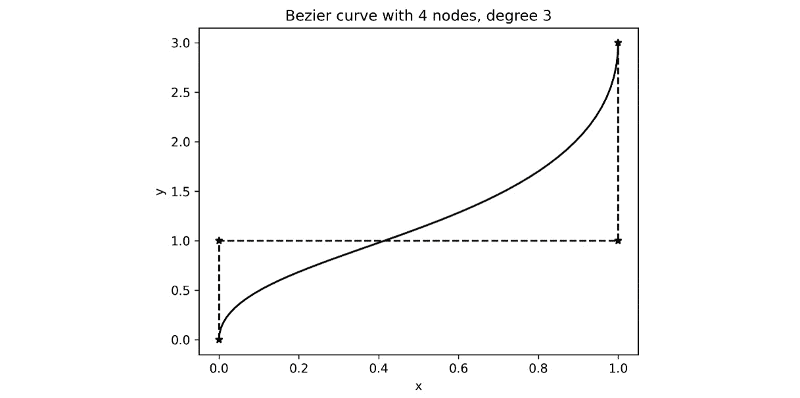

图 8.10 – 使用四个节点构造的三次贝塞尔曲线

*图 8.10*中的贝塞尔曲线在端点处与垂直线相切，并平滑地连接这些点。注意，我们只需要存储四个控制点，就能以任意精度重新构建这条曲线；这使得贝塞尔曲线在存储上非常高效。

## 它是如何工作的...

贝塞尔曲线由一系列控制点描述，我们通过递归构造曲线。一个只有一个点的贝塞尔曲线是一个常数曲线，始终保持在该点。两个控制点的贝塞尔曲线是这两点之间的线段：

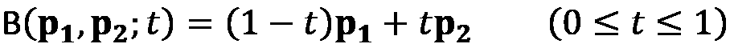

当我们添加第三个控制点时，我们取贝塞尔曲线上对应点之间的线段，这些曲线是通过少一个点的贝塞尔曲线构造的。这意味着我们使用以下公式构造一个有三个控制点的贝塞尔曲线：

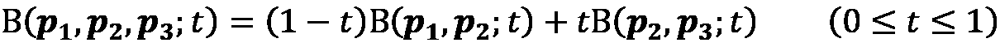

这个构造过程可以在下图中看到：

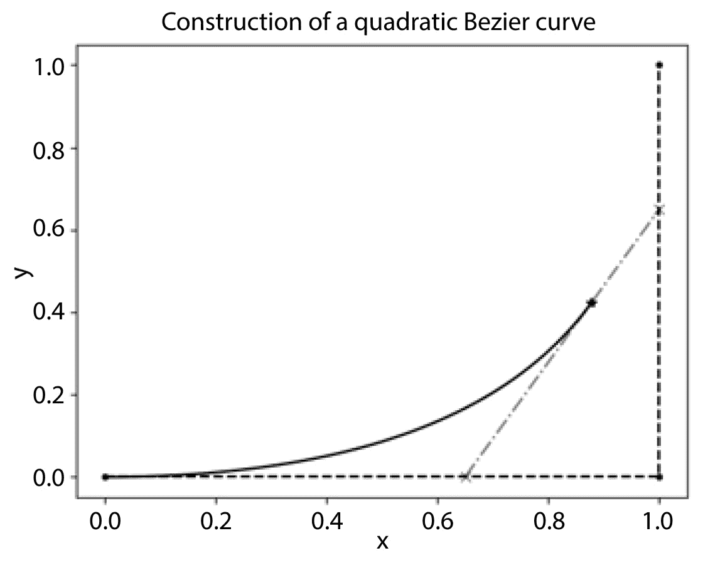

图 8.11 – 使用递归定义构造二次贝塞尔曲线（两条线性贝塞尔曲线由虚线表示）

这个构建过程继续进行，以定义任意数量控制点的贝塞尔曲线。幸运的是，在实际操作中，我们不需要处理这个递归定义，因为我们可以将公式简化为一个单一的曲线公式，公式如下：


这里，！[](img/Formula_08_011.png)元素是控制点，！[](img/Formula_08_012.png)是一个参数，每一项都涉及二项式系数：

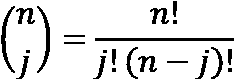

记住，！[](img/Formula_08_014.png)参数是用于生成曲线点的变化量。我们可以将先前求和中的涉及！[](img/Formula_08_015.png)的项与不涉及的项分离开来。这定义了我们在*第 2 步*中定义的系数，每个系数通过以下代码片段给出：

```py
binom(n, i)*p.reshape((l, 1))
```

在这一步中，我们重新排列每个点`p`，确保它作为列向量排列。这意味着每个系数都是一个列向量（作为 NumPy 数组），由通过二项式系数缩放的控制点组成。

现在，我们需要指定如何在不同的！[](img/Formula_08_016.png)值下评估贝塞尔曲线。这时我们利用了 NumPy 包中的高性能数组操作。我们在形成系数时将控制点重新排列为列向量。在*第 4 步*中，我们将输入的！[](img/Formula_08_017.png)值重新排列为行向量。这意味着我们可以使用矩阵乘法操作符，将每个系数与相应的（标量）值相乘，具体取决于输入的！[](img/Formula_08_018.png)。这就是在*第 5 步*中，列表推导式内部发生的事情。在下面这一行中，我们将！[](img/Formula_08_019.png)数组与！[](img/Formula_08_020.png)数组相乘，从而得到一个！[](img/Formula_08_021.png)数组：

```py
c @ (t**i)*(1-t)**(n-i)
```

我们为每个系数得到一个这样的结果。然后，我们可以使用`np.sum`例程对每个！[](img/Formula_08_022.png)数组进行求和，从而获得贝塞尔曲线上的值。在本示例中，输出数组的顶行包含曲线的！[](img/Formula_08_023.png)值，底行包含曲线的！[](img/Formula_08_024.png)值。我们必须小心地指定`axis=0`关键字参数，以确保`sum`例程对我们创建的列表进行求和，而不是对该列表包含的数组进行求和。

我们定义的类通过使用贝塞尔曲线的控制点来初始化，然后用这些点来生成系数。曲线值的实际计算是通过使用 NumPy 进行的，因此这个实现应该具有相对较好的性能。一旦创建了该类的特定实例，它的功能就像一个函数，正如你所预期的那样。然而，这里没有进行类型检查，因此我们只能将 NumPy 数组作为参数来调用这个*函数*。

## 还有更多...

贝塞尔曲线是使用迭代构造定义的，其中使用直线连接由第一个和最后一个控制点定义的曲线来定义具有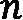点的曲线。使用此构造跟踪每个控制点的系数将迅速导致我们用于定义前述曲线的方程。此构造还导致贝塞尔曲线的有趣 - 和有用的 - 几何特性。

正如我们在本篇文章开头提到的，贝塞尔曲线出现在许多涉及矢量图形的应用程序中，如字体。它们还出现在许多常见的矢量图形软件包中。在这些软件包中，通常可以看到*二次贝塞尔曲线*，它们由三个点的集合定义。但是，您也可以通过提供这些点上的两个端点以及梯度线来定义二次贝塞尔曲线。这在图形软件包中更为常见。生成的贝塞尔曲线将沿着这些梯度线留下每个端点，并在这些点之间平滑连接曲线。

我们在这里构建的实现在小型应用中性能相对较好，但对于涉及在大量控制点上渲染曲线的应用来说不足够。对此，最好使用一个用编译语言编写的低级包。例如，`bezier` Python 包使用编译的 Fortran 后端进行计算，并提供比我们在这里定义的类更丰富的接口。

贝塞尔曲线当然可以以一种自然的方式扩展到更高的维度。结果是贝塞尔曲面，这使它们成为非常有用的通用工具，用于高质量、可扩展的图形。

# 进一步阅读

+   计算几何中一些常见算法的描述可以在以下书籍中找到：Press, W.H., Teukolsky, S.A., Vetterling, W.T., and Flannery, B.P., 2007\. *数值计算法: 科学计算的艺术*. 第三版. 剑桥: 剑桥大学出版社。

+   想要更详细地了解计算几何中的一些问题和技术，请参阅以下书籍：O’Rourke, J., 1994\. *C 语言中的计算几何*. 剑桥: 剑桥大学出版社。
