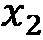
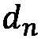

# 第九章：寻找最优解

在这一章中，我们将探讨寻找给定情境下最佳结果的各种方法。这被称为**优化**，通常涉及最小化或最大化目标函数。**目标函数**是一个包含一个或多个自变量的函数，返回一个标量值，表示给定参数选择的成本或收益。最小化和最大化函数的问题实际上是等价的，因此我们将在本章中只讨论最小化目标函数。最小化一个函数，，等同于最大化函数。关于这一点的更多细节将在我们讨论第一个食谱时提供。

用于最小化给定函数的算法取决于函数的性质。例如，包含一个或多个变量的简单线性函数与具有多个变量的非线性函数所适用的算法是不同的。线性函数的最小化属于**线性规划**的范畴，这是一个成熟的理论。线性函数可以通过标准的线性代数技术解决。对于非线性函数，我们通常利用函数的梯度来寻找最小点。我们将讨论几种用于最小化不同类型函数的方法。

寻找单变量函数的最小值和最大值尤其简单，如果已知函数的导数，则可以轻松完成。如果不知道导数，那么可以使用适当食谱中描述的方法。*最小化非线性函数*食谱中的备注提供了一些额外的细节。

我们还将简要介绍一下*博弈论*。广义来说，博弈论是围绕决策制定的理论，具有广泛的应用，尤其在经济学等学科中尤为重要。具体来说，我们将讨论如何将简单的双人博弈表示为 Python 中的对象，计算与某些选择相关的收益，并计算这些博弈的纳什均衡。

我们将首先学习如何最小化包含一个或多个变量的线性和非线性函数。然后，我们将继续探讨使用梯度下降法和最小二乘法的曲线拟合方法。最后，我们将通过分析双人博弈和纳什均衡来总结这一章。

本章将涵盖以下食谱：

+   最小化简单线性函数

+   最小化非线性函数

+   在优化中使用梯度下降法

+   使用最小二乘法对数据进行曲线拟合

+   分析简单的双人博弈

+   计算纳什均衡

让我们开始吧！

# 技术要求

在本章中，我们将需要 NumPy、SciPy 和 Matplotlib 包，和往常一样。对于最后两个食谱，我们还需要 Nashpy 包。可以使用你喜欢的包管理器（如`pip`）安装这些包：

```py
python3.10 -m pip install numpy scipy matplotlib nashpy
```

本章节的代码可以在 GitHub 仓库中的`Chapter 09`文件夹找到，地址为 [`github.com/PacktPublishing/Applying-Math-with-Python-2nd-Edition/tree/main/Chapter%2009`](https://github.com/PacktPublishing/Applying-Math-with-Python-2nd-Edition/tree/main/Chapter%2009)。

# 最小化一个简单的线性函数

我们在优化中面临的最基本问题是找到一个函数的最小值所在的参数。通常，这个问题会受到一些关于参数可能值的*约束*，这增加了问题的复杂性。显然，如果我们要最小化的函数本身也很复杂，那么问题的复杂性会进一步增加。因此，我们必须首先考虑*线性函数*，其形式如下：


要解决这种问题，我们需要将约束转换成计算机能够处理的形式。在这种情况下，我们通常将其转换为线性代数问题（矩阵和向量）。完成这一步后，我们可以利用 NumPy 和 SciPy 中线性代数包的工具来找到我们需要的参数。幸运的是，由于这种问题非常常见，SciPy 已经有处理这种转换和后续求解的例程。

在本例中，我们将使用 SciPy `optimize` 模块中的例程解决以下约束线性最小化问题：


这将受到以下条件的限制：


让我们看看如何使用 SciPy 的`optimize`例程来解决这个线性规划问题。

## 准备就绪

对于这个示例，我们需要导入 NumPy 包（别名为`np`），Matplotlib 的 `pyplot` 模块（别名为`plt`），以及 SciPy 的 `optimize` 模块。我们还需要从 `mpl_toolkits.mplot3d` 导入 `Axes3D` 类，以便进行 3D 绘图：

```py
import numpy as np
from scipy import optimize
import matplotlib.pyplot as plt
from mpl_toolkits.mplot3d import Axes3D
```

让我们看看如何使用 `optimize` 模块中的例程来最小化一个有约束的线性系统。

## 如何实现...

按照以下步骤使用 SciPy 解决一个有约束的线性最小化问题：

1.  将系统设置为 SciPy 能够识别的形式：

    ```py
    A = np.array([
    ```

    ```py
        [2, 1], # 2*x0 + x1 <= 6
    ```

    ```py
        [-1, -1] # -x0 - x1 <= -4
    ```

    ```py
    ])
    ```

    ```py
    b = np.array([6, -4])
    ```

    ```py
    x0_bounds = (-3, 14) # -3 <= x0 <= 14
    ```

    ```py
    x1_bounds = (2, 12)      # 2 <= x1 <= 12
    ```

    ```py
    c = np.array([1, 5])
    ```

1.  接下来，我们需要定义一个例程来评估在线性函数值为  时的函数值，该值是一个向量（NumPy 数组）：

    ```py
    def func(x):
    ```

    ```py
        return np.tensordot(c, x, axes=1)
    ```

1.  然后，我们创建一个新图形，并添加一组 `3d` 坐标轴，以便在其上绘制函数：

    ```py
    fig = plt.figure()
    ```

    ```py
    ax = fig.add_subplot(projection="3d")
    ```

    ```py
    ax.set(xlabel="x0", ylabel="x1", zlabel="func")
    ```

    ```py
    ax.set_title("Values in Feasible region")
    ```

1.  接下来，我们创建一个覆盖问题区域的值网格，并在该区域上绘制函数值：

    ```py
    X0 = np.linspace(*x0_bounds)
    ```

    ```py
    X1 = np.linspace(*x1_bounds)
    ```

    ```py
    x0, x1 = np.meshgrid(X0, X1)
    ```

    ```py
    z = func([x0, x1])
    ```

    ```py
    ax.plot_surface(x0, x1, z, cmap="gray",
    ```

    ```py
        vmax=100.0, alpha=0.3)
    ```

1.  现在，我们绘制函数值平面中对应于临界线`2*x0 + x1 == 6`的直线，并在我们的图上绘制落在该范围内的值：

    ```py
    Y = (b[0] - A[0, 0]*X0) / A[0, 1]
    ```

    ```py
    I = np.logical_and(Y >= x1_bounds[0], Y <= x1_bounds[1])
    ```

    ```py
    ax.plot(X0[I], Y[I], func([X0[I], Y[I]]), 
    ```

    ```py
        "k", lw=1.5, alpha=0.6)
    ```

1.  我们对第二条临界线`x0 + x1 == -4`重复进行绘图步骤：

    ```py
    Y = (b[1] - A[1, 0]*X0) / A[1, 1]
    ```

    ```py
    I = np.logical_and(Y >= x1_bounds[0], Y <= x1_bounds[1])
    ```

    ```py
    ax.plot(X0[I], Y[I], func([X0[I], Y[I]]), 
    ```

    ```py
        "k", lw=1.5, alpha=0.6)
    ```

1.  接下来，我们对位于两条临界线之间的区域进行着色，这对应于最小化问题的可行区域：

    ```py
    B = np.tensordot(A, np.array([x0, x1]), axes=1)
    ```

    ```py
    II = np.logical_and(B[0, ...] <= b[0], B[1, ...] <= b[1])
    ```

    ```py
    ax.plot_trisurf(x0[II], x1[II], z[II], 
    ```

    ```py
        color="k", alpha=0.5)
    ```

在下图中可以看到函数值在可行区域上的绘图：


图 9.1 – 线性函数的值，并突出显示了可行区域

如我们所见，位于这个阴影区域内的最小值出现在两条关键线的交点处。

1.  接下来，我们使用`linprog`来解决在*步骤 1*中创建的约束最小化问题。我们在终端中打印出结果对象：

    ```py
    res = optimize.linprog(c, A_ub=A, b_ub=b,
    ```

    ```py
        bounds= (x0_bounds, x1_bounds))
    ```

    ```py
    print(res)
    ```

1.  最后，我们将在可行区域上方绘制最小函数值：

    ```py
    ax.plot([res.x[0]], [res.x[1]], [res.fun], "kx")
    ```

更新后的图示可以在下图中看到：


图 9.2 – 最小值绘制在可行区域上

在这里，我们可以看到`linprog`程序确实找到了最小值，它位于两条关键线的交点处。

## 它是如何工作的…

约束线性最小化问题在经济场景中非常常见，在这些问题中，你试图在保持其他参数的同时最小化成本。事实上，优化理论中的很多术语都反映了这一点。解决这些问题的一种非常简单的算法叫做**单纯形法**，它通过一系列阵列操作来找到最小解。从几何角度看，这些操作代表了在单纯形的不同顶点之间变化（我们在这里不会定义单纯形），正是这种变化赋予了算法这个名字。

在我们继续之前，我们将简要概述单纯形法用于求解约束线性优化问题的过程。该问题，呈现给我们的并不是一个矩阵方程问题，而是一个矩阵不等式问题。我们可以通过引入**松弛变量**来解决这个问题，将不等式转化为等式。例如，通过引入松弛变量，第一条约束不等式可以重写为如下形式：。


只要不为负数，这样就满足了所需的不等式。第二个约束不等式是“大于或等于”型的不等式，我们必须首先将其转化为“小于或等于”型的不等式。我们通过将所有项乘以-1 来实现这一点。这就得到了我们在步骤中定义的`A`矩阵的第二行。在引入第二个松弛变量后，，我们得到了第二个方程：


从这里，我们可以构建一个矩阵，其列包含两个参数变量的系数， 和 ，以及两个松弛变量， 和 。该矩阵的行表示两个边界方程和目标函数。现在，这个方程组可以通过对该矩阵进行基本的行操作来求解，以得到最小化目标函数的 和 的值。由于求解矩阵方程既简单又快速，这意味着我们可以迅速高效地最小化线性函数。

幸运的是，我们不需要记住如何将我们的不等式系统化简为线性方程组，因为像`linprog`这样的例程已经为我们做了这件事。我们只需提供边界不等式作为一个矩阵和向量对，包括每个不等式的系数，并提供一个定义目标函数的单独向量。`linprog`例程会负责公式化并解决最小化问题。

实际上，`linprog`例程并未使用单纯形法来最小化函数。相反，`linprog`使用了一个内部点算法，这种算法效率更高。（该方法实际上可以通过提供适当的方法名称和`method`关键字参数设置为`simplex`或`revised-simplex`。在打印的结果输出中，我们可以看到，达到解决方案仅需五次迭代。）该例程返回的结果对象包含在最小值处的参数值，存储在`x`属性中，最小值处函数的值存储在`fun`属性中，此外还包含关于求解过程的各种信息。如果方法失败，则`status`属性将包含一个数值代码，描述方法失败的原因。

在本食谱的*第 2 步*中，我们创建了一个表示此问题目标函数的函数。该函数接受一个包含函数应评估的参数空间值的单一数组作为输入。在这里，我们使用了 NumPy 的`tensordot`例程（`axes=1`）来评估系数向量的点积，，与每个输入，。在这里我们必须非常小心，因为我们传入函数的值在后续步骤中将会是一个 2 × 50 × 50 的数组。普通的矩阵乘法（`np.dot`）在这种情况下无法给出我们想要的 50 × 50 的数组输出。

在*第 5 步*和*第 6 步*中，我们根据以下方程计算了临界线上的点：


然后我们计算了相应的值，以便绘制在目标函数定义的平面上的线条。我们还需要*修剪*这些值，确保只包含那些在问题中指定的范围内的值。通过在代码中构造标记为 `I` 的索引数组来完成这一步，该数组由位于边界值内的点组成。

## 还有更多...

本节介绍了受限最小化问题以及如何使用 SciPy 解决它。然而，相同的方法也可以用来解决受限的*最大化*问题。这是因为最大化和最小化是*对偶*的，从某种意义上来说，最大化一个函数与最小化函数并取其负值是一样的。事实上，我们在本节中就利用了这一点，将第二个约束不等式从 ≥ 改为 ≤。

在本节中，我们解决了一个只有两个参数变量的问题，但相同的方法也适用于涉及更多变量的问题（除了绘图步骤）。我们只需要为每个数组增加更多的行和列来处理增加的变量数量——这包括传递给函数的边界元组。当处理大量变量时，该函数还可以在适当的情况下与稀疏矩阵一起使用，以提高效率。

`linprog` 函数得名于*线性规划*，用于描述此类问题——找到满足某些矩阵不等式的的值，同时满足其他条件。由于矩阵理论与线性代数之间有着紧密的联系，因此线性规划问题有许多非常快速和高效的技术，而这些技术在非线性上下文中是不可用的。

# 最小化非线性函数

在上一节中，我们展示了如何最小化一个非常简单的线性函数。不幸的是，大多数函数并非线性，通常也不具备我们希望的良好特性。对于这些非线性函数，我们无法使用为线性问题开发的快速算法，因此我们需要设计出可以在这些更一般化情况下使用的新方法。我们将在这里使用的算法叫做 Nelder-Mead 算法，它是一种健壮的通用方法，用于寻找函数的最小值，并且不依赖于函数的梯度。

在本节中，我们将学习如何使用 Nelder-Mead 单纯形法来最小化一个包含两个变量的非线性函数。

## 准备工作

在本节中，我们将使用导入的 NumPy 包（命名为 `np`）、Matplotlib 的 `pyplot` 模块（命名为 `plt`）、从 `mpl_toolkits.mplot3d` 导入的 `Axes3D` 类来启用 3D 绘图，以及 SciPy 的 `optimize` 模块：

```py
import numpy as np
import matplotlib.pyplot as plt
from mpl_toolkits.mplot3d import Axes3D
from scipy import optimize
```

让我们看看如何使用这些工具来解决非线性优化问题。

## 如何进行...

以下步骤展示了如何使用 Nelder-Mead 单纯形法找到一般非线性目标函数的最小值：

1.  定义我们要最小化的目标函数：

    ```py
    def func(x):
    ```

    ```py
        return ((x[0] - 0.5)**2 + (
    ```

    ```py
            x[1] + 0.5)**2)*np.cos(0.5*x[0]*x[1])
    ```

1.  接下来，创建一个值的网格，以便我们可以在上面绘制目标函数：

    ```py
    x_r = np.linspace(-1, 1)
    ```

    ```py
    y_r = np.linspace(-2, 2)
    ```

    ```py
    x, y = np.meshgrid(x_r, y_r)
    ```

1.  现在，我们在这个点阵上评估该函数：

    ```py
    z = func([x, y])
    ```

1.  接下来，我们创建一个包含`3d`坐标轴对象的新图，并设置轴标签和标题：

    ```py
    fig = plt.figure(tight_layout=True)
    ```

    ```py
    ax = fig.add_subplot(projection="3d")
    ```

    ```py
    ax.tick_params(axis="both", which="major", labelsize=9)
    ```

    ```py
    ax.set(xlabel="x", ylabel="y", zlabel="z")
    ```

    ```py
    ax.set_title("Objective function")
    ```

1.  现在，我们可以将目标函数作为表面绘制在刚才创建的坐标轴上：

    ```py
    ax.plot_surface(x, y, z, cmap="gray",
    ```

    ```py
        vmax=8.0, alpha=0.5)
    ```

1.  我们选择一个初始点，作为最小化例程开始迭代的起点，并将其绘制在表面上：

    ```py
    x0 = np.array([-0.5, 1.0])
    ```

    ```py
    ax.plot([x0[0]], [x0[1]], func(x0), "k*")
    ```

目标函数表面的绘图，以及初始点，可以在以下图示中看到。这里，我们可以看到最小值似乎出现在 x 轴大约 0.5，y 轴大约-0.5 的位置：


图 9.3 – 一个包含起始点的非线性目标函数

1.  现在，我们使用`optimize`包中的`minimize`例程来寻找最小值，并打印出它生成的`result`对象：

    ```py
    result = optimize.minimize(
    ```

    ```py
        func, x0, tol=1e-6, method= "Nelder-Mead")
    ```

    ```py
    print(result)
    ```

1.  最后，我们将`minimize`例程找到的最小值绘制在目标函数的表面上：

    ```py
    ax.plot([result.x[0]], [result.x[1]], [result.fun], "kx")
    ```

更新后的目标函数图，包含`minimize`例程找到的最小点，可以在以下图示中看到：


图 9.4 – 一个包含起始点和最小点的目标函数

这表明该方法确实在从初始点（左上角）开始的区域内找到了最小点（右下角）。

## 它是如何工作的...

Nelder-Mead 单纯形法——与线性优化问题的单纯形法不同——是一种简单的算法，用于找到非线性函数的最小值，即使该目标函数没有已知的导数也能有效工作。（对于这个示例中的函数并非如此；使用基于梯度的方法唯一的收益是收敛速度的提升。）该方法通过比较单纯形顶点处目标函数的值来工作，单纯形在二维空间中是一个三角形。具有最大函数值的顶点会被*反射*至对边，并执行适当的扩展或收缩，从而使单纯形*向下*移动。

来自 SciPy `optimize`模块的`minimize`例程是许多非线性函数最小化算法的入口点。在这个例子中，我们使用了 Nelder-Mead 单纯形算法，但也有许多其他算法可供选择。许多这些算法需要了解函数的梯度，梯度可能由算法自动计算。通过提供适当的名称给`method`关键字参数，就可以使用该算法。

`minimize`例程返回的`result`对象包含了关于找到的解（如果没有找到解则为错误）的大量信息。特别地，计算出的最小值对应的目标参数存储在结果的`x`属性中，而函数值存储在`fun`属性中。

`minimize`例程需要目标函数和`x0`的起始值。在这个示例中，我们还提供了一个容差值，要求最小值使用`tol`关键字参数进行计算。更改该值将会修改计算解的精度。

## 还有更多内容……

Nelder-Mead 算法是一个*无梯度*最小化算法的例子，因为它不需要任何关于目标函数梯度（导数）的信息。有几种类似的算法，它们通常涉及在多个点上评估目标函数，然后利用这些信息向最小值移动。一般来说，无梯度方法的收敛速度通常比梯度下降模型慢。然而，它们可以用于几乎任何目标函数，即使在无法准确计算梯度或通过近似计算梯度的情况下也能使用。

优化单变量函数通常比多维情况更容易，并且在 SciPy 的`optimize`库中有一个专门的函数。`minimize_scalar`例程用于执行单变量函数的最小化，在这种情况下应替代`minimize`使用。

# 在优化中使用梯度下降方法

在之前的示例中，我们使用了 Nelder-Mead 单纯形算法来最小化一个包含两个变量的非线性函数。这是一种相当稳健的方法，即使对目标函数了解甚少，它也能有效工作。然而，在许多情况下，我们对目标函数有更多的了解，这使我们能够设计出更快速、更高效的算法来最小化该函数。我们可以通过利用诸如函数梯度等属性来实现这一点。

一个多变量函数的*梯度*描述了该函数在各个分量方向上的变化速率。这是该函数关于每个变量的偏导数向量。通过这个梯度向量，我们可以推断出函数增长最快的方向，反之，也可以推断出函数下降最快的方向。从任意给定位置出发，这为我们提供了**梯度下降**方法的基础，用于最小化一个函数。算法非常简单：给定一个起始位置，，我们计算在的梯度以及梯度下降最快的对应方向，然后朝着该方向迈出一个小步伐。经过几次迭代后，这将使我们从起始位置移动到函数的最小值。

在这个食谱中，我们将学习如何实现一个基于最速下降法的算法，在一个有界区域内最小化目标函数。

## 准备开始

对于这个食谱，我们需要导入 NumPy 包作为`np`，Matplotlib 的`pyplot`模块作为`plt`，以及从`mpl_toolkits.mplot3d`导入`Axes3D`对象：

```py
import numpy as np
import matplotlib.pyplot as plt
from mpl_toolkits.mplot3d import Axes3D
```

让我们实现一个简单的梯度下降算法，并用它来解决前面食谱中描述的最小化问题，看看它是如何工作的。

## 如何做…

在接下来的步骤中，我们将实现一个简单的梯度下降法，用来最小化一个已知梯度函数的目标函数（实际上我们将使用一个生成器函数，以便在方法运行时看到它的工作过程）：

1.  我们将从定义一个`descend`例程开始，它将执行我们的算法。函数声明如下：

    ```py
    def descend(func,x0,grad,bounds,tol=1e-8,max_iter=100):
    ```

1.  接下来，我们需要实现这个例程。我们从定义在方法运行过程中存储迭代值的变量开始：

    ```py
        xn = x0
    ```

    ```py
        previous = np.inf
    ```

    ```py
        grad_xn = grad(x0)
    ```

1.  然后我们开始我们的循环，它将执行迭代。在继续之前，我们立即检查是否在取得有意义的进展：

    ```py
        for i in range(max_iter):
    ```

    ```py
            if np.linalg.norm(xn - previous) < tol:
    ```

    ```py
                break
    ```

1.  方向是梯度向量的负值。我们计算一次并将其存储在`direction`变量中：

    ```py
            direction = -grad_xn
    ```

1.  现在，我们更新前一个和当前的值，分别是`xnm1`和`xn`，为下一次迭代做好准备。这就结束了`descend`例程的代码：

    ```py
            previous = xn
    ```

    ```py
            xn = xn + 0.2*direction
    ```

1.  现在，我们可以计算当前值的梯度并生成所有适当的值：

    ```py
            grad_xn = grad(xn)
    ```

    ```py
            yield i, xn, func(xn), grad_xn
    ```

这就结束了`descend`例程的定义。

1.  我们现在可以定义一个示例目标函数进行最小化：

    ```py
    def func(x):
    ```

    ```py
        return ((x[0] - 0.5)**2 + (
    ```

    ```py
            x[1] + 0.5)**2)*np.cos(0.5*x[0]*x[1])
    ```

1.  接下来，我们创建一个网格，用于评估并绘制目标函数：

    ```py
    x_r = np.linspace(-1, 1)
    ```

    ```py
    y_r = np.linspace(-2, 2)
    ```

    ```py
    x, y = np.meshgrid(x_r, y_r)
    ```

1.  一旦创建了网格，我们可以评估我们的函数并将结果存储在`z`变量中：

    ```py
    z = func([x, y])
    ```

1.  接下来，我们创建目标函数的三维曲面图：

    ```py
    surf_fig = plt.figure(tight_layout=True)
    ```

    ```py
    surf_ax = surf_fig.add_subplot(projection="3d")
    ```

    ```py
    surf_ax.tick_params(axis="both", which="major",
    ```

    ```py
        labelsize=9)
    ```

    ```py
    surf_ax.set(xlabel="x", ylabel="y", zlabel="z")
    ```

    ```py
    surf_ax.set_title("Objective function")
    ```

    ```py
    surf_ax.plot_surface(x, y, z, cmap="gray", 
    ```

    ```py
        vmax=8.0, alpha=0.5)
    ```

1.  在开始最小化过程之前，我们需要定义一个初始点`x0`。我们将这个点绘制在我们之前创建的目标函数图上：

    ```py
    x0 = np.array([-0.8, 1.3])
    ```

    ```py
    surf_ax.plot([x0[0]], [x0[1]], func(x0), "k*")
    ```

目标函数的表面图以及初始值可以在下图中看到：


](img/9.5.jpg)

图 9.5 – 目标函数的表面图和初始位置

1.  我们的`descend`例程需要一个评估目标函数梯度的函数，因此我们将定义一个：

    ```py
    def grad(x):
    ```

    ```py
        c1 = x[0]**2 - x[0] + x[1]**2 + x[1] + 0.5
    ```

    ```py
        cos_t = np.cos(0.5*x[0]*x[1])
    ```

    ```py
        sin_t = np.sin(0.5*x[0]*x[1])
    ```

    ```py
        return np.array([
    ```

    ```py
            (2*x[0]-1)*cos_t - 0.5*x[1]*c1*sin_t,
    ```

    ```py
            (2*x[1]+1)*cos_t - 0.5*x[0]*c1*sin_t
    ```

    ```py
        ])
    ```

1.  我们将把迭代次数绘制在等高线图上，因此我们按以下方式进行设置：

    ```py
    cont_fig, cont_ax = plt.subplots()
    ```

    ```py
    cont_ax.set(xlabel="x", ylabel="y")
    ```

    ```py
    cont_ax.set_title("Contour plot with iterates")
    ```

    ```py
    cont_ax.contour(x, y, z, levels=25, cmap="gray",
    ```

    ```py
        vmax=8.0, opacity=0.6)
    ```

1.  现在，我们创建一个变量，用来保存在和方向上的边界，这些边界是一个元组的元组。这些边界与*第 10 步*中的`linspace`调用的边界相同：

    ```py
    bounds = ((-1, 1), (-2, 2))
    ```

1.  现在，我们可以使用`for`循环驱动`descend`生成器来生成每次迭代，并将步骤添加到等高线图中：

    ```py
    xnm1 = x0
    ```

    ```py
    for i, xn, fxn, grad_xn in descend(func, x0, grad, bounds):
    ```

    ```py
        cont_ax.plot([xnm1[0], xn[0]], [xnm1[1], xn[1]],           	        "k*--")
    ```

    ```py
        xnm1, grad_xnm1 = xn, grad_xn
    ```

1.  循环完成后，我们将最终的值打印到终端：

    ```py
    print(f"iterations={i}")
    ```

    ```py
    print(f"min val at {xn}")
    ```

    ```py
    print(f"min func value = {fxn}")
    ```

之前`print`语句的输出如下：

```py
iterations=37
min val at [ 0.49999999 -0.49999999]
min func value = 2.1287163880894953e-16
```

在这里，我们可以看到我们的例程使用了 37 次迭代，找到了大约在(0.5, -0.5)的最小值，这是正确的。

带有迭代次数的等高线图可以在下图中看到：


图 9.6 – 目标函数的等高线图，显示梯度下降迭代到最小值

在这里，我们可以看到每次迭代的方向——由虚线表示——是目标函数下降最迅速的方向。最终的迭代位于目标函数的*碗*的中心，即最小值所在的位置。

## 它是如何工作的...

这个食谱的核心是`descend`例程。该例程中定义的过程是梯度下降法的一个非常简单的实现。在给定点计算梯度由`grad`参数处理，然后通过`direction = -grad`来推导迭代的行进方向。我们将这个方向乘以一个固定的比例因子（有时称为`0.2*direction`），然后加到当前位置。

这个食谱中的解法在收敛时花费了 37 次迭代，相较于*最小化非线性函数*食谱中的 Nelder-Mead 单纯形算法（该算法花费了 58 次迭代），这是一个轻微的改进。（这不是一个完美的比较，因为我们更改了这个食谱的起始位置。）该性能在很大程度上依赖于我们选择的步长。在这种情况下，我们将最大步长固定为方向向量大小的 0.2 倍。这使得算法保持简单，但效率并不是特别高。

在这个例子中，我们选择将算法实现为生成器函数，这样可以在每一步迭代中看到输出，并将其绘制在等高线图上。当我们逐步执行迭代时，我们可以看到每一步的结果。实际上，我们可能不想这样做，而是希望在迭代完成后直接返回计算得到的最小值。为了实现这一点，我们只需移除`yield`语句，并在函数的最后（即主函数的缩进位置，不在循环内部）将其替换为`return xn`。如果你想防止不收敛的情况，可以使用`for`循环的`else`特性来捕捉循环因到达迭代器末尾而没有触发`break`关键字的情况。这个`else`块可以引发异常，表示算法未能收敛到一个解。在这个例子中，我们用来结束迭代的条件并不能保证方法已经达到最小值，但通常情况下它是有效的。

## 还有更多…

实际上，你通常不会自己实现梯度下降算法，而是会使用像 SciPy `optimize` 模块这样的库中的通用函数。我们可以使用在前一个例子中使用的相同`minimize`函数，通过多种不同的算法执行最小化，包括几种梯度下降算法。这些实现通常会比像这种自定义实现具有更高的性能和更强的鲁棒性。

我们在这个例子中使用的梯度下降方法是一个非常简单的实现，可以通过允许算法在每一步选择步长来大大改进。（允许自己选择步长的方法有时被称为自适应方法。）这种改进的难点在于如何选择在此方向上采取的步长。为此，我们需要考虑一个单变量的函数，该函数由以下方程给出：


在这里，表示当前点，表示当前方向，是一个参数。为了简便起见，我们可以使用一个名为`minimize_scalar`的最小化例程来处理标量值函数，来自 SciPy `optimize` 模块。不幸的是，这并不是像传入这个辅助函数并找到最小值那样简单。我们需要给``的可能值设置边界，以便计算得到的最小化点，``，位于我们感兴趣的区域内。

要理解我们如何约束  的值，我们必须先从几何角度看构建过程。我们引入的辅助函数评估了沿给定方向的单条直线上的目标函数。我们可以将其想象为对表面进行单一的截面切割，切割面通过当前的  点，并沿  方向延伸。算法的下一步是寻找步长 ，它最小化沿该直线的目标函数值——这是一个标量函数，比较容易最小化。然后，边界值应该是  的值范围，在此范围内，直线将位于由  和  边界值定义的矩形内。我们确定这条直线与  和  边界线交叉的四个值，其中两个是负数，两个是正数。（这是因为当前点必须位于矩形内。）我们取两个正值中的最小值和两个负值中的最大值，并将这些边界传递给标量最小化程序。可以使用以下代码实现此过程：

```py
alphas = np.array([
    (bounds[0][0] - xn[0]) / direction[0],
    # x lower
   (bounds[1][0] - xn[1]) / direction[1],
    # y lower
    (bounds[0][1] - xn[0]) / direction[0],
    # x upper
    (bounds[1][1] - xn[1]) / direction[1] 
    # y upper
])
alpha_max = alphas[alphas >= 0].min()
alpha_min = alphas[alphas < 0].max()
result = minimize_scalar(lambda t: 
    func(xn + t*direction),
    method="bounded",
    bounds=(alpha_min, alpha_max))
amount = result.x
```

一旦步长被选定，剩下的唯一步骤是更新当前的 `xn` 值，如下所示：

```py
xn = xn + amount * direction
```

使用这种自适应步长增加了程序的复杂性，但性能得到了显著提高。使用这种改进的程序，方法仅在三次迭代内收敛，这比本食谱中朴素代码使用的迭代次数（37 次）或上一食谱中 Nelder-Mead 单纯形算法的迭代次数（58 次）要少得多。迭代次数的减少正是我们通过提供梯度函数这一信息而预期的结果。

我们创建了一个函数，返回给定点处的函数梯度。我们在开始之前手动计算了这个梯度，但这并不总是容易甚至可能的。相反，通常会将这里使用的*解析*梯度替换为一个数值计算梯度，该梯度通过有限差分或类似算法估算得到。这会对性能和精度产生影响，就像所有的近似方法一样，但鉴于梯度下降方法在收敛速度上的改进，这些问题通常是微不足道的。

梯度下降类算法在机器学习应用中尤其流行。大多数流行的 Python 机器学习库——包括 PyTorch、TensorFlow 和 Theano——都提供了用于自动计算数据数组梯度的工具。这使得梯度下降方法可以在后台使用，从而提高性能。

梯度下降法的一个流行变体是**随机梯度下降法**，其中梯度是通过随机抽样估算的，而不是使用整个数据集。这可以显著减轻该方法的计算负担——虽然代价是收敛速度较慢——特别是在高维问题中，如机器学习应用中常见的问题。随机梯度下降法通常与反向传播结合，成为训练人工神经网络在机器学习中的基础。

基本的随机梯度下降算法有几种扩展。例如，动量算法将前一个增量融入到下一个增量的计算中。另一个例子是自适应梯度算法，它结合了每个参数的学习率，以提高涉及大量稀疏参数问题的收敛速度。

# 使用最小二乘法拟合曲线到数据

最小二乘法是一种强大的技术，用于从相对较小的潜在函数家族中找到最能描述特定数据集的函数。该技术在统计学中尤为常见。例如，最小二乘法用于线性回归问题——在这里，潜在函数的家族是所有线性函数的集合。通常，我们尝试拟合的函数家族具有相对较少的可调参数，用以解决问题。

最小二乘法的理念相对简单。对于每个数据点，我们计算残差的平方——即点的值与给定函数的期望值之间的差异——并尝试将这些残差平方的和尽可能小（因此称为最小二乘法）。

在本教程中，我们将学习如何使用最小二乘法拟合一条曲线到样本数据集。

## 准备工作

对于本教程，我们将像往常一样导入 NumPy 包，命名为 `np`，并导入 Matplotlib `pyplot` 模块，命名为 `plt`：

```py
import numpy as np
import matplotlib.pyplot as plt
```

我们还需要从 NumPy `random` 模块导入默认的随机数生成器实例，如下所示：

```py
from numpy.random import default_rng
rng = default_rng(12345)
```

最后，我们需要 SciPy `optimize` 模块中的 `curve_fit` 函数：

```py
from scipy.optimize import curve_fit
```

让我们看看如何使用这个函数将一条非线性曲线拟合到一些数据上。

## 如何实现...

以下步骤展示了如何使用 `curve_fit` 函数将一条曲线拟合到一组数据：

1.  第一步是创建样本数据：

    ```py
    SIZE = 100
    ```

    ```py
    x_data = rng.uniform(-3.0, 3.0, size=SIZE)
    ```

    ```py
    noise = rng.normal(0.0, 0.8, size=SIZE)
    ```

    ```py
    y_data = 2.0*x_data**2 - 4*x_data + noise
    ```

1.  接下来，我们生成数据的散点图，以查看是否能识别数据中的潜在趋势：

    ```py
    fig, ax = plt.subplots()
    ```

    ```py
    ax.scatter(x_data, y_data)
    ```

    ```py
    ax.set(xlabel="x", ylabel="y",
    ```

    ```py
        title="Scatter plot of sample data")
    ```

我们所生成的散点图如下所示。这里，我们可以看到数据显然不遵循线性趋势（直线）。既然我们知道趋势是多项式，那么我们接下来的猜测是二次趋势。这就是我们在这里使用的：


图 9.7 – 样本数据的散点图——我们可以看到它没有遵循线性趋势

1.  接下来，我们创建一个表示我们希望拟合的模型的函数：

    ```py
    def func(x, a, b, c):
    ```

    ```py
        return a*x**2 + b*x + c
    ```

1.  现在，我们可以使用 `curve_fit` 例程将模型函数拟合到样本数据中：

    ```py
    coeffs, _ = curve_fit(func, x_data, y_data)
    ```

    ```py
    print(coeffs)
    ```

    ```py
    # [ 1.99611157 -3.97522213 0.04546998]
    ```

1.  最后，我们将最佳拟合曲线绘制到散点图上，以评估拟合曲线对数据的描述效果：

    ```py
    x = np.linspace(-3.0, 3.0, SIZE)
    ```

    ```py
    y = func(x, coeffs[0], coeffs[1], coeffs[2])
    ```

    ```py
    ax.plot(x, y, "k--")
    ```

更新后的散点图可以在下图中看到：


图 9.8 – 一个使用叠加最小二乘法找到的最佳拟合曲线的散点图

在这里，我们可以看到我们找到的曲线拟合数据的效果相当好。系数并不完全等于真实模型——这是由于添加的噪声效应。

## 它是如何工作的...

`curve_fit` 例程执行最小二乘法拟合，将模型的曲线拟合到样本数据中。在实践中，这相当于最小化以下目标函数：


这里，配对的  是样本数据中的点。在这种情况下，我们在一个三维参数空间中进行优化，每个维度对应一个参数。例程返回估计的系数——在参数空间中最小化目标函数的点——以及一个包含拟合协方差矩阵估计值的第二个变量。在这个例子中，我们忽略了这一部分。

从 `curve_fit` 例程返回的估计协方差矩阵可以用来为估计的参数提供置信区间。这是通过取对角元素的平方根并除以样本大小（本例中为 100）来实现的。这会给出估计的标准误差，当乘以对应于置信度的适当值时，就能得到置信区间的大小。（我们在*第六章* *数据与统计学应用* 中讨论了置信区间。）

你可能已经注意到，`curve_fit` 例程估计的参数与我们在*步骤 1* 中用来定义样本数据的参数接近，但并不完全相等。之所以没有完全相等，是因为我们向数据中添加了正态分布噪声。在这个例子中，我们知道数据的潜在结构是二次型的——也就是二次多项式——而不是其他更复杂的函数。实际上，我们不太可能如此清楚数据的潜在结构，这也是我们向样本中添加噪声的原因。

## 还有更多内容...

SciPy `optimize`模块中有另一个执行最小二乘拟合的例程，称为`least_squares`。这个例程的签名稍微不那么直观，但确实返回一个包含更多优化过程信息的对象。然而，这个例程的设置方式可能更类似于我们在*如何运作...*部分中构造底层数学问题的方式。要使用这个例程，我们定义目标函数如下：

```py
def func(params, x, y):
    return y -(
        params[0]*x**2 + params[1]*x + params[2])
```

我们将这个函数和在参数空间中的初始估计`x0`一起传递，例如`(1, 0, 0)`。目标函数`func`的附加参数可以通过`args`关键字参数传递——例如，我们可以使用`args=(x_data, y_data)`。这些参数会被传递到目标函数的`x`和`y`参数中。总结来说，我们可以通过以下方式调用`least_squares`来估计参数：

```py
results = least_squares(func, [1, 0, 0], args=(x_data, y_data))
```

从`least_squares`例程返回的`results`对象实际上与本章描述的其他优化例程返回的对象相同。它包含诸如使用的迭代次数、过程是否成功、详细的错误信息、参数值以及目标函数在最小值处的值等细节。

# 分析简单的二人游戏

博弈论是研究决策和策略分析的数学分支。它在经济学、生物学和行为科学中有广泛应用。许多看似复杂的情境可以简化为一个相对简单的数学博弈，经过系统分析后能够找到*最优*解决方案。

博弈论中的经典问题是*囚徒困境*，其原始形式如下：两个同谋被抓获，必须决定是否保持沉默或指证对方。如果两人都保持沉默，他们都服刑 1 年；如果一个人作证而另一个人不作证，作证的人被释放，另一个人服刑 3 年；如果两人都相互作证，他们都服刑 2 年。那么每个同谋应该怎么做呢？事实证明，考虑到对对方的合理不信任，每个同谋做出的最佳选择是作证。采取这种策略，他们要么不服刑，要么最多服刑 2 年。

由于这本书是关于 Python 的，我们将用这个经典问题的变种来说明这个问题的普遍性。考虑以下问题：你和你的同事必须为客户编写一些代码。你认为你可以用 Python 写得更快，但你的同事认为他们可以用 C 语言写得更快。问题是，你们应该为项目选择哪种语言？

你认为自己可以写出比 C 快四倍的 Python 代码，所以你以速度 1 写 C，速度 4 写 Python。你的同事说他们写 C 稍微比写 Python 快一些，所以他们写 C 以速度 3，写 Python 以速度 2。如果你们都同意一个语言，那么你按照自己预测的速度写代码；但是如果你们意见不合，那么较快的程序员的生产力会减少 1。我们可以总结如下：

| 同事/你 | C | Python |
| --- | --- | --- |
| C | 3/1 | 3/2 |
| Python | 2/1 | 2/4 |

图 9.9 – 预测各种配置下的工作速度表

在这个教程中，我们将学习如何在 Python 中构建一个对象来表示这个简单的两人游戏，并对游戏的结果进行一些基础分析。

## 准备工作

对于这个教程，我们需要导入 NumPy 包为 `np`，以及导入 Nashpy 包为 `nash`：

```py
import numpy as np
import nashpy as nash
```

让我们看看如何使用 `nashpy` 包来分析一个简单的两人游戏。

## 如何实现...

以下步骤将向你展示如何使用 Nashpy 创建并进行一些简单的两人博弈分析：

1.  首先，我们需要创建存储每个玩家回报信息的矩阵（在这个例子中是你和你的同事）：

    ```py
    you = np.array([[1, 3], [1, 4]])
    ```

    ```py
    colleague = np.array([[3, 2], [2, 2]])
    ```

1.  接下来，我们创建一个 `Game` 对象，该对象包含了由这些回报矩阵表示的游戏：

    ```py
    dilemma = nash.Game(you, colleague)
    ```

1.  我们通过索引符号计算给定选择的效用：

    ```py
    print(dilemma[[1, 0], [1, 0]])      # [1 3]
    ```

    ```py
    print(dilemma[[1, 0], [0, 1]])      # [3 2]
    ```

    ```py
    print(dilemma[[0, 1], [1, 0]])      # [1 2]
    ```

    ```py
    print(dilemma[[0, 1], [0, 1]])      # [4 2]
    ```

1.  我们还可以根据选择某个特定决策的概率来计算期望效用：

    ```py
    print(dilemma[[0.1, 0.9], [0.5, 0.5]]) # [2.45 2.05]
    ```

这些期望效用表示我们期望（平均来说）在多次重复游戏时看到的结果，按照指定的概率。

## 它是如何工作的...

在这个教程中，我们构建了一个 Python 对象，表示一个非常简单的两人战略游戏。这里的思路是有两个*玩家*需要做出决策，每种玩家选择的组合会给出一个特定的回报值。我们在这里的目标是找到每个玩家可以做出的最佳选择。假设两个玩家同时做出一个决定，在这个过程中，任何一个玩家都不知道对方的选择。每个玩家都有一个策略来决定他们的选择。

在*步骤 1*中，我们为每个玩家创建两个矩阵，每个矩阵对应每种选择组合的回报值。这两个矩阵被 Nashpy 的 `Game` 类包装，提供了一个便捷且直观（从博弈论角度看）的界面来处理游戏。我们可以通过传入选择并使用索引符号，快速计算给定选择组合的效用。

我们还可以基于一种策略计算预期效用，其中根据某种概率分布随机选择。语法与前面描述的确定性情况相同，只是我们为每个选择提供一个概率向量。我们根据您 90%的时间选择 Python，而您的同事选择 Python 的概率为 50%来计算预期速度，分别为 2.45 和 2.05。

## 还有更多内容...

在 Python 中，计算游戏理论的另一种方法是使用 Gambit 项目。Gambit 项目是一个工具集，用于计算博弈论，具有 Python 接口（[`www.gambit-project.org/`](http://www.gambit-project.org/)）。这是一个成熟的项目，构建在 C 库的基础上，并提供比 Nashpy 更高的性能。

# 计算纳什均衡

*纳什均衡*是一个两人策略游戏——类似于我们在*分析简单的两人游戏*配方中看到的——它代表了一个*稳定状态*，在这种状态下每个玩家都看到了*最佳可能的*结果。然而，这并不意味着与纳什均衡相关联的结果在总体上是最好的。纳什均衡比这更微妙。一个非正式的纳什均衡定义如下：在这个动作配置中，假设所有其他玩家遵循这个配置，没有一个个体玩家可以改善他们的结果。

我们将通过经典的剪刀石头布游戏探讨纳什均衡的概念。规则如下。每个玩家可以选择以下选项之一：剪刀，石头或布。石头打败剪刀，但输给布；纸打败石头，但输给剪刀；剪刀打败纸，但输给石头。如果两个玩家选择相同的选项，则为平局。数值上，我们用+1 表示赢，-1 表示输，0 表示平局。从中，我们可以构建一个两人游戏并计算该游戏的纳什均衡。

在这个配方中，我们将计算经典剪刀石头布游戏的纳什均衡。

## 准备工作

对于这个配方，我们需要导入 NumPy 包作为`np`，并导入 Nashpy 包作为`nash`：

```py
import numpy as np
import nashpy as nash
```

让我们看看如何使用`nashpy`包来计算两人策略游戏的纳什均衡。

## 怎么做...

下面的步骤展示了如何计算一个简单两人游戏的纳什均衡：

1.  首先，我们需要为每个玩家创建一个收益矩阵。我们从第一个玩家开始：

    ```py
    rps_p1 = np.array([
    ```

    ```py
        [ 0, -1, 1], # rock payoff
    ```

    ```py
        [ 1, 0, -1], # paper payoff
    ```

    ```py
        [-1, 1, 0] # scissors payoff
    ```

    ```py
    ])
    ```

1.  第二个玩家的收益矩阵是`rps_p1`的转置：

    ```py
    rps_p2 = rps_p1.transpose()
    ```

1.  接下来，我们创建代表游戏的`Game`对象：

    ```py
    rock_paper_scissors = nash.Game(rps_p1, rps_p2)
    ```

1.  我们使用支持枚举算法计算游戏的纳什均衡：

    ```py
    equilibria = rock_paper_scissors.support_enumeration()
    ```

1.  我们遍历均衡，并打印每个玩家的策略：

    ```py
    for p1, p2 in equilibria:
    ```

    ```py
        print("Player 1", p1)
    ```

    ```py
        print("Player 2", p2)
    ```

这些打印语句的输出如下：

```py
Player 1 [0.33333333 0.33333333 0.33333333]
Player 2 [0.33333333 0.33333333 0.33333333]
```

## 工作原理...

纳什均衡在博弈论中极其重要，因为它们使我们能够分析战略博弈的结果，并识别有利的位置。它们最早由约翰·纳什在 1950 年描述，并在现代博弈论中发挥了关键作用。一个二人博弈可能有多个纳什均衡，但任何有限的二人博弈至少必须有一个纳什均衡。问题在于找到一个给定博弈的所有可能的纳什均衡。

在这个案例中，我们使用了支持集枚举法，它有效地枚举了所有可能的策略，并筛选出纳什均衡策略。在这个案例中，支持集枚举算法仅找到了一个纳什均衡，它是一种混合策略。这意味着唯一没有改进的策略是随机选择其中一个选项，每个选项的概率为 1/3。对于玩过石头剪子布的人来说，这并不令人惊讶，因为无论我们做出什么选择，我们的对手都有 1/3 的概率（随机）选择一个能够击败我们选择的动作。同样，我们也有 1/3 的机会平局或获胜，因此我们在所有这些可能性下的期望值如下：


在不知道我们的对手会选择哪个选项的情况下，没有办法改进这个预期结果。

## 还有更多...

Nashpy 包还提供了其他计算纳什均衡的算法。具体来说，`vertex_enumeration`方法在`Game`对象上使用*顶点枚举*算法，而`lemke_howson_enumeration`方法使用*Lemke-Howson*算法。这些替代算法具有不同的特性，可能在某些问题中更高效。

## 另见

Nashpy 包的文档包含关于所涉及算法和博弈论的更详细信息。这其中包括许多关于博弈论的参考文献。该文档可以在[`nashpy.readthedocs.io/en/latest/`](https://nashpy.readthedocs.io/en/latest/)找到。

# 进一步阅读

和往常一样，*Numerical Recipes*书是数值算法的一个很好的来源。*第十章*，*函数的最小化与最大化*，讨论了函数的最大化和最小化：

+   Press, W.H., Teukolsky, S.A., Vetterling, W.T., 和 Flannery, B.P., 2017\. *数值计算的艺术：数值算法*。第三版。剑桥：剑桥大学出版社。

关于优化的更多具体信息可以在以下书籍中找到：

+   Boyd, S.P. 和 Vandenberghe, L., 2018\. *凸优化*。剑桥：剑桥大学出版社。

+   Griva, I., Nash, S., 和 Sofer, A., 2009\. *线性和非线性优化*。第二版。费城：工业与应用数学学会。

最后，以下书籍是博弈论的一个很好的入门书籍：

+   Osborne, M.J., 2017\. *博弈论导论*。牛津：牛津大学出版社。
