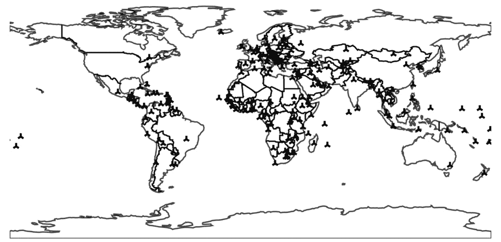
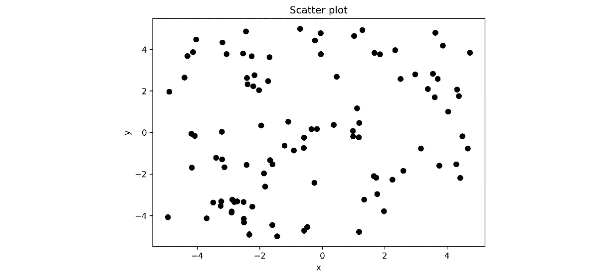
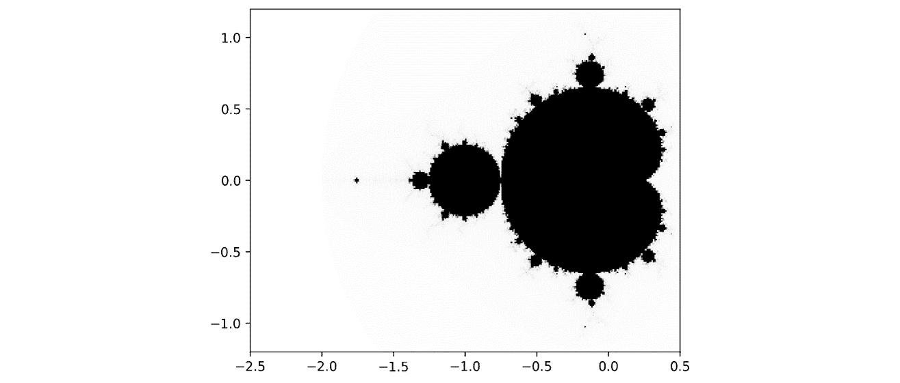
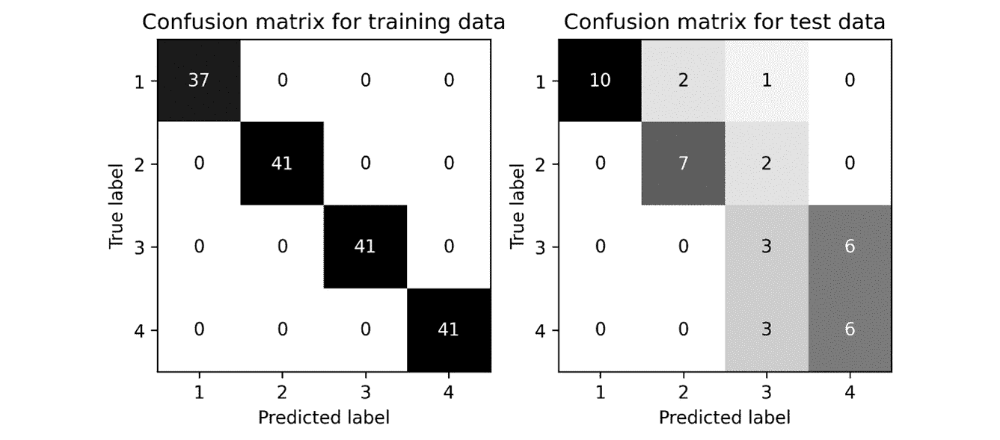

# 第十章：提高生产力

本章将讨论一些不属于本书前几章分类的主题。这些主题大多数与简化计算过程和优化代码执行有关。还有一些涉及处理特定类型的数据或文件格式。

本章的目的是为您提供一些工具，虽然它们本质上并非严格的数学工具，但在数学问题中经常出现。这些工具包括分布式计算和优化等主题——它们帮助您更快速地解决问题，验证数据和计算结果，从常见的科学计算文件格式加载和存储数据，并且融入其他有助于提高代码生产力的主题。

在前两种配方中，我们将介绍帮助跟踪计算中的单位和不确定性的包。这些对处理具有直接物理应用的数据的计算非常重要。在接下来的配方中，我们将讨论如何从 **网络通用数据格式**（**NetCDF**）文件中加载和存储数据。NetCDF 是一种通常用于存储天气和气候数据的文件格式。在第四个配方中，我们将讨论如何处理地理数据，如可能与天气或气候数据相关的数据。接下来，我们将讨论如何从终端运行 Jupyter 笔记本，而无需启动交互式会话。然后，我们将转向数据验证，并在接下来的配方中关注使用 Cython 和 Dask 等工具的性能。最后，我们将简要概述一些编写数据科学可重现代码的技术。

本章将涵盖以下配方：

+   使用 Pint 跟踪单位

+   计算中的不确定性

+   从 NetCDF 文件加载和存储数据

+   处理地理数据

+   将 Jupyter 笔记本作为脚本执行

+   数据验证

+   使用 Cython 加速代码

+   使用 Dask 分布式计算

+   为数据科学编写可重现的代码

让我们开始吧！

# 技术要求

由于本章包含的内容类型，本章需要许多不同的包。我们需要的包清单如下：

+   Pint

+   uncertainties

+   netCDF4

+   xarray

+   Pandas

+   Scikit-learn

+   GeoPandas

+   Geoplot

+   Jupyter

+   Papermill

+   Cerberus

+   Cython

+   Dask

所有这些包都可以通过您喜欢的包管理工具（如 `pip`）进行安装：

```py
python3.10 -m pip install pint uncertainties netCDF4 xarray pandas scikit-learn geopandas geoplot jupyter papermill cerberus cython
```

要安装 Dask 包，我们需要安装与该包相关的各种附加功能。可以通过在终端中使用以下 `pip` 命令来完成：

```py
python3.10 -m pip install dask[complete]
```

除了这些 Python 包，我们还需要安装一些支持软件。对于*处理地理数据*配方，GeoPandas 和 Geoplot 库有许多较低级别的依赖项，可能需要单独安装。详细的安装说明请参考 GeoPandas 包文档，网址：[`geopandas.org/install.html`](https://geopandas.org/install.html)。

对于*使用 Cython 加速代码*配方，我们需要安装 C 编译器。有关如何获得**GNU C 编译器**（**GCC**）的说明，请参见 Cython 文档：[`cython.readthedocs.io/en/latest/src/quickstart/install.html`](https://cython.readthedocs.io/en/latest/src/quickstart/install.html)。

本章的代码可以在 GitHub 仓库的`Chapter 10`文件夹中找到，地址：[`github.com/PacktPublishing/Applying-Math-with-Python-2nd-Edition/tree/main/Chapter%2010`](https://github.com/PacktPublishing/Applying-Math-with-Python-2nd-Edition/tree/main/Chapter%2010)。

# 使用 Pint 追踪单位

正确追踪计算中的单位可能非常困难，特别是当不同单位可以互换使用时。例如，非常容易忘记转换不同的单位——英尺/英寸转化为米，或者公制前缀——例如将 1 千米转换为 1,000 米。

在这个配方中，我们将学习如何使用 Pint 包在计算中追踪单位。

## 准备工作

对于这个配方，我们需要安装 Pint 包，可以通过以下方式导入：

```py
import pint
```

## 如何操作...

以下步骤展示了如何使用 Pint 包在计算中追踪单位：

1.  首先，我们需要创建一个`UnitRegistry`对象：

    ```py
    ureg = pint.UnitRegistry(system="mks")
    ```

1.  要创建一个带有单位的量，我们将数字乘以注册对象的相应属性：

    ```py
    distance = 5280 * ureg.feet
    ```

1.  我们可以使用其中一个可用的转换方法来更改量的单位：

    ```py
    print(distance.to("miles"))
    ```

    ```py
    print(distance.to_base_units())
    ```

    ```py
    print(distance.to_base_units().to_compact())
    ```

这些`print`语句的输出如下：

```py
0.9999999999999999 mile
1609.3439999999998 meter
1.6093439999999999 kilometer
```

1.  我们封装一个例程，使其期望接受秒为单位的参数，并输出以米为单位的结果：

    ```py
    @ureg.wraps(ureg.meter, ureg.second)
    ```

    ```py
    def calc_depth(dropping_time):
    ```

    ```py
        # s = u*t + 0.5*a*t*t
    ```

    ```py
        # u = 0, a = 9.81
    ```

    ```py
        return 0.5*9.81*dropping_time*dropping_time
    ```

1.  现在，当我们用`minute`单位调用`calc_depth`例程时，它会自动转换为秒进行计算：

    ```py
    depth = calc_depth(0.05 * ureg.minute)
    ```

    ```py
    print("Depth", depth)
    ```

    ```py
    # Depth 44.144999999999996 meter
    ```

## 它是如何工作的...

Pint 包提供了一个包装类，用于数值类型，给类型添加了单位元数据。这个包装类型实现了所有标准的算术操作，并在整个计算过程中追踪单位。例如，当我们将长度单位除以时间单位时，我们会得到一个速度单位。这意味着，您可以使用 Pint 来确保在复杂计算后单位是正确的。

`UnitRegistry`对象追踪会话中所有存在的单位，并处理不同单位类型之间的转换等操作。它还维护着一个度量参考系统，在本配方中，是以米、千克和秒为基本单位的国际标准系统，称为`mks`。

`wraps` 功能允许我们声明一个例程的输入和输出单位，这使得 Pint 能够对输入函数进行自动单位转换——在这个示例中，我们将分钟转换为秒。试图使用没有关联单位的数量，或者使用不兼容单位调用包装函数，会抛出异常。这使得在运行时可以验证参数，并自动转换成例程所需的正确单位。

## 还有更多内容...

Pint 包提供了一个包含大量预编程单位的测量单位列表，覆盖了大多数全球使用的系统。单位可以在运行时定义，也可以从文件中加载。这意味着你可以定义特定于应用程序的自定义单位或单位系统。

单位也可以在不同的上下文中使用，这使得在通常不相关的不同单位类型之间轻松转换成为可能。这可以在计算过程中需要频繁转换单位时节省大量时间。

# 在计算中考虑不确定性

大多数测量设备并非 100% 准确，而是具有一定的准确度，通常在 0 到 10% 之间。例如，一个温度计的准确度可能为 1%，而一把数显卡尺的准确度可能为 0.1%。在这两种情况下，真实值不太可能与报告值完全一致，尽管它们会非常接近。追踪一个值的不确定性是非常困难的，特别是当多个不确定性以不同的方式结合时。与其手动跟踪这些，不如使用一个一致的库来代替。这正是 `uncertainties` 包的功能。

在这个示例中，我们将学习如何量化变量的不确定性，并观察这些不确定性是如何在计算中传播的。

## 准备工作

对于这个示例，我们将需要 `uncertainties` 包，其中我们将导入 `ufloat` 类和 `umath` 模块：

```py
from uncertainties import ufloat, umath
```

## 如何操作...

以下步骤展示了如何在计算中量化数值的不确定性：

1.  首先，我们创建一个不确定浮动值 `3.0` 加减 `0.4`：

    ```py
    seconds = ufloat(3.0, 0.4)
    ```

    ```py
    print(seconds)      # 3.0+/-0.4
    ```

1.  接下来，我们进行涉及该不确定值的计算，以获得一个新的不确定值：

    ```py
    depth = 0.5*9.81*seconds*seconds
    ```

    ```py
    print(depth)      # 44+/-12
    ```

1.  接下来，我们创建一个新的不确定浮动值，并应用 `umath` 模块中的 `sqrt` 例程，进行前一个计算的反向操作：

    ```py
    other_depth = ufloat(44, 12)
    ```

    ```py
    time = umath.sqrt(2.0*other_depth/9.81)
    ```

    ```py
    print("Estimated time", time)
    ```

    ```py
    # Estimated time 3.0+/-0.4
    ```

如我们所见，第一次计算（*步骤 2*）的结果是一个不确定浮动值，其数值为 `44`，并且存在  系统误差。这意味着真实值可能在 32 到 56 之间。根据我们现有的测量数据，我们无法得出更精确的结果。

## 它是如何工作的...

`ufloat`类封装了`float`对象，并在整个计算过程中追踪不确定性。该库利用线性误差传播理论，使用非线性函数的导数来估算计算中的误差传播。该库还正确处理相关性，因此从自身减去一个值时，结果为零且没有误差。

为了追踪标准数学函数中的不确定性，你需要使用`umath`模块中提供的版本，而不是使用 Python 标准库或第三方包如 NumPy 中定义的版本。

## 还有更多...

`uncertainties`包为 NumPy 提供支持，而之前例子中提到的 Pint 包可以与`uncertainties`结合使用，以确保单位和误差范围正确地归属于计算的最终值。例如，我们可以计算本例第*2 步*中计算的单位，如下所示：

```py
import pint
from uncertainties import ufloat
ureg = pint.UnitRegistry(system="mks")
g = 9.81*ureg.meters / ureg.seconds ** 2
seconds = ufloat(3.0, 0.4) * ureg.seconds
depth = 0.5*g*seconds**2
print(depth)
```

正如预期的那样，最后一行的`print`语句输出了`44+/-12`米。

# 从 NetCDF 文件加载和存储数据

许多科学应用要求我们从大量多维数据开始，并使用稳健的格式。NetCDF 是气象和气候行业开发的一种数据格式示例。不幸的是，数据的复杂性意味着我们不能简单地使用例如 Pandas 包中的工具来加载这些数据进行分析。我们需要`netcdf4`包来读取并将数据导入到 Python 中，但我们还需要使用`xarray`。与 Pandas 库不同，`xarray`可以处理更高维度的数据，同时仍提供类似 Pandas 的接口。

在本例中，我们将学习如何从 NetCDF 文件加载数据并将数据存储到 NetCDF 文件中。

## 准备工作

对于本例，我们将需要导入 NumPy 包为`np`，Pandas 包为`pd`，Matplotlib 的`pyplot`模块为`plt`，以及 NumPy 中默认随机数生成器的实例：

```py
import numpy as np
import pandas as pd
import matplotlib.pyplot as plt
from numpy.random import default_rng
rng = default_rng(12345)
```

我们还需要导入`xarray`包，并以`xr`为别名。你还需要安装 Dask 包，如*技术要求*部分所述，以及`netCDF4`包：

```py
import xarray as xr
```

我们不需要直接导入这两个包。

## 如何操作...

按照以下步骤加载并存储示例数据到 NetCDF 文件：

1.  首先，我们需要创建一些随机数据。这些数据包含日期范围、位置代码列表以及随机生成的数字：

    ```py
    dates = pd.date_range("2020-01-01", periods=365, name="date")
    ```

    ```py
    locations = list(range(25))
    ```

    ```py
    steps = rng.normal(0, 1, size=(365,25))
    ```

    ```py
    accumulated = np.add.accumulate(steps)
    ```

1.  接下来，我们创建一个包含数据的 xarray `Dataset`对象。日期和位置是索引，而`steps`和`accumulated`变量是数据：

    ```py
    data_array = xr.Dataset({
    ```

    ```py
        "steps": (("date", "location"), steps),
    ```

    ```py
        "accumulated": (("date", "location"), accumulated)     },
    ```

    ```py
        {"location": locations, "date": dates}
    ```

    ```py
    )
    ```

这里显示了`print`语句的输出：

```py
<xarray.Dataset>
Dimensions: (date: 365, location: 25)
Coordinates:
* location (location) int64 0 1 2 3 4 5 6 7 8 ... 17 18 19 20 21 22 23 24
* date (date) datetime64[ns] 2020-01-01 2020-01-02 ... 2020-12-30
Data variables:
steps (date, location) float64 geoplot.pointplot(cities, ax=ax, fc="r", marker="2")
ax.axis((-180, 180, -90, 90))-1.424 1.264 ... -0.4547 -0.4873
accumulated (date, location) float64 -1.424 1.264 -0.8707 ... 8.935 -3.525
```

1.  接下来，我们计算每个时间索引下所有位置的平均值：

    ```py
    means = data_array.mean(dim="location")
    ```

1.  现在，我们在新的坐标轴上绘制平均累计值：

    ```py
    fig, ax = plt.subplots()
    ```

    ```py
    means["accumulated"].to_dataframe().plot(ax=ax)
    ```

    ```py
    ax.set(title="Mean accumulated values", 
    ```

    ```py
        xlabel="date", ylabel="value")
    ```

生成的图像如下所示：

![图 10.1 - 累计均值随时间变化的图表]

](img/B19085_10_01.jpg)

图 10.1 - 随时间变化的累积均值图

1.  使用`to_netcdf`方法将此数据集保存为一个新的 NetCDF 文件：

    ```py
    data_array.to_netcdf("data.nc")
    ```

1.  现在，我们可以使用`xarray`中的`load_dataset`例程加载新创建的 NetCDF 文件：

    ```py
    new_data = xr.load_dataset("data.nc")
    ```

    ```py
    print(new_data)
    ```

上述代码的输出如下：

```py
<xarray.Dataset>
Dimensions: (date: 365, location: 25)
Coordinates:
            * location (location) int64 0 1 2 3 4 5 6 7 8 ... 17 18 19 20 21 22 23 24
            * date (date) datetime64[ns] 2020-01-01 2020-01-02 ... 2020-12-30
Data variables:
            steps (date, location) float64 -1.424 1.264 ... -0.4547 -0.4873
            accumulated (date, location) float64 -1.424 1.264 -0.8707 ... 8.935 -3.525
```

输出显示加载的数组包含了我们在之前步骤中添加的所有数据。关键步骤是*5*和*6*，在这两个步骤中，我们存储并加载了这个`"data.nc"`数据。

## 它是如何工作的...

`xarray`包提供了`DataArray`和`DataSet`类，它们大致上是 Pandas `Series`和`DataFrame`对象的多维等效物。在这个示例中，我们使用数据集，因为每个索引——一个包含日期和位置的元组——都关联着两条数据。这两个对象都暴露了与它们的 Pandas 等效物相似的接口。例如，我们可以使用`mean`方法计算某个轴上的均值。`DataArray`和`DataSet`对象还有一个方便的方法，可以将其转换为 Pandas `DataFrame`，这个方法叫做`to_dataframe`。我们在这个食谱中使用它，将*means* *Dataset*中的累积列转换为`DataFrame`以便绘图，虽然这并不是必须的，因为`xarray`本身就内置了绘图功能。

本食谱的真正重点是`to_netcdf`方法和`load_dataset`例程。前者将一个`DataSet`对象存储为 NetCDF 格式的文件。这需要安装`netCDF4`包，因为它允许我们访问解码 NetCDF 格式文件所需的相关 C 库。`load_dataset`例程是一个通用的例程，用于从各种文件格式加载数据到`DataSet`对象中，包括 NetCDF 格式（同样，这需要安装`netCDF4`包）。

## 还有更多...

`xarray`包除了支持 NetCDF 格式外，还支持多种数据格式，如 OPeNDAP、Pickle、GRIB 等，这些格式也被 Pandas 支持。

# 处理地理数据

许多应用涉及处理地理数据。例如，在跟踪全球天气时，我们可能想要绘制世界各地传感器测量的温度，并标注它们在地图上的位置。为此，我们可以使用 GeoPandas 包和 Geoplot 包，它们都允许我们操作、分析和可视化地理数据。

在本食谱中，我们将使用 GeoPandas 和 Geoplot 包加载并可视化一些示例地理数据。

## 准备工作

对于这个食谱，我们将需要导入 GeoPandas 包、Geoplot 包以及 Matplotlib 的`pyplot`包，命名为`plt`：

```py
import geopandas
import geoplot
import matplotlib.pyplot as plt
```

## 如何实现...

按照以下步骤，使用示例数据在世界地图上绘制首都城市的简单图：

1.  首先，我们需要加载 GeoPandas 包中的示例数据，这些数据包含了全球的几何信息：

    ```py
    world = geopandas.read_file(
    ```

    ```py
        geopandas.datasets.get_path("naturalearth_lowres")
    ```

    ```py
    )
    ```

1.  接下来，我们需要加载包含全球每个首都城市名称和位置的数据：

    ```py
    cities = geopandas.read_file(
    ```

    ```py
        geopandas.datasets.get_path("naturalearth_cities")
    ```

    ```py
    )
    ```

1.  现在，我们可以创建一个新的图形，并使用 `polyplot` 例程绘制世界地理轮廓：

    ```py
    fig, ax = plt.subplots()
    ```

    ```py
    geoplot.polyplot(world, ax=ax, alpha=0.7)
    ```

1.  最后，我们使用 `pointplot` 例程将首都城市的位置叠加到世界地图上。我们还设置了坐标轴的限制，以确保整个世界都能显示出来：

    ```py
    geoplot.pointplot(cities, ax=ax, fc="k", marker="2")
    ```

    ```py
    ax.axis((-180, 180, -90, 90))
    ```

最终得到的图像展示了世界首都城市的位置：



图 10.2 - 世界各国首都城市在地图上的分布

该图展示了世界不同国家的粗略轮廓。每个首都城市的位置通过标记表示。从这个视角看，很难区分中欧地区的各个城市。

## 工作原理...

GeoPandas 包是 Pandas 的一个扩展，专门用于处理地理数据，而 Geoplot 包是 Matplotlib 的一个扩展，用于绘制地理数据。GeoPandas 包提供了一些示例数据集，我们在本节中使用了这些数据集。`naturalearth_lowres` 包含描述世界各国边界的几何图形。这些数据的分辨率不高，正如其名称所示，因此地图上可能缺少一些地理特征的细节（一些小岛根本没有显示）。`naturalearth_cities` 包含世界各国首都城市的名称和位置。我们使用 `datasets.get_path` 例程来检索这些数据集在包数据目录中的路径。`read_file` 例程将数据导入到 Python 会话中。

Geoplot 包提供了一些额外的绘图例程，专门用于绘制地理数据。`polyplot` 例程绘制来自 GeoPandas DataFrame 的多边形数据，这些数据描述了国家的地理边界。`pointplot` 例程则在一组坐标轴上绘制来自 GeoPandas DataFrame 的离散点，这些点在本例中表示首都城市的位置。

# 将 Jupyter notebook 作为脚本执行

Jupyter notebook 是一种流行的工具，广泛用于编写科学计算和数据分析应用中的 Python 代码。Jupyter notebook 实际上是一系列存储在 `.ipynb` 格式文件中的代码块。每个代码块可以是不同类型的，比如代码块或 Markdown 块。这些 notebook 通常通过 Web 应用访问，Web 应用解释这些代码块并在后台的内核中执行代码，结果再返回给 Web 应用。如果你在个人电脑上工作，这种方式非常方便，但如果你想在远程服务器上执行 notebook 中的代码呢？在这种情况下，可能连 Jupyter Notebook 提供的 Web 界面都无法访问。`papermill` 包允许我们在命令行中对 notebook 进行参数化和执行。

在本节中，我们将学习如何使用 `papermill` 从命令行执行 Jupyter notebook。

## 准备工作

对于此方法，我们需要安装 `papermill` 包，并且在当前目录中有一个示例 Jupyter notebook。我们将使用本章代码库中存储的 `sample.ipynb` notebook 文件。

## 如何操作...

按照以下步骤使用 `papermill` 命令行界面远程执行 Jupyter notebook：

1.  首先，我们从本章的代码库中打开示例 notebook 文件 `sample.ipynb`。该 notebook 包含三个代码单元，其中包含以下代码：

    ```py
    import matplotlib.pyplot as plt
    ```

    ```py
    from numpy.random import default_rng
    ```

    ```py
    rng = default_rng(12345)
    ```

    ```py
    uniform_data = rng.uniform(-5, 5, size=(2, 100))
    ```

    ```py
    fig, ax = plt.subplots(tight_layout=True)
    ```

    ```py
    ax.scatter(uniform_data[0, :], uniform_data[1, :])
    ```

    ```py
    ax.set(title="Scatter plot", xlabel="x", ylabel="y")
    ```

1.  接下来，我们在终端中打开包含 Jupyter notebook 的文件夹，并使用以下命令：

    ```py
    papermill --kernel python3 sample.ipynb output.ipynb
    ```

1.  现在，我们打开输出文件 `output.ipynb`，该文件应该包含已经更新的 notebook，其中包含执行代码的结果。最终生成的散点图如下所示：



图 10.3 - 在 Jupyter notebook 内生成的随机数据的散点图

请注意，`papermill` 命令的输出是一个全新的 notebook，它复制了原始代码和文本内容，并填充了运行命令后的输出。这对于“冻结”用于生成结果的确切代码非常有用。

## 工作原理...

`papermill` 包提供了一个简单的命令行界面，它解释并执行 Jupyter notebook，并将结果存储在新的 notebook 文件中。在此方法中，我们将第一个参数——输入的 notebook 文件——设为 `sample.ipynb`，第二个参数——输出的 notebook 文件——设为 `output.ipynb`。然后，该工具执行 notebook 中的代码并生成输出。notebook 的文件格式会跟踪最后一次运行的结果，因此这些结果会被添加到输出 notebook 中并存储在指定位置。在这个示例中，我们将其存储为一个简单的本地文件，但 `papermill` 也可以将其存储在云端位置，如 **Amazon Web Services** (**AWS**) S3 存储或 Azure 数据存储。

在 *步骤 2* 中，我们在使用 `papermill` 命令行界面时添加了 `--kernel python3` 选项。该选项允许我们指定用于执行 Jupyter notebook 的内核。如果 `papermill` 尝试使用与编写 notebook 时不同的内核执行 notebook，可能会导致错误，因此此选项可能是必要的。可以通过在终端中使用以下命令来查看可用的内核列表：

```py
jupyter kernelspec list
```

如果执行 notebook 时遇到错误，您可以尝试更换为其他内核。

## 还有更多内容...

Papermill 还提供了一个 Python 接口，使得你可以在 Python 应用程序中执行 notebook。这对于构建需要在外部硬件上执行长时间计算并且结果需要存储在云中的 Web 应用程序可能很有用。它还可以向 notebook 提供参数。为此，我们需要在 notebook 中创建一个标记为参数的块，并设置默认值。然后，可以通过命令行接口使用`-p`标志提供更新的参数，后跟参数名称和相应的值。

# 验证数据

数据通常以原始形式呈现，可能包含异常、错误或格式不正确的数据，这显然会给后续的处理和分析带来问题。通常，在处理管道中构建一个验证步骤是个好主意。幸运的是，Cerberus 包为 Python 提供了一个轻量级且易于使用的验证工具。

对于验证，我们必须定义一个*模式*，它是数据应该是什么样子以及应该执行哪些检查的技术描述。例如，我们可以检查类型并设定最大和最小值的边界。Cerberus 验证器还可以在验证步骤中执行类型转换，这使我们能够将直接从 CSV 文件加载的数据插入到验证器中。

在这个示例中，我们将学习如何使用 Cerberus 验证从 CSV 文件加载的数据。

## 准备就绪

对于这个示例，我们需要从 Python 标准库中导入`csv`模块（[`docs.python.org/3/library/csv.html`](https://docs.python.org/3/library/csv.html)），以及 Cerberus 包：

```py
import csv
import cerberus
```

我们还需要此章节中的`sample.csv`文件，来自代码仓库（[`github.com/PacktPublishing/Applying-Math-with-Python/tree/master/Chapter%2010`](https://github.com/PacktPublishing/Applying-Math-with-Python/tree/master/Chapter%2010)）。

## 如何操作...

在接下来的步骤中，我们将验证一组已从 CSV 加载的数据，使用 Cerberus 包进行验证：

1.  首先，我们需要构建一个描述我们期望数据的模式。为此，我们必须定义一个简单的浮点数模式：

    ```py
    float_schema = {"type": "float", "coerce": float, 
    ```

    ```py
        "min": -1.0, "max": 1.0}
    ```

1.  接下来，我们为单个项构建模式。这些将是我们数据的行：

    ```py
    item_schema = {
    ```

    ```py
        "type": "dict",
    ```

    ```py
        "schema": {
    ```

    ```py
            "id": {"type": "string"},
    ```

    ```py
            "number": {"type": "integer",
    ```

    ```py
            "coerce": int},
    ```

    ```py
        "lower": float_schema,
    ```

    ```py
        "upper": float_schema,
    ```

    ```py
        }
    ```

    ```py
    }
    ```

1.  现在，我们可以为整个文档定义一个模式，该模式将包含一个项目列表：

    ```py
    schema = {
    ```

    ```py
        "rows": {
    ```

    ```py
            "type": "list",
    ```

    ```py
            "schema": item_schema
    ```

    ```py
        }
    ```

    ```py
    }
    ```

1.  接下来，我们创建一个带有我们刚定义的模式的`Validator`对象：

    ```py
    validator = cerberus.Validator(schema)
    ```

1.  然后，我们使用`csv`模块中的`DictReader`加载数据：

    ```py
    with open("sample.csv") as f:
    ```

    ```py
        dr = csv.DictReader(f)
    ```

    ```py
        document = {"rows": list(dr)}
    ```

1.  接下来，我们使用`validate`方法在`validator`上验证文档：

    ```py
    validator.validate(document)
    ```

1.  然后，我们从`validator`对象中获取验证过程中的错误：

    ```py
    errors = validator.errors["rows"][0]
    ```

1.  最后，我们可以打印出现的任何错误信息：

    ```py
    for row_n, errs in errors.items():
    ```

    ```py
                print(f"row {row_n}: {errs}")
    ```

错误消息的输出如下：

```py
row 11: [{'lower': ['min value is -1.0']}]
row 18: [{'number': ['must be of integer type',      "field 'number' cannot be coerced: invalid literal for int() with base 10: 'None'"]}]
row 32: [{'upper': ['min value is -1.0']}]
row 63: [{'lower': ['max value is 1.0']}]
```

这已识别出四行不符合我们设定的模式，这限制了“lower”和“upper”中的浮动值仅限于`-1.0`到`1.0`之间。

## 它是如何工作的...

我们创建的架构是所有需要检查数据标准的技术描述。通常，它会被定义为一个字典，字典的键是项目名称，值是一个包含属性（如类型或值范围）的字典。例如，在*第 1 步*中，我们为浮点数定义了一个架构，限制这些数字的值在-1 和 1 之间。请注意，我们包含了`coerce`键，它指定了在验证过程中值应该转换为的类型。这使得我们可以传入从 CSV 文档中加载的数据，尽管它仅包含字符串，而无需担心其类型。

`validator`对象负责解析文档，以便验证并检查它们包含的数据是否符合架构中描述的所有标准。在这个食谱中，我们在创建`validator`对象时提供了架构。然而，我们也可以将架构作为第二个参数传递给`validate`方法。错误信息被存储在一个嵌套的字典中，字典的结构与文档的结构相对应。

# 使用 Cython 加速代码

Python 经常被批评为一种慢编程语言——这一点常常被辩论。许多批评可以通过使用具有 Python 接口的高性能编译库来解决，比如科学 Python 栈，从而大大提高性能。然而，有些情况下，我们无法避免 Python 不是一种编译语言的事实。在这些（相对罕见）情况下，改善性能的一种方式是编写 C 扩展（甚至将代码完全用 C 重写），以加速关键部分。这肯定会让代码运行得更快，但可能会让维护该包变得更加困难。相反，我们可以使用 Cython，它是 Python 语言的扩展，通过将 Python 代码转换为 C 并编译，从而实现极大的性能提升。

例如，我们可以考虑一些用来生成曼德尔布罗集图像的代码。为了对比，我们假设纯 Python 代码作为起点，如下所示：

```py
# mandelbrot/python_mandel.py
import numpy as np
def in_mandel(cx, cy, max_iter):
    x = cx
    y = cy
    for i in range(max_iter):
        x2 = x**2
        y2 = y**2
        if (x2 + y2) >= 4:
            return i
        y = 2.0*x*y + cy
        x = x2 - y2 + cx
    return max_iter
def compute_mandel(N_x, N_y, N_iter):
    xlim_l = -2.5
    xlim_u = 0.5
    ylim_l = -1.2
    ylim_u = 1.2
    x_vals = np.linspace(xlim_l, xlim_u,
        N_x, dtype=np.float64)
y_vals = np.linspace(ylim_l, ylim_u,
        N_y, dtype=np.float64)
    height = np.empty((N_x, N_y), dtype=np.int64)
    for i in range(N_x):
        for j in range(N_y):
        height[i, j] = in_mandel(
		    x_vals[i], y_vals[j], N_iter)
    return height
```

这段代码在纯 Python 中相对较慢的原因相当明显：嵌套的循环。为了演示目的，假设我们无法使用 NumPy 向量化这段代码。初步测试表明，使用这些函数生成曼德尔布罗集图像，使用 320 × 240 的点和 255 步大约需要 6.3 秒。你的测试时间可能会有所不同，取决于你的系统。

在这个食谱中，我们将使用 Cython 大幅提升前述代码的性能，以生成曼德尔布罗集图像。

## 准备工作

对于这个食谱，我们需要安装 NumPy 包和 Cython 包。你还需要在系统上安装一个 C 编译器，如 GCC。例如，在 Windows 上，你可以通过安装 MinGW 来获得 GCC 版本。

## 如何做到...

按照以下步骤使用 Cython 大幅提高生成曼德尔布罗特集图像代码的性能：

1.  在`mandelbrot`文件夹中开始一个名为`cython_mandel.pyx`的新文件。在此文件中，我们将添加一些简单的导入和类型定义：

    ```py
    # mandelbrot/cython_mandel.pyx
    ```

    ```py
    import numpy as np
    ```

    ```py
    cimport numpy as np
    ```

    ```py
    cimport cython
    ```

    ```py
    ctypedef Py_ssize_t Int
    ```

    ```py
    ctypedef np.float64_t Double
    ```

1.  接下来，我们使用 Cython 语法定义`in_mandel`例程的新版本。在该例程的前几行添加一些声明：

    ```py
    cdef int in_mandel(Double cx, Double cy, int max_iter):
    ```

    ```py
        cdef Double x = cx
    ```

    ```py
        cdef Double y = cy
    ```

    ```py
        cdef Double x2, y2
    ```

    ```py
        cdef Int i
    ```

1.  其余部分与 Python 版本的函数完全相同：

    ```py
        for i in range(max_iter):
    ```

    ```py
            x2 = x**2
    ```

    ```py
            y2 = y**2
    ```

    ```py
            if (x2 + y2) >= 4:
    ```

    ```py
                return i
    ```

    ```py
            y = 2.0*x*y + cy
    ```

    ```py
            x = x2 - y2 + cx
    ```

    ```py
        return max_iter
    ```

1.  接下来，我们定义`compute_mandel`函数的新版本。我们向该函数添加了两个来自 Cython 包的装饰器：

    ```py
    @cython.boundscheck(False)
    ```

    ```py
    @cython.wraparound(False)
    ```

    ```py
    def compute_mandel(int N_x, int N_y, int N_iter):
    ```

1.  然后，我们定义常量，就像在原始例程中一样：

    ```py
        cdef double xlim_l = -2.5
    ```

    ```py
        cdef double xlim_u = 0.5
    ```

    ```py
        cdef double ylim_l = -1.2
    ```

    ```py
        cdef double ylim_u = 1.2
    ```

1.  我们使用与 Python 版本完全相同的方式调用 NumPy 包中的`linspace`和`empty`例程。唯一的不同是，我们声明了`i`和`j`变量，它们是`Int`类型：

    ```py
        cdef np.ndarray x_vals = np.linspace(xlim_l,
    ```

    ```py
            xlim_u, N_x, dtype=np.float64)
    ```

    ```py
        cdef np.ndarray y_vals = np.linspace(ylim_l,
    ```

    ```py
            ylim_u, N_y, dtype=np.float64)
    ```

    ```py
        cdef np.ndarray height = np.empty(
    ```

    ```py
            (N_x, N_y),dtype=np.int64)
    ```

    ```py
        cdef Int i, j
    ```

1.  定义的其余部分与 Python 版本完全相同：

    ```py
        for i in range(N_x):
    ```

    ```py
            for j in range(N_y):
    ```

    ```py
                height[i, j] = in_mandel(
    ```

    ```py
                    xx_vals[i], y_vals[j], N_iter)
    ```

    ```py
            return height
    ```

1.  接下来，我们在`mandelbrot`文件夹中创建一个新的文件，命名为`setup.py`，并在文件顶部添加以下导入：

    ```py
    # mandelbrot/setup.py
    ```

    ```py
    import numpy as np
    ```

    ```py
    from setuptools import setup, Extension
    ```

    ```py
    from Cython.Build import cythonize
    ```

1.  之后，我们定义一个扩展模块，源文件指向原始的`python_mandel.py`文件。将此模块的名称设置为`hybrid_mandel`：

    ```py
    hybrid = Extension(
    ```

    ```py
        "hybrid_mandel",
    ```

    ```py
        sources=["python_mandel.py"],
    ```

    ```py
        include_dirs=[np.get_include()],
    ```

    ```py
        define_macros=[("NPY_NO_DEPRECATED_API",
    ```

    ```py
            "NPY_1_7_API_VERSION")]
    ```

    ```py
    )
    ```

1.  现在，我们定义第二个扩展模块，源文件设置为刚才创建的`cython_mandel.pyx`文件：

    ```py
    cython = Extension(
    ```

    ```py
        "cython_mandel",
    ```

    ```py
        sources=["cython_mandel.pyx"],
    ```

    ```py
        include_dirs=[np.get_include()],
    ```

    ```py
        define_macros=[("NPY_NO_DEPRECATED_API",
    ```

    ```py
            "NPY_1_7_API_VERSION")]
    ```

    ```py
    )
    ```

1.  接下来，我们将这两个扩展模块添加到一个列表中，并调用`setup`例程来注册这些模块：

    ```py
    extensions = [hybrid, cython]
    ```

    ```py
    setup(
    ```

    ```py
        ext_modules = cythonize(
    ```

    ```py
            extensions, compiler_directives={
    ```

    ```py
    		    "language_level": "3"}),
    ```

    ```py
    )
    ```

1.  在`mandelbrot`文件夹中创建一个名为`__init__.py`的新空文件，使其成为一个可以导入到 Python 中的包。

1.  打开`mandelbrot`文件夹中的终端，使用以下命令构建 Cython 扩展模块：

    ```py
    python3.8 setup.py build_ext --inplace
    ```

1.  现在，开始一个名为`run.py`的新文件，并添加以下`import`语句：

    ```py
    # run.py
    ```

    ```py
    from time import time
    ```

    ```py
    from functools import wraps
    ```

    ```py
    import matplotlib.pyplot as plt
    ```

1.  从我们定义的每个模块中导入不同的`compute_mandel`例程：`python_mandel`为原始版本；`hybrid_mandel`为 Cython 化的 Python 代码；`cython_mandel`为编译后的纯 Cython 代码：

    ```py
    from mandelbrot.python_mandel import compute_mandel
    ```

    ```py
                as compute_mandel_py
    ```

    ```py
    from mandelbrot.hybrid_mandel import compute_mandel
    ```

    ```py
                as compute_mandel_hy
    ```

    ```py
    from mandelbrot.cython_mandel import compute_mandel
    ```

    ```py
                as compute_mandel_cy
    ```

1.  定义一个简单的计时器装饰器，我们将用它来测试例程的性能：

    ```py
    def timer(func, name):
    ```

    ```py
    	@wraps(func)
    ```

    ```py
    	def wrapper(*args, **kwargs):
    ```

    ```py
    		t_start = time()
    ```

    ```py
    		val = func(*args, **kwargs)
    ```

    ```py
    		t_end = time()
    ```

    ```py
    		print(f"Time taken for {name}:
    ```

    ```py
    			{t_end - t_start}")
    ```

    ```py
    		return val
    ```

    ```py
    	return wrapper
    ```

1.  将`timer`装饰器应用到每个导入的例程，并为测试定义一些常量：

    ```py
    mandel_py = timer(compute_mandel_py, "Python")
    ```

    ```py
    mandel_hy = timer(compute_mandel_hy, "Hybrid")
    ```

    ```py
    mandel_cy = timer(compute_mandel_cy, "Cython")
    ```

    ```py
    Nx = 320
    ```

    ```py
    Ny = 240
    ```

    ```py
    steps = 255
    ```

1.  使用我们之前设置的常量运行每个已装饰的例程。将最后一次调用（Cython 版本）的输出记录在`vals`变量中：

    ```py
    mandel_py(Nx, Ny, steps)
    ```

    ```py
    mandel_hy(Nx, Ny, steps)
    ```

    ```py
    vals = mandel_cy(Nx, Ny, steps)
    ```

1.  最后，绘制 Cython 版本的输出，以检查该例程是否正确计算曼德尔布罗特集：

    ```py
    fig, ax = plt.subplots()
    ```

    ```py
    ax.imshow(vals.T, extent=(-2.5, 0.5, -1.2, 1.2))
    ```

    ```py
    plt.show()
    ```

运行`run.py`文件将会打印每个例程的执行时间到终端，如下所示：

```py
Time taken for Python: 11.399756908416748
Time taken for Hybrid: 10.955225229263306
Time taken for Cython: 0.24534869194030762
```

注意

这些时间不如第一版那样好，这可能是由于作者的 PC 上 Python 安装的方式。你的时间可能会有所不同。

曼德尔布罗特集的图像可以在下图中看到：



](img/B19085_10_04.jpg)

图 10.4 - 使用 Cython 代码计算的曼德尔布罗特集图像

这就是我们对曼德尔布罗集合的预期效果。细节部分在边界处有所显示。

## 它是如何工作的...

这个食谱中有很多内容需要说明，因此我们先从解释整体过程开始。Cython 将用 Python 语言扩展编写的代码编译成 C 代码，然后生成一个可以导入到 Python 会话中的 C 扩展库。实际上，你甚至可以使用 Cython 将普通的 Python 代码直接编译成扩展，尽管结果不如使用修改后的语言时好。食谱中的前几步定义了用修改后的语言编写的 Python 代码的新版本（保存为 `.pyx` 文件），其中除了常规的 Python 代码外，还包含了类型信息。为了使用 Cython 构建 C 扩展，我们需要定义一个设置文件，然后创建一个文件运行它来生成结果。

Cython 编译后的最终版本比其 Python 等效版本运行得要快得多。Cython 编译后的 Python 代码（我们在本食谱中称之为混合代码）比纯 Python 代码稍微快一些。这是因为生成的 Cython 代码仍然需要与 Python 对象进行交互，且必须考虑所有相关问题。通过在 `.pyx` 文件中的 Python 代码中添加类型信息，我们开始看到性能有了显著的提升。这是因为 `in_mandel` 函数现在有效地被定义为一个 C 级别的函数，不再与 Python 对象交互，而是直接操作原始数据类型。

Cython 代码与 Python 等效代码之间有一些小但非常重要的差异。在 *步骤 1* 中，你可以看到我们照常导入了 NumPy 包，但我们还使用了 `cimport` 关键字将一些 C 级别的定义引入作用域。在 *步骤 2* 中，我们在定义 `in_mandel` 函数时使用了 `cdef` 关键字，而不是 `def` 关键字。这意味着 `in_mandel` 函数被定义为一个 C 级别的函数，不能从 Python 级别调用，这样在调用该函数时（这会发生很多次）就节省了大量开销。

关于该函数定义的唯一其他实际差异是签名中和函数的前几行中包含了一些类型声明。我们在这里应用的两个装饰器禁用了访问列表（数组）元素时的边界检查。`boundscheck` 装饰器禁用了检查索引是否有效（即是否在 0 和数组大小之间），而 `wraparound` 装饰器禁用了负索引。这两个装饰器都能在执行过程中带来适度的速度提升，尽管它们会禁用 Python 内置的一些安全功能。在这个食谱中，禁用这些检查是可以接受的，因为我们正在遍历数组的有效索引。

设置文件是我们告诉 Python（因此也告诉 Cython）如何构建 C 扩展的地方。Cython 中的 `cythonize` 例程是关键，它触发了 Cython 构建过程。在 *步骤 9* 和 *步骤 10* 中，我们使用 `setuptools` 中的 `Extension` 类定义了扩展模块，以便为构建定义一些额外的细节；具体来说，我们为 NumPy 编译设置了一个环境变量，并添加了 NumPy C 头文件的 `include` 文件。这是通过 `Extension` 类的 `define_macros` 关键字参数完成的。我们在 *步骤 13* 中使用的终端命令使用 `setuptools` 构建 Cython 扩展，并且添加 `--inplace` 标志意味着编译后的库将被添加到当前目录，而不是放置在集中位置。这对于开发来说非常方便。

运行脚本非常简单：从每个已定义的模块中导入例程——其中有两个实际上是 C 扩展模块——并测量它们的执行时间。我们需要在导入别名和例程名称上稍作创意，以避免冲突。

## 还有更多……

Cython 是一个强大的工具，可以提高代码某些方面的性能。然而，在优化代码时，你必须始终谨慎，明智地分配时间。可以使用 Python 标准库中提供的配置文件（如 cProfile）来找到代码中性能瓶颈发生的地方。在这个案例中，性能瓶颈的位置相当明显。Cython 是解决这个问题的一个好办法，因为它涉及到在（双重）`for` 循环中重复调用一个函数。然而，它并不是解决所有性能问题的万能方法，通常情况下，重构代码使其能够利用高性能库，往往能显著提高代码的性能。

Cython 与 Jupyter Notebook 紧密集成，可以无缝地在笔记本的代码块中使用。当 Cython 使用 Anaconda 发行版安装时，它也包含在 Anaconda 中，因此不需要额外的设置就可以在 Jupyter 笔记本中使用 Cython。

还有其他替代方案可以将 Python 代码编译为机器码。例如，Numba 包 ([`numba.pydata.org/`](http://numba.pydata.org/)) 提供了一个 **即时编译**（**JIT**）编译器，通过简单地在特定函数上添加装饰器，在运行时优化 Python 代码。Numba 旨在与 NumPy 和其他科学 Python 库一起使用，也可以用来利用 GPU 加速代码。

通过 `pyjion` 包（[`www.trypyjion.com/`](https://www.trypyjion.com/)）还可以使用一个通用的 JIT 编译器。这可以在各种场景中使用，不像 Numba 库主要用于数值代码。`jax` 库中也有一个内置的 JIT 编译器，如在*第三章*所讨论的，但它也仅限于数值代码。

# 使用 Dask 进行分布式计算

Dask 是一个用于在多个线程、进程甚至计算机之间分布式计算的库，旨在有效地进行大规模计算。即使在单台笔记本电脑上工作，它也能大幅提升性能和吞吐量。Dask 提供了 Python 科学计算栈中大多数数据结构的替代品，比如 NumPy 数组和 Pandas DataFrame。这些替代品具有非常相似的接口，但底层是为分布式计算而构建的，可以在多个线程、进程或计算机之间共享。在许多情况下，切换到 Dask 就像改变 `import` 语句那么简单，可能还需要添加几个额外的方法调用来启动并发计算。

在这个实例中，我们将学习如何使用 Dask 在 DataFrame 上进行一些简单的计算。

## 准备工作

对于这个实例，我们需要从 Dask 包中导入 `dataframe` 模块。按照 Dask 文档中的约定，我们将以 `dd` 别名导入此模块：

```py
import dask.dataframe as dd
```

我们还需要本章代码库中的 `sample.csv` 文件。

## 如何操作...

按照以下步骤使用 Dask 对 DataFrame 对象执行一些计算：

1.  首先，我们需要将数据从 `sample.csv` 加载到 Dask DataFrame 中。`number` 列的类型设置为 `"object"`，因为否则 Dask 的类型推断会失败（因为此列包含 `None`，但其余部分为整数）：

    ```py
    data = dd.read_csv("sample.csv", dtype={
    ```

    ```py
        "number":"object"})
    ```

1.  接下来，我们对 DataFrame 的列执行标准计算：

    ```py
    sum_data = data.lower + data.upper
    ```

    ```py
    print(sum_data)
    ```

与 Pandas DataFrame 不同，结果不是一个新的 DataFrame。`print` 语句为我们提供了以下信息：

```py
Dask Series Structure:
npartitions=1
             float64
                               ...
dtype: float64
Dask Name: add, 4 graph layers
```

1.  要实际获取结果，我们需要使用 `compute` 方法：

    ```py
    result = sum_data.compute()
    ```

    ```py
    print(result.head())
    ```

结果现在如预期所示：

```py
0      -0.911811
1       0.947240
2      -0.552153
3      -0.429914
4       1.229118
dtype:  float64
```

1.  我们计算最后两列的均值，方法和使用 Pandas DataFrame 完全相同，只是需要调用 `compute` 方法来执行计算：

    ```py
    means = data[["lower", "upper"]].mean().compute()
    ```

    ```py
    print(means)
    ```

结果如我们所预期的那样打印出来：

```py
lower -0.060393
upper -0.035192
dtype: float64
```

## 它是如何工作的...

Dask 为计算构建了一个*任务图*，该图描述了需要在数据集合上执行的各种操作和计算之间的关系。这将计算步骤拆解开来，以便可以在不同的工作节点上按照正确的顺序进行计算。这个任务图会被传递给调度器，调度器将实际任务发送到工作节点进行执行。Dask 提供了几种不同的调度器：同步、线程化、进程化和分布式。调度器的类型可以在调用 `compute` 方法时选择，或者全局设置。如果没有指定，Dask 会选择一个合理的默认值。

同步、线程化和进程化调度器适用于单台机器，而分布式调度器则用于集群。Dask 允许你以相对透明的方式在调度器之间进行切换，尽管对于小任务来说，由于设置更复杂的调度器所带来的开销，你可能不会获得任何性能提升。

`compute` 方法是本食谱的关键。通常会对 Pandas DataFrame 执行计算的方法，现在仅仅是设置一个通过 Dask 调度器执行的计算。直到调用 `compute` 方法，计算才会开始。这类似于 `Future`（如来自 asyncio 标准库的 `Future`）的方式，它作为异步函数调用结果的代理，直到计算完成时，才会返回实际结果。

## 还有更多...

Dask 提供了用于 NumPy 数组的接口，以及在本食谱中展示的 DataFrame 接口。还有一个名为 `dask_ml` 的机器学习接口，提供与 `scikit-learn` 包类似的功能。一些外部包，如 `xarray`，也有 Dask 接口。Dask 还可以与 GPU 协同工作，以进一步加速计算并从远程源加载数据，这在计算分布在集群中的时候非常有用。

# 编写可重复的数据科学代码

科学方法的基本原则之一是，结果应该是可重复的并且可以独立验证的。遗憾的是，这一原则常常被低估，反而更重视“新颖”的想法和结果。作为数据科学的从业者，我们有责任尽力使我们的分析和结果尽可能具有可重复性。

由于数据科学通常完全在计算机上进行——也就是说，它通常不涉及测量中的仪器误差——有些人可能会认为所有的数据科学工作本质上都是可重复的。但事实并非如此。在使用随机化的超参数搜索或基于随机梯度下降的优化时，容易忽略一些简单的细节，比如种子设置（参见*第三章*）。此外，一些更微妙的非确定性因素（例如使用线程或多进程）如果不加以注意，可能会显著改变结果。

在这个例程中，我们将展示一个基本数据分析管道的示例，并实施一些基本步骤，以确保您可以重复结果。

## 准备工作

对于这个例程，我们将需要 NumPy 包，通常以`np`导入，Pandas 包，以`pd`导入，Matplotlib 的`pyplot`接口，以`plt`导入，以及从`scikit-learn`包中导入以下内容：

```py
from sklearn.metrics import ConfusionMatrixDisplay, accuracy_score
from sklearn.model_selection import train_test_split
from sklearn.tree import DecisionTreeClassifier
```

我们将模拟我们的数据（而不是从其他地方获取数据），因此需要使用一个具有种子值的默认随机数生成器实例（以确保可重复性）：

```py
rng = np.random.default_rng(12345)
```

为了生成数据，我们定义了以下例程：

```py
def get_data():
	permute = rng.permutation(200)
	data = np.vstack([
		rng.normal((1.0, 2.0, -3.0), 1.0,
		size=(50, 3)),
		rng.normal((-1.0, 1.0, 1.0), 1.0,
		size=(50, 3)),
		rng.normal((0.0, -1.0, -1.0), 1.0,
		size=(50, 3)),
		rng.normal((-1.0, -1.0, -2.0), 1.0,
		size=(50, 3))
		])
	labels = np.hstack(
		[[1]*50, [2]*50, [3]*50,[4]*50])
	X = pd.DataFrame(
		np.take(data, permute, axis=0),
		columns=["A", "B", "C"])
	y = pd.Series(np.take(labels, permute, axis=0))
	return X, y
```

我们使用这个函数来代替其他将数据加载到 Python 中的方法，例如从文件中读取或从互联网上下载。

## 如何实现……

请按照以下步骤创建一个非常简单且可重复的数据科学管道：

1.  首先，我们需要使用之前定义的`get_data`例程“加载”数据：

    ```py
    data, labels = get_data()
    ```

1.  由于我们的数据是动态获取的，最好将数据与我们生成的任何结果一起存储。

    ```py
    data.to_csv("data.csv")
    ```

    ```py
    labels.to_csv("labels.csv")
    ```

1.  现在，我们需要使用`scikit-learn`中的`train_test_split`例程将数据分为训练集和测试集。我们将数据按 80/20 的比例进行划分，并确保设置了随机状态，以便可以重复这个过程（尽管我们将在下一步保存索引以供参考）：

    ```py
    X_train, X_test, y_train, y_test = train_test_split(
    ```

    ```py
        data,labels, test_size=0.2, random_state=23456)
    ```

1.  现在，我们确保保存训练集和测试集的索引，以便我们确切知道每个样本中的观测值。我们可以将这些索引与*步骤 2*中存储的数据一起使用，以便稍后完全重建这些数据集：

    ```py
    X_train.index.to_series().to_csv("train_index.csv",
    ```

    ```py
        index=False, header=False)
    ```

    ```py
    X_test.index.to_series().to_csv("test_index.csv",
    ```

    ```py
        index=False, header=False)
    ```

1.  现在，我们可以设置并训练分类器。在这个示例中，我们使用一个简单的`DecisionTreeClassifier`，但这个选择并不重要。由于训练过程涉及一些随机性，请确保将`random_state`关键字参数设置为种子值，以便控制这种随机性：

    ```py
    classifier = DecisionTreeClassifier(random_state=34567)
    ```

    ```py
    classifer.fit(X_train, y_train)
    ```

1.  在继续之前，最好先收集一些关于训练模型的信息，并将其与结果一起存储。不同模型的有趣信息会有所不同。对于这个模型，特征重要性信息可能很有用，因此我们将其记录在一个 CSV 文件中：

    ```py
    feat_importance = pd.DataFrame(
    ```

    ```py
    	classifier.feature_importances_,
    ```

    ```py
    	index=classifier.feature_names_in_,
    ```

    ```py
    	columns=["Importance"])
    ```

    ```py
    feat_importance.to_csv("feature_importance.csv")
    ```

1.  现在，我们可以继续检查模型的表现。我们将在训练数据和测试数据上评估模型，稍后我们会将其与真实标签进行比较：

    ```py
    train_predictions = classifier.predict(X_train)
    ```

    ```py
    test_predictions = classifier.predict(X_test)
    ```

1.  始终保存此类预测任务（或回归任务，或其他将以某种方式成为报告一部分的最终结果）的结果。我们首先将它们转换为`Series`对象，以确保索引设置正确：

    ```py
    pd.Series(train_predictions,index=X_train.index,
    ```

    ```py
        name="Predicted label").to_csv(
    ```

    ```py
    		"train_predictions.csv")
    ```

    ```py
    pd.Series(test_predictions,index=X_test.index,
    ```

    ```py
        name="Predicted label").to_csv(
    ```

    ```py
    		"test_predictions.csv")
    ```

1.  最后，我们可以生成任何图形或度量，以帮助我们决定如何继续进行分析。在这里，我们将为训练和测试队列分别生成一个混淆矩阵图，并打印出一些准确度总结评分：

    ```py
    fig, (ax1, ax2) = plt.subplots(1, 2, tight_layout=True)
    ```

    ```py
    ax1.set_title("Confusion matrix for training data")
    ```

    ```py
    ax2.set_title("Confusion matrix for test data")
    ```

    ```py
    ConfusionMatrixDisplay.from_predictions(
    ```

    ```py
    	y_train, train_predictions,
    ```

    ```py
    	ax=ax1 cmap="Greys", colorbar=False)
    ```

    ```py
    ConfusionMatrixDisplay.from_predictions(
    ```

    ```py
    	y_test, test_predictions,
    ```

    ```py
    	ax=ax2 cmap="Greys", colorbar=False)
    ```

    ```py
    print(f"Train accuracy {accuracy_score(y_train, train_predictions)}",
    ```

    ```py
    	f"Test accuracy {accuracy_score(y_test, test_predictions)}",
    ```

    ```py
    	sep="\n")
    ```

    ```py
    # Train accuracy 1.0
    ```

    ```py
    # Test accuracy 0.65
    ```

结果的混淆矩阵见*图 10.5*：



图 10.5 - 简单分类任务的混淆矩阵

这个例子的测试结果并不出色，这不应该令人惊讶，因为我们没有花时间选择最合适的模型或进行调优，并且我们的样本量相当小。为这些数据生成一个准确的模型并不是目标。在当前目录中（脚本运行所在的目录），应该会有一些新的 CSV 文件，包含我们写入磁盘的所有中间数据：`data.csv`、`labels.csv`、`train_index.csv`、`test_index.csv`、`feature_importance.csv`、`train_predictions.csv` 和 `test_predictions.csv`。

## 它是如何工作的…

在可重复性方面没有明确的*正确*答案，但肯定有错误的答案。我们这里只触及了如何使代码更具可重复性的一些想法，但还有很多可以做的事情。（参见*更多内容…*）。在这个过程中，我们实际上更专注于存储中间值和结果，而不是其他任何东西。这一点常常被忽视，大家更倾向于生成图表和图形——因为这些通常是展示结果的方式。然而，我们不应该为了更改图表的样式而重新运行整个流程。存储中间值可以让你审计流程中的各个部分，检查你做的事情是否合理和适当，并确保你能从这些中间值中重现结果。

一般来说，数据科学流程包含五个步骤：

1.  数据获取

1.  数据预处理和特征选择

1.  模型和超参数调优

1.  模型训练

1.  评估和结果生成

在本教程中，我们将数据获取步骤替换为一个随机生成数据的函数。如引言中所述，这一步通常会涉及从磁盘加载数据（来自 CSV 文件或数据库）、从互联网下载数据，或直接从测量设备采集数据。我们缓存了数据获取的结果，因为我们假设这是一个开销较大的操作。当然，这并非总是如此；如果你直接从磁盘加载所有数据（例如通过 CSV 文件），那么显然不需要存储这份数据的第二份副本。然而，如果你通过查询一个大型数据库生成数据，那么存储数据的平面副本将大大提高你在数据管道上迭代的速度。

我们的预处理仅包括将数据分割成训练集和测试集。再次说明，我们在这一步之后存储了足够的数据，以便稍后可以独立地重建这些数据集——我们只存储了与每个数据集对应的 ID。由于我们已经存储了这些数据集，因此在 `train_test_split` 函数中种子随机数并非绝对必要，但通常来说这是一个好主意。如果你的预处理涉及更为密集的操作，你可能会考虑缓存处理过的数据或在数据管道中使用的生成特征（我们稍后将更详细地讨论缓存）。如果你的预处理步骤涉及从数据的列中选择特征，那么你应该绝对保存这些选择的特征到磁盘，并与结果一起存储。

我们的模型非常简单，且没有任何（非默认）超参数。如果你做过超参数调整，你应该将这些参数以及任何可能需要用来重建模型的元数据进行存储。存储模型本身（通过序列化或其他方式）是有用的，但请记住，序列化后的模型可能无法被其他方读取（例如，如果他们使用的是不同版本的 Python）。

你应该始终存储来自模型的数值结果。当你检查后续运行时结果是否相同，比较图表和其他摘要图形几乎是不可能的。此外，这样做可以让你在之后快速重新生成图形或数值，如果有需要的话。例如，如果你的分析涉及二元分类问题，那么存储用于生成**接收者操作特征**（**ROC**）曲线的值是个好主意，即使你已经绘制了 ROC 曲线的图形并报告了曲线下的面积。

## 还有更多……

我们在这里还没有讨论很多内容。首先，让我们处理一个显而易见的问题。Jupyter notebooks 是一种常用的数据科学工作流工具。这没问题，但用户应该了解，这种格式有几个缺点。首先，最重要的一点是，Jupyter notebooks 可以无序运行，后面的单元格可能会依赖于前面的单元格，这些依赖关系可能不是很直观。为了解决这个问题，确保你每次都在一个干净的内核上完整地运行整个 notebook，而不是仅仅在当前内核中重新运行每个单元格（例如，使用 *Executing a Jupyter notebook as a script* 这一配方中的 Papermill 工具）。其次，notebook 中存储的结果可能与代码单元格中编写的代码不一致。这种情况发生在 notebook 被运行过并且代码在事后被修改，但没有重新运行的情况下。一个好的做法是，保留一份没有任何存储结果的主副本，然后创建多个副本，其中包含结果，并且这些副本不再进行修改。最后，Jupyter notebooks 通常在一些难以正确缓存中间步骤结果的环境中执行。这部分问题由 notebook 内部的缓存机制部分解决，但它并不总是完全透明的。

现在，让我们讨论两个与可重复性相关的一般性问题：配置和缓存。配置是指用于控制工作流设置和执行的值的集合。在这个配方中，我们没有明显的配置值，除了在 `train_test_split` 例程中使用的随机种子和模型（以及数据生成，暂时不考虑这些），以及训练/测试集拆分时所取的百分比。这些值是硬编码在配方中的，但这可能不是最好的做法。至少，我们希望能够记录每次运行分析时使用的配置。理想情况下，配置应该从文件中加载（仅加载一次），然后在工作流运行之前被最终确定并缓存。这意味着，完整的配置应该从一个或多个来源（配置文件、命令行参数或环境变量）加载，汇总为一个“真实来源”，然后将其序列化为机器可读和人类可读的格式，如 JSON，并与结果一起存储。这样你就可以确切知道是使用了什么配置生成了这些结果。

缓存是存储中间结果的过程，以便在随后的运行中可以重用，从而减少运行时间。在本食谱中，我们确实存储了中间结果，但我们没有建立机制来重用已存储的数据（如果它存在且有效）。这是因为实际的检查和加载缓存值的机制较为复杂，并且有些依赖于具体的配置。由于我们的项目非常小，所以缓存值未必有意义。然而，对于有多个组件的大型项目来说，缓存确实能带来差异。在实现缓存机制时，您应该建立一个系统来检查缓存是否有效，例如，可以使用代码文件及其依赖的任何数据源的 SHA-2 哈希值。

在存储结果时，通常的好做法是将所有结果一起存储在一个带有时间戳的文件夹或类似的地方。我们在本食谱中没有这样做，但其实很容易实现。例如，使用标准库中的`datetime`和`pathlib`模块，我们可以轻松创建一个用于存储结果的基础路径：

```py
from pathlib import Path
from datetime import datetime
RESULTS_OUT = Path(datetime.now().isoformat())
...
results.to_csv(RESULTS_OUT / "name.csv")
```

如果您使用多进程并行运行多个分析任务，必须小心，因为每个新进程都会生成一个新的`RESULTS_OUT`全局变量。更好的选择是将其纳入配置过程，这样用户还可以自定义输出路径。

除了我们迄今为止讨论的脚本中的实际代码外，在项目层面上还有很多可以做的事情，以提高代码的可重现性。第一步，也是最重要的一步，是尽可能使代码可用，这包括指定代码可以共享的许可证（如果可以的话）。此外，好的代码应该足够健壮，以便可以用于分析多个数据集（显然，这些数据应该与最初使用的数据类型相同）。同样重要的是使用版本控制（如 Git、Subversion 等）来跟踪更改。这也有助于将代码分发给其他用户。最后，代码需要有良好的文档说明，并且理想情况下应有自动化测试，以检查管道在示例数据集上的预期表现。

## 参见...

以下是一些关于可重现编码实践的额外信息来源：

+   *图灵之路*。《可重现、伦理和协作数据科学手册》，由艾伦·图灵研究所编写。[`the-turing-way.netlify.app/welcome`](https://the-turing-way.netlify.app/welcome)

+   《开放源代码软件期刊》审稿标准：*即使代码不是为了公开发布，也应遵循的良好实践指南*：[`joss.readthedocs.io/en/latest/review_criteria.html`](https://joss.readthedocs.io/en/latest/review_criteria.html)

这结束了本书的第十章，也是最后一章。请记住，我们才刚刚触及了使用 Python 做数学时可能实现的表面，您应该阅读本书中提到的文档和资源，以了解这些包和技术能够实现的更多信息。
