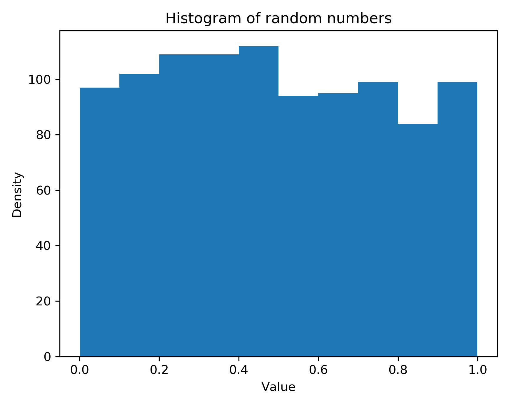
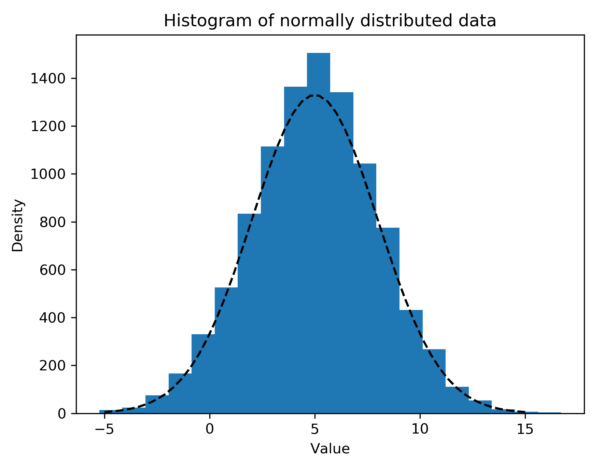
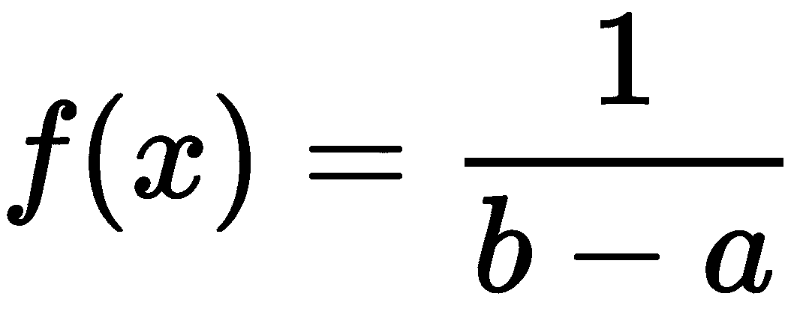
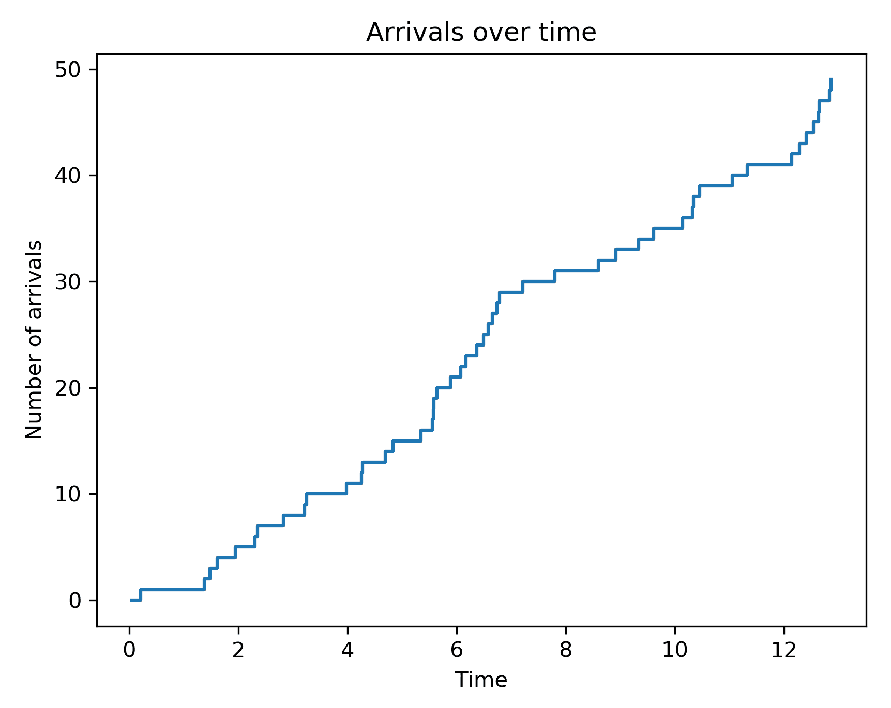
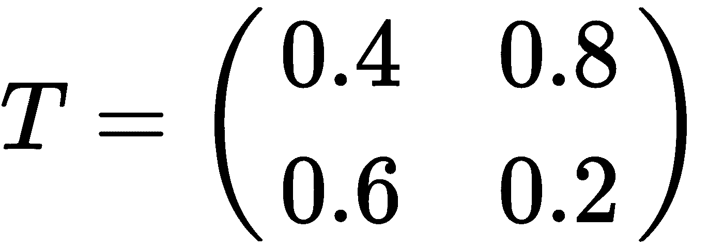
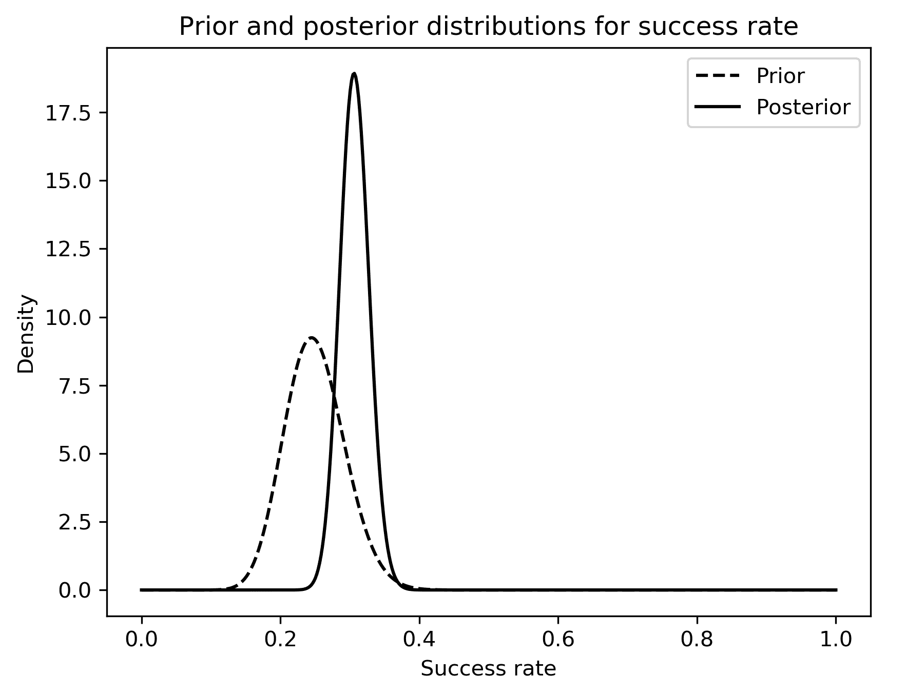
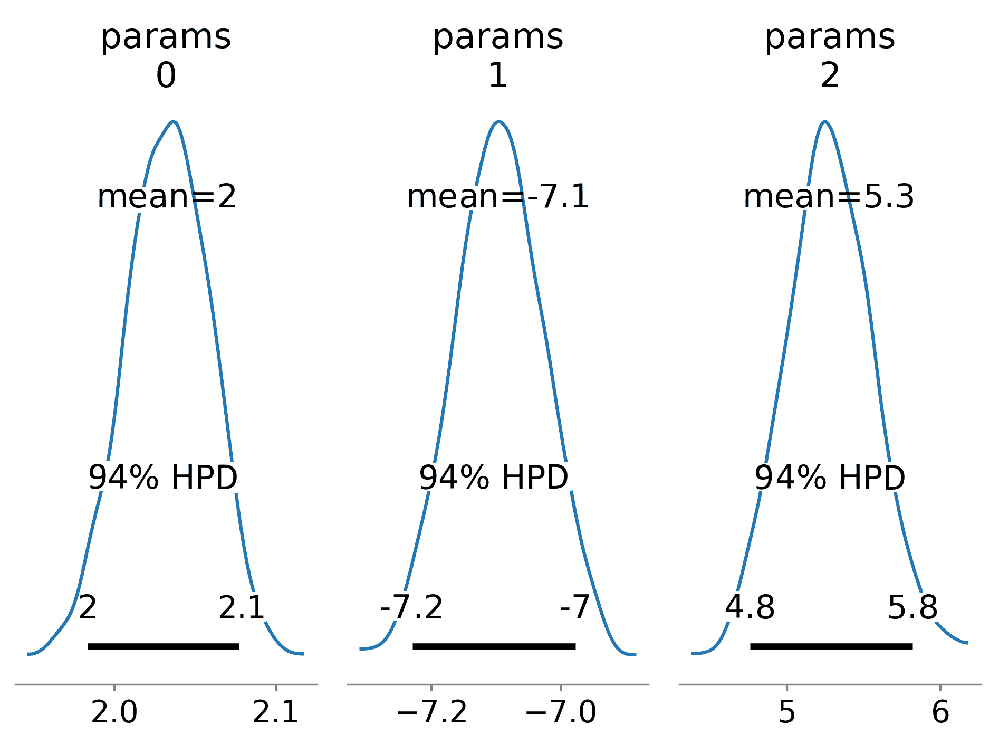
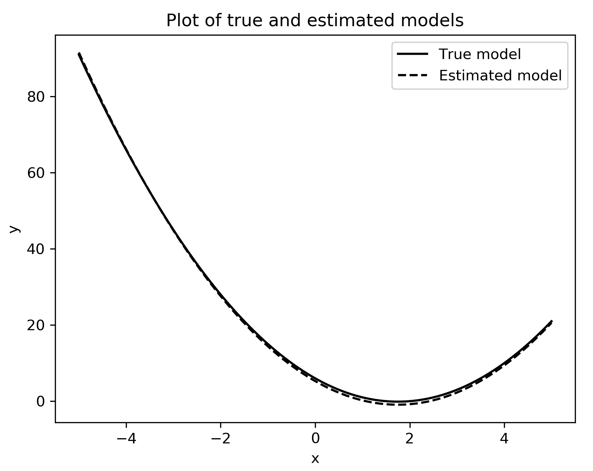

# 第五章：处理随机性和概率

在本章中，我们将讨论随机性和概率。我们将首先通过从数据集中选择元素来简要探讨概率的基本原理。然后，我们将学习如何使用 Python 和 NumPy 生成（伪）随机数，以及如何根据特定概率分布生成样本。最后，我们将通过研究涵盖随机过程和贝叶斯技术的一些高级主题，并使用马尔可夫链蒙特卡洛方法来估计简单模型的参数来结束本章。

概率是特定事件发生的可能性的量化。我们在日常生活中直观地使用概率，尽管有时正式理论可能相当反直觉。概率论旨在描述*随机变量*的行为，其值是未知的，但是该随机变量取某些（范围的）值的概率是已知的。这些概率通常以几种概率分布的形式存在。可以说，最著名的概率分布是正态分布，例如，它可以描述大规模人口中某一特征的分布。

我们将在第六章 *处理数据和统计* 中再次在更应用的环境中看到概率，那里我们将讨论统计学。在这里，我们将利用概率理论来量化误差，并建立一个系统的数据分析理论。

在本章中，我们将涵盖以下示例：

+   随机选择项目

+   生成随机数据

+   更改随机数生成器

+   生成正态分布的随机数

+   处理随机过程

+   使用贝叶斯技术分析转化率

+   使用蒙特卡罗模拟估计参数

# 技术要求

对于本章，我们需要标准的科学 Python 包 NumPy、Matplotlib 和 SciPy。我们还需要 PyMC3 包来完成最后的示例。您可以使用您喜欢的软件包管理器（如`pip`）来安装它：

```py
          python3.8 -m pip install pymc3 

```

此命令将安装 PyMC3 的最新版本，在撰写本文时为 3.9.2。该软件包提供了概率编程的功能，涉及执行许多由随机生成的数据驱动的计算，以了解问题解的可能分布。

本章的代码可以在 GitHub 存储库的`Chapter 04`文件夹中找到：[`github.com/PacktPublishing/Applying-Math-with-Python/tree/master/Chapter%2004`](https://github.com/PacktPublishing/Applying-Math-with-Python/tree/master/Chapter%2004)。

查看以下视频以查看代码实际运行情况：[`bit.ly/2OP3FAo`](https://bit.ly/2OP3FAo)。

# 随机选择项目

概率和随机性的核心是从某种集合中选择一个项目的概念。我们知道，从集合中选择项目的概率量化了被选择的项目的可能性。随机性描述了根据概率从集合中选择项目，而没有任何额外的偏见。随机选择的相反可能被描述为*确定性*选择。一般来说，使用计算机复制纯随机过程是非常困难的，因为计算机及其处理本质上是确定性的。然而，我们可以生成伪随机数序列，当正确构造时，可以展示出对随机性的合理近似。

在这个示例中，我们将从集合中选择项目，并学习本章中将需要的一些与概率和随机性相关的关键术语。

## 准备工作

Python 标准库包含一个用于生成（伪）随机数的模块称为`random`，但在这个示例中，以及本章的其他地方，我们将使用 NumPy 的`random`模块。NumPy 的`random`模块中的例程可以用来生成随机数数组，比标准库中的例程更灵活。和往常一样，我们使用别名`np`导入 NumPy。

在我们继续之前，我们需要确定一些术语。*样本空间*是一个集合（一个没有重复元素的集合），*事件*是样本空间的子集。事件*A*发生的*概率*表示为*P*(*A*)，是 0 到 1 之间的数字。概率为 0 表示事件永远不会发生，而概率为 1 表示事件一定会发生。整个样本空间的概率必须为 1。

当样本空间是离散的时，概率就是与每个元素相关的 0 到 1 之间的数字，所有这些数字的总和为 1。这赋予了从集合中选择单个项目（由单个元素组成的事件）的概率以意义。我们将在这里考虑从离散集合中选择项目的方法，并在“生成正态分布随机数”示例中处理*连续*情况。

## 如何做…

执行以下步骤从容器中随机选择项目：

1.  第一步是设置随机数生成器。目前，我们将使用 NumPy 的默认随机数生成器，在大多数情况下这是推荐的。我们可以通过调用 NumPy 的`random`模块中的`default_rng`例程来实现这一点，这将返回一个随机数生成器的实例。通常情况下，我们会不带种子地调用这个函数，但是在这个示例中，我们将添加种子`12345`，以便我们的结果是可重复的：

```py
rng = np.random.default_rng(12345) 
# changing seed for repeatability
```

1.  接下来，我们需要创建数据和概率，我们将从中进行选择。如果您已经存储了数据，或者希望以相等的概率选择元素，则可以跳过此步骤：

```py
data = np.arange(15)
probabilities = np.array(
    [0.3, 0.2, 0.1, 0.05, 0.05, 0.05, 0.05, 0.025,
    0.025, 0.025, 0.025, 0.025, 0.025, 0.025, 0.025]
)
```

作为一个快速的健全性测试，我们可以使用断言来检查这些概率确实相加为 1：

```py
assert round(sum(probabilities), 10) == 1.0, \
    "Probabilities must sum to 1"
```

1.  现在，我们可以使用随机数生成器`rng`上的`choice`方法，根据刚刚创建的概率从`data`中选择样本。对于这种选择，我们希望打开替换，因此调用该方法多次可以从整个`data`中选择：

```py
selected = rng.choice(data, p=probabilities, replace=True)
# 0
```

1.  要从`data`中选择多个项目，我们还可以提供`size`参数，该参数指定要选择的数组的形状。这与许多其他 NumPy 数组创建例程的`shape`关键字参数起着相同的作用。给定`size`的参数可以是整数或整数元组：

```py
selected_array = rng.choice(data, p=probabilities, replace=True, size=(5, 5))
#array([[ 1, 6, 4, 1, 1],
#       [ 2, 0, 4, 12, 0],
#       [12, 4, 0, 1, 10],
#       [ 4, 1, 5, 0, 0],
#       [ 0, 1, 1, 0, 7]])
```

## 工作原理…

`default_rng`例程创建一个新的**伪随机数生成器**（**PRNG**）实例（带有或不带有种子），可以用来生成随机数，或者如我们在示例中看到的，从预定义数据中随机选择项目。NumPy 还具有基于**隐式状态**的接口，可以直接使用`random`模块中的例程生成随机数。然而，通常建议显式地创建生成器，使用`default_rng`或自己创建`Generator`实例。以这种方式更加明确更符合 Python 的风格，并且应该会导致更可重现的结果（在某种意义上）。

**种子**是传递给随机数生成器以生成值的值。生成器以完全确定的方式基于种子生成一系列数字。这意味着给定相同种子的相同 PRNG 的两个实例将生成相同的随机数序列。如果没有提供种子，生成器通常会产生一个依赖于用户系统的种子。

NumPy 的`Generator`类是低级伪随机比特生成器的包装器，这是实际生成随机数的地方。在最近的 NumPy 版本中，默认的 PRNG 算法是 128 位*置换同余生成器*。相比之下，Python 内置的`random`模块使用 Mersenne Twister PRNG。有关不同 PRNG 算法的更多信息，请参阅*更改随机数生成器*示例。

`Generator`实例上的`choice`方法根据底层`BitGenerator`生成的随机数执行选择。可选的`p`关键字参数指定与提供的数据中的每个项目相关联的概率。如果没有提供此参数，则假定*均匀概率*，其中每个项目被选择的概率相等。`replace`关键字参数指定是否应进行带或不带替换的选择。我们打开了替换，以便可以多次选择相同的元素。`choice`方法使用生成器给出的随机数进行选择，这意味着使用相同种子的相同类型的两个 PRNG 在使用`choice`方法时将选择相同的项目。

## 还有更多...

`choice`方法也可以通过将`replace=False`作为参数来创建给定大小的随机样本。这保证了从数据中选择不同的项目，这对于生成随机样本是有利的。例如，这可能用于从整个用户组中选择用户来测试界面的新版本；大多数样本统计技术依赖于随机选择的样本。

# 生成随机数据

许多任务涉及生成大量的随机数，这些随机数在它们最基本的形式下要么是整数，要么是浮点数（双精度），位于范围 0 ≤ *x* < 1\. 理想情况下，这些数字应该是均匀选择的，这样如果我们绘制大量这样的数字，它们应该大致均匀地分布在范围 0 ≤ *x* < 1 之间。

在这个示例中，我们将看到如何使用 NumPy 生成大量的随机整数和浮点数，并使用直方图显示这些数字的分布。

## 准备工作

在开始之前，我们需要从 NumPy 的`random`模块中导入`default_rng`例程，并创建默认随机数生成器的实例以在示例中使用：

```py
from numpy.random import default_rng
rng = default_rng(12345) # changing seed for reproducibility
```

我们已经在*随机选择项目*示例中讨论了这个过程。

我们还将 Matplotlib 的`pyplot`模块导入为别名`plt`。

## 如何做...

执行以下步骤生成均匀随机数据并绘制直方图以了解其分布：

1.  要生成 0 到 1 之间的随机浮点数，包括 0 但不包括 1，我们使用`rng`对象上的`random`方法：

```py
random_floats = rng.random(size=(5, 5))
# array([[0.22733602, 0.31675834, 0.79736546, 0.67625467, 0.39110955],
#        [0.33281393, 0.59830875, 0.18673419, 0.67275604, 0.94180287],
#        [0.24824571, 0.94888115, 0.66723745, 0.09589794, 0.44183967],
#        [0.88647992, 0.6974535 , 0.32647286, 0.73392816, 0.22013496],
#        [0.08159457, 0.1598956 , 0.34010018, 0.46519315, 0.26642103]])
```

1.  要生成随机整数，我们使用`rng`对象上的`integers`方法。这将返回指定范围内的整数：

```py
random_ints = rng.integers(1, 20, endpoint=True, size=10)
# array([12, 17, 10, 4, 1, 3, 2, 2, 3, 12])
```

1.  为了检查随机浮点数的分布，我们首先需要生成一个大数组的随机数，就像我们在*步骤 1*中所做的那样。虽然这并不是严格必要的，但更大的样本将能够更清楚地显示分布。我们生成这些数字如下：

```py
dist = rng.random(size=1000)
```

1.  为了显示我们生成的数字的分布，我们绘制了数据的*直方图*：

```py
fig, ax = plt.subplots()
ax.hist(dist)
ax.set_title("Histogram of random numbers")
ax.set_xlabel("Value")
ax.set_ylabel("Density")
```

生成的图表显示在*图 4.1*中。正如我们所看到的，数据大致均匀地分布在整个范围内：



图 4.1：在 0 和 1 之间生成的随机数的直方图

## 它是如何工作的...

`Generator`接口提供了三种简单的方法来生成基本的随机数，不包括我们在*随机选择项目*示例中讨论的`choice`方法。除了`random`方法用于生成随机浮点数，`integers`方法用于生成随机整数，还有一个`bytes`方法用于生成原始的随机字节。这些方法中的每一个都调用底层`BitGenerator`实例上的相关方法。这些方法还允许生成的数字的数据类型进行更改，例如，从双精度到单精度浮点数。

## 还有更多...

`Generator`类上的`integers`方法通过添加`endpoint`可选参数，结合了旧的`RandomState`接口上的`randint`和`random_integers`方法的功能。（在旧接口中，`randint`方法排除了上限点，而`random_integers`方法包括了上限点。）`Generator`上的所有随机数据生成方法都允许自定义生成的数据类型，而在旧接口中是不可能的。（这个接口是在 NumPy 1.17 中引入的。）

在*图 4.1*中，我们可以看到我们生成的数据的直方图在范围 0 ≤ *x* < 1 上大致均匀。也就是说，所有的柱状图大致是水平的。（由于数据的随机性，它们并不完全水平。）这是我们从`random`方法生成的均匀分布的随机数所期望的。我们将在*生成正态分布随机数*的示例中更详细地解释随机数的分布。

# 更改随机数生成器

NumPy 中的`random`模块提供了几种替代默认 PRNG 的选择，它使用了 128 位置换同余生成器。虽然这是一个很好的通用随机数生成器，但对于您的特定需求可能不够。例如，这个算法与 Python 内部的随机数生成器使用的算法非常不同。我们将遵循 NumPy 文档中为运行可重复但适当随机的模拟设置的最佳实践指南。

在这个示例中，我们将向您展示如何切换到另一种伪随机数生成器，并如何在程序中有效地使用种子。

## 准备工作

像往常一样，我们使用别名`np`导入 NumPy。由于我们将使用`random`包中的多个项目，我们也从 NumPy 中导入该模块，使用以下代码：

```py
from numpy import random
```

您需要选择 NumPy 提供的替代随机数生成器之一（或者定义自己的；请参阅本示例中的*还有更多...*部分）。在本示例中，我们将使用 MT19937 随机数生成器，它使用了类似于 Python 内部随机数生成器中使用的 Mersenne Twister 算法。

## 如何做...

以下步骤展示了如何以可重现的方式生成种子和不同的随机数生成器：

1.  我们将生成一个`SeedSequence`对象，可以从给定的熵源可重现地生成新的种子。我们可以像为`default_rng`提供种子一样提供我们自己的熵，或者让 Python 从操作系统中收集熵。在这里，我们将使用后者，以演示其用法。为此，我们不提供任何额外的参数来创建`SeedSequence`对象：

```py
seed_seq = random.SeedSequence()
```

1.  现在我们有了一种方法来为会话的其余部分生成随机数生成器的种子，接下来我们记录熵，以便以后如果需要的话可以重现这个会话。以下是熵应该看起来的示例；您的结果必然会有些不同：

```py
print(seed_seq.entropy)
​​# 9219863422733683567749127389169034574
```

1.  现在，我们可以创建底层的`BitGenerator`实例，为包装的`Generator`对象提供随机数：

```py
bit_gen = random.MT19937(seed_seq)
```

1.  接下来，我们创建包装`Generator`对象以围绕此`BitGenerator`实例创建可用的随机数生成器：

```py
rng = random.Generator(bit_gen)
```

## 它是如何工作的...

如*随机选择项目*配方中所述，`Generator`类是围绕实现给定伪随机数算法的基础`BitGenerator`的包装器。NumPy 通过`BitGenerator`类的各种子类提供了几种伪随机数算法的实现：`PCG64`（默认）；`MT19937`（在此配方中看到）；`Philox`；和`SFC64`。这些位生成器是用 Cython 实现的。

`PCG64`生成器应该提供具有良好统计质量的高性能随机数生成。 （在 32 位系统上可能不是这种情况。）`MT19937`生成器比更现代的 PRNG 慢，不会产生具有良好统计特性的随机数。然而，这是 Python 标准库`random`模块使用的随机数生成器算法。`Philox`生成器相对较慢，但产生非常高质量的随机数，而`SFC64`生成器速度快，质量良好，但缺少其他生成器可用的一些功能。

在此配方中创建的`SeedSequence`对象是以独立且可重现的方式为随机数生成器创建种子的一种方法。特别是，如果您需要为几个并行进程创建独立的随机数生成器，但仍然需要能够稍后重建每个会话以进行调试或检查结果，这将非常有用。存储在此对象上的熵是从操作系统中收集的 128 位整数，它作为随机种子的来源。

`SeedSequence`对象允许我们为每个独立的进程/线程创建一个独立的随机数生成器，这些生成器彼此独立，消除了可能使结果不可预测的数据竞争问题。它还生成非常不同的种子值，这可以帮助避免一些 PRNG（例如 MT19937，它可以使用两个相似的 32 位整数种子值产生非常相似的流）的问题。显然，当我们依赖这些值的独立性时，有两个独立的随机数生成器产生相同或非常相似的值将是有问题的。

## 还有更多...

`BitGenerator`类充当原始随机整数生成器的通用接口。先前提到的类是 NumPy 中使用`BitGenerator`接口实现的类。您也可以创建自己的`BitGenerator`子类，尽管这需要在 Cython 中实现。

有关更多信息，请参阅 NumPy 文档[`numpy.org/devdocs/reference/random/extending.html#new-bit-generators`](https://numpy.org/devdocs/reference/random/extending.html#new-bit-generators)。

# 生成正态分布的随机数

在*生成随机数据*配方中，我们生成了在 0 和 1 之间遵循均匀分布的随机浮点数，但不包括 1。然而，在大多数需要随机数据的情况下，我们需要遵循几种不同的**分布**之一。粗略地说，**分布函数**是一个描述随机变量具有低于*x*值的概率的函数*f*(*x*)。在实际情况下，分布描述了随机数据在范围内的分布。特别是，如果我们创建遵循特定分布的数据的直方图，那么它应该大致类似于分布函数的图形。这最好通过示例来看。

最常见的分布之一是**正态分布**，在统计学中经常出现，并且构成了我们将在第六章中看到的许多统计方法的基础，*处理数据和统计*。在这个示例中，我们将演示如何生成遵循正态分布的数据，并绘制这些数据的直方图以查看分布的形状。

## 准备工作

与*生成随机数据*示例中一样，我们从 NumPy 的`random`模块中导入`default_rng`例程，并创建一个具有种子生成器的`Generator`实例以进行演示：

```py
from numpy.random import default_rng
rng = default_rng(12345)
```

像往常一样，我们导入了 Matplotlib 的`pyplot`模块并将其命名为`plt`，以及导入了 NumPy 并将其命名为`np`。

## 如何操作...

在接下来的步骤中，我们生成遵循正态分布的随机数据：

1.  我们在`Generator`实例上使用`normal`方法来生成符合`normal`分布的随机数据。正态分布有两个*参数*，*位置*和*比例*。还有一个可选的`size`参数，用于指定生成数据的形状。（有关`size`参数的更多信息，请参见*生成随机数据*示例。）我们生成一个包含 10,000 个值的数组，以获得一个相当大的样本：

```py
mu = 5.0 # mean value
sigma = 3.0 # standard deviation
rands = rng.normal(loc=mu, scale=sigma, size=10000)
```

1.  接下来，我们将绘制这些数据的直方图。我们增加了直方图中的`bins`数量。这并不是严格必要的，因为默认数量（10）已经足够了，但这样做可以更好地显示分布：

```py
fig, ax = plt.subplots()
ax.hist(rands, bins=20)
ax.set_title("Histogram of normally distributed data")
ax.set_xlabel("Value")
ax.set_ylabel("Density")
```

1.  接下来，我们创建一个函数，用于生成一系列值的预期密度。这是通过将正态分布的概率密度函数乘以样本数（10,000）得到的：

```py
def normal_dist_curve(x):
    return 10000*np.exp(-0.5*((x-
        mu)/sigma)**2)/(sigma*np.sqrt(2*np.pi))
```

1.  最后，我们在数据的直方图上绘制我们的预期分布：

```py
x_range = np.linspace(-5, 15)
y = normal_dist_curve(x_range)
ax.plot(x_range, y, "k--")
```

结果显示在*图 4.2*中。我们可以看到这里，我们抽样数据的分布与正态分布曲线的预期分布非常接近：



图 4.2：从均值为 5，比例为 3 的正态分布中绘制的数据的直方图，并叠加了预期密度

## 工作原理...

正态分布具有以下公式定义的概率密度函数：


这与正态分布函数*F*(*x*)相关，根据以下公式：


这个概率密度函数在均值处达到峰值，与位置参数重合，而"钟形曲线"的宽度由比例参数确定。我们可以在*图 4.2*中看到，由`Generator`对象上的`normal`方法生成的数据的直方图非常接近预期分布。

`Generator`类使用 256 步 Ziggurat 方法生成正态分布的随机数据，与 NumPy 中还可用的 Box-Muller 或逆 CDF 实现相比，速度更快。

## 还有更多...

正态分布是*连续*概率分布的一个例子，因为它是针对实数定义的，并且分布函数是由积分（而不是求和）定义的。正态分布（以及其他连续概率分布）的一个有趣特征是，选择任何给定实数的概率都是 0。这是合理的，因为只有在给定范围内测量所选分布中的值的概率才有意义。（选择特定值的概率为零是没有意义的。）

正态分布在统计学中很重要，主要是因为*中心极限定理*。粗略地说，该定理指出，具有共同均值和方差的**独立同分布**(**IID**)随机变量的总和最终会像具有共同均值和方差的正态分布。这适用于这些随机变量的实际分布。这使我们能够在许多情况下使用基于正态分布的统计检验，即使变量的实际分布不一定是正态的。(但是，当引用中心极限定理时，我们需要非常谨慎。)

除了正态分布之外，还有许多其他连续概率分布。我们已经遇到了在 0 到 1 范围内的*均匀*分布。更一般地，范围为*a* *≤ x**≤ b*的均匀分布具有以下概率密度函数：



连续概率密度函数的其他常见例子包括*指数*分布、*贝塔*分布和*伽玛*分布。每个分布都有一个对应的`Generator`类的方法，用于从该分布生成随机数据。这些方法通常根据分布的名称命名，全部使用小写字母。因此，对于上述分布，对应的方法分别是`exponential`、`beta`和`gamma`。这些分布都有一个或多个*参数*，例如正态分布的位置和尺度，用于确定分布的最终形状。您可能需要查阅 NumPy 文档([`numpy.org/doc/1.18/reference/random/generator.html#numpy.random.Generator`](https://numpy.org/doc/1.18/reference/random/generator.html#numpy.random.Generator))或其他来源，以查看每个分布需要哪些参数。NumPy 文档还列出了可以生成随机数据的概率分布。

# 处理随机过程

随机过程无处不在。粗略地说，随机过程是一组相关的随机变量系统，通常是关于时间*t ≥ 0*的索引，对于连续随机过程，或者是关于自然数*n = 1, 2, …*的索引，对于离散随机过程。许多(离散)随机过程满足**马尔可夫性质**，这使它们成为**马尔可夫链**。马尔可夫性质是指该过程是*无记忆*的，即只有当前值对于下一个值的概率是重要的。

在本教程中，我们将研究一个简单的随机过程示例，该示例模拟了一段时间内公交车到站的数量。这个过程被称为**泊松过程**。泊松过程*N*(t)有一个参数*λ*，通常称为*强度*或*速率*，在给定时间*t*时，*N*(t)取值为*n*的概率由以下公式给出：


这个方程描述了在时间*t*之前到达的*n*辆公共汽车的概率。数学上，这个方程意味着*N*(t)服从参数为*λt*的泊松分布。然而，有一种简单的方法可以通过取遵循指数分布的到达间隔时间的总和来构建泊松过程。例如，让*X[i]*表示第(*i-1*)次到达和第*i*次到达之间的时间，这些时间遵循参数为*λ*的指数分布。现在，我们得到以下方程：

*

在这里，数字*N(t)*是最大的*n*，使得*T_n <= t*。这是我们将在本教程中进行的构造。我们还将通过计算到达间隔时间的平均值来估计该过程的强度。

## 准备工作

在开始之前，我们从 NumPy 的`random`模块中导入`default_rng`例程，并创建一个新的随机数生成器，为了演示目的设置了一个种子：

```py
from numpy.random import default_rng
rng = default_rng(12345)

```

除了随机数生成器，我们还导入 NumPy 作为`np`和 Matplotlib 的`pyplot`模块作为`plt`。我们还需要有 SciPy 包可用。

## 如何操作...

接下来的步骤展示了如何使用泊松过程模拟公交车的到达：

1.  我们的第一个任务是通过从指数分布中抽样数据来创建样本到达时间间隔。NumPy 的`Generator`类上的`exponential`方法需要一个`scale`参数，这是*1/λ*，其中*λ*是速率。我们选择速率为 4，并创建 50 个样本到达时间间隔：

```py
rate = 4.0
inter_arrival_times = rng.exponential(scale=1./rate, size=50)
```

1.  接下来，我们使用 NumPy 的`add`通用函数的`accumulate`方法计算实际到达时间。我们还创建一个包含 0 到 49 的整数的数组，表示每个点的到达次数：

```py
arrivals = np.add.accumulate(inter_arrival_times)
count = np.arange(50)
```

1.  接下来，我们使用`step`绘图方法绘制随时间到达的情况：

```py
fig1, ax1 = plt.subplots()
ax1.step(arrivals, count, where="post")
ax1.set_xlabel("Time")
ax1.set_ylabel("Number of arrivals")
ax1.set_title("Arrivals over time")
```

结果显示在*图 4.3*中，每条水平线的长度代表了到达时间间隔：



图 4.3：随时间到达，其中到达时间间隔呈指数分布，使得某一时间的到达次数成为泊松过程

1.  接下来，我们定义一个函数，将评估在某个时间内计数的概率分布，这里我们取`1`。这使用了我们在本篇介绍中给出的泊松分布公式：

```py
from scipy.special import factorial
N = np.arange(15)
def probability(events, time=1, param=rate):
    return ((param*time)**events/factorial(events))*np.exp(-
       param*time)
```

1.  现在，我们绘制每单位时间的计数的概率分布，因为在上一步中我们选择了`time=1`。我们稍后会在这个图上添加内容：

```py
fig2, ax2 = plt.subplots()
ax2.plot(N, probability(N), "k", label="True distribution")
ax2.set_xlabel("Number of arrivals in 1 time unit")
ax2.set_ylabel("Probability")
ax2.set_title("Probability distribution")
```

1.  现在，我们继续从我们的样本数据中估计速率。我们通过计算到达时间间隔的均值来实现这一点，对于指数分布来说，这是一个*1/λ*的估计量：

```py
estimated_scale = np.mean(inter_arrival_times)
estimated_rate = 1.0/estimated_scale
```

1.  最后，我们使用估计的速率绘制每单位时间的计数的概率分布。我们将这个绘制在我们在*步骤 5*中产生的真实概率分布上：

```py
ax2.plot(N, probability(N, param=estimated_rate), "k--", label="Estimated distribution")
ax2.legend()
```

得到的图在*图 4.4*中，我们可以看到，除了一点小差异外，估计的分布非常接近真实分布：


图 4.4：单位时间内到达次数的泊松分布，真实分布，以及从采样数据估计的分布

## 工作原理...

泊松过程是一个计数过程，它计算在一段时间内发生的事件（公交车到达）的数量，如果事件在时间上是随机间隔的（时间上）并且具有固定参数的指数分布。我们通过从指数分布中抽样到达时间间隔来构建泊松过程，遵循我们在介绍中描述的构建过程。然而，事实证明，当泊松过程在概率方面给出其正式定义时，这一事实（到达时间间隔呈指数分布）是所有泊松过程的属性。

在本篇中，我们从具有给定`rate`参数的指数分布中抽样了 50 个点。我们必须进行一些小的转换，因为 NumPy 的`Generator`方法用于从指数分布中抽样使用了一个相关的`scale`参数，即`1`除以`rate`。一旦我们有了这些点，我们创建一个包含这些指数分布数字的累积和的数组。这创建了我们的到达时间。实际的泊松过程是在*图 4.3*中显示的，是到达时间和在该时间发生的事件数量的组合。

指数分布的均值（期望值）与比例参数相符，因此从指数分布中抽取的样本的均值是估计比例（速率）参数的一种方法。由于我们的样本相对较小，这种估计不会完美。这就是为什么在*图 4.4*中两个图之间存在一些小的差异。

## 还有更多...

有许多类型的随机过程描述各种真实世界的情景。在这个示例中，我们使用泊松过程模拟到达时间。泊松过程是一个连续的随机过程，这意味着它是由一个连续变量*t*≥0 来参数化的，而不是一个离散变量*n*=1,2,….泊松过程实际上是马尔可夫链，在适当的马尔可夫链定义下，也是*更新过程*的一个例子。更新过程描述了在一段时间内发生的事件数量。这里描述的泊松过程是更新过程的一个例子。

许多马尔可夫链除了其定义的马尔可夫性质外，还满足一些其他属性。例如，如果对于所有*n*、*i*和*j*值，以下等式成立，则马尔可夫链是*均匀的*：


简单来说，这意味着在单个步骤中从一个状态转移到另一个状态的概率随着步数的增加而不变。这对于检查马尔可夫链的长期行为非常有用。

构建均匀马尔可夫链的简单示例非常容易。假设我们有两个状态*A*和*B*。在任何给定的步骤中，我们可能处于状态*A*或状态*B*。我们根据概率在状态之间移动。例如，假设从状态*A*转移到状态*A*的概率为 0.4，从状态*A*转移到状态*B*的概率为 0.6。同样，假设从状态*B*转移到状态*B*的概率为 0.2，从状态*B*转移到状态*A*的概率为 0.8。请注意，在这两种情况下，切换的概率加上保持不变的概率总和为 1。我们可以用矩阵形式表示每个状态的转移概率，如下所示：

*

这个矩阵被称为*转移矩阵*。这里的想法是，一步后处于特定状态的概率是通过将包含状态*A*和*B*的概率的向量（分别为位置 0 和 1）相乘得到的。例如，如果我们从状态*A*开始，那么概率向量将在索引 0 处包含 1，在索引 1 处包含 0。然后，一步后处于状态*A*的概率为 0.4，处于状态*B*的概率为 0.6。这是我们预期的结果，根据我们之前概述的概率。然而，我们也可以使用矩阵公式来表示这个计算：


为了得到两个步骤后处于任一状态的概率，我们再次将右侧向量乘以转移矩阵*T*，得到以下结果：


我们可以无限地继续这个过程，得到一系列状态向量，构成我们的马尔可夫链。这种构造可以应用于许多简单的真实世界问题，如果需要，可以使用更多的状态。

# 使用贝叶斯技术分析转化率

贝叶斯概率允许我们通过考虑数据系统地更新我们对情况的理解（以概率意义）。更加技术性的说法是，我们使用数据更新*先验*分布（我们当前的理解）以获得*后验*分布。例如，当检查用户在查看网站后购买产品的比例时，这是特别有用的。我们从我们的先验信念分布开始。为此，我们将使用*beta*分布，该分布模拟了成功的概率，给定成功（完成购买）和失败（未购买）的数量。在这个示例中，我们假设我们的先验信念是，我们期望从 100 次浏览中获得 25 次成功（75 次失败）。这意味着我们的先验信念遵循 beta（25, 75）分布。假设我们希望计算成功率至少为 33%的概率。

我们的方法大致分为三个步骤。首先，我们需要了解我们对转化率的先验信念，我们决定其遵循 beta（25, 75）分布。我们通过（数值）积分先验分布的概率密度函数来计算转化率至少为 33%的概率，从 0.33 到 1。下一步是应用贝叶斯推理来使用新信息更新我们的先验信念。然后，我们可以使用后验信念执行相同的积分，以检查在给定这些新信息的情况下，转化率至少为 33%的概率。

在这个示例中，我们将看到如何使用贝叶斯技术根据我们假设的网站的新信息更新先验信念。

## 准备工作

像往常一样，我们需要导入 NumPy 和 Matplotlib 包，分别命名为`np`和`plt`。我们还需要导入 SciPy 包，命名为`sp`。

## 如何做...

以下步骤显示了如何使用贝叶斯推理来估计和更新转化率估计：

1.  第一步是建立先验分布。为此，我们使用 SciPy 的 stats 模块中的`beta`分布对象，该对象具有各种用于处理 beta 分布的方法。我们从`stats`模块中导入`beta`分布，并使用别名`beta_dist`创建一个方便的概率密度函数：

```py
from scipy.stats import beta as beta_dist
beta_pdf = beta_dist.pdf
```

1.  接下来，我们需要计算在先验信念分布下，成功率至少为 33%的概率。为此，我们使用 SciPy 的 integrate 模块中的`quad`例程，该例程执行函数的数值积分。我们使用这个例程来积分 beta 分布的概率密度函数（在*步骤 1*中导入），并使用我们的先验参数。我们将根据我们的先验分布将概率打印到控制台上：

```py
prior_alpha = 25
prior_beta = 75
args = (prior_alpha, prior_beta)
prior_over_33, err = sp.integrate.quad(beta_pdf, 0.33, 1, args=args)
print("Prior probability", prior_over_33)
# 0.037830787030165056
```

1.  现在，假设我们已经收到了关于一个新时间段内成功和失败的一些信息。例如，我们观察到这段时间内有 122 次成功和 257 次失败。我们创建新的变量来反映这些值：

```py
observed_successes = 122
observed_failures = 257
```

1.  要获得 beta 分布的后验分布的参数值，我们只需将观察到的成功和失败添加到`prior_alpha`和`prior_beta`参数中：

```py
posterior_alpha = prior_alpha + observed_successes
posterior_beta = prior_beta + observed_failures
```

1.  现在，我们重复数值积分，使用后验分布（使用先前计算的新参数）计算成功率现在高于 33%的概率。然后，我们在终端打印这个概率：

```py
args = (posterior_alpha, posterior_beta)
posterior_over_33, err2 = sp.integrate.quad(beta_pdf, 0.33, 1,
   args=args)
print("Posterior probability", posterior_over_33)
# 0.13686193416281017
```

1.  我们可以看到，根据更新后的后验分布，新的概率为 13%，而不是先前的 3%。这是一个显著的差异，尽管我们仍然不能确定在给定这些值的情况下转化率是否高于 33%。现在，我们绘制先验和后验分布，以可视化这种概率增加。首先，我们创建一个值数组，并根据这些值评估我们的概率密度函数：

```py
p = np.linspace(0, 1, 500)
prior_dist = beta_pdf(p, prior_alpha, prior_beta)
posterior_dist = beta_pdf(p, posterior_alpha, posterior_beta)
```

1.  最后，我们将在一个新的图中绘制*步骤 6*中计算的两个概率密度函数：

```py
fig, ax = plt.subplots()
ax.plot(p, prior_dist, "k--", label="Prior")
ax.plot(p, posterior_dist, "k", label="Posterior")
ax.legend()
ax.set_xlabel("Success rate")
ax.set_ylabel("Density")
ax.set_title("Prior and posterior distributions for success rate")
```

结果图显示在*图 4.5*中，我们可以看到后验分布比先验分布更窄，且向右集中：



图 4.5：遵循 beta 分布的成功率的先验和后验分布

## 工作原理...

贝叶斯技术通过采用先验信念（概率分布）并使用*贝叶斯定理*将先验信念与给定此先验信念的数据的可能性相结合，形成后验信念。这实际上类似于我们在现实生活中理解事物的方式。例如，当你在某一天醒来时，你可能会相信（来自预报或其他方式）外面下雨的可能性是 40%。打开窗帘后，你看到外面非常多云，这可能表明下雨的可能性更大，因此我们根据这些新数据更新我们的信念，说有 70%的可能性会下雨。

要理解这是如何工作的，我们需要了解*条件概率*。条件概率涉及一个事件在另一个事件已经发生的情况下发生的概率。用符号表示，事件*B*发生的情况下事件*A*发生的概率如下所示：


贝叶斯定理是一个强大的工具，可以用以下方式（符号化）表示：


概率*P*(*A*)代表我们的先验信念。事件*B*代表我们收集到的数据，因此*P*(*B* | *A*)是我们的数据出现在我们先验信念下的可能性。概率*P*(*B*)代表我们的数据出现的可能性，*P*(*A* | *B*)代表我们的后验信念给定数据。在实践中，概率*P*(*B*)可能很难计算或估计，因此用贝叶斯定理的比例版本替换上面的强等式是非常常见的：


在这个配方中，我们假设我们的先验分布是 beta 分布。Beta 分布的概率密度函数由以下方程给出：


这里，*Γ*(*α*)是伽玛函数。可能性是二项分布的，其概率密度函数由以下方程给出：


这里，*k*是观察次数，*j*是其中一个成功的次数。在这个配方中，我们观察到*m = 122*次成功和*n* = 257 次失败，这给出*k = m + n = 379*和*j = m = 122*。要计算后验分布，我们可以使用 beta 分布是二项分布的共轭先验的事实，看到贝叶斯定理的比例形式的右侧是具有参数*α + m**和*β +* *n**的 beta 分布。**这就是我们在这个配方中使用的。Beta 分布是二项随机变量的共轭先验的事实使它们在贝叶斯统计中非常有用。**

**我们在这个配方中展示的方法是使用贝叶斯方法的一个相当基本的例子，但它仍然对以系统的方式更新我们的先验信念给出了有用的方法。

## 还有更多...

贝叶斯方法可以用于各种各样的任务，使其成为一个强大的工具。在这个配方中，我们使用了贝叶斯方法来基于我们对网站表现的先验信念和从用户那里收集到的额外数据来建模网站的成功率。这是一个相当复杂的例子，因为我们将我们的先验信念建模为 beta 分布。这里是另一个使用贝叶斯定理来检验两个竞争假设的例子，只使用简单的概率（0 到 1 之间的数字）。

假设你每天回家时都把钥匙放在同一个地方，但有一天早上你醒来发现它们不在那里。搜索了一会儿后，你找不到它们，于是得出结论它们必须已经从存在中消失了。让我们称这个假设为*H[1]*。现在，*H[1]*确实解释了你找不到钥匙的数据*D*，因此似然*P*(*D* | *H[1]*) = 1。 （如果你的钥匙从存在中消失了，那么你不可能找到它们。）另一个假设是你昨晚回家时把它们放在了别的地方。让我们称这个假设为*H[2]*。现在这个假设也解释了数据，所以*P*(*D* | *H[2]*) = 1，但实际上，*H[2]*比*H[1]*更合理。假设你的钥匙完全消失的概率是 100 万分之 1——这是一个巨大的高估，但我们需要保持合理的数字——而你估计你昨晚把它们放在别的地方的概率是 100 分之 1。计算后验概率，我们有以下结果：


这突显了一个现实，那就是你简单地把钥匙放错地方的可能性要比它们突然消失的可能性大 10,000 倍。果然，你很快就发现你的钥匙已经在口袋里了，因为你早上早些时候已经把它们拿起来了。

# 使用蒙特卡洛模拟估计参数

蒙特卡洛方法广泛描述了使用随机抽样解决问题的技术。当潜在问题涉及某种不确定性时，这些技术尤其强大。一般方法涉及执行大量模拟，每个模拟根据给定的概率分布抽样不同的输入，然后聚合结果，以给出比任何单个样本解更好的真实解的近似。

**马尔可夫链蒙特卡洛**（**MCMC**）是一种特定类型的蒙特卡洛模拟，其中我们构建一个马尔可夫链，逐步得到我们寻求的真实分布的更好近似。这是通过在每个阶段基于精心选择的*接受概率*接受或拒绝随机抽样的提议状态来实现的，旨在构建一个唯一的稳态分布恰好是我们希望找到的未知分布的马尔可夫链。

在这个食谱中，我们将使用 PyMC3 包和 MCMC 方法来估计一个简单模型的参数。该包将处理运行模拟的大部分技术细节，因此我们不需要进一步了解不同 MCMC 算法的工作原理。

## 准备工作

像往常一样，我们导入 NumPy 包和 Matplotlib `pyplot`模块，分别命名为`np`和`plt`。我们还导入并创建一个默认的随机数生成器，为了演示目的，设置了一个种子：

```py
from numpy.random import default_rng
rng = default_rng(12345)
```

对于这个食谱，我们还需要从 SciPy 包中导入一个模块，以及 PyMC3 包，这是一个用于概率编程的包。

## 如何做...

执行以下步骤，使用马尔可夫链蒙特卡洛模拟来估计简单模型的参数：

1.  我们的第一个任务是创建一个代表我们希望识别的基本结构的函数。在这种情况下，我们将估计二次函数的系数。这个函数接受两个参数，一个是固定的范围内的点，另一个是我们希望估计的变量参数：

```py
def underlying(x, params):
    return params[0]*x**2 + params[1]*x + params[2]
```

1.  接下来，我们设置`true`参数和一个`size`参数，确定我们生成的样本中有多少点：

```py
size = 100
true_params = [2, -7, 6]
```

1.  我们生成将用于估计参数的样本。这将包括由我们在*Step 1*中定义的`underlying`函数生成的基础数据，以及遵循正态分布的一些随机噪音。我们首先生成一系列*x*值，这将在整个配方中保持不变，然后使用`underlying`函数和我们的随机数生成器上的`normal`方法来生成样本数据：

```py
x_vals = np.linspace(-5, 5, size)
raw_model = underlying(x_vals, true_params)
noise = rng.normal(loc=0.0, scale=10.0, size=size)
sample = raw_model + noise
```

1.  在开始分析之前，将样本数据与基础数据叠加在一起是一个好主意。我们使用`scatter`绘图方法仅绘制数据点（不连接线），然后使用虚线绘制基础的二次结构：

```py
fig1, ax1 = plt.subplots()
ax1.scatter(x_vals, sample, label="Sampled data")
ax1.plot(x_vals, raw_model, "k--", label="Underlying model")
ax1.set_title("Sampled data")
ax1.set_xlabel("x")
ax1.set_ylabel("y")
```

结果是*图 4.6*，我们可以看到即使有噪音，基础模型的形状仍然可见，尽管这个模型的确切参数不再明显：


图 4.6：叠加了基础模型的采样数据

1.  我们已经准备好开始我们的分析，所以现在导入 PyMC3 包并使用别名`pm`如下：

```py
import pymc3 as pm
```

1.  PyMC3 编程的基本对象是`Model`类，通常使用上下文管理器接口创建。我们还为参数创建先验分布。在这种情况下，我们假设我们的先验参数服从均值为 1，标准差为 1 的正态分布。我们需要 3 个参数，因此我们提供`shape`参数。`Normal`类创建将在蒙特卡洛模拟中使用的随机变量：

```py
with pm.Model() as model:
    params = pm.Normal("params", mu=1, sigma=1, shape=3)
```

1.  我们为基础数据创建一个模型，可以通过将我们在*Step 6*中创建的随机变量`param`传递给我们在*Step 1*中定义的`underlying`函数来完成。我们还创建一个处理我们观测值的变量。为此，我们使用`Normal`类，因为我们知道我们的噪音在基础数据`y`周围是正态分布的。我们设置标准差为`2`，并将我们观察到的`sample`数据传递给`observed`关键字参数（这也在`Model`上下文中）：

```py
y = underlying(x_vals, params)
y_obs = pm.Normal("y_obs", mu=y, sigma=2, observed=sample)
```

1.  要运行模拟，我们只需要在`Model`上下文中调用`sample`例程。我们传递`cores`参数以加快计算速度，但将所有其他参数保持默认值：

```py
trace = pm.sample(cores=4)
```

这些模拟应该需要很短的时间来执行。

1.  接下来，我们绘制使用 PyMC3 中的`plot_posterior`例程的后验分布。这个例程使用了从进行模拟的采样步骤中得到的`trace`结果。我们提前使用`plt.subplots`例程创建自己的图和坐标轴，但这并不是严格必要的。我们在单个图上使用了三个子图，并将`axs2`的`Axes`元组传递给绘图例程的`ax`关键字参数：

```py
fig2, axs2 = plt.subplots(1, 3, tight_layout=True)
pm.plot_posterior(trace, ax=axs2)
```

结果图显示在*图 4.7*中，您可以看到每个分布都近似正态，均值与真实参数值相似：



图 4.7：估计参数的后验分布

1.  现在通过使用`trace`中的`params`项上的`mean`方法检索每个估计参数的均值，这只是一个 NumPy 数组。我们传递`axis=0`参数，因为我们想要矩阵参数估计的每一行的均值。我们在终端打印这些估计参数：

```py
estimated_params = trace["params"].mean(axis=0)
print("Estimated parameters", estimated_params)
# Estimated parameters [ 2.03213559 -7.0957161 5.27045299]
```

1.  最后，我们使用我们估计的参数通过将*x*值和估计的参数传递给*Step 1*中定义的`underlying`函数来生成我们估计的基础数据。然后我们在同一坐标轴上绘制这个估计的基础数据和真实的基础数据：

```py
estimated = underlying(x_vals, estimated_params)
fig3, ax3 = plt.subplots()
ax3.plot(x_vals, raw_model, "k", label="True model")
ax3.plot(x_vals, estimated, "k--", label="Estimated model")
ax3.set_title("Plot of true and estimated models")
ax3.set_xlabel("x")
ax3.set_ylabel("y")
ax3.legend()
```

结果图在*图 4.8*中，这两个模型在这个范围内只有很小的差异：



图 4.8：真实模型和估计模型绘制在同一坐标轴上。估计参数和真实参数之间存在一些小差异

## 它是如何工作的...

这个示例中代码的有趣部分可以在`Model`上下文管理器中找到。这个对象跟踪随机变量，编排模拟，并跟踪状态。上下文管理器为我们提供了一个方便的方法，将概率变量与周围代码分开。

首先，我们为代表我们的参数的随机变量的分布提出了先验分布，其中有三个参数。我们提出了正态分布，因为我们知道参数不能偏离值 1 太远。（例如，通过查看我们在*步骤 4*中生成的图表可以得知。）使用正态分布将使靠近当前值的值具有更高的概率。接下来，我们添加了与观察数据相关的细节，这些细节用于计算用于接受或拒绝状态的接受概率。最后，我们使用`sample`例程启动采样器。这构建了马尔可夫链并生成了所有步骤数据。

`sample`例程根据将要模拟的变量的类型设置了采样器。由于正态分布是一个连续变量，`sample`例程选择了**无 U 转弯采样器**（NUTS）。这是一个适用于连续变量的合理通用采样器。NUTS 的一个常见替代品是 Metropolis 采样器，在某些情况下比 NUTS 更快但不太可靠。PyMC3 文档建议尽可能使用 NUTS。

一旦采样完成，我们绘制了轨迹的后验分布（由马尔可夫链给出的状态），以查看我们生成的近似的最终形状。我们可以看到，我们的三个随机变量（参数）都大致上以正确的值为中心呈正态分布。

在幕后，PyMC3 使用 Theano 来加速计算。这使得 PyMC3 能够在**图形处理单元**（GPU）上执行计算，而不是在**中央处理单元**（CPU）上，从而大大提高了计算速度。Theano 还支持动态生成 C 代码以进一步提高计算速度。

## 还有更多...

蒙特卡洛方法非常灵活，我们在这里给出的例子是它可以使用的一个特定情况。蒙特卡洛方法应用的一个更典型的基本例子是估计积分的值，通常是蒙特卡洛积分。蒙特卡洛积分的一个非常有趣的案例是估计π的值≈3.1415。让我们简要地看一下它是如何工作的。

首先，我们取单位圆盘，其半径为 1，因此面积为π。我们可以将这个圆盘包含在一个顶点为（1,1），（-1,1），（1，-1），和（-1，-1）的正方形内。由于边长为 2，这个正方形的面积为 4。现在我们可以在这个正方形上均匀地生成随机点。当我们这样做时，任何一个随机点位于给定区域内的概率与该区域的面积成比例。因此，通过将随机生成的点中位于该区域内的比例乘以正方形的总面积，可以估计出一个区域的面积。特别地，我们可以通过简单地将位于圆盘内的随机生成点的数量乘以 4，并除以我们生成的总点数来估计圆盘的面积。

我们可以很容易地用 Python 编写一个执行这个计算的函数，可能是以下内容：

```py
import numpy as np
from numpy.random import default_rng

def estimate_pi(n_points=10000):
    rng = default_rng()
    points = rng.uniform(-1, 1, size=(2, n_points))
    inside = np.less(points[0, :]**2 + points[1, :]**2, 1)
    return 4.0*inside.sum() / n_points
```

仅运行此函数一次将给出对π的合理近似：

```py
estimate_pi()  # 3.14224
```

我们可以通过使用更多的点来提高我们的估计准确性，但我们也可以多次运行这个过程并平均结果。让我们运行这个模拟 100 次并平均结果（我们将使用并发 futures 来并行化这个过程，这样我们就可以运行更多的样本）：

```py
from concurrent.futures import ProcessPoolExecutor, as_completed
from statistics import mean

with ProcessPoolExecutor() as pool:
    fts = [pool.submit(estimate_pi) for _ in range(100)]
    results = list(ft.result() for ft in as_completed(fts))

print(mean(results))
```

运行此代码一次会打印出估计的π值为 3.1415752，这是对真实值的更好估计。

## 另请参阅

PyMC3 软件包有许多功能，有许多示例文档（[`docs.pymc.io/`](https://docs.pymc.io/)）。还有另一个基于 TensorFlow 的概率编程库（[`www.tensorflow.org/probability`](https://www.tensorflow.org/probability)）。

# 进一步阅读

关于概率和随机过程的一个很好的综合参考书是以下书籍：

+   *Grimmett, G. and Stirzaker, D. (2009). Probability and random processes*. 3rd ed. Oxford: Oxford Univ. Press*.*

对贝叶斯定理和贝叶斯统计的简单介绍如下：

+   *Kurt, W. (2019).Bayesian statistics the fun way*. San Francisco, CA: No Starch Press, Inc*.*****
