# 第五章：使用拓扑验证和编辑数据

在本章中，我们将介绍以下菜谱：

+   创建新的地理数据库拓扑

+   使用地理数据库拓扑验证空间数据

+   使用拓扑工具纠正空间要素

+   使用地图拓扑编辑数据

# 简介

GIS 具有解决现实世界问题的惊人能力。ArcGIS Pro 包括丰富的工具，允许用户执行各种分析来回答问题、找到解决方案并确定模式。然而，像大多数计算机系统一样，结果的好坏取决于分析所依据的数据质量。古老的谚语“垃圾进，垃圾出”确实适用。

那么，我们如何确保我们的 GIS 数据干净且准确呢？一种方法就是利用拓扑。拓扑是要素之间空间关系的模型。它们是相邻的、连接的还是重合的？这不应与地形混淆，地形是地面在海拔上的变化。ArcGIS Pro 允许您使用两种类型的拓扑，即地理数据库和地图。

地理数据库拓扑是在地理数据库中创建的项目，它允许您将规则应用于拓扑中的数据。这可能包括以下规则：多边形不得重叠，线不得相交，或点必须在多边形内。然后使用这些规则来验证数据，以定位任何违反规则的要素。ArcGIS Pro 包括允许您修复发现的错误的工具。要使用地理数据库拓扑，您必须将数据存储在地理数据库中，要素类必须在同一要素数据集中，并且您必须有标准或高级许可。

除了可以使用地理数据库拓扑验证数据外，ArcGIS Pro 还提供了工具来帮助您编辑数据，以确保不会向数据中引入新的错误。这些拓扑编辑允许您编辑多个要素，无论它们现有的空间关系如何，编辑后都会保持不变。这不仅可以使您的数据保持清洁，而且还可以大大提高您的编辑效率，因为您可以使用单个编辑操作编辑多个要素。

地图拓扑不如地理数据库拓扑复杂。它们是临时的，仅在打开地图的给定 ArcGIS Pro 会话期间存在。地图拓扑不允许您验证数据以查找错误。它们允许您执行编辑现有数据的操作，使用拓扑编辑工具，以确保编辑后的要素保持其当前的空间关系。

地图拓扑不仅限于地理数据库或单要素数据集中的数据。地理数据库要素类和形状文件都可以包含在单个地图拓扑中。地图拓扑的另一个优点是它在所有许可级别上工作，因此即使只有基本许可，您也可以使用它们。

在本章中，您将学习如何创建一个新的地理数据库拓扑。这包括向其中添加规则和要素类。然后您将验证参与拓扑的要素类以查找错误。接下来，您将使用拓扑工具修复错误并再次验证，以确保您的编辑没有引入新的错误。最后，您将探索地图拓扑以及您如何可以使用它一次性编辑多个要素。

# 创建新的地理数据库拓扑

地理数据库拓扑是存储在地理数据库中的项目，就像要素类或表一样。它们只能在地理数据库中存在和运行。其他格式，如 shapefile，不支持地理数据库拓扑。

与要素类和表一样，您必须创建拓扑。这包括给它命名、设置容差、添加规则和添加参与要素类。要创建新的地理数据库拓扑，必须满足几个条件。

首先，您只能在要素数据集中创建地理数据库拓扑。其次，只有存储在包含拓扑的要素数据集中的要素类可以参与该拓扑。第三，参与拓扑的要素类不能是另一个拓扑或几何网络的组成部分。一个要素类一次只能参与一个拓扑或几何网络。最后，您必须拥有 ArcGIS Pro 的标准或高级许可证才能创建新的拓扑。

在此菜谱中，您将在 Trippville GIS 数据库中创建一个新的地理数据库拓扑，最终将用于验证城市的地块数据。对于那些已经在较旧的 ArcMap 应用程序中这样做的人，您会发现 ArcGIS Pro 的过程更加复杂，至少在 2.0 和 2.1 版本中是这样。这有望在未来版本中变得更加简化。

# 准备工作

此菜谱需要您拥有 ArcGIS Pro 的标准或高级许可证。您无法仅使用基本许可证完成它。如果您没有标准或高级许可证，您可以从 Esri 获取免费试用许可证，请访问[`www.esri.com/en/arcgis/products/arcgis-pro/trial`](http://www.esri.com/en/arcgis/products/arcgis-pro/trial)。试用许可证有效期为 21 天。

您还需要确保已安装了本书的示例数据。建议在开始此菜谱之前，完成第一章中所有菜谱，*ArcGIS Pro 功能和术语*。这将确保您具备完成此菜谱所需的基础技能。

# 如何操作...

1.  要开始，您需要像在之前的菜谱中一样启动 ArcGIS Pro。

1.  在 ArcGIS Pro 启动窗口中，单击“打开另一个项目”：

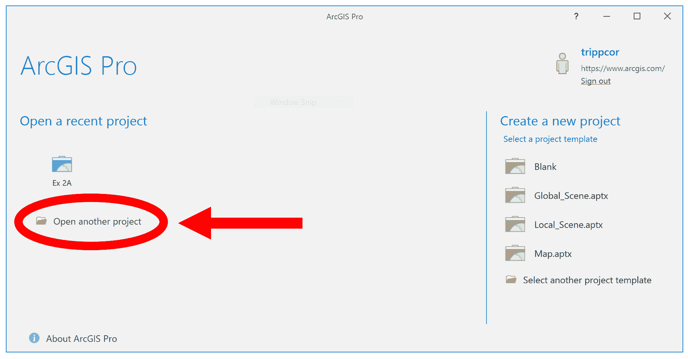

1.  在“打开”窗口中，从“计算机”选择，然后点击右侧区域中的“浏览”。

1.  通过点击打开项目窗口左侧的`C:\`，导航到`C:\Student\ArcGISProCookbook\Chapter5\Topologies`。然后双击 Student、ArcGISProCookbook、Chapter5 和 Topologies 文件夹。

1.  选择 Topologies.aprx 项目文件，然后点击确定。

项目将在目录视图中打开。该项目当前不包含任何地图。在您创建新的拓扑之前，您需要先验证几件事情。您需要确保您的地理数据库包含一个要素数据集，并且您稍后将验证的宗地要素类位于要素数据集中：

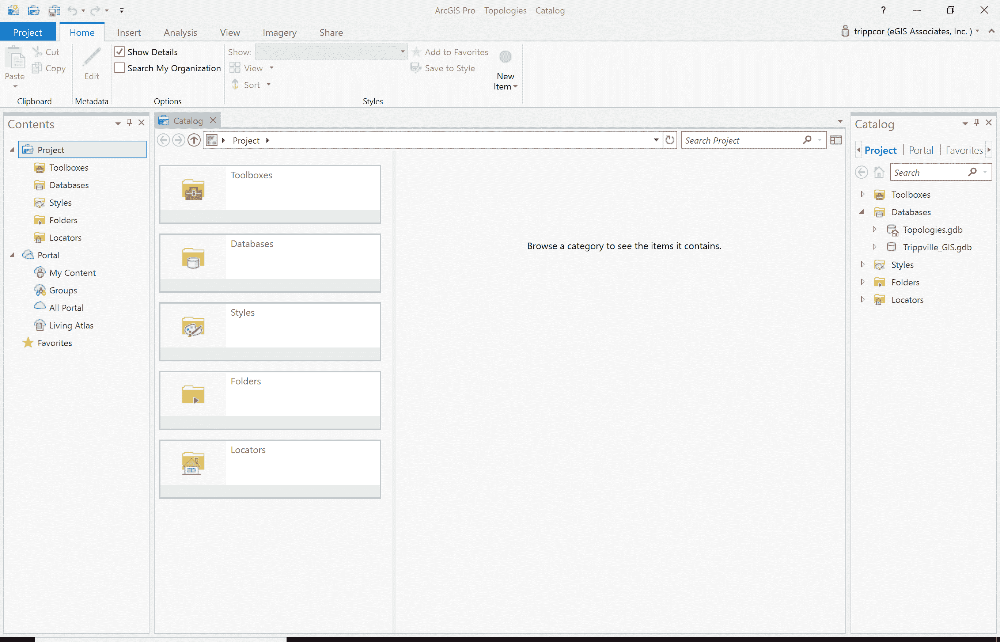

1.  在内容窗格中，点击数据库，以便在目录视图中显示与项目连接的两个地理数据库。

1.  双击 Trippville_GIS.gbd 地理数据库，以便查看其内容。然后回答以下问题：

**问题**：地理数据库是否包含任何要素数据库，如果是，它们是什么？

**答案**：

您应该已经看到这个地理数据库至少包含三个要素数据集，Base、Sewer 和 Water。这意味着您可以在该地理数据库中创建拓扑。现在您需要定位宗地要素类：

1.  双击基本要素数据集以显示其内容。

1.  滚动以验证它是否包含宗地要素类。

1.  滚动查看要素数据集，看它是否包含任何拓扑。然后回答以下问题：

**问题**：宗地要素类是否位于要素数据集中？

**答案**：

**问题**：要素数据集是否包含其他拓扑？

**答案**：

现在您已经验证了宗地要素类存储在基本要素数据集中，并且没有其他拓扑需要处理，您现在可以开始构建新的拓扑了。

1.  在功能区中点击分析选项卡。

1.  在分析选项卡中的地理处理组中点击工具按钮。这将打开地理处理面板。

1.  在地理处理面板的顶部，点击工具箱选项卡，位于搜索框下方，如图所示。这将打开与项目连接的所有系统工具箱：

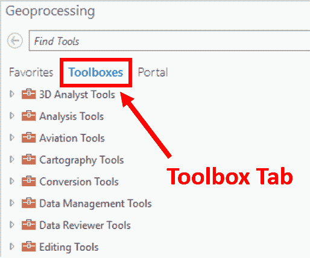

对于那些使用过较老的 ArcMap 或 ArcCatalog 应用程序的人来说，这和在 ArcToolbox 中打开是一样的。ArcGIS Pro 不像较老的 ArcGIS Desktop 那样包含单独的应用程序。在 ArcGIS Pro 中，所有功能都在一个单一的应用程序中，至少在 2.1 版本之前是这样的。关于创建一个类似于 ArcCatalog 的应用程序以执行通用数据管理功能的讨论已经展开。然而，尚未确定这是否会真的发生。

1.  通过点击工具箱名称左侧的小箭头展开数据管理工具箱。

1.  展开位于数据管理工具箱底部的拓扑工具集。

1.  点击拓扑工具集中的创建拓扑工具。这将打开工具在地理处理面板中。

1.  点击单元格末尾的浏览按钮，以选择输入要素数据集。

1.  点击打开输入要素数据集窗口左侧面板中的数据库。您可能需要展开项目文件夹才能看到它。

1.  双击 Trippville_GIS.gdb 地理数据库以显示其内容。

1.  选择基础要素数据集并点击确定。*不要双击要素数据集*。用单次点击选择它。

1.  对于输出拓扑，键入`Parcels`。这是您正在创建的拓扑的名称。留空聚类容差。ArcGIS Pro 将计算默认容差。

1.  确认您的创建拓扑工具看起来如下，然后点击运行：

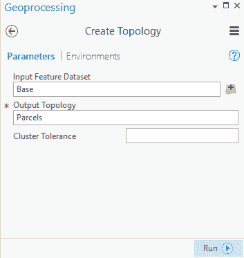

聚类容差是指 ArcGIS Pro 认为要素应被视为位于同一位置的距离。当您验证拓扑时，ArcGIS Pro 会自动将聚类容差距离内的要素对齐。这意味着在验证时，可能会移动数据。这既有好的一面也有不好的一面。它通常会通过连接错误未连接的要素来清理数据。它将消除要素之间的小缝隙和重叠。然而，如果您的聚类容差设置得太大，可能会将不应连接的要素对齐。因此，通常建议保持聚类容差较小。Esri 指出，最佳实践是使用 ArcGIS Pro 计算出的默认容差，因为它通常足够小，可以避免对您的数据产生任何不利影响。

1.  关闭地理处理面板。

在目录视图中，您现在应该看到您刚刚创建的宗地拓扑。下一步是添加将参与拓扑的要素类或类。在这个菜谱中，将只有一个要素类，即宗地。您现在将添加该要素类到拓扑中：

1.  在目录视图中，滚动到您刚刚创建的宗地拓扑。右键单击它，并从出现的菜单中选择属性，如图所示：

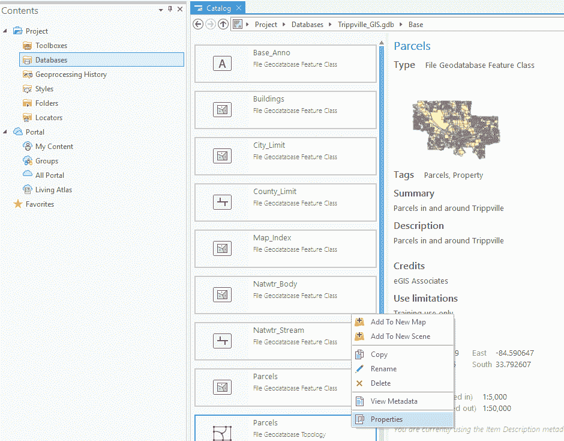

同一个要素数据集中可以存在多个拓扑。然而，每个要素类一次只能参与一个拓扑。

1.  拓扑属性窗口应该打开。点击窗口左侧面板中的“常规”选项。检查这些设置。您可以看到聚类容差设置得非常小。您还会看到拓扑尚未验证。

拓扑必须在包含要素类和规则之后才能进行验证。拓扑可以包含一个或多个要素类和规则。您包含哪些要素类和规则将取决于拓扑的目的和您的数据。

1.  在拓扑属性窗口左侧面板中找到“要素类”选项，然后点击“添加类”按钮。

1.  在“添加类”窗口中向下滚动显示的要素类列表，直到您看到“地块”要素类。点击要素类名称左侧的框以选择它。然后点击“确定”将其添加到拓扑中。

您可以选择多个要素类，并将它们一次性全部添加到拓扑中。您不需要逐个添加。

1.  确认您的拓扑属性窗口看起来如下截图所示，然后点击“确定”以应用您所做的更改：

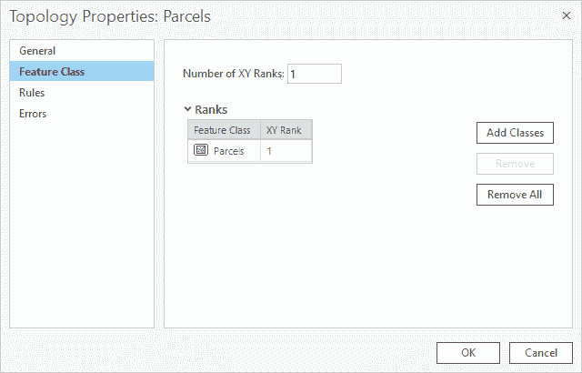

拓扑属性窗口

您已经在之前的菜谱中添加了一个参与拓扑的要素类。现在您需要添加规则，您将使用这些规则来验证您的数据。我们将保持这个菜谱简单。您将只添加一个规则来验证。

1.  再次右键单击“地块”拓扑，并像之前一样打开属性。

1.  在拓扑属性窗口的左侧面板中点击“规则”选项。

1.  在窗口右侧的面板中，点击“点击此处添加新规则”，如图所示以下截图：

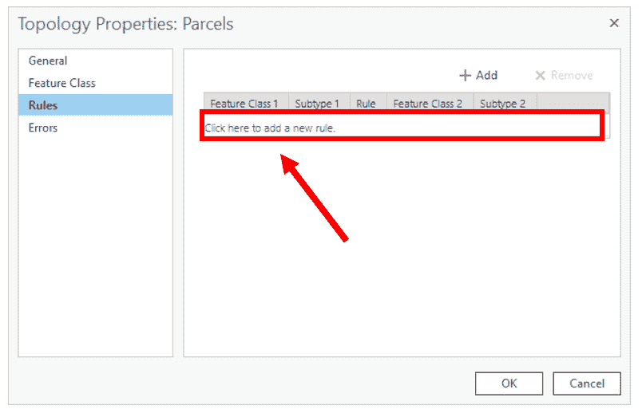

拓扑属性窗口 - 设置规则

1.  点击标题为“要素类 1”的列下方的单元格。从出现的列表中选择“地块”。您可能需要双击以显示列表。由于在此拓扑中您只有一个参与要素类，它应该是列表中唯一的。

1.  点击标题为“规则”的列下方的单元格。从出现的可能规则列表中选择“不得重叠（面积）”。

1.  确认您的拓扑属性：地块窗口看起来如下，然后点击“确定”。

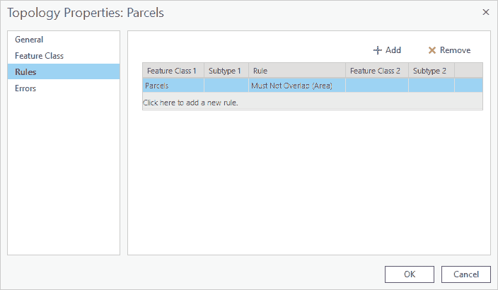

一个拓扑可以包含许多规则。您可以应用的规则将取决于参与拓扑的要素类类型。例如，您在此菜谱中添加的规则仅适用于单个要素类中的多边形。有关 ArcGIS Pro 中的拓扑和规则更多信息，请访问 [`pro.arcgis.com/en/pro-app/help/data/topologies/topology-in-arcgis.htm`](http://pro.arcgis.com/en/pro-app/help/data/topologies/topology-in-arcgis.htm)。

1.  保存您的项目。

1.  如果您不继续到下一个菜谱，您可以关闭 ArcGIS Pro。如果您继续，请保持应用程序打开。

# 使用地理数据库拓扑验证空间数据

您已经在之前的菜谱中创建了一个新的拓扑。这将允许您找到违反拓扑中包含的多边形不得重叠规则的“地块”要素类中的错误。要找到任何错误，您必须首先验证拓扑。

当你验证拓扑时，会发生几件事情。首先，如果它们在集群容差范围内，拓扑中参与的所有特征将被自动对齐。当你验证时，这是对所有特征自动执行的。其次，参与的特征类将根据你在拓扑中包含的规则进行检查。任何包含违反规则的特征的区域将在拓扑中标识出来，这样你就可以轻松地定位错误并修复它们。

在这个食谱中，你将验证你的拓扑以识别地块特征类中的任何错误。为此，你将创建一个新的地图并将拓扑以及地块层添加到其中。

# 准备工作

为了完成这个任务，你需要完成前面的食谱。你还需要 ArcGIS Pro 的标准或高级许可证。仅使用 ArcGIS Pro 的基本许可证无法执行此食谱。如果你只有基本许可证，你可以从 Esri 请求一个高级 ArcGIS Pro 许可证试用版，网址为[`www.esri.com/en/arcgis/products/arcgis-pro/trial`](http://www.esri.com/en/arcgis/products/arcgis-pro/trial)。

# 如何操作...

1.  要开始，如果你 ArcGIS Pro 还没有打开，你需要启动它。如果你在开始此食谱之前关闭了 ArcGIS Pro，你需要启动 ArcGIS Pro 并打开位于`C:\Student\ArcGISProCookbook\Chapter5\Topologies`的`Topologies.aprx`项目，使用你在过去食谱中学到的技能。

1.  在功能区中单击插入选项卡。

1.  在插入选项卡的项目组中，单击新建地图按钮。这将创建一个新空白 2D 地图到你的项目中。新地图应自动打开。

1.  在内容面板中，右键单击地图并从出现的菜单中选择属性，如图所示：

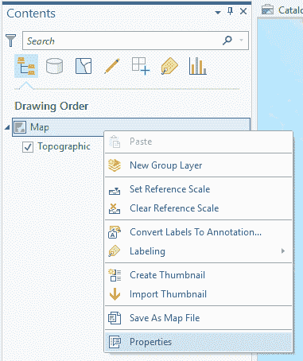

1.  确保在打开的地图属性窗口的左侧面板中选择了一般选项。

1.  在名称的单元格中键入`Parcel Topology`并单击确定。在之前说地图的地方，现在应该显示为 Parcel Topology。

1.  保存你的项目。

1.  在目录面板中，通过单击左侧的小箭头展开数据库文件夹。

1.  展开 Trippville_GIS.gdb 以查看其内容。

1.  展开基础特征数据集。

1.  在出现的菜单中，右键单击地块拓扑并选择将其添加到当前地图，如图所示。这将把拓扑和参与的特征类作为图层添加到地图中：

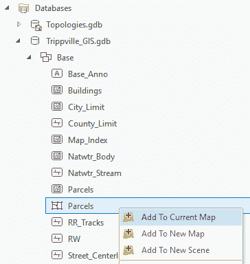

1.  在内容面板中，右键单击地块层。从出现的菜单中选择缩放到图层。你现在应该能够看到 Trippville 城市的地块。

1.  在内容面板中，检查在地块拓扑下列出的图层。然后回答以下问题：

**问题**：拓扑中包含哪些图层？

**答案**：

如您所见，拓扑不仅包括规则、参与的特征类和聚类容差，还包括定位的错误和脏区域：

1.  在地块拓扑中打开脏区域层。你应该在地图中看到围绕地块的大蓝色正方形出现，如下截图所示：

**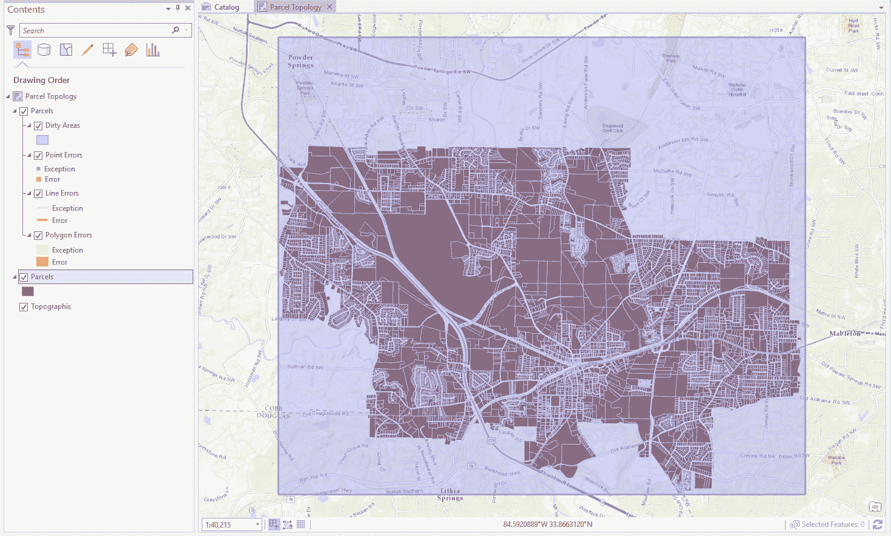**

地图上显示的拓扑脏区域

脏区域是您数据中参与拓扑但尚未验证的区域。在这种情况下，整个区域被视为脏区域，因为您尚未验证您的拓扑。仅仅因为存在脏区域，并不意味着您的数据有错误或不能使用。脏区域只是您数据中的一个区域，您尚未使用拓扑中的规则进行验证，因为您已编辑了数据或刚刚创建了拓扑。无论是否存在脏区域，或者您的数据是否确实有错误，您都可以始终使用您的数据。

1.  点击功能区中的编辑选项卡。

1.  在编辑选项卡的“管理编辑”组中点击“无拓扑”旁边的下拉箭头，并从列表中选择“地块（地理数据库）”，如图所示：

**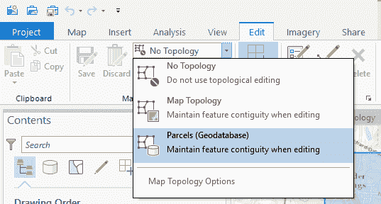**

1.  现在您已经选择了要验证的拓扑，需要访问验证工具。在编辑选项卡的要素组中点击修改按钮。这将打开修改要素面板。

1.  滚动到地形工具集。如有必要，展开它以便可以看到其内容。

1.  由于这是您自创建以来第一次验证拓扑，请选择验证全部工具。

此外，还有一些地理处理工具可以用来验证您的拓扑。这些工具位于数据管理工具箱和拓扑工具集中。验证拓扑工具与验证全部工具做的是同样的事情。

当你验证拓扑时，它会寻找任何与其他地块重叠的地块。找到的任何地块，它都会将这些位置添加到多边形错误层。当验证完成后，你应该在地块层的东侧看到一些红色多边形，这表明找到了错误。

1.  关闭修改要素面板并保存您的项目。

1.  缩放到以下图中指示的区域

**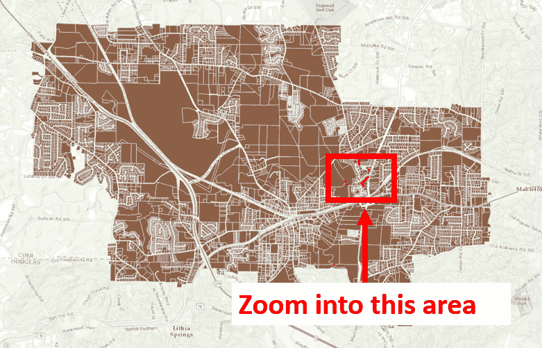**

缩放到矩形指示的区域

您的地图现在应该看起来类似于以下图示。请记住，您的颜色可能不同，因为 ArcGIS Pro 在添加新图层时为它们分配了随机颜色：

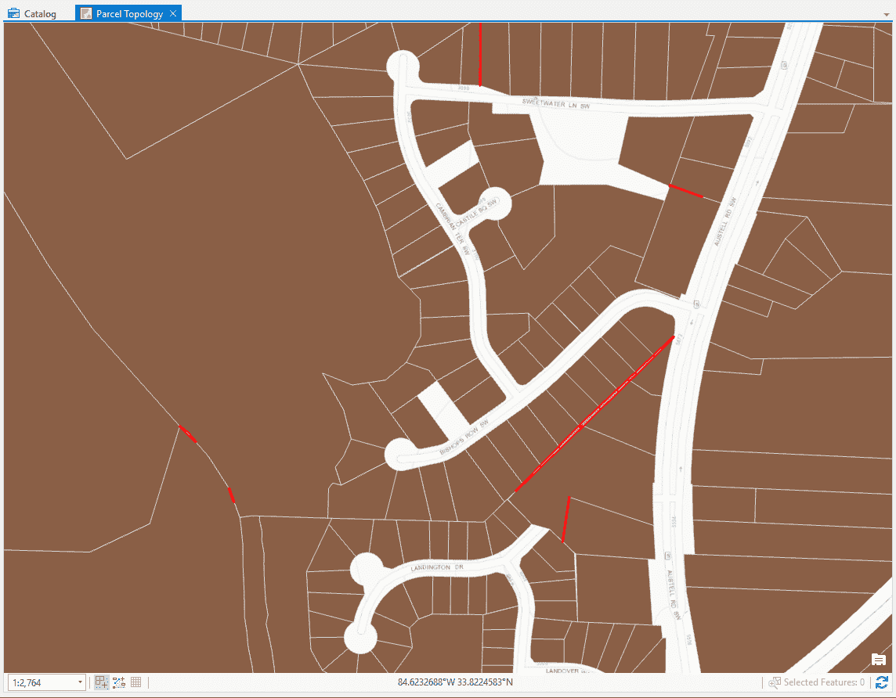

在此视图中，你可以看到一旦验证了地块数据后找到的错误。

1.  让我们创建一个书签，以便您可以轻松地稍后返回这个区域。点击功能区中的地图选项卡。

1.  在地图选项卡的导航组中点击书签按钮。选择新建书签。这将打开创建书签窗口。

1.  将新书签命名为“要修复的包裹重叠区域”并点击“确定”。

1.  保存您的项目。

1.  如果您不继续到下一个食谱，您可以关闭 ArcGIS Pro。否则请保持打开状态。

正如您在先前食谱中看到的，书签允许您快速放大到固定的空间位置。这些对于许多用途都非常方便。我使用书签的一些事情包括在特定位置和比例打印地图、在需要突出显示特定区域或特征的会议中，以及返回到特定位置进行项目或编辑。每个地图都有自己的书签集。项目可以包含的书签数量没有限制。

# 使用拓扑工具纠正空间要素

现在您已经知道数据中的错误位置，需要修复它们。ArcGIS Pro 包含用于修复拓扑错误的特定工具。这些工具通常在大多数情况下快速且易于使用。您也可以使用标准编辑工具来纠正错误。在两种情况下，您都应该在完成编辑后验证数据，以确保您没有在数据中引入任何新的错误。

在此食谱中，您将修复在验证拓扑时发现的几个错误。您将使用 ArcGIS Pro 中的错误检查器工具来纠正错误。

# 准备工作

此食谱将继续构建本章先前食谱中完成的工作。在开始此食谱之前，您需要完成本章中包含的所有先前食谱。与那些先前食谱一样，您还需要标准或高级许可级别才能完成此食谱。

# 如何操作...

1.  如果您在开始此食谱之前关闭了 ArcGIS Pro，您需要启动 ArcGIS Pro 并使用您在先前食谱中学到的技能打开位于 `C:\Student\ArcGISProCookbook\Chapter5\Topologies` 的 `Topologies.aprx` 项目。

1.  在内容面板中，点击“按编辑列出”按钮。

1.  确保已启用“包裹”图层以进行编辑。

1.  点击内容面板中的“按选择列出”。

1.  确保以下图层至少可选中：多边形错误和包裹。

1.  点击功能区中的“编辑”标签。

1.  点击“编辑”标签页上“管理编辑”组中的“错误检查器”按钮。这将打开界面底部的错误检查器面板。像所有面板一样，如果需要，此面板也可以取消停靠并移动到不同的位置。

1.  通过点击第一行最左侧的灰色方块选择面板中显示的第一个错误，如图所示：

****

通过点击左侧的灰色方块选择表中的记录

1.  点击错误检查器面板顶部的“缩放至”选项。这将使您放大到所选错误的所在位置。

1.  右键单击您点击以选择错误的相同方块，以显示新的上下文菜单。选择“合并”，如图下截图所示：

**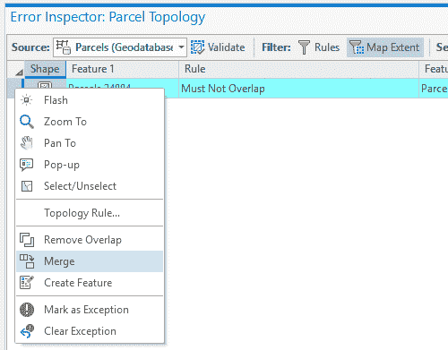**

拓扑错误检查工具

1.  选择地块 24884（最大的）并点击出现的合并窗口中的“合并”按钮。这将合并重叠区域与所选地块，并从未选择的较小地块中减去，从而消除重叠。

为了方便起见，我们选择将重叠区域与较大的地块多边形合并。通常情况下，你可能需要进行一些研究来确定该区域应属于哪个地块。

当你在表格中的行上右击时，会出现一个上下文菜单。此菜单包含许多选项。上下文菜单的顶部部分允许你导航到错误的位置。第二部分允许你查看错误违反的规则。第三部分包含用于纠正错误的工具。这些工具将根据违反的规则和您正在处理的数据类型而有所不同。

在这种情况下，你有三个工具可以选择来修复错误：移除重叠、合并和创建特征。你已经看到了合并工具的工作方式，但其他工具呢？移除重叠将移除两个或多个多边形重叠的区域，从而在多边形之间创建一个间隙。创建特征工具从重叠区域创建一个新的多边形，同时从重叠的多边形中减去相同的区域。

1.  由于你刚刚编辑了地块层但尚未验证，应出现一个新的脏区域。点击错误检查面板顶部的“验证”按钮。这将移除脏区域，并允许你查看是否由于你的编辑出现了任何新的错误。

当使用拓扑时，你应该定期验证数据以确保其保持清洁。验证的频率由你决定，但以下是一些一般性指南：初学者用户可能需要在每次编辑或更正后进行验证。更有经验的用户在保存编辑之前应进行验证，以确保他们不会将错误数据保存回地理数据库。记住，你总是可以撤销到上次保存的时间点。一旦保存，就无法回退。

1.  在“编辑”选项卡上的“管理编辑”组中点击“保存”按钮。

1.  在错误检查面板中，找到与地块 35845 相关的特征 1 的三个错误。

1.  逐个点击每个错误。观察错误检查面板右侧的地图和预览窗口。你应该能够看到这些错误都与同一两个地块相关。

你可以在错误检查面板的预览窗口中放大以更仔细地查看每个错误。只需使用鼠标滚轮在预览中放大或缩小即可。

1.  点击位于“特征 1 地块 35845”相关错误旁边的较小方块。按住*Shift*键，点击与地块 35845 相关的三个记录中的最后一个。现在所有三个错误都应被选中，如以下截图所示：

**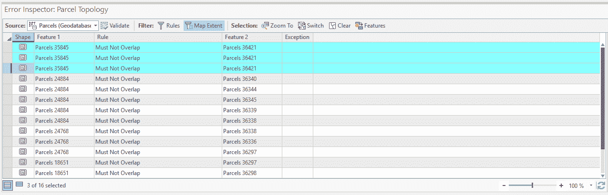**

在表格中选择地块 35845

1.  在错误检查器面板右侧的面板中，您可以看到预览的地方，点击“修复”选项卡。它应该显示您已选择了三个错误，并显示两个活动选项：创建要素和移除重叠。您的研究表明，这些重叠区域现在是已跟踪在另一个图层中的地役权。因此，您将选择“移除重叠”。

“合并”选项变灰了，因为该工具要求您为每个错误选择要将重叠区域合并到的要素。因此，它可以用来执行批量修正。

您刚刚通过单个编辑操作修复了三个错误。使用这些工具来纠正您的数据不仅使您的数据更干净，而且可以非常高效。

1.  使用错误检查器面板顶部的“验证”按钮验证您的数据。如果您刚刚修复的区域没有发现新的错误，请保存您的编辑。

1.  使用相同的过程，您已经修复了剩余的错误。请随意尝试每种情况下的不同纠正工具，看看它们是如何工作的。确保在每次纠正操作后进行验证，并在进行编辑时保存您的更改。

1.  如果您不继续到下一个菜谱，请保存您的项目并关闭 ArcGIS Pro。如果您继续，请保持 ArcGIS Pro 和项目打开。

正如您现在所看到的，使用地理数据库拓扑可以大大提高您 GIS 数据的整体精度，并帮助您定位可能存在的错误。最终结果是数据质量提高和更好的分析结果。当您想使用地理数据库拓扑时，要记住的是您必须拥有标准或高级 ArcGIS Pro 许可证。

# 使用地图拓扑编辑数据

您现在已经看到了地理数据库拓扑在帮助您查找和纠正数据中的错误方面是多么强大。然而，要使用地理数据库拓扑，您的数据必须存储在地理数据库中，并且您必须拥有标准或高级许可证。那么，如果您想维护存储在形状文件中的数据，以避免引入拓扑错误，或者如果您只有基本许可证，您该怎么办？这就是应该使用地图拓扑的地方。

如介绍中所述，地图拓扑是临时的，不允许您使用规则验证数据。然而，它们允许您使用拓扑工具编辑数据，以保持现有的空间关系。这可以防止您在数据中引入任何新的错误。地图拓扑还有优势，允许同时在这些拓扑编辑工具上使用基于 shapefile 和地理数据库要素类的图层。能够通过单一编辑来编辑多个图层，无论它是 shapefile 还是地理数据库，都可以大大提高您的效率。地图拓扑也不要求所有地理数据库要素类都在地理数据库中的同一要素数据集中。因此，虽然地图拓扑不能像地理数据库拓扑那样验证您的数据，但它们确实提供了更大的数据灵活性。

在此配方中，您将使用地图拓扑通过单一编辑在多个图层中编辑数据。一条道路已经拓宽以包括转弯车道。您需要调整包括城市界限、地块、道路权和投票区在内的几个图层，以反映新拓宽的道路。其中一些图层存储在您一直在使用的 Trippville GIS 地理数据库中。然而，投票区存储在 shapefile 中，因为需要该图层的选民登记系统无法读取地理数据库。

# 准备工作

此配方可以使用 ArcGIS Pro 的所有许可级别完成。虽然不需要您完成任何之前的配方，但建议您在开始此配方之前完成第一章中找到的配方，*ArcGIS Pro 功能和术语*，以确保您具备完成此配方所需的基础技能。您还需要确保已安装本书的示例数据。

# 如何操作...

1.  如果您在开始此配方之前关闭了 ArcGIS Pro，您需要启动 ArcGIS Pro。然后使用您在之前的配方中学到的技能，打开位于`C:\Student\ArcGISProCookbook\Chapter5\Topologies`的`Topologies.aprx`项目。

1.  如果它们仍然打开，请关闭除内容面板和目录面板之外的所有面板。

1.  右键单击包含脏区域、点错误、线错误和多边形错误的“地块拓扑组”图层，并选择“删除”，如图所示：

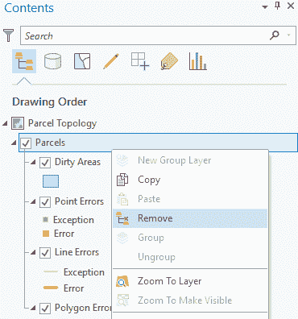

1.  保存您的项目。

1.  在功能区中的图层组中，点击地图标签页上的“添加数据”按钮。

1.  在“添加数据”窗口的左侧面板中，点击位于“项目”下的“数据库”文件夹。

1.  双击“Trippville_GIS.gdb”地理数据库。

1.  双击“基础要素数据集”。

1.  选择“City_Limit”要素类。然后，按住*Ctrl*键，选择“RW”要素类。然后点击“确定”以将这些新图层添加到您的地图中。

1.  在内容面板中，确保你正在查看“按绘图顺序”列表。这是面板左上角第一个按钮。

1.  点击内容面板中位于“City_Limit”图层名称下方的小图标，以打开符号面板。

1.  确保在面板顶部选择了“图库”。然后向下滚动并选择位于“ArcGIS 2D 样式”中的名为“Black Outline (2 Pts)”的符号。

在符号面板的顶部，你应该看到一个搜索功能。这允许你使用关键词或标签查找你想要的符号。你可以输入`Black outline 2 pts`进行搜索以定位符号或相关符号。

1.  将“City_Limit”图层拖动到图层列表的顶部。

1.  如有需要，更改“地块”和“RW”图层的符号，以便你可以轻松地看到它们。

1.  保存你的项目。

1.  在目录面板中，展开“文件夹”文件夹，以便你可以看到其内容。

1.  展开拓扑文件夹，以便你可以看到其内容。你应该在这个文件夹中看到几个文件，包括 Topologies.gdb、Topologies.tbx、Voting_Districts.lyrs 和 Voting_Districts.shp，如图所示：

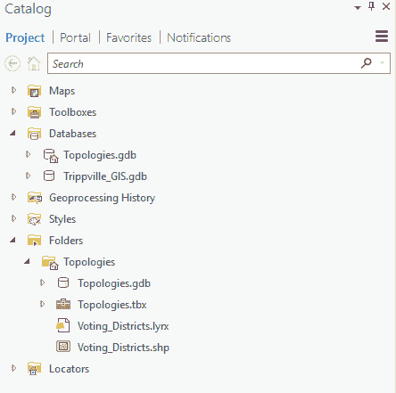

1.  右键点击“Voting_Districts.lyrx”文件并选择“添加到当前地图”。

你已经使用图层文件将一个图层添加到地图中。图层文件存储图层的配置设置，以便在添加时自动根据这些设置显示。图层文件可以包括符号、标签、定义查询、比例-可见范围等设置。这允许你在组织内的多个地图和项目之间标准化图层显示。

你的地图现在应该看起来像下面的截图。你的符号可能与你添加图层时 ArcGIS Pro 分配的颜色以及你对符号所做的任何调整不同。记住，ArcGIS Pro 为新添加的图层分配随机颜色：

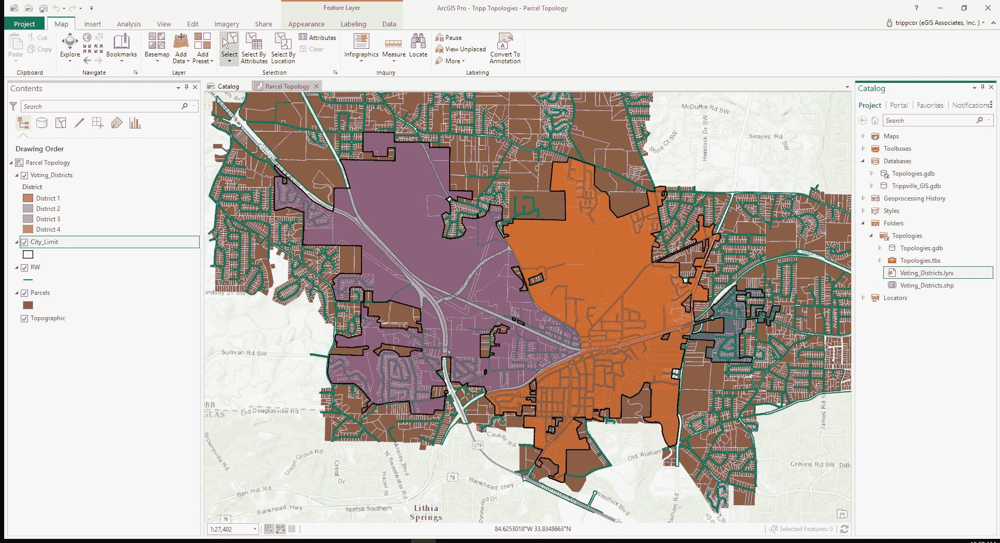

添加了投票区的地图

1.  点击“地图”选项卡并激活“探索”工具。

1.  按住你的*Shift*键，以便你可以放大到特定区域。将视图放大到城市北部的指定区域：

**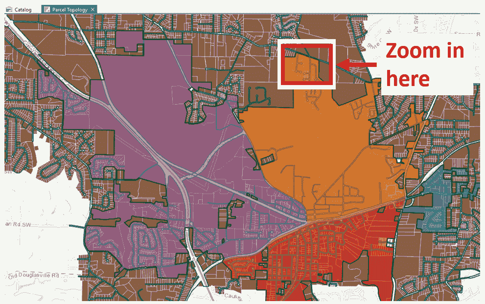**

1.  现在，保存你的项目以确保你不会丢失到目前为止所做的任何工作。

1.  在内容面板中点击“按选择列表”按钮。确保所有图层都是可选择的。

1.  在内容面板中点击“按捕捉列表”按钮，并确保所有图层都是可捕捉的。

1.  在内容面板中点击“按编辑列表”按钮，并确保所有图层都是可编辑的。

1.  点击功能区上的“编辑”选项卡。

1.  点击功能区编辑选项卡上的“管理编辑”组中的拓扑下拉列表，并选择“地图拓扑”，如图所示：

**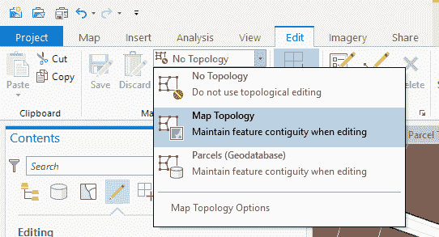**

您现在可以开始编辑图层，以反映已添加到 Sweetwater Valley Road 入口的新转弯车道。这是一个新的右转车道，允许汽车在转弯前安全减速，并让沿 Clay Road 继续行驶的汽车通过转弯车辆。

1.  点击位于编辑选项卡选择组中的选择工具。

1.  在地图上，点击并绘制一个选择矩形，如下面的截图所示：

**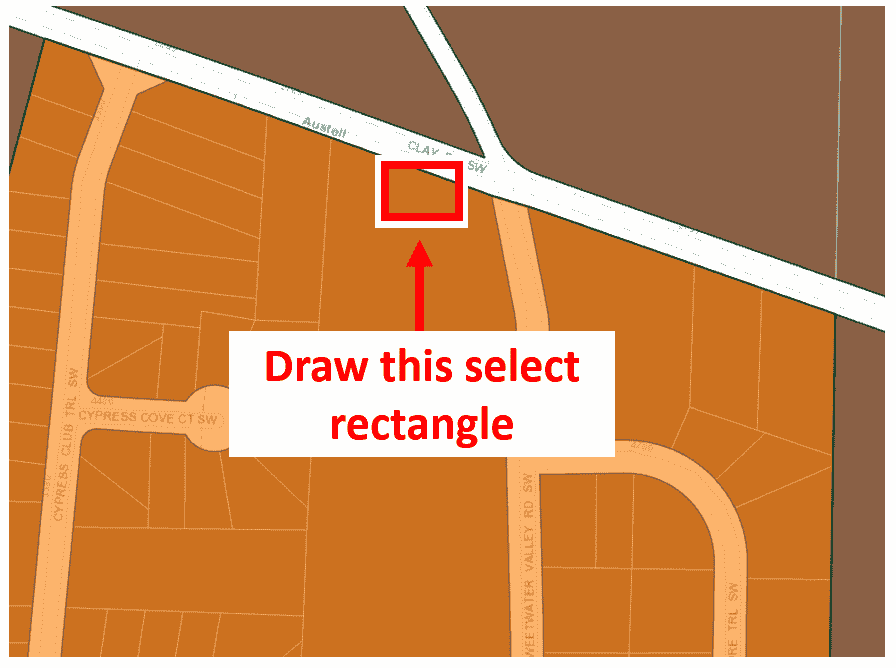**

1.  点击内容面板中的按选择列出按钮。验证您在每个图层中选中了一个要素，如下面的截图所示：

**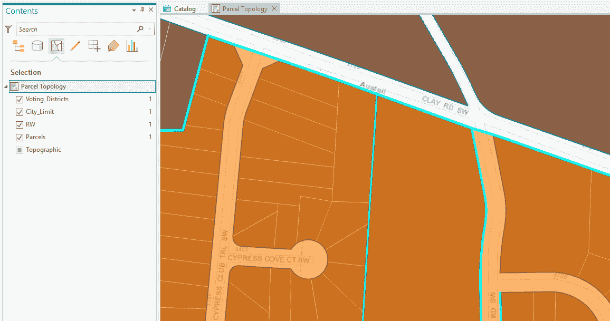**

1.  点击位于功能区编辑选项卡工具组中的重塑工具，以打开修改要素面板。

1.  点击位于 Sweetwater Valley Road 西部的地块西北角，如图所示：

**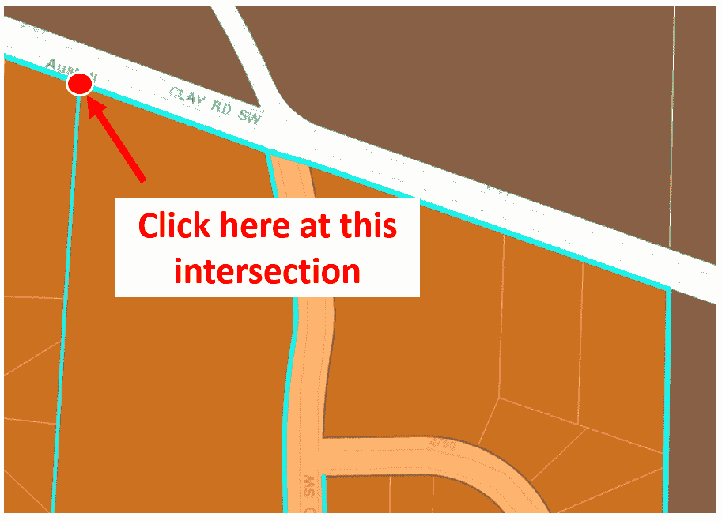**

1.  然后将鼠标指针沿地块西边界向南方移动，并右键单击。从出现的上下文菜单中选择方向/距离，如下面的截图所示：

**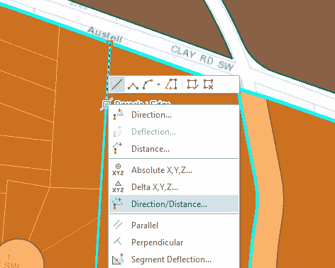**

1.  将方向设置为 `S3-42-19W QB` 并将距离设置为 `50.00 FtUS`。输入距离后，您可能需要按 *Enter* 键来应用您输入的值。

1.  将鼠标指针移至地块的北边界，右键单击。从出现的上下文菜单中选择平行，如下面的截图所示：

**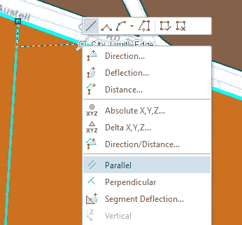**

1.  您的鼠标指针现在应锁定在平行于地块边界的方向。沿着该平行路径移动鼠标指针，直到它捕捉到 Sweetwater Valley Road 东部道路交叉口。在该位置点击，如下面的图所示：

**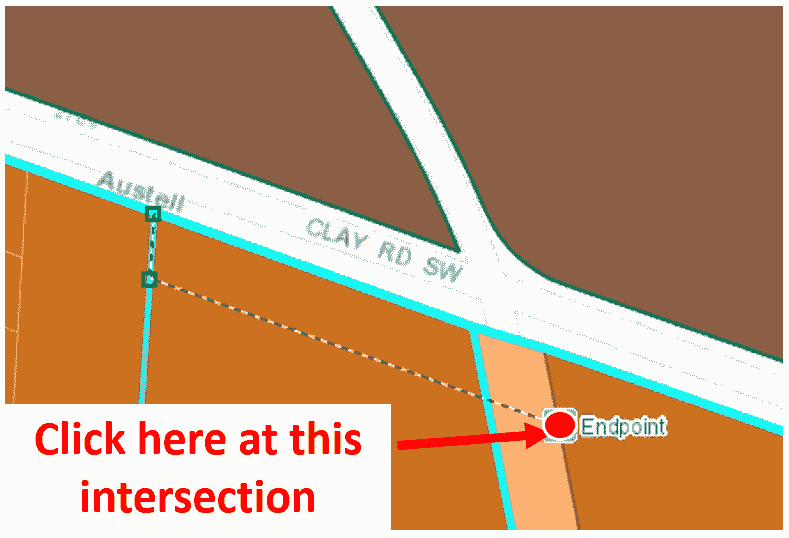**

1.  将鼠标指针移动到 Sweetwater Valley Road 东部道路交叉口和 Clay Rd 南部道路交叉口的交点，如下一截图所示。到达指定位置时双击以完成草图：

**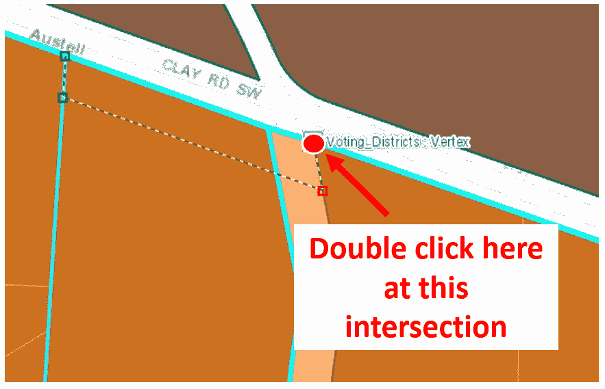**

您的地图现在应显示新安装的新转弯车道的新区域，如下面的图所示。这个新转弯车道要求您编辑多个图层。这包括您地图上的所有图层。您可以对每个图层单独进行编辑。然而，通过使用地图拓扑，您能够通过单个编辑来编辑四个不同图层中的要素。这包括存储在不同数据格式中的图层。

要了解更多关于使用拓扑的信息，请访问 [`pro.arcgis.com/en/pro-app/help/editing/introduction-to-editing-topology.htm`](http://pro.arcgis.com/en/pro-app/help/editing/introduction-to-editing-topology.htm)。

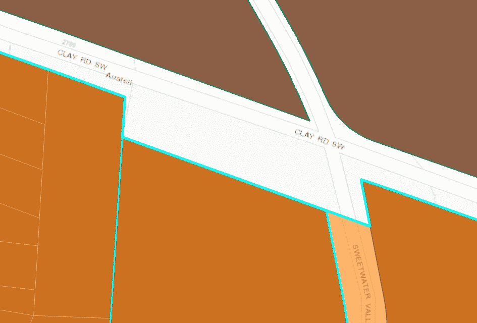

1.  一旦你验证了你的编辑已成功完成，通过在编辑选项卡上的管理编辑组中点击“保存”按钮来保存你的编辑。

记住，保存数据编辑与保存项目不同。默认情况下，这是两个独立的操作。保存项目将保存你对项目内容所做的更改，例如添加新地图、更改地图中图层的属性、创建新布局以及连接到新数据库。保存项目是通过快速访问工具栏或功能区中的项目选项卡上的按钮或命令完成的。编辑选项卡上管理编辑组中的“保存”按钮保存了在地图或场景中引用的空间或属性数据的更改。它不会保存对项目的编辑。在 ArcGIS Pro 的选项中，如果你希望的话，可以在保存项目时启用保存编辑。对于不习惯在单个应用程序中拥有不同保存方式的新用户来说，这样做不是一个坏主意。

1.  关闭修改要素面板以释放屏幕区域并减少 ArcGIS Pro 使用的计算机资源。

1.  保存你的项目以确保所有项目更改都已保存。

1.  关闭 ArcGIS Pro。

你现在已经看到了 Map 拓扑的强大功能。它允许你同时编辑多个要素，无论它们位于哪个图层或多个图层中，只要它们是重合的。这可以大大提高你的编辑效率。与 Geodatabase 拓扑不同，你可以在 ArcGIS Pro 的任何许可级别中使用 Map 拓扑。Map 拓扑的主要限制是无法像 Geodatabase 拓扑那样分配空间规则并使用这些规则验证你的数据。
