# 第八章：邻近分析

本章将涵盖以下食谱：

+   在特定距离内选择要素

+   创建缓冲区

+   使用邻近工具确定最近要素

+   使用生成邻近表工具计算要素之间的距离

# 简介

如果您一直在阅读本书的前几章，您已经学习了如何使用 ArcGIS Pro 访问、可视化、转换和维护数据。虽然这些功能本身会使 ArcGIS Pro 成为一个非常强大的工具，但这绝不是您可以使用 ArcGIS Pro 完成的事情的极限。

ArcGIS Pro 能够执行一些令人惊叹的分析。这些功能通常分为四个类别：叠加、邻近、网络和统计。这些也可以进一步专业化。正如在第一章“ArcGIS Pro 功能和术语”中指出的，有两个因素决定了您可以使用哪些工具，即许可证级别和扩展。许可证级别将决定您可以使用哪些核心工具。扩展将决定您可以访问哪些专业工具。因此，了解您正在使用哪种许可证级别以及可以访问哪些扩展始终很重要。请参阅第一章“ArcGIS Pro 功能和术语”，以获取有关许可证级别的更多信息。

现在，让我们专注于 ArcGIS Pro 中的邻近分析。邻近分析简单地说就是确定要素彼此之间的距离或接近程度。这可能只是选择位于其他要素指定距离内的要素，或者可能非常复杂，如计算一个或多个图层中要素之间的距离。邻近分析的例子包括围绕所选要素创建缓冲区，以显示这些要素周围一定距离内的区域。这可能包括计算一个图层中的要素与另一个图层中的要素之间的距离，并将这些值写入数据表。也可能包括确定一个图层中的哪个要素与另一个图层中的要素最近。

在本章中，您将获得一些实际操作各种类型邻近分析的第一手经验。这包括创建缓冲区、根据距离选择要素、确定最近要素以及计算要素之间的距离。其中一些食谱可能需要您拥有 ArcGIS Pro 的高级许可证。

# 在特定距离内选择要素

对于这个食谱，道路管理员已经告诉您他将在 Sloan 街上启动一个新项目，并需要通知那些住在街道附近的人。他要求您生成一个位于 Sloan 街道 500 英尺范围内的所有地块的列表，以便他可以通知他们即将进行的工作。

在本菜谱中，您将使用选择位置工具选择 Sloan Street 500 英尺范围内的所有地块，然后将选定的地块导出到 Excel 电子表格中，以供管理员使用。在使用选择位置工具之前，您需要选择构成 Sloan Street 的所有道路中心线段。您将使用选择属性工具来完成此操作。

# 准备工作

本菜谱确实需要将示例数据安装到计算机上。建议您在开始本菜谱之前完成第一章，*ArcGIS Pro 功能与术语*的菜谱，或者在工作之前有一些使用 ArcGIS Pro 的经验，以确保您具备成功完成本菜谱所需的基础技能和知识。您可以使用任何 ArcGIS Pro 许可级别完成此菜谱。

# 如何操作...

1.  第一步是启动 ArcGIS Pro。您可以通过多种方式完成此操作，具体取决于您的计算机设置。您可以通过开始菜单和所有程序进入 ArcGIS，然后进入 ArcGIS Pro。

1.  在 ArcGIS Pro 启动窗口中，单击打开另一个项目：

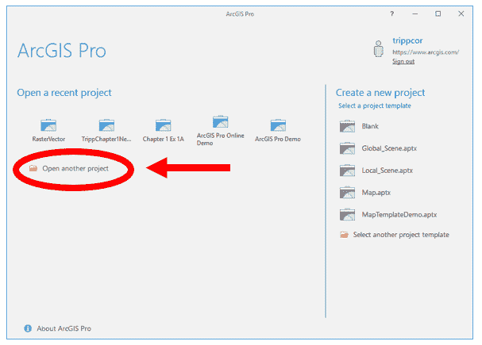

1.  从打开窗口中选择计算机，然后在右侧的区域单击浏览。

1.  通过在打开项目窗口左侧的区域单击`C:\`，导航到`C:\Student\ArcGISProCookbook\Chapter8\Proximity Analysis`。然后双击 Student、ArcGISProCookbook、Chapter8 和 Proximity Analysis 文件夹。

1.  选择 Proximity Analysis.aprx 项目文件，然后单击确定。

项目将以选择距离地图打开。这是一个包含您在本菜谱中需要使用的层的现有地图。

1.  在功能区地图标签页的导航组中单击书签按钮。

1.  选择 Sloan St 书签，如图所示。这将使您缩放到本菜谱的工作区域：

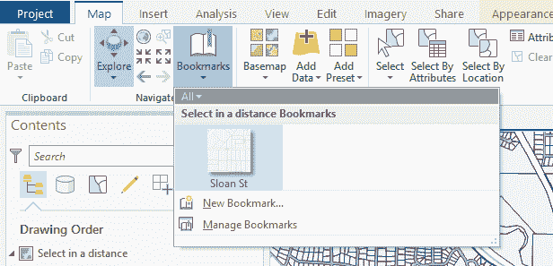

1.  现在，您需要选择构成 Sloan St 的所有段。您将使用选择属性工具来完成此操作。单击位于地图工具栏选择组中的选择属性工具。这将打开地理处理面板中的选择图层属性工具。

1.  单击图层名称或表视图的下拉菜单。从出现的列表中选择街道中心线。

1.  确保选择类型设置为新选择。

1.  单击添加子句按钮开始构建查询。

1.  使用下拉箭头将字段设置为 ST_NAME。

1.  确保操作设置为等于。

1.  在值单元格中输入`SLOAN ST`。您开始输入时，它应该开始自动填充。

1.  确认您的查询看起来如下，然后单击添加按钮：

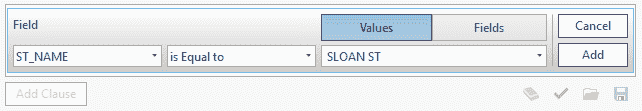

1.  确认您的选择图层属性工具看起来如下，然后单击运行：

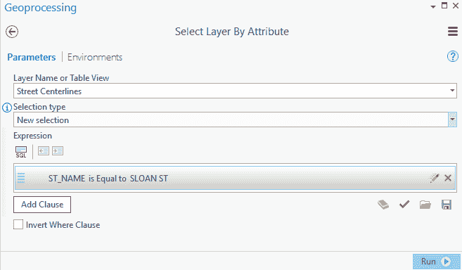

1.  如果您查看 ArcGIS Pro 界面的右下角，您应该看到有三个要素被选中。一旦您确认已选中三个要素，请关闭地理处理面板。

由于 Sloan 街如此短，您可以直接使用选择工具从地图中选择它们。

您刚刚选择了构成 Sloan 街的 GIS 数据中的道路段。现在，您需要选择距离 500 英尺内的地块，以便您可以创建通知列表提供给主管。

1.  选择 Sloan 街段后，在功能区地图标签页的“选择”组中点击“按位置选择”工具。这将打开地理处理面板中的“按位置选择层”工具。

1.  通过点击下拉箭头并从列表中选择层，将输入特征层设置为地块。

1.  使用下拉箭头选择列表中的选项，将关系设置为“在一定距离内”。

1.  从下拉箭头显示的列表中选择“从街道中心线选择要素”。

1.  在搜索距离单元格中输入`500`，并确保单位设置为英尺。

1.  确认选择类型设置为“新选择”。

1.  检查您的“按位置选择层”工具是否如下截图所示，然后点击运行：

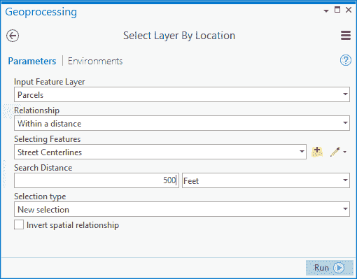

由于“按位置选择层”工具是一个地理处理工具，它自动仅使用选择要素层中的选择要素。因此，地理处理工具自动使用任何输入层或表中的选择要素运行。所以，与 ArcMap 中的“按位置选择”工具不同，您不需要告诉 ArcGIS Pro 使用选择要素。

“按位置选择层”工具不仅限于仅选择指定距离内的要素。它可以用于根据多种空间关系选择要素，包括相交、包含、共享边界等。这使得它在需要根据空间关系选择要素时成为一个非常强大的工具。

工具完成后，您应该有 107 个总选择要素。这包括三个选择的道路中心线段和 104 个地块。现在，剩下的只是将选定的地块导出到 Excel 电子表格中。

1.  在地理处理面板中，点击面板左上角的位置按钮，如图所示。这将带您返回到一般的地理处理面板：

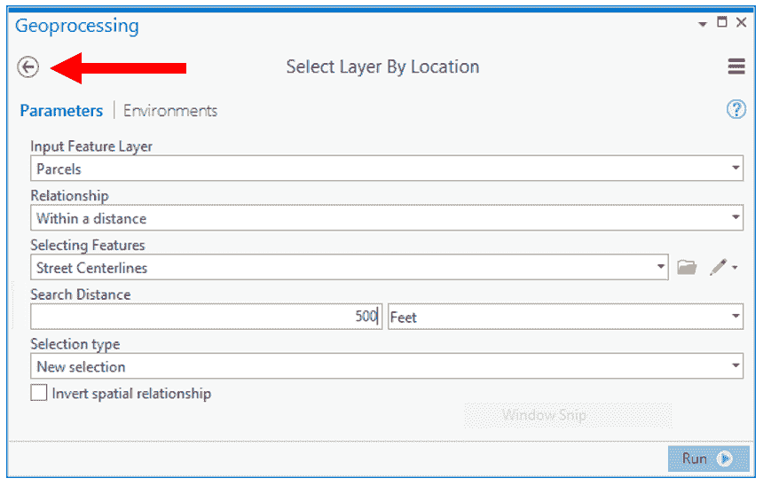

1.  点击地理处理面板顶部的“工具箱”标签。

1.  展开转换工具箱和 Excel 工具集。

1.  点击“表到 Excel”工具。这将打开工具在地理处理面板中。

1.  使用下拉箭头从列表中选择层，将输入表设置为地块。

1.  点击输出 Excel 文件的浏览按钮。

1.  在出现的“另存为”窗口中，点击左侧面板上的“此电脑”或“我的电脑”。

1.  在右侧面板中，双击位于“设备和驱动器”下的 C:\驱动器。它应标记为 OS 或本地驱动器。

1.  在右侧面板中向下滚动，然后双击“学生”文件夹。

1.  继续执行相同的操作，直到您导航到`C:\Student\ArcGISProCookbook\MyProjects`。

1.  在文件名单元格中键入`Parcels_near_SloanDr`，然后点击保存。

1.  确认您的“表格转 Excel”工具看起来如下，然后点击运行：

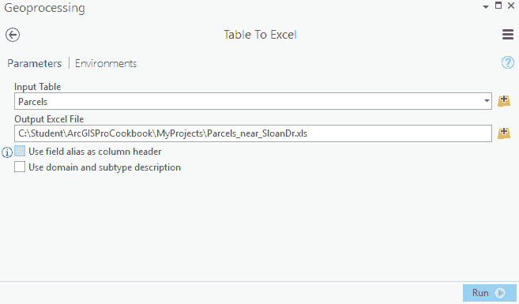

当工具完成时，它将把与所选地块相关联的所有属性信息导出到 Microsoft Excel 电子表格中。

1.  在功能区地图选项卡上的“选择”组中，点击“清除”按钮取消选择所有选定的要素。

1.  保存您的项目。

1.  如果您不继续到下一个菜谱，您可以关闭 ArcGIS Pro。如果您继续，请保持 ArcGIS Pro 打开。

因此，在这个菜谱中，您需要创建一个列表，道路管理员可以使用它来通知所有住在或工作在斯隆街附近的人即将到来的项目。为此，您首先必须在 GIS 数据库中选择组成斯隆街的所有路段。您使用“属性查询”工具执行了属性查询。然后，您使用这个选择在“按位置选择”工具中选择所有距离所选斯隆街路段 500 英尺内的地块。最后，您将靠近斯隆街的地块导出到电子表格中。道路管理员将能够使用它来通知所有即将到来的道路项目附近的人。

这个菜谱不仅向您展示了如何选择位于其他要素指定距离内的要素，还说明了分析通常是一个多步骤的过程。它需要您使用一系列工具和技能来得出答案。

# 创建缓冲区

缓冲区让您可以看到哪些要素位于其他要素的特定距离内。它围绕缓冲要素生成多边形，提供了指定距离的视觉参考。然后，可以使用这些多边形进行额外的分析或选择位于缓冲区内部或与缓冲区相交的要素。

在这个菜谱中，您将在特里普维尔市的溪流和溪流周围创建缓冲区，这代表需要特殊许可证才能进行工作的保护区。这是由于市政委员会最近通过的一项条例，旨在保护城市及其周边的水质。

# 准备工作

此配方确实需要将示例数据安装在计算机上。建议您在开始此配方之前完成*第一章*、*ArcGIS Pro 功能与术语*以及本章中的其他配方。这将确保您具备成功完成此配方中步骤所需的技能。您可以使用任何 ArcGIS Pro 许可级别完成此配方。

# 如何做到这一点...

1.  如果您在开始此配方之前关闭了 ArcGIS Pro，您需要启动 ArcGIS Pro 并打开位于`C:\Student\ArcGISProCookbook\Chapter8\Proximity Analysis`的`Proximity Analysis.aprx`项目，使用您在之前的配方中学到的技能。

1.  在目录窗格中，展开地图文件夹。然后右键单击缓冲地图并从出现的菜单中选择“打开”。这将打开一个包含您在配方剩余部分要执行的工作所需的图层的地图。

1.  在功能区中单击“分析”选项卡。

1.  在工具组中单击“缓冲”工具。这将打开地理处理窗格中的缓冲工具。

1.  通过单击下拉箭头并从列表中选择图层，将输入要素设置为溪流和河流。

1.  接受默认的输出要素类。

虽然缓冲工具的输入可以是任何要素类型（点、线或多边形），但输出始终是多边形。

1.  在距离值中输入`60`并从单位下拉列表中选择英尺。

1.  您还将接受侧类型和端类型的默认设置。侧类型应该是全侧，端类型应该是圆形。

只有在您拥有高级许可证的情况下，您才能访问和更改这些选项。

1.  由于保护区对所有溪流和河流都是一致的，您将通过单击“溶解类型”下拉箭头将缓冲工具设置为将所有输出要素溶解为单个要素类。这将创建一个占用空间更少且更容易管理的单个缓冲区。

1.  确认您的缓冲工具看起来如下，然后单击“运行”按钮：

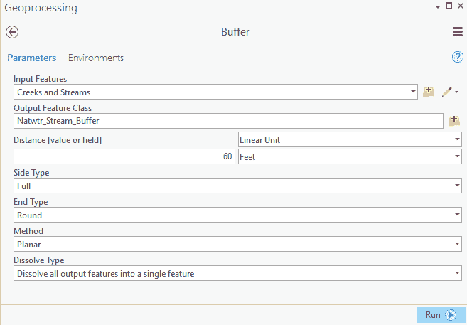

1.  当缓冲工具完成后，您的内容窗格中会出现一个新图层。这就是您刚刚创建的缓冲要素类。关闭地理处理窗格以释放屏幕空间。

1.  保存您的项目。

您刚刚在项目地理数据库中创建了一个新的要素类，它代表了溪流和河流周围的保护区。您可以轻松地看到受这个新保护区影响的区域。您还可以使用这个图层进行各种分析。例如，您可以使用“选择位置”工具选择所有与保护区缓冲区相交的地块。这将使您确切知道哪些地块在进行靠近溪流或河流的任何工作时需要许可证。

挑战：

使用你在本菜谱和选择距离内要素菜谱中学到的技能，选择所有与新创建的保护区域缓冲区相交的地块，然后将选定的地块导出到 Excel 电子表格中。

# 更多...

你刚刚学习了如何使用缓冲区工具创建围绕要素的单个缓冲区。但是，如果你需要围绕一组要素或单个图层创建多个不同距离的缓冲区怎么办？你可以多次使用缓冲区工具。然而，有一个更简单的方法。

三普维尔市的消防局长正在做一个防火保护研究，并需要你的帮助来确定城市内消防栓提供的保护水平。他需要知道每个地块距离每个消防栓 100、200 和 300 英尺的面积。你将使用多环缓冲区工具来完成这项工作：

1.  首先，我们将清理你一直在使用的缓冲区地图。在 Natwtr_Stream_Buffer 图层上右键单击，并从出现的菜单中选择删除。

1.  对 Creeks、Streams、Lakes 和 Rivers 图层重复此过程。

1.  在目录面板中，展开数据库文件夹，以便可以看到其内容。

1.  展开 Trippville_GIS.gdb 地理数据库。

1.  展开水要素数据集，在 fire_hyd 要素类上右键单击。从出现的菜单中选择添加到当前地图。

1.  保存你的项目。

1.  在功能区中点击分析标签。

1.  点击地理处理组中的工具按钮，打开地理处理面板。

1.  点击地理处理面板顶部附近的工具箱标签。

1.  展开分析工具箱和邻近工具集。

1.  点击多环缓冲区工具，在地理处理面板中打开它。注意，它有一个与其他所有工具不同的图标。这是因为这个工具实际上是一个 Python 脚本。

Python 是 ArcGIS 的主要脚本语言。它允许你创建自定义工具来自动化任务。然后可以安排它们在指定的时间自动运行，或手动运行。要了解更多关于为 ArcGIS 创建 Python 脚本的信息，你可能想查看 Eric Pimpler 的《使用 Python 编程 ArcGIS》一书，详情请见[`www.packtpub.com/application-development/programming-arcgis-python-cookbook-second-edition`](https://www.packtpub.com/application-development/programming-arcgis-python-cookbook-second-edition)。

1.  通过单击下拉箭头并从列表中选择它，将输入要素设置为刚刚添加的 fire_hyd 图层。

1.  接受输出要素类的默认值。

1.  在距离下的单元格中输入`100`并按*Enter*键。应该会出现另一个单元格。

1.  在新出现的单元格中输入`200`并按*Enter*键。再次，应该会出现另一个单元格。

1.  在新出现的单元格中输入`300`并按*Enter*键。

1.  使用下拉箭头将缓冲区单位设置为英尺。

1.  接受提供的默认字段名称。

1.  根据您的 ArcGIS Pro 版本，将溶解选项设置为非重叠（环形）或全部。这将使消防队长知道他在每个距离上的覆盖范围。

溶解选项确定您是否创建环形/甜甜圈或圆盘。非重叠或全部选项将生成类似甜甜圈的环形。从其他指定距离的重叠区域将被裁剪。因此，在这个例子中，您将得到一个延伸到 100 英尺的单个环形。下一个环形将覆盖从 100 到 200 英尺。最后一个环形将覆盖从 200 到 300 英尺。

重叠（圆盘）或无选项创建重叠的实心圆盘。以这个配方为例，您将有一个延伸到 100 英尺的圆盘。您将有一个延伸到 200 英尺并重叠第一个圆盘的第二个圆盘。最后一个圆盘将延伸到 300 英尺并重叠其他两个圆盘。

您不需要将缓冲距离设置为相等间隔。它们可以是您想要的任何距离。要了解更多关于多个环形缓冲区工具的信息，请访问 [`pro.arcgis.com/en/pro-app/tool-reference/analysis/multiple-ring-buffer.htm`](http://pro.arcgis.com/en/pro-app/tool-reference/analysis/multiple-ring-buffer.htm)。

1.  验证您的多个环形缓冲区工具看起来如下，然后点击运行：

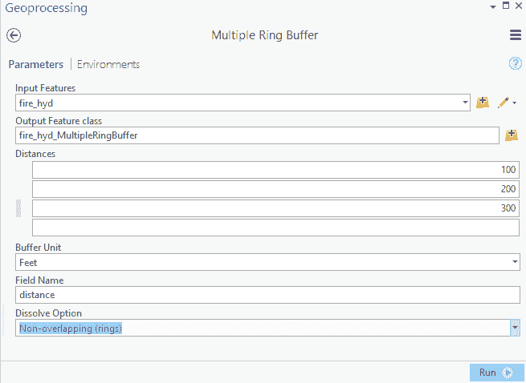

新图层应出现在内容面板中，显示多个环形缓冲区工具的结果。现在让我们验证结果。

1.  在内容面板中选择 fire_hyd_MultipleRingBuffer 图层。

1.  点击功能区中的要素图层上下文菜单中的外观选项卡。

1.  点击绘图组中的导入按钮。

1.  验证输入图层设置为 fire_hyd_MultipleRingBuffer。

1.  点击符号图层中的浏览按钮。然后在符号图层窗口的左侧面板中选择项目下的文件夹。

1.  双击右侧面板中的邻近分析文件夹。

1.  选择 Distance_from_Hydrant.lyrx 并点击确定。

1.  验证您的“从图层应用符号”看起来如下，然后点击运行：

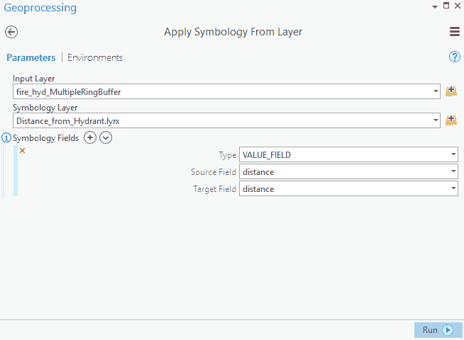

对于您创建的多个环形缓冲区图层，符号应该会改变。现在您可以看到每个环形。

1.  关闭地理处理面板。

1.  保存您的项目。

1.  点击地图选项卡和书签按钮。选择消防栓书签以放大到消防栓附近。

1.  确保图层仍在内容面板中选中，然后在功能区外观选项卡中的绘图组下点击符号按钮下方的下拉箭头。从出现的菜单中选择唯一值，如图所示：

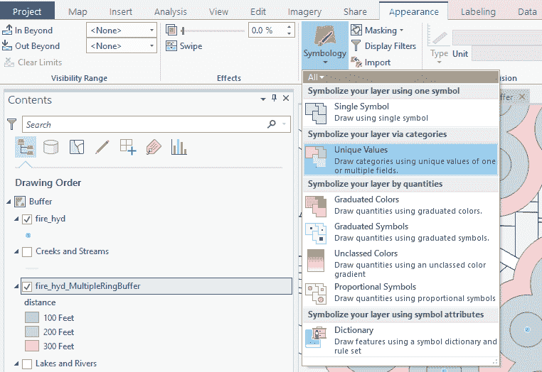

符号面板应该打开。

1.  在显示三个距离的网格中，右键单击 200 英尺的行并选择删除。这将从地图中移除 100 到 200 英尺的区域，以便您可以看到环形是如何工作的。

从符号系统网格中删除值不会从实际数据源中删除它们。它只是从显示中删除这些特征。您始终可以添加已删除的值。

1.  点击 ArcGIS Pro 界面左上角快速访问工具栏中的撤销按钮。这将恢复 200 值符号系统。

1.  保存您的项目并关闭 ArcGIS Pro。

因此，您刚刚创建了一个新图层，表示城市消防栓周围的距离。这将使消防队长能够轻松地确定消防栓为市民和企业提供的保护程度。使用这些数据，他可以确定是否应该安装新的消防栓以改善城市的防火保护。

# 使用近工具确定最近特征

您已经看到我们可以如何使用缓冲区来显示位于特征指定距离内的区域。这使我们能够看到该区域是否还有其他特征。我们还可以使用这些区域进行其他分析。然而，这些都是一般性测量。它们不会告诉我们哪个特征离另一个特征最近。我们如何确定哪个特征离另一个特征最近？

如果您拥有 ArcGIS Pro 的高级许可证，这相当简单。近工具将为您确定最近的特征。它不仅会确定哪个特征最近，而且还有计算最近特征的距离、方向、坐标等选项。近工具适用于点、线和多边形。您还可以指定它只搜索指定距离内的最近特征。那么，让我们来实际应用这个工具。

在本食谱中，您将继续协助消防队长。他仍在进行他的防火研究。他想知道哪个消防栓离每个地块最近，以便部门在响应特定位置时确切知道应该连接哪个消防栓。您将使用近工具来计算哪个消防栓离每个地块最近。

# 准备工作

您需要确保您拥有 ArcGIS Pro 的高级许可证才能完成本食谱。您将无法使用基本或标准许可证完成。如果您不确定您拥有哪种许可证级别或如何确定它，请参阅第一章，*ArcGIS Pro 功能与术语*，以及名为*确定您的 ArcGIS Pro 许可证级别*的食谱。该食谱概述了确定许可证级别的步骤，如果您不记得的话。

如果您仅限于基本或标准许可证，请阅读本食谱，然后继续阅读*更多内容...*部分，这部分可以使用较低级别的许可证完成。

还建议您在开始本食谱之前完成本章中的其他食谱。这将确保您对 ArcGIS Pro 中的邻近分析有一个良好的基本理解。

在继续之前，你还需要确保样本数据已安装。

# 如何操作...

1.  首先，使用与之前食谱中相同的方法启动 ArcGIS Pro，然后使用你在过去食谱中学到的技能，启动位于 `C:\Student\ArcGISProCookbook\Chapter8\Proximity Analysis` 的 `Nearest Feature.aprx` 项目。

1.  它应该打开带有 Trippville 消防保护地图。请确认该地图至少包含消防栓和地块层。它应该看起来像以下这样。你的比例可能因你的显示器大小和打开的窗格而异：

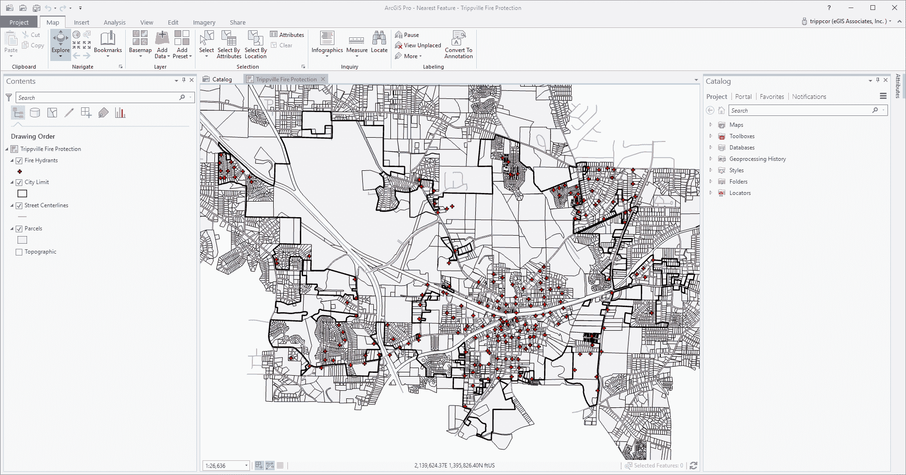

1.  在内容窗格中右键点击地块层，并从出现的菜单中选择属性表。

1.  查看可用字段并回答以下问题：

**问题**：属性表中与地块相关联的字段有哪些？

**答案**：

如你所见，只有少数几个字段与地块相关联。属性表当前存储 ObjectID、Shape、LOTNUM、STNUMBER、STNAME、STSUFFIX、Shape_Length、Shape_Area 和 Acres。这里没有任何信息告诉你哪个消防栓离每个地块最近。你即将改变这一点。

1.  通过点击表格视图顶部标签页中表格名称旁边的小 X 关闭地块属性表。这将释放更多屏幕空间。

如果你有多台显示器，或者一台非常大的显示器，你也可以取消停靠并将表格窗格拖到不同的显示器或位置。这将释放空间以查看地图，同时也可以继续查看表格。此外，ArcGIS Pro 允许你根据需要将每个表格显示在其自己的窗口中，与 ArcMap 不同，ArcMap 强制所有表格都在一个窗口中。

1.  在工具栏中点击分析选项卡，然后在地理处理组中点击工具按钮。这会打开地理处理窗格。

1.  在地理处理窗格的顶部点击工具箱选项卡。

1.  展开分析工具箱和邻近工具集。

1.  在邻近工具集中点击邻近工具。

1.  通过点击下拉箭头并从显示的列表中选择层，将输入要素设置为地块。

1.  使用下拉箭头并从列表中选择，将邻近要素设置为消防栓。

你可以设置多个图层或要素类作为邻近要素。如果是在同一层中查找最近要素，输入要素和邻近要素可以是相同的。

1.  通过输入 `300` 并确保单位是英尺，将搜索半径设置为 300 英尺。消防队长指出，任何距离消防栓超过 300 英尺的地块被认为没有得到充分保护。

1.  点击位置和角度框。这将提供关于最近消防栓的额外信息。

位置选项将添加最近的消防栓的*x*和*y*坐标到 Parcel 属性表中。角度选项将基于网格北方向添加到最近消防栓的角度。

应该注意的是，Near 工具是少数几个实际上编辑现有数据的地理处理工具之一。在 Near 工具的情况下，由于 Parcels 图层被设置为输入要素，它将向 Parcels 属性表添加新字段。有关 Near 工具的更多信息，请访问[`pro.arcgis.com/en/pro-app/tool-reference/analysis/near.htm`](http://pro.arcgis.com/en/pro-app/tool-reference/analysis/near.htm)。

1.  确保方法设置为平面。

1.  检查你的 Near 工具看起来是否如下，然后点击运行：

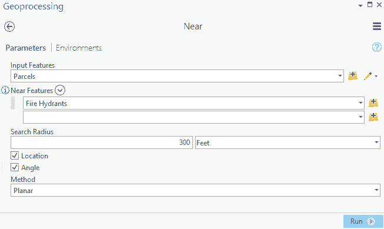

注意，这次与 Buffer 和 Multiple Ring Buffer 不同，你的地图中没有添加新的图层。这是因为 Near 工具不会创建一个新的要素类或表。相反，它向输入要素属性表中添加了新的字段。让我们看看 Near 工具向 Parcels 图层添加了哪些字段。

你还必须具有对输入要素层的编辑权限才能使用此工具。

1.  关闭地理处理面板以释放屏幕空间。

1.  使用与你在本食谱中之前相同的方法打开 Parcel 的属性表。然后回答以下问题：

**问题**：Near 工具向 Parcel 属性表添加了哪些字段？

**答案**：

如你所见，现在在 Parcel 属性表中出现了几个新的字段。这包括 Near_FID、Near_Dist、Near_X、Near_Y 和 Near_Angle，如下面的截图所示：

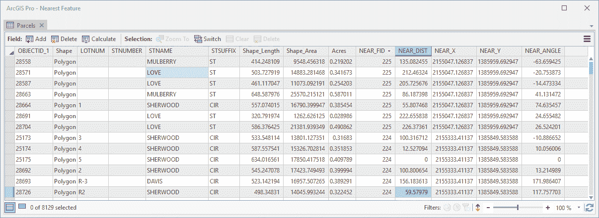

那些字段中值为-1 的 Parcel 不在你运行 Near 工具时指定的 300 英尺搜索半径内。因此，这些很容易被识别为没有足够的消防保护。那些在消防栓 300 英尺范围内的 Parcel 现在被分配了消防栓的要素 ID（Near_FID）、到消防栓的距离（Near_Dist）、到消防栓的角度（Near_Angle）以及 X，Y 坐标（Near_X 和 Near_Y）。这允许你了解哪个消防栓离每个 Parcel 最近。

Near_FID 是最近消防栓的对象 ID。你可以使用这两个字段来连接、关联或创建两个图层之间的关系类。这将允许你访问更多信息。

1.  审阅完毕后，关闭 Parcel 属性表。

1.  保存你的项目。

挑战：

尝试使用连接或关联将地块层链接到消防栓层。参考第三章，*将数据链接在一起*，使用连接或关联。确定你应该使用哪个，连接或关联。（提示：表之间的基数是多对一。）然后，使用最佳方法将它们链接起来。通过打开地块属性表并查看是否可以查看或访问最近消防栓的链接信息来验证你的选择。记住，那些带有-1 的将没有链接信息。

# 还有更多……

最近工具要求你必须拥有高级许可证才能确定哪个要素是最接近的。如果你只有基本或标准许可证会发生什么？是否可以在没有高级许可证的情况下确定最近要素？

是的，你可以这样做，尽管它不是那么直接，并且会生成一个新的要素类。你可以使用空间连接工具。让我们看看它是如何工作的。这假设你还没有完成这个配方，因为你没有高级许可证。

1.  在功能区单击分析选项卡。

1.  在分析选项卡的工具组中单击空间连接工具。这将打开地理处理面板中的空间连接工具。

你也可以在分析工具箱的叠加分析工具集中找到这个工具。空间连接允许你根据许多空间关系将图层或要素类连接在一起。

1.  使用下拉箭头将目标要素设置为地块层，并从列表中选择它。

1.  使用下拉箭头将连接要素设置为消防栓，同样使用下拉箭头。

1.  接受默认的输出要素类，它应该类似于 Parcels_SpatialJoin。

与最近工具不同，空间连接工具创建了一个全新的要素类。它不会简单地向现有图层添加新字段。这意味着你的原始地块层保持不变。

1.  使用下拉箭头将连接操作设置为“一对一”。你使用一对一选项是因为每个地块应该只有一个最近的消防栓。

1.  确保选中了“保留所有目标要素”复选框。这将确保结果输出要素类将包含所有地块，即使它们附近没有消防栓。

1.  滚动到匹配选项，并使用下拉箭头选择最近。这是 ArcGIS Pro 将用于连接数据的空间关系。最近选项位于列表底部附近。花点时间看看还有哪些其他选项可用。

1.  将搜索半径设置为 300 英尺，就像我们使用最近工具时做的那样。这限制了最近消防栓的搜索范围到 300 英尺。

1.  确保你的空间连接工具看起来如下，然后单击运行：

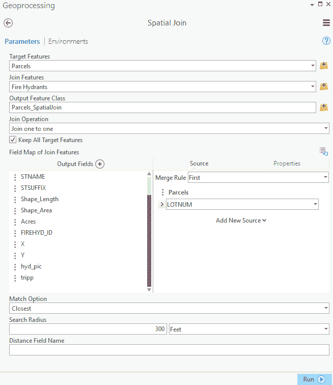

根据你的计算机，这个工具可能需要几分钟才能运行。所以如果它花了一些时间，请不要担心。这个分析需要大量的处理才能完成。

1.  应该会在您的内容面板中显示一个新层。这个新层是空间连接工具的结果。关闭地理处理面板。

1.  右键单击刚刚添加的新层。从出现的菜单中选择属性表。

1.  属性表包含来自地块和消防栓层的所有信息。花点时间查看结果。

Join_Count 字段告诉您有多少消防栓被连接到地块上。因为您选择了“一对一”连接选项，这个数字应该是 1 或 0。Target_FID 是离地块最近的消防栓的 ObjectID。FireHyd_ID、X、Y、Picture 和 Picture 2 字段都来自离地块最近的消防栓。其余字段都来自地块层。

1.  完成后关闭属性表。

1.  保存您的项目并关闭 ArcGIS Pro。

因此，您现在有两种方法在 ArcGIS Pro 中计算最近要素。如果您有高级许可证，您可以使用任何一种方法。如果您只有基本或标准许可证，那么您必须使用空间连接。如果您可以使用任何一种，哪种最好？这取决于您需要用结果数据做什么。空间连接在您创建的数据是大型过程的中介且以后不再需要时最好。否则，它将创建另一个您必须维护的层。邻近工具不会为您创建更多需要管理的数据。它只添加到您已经维护的信息层中。

# 使用“生成邻近表”工具计算要素之间的距离

您现在知道了几种不同的方法来找到最近的要素。如果您想计算一组要素到另一组要素的距离怎么办？不仅仅是寻找最近的。生成邻近表工具可以做到这一点。

“生成邻近表”工具将创建一个新的数据库表，列出输入要素与邻近要素层中要素的距离。

与邻近工具一样，您还有选择包括位置和角度等额外字段。此工具也需要高级许可证。

Trippville 市有几个水质监测站，监测城市溪流、河流中的水质。最近，它们中有几个报告水质差或很糟糕。

人们认为这可能是由于城市中工业场所的径流造成的。

在这个菜谱中，您将使用“生成邻近表”工具来识别所有靠近报告水质差的监测站的工业地块。这些将是您首先需要检查以确定它们是否是水质差的原因的地块。

# 准备工作

您需要确保您拥有 ArcGIS Pro 的高级许可证才能完成本食谱。您将无法使用基本或标准许可证完成它。如果您不确定您拥有哪种许可证级别或如何确定它，请参阅第一章，*ArcGIS Pro 功能与术语*，以及名为*确定您的 ArcGIS Pro 许可证级别*的食谱。该食谱将告诉您如何确定您的许可证级别。

如果您受限于基本或标准许可证，请仔细阅读本食谱，然后继续阅读*更多内容...*部分，这部分可以使用较低级别的许可证完成。

还建议您在开始本食谱之前完成本章中的其他食谱。这将确保您对 ArcGIS Pro 中的邻近分析有一个良好的基本理解。

在继续之前，您还需要确保已安装样本数据。

# 如何操作...

1.  您将首先启动 ArcGIS Pro。然后使用您在之前的食谱中学到的技能打开位于`C:\Student\ArcGISProCookbook\Chapter8\Proximity Analysis`的`Near Table.aprx`项目。项目应使用 Trippville 地图打开。您将首先选择工业区域的地块。

1.  在功能区激活地图选项卡，并在选择组中选择按属性选择工具。按属性选择层工具将在地理处理面板中打开。

1.  使用下拉箭头并将层名称或表视图设置为区域，并从列表中选择它。

1.  确保选择类型设置为新选择。

1.  单击添加条款按钮开始构建您的查询。

1.  使用下拉箭头将字段设置为区域。

1.  确保运算符设置为等于。

1.  使用下拉箭头将值设置为 HI。

1.  确认您的查询看起来像以下截图，然后单击添加按钮：

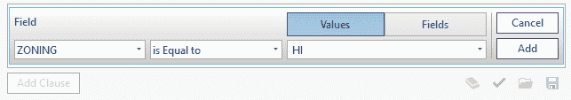

1.  再次单击添加条款按钮。您刚刚添加的条款将仅选择位于**重工业**（**HI**）区域的地块。您还需要选择那些位于**轻工业**（**LI**）区域的地块。

1.  在说并且的地方，单击下拉箭头并选择或者。

并且和或为条款连接词。它们决定了查询中条款如何一起工作。如果您在查询中使用了并且，那么选择必须满足两个条款。由于地块不能同时被划定为重工业和轻工业，这意味着将不会选择任何内容。或者意味着只需满足两个条款中的一个的要求。因此，在这种情况下，查询将选择所有被划定为轻工业或重工业的地块。

1.  将字段设置为区域，运算符设置为等于，并将值设置为 LI。然后，在确认它看起来像以下截图后，单击添加：

1.  您的“按属性选择图层”工具现在应包含两个 SQL Where 子句。这将选择所有被划分为轻工业或重工业的土地地块。请验证您的工具看起来如下，然后点击运行：

当您运行查询时，地图内应选择大约 152 个地块。所有这些地块都应被划分为轻工业或重工业。接下来，您需要选择报告水质不良的水质站。您将使用另一个按属性选择查询来完成此操作。

1.  如果您关闭了包含“按属性选择图层”工具的地理处理面板，请点击地图标签上的“按属性选择”按钮在“选择”组中。如果它仍然打开，请转到下一步。

1.  在地理处理面板中，确保“按属性选择图层”工具仍然处于活动状态。

1.  使用下拉箭头设置图层名称或表格视图为水质站。如果您的旧查询仍然存在于表达式中，在您进行此更改时可能会出现错误。现在您可以忽略它，因为您很快将创建一个新的查询。

1.  确保选择类型仍然设置为“新选择”。

1.  点击位于查询表达式下方的“清除表达式”按钮。它看起来像一个小橡皮擦，如图所示：

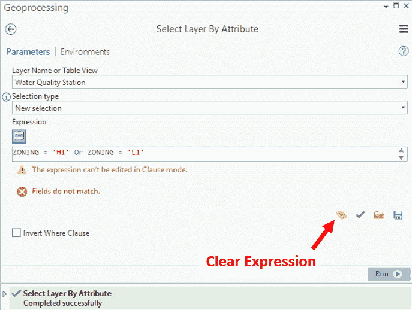

1.  如果您看不到“添加子句”按钮，请点击表达式区域顶部附近的表达式下方，如图所示，点击“切换到编辑子句模式”按钮：

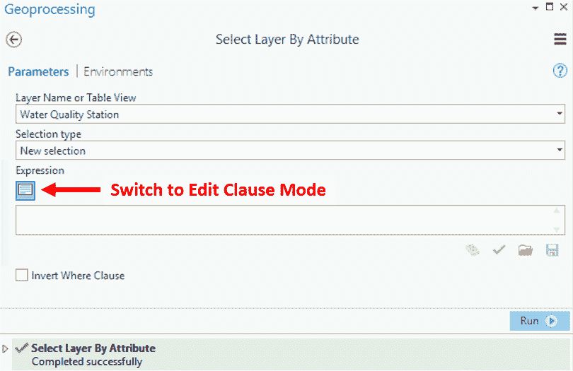

1.  点击“添加子句”按钮。

1.  将字段设置为当前状态，运算符设置为等于，值设置为不良，所有这些均使用下拉箭头。

1.  验证您的表达式看起来如下，然后点击“添加”按钮：

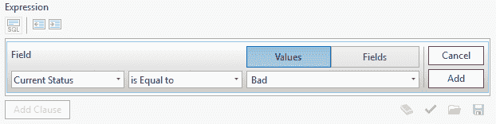

1.  验证您的“按属性选择图层”工具看起来如下，然后点击运行：

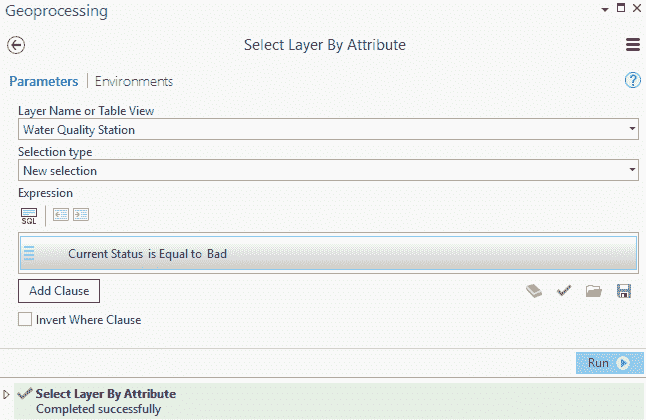

1.  在内容面板中，点击“按选择列表”按钮。它是从左数第三个。现在您应该有大约两个水质站和 151 个分区多边形被选中。

现在您已经选择了适当的分区地块和水质站，您需要创建一个表格，列出所选地块中哪些靠近所选的水质站。您将搜索范围限制在水质站周围 1,500 英尺的半径内。

1.  点击工具栏上的“分析”标签。

1.  在工具组中点击“生成邻近表格”工具。如果您看不到该工具，请点击组右侧的箭头以在工具列表中上下导航。

1.  “生成邻近表格”工具将出现在地理处理面板中。使用下拉箭头将输入要素设置为水质站。

1.  使用最右侧的下拉箭头设置邻近要素为分区。

1.  接受 ArcGIS Pro 生成的默认输出表值。

此工具正在创建一个新的表格。默认情况下，表格正在存储在项目地理数据库中。这恰好是邻近分析地理数据库。

1.  将搜索半径设置为 1,500 英尺，通过输入`1500`并验证单位来实现。

1.  如果已勾选，取消勾选“仅查找最近特征”。你想要找到距离水质监测站 1500 英尺范围内的所有工业区域地块，而不仅仅是最近的那个。将最大最近匹配数保留为 0。这将确保返回所有 1500 英尺范围内的匹配项。

1.  方法应设置为平面。

1.  确认你的生成邻近表工具看起来如下，然后点击运行：

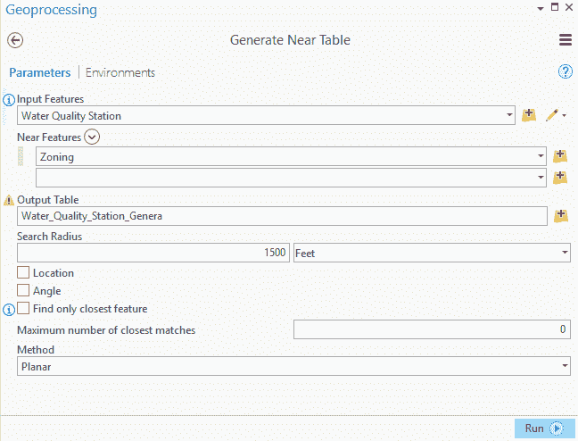

当工具完成时，你的内容面板中应该会出现一个新的独立表格。这个表格是你刚刚运行的工具的结果。让我们看看结果。

1.  关闭地理处理面板。

1.  右键点击你刚刚创建的新表格，该表格已添加到内容面板中。从出现的菜单中选择打开。

如我们之前提到的，地理处理工具，如创建邻近表工具，自动仅使用所选特征。由于你在水质站和分区图层中选择了特定特征，因此此工具仅使用那些选定的特征来运行其分析。

1.  查看新创建的表格。

在新表格中，你应该会看到几个字段。IN_FID 字段包含水质站的对象 ID。你应该看到一个值为 3 或 4，这与水质站属性表中当前状态为“差”的站点的对象 ID 相匹配。Near_FID 字段包含附近工业区域地块的对象 ID。每个水质站应该与多个地块配对。Near_Rank 字段标识哪个是每个水质站最近的。这有助于你确定应该从哪个地块开始优先处理。

1.  关闭表格并保存你的项目。

# 还有更多...

那么，你可以在没有 ArcGIS Pro 高级许可证的情况下做到这一点吗？答案是肯定的。你可以使用空间连接工具来完成类似的事情。然而，结果不是一个表格。它是一个包含许多重叠特征的新要素类。如果你只需要一个表格，你可以将空间连接工具的结果导出到一个新的表格中。以下是所有这些工作的方法：

1.  如果你仍然选择了水质站和分区图层中的特征，请继续下一步。如果没有，请从食谱中重复步骤 2-24。你应该有两个水质站和 151 个分区多边形被选中。

1.  在功能区中点击分析选项卡。然后在工具组中选择空间连接工具。这将在地理处理窗口中打开工具。

1.  使用下拉箭头将目标要素设置为水质站。

1.  使用下拉箭头将连接要素设置为分区。

1.  点击浏览按钮设置输出要素类。

1.  从左侧面板中选择数据库。然后在右侧面板中双击 Proximity Analysis.gdb 地理数据库。

1.  在名称中输入`WaterQual_IndustZoned_SpatialJoin`并点击保存。

1.  将连接操作设置为“一对一连接”。这将确保结果包含在水质站 1,500 英尺范围内的所有工业区域地块。

1.  使用下拉箭头将匹配选项设置为在距离内。

1.  将搜索半径设置为 1,500 英尺。

1.  确认您的空间连接工具看起来如下，然后点击运行：

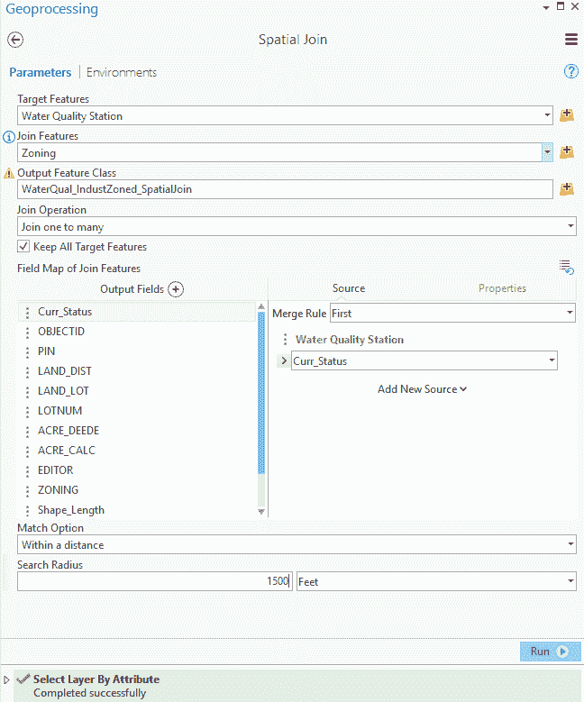

1.  在您的内容面板中会出现一个新的图层。这是空间连接工具的结果。关闭地理处理面板。

1.  在内容面板中选择按绘制顺序选择的列表。这是面板左上角的第一个按钮。

1.  点击工具栏上的地图选项卡。然后点击选择组中的清除按钮。现在您应该能够看到看起来像两个新特征，它们重叠了水质较差的两个水质站。现在是时候验证这些位置实际有多少个特征了。

1.  右键单击新图层并选择缩放到图层。

1.  在内容面板中选择新图层。

1.  点击位于探索工具下方的下拉箭头并选择内容中的所选内容。现在点击两个新特征中的一个。当您点击一个特征时，应该会出现信息弹出窗口。

1.  查看信息弹出窗口的左下角，以查看所选位置实际有多少个特征。如果您点击了最北端的位置，您应该有大约 30 个特征。如果您点击了最南端的位置，您应该有大约 14 个特征。以下是一个示例：

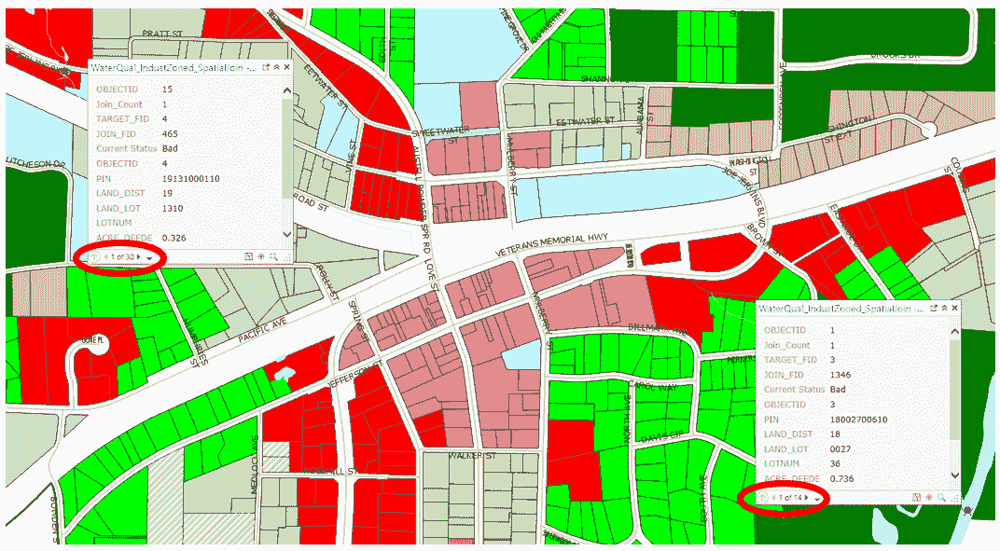

1.  右键单击新图层并选择属性表来查看结果属性。审查表格，看看您是否能识别字段的意义以及它们来自哪里。

1.  关闭属性表并保存您的项目。

1.  关闭 ArcGIS Pro。

如您所见，您已创建了另一个新的要素类。如果您想将其导出为独立的表格，可以右键单击图层并转到数据。然后选择导出表格。如果您想将其导出到 Excel 电子表格，可以使用您在过去配方中使用的表格到 Excel 工具。
