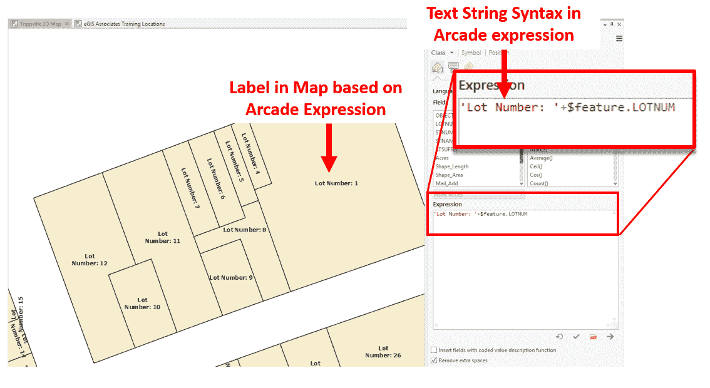
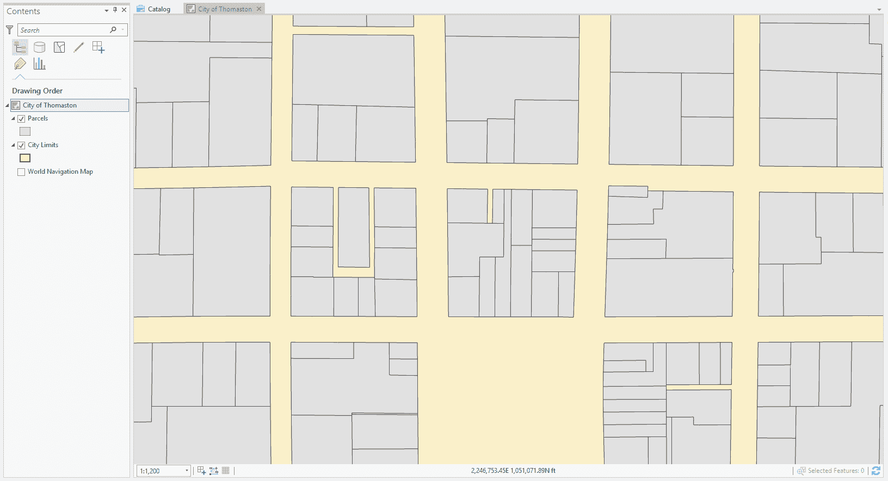
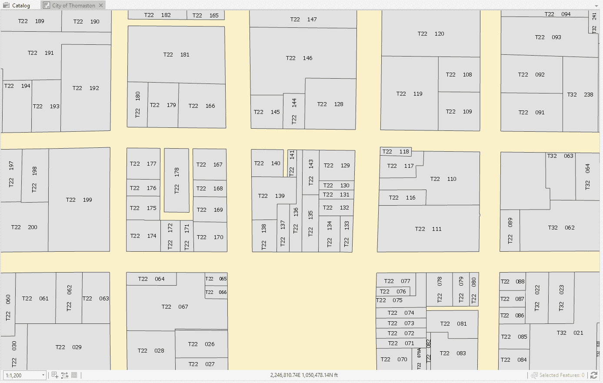
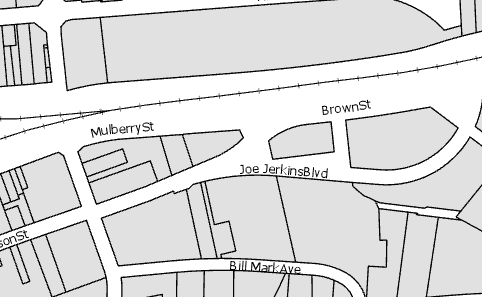
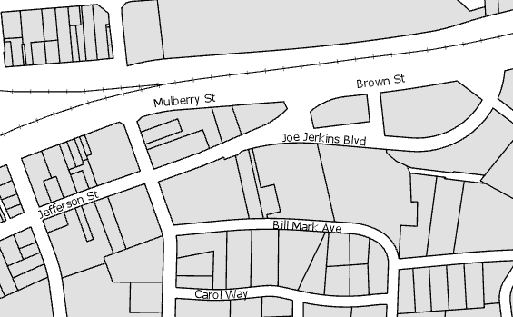
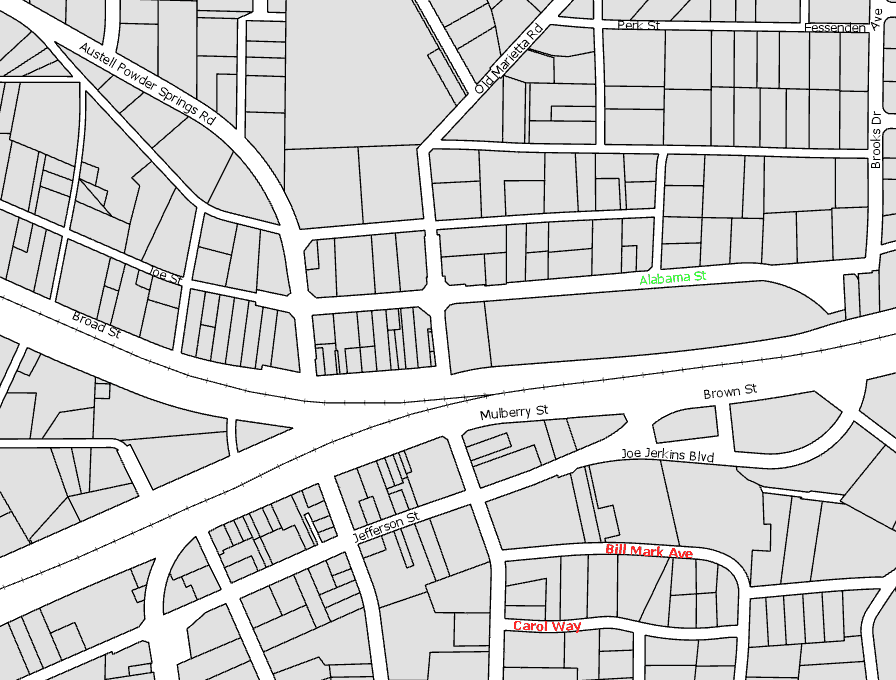
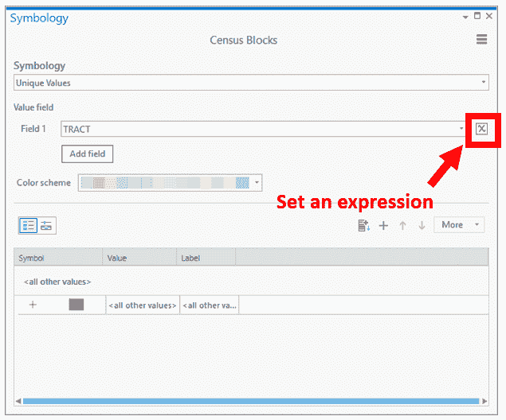
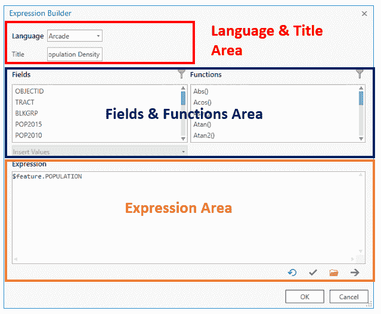
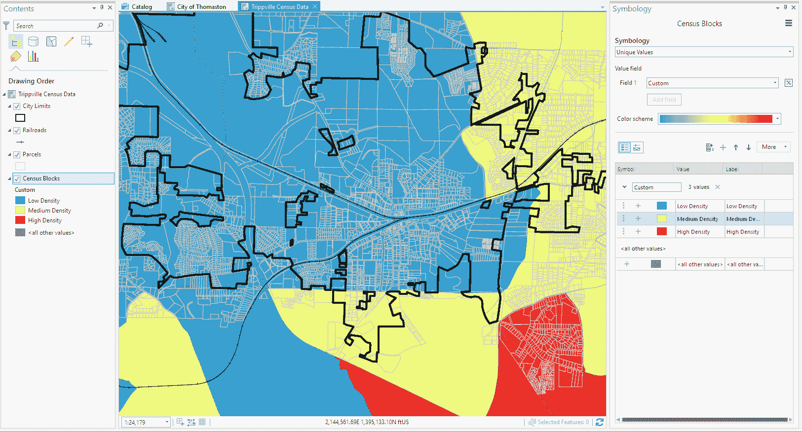

# 第十一章：介绍 Arcade

在本章中，我们将介绍以下食谱：

+   应用预构建的 Arcade 表达式

+   创建 Arcade 标签表达式

+   创建 Arcade 符号表达式

# 简介

多年来，Esri 产品支持了许多不同的表达式和脚本语言。这些包括 AML、Avenue、JScript、VB Script、SQL 和 Python。其中一些语言是由 Esri 开发的，如 AML 和 Avenue，而其他则是常见的 IT 行业语言，如 JScript、VB Script、Python 和 SQL。每一种都适合桌面、服务器或在线上的特定用途。然而，现在我们发现自己经常需要同时在这些环境中工作。我们在桌面上的 ArcGIS Pro 中创建地图，然后发布到 ArcGIS 企业，稍后通过移动设备上的网络访问它。

随着我们在这几个环境中工作，这已经开始引起问题。有时我们在桌面上创建的可以很好地工作的事物，在服务器或互联网环境中却无法转换。标签和符号通常就是这样。因此，为了帮助弥合这一差距，Esri 开发了一种他们称之为新的表达式语言，即 Arcade。

Arcade 是一种轻量级且便携的语言，可以在 ArcGIS 平台上使用。这意味着你在 ArcGIS Pro 中创建的表达式也可以在 ArcGIS Server、门户和 ArcGIS Online 中使用。它可以用来控制并显示标签、执行数学计算、操作符号化，等等。Arcade 的独特之处在于它包含了几何类型。

它从一开始就是为此而设计的，与 Python 等其他语言不同，后者必须进行定制才能与几何形状一起工作。

表达式语言与其他编程或脚本语言之间的区别是什么？主要区别在于表达式语言不能用来创建独立的程序或插件。它必须用于另一个应用程序内部，例如 ArcGIS Pro。因此，Arcade 不像 Python 这样的脚本语言那样灵活。话虽如此，你可以用 Arcade 创建的表达式可以非常复杂，包括多行代码。因此，你可能会看到 Arcade 表达式也被称为脚本。

Arcade 的语法类似于其他脚本语言，例如 Python 或 VB Script。例如，要表示一个文本字符串，你只需用单引号将所需的字符串括起来。所以，如果你正在创建一个 Arcade 标签表达式，并想在表达式中包含 `Lot Number`，这些单词将作为标签的一部分显示，如下面的截图所示：



包含地块编号的 Arcade 标签表达式示例

如果你曾在 ArcGIS Pro 或 ArcMap 中创建过任何标签表达式，那么图中显示的语法应该看起来有些熟悉。它与 Python 或 VB Script 表达式并没有太大的不同。所以，如果你已经熟悉那些，你应该能够很快地掌握 Arcade。

你应该了解的关于 Arcade 语法的一些事项：首先，它与 Python 不同，Arcade 语法不区分大小写。因此，名为 Parcel 的变量与 parcel 相同。要在代码中添加注释，你可以使用 `//` 进行单行注释，或者使用 `/* */` 进行多行注释。

以下是一个单行注释的示例：

```py
//Labels parcels with lot number
'Lot Number: '+$feature.LOTNUM
```

以下是一个多行注释的示例：

```py
/*
This expression was built using Arcade.
It is intended for use with ArcGIS Pro 2.1 and ArcGIS Enterprise 10.5 or later versions.
*/
Proper($feature.NAME, 'firstword')
```

最后，你可以在 Arcade 表达式中声明变量，并使用以下代码块中的新值重新分配，如下所示：

```py
var x = 1;
return x;
//This will return a value of 1 for the variable x
x = 5;
return x;
//This will return a value of 5 for the variable x.
```

Arcade 仍然非常新。它首次在 ArcGIS 10.5 和 ArcGIS Pro 1.4 的发布中推出。随着 ArcGIS 和 ArcGIS Pro 的每个新版本发布，Esri 都会增加 Arcade 的功能。这意味着随着时间的推移，你可以期待使用这种新的表达式语言做更多的事情。如果你想深入了解 Arcade，你可能想访问 [`developers.arcgis.com/arcade/`](https://developers.arcgis.com/arcade/)。这是 Esri 关于 Arcade 的主要信息资源。

在本章中，你将了解 Arcade 以及它在 ArcGIS Pro 中的工作方式。你将从探索现有表达式开始，并学习如何在你的项目中应用它们。然后你将开始创建你自己的 Arcade 表达式。你将从创建一个标签表达式开始。然后你将学习如何创建符号表达式。

# 应用预构建的 Arcade 表达式

创建 Arcade 表达式的一个优点是你可以保存它们，以便在其他地图或场景中，甚至在同一地图中的其他图层中使用。这些表达式文件具有 `.lxp` 文件扩展名。这也允许你轻松与他人共享表达式，因此你不必每次需要使用 Arcade 表达式时都重新发明轮子。

在这个菜谱中，你将检查并应用一些现有的 Arcade 表达式到地图中的图层。你将从为地块添加 **地块识别号**（**PIN**）和地图面积标签的标签表达式开始。然后你将检查另一个控制图层可见性的表达式。

# 准备工作

这个菜谱将要求你访问 ArcGIS Pro 许可证并安装示例数据。这个菜谱可以在所有 ArcGIS Pro 许可证级别完成。你还需要一个支持 HTML 5 和 JavaScript 的网络浏览器。这包括当前版本的 Chrome、Edge、Firefox 和 Safari。Internet Explorer 11 或更新的版本也是可接受的。其他浏览器也可能工作，但尚未由 Esri 测试。

# 如何操作...

1.  你将首先启动 ArcGIS Pro 并打开位于 `C:\Student\ArcGISProCookbook\Chapter11\Arcade` 的 Arcade 项目，使用你在前面的菜谱中学到的技能。项目应该打开一个显示 Thomaston 市地图，并放大到市中心附近的区域，如下面的截图所示：



Thomaston 市地图

1.  在内容面板中，选择包裹图层，以便在工具栏中显示要素图层上下文菜单。

1.  你会注意到地图中的所有包裹都没有标签，因此你需要为该图层打开标签功能。点击工具栏中的标签选项卡。

1.  点击标签选项卡中图层组中的标签按钮。这将打开包裹的标签，如下面的截图所示：



现在你可以看到每个包裹都有一个标签，用于标识与每个包裹相关的一个属性。如果你查看标签选项卡中标签类组中字段的设置，你会看到它正在显示 PIN 字段中的值。这是税收包裹识别号。你想要做的是不仅为每个包裹标注其 PIN，还要标注其地图面积。幸运的是，有人已经创建了一个表达式文件，可以做到这一点。

你也可以在内容面板中右键单击一个图层，从菜单中选择标签来为特定图层打开或关闭标签功能。

1.  在标签选项卡中，点击位于标签类组中字段选项右侧的表达式按钮，如下面的截图所示。这将打开标签类面板，在那里你可以创建标签表达式：


1.  在标签类面板中，使用下拉箭头将语言设置为 Arcade。

1.  现在查看标签表达式。它应该读取 `$feature.PIN`。

`$feature` 是 Arcade 使用的两个全局变量之一。它允许你访问或调用与目标图层中的要素相关联的信息。在这个例子中，它允许你访问属性表中的 PIN 字段。你也可以用它来访问几何信息，如面积、长度和坐标。

1.  在表达式区域下方，点击导入按钮，它看起来像是一个文件夹。这将打开导入窗口。

1.  在导入窗口中，导航到 `C:\Student\ArcGISProCookbook\Chapter11` 并选择 Label Parcels with PIN and Acres.lxp。然后点击确定。这将导入表达式到标签类面板中的表达式区域。现在你的标签类面板应该看起来类似于下面的截图：


现在你已经将表达式导入到标签类面板中，让我们来看看它。这个表达式设置好了要做很多事情，如下所示：


表达式以一个文本字符串开始，它将在标签中显示。这是通过使用包含文本字符串的单引号来识别的。之后是一个加号（+），它作为表达式下一部分的连接符。然后表达式检索每个在图层属性表的 PIN 字段中找到的包裹的值。该值随后显示在表达式的第一部分中的 Parcel No: 文本字符串之后。然后是 TextFormatting 变量，它创建一个新行，以便表达式的后续部分在另一行中显示。之后，表达式显示另一个文本字符串，面积。最后，表达式检索在属性表的 Map_AC 字段中找到的每个包裹的值。然而，它不仅仅显示确切值。这个表达式更进一步，将值四舍五入到两位小数。它是通过调用 round 数学函数并将其限制为两位小数来实现的。两位小数的限制是通过字段名后的值来应用的。

现在你已经知道这个表达式应该如何工作，让我们应用它，然后比较我们在地图中看到的与刚刚提供的解释的结果。

1.  点击标签类面板底部的应用按钮，以应用你刚刚导入的表达式。

1.  注意地图中的标签是如何变化的，并回答以下问题：

**问题：** 标签是否已经更改，现在它们是否与表达式的预期工作描述相匹配？

**答案：**

如果你的地图看起来像下面的截图，那么是的，表达式执行得完全如描述所述：


应用标签表达式的结果

对于新用户来说，这个表达式可能看起来很复杂。然而，它相当简单。这些表达式可以更加复杂，正如你将在下一部分中发现的那样。

1.  关闭标签类面板并保存你的项目。

1.  在内容面板中选择街道层。使用你在本食谱中之前学到的技能打开此层的标签。如果你不记得，请参考*步骤 4*。街道名称应该会出现在地图上。

由于你为城市工作，你希望能够轻松地识别属于城市的街道。为此，你的城市街道需要用红色标注并以粗体字体显示。你的一个同事已经创建了一个 Arcade 表达式来完成这项工作。

1.  点击标签选项卡上的标签类组中的表达式按钮，就像你在本食谱中之前做的那样。这将打开标签类面板。

1.  在标签类面板中，确保语言设置为 Arcade。然后点击面板底部的导入按钮。你可能记得它的图标类似于文件夹。

1.  在打开的导入窗口中，使用您学到的技能导航到 `C:\Student\ArcGISProCookbook\Chapter11` 并选择 City Streets Labels Red.lxp 文件。然后点击确定。现在您应该会在标签类面板中看到以下表达式：

```py
var type=($feature.FEATURE_TY)
if (type == "City Street"){
return "<BOL><CLR red='255'>"+$feature.ROAD_NAME+"</CLR></BOL>"
} else {
return $feature.ROAD_NAME
}
```

1.  点击应用按钮将表达式逻辑应用于标签。看看标签是如何变化的。一些街道名称现在以粗体红色字体显示。这些是属于城市的街道。

让我们花一点时间来检查表达式是如何实现这一点的。在阅读这个解释的同时，请参考以下图表以帮助您更好地理解正在发生的事情。它首先在第一行定义了一个变量，该变量从图层属性表中的 Feature_TY 字段读取道路类型：


一旦定义了变量，表达式就会移动到一个逻辑块中，该逻辑块会评估变量的值。它是通过使用 `if` 语句来做到这一点的。如果特征的变量值等于 City Street，那么它就会从属性表中的 Road_Name 字段返回一个特征标签，以粗体红色文字显示。否则，它就会用 Road_Name 字段中的值正常标注。最终结果是像以下截图中的地图那样带有标签：


使用 if 语句的标注表达式结果

如您所见，一些道路名称以红色和粗体显示，而其他则以黑色和正常显示。那些红色和粗体的属于城市。

1.  关闭标签类面板并保存您的项目。

1.  关闭 ArcGIS Pro。

您现在已经探索了两个 Arcade 表达式，所以希望您开始对它是如何工作的以及您可以做什么有了一些了解。您使用的第一个表达式相当简单，但仍然很强大。它用 PIN 和两行不同的面积标注了 Thomaston 市的地块。您使用的第二个表达式包含了控制特征标注方式的逻辑。这是一个更复杂的表达式。这只是冰山一角。

正如您将在本章后面学到的那样，Arcade 不仅与标签一起工作，还可以用于控制符号。这进一步增加了 Arcade 的价值。

# 创建 Arcade 标注表达式

您现在有机会探索了几种 Arcade 表达式。这给了您一个机会开始学习 Arcade 的语法以及您可以使用这些表达式做的一些事情。现在，您应该开始构建自己的表达式了。

在这个菜谱中，您将创建一个 Arcade 表达式，用于标注 Trippville 的街道名称。这需要您连接两个组成完整街道名称的字段。

# 准备工作

要完成此菜谱，您需要完成本章中此前的菜谱以及第一章，*ArcGIS Pro 功能和术语*中的所有菜谱。这将确保您具备完成此菜谱所需的知识和技能。

此菜谱适用于任何 ArcGIS Pro 许可级别，并且不需要任何扩展。在开始之前，您需要确保已安装示例数据。

# 如何做到这一点...

1.  首先，您需要启动 ArcGIS Pro 并打开您在先前菜谱中使用的 Arcade 项目。该项目应出现在您最近打开的项目列表中。

1.  当项目打开时，您应该会看到您在先前菜谱中工作的 Thomaston 市地图。通过单击位于地图视图顶部标签上的小 X 关闭该地图。这将减少 ArcGIS Pro 使用的计算机资源，因为您在此菜谱中不会使用该地图。

1.  在目录窗格中，右键单击 Trippville 市地图，并从出现的菜单中选择打开。这将打开您将用于此菜谱的地图。地图应类似于以下截图。如果不是，请使用 Trippville Labeling Streets 书签缩放到此区域：


新打开的 Trippville 地图

注意街道似乎已经用名称进行了标记。然而，如果您仔细观察，应该会注意到名称并不完整。它们缺少街道类型，例如道路、大道或庭院。让我们看看您是否能弄清楚这是为什么。

1.  在内容窗格中选择 Streets 图层。然后在功能区中出现的标签选项卡上单击。

1.  查看标签类组中分配给字段选项的值，并回答问题：

**问题**：正在使用哪个字段来标记 Streets 图层？

**答案**：

**问题**：这是一个单一字段还是一个表达式？

**答案**：

如您所见，Streets 图层仅使用 NAME 字段来在地图上用名称标记街道。虽然这个单一的字段似乎包含标记街道所需的数据，但根据您在地图上看到的情况，这不是完整的名称。您需要检查属性表以确定是否还有包含街道类型信息的其他字段。

1.  在内容窗格中右键单击 Streets 图层。然后从出现的菜单中选择属性表。这将打开 Streets 图层的属性表，以便您可以检查它。

1.  在表中定位 NAME 字段。然后检查它包含的值。

1.  接下来，检查其他字段，看看您是否能确定包含街道类型的字段。然后回答问题：

**问题**：属性表中是否有用于存储街道类型的字段？

**答案**：

**问题**：如果是这样，那是什么？

**答案**：

检查完表格后，你应该已经确定 TYPE 字段用于存储街道类型。道路名称信息被分解到单独的字段中并不异常。这在用作 E911/应急响应、地址分配或一般地址定位的地理编码源的中心线数据中通常是正确的。

现在你知道了为了标注每条街道的完整名称，你需要从两个不同的字段中提取值。有了这个知识，你现在可以创建你的表达式。

1.  关闭街道层的属性表。这将释放一些屏幕空间，这样你就可以看到更多的地图。

1.  如果需要，在内容面板中选择街道层，然后在功能区中点击标签选项卡。

1.  点击标签选项卡中标签类组旁边位于字段值旁边的表达式按钮。这将打开标签类面板，这样你就可以构建你的表达式。

1.  在标签类面板中，确保使用下拉箭头将你的语言设置为 Arcade。

1.  在表达式区域，你应该已经看到了用于根据 NAME 字段中的值标注街道的表达式。

1.  在表达式区域，添加以下内容：

```py
$feature.NAME+$feature.TYPE
```

1.  一旦你完成了表达式，点击表达式区域右下角的验证按钮。它看起来像绿色的勾号。

1.  一旦你验证了你的表达式，它应该在表达式区域下方以绿色字母显示“表达式有效”。现在点击应用按钮，看看你创建的表达式如何标注街道。

你创建的表达式现在确实正在用名称和类型对街道进行标注。然而，如果你仔细看，你会看到两个值是连在一起的，如下面的图所示：



两个值之间的空间缺失，因此它们看起来是连在一起的。你需要调整你的表达式，以便在两个值之间添加空格。

1.  将你的注意力转回到标签类面板和你的表达式上。要在两个字段中的值之间添加空格，你需要添加一个表示空格的字符串。在表达式中的`+`符号之后点击，并输入以下内容：`“ “+`。引号之间应该有一个空格。现在你的表达式应该是这样的：

```py
$feature.NAME+" "+$feature.TYPE
```

1.  再次验证你的表达式。如果它是有效的，点击应用按钮以查看修改后的表达式的结果。

Arcade 支持在其表达式中使用多个运算符。这些运算符在创建的表达式中执行基本逻辑功能。一些常见的运算符包括：

+   `+`：加号用于将两个数字相加或将两个字段或字符串连接起来

+   `-`：这个减号或减号从另一个数字中减去一个数字

+   `==`：双等号是等于的正确语法

+   `!=`：感叹号加等号表示不等于

+   `++`：双加号用于递增值

+   `--`：双减号将值减一

这些只是您可以在 Arcade 中使用的运算符中的一小部分。请访问[`developers.arcgis.com/arcade/guide/logic/`](https://developers.arcgis.com/arcade/guide/logic/)以查看完整的列表。

您现在应该看到名称和类型之间存在一个空格，如下面的图所示：



恭喜您创建了一个 Arcade 表达式！这是一个非常简单的表达式，它将两个字段中的值与一个字符串连接起来，以创建一个单独的标签。让我们将其提升到下一个层次，并编写另一个表达式，该表达式将根据街道的条件更改标签的颜色。如果您还记得当您检查 Streets 层的属性表时，有一个字段用于识别道路的条件，是良好、一般还是较差。

因此，让我们编写一个新的表达式，该表达式将为条件良好的街道应用绿色标签，为条件一般的街道应用黑色标签，为条件较差的街道应用红色粗体标签。您将首先在表达式中定义两个变量；一个用于街道名称，它将使用您刚刚创建的表达式，另一个用于条件。

1.  在继续之前，请保存您的项目。

1.  在标签类面板中，您将定义一个名为`name`的变量，它将使用您刚刚创建的表达式。在表达式区域，更新您的表达式，使其现在读取如下：

```py
var name=($feature.NAME +” “+$feature.TYPE)
```

1.  按下*Enter*键以开始新的代码行。然后在条件字段中定义另一个变量，该变量引用街道条件。在您开始的新代码行上键入以下内容：

```py
var cond=($feature.Condition)
```

您的标签类面板现在应该看起来如下所示：


您现在在表达式中定义了两个变量，名称和 cond。这允许您使用变量代替变量所代表的完整值。这使得您在输入时更加方便，并避免语法错误。现在，是时候添加评估每条街道条件的逻辑，并相应地对其进行标记了。您将使用`if`语句来完成此操作，就像您在上一个菜谱中使用的上一个表达式一样。

1.  返回到标签类面板的表达式区域，并将以下代码添加到您的表达式中：

```py
if (cond=="Good")
  {
  return "<CLR green='255'>"+name+"</CLR>"
  }
if (cond=="Fair")
  {
  return name
  }
else
  {
  return "<BOL><CLR red='255'>"+name+"</CLR></BOL>"
  }
```

1.  一旦您将附加代码输入到表达式中，请点击验证按钮以确保您的语法正确。

在输入每一行时，您可以使用验证按钮来验证您的语法。最常见的错误是缺少引号或括号。同时，请确保使用双等号。如果您在编写代码时遇到困难，您可以使用位于`C:\Student\ArcGISProCookbook\Chapter11`的`Logic Results.lxp`文件导入 Trippville 街道名称标签。

1.  如果您的表达式有效，请点击应用按钮，以便您可以看到您新扩展表达式的结果。

一旦应用您的表达式，您应该会看到地图中的标签现在以三种颜色——绿色、黑色和红色——显示，如下面的截图所示：



这证明了您的表达式正在工作。它正在评估每个路段，并根据您为该条件定义的参数显示标签。

1.  关闭标签类面板并保存项目。

1.  关闭 ArcGIS Pro。

您现在已创建了两个用于标注街道名称的 Arcade 表达式。您创建的第一个表达式相当基础。您将两个字段连接起来，并在值之间添加空格以创建一个单独的标签，该标签显示街道的全名。这是一个非常常见的 Arcade 表达式用法。

您创建的第二个表达式要复杂得多。它包括确定每个标签在地图中如何显示的逻辑。使用 `if` 语句，您的表达式检查每个路段的条件并评估其状态，状态可以是良好、一般或较差。基于这个条件，它随后相应地渲染标签。状况良好的街道用绿色文字标注。状况一般的街道用黑色字体标注。最后，状况较差的街道用粗体红色字体标注。

# 创建 Arcade 符号化表达式

Arcade 不仅限于用于标签。您还可以用它来控制符号化。您可能想知道：为什么您想这样做？ArcGIS Pro 已经具有根据一个或多个信息字段符号化图层的能力，所以这是一个好问题。

Arcade 允许您根据数据库中不存在的值来指定符号化。它允许您根据方程或函数创建符号化。例如，您可能有道路具有交通量数据和最大设计交通负荷，但您希望根据当前容量来符号化图层——是低于、等于还是超过？没有字段标识容量。然而，可以通过将当前交通量除以设计负荷并乘以 100 来确定容量百分比。任何低于 100 的值都表示低于容量，任何等于 100 的值都表示等于容量，任何高于 100 的值都表示超过。Arcade 允许您构建一个表达式来完成这项工作。最好的是，随着当前交通量或设计交通负荷数据的值的变化，符号化会自动更新，您只需维护两个字段，而不是三个或更多。

在这个菜谱中，您将根据人口密度将 Trippville 区域的普查区块组符号化为低、中或高。密度字段不存在，因此您将使用 Arcade 表达式来确定这些值，然后相应地符号化区块组。这需要您使用与上一个菜谱中使用的类似逻辑表达式。

# 准备工作

与之前的菜谱一样，您需要完成本章以及 第一章 中所有之前的菜谱，包括 *ArcGIS Pro 功能和术语*。这将确保您具备完成此菜谱所需的所需知识和技能。您还需要安装 ArcGIS Pro 并获得许可证访问权限。此菜谱可以使用任何级别的 ArcGIS Pro 许可证完成。样本数据也需要安装。

# 如何操作...

1.  您将开始此菜谱，通过启动 ArcGIS Pro 并打开您在上一菜谱中使用的 Arcade 项目。此项目位于 `C:\Student\ArcGISProCookbook\Chapter11\Arcade`。如果您已经完成了整个章节的工作，则项目应出现在您最近打开的项目中。

1.  项目应打开带有视图区域中显示的 Trippville 城市地图。关闭此地图，因为您将使用另一个地图来完成此菜谱。

1.  在目录面板中，展开地图文件夹，在 Trippville 人口普查数据地图上右键单击。从出现的菜单中选择打开。新地图应在视图区域中显示。它应包含四个图层：城市界限、铁路、地块和人口普查区块。

1.  在内容面板中，从图层列表中选择人口普查区块。然后单击工具栏中的外观选项卡上的外观选项卡。

1.  在外观选项卡上的绘图组中，单击位于符号按钮下方的下拉箭头。从提供的列表中选择唯一值。这将打开符号面板。

1.  在符号面板中，单击位于字段参数右侧的设置表达式按钮，如图所示。这将打开表达式构建器面板：



表达式构建器面板应与您用于创建标签的面板非常相似。然而，与标签不同，符号仅支持 Arcade 语言。此面板分为三个基本部分或区域，如下面的截图所示：



您可以调整这个面板的大小，使其更容易工作。将鼠标指针移至面板的边缘。当指针变成双箭头时，您可以按需拖动面板的边缘向内或向外。

顶部区域是标题和语言区域。由于 Arcade 目前是唯一支持的语言，您无需担心设置此选项。标题是您为表达式赋予的名称。字段和函数区域允许您从列表中选择字段和函数以添加到您的表达式中。这有助于消除语法错误。底部区域是表达式区域，您可以在其中构建表达式，以及重置、验证、导入和导出您的表达式。因此，让我们开始编写您的表达式。

1.  在表达式构建器面板的语言和标题区域顶部，将您的表达式命名为人口密度。

1.  现在转到面板中的表达式区域开始编写您的表达式。您将首先定义一个变量来计算人口密度。首先删除现有的表达式。然后在其位置输入以下内容：

```py
var popden=($feature.POPULATION/$feature.SQMI);
```

此变量通过将人口普查区的总人口除以其平方英里面积来计算人口密度。这将生成每平方英里的人口数。现在您需要创建逻辑来评估变量计算出的值，以确定密度是低、中还是高。您将使用 `if`/`else` 语句来完成此操作。

1.  通过添加以下代码来继续构建您的表达式：

```py
if (popden<=1335)
  {
  return "Low Density";
  }
else if (popden>1335&&popden<=1955)
  {
  return "Medium Density";
  }
else
  {
  return "High Density";
  }
```

您的 `if` 语句的第一行评估变量是否小于或等于 `1335`。如果是，则返回低密度值。如果变量值不符合该标准，则移动到 `else if` 行。`else if` 行评估变量以查看它是否大于 `1335` 或小于或等于 `1955`。表达式中的双 `&&` 符号充当单词 *and* 的作用。因此，变量值必须满足这两个操作。如果变量值满足，则表达式返回中密度。最后，如果变量值不符合 `if` 和 `else if` 行中的任何要求，则表达式返回高密度。

1.  通过验证您的表达式来确认您没有犯任何语法错误。点击表达式区域底部的验证按钮来完成此操作。此按钮看起来像一个绿色的勾号。

1.  如果您的表达式有效，点击确定按钮。这将应用您的表达式并更改图层的符号。现在人口普查区图层应该显示您在表达式中定义的三个类别——低、中和高密度，如图所示：



Arcade 符号表达式结果

您的地图颜色和比例可能不同，但整体效果应该相同。您现在应该能在内容面板中看到显示的三个类别，以及所有其他值。从这个点开始，您可以像对任何其他图层一样调整符号。您可以更改填充颜色和图案，更改列表中值出现的顺序，等等。如果您想了解更多关于在 ArcGIS Pro 中控制符号的信息，我们建议您查看 Packt Publishing 出版的 *Learning ArcGIS Pro*。

1.  随意调整分配给三个值的符号。完成后，关闭符号面板。

1.  保存您的项目并关闭 ArcGIS Pro。

您现在已使用 Arcade 创建了第一个符号表达式。如您所见，符号表达式在语法上与标签表达式相同，区别在于表达式的结果如何显示。使用符号表达式时，结果会改变图层中特征在地图上的外观。使用标签表达式时，结果以文本形式显示在地图中。这些表达式的真正力量在于，它们通过结合数据、执行数学函数等方式，为您提供显示数据不同特性的能力。因此，您不仅限于精确的数据值。

Esri 继续通过每个新的 ArcGIS Pro 版本扩展 Arcade 语言的性能。在如何使用这种表达式语言方面，您只是触及了冰山一角。请记住，它不仅支持 ArcGIS Pro，还支持 ArcGIS Online、ArcGIS Enterprise 以及 Esri SDKs 和 APIs。
