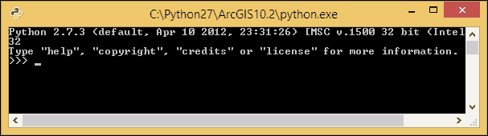
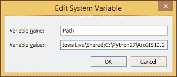
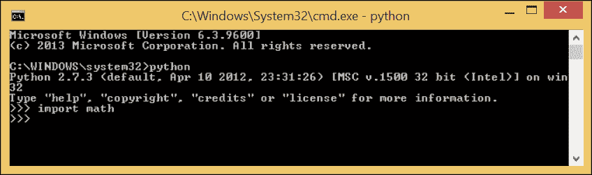
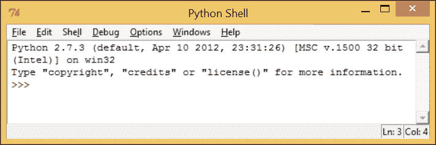
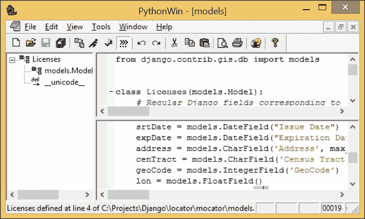
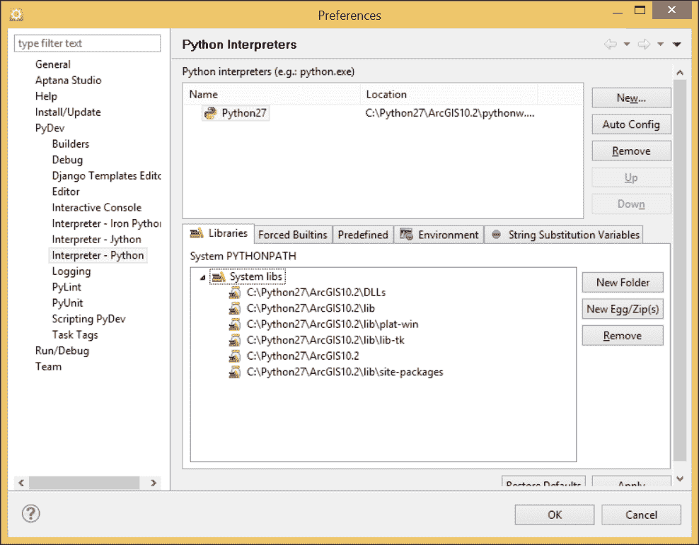
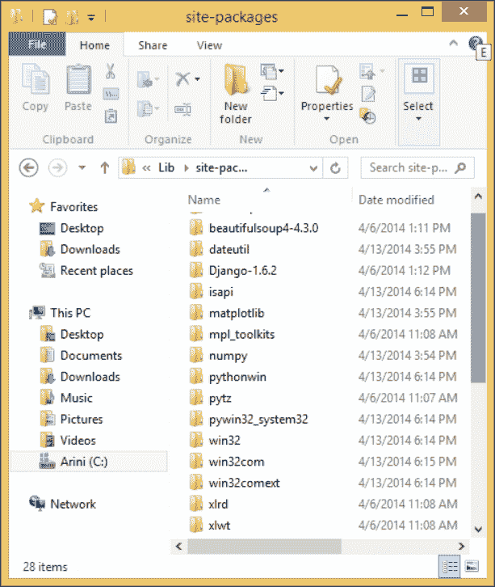

# 第二章：配置 Python 环境

在本章中，我们将配置 Python 和我们的计算机，以便它们协同工作以执行 Python 脚本。我们将配置路径变量和环境变量，以确保导入语句按预期工作，并且当点击脚本时能够运行。我们将讨论 Python 文件夹的结构，以及 ArcPy 模块在 ArcGIS 文件夹结构中的位置。我们还将讨论 **集成开发环境**（**IDEs**），这些程序旨在协助代码的创建和执行，并比较和对比现有的 IDE，以确定每个 IDE 在编写 Python 脚本时可以提供哪些好处。

本章将涵盖：

+   Python 解释器的位置以及如何调用它来执行脚本

+   调整计算机的环境变量以确保正确执行代码

+   集成开发环境

+   Python 的文件夹结构，重点关注模块存储的位置

# 什么是 Python 脚本？

让我们从编写和执行 Python 脚本的基础开始。什么是 Python 脚本？它是一个包含一系列按顺序编写的、用正式化语言编写的命令的简单文本文件。该文本文件的扩展名为 `.py`，但除此之外，它与其他文本文件没有区别。它可以使用记事本或 Wordpad 等文本编辑器打开，但 Python 的魔力并不在于 Python 脚本中。没有 Python 解释器，Python 脚本无法运行，其中的命令也无法执行。

## Python 如何执行脚本

理解 Python 如何解释脚本并执行其中的命令，与理解 Python 语言本身一样重要。通过花时间正确设置 Python，可以避免数小时的调试和错误检查。Python 的解释性意味着脚本必须首先转换为字节码，然后才能执行。我们将介绍 Python 实现自动化 GIS 分析目标所采取的步骤。

# 什么是 Python 解释器？

在 Windows 环境下，Python 解释器是一个编译成 Windows 可执行文件的程序，其扩展名为 `.exe`。Python 解释器 `python.exe` 是用 C 语言编写的，这是一种较老且广泛使用的编程语言，其语法较为复杂。

用 C 语言编写的程序，最初也是作为文本文件编写的，必须通过编译器转换成可执行文件，编译器是一种将文本命令转换成机器码以创建可执行程序的专用程序。这是一个缓慢的过程，可能会使 C 语言编写简单程序变得费力。好处是产生的程序是独立程序，可以在没有任何依赖的情况下运行。另一方面，Python 快速解释和执行 Python 命令，这使得它成为一款优秀的脚本语言，但脚本必须通过解释器运行，不能单独执行。

如其名称所暗示的，Python 解释器解释 Python 脚本中包含的命令。当运行或执行 Python 脚本时，首先检查其语法以确保它符合 Python 的规则（例如，遵循缩进规则，变量遵循命名约定）。然后，如果脚本有效，其中的命令会被转换成字节码，这是一种由字节码解释器执行的专用代码，字节码解释器是一个用 C 语言编写的虚拟机。字节码解释器进一步将字节码（包含在以`.pyc`扩展名结尾的文件中）转换成用于计算机的正确机器码，然后 CPU 执行脚本。这是一个复杂的过程，使得 Python 能够保持其简单的外观。

还有一些 Python 解释器的版本是用 Java 编写的（称为 Jython）和用.NET 编写的（称为 IronPython）；这些变体用于在其他计算环境中编写 Python 脚本，本书将不会涉及这些内容。ArcGIS 安装程序包括 Python 的标准实现，也称为 CPython，以区分这些变体。

## Python 解释器的位置在哪里？

在计算机文件夹结构中 Python 解释器的位置是一个需要掌握的重要细节。Python 通常直接从[www.python.org](http://www.python.org)下载并独立于 ArcGIS 安装。然而，每个 ArcGIS 版本都需要特定版本的 Python；考虑到这一要求，将 Python 包含在 ArcGIS 安装包中是有帮助的。对于本书，我们将使用 ArcGIS 10.2，这将需要 Python 2.7。

在 Windows 机器上，Python 文件夹结构直接放置在 C:驱动器上，除非它被明确加载到其他驱动器上。ArcGIS 10.2 的安装过程将在`C:\Python27`创建一个文件夹，该文件夹将包含一个名为`ArcGIS10.2`或`ArcGIS10.2x64`的文件夹，具体取决于操作系统和已安装的 ArcGIS 版本。对于本书，我将使用 32 位版本的 ArcGIS，因此最终的文件夹路径将是`C:\Python27\ArcGIS10.2`。

在此文件夹中包含多个子文件夹，以及 `python.exe`（Python 解释器）。还包括解释器的第二个版本，称为 `pythonw.exe`。`pythonw.exe` 将在没有终端窗口且程序反馈出现的情况下执行脚本。`python.exe` 和 `pythonw.exe` 都包含所有 Python 命令的完整副本，可以用来执行脚本。

## 应使用哪个 Python 解释器？

使用 Python 解释器直接执行脚本的通用规则是使用 `pythonw.exe`，因为没有终端窗口会出现。当需要测试代码片段或需要在终端窗口中查看输出时，通过双击可执行文件来启动 `python.exe`。

当 `python.exe` 启动时，将出现一个 Python 解释器控制台：



注意在版本信息说明下方出现的独特的三个箭头（**>>>**）。这是 Python 提示符，在这里输入代码逐行执行，而不是在一个完整的脚本中执行。这种直接访问解释器的方法对于测试代码片段和理解语法非常有用。自 ArcGIS 10 以来，这种解释器版本，即 Python 窗口，已被集成到 ArcMap 和 ArcCatalog 中。这将在后面的章节中进一步讨论。

## 计算机是如何知道解释器位置的？

要能够直接执行 Python 脚本（即通过双击脚本使其运行），计算机还需要知道解释器在其文件夹结构中的位置。要完成此操作，需要管理员账户访问权限和对 Windows 如何搜索程序的高级知识。我们必须在高级系统设置对话框中调整一个环境变量，以将解释器注册到系统路径中。

在 Windows 7 机器上，点击开始菜单，然后右键单击 **计算机**，从菜单中选择 **属性**。在 Windows 8 机器上，点击 **Windows 资源管理器**，然后右键单击 **此电脑**，并从菜单中选择 **属性**。这些命令是获取 **控制面板的系统** 和 **安全/系统** 菜单的快捷方式。从左侧面板中选择 **高级系统** **设置**。点击出现在 **系统属性** 菜单底部的 **环境变量** 按钮。在 **环境变量** 菜单的下半部分，滚动通过 **系统变量** 窗口，直到出现 **Path** 变量。通过单击它，然后单击 **编辑** 按钮来选择它。以下窗口将出现：



此变量有两个组成部分：**变量名**（路径）和**变量值**。变量值是一系列用分号分隔的文件夹路径。这是当 Windows 查找与文件扩展名关联的特定可执行文件时搜索的路径。在我们的情况下，我们将添加包含 Python 解释器的文件夹路径。将`C:\Python27\ArcGIS10.2`（或您机器上的等效路径）输入到**变量值**字段中，确保用分号将其与之前的值分开。点击**确定**退出**编辑**对话框，然后点击**确定**退出**环境变量**菜单，最后点击**确定**退出**系统属性**菜单。现在，计算机将知道 Python 解释器的位置，因为它将搜索 Path 变量中包含的所有文件夹以查找名为 Python 的可执行文件。为了测试路径调整是否正确，打开命令窗口（开始菜单/运行`cmd`），然后输入`python`。解释器应该直接在命令窗口中运行：



如果出现带有版本信息和三重箭头的 Python 头文件，则路径调整已正确完成。

### 注意

如果没有管理员访问权限，有一个解决方案。在命令行窗口中，传递 Python 解释器的完整路径（`C:\Python27\ArcGIS10.2\python.exe`）以启动解释器。

# 点击时使 Python 脚本可执行

要使脚本在双击时运行（这也意味着它们可以在 ArcGIS 环境之外运行，从而节省大量内存开销），最后一步是将具有`.py`扩展名的文件与 Python 解释器关联起来。如果脚本尚未与解释器关联，它们将显示为未知类型的文件或文本文件。

要更改此设置，右键单击一个**Python**脚本。选择**打开方式**，然后选择**选择默认程序**。如果`python.exe`或`pythonw.exe`没有作为选项出现，导航到包含它们的文件夹（在这种情况下为`C:\Python27\ArcGIS10.2`）并选择`python.exe`或`pythonw.exe`。再次强调，两者之间的区别在于使用`python.exe`运行脚本时会出现终端窗口，该窗口将包含脚本的任何输出（但脚本完成后此窗口将消失）。我建议在执行脚本时使用`pythonw.exe`，在测试代码时使用`python.exe`。

### 注意

Python 脚本也可以通过将扩展名调整为`.pyw`而不是`.py`来显式调用`pythonw.exe`。

# 集成开发环境（IDE）

Python 解释器包含执行 Python 脚本或通过交互与 Python 解释器进行交互以测试 Python 代码所需的一切。然而，编写脚本需要文本编辑器。通常，Windows 机器上至少包含两个简单的文本编辑器（记事本和写字板），它们可以在紧急情况下编辑脚本，甚至编写整个脚本。不幸的是，它们非常简单，不允许用户执行使编写多个脚本或非常长的脚本更容易的功能。

为了弥合这一差距，一系列被称为集成开发环境（IDE）的程序被开发出来。所有编程语言都有 IDE，包括变量列表、代码辅助等功能，使它们非常适合编写编程脚本。我们将回顾其中的一些，以评估它们在编写 Python 脚本方面的有用性。以下讨论的三个都是免费的，并在不同的 Python 社区中建立了良好的声誉。

## IDLE

当 Python 安装时，它包含一个 IDE。这个 IDE 被称为 IDLE，这个名字是对 IDE 和 Monty Python 的一位杰出成员埃里克·艾德尔（Eric Idle）名字的双关语。在 Windows 7 中，可以通过转到开始菜单并找到 **程序** 菜单中的 ArcGIS 文件夹来启动它。在 `Python` 文件夹中，IDLE 将是该文件夹中的一个选项。选择它以启动 **IDLE**。



IDLE 包含一个交互式解释器（即三重箭头）和运行完整 Python 脚本的能力。它还使用 Python 内置的 GUI 模块 **Tkinter** 编写，因此它具有使用执行同一语言的优势。

使用 IDLE 而不是 Python 控制台（`python.exe`）的另一个优点是，任何打印语句或其他脚本输出都会被定向到 IDLE 交互窗口，该窗口在执行脚本后不会消失。与内存使用相比，IDLE 也非常轻量。脚本通过 **文件** 菜单中的文件对话框打开，最近运行的脚本列在 **文件** 菜单的 **最近文件** 中。

IDLE 的缺点包括有限的代码辅助（或代码自动完成），这是一个有用的 IDE 工具，以及没有方法将脚本组织成逻辑项目。无法找到脚本中包含的所有变量，这是其他 IDE 的另一个有用功能。此外，**最近文件**菜单对列出的脚本数量有限制，这使得找到几个月未运行的脚本变得更加困难（相信我，这是常见的情况！）如果机器上无法安装其他程序，IDLE 是一个可用的 IDE。它也非常适用于快速测试代码片段。虽然它不是我的主要 IDE，但我发现自己几乎每天都在使用 IDLE。

## PythonWin

PythonWin（即 Python for Windows）可在[`sourceforge.net/projects/pywin32/files/pywin32`](http://sourceforge.net/projects/pywin32/files/pywin32)找到，并包括用于在 Windows 环境中使用 Python 的 IDE 和有用的模块。选择**PythonWin**的最新构建版本，然后根据已安装的 Python 版本选择正确的 32 位模块（对于我的机器，我选择了`pywin32-218.win32-py2.7.exe`，这是我的 32 位 Python 2.7 安装的正确版本）。运行可执行文件，如果已下载正确版本，安装 GUI 将识别系统注册表中的 Python 2.7 并自动安装。

PythonWin 包括一个交互式窗口，用户可以直接与 Python 解释器交互。脚本也可以在 PythonWin 中打开，它包括 Windows 菜单中的一组平铺命令，允许用户组织所有打开的脚本和交互式窗口的显示。

PythonWin 相较于 IDLE 的另一个优点是能够在同一脚本窗口中显示脚本的各个部分。如果一个脚本变得过长，在编辑时上下滚动脚本可能会很麻烦。PythonWin 允许用户从脚本顶部下拉以创建第二个脚本窗口，该窗口可以专注于脚本的另一部分。此外，在左侧还可以打开另一个窗口，该窗口将列出 Python 类和变量，这使得导航到脚本特定部分变得更加容易。



PythonWin 的交互式窗口中集成了一个小巧但实用的功能，即能够搜索之前输入的代码语句。在三个箭头提示符下，按住*Ctrl*键，使用上下箭头键在行之间导航，以找到感兴趣的行。这在测试特定代码片段时可以节省大量时间。

总的来说，PythonWin 是一个有用且易于使用的 IDE，大多数创建 Python 脚本的 ArcGIS 专业人士都使用 PythonWin。我发现 PythonWin 的缺点包括无法将脚本组织到项目中，以及缺少脚本中存在的变量列表，这在导航大型脚本时非常有帮助。

## Aptana Studio 3

有时，大型编程社区的工具有时会令新脚本编写者感到畏惧，他们更关注于简单地创建一个可以节省 GIS 分析时间的脚本，而不是使用正确的编程工具。这让我想起了不熟练的计算机用户，他们觉得自己不需要顶级的计算机，因为他们只想浏览互联网和发送电子邮件。

然而，事实正好相反：对计算机不熟悉的用户使用易于使用的顶级计算机会更好，而经验丰富的计算机用户可以用上网本来满足需求。

对于程序员和脚本编写者来说，也是如此。有时，拥有一个功能强大的 IDE 会更有效，它实际上会使脚本编写者更有效率，而经验丰富的程序员可能只需要记事本。Aptana Studio 3 等 IDE 中包含的所有功能都会节省脚本编写者的时间，并且学习起来所需的时间非常少。

Aptana Studio 3 可在 [`aptana.com`](http://aptana.com) 获取。下载并运行提供的安装程序来安装它。选择一个默认的主项目文件夹，该文件夹可以包含所有脚本项目；为此书，我创建了一个名为`C:\Projects`的文件夹。对于创建的每个项目，Aptana 将创建一个包含每个项目信息的项目文件。在工作时使用 Aptana Studio，使用网络文件夹可能很有用，因为其他人可以使用他们各自的 Aptana 安装访问项目。

安装完成后，下一步是创建一个`PyDev`项目。转到**文件**菜单，选择**新建**，然后选择**PyDev**项目。在创建第一个项目时，必须将 Python 解释器添加到 Aptana 的 Python 路径中。Aptana 可以支持多个解释器；就我们的目的而言，一个就足够了。转到 PyDev 项目菜单底部，点击**点击此处**来配置一个解释器。当出现**首选项/Python 解释器**菜单时，请确保在左侧选择**解释器-Python**，然后在右上角的菜单中点击**新建**。



选择**新建**后，将出现一个小的对话框，要求输入解释器的名称和可执行文件的路径。点击**浏览**并导航到包含`python.exe`的文件夹。使用 Aptana Studio 运行 Python 脚本时不会生成终端窗口，因为所有输出都重定向到 Aptana Studio 控制台。选择`python.exe`并点击**确定**。接下来，在**选择解释器**菜单中点击**确定**，然后在**首选项**菜单中点击**确定**。回到**PyDev 项目**菜单，为项目命名，并使用默认的工作区位置或自定义位置（例如，`C:\Projects`）。

所有这些配置只需进行一次；一旦完成，创建一个**PyDev**项目就只需要提供一个名称和位置。现在，与该项目相关的所有脚本都将始终列在左侧菜单中（**PyDev 包资源管理器**），这是一种非常强大的组织和脚本项目的方法。

确保 Aptana Studio 处于 PyDev 视角（在**Windows/打开视角/其他**菜单中，选择**PyDev**）将提供三个主要窗口–左侧的**包资源管理器**，中间的**脚本窗口**，以及右侧的**大纲窗口**，其中列出了脚本中包含的变量。点击右侧的任何一个变量，将脚本窗口移动到代码的该部分，使脚本导航变得快速。此外，我习惯在脚本窗口下方中间添加控制台窗口，以便显示脚本的输出。

打开的脚本在脚本窗口中都有一个标签，这使得在脚本之间切换变得容易。此外，根据需要，窗口可以被关闭，以给脚本窗口腾出更多空间。将鼠标悬停在脚本中的变量上，将弹出一个菜单，描述变量首次创建的位置，这在某些时候可以救命，因为有时很容易忘记哪个变量是哪个（除非，当然，它们根据前一章中描述的规则被清楚地命名；即使如此，有时也会很痛苦）。

## IDE 概述

有许多其他 IDE，包括商业和免费的，都可用于 Python 编码。最终，每个 GIS 分析师都必须选择使他们感到高效和舒适的工具。随着编程成为他们日常工作流程中更大的一部分，这可能会改变。务必尝试几个不同的 IDE，以找到易于使用且直观的 IDE。

# Python 文件夹结构

Python 的文件夹结构不仅包含 Python 解释器。在子文件夹中驻留了许多重要的脚本、数字链接库，甚至 C 语言模块。并非所有脚本都始终使用，但每个脚本都在使 Python 编程环境成为可能中扮演着角色。最重要的文件夹是**site-packages**文件夹，其中包含大多数将在 Python 脚本中导入的模块。



## 模块所在位置

在每个 Python 文件夹中都有一个名为`Lib`的文件夹，在该文件夹中有一个名为`site-packages`的文件夹。在我的机器上，该文件夹位于`C:\Python27\ArcGIS10.2\Lib\site-packages.`几乎所有的第三方模块都被复制到这个文件夹中，以便按需导入。对于我们来说，这个规则的主要例外是 ArcPy 模块，它存储在`Program Files`文件夹中的`ArcGIS`文件夹内（例如，`C:\Program Files (x86)\ArcGIS\Desktop10.2\arcpy`）。为了实现这一点，ArcGIS 安装程序调整了 Python 系统路径（使用 sys 模块），以便 arcPy 模块可导入。

## 使用 Python 的 sys 模块添加模块

Python 的 sys 模块是一个允许用户利用 Python 解释器内建的系统工具的模块。sys 模块中最有用的函数之一是 `sys.path`。它是一个文件路径列表，用户可以修改它以调整 Python 查找导入模块的位置，而无需管理员访问权限。

当 ArcGIS 10.2 安装程序安装 Python 2.7 时，安装程序利用 `sys.path` 函数将 `C:\Program Files (x86)\ArcGIS\Desktop10.2\arcpy` 添加到系统路径。为了测试这一点，启动 Python 解释器或 IDE，并输入以下内容：

```py
>>> import sys
>>> print sys.path

```

输出如下：

```py
['', 'C:\\WINDOWS\\SYSTEM32\\python27.zip', 'C:\\Python27\\ArcGIS10.2\\Dlls', 'C:\\Python27\\ArcGIS10.2\\lib', 'C:\\Python27\\ArcGIS10.2\\lib\\plat-win', 'C:\\Python27\\ArcGIS10.2\\lib\\lib-tk', 'C:\\Python27\\ArcGIS10.2\\Lib\\site-packages\\pythonwin', 'C:\\Python27\\ArcGIS10.2', 'C:\\Python27\\ArcGIS10.2\\lib\\site-packages', 'C:\\Program Files (x86)\\ArcGIS\\Desktop10.2\\bin', 'C:\\Program Files (x86)\\ArcGIS\\Desktop10.2\\arcpy', 'C:\\Program Files (x86)\\ArcGIS\\Desktop10.2\\ArcToolbox\\Scripts', 'C:\\Python27\\ArcGIS10.2\\lib\\site-packages\\win32', 'C:\\Python27\\ArcGIS10.2\\lib\\site-packages\\win32\\lib']

```

系统路径（存储在变量 `sys.path` 中）包括 ArcPy 所需的全部文件夹，以自动化 ArcGIS。系统路径包含 PYTHONPATH 环境变量中列出的所有目录（如果已创建）；这不同于之前讨论的 Windows 路径环境变量。这两个独立的路径变量协同工作，以帮助 Python 定位模块。

# `sys.path.append()` 方法

`sys.path` 函数是一个列表（你注意到前面代码输出中的方括号了吗？）因此可以添加或扩展以包含指向用户想要导入的模块的新文件路径。为了避免调整 `sys.path` 的需要，将模块复制到 site-packages 文件夹中。当这不可能时，使用 `sys.path.append()` 方法代替：

```py
>>> sys.path.append("C:\\Projects\\Requests")
>>> sys.path
['', 'C:\\WINDOWS\\SYSTEM32\\python27.zip',
 'C:\\Python27\\ArcGIS10.2\\Dells',
 'C:\\Python27\\ArcGIS10.2\\lib',
..'C:\\Python27\\ArcGIS10.2\\lib\\plat-win',
..'C:\\Python27\\ArcGIS10.2\\lib\\lib-tk',
..'C:\\Python27\\ArcGIS10.2\\Lib\\site-packages\\pythonwin',
..'C:\\Python27\\ArcGIS10.2', ..'C:\\Python27\\ArcGIS10.2\\lib\\site-packages', 'C:\\Program
..Files (x86)\\ArcGIS\\Desktop10.2\\bin', 'C:\\Program Files
..(x86)\\ArcGIS\\Desktop10.2\\arcpy', 'C:\\Program Files
..(x86)\\ArcGIS\\Desktop10.2\\ArcToolbox\\Scripts',
..'C:\\Python27\\ArcGIS10.2\\lib\\site-packages\\win32',
..'C:\\Python27\\ArcGIS10.2\\lib\\site-packages\\win32\\lib',
..'C:\\Projects\\Requests']

```

当使用 `sys.path.append()` 方法时，调整是临时的。在 **Windows 系统属性** 菜单中调整 PYTHONPATH 环境变量（在路径环境变量部分讨论过）以进行永久更改（如果尚未创建，则创建 PYTHONPATH）。

最后一点是，为了在不调整系统路径或复制模块到 site-packages 文件夹的情况下导入模块，请将模块放置在包含导入脚本的文件夹中。只要模块配置正确，它就会正常工作。这在没有对机器的行政访问权限时非常有用。

# 摘要

在本章中，我们介绍了大量关于 Python 如何执行脚本和命令的知识，以及用于编写脚本的开发环境。特别是，我们讨论了 Python 脚本是如何被 Python 解释器读取和执行的，Python 解释器位于 Python 文件夹结构中的位置，以及不同的 Python 脚本扩展名（`.py`、`.pyc`、`.pyw`）分别代表什么。我们还介绍了集成开发环境以及它们之间的比较和对比。

在下一章中，我们将介绍如何使用 ModelBuilder 将建模分析转换为 Python 脚本，以及如何使其比导出版本更强大。
