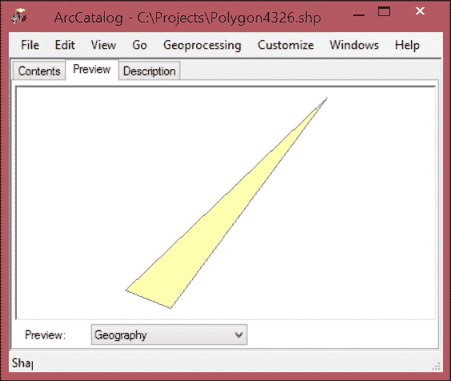
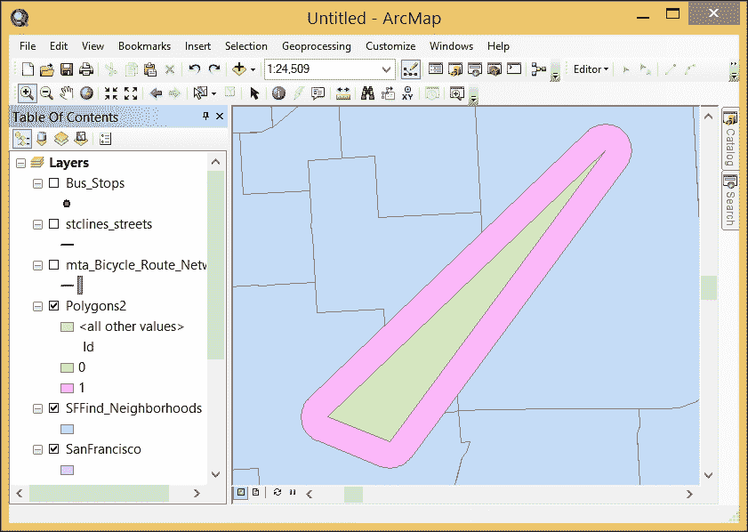

# 第六章：使用 ArcPy 几何对象

地理空间分析的本质是使用几何形状——点、线和多边形——来模拟现实世界对象及其基于位置的关系。简单的形状及其位置、长度和面积等几何属性通过地理空间操作进行处理，以生成分析结果。正是模型化地理数据和相关的属性信息将地理信息系统与其他所有信息系统区分开来。

在 ArcPy 之前，使用地理空间操作处理要素类几何主要依赖于 ArcToolbox 中的预建工具。ArcPy 使得直接访问存储在要素类形状字段中的数学表示的几何形状成为可能。一旦访问，这些几何数据就被加载到 ArcPy 几何对象中，以便在 ArcPy 脚本中进行分析。正因为这一进步，编写访问几何字段并使用它们进行分析的脚本已经改变了 ArcGIS 的地理空间分析。在本章中，我们将探讨如何生成和使用 ArcPy 几何对象来执行地理空间操作，并将它们应用于公交车站分析。

在本章中，我们将介绍：`Point`和`Array`构造函数对象以及`PointGeometry`、`Polyline`和`Polygon`几何对象

+   如何使用几何对象执行地理空间操作

+   如何将几何对象集成到脚本中

+   如何使用几何对象执行常见的地理空间操作

+   如何在脚本中使用几何对象方法替换 ArcToolbox 工具的使用

# ArcPy 几何对象类

在设计几何对象时，ArcPy 的作者使得在内存中执行地理空间操作成为可能，减少了使用 ArcToolbox 中工具进行这些操作的需求。这将导致速度提升，因为在分析的每一步中都不需要将计算结果写入磁盘。相反，步骤的结果可以在脚本中的函数之间传递。分析的最后结果可以写入硬盘上的要素类，或者可以写入电子表格或传递给另一个程序。

几何对象被编写为 Python 类——包含内部函数的特殊代码块。内部函数是几何对象的方法和属性；当被调用时，它们允许对象执行操作（方法）或揭示有关几何对象的信息（属性）。Python 类使用一个包含共享方法和属性的父类编写，以及引用父类但还具有特定方法和不共享属性的子类。在这里，父类是 ArcPy 的`Geometry`对象，而子类是`PointGeometry`、`Multipoint`、`Polyline`和`Polygon`对象。

几何对象可以通过三种方式生成。第一种方法需要使用数据游标来读取现有的要素类，并传递一个特殊的关键字作为字段名。游标返回的形状数据是一个几何对象。第二种方法是通过将原始坐标传递给构造函数对象（无论是`Point`还是`Array`对象）来创建新数据，然后将其传递给几何对象。第三种方法是通过使用 ArcToolbox 中的复制要素工具从要素类中读取数据。

每个几何对象都有允许进行读取访问和写入访问的方法。读取访问方法对于访问构成点、线和多边形的坐标点是重要的。写入访问方法在生成新的数据对象时很重要，这些对象可以进行分析或写入磁盘。

`PointGeometry`、`Multipoint`、`Polyline`和`Polygon`几何对象用于对其各自的几何类型进行分析。通用几何对象可以接受任何几何类型，并在不需要区分几何类型时执行地理空间操作。

将使用两个其他 ArcPy 类在内存中执行地理空间操作：`Array`对象和`Point`对象。它们是构造函数对象，因为它们不是从几何类派生的子类，而是用于构建几何对象。`Point`对象用于从原始坐标创建坐标点。`Array`对象是一系列坐标点，可以传递给`Polyline`或`Polygon`对象，因为普通的 Python 列表中的 ArcPy `Point`对象不能用来生成这些几何对象。

## ArcPy `Point`对象

`Point`对象是用于生成几何对象的基本构建块。此外，所有几何对象在读取访问方法时都将返回组件坐标作为`Point`对象。`Point`对象允许通过其*X*、*Y*和*Z*属性进行简单的几何访问，以及有限数量的地理空间方法，例如`contains`、`overlaps`、`within`、`touches`、`crosses`、`equals`和`disjoint`。让我们使用 IDLE 来探索一些这些方法，使用具有相同坐标的两个`Point`几何对象：

```py
>>> Point = arcpy.Point(4,5)
>>> point1  = arcpy.Point(4,5)
>>> Point.equals(point1)
True
>>> Point.contains(point1)
True
>>> Point. crosses(point1)
False
>>> Point.overlaps(point1)
False
>>> Point.disjoint(point1)
False
>>> Point.within(point1)
True
>>> point.X, Point.Y
(4.0, 5.0)

```

在这些示例中，我们可以看到`Point`对象的一些特性。对于具有相同坐标的两个点，`equals`方法和`disjoint`方法的结果符合预期。当两个对象不共享坐标时，`disjoint`方法将返回`True`，而`equals`方法则相反。`contains`方法将适用于两个`Point`对象并返回`True`。`crosses`方法和`overlaps`方法的结果有些令人惊讶，因为两个`Point`对象在位置上确实重叠，并且可以被认为是交叉的；然而，这些方法并没有返回预期的结果，因为它们并不是用来比较两个点的。

## ArcPy `Array`对象

在我们继续学习`Polyline`和`Polygon`对象之前，我们需要了解 ArcPy 的`Array`对象。它是`Point`对象和需要多个坐标点的几何对象之间的桥梁。`Array`对象接受`Point`对象作为参数，而`Array`对象反过来又作为参数传递给要创建的几何对象。让我们使用`Point`对象和`Array`对象一起，更好地理解它们是如何协同工作的。

`Array`对象类似于 Python 列表，具有`extend`、`append`和`replace`方法，并且还具有独特的`add`和`clone`方法。`add`方法将用于单独添加`Point`对象：

```py
>>> Point = arcpy.Point(4,5)
>>> point1  = arcpy.Point(7,9)
>>> Array = arcpy.Array()
>>> Array.add(point)
>>> Array.add(point1)

```

`extend()`方法会一次性添加一个`Point`对象的列表：

```py
>>> Point = arcpy.Point(4,5)
>>> point1 = arcpy.Point(7,9)
>>> pList = [Point,point1]
>>> Array = arcpy.Array()
>>> Array.extend(pList)

```

`insert`方法将在 Array 中的特定索引处放置一个`Point`对象，而`replace`方法通过传递索引和一个新的`Point`对象来替换 Array 中的`Point`对象：

```py
>>> Point  = arcpy.Point(4,5)
>>> point1  = arcpy.Point(7,9)
>>> point2  = arcpy.Point(11,13)
>>> pList = [Point,point1]
>>> Array = arcpy.Array()
 >>> Array.extend(pList)
>>> Array.replace(1,point2)
>>> point3  = arcpy.Point(17,15)
>>> Array.insert(2,point3)

```

当`Array`对象加载了`Point`对象后，可以用来生成其他几何对象。

## ArcPy Polyline 对象

`Polyline`对象是由至少包含两个`Point`对象的`Array`对象生成的。如下面的 IDLE 示例所示，一旦生成了`Array`对象并加载了`Point`对象，它就可以作为参数传递给`Polyline`对象：

```py
>>> Point  = arcpy.Point(4,5)
>>> point1  = arcpy.Point(7,9)
>>> pList = [Point,point1]
>>> Array = arcpy.Array()

>>> Array.extend(pList)
>>> pLine = arcpy.Polyline(Array)

```

现在 Polyline 对象已经创建，我们可以访问其方法。这包括揭示多段线中的构成坐标点和其他相关信息的方法：

```py
>>> pLine.firstPoint
<Point (4.0, 5.0, #, #)>
>>> pLine.lastPoint
<Point (7.0, 9.0, #, #)>
pLine.getPart()
<Array [<Array [<Point (4.0, 5.0, #, #)>, <Point (7.0, 9.0, #, #)>]>]>
>>> pLine.trueCentroid
<Point (5.5, 7.0, #, #)>
>>> pLine.length
5.0
>>> pLine.pointCount
2

```

这个示例`Polyline`对象尚未分配空间参考系统，因此长度是无单位的。当一个几何对象确实有空间参考系统时，线性单位和面积单位将以系统的线性单位返回。

`Polyline`对象也是我们第一个可以调用执行地理空间操作（如缓冲区、距离分析和裁剪）的几何对象：

```py
>>> bufferOfLine = pLine.buffer(10)
>>> bufferOfLine.area
413.93744395
>>> bufferOfLine.contains(pLine)
True
>>> newPoint = arcpy.Point(25,19)
>>> pLine.distanceTo(newPoint)
20.591260281974

```

`Polyline`对象的另一个有用方法是`positionAlongLine`方法。它用于在特定位置返回一个`PointGeometry`对象，如下文所述。这个位置可以是沿线的数值距离，也可以是百分比（以 0-1 之间的浮点数表示），当使用可选的第二个参数时：

```py
>>> nPoint = pLine.positionAlongLine(3)
>>> nPoint.firstPoint.X, nPoint.firstPoint.Y
(5.8, 7.4)>>> pPoint = pLine.positionAlongLine(.5,True)
 >>> pPoint.firstPoint.X,pPoint.firstPoint.Y
(5.5, 7.0)

```

`Polyline`对象还有许多其他方法可用。更多信息请参阅：[`resources.arcgis.com/en/help/main/10.2/index.html#//018z00000008000000`](http://resources.arcgis.com/en/help/main/10.2/index.html#//018z00000008000000)

## ArcPy Polygon 对象

要创建一个 `Polygon` 对象，必须使用 `Array` 对象加载 `Point` 对象，然后将它作为参数传递给 `Polygon` 对象。一旦生成了 `Polygon` 对象，它所拥有的方法对于执行地理空间操作非常有用。几何对象也可以使用 ArcToolbox 的 `CopyFeatures` 工具保存到磁盘。以下 IDLE 示例演示了如何通过将 `Polygon` 对象和原始字符串文件名传递给工具来生成 `shapefile`：

```py
>>> import arcpy
>>> point1 = arcpy.Point(12,16)
>>> point2 = arcpy.Point(14, 18)
>>> point3 = arcpy.Point(11, 20)
>>> Array = arcpy.Array()
>>> Points = [point1,point2,point3]
>>> Array.extend(points)
>>> Polygon = arcpy.Polygon(array)
>>> arcpy.CopyFeatures_management(polygon, r'C:\Projects\Polygon.shp')
<Result 'C:\\Projects\\Polygon.shp'>
```

### Polygon 对象缓冲区

`Polygon` 对象，就像 `Polyline` 对象一样，拥有使执行地理空间操作（如缓冲区）变得容易的方法。通过将一个数字传递给缓冲区方法作为参数，可以在内存中生成一个缓冲区。数字的单位由 `SpatialReference` 系统确定。可以通过提供负缓冲区数字来生成内部缓冲区；生成的缓冲区是 `Polygon` 对象内部在指定距离处的区域。裁剪、并集、对称差集以及更多操作都作为方法提供，还有在内部或包含操作；只要传递了 `SpatialReference` 系统对象作为参数，就可以使用 `Polygon` 对象方法执行投影。以下是一个脚本，它将创建两个具有两个不同的 `SpatialReference` 系统的 shapefile，每个系统由 EPSG 编码系统中的一个数字代码（2227 和 4326）标识：

```py
import arcpyPoint  = arcpy.Point(6004548.231,2099946.033)
point1  = arcpy.Point(6008673.935,2105522.068)
point2  = arcpy.Point(6003351.355,2100424.783)Array = arcpy.Array()
Array.add(point1)
Array.add(point)
array.add(point2)
Polygon = arcpy.Polygon(array, 2227)
buffPoly = Polygon.buffer(50)
features = [Polygon,buffPoly]
arcpy.CopyFeatures_management(features,
 r'C:\Projects\Polygons.shp')
spatialRef = arcpy.SpatialReference(4326)
polygon4326 = Polygon.projectAs(spatialRef)
arcpy.CopyFeatures_management(polygon4326,
 r'C:\Projects\polygon4326.shp')

```

下面是第二个 shapefile 在 **ArcCatalog** **预览**窗口中的样子：



### 其他 Polygon 对象方法

与 ArcToolbox 中的裁剪工具不同，该工具可以使用另一个多边形裁剪多边形，裁剪方法需要一个范围对象（另一个 ArcPy 类）并且仅限于裁剪区域周围的矩形边界。要从多边形中移除区域，可以使用差集方法，就像在 ArcToolbox 中的裁剪或擦除工具一样：

```py
buffPoly = Polygon.buffer(500)
donutHole =buffPoly.difference(Polygon)
features = [Polygon,donutHole]
arcpy.CopyFeatures_management(features,
                              r"C:\Projects\Polygons2.shp")
```

下面是缓冲区和差集操作类似甜甜圈孔的结果。具有甜甜圈孔的缓冲区包围了原始的 `Polygon` 对象：



## ArcPy 几何对象

通用几何对象对于在内存中创建特征类的几何形状的副本非常有用，而无需首先知道特征类包含哪种类型的几何形状。与所有 ArcPy 几何对象一样，它的读取方法包括以多种格式提取数据，如 JSON、WKT 和 WKB。每个几何形状的面积（如果它是多边形）、质心、范围和构成点也都可以使用，如前所述。

下面是使用 `CopyFeatures` 工具将特征类的几何形状读入内存的示例：

```py
import arcpy
cen2010 = r'C:\Projects\ArcPy.gdb\SanFrancisco\CensusBlocks2010'
blockPolys = arcpy.CopyFeatures_management(cen2010,
 arcpy.Geometry())

```

变量 `blockPolys` 是一个包含所有加载到其中的几何形状的 Python 列表；在这种情况下，它是人口普查区块。然后可以遍历该列表以进行分析。

## ArcPy PointGeometry 对象

`PointGeometry`对象在执行与`Point`对象不可用的相同地理空间操作时非常有用。当使用光标从具有`PointGeometry`类型的要素类中检索形状数据时，形状数据以`PointGeometry`对象的形式返回。当不使用光标从要素类中检索数据时，需要`Point`对象来构建所有其他几何对象，但执行点地理空间操作时使用的是`PointGeometry`对象。

让我们探索从数据访问模块`SearchCursor`获取`PointGeometry`对象，并使用返回的数据行创建缓冲点。在我们的公交车站分析中，这将取代使用 ArcToolbox 缓冲工具在每个车站周围创建 400 英尺缓冲区的需求。以下脚本使用字典收集缓冲区对象，然后使用另一个搜索光标搜索人口普查块。要使用`SearchCursor()`方法访问形状字段，将`SHAPE@`令牌作为其中一个字段传递。然后，脚本将遍历公交车站，找到与每个车站相交的所有人口普查块：

```py
# Generate 400 foot buffers around each bus stop
import arcpy,csv
busStops = r"C:\Projects\PacktDB.gdb\SanFrancisco\Bus_Stops"
censusBlocks2010 = r"C:\Projects\PacktDB.gdb\SanFrancisco\CensusBlocks2010"

sql = "NAME = '71 IB' AND BUS_SIGNAG = 'Ferry Plaza'"
dataDic = {}
with arcpy.da.SearchCursor(busStops, ['NAME','STOPID','SHAPE@'], sql) as cursor:
 for row in cursor:
 linename = row[0]
 stopid = row[1]
 shape = row[2]
 dataDic[stopid] = shape.buffer(400), linename

```

现在数据已经检索，并且使用`PointGeometry`对象的缓冲方法生成了缓冲区，可以使用迭代和搜索光标将缓冲区与人口普查块几何体进行比较。在此分析中，将使用两种地理空间方法：`overlap`和`intersect`。重叠方法是一个布尔运算，当比较两个几何体时返回 true 或 false。`intersect`方法用于获取相交的实际面积以及识别每个块的人口。使用`intersect`需要两个参数：第二个几何对象和一个整数，表示要返回的几何类型（1 为点，2 为线，4 为多边形）。我们希望返回的多边形相交面积具有相交面积和人口数据：

```py
# Intersect census blocks and bus stop buffers
processedDataDic = {} = {}
for stopid in dataDic.keys():
 values = dataDic[stopid]
 busStopBuffer = values[0]
 linename = values[1]
 blocksIntersected = []
 with arcpy.da.SearchCursor(censusBlocks2010, ['BLOCKID10','POP10','SHAPE@']) as cursor:
for row in cursor:
 block = row[2]
 population = row[1]
 blockid = row[0] 
 if busStopBuffer.overlaps(block) ==True:
 interPoly = busStopBuffer.intersect(block,4)
 data = row[0],row[1],interPoly, block
 blocksIntersected.append(data)
 processedDataDic[stopid] = values, blocksIntersected

```

此部分脚本遍历块并与缓冲的公交车站相交。现在我们可以识别接触每个车站周围缓冲区的块，并且感兴趣的数据已经收集到字典中，可以对其进行处理，并计算所有被缓冲区接触到的块的总体人口：

```py
# Create an average population for each bus stop
dataList = []
for stopid in processedDataDic.keys():
 allValues = processedDataDic[stopid]
 popValues = []
 blocksIntersected = allValues[1]
 for blocks in blocksIntersected:
 popValues.append(blocks[1])
 averagePop = sum(popValues)/len(popValues)
 busStopLine = allValues[0][1]
 busStopID = stopid
 finalData = busStopLine, busStopID, averagePop
 dataList.append(finalData)

```

现在数据已经创建并添加到列表中，可以使用我们在第四章中创建的`createCSV`模块将其输出到电子表格中，*复杂的 ArcPy 脚本和泛化函数*：

```py
# Generate a spreadsheet with the analysis results
def createCSV(data, csvname, mode ='ab'):
 with open(csvname, mode) as csvfile:
 csvwriter = csv.writer(csvfile, delimiter=',')
 csvwriter.writerow(data)

csvname = "C:\Projects\Output\StationPopulations.csv"
headers = 'Bus Line Name','Bus Stop ID', 'Average Population'
createCSV(headers, csvname, 'wb') 
for data in dataList:
 createCSV(data, csvname)

```

数据已经处理并写入电子表格。我们可以对数据进行的一个额外步骤是使用相交面积为每个缓冲区创建一个成比例的人口值。让我们重新处理数据以包括成比例的面积：

```py
dataList = []
for stopid in processedDataDic.keys():
 allValues = processedDataDic[stopid]
 popValues = []
 blocksIntersected = allValues[1]
 for blocks in blocksIntersected:
 pop = blocks[1]
 totalArea = blocks[-1].area
 interArea = blocks[-2].area
 finalPop = pop * (interArea/totalArea)
 popValues.append(finalPop)
 averagePop = round(sum(popValues)/len(popValues),2)
 busStopLine = allValues[0][1]
 busStopID = stopid
 finalData = busStopLine, busStopID, averagePop
 dataList.append(finalData)

```

现在，脚本正在充分利用 ArcPy 几何对象的力量，并且脚本完全在内存中运行，这避免了产生任何中间数据集。

# 摘要

在本章中，我们详细讨论了 ArcPy 几何对象的使用。这些多样化的对象具有相似的方法，实际上是从同一个 Python 类派生出来的子类。它们对于执行内存中的地理空间分析非常有用，这避免了从硬盘读取和写入数据，同时也跳过了创建任何中间数据。

ArcPy 几何对象将成为自动化地理空间工作流程的重要组成部分。将它们与搜索游标结合使用，使得 ArcPy 比任何早期的 ArcGIS Python 脚本工具实现都更有用。接下来，我们将原始脚本转换为可以直接从 ArcToolbox 或地理数据库中的个人工具箱中执行的脚本工具。
