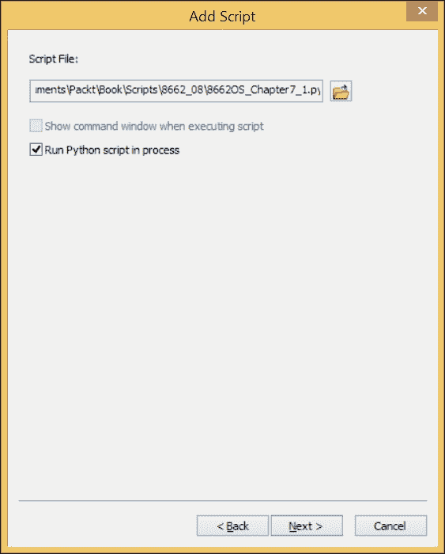

# 第七章：创建脚本工具

现在我们已经涵盖了创建和执行 ArcPy 脚本的基础，我们需要采取下一步，创建可重用的**脚本工具**。创建脚本工具将允许代码的重用性更高，并使为其他 GIS 分析师和客户创建自定义工具变得容易。通过 Python 脚本**后端**或代码和熟悉的 ArcGIS 工具**前端**或用户界面，代码的细节对用户来说是隐藏的；它变成了另一个工具，尽管是一个可以节省数天和数周工作的工具。

本章将涵盖以下主题：

+   向脚本添加参数以接受输入并按用户需求生成输出

+   创建自定义工具前端和自定义工具箱

+   将工具前端参数设置以允许其传递参数到代码后端

# 向脚本添加动态参数

我们在前几章中生成的脚本都使用了**硬编码**的输入。输入值以字符串或数字的形式写入脚本中，并分配给变量。虽然它们可以被手动更新以替换输入和输出文件路径以及 SQL 语句，但程序员应致力于创建每次使用时无需编辑的脚本。相反，脚本应设计为动态的，并接受文件路径和其他输入作为参数或参数，这与我们创建的函数接受参数的方式非常相似。

Python 的设计考虑了这一点，`sys`模块中有一个名为`sys.argv`的方法，它接受在脚本执行时传递给脚本的输入。虽然 ArcPy 及其前身`arcgisscripting 模块`的设计者在最初利用了`sys.argv`方法，但随着时间的推移，他们为接受脚本参数设计了 ArcPy 方法。由于在编写 ArcPy 脚本时可以使用这两种方法，并且两者都可在网络上的示例脚本中找到，因此识别`sys.argv`方法和`arcpy.GetParameterAsText()`之间的细微差别很重要。这两种方法的主要区别在于`sys.argv`将动态参数作为一个列表接受。列表的成员通过列表索引访问并分配给变量。`Arcpy.GetParameterAsText()`是一个接受索引号参数的函数。传递的索引号反映了参数在工具前端中的顺序；第一个参数是零，下一个是一，依此类推。

### 注意

如果在工具前端调整了参数的顺序，这种调整必须在代码后端得到反映。

## 使用 arcpy.AddMessage 显示脚本消息

从脚本中获取反馈以评估脚本在执行分析时的进度非常重要。尽管这看起来很简单，但 Python 脚本和编程语言通常默认不提供任何反馈，除了错误和脚本的终止。这对新手程序员来说可能有点令人沮丧，因为所有内置的反馈都是负面的。

为了缓解这种缺乏反馈的情况，使用打印语句可以让脚本在运行时报告分析进度。然而，当使用脚本工具时，`print` 语句没有任何效果。它们不会在任何地方显示，并且被 Python 可执行文件忽略。要在执行脚本工具时在脚本控制台中显示消息，ArcPy 有一个 `arcpy.AddMessage()` 方法。

`Arcpy.AddMessage` 语句被添加到脚本中，以便程序员需要反馈的地方。所需的反馈作为参数传递给方法并显示；无论是列表、字符串、浮点数还是整数。`Arcpy.AddMessage` 使得检查分析计算的结果变得容易，以确保使用了正确的输入并产生了正确的输出。由于脚本中的这种反馈可以是强大的调试工具，因此每当需要从脚本工具获取反馈时，都应使用 `arcpy.AddMessage`。

### 注意

注意，传递给 `arcpy.AddMessage` 的语句仅在脚本作为脚本工具运行时才会显示。

## 向脚本添加动态组件

要开始将脚本转换为脚本工具，我们应首先将我们在 第六章 中创建的脚本 *使用 ArcPy 几何对象* `Chapter6_1.py` 复制到名为 `Chapter7` 的新文件夹中，并将其重命名为 `Chapter7_1.py`。然后，我们可以开始使用 `arcpy.GetParameterAsText` 替换硬编码的变量为动态变量。还有一个名为 `GetParameter` 的 ArcPy 方法，它接受对象作为输入，但就我们的目的而言，`GetParameterAsText` 是要使用的方法。

通过将 `arcpy`.`GetParameterAsText` 和 `arcpy.AddMessage` 添加到脚本中，我们将迈出创建脚本工具的第一步。必须小心确保从动态参数创建的变量顺序正确，因为重新排序可能会很耗时。一旦将参数添加到脚本中，并将脚本的硬编码部分替换为变量，脚本就准备好成为脚本工具了。

首先，将所有硬编码的变量移动到脚本的顶部。然后，将所有分配的值替换为 `arcpy.GetParameterAsText`，使它们成为动态值。每个参数都使用零基索引进行引用；然而，它们是单独传递给函数的，而不是作为列表的成员：

```py
#Chapter 7.py
import arcpy, csv
busStops = arcpy.GetParameterAsText(0)
censusBlocks2010 = arcpy.GetParameterAsText(1)
censusBlockField = arcpy.GetParameterAsText(2)
csvname = arcpy.GetParameterAsText(3)
headers = arcpy.GetParameterAsText(4).split(',')
sql = arcpy.GetParameterAsText(5)
keyfields = arcpy.GetParameterAsText(6).split(';')
dataDic = {}

censusFields = ['BLOCKID10',censusBlockField, 'SHAPE@']
if "SHAPE@" not in keyfields:
 keyfields.append("SHAPE@")

arcpy.AddMessage(busStops)
arcpy.AddMessage(censusBlocks2010)
arcpy.AddMessage(censusBlockField)
arcpy.AddMessage(csvname)
arcpy.AddMessage(sql)
arcpy.AddMessage(keyfields)

```

如您从变量`keyfields`和变量标题中看到的那样，必须对某些变量应用进一步的处理，因为并非所有变量都将作为字符串使用。在这种情况下，通过使用`string`函数 split 和在每个分号上拆分传递给变量`keyfields`的字符串来创建一个列表，而`headers`变量是通过逗号拆分创建的。对于其他变量，如`censusBlockField`变量和`keyfields`变量，添加了`SHAPE@`关键字，因为每次运行分析时都需要它。如果需要为每次数据运行指定特定的字段，例如`BLOCKID10`字段，则它可以保留为硬编码在脚本中，或者可以选择成为脚本工具中可选择的字段参数。

然后将变量添加到脚本的正确位置，使脚本准备好成为地理数据库或 ArcToolbox 中自定义工具箱的一部分的脚本工具。然而，我们必须首先创建脚本工具的工具部分，以便收集值并将其传递到脚本中。

# 创建脚本工具

创建脚本工具是 ArcPy 的强大功能和 ArcToolbox 中工具易用性的强大组合。

第一步是创建一个自定义工具箱来存放脚本工具。为了实现这一点，请执行以下操作：

1.  打开**ArcCatalog**，在**SanFrancisco.gdb**文件地理数据库上右键单击。

1.  从菜单中选择**新建**，然后选择**工具箱**。

1.  将工具箱命名为**Chapter8Tools**。

1.  在**Chapter8Tools**上右键单击，选择**添加**，然后选择**脚本**。

以下菜单将出现，允许您设置脚本工具。添加一个无空格的标题和标签，以及描述。我更喜欢在前台运行脚本工具以查看其传递的消息，但这不是必需的，并且在需要启动脚本并继续其他任务时可能会令人烦恼。一旦菜单填写完毕，点击**下一步**。


下一菜单包含一个输入字段和一个文件对话框按钮，允许用户找到将传递收集到的参数的脚本。使用文件对话框导航到并选择脚本，并确保已勾选**在进程中运行 Python 脚本**。



现在，一旦脚本被识别，点击**下一步**。


## 标记和定义参数

下一个对话框是最重要的一个。在这里，将要传递的参数被标记并且定义了它们的数据类型。必须仔细选择每个参数的正确数据类型，因为某些参数可以提供多种数据类型。此外，每个参数的属性也将被定义；这些信息将表征要收集的数据，并有助于确保数据以正确的格式以及正确的数据类型存在。

首先添加要收集的每个参数的显示名。显示名应该解释所需的输入类型。例如，第一个参数将是公交车站的要素类，所以显示名可以是**公交车站要素类**。

### 注意

确保按照它们在脚本中传递给变量的顺序添加显示名。


### 添加数据类型

接下来，为每个参数添加**数据类型**。这很复杂，因为将有一个很长的数据类型列表可供选择，并且通常有几个类型可以适用于许多参数。例如，如果创建了一个 shapefile 参数，它将允许用户选择一个 shapefile，正如预期的那样。然而，使用要素类数据类型可能更好，因为这样就可以在分析中使用 shapefiles 和要素类。

### 将公交车站要素类添加为参数

第一个参数是**公交车站要素类**，它应该是一个**要素类**数据类型。点击显示名旁边的**数据类型字段**，将出现一个下拉列表。一旦选择了数据类型，就可以查看参数列表下方的**参数属性**。对于公交车站要素类，默认值是可以接受的，因为要素类是必需的，不是多值，没有默认或环境设置，并且不是从任何其他参数获取的。


### 注意

一些参数将需要先选择另一个参数，因为它们是从第一个参数派生出来的值。人口普查区块字段参数和 SQL 语句参数分别从人口普查区块要素类和公交车站要素类参数派生值。

### 将人口普查区块要素类添加为参数

人口普查区块要素类与公交车站要素类相似。它将是一个要素类数据类型，允许选择 shapefiles 和要素类，并且不需要调整默认参数属性。一旦设置了数据类型，**人口普查区块**参数就准备好使用了。

### 将人口普查区块字段添加为参数

**人口普查区块**字段参数有一个新的变化；它从人口普查区块要素类参数中获取，并且只有在创建第一个参数后才会填充。为了实现这一点，必须设置**获取自参数**属性。选择**字段**作为数据类型，然后点击**获取自参数**属性旁边的空白区域，并从下拉列表中选择**Census_Block_Feature_Class**。这将创建一个包含在**人口普查区块要素类**中的字段列表。


### 将输出电子表格作为参数添加

由于脚本工具通过分析运行产生的电子表格是一个**逗号分隔值**（**CSV**）文件，因此选择**文本文件**作为**数据类型**。将**默认**参数属性设置为文件名可以节省时间，并将所需的文件扩展名更容易识别。此外，由于电子表格将由脚本工具作为输出生成，因此**方向**参数属性应该是**输出**。


### 将电子表格字段名称作为参数添加

作为输出电子表格的表头选择的字段名称应该是**字符串**数据类型，字段名称之间用逗号分隔，没有空格。脚本使用字符串数据类型的`split`方法来分隔字段名称。将逗号传递给`split`方法通过在逗号上分割输入字符串来分隔参数，从而创建一个字段名称列表。该字段名称列表将被`csv`模块用作创建电子表格的表头。


### 将 SQL 语句作为参数添加

**SQL 语句**参数将需要有用的 SQL 表达式构建器菜单，因此应该是**SQL 表达式**数据类型。SQL 表达式构建器将使用从公交车站要素类获取的字段。通过点击该属性并从下拉列表中选择**Bus_Stop_Feature_Class**来将`Obtained from parameter`属性设置为公交车站要素类。


### 将公交车站字段作为参数添加

最后一个参数是公交车站字段参数，它是一个**字段**数据类型，将从**公交车站要素类**中获取。将**多值**参数属性从**否**更改为**是**，以允许用户选择多个字段。同时，请记住将**获取自参数**属性设置为**Bus_Stop_Feature_Class**，以便字段从公交车站要素类参数中填充。


现在所有参数都已描述，并且它们的属性已设置，脚本工具就绪。点击**完成**以关闭菜单。

# 检查最终脚本

一旦收集了所有参数，这些变量随后被用来替换硬编码的字段列表或其他静态脚本元素，用从脚本工具收集的新动态参数替换：这样，脚本就变成了一种宝贵的工具，可以用于多次数据分析，因为现在要分析的字段是动态的：

```py
import arcpy, csv
busStops = arcpy.GetParameterAsText(0)
censusBlocks2010 = arcpy.GetParameterAsText(1)
censusBlockField = arcpy.GetParameterAsText(2)
csvname = arcpy.GetParameterAsText(3)
headers = arcpy.GetParameterAsText(4).split(',')
sql = arcpy.GetParameterAsText(5)
keyfields = arcpy.GetParameterAsText(6).split(';')
dataDic = {}
censusFields = [ 'BLOCKID10',censusBlockField,'SHAPE@']
if "SHAPE@" not in keyfields:
 keyfields.append("SHAPE@")

arcpy.AddMessage(busStops)
arcpy.AddMessage(censusBlocks2010)
arcpy.AddMessage(censusBlockField)
arcpy.AddMessage(csvname)
arcpy.AddMessage(sql)
arcpy.AddMessage(keyfields)
x = 0
with arcpy.da.SearchCursor(busStops, keyfields, sql) as cursor:
 for row in cursor:
 stopid = x
 shape = row[-1]
 dataDic[stopid] = []
 dataDic[stopid].append(shape.buffer(400))
 dataDic[stopid].extend(row[:-1])
 x+=1

processedDataDic = {}
for stopid in dataDic.keys():
 values = dataDic[stopid]
 busStopBuffer = values[0]
 blocksIntersected = []
 with arcpy.da.SearchCursor(censusBlocks2010, censusFields) as cursor:
 for row in cursor:
 block = row[-1]
 population = row[1]
 blockid = row[0] 

 if busStopBuffer.overlaps(block) ==True:
 interPoly = busStopBuffer.intersect(block,4)
 data = population,interPoly, block
 blocksIntersected.append(data)
 processedDataDic[stopid] = values, blocksIntersected

dataList = []
for stopid in processedDataDic.keys():
 allValues = processedDataDic[stopid]
 popValues = []
 blocksIntersected = allValues[-1]
 for blocks in blocksIntersected:
 pop = blocks[0]
 totalArea = blocks[-1].area
 interArea = blocks[-2].area
 finalPop = pop * (interArea/totalArea)
 popValues.append(finalPop)
 averagePop = round(sum(popValues)/len(popValues),2)
 busStopLine = allValues[0][1]
 busStopID = stopid
 finalData = busStopLine, busStopID, averagePop
 dataList.append(finalData)

def createCSV(data, csvname, mode ='ab'):
 with open(csvname, mode) as csvfile:
 csvwriter = csv.writer(csvfile, delimiter=',')
 csvwriter.writerow(data)

headers.insert(0,"ID")
createCSV(headers, csvname, 'wb') 
for data in dataList:
 createCSV(data, csvname)

```

变量`x`被添加来跟踪字典`dataDic`的成员，在第六章*使用 ArcPy 几何对象*的脚本中，它依赖于`STOPID`字段。为了消除这种依赖性，引入了`x`。

## 运行脚本工具

现在前端已经设计好，可以接受用户的参数，后端脚本也准备好接受来自前端的数据，工具现在可以执行了。在工具箱中双击**脚本工具**以打开工具对话框。


选择参数，就像使用任何 ArcToolbox 工具一样（例如，使用文件对话框导航文件树到**公交车站特征类**）。一旦设置了参数，点击**确定**以执行脚本。

一个可选的调整是在计算平均人口的地方添加一个`arcpy.AddMessage`行。通过这样做，可以显示单个区块的人口，并且脚本控制台会提供关于脚本进度的反馈。

在脚本中变量`finalData`定义的下一行插入：

```py
arcpy.AddMessage(finalData)

```

这一行提供的反馈将清楚地表明脚本正在运行，这在脚本执行长时间分析时很有用。在执行长时间分析时，向用户提供反馈是一个好习惯，这样他们就可以看到脚本按预期工作。当有大量数据传递给`arcpy.AddMessage`时，将换行符（`\n`）作为参数传递。这将把数据分成离散的块，使其更容易阅读。

# 摘要

在本章中，我们学习了如何将脚本转换成一个永久性和可共享的脚本工具，它可以被没有任何编程经验的 ArcGIS 用户使用。通过使用熟悉的 ArcGIS 工具界面创建前端，然后将参数传递给使用 ArcPy 构建的自定义工具，GIS 程序员可以将 ArcToolbox 的易用性与 Python 的强大功能结合起来。

在下一章中，我们将探讨如何使用 ArcPy 控制从地图文档导出地图。通过调整地图元素，如标题和图例，我们可以创建动态的地图输出，以反映地图分析产生的数据特性。在第九章*更多 Arcpy 映射技术*中，我们将把地图的输出添加到本章创建的脚本工具中。
