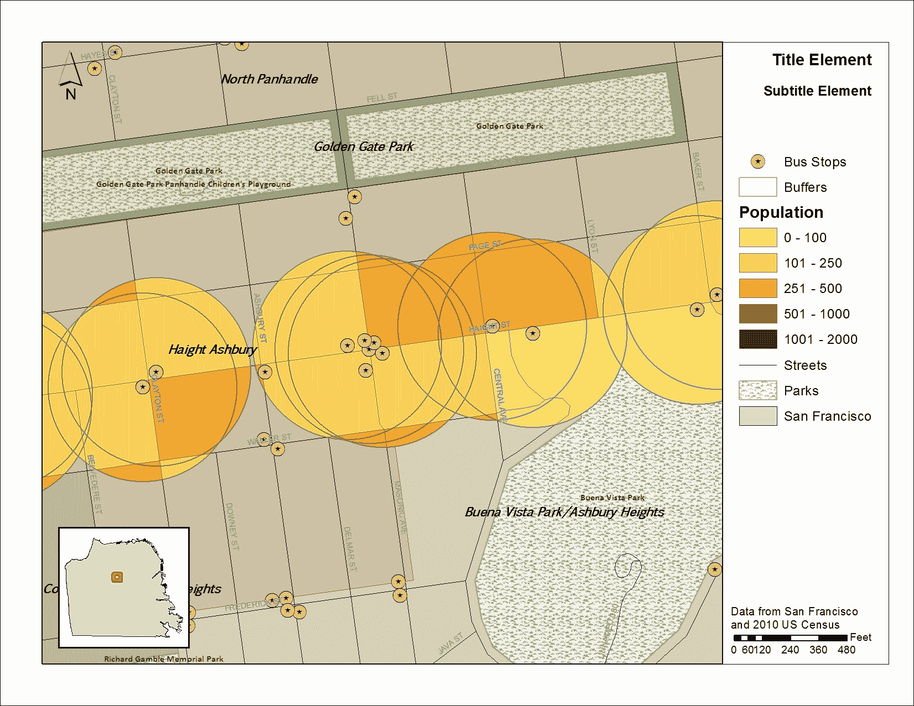
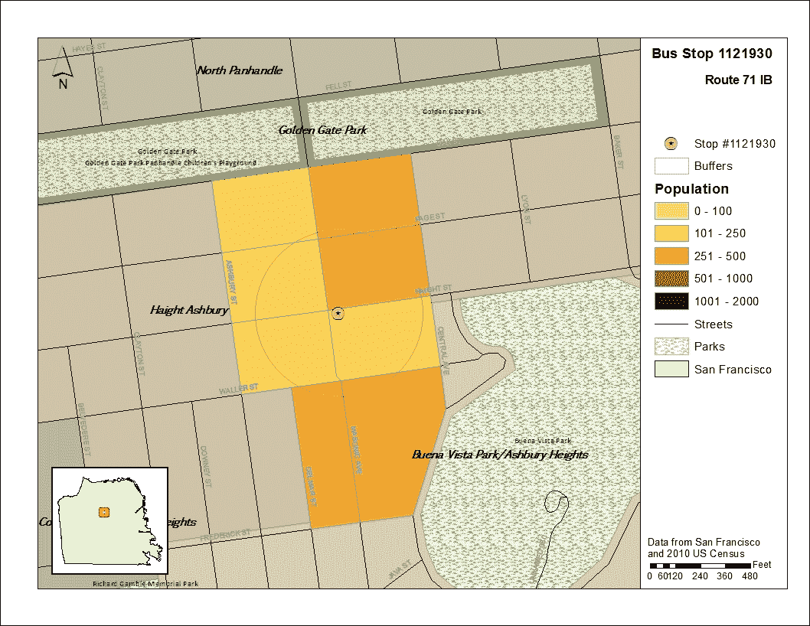

# 第八章。ArcPy.Mapping 简介

制作地图是一种艺术，需要通过多年的专注研究地图学才能掌握。信息的视觉展示既令人兴奋又具有挑战性，可以成为地理空间专业人士日常工作流程中的一项有价值的部分。一旦掌握了基础知识，地图学输出就变成了一个持续不断的战斗，以更快的速度制作出更多的地图。ArcPy 再次提供了一个强大的解决方案：`arcpy.mapping` 模块。

通过允许自动操作所有地图组件，包括地图窗口、图层、图例以及所有文本元素，`arcpy.mapping` 使得创建、修改和输出多张地图变得快速简单。地图集创建——对于地理空间专业人士来说的另一项重要技能，也通过该模块变得容易。在本章中，我们将讨论通过 `arcpy.mapping` 可用的基本功能，并使用它来输出公交车站及其周边人口普查区的地图集。

本章将涵盖以下主题：

+   检查和更新地图文档（MXD）图层数据源

+   将 MXDs 导出为 PDF 或其他图像格式

+   调整地图文档元素

# 使用 ArcPy 与地图文档

认识到先前 `arcgisscripting` 模块的局限性，ESRI 设计了 ArcPy 模块，不仅能够处理数据，还包含了 `arcpy.mapping` 模块，以便直接与地图文档（MXDs）及其包含的图层进行交互。这个新模块为地图自动化提供了多种可能性。一个脚本可能有助于识别损坏的图层链接，更新这些图层的数据源，并应用新的配色方案到图层上。另一个脚本可能使用地图模板创建一系列地图，每个地图对应于一个要素数据集中的要素类。第三个脚本可以创建一个地图集，从 MXD 中移动到网格图层中的每个单元格，以输出书籍的页面，甚至可以实时计算坐标。基于最新分析数据动态创建的地图可以在数据生成的同时输出。`Arcpy.mapping` 将 ArcPy 模块从有用的工具转变为任何地理空间工作流程中的工具。

为了调查 `arcpy.mapping` 模块的功效，我们需要一个 MXD 模板的帮助。我已经准备了一个包含数据和 MXD 的地图包，我们将用它来完成本章的练习。它包括我们旧金山公交车站分析的数据，我们将继续扩展它以包括地图。

# 检查和替换图层源

`arcpy.mapping` 模块的第一种也是最重要的用途是识别和修复地图文档中图层与它们数据源之间的损坏链接。图层符号和 GIS 数据存储是分开的，这意味着图层数据源经常被移动。`Arcpy.mapping` 提供了一个快速的解决方案，尽管并不完美。

此解决方案依赖于 `arcpy.mapping` 模块中包含的多个方法。首先，我们需要识别损坏的链接，然后修复它们。为了识别损坏的链接，我们将使用 `arcpy.mapping` 中包含的 `ListBrokenDataSources()` 方法。

`ListBrokenDataSources()` 方法需要将 MXD 路径传递给 `arcpy.mapping.MapDocument()` 方法。一旦创建地图文档对象，它就会被传递给 `ListBrokenDataSources()` 方法，并生成一个包含图层对象列表，每个损坏链接的图层都有一个图层对象。图层对象有多个属性可供使用。使用这些属性，让我们使用每个对象的名称和数据源属性打印出每个图层的名称和数据源：

```py
import arcpy
mxdPath = 'C:\Projects\MXDs\Chapter8\BrokenLinks.mxd'
mxdObject = arcpy.mapping.MapDocument(mxdPath)
brokenLinks = arcpy.mapping.ListBrokenDataSources(mxdObject)
for link in brokenLinks:
 print link.name, link.dataSource

```

## 修复损坏的链接

现在我们已经识别出损坏的链接，下一步是修复它们。在这种情况下，发现数据源应该在名为 Data 的文件夹中，但它们并不包含在该文件夹内。然后脚本必须升级以替换每个图层的数据源，使它们指向实际的数据源位置。

图层对象和地图文档对象中包含的方法可以完成此下一步。如果 MXD 的所有数据源都已移动，则最好使用 MXD 对象及其方法来修复数据源。在示例 MXD 中，数据源已全部移动到一个名为 `NewData` 的新文件夹中，因此我们将使用 `findAndReplaceWorkspacePaths()` 方法来修复链接：

```py
oldPath = r'C:\Projects\MXDs\Data'
newPath = r'C:\Projects'
mxdObject.findAndReplaceWorkspacePaths(oldPath,newPath)
mxdObject.save() 

```

只要数据源仍然以相同的格式存在（例如，形状文件仍然是形状文件或要素类仍然是要素类），`findAndReplaceWorkspacePaths()` 方法就会起作用。如果数据源类型已更改（例如，形状文件已导入到文件地理数据库中），则必须使用 `replaceWorkspaces()` 方法代替，因为它需要一个工作空间类型作为参数：

```py
oldPath = r'C:\Projects\MXDs\Data'
oldType = 'SHAPEFILE_WORKSPACE'
newPath = r'C:\Projects'
newType = 'FILEGDB_WORKSPACE'
mxdObject.replaceWorkspaces(oldPath,oldType,newPath,newType)
mxdObject.save()

```

## 修复单个图层的链接

如果各个图层不共享数据源，则需要使用图层对象可用的 `findAndReplaceWorkspacePath()` 方法进行调整。此方法与之前使用的方法类似，但它只会替换应用到的图层对象的数据源，而不是所有图层。当与字典结合使用时，可以通过图层名称属性更新图层数据源：

```py
import arcpy
layerDic = {'Bus_Stops':[r'C:\Projects\OldDataPath', r'C:\Projects'],
 'stclines_streets': [r'C:\Projects\OtherPath', r'C:\Projects']}
mxdPath = r'C:\Projects\MXDs\Chapter8\BrokenLinks.mxd'
mxdObject = arcpy.mapping.MapDocument(mxdPath)
brokenLinks = arcpy.mapping.ListBrokenDataSources(mxdObject)
for layer in brokenLinks:
 oldPath, newPath = layerDic[layer.name]
 layer.findAndReplaceWorkspacePath(oldPath, newPath )
 mxdObject.save()

```

这些解决方案适用于单个地图文档和图层。通过使用内置的 `glob` 模块的 `glob.glob()` 方法（它有助于生成匹配特定文件扩展名的文件列表）和 `os` 模块的 `os.path.join()` 方法，也可以扩展到包含 MXD 文件的文件夹：

```py
import arcpy, glob, os
oldPath = r'C:\Projects\MXDs\Data'
newPath = r'C:\Projects'
folderPath = r'C:\Projects\MXDs\Chapter8'
mxdPathList = glob.glob(os.path.join(folderPath, '*.mxd'))
for path in mxdPathList: 
 mxdObject = arcpy.mapping.MapDocument(mxdPath)
 mxdObject.findAndReplaceWorkspacePaths(oldPath,newPath)
 mxdObject.save()

```

## 从 MXD 导出为 PDF

`arcpy.mapping` 的下一个最重要的用途是自动导出 MXDs。以下代码将突出显示 PDF 的导出，但请注意，该模块还支持 JPEG 和其他图像格式的导出。使用 `arcpy.mapping` 进行此过程是一种乐趣，因为通常打开和导出 MXDs 的过程涉及很多等待 ArcMap 启动和地图加载，这可能会浪费很多时间：

```py
import arcpy, glob, os
mxdFolder = r'C:\Projects\MXDs\Chapter8'
pdfFolder = r'C:\Projects\PDFs\Chapter8'
mxdPathList = glob.glob(os.path.join(mxdFolder, '*.mxd'))
for mxdPath in mxdPathList:
 mxdObject = arcpy.mapping.MapDocument(mxdPath)
 arcpy.mapping.ExportToPDF(mxdObject,
 os.path.join(pdfFolder,
 basepath( 
 mxdPath.replace('mxd','pdf')
 )))

```

### 注意

注意，输出文件夹必须存在，此代码才能正确运行。虽然 `os` 模块有方法来检查路径是否存在（`os.path.exists`）和创建文件夹（`os.mkdir`），但这些方法不包括在此代码片段中，并且如果输入或输出路径不存在，`arcpy.mapping.ExportToPDF()` 方法将抛出异常。

此示例代码非常有用，可以将其转换为接受文件夹路径作为参数的函数。然后，可以将该函数添加到脚本工具中，正如上一章所讨论的那样。

## 调整地图文档元素

`Arcpy.mapping` 包含了一些重要的方法，这些方法将有助于地图文档操作的自动化。这些方法包括在 MXDs 中添加新图层或开启/关闭图层的能力，调整数据帧的比例或移动数据帧以聚焦特定区域的能力，以及调整地图文本组件（如标题或副标题）的能力。这些方法将在我们继续进行公交车站分析时进行讨论。

打开名为 `MapAdjust.mxd` 的 MXD。这代表我们的基础地图文档，其中包含我们将调整以满足我们需求的图层和元素。它包含我们从分析中生成的图层和填充地图的基础图层。还有许多文本元素，脚本将自动替换以适应每个地图的具体需求。然而，它并不能很好地表示分析结果，因为与公交车站缓冲区相交的普查区重叠，使得地图解读变得困难。

该脚本将替换人口普查区图层和公交车站图层的源数据，以便只为每个公交车站制作一张地图，以及与每个公交车站周围缓冲区相交的普查区。


要实现这一点，我们需要创建两个空的特征类：一个包含所有人口普查区的属性，另一个包含公交车站的属性。这将允许数据源被分析产生的数据所替换。

打开`SanFrancisco.gdb`文件地理数据库，在`Chapter8Results`要素数据集上右键单击。从下拉菜单中选择**新建**，然后选择**要素类**。将第一个要素类命名为`SelectedCensusBlocks`并使其成为多边形。在下一个菜单中选择**默认关键字**，然后在接下来的菜单中，点击**导入**按钮。从 SanFrancisco 要素数据集中选择**CensusBlocks**要素类；这将把字段加载到新的要素类中。对第二个名为`SelectedBusStops`的要素类重复此操作，但确保它是点几何类型，并从`BusStops`要素类导入模式。对第三个名为`SelectedStopBuffers`的要素类重复相同的过程，但确保它是点几何类型，并从`Buffers`要素类导入模式。

一旦创建了要素类，现在就可以使用它们来加载分析的结果。我们将重新在内存中执行分析，并将结果写入新创建的要素类，这样就可以捕捉整个普查区，而不仅仅是与缓冲区相交的部分，这将更好地说明分析的结果。

`MapAdjust.mxd`地图文档的初始状态包含我们现在熟悉的几个要素类：下载的要素类`Bus_Stops`、生成的要素类`Buffers`、相交和裁剪的`Census Blocks`，以及用于制图的四个要素类，即**街道要素**类、**公园要素**类、一个**邻里要素**类，以及**旧金山**的轮廓。有两个数据框，一个默认命名为**图层**，另一个命名为**插入框**，用于创建将显示图层数据框在旧金山周围移动位置的小插入框。描述图层数据框范围的矩形是一个在插入框数据框属性中创建的范围框架。

下面是地图文档初始状态的导出视图：



这里提出的想法是，利用我们分析初始结果来生成人口层、公交车站层和缓冲层的符号。一旦设置并保存，它们就可以作为我们将从这个基本地图文档中生成的单个地图页面的基础。

### 注意

注意构成标题和副标题的文本元素，以及右窗格底部的图例和归属文本。这些元素可以通过使用`arcpy.mapping.ListElements()`方法与地图文档中构成图层和数据源的其他元素一起进行调整。

# 自动地图文档调整

现在我们已经了解了地图文档的初始配置，我们将介绍一个将自动调整的脚本。此脚本将包括我们在本章和前几章中介绍的一些概念，并将介绍一些用于地图文档调整的新方法，我们将在以下内容中详细说明：

```py
import arcpy, os
dirpath = os.path.dirname
basepath = os.path.basename
Bus_Stops = r"C:\Projects\SanFrancisco.gdb\Bus_Stops"
selectedBusStop = r'C:\Projects\SanFrancisco.gdb\Chapter8Results\SelectedBusStop'
selectedStopBuffer = r'C:\Projects\SanFrancisco.gdb\Chapter8Results\SelectedStopBuffer'
CensusBlocks2010 = r"C:\Projects\SanFrancisco.gdb\CensusBlocks2010"
selectedBlock = r'C:\Projects\SanFrancisco.gdb\Chapter8Results\SelectedCensusData'
pdfFolder = r'C:\Projects\PDFs\Chapter8\Map_{0}'
bufferDist = 400
sql = "(NAME = '71 IB' AND BUS_SIGNAG = 'Ferry Plaza')"
mxdObject = arcpy.mapping.MapDocument("CURRENT")
dataFrame = arcpy.mapping.ListDataFrames(mxdObject, "Layers")[0]
elements = arcpy.mapping.ListLayoutElements(mxdObject)
for el in elements:
 if el.type =="TEXT_ELEMENT":
 if el.text == 'Title Element':
 titleText = el
 elif el.text == 'Subtitle Element':
 subTitleText = el
arcpy.MakeFeatureLayer_management(CensusBlocks2010, 'blocks_lyr') 
layersList = arcpy.mapping.ListLayers(mxdObject,"",dataFrame)
layerStops = layersList[0]
layerCensus = layersList[1]
layerBuffer = layersList[2]
layerBlocks = layersList[3] 
if layerBlocks.dataSource != selectedBlock:
 layerBlocks.replaceDataSource(dirpath(dirpath(layerBlocks.dataSource)),
 'FILEGDB_WORKSPACE',basepath(selectedBlock))
if layerStops.dataSource != selectedBusStop:
 layerStops.replaceDataSource(dirpath(dirpath(layerStops.dataSource)),
 'FILEGDB_WORKSPACE',basepath(selectedBusStop))
if layerBuffer.dataSource != selectedStopBuffer:
 layerBuffer.replaceDataSource(dirpath(dirpath(layerBuffer.dataSource)),
 'FILEGDB_WORKSPACE',basepath(selectedStopBuffer))
layerStops.visible = True
layerBuffer.visible = True
layerCensus.visible = False
with arcpy.da.SearchCursor(Bus_Stops,['SHAPE@','STOPID','NAME',
 'BUS_SIGNAG' ,'OID@','SHAPE@XY'],sql) as cursor:
 for row in cursor:
 stopPointGeometry = row[0]
 stopBuffer = stopPointGeometry.buffer(bufferDist)
 with arcpy.da.UpdateCursor(layerBlocks,['OID@']) as dcursor:
 for drow in dcursor:
 dcursor.deleteRow()
 arcpy.SelectLayerByLocation_management('blocks_lyr', 'intersect', stopBuffer, "", "NEW_SELECTION")
 with arcpy.da.SearchCursor('blocks_lyr',['SHAPE@','POP10','OID@']) as bcursor:
 inCursor = arcpy.da.InsertCursor(selectedBlock,['SHAPE@','POP10'])
 for drow in bcursor: 
 data = drow[0],drow[1]
 inCursor.insertRow(data)
 del inCursor
 with arcpy.da.UpdateCursor(selectedBusStop,['OID@']) as dcursor:
 for drow in dcursor:
 dcursor.deleteRow()
 inBusStopCursor = arcpy.da.InsertCursor(selectedBusStop,['SHAPE@'])
 data = [row[0]]
 inBusStopCursor.insertRow(data)
 del inBusStopCursor
 with arcpy.da.UpdateCursor(selectedStopBuffer,['OID@']) as dcursor:
 for drow in dcursor:
 dcursor.deleteRow()
 inBufferCursor = arcpy.da.InsertCursor(selectedStopBuffer,['SHAPE@'])
 data = [stopBuffer]
 inBufferCursor.insertRow(data)
 del inBufferCursor
 layerStops.name = "Stop #{0}".format(row[1])
 arcpy.RefreshActiveView()
 dataFrame.extent = arcpy.Extent(row[-1][0]-1200,row[-1][1]-1200,
 row[-1][0]+1200,row[-1][1]-1200)
 subTitleText.text = "Route {0}".format(row[2])
 titleText.text = "Bus Stop {0}".format(row[1])
 outPath  = pdfFolder.format( str(row[1])+ "_" + str(row[-2])) + '.pdf'
 print outPath
 arcpy.mapping.ExportToPDF(mxdObject,outPath)
 titleText.text = 'Title Element'
 subTitleText.text = 'Subtitle Element'
 arcpy.RefreshActiveView()

```

哇！代码真的很多。让我们逐节回顾，以了解脚本的每一部分都在做什么。

此代码将在 MXD 的 Python 窗口中运行，因此请确保打开 MXD。一旦打开，请打开**Python**窗口，并在其中右键单击，然后从右键菜单中选择**加载**。使用文件导航浏览器，找到名为`Chapter8_6_AdjustmapCURRENT.py`的脚本，并单击它以选择它。点击**确定**，它将在 Python 窗口中加载。按**Enter**键将执行脚本，或使用滚动条浏览加载的行。

## 变量

在脚本中，首先创建了一些变量来保存`string`文件路径、`integer`缓冲距离和用于识别感兴趣公交线路的`sql`语句：

```py
import arcpy, os
Bus_Stops = r"C:\Projects\SanFrancisco.gdb\Bus_Stops"
selectedBusStop = r'C:\Projects\SanFrancisco.gdb\Chapter8Results\SelectedBusStop'
selectedStopBuffer = r'C:\Projects\SanFrancisco.gdb\Chapter8Results\SelectedStopBuffer'
CensusBlocks2010 = r"C:\Projects\SanFrancisco.gdb\CensusBlocks2010"
selectedBlock = r'C:\Projects\SanFrancisco.gdb\Chapter8Results\SelectedCensusData'
pdfFolder = r'C:\Projects\PDFs\Chapter8\Map_{0}'
bufferDist = 400
sql = "(NAME = '71 IB' AND BUS_SIGNAG = 'Ferry Plaza')"

```

这些将在以后被用来允许我们搜索图层并对它们进行分析。

## 地图文档对象和文本元素

因为此代码将在打开的地图文档中执行，所以我们不需要将 MXD 文件路径传递给`arcpy.mapping.MapDocument()`方法。相反，我们将使用关键字`CURRENT`来表示我们正在引用打开的地图文档：

```py
mxdObject = arcpy.mapping.MapDocument("CURRENT")
dataFrame = arcpy.mapping.ListDataFrames(mxdObject, "Layers")[0]
elements = arcpy.mapping.ListLayoutElements(mxdObject)
for el in elements:
 if el.type =="TEXT_ELEMENT":
 if el.text == 'Title Element':
 titleText = el
 elif el.text == 'Subtitle Element':
 subTitleText = el

```

一旦创建了地图文档对象，就使用`ListDataFrames()`方法从数据帧列表中选择图层数据帧，并将其传递给名为 dataFrame 的变量。

接下来，使用`ListLayoutElements()`方法将布局元素作为列表传递给 elements 变量。布局元素包括地图文档布局视图的各种元素：图例、整洁线、指向北方的箭头、比例尺和用作标题和描述的文本元素。不幸的是，返回的列表没有很好的顺序，因为它们在布局中的位置是不确定的。要访问我们希望分配给变量以供以后使用的文本元素，必须使用元素对象的两个属性：类型和文本。我们想要调整标题和副标题元素，因此使用`for`循环遍历元素列表，并使用属性来找到感兴趣的元素。

### 图层对象

Make Feature Layer 工具是数据管理工具集的一部分，用于将数据从磁盘复制到内存中作为一个图层。ArcGIS 需要生成图层来对数据进行选择和操作，而不是直接在要素类上操作。通过使用图层来执行这些操作，可以保护源要素类。

使用 ArcPy 的`MakeFeatureLayer_management()`方法访问 Make Feature Layer 工具。当在 Python 窗口中使用此工具时，结果作为将在目录表中可见的图层添加到地图文档中。当在 ArcMap 的 Python 窗口中未使用此工具时，生成的图层仅存在于内存中，并不会添加到地图文档中。

在以下代码的部分中，通过传递人口普查区块要素类的文件路径，在内存中生成了一个名为`blocks_lyr`的图层。然后使用`arcpy.mapping()`模块的`ListLayers()`方法访问初始 MXD 中包含的图层对象。它们按照在地图文档的目录表中列出的顺序返回，并使用列表索引分配给变量，包括新创建的`blocks_lyr`：

```py
arcpy.MakeFeatureLayer_management(CensusBlocks2010, 'blocks_lyr') 
layersList = arcpy.mapping.ListLayers(mxdObject,"",dataFrame)
layerStops = layersList[0]
layerCensus = layersList[1]
layerBuffer = layersList[2]
layerBlocks = layersList[3] 

```

### 替换数据源

现在我们已经将图层对象分配给了变量，我们将检查它们的数据源是否是我们用于地图生产的正确要素类。使用每个图层对象的`dataSource`属性，我们将它们与我们要用作数据源的文件路径变量进行比较：

```py
if layerBlocks.dataSource != selectedBlock:
 layerBlocks.replaceDataSource(dirpath(dirpath(layerBlocks.dataSource)),
 'FILEGDB_WORKSPACE',basepath(selectedBlock))
if layerStops.dataSource != selectedBusStop:
 layerStops.replaceDataSource(dirpath(dirpath (layerStops.dataSource)),
 'FILEGDB_WORKSPACE',basepath(selectedBusStop))
if layerBuffer.dataSource != selectedStopBuffer:
 layerBuffer.replaceDataSource(dirpath( dirpath(layerBuffer.dataSource)),
 'FILEGDB_WORKSPACE',basepath(selectedStopBuffer))

```

使用`If`语句检查数据源是否正确。如果不正确，将使用`replaceDataSource()`图层方法将它们替换为正确的数据源。此方法需要三个参数：工作空间（在这种情况下，文件地理数据库）、工作空间类型以及新要素类数据源名称，该名称必须位于同一工作空间中，以便`replaceDataSource()`方法能够工作（尽管它不需要位于同一要素数据集中）。

## 调整图层可见性

图层对象有一个属性允许我们调整它们的可见性。将此布尔属性设置为`True`或`False`将调整图层的可见性（开启为 True，关闭为 False）：

```py
layerStops.visible = True
layerBuffer.visible = True
layerCensus.visible = False

```

我们希望图层变量`layerCensus`，即新的`blocks_lyr`对象，被关闭，因此将其设置为`False`，但公交车站和缓冲区图层对象需要可见，因此将它们设置为`True`。

## 从公交车站要素类生成缓冲区

所有变量都已生成或分配，所以下一步是使用`SearchCursor`搜索选定的公交车站。对于每个公交车站，将生成缓冲区对象以找到与这些单独公交车站相交的人口普查区块：

```py
with arcpy.da.SearchCursor(Bus_Stops,['SHAPE@','STOPID','NAME',
 'BUS_SIGNAG' ,'OID@','SHAPE@XY'],sql) as cursor:
 for row in cursor:
 stopPointGeometry = row[0]
 stopBuffer = stopPointGeometry.buffer(bufferDist)
 with arcpy.da.UpdateCursor(layerBlocks,['OID@']) as                   dcursor:
 for drow in dcursor:
 dcursor.deleteRow()

```

对于从公交车站特征类检索到的每一行数据，返回一系列属性，包含在一个元组中。其中第一个，row[0]，是一个`PointGeometry`对象。此对象有一个缓冲方法，用于在内存中生成一个缓冲`Polygon`对象，然后将其分配给`stopBuffer`变量。一旦创建了缓冲区对象，就使用数据访问 UpdateCursor 的`deleteRow()`方法来擦除人口普查区图层中的行。一旦删除了行，该图层就可以用下一节中将要识别的新选定的人口普查区重新填充。

## 交集公交车站缓冲区和人口普查区

为了识别与每个公交车站周围的缓冲区相交的人口普查区，使用 ArcToolbox 工具`SelectLayerByLocation`通过 ArcPy 方法`SelectLayerByLocation_management()`调用：

```py
arcpy.SelectLayerByLocation_management('blocks_lyr', 'intersect', stopBuffer, "", "NEW_SELECTION")
 with arcpy.da.SearchCursor('blocks_lyr', ['SHAPE@', 'POP10','OID@']) as bcursor:
 inCursor = arcpy.da.InsertCursor(selectedBlock,['SHAPE@', 'POP10'])
 for drow in bcursor: 
 data = drow[0],drow[1]
 inCursor.insertRow(data)
 del inCursor

```

此方法需要内存中的`blocks_lyr`图层对象和分配给变量`stopBuffer`的新创建的缓冲区对象。它还需要选择类型`intersect`以及另一个参数，该参数控制选择是否添加到现有选择中，或者将是一个新选择。在这种情况下，我们想要一个新选择，因为只需要与当前公交车站相交的人口普查区。

一旦选择了人口普查区并进行了识别，形状数据和人口数据通过`InsertCursor`传递到由变量`selectedBlock`表示的特征类。`InsertCursor`必须使用 del 关键字删除，因为一次只能有一个`InsertCursor`或`UpdateCursor`在内存中。

### 填充选定的公交车站和缓冲特征类

以类似的方式，下一步是填充将在地图制作中使用的公交车站和缓冲特征类。首先使用`deleteRow()`方法将公交车站特征类清空，然后将选定的公交车站形状字段数据插入到特征类中。然后对公交车站缓冲特征类和缓冲几何对象执行相同的步骤：

```py
 with arcpy.da.UpdateCursor(selectedBusStop,['OID@']) as dcursor:
 for drow in dcursor:
 dcursor.deleteRow()
 inBusStopCursor = arcpy.da.InsertCursor(selectedBusStop,['SHAPE@'])
 data = [row[0]]
 inBusStopCursor.insertRow(data)
 del inBusStopCursor
 with arcpy.da.UpdateCursor(selectedStopBuffer,['OID@']) as dcursor:
 for drow in dcursor:
 dcursor.deleteRow()
 inBufferCursor = arcpy.da.InsertCursor(selectedStopBuffer,['SHAPE@'])
 data = [stopBuffer]
 inBufferCursor.insertRow(data)
 del inBufferCursor

```

## 更新文本元素

现在数据已经生成并写入创建来存储它们的特征类后，下一步是更新布局元素。这包括将影响图例、数据框架范围和文本元素的图层属性：

```py
layerStops.name = "Stop #{0}".format(row[1])
dataFrame.extent = arcpy.Extent(row[-1][0]-1200,row[-1][1]-1200,
 row[-1][0]+1200,row[-1][1]-1200)
subTitleText.text = "Route {0}".format(row[2])
titleText.text = "Bus Stop {0}".format(row[1])
arcpy.RefreshActiveView()

```

使用其名称属性调整公交车站图层名称，以反映当前公交车站。通过创建一个`arcpy.Extent`对象并传递四个参数：*Xmin*、*Ymin*、*Xmax*、*Ymax*来调整数据框架范围。为了生成这些值，我使用了 1200 英尺这个相对任意的值，在公交车站周围创建一个正方形。使用它们的文本属性更新文本元素。最后，使用`RefreshActiveView()`方法确保地图文档窗口正确更新到新的范围。

### 将调整后的地图导出为 PDF

最后一步是将新调整的地图文档对象传递给 ArcPy 的 `ExportToPDF` 方法。此方法需要两个参数，即地图文档对象和表示 PDF 文件路径的字符串：

```py
outPath = pdfFolder.format(str(row[1])+"_"+ str(row[-2]))+'.pdf'
arcpy.mapping.ExportToPDF(mxdObject,outPath)
titleText.text = 'Title Element'
subTitleText.text = 'Subtitle Element'
arcpy.RefreshActiveView()

```

PDF 文件路径字符串是由 pdfFolder 字符串模板和公交站点的 ID 以及对象 ID 和文件扩展名 `.pdf` 生成的。一旦这些和变量 `mxdObject` 所表示的地图文档对象传递给 `ExportToPDF` 方法，就会生成 PDF。然后重置文本元素并刷新视图，以确保地图文档在下次使用脚本时准备就绪。

# 在 Python 窗口中运行脚本

如果尚未打开，请打开名为 `MapAdjust.mxd` 的地图文档。打开 **Python** 窗口，并在窗口中右键单击。从菜单中选择 **Load**。当文件对话框打开时，找到名为 `Chapter8_6_AdjustmapCURRENT.py` 的脚本并选择它，确保其中的文件路径正确。点击 **OK**，它将在 Python 窗口中加载。脚本加载后，按一次 **Enter** 运行脚本。脚本运行可能需要几秒钟或更长时间才能明显看出它在运行。

### 注意

注意，在大多数情况下，Python 窗口并不是执行 ArcPy 脚本的好地方，因为它与 IDE 相比有些局限。使用它来加载和执行执行这些地图文档调整的脚本，是 Python 窗口最好的用途之一。

一旦脚本开始运行，地图文档的调整将开始出现并重复。这是一个令人着迷的过程，因为运行脚本的效果以一种在运行 Python 脚本时不太容易看到的方式显现出来。一旦开始生成 PDF 文件，打开一个查看输出。脚本将为所选公交线上的每个公交站生成一个地图，因此生成一定数量的 PDF 文件后，您可以自由关闭地图文档。

这里是输出示例：



脚本生成的地图显示每个公交站位于中心，周围是缓冲区和与缓冲区相交的符号化人口普查区块。标题、副标题和图例已调整，以指示地图中描绘的公交站。使用 ArcPy，我们现在控制着地理空间分析的各个方面：分析本身以及描绘输出结果的制图生产。

# 摘要

在本章中介绍了 arcpy.mapping 并使用它来控制需要调整以创建自定义地图的地图文档元素。通过将地理空间分析和地图制作结合起来，我们更接近于利用 ArcPy 的全部功能。

在下一章中，我们将进一步探讨 arcpy.mapping，并创建一个可以添加到 ArcToolbox 中的脚本工具，该工具将运行分析并从结果数据生成地图。我们还将完善脚本，并介绍数据驱动页面，以讨论如何在该 ArcPy 脚本中使用这个强大的工具。
