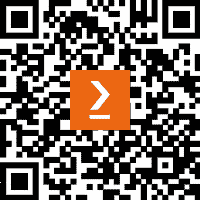

# 前言

数据科学最有价值的贡献之一就是帮助企业做出正确的决策。理解这两个截然不同的领域及其与激烈竞争市场的交汇，要求你获取尽可能多的指导。

*数据驱动商业的艺术*是你获得数据驱动视角的宝贵指南，同时也是利用**机器学习**（**ML**）的力量来指导你商业决策的工具书。本书为公司内部多个角色提供了共同的讨论基础。

你将首先学习如何使用 Python 及其众多库进行机器学习（ML）。有经验的数据科学家可能会想跳过这个简短的介绍，但很快你就会进入书籍的核心内容，探索 Python 在机器学习中的多种应用方式，特别是如何通过现实世界中的商业问题，独立解决它们，从而将 ML 应用于商业决策领域。随着进展，你将获得实践性洞察，了解机器学习对你的业务能提供的价值，并掌握应用各种经过验证的机器学习方法的技术能力。

在本书结束时，你将学会如何基于数据驱动的方法制定商业决策，并掌握应用这些知识于现实世界的 Python 技能。

# 本书的目标读者

本书适用于数据科学家、机器学习工程师与开发者、数据工程师以及商业决策者，他们希望将数据科学应用于业务流程优化，并开发出能够在市场营销、销售、定价、客户成功、广告技术等领域实施数据科学项目所需的技能。其他希望探索数据科学如何改善商业运作的专业人士，以及那些希望通过强有力的商业案例支持技术提案的技术人员，也将从本书中受益。

# 本书内容

*第一章*，*使用 Python 分析与可视化数据*，作为使用 pandas 和 Seaborn 进行数据分析的入门。你将学习如何转换、可视化和分析数据，这些都是本书贯穿始终的基础工具。你将通过基于现实生活应用的实例，接触到这些库的使用。

*第二章*，*在商业运营中使用机器学习*，介绍了 scikit-learn，这是使用 Python 应用机器学习算法最受欢迎的框架。你将学习机器学习的基本概念，如何进行训练以及监督式和无监督式算法的推理。这些概念将通过练习得到巩固，并在后续章节中应用到优化各种商业应用的实际案例中。

*第三章*，*通过市场洞察寻找商业机会*，聚焦于使用 Python 和搜索趋势分析来从搜索引擎数据中获取有价值的信息。你将学习如何使用 Python 获取搜索引擎趋势信息，构建并可视化结果以验证假设，扩展查询并分析结果内容，使用 NLP 和 scikit-learn 分析结果。

*第四章*，*通过联合分析了解客户偏好*，将向你介绍联合分析方法，分析用户偏好调查数据，应用方法确定用户如何权衡每个属性，并预测新组合的排名。

*第五章*，*通过价格需求弹性选择最佳价格*，将向你介绍价格弹性概念，并利用该概念通过销售数据找到不同产品的最佳价格。在本章结束时，你将能够找到最大化收入的价格，并理解需求曲线。

*第六章*，*产品推荐*，展示了创建产品推荐和执行市场篮子分析的两种方法。你将了解协同过滤和先验算法，并学习如何实现它们，以使用销售数据创建产品推荐。

*第七章*，*预测客户流失*，将展示如何使用 Python 和 scikit-learn 预测消费者行为中的微妙变化。

*第八章*，*通过客户细分进行用户分组*，将帮助你了解和实践可以应用于建模数据的方法，以及哪些无监督机器学习方法可以用来发现这些群体，并找出它们的关键特征。最后，你将学习如何通过销售分析这些细分群体，如何通过使用 Seaborn 在清晰定义的仪表板中传达这些发现。

*第九章*，*利用历史 Markdown 数据预测销售额*，将指导你使用 pandas 和 Seaborn 分析促销活动对历史时间序列销售数据的影响，并使用 scikit-learn 优化库存和存储，以分析促销活动的影响并优化存储成本。

*第十章*，*网站分析优化*，将向你展示如何使用 Python 分析数字营销数据，通过分析数字广告活动的结果，基于客户生命周期价值预测计算投资回报，并优化程序化广告平台上的投资。

*第十一章*，*在商业中创建数据驱动的文化*，与商业领袖沟通，了解他们如何应用数据科学和分析来改进业务运营。我们将与多位首席数据官和首席数据科学家进行交流，收集他们在多个公司中应用这些方法的具体实例。

# 为了充分利用本书

| **本书涵盖的软件/硬件** | **操作系统要求** |
| --- | --- |
| Python 3.x | Windows、macOS 或 Linux |

**如果您使用的是本书的数字版，我们建议您亲自输入代码，或从本书的 GitHub 仓库中获取代码（相关链接在下一节提供）。这样做可以帮助您避免因复制粘贴代码而导致的潜在错误。**

# 下载示例代码文件

您可以从 GitHub 上下载本书的示例代码文件，网址为 [`github.com/PacktPublishing/The-Art-of-Data-Driven-Business-Decisions`](https://github.com/PacktPublishing/The-Art-of-Data-Driven-Business-Decisions)。如果代码有更新，将会在 GitHub 仓库中进行更新。

我们还提供了其他代码包，您可以在我们的书籍和视频丰富目录中找到，网址为 [`github.com/PacktPublishing/`](https://github.com/PacktPublishing/)。快去看看吧！

# 使用的约定

本书中使用了一些文本约定。

`文本中的代码`：表示文本中的代码词汇、数据库表名、文件夹名称、文件名、文件扩展名、路径名、虚拟 URL、用户输入和 Twitter 账号。例如：“将下载的 `WebStorm-10*.dmg` 磁盘映像文件挂载为系统中的另一个磁盘。”

代码块的格式如下：

```py
results_df = pd.DataFrame(results).dropna()
results_df.columns = ['client','slope','std']
results_df.index = results_df.client
results_df = results_df.drop(['client'],axis=1)
results_df.head()
```

当我们希望引起您对代码块中特定部分的注意时，相关的行或项会以**粗体**显示：

```py
df.columns.tolist()
>>> ['period', 'sub_market', 'client_class', 'division', 'brand','cat', 'product', 'client_code', 'client_name', 'kgs_sold']
```

任何命令行输入或输出将如下所示：

```py
!pip install --upgrade openpyxl scikit-surprise
```

**粗体**：表示新术语、重要单词或您在屏幕上看到的词汇。例如，菜单或对话框中的单词通常以**粗体**显示。举个例子：“从**管理**面板中选择**系统信息**。”

提示或重要说明

如下所示。

# 联系我们

我们非常欢迎读者的反馈。

**一般反馈**：如果您对本书的任何内容有疑问，请通过电子邮件联系我们，邮箱地址为 [customercare@packtpub.com](https://customercare@packtpub.com)，并在邮件主题中注明书名。

**勘误**：尽管我们已经尽力确保内容的准确性，但仍难免会出现错误。如果您发现本书中的错误，我们非常感谢您报告给我们。请访问 [www.packtpub.com/support/errata](http://www.packtpub.com/support/errata) 并填写表单。

**盗版**: 如果您在互联网上发现我们作品的任何形式的非法复制，请告知我们其位置或网站名称。请通过 copyright@packt.com 

**如果您有兴趣成为作者**：如果您在某一主题上有专业知识，并且有意撰写或为书籍做出贡献，请访问 [authors.packtpub.com](http://authors.packtpub.com)。

# 分享您的想法

一旦您阅读了《数据驱动业务的艺术》，我们很乐意听取您的想法！请[点击此处直接转到亚马逊评论页面](https://packt.link/r/1-804-61103-4) 并分享您的反馈。

您的评价对我们和技术社区至关重要，将帮助我们确保我们提供的内容质量卓越。

# 下载本书的免费 PDF 版本

感谢您购买本书！

您喜欢随时随地阅读，但不能随身携带印刷书籍吗？

您购买的电子书是否与您选择的设备不兼容？

别担心，现在您每购买一本 Packt 书籍，都可以免费获得该书的无 DRM PDF 版本。

可在任何设备上的任何地方阅读。直接从您喜爱的技术书籍中搜索、复制和粘贴代码到您的应用程序中。

福利不止如此，您还可以独享折扣、新闻通讯和每日优质免费内容

按照以下简单步骤获取这些好处：

1.  扫描下方的 QR 码或访问以下链接



[`packt.link/free-ebook/9781804611036`](https://packt.link/free-ebook/9781804611036)

1.  提交您的购书证明

1.  就这样！我们将直接将您的免费 PDF 和其他好处发送至您的电子邮件

# 第一部分：使用 Python 进行数据分析与预测

第一部分将介绍主要工具，使用 Python 分析、预测和可视化数据。核心框架如 Pandas、Scikit-learn 和 Seaborn 将被介绍，确保您学会如何正确探索和操作数据，了解机器学习算法的基础以预测和聚类数据，并进行有效的数据可视化来讲述数据故事。

本部分涵盖以下章节：

+   *第一章*，*使用 Python 分析和可视化数据*

+   *第二章*，*在业务运营中使用机器学习*
