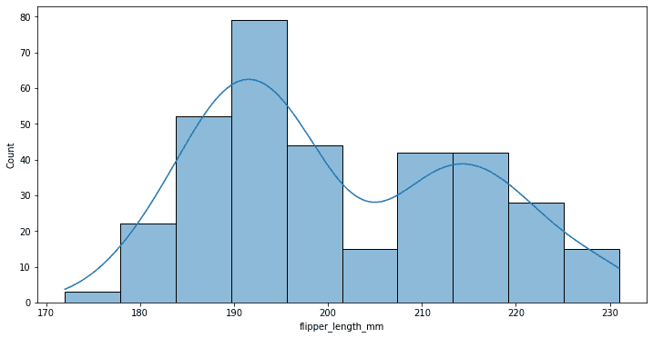
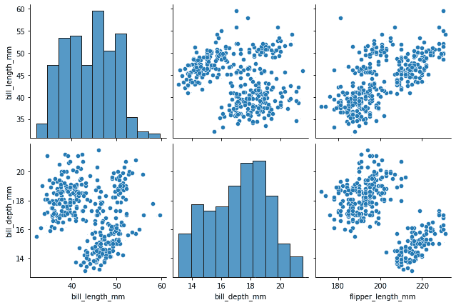

# 第一章：使用 Python 进行数据分析和可视化

高级分析和数据科学如今在大多数企业中发挥着重要作用。它帮助组织跟踪、管理和收集绩效指标，从而改善组织决策。企业经理可以利用创新的分析和机器学习技术帮助他们决定如何最佳地与客户互动、提升企业绩效并增加销售额。数据科学和分析可以用于创建以用户为中心的产品，并做出明智的决策。通过比较不同的产品特性、研究消费者反馈和市场趋势，企业能够开发能够吸引客户并保持长期吸引力的商品和服务。

本书面向所有希望了解数据科学、高级分析和机器学习技术的方法的人，特别是针对那些研究由这些方法影响的商业案例的人。这些案例大多基于真实的应用案例，并展示了这些方法在不同行业的公司中产生的积极影响。因此，无论是那些希望通过数据科学提升技能的资深商业分析师，还是希望找到可以应用于最大化特定操作的管理者，都会从本书中讨论的示例中受益。

在本章中，我们将介绍本书中将用来管理数据、操作数据和可视化数据的初步组件。具体来说，我们将讨论以下内容：

+   数据科学在商业中的应用及其与业务分析师或数据分析师等角色的主要区别

+   使用诸如 NumPy 等统计编程库来应用矩阵代数和统计方法

+   使用 pandas 存储数据，pandas 是一个广泛用于数据科学领域的数据分析和处理库

+   使用 Seaborn 进行可视化，并了解不同类型的图表如何在不同场景下使用

接下来，我们将讨论您需要满足的技术要求，以便能够跟随本章中的示例。

# 技术要求

要能够跟随本章的步骤，您需要满足以下要求：

+   一个运行 Python 3.7 及以上版本的 Jupyter notebook 实例。如果您有 Google Drive 帐户，也可以使用 Google Colab notebook 来运行这些步骤。

+   基本的数学和统计学概念理解。

# 在商业中使用数据科学和高级分析

大多数时候，关于数据科学家与商业分析师之间的区别会引发讨论，因为这两个角色都专注于从数据中获取洞察。从某种角度看，数据科学可以被视为通过分析原始数据背后的模式来进行预测。商业智能是回顾性的，发现过去和当前的趋势，而数据科学则是前瞻性的，预测未来的趋势。

商业决策在很大程度上依赖于数据科学和先进的分析方法，因为这些方法帮助管理者理解决策如何影响结果。因此，数据科学家越来越需要将常见的机器学习技术与对潜在因果关系的了解结合起来。这些发展催生了“决策科学家”这一职位，这是一位专注于利用技术支持业务和决策的技术专家。然而，与“数据科学家”或“大数据科学家”这一职位相比，“决策科学家”这一职位的含义则更加深刻。

很多时候，商业分析师、数据科学家和数据分析师的角色容易混淆。商业分析师更可能解决业务问题并提出解决方案，而数据分析师通常更多地直接与数据本身打交道。虽然这两个职位都需求量大且通常薪酬丰厚，但数据科学更注重预测，因为它分析的是原始数据中隐藏的模式。

# 使用 NumPy 进行统计学和代数运算

NumPy 是一个用于处理数组的 Python 库。此外，它还提供了处理矩阵、傅里叶变换和线性代数领域的函数。NumPy 现在支持大规模、多维数组和矩阵，并且提供了一系列复杂的数学操作，可以在这些数组上执行。这些操作使用大量复杂的数学函数来处理庞大的多维数组和矩阵，并进行机器学习中的基本科学计算，因此非常有用。它提供了 n 维数组，这是一个简单而有效的数据结构。学习 NumPy 是每个 Python 数据科学家入门的第一步，因为它构成了几乎所有工具包功能的基础。

数组是一个由所有相同类型的值组成的网格，通过一个非负整数元组来索引，这是 NumPy 使用的基本构建块。类似于代数中矩阵的维度定义，数组的秩由其维度的数量决定。一个数字元组，表示数组在每个维度上的大小，构成了数组的形状：

```py
import numpy as np
arr = np.array([1, 2, 3, 4, 5])
print(arr)
print(type(arr))
```

NumPy 数组是一个容器，可以容纳一定数量的元素，这些元素必须是相同类型的，正如之前所指定的那样。大多数数据结构都使用数组来执行其算法。就像你可以切片一个列表一样，你也可以切片一个 NumPy 数组，但它支持多维切片。与索引类似，切片 NumPy 数组会返回一个原始数组的视图。

在 Python 中，切片意味着从一个给定的索引到另一个给定的索引选择元素。我们可以通过使用 `[start:end]` 对数组进行切片，选择数组中的某些元素，其中 `start` 表示开始的元素位置，`end` 表示结束的位置。我们还可以使用 `[start:end:step]` 来定义步长：

```py
print('select elements by index:',arr[0])
print('slice elements of the array:',arr[1:5])
print('ending point of the array:',arr[4:])
print('ending point of the array:',arr[:4])
```

有三种不同的索引技术：字段访问、基本切片和高级索引。基本切片是 Python 基本切片概念的 n 维扩展。通过传递 `start`、`stop` 和 `step` 参数给内建的 `slice` 函数，可以创建一个 Python 切片对象。切片使得编写清晰、简洁的代码成为可能。当一个可迭代元素按位置被“索引”时，它指的是该元素在可迭代对象中的位置。根据元素的索引，从一个可迭代对象中获取元素子集被称为“切片”。

要合并（拼接）两个数组，我们必须通过使用 `np.concatenate()` 函数将两个数组中的每个元素复制到 `result` 中：

```py
arr1 = np.array([1, 2, 3])
arr2 = np.array([4, 5, 6])
arr = np.concatenate((arr1, arr2))
print(arr)
```

数组也可以使用 NumPy 的堆叠方法进行连接。我们可以沿第二个轴将两个 1D 数组合并，堆叠在一起，这个过程称为堆叠。`stack()` 方法接收一个我们希望连接的数组列表，并指定轴：

```py
arr = np.stack((arr1, arr2), axis=1)
print(arr)
```

`axis` 参数可以用来引用我们想要进行拼接的轴：

```py
arr = np.stack((arr1, arr2), axis=0)
print(arr)
```

NumPy 的 `mean()` 函数用于计算指定轴上的算术平均值：

```py
np.mean(arr,axis=1)
```

你需要使用 NumPy 的 `mean()` 函数并设置 `axis=0` 来计算按列的平均值。要按行计算平均值，应该使用 `axis=1`：

```py
np.mean(arr,axis=0)
```

在接下来的章节中，我们将介绍 pandas，一个用于数据分析和操作的库。pandas 就像 NumPy 一样，是数据科学中最广泛使用的 Python 库之一。它提供了高性能、易于使用的数据分析工具。与 NumPy 提供的多维数组对象不同，pandas 提供了一种称为 DataFrame 的内存中的二维表对象。

# 使用 pandas 存储和操作数据

pandas 是一个开源工具包，建立在 NumPy 之上，为 Python 程序员提供高性能、易用的数据结构和数据分析能力。它使得快速分析、数据准备和清洗成为可能。它在性能和产出上都表现卓越。

pandas 是一个数据分析的包，因其包含许多内置的辅助功能，通常用于金融时间序列数据、经济数据以及任何形式的表格数据。对于科学计算，NumPy 是管理大型多维数组的快速方法，且可与 SciPy 和 pandas 包一起使用。

通过将字典传递给`DataFrame`构造函数，可以从字典构建一个 DataFrame：

```py
import pandas as pd
d = {'col1': [1,5,8, 2], 'col2': [3,3,7, 4]}
df = pd.DataFrame(data=d)
df
```

pandas 的`groupby`函数是一个强大而多功能的函数，允许我们将数据拆分成单独的组，以便进行计算和更好的分析：

```py
df = pd.DataFrame({'Animal': ['Dog', 'Dog',
                              'Rat', 'Rat','Rat'],
                   'Max Speed': [380., 370., 24., 26.,25.],
                   'Max Weight': [10., 8.1, .1, .12,.09]})
df
```

“拆分”、“应用”和“合并”这三步让我们最容易记住“groupby”操作的功能。拆分是指根据特定的列将数据分成不同的组。举例来说，我们可以将销售数据按月分组：

```py
df.groupby(['Animal']).mean()
```

pandas 的`groupby`技术非常强大。通过值计数，你可以根据某一列进行分组，并按该列的值对另一列进行计数。我们可以使用`groupby`和`value_counts`来统计每个人完成的活动次数：

```py
df.value_counts()
```

我们还可以使用`aggregate()`方法对行进行聚合，这允许你对 DataFrame 的某一轴应用一个或多个函数名称。默认值是 0，即索引（行）轴。需要注意的是，`agg()`方法是`aggregate()`方法的别名：

```py
df.agg("mean", axis="rows",numeric_only=True)
```

我们还可以传递多个函数用于每一列的选择：

```py
df.agg({'Max Speed' : ['sum', 'min'], 'Max Weight' : ['mean', 'max']})
```

在给定轴上的分位数是通过`quantile()`方法确定的。默认情况下是按行轴来计算。当指定列轴（`axis='columns'`）时，`quantile()`方法会按列计算分位数，并返回每行的均值。以下代码将为我们提供整个 DataFrame 的 10%分位数：

```py
df.quantile(.1)
```

我们还可以传递一个分位数组：

```py
df.quantile([.1, .5])
```

`pivot()`函数用于根据提供的索引或列值重塑给定的 DataFrame，并且是我们可以用来改变数据的不同类型函数之一。此函数不支持数据聚合；多个值会在列中产生`MultiIndex`：

```py
df = pd.DataFrame(
{'type': ['one', 'one', 'one', 'two', 'two',  'two'],
 'cat': ['A', 'B', 'C', 'A', 'B', 'C'],
'val': [1, 2, 3, 4, 5, 6],
'letter': ['x', 'y', 'z', 'q', 'w', 't']})
df.pivot(index='type', columns='cat', values='val')
```

数据透视表是 pandas 最强大的功能之一。数据透视表让我们从数据中提取洞见。pandas 提供了一个类似的功能，叫做`pivot_table()`。它是一个简单的函数，但能非常快速地产生强大的分析结果。

接下来的步骤是学习如何可视化数据，以便进行恰当的故事讲述和解释。

# 使用 Seaborn 可视化模式

Seaborn 是一个基于 Matplotlib 的 Python 数据可视化库。它提供了一个精致的绘图工具，用于创建引人注目且具有教育意义的统计图形。

Seaborn 和 Matplotlib 的主要区别在于 Seaborn 如何处理 pandas DataFrame。使用简单的函数集，Python 可以提供美丽的图形。当处理 DataFrame 和数组时，Matplotlib 表现出色，它将坐标轴和图形视为对象，并提供了几种有状态的绘图 API。

在这里，我们将开始使用“tips”数据集进行示例，该数据集包含数字和分类变量的混合：

```py
import seaborn as sns
import matplotlib.pyplot as plt
tips = sns.load_dataset("tips")
f, ax = plt.subplots(figsize=(12, 6))
sns.scatterplot(data=tips, x="total_bill", y="tip", hue="time")
```

在前面的代码片段中，我们导入了 Seaborn 和 Matplotlib；后者允许用户控制图表创建的某些方面，例如图形大小，我们将其定义为 12x6 英寸。这创建了 Seaborn 将放置可视化内容的布局。

我们使用`scatterplot()`函数来创建一个点的可视化，其中*X*轴表示`total_bill`变量，*Y*轴表示`tip`变量。在这里，我们使用`hue`参数根据`time`分类变量为不同的点上色，从而允许我们用分类维度绘制数值数据：


图 1.1：Seaborn 散点图，颜色取决于分类变量

生成的图形显示了根据我们指定的颜色代码（在我们这种情况下是收到的小费、它们与总账单金额的关系以及是否为午餐或晚餐时段）分布的数据。

我们可以得出的解释是，总账单金额和收到的小费之间可能存在线性关系。但如果我们仔细观察，会发现最高的账单总额出现在晚餐时段，同时也导致了最高的小费值。

在商业领域，这些信息可能非常有用，但首先需要通过适当的假设检验方法进行验证，可以使用 t 检验来验证这些假设，再加上线性回归分析来得出总金额与小费分布之间存在关系的结论，同时考虑到发生这一过程的时间差异。我们将在下一章中探讨这些分析。

我们现在可以看到，简单的探索图如何帮助我们构建假设，并在此基础上做出决策，从而更好地改进商业产品或服务。

我们还可以将色调和样式分配给不同的变量，这样就能独立地改变颜色和标记。这使我们可以在同一个图表中引入另一个分类维度，在 Seaborn 中可以使用`style`参数，根据我们参考的分类变量分配不同类型的标记：

```py
f, ax = plt.subplots(figsize=(12, 6))
sns.scatterplot(data=tips, x="total_bill", y="tip", hue="day", style="time")
```

前面的代码片段将创建一个 12x6 英寸的布局，并添加关于`time`分类变量的信息，如下图所示：


图 1.2：Seaborn 散点图，颜色和形状依赖于分类变量

这种类型的图表允许我们将大量信息集成到单个图中，这可能是有益的，但也可能导致信息过载，一次难以消化。重要的是始终考虑我们想要展示的信息的理解，使利益相关者能够一目了然地看到关系。

在这里，一开始很难看出任何对一周中哪些天进行解释的信息。这是因为已经显示了大量信息。通过其他类型的分析，如统计测试、相关性和因果关系，可以获得不能仅通过观察图表获得的这些差异。

另一种通过 Seaborn 创建的图形添加更多维度的方式是将数值变量表示为散点图中点的大小。可以将数值变量分配给 `size`，以对点的面积应用语义映射。

我们可以通过大小控制标记区域的范围，并将 legend 参数设置为 `full`，以强制每个唯一值都出现在图例中：

```py
f, ax = plt.subplots(figsize=(12, 6))
sns.scatterplot(
    data=tips, x="total_bill", y="tip", hue="size", 
    size="size", sizes=(20, 200), legend="full"
)
```

上述代码片段创建了一个散点图，其中点的大小和颜色取决于 `size` 变量。这对于在这类图中再添加另一个数值维度非常有用：


图 1.3：Seaborn 散点图，大小依赖于第三变量

表示数据的另一重要方式是查看时间序列信息。我们可以使用 Seaborn 包显示时间序列数据，无需对数据进行任何特殊处理。

在下面的示例中，我们正在创建一个带有日期的 pandas DataFrame，使用 Matplotlib 创建一个 15 x 8 英寸的图形，然后使用 Seaborn 的 `lineplot` 函数显示信息：

```py
df = pd.DataFrame({"Dates":
['01/01/2019','01/02/2019','01/03/2019','01/04/2019',
'01/05/2019','01/06/2019','01/07/2019','01/08/2019'],
"Count": [727,716,668,710,718,732,694,755]})
plt.figure(figsize = (15,8))
sns.lineplot(x = 'Dates', y = 'Count',data = df)
```

上述示例创建了一个将日期放在 *x* 轴上，`count` 变量放在 *y* 轴上的精彩图表：


图 1.4：Seaborn 时间轴线图

在下面的示例中，我们将加载一个称为 FMRI 数据集的预定义数据集，其中包含时间序列数据。

首先，我们将加载一个包含长格式数据的示例数据集，然后绘制不同事件和地区的响应。为此，我们将创建一个 15 x 8 英寸的 Matplotlib 图形，并使用 `lineplot` 函数显示信息，使用 `hue` 参数显示关于地区的分类信息，并使用 `style` 参数显示关于事件类型的分类信息：

```py
fmri = sns.load_dataset("fmri")
f, ax = plt.subplots(figsize=(15, 8))
sns.lineplot(x="timepoint", y="signal", hue="region", style="event",data=fmri)
```

上述代码片段创建了一个展示信息的图表，允许我们研究变量随时间变化的情况，依据数据的不同类别特征：


图 1.5：Seaborn 线图与置信区间

Seaborn `lineplot` 函数的一个特点是它展示了在 95% 置信区间内所有数据点的置信区间；实线表示均值。这种方式在展示包含多个数据点的时间序列数据时非常有用。趋势可以通过均值来可视化，同时也能让我们感知数据的分散程度，这在分析行为模式时是非常重要的。

我们可以通过条形图来可视化数据。Seaborn 使用 `barplot` 函数来创建条形图：

```py
f, ax = plt.subplots(figsize=(12, 6))
ax = sns.barplot(x="day", y="total_bill", data=tips,ci=.9)
```

上述代码使用 Matplotlib 创建了一个 12 x 6 英寸的图形，其中生成了 Seaborn 条形图。在这里，我们将在 *x* 轴上显示日期，在 *y* 轴上显示总账单，显示置信区间作为触须出现在条形上方。上面的代码生成了以下图表：


图 1.6：Seaborn 条形图

在上述图表中，我们无法详细看到触须，因为数据的分散程度非常小。我们可以通过绘制一组垂直条形图并按两个变量进行分组，来更好地查看这一点：

```py
f, ax = plt.subplots(figsize=(12, 6))
ax = sns.barplot(x="day", y="total_bill", hue="sex", data=tips)
```

上述代码片段在 12 x 6 英寸的 Matplotlib 图形上创建了一个条形图。不同之处在于我们使用 `hue` 参数来显示性别差异：


图 1.7：Seaborn 条形图与类别数据

从这张图中可以得出的一个结论是，女性的总账单通常低于男性，只有星期六是均值存在差异的那一天，尽管在分散程度上有一个更低的基准点。

我们可以通过使用 `catplot` 向可视化中添加另一个类别维度，将 `barplot` 与 FacetGrid 结合来创建多个图表。这允许我们在额外的类别变量中进行分组。使用 `catplot` 比使用 FacetGrid 创建多个图表更安全，因为它确保了不同小面板之间变量顺序的同步：

```py
sns.catplot(x="sex", y="total_bill",hue="smoker", col="time",data=tips, kind="bar",height=6, aspect=.7)
```

上述代码片段生成了一个包含不同条形图的类别图。注意，图表的大小是通过 `height` 和 `aspect` 变量来控制的，而不是通过 Matplotlib 图形：


图 1.8：Seaborn 条形图与两个类别变量

在这里，我们可以看到在午餐时间，男性吸烟者的平均值低于非吸烟者，而女性吸烟者的平均值高于非吸烟者。这种趋势在晚餐时反转，晚餐时男性吸烟者的平均值高于女性吸烟者。

在分析模式时使用直方图分析趋势是一种很好的工具。我们可以使用 Seaborn 的`hisplot`函数。在这里，我们将使用`penguins`数据集，并创建一个 Matplotlib 图形，大小为 12 x 6 英寸：

```py
penguins = sns.load_dataset("penguins")
f, ax = plt.subplots(figsize=(12, 6))
sns.histplot(data=penguins, x="flipper_length_mm", bins=30)
```

前面的代码创建了一个分组数据中翻转长度的直方图，分为 30 个箱子：


图 1.9: Seaborn 直方图绘图

在这里，我们可以添加一个核密度线估计，软化直方图，提供关于数据分布形状的更多信息。

以下代码添加了`kde`参数，设为`True`以显示此行：

```py
f, ax = plt.subplots(figsize=(12, 6))
sns.histplot(data=penguins, x="flipper_length_mm", kde=True)
```



图 1.10: 使用 KDE 估计密度的 Seaborn 直方图绘图

在这里，我们可以看到数据接近一些叠加的标准分布，这可能意味着我们正在观察不同类型的数据。

我们还可以通过在分类变量`species`上使用`hue`参数向图形添加更多维度：

```py
f, ax = plt.subplots(figsize=(12, 6))
sns.histplot(data=penguins, x="flipper_length_mm", hue="species")
```


图 1.11: 使用分类数据的 Seaborn 直方图绘图

正如我们所怀疑的那样，我们正在观察企鹅的不同物种的叠加，每种物种都具有正态分布，尽管有些比其他物种更倾斜。

`pairplot`函数可用于绘制数据集中的多个成对的双变量分布。对角线图是单变量图，显示了 DataFrame 中变量(n, 2)组合的关系作为一组图。`pairplot`用于确定最显著的集群或最佳的特征组合以解释两个变量之间的关系。在我们的数据集中构建线性分离或一些简单的线条也有助于创建一些基本的分类模型：

```py
sns.pairplot(penguins,height=3)
```

前面的代码创建了一个数据的`pairplot`，其中每个框的高度为 3 英寸：


图 1.12: 变量关系和选择特征的直方图

变量名称显示在矩阵的外部边界上，使其易于理解。每个变量的密度图显示在对角线上的框中。每个变量之间的散点图显示在左下角的框中。

我们还可以使用`hue`参数将分类维度添加到可视化中：

```py
sns.pairplot(penguins, hue="species", diag_kind="hist",height=3)
```


图 1.13: 带分类标签的变量关系和直方图

尽管非常有用，但这个图表可能计算开销很大，这个问题可以通过仅查看部分变量而非整个数据集来解决。

我们可以通过减少显示的图形数量来缩短渲染可视化所需的时间。我们可以通过指定每个轴上要显示的变量类型来实现这一点，如下代码块所示：

```py
sns.pairplot(
    penguins,
    x_vars=["bill_length_mm", "bill_depth_mm", 
           "flipper_length_mm"],
    y_vars=["bill_length_mm", "bill_depth_mm"],
    height=3
)
```



图 1.14: 选定特征的变量关系和直方图

箱型图，有时也被称为描述性统计中的箱线图，是一种在解释性数据分析中常用的图表类型。箱型图使用数据的四分位数（或百分位数）和均值，直观地描述数值数据的分布情况及偏斜度。

我们可以通过 Seaborn 的`boxplot`函数来使用这些功能，如下所示：

```py
f, ax = plt.subplots(figsize=(12, 6))
ax = sns.boxplot(x="day", y="total_bill", data=tips)
```


图 1.15: Seaborn 箱型图

Seaborn 箱型图结构非常简单。分布情况通过箱型图可视化。当你想比较两个组之间的数据时，它们非常有用。箱型图也可以称为箱线图。每个箱子显示数据集的四分位数，而须线则延伸以展示其余的分布。

在这里，我们可以使用`hue`参数来指定我们想要展示的某种类别变量类型，同时指定我们想使用的 Seaborn 默认颜色调色板：

```py
f, ax = plt.subplots(figsize=(12, 6))
ax = sns.boxplot(x="day", y="total_bill", hue="smoker",data=tips, palette="Set3")
```


图 1.16: 带有分类数据的 Seaborn 箱型图

总是会有一个问题：何时使用箱型图。箱型图用于显示数值数据的分布，尤其是在跨多个组进行比较时。它们旨在通过一瞥提供高层次信息，并提供诸如对称性、偏斜度、方差和异常值等数据集的详细信息。

# 总结

在本章中，我们介绍了如何使用 pandas 和 NumPy 存储和操作数据，以及如何使用 Seaborn 可视化数据模式的初步概念。这些元素不仅用于探索数据，还用于创建可视化叙事，让我们能够理解数据中的模式，并以简单而实用的方式进行沟通。

在下一章中，我们将基于此了解如何利用机器学习和描述性统计来验证假设、研究相关性与因果关系，并且构建预测模型。
