# 第三章：利用市场洞察发现商业机会

近年来，"洞察"一词在创新市场测试者中使用得越来越频繁。大多数时候，它没有明确的定义，有时暗示在使用的数据中存在隐藏的模式，或者它可以在商业环境中用于创造新的收入来源，更清晰地定义特定市场的条件和偏好，或了解不同地理区域或群体中不同的客户偏好。

在本章中，我们将使用搜索引擎趋势分析不同金融资产在多个市场中的表现。总体来说，我们将关注以下内容：

+   使用 Pytrends 包通过 Google Trends 数据收集不同术语的相对表现信息

+   查找这些洞察模式的变化，以识别消费者偏好的转变

+   使用关于相似查询的信息，理解与我们研究的每个金融产品相关的搜索模式

之后，我们将逐步进行分析，在本章结束时，你将能够做到以下几点：

+   利用搜索引擎趋势识别可能对某一产品或服务感兴趣/购买/订阅的地区

+   理解这些关系的行为正在发生变化，并适应这些变化

+   扩展搜索空间分析，使用与原始查询相关的术语，以更好地理解潜在的市场需求

本章包含以下内容：

+   使用 Pytrends 理解搜索趋势

+   安装 Pytrends 和市场排名

+   查找搜索趋势模式的变化

+   使用相似的查询来获取关于新趋势的洞察

+   分析相似查询在时间上的表现

让我们开始使用 Google Trends API 分析趋势，通过一组例子和一些假设情境，许多公司和企业可能会面临这种情境。例如，收集有关特定市场的情报，以便广告宣传新产品和服务。

# 技术要求

为了能够跟随本章中的步骤，你需要满足以下要求：

+   一个运行 Python 3.7 及以上版本的 Jupyter Notebook 实例。如果你有 Google Drive 账户，你也可以使用 Google Colab Notebook 来运行步骤。

+   理解基本的数学和统计概念。

# 使用 Pytrends 理解搜索趋势

在市场营销中，市场调研指的是寻找有关特定目标市场的相关、可操作且新颖的知识，这在规划商业策略时始终至关重要。这意味着目标是获取能够帮助我们更好了解特定市场需求以及企业如何通过其产品和服务满足这些需求的信息。我们通过数据分析来发现之前未见的模式，从而获取这些知识。这一新的洞察使得公司能够做到以下几点：

+   通过实际满足需求来实现创新

+   更好地理解特定市场中的客户

+   监测品牌知名度等

在本章中，我们将分析一组金融资产及其在不同市场中的表现，以及人们在搜索这些资产时的搜索行为。我们特别跟踪的四种资产是比特币、房地产、债券和股票。这些资产是加密货币、房地产市场、债券（即贷款给某公司或政府）以及股票（代表公司部分所有权）的金融资产。在这种情况下，我们将模拟一个想要拥有特定资产组合并希望通过更好地满足目标市场的搜索模式来吸引特定市场的公司。

我们将使用 Pytrends 包，它通过 Google Trends API 访问数据，且该 API 在一些例外情况下是免费的。

Google Trends API 提供与任何浏览器界面上显示的信息相同的数据，但在处理大量数据时，通过 API 访问数据更加便捷。

这个数据存在一些需要仔细考虑的局限性，具体如下：

+   该 API 对在给定时间内可以检索的响应数量有所限制。这意味着在短时间内不能发出大量请求。

+   结果以相对的方式显示。所使用的查询如果移除其中一个并重新请求，将会得到不同的结果。这是因为结果是相对的。

+   根据 Google 的定义，度量单位在 0 到 100 之间计算，考虑到特定地点某个查询的搜索总量的比例。

+   请求在同一时间内可以提供的词语数量是有限制的。每次请求最多只能比较五个词语。这一限制不适用于结果，结果有时可能非常详细。

既然我们已经理解了我们在寻找什么，那么让我们开始分析吧。

# 安装 Pytrends 并对市场进行排名

作为第一步，我们需要安装一个包来分析网页搜索数据。我们将安装 Pytrends 包，它是 Google Trends API 的一个封装器。为此，打开一个运行 Python 3.7 的新 Jupyter Notebook，并在新单元格中运行以下命令来安装该包：

```py
pip install pytrends
```

安装完包后，我们可以开始分析。我们可以向 API 发出几种类型的查询，如下所示：

+   随时间变化的兴趣

+   历史小时兴趣

+   按地区的兴趣

+   相关主题

+   相关查询

+   热搜

+   实时搜索趋势

+   热门榜单

+   建议

在这种情况下，我们希望获得有关给定搜索词集在各地区的兴趣信息。我们将按照以下步骤进行：

1.  导入`pandas`包来存储结果并绘制数据。

1.  初始化 Pytrends API，我们将传入一组搜索词，并以过去 12 个月作为搜索的参数构建有效载荷。

1.  最后，我们将把结果存储在一个名为`regiondf_12m`的`pandas` DataFrame 中：

    ```py
    import pandas as pd
    ```

    ```py
    from pytrends.request import TrendReq
    ```

    ```py
    pytrend = TrendReq()
    ```

    ```py
    #provide your search terms
    ```

    ```py
    kw_list=['bitcoin',
    ```

    ```py
             'stocks',
    ```

    ```py
             'real estate',
    ```

    ```py
             'bonds']
    ```

    ```py
    #search interest per region
    ```

    ```py
    pytrend.build_payload(kw_list, timeframe='today 12-m')
    ```

    ```py
    # Interest by Region
    ```

    ```py
    regiondf_12m = pytrend.interest_by_region()
    ```

在结果中，可能会有一些地区没有我们所搜索的词的结果，因此我们可以通过对行求和并检查是否和为零来删除这些行。如果为零，我们将删除这一行。如果你在给定时间内发出过多请求，Google 会限制你进行新的查询，你将收到 429 错误代码，这表明你可能需要等待一段时间才能再次查询。

1.  现在，我们可以利用这个逻辑创建一个括号中的掩码，传递给`regiondf_12m` DataFrame，以删除没有结果的行：

    ```py
    # #looking at rows where all values are not equal to 0
    ```

    ```py
    regiondf_12m = regiondf_12m[regiondf_12m.sum(axis=1)!=0]
    ```

1.  最后，我们可以使用`pandas` DataFrame 的`plot`方法来可视化结果，绘制一个显示结果的柱状图：

    ```py
    # visualize
    ```

    ```py
    regiondf_12m.plot(figsize=(14, 8), y=kw_list, 
    ```

    ```py
          kind ='bar')
    ```

执行前面的代码块将提示我们得到类似这样的结果：

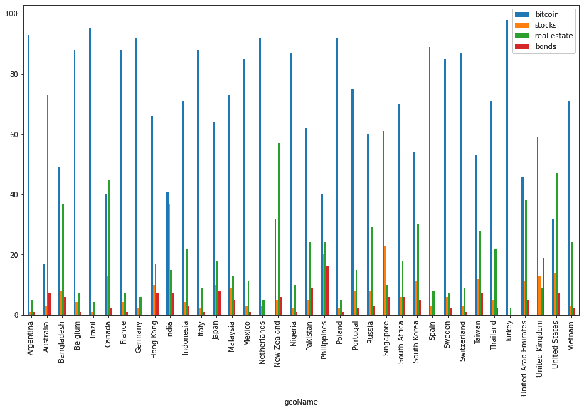

图 3.1：过去 12 个月各地区的相对搜索趋势重要性

在这里，重要的是要记住，搜索趋势是作为给定区域总搜索量的一个分数建模的，因此所有这些结果仅与它们所指示的地区相关。

仅从这个柱状图分析结果可能有点困难，因此我们将深入分析我们分析的每一个搜索词的具体情况。

1.  现在，我们将绘制过去 12 个月里`bitcoin`搜索词表现较好的地区。为此，我们需要选择相应的列，对数值进行升序排序，并使用`plot`方法绘制柱状图，显示在这些地区搜索词相对于总区域搜索量的较大比例：

    ```py
    regiondf_12m['bitcoin'].sort_values(ascending= False).plot(figsize=(14, 8),                              
    ```

    ```py
    y=regiondf_12m['bitcoin'].index,kind ='bar')
    ```

这段代码生成以下结果：

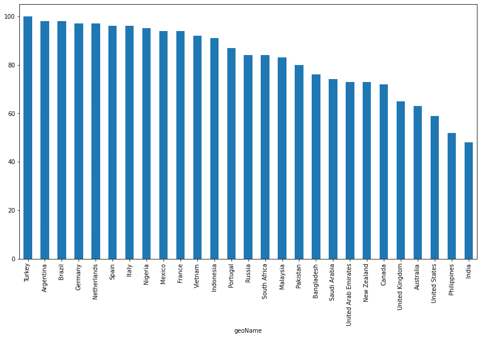

图 3.2：过去 12 个月比特币是热门搜索趋势的国家

这个图表显示了`bitcoin`在过去 12 个月里成为热门搜索趋势的国家。这可以作为市场中给定趋势成熟度的指标，因为这意味着在至少一年内，这些地区相对于其他搜索趋势的搜索量是持续存在的。

1.  接下来，我们将对其余的搜索词执行相同的操作，并将比较各个市场之间的差异。

接下来的代码块以相同的方式过滤、排序并绘制数据，不过这次是针对 `real estate` 搜索词：

```py
regiondf_12m['real estate'].sort_values(ascending= 
   False).plot(figsize=(14, 8),
      y=regiondf_12m['real estate'].index,kind ='bar')
```

这一代码块的结果是一个柱状图，显示了不同地区对这一术语的搜索结果：

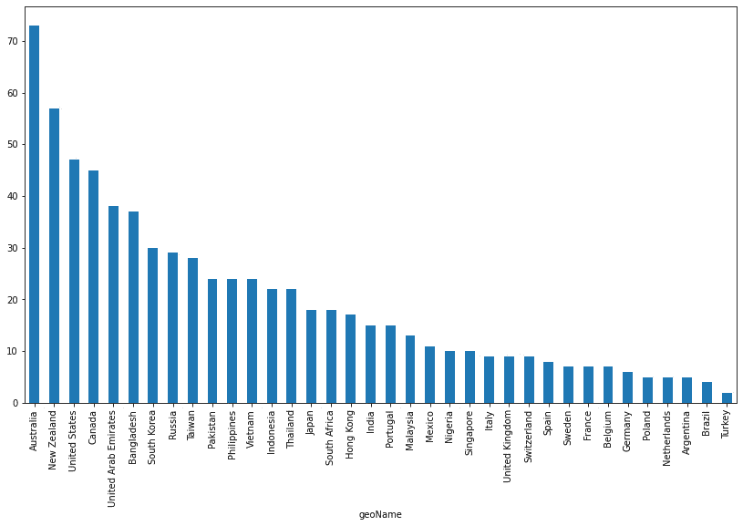

图 3.3：在过去 12 个月中，房地产是搜索趋势排名前列的国家

作为第一个区别，我们可以看到房地产的结果在结果分布上有所不同。虽然我们可以在 *图 3.1* 中看到结果在各个结果之间趋于更均匀分布，但在房地产结果中，数据显示只有少数国家对这一术语的搜索量较大。这可能表明这种类型的投资与当地的法规和条件更加紧密相关。我们可以看到，澳大利亚、新西兰、美国和加拿大是唯一搜索量超过 40 分的国家。

1.  接下来的代码块将展示我们关于搜索词“股票”的表现：

    ```py
    regiondf_12m['stocks'].sort_values(ascending= False).plot(figsize=(14, 8),
    ```

    ```py
         y=regiondf_12m['stocks'].index,kind ='bar')
    ```

这显示了过去 12 个月中 `stocks` 搜索词的结果：

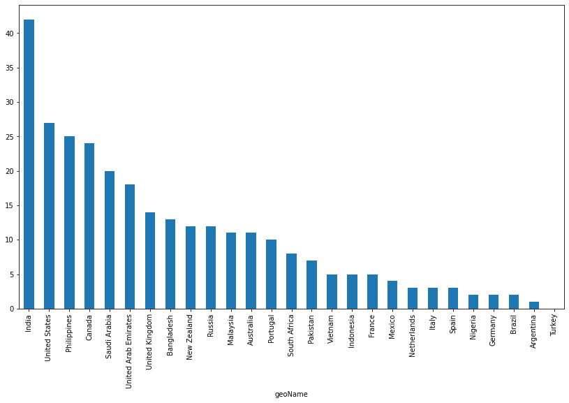

图 3.4：在过去 12 个月中，股票是搜索趋势排名前列的国家

在这里，趋势倾向于重复，但出现在不同的国家。在这种情况下，前五个国家是印度、美国、菲律宾、加拿大和沙特阿拉伯。这里的区别在于，印度是唯一一个超过 40 分的国家。这可能是推测这些地区人们在投资选择方面思考方式的一种方式。

1.  最后，我们需要重复相同的过程，但对于 `bonds` 搜索词，通过更改之前代码中使用的列来实现：

    ```py
    regiondf_12m['bonds'].sort_values(ascending= False).plot(figsize=(14, 8), 
    ```

    ```py
         y=regiondf_12m['bonds'].index, kind ='bar')
    ```

执行这段代码将返回以下结果：

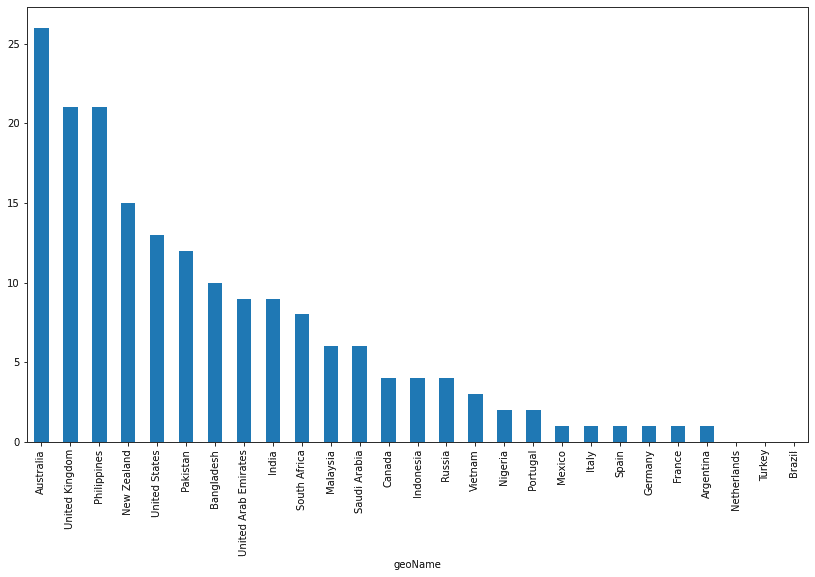

图 3.5：在过去 12 个月中，债券是搜索趋势排名前列的国家

可以看出，债券似乎是用户在搜索投资选项时使用较少的选择。澳大利亚在债券搜索占比方面处于领先地位，同时房地产搜索也位列前茅，这表明债券和房地产似乎是澳大利亚比股票或比特币更具吸引力的选项。

现在我们已经确定了每个资产在受欢迎程度方面表现最好的地区，我们将研究这些趋势模式的变化。

# 寻找搜索趋势模式的变化

搜索趋势不是静态变量；事实上，它们会随时间变化。我们将获得过去 3 个月按地区划分的兴趣结果，然后与过去 12 个月的结果进行比较，看看结果的变化：

1.  为了找出搜索趋势的变化模式，我们将在不同的时间框架内构建负载。

1.  最后，我们将把结果存储在一个名为`regiondf_3m`的`pandas`数据框中：

    ```py
    #search interest per region
    ```

    ```py
    pytrend = TrendReq()
    ```

    ```py
    pytrend.build_payload(kw_list, timeframe='today 3-m')
    ```

    ```py
    # Interest by Region
    ```

    ```py
    regiondf_3m = pytrend.interest_by_region()
    ```

1.  我们需要删除没有搜索词结果的行：

    ```py
    # #looking at rows where all values are not equal to 0
    ```

    ```py
    regiondf_3m = regiondf_3m[regiondf_3m.sum(axis=1)!=0]
    ```

1.  现在，我们可以使用`pandas`数据框的`plot`方法来可视化结果：

    ```py
    # visualize
    ```

    ```py
    regiondf_3m.plot(figsize=(14, 8), y=kw_list, kind ='bar')
    ```

这段代码会生成下一个可视化结果：

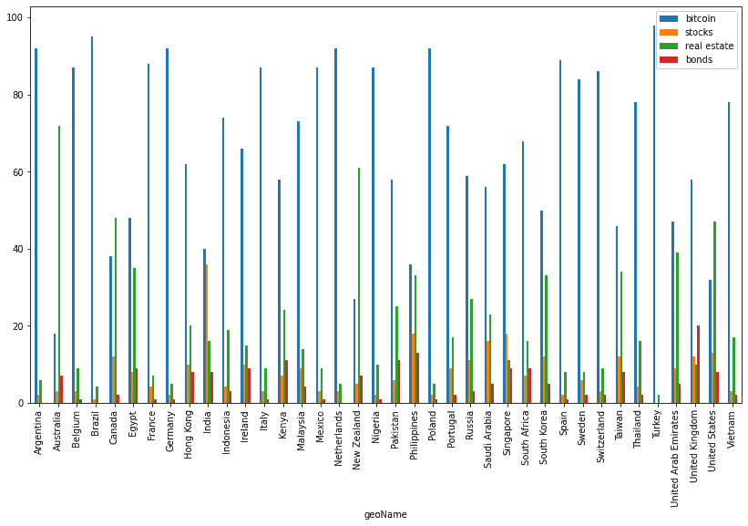

图 3.6：过去 3 个月的兴趣变化

一眼看去，要找到结果中可能的变化是非常复杂的，所以我们将以一种方式排列数据，只展示这些趋势的变化：

1.  第一步是创建一个包含过去 12 个月和过去 3 个月信息的数据框：

    ```py
    df = pd.DataFrame([regiondf_3m['stocks'],
    ```

    ```py
                      regiondf_12m['stocks'],
    ```

    ```py
                      regiondf_3m['bitcoin'],
    ```

    ```py
                      regiondf_12m['bitcoin'],
    ```

    ```py
                      regiondf_3m['real estate'],
    ```

    ```py
                      regiondf_12m['real estate'],
    ```

    ```py
                      regiondf_3m['bonds'],
    ```

    ```py
                      regiondf_12m['bonds']
    ```

    ```py
                      ]).T
    ```

在这里，数据框是通过连接不同搜索词的结果构建的。

1.  接下来，我们需要重命名列并创建表示搜索词随时间变化的兴趣差异的列：

    ```py
    cols = ['stocks_3m','stocks_12m','bitcoin_3m',
    ```

    ```py
    'bitcoin_12m','real_estate_3m','real_estate_12m','bonds_3m','bonds_12m']
    ```

    ```py
    df.columns = cols
    ```

    ```py
    df['diff_stocks'] = df['stocks_12m'] - df['stocks_3m']
    ```

    ```py
    df['diff_bitcoin'] = df['bitcoin_12m'] - df['bitcoin_3m']
    ```

    ```py
    df['diff_real_estate'] = df['real_estate_12m'] - df['real_estate_3m']
    ```

    ```py
    df['diff_bonds'] = df['bonds_12m'] - df['bonds_3m']
    ```

    ```py
    # Inspect the new created columns
    ```

    ```py
    df.head()
    ```

1.  现在，我们可以限制新创建的列的值：

    ```py
    n_cols = ['diff_stocks','diff_bitcoin',
    ```

    ```py
          'diff_real_estate','diff_bonds']
    ```

    ```py
    df = df[n_cols]
    ```

    ```py
    df.head()
    ```

这将生成下一个结果，展示搜索趋势的相对变化：

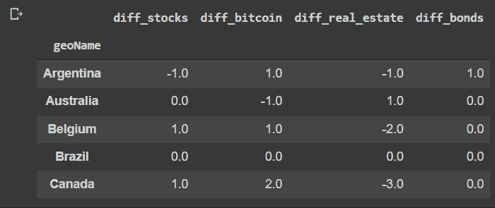

图 3.7：比较过去 3 个月与 12 个月之间的相对差异

1.  有些国家没有变化，因此我们将通过沿着轴求和并将结果与零进行比较，来创建一个掩码，过滤掉这些情况：

    ```py
    # Create a mask for of the null results
    ```

    ```py
    mask = df.abs().sum(axis=1)!=0
    ```

    ```py
    df = df[mask]
    ```

    ```py
    df.head()
    ```

需要注意的是，这种比较仅在绝对值的基础上进行。

上述代码向我们展示了经过筛选的结果。

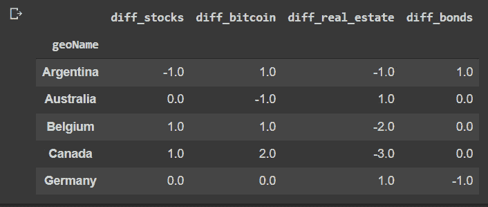

图 3.8：筛选后的相对差异结果

1.  现在，我们可以展示所获得的结果。我们将首先查看那些搜索“股票”一词时发生变化的地区。

为此，我们将使用*图 3.8*中的结果，根据我们想要的列进行筛选，剔除没有变化的行，按升序排序，然后使用`pandas`数据框的`plot`方法可视化结果：

```py
data = df['diff_stocks'][df['diff_stocks']!=0]
data = data.sort_values(ascending = False)
data.plot(figsize=(14, 8),y=data.index, kind ='bar')
```

这将生成下一个结果：

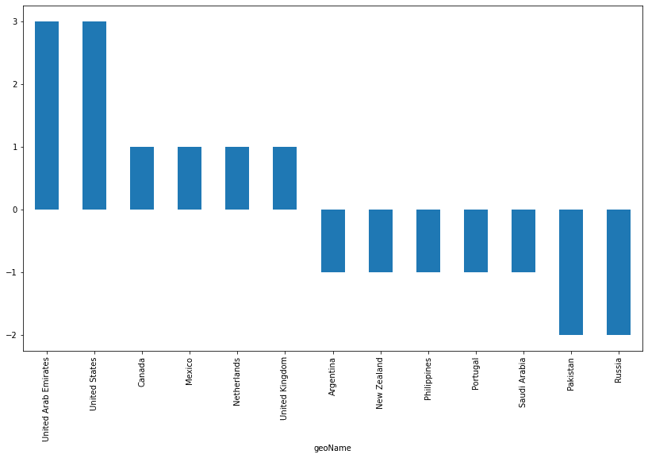

图 3.9：过去 12 个月中，搜索词股票在不同国家的流行度变化

结果显示，与之相比，股票作为搜索趋势在阿联酋和美国的流行度有所巩固，而在巴基斯坦和俄罗斯的流行度则有所下降。这些结果不能直接解释为对资产本身价值认知的变化，而是流量变化的指示。流量的增加可能由正面或负面因素引起，因此深入分析总是很重要。

1.  现在，我们将查看“比特币”搜索趋势变化的差异：

    ```py
    df['diff_bitcoin'][df['diff_bitcoin']!=0
    ```

    ```py
    ].sort_values(ascending = False).plot(figsize=(14, 8), y=df['diff_bitcoin'][df['diff_bitcoin']!=0].index,kind ='bar')
    ```

代码生成下一个图表：

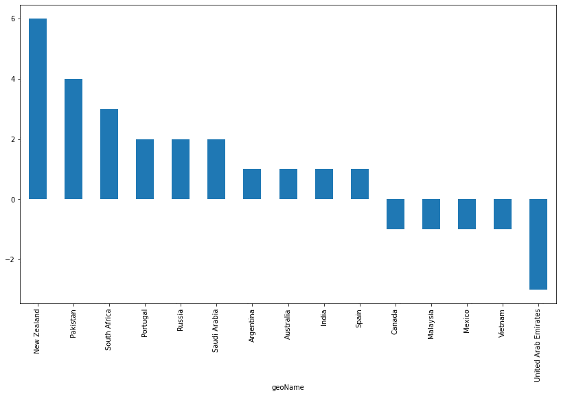

图 3.10：在过去 12 个月中，“比特币”这一搜索词的流行变化国家

关于这个图表，首先需要注意的是，最近几个月的大多数变化是积极的，而非负面的。这可能是过去几个月全球范围内更加广泛采纳的一个标志。

在增长方面，领先的国家是新西兰、巴基斯坦和南非，而阿联酋则处于下降的领先地位。

1.  下一个代码块展示了“债券”这一搜索词的相同效果：

    ```py
    df['diff_bonds'][df['diff_bonds']!=0
    ```

    ```py
    ].sort_values(ascending = False).plot(figsize=(14, 8),y = df['diff_bonds'][df['diff_bonds']!=0].index,kind ='bar')
    ```

结果将在下一个图表中展示：

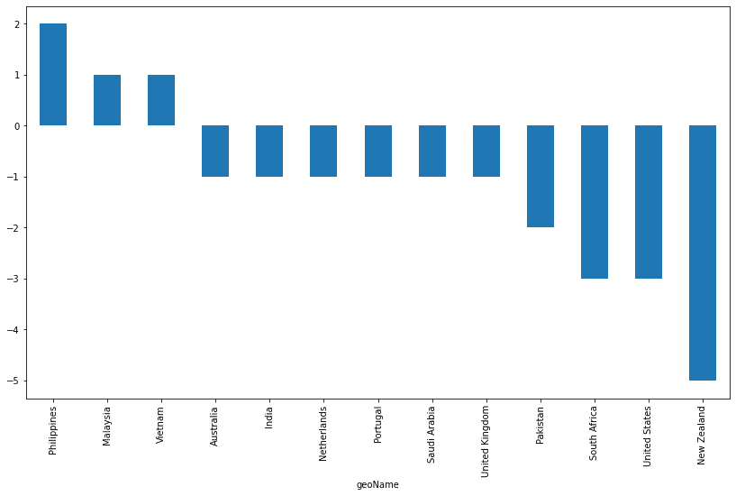

图 3.11：在过去 12 个月中，“债券”这一搜索词的流行变化国家

可以看到一个有趣的趋势变化，现在大多数国家的搜索量都有所下降。这可能是全球投资模式一致变化的一个标志，某些国家受影响的程度较大。还可以注意到，新西兰现在在所分析的时期内是搜索趋势下降最多的国家，而在比特币的情况下，它曾是增长最快的国家。美国也是如此，虽然出现了下降趋势，但在“股票”这一搜索词的变化中却表现出正面的变化。

1.  最后，下面的代码块显示了“房地产”搜索词的变化：

    ```py
    df['diff_real_estate'][df['diff_real_estate']!=0].sort_values(ascending = False).plot(figsize=(14, 8),y=df['diff_real_estate'][df['diff_real_estate']!=0].index,kind ='bar')
    ```

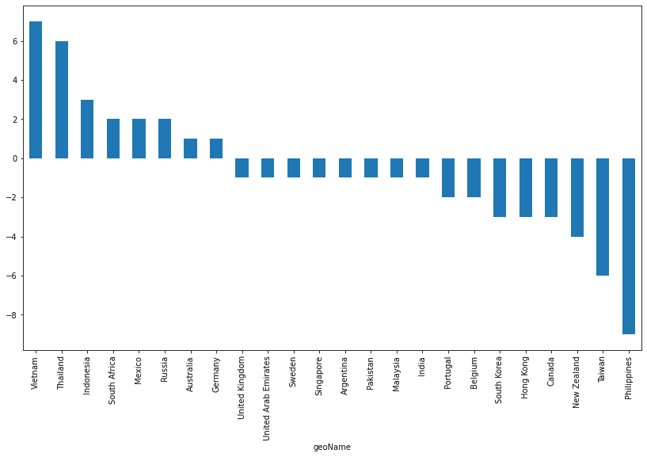

图 3.12：在过去几个月中，“房地产”这一搜索词的流行变化国家

在这种情况下，变化也可以被视为全球范围内负面变化大于正面变化。虽然一些国家如越南和泰国经历了正向变化，但更多的国家在搜索词上出现了下降。这不仅可能由投资决策引起，还可能与搜索模式相关。根据地区的不同，在大多数情况下，房地产被视为一种投资，而在其他情况下，它仅仅是为了居住或商业目的。

在接下来的部分中，我们将深入探讨经历显著变化的国家，并尝试更详细地理解其原因。

# 使用相关查询获取有关新趋势的洞察

如果我们想要找到与我们正在搜索的搜索词最相关的术语的更多信息，可以使用相关查询获取与我们搜索的查询相似的查询。这是有用的，因为它不仅提供了背景信息，还提供了可以进一步分析的趋势信息。

在接下来的代码块中，我们将定义一系列区域，在给定的时间范围内查找相关查询。在这种情况下，我们将查看美国、加拿大、新西兰和澳大利亚。结果将被整理成一个单一的`pandas`数据框：

```py
geo = ['US','CA','NZ','AU']
d_full = pd.DataFrame()
for g in geo:
  pytrend.build_payload(kw_list=['bitcoin','stocks'],
  geo=g,timeframe='today 3-m')
  #get related queries
  related_queries = pytrend.related_queries()
  # Bitcoin top
  d = related_queries['bitcoin']['top']
  d['source_query'] = 'bitcoin'
  d['type'] = 'top'
  d['geo'] = g
  d_full = pd.concat([d_full,d],axis=0)
  # Bitcoin rising
  d = related_queries['bitcoin']['rising']
  d['source_query'] = 'bitcoin'
  d['type'] = 'rising'
  d['geo'] = g
  d_full = pd.concat([d_full,d],axis=0)
  # stocks top
  d = related_queries['stocks']['top']
  d['source_query'] = 'stocks'
  d['type'] = 'top'
  d['geo'] = g
  d_full = pd.concat([d_full,d],axis=0)
  # stocks rising
  d = related_queries['stocks']['rising']
  d['source_query'] = 'stocks'
  d['type'] = 'rising'
  d['geo'] = g
  d_full = pd.concat([d_full,d],axis=0)
```

这段代码将遍历定义的区域，并合并相关查询的结果，这些查询是在给定时间范围内的顶级结果，以及在该地区上升的查询。

最后，我们重置索引并显示前 10 行：

```py
d_full = d_full.reset_index(drop=True)
d_full.head(10)
```

这将产生以下输出：

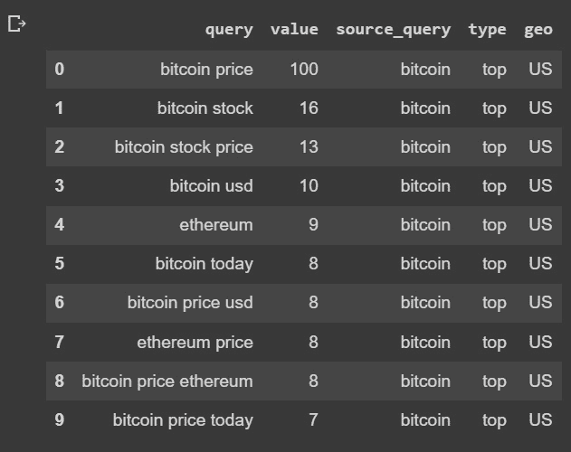

图 3.13：美国地区与比特币相似的查询

我们可以利用相关查询的信息，对与原始搜索词相关的频率和术语进行分析。这将为我们提供更好的背景，以了解特定地区某一资产的相关因素。这意味着，在这种情况下，我们可以看到搜索比特币的人也在搜索以太坊，因此我们可以预期它们之间存在一定的相关性：

1.  让我们使用一种简单的方法，通过使用词云来展示这些查询中最频繁的术语，从而展示最重要的术语。我们将使用`wordcloud`和`matplotlib`包：

    ```py
    from wordcloud import WordCloud
    ```

    ```py
    from wordcloud import ImageColorGenerator
    ```

    ```py
    from wordcloud import STOPWORDS
    ```

    ```py
    import matplotlib.pyplot as plt
    ```

1.  我们将使用美国与“股票”相关的顶级相关查询作为数据：

    ```py
    data = d_full[(d_full['source_query']=='stocks')&(
    ```

    ```py
          d_full['type']=='top')&(d_full['geo']=='US')]
    ```

1.  之后，我们将合并所有结果列，替换源查询以避免冗余，并去除停用词。最后，代码的最后部分将生成图形并显示结果：

    ```py
    text = " ".join(i for i in data['query']).replace('stock','')
    ```

    ```py
    stopwords = set(STOPWORDS)
    ```

    ```py
    wordcloud = WordCloud(stopwords=stopwords, background_color="white").generate(text)
    ```

    ```py
    plt.figure( figsize=(12,8))
    ```

    ```py
    plt.imshow(wordcloud, interpolation='bilinear')
    ```

    ```py
    plt.axis("off")
    ```

    ```py
    plt.show()
    ```

这将生成下一个词云，大小适应术语的相对频率。请注意，我们始终需要至少一个词才能绘制，否则我们将收到一个错误，提示我们得到的词数为 0。


图 3.14：美国“股票”搜索词的频繁相关查询

结果显示，“股票”这个术语主要与以下术语相关：

+   **penny**：指的是便士股市场

+   **now**，**today**：对日常频繁更新的信息和实时更新的需求

+   **dividend**：偏好支付股息的股票

+   **amazon**，**tesla**：受欢迎的股票

+   **reddit**，**news**：信息来源

+   **购买**，**投资**：用户的行为

当试图获取有关驱动用户的模式的信息时，这些信息可能非常有趣。

1.  接下来是与之前相同的代码，但现在它引用了在美国与股票相关的上升搜索词：

    ```py
    data = d_full[(d_full['source_query']=='stocks')&(
    ```

    ```py
          d_full['type']=='rising')&(d_full['geo']=='US')]
    ```

    ```py
    text = " ".join(i for i in data['query']).replace('stock','')
    ```

    ```py
    stopwords = set(STOPWORDS)
    ```

    ```py
    wordcloud = WordCloud(stopwords=stopwords, 
    ```

    ```py
          background_color="white").generate(text)
    ```

    ```py
    plt.figure( figsize=(12,8))
    ```

    ```py
    plt.imshow(wordcloud, interpolation='bilinear')
    ```

    ```py
    plt.axis("off")
    ```

    ```py
    plt.show()
    ```

下一幅图将展示我们原始搜索词相关的上升查询中找到的术语。这些术语的大小根据它们的频率变化，提供了它们相对重要性的信息。

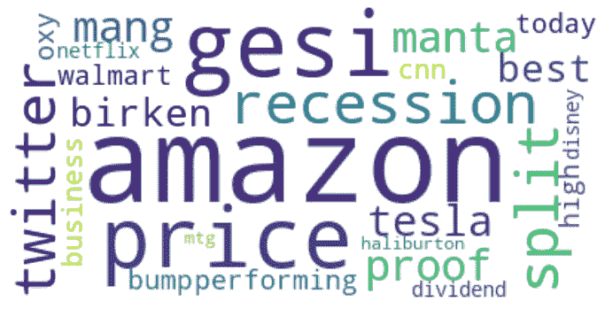

图 3.15：美国与搜索词股票相关的常见热门查询

它显示了不同层次的信息，正如我们所看到的，目前正在发生的事件，例如短期内对衰退的恐惧，表明市场看涨，还有一些新股票名称，如 Twitter、Disney 和 Haliburton。

1.  我们通过查看与新西兰比特币搜索词相关的热门查询，重复相同的练习：

    ```py
    data = d_full[(d_full['source_query']=='bitcoin')&(
    ```

    ```py
          d_full['type']=='top')&(d_full['geo']=='NZ')]
    ```

    ```py
    text = " ".join(i for i in data['query']).replace('bitcoin','')
    ```

    ```py
    stopwords = set(STOPWORDS)
    ```

    ```py
    wordcloud = WordCloud(stopwords=stopwords, 
    ```

    ```py
          background_color="white").generate(text)
    ```

    ```py
    plt.figure( figsize=(12,8))
    ```

    ```py
    plt.imshow(wordcloud, interpolation='bilinear')
    ```

    ```py
    plt.axis("off")
    ```

    ```py
    plt.show()
    ```

这生成了下一个词云。

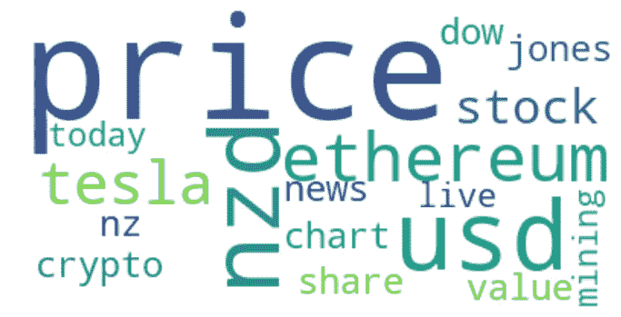

图 3.16：新西兰与搜索词比特币相关的常见热门查询

在这里，我们可以看到特斯拉与比特币以及道琼斯之间的关系。后者可能表明那些想要投资比特币的人，已经在股市中有投资，或者正在考虑投资其中之一。

1.  下一个焦点是新西兰与比特币相关的上升术语：

    ```py
    data = d_full[(d_full['source_query']=='bitcoin')&(
    ```

    ```py
          d_full['type']=='rising')&(d_full['geo']=='NZ')]
    ```

    ```py
    text = " ".join(i for i in data['query']).replace('bitcoin','')
    ```

    ```py
    stopwords = set(STOPWORDS)
    ```

    ```py
    wordcloud = WordCloud(stopwords=stopwords, 
    ```

    ```py
          background_color="white").generate(text)
    ```

    ```py
    plt.figure( figsize=(12,8))
    ```

    ```py
    plt.imshow(wordcloud, interpolation='bilinear')
    ```

    ```py
    plt.axis("off")
    ```

    ```py
    plt.show()
    ```

结果展示在下一个词云中。

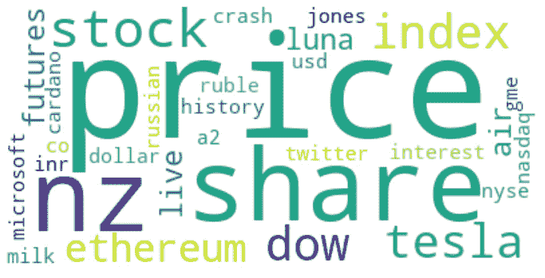

图 3.17：新西兰与搜索词比特币相关的常见热门查询

结果显示了其他加密货币的名称，如 Cardano 和 Luna，同时我们还可以看到“崩盘”这个词，可能与后者有关。

这些可视化图表能够帮助我们一眼就识别出一些越来越重要的术语，它们通过表示每个术语的流行趋势来使用大小来展示。人类一次性吸收大量详细信息的能力有限，因此我们需要提前思考数据的讲故事方式。

# 分析相关查询随时间变化的表现

在获取更多关于背景信息后，我们可以追踪这些查询随时间的演变。这可以为我们提供关于在我们雷达下逐渐升温的本地趋势的有价值信息。我们将通过以下步骤进行：

1.  我们将选择与美国比特币相关的上升查询：

    ```py
    query_data = d_full[(d_full['source_query']=='bitcoin' )&(d_full['type']=='rising')&(d_full['geo']=='US')]
    ```

    ```py
    query_data.head()
    ```

这将产生以下输出：

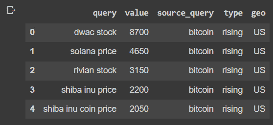

图 3.18：美国与比特币相关的上升查询

1.  我们将使用排名前五的查询，追踪它们在过去 12 个月中的表现：

    ```py
    kw_list = query_data.head()['query'].tolist() # list of keywords to get data
    ```

    ```py
    # build payload
    ```

    ```py
    pytrend.build_payload(kw_list, cat=0, timeframe='today 12-m')
    ```

    ```py
    # Interest over Time
    ```

    ```py
    data = pytrend.interest_over_time()
    ```

    ```py
    data = data.reset_index()
    ```

1.  最后，我们将使用 Plotly 库来展示结果，以便能够更互动地展示信息：

    ```py
    import plotly.express as px
    ```

    ```py
    fig = px.line(data, x="date", y=kw_list, title='Keyword Web Search Interest Over Time')
    ```

    ```py
    fig.show()
    ```

这展示了以下图表，我们可以看到随时间推移，趋势的上升演变：

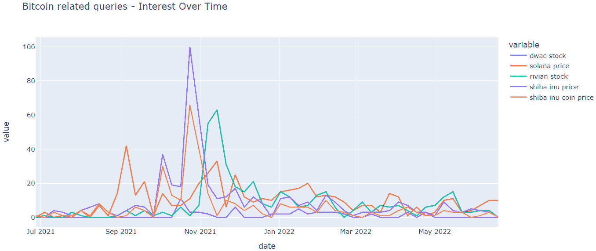

图 3.19：查询性能随时间的变化

我们可以看到，查询在 2021 年 11 月左右达到了峰值，且表现不一。

# 总结

获取不同市场中特定实时趋势的信息可能会非常昂贵，但使用网页搜索引擎流量可以为我们提供有价值的工具，以分析不同地区。在本章中，我们主要关注了按国家级别进行的地区分析，但我们也可以使用不同的地区地理编码，例如 US-NY 代表纽约。

这些信息还可以与销售数据结合使用，以获得有价值的相关性，通过因果分析，能够生成一个变量，用于预测行为，正如我们将在接下来的章节中看到的那样。

接下来的章节将继续关注潜在价值的理解，但这次将聚焦于使用联合分析对产品特征进行评分的层面。
