# 第四章：通过联合分析理解客户偏好

联合分析是用于产品和定价研究的知名方法，可以识别客户偏好，并利用这些知识选择产品特性、评估价格敏感性、预测市场份额以及预测消费者对新产品或服务的接受程度。

联合分析经常用于各种商品，包括消费品、电器、人寿保险政策、退休社区、奢侈品和航空旅行等多个领域。它可以应用于各种情境，旨在了解客户最可能购买的产品类型以及消费者在产品中最看重（和最不看重）的特性。因此，它在产品管理、市场营销和广告中被广泛使用。

联合分析对各种规模的企业都有益处，即使是小型的本地餐馆和杂货店。

在本章中，您将学习联合分析在市场研究中的应用及实验如何进行。然后，您将使用**普通最小二乘**（**OLS**）模型进行联合分析，并使用不同的**机器学习**（**ML**）模型预测新产品特性的表现。

本章包括以下主题：

+   理解联合分析

+   设计联合实验

+   确定产品的相关属性

+   使用 Python 和 Statsmodels 的 OLS

+   使用更多产品特性

+   预测新特性组合

让我们使用一些消费品零售产品的模拟数据来进行分析。

# 技术要求

为了能够按照本章的步骤操作，您需要满足以下要求：

+   运行 Python 3.7 及以上版本的 Jupyter 笔记本实例。如果您有 Google Drive 帐户，也可以使用 Google Colab 笔记本运行这些步骤。

+   对基本数学和统计概念的理解。

# 理解联合分析

联合分析是一种研究性统计方法，用于市场研究，以确定人们如何评估构成单一产品或服务的不同属性（特征、功能和好处）。

联合分析起源于数学心理学，其目标是确定有限数量属性的组合对受访者选择和决策的影响最大。受访者被呈现一组潜在产品或服务，并通过分析如何从这些产品中选择，隐含评估了产品或服务的每个组成部分。您可以决定使用这些隐含评分（效用或分数）创建估计市场份额、销量甚至新设计的盈利能力的市场模型。

可设计不同类型的联合研究：

+   基于排名的联合

+   基于评分的联合

+   基于选择的联合

联合分析还广泛应用于社会科学和实际科学领域，包括运筹学、产品管理和营销。它通常用于服务设计、广告吸引力分析以及新产品设计的消费者接受度测试。尽管联合分析已被应用于产品布局，但也有一些人反对这种用法。

联合分析方法是系统决策分析工具中一类更广泛的权衡分析工具的子集，也被称为多属性组合建模、离散选择建模或表达偏好研究。联合分析将产品或服务拆解为其称为属性的组成部分，并测试这些组件的不同组合，以确定消费者的偏好。

在下一个图示中，我们可以看到产品是不同水平特征的组合——例如，一袋薯片可以通过品牌、口味、尺寸和价格等水平来表示：

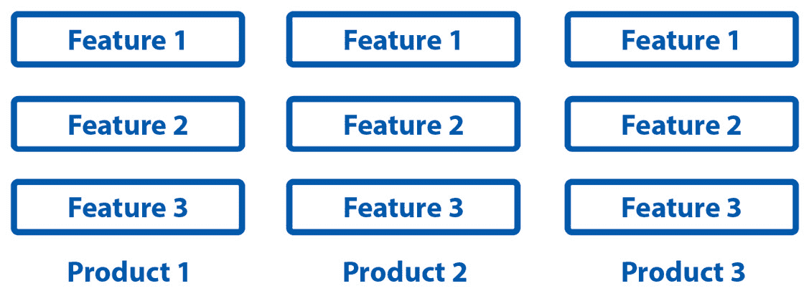

图 4.1：不同产品作为特征的独特组合

下面是这些属性和水平组合可能出现在联合选择任务中的选项方式：

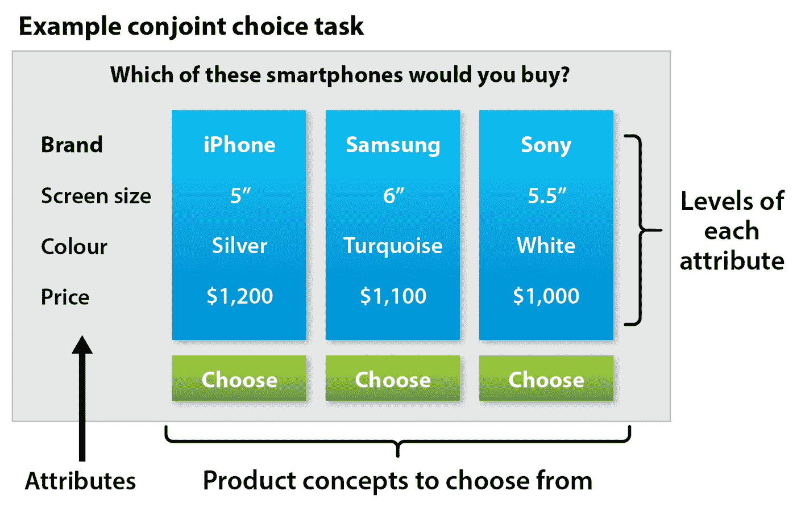

图 4.2：联合选择任务

联合分析采用了一种更加现实的方式，而不是仅仅询问你喜欢产品的哪些方面或哪些特征最重要。

在调查中，每个人被要求在具有相同属性水平但不同组合的产品之间做出选择。这个模型被称为基于选择的联合分析，在大多数情况下，由 8 到 12 个“对抗”产品组成。这个过程旨在模拟购买行为，越接近实际情况，效果越好。属性选择和对抗设置被设计为需要领域知识的实验。这些信息随后被用来衡量各个属性对用户购买模式的影响。

现在我们已经了解了联合分析是什么以及如何用它来衡量顾客对某些产品特征的看法，接下来我们将探讨如何设计这些实验。

# 设计联合实验

产品或服务领域描述为一组属性。例如，一台笔记本电脑可能具有屏幕尺寸、品牌和价格等特征。因此，每个属性可以划分为多个层级——例如，屏幕尺寸可以是 13、14 或 15 英寸。受访者将看到一组由所有或部分配置属性层级组合而成的产品、原型、模型或图片，以供选择、排序或展示进行评估。你将被要求进行排名。每个示例足够相似，消费者会认为它是一个不错的替代品，但又足够不同，使得受访者能够清晰地识别出他们的偏好。每个示例由独特的产品特征组合构成。数据可以包括单独的评分、排名，或从不同组合中进行选择。

联合设计包含四个不同的步骤：

1.  确定研究类型

1.  确定相关特征：

    +   与管理决策相关

    +   在现实中有不同的层级

    +   预计会影响偏好

    +   易于理解并清晰定义

    +   显示没有过度相关性（价格和品牌是例外）

    +   至少应存在两个层级

1.  指定属性的层级：

    +   明确无误

    +   相互排斥

    +   现实的

1.  **设计问卷**：随着属性和层级组合数量的增加，备选方案的数量呈指数增长。应对指数增长的方式之一是采用分数因子设计方法，这种方法通常用于减少需要检查的资料数，同时确保有足够的数据用于统计分析。这反过来会产生一组控制良好的“资料”供受访者考虑。

在设计联合实验时考虑这些要点，将使我们能够准确地建模并复制我们希望了解的消费者行为模式。我们必须时刻记住，这项分析的目的是通过尽可能模拟实际购买行为，揭示隐藏的模式。

# 确定产品相关的属性

如前所述，我们将进行联合分析，衡量一组用户对某个产品或服务特征的重视程度。为此，我们将进行多变量分析，确定最优的产品概念。通过评估整个产品（总体效用值），可以计算出各个元素对购买决策的影响程度（部分效用值）。例如，当用户购买 PC 时，可以确定哪些因素影响这一决策，以及影响的程度（重要性）。同样的方法也可以扩展到更多特征。

要使用的数据以不同的笔记本电脑特征组合形式呈现，涉及 RAM、存储和价格。不同的用户对这些组合进行排序。

我们将在下一个示例中使用以下 Python 模块：

+   **Pandas**：Python 包，用于数据分析和数据操作。

+   **NumPy**：Python 包，允许使用矩阵和数组，并可以使用数学和统计函数在这些矩阵上进行操作。

+   **Statsmodels**：Python 包，提供 SciPy 在统计计算方面的补充，包括描述性统计以及统计模型的估计和推断。它提供了用于估计多种不同统计模型的类和函数。

+   **Seaborn 和 Matplotlib**：Python 包，用于有效的数据可视化。

1.  接下来的代码块将导入必要的包和函数，并创建一个带有模拟数据的示例 DataFrame：

    ```py
    import numpy as np
    ```

    ```py
    import pandas as pd
    ```

    ```py
    import seaborn as sns
    ```

    ```py
    import matplotlib.pyplot as plt
    ```

    ```py
    import statsmodels.api as sm
    ```

    ```py
    # data: Laptop spec data
    ```

    ```py
    data = pd.DataFrame([[6000, '4GB', '128GB', 3],
    ```

    ```py
                         [6000, '8GB', '512GB', 9],
    ```

    ```py
                         [8000, '4GB', '512GB', 5],
    ```

    ```py
                         [8000, '8GB', '128GB', 7],
    ```

    ```py
                         [6000, '4GB', '128GB', 4]],
    ```

    ```py
                        columns=['price', 'memory', 
    ```

    ```py
                                'storage', 'score'])
    ```

    ```py
    data.head()
    ```

这将产生以下输出：

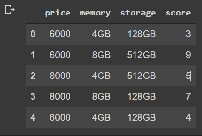

图 4.3：产品特征及其评分

1.  接下来的代码将把我们的数据分离成预测变量和目标变量：

    ```py
    X = data[[col for col in data.columns if col != 'score']]
    ```

    ```py
    y = data['score']
    ```

    ```py
    X.head()
    ```

这将产生以下输出：

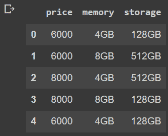

图 4.4：产品特征

1.  以下代码行将使用编码的分类变量创建虚拟变量：

    ```py
    X_dum = pd.get_dummies(X, columns=X.columns)
    ```

    ```py
    X_dum.head()
    ```

这将产生以下输出：

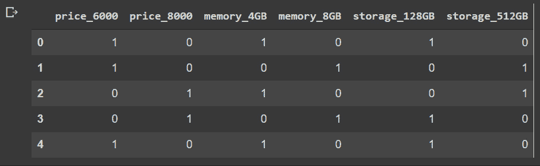

图 4.5：产品及其特征的独热编码表示

现在，信息已经被正确编码，我们可以使用不同的预测模型来尝试预测，根据产品特征，判断每个产品的评分。在下一节中，我们可以使用 OLS 回归模型来确定变量的重要性，并推断出用户在选择购买产品时最看重的特征。

# 使用 Python 和 Statsmodels 的 OLS 方法

OLS，一种线性最小二乘法方法，在统计学中用于估计线性回归模型中未确定的参数。通过最小化因变量的观测值与通过自变量的线性函数预测的值之间的差异的平方和，OLS 根据最小二乘原则，从一组解释变量中推导出线性函数的参数。

提醒一下，线性回归模型建立了一个因变量（*y*）和至少一个自变量（*x*）之间的关系，公式如下：

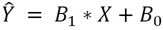

在 OLS 方法中，我们必须选择 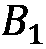 和 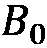 的值，使得计算值与观测值之间的差异平方和最小化。

OLS 可以用几何学的术语来描述，即所有数据点到回归面之间的平方距离之和。这个距离是平行于调整面轴线的，距离越小，面就越能更好地拟合数据。当误差是同方差且彼此不相关时，OLS 是一种特别有用的方法，当回归中使用的变量是外生的时，效果尤为显著。

当误差具有有限方差时，OLS 方法提供一个最小方差的无偏估计。OLS 在额外假设误差呈正态分布的前提下，是最大似然估计器。

我们将使用 Python 的 statsmodels 模块来实现 OLS 线性回归方法：

```py
model = sm.OLS(y, sm.add_constant(X_dum))
result = model.fit()
result.summary()
```

OLS 回归过程用于估计多元数据中的线性关系，得到了一个 R 平方值为 **0.978**：

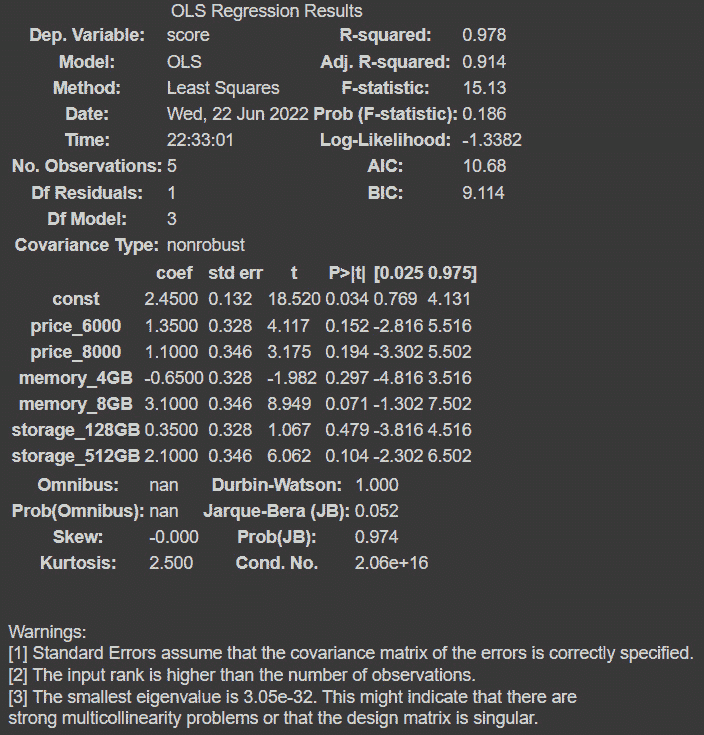

图 4.6：OLS 模型摘要

结果摘要显示了我们一些基本信息，以及相关的指标。其中一些包括 R 平方值、用于训练模型的观测数、模型的自由度、协方差及其他信息。

在这个摘要中需要解释的一些最重要的方面是以下值：

+   `'score'` 变量。由于模型的 R 平方值随着添加的变量不会下降，即使它们只贡献了很少的部分，模型也可能看起来更准确。这个属性在分析多个自变量对模型的有效性时非常重要。较低的调整 R 平方值可能表明某些变量没有充分地贡献到模型中，因为调整后的 R 平方会根据变量的数量惩罚 R 平方公式。

+   `null` 假设，或者说是否准确地表述变量的效应为零。你可以看到，这种情况的概率是 15.3%。

+   **截距**：如果我们模型中的所有变量都设置为 0，那么截距就是结果。这是我们的 b，一个常数，用来声明经典线性方程“y = mx + b”中的起始值。这些是交点下的变量。系数是我们表格中的第一个有用列。它是我们部分的值，它衡量了每个变量变化对自变量的影响。“y = mx + b”中的“m”就是罪魁祸首，其中“m”是变量系数在自变量中的变化率，或者是因变量单位变化的结果。如果系数是负的，它们之间存在反向关系，这意味着一个变量上升时，另一个变量会下降。

+   **std error**：系数的标准差，或者说系数在数据点之间的变化程度，是通过 std error（或标准误差）变量来估计的，它衡量了系数测量的准确性，并与之相关。在 t 统计量较高的情况下，这意味着系数的重要性较高，这通常是由于标准误差相对较低而系数较高所产生的。

+   **P>|t|**：摘要中的一个最重要的统计量是 p 值。t 统计量用于生成 p 值，它表示在我们的模型中，系数由随机因素决定的可能性。一个低 p 值（如 0.278）表示有 27.8% 的概率表明所提供的变量对因变量没有影响，并且我们的结果是偶然的。p 值将与一个预先设定的 alpha 值（或阈值）进行比较，以便我们能够为我们的系数附加显著性，在适当的模型分析中进行检验。

+   **[0.025 和 0.975]**：是我们的系数值在 95% 数据范围内或两倍标准差范围内的测量值吗？超出这些范围的值通常可以视为离群值。数据是否包含在两个标准差之间，超出这个范围的数据可以被视为离群值？

+   **Omnibus**：使用偏度和峰度作为度量，Omnibus 描述了残差分布的正态性。0 表示完全正态。一个叫做 Prob (Omnibus) 的统计检验用于确定残差是否符合正态分布的可能性。1 表示完全正态的分布。偏度的范围是从 0 到完美对称，衡量数据的对称程度。峰度衡量数据的尖峭程度，或者它在正态曲线上的集中程度。较高的峰度意味着较少的离群值。

+   **Durbin-Watson**：数据中的同方差性，即误差的均匀分布，是通过 Durbin-Watson 统计量来衡量的。异方差性则表示不均匀分布，例如当数据点增多时，相对误差也增大。理想的同方差性应该在 1 和 2 之间。使用偏度和峰度来测量相同的 Omnibus 和 Prob (Omnibus) 值的替代方法是 Jarque-Bera (JB) 和 Prob。这些理想方法帮助我们相互验证。衡量我们的模型对所处理数据变化的敏感度的指标是条件数。许多不同的条件强烈暗示多重共线性，这是一个用来描述两个或多个自变量彼此强相关，并且通过冗余错误地影响我们预测变量的术语。

在我们的案例中，我们将使用数据的结果，并将变量名称、权重和 p 值存储在 DataFrame 中，稍后我们将用它来绘制数据：

```py
data_res = pd.DataFrame({'name': result.params.keys(),
                         'weight': result.params.values,
                         'p_val': result.pvalues})
data_res = data_res[1:]
data_res
```

查看 p 值时，如果显著性水平低于 5%，这可能表明该变量在统计学上不显著：

```py
data_res = data_res.sort_values(by='weight')
data_res
```

这将产生以下输出：

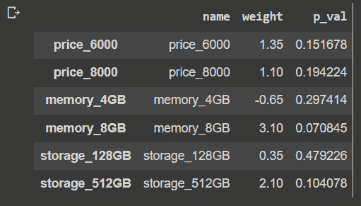

图 4.7：产品特征的权重和 p 值

虽然考虑 p 值以建立统计显著性水平很重要，但模型应该包含所有变量。在这里，我们可以使用 Prob (F 统计量)，在我们的案例中该值大于 0.05，因此我们无法拒绝原假设。通过查看一个非常高的 R 平方值，我们可以看到模型存在过拟合。我们需要更多的数据来创建一个显著的模型，但这个挑战我会留给你。

下一个截图显示了按相对权重排序的产品特征。在这种情况下，用户对 8GB 内存的评价较高，其次是 128GB 存储：

```py
sns.set()
xbar = np.arange(len(data_res['weight']))
plt.barh(xbar, data_res['weight'])
plt.yticks(xbar, labels=data_res['name'])
plt.xlabel('weight')
plt.show()
```

这将产生以下输出：

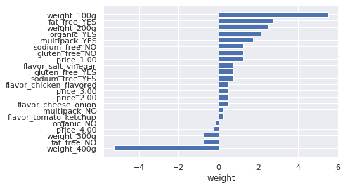

图 4.8：按权重排序的产品特征

可以看出，内存在评价中的贡献最大，其次是存储。

我们已经看到 OLS 如何作为一种手段来估计每个产品特征的重要性。在这种情况下，它被建模为对单一变量的回归，但我们可以包括有关响应者类型的信息，以发现不同的客户群体如何对产品特征做出反应。

在下一部分，我们评估一个具有更多特征的消费品案例。

# 使用更多的产品特征

在这个示例中，我们将使用一个包含比前一个示例更多特征的数据集。在这种情况下，我们将模拟来自一家脆片零售商的数据，该零售商已要求一些客户根据他们的偏好程度对其产品进行排名：

1.  以下代码块将读取数据集，该数据集为 CSV 文件，并将提示我们显示结果：

    ```py
    # Load data
    ```

    ```py
    conjoint_dat = pd.read_csv('/content/conjoint_data.csv')
    ```

    ```py
    conjoint_dat
    ```

这将产生以下输出：

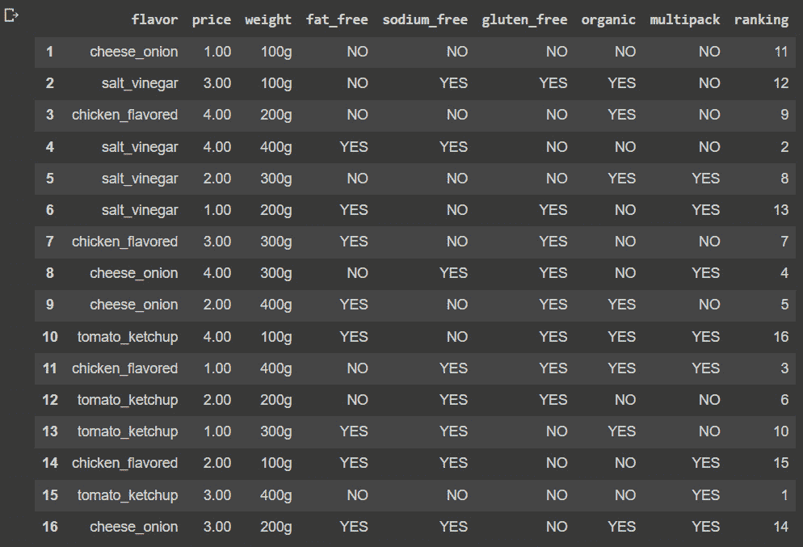

图 4.9：脆片数据

1.  我们可以看到数据仅包含分类值，因此需要使用`get_dummies` pandas 函数将这些分类数据转换为独热编码向量表示，这就是我们在下一个代码块中所做的：

    ```py
    conjoint_dat_dum = pd.get_dummies(conjoint_dat.iloc[:,:-1], columns = conjoint_dat.iloc[:,:-1].columns)
    ```

    ```py
    conjoint_dat_dum
    ```

我们可以看到现在我们已经创建了一组列，这些列用 1 和 0 描述了产品特征：

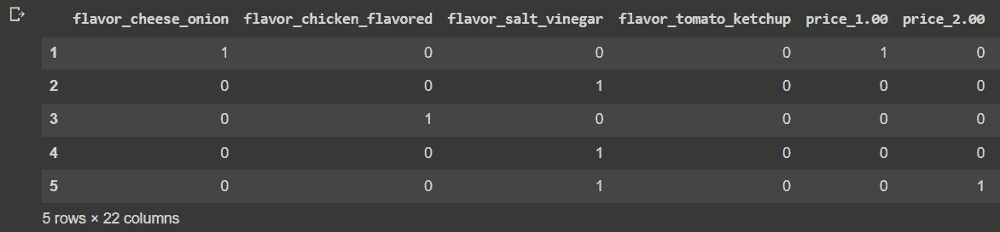

图 4.10：脆片数据的独热编码表示

1.  我们现在可以构建一个 OLS 模型，使用产品特征的独热编码向量表示，并将排名作为目标变量：

    ```py
    main_effects_model_fit = sm.OLS(conjoint_dat['ranking'].astype(int), sm.add_constant(conjoint_dat_dum))
    ```

    ```py
    result = main_effects_model_fit.fit()
    ```

    ```py
    result.summary()
    ```

这将产生以下输出：

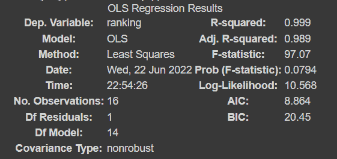

图 4.11：OLS 回归结果

模型摘要中的**AIC**和**BIC**术语，分别代表**赤池信息准则**和**贝叶斯信息准则**，是模型选择标准中常用的术语；然而，它们是不可互换的。BIC 是一个从包含变量参数数量不等的参数模型类中选择模型的方法，而 AIC 可以被看作是估计统计模型拟合优度的度量。BIC 对额外参数的惩罚比 AIC 更大。BIC 对自由参数的惩罚比 AIC 更严厉。

AIC 通常会寻找未发现的具有高维实际情况的模型。这表明 AIC 模型并不准确。另一方面，BIC 仅会遇到`True`模型。此外，BIC 是一致的，尽管 AIC 可能不一致，可以这么说。BIC 会指示出可能的欠拟合风险，而 AIC 则更适合用来检查模型是否存在过度拟合的风险。尽管 BIC 比 AIC 更宽容，但随着数量的增加，它变得不那么宽容。通过 AIC，交叉验证可以渐近相等。另一方面，BIC 对于精确估计非常有用。

在比较 BIC 和 AIC 时，BIC 对额外参数的惩罚比 AIC 更高。AIC 通常会寻找一个具有高维实际情况的未识别模型。另一方面，BIC 仅会找到`True`模型。AIC 是不一致的，而 BIC 是一致的。尽管 BIC 比 AIC 更宽容，但随着数量的增加，它变得不那么宽容。BIC 对自由参数的惩罚比 AIC 更严厉。

1.  接下来的代码将创建一个数据框，用于存储来自分析的最重要的值，在此情况下为权重和 p 值：

    ```py
    data_res = pd.DataFrame({'name': result.params.keys(),
    ```

    ```py
                             'weight': result.params.values,
    ```

    ```py
                             'p_val': result.pvalues})
    ```

    ```py
    data_res = data_res[1:]
    ```

    ```py
    data_res
    ```

这将产生以下输出：

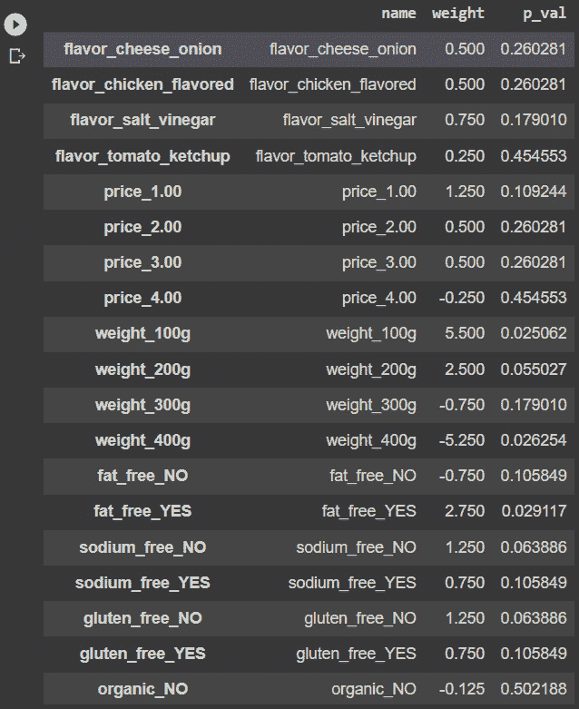

图 4.12：OLS 变量权重和 p 值

1.  现在我们已经排列好了这些值，我们可以检查每一个关系的显著性，以检查假设的有效性并可视化权重：

    ```py
    xbar = np.arange(len(data_res['weight']))
    ```

    ```py
    plt.barh(xbar, data_res['weight'])
    ```

    ```py
    plt.yticks(xbar, labels=data_res['name'])
    ```

    ```py
    plt.xlabel('weight')
    ```

    ```py
    plt.show()
    ```

这将产生以下输出

:


图 4.13：按重要性排序的变量权重

在这种情况下，可以看出有一些因素是正相关的，比如 100 克的重量和产品为无脂肪的选项，而其他因素是负相关的，比如 400 克的重量，接着是产品不是无脂肪的。

可能出现的一个问题是：*如果我们有一个回归模型来估计产品得分，能否使用同一个模型预测客户如何对新产品组合做出反应？* 从理论上讲，我们可以，但在这种情况下，我们必须使用评分系统而非排名，并且需要更多更多的数据。为了演示的目的，我们将继续进行，因为这些数据难以获得，甚至更难披露。

# 预测新特征组合

现在我们已经正确训练了预测模型，除了捕获产品特征的重要性外，我们还可以利用它为我们提供关于新产品特征表现的信息：

1.  在完成 EDA（探索性数据分析）之后，我们将开发一些预测模型并进行比较。我们将使用已创建虚拟变量的数据框架，并将所有变量缩放到 0 到 1 的范围内：

    ```py
    from sklearn.preprocessing import StandardScaler
    ```

    ```py
    X = conjoint_dat_dum
    ```

    ```py
    y = conjoint_dat['ranking'].astype(int)
    ```

    ```py
    # The target variable will be normalized from a ranking to a 1 to 10 score
    ```

    ```py
    y = y.apply(lambda x: int(x/len(y)*10))
    ```

    ```py
    features = X.columns.values
    ```

    ```py
    scaler = StandardScaler()
    ```

    ```py
    scaler.fit(X)
    ```

    ```py
    X = pd.DataFrame(scaler.transform(X))
    ```

    ```py
    X.columns = features
    ```

这将导致以下输出：

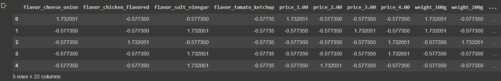

图 4.14：标准化变量

最受欢迎的机器学习模型之一是逻辑回归，它是一种利用自变量进行预测的算法。该算法可以用于分类和回归任务。它是一种监督学习算法，需要数据标注。该算法利用示例答案来拟合模型，以达到目标变量，在我们这里就是产品排名。从数学角度来看，该模型旨在根据一组自变量 X 预测 Y。逻辑回归可以分为二元逻辑回归和多项式逻辑回归。这两者的特点可以描述如下：

+   **二元**：所有类型的逻辑回归中使用最广泛的是二元逻辑回归，算法旨在区分 0 和 1，这一任务被视为分类问题。

+   **多项式**：当目标或自变量具有三个或更多潜在值时，使用多项式逻辑回归。例如，利用胸部 X 光的特征可以指示三种可能的结果之一（无病、肺炎或纤维化）。在这种情况下，示例根据特征被排序成三种可能的结果之一，使用的是多项式逻辑回归。当然，目标变量可以有超过三个可能的值。

+   **有序逻辑回归**：如果目标变量本质上是有序的，则使用有序逻辑回归。在这种类型中，每个类别都有定量意义，并且具有明显的顺序。此外，目标变量包含的不仅仅是两个类别。例如，考试结果根据定量标准进行分类和排序。简单来说，成绩可以是 A、B 或 C。

1.  线性回归和逻辑回归的主要区别在于，逻辑回归用于解决分类问题，而线性回归用于解决回归问题。回归问题中的目标变量可能具有连续值，例如产品价格或参与者年龄，而分类问题则涉及预测仅具有离散值的目标变量，例如确定一个人的性别或肿瘤是良性还是恶性：

    ```py
    # Logistic Regression
    ```

    ```py
    from sklearn.model_selection import train_test_split
    ```

    ```py
    from sklearn.linear_model import LogisticRegression
    ```

    ```py
    from sklearn import metrics
    ```

    ```py
    X_train, X_test, y_train, y_test = train_test_split(X, y, test_size=0.5, random_state=101)
    ```

    ```py
    # Running logistic regression model
    ```

    ```py
    model = LogisticRegression()
    ```

    ```py
    result = model.fit(X_train, y_train)
    ```

通过将训练集特征及其匹配的目标类别值输入模型，模型可以被训练。这将帮助模型学习如何对新案例进行分类。评估模型在尚未遇到的实例上的表现至关重要，因为只有当它能够准确分类那些不属于训练集的示例时，模型才会有用。

误差平方的平均值由`真实`值来衡量。

1.  MSE 始终为正，尽管如果预测完全准确，MSE 可以为 0。它包括估计器的方差（估计值的分布范围）和偏差（估计值与实际值之间的差异）：

    ```py
    prediction_test = model.predict(X_test)
    ```

    ```py
    # Print the prediction accuracy
    ```

    ```py
    print(metrics.mean_squared_error(y_test, prediction_test))
    ```

这将产生以下输出：

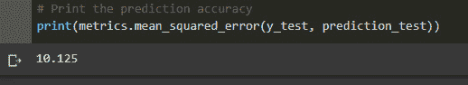

图 4.15：简单回归的 MSE

1.  MSE 始终为 0 或正值。如果 MSE 很大，这意味着线性回归模型预测不准确。重要的一点是，MSE 对异常值很敏感。这是因为每个数据点的误差是平均的。因此，如果异常值的误差很大，MSE 将被放大。MSE 没有“目标”值。然而，MSE 是衡量模型如何拟合数据的良好指标。它还可以帮助你判断是否更倾向于选择一个模型而非另一个：

    ```py
    # To get the weights of all the variables
    ```

    ```py
    weights = pd.Series(model.coef_[0],
    ```

    ```py
                     index=X.columns.values)
    ```

    ```py
    print(weights.sort_values(ascending = False)[:10].plot(kind='bar'))
    ```

这将产生以下输出：

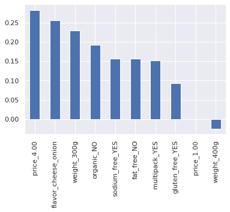

图 4.16：线性回归顶级变量贡献

在这里，我们可以看到模型识别为与得分正相关的前 10 个变量。

1.  接下来的代码将显示那些与结果负相关的变量：

    ```py
    print(weights.sort_values(ascending = False)[-10:].plot(kind='bar'))
    ```

这将产生以下输出：

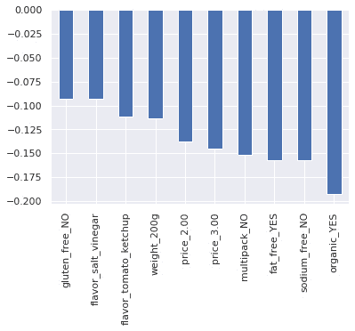

图 4.17：线性回归负向变量贡献

随机森林是一种**监督学习**（**SL**）算法。它既可以用于分类，也可以用于回归。此外，它是最具适应性和用户友好的算法。森林中有很多树。森林中的树木越多，它应该越强大。在随机选择的数据样本上，随机森林生成决策树，从每棵树中获取预测结果，然后投票选出最佳选项。它们还提供了特征重要性的相当准确的指示。

随机森林的应用包括特征选择、图片分类和推荐引擎。它们可以用于分类可靠的贷款候选人、发现欺诈行为和预测疾病。

随机森林是一种元估计器，它通过采用均值来提高预测准确性并减少过拟合。它在多个数据集子样本上拟合多个决策树分类器。如果`bootstrap = True`（默认设置），子样本的大小由`max_samples`参数指定；否则，每棵树都是使用完整的数据集构建的。在随机森林中，集成中的每棵树都是使用从训练集中提取的样本（即，带有替代的样本）构建的。此外，在构建树时，每次拆分节点时，都会发现所有输入特征或任何`max_features`大小子集的最佳分割。

这两种随机源用于降低森林估计器的方差。实际上，单个决策树常常过拟合并具有较大的方差。通过将随机性引入森林，会生成具有部分不相关预测误差的决策树。通过对这些预测进行平均，可以帮助某些误差消失。通过合并多棵树，随机森林减少了方差，有时会稍微增加一些失真。实际上，方差减少通常较大，从而产生一个更强大的整体模型。

scikit-learn 的实现并不是让每个分类器选择单一类别，而是通过对其概率预测取平均来组合多个分类器：

```py
from sklearn.ensemble import RandomForestClassifier
model_rf = RandomForestClassifier(n_estimators=1000 , oob_score = True, n_jobs = -1,random_state =50, max_features = "auto",max_leaf_nodes = 30)
model_rf.fit(X_train, y_train)
# Make predictions
prediction_test = model_rf.predict(X_test)
print(metrics.mean_squared_error(y_test, prediction_test))
```

这将产生以下输出：

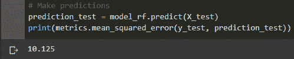

图 4.18：随机森林均方误差

机器学习模型的一个可选算法是随机森林算法，该算法在 scikit-learn 包中实现，包括`RandomForestRegressor`和`RandomForestClassifier`类。这些类可以被拟合到数据中，从而得到一个模型，该模型随后可以用来进行新预测或获取关于特征重要性的信息，这是联合分析的重要核心，如以下示例所示：

```py
importances = model_rf.feature_importances_
weights = pd.Series(importances, index=X.columns.values)
weights.sort_values()[-10:].plot(kind = 'barh')
```

这将产生以下输出：

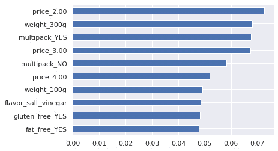

图 4.19：随机森林特征重要性

XGBoost 库是一个高效、适应性强且便于分布式梯度增强的库。它在梯度提升框架内应用机器学习技术，并提供并行树增强（也称为 GBDT 和 GBM），能够快速准确地解决各种数据科学问题。相同的代码可以处理涉及超过万亿个样本的问题，并在大规模分布式环境中运行。

它是最近在多个机器学习竞赛中获胜算法的主要推动力。由于其无与伦比的速度和性能，它在监督学习任务中经常超过所有其他算法。

主要算法可以在 GPU 集群或甚至 PC 网络上运行，因为该库是可并行化的。这使得在数亿训练实例上进行训练并以高性能解决机器学习任务成为可能。

在赢得一项重要的物理学竞赛后，它迅速被机器学习社区所接受，尽管最初是用 C++编写的：

```py
from xgboost import XGBClassifier
model = XGBClassifier()
model.fit(X_train, y_train)
preds = model.predict(X_test)
metrics.mean_squared_error(y_test, preds)
```

这产生了以下输出：

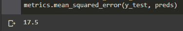

图 4.20：随机森林 MSE

我们可以看到，随机森林的均方误差（MSE）甚至大于线性回归。这是因为数据不足以获得更好的得分，所以在接下来的步骤中，我们需要考虑增加数据点的数量来进行分析。

# 摘要

在本章中，我们学习了如何进行联合分析，这是一种统计工具，可以帮助我们揭示消费者偏好，这些偏好通常难以确定。我们进行分析的方式是使用 OLS 估算不同特征组合的表现，并尝试隔离每个可能配置对客户总体感知的影响，以揭示消费者认为的价值所在。

这使我们能够创建一个概述，了解驱动用户购买产品的因素，甚至能够通过使用机器学习算法预测新特征组合的表现。

在下一章中，我们将通过研究价格变化与销售数量之间的关系，使用价格弹性来学习如何调整商品价格。
