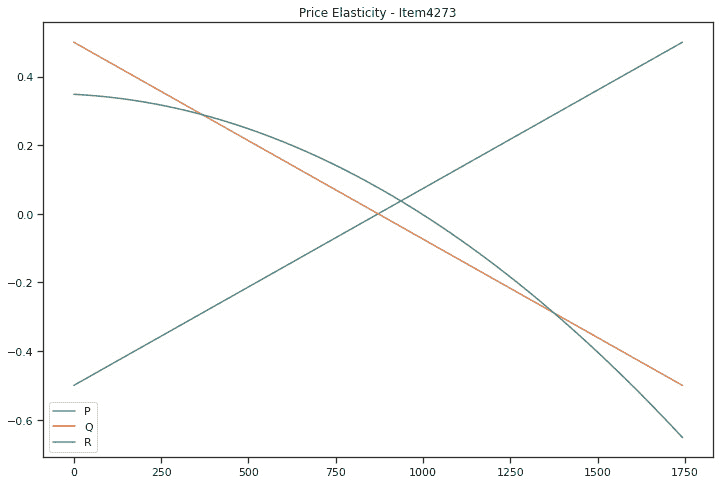

# 第五章：使用价格需求弹性选择最佳价格

需求的价格弹性衡量的是产品消费量对价格变化的响应程度。如果价格调整导致供给或需求发生显著变化，则商品是有弹性的。如果商品的价格调整对需求或供给没有显著影响，则其为无弹性。产品的弹性受替代品可获得性的影响。如果该产品是必需品且没有合适的替代品，价格上涨时需求不会改变，从而使其具有无弹性。

在本章中，我们将学习以下内容：

+   什么是价格弹性，如何利用它来最大化收入？

+   探索数据以确定定价模式及其周围的消费者行为

+   确定不同产品的需求曲线

+   优化价格以最大化所有商品的收入

在这种情况下，我们将使用餐车销售数据来分析不同定价策略的影响。

# 技术要求

为了能够跟随本章的步骤，你需要满足以下要求：

+   一个运行 Python 3.7 或更高版本的 Jupyter Notebook 实例。如果你有 Google Drive 账户，也可以使用 Google Colab 笔记本来运行这些步骤。

+   理解基本的数学和统计学概念。

# 理解价格需求弹性

价格弹性概念用于解释销售的商品数量对价格上涨或下跌的响应程度。这对于需要预测价格变动如何影响公司财务的经理来说，具有重要价值。

从数学角度来看，其表达式如下：


这里，每个术语代表以下内容：

+   ：价格弹性

+   *Q*：需求商品的数量

+   ：需求商品数量的变化

+   *P*：需求商品的价格

+   ：需求商品价格的变化

价格弹性是衡量需求量对价格变化敏感度的指标，几乎所有商品在价格上涨时需求都会下降，但某些商品的需求下降幅度更大。价格弹性在保持其他因素不变的情况下，衡量价格上涨 1%时需求量的百分比变化。当弹性为-2 时，价格每上涨 1%，需求量就会下降 2%。在某些特定情况下，价格弹性为负数。当商品的弹性为 2 时，几乎可以肯定地表明该弹性的正式定义为-2。

**更多弹性**（**more elastic**）意味着商品的弹性更大，无论符号如何。需求法则的两个不常见例外，费布伦商品和吉芬商品，是两类具有正弹性的商品。当商品的需求的弹性绝对值小于 1 时，需求被认为是缺乏弹性的，意味着价格变化对需求量的影响相对较小。如果商品的需求弹性大于 1，则被认为是有弹性的。一种需求弹性为-2 的商品，其数量下降是价格上涨的两倍，而需求弹性为-0.5 的商品，其数量下降仅为价格上涨的一半。

当价格选择使得弹性恰好为 1 时，收入最大化。税收对商品的影响（或“负担”）可以通过商品的弹性来预测。为了确定价格弹性，采用了多种研究技术，如测试市场、历史销售数据分析和联合分析。

# 探索数据

实验的初始数据源是位于办公楼外的食品卡车销售情况。由于成本压力，审查过高的价格至关重要。食品卡车的经营者必须了解价格上涨如何影响店内汉堡的需求。换句话说，要确定价格能够提高多少，了解汉堡的价格弹性至关重要。实际上，价格弹性衡量的是产品价格对需求的影响程度。

我们将在下一个示例中使用以下 Python 模块：

+   **Pandas**：一个用于数据分析和数据处理的 Python 包。

+   **NumPy**：这是一个支持大型多维数组和矩阵的库，并提供大量高层次的数学函数来操作这些数组。

+   **statsmodels**：一个 Python 包，提供对 SciPy 的补充，用于统计计算，包括描述性统计和统计模型的估计与推断。它提供了用于估计多种不同统计模型的类和函数。它是一个用于统计方法和描述性统计的 Python 包，以及其他模型的统计模型。

+   **Seaborn 和 Matplotlib**：用于有效数据可视化的 Python 包。

1.  以下代码块将加载所有所需的包，加载数据并显示数据的前五行：

    ```py
    import pandas as pd
    ```

    ```py
    import numpy as np
    ```

    ```py
    import statsmodels.api as sm
    ```

    ```py
    from statsmodels.formula.api import ols
    ```

    ```py
    import matplotlib.pyplot as plt
    ```

    ```py
    import seaborn as sns; sns.set(style="ticks", 
    ```

    ```py
          color_codes=True)
    ```

    ```py
    data = pd.read_csv('foodcar_data.csv',
    ```

    ```py
          parse_dates=['DATE'])
    ```

    ```py
    data.head()
    ```

这将产生下一个数据框，展示了包含食品卡车销售的商品交易数据以及其他一些外部变量的数据：


图 5.1：待分析的食品卡车销售数据

数据包含以下变量：

+   **SELLER**：销售商品的标识符

+   **CAT**：表示商品是单独销售（**0**）还是作为组合的一部分销售（**2**）的变量

+   **ITEM_ID**：售出的物品标识符

+   **ITEM_NAME**：物品的全名

+   **DATE**：物品销售的时间

+   **YEAR**：从日期中提取的年份

+   **HOLIDAY**：布尔变量，指示当天是否为节假日

+   **WEEKEND**：布尔变量，指示是否为周末

+   **SCHOOLBREAK**：布尔变量，指示是否为学校假期

+   **AVG_TEMPERATURE**：当天的温度（华氏度）

1.  在下一个命令中，我们将进行描述性统计分析，之前已经删除了**ITEM_ID**列，因为尽管它被理解为一个数值变量，但它代表的是一个分类维度。

    ```py
    data.drop(['ITEM_ID'],axis=1).describe()
    ```

这将产生以下输出：


图 5.2：数据的统计描述摘要

1.  我们感兴趣的一件事是，我们将在数据中找到的不同类型的产品。在这种情况下，我们将只选择**SELLER**、**ITEM_ID**和**ITEM_NAME**数据，并删除重复项：

    ```py
    d = data[['SELLER','ITEM_ID','ITEM_NAME']].drop_duplicates()
    ```

    ```py
    print(d)
    ```

这将产生以下输出：


图 5.3：正在出售的产品

1.  通过将这些数据转换为虚拟变量，我们可以看到，卖家列实际上展示了不同的产品组合，其中一些是单独出售的，而另一些是作为组合出售的，例如**4104**，它是一个汉堡和一瓶水：

    ```py
    pd.concat([d.SELLER, pd.get_dummies(d.ITEM_NAME)], axis=1).groupby(d.SELLER).sum().reset_index(drop=True)
    ```

这将产生以下输出：


图 5.4：产品组合销售

1.  我们开始探索数据的一种方式是运行配对图。这个 Seaborn 图可以让我们看到值的分布以及变量之间的关系。如果我们想在第一眼看到它们之间是否存在关系，它非常有用：

    ```py
    sns.pairplot(data[['PRICE','QUANTITY']],height=5,aspect=1.2)
    ```

这将产生以下输出：


图 5.5：价格与数量的配对图

一眼看去，我们可以看到价格与数量之间有许多重叠的趋势。我们还可以看到两个非常明显的组，一个位于左下象限，另一个位于右上象限。

1.  我们可以使用 Seaborn 直方图绘图并将`CAT`变量作为色调，来探讨价格与`CAT`变量之间的关系，进一步分析这些差异。下一段代码正是做了这一点，首先创建了一个`matplotlib`图形，然后用定义好的直方图填充它。这对于某些需要此设置来正确定义图形大小的 Seaborn 图非常有用：

    ```py
    f, ax = plt.subplots(figsize=(10, 6))
    ```

    ```py
    fig = sns.histplot(x='PRICE',data=data,hue='CAT',
    ```

    ```py
    palette=['red','blue'])
    ```

这将产生以下输出：


图 5.6：按 CAT 区分的价格直方图

从前面的图表中我们可以看到，`CAT`值为**2**的产品价格比其他产品更高。

1.  这些是作为套餐出售的产品，因此这是一个合理的结果。我们可以通过运行新的散点图进一步探索这些价格差异——这次，我们将寻找 `PRICE`、`QUANTITY` 和 `ITEM_NAME` 之间的关系：

    ```py
    sns.pairplot(data[['PRICE','QUANTITY','ITEM_NAME']], hue = 'ITEM_NAME', plot_kws={'alpha':0.1},height=5,aspect=1.2)
    ```

这将产生以下输出：


图 5.7：价格、数量和商品名称的散点图

我们现在可以更详细地看到每个商品的价格差异。在这个案例中，汉堡是价格最高的，而水是最便宜的（这很合理）。有趣的是，对于相同的商品，我们看到不同的价格，并且销量也有所不同。

我们可以得出结论，必须通过对每个商品进行明确区分来分析价格差异，因为我们很可能会对每个商品有不同的需求弹性和最优定价。

1.  下一个代码块将创建一个 `10` x `6` 英寸的 Matplotlib 图形，并填充一个 Seaborn 直方图，展示每个类别中商品名称的分布：

    ```py
    f, ax = plt.subplots(figsize=(10, 6))
    ```

    ```py
    fig = sns.histplot(x='ITEM_NAME',data=data,hue='CAT', palette=['red','blue'])
    ```

这将产生以下输出：


图 5.8：每个类别的商品名称直方图

从这个直方图中，我们可以看到汉堡是唯一属于 **0** 类别的商品，因此它是单独销售的。这意味着可乐、水和咖啡与汉堡一起作为套餐销售。这是有用的信息，它展示了食品车老板的销售方式，从而帮助我们思考更好的定价或产品组合方式，以提供给客户。

1.  下一个代码块将过滤数据，仅包含 `CAT` = `2` 的商品，并创建一个 Seaborn 关系图来解释价格与销量之间的关系：

    ```py
    d = data[data['CAT']==2]
    ```

    ```py
    sns.relplot(x=d['PRICE'],y=d['QUANTITY'],height=7,aspect=1.2)
    ```


图 5.9：CAT = 2 商品的价格与质量关系

在这里显示的关系图中，我们可以看到属于第二类商品（即作为套餐出售的商品）之间价格和质量的关系。除了那些价格明显高于其他数据点的离群值外，大多数商品的价格都处于某个范围内。虽然我们同时观察了多个商品，但通过意识到价格较低的商品售出数量较多，我们仍然可以看到一定的关系。接下来，我们的任务是深入挖掘这些关系的具体细节，以便能够确定最大化收益的价格。

1.  在下一个代码块中，我们将尝试捕捉价格和销量随时间变化的情况。我们将创建一个新的数据集，并以标准化的方式查看价格和数量，通过减去均值并除以范围：

    ```py
    d = data[['DATE','PRICE','QUANTITY']].sort_values( ['DATE'], ascending=True)
    ```

    ```py
    d['PRICE'] = (d['PRICE'] - d['PRICE'].mean())/((d['PRICE'].max() - d['PRICE'].min()))
    ```

    ```py
    d['QUANTITY'] = (d['QUANTITY'] - d['QUANTITY'].mean())/((d['QUANTITY'].max() - d['QUANTITY'].min()))
    ```

1.  一旦我们将价格和数量标准化到-1 到 1 的范围内，我们将把`d['DATE']`设置为索引，最后应用滚动平均来平滑曲线，并使用 pandas DataFrame 对象的绘图方法：

    ```py
    d.index = d['DATE']
    ```

    ```py
    d = d.drop(['DATE'],axis=1)
    ```

    ```py
    d.rolling(window=60).mean().plot(figsize=(20,8))
    ```


图 5.10：价格与质量关系随时间变化

有趣的是，降价始终会导致销售数量的增加。在这种情况下，我们可以看到最大幅度的降价发生在 2020 年上半年，这导致了销售数量的增加。我们需要问的问题是，这次降价所丧失的收入是否已经通过销量的增加得到了弥补。

1.  在下一个代码块中，我们将深入探讨不同变量与价格之间的相关性。为此，我们将使用 pandas DataFrame 的`corr()`方法，以及 NumPy 库来创建一个掩码，以“遮盖”对角线以上的重复值，还将使用`matplotlib`库创建一个`12` x `12`英寸的图形，并用 Seaborn 热图进行填充：

    ```py
    import numpy as np
    ```

    ```py
    df_corr = data.drop(['DATE','SELLER','STORE'],axis=1).corr()
    ```

    ```py
    mask = np.triu(np.ones_like(df_corr, dtype=bool))
    ```

    ```py
    df_corr = df_corr.mask(mask).round(3)
    ```

    ```py
    fig, ax = plt.subplots(figsize=(12,12))
    ```

    ```py
    sns.heatmap(df_corr, annot=True,ax=ax)
    ```


图 5.11：变量之间的相关性

这里展示的数据给了我们一个关于变量如何相关的概念。我们可以看到价格与温度之间存在负相关关系（也许在天气炎热时人们不太愿意买咖啡和汉堡组合），与学校假期之间有正相关关系（也许孩子们在这些日子里也会购买产品），而与周末之间存在负相关关系，这可能表明食品车的位置在周末的流量较少。

请谨慎看待这些结论，因为我们需要逐项逐案例分析来验证这些假设，并始终记住最大原则：相关性不代表因果关系。

现在我们已经探索了数据，以理解看似相同的商品之间的价格差异，以及了解这种分布的样子，我们可以尝试估算需求曲线。了解需求曲线可以帮助我们建立价格和销售数量之间的关系，这也是我们将在下一节中做的事情。

# 寻找需求曲线

经济学中的需求曲线是一个图表，描绘了某种商品的价格与在该价格下所需数量之间的关系。个别需求曲线用于描述个别消费者之间的价格与数量交互，而市场需求曲线则用于描述所有消费者（即市场需求曲线）。

一般认为需求曲线向下倾斜是由于需求法则的作用。对于大多数商品来说，价格上升时需求下降。但在一些特殊情况下，这一法则并不适用。这些情况包括投机泡沫、费布伦商品和吉芬商品，当价格上涨时，消费者反而更倾向于购买这些商品。

需求曲线与供给曲线结合使用，以确定均衡价格。在这一理想点，买卖双方已经达成了对商品或服务实际价值的共识，从而使我们能够生产出足够的商品以满足需求，而不会出现短缺或过剩。

## 在代码中探索需求曲线

为了找到每个商品的需求曲线，首先，我们将每个商品的数据隔离到一个单独的数据框中：

1.  在下一段代码中，我们为 `burger_2752` 创建一个数据框，深入探讨这个特定商品的价格与需求关系，因为我们怀疑每个商品都有其特定的需求曲线：

    ```py
    burger_2752 = data[data['ITEM_ID']==2752].drop(['
    ```

    ```py
          ITEM_ID','ITEM_NAME'],axis=1)
    ```

    ```py
    burger_2752.head()
    ```


图 5.12：汉堡数据

1.  一旦我们隔离了数据，我们可以开始确定价格与数据之间的关系。为此，我们将使用 `statsmodels` 包，特别是将 `"QUANTITY ~ PRICE"` 作为 OLS 函数的参数。这样，OLS 函数将 `Quantity` 视为因变量，`Price` 视为自变量。我们也可以传入其他变量作为因变量，但目前我们只关注 `Price`：

    ```py
    model = ols("QUANTITY ~ PRICE", burger_2752).fit()
    ```

1.  一旦模型正确拟合数据，我们可以打印出给定商品的关系斜率，`价格弹性`，以及 OLS 模型的其他参数：

    ```py
    price_elasticity = model.params[1]
    ```

    ```py
    print("Price elasticity of the product: " + str(
    ```

    ```py
          price_elasticity))
    ```

    ```py
    print(model.summary())
    ```


图 5.13：汉堡 OLS 模型总结

分析模型表现的一种方法是查看截距和误差的回归图。这些散点图帮助我们理解线性回归中因变量和自变量之间的关系。

1.  下一段代码将创建一个尺寸为 `12` x `8` 英寸的 Matplotlib 图形，并使用 `statsmodels` 创建模型的偏回归图：

    ```py
    fig = plt.figure(figsize=(12,8))
    ```

    ```py
    fig = sm.graphics.plot_partregress_grid(model, fig=fig)
    ```


图 5.14：汉堡 OLS 模型偏回归图

1.  我们分析的下一步是创建一个函数来打包模型的创建，确定价格弹性，并返回价格弹性和模型本身。该函数以每个商品的数据作为参数：

    ```py
    def create_model_and_find_elasticity(data):
    ```

    ```py
        model = ols("QUANTITY ~ PRICE", data).fit()
    ```

    ```py
        price_elasticity = model.params[1]
    ```

    ```py
        print("Price elasticity of the product: " + str(price_elasticity))
    ```

    ```py
        print(model.summary())
    ```

    ```py
        fig = plt.figure(figsize=(12,8))
    ```

    ```py
        fig = sm.graphics.plot_partregress_grid(model, fig=fig)
    ```

    ```py
        return price_elasticity, model
    ```

1.  现在我们已经定义了函数，我们将创建两个字典来存储结果：一个用于弹性，另一个用于模型本身。之后，我们将遍历数据中所有独特的项目，将函数应用于数据子集，最后存储每个项目的结果：

    ```py
    elasticities = {}
    ```

    ```py
    models = {}
    ```

    ```py
    for item_id in data['ITEM_ID'].unique():
    ```

    ```py
      print('item_id',item_id)
    ```

    ```py
      price_elasticity, item_model = 
    ```

    ```py
        create_model_and_find_elasticity(data[data[
    ```

    ```py
        'ITEM_ID']==item_id])
    ```

    ```py
      elasticities[item_id] = price_elasticity
    ```

    ```py
      models[item_id]= item_model
    ```

1.  运行所有唯一项之后，我们可以打印每个项目的弹性结果。


图 5.15: 产品项目弹性

现在我们已经确定了每个项目的价格弹性，我们可以模拟不同的可能价格，并找到能够最大化收入的点。

## 使用需求曲线优化收入

一旦我们建立了价格与数量之间的关系，就可以模拟每一个可能价格的收入。为此，我们将找到每个项目的最低和最高价格，设定一个阈值，创建可能价格的区间，并使用存储的模型来预测销售数量。下一步是通过将价格与数量相乘来确定总收入。需要注意的是，在这种分析中，通常最好查看收入而非利润，因为大多数时候我们没有每个项目的成本数据。我们将通过以下步骤探索如何进行：

1.  下一个代码块将获取`burger_2752`的数据，确定上下价格边界，使用 NumPy 的范围创建一个区间，最后，使用训练好的模型预测销售数量，从而预测收入：

    ```py
    start_price = burger_2752.PRICE.min() - 1
    ```

    ```py
    end_price = burger_2752.PRICE.max() + 10
    ```

    ```py
    test = pd.DataFrame(columns = ["PRICE", "QUANTITY"])
    ```

    ```py
    test['PRICE'] = np.arange(start_price, end_price,0.01)
    ```

    ```py
    test['QUANTITY'] = models[2752].predict(test['PRICE'])
    ```

    ```py
    test['REVENUE'] = test["PRICE"]  * test["QUANTITY"]
    ```

    ```py
    test.head()
    ```


图 5.16: 每个价格下预测的收入的前几行

1.  为了能够直观地呈现变量之间的关系，无论度量单位如何，我们将通过减去均值并除以范围来标准化数据变量。最后，我们将使用绘图方法来可视化数据：

    ```py
    test['PRICE'] = (test['PRICE']-test['PRICE'].mean())/(test['PRICE'].max()-test['PRICE'].min())
    ```

    ```py
    test['QUANTITY'] = (test['QUANTITY']-test['QUANTITY'].mean())/(test['QUANTITY'].max()-test['QUANTITY'].min())
    ```

    ```py
    test['REVENUE'] = (test['REVENUE']-test['REVENUE'].mean())/(test['REVENUE'].max()-test['REVENUE'].min())
    ```

    ```py
    test.plot(figsize=(12,8),title='Price Elasticity - Item 2752)
    ```


图 5.17: burger_2752 需求曲线

从需求曲线中我们可以看到，这个项目是非弹性的，意味着即使价格上涨，这种产品的销售仍然会继续增加。为了获得更清晰的图像，我们将对另一个项目重复相同的练习。

1.  我们将使用`coffee`数据并重复相同的练习来可视化需求曲线：

    ```py
    coffee_3052 = data[data['ITEM_ID']==3052]
    ```

    ```py
    start_price = coffee_3052.PRICE.min() - 1
    ```

    ```py
    end_price = coffee_3052.PRICE.max() + 10
    ```

    ```py
    test = pd.DataFrame(columns = ["PRICE", "QUANTITY"])
    ```

    ```py
    test['PRICE'] = np.arange(start_price, end_price,0.01)
    ```

    ```py
    test['QUANTITY'] = models[3052].predict(test['PRICE'])
    ```

    ```py
    test['REVENUE'] = test["PRICE"]  * test["QUANTITY"]
    ```

    ```py
    test['PRICE'] = (test['PRICE']-test['PRICE'].mean())/(test['PRICE'].max()-test['PRICE'].min())
    ```

    ```py
    test['QUANTITY'] = (test['QUANTITY']-test['QUANTITY'].mean())/(test['QUANTITY'].max()-test['QUANTITY'].min())
    ```

    ```py
    test['REVENUE'] = (test['REVENUE']-test['REVENUE'].mean())/(test['REVENUE'].max()-test['REVENUE'].min())
    ```

    ```py
    test.plot(figsize=(12,8),title='Price Elasticity - Item 3052')
    ```

通过运行之前的代码，我们可以看到需求曲线是凹形的，且弹性为负，这意味着如果价格上涨，销售的单位数会减少。虽然这会由于销售单位减少而导致收入下降，但也意味着由于价格上涨，收入会增加。


图 5.18: coffee_3052 需求曲线

1.  现在，我们可以将这个过程转换为一个可以应用于每个项目数据的函数，从而获得需求曲线，并确定最优价格。

确定最优价格的方式非常简单。我们只需要在`where`语句中找到最大值，这样就能返回收入最高时的价格：

```py
def find_optimal_price(data, model,item_id):
  start_price = data.PRICE.min() - 1
  end_price = data.PRICE.max() + 10
  test = pd.DataFrame(columns = ["PRICE", "QUANTITY"])
  test['PRICE'] = np.arange(start_price, end_price,0.01)
  test['QUANTITY'] = model.predict(test['PRICE'])
  test['REVENUE'] = test["PRICE"] * test["QUANTITY"]
  test['P'] = (test['PRICE']-test['PRICE'].mean())/(test['PRICE'].max()-test['PRICE'].min())
  test['Q'] = (test['QUANTITY']-test['QUANTITY'].mean())/(test['QUANTITY'].max()-test['QUANTITY'].min())
  test['R'] = (test['REVENUE']-test['REVENUE'].mean())/(test['REVENUE'].max()-test['REVENUE'].min())
  test[['P','Q','R']].plot(figsize=(12,8),title='Price Elasticity - Item'+str(item_id))
  ind = np.where(test['REVENUE'] == test['REVENUE'].max())[0][0]
  values_at_max_profit = test.drop(['P','Q','R'],axis=1).iloc[[ind]]
  values_at_max_profit = {'PRICE':values_at_max_profit['PRICE'].values[0],'QUANTITY':values_at_max_profit['QUANTITY'].values[0],'REVENUE':values_at_max_profit['REVENUE'].values[0]}
  return values_at_max_profit
```

1.  现在我们已经有了确定最大利润的函数，我们可以计算所有项目的最优价格并将其存储在一个字典中：

    ```py
    optimal_price = {}
    ```

    ```py
    for item_id in data['ITEM_ID'].unique():
    ```

    ```py
      print('item_id',item_id)
    ```

    ```py
      optimal_price[item_id] = 
    ```

    ```py
        find_optimal_price(data[data['ITEM_ID']==item_id], 
    ```

    ```py
      models[item_id],item_id)
    ```

在对数据中的所有项目运行此代码后，我们可以确定那些能够最大化食品卡车收入的参数。


图 5.19：item_6249 的需求曲线

我们可以看到，剩下的另外两个待分析的项目，其弹性也为负值，这意味着价格越高，销售的单位数量就越少。



图 5.20：item_4273 的需求曲线

1.  现在我们已经得到了最优价格，我们可以打印出导致收入最大化的参数。接下来的代码块遍历了 `optimal_price` 字典：

    ```py
    for item_id in optimal_price:
    ```

    ```py
      print(item_id,optimal_price[item_id])
    ```

    

图 5.21：每个项目的最优参数

通过这种方式，我们可以确定最优价格，无论项目的特性如何，以及客户愿意为每个项目支付的金额。

# 总结

在本章中，我们深入探讨了项目价格与销售数量之间的关系。我们研究了不同项目有不同的需求曲线，这意味着在大多数情况下，价格越高，售出的商品数量越少，但并非总是如此。价格与销售数量之间的关系可以通过价格弹性来建模，它能帮助我们了解价格上涨时，商品销售数量会减少多少。

我们查看了食品卡车的销售数据，旨在确定每个项目的最佳价格，并发现这些项目具有不同的弹性，对于每个项目，我们可以确定一个价格，该价格将最大化收入。

在下一章，我们将专注于改进我们捆绑和推荐产品的方式，通过分析市场购物篮来推荐经常一起购买的有意义的产品。
