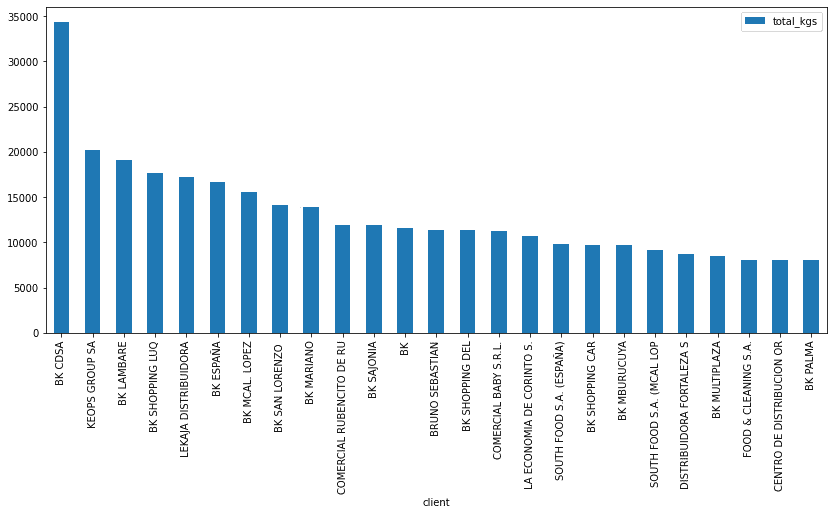

# 第六章：产品推荐

产品推荐本质上是一个过滤系统，旨在预测并展示用户可能感兴趣的商品。它用于生成推荐，保持用户对产品和服务的兴趣，并向他们提供相关建议。在本章中，我们将学习如何做到以下几点：

+   识别正在减少销售的客户

+   为尚未购买的产品向客户提供个性化产品建议

+   基于已购买产品创建具体的产品推荐，使用市场篮子分析和 Apriori 算法

让我们确定理解这些步骤并跟随本章的需求。

本章内容包括以下主题：

+   目标是识别回购量下降的客户

+   理解产品推荐系统

+   使用 Apriori 算法进行产品捆绑

# 技术要求

为了能够跟随本章的步骤，您需要满足以下要求：

+   需要运行 Python 3.7 及以上版本的 Jupyter Notebook 实例。如果你有 Google Drive 账号，也可以使用 Google Colab Notebook 来运行这些步骤。

+   具备基本的数学和统计学概念。

# 目标是识别回购量下降的客户

企业的一个重要方面是，老客户的购买量总是超过新客户，因此密切关注老客户并在发现他们行为发生变化时采取行动是至关重要的。我们可以做的其中一项就是识别出购买模式下降的客户，并为他们推荐他们还没有购买的新产品。在这种情况下，我们将查看消费品配送中心的数据，识别这些购买量下降的客户：

1.  首先，我们将导入必要的库，包括：用于数据处理的 pandas，处理缺失值和掩码的 NumPy，以及用于协同过滤产品推荐的 scikit-surprise。

1.  我们将探索数据，确定合适的策略将数据标准化为正确的格式。

1.  一旦数据结构化，我们将设置线性回归模型，确定具有负斜率的客户，以识别消费模式下降的客户。这些信息将帮助我们为这些客户制定具体的行动计划，避免客户流失。

让我们从以下步骤开始：

1.  我们的第一步是加载这些包并安装`scikit-surprise`包，用于协同过滤，这是一种根据类似用户的评分来过滤出用户可能喜欢的项目的方法。它通过将一小部分与特定用户口味相似的用户行为联系起来，为用户推荐产品：

    ```py
    !pip install --upgrade openpyxl scikit-surprise
    ```

    ```py
    import pandas as pd
    ```

    ```py
    import numpy as np
    ```

1.  为了提高可读性，我们将限制最多显示的行数为 20 行，设置最多显示 50 列，并将浮动数值显示为精确到 2 位小数：

    ```py
    pd.options.display.max_rows = 20
    ```

    ```py
    pd.options.display.max_columns = 50
    ```

    ```py
    pd.options.display.precision = 2
    ```

1.  现在我们可以加载要分析的数据：

    ```py
    df = pd.read_csv('/content/distributed_products.csv')
    ```

    ```py
    df.head()
    ```

在下图中，我们展示了按周期销售商品的历史销售情况，包括客户和产品的详细信息以及销售数量：


图 6.1：消费品交易数据

数据由不同客户的购买订单组成，涵盖不同的产品和不同的周期。数据中有一个周期列，记录了购买发生的年份和月份。

1.  我们可以通过查看列列表继续探索数据：

    ```py
    df.columns.tolist()
    ```

    ```py
    >>> ['period', 'sub_market', 'client_class', 'division', 'brand','cat', 'product', 'client_code', 'client_name', 'kgs_sold']
    ```

1.  现在，让我们查看总客户数进行分析：

    ```py
    len(df.client_name.unique())
    ```

    ```py
    >>> 11493
    ```

在这个案例中，我们有接近 12,000 个客户。为了本章的演示目的，我们将重点关注最重要的客户，基于消费最多的标准。

1.  现在，我们将找出那些销售逐渐减少的客户。我们将通过汇总信息，列出那些总购买千克数最高的客户，以确定最佳客户。我们将使用`groupby`方法按周期求和，计算每个客户在每个周期购买的千克数：

    ```py
    kgs_by_period = df[['period','client_name','kgs_sold']]
    ```

    ```py
    kgs_by_period = kgs_by_period.groupby(['
    ```

    ```py
          period','client_name']).sum().reset_index()
    ```

    ```py
    kgs_by_period.head()
    ```

在下图中，我们可以看到按客户和`周期`划分的商品总千克数：


图 6.2：按客户和周期聚合的商品总重量（单位：千克）

1.  现在我们有了所有客户的列表，我们将按每个周期的购买次数对他们进行特征化：

    ```py
    unique_clients = kgs_by_period.client_name.value_counts().reset_index()
    ```

    ```py
    unique_clients.columns = ['client_name','purchases']
    ```

    ```py
    unique_clients.head()
    ```

在下一个数据框中，我们可以看到每个客户的购买次数：


图 6.3：按购买次数统计的用户数据

1.  现在，我们将按购买次数筛选出前五名客户，保留在 8 个周期中至少有 5 次购买的客户。这个限制是为了找到那些大部分时间是常规客户的客户，限值是随意设定的：

    ```py
    unique_clients = unique_clients[unique_clients.purchases>5]
    ```

1.  现在，我们可以再次查看客户的总数：

    ```py
    unique_clients.shape
    ```

    ```py
    >>> (7550, 2)
    ```

如我们所见，大多数客户有超过 5 个周期的购买记录，因此我们减少了约 30%的总用户数。

1.  现在，我们将列出所有周期中销售的商品总千克数，筛选出购买周期少于 5 个周期的客户：

    ```py
    kgs_by_client = df[['client_name','kgs_sold']]
    ```

    ```py
    kgs_by_client = kgs_by_client[kgs_by_client.client_name.isin(unique_clients.client_name)]
    ```

1.  现在，为了获得所有周期中销售的商品总千克数，我们将使用`groupby`方法并按升序排序值：

    ```py
    kgs_by_client = kgs_by_client.groupby(['client_name']).sum().reset_index()
    ```

    ```py
    kgs_by_client.columns = ['client','total_kgs']
    ```

    ```py
    kgs_by_client = kgs_by_client.sort_values([
    ```

    ```py
          'total_kgs'],ascending= False)
    ```

1.  作为下一步，仅为了可视化和演示，我们将客户限制为前 25 名客户：

    ```py
    kgs_by_client = kgs_by_client.head(25)
    ```

    ```py
    kgs_by_client.head()
    ```

然后，我们可以看到按总千克数排序的前 25 名客户：


图 6.4：购买千克数最多的客户

1.  现在我们有了按千克数销售最多的客户的信息，我们可以创建一个直方图来理解他们的消费模式。我们将使用`plot`方法为 pandas 数据框创建一个柱状图：

    ```py
    kgs_by_client.plot(kind='bar',x='client',y='total_kgs',figsize=(14,6),rot=90)
    ```

这将得到以下结果：



图 6.5：销售千克数最多的客户图表

1.  为了捕捉那些消费水平下降的客户，我们将创建一个掩码，筛选出所有客户中最顶尖的，来可视化每个客户和期间购买的千克数：

    ```py
    mask = kgs_by_period.client_name.isin(kgs_by_client.client)
    ```

    ```py
    kgs_by_period = kgs_by_period[mask]
    ```

    ```py
    kgs_by_period = kgs_by_period.sort_values([
    ```

    ```py
          'kgs_sold'],ascending=False)
    ```

    ```py
    kgs_by_period
    ```

这是在按重量筛选出顶尖客户后的过滤数据：


图 6.6：按期间和客户销售的千克数

1.  最后，我们将透视 DataFrame 以进行可视化，并将 NaN 值填充为 0，因为这表示客户在该期间没有购买任何商品：

    ```py
    dfx = kgs_by_period.pivot(index='period',columns=
    ```

    ```py
          'client_name',values='kgs_sold').reset_index()
    ```

    ```py
    dfx.columns.name = ''
    ```

    ```py
    dfx = dfx.fillna(0)
    ```

    ```py
    dfx
    ```

下一个 DataFrame 已经透视过，并且更适合用于机器学习模型：


图 6.7：透视数据

1.  现在，我们可以可视化整个期间的消费情况：

    ```py
    import seaborn as sns
    ```

    ```py
    import matplotlib.pyplot as plt # visualization
    ```

    ```py
    f, ax = plt.subplots(figsize=(20, 6))
    ```

    ```py
    # Load the long-form example gammas dataset
    ```

    ```py
    g = sns.lineplot(data=dfx.drop(['period'],axis=1))
    ```

    ```py
    # Put the legend out of the figure
    ```

    ```py
    g.legend(loc='center left', bbox_to_anchor=(1, 0.5))
    ```

折线图让我们一目了然地看到销售量最大的客户：


图 6.8：按客户和期间销售的千克数折线图

1.  为了识别那些有下降趋势的曲线，我们将确定每月销售额的斜率和标准差。这将帮助我们通过观察斜率识别消费下降的客户，并识别那些消费波动较大的用户：

    ```py
    from scipy import stats
    ```

    ```py
    results = []
    ```

    ```py
    for i in range(1,dfx.shape[1]):
    ```

    ```py
      client = dfx.columns[i]
    ```

    ```py
      slope, intercept, r_value, p_value, std_err = stats.linregress(dfx.index,dfx.iloc[0:,i])
    ```

    ```py
      results.append([client,slope,std_err])
    ```

    ```py
      print('Client Name:',client,'; Buy Tendency (Slope):',round(slope,3),'; Common Standard deviation:',round(std_err,3))
    ```

从打印结果中可以看到，一些客户的斜率为负数，表示他们的消费模式显示出月度购买量的下降：


图 6.9：客户购买趋势的斜率

在这种情况下，值是以绝对值显示的，但更好的做法是将其显示为每个客户中位购买量的百分比，以保持一致性。你可以应用这个更改并评估差异。

1.  接下来，我们将把结果存储在 DataFrame 中，并用它来可视化结果：

    ```py
    results_df = pd.DataFrame(results).dropna()
    ```

    ```py
    results_df.columns = ['client','slope','std']
    ```

    ```py
    results_df.index = results_df.client
    ```

    ```py
    results_df = results_df.drop(['client'],axis=1)
    ```

    ```py
    results_df.head()
    ```

DataFrame 显示了客户以及回归模型估算的参数：


图 6.10：最终斜率和标准差

1.  现在我们的信息已经整齐地结构化，我们可以创建一个 seaborn 热力图，更直观地展示结果数据：

    ```py
    f, ax = plt.subplots(figsize=(12, 12))
    ```

    ```py
    sns.heatmap(results_df, annot=True)
    ```

结果为以下输出：


图 6.11：斜率和偏差热力图

从数据中我们可以看到，一些客户的月度购买量明显下降，而有些客户则逐渐增加了购买量。查看标准差也很有帮助，可以找到这些客户购买模式的波动性。

现在我们了解了每个客户的表现，可以通过为他们提供量身定制的推荐，针对销售下降的客户采取行动。在下一部分中，我们将根据客户的购买模式训练推荐系统。

# 理解产品推荐系统

现在我们已经识别出消费下降的客户，我们可以为他们创建特定的产品推荐。你如何推荐产品？在大多数情况下，我们可以使用推荐系统，这是一种过滤系统，旨在预测并显示用户可能想购买的产品，从而形成产品建议。k 最近邻方法和潜在因子分析是协同过滤中使用的两种算法，潜在因子分析是一种统计方法，用于找出相关变量的群体。此外，使用协同过滤时，系统会学习两个或多个物品共同购买的可能性。推荐系统的目标是以用户喜欢的方式提供产品的用户友好推荐。协同过滤方法和基于内容的方法是实现这一目标的两大类技术。

向客户推荐相关产品的重要性至关重要，因为企业可以通过推荐系统个性化客户体验，推荐那些根据客户消费模式对他们最有意义的产品。为了提供相关的产品推荐，推荐引擎还使公司能够分析客户过去和现在的网页活动。

推荐系统有很多应用，其中一些最著名的包括视频和音频服务的播放列表生成器、在线商店的产品推荐器、社交媒体平台的内容推荐器以及开放网页内容推荐器。

总结来说，推荐引擎提供基于每个客户需求和兴趣的个性化直接推荐。机器学习正在被用来改进在线搜索，因为它基于用户的视觉偏好而非产品描述提供建议。

## 创建推荐系统

我们训练推荐系统的第一步是捕捉客户的消费模式。在接下来的示例中，我们将关注客户在不同时间段内购买的产品：

```py
dfs = df[['client_name','product']].groupby(['client_name','product']).size().reset_index(name='counts')
dfs =  dfs.sort_values(['counts'],ascending=False)
dfs.head()
```

这会产生以下输出：


图 6.12：客户购买的产品

我们将使用 0 到 1 之间的评分标准来训练推荐系统，因此需要对这些值进行缩放。现在我们可以看到一些客户始终购买某些产品，因此我们将使用`sklearn`的最小-最大缩放器来调整比例。

在机器学习中，我们通过生成新值来规范化数据，保持整体分布，并调整数据中的比例；规范化可以防止使用原始数据以及解决众多数据集问题。运用多种方法和算法还可以提高机器学习模型的效率和准确性。

来自 scikit-learn 的`MinMaxScaler`可以用于将变量缩放到一个范围内。需要注意的是，变量的分布应该是正态分布。`MinMaxScaler`保留了原始分布的形状，确保原始数据中的信息没有实质性改变。请记住，`MinMaxScaler`不会降低异常值的重要性，且最终生成的特征默认范围为 0 到 1。

哪个缩放器——`MinMaxScaler`还是`StandardScaler`——更优？对于符合正态分布的特征，`StandardScaler`很有帮助。当上下边界从领域知识中得到了很好的定义时，可以使用`MinMaxScaler`（例如 RGB 颜色范围内从 0 到 255 的像素强度）。

```py
from sklearn.preprocessing import MinMaxScaler
scaler = MinMaxScaler()
dfs['count_sc'] = scaler.fit_transform(dfs[['counts']])
dfs = dfs.drop(['counts'],axis=1)
```

现在我们已经标准化了值，可以开始构建推荐系统了。在这里，我们将使用 SVDpp 算法，它是 SVD 的扩展，考虑了隐式评分。SVD 作为协同过滤机制被应用于推荐系统。矩阵中的每一行代表一个用户，每一列代表一件商品。用户为物品提供的评分构成了矩阵的元素。

SVD 的通用公式是：

*M=UΣV**ᵗ*

其中：

+   M 是我们想要分解的原始矩阵，它是用户和他们购买的产品的密集矩阵

+   U 是左奇异矩阵（列是左奇异向量）

+   Σ是一个对角矩阵，包含奇异特征值

+   V 是右奇异矩阵（列是右奇异向量）


图 6.13：协同过滤矩阵分解

`scikit-surprise`包高效地实现了 SVD 算法。我们无需重新发明轮子，就可以使用简单易用的 Python 模块`SurpriseSVD`快速构建基于评分的推荐系统。当使用像 SVD 这样的模型时，`SurpriseSVD`还提供了对矩阵因子的访问，使我们能够直观地看到数据集中对象之间的关系：

1.  我们将从导入库开始：

    ```py
    from surprise import SVDpp
    ```

    ```py
    from surprise.model_selection import cross_validate
    ```

    ```py
    from surprise import Reader, Dataset
    ```

1.  现在，我们将初始化阅读器，并将其范围设置为 0 到 1：

    ```py
    reader = Reader(rating_scale=(0,1))
    ```

1.  然后，我们可以使用`Dataset`方法从包含标准化产品值计数的数据框加载数据：

    ```py
    data = Dataset.load_from_df(dfs, reader)
    ```

1.  最后，我们可以实例化 SVD 算法并在数据上进行训练：

    ```py
    algo = SVDpp()
    ```

    ```py
    algo.fit(data.build_full_trainset())
    ```

训练过程应该需要几分钟，具体取决于您的硬件规格，但一旦完成，我们就可以开始使用它来进行预测。

1.  我们将从选择一个特定的用户开始，并筛选出他们尚未购买的所有产品，以便为他们提供更推荐的产品：

    ```py
    usr = 'LA TROYA'
    ```

    ```py
    # Filter the products that the client is already buying
    ```

    ```py
    user_prods = dfs[dfs.client_name==usr]['product'].unique().tolist()
    ```

    ```py
    prods = dfs[dfs.client_name!=usr]['product'].unique().tolist()
    ```

    ```py
    prods = [p for p in prods if p not in user_prods]
    ```

1.  现在我们已经确定了用户未购买的产品，让我们看看算法如何为这个特定的用户评分：

    ```py
    my_recs = []
    ```

    ```py
    for iid in prods:
    ```

    ```py
        my_recs.append((iid, algo.predict(uid=usr,iid=iid).est))
    ```

1.  上述代码将遍历以下数据中的产品，并创建一个包含推荐值最高产品的数据框：

    ```py
    dk = pd.DataFrame(my_recs)
    ```

    ```py
    dk.columns = ['product', 'rating']
    ```

    ```py
    dk = dk.sort_values('rating',ascending= False).reset_index(drop=True)
    ```

    ```py
    dk.head()
    ```

下一个数据框展示了我们为客户推荐的产品：


图 6.14：客户推荐的产品

1.  现在我们已经为单个用户确定了这一点，我们可以将其推断到其余的客户。我们将只保留前 20 个推荐，因为产品数量过于庞大：

    ```py
    dki_full = pd.DataFrame()
    ```

    ```py
    # For top 25 clients
    ```

    ```py
    users = kgs_by_period.client_name.unique()
    ```

    ```py
    for usr in users:
    ```

    ```py
      print(usr)
    ```

    ```py
      user_prods = dfs[dfs.client_name==usr]['product'].unique().tolist()
    ```

    ```py
      prods = dfs[dfs.client_name!=usr]['product'].unique().tolist()
    ```

    ```py
      prods = [p for p in prods if p not in user_prods]
    ```

    ```py
      my_recs = []
    ```

    ```py
      for iid in prods:
    ```

    ```py
          my_recs.append((iid, algo.predict(uid=usr,iid=iid).est))
    ```

    ```py
      dk = pd.DataFrame(my_recs)
    ```

    ```py
      dk.columns = ['product', 'rating']
    ```

    ```py
      dk = dk.sort_values('rating',ascending= False).reset_index(drop=True)
    ```

    ```py
      dk['client'] = usr
    ```

    ```py
      dki_full = pd.concat([dki_full, dk.head(20)])
    ```

这个脚本将允许我们遍历我们的客户，并为每个客户生成一份推荐产品的清单。在这种情况下，我们正在进行特定的分析，但这可以实现为一个实时交付这些结果的管道。

现在我们有了数据，可以为每个客户提供量身定制的产品推荐，推荐他们尚未购买的产品。我们还可以推荐与他们已经购买的产品互补的产品，接下来我们将在下一部分做这些。

# 使用 Apriori 算法进行产品捆绑

目前，我们专注于那些减少购买的客户，为他们提供针对那些他们未购买的产品的特定优惠，但我们也可以改善已经是忠实客户的人的结果。我们可以通过进行市场购物篮分析，提供与他们消费模式相关的产品，从而提高他们购买的产品数量。为此，我们可以使用多种算法。

最受欢迎的关联规则学习方法之一是 Apriori 算法。它识别数据集合中的事物，并将它们扩展为越来越大的项目组合。Apriori 被用于数据集中的关联规则挖掘，寻找多个经常出现的事物集合。它扩展了项集之间的联系和关联。这就是你经常在推荐网站上看到的“You may also like”建议的实现，它们正是该算法的结果。

Apriori 是一种用于关联规则学习和频繁项集挖掘的算法，应用于关系数据库。只要这些项集在数据库中出现得足够频繁，它就会通过检测频繁的单个项目并将其扩展为越来越大的项集来向前推进。Apriori 算法通常用于事务型数据库，这些数据库通过 Apriori 方法挖掘频繁项集和关联规则。“支持度”、“提升度”和“置信度”作为参数被使用，其中支持度是某项物品出现的可能性，而置信度则是条件概率。项集由事务中的物品组成。该算法使用“连接”和“剪枝”两个步骤来减少搜索空间。它是发现最频繁项集的迭代方法。在关联规则学习中，数据集中的项被识别，数据集会被扩展为包括越来越大的物品组合。

Apriori 方法是市场购物篮分析中常用的算法，它是一种广泛使用的关联规则算法。该方法有助于发现交易中频繁出现的项集，并揭示这些项之间的关联规律。

## 使用 Apriori 进行市场购物篮分析

对于此分析，我们将使用 UCI ML 库中找到的独立数据（[`archive.ics.uci.edu/ml/datasets/Online+Retail`](http://archive.ics.uci.edu/ml/datasets/Online+Retail)）：

1.  我们通过导入包并加载数据开始分析。记得在运行这段代码之前安装`mlxtend`模块，否则会遇到**Module Not** **Found**错误：

    ```py
    from mlxtend.frequent_patterns import apriori, association_rules
    ```

    ```py
    data = pd.read_csv('/content/Online Retail.csv',encoding='iso-8859-1')
    ```

    ```py
    data.head()
    ```


图 6.15: 在线零售数据

这份国际数据集包含了 2010 年 12 月 1 日至 2011 年 12 月 9 日间，一家英国注册的非店面互联网零售商所进行的每一笔交易。该公司主要提供各种场合的一次性礼品，拥有大量批发商客户。

1.  我们开始探索数据的各列：

    ```py
    data.columns
    ```

    ```py
    >>> Index(['InvoiceNo', 'StockCode', 'Description', 'Quantity', 'InvoiceDate','UnitPrice', 'CustomerID', 'Country'],dtype='object')
    ```

数据包含了包含代码和日期信息的交易销售数据，但我们现在不需要这些信息。相反，我们将重点关注描述、数量和价格。

1.  我们可以查看数据的统计汇总：

    ```py
    data.describe()
    ```


图 6.16: 描述性统计汇总

1.  为了评估分类变量，我们使用聚焦于 DataFrame 对象列的`describe`方法：

    ```py
    data.describe(include='O')
    ```


图 6.17: 描述性分类汇总

这些信息展示了每个对象列的一些计数，并表明最常见的国家是英国，正如预期的那样。

1.  我们还将探索不同地区的交易，以更好地理解数据：

    ```py
    data['Country'].value_counts().head(10).plot(kind='bar',figsize=(12,6))
    ```


图 6.18: 数据中的市场

我们可以确认绝大多数交易发生在英国，其次是德国和法国。

1.  为了提高可读性，我们将去除描述中的多余空格：

    ```py
    data['Description'] = data['Description'].str.strip()
    ```

1.  现在，我们将删除发票号中包含 NaN 的行，并将它们转换为字符串以进行分类处理：

    ```py
    data = data[~data['InvoiceNo'].isna()]
    ```

    ```py
    data['InvoiceNo'] = data['InvoiceNo'].astype('str')
    ```

1.  目前，我们将专注于非信用交易，因此我们将删除所有信用交易：

    ```py
    data = data[~data['InvoiceNo'].str.contains('C')]
    ```

1.  我们将通过查看英国的关联规则开始分析：

    ```py
    data_uk = data[data['Country'] =="United Kingdom"]
    ```

    ```py
    basket_uk = data_uk.groupby(['InvoiceNo', 'Description'])['Quantity'].sum()
    ```

    ```py
    basket_uk = basket_uk.unstack().reset_index().fillna(0)
    ```

    ```py
    basket_uk = basket_uk.set_index('InvoiceNo')
    ```

    ```py
    basket_uk.head()
    ```


图 6.19: 英国市场购物篮

我们可以看到每张发票上购买的产品的密集矩阵。

1.  我们将对法国的交易进行相同的操作：

    ```py
    basket_fr = data[data['Country'] =="France"]
    ```

    ```py
    basket_fr = basket_fr.groupby(['InvoiceNo', 'Description'])['Quantity'].sum()
    ```

    ```py
    basket_fr = basket_fr.unstack().reset_index().fillna(0)
    ```

    ```py
    basket_fr = basket_fr.set_index('InvoiceNo')
    ```

1.  最后，我们将对德国的数据进行相同的操作：

    ```py
    basket_de = data[data['Country'] =="Germany"]
    ```

    ```py
    basket_de = basket_de.groupby(['InvoiceNo', 'Description'])['Quantity'].sum()
    ```

    ```py
    basket_de = basket_de.unstack().reset_index().fillna(0)
    ```

    ```py
    basket_de = basket_de.set_index('InvoiceNo')
    ```

1.  现在，我们将定义热编码函数，使数据适应相关库的要求，因为它们需要离散的值（0 或 1）：

    ```py
    basket_uk = (basket_uk>0).astype(int)
    ```

    ```py
    basket_fr = (basket_fr>0).astype(int)
    ```

    ```py
    basket_de = (basket_de>0).astype(int)
    ```

1.  一旦我们将结果编码为一热编码器，我们就可以开始为每个市场建立模型：

    ```py
    frq_items_uk = apriori(basket_uk, min_support = 0.01, use_colnames = True)
    ```

1.  一旦模型建立完成，我们就可以查看英国市场发现的关联规则：

    ```py
    # Collecting the inferred rules in a dataframe
    ```

    ```py
    rules_uk = association_rules(frq_items_uk, metric ="lift", min_threshold = 1)
    ```

    ```py
    # rules_uk = rules_uk.sort_values(['confidence', 'lift'], ascending =[False, False])
    ```

    ```py
    rules_uk.head()
    ```


图 6.20：英国关联规则

如果更详细地检查英国交易的规则，就会发现英国人通常购买各种颜色的茶盘。这可能是因为英国人非常喜欢喝茶，并且经常为各种场合收集不同颜色的茶具。

1.  现在我们将对法国的数据进行相同的操作：

    ```py
    frq_items_fr = apriori(basket_fr, min_support = 0.05, use_colnames = True)
    ```

    ```py
    # Collecting the inferred rules in a dataframe
    ```

    ```py
    rules_fr = association_rules(frq_items_fr, metric ="lift", min_threshold = 1)
    ```

    ```py
    rules_fr = rules_fr.sort_values(['confidence', 'lift'], ascending =[False, False])
    ```

    ```py
    rules_fr.head()
    ```


图 6.21：法国关联规则

从这些数据中可以明显看出，纸盘、杯子和餐巾在法国经常一起购买。这是因为法国人每周至少会与朋友和家人聚会一次。此外，由于法国政府已经禁止在国内使用塑料，公民必须购买纸质替代品。

1.  最后，我们将为德国数据建立模型：

    ```py
    frq_items_de = apriori(basket_de, min_support = 0.05, use_colnames = True)
    ```

    ```py
    # Collecting the inferred rules in a dataframe
    ```

    ```py
    rules_de = association_rules(frq_items_de, metric ="lift", min_threshold = 1)
    ```

    ```py
    rules_de = rules_de.sort_values(['confidence', 'lift'], ascending =[False, False])
    ```

    ```py
    rules_de.head()
    ```


图 6.22：德国关联规则

先前的数据向我们展示，大多数项目与交付成本相关，因此这可能表明德国的交易大多由单一商品构成。

# 总结

在本章中，我们学习了如何识别销售量逐渐减少的客户，以便根据他们的消费模式为他们提供特定的产品推荐。我们通过观察给定周期内的历史销售斜率来识别销售下降，并使用 SVD 协同过滤算法为客户未购买的产品创建个性化推荐。

作为下一步，为了提高现有客户的忠诚度，我们探索了使用 Apriori 算法进行市场篮子分析，并能够根据购买的特定产品提供产品推荐。

在下一章中，我们将深入探讨如何识别流失客户的共同特征，以便通过更深入理解我们的客户流失来补充这些方法。

# 第三部分：运营和定价优化

本书的最后部分将介绍如何优化业务运营。我们将从理解市场和客户转向，深入探讨如何调整运营以提高利润率。这将通过改善定价策略、优化促销使用以及最终提升数字营销策略以接触更多潜在客户来实现。

本部分涵盖以下章节：

+   *第七章*，*预测客户流失*

+   *第八章*，*通过客户细分分组用户*

+   *第九章*，*利用历史 Markdown 数据预测销售*

+   *第十章*，*网站分析优化*

+   *第十一章*，*在商业中创建数据驱动的文化*
