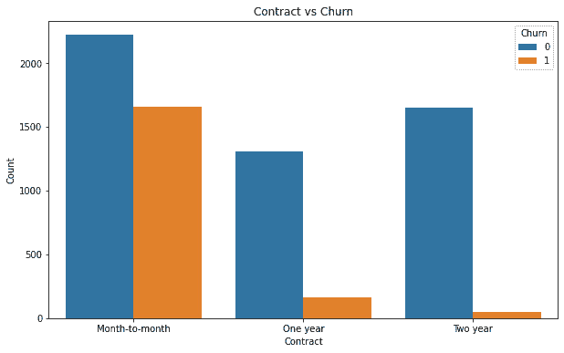

# 第七章：预测客户流失

流失率是一个用来衡量在一定时间框架内有多少客户或员工离开公司的指标。它也可以指因客户流失而损失的资金总额。公司流失率的变化可能会提供关于公司有价值的信息。通过客户流失分析，可以了解不再购买更多商品或服务的消费者数量或比例。

在本章中，我们将了解流失（churn）的概念以及它在商业中的重要性。接着，我们将准备数据进行进一步分析，并创建分析模型来确定理解流失模式时需要考虑的最重要因素。最后，我们将学习如何创建机器学习模型，以预测可能流失的客户。

本章包含以下内容：

+   理解客户流失

+   探索客户数据

+   探索变量关系

+   预测可能流失的用户

# 技术要求

为了能够按照本章中的步骤进行操作，您需要满足以下要求：

+   运行 Python 3.7 及以上版本的 Jupyter Notebook 实例。如果你有 Google Drive 账户，也可以使用 Google Colab 笔记本来运行这些步骤。

+   了解基础的数学和统计概念。

# 理解客户流失

在商业中，未能成为回头客的付费客户的数量被称为客户流失，也称为客户流失率。这里的流失是指在预定时间段内发生的可衡量的变化率。

分析流失的原因、与客户互动、教育客户、了解哪些客户处于风险中、识别最有价值的客户、提供激励措施、选择正确的目标受众以及提供更好的服务是减少客户流失的一些策略。

降低流失率至关重要，因为它会增加**客户获取成本**（**CAC**）并降低收入。实际上，维护和改善现有客户关系的成本远低于吸引新客户的成本。你失去的客户越多，你就需要花费更多的资金来吸引新客户，以弥补失去的收入。你可以使用以下公式来计算 CAC：CAC 通过将销售和营销成本除以新客户的数量来计算。客户回归率是指返回你公司并继续购买的消费者的比例。


这与流失率不同，后者衡量的是在一定时间内失去的客户数量。默认情况下，流失率高的公司会有较低的客户回归率。

现在我们已经大致了解了通过识别导致客户流失的模式所获得的商业价值，在接下来的部分中，我们将开始探索数据及其变量。

# 探索客户数据

我们的目标是创建一个模型，用于估算客户流失的可能性，数据来自电信客户。这是为了回答消费者停止使用该服务的可能性有多大这个问题。

最初，数据会进行探索性分析。了解每一列的数据类型是过程中的第一步，之后将对变量进行必要的调整。

为了探索数据，我们将绘制流失变量与其他构成数据集的重要因素之间的关系。在提出模型之前，进行这项工作是为了初步了解变量之间的潜在关系。

在进行描述性统计时，采用了细致的方法，主要关注客户基于一项或多项属性的差异。现在，主要关注的变量是流失，因此为此生成了一组新的有趣图表。

为了检查变量，我们必须处理非结构化数据并调整数据类型；第一步是探索数据。本质上，我们将了解数据分布并为聚类分析整理数据。

在接下来的示例中，我们将使用以下 Python 模块：

+   **Pandas**：用于数据分析和数据操作的 Python 包。

+   **NumPy**：这是一个为大型、多维数组和矩阵提供支持的库，还包含了广泛的高阶数学函数，用于处理这些数组。

+   **statsmodels**：一个 Python 包，它为统计计算提供了 SciPy 的补充，包括描述性统计和统计模型的估计与推断。它提供了用于估计多种统计模型的类和函数。

+   **Seaborn、mpl_toolkits 和 Matplotlib**：用于高效数据可视化的 Python 包。

现在，我们将按照以下步骤开始分析：

1.  第一部分的代码块中，我们将加载刚才提到的所有必需包，包括我们将要使用的函数，如`LabelEncoder`、`StandardScaler`和`KMeans`：

    ```py
    import numpy as np
    ```

    ```py
    import pandas as pd
    ```

    ```py
    import seaborn as sns
    ```

    ```py
    import matplotlib.pyplot as plt
    ```

    ```py
    import os
    ```

1.  为了提高可读性，我们将限制最大行数为`20`，将最大列数设置为`50`，并显示保留`2`位小数的浮动数据：

    ```py
    pd.options.display.max_rows = 20
    ```

    ```py
    pd.options.display.max_columns = 50
    ```

    ```py
    pd.options.display.precision = 2
    ```

    ```py
    path = 'customer_churn.csv'
    ```

    ```py
    data = pd.read_csv(path)
    ```

    ```py
    data.head()
    ```

这段代码将加载数据并展示数据的前几行：


图 7.1：客户数据

1.  现在，我们可以查看 DataFrame 中的列：

    ```py
    data.columns
    ```

为了获取每一列的类型和缺失值数量，我们可以使用`info`方法：

```py
data.info()
```


图 7.2：Pandas 列数据类型

1.  我们可以看到，尽管我们没有`null`值需要填补，但大多数变量是分类变量——这意味着我们需要将它们转换为`boolean`数值列，才能使用机器学习模型或聚类方法。第一步是将`TotalCharges`转换为数值数据类型：

    ```py
    data.TotalCharges = pd.to_numeric(data.TotalCharges, errors='coerce')
    ```

上述代码将变量转换为数值型变量，强制任何错误值，而不是失败。

我们可以通过再次使用`info`方法查看转换结果：

```py
data.info()
```


图 7.3: 修正后的数据类型

结果转换成功，但生成了 10 个`null`值，我们可以稍后删除这些值。

1.  现在，我们将确定需要转换为虚拟变量以便更好分析的所有分类列：

    ```py
    object_cols = [c for c in data.drop(['customerID'],axis=1).columns if data[c].dtype=='O']
    ```

    ```py
    object_cols
    ```

1.  有几列可以通过 1 和 0 来轻松表示，因为这些列的值是`Yes`或`No`；我们将确定哪些变量只有这两种选项，然后将这些值映射到它们的数值对应值：

    ```py
    yn_cols = []
    ```

    ```py
    # Iterate over the column names
    ```

    ```py
    For c in object_cols:
    ```

    ```py
      # count the unique values by accessing the column
    ```

    ```py
      val_counts = data[c].value_counts()
    ```

    ```py
      # If the count of unique values is equal to two, we assume that it's a Yes/No column
    ```

    ```py
      if len(val_counts.index)==2 and all(val_counts.index.isin(['No', 'Yes'])):
    ```

    ```py
        print(c)
    ```

    ```py
        print(data[c].value_counts().to_string())
    ```

    ```py
        yn_cols.append(c)
    ```

1.  上述代码将生成一组`Yes`/`No`的分类列，我们可以将这些数据映射为 1 和 0：

    ```py
    # Iterate over the yes/no column names
    ```

    ```py
    for c in yn_cols:
    ```

    ```py
      # Normalize the column values by lowering them and mapping them to new values.
    ```

    ```py
      data[c] = data[c].str.lower().map({'yes': 1, 'no': 0})
    ```

我们现在可以重新评估这些替换的结果：

```py
data.head()
```


图 7.4: 列转换为规范化布尔列

我们现在可以使用`describe`方法查看数值变量的分布，以更好地理解数据：

```py
data.describe()
```


图 7.5: 数据的统计描述

有趣的是，在这里，有 27%的客户流失，这个比例非常大。在其他情况下，这些值往往会低得多，这使得数据集高度不平衡，并且需要调整分析方法以应对这些不平衡。幸运的是，这里并非如此，因为客户流失的发生频率足够具有代表性。然而，不平衡的数据集要求我们更深入地审视评估模型时使用的度量标准。如果我们仅仅关注准确率，在我们的案例中，模型如果只是输出最常见的变量（客户不流失），其准确率将是 73%。这就是为什么我们需要添加更多的性能指标，比如精确率、召回率，以及两者的结合，如 F1 得分，特别是查看混淆矩阵，以找出每个类别正确预测案例的比例。

1.  我们现在可以可视化一些分类变量的分布，考虑到用户流失的情况。我们可以使用 Seaborn 的`countplot`来完成这个操作：

    ```py
    import seaborn as sns
    ```

    ```py
    import matplotlib.pyplot as plt
    ```

    ```py
    f, ax = plt.subplots(figsize=(10, 6))
    ```

    ```py
    pl = sns.countplot(x=data["InternetService"],hue=data["Churn"])
    ```

    ```py
    pl.set_title("InternetService vs Churn")
    ```

    ```py
    pl.set_xlabel("InternetService")
    ```

    ```py
    pl.set_ylabel("Count")
    ```


图 7.6: 客户互联网合同与流失

我们可以看到，选择光纤服务的用户与没有互联网服务或仅有 DSL 服务的用户在流失率上存在很大的差异。

1.  这些信息可以用于深入分析原因，或制定新的促销活动以应对这一情况：

    ```py
    f, ax = plt.subplots(figsize=(10, 6))
    ```

    ```py
    pl = sns.countplot(x=data["MultipleLines"],hue=data["Churn"])
    ```

    ```py
    pl.set_title("MultipleLines vs Churn")
    ```

    ```py
    pl.set_xlabel("MultipleLines")
    ```

    ```py
    pl.set_ylabel("Count")
    ```


图 7.7: 客户电话合同与流失率

我们可以看到，选择多个线路的客户与不选择多个线路的客户在流失率上存在一定差异。没有多个线路的客户似乎流失更多。这些差异需要通过 t 检验或其他假设检验方法来验证，以确定各组均值之间的实际差异。

1.  下一步是可视化合同与流失率之间的关系：

    ```py
    f, ax = plt.subplots(figsize=(10, 6))
    ```

    ```py
    pl = sns.countplot(x=data["Contract"],hue=data["Churn"])
    ```

    ```py
    pl.set_title("Contract vs Churn")
    ```

    ```py
    pl.set_xlabel("Contract")
    ```

    ```py
    pl.set_ylabel("Count")
    ```

这里的代码将展示合同类型与流失率之间的条形图：



图 7.8: 客户合同类型与流失率

在这里，相比于拥有 1 年或 2 年合同的客户，按月合同的客户流失率极高。这些信息可以用来制定营销策略，尝试将按月合同转化为 1 年或 2 年的合同。

1.  最后，我们对最后一个变量的探索聚焦于支付方式类型。下一个图表将展示流失率与使用的支付方式类型之间的关系：

    ```py
    f, ax = plt.subplots(figsize=(10, 6))
    ```

    ```py
    pl = sns.countplot(x=data["PaymentMethod"],hue=data["Churn"])
    ```

    ```py
    pl.set_title("PaymentMethod vs Churn")
    ```

    ```py
    pl.set_xlabel("PaymentMethod")
    ```

    ```py
    pl.set_ylabel("Count")
    ```

这里的代码将展示支付方式与流失率之间的条形图：


图 7.9: 客户支付方式与流失率

在这里，使用电子支票而非其他支付方式的客户之间的差异是显而易见的。

接下来，我们将使用 Seaborn 的`pairplot`以及相关分析来探索不同变量之间的关系。

# 探索变量关系

探索变量如何共同变化可以帮助我们确定隐藏的模式，这些模式支配着客户的行为：

1.  我们的第一步将使用 Seaborn 方法绘制一些关系图，主要是数值连续变量之间的关系，如服务年限、每月费用和总费用，使用流失率作为`hue`参数：

    ```py
    g = sns.pairplot(data[['tenure','MonthlyCharges', 'TotalCharges','Churn']], hue= "Churn",palette= (["red","blue"]),height=6)
    ```


图 7.10: 连续变量关系

从分布情况来看，流失的客户通常具有较低的服务年限，通常每月费用较低，且总费用较低。

1.  现在，我们可以最终转换并确定将要转化为虚拟变量的对象列：

    ```py
    object_cols = [c for c in data.drop(['customerID'],axis=1).columns if data[c].dtype=='O']
    ```

    ```py
    object_cols
    ```

1.  一旦确定了这些列，我们可以使用`get_dummies`函数，并创建一个仅包含数值型变量的新 DataFrame：

    ```py
    df_dummies = pd.get_dummies(data[object_cols])
    ```

    ```py
    data = pd.concat([data.drop(object_cols+['Churn'],axis=1),df_dummies,data[['Churn']]],axis=1)
    ```

    ```py
    data.head()
    ```

上述代码将展示重新结构化后的数据：


图 7.11：重构后的数据

在这里，数据能够有效地描述每个客户的描述性水平，从而使信息以数值形式而非分类形式表示。这些因素包括任期、订阅类型、费用、通话历史和人口统计等。之所以需要以数值形式表示维度，是因为大多数机器学习算法要求数据以这种方式表示。

1.  下一步，我们将研究变量之间的关系，以确定它们之间最重要的相关性：

    ```py
    import numpy as np
    ```

    ```py
    from matplotlib import colors
    ```

    ```py
    df_corr = data.corr()
    ```

    ```py
    mask = np.triu(np.ones_like(df_corr, dtype=bool))
    ```

    ```py
    df_corr = df_corr.mask(mask).round(2)
    ```

    ```py
    fig, ax = plt.subplots(figsize=(25,25))
    ```

    ```py
    sns.heatmap(df_corr, annot=True,ax=ax)
    ```

代码确定这些相关性并构建一个三角形数据集，我们可以将其绘制为热力图，以清晰地可视化变量之间的关系。


图 7.12：变量相关性

在这里，我们可以可视化整个变量相关性的集合，但我们可能只关注与目标变量相关的部分。我们可以看到，一些依赖其他变量的变量与此变量的相关性为 1——例如，在`internet contract = no`的情况下，它与`streaming service = no`的相关性为 1。这是因为如果没有互联网合同，很明显就无法使用需要互联网合同的流媒体服务。

1.  我们可以通过查看与此变量相关的相关性来实现这一点：

    ```py
    churn_corr = data.corr()['Churn'].sort_values(ascending = False)
    ```

    ```py
    churn_corr.plot(kind='bar',figsize=(20,8))
    ```


图 7.13：与流失最相关的变量

这些信息非常有用，因为它不仅确定了与较高流失率相关的变量，还指出了能够降低流失率的变量，例如任期时间和拥有 2 年合同。建议在这里删除流失变量，因为该变量与自身的相关性为 1，且会扭曲图形。

完成这一步 EDA 后，我们将开发一些预测模型并进行比较。

# 预测将流失的用户

在这个例子中，我们将训练逻辑回归、随机森林和支持向量机（SVM）机器学习模型，预测基于观察到的变量将会流失的用户。我们需要首先对变量进行缩放，使用 sklearn 的`MinMaxScaler`功能来实现：

1.  我们将从逻辑回归开始，并将所有变量缩放到 0 到 1 的范围内：

    ```py
    from sklearn.preprocessing import MinMaxScaler
    ```

    ```py
    y = data['Churn'].values
    ```

    ```py
    x = data.drop(columns = ['customerID','Churn']).fillna(0)
    ```

    ```py
    scaler = MinMaxScaler(feature_range = (0,1))
    ```

    ```py
    x_scaled = scaler.fit_transform(x)
    ```

    ```py
    x_scaled = pd.DataFrame(x_scaled,columns=x.columns)
    ```

    ```py
    x_scaled.head()
    ```

前面的代码将创建`x`和`y`变量，其中我们只需要对`x`进行缩放。


图 7.14：模型输入特征

在逻辑回归中，缩放变量非常重要，以确保所有变量都在 0 到 1 的范围内。

1.  接下来，我们可以通过分割数据来训练逻辑回归模型，首先获得一个验证集：

    ```py
    from sklearn.model_selection import train_test_split
    ```

    ```py
    from sklearn.linear_model import LogisticRegression
    ```

    ```py
    from sklearn import metrics
    ```

    ```py
    x_train, x_test, y_train, y_test = train_test_split(
    ```

    ```py
          x_scaled, y, test_size=0.3, random_state=101)
    ```

    ```py
    model = LogisticRegression()
    ```

    ```py
    result = model.fit(x_train, y_train)
    ```

    ```py
    preds_lr = model.predict(x_test)
    ```

最后，我们可以打印出预测准确性：

```py
print(metrics.accuracy_score(y_test, preds_lr))
```


图 7.15：逻辑回归模型准确性

我们在模型中获得了不错的准确性。

1.  我们还可以获得所有变量的权重，以衡量它们在预测模型中的重要性：

    ```py
    weights = pd.Series(model.coef_[0],index=x_scaled.columns)
    ```

    ```py
    pd.concat([weights.head(10),weights.tail(10)]).sort_values(ascending = False).plot(kind='bar',figsize=(16,6))
    ```

上述代码将创建一个数据框，显示 10 个权重最正向和 10 个权重最负向的变量。


图 7.16：模型特征重要性

有趣的是，看到总费用和服务年限，尤其是后者，在回归模型中的重要性。通过查看变量之间的相关性，这些变量的重要性得到了验证。一个重要的下一步将是深入分析这些变量与流失变量之间的关系，以理解这种关系背后的机制。

1.  我们可以创建混淆矩阵，以可视化每个类别预测的性能：

    ```py
    from sklearn.metrics import classification_report, confusion_matrix
    ```

    ```py
    print(confusion_matrix(y_test,preds_lr))
    ```


图 7.17：模型混淆矩阵

在混淆矩阵中，列中显示的是不同的类别（无流失和流失），而行中则是按相同顺序预测的结果（无流失，流失）。对角线上的值表示真正的正例，预测为该类别且实际也是该类别。对角线外的值则表示预测错误的值。在我们的案例中，我们正确分类了 `1401` 个无流失的案例，错误地将 `265` 个无流失分类为流失，将 `145` 个流失预测为无流失，正确分类了 `302` 个流失的案例。从混淆矩阵中可以看出，模型在预测最常见的情况（即无流失）方面表现良好，但几乎三分之一的类别预测错误，这对我们预测非常重要。

1.  我们的下一步是创建一个由多个决策树组成的分类系统，称为随机森林。它通过使用自助法（bagging）和特征随机性在生成每个单独的树时，尝试产生一个相互独立的决策树森林，这比单棵树更准确。

在接下来的代码中，我们将使用来自 sklearn 的 `RandomForestClassifier` 类，并在数据上进行训练：

```py
from sklearn.ensemble import RandomForestClassifier
model_rf = RandomForestClassifier(n_estimators=750 , oob_score = True, random_state =50, max_features = "auto",max_leaf_nodes = 15)
model_rf.fit(x_train, y_train)
```

1.  最后，我们训练了模型，并可以进行预测：

    ```py
    preds_rfc = model_rf.predict(x_test)
    ```

    ```py
    print(metrics.accuracy_score(y_test, preds_rfc))
    ```


图 7.18：随机森林模型准确度

我们得到了一个与回归模型非常相似的准确度。

1.  让我们来看一下模型的变量重要性，作为下一步：

    ```py
    importances = model_rf.feature_importances_
    ```

    ```py
    weights_rf = pd.Series(importances,index=x_scaled.columns)
    ```

    ```py
    pd.concat([weights_rf.head(10),weights.tail(10)]).sort_values(ascending = False).plot(kind='bar',figsize=(16,6))
    ```

上述代码将显示模型中 10 个最正向和 10 个最负向的权重。


图 7.19：模型特征重要性

这个模型有不同的排序，在极端情况下，月度合同和 2 年合同排在前列：

```py
print(confusion_matrix(y_test,preds_rfc))
```


图 7.20：模型混淆矩阵

该模型更好地预测了我们的目标变量，这使得它更适合我们的需求。

1.  接下来，我们将训练一种监督式机器学习技术，称为**支持向量分类器**（**SVC**），它常用于分类问题。SVC 通过将数据点映射到高维空间，然后定位最佳超平面，将数据分为两类：

    ```py
    from sklearn.svm import SVC
    ```

    ```py
    model_svm = SVC(kernel='linear')
    ```

    ```py
    model_svm.fit(x_train,y_train)
    ```

    ```py
    preds_svm = model_svm.predict(x_test)
    ```

    ```py
    metrics.accuracy_score(y_test, preds_svm)
    ```

这里的代码将模型拟合到数据中，并打印出准确率得分。


图 7.21：模型准确率得分

1.  准确率得分仍然在其他模型的相同范围内，因此让我们来看看模型的绝对权重重要性：

    ```py
    pd.Series(abs(model_svm.coef_[0]), index=x_scaled.columns).nlargest(10).plot(kind='barh',figsize=(10,8))
    ```

这里的代码将提示模型的 10 个最重要的变量。


图 7.22：模型特征重要性

我们可以看到，任期和总费用是模型中重要的变量，这也是我们在其他模型中看到的。这种可视化的缺点是我们无法看到这些重要性的方向性。

1.  让我们看看预测目标变量的表现：

    ```py
    print(confusion_matrix(y_test,preds_svm))
    ```

下一步是混淆矩阵，这将帮助我们更准确地确定哪些标签我们正确地预测了。


图 7.23：模型混淆矩阵

该模型在预测客户是否流失方面的准确性低于随机森林。

将混淆矩阵的不同视角结合起来总是很有帮助的，因为如果数据集不平衡，仅凭准确率无法作为性能度量。

# 总结

在本章中，我们分析了一个非常常见的商业案例：客户流失。理解其原因，以及能够采取预防措施避免流失，可以为公司创造大量收入。

在我们分析的示例中，我们看到了如何清洗数据集中的变量，正确表示它们并为机器学习做准备。将变量与我们分析的目标变量进行关系可视化，有助于我们更好地理解问题。最后，我们训练了几个机器学习模型，随后分析了它们在预测目标变量时的表现。

在下一章中，我们将更加关注如何理解变量如何影响数据段，并将具有相似特征的用户分组，以便更好地理解他们。
