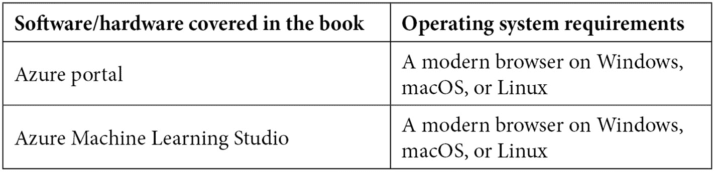

# 前言

本书帮助你获取关于在 Azure 上进行机器学习实验的实际知识。它涵盖了成为认证的 Azure 数据科学家助理所需的所有内容，帮助你理解并掌握相关技能。

本书从数据科学介绍开始，确保你熟悉书中使用的术语。然后，你将进入**Azure 机器学习**（**AzureML**）工作区，这是你在本书中其余部分的工作环境。你将了解工作室界面，并管理各种组件，如数据存储和计算集群。

接下来，你将专注于无代码和低代码实验。你将探索自动化机器学习向导，它帮助你为数据集定位并部署最佳模型。你还将学习如何使用 AzureML 工作室提供的设计器运行端到端的数据科学实验。

接下来，你将深入探讨以代码为主的数据科学实验。你将探索**AzureML 软件开发工具包**（**SDK**）用于 Python，并学习如何通过代码创建实验和发布模型。你将学习如何使用强大的计算集群来扩展你的机器学习任务。你将学习如何使用 Hyperdrive 优化模型的超参数。然后，你将学习如何使用负责任的 AI 工具来解释和调试你的模型。一旦你有了训练好的模型，你将学会如何将其用于批量或实时推理，并且了解如何在生产环境中监控它。

通过这些知识，你将对 Azure 机器学习平台有一个清晰的理解，并且能够顺利通过 DP100 考试。

# 本书适合的读者

本书面向两类读者：希望将 AI 功能融入应用程序的开发人员，以及希望在 Azure 云中扩展其机器学习实验的数据科学家。为了跟上书中的代码示例，你需要具备 Python 的基础知识。对于在 Python 中使用 scikit-learn 等常用框架训练机器学习模型有一定经验的读者，将更容易理解本书内容。

# 本书的内容

*第一章*，*现代数据科学概述*，为你提供了全书使用的术语。

*第二章*，*部署 Azure 机器学习工作区资源*，帮助你理解**Azure 机器学习**（**AzureML**）工作区的部署选项。

*第三章*，*Azure 机器学习工作室组件*，提供了你将用于进行数据科学实验的工作室 Web 界面的概述。

*第四章*，*配置工作区*，帮助你理解如何配置计算资源并连接到托管数据集的数据源。

*第五章*，*让机器来做模型训练*，引导你进行第一次**自动化机器学习**（**AutoML**）实验，并通过设计器的向导将最佳训练模型部署为 Web 端点。

*第六章*，*可视化模型训练与发布*，帮助你通过设计器体验创建训练流水线。你将学会如何通过批处理或实时流水线将训练好的模型投入生产，方法是通过设计器将训练好的流水线提升到生产环境。

*第七章*，*AzureML Python SDK*，帮助你开始使用代码驱动的数据科学实验。你将了解 AzureML Python SDK 的结构，并学习如何通过代码管理 AzureML 资源，如计算集群。

*第八章*，*使用 Python 代码实验*，帮助你用代码训练你的第一个机器学习模型。它引导你如何跟踪模型指标，并将你的训练工作扩展到更大的计算集群上。

*第九章*，*优化机器学习模型*，展示了如何通过**超参数调整**优化你的机器学习模型，并通过启动**自动化机器学习**（**AutoML**）实验与代码，帮助你发现适合你数据集的最佳模型。

*第十章*，*理解模型结果*，向你介绍了负责任的人工智能的概念，并深入探讨了那些能帮助你解读模型预测结果、分析模型常见误差并检测潜在公平性问题的工具。

*第十一章*，*与流水线协作*，指导你通过定义多步骤流水线，使用 AzureML Python SDK 编写可重复的流程。

*第十二章*，*用代码实现模型的生产化*，帮助你注册已训练的模型，并通过实时 Web 端点或批处理并行处理流水线实现其生产化。

# 为了充分利用本书

本书旨在为你提供学习所需的一切。每一章的*进一步阅读*部分包含一些链接，帮助你深入探讨与本书内容相关的外围话题。如果你对 Azure 门户有一些基本的了解，并且曾阅读过一些 Python 代码，会更有帮助。



本书将引导你使用 AzureML Studio 中的 Notebooks 体验。如果你想在工作站上执行相同的代码，而不是在基于云的环境中执行，你需要一个 Python 环境来运行 Jupyter notebooks。运行 Jupyter notebooks 最简单的方法是通过 VSCode，这是一个免费的跨平台编辑器，具有出色的 Python 支持。你还需要在工作站上安装 Git 来克隆本书的 GitHub 仓库。

**如果你正在使用本书的数字版，我们建议你亲自输入代码，或者从本书的 GitHub 仓库访问代码（下一个章节会提供链接）。这样做有助于你避免与复制粘贴代码相关的潜在错误。**

如果你在执行代码时遇到问题，请确保你已经从 GitHub 仓库克隆了最新版本。如果问题仍然存在，请随时打开 GitHub 问题页面，描述你遇到的问题，我们将帮助你解决。

# 下载示例代码文件

你可以从 GitHub 下载本书的示例代码文件，网址为[`github.com/PacktPublishing/Azure-Data-Scientist-Associate-Certification-Guide`](https://github.com/PacktPublishing/Azure-Data-Scientist-Associate-Certification-Guide)。如果代码有更新，它将会在 GitHub 仓库中更新。

我们还提供了其他代码包，来自我们丰富的书籍和视频目录，您可以在[`github.com/PacktPublishing/`](https://github.com/PacktPublishing/)查看。

# 下载彩色图片

我们还提供了一份 PDF 文件，包含本书中使用的截图和图表的彩色版本。你可以在此处下载： `static.packt-cdn.com/downloads/9781800565005_ColorImages.pdf`。

# 使用的约定

本书中使用了多个文本约定。

`文本中的代码`：表示文本中的代码词汇、数据库表名、文件夹名、文件名、文件扩展名、路径名、虚拟网址、用户输入和 Twitter 账号。这里有一个例子：“你也可以更改你正在设计的流水线的自动生成名称。将当前流水线重命名为`test-pipeline`。”

代码块如下所示：

```py
from azureml.train.hyperdrive import GridParameterSampling
from azureml.train.hyperdrive import choice
param_sampling = GridParameterSampling( {
        "a": choice(0.01, 0.5),
        "b": choice(10, 100)
    }
)
```

当我们希望特别引起你注意某个代码块时，相关行或项目会以粗体显示：

```py
from azureml.core import Workspace
ws = Workspace.from_config()
loans_ds = ws.datasets['loans']
compute_target = ws.compute_targets['cpu-sm-cluster']
```

任何命令行输入或输出都以如下方式书写：

```py
az group create --name my-name-rg --location westeurope
```

**粗体**：表示一个新术语、一个重要的词汇，或者是你在屏幕上看到的词汇。例如，菜单或对话框中的词汇通常是**粗体**。这里有一个例子：“导航到 AzureML Studio 网页界面中的 **Author** | **Notebooks** 部分。”

提示或重要说明

运行编号在不同的执行中可能会有所不同。每次执行单元时，都会创建一个新的运行编号，从上次的编号继续。因此，如果你执行的代码进行了一次超驱动运行，并且包含 20 个子运行，那么最后一个子运行将是运行 21。下次执行相同代码时，超驱动运行将从运行 22 开始，最后一个子运行将是运行 42。在本节中提到的运行编号是显示在各个图示中的编号，出现差异是正常的，特别是当你需要重新执行几个单元时。

# 联系我们

我们欢迎读者的反馈。

**一般反馈**：如果你对本书的任何内容有疑问，请通过电子邮件联系我们，邮箱地址是 customercare@packtpub.com，并在邮件主题中注明书名。

**勘误**：尽管我们已尽一切努力确保内容的准确性，但难免会有错误。如果你发现本书中的错误，感谢你向我们报告。请访问[www.packtpub.com/support/errata](https://www.packtpub.com/support/errata)并填写表格。

**盗版**：如果你在互联网上发现任何我们作品的非法复制品，感谢你提供该位置地址或网站名称。请通过电子邮件联系 copyright@packt.com，并附上该材料的链接。

**如果你有兴趣成为作者**：如果你在某个领域有专长，并且有兴趣撰写或参与编写一本书，请访问[authors.packtpub.com](https://authors.packtpub.com)。

# 分享你的想法

一旦你阅读了*《Azure 数据科学家助理认证指南》*，我们很想听听你的想法！请[点击这里直接进入亚马逊书籍评论页面](https://packt.link/r/1-800-56500-3%0D)并分享你的反馈。

你的评论对我们以及技术社区非常重要，它将帮助我们确保提供优质的内容。
