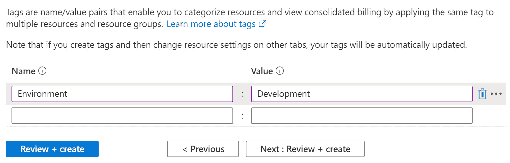

# 第二章：*第二章*：部署 Azure 机器学习工作区资源

在本章中，你将学习如何通过 Azure 门户和 **命令行界面**（**CLI**）部署 **Azure 机器学习**（**Azure ML**）工作区。你还将了解在部署工作区时需要选择的部署参数。最后，你将拥有一个完全功能的 Azure ML 工作区，并能够访问所有已部署的 Azure 资源。

在本章中，我们将涵盖以下主要内容：

+   通过门户部署 Azure ML

+   通过 CLI 部署 Azure ML

+   部署 Azure ML 工作区的替代方式

+   探索已部署的 Azure 资源

# 技术要求

要创建 Azure ML 工作区，你需要一个 Azure 订阅。你可以通过访问 [`azure.microsoft.com/free/`](https://azure.microsoft.com/free/) 获得免费试用。如果你想使用现有的订阅，你需要请求订阅所有者提供以下 **资源组** 项目：

+   `packt-azureml-rg`

+   `packt-azureml-cli-rg`

本书假设你在这些资源组中拥有 `Contributor` 角色或 `Owner` 角色。你将通过 Azure 门户和 Azure CLI 在这两个资源组中各部署一个 Azure ML 工作区。

**Azure ML** 需要在托管资源组的 Azure 订阅中注册以下提供程序：

+   `Microsoft.MachineLearningServices`

+   `Microsoft.KeyVault`

+   `Microsoft.Storage`

+   `Microsoft.insights`

+   `Microsoft.ContainerRegistry`

+   `Microsoft.Notebooks`

如果你是订阅的 `Owner`，Azure 会在你部署资源时自动为你注册提供程序。否则，你需要按照 [`docs.microsoft.com/azure/azure-resource-manager/templates/error-register-resource-provider#solution-3---azure-portal`](https://docs.microsoft.com/azure/azure-resource-manager/templates/error-register-resource-provider#solution-3---azure-portal) 上的说明请求订阅所有者为你注册这些提供程序。

你需要一个启用了 **JavaScript** 的现代浏览器。访问 Azure 门户时需要此功能。

可选地，你可以从微软官方文档页面 [`docs.microsoft.com/cli/azure/install-azure-cli`](https://docs.microsoft.com/cli/azure/install-azure-cli) 下载并安装 Azure CLI。本书将教你如何使用嵌入在 Azure 门户中的在线版本。

你可以在 GitHub 上找到本章的所有命令和代码片段：[`bit.ly/dp100-ch02`](http://bit.ly/dp100-ch02)。

# 通过门户部署 Azure ML

在本节中，你将通过 Azure 门户向导部署一个 Azure ML 工作区。首先，导航到 Azure 门户 [`portal.azure.com`](https://portal.azure.com)。

有几种方法可以启动 Azure ML 工作区向导的创建。以下是三种最常见的方法：

+   从 Azure 门户的主页，您可以从页面顶部的 **Azure 服务** 标签下或左上角的 **Azure 门户菜单** 中选择 **创建资源**：


图 2.1 – 在 Azure 门户中创建资源

这种方法是最通用的，会要求您搜索要创建的服务。搜索 `machine learning` 并选择 Microsoft 提供的 **Marketplace** 搜索结果中的第一个选项：


图 2.2 – Azure Marketplace 中的 ML 搜索结果

您可以查看服务信息。完成后，点击 **创建** 按钮启动向导。

+   或者，您可以在 Azure 门户的顶部搜索栏中搜索 `machine learning`，并选择 **Machine Learning** 选项，该选项出现在 **服务** 下：


图 2.3 – 在 Azure 门户中显示的 ML 服务搜索结果

这将引导您进入您可以访问的已经部署的 ML 工作区列表。如果这是一个新的订阅，则该列表为空；您可以点击工具栏中的 **添加** 按钮：


图 2.4 – 空服务列表中可用的创建按钮

+   最常见的方法是导航到您希望部署 Azure ML 工作区的资源组，并从工具栏中选择 **添加**：


图 2.5 – 资源组中的添加选项

搜索 `machine learning`，并选择 Microsoft 提供的 Marketplace 搜索结果中的第一个选项。点击 **创建** 按钮以启动向导。此方法将自动填充向导中的资源组选项。

这三种方法都将引导您进入部署向导：


图 2.6 – ML 工作区创建向导

在下一部分，您将学习如何使用向导来部署 Azure ML 工作区。

## 使用部署向导

向导包括五个步骤或选项卡：

1.  **基础信息**：这是关于您即将部署的工作区的基本信息。

1.  **网络设置**：这是指您可能希望配置的高级网络选项。

1.  **高级设置**：这包括高级身份验证和数据安全工作区选项

1.  **标签**：这包括工作区中的相关标签

1.  **审核 + 创建**：这是向导的最后一步；经过简短的验证过程后，您可以部署工作区。

    在接下来的章节中，我们将回顾向导中所有可用的选项，并讨论在选择它们之前需要考虑的事项。

    重要提示

    如果你在向导的**基本**步骤中看到警告**选定的订阅没有权限注册资源提供者**，请确保向 Azure 订阅的所有者请求注册本章*技术要求*部分提到的资源提供者（如果缺少提供者）。如果这些提供者没有注册，将导致在向导的**审查 + 创建**步骤中出现验证错误。

### 基本信息

向导从**基本**步骤开始：

1.  你需要首先指定的是`Contributor`访问角色，位于订阅级别。如果你是从`packt-azureml-rg`启动向导的。

1.  输入`packt-learning-mlw`，这是一个受**Azure Cloud Adoption Framework**（**Azure CAF**）命名规范启发的名称。

1.  你需要选择一个**区域**来部署 Azure ML 工作区。该区域是你将要部署 Azure ML 工作区所需资源的 Azure 数据中心。列表已经筛选，仅包含具有该产品可用的所有数据中心。

    在选择 Azure 区域部署资源时，有三件事需要考虑。它们包括合规性和数据驻留要求、服务可用性以及定价。一个例子可能是你需要使用某些具有特定**图形处理单元**（**GPU**）的专用**虚拟机**大小，例如 NV 系列，它配备了 Tesla M60——这种虚拟机大小在任何加拿大 Azure 区域都不可用。对于本书，你应该选择离你最近的区域。

1.  可选地，你可以修改存储帐户或容器注册表名称中的`hyphen (-)`名称。此外，存储帐户、密钥库和容器注册表的名称必须是唯一的。你将在本章的*探索已部署的 Azure 资源*部分中了解更多关于这些资源的内容。如果已存在同名资源，系统会提示你更改名称。*图 2.7*展示了填写后的基本向导页面。


图 2.7 – 向导基本步骤中选择的信息

填写完所有基本信息后，你可以点击**审查 + 创建**按钮，并跳过所有中间步骤。这意味着你自动接受其余向导步骤的默认选项。然而，为了学习目的，你应该点击**下一步：网络**按钮，导航到下一个向导页面。

重要提示

直到 2020 年 9 月，这些向导的第一页要求选择`Basic`版本和`Enterprise`版本。`Enterprise`版本提供了设计器和你将在本书中看到的自动化 ML 功能。从 2020 年 10 月起，所有功能都可以在`Basic`版本中使用。原始认证中有关于哪个功能属于哪个版本的问题——这种情况在你的考试中应该不会遇到。

### 网络

在此向导页面，你需要决定如何计划连接到 Azure ML 工作区的数据平面。数据平面包含你工作区内所有以数据为中心的操作，例如使用 Azure ML Studio Web 界面、触发 ML 管道以及通过**软件开发工具包**（**SDK**）进行 API 调用。共有两种选择，如下所示：

+   **公共端点（所有网络）**：这是默认选项，允许你从一个公开可访问的端点访问工作区。

+   **私有端点**：私有端点通过减少 Azure ML 工作区的攻击面来降低数据外泄的风险。一旦你决定为工作区提供**私有端点**连接，你将需要有一个虚拟机或**虚拟专用网络**（**VPN**）连接，以便访问你将暴露的私有端点：


图 2.8 – 私有端点保障对 Azure ML 工作区的访问

对于本书的目的，你将选择**公共端点（所有网络）**：


图 2.9 – 创建向导中的网络选项

在下一页，你将选择高级选项。

### 高级

在此向导页面，你可以配置一些关于工作区安全性、元数据和指标数据隐私的选项。

1.  你可以配置 AzureML 工作区使用的**托管身份**来进行身份验证并访问其他云资源。你可以选择**系统分配的身份**或**用户分配的身份**。系统分配的身份将在你部署 AzureML 资源时自动创建。相反，你可以在 Azure 门户中创建一个**用户分配的托管身份**资源，并在部署 AzureML 工作区时使用它。使用用户分配的选项允许你事先创建身份，配置对各种系统和数据源的访问权限，然后将其分配给工作区。你甚至可以在其他服务中使用相同的身份，例如 Azure 自动化帐户。你可以在本章的*进一步阅读*部分了解更多关于托管身份的信息。在本书中，你将使用默认选项，即**系统分配的身份**。

1.  您可以定义 AzureML 工作区如何访问存储在默认存储帐户中的数据。**基于凭据的访问**使用存储帐户访问密钥来读取数据。您可以将此方法视为使用一个由所有有权访问 AzureML 工作区的人共享的密码来访问该存储帐户中的数据。在某些组织中，出于安全原因，禁止使用存储帐户访问密钥。在这种情况下，应该使用**基于身份的访问**。当您选择该选项时，AzureML 使用其**托管身份**来访问存储帐户中的数据并写入工件，如训练后的模型。此外，当数据科学家访问存储在默认存储帐户中的数据集时，他们的身份将传递到存储帐户中，以进行身份验证并提供数据。为了本书的目的，您将使用**基于凭据的访问**。

1.  默认情况下，Azure 机器学习服务使用 Microsoft 管理的存储，并通过 Microsoft 管理的加密密钥存储度量和元数据。您可以指定自己的密钥来加密度量和元数据。为此，您需要选择存储在现有**密钥保管库**中的密钥。此操作将为您在一个新的资源组中提供一些额外的 Azure 资源，其中包括一个 Cosmos DB，资源组的名称将基于模式<your-azure-ml-workspace-resource-name>_<GUID>，例如 packt-learning-mlw_ab07ab07-ab07-ab07-ab07-ab07ab07ab07。您对这些资源没有任何控制权。它们的生命周期管理由 Azure 机器学习工作区处理，这意味着当您删除工作区时，这些资源将自动删除。

1.  向导步骤中的最后一个选项允许您限制在工作区收集的遥测和度量数据的数量。您可以通过选择`Environment`来实现：通常，您会为代码库设置多个环境，例如开发环境、质量保证测试环境和生产环境。为了本书的目的，您应该指定`Development`值。

如果需要，您可以添加额外的元数据标签。标签的数量最多为 50，这是每个资源当前支持的标签数量上限：



图 2.11 – 创建向导中的标签步骤

完成后，点击**下一步：审查 + 创建**以进入向导的最后一步。

### 审查 + 创建

这是向导的最后一步。如果您忘记完成某些操作或在先前的步骤中做出了无效选择，您将收到错误消息，红点将指示出错的步骤：


图 2.12 – 基本步骤中出现错误验证，指示存在问题

1.  如果一切正常，将会看到 `keyVaultName`、`storageAccountName` 和 `applicationInsightsName` 的 JSON 值。这个模板可以从该视图立即部署，或者你可以下载它，并将其用于在不同的订阅中配置这些资源。例如，假设你希望使用相同的资源结构来配置生产环境。你可以使用这个自动生成的 ARM 模板，修改目标 **资源组**、相应的资源名称和标签值，并将其部署到生产环境中。请注意，你指定的资源名称需要是唯一的，可能需要进行一些尝试，直到找到一个可用的名称。

1.  点击 **创建** 按钮以配置你的 Azure ML 工作区资源。资源将开始部署。这个过程可能需要几分钟才能完成。

    最后，你应该会看到一个名为 **转到资源** 的按钮，可以通过它导航到新配置的 Azure ML 工作区：


图 2.14 – “转到资源”按钮，表示 Azure ML 工作区部署成功

在接下来的章节中，你将学习如何使用 Azure CLI 部署相同的 Azure ML 工作区，Azure CLI 是在 Azure 中部署资源的最流行方式之一。

# 通过 CLI 部署 Azure ML

在这一节中，你将通过 Azure CLI 部署一个 Azure ML 工作区。你将使用 `packt-azureml-cli-rg` 资源组来部署资源；你将使用 Azure 门户中内置的 Bash 版本的 **Azure Cloud Shell**，这不需要在你的机器上进行任何安装。如果你愿意，你可以按照 [`docs.microsoft.com/cli/azure/install-azure-cli`](https://docs.microsoft.com/cli/azure/install-azure-cli) 中的安装说明在本地安装 Azure CLI，跳过 Azure Cloud Shell 的配置。

重要提示

在接下来的章节中，你将使用 Azure CLI 管理 Azure ML 工作区的各个方面。尽管本书假设你选择了 Azure Cloud Shell，但你将看到的语法适用于 Azure Cloud Shell 和在本地机器上运行的 Azure CLI。

## 部署 Azure Cloud Shell

Azure Cloud Shell 是一个基于浏览器的 Shell，允许你管理 Azure。你可以通过访问 [`shell.azure.com`](https://shell.azure.com) 专用页面或通过点击 Azure 门户顶部栏中的 Cloud Shell 图标来访问它：


图 2.15 – Azure 门户顶部栏中的 Cloud Shell 图标

让我们开始吧！

1.  当你第一次调用 Cloud Shell 时，你将看到欢迎向导。选择 `Bash` 继续：

    图 2.16 – Azure Cloud Shell 欢迎向导

1.  Azure Cloud Shell 需要一个文件共享来保存文件。在向导的下一步中，您可以选择一个订阅；门户将自动为您部署一个存储账户。根据您在订阅级别的权限，向导将会创建一个新的资源组，或者使用一个您拥有 `Contributor` 角色的资源组。

    如果您想微调此过程，您可以选择 **显示高级设置** 选项，并手动创建新的资源组，或定义将被 Cloud Shell 使用的存储账户名称和文件共享名称：

    

    图 2.17 – 配置 Cloud Shell 时的高级设置

1.  对于本书的目的，您应允许向导自动为您创建一个存储账户，通过选择您拥有的 **订阅**，然后点击 **创建存储** 按钮而无需配置高级设置：

图 2.18 – 创建存储账户向导页面，正在配置 Cloud Shell

稍等片刻，一个存储账户将会被创建，您的 Cloud Shell Bash 提示符应当出现：


图 2.19 – Azure Cloud Shell 中的 Bash 提示符

现在您已经拥有了一个 Cloud Shell，您可以使用 Azure CLI 来管理您的 Azure 资源；这将在下一部分中教您如何操作。

## 使用 Azure CLI

Azure CLI 是一个管理命令行工具，您可以通过输入 `az` 命令来调用它。通过这个工具，您可以配置和管理您的 Azure 资源。学习 Azure CLI 最简单的方式是使用任何命令末尾的 `--help` 参数。例如，您可以从 `az --help` 开始。这将列出所有可用的命令，如 `login` 命令、`find` 命令以及子组，包括 `storage` 子组：


图 2.20 – az 命令的子组和命令

您可以通过将不同的子组和命令附加到 `az` 命令来继续探索。例如，我们可以通过输入 `az group --help` 来探索 `group` 子组。接着，我们将研究 `list` 命令，通过输入 `az group list --help` 来发现所有可用的选项：


图 2.21 – az group list 命令帮助页面

Azure CLI 的另一个有用功能是 `az find` 命令，它可以在 Azure 文档中搜索相关信息：


图 2.22 – 使用 az find 查找 Azure CLI 命令

您可以通过运行`az group list -o table`命令列出所有您有权限访问的资源组，其中我们已指定输出格式为表格：


图 2.23 – 通过 Azure CLI 列出您有访问权限的所有资源组

提示

如果您发现自己无法理解为什么输入的 Azure CLI 命令没有按预期工作，可以使用`--verbose`标志。如果您需要更多的信息，可以将其与`--debug`标志结合使用。

在接下来的部分中，您将探索可以通过 Azure CLI 执行的最常见操作。

### 在 Azure CLI 中进行身份验证

如果您收到错误信息，提示您使用`az login`命令，这将提示您打开一个页面并输入代码。此过程称为**交互式设备身份验证**。您将在*第七章*中了解更多关于此过程的信息，*The AzureML Python SDK*部分。

访问网页并输入代码后，您需要使用具有访问权限的帐户登录 Azure 订阅，才能通过 Azure CLI 控制该订阅。这样做将授权 Azure CLI 代表您执行操作。您随时可以通过输入`az logout`退出 Azure CLI。

### 选择活动的 Azure 订阅

如果您可以访问多个 Azure 订阅，则需要指定哪个订阅是活动订阅。要列出您的订阅，请输入`az account list -o table`；您可以通过输入`az account set --subscription "订阅名称或 ID"`来激活某个订阅，并传入要通过 Azure CLI 控制的订阅名称或 ID。

### 从 Azure CLI 创建资源组

互联网上最常见的 Azure CLI 命令之一就是创建资源组命令，它是一个虚拟文件夹，您可以在其中部署 Azure 资源。以下命令将创建一个名为`packt-azureml-cli-rg`的资源组，并将该新资源组的记录保存在西欧的 Azure 数据中心中：

```py
az group create --name packt-azureml-cli-rg --location westeurope
```

`--name`参数的快捷方式是`-n`。类似地，`-l`是`--location`的快捷方式。前面的命令现在可以写成如下：

```py
az group create -n packt-azureml-cli-rg -l westeurope
```

`-n`和`-l`快捷方式在许多 Azure CLI 命令中都很常见。

重要提示

您需要在订阅级别拥有`Contributor`角色，才能创建资源组。更准确地说，您需要一个允许执行`Microsoft.Resources/subscriptions/resourceGroups/write`操作的角色，您将在本章后面出现的*理解基于角色的访问控制（RBAC）*部分中了解更多相关信息。

在接下来的部分中，您将学习如何在 Azure CLI 中安装扩展：一个用于管理 Azure ML 工作区的扩展。

## 安装 Azure ML CLI 扩展

要通过 Azure CLI 管理 Azure ML 工作区，你需要安装`az extension add -n azure-cli-ml`。

要查看当前已安装的扩展及其版本，输入`az extension list -o table`：


图 2.24 – 包括 azure-cli-ml 在内的所有已安装扩展的列表

要将已安装的扩展更新到最新版本，请输入`az extension update -n azure-cli-ml`。

你刚刚安装的扩展已将`ml`命令子组添加到 Azure CLI 中。你可以通过使用`az ml --help`命令来检查该子组及其包含的命令。在下一节中，你将使用这些新命令来部署 Azure ML 工作区。

## 使用 az ml 命令部署 Azure ML

本节的目标是在名为`packt-azureml-cli-rg`的资源组中部署名为`packt-learning-cli-mlw`的 Azure ML 工作区，并附加`Environment`标签，值为`Development`。

要配置一个新的 Azure ML 工作区，你需要使用`az ml workspace create`命令。

唯一需要的选项是`--workspace-name`或`-w`，即工作区名称。这样会在你的 Azure 订阅中创建一个新的资源组并在其中部署新的工作区。这要求你至少在订阅级别具有`Contributor`角色，否则会收到授权错误。

为了指定你希望部署新工作区的目标资源组，你需要传递`--resource-group`选项或`-g`选项。

重要提示

一些常见的`az ml`参数：`-g`和`-w`参数在所有 Azure ML CLI 命令中都是常见的，你将在本书的后续部分再次使用它们。

要将标签附加到新创建的资源，可以使用`--tags`参数或`-t`参数，后者使用*key=value*语法。

输入以下命令以部署请求的 Azure ML 工作区：

```py
az ml workspace create -g packt-azureml-cli-rg -w packt-learning-cli-mlw -t Environment=Development
```

结果如下图所示：


图 2.25 – 通过 CLI 扩展部署 Azure ML 工作区

在本节中，你学习了如何使用 Azure CLI 部署 Azure ML 工作区。对于本书，你只需要通过用户界面配置的那个，下一节中你将删除刚刚配置的那个。

## 清理 CLI 资源组

本书的目的，你需要一个 Azure ML 工作区。你将使用通过 Azure 门户在`packt-azureml-rg`资源组中部署的工作区。如果你愿意，可以通过执行以下命令删除新配置的 Azure ML 工作区：

```py
az ml workspace delete -g packt-azureml-cli-rg -w packt-learning-cli-mlw --all-resources
```

这将删除 Azure ML 工作区以及前面步骤中配置的所有相关资源。

到目前为止，您已经探索了通过门户和 Azure CLI 部署 Azure ML 工作区的最常见方式。在下一节中，您将学习几种额外的方法，包括 DevOps 工程师首选的 ARM 方法。

# 部署 Azure ML 工作区的替代方法

还有其他方式可以部署 Azure ML 工作区：

+   创建 ARM 模板。这是 Azure 原生的资源描述方式，您可以通过 JSON 文件描述要部署的资源。有关 Azure ML 工作区的 ARM 模板示例，您可以访问 [`bit.ly/dp100-azureml-arm`](https://bit.ly/dp100-azureml-arm)。

    从 Azure CLI 部署此模板的命令如下所示：

    ```py
    az deployment group create --name packt-deployment --resource-group packt-azureml-rg --template-uri https://bit.ly/dp100-azureml-arm --parameters workspaceName=packt-learning-arm-mlw location=westeurope
    ```

    您还可以通过选择在 Azure 门户资源创建向导最后一步的 **创建** 按钮左侧显示的 **下载自动化模板** 链接来找到 ARM 模板。

+   通过 Azure ML Python SDK，您将在 *第七章* 中了解 *Azure ML Python*。

+   通过 Azure 管理 REST API，如在 [`docs.microsoft.com/azure/machine-learning/how-to-manage-rest#create-a-workspace-using-rest`](https://docs.microsoft.com/azure/machine-learning/how-to-manage-rest#create-a-workspace-using-rest) 中所述。

在下一节中，您将探索已部署到目标资源组的 Azure 资源，并学习如何为同事提供工作区访问权限。

# 探索已部署的 Azure 资源

打开 Azure 门户并搜索资源组。选择图标以导航到您有权限访问的资源组列表，如下图所示：


图 2.26 – 导航到资源组列表

选择 **packt-azureml-rg** 选项并观察在该资源组内部署的资源：

+   ML 工作区资源命名为 **packt-learning-mlw**。这是您部署的主要资源。通过该资源，您可以管理工作区的各个方面。

+   一个名为 **packtlearningm<random_number>** 的 Azure 密钥保管库服务。此密钥保管库用于安全存储您将在 Azure ML 工作区中使用的凭据和访问密钥。

+   一个名为 **packtlearningm<random_number>** 的存储帐户。此存储帐户在配置过程中自动生成，用于存储来自工作区的文件，包括实验数据集和模型。

+   一个名为 **packtlearningm<random_number>** 的应用洞察帐户。这是您将在 Azure ML 工作区中发布的所有预测端点的监视服务。

这些是自动部署到 Azure ML 工作区的开箱即用组件：


图 2.27 – packt-azureml-rg 资源组中的资源列表

其实还有一个资源会在你运行第一个实验时自动配置：一个**Azure 容器注册表**（**ACR**）。这个注册表将托管各种**Docker**容器镜像，包括将要暴露一个网页服务器，该服务器会基于你训练的**人工智能**（**AI**）模型进行推理。

当你想为模型部署实时端点时，你可以在**Azure 容器实例**（**ACI**）或**Azure Kubernetes 服务**（**AKS**）中进行部署，这一操作可以在 Azure ML Studio 中完成。你将在本书的*第五章*《让机器进行模型训练》中首次部署 ACI，你会注意到一个 ACI 资源会出现在该资源组中，旁边是现有的资源。

## 理解基于角色的访问控制（RBAC）

Azure 提供了 RBAC，允许你定义每个角色在特定资源上可以执行的操作。每个角色会根据特定的范围分配，例如，如果你在某个资源组中被分配了**贡献者**角色，你只能在该资源组内配置资源，而无法在订阅级别进行操作。Azure 默认提供了三种常见的角色：

+   **读取者**：这个角色允许你浏览 Azure 资源，但无法修改或激活任何内容。

+   **贡献者**：这个角色基于**读取者**角色，并允许你编辑资源或在角色的范围内创建新资源。这个角色不允许修改附加到资源的权限。这意味着你不能授予其他用户对你可能配置的资源的权限。

+   **所有者**：这个角色可以执行**贡献者**角色所做的所有操作，还可以在此角色适用的范围内分配和修改角色。

让我们来查看在你部署 Azure ML 工作区的资源组中分配的角色。点击资源组的**访问控制（IAM）**标签，然后选择**角色分配**。在这个页面上，你将看到在资源组级别的角色分配列表。注意，你的账户至少已经在该资源组中被分配了**贡献者**角色，以便配置资源。如果你在列表中没有看到自己的账户，可能是因为你是管理员，试着查看**经典管理员**标签下的内容：


图 2.28 – packt-azureml-rg 资源组的访问控制（IAM）页面上的角色分配

当您配置工作区时，会创建一个新的系统分配的托管身份，名称与您配置的 Azure ML 工作区相同。这个身份自动被分配为资源组的**贡献者**角色。这允许 ML 工作区在该资源组内部署 ACI 资源并访问计算目标和数据存储。请注意，此身份由平台本身使用，不应被用于分配对外部资源的访问权限等。

接下来，您将了解该角色分配如何流向资源。

## RBAC 继承

打开**packt-learning-mlw**资源，点击**访问控制（IAM）**选项卡，然后选择**角色分配**。

请注意，资源组中存在的角色会继承到 Azure ML 工作区资源：


图 2.29 – 来自资源组的 packt-learning-mlw 中的 RBAC 继承

角色分配从订阅继承到资源组，然后从资源组继承到资源。在订阅之上，还有一个分组层，称为**管理组**，它允许您构建包含其他管理组或订阅的层次结构。以下是整体 RBAC 继承模型的示意图：


图 2.30 – RBAC 继承模型

现在您已经知道如何分配现成的角色并理解继承是如何工作的，在下一节中，您将学习如何为您的 Azure ML 工作区创建自定义角色。

## 创建自定义角色

Azure 允许您创建自定义 RBAC 角色，您可以精细调整哪些操作被允许，哪些操作不被允许；这类似于允许列表和阻止列表。门户提供了一种图形化体验，允许您在资源组级别或更高的级别创建自定义角色。此体验的结果是一个 JSON 文件，如下所示的示例：

```py
{
    "Name": "ACI model deployer role",
    "IsCustom": true,
    "Description": "Can deploy registered model on ACI resources",
    "Actions": [
"Microsoft.MachineLearningServices/workspaces/services/aci/write"
    ],
    "NotActions": [ ],
    "AssignableScopes":["/subscriptions/<subscription_id>"]
}
```

这是一个非常简单的自定义角色，名为`ACI 模型部署者角色`，它为工作区的 ACI 服务提供写入访问权限——这是通过字面值`Microsoft.MachineLearningServices/workspaces/services/aci/write`来编码的操作。

一个更复杂的自定义角色示例如下：

```py
{
    "Name": "Limited Data Scientist",
    "IsCustom": true,
    "Description": "Limited data scientist role",
    "Actions": ["*"],
    "NotActions": [
"Microsoft.MachineLearningServices/workspaces/computes/delete",
"Microsoft.Authorization/*/write"
    ],
    "AssignableScopes": [        
"/subscriptions/<subscription_id>/resourceGroups/<resource_group_name>/providers/Microsoft.MachineLearningServices/workspaces/<workspace_name>"
    ]
}
```

请注意，与之前的角色显式允许单个操作不同，此角色在允许的操作中使用了通配符（`*`），这意味着它可以执行所有可用操作。为了限制这种效果，我们使用了 `NotActions` 部分，它指示哪些操作被明确拒绝。在此示例中，我们明确禁止删除计算资源的操作（`Microsoft.MachineLearningServices/workspaces/computes/delete`），并且不能更新该工作区的任何授权方面（`Microsoft.Authorization/*/write`）。注意，通配符可以用于匹配部分操作，例如在 `Microsoft.Authorization` 操作中，通配符匹配操作组，如 `lock`、`roleAssignments` 和 `roleDefinitions`。在我们的案例中，我们希望拥有此角色的用户不能向工作区添加新用户，因此我们希望拒绝 `Microsoft.Authorization/roleAssignments/write` 操作，而该操作已被我们使用的通配符表达式所覆盖。

最后，`AssignableScopes` 允许你指定此角色的作用范围。这是一个必填字段。在第一个示例中，你将此角色的作用范围限制在 ID 为 `<subscription_id>` 的 Azure 订阅中。在这种情况下，你可以将此自定义角色分配给属于该订阅 ID `<subscription_id>` 的任何资源组或资源。在第二个示例中，你将此自定义角色的作用范围限制在名为 `<workspace_name>` 的 Azure ML 工作区中，该工作区部署在名为 `<resource_group_name>` 的资源组中，并且属于 `<subscription_id>` 订阅。这意味着你不能将此自定义角色分配到其他地方，因为它具有非常特定的可分配作用范围。

如果你希望通过 Azure CLI 在 Azure 中部署自定义角色，可以使用以下命令：

```py
az role definition create --role-definition custom_role.json
```

这里，`custom_role.json` 是包含你要在 Azure 中部署的自定义角色的 JSON 角色定义文件。

一旦角色部署到 Azure，你可以将该特定角色分配给某个用户。

## 在 Azure ML 工作区中分配角色

将角色分配给用户是一项特权操作，意味着你正在修改资源的权限。为此，你需要拥有你想要修改的资源的 `Owner` 权限。更准确地说，你需要一个允许你使用 `Microsoft.Authorization/roleAssignments/write` 操作的角色——这是内置的 `Owner` 角色所具备的权限。

如果你拥有 `Owner` 权限，你可以将你在前一部分中创建的 **ACI 模型部署角色** 分配给某个用户。你可以通过以下三种方式进行操作：

+   在 Azure 门户中，你可以访问你想要的 Azure ML 工作区，并通过 *理解基于角色的访问控制（RBAC）* 部分中看到的 **访问控制（IAM）** 选项卡将角色分配给用户。

+   通过 Azure CLI 执行以下命令：

    ```py
    user id. Then, you apply this assignment at the level of the Azure ML workspace. To get the user ID of the user with the email username@organization.org, you can use the following Azure CLI command:

    ```

    az ad user list --query "[?mail=='username@organization.org'].objectId" --output tsv

    ```py

    ```

+   通过使用以下命令的 Azure ML CLI 扩展：

    ```py
    az ml workspace share -w packt-learning-mlw -g packt-azureml-rg --role "ACI model deployer role" --user username@organization.org
    ```

通过这些步骤，你可以通过创建自定义角色来与同事共享工作区，从而细化允许的权限。

# 总结

在这一章中，你了解了部署 Azure ML 的前提条件。你可以使用试用订阅，也可以在你公司订阅中请求一个资源组，在那里你至少具有该资源组的贡献者权限。你还深入了解了在开发环境中部署 Azure ML 工作区的两种最常见方式，并且你掌握了需要指定的参数。你还了解了部署工作区的其他方式，包括 ARM 模板，这是一种更适合 DevOps 的生产环境部署方式。在最后一部分，你了解了部署 Azure ML 工作区所涉及的资源，并学习了 RBAC 在 Azure 中的工作原理。此外，你还学习了如何使用内置角色或自定义角色来授予对已部署 Azure ML 工作区的访问权限。

在下一章，你将学习 **Azure ML Studio** 的使用体验，它是一个支持管理端到端 ML 生命周期的 Web 环境。

# 问题

在每一章中，你应该会找到几个问题，帮助你对本章讨论的主题进行知识检查：

1.  以下哪些是适用于部署 Azure ML 工作区的方式？

    a. 通过 azure-cli-ml 扩展的 Azure CLI

    b. Azure 门户

    c. 部署 ARM 模板

    d. Azure ML Python SDK

1.  你正在创建一个自定义角色，并希望拒绝删除工作区的权限。你需要在 JSON 定义的哪个部分添加 `Actions` 部分？

    b. 添加到 JSON 定义的 `NotActions` 部分

    c. 添加到 JSON 定义的 `AssignableScopes` 部分

1.  在 Azure CLI 中，你需要安装什么才能部署 Azure ML 工作区？

# 进一步阅读

本节提供了一些有用的网络资源，可以帮助你拓展对 Azure 的知识和理解：

+   如果这是你第一次访问 Azure 门户，你可能希望先阅读有关它的概述，地址为[`docs.microsoft.com/azure/azure-portal/azure-portal-overview`](https://docs.microsoft.com/azure/azure-portal/azure-portal-overview)。如果你想了解更多关于 Cloud Shell 的功能，可以访问[`docs.microsoft.com/azure/cloud-shell/overview`](https://docs.microsoft.com/azure/cloud-shell/overview)。

+   你可以在[`azure.microsoft.com/global-infrastructure/geographies/#choose-your-region`](https://azure.microsoft.com/global-infrastructure/geographies/#choose-your-region)了解更多关于选择资源区域的信息。

+   如果你有兴趣学习如何使用 Azure 门户创建和部署 ARM 模板，你可以阅读文档：[`docs.microsoft.com/azure/azure-resource-manager/templates/quickstart-create-templates-use-the-portal`](https://docs.microsoft.com/azure/azure-resource-manager/templates/quickstart-create-templates-use-the-portal)。

+   要查看支持 Azure ML 服务的数据中心完整列表，请访问[`azure.microsoft.com/global-infrastructure/services/?regions=all&products=machine-learning-service`](https://azure.microsoft.com/global-infrastructure/services/?regions=all&products=machine-learning-service)。

+   你可以在[`docs.microsoft.com/azure/azure-resource-manager/management/resource-name-rules#microsoftmachinelearningservices`](https://docs.microsoft.com/azure/azure-resource-manager/management/resource-name-rules#microsoftmachinelearningservices)了解更多关于 Azure 资源名称规则的内容。

+   你可以在[`docs.microsoft.com/azure/cloud-adoption-framework/ready/azure-best-practices/naming-and-tagging`](https://docs.microsoft.com/azure/cloud-adoption-framework/ready/azure-best-practices/naming-and-tagging)阅读更多关于命名最佳实践的信息。

+   你还可以阅读更多关于如何使用资源标签的信息，链接：[`docs.microsoft.com/azure/azure-resource-manager/management/tag-resources`](https://docs.microsoft.com/azure/azure-resource-manager/management/tag-resources)。微软云采用框架中有一份与元数据标签相关的最佳实践列表，你可以在[`docs.microsoft.com/azure/cloud-adoption-framework/ready/azure-best-practices/naming-and-tagging#metadata-tags`](https://docs.microsoft.com/azure/cloud-adoption-framework/ready/azure-best-practices/naming-and-tagging#metadata-tags)阅读。

+   如需了解更多关于 Azure ML 私有链接功能的信息，请参考[`docs.microsoft.com/azure/machine-learning/how-to-configure-private-link`](https://docs.microsoft.com/azure/machine-learning/how-to-configure-private-link)。

+   你可以在[`docs.microsoft.com/azure/machine-learning/concept-enterprise-security#securing-compute-targets-and-data`](https://docs.microsoft.com/azure/machine-learning/concept-enterprise-security#securing-compute-targets-and-data)了解更多关于该系统托管身份概念的信息，该概念被融入到 Azure ML 工作区中。

+   你可以在[`docs.microsoft.com/azure/machine-learning/how-to-assign-roles`](https://docs.microsoft.com/azure/machine-learning/how-to-assign-roles)了解更多关于默认 Azure 角色（如`Owner`、`Contributor`和`Reader`）以及如何为 Azure ML 工作区创建自定义角色的内容。

+   了解更多关于托管身份的信息：[`docs.microsoft.com/azure/active-directory/managed-identities-azure-resources/overview`](https://docs.microsoft.com/azure/active-directory/managed-identities-azure-resources/overview)

+   AzureML 基于身份的数据访问: [`docs.microsoft.com/azure/machine-learning/how-to-identity-based-data-access`](https://docs.microsoft.com/azure/machine-learning/how-to-identity-based-data-access)
