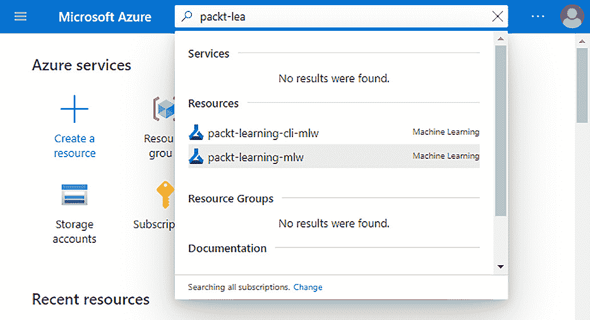
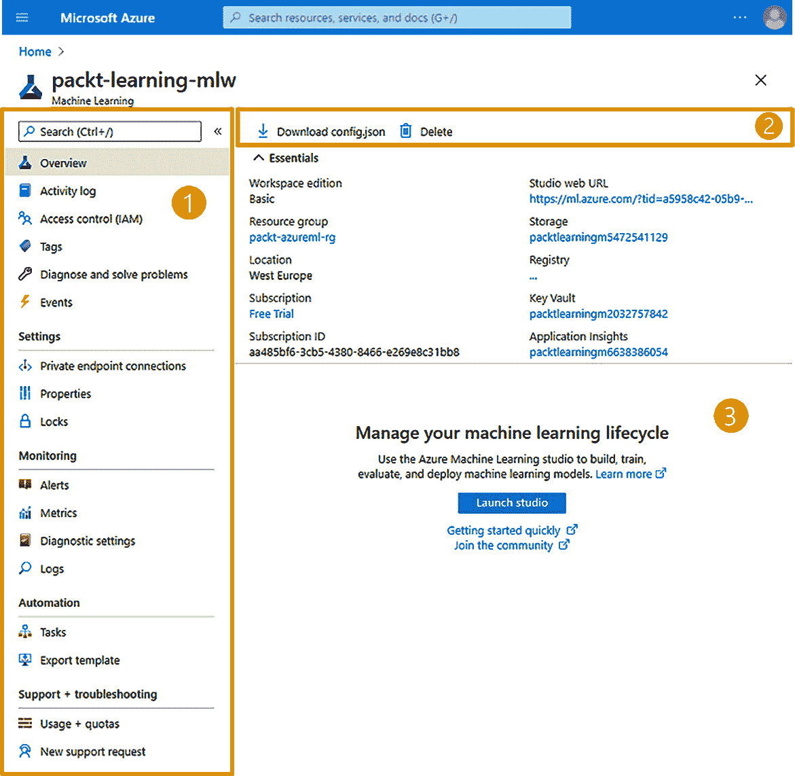
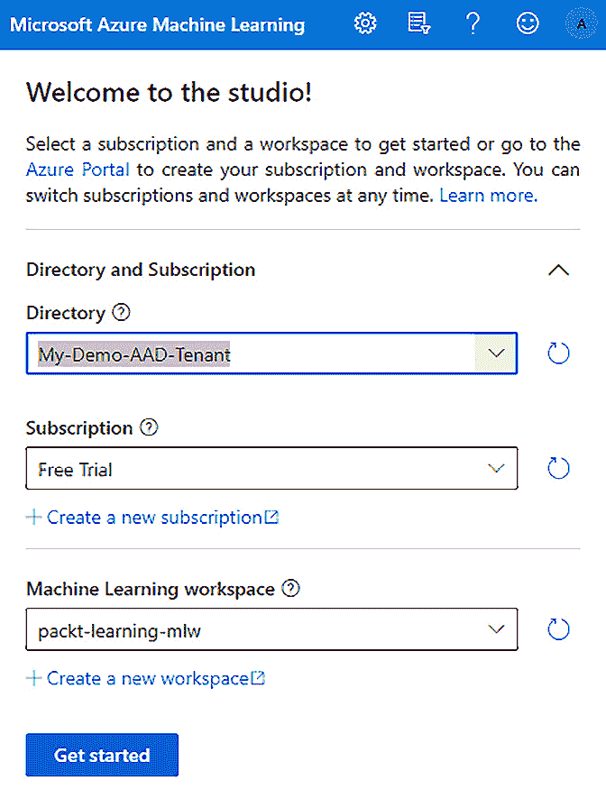
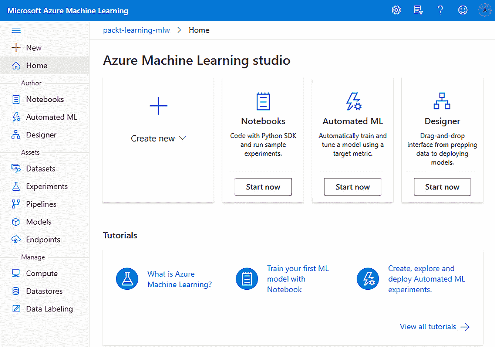
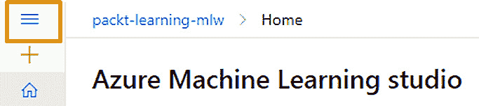
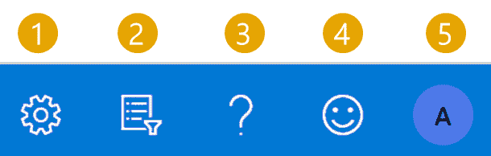
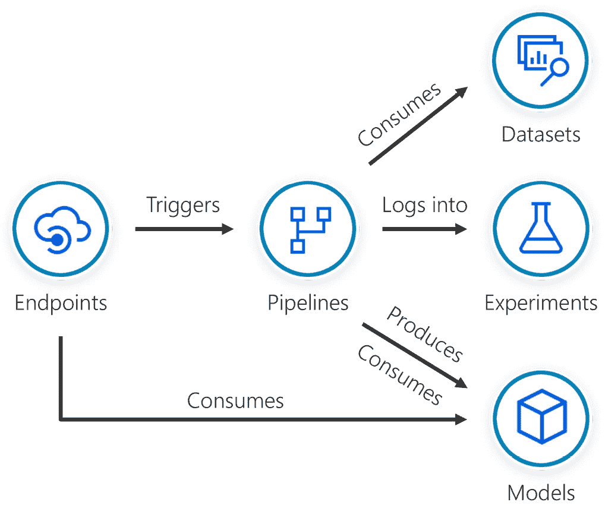

# 第三章：*第三章*：Azure 机器学习工作室组件

在本章中，你将探索 **Azure 机器学习工作室**（**Azure ML Studio**）的 Web 界面，这是一种用于管理端到端机器学习生命周期的沉浸式体验。你将获得有关可用组件的概述，这些组件允许你管理工作区资源、编写机器学习模型并跟踪你的资产，包括数据集、训练过的模型及其发布的端点。

在本章中，我们将覆盖以下主要主题：

+   与 Azure ML 资源交互

+   探索 Azure ML Studio 体验

+   在 Azure ML Studio 中编写实验

+   在 Azure ML Studio 中跟踪数据科学资产

+   在 Azure ML Studio 中管理基础设施资源

# 技术要求

你需要有一个 Azure 订阅。在该订阅下，你需要一个 `packt-azureml-rg`。你还需要拥有 `Contributor` 或 `Owner` 权限的 `packt-learning-mlw`。如果你按照 *第二章* 中的说明操作，这些资源应该已经对你可用，*部署 Azure 机器学习工作区资源*。

# 与 Azure ML 资源交互

在上一章中，你在 `packt-azureml-rg` 资源组内部署了 `packt-learning-mlw` 机器学习资源。通过在顶部搜索栏中输入资源名称并从结果列表中选择该资源来导航到已部署的资源：

图 3.1 – 导航到 Azure 机器学习资源

这将把你带到该资源的概述窗格，如 *图 3.2* 所示：

1.  在左侧，你将看到大多数 Azure 服务都有的典型资源菜单。这个菜单也被称为左侧窗格。

1.  在顶部，你将看到命令栏，它允许你下载 `config.json` 文件，该文件包含连接到工作区所需的所有信息，使用 Python SDK 连接到工作区，并删除机器学习工作区。

1.  在命令栏下方，你可以看到工作窗格，这是你可以查看与工作区相关的信息的地方，包括链接到存储帐户、密钥保管库、容器注册表和与此工作区一起部署的应用程序洞察资源：

图 3.2 – 机器学习资源页面

在左侧窗格中，你将找到所有 Azure 资源中常见的选项。包括以下指示性列表：

+   `访问控制 (IAM)`，你可以使用它来配置特定工作区的角色访问，包括分配你在前一章中创建的自定义角色。

+   `诊断设置`，允许你为 Azure 机器学习工作区生成的日志和指标配置流式导出到你选择的目的地。通常，这个目的地是**日志分析**，它是**Azure 监视**的一部分。

+   `新支持请求`，如果你在使用工作区时遇到问题，可以轻松请求支持。

在`设置`部分，你还会注意到`私人端点连接`选项，它允许你配置一个 Azure 私人端点。这是一个虚拟网络接口，你可以将其附加到虚拟网络上。它允许该虚拟网络内的所有资源私密且安全地连接到你的 Azure 机器学习工作区。一旦启用此选项，所有数据平面操作，如使用 Azure ML Studio、API（包括发布的管道）或 SDK，都需要通过此私人端点进行。

从左侧面板选择概览选项，并点击工作面板中间的`启动工作室`按钮。这将在你的浏览器中打开一个新标签页，带你进入 Studio 体验。

# 探索 Azure ML Studio 体验

Azure 机器学习提供了一个专门的 Web 界面，允许你实施无代码和代码优先的数据科学计划。你可以通过 Azure 门户资源中的`启动工作室`按钮访问该 Web 界面，正如你在前一部分所看到的，或者直接访问[`ml.azure.com`](https://ml.azure.com)页面。采用后者的方法，如果这是你第一次访问 Studio 站点，你需要手动选择**Azure Active Directory**租户、**订阅**以及你想要连接的**机器学习工作区**的名称，如*图 3.3*所示。

图 3.3 – 在 ml.azure.com 中选择机器学习工作区

一旦你选择了工作区，你将进入 Azure 机器学习 Studio 的主页，如*图 3.4*所示。

图 3.4 – Azure 机器学习 Studio 主页

在左侧，你有一个菜单，提供以下类别，所有这些都会在接下来的部分中探索：

+   **作者**：使用创作工具构建、训练、评估和部署机器学习模型。

+   **资源**：准备数据，运行和监控作业，查看和部署模型，以及管理实时和管道端点。

+   **管理**：查看和管理工作区的资源。

你可以通过点击左上角的图标来收起菜单，如下图所示：

图 3.5 – 收起的侧边菜单

在右上角，如*图 3.6*所示，你有以下选项：

1.  **登录信息：**显示登录用户的信息，并允许你登出。

1.  **工作区选择器：**允许你更改正在使用的 Azure 机器学习工作区。

1.  **提供反馈：**允许你发送笑脸或皱眉表情给 Azure 机器学习团队，帮助他们改进你不喜欢的地方或突出你喜欢的部分。

1.  **帮助：**提供帮助资源和文档的链接。该菜单还允许你运行工作区诊断，识别工作区的潜在配置问题。

1.  **设置：**在此，你可以选择深色主题选项，并更改 Studio 的语言和地区格式。

1.  **通知：**该菜单选项允许你管理将收到的工作区通知。例如，实验运行完成后，你会收到通知。

图 3.6 – 右上角菜单

在下一节中，我们将查看左侧菜单的各个部分，从创作部分开始。

# 在 Azure ML Studio 中创作实验

Azure ML Studio 提供以下创作体验：

+   **笔记本：**允许你直接在工作区内使用文件、文件夹和**Jupyter 笔记本**。你将在*第七章*，*AzureML Python SDK* 中使用笔记本，在那里你将看到以代码为主的数据科学过程。

+   **自动化机器学习（Automated ML）**允许你快速测试多种算法组合，以找到基于你定义的成功指标的最佳模型。你将在*第五章*，*让机器完成模型训练*中了解更多内容。

+   **设计器**允许你通过连接数据集和模块（如数据转换和模型训练）在流程中可视化设计实验。通过在画布上设计这个流程，你可以在不编写任何代码的情况下训练和部署机器学习模型，你将在*第六章*，*视觉模型训练与发布*中详细了解这一内容。

+   **数据标注**允许你创建标注项目来整理数据集。这使你能够将标注工作扩展到多个标注员，协调标注工作的效率，并通过机器学习辅助（ML Assist）增强标注员的生产力，ML Assist 会在你标注数据时自动进行训练。

自动化机器学习（Automated ML）和设计器是无代码/低代码数据科学方法的一部分，你将在本书的后续章节中深入探讨这一点。

重要提示

数据标注目前位于左侧菜单的**管理**部分。然而，它在逻辑上是 Azure ML Studio 提供的创作体验的一部分。由于 Studio 体验不断发展，这项功能可能会在不久的将来移至**创作**部分。

# 在 Azure ML Studio 中跟踪数据科学资产

在资产部分，您可以跟踪所有与机器学习操作相关的组件。每个数据科学项目都有以下资产：

+   **数据集**是您可以找到注册数据集的地方。这是一个集中注册表，您可以在其中注册数据集，避免同事们不得不在相同数据的本地副本上工作，或者更糟的是，数据的子集。您将在*第四章*，*配置工作区*中使用数据集。

+   **实验**是一个集中式的位置，用于跟踪脚本执行或运行的组。当您训练模型时，您会记录该过程的各个方面，包括您可能需要用来比较性能的指标。为了将所有尝试归为同一上下文，您应将所有运行提交到同一个实验名称下；然后，结果将在此区域中显示。您将在*第五章*，*让机器进行模型训练*中使用实验。

+   **管道**允许您创建和管理协调机器学习步骤的工作流。例如，一个非常常见的机器学习训练工作流包含三个步骤：数据处理、模型训练和模型注册。管道可以是机器学习训练管道，就像前面的示例所示，或者是批量数据推理管道——换句话说，管道使用机器学习模型对数据集进行推理。在本节中，您可以查看所有已注册的管道，监控它们的执行情况，并查看发布的端点，这些端点允许您临时触发其中的一个管道。您将在*第十一章*，*使用管道*中使用管道。

+   **模型**是您的机器学习模型的注册表。在这里，您可以跟踪它们的版本。它允许您通过网页界面立即部署。要发布模型，您需要先在该注册表中注册它。您将在本书的整个过程中使用该注册表，从*第五章*，*让机器进行模型训练*开始。

+   **端点**由两部分组成：实时端点和管道端点。实时端点是托管在**Azure 容器实例**（**ACI**）或**Azure Kubernetes 服务**（**AKS**）中的 Web 应用程序，它们暴露一个 REST API，允许第三方应用程序使用您已部署的机器学习模型。而管道端点是允许您触发之前在相应部分注册的管道的端点。

所有前述的经验是相互关联的，您会发现自己在探索实验时会从一个部分导航到另一个部分：

图 3.7 – Azure ML 中的互联资产

运行机器学习实验的前提是拥有能够执行训练脚本的计算资源。你还需要能够存储并提供访问你注册为数据集的数据的引擎。这些资源将在下一部分进行管理。

# 在 Azure ML Studio 中管理基础设施资源

要进行实验，你需要一些基础设施资源来进行消耗。你可以通过以下几个部分进行配置和管理：

+   **计算**提供了你可以在实验中使用的托管计算基础设施。这让你可以注册并利用可能拥有多个 CPU 和 GPU 以及能够加载海量数据集的内存的虚拟机。作为托管服务的计算资源意味着你不必担心安装操作系统或保持它的更新和修补。你将在*第四章*中了解更多关于各种计算选项的内容，*配置工作区*。

+   **数据存储**包含了访问各个引擎中数据所需的连接信息，如**Azure Blob 存储**和**Azure SQL 数据库**。这些信息用于访问你在**计算**部分注册的数据集。你将在*第四章*中了解更多关于数据存储的概念，*配置工作区*。

+   链接服务允许你查看外部服务与工作区之间的连接。例如，你可以连接你的 Synapse Spark 池，并使用 Spark 运行数据准备任务。

+   环境允许你指定代码执行所需的软件要求。例如，如果你正在训练一个 PyTorch 模型，你将需要在执行训练脚本的环境中安装 PyTorch 库。你将在*第八章*中了解更多关于环境的内容，*使用 Python 代码进行实验*。

# 总结

Azure Machine Learning Studio 提供了一个网络环境，在这里你可以管理 Azure Machine Learning 工作区中的所有工件。你可以查看和管理你的 Jupyter 笔记本、数据集、实验、管道、模型和端点。你还可以管理将在实验中使用的计算资源和数据存储。Studio 还提供了交互式工具，你可以使用这些工具进行无代码数据科学实验，这些内容将在本书的后续章节中深入讲解。AutoML 向导是第一个内置于 Azure ML Studio 的无代码体验，它允许你运行自动化机器学习实验。Azure Machine Learning 设计器是下一个无代码体验，帮助你通过图形化方式设计管道和创建工作流，无需编写代码。这个体验还支持低代码场景，在需要时你可以插入代码片段。最后，数据标注项目让你能够创建、管理并监控需要标注数据的繁琐项目。

要开始使用这些交互式工具，你至少需要配置一个计算资源。此外，你还需要注册你的数据存储。这些数据存储将托管你在模型训练阶段使用的数据。

在下一章中，你将学习如何通过 Azure ML Studio 执行这些操作。
