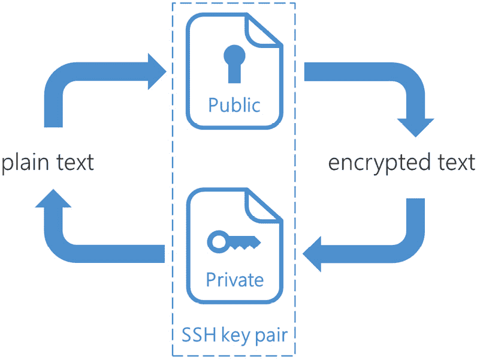
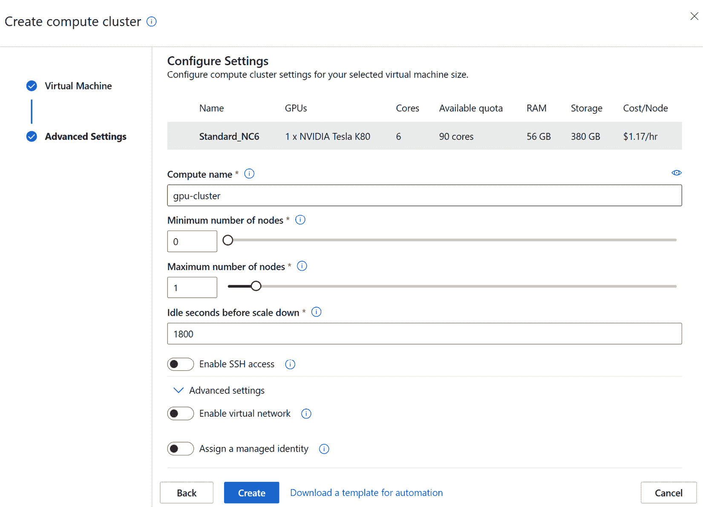
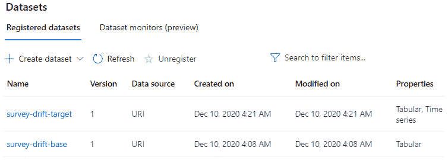
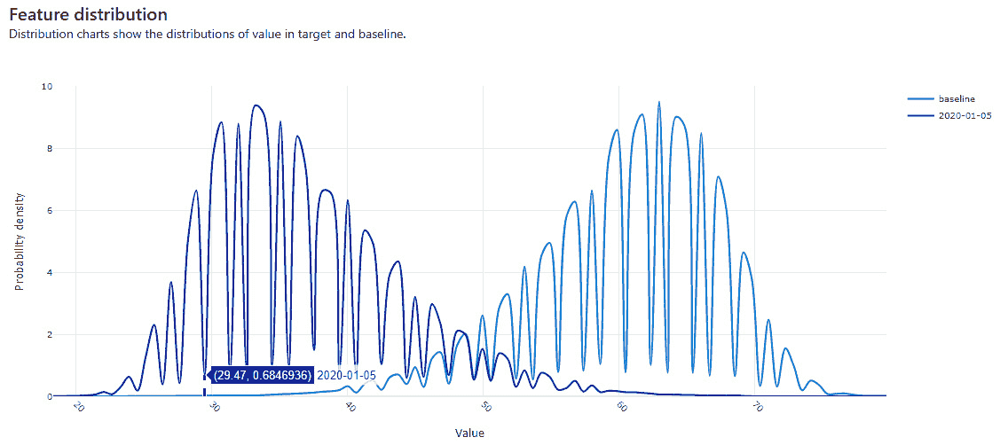

# 第四章：*第四章*：配置工作区

在本章中，您将进入 **Azure 机器学习**（**ML**）Studio 网页界面，并学习如何配置运行实验所需的基础设施。接着，您将学习如何配置或附加到现有的计算资源，并建立 Azure ML 工作区与托管您数据的各种数据存储之间的连接。配置好这些资源后，您将能够注册数据集并探索 Azure ML 提供的监控数据集的功能。

在本章中，我们将涵盖以下主要主题：

+   配置计算资源

+   连接到数据存储

+   使用数据集

# 技术要求

您需要拥有一个 Azure 订阅。在该订阅中，您需要一个 `packt-azureml-rg`。您需要拥有 `Contributor` 或 `Owner` 权限的 `packt-learning-mlw`，如*第二章*所述，*部署 Azure 机器学习工作区资源*。

# 配置计算资源

计算资源使您能够在数据探索分析、训练阶段以及在操作化机器学习模型时执行代码脚本。**Azure ML** 工作区提供以下类型的计算资源：

+   **计算实例**：这些是专门为每位在 **Azure ML 工作区** 中工作的数据科学家配置的虚拟机。

+   **计算集群**：这些是可扩展的计算集群，可以并行运行多个训练或推理步骤。

+   **推理集群**：这些是 **Azure Kubernetes 服务**（**AKS**）集群，可以将 Docker 镜像转化为可操作的服务，通过 REST API 暴露您的模型。

+   **附加计算**：这些是现有的计算资源，如 Ubuntu **虚拟机**（**VMs**）或 **Synapse Spark 池**，可以附加到工作区中，用于执行训练或推理管道的某些步骤。

当您访问 **管理** | **计算** 部分时，您将能够查看并管理这些类型，通过选择相应的标签，如下图所示：

图 4.1 – Azure ML Studio 中的计算类型

在接下来的章节中，您将发现每种计算类型，并了解您必须注意的重要配置参数。

重要说明

配置和附加计算资源也可以通过 Azure ML CLI 和 Azure ML Python SDK 完成。您将在*第七章*中看到通过 Python SDK 配置相同资源的示例，*Azure ML Python SDK*。

## 计算实例

计算实例是一个虚拟机，将为您作为数据科学家的日常工作提供支持。这是一个基于 Ubuntu 的托管工作站，预先配置了数据科学工具，如 Jupyter Labs、RStudio 以及各种深度学习框架，如 **PyTorch** 和 **TensorFlow**。*托管*意味着您无需手动更新操作系统或确保其修补最新的安全漏洞。

重要说明

计算实例非常适合那些可能无法在公司电脑上安装 Python 的企业用户。计算实例仅要求您具备现代网页浏览器和互联网连接。连接到计算实例后，您将能够访问所有工作 Azure ML 工作区所需的软件包。

您的所有文件和偏好设置都安全地存储在虚拟机的`/home/<username>/cloudfiles/code/`文件夹中。此文件夹不属于虚拟机的磁盘，但它是从您 Azure ML 存储帐户中位于远程文件共享的位置挂载的，如下图所示。此文件共享允许您跨多个计算实例共享代码文件和笔记本，您甚至可以在自己的计算机上本地挂载该文件夹：

图 4.2 – 挂载到多个计算实例上的远程文件共享

计算实例主要用于支持 Studio 网页界面的 **笔记本** 功能，但它们也可以用于小规模的训练和推理。实际上，计算实例提供了作业排队功能，允许您每个核心运行多达两个作业，这对于测试和调试场景非常有用。稍后在本章的 *数据漂移检测* 部分，您将使用计算实例执行数据漂移分析。在下一节中，您将学习如何配置您的第一个计算实例。

### 配置计算实例

让我们学习如何配置一个实例：

1.  在 Studio 网页界面中，导航至 **管理** | **计算** 部分并选择 **计算实例** 标签。如果尚未配置计算实例，您将看到计算实例的简短介绍：您可以点击 **新建** 按钮启动计算配置向导，如 *图 4.3* 左侧所示。如果工作区中已经配置了其他计算实例，您可以通过点击顶部菜单中的 **新建** 按钮启动相同的向导，如下图右侧所示：

    图 4.3 – 启动计算实例配置向导

1.  首先，您需要选择虚拟机的大小。您可以指定是否需要启用 GPU 的机器或普通的 CPU 机器。如果您计划运行计算机视觉实验或深度神经网络训练，GPU 机器可以加速训练和推理过程，前提是框架支持 GPU。此外，您可以添加过滤器来限制列表，以满足您工作空间的最低要求。在我们的例子中，我们将选择一台仅包含 CPU 的计算实例，且至少配备 14 GB 的内存和 4 核心，如下图所示：

    图 4.4 – 计算实例配置向导的第一页

    在结果表中，您可以查看每个虚拟机的特性，并估算其每小时的费用。

    重要提示

    虚拟机的费用取决于其大小，同时也取决于其配置所在的区域。例如，在编写本书时，东部美国 2 区的每小时平均价格最低，而西欧是最昂贵的区域之一。

    下表包含了关于结果列表中前几个虚拟机大小的更多信息。**Standard_D3_v2** 和 **Standard_DS3_v2** 虚拟机的主要区别在于其使用的高级存储磁盘。这种磁盘提供了磁盘缓存功能，使得虚拟机能够实现超越底层磁盘性能的表现。因此，向导默认建议选择 **Standard_DS3_v2** 虚拟机大小：

    

    图 4.5 – 基于 docs.microsoft.com 网站的计算实例大小比较

1.  保持选择 **Standard_DS3_v2** 大小，然后点击 **下一步** 来配置计算实例的高级设置：

    图 4.6 – 计算实例配置向导的第二页

    重要提示

    如果您使用的是免费试用版，则您将有一个固定的核心配额，除非切换到按需付费订阅，否则无法更改。您可能需要选择 **Standard_DS2_v2** 以减少计算实例使用的核心数量。您将需要至少两个核心来为第 *第七章* 中要配置的计算集群提供支持，*《Azure ML Python SDK》*。

1.  现在，您需要提供计算机名称。这是您将用来引用特定计算机的名称。计算机名称在 Azure 区域内应该是唯一的。这意味着您可能需要将名称更改为一个唯一的名称，可能是通过在名称中添加一些数字，例如 `ds-021-workstation`。

1.  可选地，启用 SSH 访问标志。此选项允许你指定 SSH 密钥的公钥部分，从而使你能够远程访问计算实例。向导允许你在向导内直接生成该密钥。或者，你可以按照 *生成 SSH 密钥对* 部分中的说明生成密钥。如果你仅计划使用工作室体验进行数据科学实验，则不需要此选项：

    ](img/B16777_04_009.jpg)

    图 4.7 – 启用计算实例的 SSH 访问

1.  点击 **创建** 按钮以配置计算实例。这将完成向导。在此时，计算实例将被创建并启动：

    ](img/B16777_04_007.jpg)

图 4.8 – 等待计算实例创建并过渡到运行状态

在接下来的章节中，如果你不熟悉生成 SSH 密钥的过程，将简要介绍基于 SSH 密钥的认证以及如何生成 SSH 密钥。此外，你还将探索向导的高级选项，这些选项本书不需要使用。

### 生成 SSH 密钥对

SSH 密钥对由两个文件组成——一个私钥和一个公钥。该密钥对允许终端用户使用公钥部分加密文本。加密后的文本只能由 SSH 密钥的私钥部分解密，如下图所示。SSH 密钥的私钥部分需要存储在安全的位置，而公钥部分则可以自由分发给任何人：

图 4.9 – 私钥可以解密使用公钥加密的信息

利用 SSH 密钥对的这个特性，你可以将公钥配置到服务器上，从而使服务器能够使用它进行认证。简而言之，当你尝试连接到服务器时，服务器将创建一个随机的挑战，并使用你在配置计算实例时设置的公钥部分进行加密。你需要使用私钥部分解密该挑战，并以正确的答案回应，验证你成功解密了服务器的消息。这个流程将允许你通过 SSH 访问远程服务器。

有多个开源工具可以帮助你在本地计算机上生成 SSH 密钥对。Azure 提供了一种非常简单的方法，可以通过浏览器生成 SSH 密钥对，并将密钥的公钥部分作为资源存储在 Azure 门户中。让我们来看看：

1.  访问 [`portal.azure.com`](https://portal.azure.com)，点击 `SSH 密钥` 资源并点击 **创建**：

    图 4.10 – 市场中的 SSH 密钥资源

1.  选择 `packt-azureml-rg` 资源组并提供一个密钥对名称，例如 `azureml-compute`。点击 **查看 + 创建** 进入向导的最后一步：

    图 4.11 – 生成 SSH 密钥对

1.  选择 `azureml-compute.pem`。确保将文件存储在安全的位置：

图 4.12 – 存储 SSH 密钥的私钥部分

完成此过程后，SSH 密钥资源将在你在向导中选择的资源组中显示：

图 4.13 – 你部署的 SSH 密钥资源

在该资源中，你可以找到 SSH 密钥的公钥部分，你可以将其复制并粘贴到你在*配置计算实例*部分看到的计算实例配置向导步骤中：

图 4.14 – 生成的密钥对的公钥部分。在顶部，你可以看到已下载的私钥部分

重要提示

SSH 密钥资源要求 `Microsoft.Compute` 提供程序在你计划使用的 Azure 订阅中注册。如果你是订阅的所有者，Azure 会在你部署资源时自动为你注册提供程序；否则，你需要请求订阅所有者为你注册该提供程序，并按照*第二章*中提供的说明进行操作，*部署 Azure 机器学习工作区资源*。

到目前为止，你已经学习了如何配置计算实例并配置 SSH 密钥，这将允许你远程连接到该计算实例。你还可以使用这个 SSH 密钥连接到远程集群，接下来你将在*计算集群*部分进行配置。在接下来的子章节中，你将了解计算实例配置向导的高级配置选项。

### 高级计算实例设置

在计算资源配置向导中，你可以选择性地配置一些高级设置。其中之一是**启用虚拟网络**选项，它允许你将配置好的计算资源附加到一个虚拟网络中，并连接到该网络的特定子网，如下图所示：

图 4.15 – 将计算实例附加到特定子网

此功能解锁了多种高级网络拓扑。最常见的情况是当你计划访问无法通过互联网访问的数据源时。例如，如果你有一个存储帐户，并且该帐户的防火墙设置为禁止互联网访问，通常会在特定子网中部署一个**私有端点**，以允许访问该存储帐户。当你配置计算实例并通过上述选项将其设置为与该子网相同时，计算实例将能够访问受保护的存储帐户，如下图所示：

图 4.16 – 通过私有端点访问仅可通过私有端点访问的存储帐户

向导中显示的另一个高级选项是**分配给其他用户**。此选项与*第二章*中*创建自定义角色*部分相关，该部分介绍了如何为你的 Azure ML 工作区创建自定义角色。在企业环境中，通常不允许最终用户自行部署任何计算实例。这是通过创建自定义角色并仅允许以下虚拟机操作来实现的：

+   **Microsoft.Compute/virtualMachines/start/action**

+   **Microsoft.Compute/virtualMachines/restart/action**

+   **Microsoft.Compute/virtualMachines/deallocate/action**

在这些环境中，管理员（或具有**Microsoft.Compute/virtualMachines/write**权限的人）可以配置计算实例并将其分配给某个可能无法自行配置计算实例的特定人员，如下图所示：

图 4.17 – 将已配置的计算实例分配给另一位数据科学家

尽管这是网页界面向导提供的一个很好的功能，但当你需要为多个数据科学家配置多个计算实例时，它的扩展性较差。因此，大多数情况下，管理员更喜欢通过**ARM 模板**部署计算实例。管理员可以通过该向导生成并下载模板，然后使用**Azure CLI**将其部署给多个用户，并将用户 ID 作为参数传递，正如你在*第二章*中所见，*部署 Azure 机器学习工作区资源*。

到目前为止，你已经了解了如何配置计算实例。在下一节中，你将学习如何管理计算实例。

### 管理计算实例

一旦你至少配置了一个计算实例，**管理** | **计算** | **计算实例**界面将变成一个列表，显示工作区中可用的实例。默认情况下，列表会过滤，仅显示你可以使用的实例，也就是说那些你自己配置的或其他人代表你配置的实例：

图 4.18 – 计算实例列表

从这里，你可以启动、停止、重启和删除计算实例。当你启动一个计算实例时，资源的状态会变为**运行中**，并且**应用程序**列会提供链接，打开该计算实例的终端，或者打开 Jupyter、JupyterLab、RStudio 和 VS Code 等第三方创作体验。

在你打开这些三种编辑体验之前，你必须接受一个重要的通知，关于你可以在这些环境中执行的代码，如下图所示：

图 4.19 – 关于你在 Azure ML Studio 执行代码的警告消息

你需要理解，如果你从互联网下载一个随机脚本，它可能包含恶意代码，可能会让其他人窃取数据或甚至访问你账户的令牌，这可能使他们能够代表你访问 Azure 资源。

JupyterLab 和 Jupyter 是非常流行的 Jupyter 笔记本创作体验、Python 脚本编辑以及访问终端执行各种命令的工具，如下图所示。当你点击打开这些编辑体验时，会打开一个新的浏览器标签页。如果你查看新标签页上的 URL，你会注意到它由计算实例的名称、该计算实例所在的区域以及后缀**instances.azureml.ms**组成。这就是为什么在前面一节中，*配置计算实例*时，当你配置计算实例时，必须选择一个在你所在 Azure 区域内唯一的名称的原因。

所有这些第三方创作体验都有着强大的社区支持，你可以在已经熟悉的情况下使用它们。然而，请注意，Azure ML 提供了**作者** | **笔记本**体验，这是基于 JupyterLab 的增强编辑体验，增加了像 IntelliSense 这样的功能，从*第七章*《Azure ML Python SDK》开始，你将使用到这些功能：

图 4.20 – JupyterLab 编辑体验

点击**应用程序**栏中的**终端**链接将打开一个新的浏览器标签页。你将被转到**作者** | **笔记本**部分。在这里，会打开一个基于 Web 的终端，允许你向计算实例发出命令：

图 4.21 – 通过浏览器获取终端访问

当你不需要计算实例时，比如在周末，你可以停止它以避免产生费用。计算实例将转为**已停止**状态，且**应用程序**链接将被禁用。启动已停止的计算实例需要一些时间。

如果你已经完成了与计算实例的工作，例如项目的研究阶段已经结束，你可以**删除**它，以释放占用的 CPU 核心，这些核心会计入你订阅的配额。你可以通过点击菜单中相应的**查看配额**选项来查看当前的配额，如*图 4.18*所示。

现在，你可以停止你的计算实例。你将在*数据漂移检测*部分重新启动它：

图 4.22 – 已停止的计算实例

在本节中，你学会了如何配置和管理计算实例，这些实例将为你提供必要的计算能力，用于编写笔记本和脚本，并可能执行小规模的训练和推理管道。在下一节中，你将学习如何配置计算集群，这是一种计算资源，能够根据需要进行扩展或缩减，以同时支持多个训练和推理管道。

## 计算集群

计算集群是一组相互连接的虚拟机，这些虚拟机可以根据任务队列的需要进行扩展或缩减。这意味着，集群在不需要时可以只有几个节点，甚至没有节点，从而避免产生不必要的费用；而在需要运行大量任务并行处理或执行分布式机器学习训练过程时，它也可以扩展到多个节点。

创建过程与配置计算实例非常相似。让我们来看看：

1.  首先，点击**计算集群**标签页中的**新建**按钮，如*图 4.23*所示。

    图 4.23 – 创建新的计算集群

1.  您会注意到，与计算实例相比，计算集群配置向导提供了一个额外的选项，称为**虚拟机优先级**，如下图所示。低优先级虚拟机利用您希望配置计算集群的 Azure 区域中的剩余容量。这些虚拟机的价格相比专用虚拟机大幅降低，但计算节点在您需要时可能无法提供，甚至可能在计划任务完成之前就被回收。这意味着，您可能需要等待较长时间才能分配到这样的虚拟机，而且在训练过程中某个步骤可能会中断执行。由于低优先级虚拟机具有这些特点，通常在您有一些对时间不敏感的任务，且这些任务由小的运行步骤组成，或者这些步骤能够自动保存其状态并在被驱逐后恢复执行时，您会使用这种类型的集群。为了本书的目的，您可以选择**专用**选项，以避免在分配计算节点时出现意外的长时间等待。

1.  在**虚拟机类型**选项中，选择**GPU**，并从**从推荐选项中选择**列表中选择最便宜的虚拟机大小，如*图 4.24*所示。

    重要提示

    默认情况下，免费试用订阅不允许您配置 GPU 计算。即使您更改为按需订阅，您仍然需要通过 Azure 门户提交请求以增加配额。如果遇到配额不足的问题，您可以选择基于 CPU 的计算，而不是基于 GPU 的计算。为了本书的目的，您无需使用基于 GPU 的集群。

    

    图 4.24 – 计算集群配置向导的第一页

1.  单击**下一步**以继续进入向导的第二页：

1.  在向导的第二页中，您需要指定一个集群名称。这个名称将在网页界面和代码中用于引用该集群，因此请确保选择一个能代表该集群用途的名称，例如 `gpu-cluster`：

    图 4.25 – 计算集群配置向导的第二页

    您还可以调整节点的最小和最大数量，以及在集群缩减之前的空闲秒数。每次请求集群执行任务时，任务将添加到集群的调度器中。如果集群没有足够的节点来执行调度的任务，它将通过向集群添加计算节点来进行扩展。向集群添加节点需要一些时间，因为您需要分配虚拟机。因此，在调度任务完成后，集群不会立即释放虚拟机，而是可以等待定义的空闲时间，以防新的任务被调度。

    与计算实例类似，如果您希望远程连接到计算集群节点以排查作业执行问题，您可以 **启用 SSH 访问**。由于集群节点是临时的，向导允许您指定 **管理员密码**，如果您希望的话，而不是使用 **SSH 公钥**，如下图所示：

    

    图 4.26 – 计算集群允许您使用管理员密码而不是 SSH 公钥

    在 **高级设置** 下，您可以找到 **启用虚拟网络** 选项，您在上一节查看计算实例时也看到了这个选项。除了这个选项，您还有一个选项是 **为计算集群分配托管身份**：

    

    图 4.27 – 为计算集群分配托管身份

    Azure 允许您为计算集群节点附加 **Azure Active Directory**（**AAD**）身份，这样在这些虚拟机中执行的代码可以使用该身份访问 Azure 资源。**托管身份**消除了在脚本中存储凭据的需求。身份与特定的虚拟机关联，您的代码可以通过 Azure 实例元数据服务或 Python SDK 请求 AAD 访问令牌，无需密码，只要代码在该特定虚拟机中执行。

1.  本书的目的下，您不需要在此修改任何选项。将集群命名为 `gpu-cluster`，然后点击 **创建** 来创建您的第一个零节点 GPU 基础计算集群：

图 4.28 – 您的第一个基于 GPU 的计算集群已准备好使用

请注意，在前面的截图中，计算集群已成功配置，但其中没有节点，这意味着它不会产生任何费用。您还可以在此列表中看到以下指标：

+   **空闲节点**：这些是等待任务调度或在空闲时间过去后等待被释放的节点。

+   **忙碌节点**：这些是当前正在执行任务的节点。

+   **未配置的节点**：这些是尚未分配的节点，但如果计划任务的数量增加，它们可能会被分配。

    从此列表中，你可以删除集群，如果你不再需要它的话。

    如果你点击计算集群的名称，你将能够看到集群的详细信息，如下图所示。从此视图，你可以编辑最小和最大节点数、集群缩减前的空闲秒数，并更改之前配置的托管身份分配方式。事实上，数据科学团队通常会在早晨修改他们预定义的计算集群配置，以便确保集群中至少有一个节点，这样他们就不必等待第一个节点分配。当一天结束时，他们会将设置改为零，以节省成本：

图 4.29 – 计算集群的详细信息，展示你可以编辑其配置的位置

在这一部分，你学习了如何配置计算集群。这些集群用于执行训练任务和批量推理。在下一部分，你将学习如何配置**Azure Kubernetes 服务**（**AKS**），它允许你在大规模上执行实时推理。

## 推理集群

Kubernetes 是一个便携、可扩展的开源平台，用于管理容器化的工作负载和服务。由于其能够自动扩展并能从故障中自动恢复，它已被广泛用于将各种应用投入生产环境，从 Web 应用到模型推理 REST API。**Azure Kubernetes 服务**（**AKS**）是 Azure 中的 Kubernetes 集群的托管版本，一项让你专注于工作负载并让 Azure 管理集群操作部分（例如其主节点）的服务。

如果你不熟悉 AKS，不用担心——下面的图表提供了涉及组件的高级概览。简而言之，你可以配置**节点池**，即一组配置相同的虚拟机；例如，配置有 GPU 卡的虚拟机。这些池可以包含一个**节点**（或更多节点），节点即为虚拟机。在每个节点内，你可以托管一个或多个**Pod**。每个 Pod 包含一对**Docker 镜像**，这些镜像组成一个应用单元，其中一个镜像可能是你想要投入运营的模型。每个 Pod 可以在多个节点中进行复制，既可以是为了应对更高的负载，也可以是在某个节点出现故障时增加容错性：

图 4.30 – AKS 概念的高级概览，展示 Pod X 在两个节点中复制

在 Azure ML Studio 中，你可以创建或将现有的 AKS 集群附加到你的工作区。你*不需要*为本书的目的创建 AKS 集群。让我们开始吧：

1.  创建向导可以通过点击**新建**按钮，在**推理集群**标签页中启动，如*图 4.31*所示：

    图 4.31 – 创建或将 AKS 集群附加到 Azure ML 工作区

    重要说明

    当您配置 AKS 集群时，一个新的资源组将在您的 Azure 订阅中创建，托管 AKS 工作所需的所有组件。这需要在订阅级别的额外权限。如果您无法创建资源组，AKS 集群配置将失败。

1.  在向导的第一步中，您可以选择附加一个现有的 AKS 集群或创建一个新的集群。如果选择创建一个新的集群，您将需要指定希望 AKS 集群部署的 Azure 区域。您还需要指定节点池的虚拟机大小，类似于您部署计算实例时所做的操作：

    图 4.32 – 配置推理 AKS 集群的步骤 1

1.  点击**下一步**将带您进入**设置**页面，在此页面中，您需要指定 AKS 集群的名称。同时，您还需要指定集群的用途。如果这是一个生产集群，则集群中的虚拟 CPU 数量必须大于 12；这意味着如果您选择了 4 核虚拟机大小，您将需要至少三个节点才能配置一个生产就绪的 AKS 集群。如果此集群用于开发和测试，您只需配置一个节点即可。

1.  除了节点池的名称和节点数外，您还可以配置集群的网络选项和用于保护与应用程序连接的 SSL 证书，如果您希望通过 HTTPS 端点公开它们。为了本书的目的，您无需修改这些选项：

    图 4.33 – 配置推理 AKS 集群的步骤 2

1.  一旦集群创建完成，您将能够通过以下截图所示的列表删除或将其从工作区中分离：

图 4.34 – AKS 推理集群列表

重要说明

AKS 是部署实时端点的生产就绪方式。在考试中，当被问到将生产负载部署在哪里时，AKS 应该是正确答案。尽管如此，由于 AKS 集群是一种昂贵的资源，本书的示例不会使用它。如果您使用的是免费订阅，您可能没有足够的核心配额来配置一个。如果您配置了一个，请确保关注成本，以免用完信用额度。

在本节中，你了解了如何使用 Azure ML 帮助你连接或配置 AKS 集群，以便托管生产实时推理端点。在下一节中，你将学习如何将现有的计算资源附加到你的工作区。

## 附加的计算资源

如果你已经配置了计算资源，且不一定是在你部署 Azure ML 工作区的订阅中，你可以将它们附加到你的工作区。附加这些资源可以让你重新利用它们，特别是在它们未被充分利用的情况下。一种常见的情况是，一个部门拥有一个基于 Ubuntu 的 **数据科学虚拟机** (**DSVM**)，可能每天 24 小时、每周 7 天都在运行，以服务于一个遗留的 Web 应用程序。你可以通过将其附加到工作区并在实验中引用它来重用这个资源，执行各种任务，就像你引用计算集群来执行任务一样。

工作室体验允许你附加多种类型的计算资源，包括以下流行目标：

+   **虚拟机**：你可以附加现有的基于 Ubuntu 的虚拟机，这些虚拟机通过互联网公开可访问。这个选项包括你可能已经拥有的 DSVM。

+   **Azure Databricks** 和 **HDInsights**：这些选项允许你将现有的基于 **Apache Spark** 的计算资源连接到你的工作区。

+   **Azure Data Factory**：Azure Data Factory 资源允许你从一个数据源执行复制操作到另一个数据源。例如，你可以使用该资源将数据从存储帐户复制到 SQL 数据库。Azure Data Factory 目前仅通过 Azure ML SDK 支持，而不支持通过工作室体验。

对于 DP100 考试而言，你无需附加任何资源。以下截图展示了你如何从工作室体验中启动附加向导：

图 4.35 – 将现有计算资源附加到你的工作区

在本节中，你了解了如何配置和附加计算资源到你的 Azure ML 工作区。这使得你可以在数据探索、模型训练和模型推理阶段执行代码。在下一节中，你将学习如何配置与各种数据源的连接，这将使你能够访问数据。

# 连接到数据存储

数据存储是存放你数据的引擎，并为任何有权限的人提供访问权限。在大多数你在互联网上看到的 Python 示例中，都会有一个连接字符串，其中包含连接到数据库或 Blob 存储的凭证。这个技术有几个缺点：

+   存储在这些脚本中的凭证被视为安全违规行为，通过将脚本发布到公共存储库（如 GitHub）可能会意外暴露你受保护的数据集。

+   当凭据发生变化时，你需要手动更新所有脚本。

Azure ML 允许你拥有一个集中式的位置，在那里你可以定义与各种存储的连接属性。你的凭据作为**机密**安全存储在工作区关联的**密钥库**中。在你的脚本中，你通过其名称引用数据存储，并可以访问其数据，而无需指定凭据。如果某个时刻，数据存储的凭据发生变化，你可以在中央位置更新它们，所有的脚本和管道将继续正常工作。

你可以通过导航到工作室的**管理** | **数据存储**部分来查看所有注册的数据存储：

图 4.36 – 工作区中已注册数据存储的列表

请注意，默认情况下，你已经注册了两个数据存储。默认的那个，名为`workspaceblobstore`，是默认的 Blob 存储，用于存储所有的管道指标和工件。你的工作区需要有一个默认的数据存储。正如你将在*第七章*《Azure ML Python SDK》中看到的，你甚至可以通过 Python SDK 非常方便地引用该存储。另一个存储，名为`workspacefilestore`，是一个文件共享数据存储，你可以将其挂载到本地计算机并上传文件。

从此列表中，你可以执行以下操作：

+   更新数据存储的凭据：你需要点击数据存储的名称，查看其注册详情。从那里，你可以点击**更新凭据**来指定更新的值，或者更改身份验证类型，这些内容将在下一节中看到。

+   **注销**数据存储：你可以注销任何未标记为默认数据存储的数据存储。

+   **设置为默认数据存储**：将默认数据存储更改为你从列表中选择的存储。

最后，从这个列表中，你可以创建一个**新的数据存储**注册，这是启动新的数据存储向导的操作，如下图所示：

图 4.37 – 新的数据存储向导

在这里，你需要在 Azure ML 工作区中指定一个唯一的数据存储名称。你必须这样做，以便在脚本和工作室体验的各个组件中引用该存储。接下来，你需要选择数据存储类型。Azure ML 工作区支持几种 Azure 本地数据存储，这些内容将在下一节中探讨。

## 数据存储类型

Azure ML 支持两类数据存储：基于文件的存储，例如 Blob 存储、文件共享和数据湖存储，以及关系型数据库，例如 Azure SQL 和 Azure PostgreSQL。

当前支持的数据存储如下面的图示所示：

图 4.38 – Azure ML 支持的数据存储

推荐使用基于**Azure Blob Storage**的数据存储。这些存储是最具成本效益的存储。它们提供多个层级，例如更昂贵的高级存储，它提供更高的吞吐速度，这可以减少处理大量数据时的训练时间。

另一方面，**Azure Data Lake Storage Gen 2** 在**Azure Blob Storage**的基础上，增加了层次命名空间。这一功能使得数据湖可以在文件夹级别分配访问权限。大型企业通常会按照不同的区域结构来组织数据湖，存储不同的数据。每个区域都有自己的**访问控制列表**（**ACL**），为特定的用户组提供权限。这意味着你可能能够看到某个文件夹的内容，而看不到另一个文件夹的内容，而在**Azure Blob Storage**中，一旦你获得了容器的访问权限，就可以看到该容器中的所有数据。

如果你的数据存储不被 Azure ML 开箱即用地支持，你可以通过**Azure Data Factory**的复制工具轻松将数据复制到**Azure Blob Storage**或**Azure Data Lake Storage Gen 2**。**Azure Data Factory** 允许你从几乎任何地方复制数据，即使数据存储在本地数据库中，如下图所示：

图 4.39 – 使用 Azure Data Factory 和自托管集成运行时将本地数据复制到 Azure ML 支持的数据存储

重要说明

在*附加计算*部分，你看到了你可以附加一个`DataTransferStep`。从本地网络复制数据也可以在同一个 ADF 中完成，但你需要在 ADF 中编写、执行和监控数据拉取管道。

本节介绍了 Azure ML 支持的各种数据存储类型。在下一节中，你将了解这些数据存储支持的各种身份验证方法。

## 数据存储安全性考虑

根据数据存储类型，你需要为其注册到 Azure ML 工作区时指定不同的凭据。对于 Azure Blob 和 Azure 文件共享数据存储，你可以使用以下凭据：

+   **账户密钥**：这授予对整个 Azure 存储账户的访问权限。

+   **共享访问签名**（**SAS**）**令牌**：这是一种更加细粒度的权限分配方式，允许你为存储账户的各种服务分配权限。使用**账户密钥**，你可以生成一个 SAS 令牌，使其只能访问特定的 blob 容器，并且只能在有限的时间内使用。

对于 Azure Data Lake Storage 数据存储，鉴于其高级安全功能，您需要提供一个`tenant_id`，该实体已注册并具有唯一 ID（称为`client_id`）。此身份拥有一个密码（称为`client_secret`），它使得您的代码能够模拟该身份访问数据存储。

对于关系数据库数据存储，您需要指定数据库的名称、服务器的名称和服务器端口进行连接。对于凭证，您可以提供**服务主体**，如果数据存储支持此功能，或者提供必要的**SQL 身份验证**凭证，后者包括数据库用户 ID 和密码。

一些数据存储允许您使用工作区的托管身份进行数据预览和分析。此选项会将分配给工作区的系统分配托管身份作为读取者，添加到特定资源中，从而允许工作区在工作室环境中加载数据预览。此选项可在数据存储注册页面上找到，如下图所示：

图 4.40 – 授予工作区的托管身份访问权限

到目前为止，您已学习了如何在 Azure ML 工作区中注册各种数据存储。在下一节中，您将学习如何利用这些注册信息来定义数据集。

# 使用数据集

在前面的章节中，您在工作室的**管理**部分配置了计算和数据存储资源。配置好这些基础设施后，您可以开始将数据导入到注册的数据存储中，并在工作室的**资产**部分注册数据集：

图 4.41 – 在 Azure ML Studio 中的资产部分的数据集

**数据集**是您用于训练和推理的基础数据之上的抽象层。它包含指向物理数据位置的引用，并提供一系列元数据，帮助您理解其形状和统计特性。当您想要访问数据集时，可以通过名称引用它，且无需担心凭证或确切的文件路径。此外，所有在同一工作区的 data scientists 都可以访问相同的数据集，从而允许他们在相同数据上并行进行实验。

数据集有两种类型——基于文件的和基于表格的。文件数据集引用数据存储中的文件列表。例如，如果你正在构建一个计算机视觉模型，你需要图像，这些图像可以作为`FileDataset`下载或挂载到计算资源上。表格数据集表示存储在文件型数据存储或关系型数据库数据存储中的表格数据。例如，你可以引用包含`TabularDataset`结构的几个文件夹，而不需要解析物理文件。

数据集的另一个特点是你可以通过版本快照它们的属性和元数据。假设你有一个遵循`weather/<year>/<month>/`模式的文件夹结构。例如，你会发现 2021 年 1 月的天气测量数据存储在`weather/2021/01/measurements.parquet`下。随着时间的推移，你会获得越来越多的文件夹，每个文件夹下面都有一个文件。为了重现你的训练结果，你可能希望引用一个只包含到 2021 年 1 月为止文件的数据集。这正是数据集版本控制的用武之地。在训练模型时，你注册一个数据集版本，该版本包含你用于训练的所有文件。稍后，你可以引用该数据集并请求它的特定版本，从而获得对当时可用的所有文件的引用。

重要说明

数据集版本*不*复制底层数据。它们只存储对实际文件的引用以及你将在接下来的章节中阅读到的数据集元数据。这意味着，如果你更改了文件的内容而不是添加新文件，数据集版本将不会加载相同的数据。

## 注册数据集

你可以从多个来源注册数据集，如下图所示，包括你在*连接数据存储*部分学到的如何注册的存储库：

图 4.42 – 注册数据集的可能选项

为了更好地理解数据集注册过程，我们将注册两个托管在 Web 上的表格数据集。这些数据集每个都包含一个**parquet**文件。我们将在本章后续部分使用这两个数据集来了解数据漂移检测功能。让我们开始吧：

1.  从前面的截图中选择**从 Web 文件**菜单项，开始**从 Web 文件创建数据集**向导。

1.  在向导的第一页，提供以下信息：

    +   `survey-drift-base`

    +   `Tabular`

1.  点击**下一步**：

    图 4.43 – 数据集注册向导的第一步

1.  向导将解析文件并确定文件类型和数据集的模式。你需要通过点击**下一步**来验证选择。请注意，向导支持多种文件格式，如下图所示：

    图 4.44 – 数据集注册向导的第二步

1.  在下一步骤中，你可以定义有关模式的高级选项。对于基准数据集，保持默认选项不变。点击**下一步**，你将进入确认步骤。

1.  在此步骤中，你可以查看前面步骤中的选择，还可以安排你的首个数据科学分析任务——数据集概况分析。此过程将生成你将在下一部分中探索的概况。启用此选项，并选择你在前一部分中配置的`gpu-cluster`，如下图所示：

    重要提示

    在**选择用于概况分析的计算资源**选项中，你可以从你在*计算实例*和*计算集群*部分配置的计算实例和计算集群中进行选择。选择计算集群将强制集群从零个节点扩展到一个节点，分析数据集，然后再缩减回零个节点。如果你愿意，可以导航到**管理** | **计算**部分，通过点击计算集群的名称来观察这一扩展过程。如果你选择计算实例而不是计算集群，则任务将被安排，并将在计算实例启动时执行。

图 4.45 – 数据集注册过程的最后一步

你需要再注册一个数据集。此过程几乎相同，只不过这次你将数据集标记为时间序列数据集：

1.  点击**创建数据集**并选择**从网页文件**，如下图所示：

    图 4.46 – 数据集列表中的创建数据集菜单

1.  按照之前的步骤操作，输入以下信息：

    +   `survey-drift-target`

1.  在模式步骤中，请确保从**inference_date**列的**Properties**部分选择**时间戳**（**Timestamp**），如下图所示。此选项将此表格数据集标记为**时间序列**数据集，允许你执行额外的分析，正如你将在*数据漂移检测*部分看到的那样：

    图 4.47 – 配置一个表格数据集，使其成为时间序列数据集

1.  安排数据概况分析并完成数据集注册过程。

    重要提示

    如果你跟随教程，你可能会注意到，对于 `year=2021/month=05/day=01/data.parquet`，你可以通过该路径模式创建一个虚拟列，并将其定义为**分区时间戳**。这样可以提升时间序列功能的重要性，并允许你通过有选择性地读取所需文件来加载特定日期的数据。

你应该能够看到两个已注册的数据集，如下图所示：

图 4.48 – 在 Azure ML 工作区注册的数据集列表

在此视图中，你可以选择一个数据集，然后点击**取消注册**按钮来移除注册。点击数据集后，你可以查看有关该数据集的更多详细信息，包括你在数据集上执行的分析，这些内容将在下一节中显示。

## 探索数据集

在数据集列表中，点击**survey-drift-target**数据集以查看其详细信息。在第一个标签页**详情**中，你可以修改数据集的描述，并指定与数据集相关联的标签。标签是名称-值对。在下面的截图中，你可以看到我们将**survey**指定为**experiment**标签的值：

图 4.49 – 显示与特定数据集相关的所有元数据的数据显示

在**消费**标签页中，你可以复制你将在*第七章*中使用的 Python SDK 代码，以便访问数据集：

图 4.50 – 消耗一个代码片段以访问数据集

在**探索**标签页中，你将能够预览数据集中包含的样本数据，正如你在注册过程中所看到的：

图 4.51 – 预览数据集的样本

如果你点击**分析**标签页，你将能够查看数据集的统计分析，正如下图所示：

图 4.52 – 数据集的统计分析

重要提示

如果你的数据集包含少于 10,000 行，系统会自动为你执行数据分析，而无需你手动调度数据集的处理过程。如果数据集包含超过 10,000 行，Azure ML 会对前 10,000 行进行分析，并显示一条警告消息，提示你调度完整的分析过程，你可以通过点击菜单中的**生成分析**按钮来执行此操作。

最后，在**模型**标签下，你可以看到与此数据集相关的模型，这是你在*第五章*，*让机器进行模型训练*时，将注册并部署为 Web 服务的最佳模型。

注册了数据集后，你可以为该数据集配置周期性的漂移监控，这是你将在下一节中学习到的内容。

## 数据漂移检测

数据漂移检测是一种技术，允许你将时间序列数据集与参考数据集进行比较，然后检查你比较的特征的统计属性是否发生了显著变化。例如，假设你训练了一个 ML 模型，预测某人是否会参与调查，基于他们的年龄。你使用了`survey-drift-base`数据集来训练该模型。下图展示了一个密度曲线，显示了训练数据集中年龄的分布：

图 4.53 – 训练数据集中年龄特征的负偏斜单峰分布

当你将模型投入生产时，你每周跟踪它做出的推断，并将此信息记录在之前注册的`survey-drift-target`数据集中。该数据集包含了你在 2020 年初的前两周进行的推断。数据漂移检测能够帮助你发现输入特征的分布是否随着时间变化。我们来看看：

1.  导航到**资产** | **数据集** | **数据集监控**，点击**创建**按钮以启动数据集监控向导：

    图 4.54 – 创建新的数据集监控

1.  在目标数据集上，你将看到所有已注册的时间序列数据集，这些数据集是你希望监控数据漂移的对象。这是你的模型在生产环境中所做的推断。选择`survey-drift-target (Version:1)`并点击**下一步**：

    图 4.55 – 数据漂移监控配置的第一步

1.  在下一页中，你需要选择参考点。这可以是时间序列表格数据集中的某个特定时间点，或者是一个特定的数据集。在你的情况下，选择`survey-drift-base (Version:1)`数据集，这是用于训练 ML 模型的数据集：

    图 4.56 – 在数据漂移监控配置中选择基线数据集

1.  在向导的最后一步，你需要定义以下信息：

    +   `survey-drift-monitor`。

    +   **特征**：选择两个数据集之间一个或多个共同特征，以监控它们的分布情况以及是否存在数据漂移。在此案例中，两个数据集之间唯一的共同特征是年龄特征。

    +   **计算目标**：将启动和停止以执行分析的集群。

    +   **频率**：频率指定检查目标数据是否有漂移的时间间隔。一旦监控器创建，无法更改此属性。您可以选择按天、按周或按月进行。请记住，每个时间间隔至少需要 50 个样本才能进行数据漂移分析。这意味着如果每天少于 50 行数据，您不能将其作为频率，应该选择按周或按月进行。

    +   **延迟**：通常会在实际对行进行评分和刷新目标数据集之间有一个延迟。在此字段中，您需要指定在假设目标数据集已经获得最新记录之前的等待时间；然后，监控器就可以执行数据漂移分析。

    +   **电子邮件地址**：如果数据集的漂移超过了**阈值**参数所指定的范围，邮件将发送至此地址。

1.  本书中，您可以禁用计划，如下截图所示。您将手动运行数据漂移分析。

1.  点击**创建**按钮以创建监控器：

    图 4.57 – 数据漂移监控器设置

1.  从监控器列表中点击您创建的新监控器名称：

图 4.58 – 数据漂移监控器列表

数据漂移监控器旨在根据计划对新数据进行分析。在您的情况下，您想分析目标数据集中的现有数据。让我们来看看：

1.  点击**分析现有数据**按钮，这将显示以下截图中的回填向导：

    图 4.59 – 手动启动对过去日期的分析

1.  选择从 2019 年 12 月 31 日到 2020 年 1 月 15 日。这是包含目标数据集所有记录的时间范围。

1.  选择将进行分析的计算集群。

1.  点击**提交**。

一旦分析完成（这个过程需要一些时间），您将能够看到数据漂移的结果，结果表明我们的数据集观察到了大规模的数据漂移。请注意，摘要指的是最新的推理结果，这些推理是在 2020 年 1 月 5 日完成的。您可以通过点击对应日期的图表手动选择之前的时间段：

图 4.60 – 基础数据集与目标数据集之间检测到的数据漂移

如果你向下滚动到特征分布部分，你将能够清楚地看到年龄特征的分布漂移。这表明模型正在对一个与其训练数据集特征不同的群体进行推理。这是一个很好的指示，表明你可能需要重新训练模型，以便使其与新的特征分布保持同步。

图 4.61 – 基准线是一个负偏态分布，而最新的推断遵循一个正偏态分布

在这一部分，你学习了如何配置数据漂移检测，这一过程是通过将你在生产环境中观察到的数据与用于训练模型的数据集进行比较来完成的。这是一个强大的功能，它可以帮助你判断是否需要使用更新的数据重新训练模型，尤其是当特征分布随时间发生变化或漂移时。

# 总结

在这一章中，你学习了如何为你的 Azure ML 工作区提供和附加计算资源。你还学会了如何注册各种数据存储，以便安全地访问数据。最后，你探索了 Azure ML Studio 的数据集注册功能，它使你能够轻松访问用于实验的数据。注册数据集后，你可以配置数据漂移监控器，当特征分布随时间变化时，它会提醒你，这可能表明在该数据集上训练的机器学习模型需要重新训练。现在你应该已经能够舒适地配置你的 Azure ML 工作区，这是 DP-100 认证中考察的关键技能之一。

在下一章中，你将学习如何利用你在工作区中注册的数据集进行**自动化机器学习（Auto ML）**分析，这一过程将在你提供的计算集群上运行多个机器学习实验，以检测适合你数据集的最佳算法。

# 问题

在每一章中，你会找到一些问题，以便测试你对本章内容的理解：

1.  一个拥有 8 核心和 56 GB 内存的计算实例上最多可以有多少个数据科学家同时工作？

    a. 只有一个。

    b. 最多两个。

    c. 最多五个。

    d. 只要不耗尽计算资源，人数不限。

1.  你需要提供哪种类型的凭证才能访问 Gen 1 或 Gen 2 的数据湖存储？

    a. **个人访问令牌**（**PAT**）

    b. 服务主体的客户端 ID 和密钥

    c. 你的个人 AAD 用户凭证

    d. 不需要凭证

1.  以下哪种 Azure 工具可以帮助你协调将数据从本地环境迁移的工作？

    a. Blob 存储

    b. Azure Active Directory

    c. Azure 数据工厂

    d. Azure ML 工作区

# 进一步阅读

本节提供了一个有用的网络资源列表，帮助你增强对本章讨论主题的理解和知识：

+   你可以通过以下链接了解更多关于如何在计算集群中使用托管身份的信息：[`docs.microsoft.com/azure/machine-learning/how-to-create-attach-compute-cluster?tabs=python#managed-identity-usage`](https://docs.microsoft.com/azure/machine-learning/how-to-create-attach-compute-cluster?tabs=python#managed-identity-usage)。

+   实例元数据服务允许你使用附加的托管身份请求 Azure 资源的令牌。你可以通过[`docs.microsoft.com/azure/virtual-machines/linux/instance-metadata-service`](https://docs.microsoft.com/azure/virtual-machines/linux/instance-metadata-service)了解更多信息。

+   你可以通过[`docs.microsoft.com/azure/storage/blobs/data-lake-storage-access-control-model`](https://docs.microsoft.com/azure/storage/blobs/data-lake-storage-access-control-model)了解更多关于 Azure Data Lake Storage Gen2 的访问控制模型。

+   你可以通过[`docs.microsoft.com/azure/data-factory/quickstart-create-data-factory-copy-data-tool`](https://docs.microsoft.com/azure/data-factory/quickstart-create-data-factory-copy-data-tool)学习如何使用 Azure Data Factory 的复制数据工具轻松复制数据并配置定期数据摄取。

+   你可以通过[`docs.microsoft.com/azure/storage/common/storage-sas-overview`](https://docs.microsoft.com/azure/storage/common/storage-sas-overview)学习如何使用 SAS 令牌为 Azure 存储账户授予有限访问权限。

+   你可以通过[`docs.microsoft.com/azure/active-directory/develop/app-objects-and-service-principals`](https://docs.microsoft.com/azure/active-directory/develop/app-objects-and-service-principals)了解更多关于服务主体的信息，服务主体可用于访问 Azure Data Lake 数据存储。
